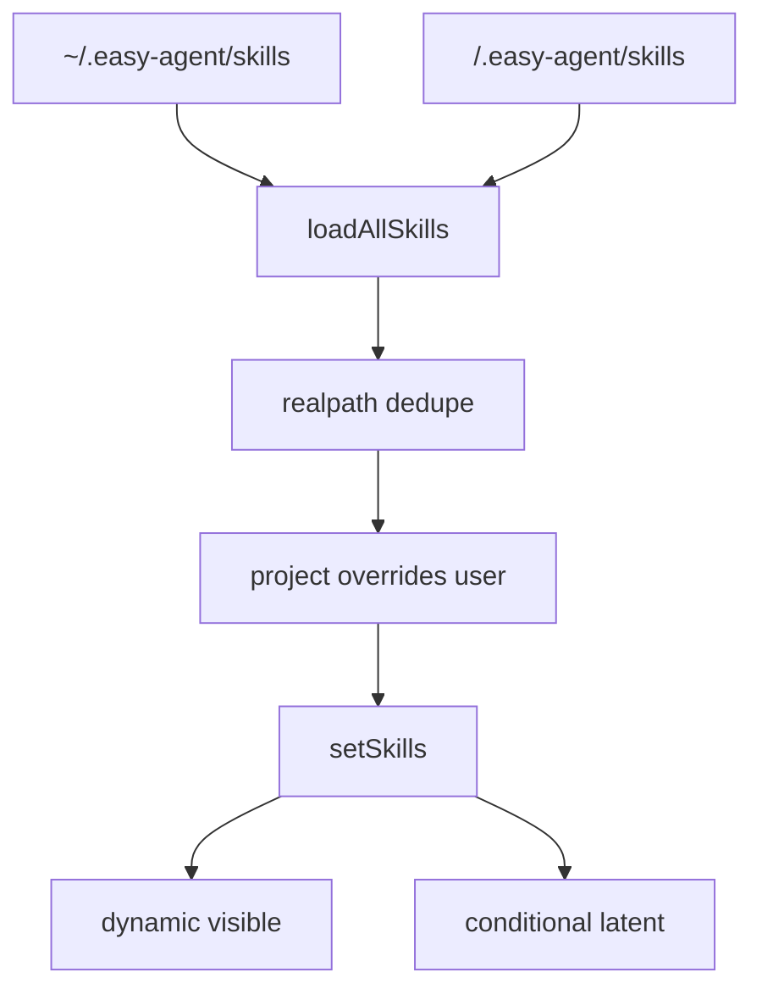
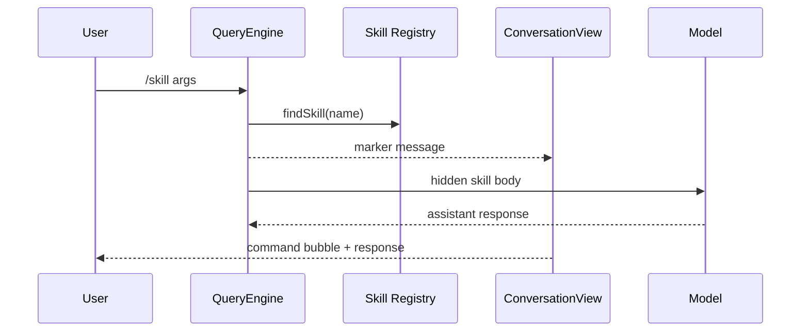

<details>
<summary>相关源文件</summary>

生成本页时使用的主要源文件：

- [src/services/skills/bootstrap.ts](https://github.com/ConardLi/easy-agent/blob/c24463e07dd136d41f6ab28edb33a3eaf0b209c1/src/services/skills/bootstrap.ts)
- [src/services/skills/loadSkillsDir.ts](https://github.com/ConardLi/easy-agent/blob/c24463e07dd136d41f6ab28edb33a3eaf0b209c1/src/services/skills/loadSkillsDir.ts)
- [src/services/skills/parseFrontmatter.ts](https://github.com/ConardLi/easy-agent/blob/c24463e07dd136d41f6ab28edb33a3eaf0b209c1/src/services/skills/parseFrontmatter.ts)
- [src/services/skills/registry.ts](https://github.com/ConardLi/easy-agent/blob/c24463e07dd136d41f6ab28edb33a3eaf0b209c1/src/services/skills/registry.ts)
- [src/services/skills/budget.ts](https://github.com/ConardLi/easy-agent/blob/c24463e07dd136d41f6ab28edb33a3eaf0b209c1/src/services/skills/budget.ts)
- [src/services/skills/conditional.ts](https://github.com/ConardLi/easy-agent/blob/c24463e07dd136d41f6ab28edb33a3eaf0b209c1/src/services/skills/conditional.ts)
- [src/tools/skillTool.ts](https://github.com/ConardLi/easy-agent/blob/c24463e07dd136d41f6ab28edb33a3eaf0b209c1/src/tools/skillTool.ts)
- [src/types/types.ts](https://github.com/ConardLi/easy-agent/blob/c24463e07dd136d41f6ab28edb33a3eaf0b209c1/src/types/types.ts)
- [src/scripts/test-skills.ts](https://github.com/ConardLi/easy-agent/blob/c24463e07dd136d41f6ab28edb33a3eaf0b209c1/src/scripts/test-skills.ts)

</details>

# Skills 系统

Skills 是 Markdown + YAML frontmatter 定义的声明式工作流。Easy Agent 从 user/project 两个 scope 加载 `<skill-name>/SKILL.md`，把可见技能注入 system prompt，并同时支持模型通过 `Skill` 工具调用、用户通过 `/<skill-name>` slash command 调用。  
Sources: [src/types/types.ts:1-12](../../../project-repos/easy-agent/src/types/types.ts#L1-L12), [src/services/skills/loadSkillsDir.ts:1-14](../../../project-repos/easy-agent/src/services/skills/loadSkillsDir.ts#L1-L14), [src/tools/skillTool.ts:1-20](../../../project-repos/easy-agent/src/tools/skillTool.ts#L1-L20), [src/core/queryEngine.ts:178-215](../../../project-repos/easy-agent/src/core/queryEngine.ts#L178-L215)

<details class="source-snippets">
<summary>引用源码</summary>

<!-- source-snippets:start -->

#### `src/types/types.ts:1-12`

```typescript
/**
 * Skill type definitions.
 *
 * A "Skill" is a Markdown file with YAML frontmatter describing a reusable
 * workflow. Compared to a Tool (TypeScript code), a Skill is a *declarative*
 * unit: prompt + permission config. The Skill body becomes a UserMessage at
 * invocation time, instructing the model how to perform a complex task.
 *
 * Stage 17 supports a subset of the source-code frontmatter fields. The full
 * field list (model/effort/context=fork/agent/hooks/shell/...) is parsed but
 * ignored for now — see DEVELOPMENT-PLAN §17.6.1 for the deferral rationale.
 */
```

#### `src/services/skills/loadSkillsDir.ts:1-14`

```typescript
/**
 * Disk skill loader — discovers `<skillsDir>/<skill-name>/SKILL.md` files
 * across the user-global and project-local scopes, parses each one, and
 * dedupes via realpath() so symlink trees don't load the same skill twice.
 *
 * Scopes (precedence: project > user):
 *   1. ~/.easy-agent/skills/             (per-user)
 *   2. <cwd>/.easy-agent/skills/         (per-project)
 *
 * Reference: claude-code-source-code/src/skills/loadSkillsDir.ts
 *   - We mirror getFileIdentity() with `realpath()` for symlink dedupe.
 *   - We DROP the legacy `.md` flat files and the bundled / mcp / remote
 *     loaders — see DEVELOPMENT-PLAN §17.6.1 for the deferral rationale.
 */
```

#### `src/tools/skillTool.ts:1-20`

```typescript
/**
 * SkillTool — the "Skill" tool exposed to the model.
 *
 * Loads a SKILL.md from the registry, performs `$ARGUMENTS` /
 * `${CLAUDE_SKILL_DIR}` / `${CLAUDE_SESSION_ID}` substitution, and returns
 * the resulting prompt as the tool result. The model then reads the result
 * (just like any other tool output) and continues the conversation
 * following the skill's instructions.
 *
 * Side effect: the skill's `allowed-tools` whitelist is appended to the
 * session-allow rules via `context.addSessionAllowRules`, so any tool
 * calls the skill makes during this session don't trigger another permission
 * prompt. Mirrors the source's `contextModifier.alwaysAllowRules` injection.
 *
 * Out of scope for stage 17 (will surface as errors):
 *   - `context: fork`            — needs sub-agent (stage 20+)
 *   - `disable-model-invocation` — model calling a hidden skill is rejected
 *
 * Reference: claude-code-source-code/src/tools/SkillTool/SkillTool.ts
 */
```

#### `src/core/queryEngine.ts:178-215`

```typescript
    if (trimmed.startsWith("/")) {
      // User-invoked skill: `/skill-name [args]`. Resolve the skill against
      // the registry; if it matches, expand into the source's two-message
      // pattern and submit normally. Falls through to handleCommand() for
      // /help, /mcp, /clear, etc. when no skill matches.
      //
      // Source reference (claude-code-source-code/src/utils/processUserInput
      // /processSlashCommand.tsx ~ line 1237 `getMessagesForPromptSlashCommand`):
      //
      //   const messages = [
      //     createUserMessage({ content: metadata }),                  // visible bubble
      //     createUserMessage({ content: skillBody, isMeta: true }),   // hidden, model-only
      //     ...
      //   ]
      //
      // The metadata message wraps `<command-name>/foo</command-name>` +
      // `<command-message>foo</command-message>` + `<command-args>...</...>`
      // tags. The UI's `UserCommandMessage` extracts those tags and renders
      // a styled "❯ /foo args" command bubble that stays in the transcript
      // forever (unlike a transient SystemNotice). The body message is
      // marked `isMeta: true` so the UI hides it from the human view while
      // the model still receives it as a regular user prompt.
      //
      // We don't have an `isMeta` field on `MessageParam`, so we use a
      // string-prefix sentinel ("[skill_invocation:<name>]\n") for the body
      // and the source's exact XML format for the marker — both matched in
      // ConversationView.
      const skillExpansion = this.tryExpandSkillCommand(trimmed);
      if (skillExpansion) {
        const markerMessage: MessageParam = {
          role: "user",
          content: skillExpansion.markerContent,
        };
        this.messages = [...this.messages, markerMessage];
        yield { type: "messages_updated", messages: [...this.messages] };
        return yield* this.submitInternal(skillExpansion.bodyText);
      }
      return yield* this.handleCommand(trimmed);
```

<!-- source-snippets:end -->
</details>
## 加载路径与优先级

当前支持两个目录：`~/.easy-agent/skills/` 和 `<cwd>/.easy-agent/skills/`。加载时用 `realpath()` 去重，project scope 后加载，因此同名 skill 会覆盖 user scope。  
Sources: [src/services/skills/loadSkillsDir.ts:29-39](../../../project-repos/easy-agent/src/services/skills/loadSkillsDir.ts#L29-L39), [src/services/skills/loadSkillsDir.ts:116-147](../../../project-repos/easy-agent/src/services/skills/loadSkillsDir.ts#L116-L147)

<details class="source-snippets">
<summary>引用源码</summary>

<!-- source-snippets:start -->

#### `src/services/skills/loadSkillsDir.ts:29-39`

```typescript
const SKILL_FILE = "SKILL.md";

/** ~/.easy-agent/skills */
export function getUserSkillsDir(): string {
  return getEasyAgentPath("skills");
}

/** <cwd>/.easy-agent/skills */
export function getProjectSkillsDir(cwd: string): string {
  return path.join(getProjectEasyAgentDir(cwd), "skills");
}
```

#### `src/services/skills/loadSkillsDir.ts:116-147`

```typescript
/**
 * Load every skill from user + project scopes, applying:
 *   1. realpath() dedupe (same SKILL.md reachable via two symlinks → one entry)
 *   2. name dedupe with project > user precedence
 *
 * The project scope is loaded second so its entries naturally overwrite
 * user-scope entries with the same `name` in the final Map.
 */
export async function loadAllSkills(cwd: string): Promise<LoadAllSkillsResult> {
  const userDir = getUserSkillsDir();
  const projectDir = getProjectSkillsDir(cwd);

  const [userResult, projectResult] = await Promise.all([
    loadFromOneDir(userDir, "user"),
    loadFromOneDir(projectDir, "project"),
  ]);

  const seenRealPaths = new Set<string>();
  const byName = new Map<string, Skill>();

  for (const skill of [...userResult.skills, ...projectResult.skills]) {
    if (seenRealPaths.has(skill.filePath)) continue; // symlink loop
    seenRealPaths.add(skill.filePath);
    // Project source loaded after user, so this assignment wins on collision.
    byName.set(skill.name, skill);
  }

  return {
    skills: [...byName.values()],
    warnings: [...userResult.warnings, ...projectResult.warnings],
  };
}
```

<!-- source-snippets:end -->
</details>


Sources: [src/services/skills/loadSkillsDir.ts:53-109](../../../project-repos/easy-agent/src/services/skills/loadSkillsDir.ts#L53-L109), [src/services/skills/loadSkillsDir.ts:124-147](../../../project-repos/easy-agent/src/services/skills/loadSkillsDir.ts#L124-L147), [src/services/skills/registry.ts:31-42](../../../project-repos/easy-agent/src/services/skills/registry.ts#L31-L42)

<details class="source-snippets">
<summary>引用源码</summary>

<!-- source-snippets:start -->

#### `src/services/skills/loadSkillsDir.ts:53-109`

```typescript
async function loadFromOneDir(dir: string, source: SkillSource): Promise<LoadedFromDir> {
  let entries: string[];
  try {
    const dirents = await fs.readdir(dir, { withFileTypes: true });
    entries = dirents.filter((d) => d.isDirectory()).map((d) => d.name);
  } catch (error: unknown) {
    const err = error as NodeJS.ErrnoException;
    if (err?.code === "ENOENT") return { skills: [], warnings: [] };
    return { skills: [], warnings: [`Failed to read ${dir}: ${(error as Error).message}`] };
  }

  const out: Skill[] = [];
  const warnings: string[] = [];

  for (const dirName of entries) {
    const skillDir = path.join(dir, dirName);
    const filePath = path.join(skillDir, SKILL_FILE);

    let raw: string;
    try {
      raw = await fs.readFile(filePath, "utf-8");
    } catch (error: unknown) {
      const err = error as NodeJS.ErrnoException;
      if (err?.code !== "ENOENT") {
        warnings.push(`[skills] Skipping ${skillDir}: ${(error as Error).message}`);
      }
      continue;
    }

    const split = splitFrontmatter(raw);
    if (split.parseError) {
      warnings.push(`[skills] Skipping ${dirName}: invalid frontmatter (${split.parseError})`);
      continue;
    }
    const frontmatter = normalizeFrontmatter(split.raw, split.body);

    // Resolve to canonical paths for symlink dedupe (handled by caller).
    const realFile = await fs.realpath(filePath).catch(() => filePath);
    const realDir = await fs.realpath(skillDir).catch(() => skillDir);

    const name = frontmatter.name ?? dirName;
    const description = frontmatter.description ?? extractFallbackDescription(split.body) ?? name;

    out.push({
      name,
      description,
      whenToUse: frontmatter.when_to_use,
      body: split.body,
      filePath: realFile,
      baseDir: realDir,
      source,
      frontmatter,
    });
  }

  return { skills: out, warnings };
}
```

#### `src/services/skills/loadSkillsDir.ts:124-147`

```typescript
export async function loadAllSkills(cwd: string): Promise<LoadAllSkillsResult> {
  const userDir = getUserSkillsDir();
  const projectDir = getProjectSkillsDir(cwd);

  const [userResult, projectResult] = await Promise.all([
    loadFromOneDir(userDir, "user"),
    loadFromOneDir(projectDir, "project"),
  ]);

  const seenRealPaths = new Set<string>();
  const byName = new Map<string, Skill>();

  for (const skill of [...userResult.skills, ...projectResult.skills]) {
    if (seenRealPaths.has(skill.filePath)) continue; // symlink loop
    seenRealPaths.add(skill.filePath);
    // Project source loaded after user, so this assignment wins on collision.
    byName.set(skill.name, skill);
  }

  return {
    skills: [...byName.values()],
    warnings: [...userResult.warnings, ...projectResult.warnings],
  };
}
```

#### `src/services/skills/registry.ts:31-42`

```typescript
export function setSkills(skills: Skill[]): void {
  dynamic.clear();
  conditional.clear();
  for (const skill of skills) {
    if (skill.frontmatter.paths && skill.frontmatter.paths.length > 0) {
      conditional.set(skill.name, skill);
    } else {
      dynamic.set(skill.name, skill);
    }
  }
  initialized = true;
}
```

<!-- source-snippets:end -->
</details>
## Frontmatter 解析

`splitFrontmatter()` 用 YAML parser 解析 `--- ... ---` 块；无 frontmatter 时返回空对象和原 body；YAML 非 mapping 或 parse error 会带 `parseError`，由 loader 警告并跳过。`normalizeFrontmatter()` 归一化 `name`、`description`、`when_to_use`、`allowed-tools`、`argument-hint`、`disable-model-invocation`、`paths` 和 `context: fork`。  
Sources: [src/services/skills/parseFrontmatter.ts:26-57](../../../project-repos/easy-agent/src/services/skills/parseFrontmatter.ts#L26-L57), [src/services/skills/parseFrontmatter.ts:61-146](../../../project-repos/easy-agent/src/services/skills/parseFrontmatter.ts#L61-L146)

<details class="source-snippets">
<summary>引用源码</summary>

<!-- source-snippets:start -->

#### `src/services/skills/parseFrontmatter.ts:26-57`

```typescript
const FRONTMATTER_RE = /^---\r?\n([\s\S]*?)\r?\n---\r?\n?([\s\S]*)$/;

/**
 * Split + parse a SKILL.md document.
 *
 * - Returns `{ raw: {}, body: <whole input> }` when no frontmatter is found.
 * - Never throws — invalid YAML is reported via `parseError` so the loader
 *   can log a warning and skip the skill rather than crashing startup.
 */
export function splitFrontmatter(content: string): FrontmatterSplit {
  const match = content.match(FRONTMATTER_RE);
  if (!match) {
    return { raw: {}, body: content };
  }

  const [, yamlText, body] = match;
  try {
    const parsed = parseYaml(yamlText) as unknown;
    if (parsed && typeof parsed === "object" && !Array.isArray(parsed)) {
      return { raw: parsed as Record<string, unknown>, body };
    }
    // Frontmatter that isn't an object (e.g. `---\nfoo\n---`) is a config
    // bug, not a usable skill. Treat as parse failure so the user notices.
    return { raw: {}, body, parseError: "Frontmatter must be a YAML mapping (key: value)" };
  } catch (error: unknown) {
    return {
      raw: {},
      body,
      parseError: (error as Error).message,
    };
  }
}
```

#### `src/services/skills/parseFrontmatter.ts:61-146`

```typescript
function asString(value: unknown): string | undefined {
  if (typeof value === "string") {
    const trimmed = value.trim();
    return trimmed.length > 0 ? trimmed : undefined;
  }
  if (typeof value === "number" || typeof value === "boolean") {
    return String(value);
  }
  return undefined;
}

function asStringArray(value: unknown): string[] {
  if (Array.isArray(value)) {
    return value
      .map((item) => (typeof item === "string" ? item.trim() : undefined))
      .filter((item): item is string => Boolean(item));
  }
  if (typeof value === "string") {
    // CSV-style: "Read, Grep, Glob" or single value
    return value
      .split(",")
      .map((s) => s.trim())
      .filter(Boolean);
  }
  return [];
}

function asBoolean(value: unknown): boolean {
  if (typeof value === "boolean") return value;
  if (typeof value === "string") {
    const v = value.trim().toLowerCase();
    return v === "true" || v === "yes" || v === "1";
  }
  return false;
}

/**
 * Extract the first non-empty paragraph from a markdown body. Used as a
 * fallback when the SKILL.md frontmatter has no `description`. Strips
 * leading H1/H2 headings so we don't show "# Code Review" as the desc.
 */
export function extractFallbackDescription(body: string): string {
  const lines = body.split(/\r?\n/);
  const buf: string[] = [];
  for (const raw of lines) {
    const line = raw.trim();
    if (!line) {
      if (buf.length > 0) break;
      continue;
    }
    // Skip leading headings — they're redundant with the skill name.
    if (buf.length === 0 && line.startsWith("#")) continue;
    buf.push(line);
  }
  return buf.join(" ").replace(/\s+/g, " ").trim();
}

/**
 * Normalize a raw YAML map into a `SkillFrontmatter`. Caller passes the
 * skill name (= dir name) so we can default-populate the `name` field, and
 * the markdown body so we can derive a fallback description.
 *
 * Unknown / deferred fields (model, effort, hooks, agent, shell, …) are
 * preserved untouched in `frontmatter.raw` so future stages can read them
 * without re-parsing the file.
 */
export function normalizeFrontmatter(
  raw: Record<string, unknown>,
  body: string,
): SkillFrontmatter {
  const allowedTools = asStringArray(raw["allowed-tools"] ?? raw["allowedTools"]);
  const paths = asStringArray(raw["paths"]);
  return {
    name: asString(raw["name"]),
    description: asString(raw["description"]),
    when_to_use: asString(raw["when_to_use"] ?? raw["whenToUse"]),
    allowedTools,
    argumentHint: asString(raw["argument-hint"] ?? raw["argumentHint"]),
    disableModelInvocation: asBoolean(
      raw["disable-model-invocation"] ?? raw["disableModelInvocation"],
    ),
    paths: paths.length > 0 ? paths : undefined,
    hasForkContext: asString(raw["context"]) === "fork",
    raw,
  };
}
```

<!-- source-snippets:end -->
</details>
| 字段 | 行为 |
|------|------|
| `name` | 默认目录名，可覆盖 |
| `description` | 缺失时从正文首段提取 |
| `when_to_use` | 追加到 discovery 描述 |
| `allowed-tools` | 调用 skill 后加入 session allow rules |
| `disable-model-invocation` | 对模型隐藏，但用户仍可 slash 调用 |
| `paths` | 条件 skill，路径命中后才对模型可见 |
| `context: fork` | 当前阶段在 SkillTool 中拒绝，需未来 sub-agent |

Sources: [src/services/skills/loadSkillsDir.ts:82-105](../../../project-repos/easy-agent/src/services/skills/loadSkillsDir.ts#L82-L105), [src/services/skills/parseFrontmatter.ts:97-146](../../../project-repos/easy-agent/src/services/skills/parseFrontmatter.ts#L97-L146), [src/tools/skillTool.ts:108-123](../../../project-repos/easy-agent/src/tools/skillTool.ts#L108-L123)

<details class="source-snippets">
<summary>引用源码</summary>

<!-- source-snippets:start -->

#### `src/services/skills/loadSkillsDir.ts:82-105`

```typescript
    const split = splitFrontmatter(raw);
    if (split.parseError) {
      warnings.push(`[skills] Skipping ${dirName}: invalid frontmatter (${split.parseError})`);
      continue;
    }
    const frontmatter = normalizeFrontmatter(split.raw, split.body);

    // Resolve to canonical paths for symlink dedupe (handled by caller).
    const realFile = await fs.realpath(filePath).catch(() => filePath);
    const realDir = await fs.realpath(skillDir).catch(() => skillDir);

    const name = frontmatter.name ?? dirName;
    const description = frontmatter.description ?? extractFallbackDescription(split.body) ?? name;

    out.push({
      name,
      description,
      whenToUse: frontmatter.when_to_use,
      body: split.body,
      filePath: realFile,
      baseDir: realDir,
      source,
      frontmatter,
    });
```

#### `src/services/skills/parseFrontmatter.ts:97-146`

```typescript
/**
 * Extract the first non-empty paragraph from a markdown body. Used as a
 * fallback when the SKILL.md frontmatter has no `description`. Strips
 * leading H1/H2 headings so we don't show "# Code Review" as the desc.
 */
export function extractFallbackDescription(body: string): string {
  const lines = body.split(/\r?\n/);
  const buf: string[] = [];
  for (const raw of lines) {
    const line = raw.trim();
    if (!line) {
      if (buf.length > 0) break;
      continue;
    }
    // Skip leading headings — they're redundant with the skill name.
    if (buf.length === 0 && line.startsWith("#")) continue;
    buf.push(line);
  }
  return buf.join(" ").replace(/\s+/g, " ").trim();
}

/**
 * Normalize a raw YAML map into a `SkillFrontmatter`. Caller passes the
 * skill name (= dir name) so we can default-populate the `name` field, and
 * the markdown body so we can derive a fallback description.
 *
 * Unknown / deferred fields (model, effort, hooks, agent, shell, …) are
 * preserved untouched in `frontmatter.raw` so future stages can read them
 * without re-parsing the file.
 */
export function normalizeFrontmatter(
  raw: Record<string, unknown>,
  body: string,
): SkillFrontmatter {
  const allowedTools = asStringArray(raw["allowed-tools"] ?? raw["allowedTools"]);
  const paths = asStringArray(raw["paths"]);
  return {
    name: asString(raw["name"]),
    description: asString(raw["description"]),
    when_to_use: asString(raw["when_to_use"] ?? raw["whenToUse"]),
    allowedTools,
    argumentHint: asString(raw["argument-hint"] ?? raw["argumentHint"]),
    disableModelInvocation: asBoolean(
      raw["disable-model-invocation"] ?? raw["disableModelInvocation"],
    ),
    paths: paths.length > 0 ? paths : undefined,
    hasForkContext: asString(raw["context"]) === "fork",
    raw,
  };
}
```

#### `src/tools/skillTool.ts:108-123`

```typescript
    if (skill.frontmatter.disableModelInvocation) {
      return {
        content: `Error: skill "${name}" has disable-model-invocation: true and can only be invoked by the user via /${name}.`,
        isError: true,
      };
    }

    if (skill.frontmatter.hasForkContext) {
      return {
        content:
          `Error: skill "${name}" declares context: fork, which requires sub-agent execution. ` +
          "This is not implemented in Easy Agent's stage 17. Remove `context: fork` from " +
          "the SKILL.md frontmatter to run it inline, or wait for the AgentTool stage.",
        isError: true,
      };
    }
```

<!-- source-snippets:end -->
</details>
## Registry 分层

registry 分成 `dynamic` 和 `conditional` 两个 Map。`getModelVisibleSkills()` 只返回 dynamic 且未设置 `disable-model-invocation` 的技能；`getAllUserInvocableSkills()` 会返回 dynamic + conditional，包括 hidden skills，这解释了为什么用户 slash command 可以调用模型不可见技能。  
Sources: [src/services/skills/registry.ts:1-18](../../../project-repos/easy-agent/src/services/skills/registry.ts#L1-L18), [src/services/skills/registry.ts:31-70](../../../project-repos/easy-agent/src/services/skills/registry.ts#L31-L70)

<details class="source-snippets">
<summary>引用源码</summary>

<!-- source-snippets:start -->

#### `src/services/skills/registry.ts:1-18`

```typescript
/**
 * Skill registry — central in-memory state for loaded skills.
 *
 * Two maps mirror the source code's split between always-on skills and
 * conditionally-activated ones (paths frontmatter):
 *
 *   - `dynamic`     : visible to the model right now. Initial set comes from
 *                     loadAllSkills(); conditional skills are promoted in
 *                     when their paths match touched files.
 *   - `conditional` : declared with `paths` but not yet activated.
 *
 * Two sources of skills (user / project) are merged at load time with
 * project overriding user when names collide. After load the source
 * doesn't matter for execution — it only affects the discovery listing.
 *
 * Reference: claude-code-source-code/src/skills/loadSkillsDir.ts
 * (`getSkillDirCommands` + `activateConditionalSkillsForPaths`).
 */
```

#### `src/services/skills/registry.ts:31-70`

```typescript
export function setSkills(skills: Skill[]): void {
  dynamic.clear();
  conditional.clear();
  for (const skill of skills) {
    if (skill.frontmatter.paths && skill.frontmatter.paths.length > 0) {
      conditional.set(skill.name, skill);
    } else {
      dynamic.set(skill.name, skill);
    }
  }
  initialized = true;
}

/** Has bootstrapSkills() ever been called? Useful for warning suppression. */
export function isSkillsInitialized(): boolean {
  return initialized;
}

/**
 * Skills currently visible to the model — used to build the discovery
 * listing in the system prompt. EXCLUDES `disable-model-invocation` skills.
 */
export function getModelVisibleSkills(): Skill[] {
  return [...dynamic.values()].filter((s) => !s.frontmatter.disableModelInvocation);
}

/**
 * All skills that the user could invoke via `/<name>`, INCLUDING
 * disable-model-invocation ones (the flag only hides from the AI listing,
 * the user can still trigger them) and conditional ones (so users aren't
 * surprised by "command not found" before the file path matches).
 */
export function getAllUserInvocableSkills(): Skill[] {
  return [...dynamic.values(), ...conditional.values()];
}

/** Look up by name across both maps; returns undefined if not loaded. */
export function findSkill(name: string): Skill | undefined {
  return dynamic.get(name) ?? conditional.get(name);
}
```

<!-- source-snippets:end -->
</details>
## System Prompt 预算

Skills discovery block 被包在 `<system-reminder>` 中。预算默认 8000 字符，可由 `EASY_AGENT_SKILL_CHAR_BUDGET` 覆盖；格式化有三档降级：完整描述、均分压缩描述、只列名称。  
Sources: [src/services/skills/budget.ts:1-17](../../../project-repos/easy-agent/src/services/skills/budget.ts#L1-L17), [src/services/skills/budget.ts:25-37](../../../project-repos/easy-agent/src/services/skills/budget.ts#L25-L37), [src/services/skills/budget.ts:58-114](../../../project-repos/easy-agent/src/services/skills/budget.ts#L58-L114), [src/context/systemPrompt.ts:122-137](../../../project-repos/easy-agent/src/context/systemPrompt.ts#L122-L137)

<details class="source-snippets">
<summary>引用源码</summary>

<!-- source-snippets:start -->

#### `src/services/skills/budget.ts:1-17`

```typescript
/**
 * Skill discovery listing — formats the `name + description` of every
 * available skill into a single text block, subject to a character budget
 * so we don't bloat the system prompt on long-skill collections.
 *
 * Reference: claude-code-source-code/src/tools/SkillTool/prompt.ts
 *   - SKILL_BUDGET_CONTEXT_PERCENT = 0.01  (1% of context window)
 *   - MAX_LISTING_DESC_CHARS = 250         (per-skill description cap)
 *   - Three-tier degradation: full → truncated descriptions → names-only
 *
 * Where ours differs from the source:
 *   - No "bundled skill never truncates" privilege (we have no bundled
 *     skills in stage 17 — see DEVELOPMENT-PLAN §17.6.1).
 *   - The budget is in CHARACTERS, not tokens. The source's
 *     `contextWindowTokens × 4 × 1%` heuristic assumes ~4 chars/token, so
 *     our default 8000 chars ≈ 2000 tokens for a 200K-token model.
 */
```

#### `src/services/skills/budget.ts:25-37`

```typescript
/**
 * Compute the character budget. Honours the `EASY_AGENT_SKILL_CHAR_BUDGET`
 * env var so power users can shrink it on smaller-context models without
 * editing source.
 */
export function getSkillCharBudget(): number {
  const envValue = process.env["EASY_AGENT_SKILL_CHAR_BUDGET"];
  if (envValue) {
    const parsed = Number.parseInt(envValue, 10);
    if (Number.isFinite(parsed) && parsed > 0) return parsed;
  }
  return DEFAULT_BUDGET_CHARS;
}
```

#### `src/services/skills/budget.ts:58-114`

```typescript
/**
 * Render the discovery listing under the given char budget.
 *
 * Tier 1: every skill with full description (capped at 250 chars each).
 * Tier 2: shrink each description equally to fit (≥ 20 chars each).
 * Tier 3: name-only fallback.
 *
 * Returns an empty string when there are no skills, so callers can
 * unconditionally concatenate it without producing trailing whitespace.
 */
export function formatSkillsWithinBudget(
  skills: Skill[],
  budget: number = getSkillCharBudget(),
): string {
  if (skills.length === 0) return "";

  const tier1 = skills.map((s) => buildLine(s, MAX_LISTING_DESC_CHARS));
  const tier1Total = tier1.reduce((acc, line) => acc + line.length + 1, 0);
  if (tier1Total <= budget) return tier1.join("\n");

  // Tier 2: distribute remaining budget evenly across skills. We reserve
  // the prefix length (`- name: `) per line, then split what's left.
  const prefixCost = skills.reduce((acc, s) => acc + `- ${s.name}: `.length + 1, 0);
  const descBudget = budget - prefixCost;
  if (descBudget >= skills.length * MIN_DESC_CHARS_PER_SKILL) {
    const perDesc = Math.max(MIN_DESC_CHARS_PER_SKILL, Math.floor(descBudget / skills.length));
    const tier2 = skills.map((s) => buildLine(s, perDesc));
    const tier2Total = tier2.reduce((acc, line) => acc + line.length + 1, 0);
    if (tier2Total <= budget) return tier2.join("\n");
  }

  // Tier 3: names only. No further degradation — at this point we either
  // fit the names or we accept overshoot (unavoidable, the model gets to
  // see the full set). Mirrors source code's "names_only" final tier.
  return skills.map(buildNameOnly).join("\n");
}

/**
 * Build the system-reminder block to inject into every system prompt.
 *
 * Wrapping in `<system-reminder>` tags matches the convention used elsewhere
 * in Claude Code for "ambient" context that should influence the model's
 * planning without being treated as a user instruction.
 */
export function formatSkillsSystemReminder(skills: Skill[]): string {
  if (skills.length === 0) return "";
  const listing = formatSkillsWithinBudget(skills);
  if (!listing) return "";
  return [
    "<system-reminder>",
    "Available skills you can invoke via the `Skill` tool. Each line is `- <name>: <description>`.",
    "Call `Skill(skill=\"<name>\", args=\"<optional args>\")` when the user's request matches one of these.",
    "",
    listing,
    "</system-reminder>",
  ].join("\n");
}
```

#### `src/context/systemPrompt.ts:122-137`

```typescript
  // Skill discovery listing — see skills/budget.ts for the budget logic.
  // Wrapped as a <system-reminder> block (not a top-level instruction) so the
  // model treats it as ambient context that may or may not apply this turn.
  // Conditional skills (frontmatter `paths`) only appear here AFTER they've
  // been promoted in by activateConditionalSkillsForPaths(); see
  // skills/conditional.ts.
  const skillsReminder = formatSkillsSystemReminder(getModelVisibleSkills());

  const dynamicSections = [
    SYSTEM_PROMPT_DYNAMIC_START,
    formatEnvironmentContext(environmentContext),
    agentMdContext ? "Project memory (AGENT.md):\n" + agentMdContext : "",
    memorySections.length > 0 ? memorySections.join("\n\n") : "",
    options.additionalInstructions ? "Session instructions:\n" + options.additionalInstructions : "",
    skillsReminder,
    SYSTEM_PROMPT_DYNAMIC_END,
```

<!-- source-snippets:end -->
</details>
## 条件激活

条件 skills 使用 `paths` frontmatter 和 `ignore` 包的 gitignore 语义匹配。工具调用成功后，`agenticLoop` 会从 Read/Write/Edit/Glob 的输入里提取文件路径，命中后把 skill 从 conditional map 提升到 dynamic map，且激活在当前进程内是单向且 sticky 的。  
Sources: [src/services/skills/conditional.ts:1-15](../../../project-repos/easy-agent/src/services/skills/conditional.ts#L1-L15), [src/services/skills/conditional.ts:32-65](../../../project-repos/easy-agent/src/services/skills/conditional.ts#L32-L65), [src/services/skills/conditional.ts:67-98](../../../project-repos/easy-agent/src/services/skills/conditional.ts#L67-L98), [src/core/agenticLoop.ts:204-213](../../../project-repos/easy-agent/src/core/agenticLoop.ts#L204-L213)

<details class="source-snippets">
<summary>引用源码</summary>

<!-- source-snippets:start -->

#### `src/services/skills/conditional.ts:1-15`

```typescript
/**
 * Conditional skill activation — promotes skills declared with a `paths`
 * frontmatter into the visible skill set when their patterns match a file
 * the agent just touched (Read / Write / Edit / Glob).
 *
 * Reference: claude-code-source-code/src/skills/loadSkillsDir.ts
 *   `activateConditionalSkillsForPaths` — uses gitignore-style matching
 *   via the `ignore` package; we follow the same library + semantics so
 *   patterns authored against Claude Code work unmodified.
 *
 * Activation is one-way and sticky for the lifetime of the process: once a
 * skill activates, it stays in the visible set until restart. This avoids
 * flicker (skill appearing then disappearing as the model navigates files)
 * which would just confuse the model.
 */
```

#### `src/services/skills/conditional.ts:32-65`

```typescript
export function activateConditionalSkillsForPaths(
  filePaths: string[],
  cwd: string,
): string[] {
  if (filePaths.length === 0) return [];
  const candidates = listConditionalSkills();
  if (candidates.length === 0) return [];

  const relativePaths = filePaths
    .map((p) => {
      const abs = path.isAbsolute(p) ? p : path.resolve(cwd, p);
      const rel = path.relative(cwd, abs);
      // The `ignore` package can't match absolute paths or '..' paths.
      // Drop those — conditional skills are intended for in-repo files.
      if (!rel || rel.startsWith("..") || path.isAbsolute(rel)) return null;
      return rel.split(path.sep).join("/");
    })
    .filter((p): p is string => Boolean(p));

  if (relativePaths.length === 0) return [];

  const activated: string[] = [];
  for (const skill of candidates) {
    const patterns = skill.frontmatter.paths;
    if (!patterns || patterns.length === 0) continue;
    const matcher = ignore().add(patterns);
    if (relativePaths.some((p) => matcher.ignores(p))) {
      if (activateConditional(skill.name)) {
        activated.push(skill.name);
      }
    }
  }
  return activated;
}
```

#### `src/services/skills/conditional.ts:67-98`

```typescript
/**
 * Best-effort extractor: pull file-path-shaped fields out of an arbitrary
 * tool input object. We keep this conservative — only well-known fields
 * from Read / Write / Edit / Glob — to avoid false positives that would
 * activate skills against irrelevant inputs.
 */
export function extractToolFilePaths(
  toolName: string,
  input: Record<string, unknown>,
): string[] {
  const paths: string[] = [];
  switch (toolName) {
    case "Read":
    case "Write":
    case "Edit": {
      const fp = input["file_path"];
      if (typeof fp === "string") paths.push(fp);
      break;
    }
    case "Glob": {
      // Glob's `pattern` isn't a file path per se, but the `path` field
      // (the search root) often is, and conditional skills authored for
      // a directory subtree should still trigger.
      const root = input["path"];
      if (typeof root === "string") paths.push(root);
      break;
    }
    default:
      break;
  }
  return paths;
}
```

#### `src/core/agenticLoop.ts:204-213`

```typescript
      // Promote any conditional skills whose `paths` patterns match the
      // file the model just touched. The activation is sticky for the
      // remainder of the session — the new skill will appear in the next
      // system prompt rebuild (next user submit).
      if (!result.isError) {
        const filePaths = extractToolFilePaths(block.name, toolInput);
        if (filePaths.length > 0) {
          activateConditionalSkillsForPaths(filePaths, context.cwd);
        }
      }
```

<!-- source-snippets:end -->
</details>
## Skill 工具与用户 slash 调用

`Skill` 工具会校验 skill name，查 registry，拒绝 hidden-from-model 和 `context: fork`，再替换 `${CLAUDE_SKILL_DIR}`、`${CLAUDE_SESSION_ID}`、`$ARGUMENTS`，把 skill body 作为工具结果返回给模型继续执行。  
Sources: [src/tools/skillTool.ts:31-64](../../../project-repos/easy-agent/src/tools/skillTool.ts#L31-L64), [src/tools/skillTool.ts:90-141](../../../project-repos/easy-agent/src/tools/skillTool.ts#L90-L141)

<details class="source-snippets">
<summary>引用源码</summary>

<!-- source-snippets:start -->

#### `src/tools/skillTool.ts:31-64`

```typescript
const SKILL_NAME_RE = /^[a-zA-Z0-9_-]+$/;

function readInput(input: Record<string, unknown>): SkillInput {
  const skill = typeof input["skill"] === "string" ? input["skill"].trim() : "";
  const args = typeof input["args"] === "string" ? input["args"] : "";
  return { skill, args };
}

/**
 * Apply the three substitution variables documented in DEVELOPMENT-PLAN
 * §17.4. Order matters slightly: we substitute `${CLAUDE_SKILL_DIR}` and
 * `${CLAUDE_SESSION_ID}` BEFORE `$ARGUMENTS` so a literal `$ARGUMENTS`
 * inside an environment variable reference would still work — though in
 * practice that case should never appear.
 */
function substituteVariables(
  body: string,
  skill: Skill,
  args: string,
  sessionId: string,
): string {
  // Posix-style separator on all platforms; matches source `posixifyPath`.
  const dir = skill.baseDir.split(/[\\/]/).join("/");
  return body
    .replaceAll("${CLAUDE_SKILL_DIR}", dir)
    .replaceAll("${CLAUDE_SESSION_ID}", sessionId)
    .replaceAll("$ARGUMENTS", args);
}

function buildPromptText(skill: Skill, args: string, sessionId: string): string {
  const dir = skill.baseDir.split(/[\\/]/).join("/");
  const header = `Base directory for this skill: ${dir}\n\n`;
  return header + substituteVariables(skill.body, skill, args, sessionId);
}
```

#### `src/tools/skillTool.ts:90-141`

```typescript
  async call(input: Record<string, unknown>, context: ToolContext): Promise<ToolResult> {
    const { skill: name, args } = readInput(input);

    if (!name || !SKILL_NAME_RE.test(name)) {
      return {
        content: `Error: invalid skill name. Must match /^[a-zA-Z0-9_-]+$/. Got: ${JSON.stringify(name)}`,
        isError: true,
      };
    }

    const skill = findSkill(name);
    if (!skill) {
      return {
        content: `Error: skill "${name}" not found. Run with --dump-system-prompt to see the available list.`,
        isError: true,
      };
    }

    if (skill.frontmatter.disableModelInvocation) {
      return {
        content: `Error: skill "${name}" has disable-model-invocation: true and can only be invoked by the user via /${name}.`,
        isError: true,
      };
    }

    if (skill.frontmatter.hasForkContext) {
      return {
        content:
          `Error: skill "${name}" declares context: fork, which requires sub-agent execution. ` +
          "This is not implemented in Easy Agent's stage 17. Remove `context: fork` from " +
          "the SKILL.md frontmatter to run it inline, or wait for the AgentTool stage.",
        isError: true,
      };
    }

    // Inject the skill's allowedTools into session-allow rules so subsequent
    // tool calls during this skill don't interrupt the user with permission
    // prompts. We use the same `<ToolName>` rule format as elsewhere.
    if (skill.frontmatter.allowedTools.length > 0 && context.addSessionAllowRules) {
      context.addSessionAllowRules(skill.frontmatter.allowedTools);
    }

    const sessionId = context.sessionId ?? "unknown-session";
    const promptText = buildPromptText(skill, args ?? "", sessionId);

    return {
      content:
        `Loaded skill "${skill.name}" (${skill.source}). ` +
        `Follow the instructions below — they ARE your next steps for this turn.\n\n` +
        promptText,
    };
  },
```

<!-- source-snippets:end -->
</details>
用户 slash 调用走另一条链：`QueryEngine.tryExpandSkillCommand()` 生成可见 command marker 和隐藏 body message；`ConversationView` 隐藏 body，只渲染 command 气泡。  
Sources: [src/core/queryEngine.ts:178-215](../../../project-repos/easy-agent/src/core/queryEngine.ts#L178-L215), [src/core/queryEngine.ts:221-277](../../../project-repos/easy-agent/src/core/queryEngine.ts#L221-L277), [src/ui/components/ConversationView.tsx:15-29](../../../project-repos/easy-agent/src/ui/components/ConversationView.tsx#L15-L29), [src/ui/components/ConversationView.tsx:141-157](../../../project-repos/easy-agent/src/ui/components/ConversationView.tsx#L141-L157)

<details class="source-snippets">
<summary>引用源码</summary>

<!-- source-snippets:start -->

#### `src/core/queryEngine.ts:178-215`

```typescript
    if (trimmed.startsWith("/")) {
      // User-invoked skill: `/skill-name [args]`. Resolve the skill against
      // the registry; if it matches, expand into the source's two-message
      // pattern and submit normally. Falls through to handleCommand() for
      // /help, /mcp, /clear, etc. when no skill matches.
      //
      // Source reference (claude-code-source-code/src/utils/processUserInput
      // /processSlashCommand.tsx ~ line 1237 `getMessagesForPromptSlashCommand`):
      //
      //   const messages = [
      //     createUserMessage({ content: metadata }),                  // visible bubble
      //     createUserMessage({ content: skillBody, isMeta: true }),   // hidden, model-only
      //     ...
      //   ]
      //
      // The metadata message wraps `<command-name>/foo</command-name>` +
      // `<command-message>foo</command-message>` + `<command-args>...</...>`
      // tags. The UI's `UserCommandMessage` extracts those tags and renders
      // a styled "❯ /foo args" command bubble that stays in the transcript
      // forever (unlike a transient SystemNotice). The body message is
      // marked `isMeta: true` so the UI hides it from the human view while
      // the model still receives it as a regular user prompt.
      //
      // We don't have an `isMeta` field on `MessageParam`, so we use a
      // string-prefix sentinel ("[skill_invocation:<name>]\n") for the body
      // and the source's exact XML format for the marker — both matched in
      // ConversationView.
      const skillExpansion = this.tryExpandSkillCommand(trimmed);
      if (skillExpansion) {
        const markerMessage: MessageParam = {
          role: "user",
          content: skillExpansion.markerContent,
        };
        this.messages = [...this.messages, markerMessage];
        yield { type: "messages_updated", messages: [...this.messages] };
        return yield* this.submitInternal(skillExpansion.bodyText);
      }
      return yield* this.handleCommand(trimmed);
```

#### `src/core/queryEngine.ts:221-277`

```typescript
  /**
   * Expand `/skill-name [args]` into the two-message pattern source uses:
   *   - `markerContent` — short XML block consumed by the UI to render a
   *     styled "❯ /skill-name args" command bubble in the transcript.
   *   - `bodyText` — the substituted SKILL.md body that becomes the actual
   *     prompt for the model. Prefixed with `[skill_invocation:<name>]\n`
   *     so the conversation view filters it out (the marker bubble already
   *     tells the user what they ran; rendering the SKILL.md body as a
   *     giant user dump is exactly the UX bug we're fixing).
   *
   * Returns null when the input doesn't match any loaded skill — the caller
   * falls back to the generic /command dispatcher in that case.
   */
  private tryExpandSkillCommand(
    input: string,
  ): { skill: Skill; markerContent: string; bodyText: string } | null {
    const match = input.match(/^\/([a-zA-Z0-9_-]+)(?:\s+(.*))?$/);
    if (!match) return null;
    const [, name, rawArgs] = match;
    const skill = findSkill(name);
    if (!skill) return null;

    const args = rawArgs?.trim() ?? "";
    const dir = skill.baseDir.split(/[\\/]/).join("/");
    const sessionId = this.toolContext.sessionId ?? "unknown-session";

    // Inject allowed-tools into session-allow rules now (the user just
    // explicitly asked for this skill to run — no need to re-prompt for
    // each tool call inside it). Same effect as the SkillTool's
    // contextModifier when the model invokes a skill.
    if (skill.frontmatter.allowedTools.length > 0) {
      this.addSessionAllowRules(skill.frontmatter.allowedTools);
    }

    const body = skill.body
      .replaceAll("${CLAUDE_SKILL_DIR}", dir)
      .replaceAll("${CLAUDE_SESSION_ID}", sessionId)
      .replaceAll("$ARGUMENTS", args);

    // Match `formatCommandInputTags` from source/utils/messages.ts:577.
    // ConversationView's command-bubble renderer parses these exact tags;
    // changing the format here also requires updating extractCommandTag().
    const markerLines = [
      `<command-message>${skill.name}</command-message>`,
      `<command-name>/${skill.name}</command-name>`,
    ];
    if (args) {
      markerLines.push(`<command-args>${args}</command-args>`);
    }
    const markerContent = markerLines.join("\n");

    const header =
      `[skill_invocation:${skill.name}]\n` +
      `Run skill "${skill.name}" with the following instructions. ` +
      `Base directory for this skill: ${dir}.\n\n`;
    return { skill, markerContent, bodyText: header + body };
  }
```

#### `src/ui/components/ConversationView.tsx:15-29`

```tsx
function isInternalMessage(message: MessageParam): boolean {
  const content = typeof message.content === "string" ? message.content : "";
  if (content.startsWith("[CompactBoundary]")) return true;
  if (content.startsWith("This session is being continued from a previous conversation")) return true;
  if (content.startsWith("[plan_mode_attachment]")) return true;
  if (content.startsWith("[plan_mode_exit]")) return true;
  // `/<skill-name>` invocations expand into TWO user messages (mirroring
  // source's processSlashCommand pattern): a visible "command bubble"
  // marker (handled by extractCommandMarker below) and a hidden body
  // tagged with this prefix. The model receives the body as the real
  // prompt, but the user already sees the bubble + the assistant's
  // streaming reply, so the raw SKILL.md dump would just be noise here.
  if (content.startsWith("[skill_invocation:")) return true;
  return false;
}
```

#### `src/ui/components/ConversationView.tsx:141-157`

```tsx
        if (message.role === "user") {
          if (typeof message.content === "string") {
            // Slash-command marker (`<command-name>/skill</command-name>` …):
            // render as a styled "❯ /name args" command bubble. Mirrors
            // source's UserCommandMessage component so users see the same
            // breadcrumb whether the command was a built-in or a skill.
            const marker = extractCommandMarker(message);
            if (marker) {
              const display = `/${marker.name.replace(/^\//, "")}` +
                (marker.args ? ` ${marker.args}` : "");
              return (
                <Box key={`u${index}`} marginTop={1}>
                  <Text color="cyan" dimColor>{"❯ "}</Text>
                  <Text color="cyan">{display}</Text>
                </Box>
              );
            }
```

<!-- source-snippets:end -->
</details>


Sources: [src/core/queryEngine.ts:234-277](../../../project-repos/easy-agent/src/core/queryEngine.ts#L234-L277), [src/ui/components/ConversationView.tsx:31-51](../../../project-repos/easy-agent/src/ui/components/ConversationView.tsx#L31-L51), [src/ui/components/ConversationView.tsx:141-157](../../../project-repos/easy-agent/src/ui/components/ConversationView.tsx#L141-L157)

<details class="source-snippets">
<summary>引用源码</summary>

<!-- source-snippets:start -->

#### `src/core/queryEngine.ts:234-277`

```typescript
  private tryExpandSkillCommand(
    input: string,
  ): { skill: Skill; markerContent: string; bodyText: string } | null {
    const match = input.match(/^\/([a-zA-Z0-9_-]+)(?:\s+(.*))?$/);
    if (!match) return null;
    const [, name, rawArgs] = match;
    const skill = findSkill(name);
    if (!skill) return null;

    const args = rawArgs?.trim() ?? "";
    const dir = skill.baseDir.split(/[\\/]/).join("/");
    const sessionId = this.toolContext.sessionId ?? "unknown-session";

    // Inject allowed-tools into session-allow rules now (the user just
    // explicitly asked for this skill to run — no need to re-prompt for
    // each tool call inside it). Same effect as the SkillTool's
    // contextModifier when the model invokes a skill.
    if (skill.frontmatter.allowedTools.length > 0) {
      this.addSessionAllowRules(skill.frontmatter.allowedTools);
    }

    const body = skill.body
      .replaceAll("${CLAUDE_SKILL_DIR}", dir)
      .replaceAll("${CLAUDE_SESSION_ID}", sessionId)
      .replaceAll("$ARGUMENTS", args);

    // Match `formatCommandInputTags` from source/utils/messages.ts:577.
    // ConversationView's command-bubble renderer parses these exact tags;
    // changing the format here also requires updating extractCommandTag().
    const markerLines = [
      `<command-message>${skill.name}</command-message>`,
      `<command-name>/${skill.name}</command-name>`,
    ];
    if (args) {
      markerLines.push(`<command-args>${args}</command-args>`);
    }
    const markerContent = markerLines.join("\n");

    const header =
      `[skill_invocation:${skill.name}]\n` +
      `Run skill "${skill.name}" with the following instructions. ` +
      `Base directory for this skill: ${dir}.\n\n`;
    return { skill, markerContent, bodyText: header + body };
  }
```

#### `src/ui/components/ConversationView.tsx:31-51`

```tsx
/**
 * Detect a slash-command marker user message and pull the
 * `<command-name>` + `<command-args>` tags out for rendering. Returns null
 * for plain user text. The format mirrors source's `formatCommandInputTags`
 * in claude-code-source-code/src/utils/messages.ts so we stay
 * source-compatible (matters once we add /resume).
 */
function extractCommandMarker(
  message: MessageParam,
): { name: string; args: string } | null {
  if (typeof message.content !== "string") return null;
  const text = message.content;
  if (!text.includes("<command-name>")) return null;
  const nameMatch = text.match(/<command-name>([^<]*)<\/command-name>/);
  if (!nameMatch) return null;
  const argsMatch = text.match(/<command-args>([^<]*)<\/command-args>/);
  return {
    name: nameMatch[1] ?? "",
    args: (argsMatch?.[1] ?? "").trim(),
  };
}
```

#### `src/ui/components/ConversationView.tsx:141-157`

```tsx
        if (message.role === "user") {
          if (typeof message.content === "string") {
            // Slash-command marker (`<command-name>/skill</command-name>` …):
            // render as a styled "❯ /name args" command bubble. Mirrors
            // source's UserCommandMessage component so users see the same
            // breadcrumb whether the command was a built-in or a skill.
            const marker = extractCommandMarker(message);
            if (marker) {
              const display = `/${marker.name.replace(/^\//, "")}` +
                (marker.args ? ` ${marker.args}` : "");
              return (
                <Box key={`u${index}`} marginTop={1}>
                  <Text color="cyan" dimColor>{"❯ "}</Text>
                  <Text color="cyan">{display}</Text>
                </Box>
              );
            }
```

<!-- source-snippets:end -->
</details>
## 源仓库技能包检测

本次分析的 `easy-agent` 源仓库没有 `skills/**/SKILL.md`、`.easy-agent/skills/**/SKILL.md` 或类似技能包目录，因此 DeepWiki 输出不包含 `skills/` 翻译副本。仓库内 `src/scripts/test-skills.ts` 会在运行时创建或期待工作目录下的示例 skills，但它们不是当前 git tracked source tree 的一部分。  
Sources: [src/scripts/test-skills.ts:1-14](../../../project-repos/easy-agent/src/scripts/test-skills.ts#L1-L14), [src/scripts/test-skills.ts:40-84](../../../project-repos/easy-agent/src/scripts/test-skills.ts#L40-L84)

<details class="source-snippets">
<summary>引用源码</summary>

<!-- source-snippets:start -->

#### `src/scripts/test-skills.ts:1-14`

```typescript
#!/usr/bin/env tsx
/**
 * Stage 17 verification script — exercise the Skills subsystem WITHOUT
 * touching the LLM. Lets you validate the file loader, frontmatter
 * parser, registry split (dynamic vs conditional), budget formatter,
 * conditional activation, and SkillTool execution end-to-end against
 * the example skills under `<cwd>/.easy-agent/skills/`.
 *
 * Usage:
 *   cd easy-agent
 *   npx tsx src/scripts/test-skills.ts
 *
 * Exits non-zero if any assertion fails — convenient for CI / manual checks.
 */
```

#### `src/scripts/test-skills.ts:40-84`

```typescript
async function main(): Promise<void> {
  console.log(`\n[1] bootstrapSkills(${cwd})`);
  const result = await bootstrapSkills(cwd);
  console.log(
    `    loaded ${result.skillCount} unconditional + ${result.conditionalCount} conditional skill(s); ${result.warnings.length} warning(s).`,
  );

  console.log("\n[2] Registry split");
  const allUserInvocable = getAllUserInvocableSkills();
  const visibleToModel = getModelVisibleSkills();
  const conditional = listConditionalSkills();
  console.log(`    user-invocable: ${allUserInvocable.map((s) => s.name).join(", ")}`);
  console.log(`    model-visible:  ${visibleToModel.map((s) => s.name).join(", ")}`);
  console.log(`    conditional:    ${conditional.map((s) => s.name).join(", ")}`);

  assert(findSkill("hello-world"), "hello-world skill loaded");
  assert(findSkill("test-reviewer"), "test-reviewer skill loaded (conditional)");
  assert(findSkill("secret-handshake"), "secret-handshake skill loaded (hidden)");

  assert(
    !visibleToModel.some((s) => s.name === "secret-handshake"),
    "secret-handshake is HIDDEN from the model listing (disable-model-invocation: true)",
  );
  assert(
    !visibleToModel.some((s) => s.name === "test-reviewer"),
    "test-reviewer is HIDDEN from the initial model listing (paths gates it)",
  );
  assert(
    visibleToModel.some((s) => s.name === "hello-world"),
    "hello-world IS visible to the model",
  );

  console.log("\n[3] system-reminder formatting (initial)");
  const reminder = formatSkillsSystemReminder(visibleToModel);
  console.log(reminder.split("\n").map((l) => `    ${l}`).join("\n"));
  assert(reminder.includes("hello-world"), "system-reminder mentions hello-world");
  assert(!reminder.includes("test-reviewer"), "system-reminder does NOT mention test-reviewer initially");
  assert(!reminder.includes("secret-handshake"), "system-reminder does NOT mention secret-handshake");

  console.log("\n[4] Conditional activation via file path match");
  const activated = activateConditionalSkillsForPaths(["src/foo.test.ts"], cwd);
  console.log(`    activated: ${activated.join(", ") || "(none)"}`);
  assert(activated.includes("test-reviewer"), "test-reviewer activated by *.test.ts path");
  const reminderAfter = formatSkillsSystemReminder(getModelVisibleSkills());
  assert(reminderAfter.includes("test-reviewer"), "test-reviewer NOW appears in the system-reminder");
```

<!-- source-snippets:end -->
</details>
## 相关页面

- [CLI 与终端 UI](cli-and-ui.md)
- [MCP 集成](mcp-integration.md)
- [上下文、记忆与压缩](context-memory-compaction.md)
