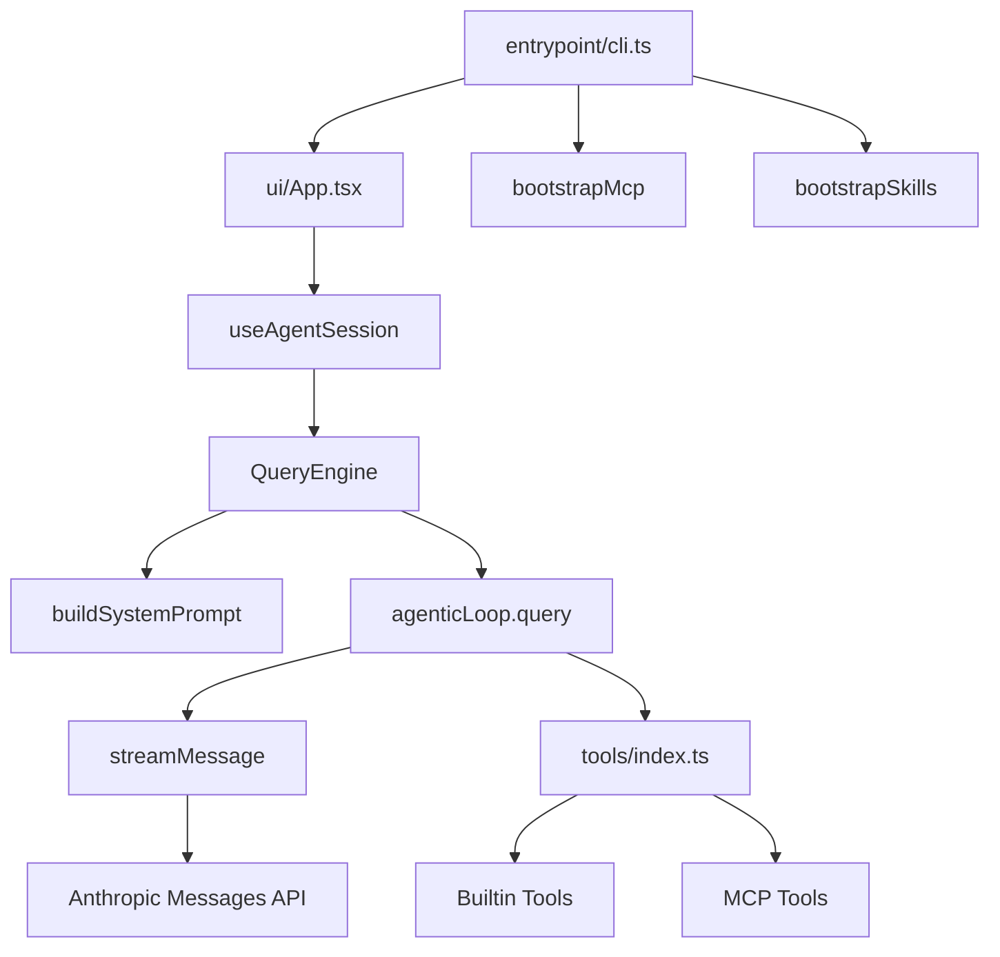

<details>
<summary>相关源文件</summary>

生成本页时使用的主要源文件：

- [README.md](https://github.com/ConardLi/easy-agent/blob/c24463e07dd136d41f6ab28edb33a3eaf0b209c1/README.md)
- [src/entrypoint/cli.ts](https://github.com/ConardLi/easy-agent/blob/c24463e07dd136d41f6ab28edb33a3eaf0b209c1/src/entrypoint/cli.ts)
- [src/ui/App.tsx](https://github.com/ConardLi/easy-agent/blob/c24463e07dd136d41f6ab28edb33a3eaf0b209c1/src/ui/App.tsx)
- [src/core/queryEngine.ts](https://github.com/ConardLi/easy-agent/blob/c24463e07dd136d41f6ab28edb33a3eaf0b209c1/src/core/queryEngine.ts)
- [src/core/agenticLoop.ts](https://github.com/ConardLi/easy-agent/blob/c24463e07dd136d41f6ab28edb33a3eaf0b209c1/src/core/agenticLoop.ts)
- [src/tools/index.ts](https://github.com/ConardLi/easy-agent/blob/c24463e07dd136d41f6ab28edb33a3eaf0b209c1/src/tools/index.ts)
- [src/services/api/streaming.ts](https://github.com/ConardLi/easy-agent/blob/c24463e07dd136d41f6ab28edb33a3eaf0b209c1/src/services/api/streaming.ts)
- [src/context/systemPrompt.ts](https://github.com/ConardLi/easy-agent/blob/c24463e07dd136d41f6ab28edb33a3eaf0b209c1/src/context/systemPrompt.ts)

</details>

# 系统架构

README 把 Easy Agent 描述为五层架构：交互层、编排层、核心 Agentic Loop、工具层、模型通信层。当前 `src/` 实现基本按这个方向落地：CLI 只负责启动和装配，Ink UI 负责终端交互，`QueryEngine` 负责多轮状态和命令，`agenticLoop` 负责单轮推理到工具执行的闭环。  
Sources: [README.md:31-60](../../../project-repos/easy-agent/README.md#L31-L60), [src/entrypoint/cli.ts:105-133](../../../project-repos/easy-agent/src/entrypoint/cli.ts#L105-L133), [src/core/queryEngine.ts:75-102](../../../project-repos/easy-agent/src/core/queryEngine.ts#L75-L102), [src/core/agenticLoop.ts:239-409](../../../project-repos/easy-agent/src/core/agenticLoop.ts#L239-L409)

<details class="source-snippets">
<summary>引用源码</summary>

<!-- source-snippets:start -->

#### `README.md:31-60`

````markdown
## Architecture

Easy Agent is being built around a five-layer architecture:

```text
+---------------------------------------------------+
| 1. Interaction Layer                              |
|    Terminal UI, input handling, rendering         |
+---------------------------------------------------+
| 2. Orchestration Layer                            |
|    Multi-turn session flow, usage, commands       |
+---------------------------------------------------+
| 3. Core Agentic Loop                              |
|    Reason -> tool call -> observe -> continue     |
+---------------------------------------------------+
| 4. Tooling Layer                                  |
|    File, shell, search, and local actions         |
+---------------------------------------------------+
| 5. Model Communication Layer                      |
|    Streaming API communication with LLMs          |
+---------------------------------------------------+
```

This separation makes the system easier to evolve:

- the **communication layer** handles model I/O
- the **tool layer** exposes actionable capabilities
- the **agentic loop** drives single-turn autonomous execution
- the **orchestration layer** manages multi-turn state and control flow
- the **interaction layer** turns the runtime into a usable terminal product
````

#### `src/entrypoint/cli.ts:105-133`

```typescript
  const React = await import("react");
  const { render } = await import("ink");
  const { App } = await import("../ui/App.js");
  const { DEFAULT_MODEL } = await import("../services/api/client.js");
  const { bootstrapMcp } = await import("../services/mcp/bootstrap.js");

  const resolvedModel = model ?? DEFAULT_MODEL;

  // Kick off MCP server connections IN THE BACKGROUND. The bootstrap
  // function seeds `pending` registry entries synchronously, then connects
  // each server in parallel — a slow `npx -y @mcp/server-foo` cold-start
  // (which can take 10–30s on first run while npm downloads the package)
  // would otherwise leave the terminal black, because we wouldn't render
  // the UI until it returned.
  //
  // Trade-off: if the user submits a query before MCP tools land, the
  // model just doesn't see them yet. They'll appear on the next turn.
  // This matches Claude Code's behavior — its `prefetchAllMcpResources`
  // runs inside `useManageMCPConnections` (a React useEffect), so the
  // REPL is interactive from frame 1 too.
  void bootstrapMcp(process.cwd()).catch((error) => {
    console.error(`[easy-agent] MCP bootstrap failed: ${(error as Error).message}`);
  });

  const { waitUntilExit } = render(
    React.createElement(App, { model: resolvedModel, permissionMode, resumeSessionId, shouldResume }),
    { exitOnCtrlC: false },
  );
  await waitUntilExit();
```

#### `src/core/queryEngine.ts:75-102`

```typescript
export class QueryEngine {
  private messages: MessageParam[];
  private totalUsage: Usage;
  private readonly defaultModel: string;
  private sessionModelOverride: string | null = null;
  private readonly toolContext: ToolContext;
  private currentPermissionMode: PermissionMode;
  private prePlanMode: PermissionMode | null = null;
  private readonly permissionSettings?: PermissionSettings;
  private readonly sessionPermissionRules: PermissionRuleSet;
  private readonly onPermissionRequest?: (request: PermissionRequest) => Promise<PermissionDecision>;
  private abortController: AbortController | null = null;
  private usageAnchorIndex: number = -1;
  private lastCallUsage: Usage = { input_tokens: 0, output_tokens: 0 };
  private modeChangeCallback?: (mode: PermissionMode, previousMode: PermissionMode) => void;
  private needsPlanModeExitAttachment = false;

  constructor(options: QueryEngineOptions) {
    this.messages = [...(options.initialMessages ?? [])];
    this.totalUsage = { ...(options.initialUsage ?? createEmptyUsage()) };
    this.usageAnchorIndex = this.messages.length > 0 ? this.messages.length - 1 : -1;
    this.defaultModel = options.model;
    this.toolContext = options.toolContext;
    this.currentPermissionMode = options.permissionMode ?? "default";
    this.permissionSettings = options.permissionSettings;
    this.sessionPermissionRules = options.sessionPermissionRules ?? { allow: [], deny: [] };
    this.onPermissionRequest = options.onPermissionRequest;
  }
```

#### `src/core/agenticLoop.ts:239-409`

```typescript
export async function* query(
  params: QueryParams,
): AsyncGenerator<AgenticLoopEvent, AgenticLoopResult> {
  const maxTurns = params.maxTurns ?? MAX_TOOL_TURNS;
  let state: LoopState = {
    messages: [...params.messages],
    turnCount: 0,
    aborted: false,
  };
  const totalUsage: Usage = {
    input_tokens: 0,
    output_tokens: 0,
  };
  let lastCallUsage: Usage = {
    input_tokens: 0,
    output_tokens: 0,
  };

  while (state.turnCount < maxTurns) {
    if (params.abortSignal?.aborted) {
      const abortedState = { ...state, aborted: true };
      yield { type: "turn_complete", reason: "aborted", turnCount: state.turnCount };
      return { state: abortedState, usage: totalUsage, lastCallUsage, reason: "aborted" };
    }

    const nextTurnCount = state.turnCount + 1;

    // Token budget check before API call (skip first turn — let the API decide)
    if (state.turnCount > 0) {
      const estimatedTokens = tokenCountWithEstimation(state.messages, {
        usage: lastCallUsage.input_tokens > 0 ? lastCallUsage : undefined,
        usageAnchorIndex: lastCallUsage.input_tokens > 0 ? state.messages.length - 1 : undefined,
        systemPrompt: params.systemPrompt,
      });
      const warningState = calculateTokenWarningState(estimatedTokens, params.model);

      if (warningState.state !== "normal") {
        yield { type: "token_warning", warning: warningState };
      }

      if (warningState.state === "blocking") {
        yield {
          type: "error",
          error: new Error(
            `Context window limit reached (${estimatedTokens} tokens estimated, blocking limit ${warningState.blockingLimit}, window ${warningState.contextWindow}). ` +
            `Use /compact to free space.`,
          ),
        };
        yield { type: "turn_complete", reason: "blocking_limit", turnCount: nextTurnCount };
        return { state: { ...state, turnCount: nextTurnCount }, usage: totalUsage, lastCallUsage, reason: "blocking_limit" };
      }
    }

    const currentTools = params.getTools ? params.getTools() : params.tools;
    const stream = streamMessage({
      messages: [...state.messages],
      model: params.model,
      system: params.systemPrompt,
      tools: currentTools && currentTools.length > 0 ? currentTools : undefined,
      signal: params.abortSignal,
    });

    let assistantContent: ContentBlock[] = [];
    let stopReason = "";

    while (true) {
      const { value, done } = await stream.next();
      if (done) {
        const streamResult = value;
        if (!streamResult) {
          yield { type: "turn_complete", reason: "model_error", turnCount: nextTurnCount };
          return {
            state: { ...state, turnCount: nextTurnCount },
            usage: totalUsage,
            lastCallUsage,
            reason: "model_error",
          };
        }

        lastCallUsage = { ...streamResult.usage };
        totalUsage.input_tokens += streamResult.usage.input_tokens;
        totalUsage.output_tokens += streamResult.usage.output_tokens;
        totalUsage.cache_creation_input_tokens =
          (totalUsage.cache_creation_input_tokens ?? 0) + (streamResult.usage.cache_creation_input_tokens ?? 0);
        totalUsage.cache_read_input_tokens =
          (totalUsage.cache_read_input_tokens ?? 0) + (streamResult.usage.cache_read_input_tokens ?? 0);
        assistantContent = streamResult.assistantMessage.content as ContentBlock[];
        stopReason = streamResult.stopReason;
        break;
      }

      switch (value.type) {
        case "text":
          yield value;
          break;
        case "tool_use_start":
          yield value;
          break;
        case "error":
          yield { type: "error", error: value.error };
          yield { type: "turn_complete", reason: "model_error", turnCount: nextTurnCount };
          return {
            state: { ...state, turnCount: nextTurnCount },
            usage: totalUsage,
            lastCallUsage,
            reason: "model_error",
          };
      }
    }

    const assistantMessage: MessageParam = {
      role: "assistant",
      content: assistantContent as any,
    };
    const messagesWithAssistant = [...state.messages, assistantMessage];
    state = {
      messages: messagesWithAssistant,
      turnCount: nextTurnCount,
      aborted: false,
    };
... snippet truncated ...
```

<!-- source-snippets:end -->
</details>
## 分层视图



Sources: [src/entrypoint/cli.ts:69-77](../../../project-repos/easy-agent/src/entrypoint/cli.ts#L69-L77), [src/entrypoint/cli.ts:105-130](../../../project-repos/easy-agent/src/entrypoint/cli.ts#L105-L130), [src/ui/App.tsx:25-109](../../../project-repos/easy-agent/src/ui/App.tsx#L25-L109), [src/core/queryEngine.ts:288-384](../../../project-repos/easy-agent/src/core/queryEngine.ts#L288-L384), [src/core/agenticLoop.ts:292-399](../../../project-repos/easy-agent/src/core/agenticLoop.ts#L292-L399)

<details class="source-snippets">
<summary>引用源码</summary>

<!-- source-snippets:start -->

#### `src/entrypoint/cli.ts:69-77`

```typescript
  // Skills must load BEFORE we render anything (live REPL or
  // --dump-system-prompt), because `buildSystemPrompt` reads the
  // skill registry to inject the <system-reminder> discovery block.
  // If we bootstrap after the dump branch, the dump shows an empty
  // skills section and users assume the feature is broken.
  const { bootstrapSkills } = await import("../services/skills/bootstrap.js");
  await bootstrapSkills(process.cwd()).catch((error) => {
    console.error(`[easy-agent] skills bootstrap failed: ${(error as Error).message}`);
  });
```

#### `src/entrypoint/cli.ts:105-130`

```typescript
  const React = await import("react");
  const { render } = await import("ink");
  const { App } = await import("../ui/App.js");
  const { DEFAULT_MODEL } = await import("../services/api/client.js");
  const { bootstrapMcp } = await import("../services/mcp/bootstrap.js");

  const resolvedModel = model ?? DEFAULT_MODEL;

  // Kick off MCP server connections IN THE BACKGROUND. The bootstrap
  // function seeds `pending` registry entries synchronously, then connects
  // each server in parallel — a slow `npx -y @mcp/server-foo` cold-start
  // (which can take 10–30s on first run while npm downloads the package)
  // would otherwise leave the terminal black, because we wouldn't render
  // the UI until it returned.
  //
  // Trade-off: if the user submits a query before MCP tools land, the
  // model just doesn't see them yet. They'll appear on the next turn.
  // This matches Claude Code's behavior — its `prefetchAllMcpResources`
  // runs inside `useManageMCPConnections` (a React useEffect), so the
  // REPL is interactive from frame 1 too.
  void bootstrapMcp(process.cwd()).catch((error) => {
    console.error(`[easy-agent] MCP bootstrap failed: ${(error as Error).message}`);
  });

  const { waitUntilExit } = render(
    React.createElement(App, { model: resolvedModel, permissionMode, resumeSessionId, shouldResume }),
```

#### `src/ui/App.tsx:25-109`

```tsx
export function App({ model, permissionMode, shouldResume, resumeSessionId }: AppProps): React.ReactNode {
  const { exit } = useApp();
  const { state, actions } = useAgentSession({ model, onExit: exit, permissionMode, shouldResume, resumeSessionId });
  const isPlanExitActive = Boolean(state.permissionPrompt?.isPlanExit);

  // Surface the current in-progress item's activeForm via the global
  // StatusBar spinner. This mirrors source code behavior (Spinner.tsx:
  // `leaderVerb = currentTodo?.activeForm ?? randomVerb`) and keeps the
  // entire app at exactly ONE animation source — adding per-row spinners
  // caused severe flicker because every additional setInterval forces
  // another full terminal repaint cycle on top of streaming text.
  //
  // In task mode we read from the Task graph; in todo mode we keep the
  // V1 source. Either way, the spinner label comes from exactly one
  // place at a time.
  const inProgressTodo = state.todos.find((t) => t.status === "in_progress");
  const inProgressTask = state.tasks.find((t) => t.status === "in_progress");
  const effectiveSpinnerLabel = state.taskMode === "task"
    ? (inProgressTask?.activeForm ?? inProgressTask?.subject ?? state.spinnerLabel)
    : (inProgressTodo?.activeForm ?? state.spinnerLabel);
  // Pull skill `/<name>` commands from the live registry on every render
  // so newly activated conditional skills (e.g. test-reviewer after the
  // model reads a *.test.ts file) appear in the suggestion list without
  // the user having to restart. Computing inline is fine — the registry
  // is an in-memory Map and we only render on existing state changes.
  const skillCommands: CommandSuggestion[] = React.useMemo(
    () =>
      getAllUserInvocableSkills().map((skill) => ({
        name: `/${skill.name}`,
        description:
          skill.description.length > 80
            ? `${skill.description.slice(0, 77)}…`
            : skill.description,
      })),
    // Re-derive whenever the message log grows — that's our cheap proxy
    // for "something happened that may have activated a skill". The list
    // is tiny so the cost is negligible.
    [state.messages.length, state.toolCalls.length],
  );

  const { inputValue, commandSuggestions, modeSuggestions, taskModeSuggestions } = usePromptInput({
    isLoading: state.isLoading,
    hasPermissionPrompt: Boolean(state.permissionPrompt) && !isPlanExitActive,
    isPlanExitPrompt: false,
    permissionMode: state.permissionMode,
    taskMode: state.taskMode,
    extraCommands: skillCommands,
    onSubmit: actions.submit,
    onExit: exit,
    onInterrupt: actions.interrupt,
    onPermissionDecision: actions.resolvePermission,
  });

  return (
    <Box flexDirection="column" paddingX={1}>
      <Box marginBottom={1}>
        <Text bold color="cyan">Easy Agent</Text>
        <Text dimColor> ({state.currentModel})</Text>
      </Box>
      <Text dimColor>Type a message to start. Ctrl+C to interrupt, Ctrl+D to exit.</Text>

      <ConversationView messages={state.messages} />
      {state.taskMode === "task"
        ? <TaskList tasks={state.tasks} />
        : <TodoList todos={state.todos} />}
      <ToolCallList toolCalls={state.toolCalls} />
      <SystemPanel notice={state.systemNotice} />
      <StatusBar
        isLoading={state.isLoading}
        spinnerLabel={effectiveSpinnerLabel}
        streamingText={state.streamingText}
        lastUsage={state.lastUsage}
        permissionPrompt={state.permissionPrompt}
        permissionMode={state.permissionMode}
        onPlanDecision={actions.resolvePermission}
      />
      <InputPrompt isLoading={state.isLoading || Boolean(state.permissionPrompt)} inputValue={inputValue} />
      <CommandSuggestions items={commandSuggestions} />
      <ModeSelector items={modeSuggestions} />
      <ModeSelector
        items={taskModeSuggestions}
        title={`select task system (↑↓ navigate, Enter confirm, 1-${taskModeSuggestions.length || 2} shortcut)`}
      />
    </Box>
  );
```

#### `src/core/queryEngine.ts:288-384`

```typescript
    const previewSystemParts = await buildSystemPrompt({
      cwd: this.toolContext.cwd,
      userQuery: trimmed,
    });
    const previewSystemPrompt = renderSystemPrompt(previewSystemParts);

    // Only run compaction when there's meaningful conversation history
    if (this.messages.length > 0) {
      // Micro-compact old tool results first
      const microResult = await compactMessages(this.messages, undefined, {
        usage: this.lastCallUsage,
        usageAnchorIndex: this.usageAnchorIndex,
        systemPrompt: previewSystemPrompt,
      });
      if (microResult.didMicroCompact || microResult.didCompact) {
        this.messages = [...microResult.messages];
        this.invalidateUsageAnchor();
        yield { type: "messages_updated", messages: [...this.messages] };
        yield {
          type: "compacted",
          summary: microResult.summary,
          trigger: microResult.didCompact ? "auto" : "micro",
        };
      }

      // Auto-compact with circuit breaker if still over threshold
      const { result: autoResult, didAutoCompact } = await autoCompactIfNeeded(
        this.messages,
        this.getActiveModel(),
        {
          usage: this.lastCallUsage,
          usageAnchorIndex: this.usageAnchorIndex,
          systemPrompt: previewSystemPrompt,
        },
      );
      if (didAutoCompact) {
        this.messages = [...autoResult.messages];
        this.invalidateUsageAnchor();
        yield { type: "messages_updated", messages: [...this.messages] };
        yield { type: "compacted", summary: autoResult.summary, trigger: "auto" };
      }

      // Emit token warning if approaching limits
      const estimatedTokens = tokenCountWithEstimation(this.messages, {
        usage: this.lastCallUsage,
        usageAnchorIndex: this.usageAnchorIndex,
        systemPrompt: previewSystemPrompt,
      });
      const warningState = calculateTokenWarningState(estimatedTokens, this.getActiveModel());
      if (warningState.state !== "normal") {
        yield { type: "token_warning", warning: warningState };
      }
    }

    // Inject plan mode attachments as user messages (before user input)
    if (this.currentPermissionMode === "plan") {
      const planAttachment = getPlanModeAttachment(this.messages, getPlanFilePath());
      if (planAttachment) {
        this.messages = [...this.messages, planAttachment];
      }
    } else if (this.needsPlanModeExitAttachment) {
      this.needsPlanModeExitAttachment = false;
      const exists = await checkPlanExists();
      const exitAttachment = getPlanModeExitAttachment(getPlanFilePath(), exists);
      this.messages = [...this.messages, exitAttachment];
    }

    const userMessage: MessageParam = { role: "user", content: trimmed };
    this.messages = [...this.messages, userMessage];
    yield { type: "messages_updated", messages: [...this.messages] };

    const abortController = new AbortController();
    this.abortController = abortController;

    try {
      const systemParts = previewSystemParts;
      const systemPrompt = renderSystemPrompt(systemParts);
      const enrichedToolContext: ToolContext = {
        ...this.toolContext,
        abortSignal: abortController.signal,
        setPermissionMode: (mode: string) => this.setPermissionMode(mode as PermissionMode),
        getPermissionMode: () => this.currentPermissionMode,
        addSessionAllowRules: (rules: string[]) => this.addSessionAllowRules(rules),
      };

      const loop = query({
        messages: [...this.messages],
        systemPrompt,
        getTools: () => getToolsApiParams(this.currentPermissionMode),
        model: this.getActiveModel(),
        abortSignal: abortController.signal,
        toolContext: enrichedToolContext,
        permissionMode: this.currentPermissionMode,
        permissionSettings: this.permissionSettings,
        sessionPermissionRules: this.sessionPermissionRules,
        onPermissionRequest: this.onPermissionRequest,
      });
```

#### `src/core/agenticLoop.ts:292-399`

```typescript
    const currentTools = params.getTools ? params.getTools() : params.tools;
    const stream = streamMessage({
      messages: [...state.messages],
      model: params.model,
      system: params.systemPrompt,
      tools: currentTools && currentTools.length > 0 ? currentTools : undefined,
      signal: params.abortSignal,
    });

    let assistantContent: ContentBlock[] = [];
    let stopReason = "";

    while (true) {
      const { value, done } = await stream.next();
      if (done) {
        const streamResult = value;
        if (!streamResult) {
          yield { type: "turn_complete", reason: "model_error", turnCount: nextTurnCount };
          return {
            state: { ...state, turnCount: nextTurnCount },
            usage: totalUsage,
            lastCallUsage,
            reason: "model_error",
          };
        }

        lastCallUsage = { ...streamResult.usage };
        totalUsage.input_tokens += streamResult.usage.input_tokens;
        totalUsage.output_tokens += streamResult.usage.output_tokens;
        totalUsage.cache_creation_input_tokens =
          (totalUsage.cache_creation_input_tokens ?? 0) + (streamResult.usage.cache_creation_input_tokens ?? 0);
        totalUsage.cache_read_input_tokens =
          (totalUsage.cache_read_input_tokens ?? 0) + (streamResult.usage.cache_read_input_tokens ?? 0);
        assistantContent = streamResult.assistantMessage.content as ContentBlock[];
        stopReason = streamResult.stopReason;
        break;
      }

      switch (value.type) {
        case "text":
          yield value;
          break;
        case "tool_use_start":
          yield value;
          break;
        case "error":
          yield { type: "error", error: value.error };
          yield { type: "turn_complete", reason: "model_error", turnCount: nextTurnCount };
          return {
            state: { ...state, turnCount: nextTurnCount },
            usage: totalUsage,
            lastCallUsage,
            reason: "model_error",
          };
      }
    }

    const assistantMessage: MessageParam = {
      role: "assistant",
      content: assistantContent as any,
    };
    const messagesWithAssistant = [...state.messages, assistantMessage];
    state = {
      messages: messagesWithAssistant,
      turnCount: nextTurnCount,
      aborted: false,
    };
    yield { type: "assistant_message", message: assistantMessage };

    if (stopReason !== "tool_use") {
      yield { type: "turn_complete", reason: "completed", turnCount: state.turnCount };
      return { state, usage: totalUsage, lastCallUsage, reason: "completed" };
    }

    const { toolResultsMessage, executions, permissionRequests } = await runTools(
      assistantContent,
      {
        ...params.toolContext,
        abortSignal: params.abortSignal,
      },
      {
        permissionMode: params.permissionMode,
        permissionSettings: params.permissionSettings,
        sessionPermissionRules: params.sessionPermissionRules,
        onPermissionRequest: params.onPermissionRequest,
      },
    );

    for (const request of permissionRequests) {
      yield { type: "permission_request", request };
    }

    for (const execution of executions) {
      yield {
        type: "tool_use_done",
        id: execution.toolUseId,
        name: execution.toolName,
        input: execution.toolInput,
        result: execution.result,
      };
    }

    state = {
      messages: [...state.messages, toolResultsMessage],
      turnCount: state.turnCount,
      aborted: false,
    };
    yield { type: "tool_result_message", message: toolResultsMessage };
```

<!-- source-snippets:end -->
</details>
## 启动装配

CLI 入口先加载环境变量，再处理 `--version`、`--help`、`--model`、`--resume`、`--plan`、`--auto`、`--permission-mode` 和 `--dump-system-prompt`。Skills 在渲染 system prompt 之前启动，因为 system prompt 会读取 skill registry；MCP 则以 fire-and-forget 的方式后台连接，避免慢 server 启动阻塞首帧 UI。  
Sources: [src/entrypoint/cli.ts:1-20](../../../project-repos/easy-agent/src/entrypoint/cli.ts#L1-L20), [src/entrypoint/cli.ts:22-67](../../../project-repos/easy-agent/src/entrypoint/cli.ts#L22-L67), [src/entrypoint/cli.ts:69-77](../../../project-repos/easy-agent/src/entrypoint/cli.ts#L69-L77), [src/entrypoint/cli.ts:113-127](../../../project-repos/easy-agent/src/entrypoint/cli.ts#L113-L127)

<details class="source-snippets">
<summary>引用源码</summary>

<!-- source-snippets:start -->

#### `src/entrypoint/cli.ts:1-20`

```typescript
#!/usr/bin/env node
import { loadEnv } from "../utils/loadEnv.js";
loadEnv();
import { buildSystemPrompt, renderSystemPrompt } from "../context/systemPrompt.js";
import type { PermissionMode } from "../permissions/permissions.js";

const VERSION = "0.1.0";

function parsePermissionMode(argv: string[]): PermissionMode | undefined {
  if (argv.includes("--auto")) return "auto";
  if (argv.includes("--plan")) return "plan";

  const modeIndex = argv.indexOf("--permission-mode");
  const value = modeIndex !== -1 ? argv[modeIndex + 1] : undefined;
  if (value === "default" || value === "plan" || value === "auto") {
    return value;
  }

  return undefined;
}
```

#### `src/entrypoint/cli.ts:22-67`

```typescript
async function main(): Promise<void> {
  if (process.argv.includes("--version") || process.argv.includes("-v")) {
    console.log("easy-agent v" + VERSION);
    process.exit(0);
  }

  if (process.argv.includes("--help") || process.argv.includes("-h")) {
    console.log(`
easy-agent v${VERSION} — Terminal-native agentic coding system

Usage:
  agent [options]

Options:
  -v, --version               Print version and exit
  -h, --help                  Show this help message
  --model <model>             Override the LLM model
  --resume [session-id]       Resume the latest or a specific session
  --plan                      Start in plan mode (read-only tools only)
  --auto                      Start in auto mode (allow all tools)
  --permission-mode <mode>    Permission mode: default | plan | auto
  --dump-system-prompt        Print the assembled system prompt and exit

Commands (in REPL):
  /help                       Show available commands
  /clear                      Clear conversation history
  /mode [default|plan|auto]   Inspect or switch permission mode
  /tasks [task|todo|reset]    Switch task system or reset the task graph
  /mcp [tools|reconnect <n>]  Inspect or reconnect MCP servers
  /skills                     List loaded skills (user + project scope)
  /<skill-name> [args]        Invoke a skill by name
  /history                    Show session history
  /compact                    Compact conversation context
  /exit, /quit, /bye          Exit the REPL
`);
    process.exit(0);
  }

  const modelIndex = process.argv.indexOf("--model");
  const model = modelIndex !== -1 ? process.argv[modelIndex + 1] : undefined;
  const dumpSystemPrompt = process.argv.includes("--dump-system-prompt");
  const permissionMode = parsePermissionMode(process.argv);
  const resumeIndex = process.argv.indexOf("--resume");
  const resumeValue = resumeIndex !== -1 ? process.argv[resumeIndex + 1] : undefined;
  const resumeSessionId = resumeIndex !== -1 && resumeValue && !resumeValue.startsWith("--") ? resumeValue : null;
  const shouldResume = resumeIndex !== -1;
```

#### `src/entrypoint/cli.ts:69-77`

```typescript
  // Skills must load BEFORE we render anything (live REPL or
  // --dump-system-prompt), because `buildSystemPrompt` reads the
  // skill registry to inject the <system-reminder> discovery block.
  // If we bootstrap after the dump branch, the dump shows an empty
  // skills section and users assume the feature is broken.
  const { bootstrapSkills } = await import("../services/skills/bootstrap.js");
  await bootstrapSkills(process.cwd()).catch((error) => {
    console.error(`[easy-agent] skills bootstrap failed: ${(error as Error).message}`);
  });
```

#### `src/entrypoint/cli.ts:113-127`

```typescript
  // Kick off MCP server connections IN THE BACKGROUND. The bootstrap
  // function seeds `pending` registry entries synchronously, then connects
  // each server in parallel — a slow `npx -y @mcp/server-foo` cold-start
  // (which can take 10–30s on first run while npm downloads the package)
  // would otherwise leave the terminal black, because we wouldn't render
  // the UI until it returned.
  //
  // Trade-off: if the user submits a query before MCP tools land, the
  // model just doesn't see them yet. They'll appear on the next turn.
  // This matches Claude Code's behavior — its `prefetchAllMcpResources`
  // runs inside `useManageMCPConnections` (a React useEffect), so the
  // REPL is interactive from frame 1 too.
  void bootstrapMcp(process.cwd()).catch((error) => {
    console.error(`[easy-agent] MCP bootstrap failed: ${(error as Error).message}`);
  });
```

<!-- source-snippets:end -->
</details>
| 启动步骤 | 代码位置 | 目的 |
|----------|----------|------|
| `loadEnv()` | `src/entrypoint/cli.ts` | 加载 API 相关环境变量 |
| `bootstrapSkills()` | `src/entrypoint/cli.ts` | 让 system prompt 能看到 skills |
| sandbox availability check | `src/entrypoint/cli.ts` | 用户启用 sandbox 但运行时不可用时警告 |
| `bootstrapMcp()` | `src/entrypoint/cli.ts` | 后台连接 MCP server 并注册工具 |
| `render(<App />)` | `src/entrypoint/cli.ts` | 挂载 Ink UI |

Sources: [src/entrypoint/cli.ts:1-3](../../../project-repos/easy-agent/src/entrypoint/cli.ts#L1-L3), [src/entrypoint/cli.ts:69-95](../../../project-repos/easy-agent/src/entrypoint/cli.ts#L69-L95), [src/entrypoint/cli.ts:105-133](../../../project-repos/easy-agent/src/entrypoint/cli.ts#L105-L133)

<details class="source-snippets">
<summary>引用源码</summary>

<!-- source-snippets:start -->

#### `src/entrypoint/cli.ts:1-3`

```typescript
#!/usr/bin/env node
import { loadEnv } from "../utils/loadEnv.js";
loadEnv();
```

#### `src/entrypoint/cli.ts:69-95`

```typescript
  // Skills must load BEFORE we render anything (live REPL or
  // --dump-system-prompt), because `buildSystemPrompt` reads the
  // skill registry to inject the <system-reminder> discovery block.
  // If we bootstrap after the dump branch, the dump shows an empty
  // skills section and users assume the feature is broken.
  const { bootstrapSkills } = await import("../services/skills/bootstrap.js");
  await bootstrapSkills(process.cwd()).catch((error) => {
    console.error(`[easy-agent] skills bootstrap failed: ${(error as Error).message}`);
  });

  // Sandbox availability: if the user opted in via settings.json but
  // the host can't run sandbox-exec, surface the reason loudly. Silent
  // fall-back is a security footgun — users assume protection that
  // isn't there. Mirrors source code's `getSandboxUnavailableReason`.
  try {
    const { loadSandboxSettings, getSandboxUnavailableReason } = await import(
      "../sandbox/index.js"
    );
    const sandboxSettings = await loadSandboxSettings(process.cwd());
    const reason = getSandboxUnavailableReason(sandboxSettings.enabled);
    if (reason) {
      console.warn(`[easy-agent] ⚠ ${reason} Bash commands will run unsandboxed.`);
    }
  } catch {
    // Settings parse errors are surfaced by the permission loader; we
    // don't double-report here.
  }
```

#### `src/entrypoint/cli.ts:105-133`

```typescript
  const React = await import("react");
  const { render } = await import("ink");
  const { App } = await import("../ui/App.js");
  const { DEFAULT_MODEL } = await import("../services/api/client.js");
  const { bootstrapMcp } = await import("../services/mcp/bootstrap.js");

  const resolvedModel = model ?? DEFAULT_MODEL;

  // Kick off MCP server connections IN THE BACKGROUND. The bootstrap
  // function seeds `pending` registry entries synchronously, then connects
  // each server in parallel — a slow `npx -y @mcp/server-foo` cold-start
  // (which can take 10–30s on first run while npm downloads the package)
  // would otherwise leave the terminal black, because we wouldn't render
  // the UI until it returned.
  //
  // Trade-off: if the user submits a query before MCP tools land, the
  // model just doesn't see them yet. They'll appear on the next turn.
  // This matches Claude Code's behavior — its `prefetchAllMcpResources`
  // runs inside `useManageMCPConnections` (a React useEffect), so the
  // REPL is interactive from frame 1 too.
  void bootstrapMcp(process.cwd()).catch((error) => {
    console.error(`[easy-agent] MCP bootstrap failed: ${(error as Error).message}`);
  });

  const { waitUntilExit } = render(
    React.createElement(App, { model: resolvedModel, permissionMode, resumeSessionId, shouldResume }),
    { exitOnCtrlC: false },
  );
  await waitUntilExit();
```

<!-- source-snippets:end -->
</details>
## 编排与核心循环边界

`QueryEngine` 的状态包括 message history、usage、默认模型、会话内模型 override、当前权限模式、session allow rules、AbortController 和 token usage anchor。它会在每个用户提交前重建 system prompt，必要时执行 micro/full compaction，再调用 `agenticLoop.query()`。  
Sources: [src/core/queryEngine.ts:75-102](../../../project-repos/easy-agent/src/core/queryEngine.ts#L75-L102), [src/core/queryEngine.ts:284-340](../../../project-repos/easy-agent/src/core/queryEngine.ts#L284-L340), [src/core/queryEngine.ts:359-384](../../../project-repos/easy-agent/src/core/queryEngine.ts#L359-L384)

<details class="source-snippets">
<summary>引用源码</summary>

<!-- source-snippets:start -->

#### `src/core/queryEngine.ts:75-102`

```typescript
export class QueryEngine {
  private messages: MessageParam[];
  private totalUsage: Usage;
  private readonly defaultModel: string;
  private sessionModelOverride: string | null = null;
  private readonly toolContext: ToolContext;
  private currentPermissionMode: PermissionMode;
  private prePlanMode: PermissionMode | null = null;
  private readonly permissionSettings?: PermissionSettings;
  private readonly sessionPermissionRules: PermissionRuleSet;
  private readonly onPermissionRequest?: (request: PermissionRequest) => Promise<PermissionDecision>;
  private abortController: AbortController | null = null;
  private usageAnchorIndex: number = -1;
  private lastCallUsage: Usage = { input_tokens: 0, output_tokens: 0 };
  private modeChangeCallback?: (mode: PermissionMode, previousMode: PermissionMode) => void;
  private needsPlanModeExitAttachment = false;

  constructor(options: QueryEngineOptions) {
    this.messages = [...(options.initialMessages ?? [])];
    this.totalUsage = { ...(options.initialUsage ?? createEmptyUsage()) };
    this.usageAnchorIndex = this.messages.length > 0 ? this.messages.length - 1 : -1;
    this.defaultModel = options.model;
    this.toolContext = options.toolContext;
    this.currentPermissionMode = options.permissionMode ?? "default";
    this.permissionSettings = options.permissionSettings;
    this.sessionPermissionRules = options.sessionPermissionRules ?? { allow: [], deny: [] };
    this.onPermissionRequest = options.onPermissionRequest;
  }
```

#### `src/core/queryEngine.ts:284-340`

```typescript
  private async *submitInternal(
    trimmed: string,
  ): AsyncGenerator<QueryEngineEvent, { handled: boolean; reason?: LoopTerminationReason }> {

    const previewSystemParts = await buildSystemPrompt({
      cwd: this.toolContext.cwd,
      userQuery: trimmed,
    });
    const previewSystemPrompt = renderSystemPrompt(previewSystemParts);

    // Only run compaction when there's meaningful conversation history
    if (this.messages.length > 0) {
      // Micro-compact old tool results first
      const microResult = await compactMessages(this.messages, undefined, {
        usage: this.lastCallUsage,
        usageAnchorIndex: this.usageAnchorIndex,
        systemPrompt: previewSystemPrompt,
      });
      if (microResult.didMicroCompact || microResult.didCompact) {
        this.messages = [...microResult.messages];
        this.invalidateUsageAnchor();
        yield { type: "messages_updated", messages: [...this.messages] };
        yield {
          type: "compacted",
          summary: microResult.summary,
          trigger: microResult.didCompact ? "auto" : "micro",
        };
      }

      // Auto-compact with circuit breaker if still over threshold
      const { result: autoResult, didAutoCompact } = await autoCompactIfNeeded(
        this.messages,
        this.getActiveModel(),
        {
          usage: this.lastCallUsage,
          usageAnchorIndex: this.usageAnchorIndex,
          systemPrompt: previewSystemPrompt,
        },
      );
      if (didAutoCompact) {
        this.messages = [...autoResult.messages];
        this.invalidateUsageAnchor();
        yield { type: "messages_updated", messages: [...this.messages] };
        yield { type: "compacted", summary: autoResult.summary, trigger: "auto" };
      }

      // Emit token warning if approaching limits
      const estimatedTokens = tokenCountWithEstimation(this.messages, {
        usage: this.lastCallUsage,
        usageAnchorIndex: this.usageAnchorIndex,
        systemPrompt: previewSystemPrompt,
      });
      const warningState = calculateTokenWarningState(estimatedTokens, this.getActiveModel());
      if (warningState.state !== "normal") {
        yield { type: "token_warning", warning: warningState };
      }
    }
```

#### `src/core/queryEngine.ts:359-384`

```typescript
    const abortController = new AbortController();
    this.abortController = abortController;

    try {
      const systemParts = previewSystemParts;
      const systemPrompt = renderSystemPrompt(systemParts);
      const enrichedToolContext: ToolContext = {
        ...this.toolContext,
        abortSignal: abortController.signal,
        setPermissionMode: (mode: string) => this.setPermissionMode(mode as PermissionMode),
        getPermissionMode: () => this.currentPermissionMode,
        addSessionAllowRules: (rules: string[]) => this.addSessionAllowRules(rules),
      };

      const loop = query({
        messages: [...this.messages],
        systemPrompt,
        getTools: () => getToolsApiParams(this.currentPermissionMode),
        model: this.getActiveModel(),
        abortSignal: abortController.signal,
        toolContext: enrichedToolContext,
        permissionMode: this.currentPermissionMode,
        permissionSettings: this.permissionSettings,
        sessionPermissionRules: this.sessionPermissionRules,
        onPermissionRequest: this.onPermissionRequest,
      });
```

<!-- source-snippets:end -->
</details>
`agenticLoop.query()` 是更低层的单轮循环：它用当前 messages 和 tools 发起 streaming 请求，收到 assistant message 后根据 stop reason 判断是否需要执行工具。如果 stop reason 是 `tool_use`，它执行 `runTools()`，把 tool_result 作为 user message 追加回去，然后继续下一轮。  
Sources: [src/core/agenticLoop.ts:239-299](../../../project-repos/easy-agent/src/core/agenticLoop.ts#L239-L299), [src/core/agenticLoop.ts:349-399](../../../project-repos/easy-agent/src/core/agenticLoop.ts#L349-L399)

<details class="source-snippets">
<summary>引用源码</summary>

<!-- source-snippets:start -->

#### `src/core/agenticLoop.ts:239-299`

```typescript
export async function* query(
  params: QueryParams,
): AsyncGenerator<AgenticLoopEvent, AgenticLoopResult> {
  const maxTurns = params.maxTurns ?? MAX_TOOL_TURNS;
  let state: LoopState = {
    messages: [...params.messages],
    turnCount: 0,
    aborted: false,
  };
  const totalUsage: Usage = {
    input_tokens: 0,
    output_tokens: 0,
  };
  let lastCallUsage: Usage = {
    input_tokens: 0,
    output_tokens: 0,
  };

  while (state.turnCount < maxTurns) {
    if (params.abortSignal?.aborted) {
      const abortedState = { ...state, aborted: true };
      yield { type: "turn_complete", reason: "aborted", turnCount: state.turnCount };
      return { state: abortedState, usage: totalUsage, lastCallUsage, reason: "aborted" };
    }

    const nextTurnCount = state.turnCount + 1;

    // Token budget check before API call (skip first turn — let the API decide)
    if (state.turnCount > 0) {
      const estimatedTokens = tokenCountWithEstimation(state.messages, {
        usage: lastCallUsage.input_tokens > 0 ? lastCallUsage : undefined,
        usageAnchorIndex: lastCallUsage.input_tokens > 0 ? state.messages.length - 1 : undefined,
        systemPrompt: params.systemPrompt,
      });
      const warningState = calculateTokenWarningState(estimatedTokens, params.model);

      if (warningState.state !== "normal") {
        yield { type: "token_warning", warning: warningState };
      }

      if (warningState.state === "blocking") {
        yield {
          type: "error",
          error: new Error(
            `Context window limit reached (${estimatedTokens} tokens estimated, blocking limit ${warningState.blockingLimit}, window ${warningState.contextWindow}). ` +
            `Use /compact to free space.`,
          ),
        };
        yield { type: "turn_complete", reason: "blocking_limit", turnCount: nextTurnCount };
        return { state: { ...state, turnCount: nextTurnCount }, usage: totalUsage, lastCallUsage, reason: "blocking_limit" };
      }
    }

    const currentTools = params.getTools ? params.getTools() : params.tools;
    const stream = streamMessage({
      messages: [...state.messages],
      model: params.model,
      system: params.systemPrompt,
      tools: currentTools && currentTools.length > 0 ? currentTools : undefined,
      signal: params.abortSignal,
    });
```

#### `src/core/agenticLoop.ts:349-399`

```typescript
    const assistantMessage: MessageParam = {
      role: "assistant",
      content: assistantContent as any,
    };
    const messagesWithAssistant = [...state.messages, assistantMessage];
    state = {
      messages: messagesWithAssistant,
      turnCount: nextTurnCount,
      aborted: false,
    };
    yield { type: "assistant_message", message: assistantMessage };

    if (stopReason !== "tool_use") {
      yield { type: "turn_complete", reason: "completed", turnCount: state.turnCount };
      return { state, usage: totalUsage, lastCallUsage, reason: "completed" };
    }

    const { toolResultsMessage, executions, permissionRequests } = await runTools(
      assistantContent,
      {
        ...params.toolContext,
        abortSignal: params.abortSignal,
      },
      {
        permissionMode: params.permissionMode,
        permissionSettings: params.permissionSettings,
        sessionPermissionRules: params.sessionPermissionRules,
        onPermissionRequest: params.onPermissionRequest,
      },
    );

    for (const request of permissionRequests) {
      yield { type: "permission_request", request };
    }

    for (const execution of executions) {
      yield {
        type: "tool_use_done",
        id: execution.toolUseId,
        name: execution.toolName,
        input: execution.toolInput,
        result: execution.result,
      };
    }

    state = {
      messages: [...state.messages, toolResultsMessage],
      turnCount: state.turnCount,
      aborted: false,
    };
    yield { type: "tool_result_message", message: toolResultsMessage };
```

<!-- source-snippets:end -->
</details>
```mermaid
sequenceDiagram
  participant U as User
  participant UI as Ink UI
  participant QE as QueryEngine
  participant Loop as AgenticLoop
  participant API as streamMessage
  participant Tools as Tool Registry

  U->>UI: input
  UI->>QE: submitMessage()
  QE->>QE: build prompt / compact
  QE->>Loop: query(messages, tools)
  Loop->>API: stream request
  API-->>Loop: text/tool_use events
  Loop->>Tools: runTools()
  Tools-->>Loop: tool_result
  Loop-->>QE: assistant/tool events
  QE-->>UI: state events
```

Sources: [src/ui/hooks/useAgentSession.ts:474-536](../../../project-repos/easy-agent/src/ui/hooks/useAgentSession.ts#L474-L536), [src/core/queryEngine.ts:373-421](../../../project-repos/easy-agent/src/core/queryEngine.ts#L373-L421), [src/core/agenticLoop.ts:292-399](../../../project-repos/easy-agent/src/core/agenticLoop.ts#L292-L399)

<details class="source-snippets">
<summary>引用源码</summary>

<!-- source-snippets:start -->

#### `src/ui/hooks/useAgentSession.ts:474-536`

```typescript
  const submit = useCallback(async (text: string): Promise<SubmitResult> => {
    if (!text.trim()) {
      return { handled: false };
    }

    const trimmed = text.trim();
    if (trimmed === "/exit" || trimmed === "/quit" || trimmed === "/bye") {
      onExit();
      return { handled: true };
    }

    if (!engineRef.current) {
      setSystemNotice({
        tone: "error",
        title: "QueryEngine is not ready",
        body: "Please wait for initialization to finish.",
      });
      return { handled: true };
    }

    const isSlashCommand = trimmed.startsWith("/");
    // Slash commands fall into two categories that need different UX:
    //   1. *System* commands (/help, /cost, /model, /skills, /mcp, …) —
    //      synchronous, never call the LLM, just print a notice.
    //   2. *Skill* commands (/<skill-name> [args]) — expand into a real
    //      user prompt and engage the full agentic loop, exactly like a
    //      typed chat message.
    // Without this distinction every `/` input was treated as case (1):
    // no spinner, no streaming, no transcript entry — which made skill
    // invocations feel broken even though events were flowing through
    // the engine. Detect skill commands by peeking at the registry here
    // and treat them as LLM-triggering input below.
    const skillCommandName = isSlashCommand
      ? trimmed.slice(1).split(/\s+/, 1)[0]?.toLowerCase() ?? ""
      : "";
    const isSkillCommand =
      isSlashCommand && !!skillCommandName && !!findSkill(skillCommandName);
    const isLlmTriggering = !isSlashCommand || isSkillCommand;

    cancelPendingText();
    setStreamingText("");
    setToolCalls([]);
    setSystemNotice(null);
    if (isLlmTriggering) {
      setLastUsage(null);
      // Persist what the user actually typed (`/hello-world Easy Agent`)
      // rather than the expanded SKILL.md body. The expanded prompt is
      // an internal/wire-only artifact — keeping the transcript clean
      // means /resume replays the same UX the user originally saw.
      await appendTranscriptEntry(toolContext.cwd, sessionIdRef.current, {
        type: "message",
        timestamp: new Date().toISOString(),
        role: "user",
        message: { role: "user", content: trimmed },
      });
    }
    setPermissionPrompt(null);
    const needsLoading = isLlmTriggering || trimmed.startsWith("/compact");
    setIsLoading(needsLoading);
    setSpinnerLabel(trimmed.startsWith("/compact") ? "Compacting" : "Thinking");

    try {
      const run = engineRef.current.submitMessage(trimmed);
```

#### `src/core/queryEngine.ts:373-421`

```typescript
      const loop = query({
        messages: [...this.messages],
        systemPrompt,
        getTools: () => getToolsApiParams(this.currentPermissionMode),
        model: this.getActiveModel(),
        abortSignal: abortController.signal,
        toolContext: enrichedToolContext,
        permissionMode: this.currentPermissionMode,
        permissionSettings: this.permissionSettings,
        sessionPermissionRules: this.sessionPermissionRules,
        onPermissionRequest: this.onPermissionRequest,
      });

      while (true) {
        const { value, done } = await loop.next();
        if (done) {
          this.messages = [...value.state.messages];
          this.totalUsage = {
            input_tokens: this.totalUsage.input_tokens + value.usage.input_tokens,
            output_tokens: this.totalUsage.output_tokens + value.usage.output_tokens,
            cache_creation_input_tokens:
              (this.totalUsage.cache_creation_input_tokens ?? 0) + (value.usage.cache_creation_input_tokens ?? 0),
            cache_read_input_tokens:
              (this.totalUsage.cache_read_input_tokens ?? 0) + (value.usage.cache_read_input_tokens ?? 0),
          };
          this.lastCallUsage = { ...value.lastCallUsage };
          this.usageAnchorIndex = this.messages.length > 0 ? this.messages.length - 1 : -1;
          yield { type: "messages_updated", messages: [...this.messages] };
          yield {
            type: "usage_updated",
            totalUsage: { ...this.totalUsage },
            turnUsage: { ...value.usage },
            lastCallUsage: { ...this.lastCallUsage },
          };
          return { handled: true, reason: value.reason };
        }

        yield value;

        switch (value.type) {
          case "assistant_message":
          case "tool_result_message":
            this.messages = [...this.messages, value.message];
            yield { type: "messages_updated", messages: [...this.messages] };
            break;
          default:
            break;
        }
      }
```

#### `src/core/agenticLoop.ts:292-399`

```typescript
    const currentTools = params.getTools ? params.getTools() : params.tools;
    const stream = streamMessage({
      messages: [...state.messages],
      model: params.model,
      system: params.systemPrompt,
      tools: currentTools && currentTools.length > 0 ? currentTools : undefined,
      signal: params.abortSignal,
    });

    let assistantContent: ContentBlock[] = [];
    let stopReason = "";

    while (true) {
      const { value, done } = await stream.next();
      if (done) {
        const streamResult = value;
        if (!streamResult) {
          yield { type: "turn_complete", reason: "model_error", turnCount: nextTurnCount };
          return {
            state: { ...state, turnCount: nextTurnCount },
            usage: totalUsage,
            lastCallUsage,
            reason: "model_error",
          };
        }

        lastCallUsage = { ...streamResult.usage };
        totalUsage.input_tokens += streamResult.usage.input_tokens;
        totalUsage.output_tokens += streamResult.usage.output_tokens;
        totalUsage.cache_creation_input_tokens =
          (totalUsage.cache_creation_input_tokens ?? 0) + (streamResult.usage.cache_creation_input_tokens ?? 0);
        totalUsage.cache_read_input_tokens =
          (totalUsage.cache_read_input_tokens ?? 0) + (streamResult.usage.cache_read_input_tokens ?? 0);
        assistantContent = streamResult.assistantMessage.content as ContentBlock[];
        stopReason = streamResult.stopReason;
        break;
      }

      switch (value.type) {
        case "text":
          yield value;
          break;
        case "tool_use_start":
          yield value;
          break;
        case "error":
          yield { type: "error", error: value.error };
          yield { type: "turn_complete", reason: "model_error", turnCount: nextTurnCount };
          return {
            state: { ...state, turnCount: nextTurnCount },
            usage: totalUsage,
            lastCallUsage,
            reason: "model_error",
          };
      }
    }

    const assistantMessage: MessageParam = {
      role: "assistant",
      content: assistantContent as any,
    };
    const messagesWithAssistant = [...state.messages, assistantMessage];
    state = {
      messages: messagesWithAssistant,
      turnCount: nextTurnCount,
      aborted: false,
    };
    yield { type: "assistant_message", message: assistantMessage };

    if (stopReason !== "tool_use") {
      yield { type: "turn_complete", reason: "completed", turnCount: state.turnCount };
      return { state, usage: totalUsage, lastCallUsage, reason: "completed" };
    }

    const { toolResultsMessage, executions, permissionRequests } = await runTools(
      assistantContent,
      {
        ...params.toolContext,
        abortSignal: params.abortSignal,
      },
      {
        permissionMode: params.permissionMode,
        permissionSettings: params.permissionSettings,
        sessionPermissionRules: params.sessionPermissionRules,
        onPermissionRequest: params.onPermissionRequest,
      },
    );

    for (const request of permissionRequests) {
      yield { type: "permission_request", request };
    }

    for (const execution of executions) {
      yield {
        type: "tool_use_done",
        id: execution.toolUseId,
        name: execution.toolName,
        input: execution.toolInput,
        result: execution.result,
      };
    }

    state = {
      messages: [...state.messages, toolResultsMessage],
      turnCount: state.turnCount,
      aborted: false,
    };
    yield { type: "tool_result_message", message: toolResultsMessage };
```

<!-- source-snippets:end -->
</details>
## 工具与扩展边界

工具注册表由两部分组成：编译期内置工具数组和运行时 MCP 工具数组。`getAllTools()` 会合并两者并过滤 `isEnabled()`，`getToolsApiParams()` 会根据 plan mode 隐藏 `EnterPlanMode` 或 `ExitPlanMode`，但其他工具的模式限制交给权限层执行。  
Sources: [src/tools/index.ts:30-65](../../../project-repos/easy-agent/src/tools/index.ts#L30-L65), [src/tools/index.ts:71-90](../../../project-repos/easy-agent/src/tools/index.ts#L71-L90)

<details class="source-snippets">
<summary>引用源码</summary>

<!-- source-snippets:start -->

#### `src/tools/index.ts:30-65`

```typescript
const BUILTIN_TOOLS: Tool[] = [
  fileReadTool,
  fileWriteTool,
  fileEditTool,
  globTool,
  grepTool,
  bashTool,
  memoryWriteTool,
  todoWriteTool,
  taskCreateTool,
  taskUpdateTool,
  taskGetTool,
  taskListTool,
  enterPlanModeTool,
  exitPlanModeTool,
  skillTool,
];

let mcpTools: Tool[] = [];

/**
 * Replace the registry of MCP-provided tools. Called once at startup after
 * connecting to all MCP servers, and again after `/mcp reconnect`.
 */
export function registerMcpTools(tools: Tool[]): void {
  mcpTools = [...tools];
}

/** Drop the MCP-provided tools — used before re-registering after reconnect. */
export function clearMcpTools(): void {
  mcpTools = [];
}

export function getAllTools(): Tool[] {
  return [...BUILTIN_TOOLS, ...mcpTools].filter((tool) => tool.isEnabled());
}
```

#### `src/tools/index.ts:71-90`

```typescript
/**
 * Get tool API params with mode-aware Enter/Exit visibility.
 *
 * The model always sees all tools (Write, Edit, Bash, etc.) regardless
 * of mode. Enforcement happens in checkPermission at execution time.
 * Only the plan mode transition tools are toggled:
 * - In plan mode: hide EnterPlanMode, show ExitPlanMode
 * - Outside plan mode: show EnterPlanMode, hide ExitPlanMode
 *
 * MCP tools are always included; their visibility-in-plan is handled by
 * `checkPermission()` reading `tool.isReadOnly()` (which maps to MCP's
 * `annotations.readOnlyHint`).
 */
export function getToolsApiParams(mode?: PermissionMode): Anthropic.Tool[] {
  const tools = getAllTools();
  if (mode === "plan") {
    return tools.filter((t) => t.name !== "EnterPlanMode").map(toolToApiParam);
  }
  return tools.filter((t) => t.name !== "ExitPlanMode").map(toolToApiParam);
}
```

<!-- source-snippets:end -->
</details>
System prompt 动态部分会合并环境、Git 状态、`AGENT.md`、项目 memory、session instructions 和 skills reminder。因此架构上，`context/` 是每轮 prompt 的上下文聚合层，而不是只存静态 prompt 文本。  
Sources: [src/context/systemPrompt.ts:45-72](../../../project-repos/easy-agent/src/context/systemPrompt.ts#L45-L72), [src/context/systemPrompt.ts:95-140](../../../project-repos/easy-agent/src/context/systemPrompt.ts#L95-L140)

<details class="source-snippets">
<summary>引用源码</summary>

<!-- source-snippets:start -->

#### `src/context/systemPrompt.ts:45-72`

```typescript
async function getGitContext(cwd: string): Promise<Pick<RuntimeEnvironmentContext, "gitBranch" | "gitStatus" | "gitRecentCommit">> {
  try {
    const [branchResult, statusResult, logResult] = await Promise.all([
      execFileAsync("git", ["rev-parse", "--abbrev-ref", "HEAD"], { cwd, maxBuffer: 32 * 1024 }),
      execFileAsync("git", ["status", "--short"], { cwd, maxBuffer: 64 * 1024 }),
      execFileAsync("git", ["log", "-1", "--pretty=format:%h %s"], { cwd, maxBuffer: 32 * 1024 }),
    ]);

    const status = statusResult.stdout.trim();
    return {
      gitBranch: branchResult.stdout.trim(),
      gitStatus: status || "clean",
      gitRecentCommit: logResult.stdout.trim() || undefined,
    };
  } catch {
    return {};
  }
}

export async function getRuntimeEnvironmentContext(cwd: string): Promise<RuntimeEnvironmentContext> {
  const git = await getGitContext(cwd);
  return {
    cwd,
    date: new Date().toISOString(),
    os:       os.platform() + " " + os.release() + " (" + os.arch() + ")",
    ...git,
  };
}
```

#### `src/context/systemPrompt.ts:95-140`

```typescript
export async function buildSystemPrompt(options: BuildSystemPromptOptions): Promise<string[]> {
  const ignoreMemory = options.userQuery ? shouldIgnoreMemory(options.userQuery) : false;
  const memoryDir = await ensureMemoryDirExists(options.cwd);
  const [environmentContext, agentMdContext, memoryEntrypoint] = await Promise.all([
    getRuntimeEnvironmentContext(options.cwd),
    loadAgentMdContext(options.cwd),
    ignoreMemory ? Promise.resolve(null) : readMemoryEntrypoint(options.cwd),
  ]);

  const staticSections = [
    SYSTEM_PROMPT_STATIC_START,
    ...getStaticPromptSections(),
    SYSTEM_PROMPT_STATIC_END,
  ];

  const memorySections = [
    ...formatMemorySystemLocation(memoryDir),
    ...buildMemoryPromptInstructions(),
    ...buildMemoryTypeGuidance(),
    ...buildMemoryExclusionGuidance(),
    ...buildMemoryAccessGuidance(),
    ...buildMemoryValidationGuidance(),
    ...buildMemoryPersistenceBoundaryGuidance(),
    ignoreMemory ? "Memory is disabled for this turn because the user asked not to use it." : "",
    memoryEntrypoint ? `Memory index:\n${memoryEntrypoint}` : "",
  ].filter(Boolean);

  // Skill discovery listing — see skills/budget.ts for the budget logic.
  // Wrapped as a <system-reminder> block (not a top-level instruction) so the
  // model treats it as ambient context that may or may not apply this turn.
  // Conditional skills (frontmatter `paths`) only appear here AFTER they've
  // been promoted in by activateConditionalSkillsForPaths(); see
  // skills/conditional.ts.
  const skillsReminder = formatSkillsSystemReminder(getModelVisibleSkills());

  const dynamicSections = [
    SYSTEM_PROMPT_DYNAMIC_START,
    formatEnvironmentContext(environmentContext),
    agentMdContext ? "Project memory (AGENT.md):\n" + agentMdContext : "",
    memorySections.length > 0 ? memorySections.join("\n\n") : "",
    options.additionalInstructions ? "Session instructions:\n" + options.additionalInstructions : "",
    skillsReminder,
    SYSTEM_PROMPT_DYNAMIC_END,
  ].filter(Boolean);

  return [...staticSections, ...dynamicSections];
```

<!-- source-snippets:end -->
</details>
## 关键设计取舍

| 取舍 | 当前实现 |
|------|----------|
| CLI 首帧响应 | MCP 后台启动，registry 先 seed pending |
| 工具权限 | 模型可见工具和执行权限分离，执行时由 `checkPermission()` 判定 |
| Skills | 启动时加载，system prompt 只注入预算内 discovery block |
| 上下文 | 每 turn 重建动态 prompt，并在 token 风险前执行压缩 |
| UI | streaming 文本和工具卡片由 hook 事件驱动，避免核心层依赖 React |

Sources: [src/entrypoint/cli.ts:113-127](../../../project-repos/easy-agent/src/entrypoint/cli.ts#L113-L127), [src/tools/index.ts:71-90](../../../project-repos/easy-agent/src/tools/index.ts#L71-L90), [src/context/systemPrompt.ts:122-137](../../../project-repos/easy-agent/src/context/systemPrompt.ts#L122-L137), [src/core/queryEngine.ts:294-340](../../../project-repos/easy-agent/src/core/queryEngine.ts#L294-L340), [src/ui/hooks/useAgentSession.ts:551-679](../../../project-repos/easy-agent/src/ui/hooks/useAgentSession.ts#L551-L679)

<details class="source-snippets">
<summary>引用源码</summary>

<!-- source-snippets:start -->

#### `src/entrypoint/cli.ts:113-127`

```typescript
  // Kick off MCP server connections IN THE BACKGROUND. The bootstrap
  // function seeds `pending` registry entries synchronously, then connects
  // each server in parallel — a slow `npx -y @mcp/server-foo` cold-start
  // (which can take 10–30s on first run while npm downloads the package)
  // would otherwise leave the terminal black, because we wouldn't render
  // the UI until it returned.
  //
  // Trade-off: if the user submits a query before MCP tools land, the
  // model just doesn't see them yet. They'll appear on the next turn.
  // This matches Claude Code's behavior — its `prefetchAllMcpResources`
  // runs inside `useManageMCPConnections` (a React useEffect), so the
  // REPL is interactive from frame 1 too.
  void bootstrapMcp(process.cwd()).catch((error) => {
    console.error(`[easy-agent] MCP bootstrap failed: ${(error as Error).message}`);
  });
```

#### `src/tools/index.ts:71-90`

```typescript
/**
 * Get tool API params with mode-aware Enter/Exit visibility.
 *
 * The model always sees all tools (Write, Edit, Bash, etc.) regardless
 * of mode. Enforcement happens in checkPermission at execution time.
 * Only the plan mode transition tools are toggled:
 * - In plan mode: hide EnterPlanMode, show ExitPlanMode
 * - Outside plan mode: show EnterPlanMode, hide ExitPlanMode
 *
 * MCP tools are always included; their visibility-in-plan is handled by
 * `checkPermission()` reading `tool.isReadOnly()` (which maps to MCP's
 * `annotations.readOnlyHint`).
 */
export function getToolsApiParams(mode?: PermissionMode): Anthropic.Tool[] {
  const tools = getAllTools();
  if (mode === "plan") {
    return tools.filter((t) => t.name !== "EnterPlanMode").map(toolToApiParam);
  }
  return tools.filter((t) => t.name !== "ExitPlanMode").map(toolToApiParam);
}
```

#### `src/context/systemPrompt.ts:122-137`

```typescript
  // Skill discovery listing — see skills/budget.ts for the budget logic.
  // Wrapped as a <system-reminder> block (not a top-level instruction) so the
  // model treats it as ambient context that may or may not apply this turn.
  // Conditional skills (frontmatter `paths`) only appear here AFTER they've
  // been promoted in by activateConditionalSkillsForPaths(); see
  // skills/conditional.ts.
  const skillsReminder = formatSkillsSystemReminder(getModelVisibleSkills());

  const dynamicSections = [
    SYSTEM_PROMPT_DYNAMIC_START,
    formatEnvironmentContext(environmentContext),
    agentMdContext ? "Project memory (AGENT.md):\n" + agentMdContext : "",
    memorySections.length > 0 ? memorySections.join("\n\n") : "",
    options.additionalInstructions ? "Session instructions:\n" + options.additionalInstructions : "",
    skillsReminder,
    SYSTEM_PROMPT_DYNAMIC_END,
```

#### `src/core/queryEngine.ts:294-340`

```typescript
    // Only run compaction when there's meaningful conversation history
    if (this.messages.length > 0) {
      // Micro-compact old tool results first
      const microResult = await compactMessages(this.messages, undefined, {
        usage: this.lastCallUsage,
        usageAnchorIndex: this.usageAnchorIndex,
        systemPrompt: previewSystemPrompt,
      });
      if (microResult.didMicroCompact || microResult.didCompact) {
        this.messages = [...microResult.messages];
        this.invalidateUsageAnchor();
        yield { type: "messages_updated", messages: [...this.messages] };
        yield {
          type: "compacted",
          summary: microResult.summary,
          trigger: microResult.didCompact ? "auto" : "micro",
        };
      }

      // Auto-compact with circuit breaker if still over threshold
      const { result: autoResult, didAutoCompact } = await autoCompactIfNeeded(
        this.messages,
        this.getActiveModel(),
        {
          usage: this.lastCallUsage,
          usageAnchorIndex: this.usageAnchorIndex,
          systemPrompt: previewSystemPrompt,
        },
      );
      if (didAutoCompact) {
        this.messages = [...autoResult.messages];
        this.invalidateUsageAnchor();
        yield { type: "messages_updated", messages: [...this.messages] };
        yield { type: "compacted", summary: autoResult.summary, trigger: "auto" };
      }

      // Emit token warning if approaching limits
      const estimatedTokens = tokenCountWithEstimation(this.messages, {
        usage: this.lastCallUsage,
        usageAnchorIndex: this.usageAnchorIndex,
        systemPrompt: previewSystemPrompt,
      });
      const warningState = calculateTokenWarningState(estimatedTokens, this.getActiveModel());
      if (warningState.state !== "normal") {
        yield { type: "token_warning", warning: warningState };
      }
    }
```

#### `src/ui/hooks/useAgentSession.ts:551-679`

```typescript
        switch (value.type) {
          case "text":
            // Coalesce rapid SSE chunks into a 30ms window. Without this
            // every chunk forces a full Ink frame repaint, and combined
            // with the TodoList / ToolCallList above it the terminal
            // flickers and refuses to scroll.
            pendingTextRef.current += value.text;
            if (!flushTimerRef.current) {
              flushTimerRef.current = setTimeout(flushPendingText, 30);
            }
            break;
          case "tool_use_start":
            setToolCalls((prev) => [...prev, { id: value.id, name: value.name }]);
            await appendTranscriptEntry(toolContext.cwd, sessionIdRef.current, {
              type: "tool_event",
              timestamp: new Date().toISOString(),
              name: value.name,
              phase: "start",
            });
            break;
          case "permission_request":
            setSpinnerLabel("Waiting for permission");
            setPermissionPrompt({
              toolName: value.request.toolName,
              summary: value.request.summary,
              risk: value.request.risk,
              ruleHint: value.request.ruleHint,
            });
            break;
          case "tool_use_done": {
            const isPlanFileWrite =
              (value.name === "Write" || value.name === "Edit") &&
              value.result.content.includes(getPlansDirectory());
            const inputPreview = formatToolInputPreview(value.input);
            // Strip the model-only <sandbox_violations> tag from the
            // user-visible error message. The tag stays in the tool
            // result that goes back to the model (so it can interpret
            // sandbox denials), but humans see clean stderr only.
            const rawErrorMessage = value.result.isError ? value.result.content : undefined;
            const errorMessage = rawErrorMessage
              ? removeSandboxViolationTags(rawErrorMessage)
              : undefined;
            setToolCalls((prev) =>
              markToolCallComplete(prev, value.id, {
                resultLength: value.result.content.length,
                isError: value.result.isError,
                displayName: isPlanFileWrite ? "Updated plan" : undefined,
                displayHint: isPlanFileWrite ? "/plan to preview" : undefined,
                inputPreview,
                errorMessage,
              }),
            );
            await appendTranscriptEntry(toolContext.cwd, sessionIdRef.current, {
              type: "tool_event",
              timestamp: new Date().toISOString(),
              name: value.name,
              phase: "done",
              resultLength: value.result.content.length,
              isError: value.result.isError,
            });
            break;
          }
          case "assistant_message":
            // The full assistant text is committed to `messages` and will
            // render via ConversationView. Drop any unflushed pending
            // chunk so it can't overwrite the cleared streaming line.
            cancelPendingText();
            setStreamingText("");
            await appendTranscriptEntry(toolContext.cwd, sessionIdRef.current, {
              type: "message",
              timestamp: new Date().toISOString(),
              role: "assistant",
              message: value.message,
            });
            break;
          case "tool_result_message":
            setSpinnerLabel("Thinking");
            setPermissionPrompt(null);
            // Tool results are now committed to `messages` — the cards
            // will render inline in ConversationView from here on, so we
            // drop the live in-flight cards to avoid duplication and, more
            // importantly, to keep the final assistant text rendered
            // BELOW its tool calls (not above them).
            setToolCalls([]);
            await appendTranscriptEntry(toolContext.cwd, sessionIdRef.current, {
              type: "message",
              timestamp: new Date().toISOString(),
              role: "user",
              message: value.message,
            });
            break;
          case "messages_updated":
            setMessages(value.messages);
            break;
          case "usage_updated":
            {
              const engineMessages = engineRef.current?.getState().messages ?? [];
              const usageAnchorIndex = engineMessages.length > 0 ? engineMessages.length - 1 : -1;
              const snapshot = buildTokenBudgetSnapshot(engineMessages, {
                usage: value.lastCallUsage,
                usageAnchorIndex,
              });
              const contextPercent = Math.round((snapshot.estimatedConversationTokens / snapshot.contextWindow) * 100);
              const turnInput = value.turnUsage.input_tokens
                + (value.turnUsage.cache_creation_input_tokens ?? 0)
                + (value.turnUsage.cache_read_input_tokens ?? 0);
              const totalInput = value.totalUsage.input_tokens
                + (value.totalUsage.cache_creation_input_tokens ?? 0)
                + (value.totalUsage.cache_read_input_tokens ?? 0);
              setLastUsage({
                input: turnInput,
                output: value.turnUsage.output_tokens,
                contextTokens: snapshot.estimatedConversationTokens,
                contextPercent,
              });
              setTotalUsage({
                input: totalInput,
                output: value.totalUsage.output_tokens,
                contextTokens: snapshot.estimatedConversationTokens,
                contextPercent,
... snippet truncated ...
```

<!-- source-snippets:end -->
</details>
## 相关页面

- [CLI 与终端 UI](cli-and-ui.md)
- [QueryEngine 与 Agentic Loop](query-engine-agentic-loop.md)
- [工具系统与权限模型](tools-permissions.md)
