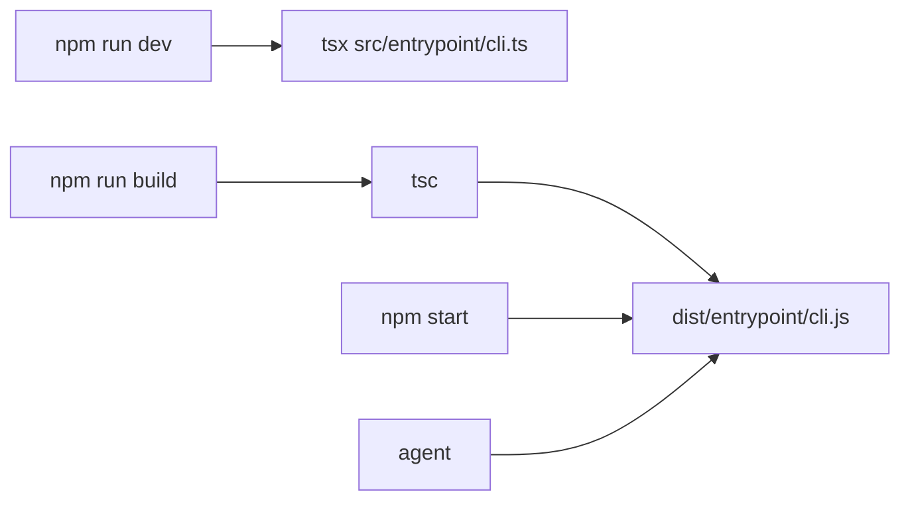

<details>
<summary>相关源文件</summary>

生成本页时使用的主要源文件：

- [README.md](../../../project-repos/easy-agent/README.md)
- [README.zh-CN.md](../../../project-repos/easy-agent/README.zh-CN.md)
- [package.json](../../../project-repos/easy-agent/package.json)
- [tsconfig.json](../../../project-repos/easy-agent/tsconfig.json)
- [src/scripts/test-streaming.ts](../../../project-repos/easy-agent/src/scripts/test-streaming.ts)
- [src/scripts/test-tools.ts](../../../project-repos/easy-agent/src/scripts/test-tools.ts)
- [src/scripts/test-tasks.ts](../../../project-repos/easy-agent/src/scripts/test-tasks.ts)
- [src/scripts/test-mcp.ts](../../../project-repos/easy-agent/src/scripts/test-mcp.ts)
- [src/scripts/test-skills.ts](../../../project-repos/easy-agent/src/scripts/test-skills.ts)
- [src/scripts/test-sandbox.ts](../../../project-repos/easy-agent/src/scripts/test-sandbox.ts)
- [step/step1.js](../../../project-repos/easy-agent/step/step1.js)
- [step/step4.js](../../../project-repos/easy-agent/step/step4.js)
- [step/step8.js](../../../project-repos/easy-agent/step/step8.js)
- [step/step16.js](../../../project-repos/easy-agent/step/step16.js)
- [step/step17.js](../../../project-repos/easy-agent/step/step17.js)
- [step/step18.js](../../../project-repos/easy-agent/step/step18.js)

</details>

# 测试、构建与路线图

Easy Agent 当前更像一个逐阶段重建 Claude Code 类 CLI 的工程教程仓库，而不是稳定产品。质量信号主要来自 TypeScript 构建、专项脚本和 `step/` 里可学习的阶段实现。  
Sources: [README.md:83-121](../../../project-repos/easy-agent/README.md#L83-L121), [README.md:123-135](../../../project-repos/easy-agent/README.md#L123-L135), [package.json:10-20](../../../project-repos/easy-agent/package.json#L10-L20)

<details class="source-snippets">
<summary>引用源码</summary>

<!-- source-snippets:start -->

#### `README.md:83-121`

```markdown
## Roadmap and Progress

The project follows a 30-phase roadmap designed to recreate the full Claude Code-style system progressively.

| Phase | Area | Core Code | Status |
|---|---|---|---:|
| 0 | Project scaffold | `planned in step series` | ✅ Done |
| 1 | LLM communication layer | [`step/step1.js`](./step/step1.js) | ✅ Done |
| 2 | React/Ink terminal UI | [`step/step2.js`](./step/step2.js) | ✅ Done |
| 3 | Tool interface and first tool | [`step/step3.js`](./step/step3.js) | ✅ Done |
| 4 | Core agentic loop | [`step/step4.js`](./step/step4.js) | ✅ Done |
| 5 | Complete core toolset | [`step/step5.js`](./step/step5.js) | ✅ Done |
| 6 | System prompt and context engineering | [`step/step6.js`](./step/step6.js) | ✅ Done |
| 7 | Permission control system | [`step/step7.js`](./step/step7.js) | ✅ Done |
| 8 | QueryEngine multi-turn orchestration | [`step/step8.js`](./step/step8.js) | ✅ Done |
| 9 | Session persistence and restore | [`step/step9.js`](./step/step9.js) | ✅ Done |
| 10 | Project memory system | [`step/step10.js`](./step/step10.js) | ✅ Done |
| 11 | Context compaction | [`step/step11.js`](./step/step11.js) | ✅ Done |
| 12 | Fine-grained token budget management | [`step/step12.js`](./step/step12.js) | ✅ Done |
| 13 | Plan mode | [`step/step13.js`](./step/step13.js) | ✅ Done |
| 14 | TodoWrite session task tracking | [`step/step14.js`](./step/step14.js) | ✅ Done |
| 15 | Task management system (V2) | [`step/step15.js`](./step/step15.js) | ✅ Done |
| 16 | MCP protocol support | [`step/step16.js`](./step/step16.js) | ✅ Done |
| 17 | Skills system | [`step/step17.js`](./step/step17.js) | ✅ Done |
| 18 | Sandbox | [`step/step18.js`](./step/step18.js) | ✅ Done |
| 19 | Sub-agents | `planned` | ⏳ Not started |
| 20 | Custom agent system | `planned` | ⏳ Not started |
| 21 | Multi-agent collaboration | `planned` | ⏳ Not started |
| 22 | Hooks lifecycle system | `planned` | ⏳ Not started |
| 23 | Terminal UI upgrades | `planned in step series` | 🚧 Partial |
| 24 | Configuration system improvements | `planned in step series` | 🚧 Partial |
| 25 | File history and rollback | `planned` | ⏳ Not started |
| 26 | Error handling and resilience | `planned in step series` | 🚧 Partial |
| 27 | Pipe mode / non-interactive execution | `planned` | ⏳ Not started |
| 28 | Auto mode | `planned in step series` | 🚧 Partial |
| 29 | Multi-provider support | `planned in step series` | ⏳ Not started |
| 30 | Packaging, publishing, and documentation | `planned in step series` | 🚧 Partial |

The [`easy-agent/step/`](./step/) directory contains tutorial-friendly milestone code, so each completed chapter is directly learnable and reproducible from a focused single file.
```

#### `README.md:123-135`

```markdown
## What Easy Agent Is — and Is Not

**Easy Agent is:**
- an open-source recreation project
- a systems-engineering effort
- a long-term implementation of a local coding agent
- a public codebase evolving toward a full Claude Code-class CLI

**Easy Agent is not:**
- a one-file demo
- a prompt-only wrapper around an API
- a finished product today
- a public mirror of any private course material
```

#### `package.json:10-20`

```json
  "scripts": {
    "dev": "tsx src/entrypoint/cli.ts",
    "build": "tsc",
    "start": "node dist/entrypoint/cli.js",
    "test:streaming": "tsx src/scripts/test-streaming.ts",
    "test:tasks": "tsx src/scripts/test-tasks.ts",
    "test:mcp": "tsx src/scripts/test-mcp.ts",
    "test:skills": "tsx src/scripts/test-skills.ts",
    "test:sandbox": "tsx src/scripts/test-sandbox.ts",
    "smoke:sandbox": "tsx src/scripts/smoke-sandbox.ts",
    "smoke:bash-sandbox": "tsx src/scripts/smoke-bash-sandbox.ts"
```

<!-- source-snippets:end -->
</details>

## 构建入口

包名是 `easy-agent`，运行时产物入口是 `dist/entrypoint/cli.js`，命令行 bin 名称是 `agent`。项目使用 ESM、TypeScript、React/Ink、Anthropic SDK、MCP SDK、proper-lockfile 和 yaml。  
Sources: [package.json:1-9](../../../project-repos/easy-agent/package.json#L1-L9), [package.json:29-46](../../../project-repos/easy-agent/package.json#L29-L46)

<details class="source-snippets">
<summary>引用源码</summary>

<!-- source-snippets:start -->

#### `package.json:1-9`

```json
{
  "name": "easy-agent",
  "version": "0.1.0",
  "description": "A terminal-native agentic coding system",
  "type": "module",
  "main": "dist/entrypoint/cli.js",
  "bin": {
    "agent": "dist/entrypoint/cli.js"
  },
```

#### `package.json:29-46`

```json
  "devDependencies": {
    "@types/node": "^25.5.2",
    "@types/proper-lockfile": "^4.1.4",
    "@types/react": "^19.2.14",
    "tsx": "^4.21.0",
    "typescript": "^6.0.2"
  },
  "dependencies": {
    "@anthropic-ai/sdk": "^0.85.0",
    "@modelcontextprotocol/sdk": "^1.29.0",
    "chalk": "^5.6.2",
    "dotenv": "^17.4.1",
    "ignore": "^7.0.5",
    "ink": "^7.0.0",
    "proper-lockfile": "^4.1.2",
    "react": "^19.2.4",
    "yaml": "^2.8.3"
  }
```

<!-- source-snippets:end -->
</details>

`npm run dev` 直接用 `tsx src/entrypoint/cli.ts`，`npm run build` 调 `tsc`，`npm start` 运行构建后的 CLI。README 要求 Node.js、npm 和 Anthropic-compatible model access，并列出 `ANTHROPIC_MODEL`、`ANTHROPIC_BASE_URL`、`ANTHROPIC_AUTH_TOKEN`。  
Sources: [package.json:10-20](../../../project-repos/easy-agent/package.json#L10-L20), [README.md:137-180](../../../project-repos/easy-agent/README.md#L137-L180)

<details class="source-snippets">
<summary>引用源码</summary>

<!-- source-snippets:start -->

#### `package.json:10-20`

```json
  "scripts": {
    "dev": "tsx src/entrypoint/cli.ts",
    "build": "tsc",
    "start": "node dist/entrypoint/cli.js",
    "test:streaming": "tsx src/scripts/test-streaming.ts",
    "test:tasks": "tsx src/scripts/test-tasks.ts",
    "test:mcp": "tsx src/scripts/test-mcp.ts",
    "test:skills": "tsx src/scripts/test-skills.ts",
    "test:sandbox": "tsx src/scripts/test-sandbox.ts",
    "smoke:sandbox": "tsx src/scripts/smoke-sandbox.ts",
    "smoke:bash-sandbox": "tsx src/scripts/smoke-bash-sandbox.ts"
```

#### `README.md:137-180`

````markdown
## Getting Started

### Requirements

- Node.js
- npm
- Anthropic-compatible model access

### Environment Variables

Easy Agent currently supports the following environment variables:

- `ANTHROPIC_MODEL` — default model name
- `ANTHROPIC_BASE_URL` — custom API base URL
- `ANTHROPIC_AUTH_TOKEN` — API authentication token

### Install

```bash
npm install
```

### Development

```bash
npm run dev
```

### Build

```bash
npm run build
npm start
```

### Example CLI Options

```bash
agent --help
agent --model claude-sonnet-4-20250514
agent --plan
agent --auto
agent --dump-system-prompt
```
````

<!-- source-snippets:end -->
</details>

`tsconfig.json` 目标是 ES2022 与 NodeNext module resolution，开启 strict、source map、declaration、JSX React，并把源码从 `src` 输出到 `dist`。  
Sources: [tsconfig.json:2-20](../../../project-repos/easy-agent/tsconfig.json#L2-L20)

<details class="source-snippets">
<summary>引用源码</summary>

<!-- source-snippets:start -->

#### `tsconfig.json:2-20`

```json
  "compilerOptions": {
    "target": "ES2022",
    "module": "NodeNext",
    "moduleResolution": "NodeNext",
    "outDir": "dist",
    "rootDir": "src",
    "strict": true,
    "jsx": "react-jsx",
    "esModuleInterop": true,
    "allowSyntheticDefaultImports": true,
    "resolveJsonModule": true,
    "skipLibCheck": true,
    "types": ["node"],
    "declaration": true,
    "declarationMap": true,
    "sourceMap": true
  },
  "include": ["src/**/*.ts", "src/**/*.tsx"],
  "exclude": ["node_modules", "dist"]
```

<!-- source-snippets:end -->
</details>



Sources: [package.json:6-20](../../../project-repos/easy-agent/package.json#L6-L20)

<details class="source-snippets">
<summary>引用源码</summary>

<!-- source-snippets:start -->

#### `package.json:6-20`

```json
  "main": "dist/entrypoint/cli.js",
  "bin": {
    "agent": "dist/entrypoint/cli.js"
  },
  "scripts": {
    "dev": "tsx src/entrypoint/cli.ts",
    "build": "tsc",
    "start": "node dist/entrypoint/cli.js",
    "test:streaming": "tsx src/scripts/test-streaming.ts",
    "test:tasks": "tsx src/scripts/test-tasks.ts",
    "test:mcp": "tsx src/scripts/test-mcp.ts",
    "test:skills": "tsx src/scripts/test-skills.ts",
    "test:sandbox": "tsx src/scripts/test-sandbox.ts",
    "smoke:sandbox": "tsx src/scripts/smoke-sandbox.ts",
    "smoke:bash-sandbox": "tsx src/scripts/smoke-bash-sandbox.ts"
```

<!-- source-snippets:end -->
</details>

## 专项测试脚本

`test:streaming` 校验环境加载、API key、streaming 生命周期和事件输出，适合作为模型通信层的 smoke test。它会真实访问 Anthropic-compatible endpoint，因此依赖环境变量。  
Sources: [src/scripts/test-streaming.ts:5-14](../../../project-repos/easy-agent/src/scripts/test-streaming.ts#L5-L14), [src/scripts/test-streaming.ts:20-41](../../../project-repos/easy-agent/src/scripts/test-streaming.ts#L20-L41), [src/scripts/test-streaming.ts:43-100](../../../project-repos/easy-agent/src/scripts/test-streaming.ts#L43-L100)

<details class="source-snippets">
<summary>引用源码</summary>

<!-- source-snippets:start -->

#### `src/scripts/test-streaming.ts:5-14`

```typescript
 * Phase 1 verification script — Test LLM API streaming communication.
 *
 * Usage:
 *   ANTHROPIC_AUTH_TOKEN=sk-ant-... npx tsx src/scripts/test-streaming.ts
 *
 * Verifies:
 *   1. API connection works
 *   2. Streaming output displays character-by-character
 *   3. Token usage is correctly reported
 */
```

#### `src/scripts/test-streaming.ts:20-41`

```typescript
async function main(): Promise<void> {
  // ── Pre-flight check ──────────────────────────────────────────
  if (!process.env.ANTHROPIC_AUTH_TOKEN) {
    console.error(
      "\x1b[31m✗ ANTHROPIC_AUTH_TOKEN is not set.\x1b[0m\n" +
      "  Export it first:\n" +
      "  export ANTHROPIC_AUTH_TOKEN=sk-ant-...\n"
    );
    process.exit(1);
  }

  const userMessage = "用一句话介绍你自己，然后用三句话解释什么是 Agentic Loop。";

  console.log(`\x1b[90m── Model: ${DEFAULT_MODEL}\x1b[0m`);
  console.log(`\x1b[90m── User:  ${userMessage}\x1b[0m\n`);
  console.log("\x1b[36m▎ Assistant:\x1b[0m");

  // ── Stream the response ───────────────────────────────────────
  const generator = streamMessage({
    messages: [{ role: "user", content: userMessage }],
    system: "You are a helpful assistant. Reply concisely in Chinese.",
  });
```

#### `src/scripts/test-streaming.ts:43-100`

```typescript
  let result;
  while (true) {
    const { value, done } = await generator.next();
    if (done) {
      result = value; // StreamResult from the generator return
      break;
    }

    const event = value as StreamEvent;

    switch (event.type) {
      case "text":
        // Write text deltas directly to stdout — the "typewriter effect"
        process.stdout.write(event.text);
        break;

      case "message_start":
        // Could show a spinner here later
        break;

      case "message_done":
        // Newline after streaming text
        console.log("\n");
        console.log("\x1b[90m── Stream complete ──\x1b[0m");
        console.log(`   Stop reason:   ${event.stopReason}`);
        console.log(`   Input tokens:  ${event.usage.input_tokens}`);
        console.log(`   Output tokens: ${event.usage.output_tokens}`);
        break;

      case "error":
        console.error(`\n\x1b[31m✗ Stream error: ${event.error.message}\x1b[0m`);
        process.exit(1);
    }
  }

  // ── Also show the return value ────────────────────────────────
  if (result) {
    console.log(`\n\x1b[90m── Assembled result ──\x1b[0m`);
    console.log(`   Stop reason:   ${result.stopReason}`);
    console.log(`   Total input:   ${result.usage.input_tokens} tokens`);
    console.log(`   Total output:  ${result.usage.output_tokens} tokens`);
    console.log(
      `   Content blocks: ${result.assistantMessage.content.length}`,
    );

    // Show block types
    if (Array.isArray(result.assistantMessage.content)) {
      for (const block of result.assistantMessage.content) {
        if (block.type === "text") {
          console.log(`   [text] ${block.text.slice(0, 80)}...`);
        } else if (block.type === "tool_use") {
          console.log(`   [tool_use] ${block.name}(${JSON.stringify(block.input)})`);
        }
      }
    }
  }

  console.log("\n\x1b[32m✓ Phase 1 verification passed!\x1b[0m");
```

<!-- source-snippets:end -->
</details>

`test:tools` 覆盖工具 registry、Read 工具读取、offset/limit、缺失文件错误和 API 参数转换。  
Sources: [src/scripts/test-tools.ts:5-13](../../../project-repos/easy-agent/src/scripts/test-tools.ts#L5-L13), [src/scripts/test-tools.ts:20-80](../../../project-repos/easy-agent/src/scripts/test-tools.ts#L20-L80)

<details class="source-snippets">
<summary>引用源码</summary>

<!-- source-snippets:start -->

#### `src/scripts/test-tools.ts:5-13`

```typescript
 * Phase 3 verification script — Test tool interface and FileReadTool.
 *
 * Tests:
 *   1. Tool registry works (getAllTools, findToolByName)
 *   2. FileReadTool can read a file with line numbers
 *   3. FileReadTool handles offset/limit
 *   4. FileReadTool handles errors (missing file)
 *   5. Tools convert to API parameter format
 */
```

#### `src/scripts/test-tools.ts:20-80`

```typescript
async function main() {
  console.log("── Phase 3: Tool Interface Verification ──\n");

  // 1. Registry
  const tools = getAllTools();
  console.log(`✓ getAllTools() returned ${tools.length} tool(s): [${tools.map(t => t.name).join(", ")}]`);

  const readTool = findToolByName("Read");
  if (!readTool) {
    console.error("✗ findToolByName('Read') returned undefined");
    process.exit(1);
  }
  console.log(`✓ findToolByName('Read') → ${readTool.name}`);
  console.log(`  isReadOnly: ${readTool.isReadOnly()}, isEnabled: ${readTool.isEnabled()}`);

  // 2. Read package.json
  console.log("\n── Test: Read package.json ──\n");
  const result = await readTool.call({ file_path: "package.json" }, ctx);
  if (result.isError) {
    console.error(`✗ Error reading package.json: ${result.content}`);
    process.exit(1);
  }
  const lines = result.content.split("\n");
  console.log(`✓ Read package.json (${lines.length} output lines)`);
  // Show first 5 lines
  for (const line of lines.slice(0, 6)) {
    console.log(`  ${line}`);
  }
  console.log("  ...");

  // 3. Read with offset/limit
  console.log("\n── Test: Read with offset=3, limit=5 ──\n");
  const partial = await readTool.call({ file_path: "package.json", offset: 3, limit: 5 }, ctx);
  if (partial.isError) {
    console.error(`✗ Error: ${partial.content}`);
    process.exit(1);
  }
  console.log(`✓ Partial read:`);
  for (const line of partial.content.split("\n").slice(0, 7)) {
    console.log(`  ${line}`);
  }

  // 4. Error handling — missing file
  console.log("\n── Test: Read non-existent file ──\n");
  const missing = await readTool.call({ file_path: "does-not-exist.txt" }, ctx);
  if (!missing.isError) {
    console.error("✗ Expected isError=true for missing file");
    process.exit(1);
  }
  console.log(`✓ Correctly returned error: ${missing.content.split("\n")[0]}`);

  // 5. API params format
  console.log("\n── Test: API parameter conversion ──\n");
  const apiParams = getToolsApiParams();
  console.log(`✓ getToolsApiParams() returned ${apiParams.length} tool(s)`);
  for (const p of apiParams) {
    console.log(`  - ${p.name}: ${p.description?.slice(0, 60)}...`);
    console.log(`    input_schema.properties: [${Object.keys(p.input_schema.properties ?? {}).join(", ")}]`);
  }

  console.log("\n✓ Phase 3 tool verification passed!\n");
```

<!-- source-snippets:end -->
</details>

`test:tasks` 覆盖 Task V2 的 create/get/list/update、依赖级联、delete cascade、reset 和 high water mark 保留。  
Sources: [src/scripts/test-tasks.ts:1-8](../../../project-repos/easy-agent/src/scripts/test-tasks.ts#L1-L8), [src/scripts/test-tasks.ts:33-110](../../../project-repos/easy-agent/src/scripts/test-tasks.ts#L33-L110)

<details class="source-snippets">
<summary>引用源码</summary>

<!-- source-snippets:start -->

#### `src/scripts/test-tasks.ts:1-8`

```typescript
/**
 * Smoke test for Task V2 store.
 *
 *   npm run test:tasks
 *
 * Covers: create, get, list, update, dependency cascade, delete cascade,
 * reset + high water mark persistence.
 */
```

#### `src/scripts/test-tasks.ts:33-110`

```typescript
async function main(): Promise<void> {
  console.log(`Task list dir: ${getTasksDir(TASK_LIST_ID)}`);

  // 1. Create 3 tasks.
  const id1 = await createTask(TASK_LIST_ID, {
    subject: "Plan the work",
    description: "Decide what to do",
    status: "pending",
    blocks: [],
    blockedBy: [],
  });
  const id2 = await createTask(TASK_LIST_ID, {
    subject: "Do the work",
    description: "Actually implement",
    activeForm: "Doing the work",
    status: "pending",
    blocks: [],
    blockedBy: [],
  });
  const id3 = await createTask(TASK_LIST_ID, {
    subject: "Verify",
    description: "Run tests",
    status: "pending",
    blocks: [],
    blockedBy: [],
  });
  assert(id1 === "1" && id2 === "2" && id3 === "3", "ids are 1/2/3 sequential");

  // 2. Wire dependencies: #1 blocks #2 blocks #3.
  await blockTask(TASK_LIST_ID, id1, id2);
  await blockTask(TASK_LIST_ID, id2, id3);

  let all = await listTasks(TASK_LIST_ID);
  const t1 = all.find((t) => t.id === id1)!;
  const t2 = all.find((t) => t.id === id2)!;
  const t3 = all.find((t) => t.id === id3)!;
  assert(t1.blocks.includes(id2) && t2.blockedBy.includes(id1), "bidirectional #1→#2");
  assert(t2.blocks.includes(id3) && t3.blockedBy.includes(id2), "bidirectional #2→#3");

  // 3. isReady picks only the root.
  assert(isReady(t1, all) && !isReady(t2, all) && !isReady(t3, all), "only #1 is ready");

  // 4. Complete #1 — #2 becomes ready.
  await updateTask(TASK_LIST_ID, id1, { status: "completed" });
  all = await listTasks(TASK_LIST_ID);
  const t2After = all.find((t) => t.id === id2)!;
  assert(isReady(t2After, all), "#2 ready after #1 completes");

  // 5. Delete #2 — cascade removes it from #1.blocks and #3.blockedBy.
  await deleteTask(TASK_LIST_ID, id2);
  all = await listTasks(TASK_LIST_ID);
  const t1After = all.find((t) => t.id === id1)!;
  const t3After = all.find((t) => t.id === id3)!;
  assert(!t1After.blocks.includes(id2), "#1.blocks cleaned");
  assert(!t3After.blockedBy.includes(id2), "#3.blockedBy cleaned");

  // 6. Reset preserves the high water mark — new task gets id #4, not #2.
  await resetTaskList(TASK_LIST_ID);
  const all2 = await listTasks(TASK_LIST_ID);
  assert(all2.length === 0, "reset clears tasks");
  const newId = await createTask(TASK_LIST_ID, {
    subject: "Post-reset",
    description: "x",
    status: "pending",
    blocks: [],
    blockedBy: [],
  });
  assert(newId === "4", "next id is 4 (HWM respected)");
  const check = await getTask(TASK_LIST_ID, newId);
  assert(check?.subject === "Post-reset", "new task readable");

  // 7. Cleanup
  await resetTaskList(TASK_LIST_ID);
  const final = await listTasks(TASK_LIST_ID);
  assert(final.length === 0, "cleanup reset empty");

  console.log("\nAll task store checks passed.");
}
```

<!-- source-snippets:end -->
</details>

`test:mcp` 覆盖 MCP config validation、工具名归一化、连接注册和 stdio/http/sse 相关行为；`test:skills` 覆盖 frontmatter、skills 加载、registry 和 skill tool；`test:sandbox` 覆盖 sandbox 决策与 profile 生成。  
Sources: [src/scripts/test-mcp.ts:1-22](../../../project-repos/easy-agent/src/scripts/test-mcp.ts#L1-L22), [src/scripts/test-mcp.ts:72-142](../../../project-repos/easy-agent/src/scripts/test-mcp.ts#L72-L142), [src/scripts/test-mcp.ts:144-338](../../../project-repos/easy-agent/src/scripts/test-mcp.ts#L144-L338), [src/scripts/test-skills.ts:1-14](../../../project-repos/easy-agent/src/scripts/test-skills.ts#L1-L14), [src/scripts/test-skills.ts:40-150](../../../project-repos/easy-agent/src/scripts/test-skills.ts#L40-L150), [src/scripts/test-sandbox.ts:1-14](../../../project-repos/easy-agent/src/scripts/test-sandbox.ts#L1-L14), [src/scripts/test-sandbox.ts:69-347](../../../project-repos/easy-agent/src/scripts/test-sandbox.ts#L69-L347)

<details class="source-snippets">
<summary>引用源码</summary>

<!-- source-snippets:start -->

#### `src/scripts/test-mcp.ts:1-22`

```typescript
#!/usr/bin/env tsx
/**
 * Stage 16 verification — Smoke test the MCP integration end-to-end.
 *
 * What it covers:
 *   1. normalize / build / parse MCP tool names
 *   2. Schema validation rejects bad configs
 *   3. Connect to a real stdio MCP server (a tiny inline server we ship here)
 *   4. tools/list discovery
 *   5. tools/call execution
 *   6. /mcp registry surface
 *   7. Reconnect drops + re-establishes the connection
 *   8. Cleanup terminates the child process
 *
 * Run: npm run test:mcp
 *
 * Usage of an inline server:
 *   We can't depend on `npx -y @modelcontextprotocol/server-filesystem` in
 *   this script (offline / npm sandbox quirks). Instead we spawn a tiny
 *   self-contained MCP server using the SDK's Server + StdioServerTransport
 *   so the smoke test is hermetic.
 */
```

#### `src/scripts/test-mcp.ts:72-142`

```typescript
// ─── 1. Pure name utilities ──────────────────────────────────────────
function testNormalization() {
  console.log("── 1. Name normalization ──");
  if (normalizeNameForMCP("my.db") === "my_db") pass("normalize 'my.db' → 'my_db'");
  else fail("normalize 'my.db' should be 'my_db'");

  if (normalizeNameForMCP("foo-bar_baz") === "foo-bar_baz") pass("normalize keeps [a-z0-9_-]");
  else fail("normalize stripped legal chars");

  const tn = buildMcpToolName("my.server", "do.thing");
  if (tn === "mcp__my_server__do_thing") pass(`buildMcpToolName → ${tn}`);
  else fail(`buildMcpToolName produced wrong shape: ${tn}`);

  if (isMcpToolName(tn)) pass("isMcpToolName recognizes mcp__ prefix");
  else fail("isMcpToolName false negative");

  const parsed = parseMcpToolName(tn);
  if (parsed && parsed.serverName === "my_server" && parsed.toolName === "do_thing") {
    pass(`parseMcpToolName → ${JSON.stringify(parsed)}`);
  } else {
    fail(`parseMcpToolName returned ${JSON.stringify(parsed)}`);
  }
}

// ─── 2. Config validation ────────────────────────────────────────────
async function testConfigValidation() {
  console.log("\n── 2. Config validation ──");
  const fakeHome = await resetMcpStateForTest();
  const tmp = await fs.mkdtemp(path.join(os.tmpdir(), "easy-agent-mcp-cfg-"));
  await fs.mkdir(path.join(tmp, ".easy-agent"), { recursive: true });
  await fs.writeFile(
    path.join(tmp, ".easy-agent", "settings.json"),
    JSON.stringify({
      mcpServers: {
        "good-stdio": { command: "echo", args: ["hello"] },
        "good-http": { type: "http", url: "https://example.com/mcp" },
        "good-sse": { type: "sse", url: "http://localhost:3000/sse" },
        "bad-no-command": { args: ["x"] },
        "bad-bad-url": { type: "http", url: "not a url" },
        "bad-bad-type": { type: "ws", url: "wss://x" },
      },
    }),
  );
  const result = await loadMcpConfigs(tmp);
  const good = result.servers["good-stdio"];
  if (good && good.type !== "http" && good.type !== "sse" && good.command === "echo") pass("good-stdio validated");
  else fail("good-stdio missing");

  const http = result.servers["good-http"];
  if (http?.type === "http" && http.url === "https://example.com/mcp") pass("good-http validated");
  else fail("good-http missing");

  const sse = result.servers["good-sse"];
  if (sse?.type === "sse" && sse.url === "http://localhost:3000/sse") pass("good-sse validated");
  else fail("good-sse missing");

  if (!result.servers["bad-no-command"]) pass("bad-no-command rejected");
  else fail("bad-no-command should have been rejected");

  if (!result.servers["bad-bad-url"]) pass("bad-bad-url rejected (invalid URL)");
  else fail("bad-bad-url should have been rejected");

  if (!result.servers["bad-bad-type"]) pass("bad-bad-type rejected (ws not supported)");
  else fail("bad-bad-type should have been rejected");

  if (result.errors.length === 3) pass(`emitted ${result.errors.length} errors`);
  else fail(`expected 3 errors, got ${result.errors.length}: ${JSON.stringify(result.errors)}`);

  await fs.rm(tmp, { recursive: true, force: true });
  await fs.rm(fakeHome, { recursive: true, force: true });
}
```

#### `src/scripts/test-mcp.ts:144-338`

```typescript
// ─── 3. End-to-end with an inline MCP server ─────────────────────────
/**
 * Write a tiny standalone MCP server JS file. We spawn it with `node` so the
 * test doesn't depend on any external npm package being installed.
 *
 * The inline server exposes one tool: `echo` that returns its `message` arg.
 */
async function writeInlineServer(opts: { startupDelayMs?: number } = {}): Promise<string> {
  const tmpDir = await fs.mkdtemp(path.join(os.tmpdir(), "easy-agent-mcp-srv-"));
  const serverPath = path.join(tmpDir, "server.mjs");
  // Resolve the SDK's package path from the test process so the spawned
  // child can `import` it via an absolute path. Avoids any cwd assumption.
  const sdkPkg = path.dirname(
    new URL(import.meta.resolve("@modelcontextprotocol/sdk/server/index.js")).pathname,
  );
  const startupDelayMs = opts.startupDelayMs ?? 0;
  const serverJs = `
${startupDelayMs > 0 ? `await new Promise((r) => setTimeout(r, ${startupDelayMs}));` : ""}
import { Server } from "${sdkPkg}/index.js";
import { StdioServerTransport } from "${sdkPkg}/stdio.js";
import {
  CallToolRequestSchema,
  ListToolsRequestSchema,
} from "${sdkPkg.replace("/server", "")}/types.js";

const server = new Server(
  { name: "inline-test", version: "0.0.1" },
  { capabilities: { tools: {} } },
);

server.setRequestHandler(ListToolsRequestSchema, async () => ({
  tools: [
    {
      name: "echo",
      description: "Echo back the message argument.",
      inputSchema: {
        type: "object",
        properties: { message: { type: "string" } },
        required: ["message"],
      },
      annotations: { readOnlyHint: true, title: "Echo Tool" },
    },
  ],
}));

server.setRequestHandler(CallToolRequestSchema, async (req) => {
  if (req.params.name === "echo") {
    return {
      content: [{ type: "text", text: String(req.params.arguments?.message ?? "") }],
    };
  }
  return { content: [{ type: "text", text: "unknown tool" }], isError: true };
});

const transport = new StdioServerTransport();
await server.connect(transport);
`;
  await fs.writeFile(serverPath, serverJs);
  return serverPath;
}

async function testEndToEnd(): Promise<void> {
  console.log("\n── 3. End-to-end (inline stdio server) ──");
  const fakeHome = await resetMcpStateForTest();

  const serverPath = await writeInlineServer();
  const tmpCwd = await fs.mkdtemp(path.join(os.tmpdir(), "easy-agent-mcp-e2e-"));
  await fs.mkdir(path.join(tmpCwd, ".easy-agent"), { recursive: true });
  await fs.writeFile(
    path.join(tmpCwd, ".easy-agent", "settings.json"),
    JSON.stringify({
      mcpServers: {
        inline: { command: "node", args: [serverPath] },
        "missing-cmd": { command: "this-binary-definitely-does-not-exist-xyz" },
      },
    }),
  );

  const result = await bootstrapMcp(tmpCwd);
  if (result.connections.length === 2) pass(`bootstrap returned ${result.connections.length} connections`);
  else fail(`expected 2 connections, got ${result.connections.length}`);

  const inline = result.connections.find((c) => c.name === "inline");
  if (inline?.type === "connected") pass("inline server connected");
  else fail(`inline should be connected, got ${inline?.type}`);

  const missing = result.connections.find((c) => c.name === "missing-cmd");
  if (missing?.type === "failed") pass(`missing-cmd correctly marked failed (${missing.error.slice(0, 60)}...)`);
  else fail(`missing-cmd should be failed, got ${missing?.type}`);

  if (result.toolCount === 1) pass(`discovered ${result.toolCount} tool`);
  else fail(`expected 1 tool, got ${result.toolCount}`);

  // Tool is registered globally
  const toolName = buildMcpToolName("inline", "echo");
  const tool = findToolByName(toolName);
  if (tool) pass(`global registry has '${toolName}'`);
  else fail(`global registry missing '${toolName}'`);

  if (tool?.isReadOnly()) pass("annotations.readOnlyHint → tool.isReadOnly() === true");
  else fail("readOnlyHint mapping failed");

  // Call the tool through the local Tool interface
  if (tool) {
    const callResult = await tool.call({ message: "hello mcp" }, ctx);
    if (!callResult.isError && callResult.content === "hello mcp") {
      pass("tool.call() roundtripped 'hello mcp'");
    } else {
      fail(`tool.call() returned ${JSON.stringify(callResult)}`);
    }
  }

  // /mcp registry view
  const reg = getMcpRegistry();
  if (reg.length === 2) pass(`registry has ${reg.length} entries`);
  else fail(`expected 2 registry entries, got ${reg.length}`);

  // Reconnect
  const reconnected = await reconnectMcpServer("inline");
  if (reconnected?.type === "connected") pass("reconnect succeeded");
... snippet truncated ...
```

#### `src/scripts/test-skills.ts:1-14`

```typescript
#!/usr/bin/env tsx
/**
 * Stage 17 verification script — exercise the Skills subsystem WITHOUT
 * touching the LLM. Lets you validate the file loader, frontmatter
 * parser, registry split (dynamic vs conditional), budget formatter,
 * conditional activation, and SkillTool execution end-to-end against
 * the example skills under `<cwd>/.easy-agent/skills/`.
 *
 * Usage:
 *   cd easy-agent
 *   npx tsx src/scripts/test-skills.ts
 *
 * Exits non-zero if any assertion fails — convenient for CI / manual checks.
 */
```

#### `src/scripts/test-skills.ts:40-150`

```typescript
async function main(): Promise<void> {
  console.log(`\n[1] bootstrapSkills(${cwd})`);
  const result = await bootstrapSkills(cwd);
  console.log(
    `    loaded ${result.skillCount} unconditional + ${result.conditionalCount} conditional skill(s); ${result.warnings.length} warning(s).`,
  );

  console.log("\n[2] Registry split");
  const allUserInvocable = getAllUserInvocableSkills();
  const visibleToModel = getModelVisibleSkills();
  const conditional = listConditionalSkills();
  console.log(`    user-invocable: ${allUserInvocable.map((s) => s.name).join(", ")}`);
  console.log(`    model-visible:  ${visibleToModel.map((s) => s.name).join(", ")}`);
  console.log(`    conditional:    ${conditional.map((s) => s.name).join(", ")}`);

  assert(findSkill("hello-world"), "hello-world skill loaded");
  assert(findSkill("test-reviewer"), "test-reviewer skill loaded (conditional)");
  assert(findSkill("secret-handshake"), "secret-handshake skill loaded (hidden)");

  assert(
    !visibleToModel.some((s) => s.name === "secret-handshake"),
    "secret-handshake is HIDDEN from the model listing (disable-model-invocation: true)",
  );
  assert(
    !visibleToModel.some((s) => s.name === "test-reviewer"),
    "test-reviewer is HIDDEN from the initial model listing (paths gates it)",
  );
  assert(
    visibleToModel.some((s) => s.name === "hello-world"),
    "hello-world IS visible to the model",
  );

  console.log("\n[3] system-reminder formatting (initial)");
  const reminder = formatSkillsSystemReminder(visibleToModel);
  console.log(reminder.split("\n").map((l) => `    ${l}`).join("\n"));
  assert(reminder.includes("hello-world"), "system-reminder mentions hello-world");
  assert(!reminder.includes("test-reviewer"), "system-reminder does NOT mention test-reviewer initially");
  assert(!reminder.includes("secret-handshake"), "system-reminder does NOT mention secret-handshake");

  console.log("\n[4] Conditional activation via file path match");
  const activated = activateConditionalSkillsForPaths(["src/foo.test.ts"], cwd);
  console.log(`    activated: ${activated.join(", ") || "(none)"}`);
  assert(activated.includes("test-reviewer"), "test-reviewer activated by *.test.ts path");
  const reminderAfter = formatSkillsSystemReminder(getModelVisibleSkills());
  assert(reminderAfter.includes("test-reviewer"), "test-reviewer NOW appears in the system-reminder");

  console.log("\n[5] Permission rule matching");
  assert(
    matchesPermissionRule("Skill(hello-world)", "Skill", { skill: "hello-world" }),
    "Skill(hello-world) matches exactly",
  );
  assert(
    !matchesPermissionRule("Skill(hello-world)", "Skill", { skill: "test-reviewer" }),
    "Skill(hello-world) does NOT match test-reviewer",
  );
  assert(
    matchesPermissionRule("Skill(test-*)", "Skill", { skill: "test-reviewer" }),
    "Skill(test-*) prefix-matches test-reviewer",
  );
  assert(
    !matchesPermissionRule("Skill(test-*)", "Skill", { skill: "hello-world" }),
    "Skill(test-*) does NOT match hello-world",
  );

  console.log("\n[6] SkillTool.call() — variable substitution");
  const okResult = await skillTool.call(
    { skill: "hello-world", args: "Easy Agent" },
    { cwd, sessionId: "session-test-abc" },
  );
  console.log(okResult.content.split("\n").slice(0, 8).map((l) => `    ${l}`).join("\n"));
  assert(!okResult.isError, "Skill call succeeded");
  assert(okResult.content.includes("Easy Agent"), "$ARGUMENTS substituted with \"Easy Agent\"");
  assert(okResult.content.includes("session-test-abc"), "${CLAUDE_SESSION_ID} substituted");
  assert(
    okResult.content.includes(".easy-agent/skills/hello-world"),
    "${CLAUDE_SKILL_DIR} substituted with the absolute skill path",
  );

  console.log("\n[7] SkillTool.call() — disable-model-invocation rejected");
  const hiddenResult = await skillTool.call(
    { skill: "secret-handshake" },
    { cwd, sessionId: "x" },
  );
  console.log(`    ${hiddenResult.content.split("\n")[0]}`);
  assert(hiddenResult.isError, "Hidden skill rejected when invoked by the model");
  assert(
    hiddenResult.content.includes("disable-model-invocation"),
    "Error message mentions disable-model-invocation",
  );

  console.log("\n[8] SkillTool.call() — unknown skill rejected");
  const unknownResult = await skillTool.call(
    { skill: "does-not-exist" },
    { cwd, sessionId: "x" },
  );
  assert(unknownResult.isError, "Unknown skill name returns an error");

  console.log("\n[9] SkillTool.call() — invalid name rejected");
  const invalidNameResult = await skillTool.call(
    { skill: "../../etc/passwd" },
    { cwd, sessionId: "x" },
  );
  assert(invalidNameResult.isError, "Skill name with path traversal characters is rejected");

  if (failures.length > 0) {
    console.error(`\n${failures.length} assertion(s) failed:`);
    for (const f of failures) console.error(`  - ${f}`);
    process.exit(1);
  }

  console.log("\nAll skills checks passed.\n");
```

#### `src/scripts/test-sandbox.ts:1-14`

```typescript
#!/usr/bin/env tsx
/**
 * Stage 18 verification script — exercise the sandbox subsystem WITHOUT
 * touching the LLM or actually running sandbox-exec. Each section
 * isolates a unit (split, settings merge, profile build, sbpl compile,
 * shouldUseSandbox decision, violation tag handling, auto-allow flow)
 * so a failure points directly at the offending piece.
 *
 * Usage:
 *   cd easy-agent
 *   npm run test:sandbox
 *
 * Exits non-zero if any assertion fails.
 */
```

#### `src/scripts/test-sandbox.ts:69-347`

```typescript
async function main(): Promise<void> {
  section("[1] splitCommand — compound bash splitter");
  assertEqual(splitCommand("ls"), ["ls"], "single command");
  assertEqual(splitCommand("echo a && rm -rf /"), ["echo a", "rm -rf /"], "&& splits");
  assertEqual(splitCommand("a || b"), ["a", "b"], "|| splits");
  assertEqual(splitCommand("a; b; c"), ["a", "b", "c"], "; splits");
  assertEqual(splitCommand("ls | grep foo"), ["ls", "grep foo"], "pipe splits");
  assertEqual(splitCommand("sleep 5 & echo done"), ["sleep 5", "echo done"], "background & splits");
  assertEqual(
    splitCommand('echo "a && b" && echo c'),
    ['echo "a && b"', "echo c"],
    "respects double-quoted operators",
  );
  assertEqual(
    splitCommand("echo 'a && b' && echo c"),
    ["echo 'a && b'", "echo c"],
    "respects single-quoted operators",
  );

  section("[2] resolveSandboxSettings — user/project merge");
  const merged = resolveSandboxSettings(
    {
      enabled: true,
      autoAllowBashIfSandboxed: false,
      excludedCommands: ["docker:*"],
      filesystem: { allowWrite: ["/user/path"] },
    },
    {
      enabled: undefined,
      excludedCommands: ["make:*"],
      filesystem: { allowWrite: ["/project/path"] },
    },
  );
  assertEqual(merged.enabled, true, "user enabled wins when project unset");
  assertEqual(merged.autoAllowBashIfSandboxed, false, "user override survives merge");
  assertEqual(
    merged.excludedCommands,
    ["docker:*", "make:*"],
    "excludedCommands concatenate (user first, then project)",
  );
  assertEqual(
    merged.filesystem.allowWrite.sort(),
    ["/project/path", "/user/path"].sort(),
    "filesystem.allowWrite concatenates",
  );

  const projectOverrides = resolveSandboxSettings(
    { enabled: true },
    { enabled: false },
  );
  assertEqual(projectOverrides.enabled, false, "project enabled overrides user enabled");

  section("[3] excludedCommands matcher");
  assert(matchesExcludedPattern("docker ps", "docker:*"), "docker:* matches `docker ps`");
  assert(matchesExcludedPattern("docker", "docker:*"), "docker:* matches bare `docker`");
  assert(!matchesExcludedPattern("dockerfile", "docker:*"), "docker:* does NOT match `dockerfile`");
  assert(matchesExcludedPattern("npm install", "npm install"), "exact pattern matches");
  assert(matchesExcludedPattern("npm install foo", "npm install"), "exact pattern matches with trailing args");
  assert(!matchesExcludedPattern("foo bar", "docker:*"), "non-matching command rejects");

  assert(
    containsExcludedCommand("docker ps && echo done", ["docker:*"]),
    "compound: any subcommand match excludes",
  );
  assert(
    !containsExcludedCommand("ls && cat foo", ["docker:*"]),
    "compound: no subcommand match → not excluded",
  );

  section("[4] shouldUseSandbox decision tree");
  if (!isPlatformSupported()) {
    console.log("    [skip] non-macOS host — shouldUseSandbox always returns false");
  } else {
    _resetAvailabilityCache();
    const ready = isSandboxRuntimeReady();
    assert(ready, "macOS host has sandbox-exec available");

    assert(
      shouldUseSandbox({ command: "ls" }, makeSettings()),
      "enabled + macOS + simple command → sandbox",
    );
    assert(
      !shouldUseSandbox({ command: "ls" }, makeSettings({ enabled: false })),
      "disabled in settings → no sandbox",
    );
    assert(
      !shouldUseSandbox(
        { command: "ls", dangerouslyDisableSandbox: true },
        makeSettings({ allowUnsandboxedCommands: true }),
      ),
      "model escape + policy allows → no sandbox",
    );
    assert(
      shouldUseSandbox(
        { command: "ls", dangerouslyDisableSandbox: true },
        makeSettings({ allowUnsandboxedCommands: false }),
      ),
      "model escape but policy denies → sandbox anyway",
    );
    assert(
      !shouldUseSandbox(
        { command: "docker ps" },
        makeSettings({ excludedCommands: ["docker:*"] }),
      ),
      "excluded command → no sandbox",
    );
  }

  section("[5] buildSandboxProfile — unified abstraction");
  const cwd = process.cwd();
  const profile = buildSandboxProfile({
    cwd,
    settings: makeSettings({
      filesystem: {
        allowWrite: ["/explicit/allow"],
        denyWrite: ["/explicit/deny"],
        allowRead: [],
        denyRead: [],
      },
      network: { allowedDomains: ["explicit.example"], deniedDomains: [] },
... snippet truncated ...
```

<!-- source-snippets:end -->
</details>

## Step 教程线

`step/` 目录是路线图的可复现实验线。`step1` 从 Anthropic streaming 最小闭环开始；`step4` 引入 agentic loop；`step8` 把多轮状态、system prompt、usage 和 slash command 收进 QueryEngine。  
Sources: [README.md:83-121](../../../project-repos/easy-agent/README.md#L83-L121), [step/step1.js:1-40](../../../project-repos/easy-agent/step/step1.js#L1-L40), [step/step4.js:1-89](../../../project-repos/easy-agent/step/step4.js#L1-L89), [step/step8.js:1-115](../../../project-repos/easy-agent/step/step8.js#L1-L115)

<details class="source-snippets">
<summary>引用源码</summary>

<!-- source-snippets:start -->

#### `README.md:83-121`

```markdown
## Roadmap and Progress

The project follows a 30-phase roadmap designed to recreate the full Claude Code-style system progressively.

| Phase | Area | Core Code | Status |
|---|---|---|---:|
| 0 | Project scaffold | `planned in step series` | ✅ Done |
| 1 | LLM communication layer | [`step/step1.js`](./step/step1.js) | ✅ Done |
| 2 | React/Ink terminal UI | [`step/step2.js`](./step/step2.js) | ✅ Done |
| 3 | Tool interface and first tool | [`step/step3.js`](./step/step3.js) | ✅ Done |
| 4 | Core agentic loop | [`step/step4.js`](./step/step4.js) | ✅ Done |
| 5 | Complete core toolset | [`step/step5.js`](./step/step5.js) | ✅ Done |
| 6 | System prompt and context engineering | [`step/step6.js`](./step/step6.js) | ✅ Done |
| 7 | Permission control system | [`step/step7.js`](./step/step7.js) | ✅ Done |
| 8 | QueryEngine multi-turn orchestration | [`step/step8.js`](./step/step8.js) | ✅ Done |
| 9 | Session persistence and restore | [`step/step9.js`](./step/step9.js) | ✅ Done |
| 10 | Project memory system | [`step/step10.js`](./step/step10.js) | ✅ Done |
| 11 | Context compaction | [`step/step11.js`](./step/step11.js) | ✅ Done |
| 12 | Fine-grained token budget management | [`step/step12.js`](./step/step12.js) | ✅ Done |
| 13 | Plan mode | [`step/step13.js`](./step/step13.js) | ✅ Done |
| 14 | TodoWrite session task tracking | [`step/step14.js`](./step/step14.js) | ✅ Done |
| 15 | Task management system (V2) | [`step/step15.js`](./step/step15.js) | ✅ Done |
| 16 | MCP protocol support | [`step/step16.js`](./step/step16.js) | ✅ Done |
| 17 | Skills system | [`step/step17.js`](./step/step17.js) | ✅ Done |
| 18 | Sandbox | [`step/step18.js`](./step/step18.js) | ✅ Done |
| 19 | Sub-agents | `planned` | ⏳ Not started |
| 20 | Custom agent system | `planned` | ⏳ Not started |
| 21 | Multi-agent collaboration | `planned` | ⏳ Not started |
| 22 | Hooks lifecycle system | `planned` | ⏳ Not started |
| 23 | Terminal UI upgrades | `planned in step series` | 🚧 Partial |
| 24 | Configuration system improvements | `planned in step series` | 🚧 Partial |
| 25 | File history and rollback | `planned` | ⏳ Not started |
| 26 | Error handling and resilience | `planned in step series` | 🚧 Partial |
| 27 | Pipe mode / non-interactive execution | `planned` | ⏳ Not started |
| 28 | Auto mode | `planned in step series` | 🚧 Partial |
| 29 | Multi-provider support | `planned in step series` | ⏳ Not started |
| 30 | Packaging, publishing, and documentation | `planned in step series` | 🚧 Partial |

The [`easy-agent/step/`](./step/) directory contains tutorial-friendly milestone code, so each completed chapter is directly learnable and reproducible from a focused single file.
```

#### `step/step1.js:1-40`

```javascript
/**
 * Step 1 - Minimal LLM streaming client
 *
 * Goal:
 * - show the smallest useful Anthropic client wrapper
 * - stream text and tool-use events
 * - keep the code in one file for teaching purposes
 *
 * This file is intentionally simpler than easy-agent/src/services/api/*.
 */

import Anthropic from "@anthropic-ai/sdk";

export const DEFAULT_MODEL = process.env.ANTHROPIC_MODEL || "claude-sonnet-4-20250514";
export const DEFAULT_MAX_TOKENS = 4096;

// Create one shared SDK client.
export function getClient() {
  return new Anthropic({
    apiKey: process.env.ANTHROPIC_AUTH_TOKEN,
    baseURL: process.env.ANTHROPIC_BASE_URL,
  });
}

// Content blocks are the core message shape in Anthropic's Messages API.
export function textBlock(text = "") {
  return { type: "text", text };
}

export function toolUseBlock(id, name, input = {}) {
  return { type: "tool_use", id, name, input };
}

/**
 * Stream one assistant turn.
 *
 * Yields small events so the caller can render text in real time.
 * Returns the final assembled assistant message + usage.
 */
export async function* streamMessage({ messages, model = DEFAULT_MODEL, system, tools }) {
```

#### `step/step4.js:1-89`

```javascript
/**
 * Step 4 - Minimal Agentic Loop
 *
 * Goal:
 * - let the model request tools
 * - execute tools
 * - feed tool results back into the conversation
 * - continue until the model finishes the turn
 */

import { streamMessage } from "./step1.js";
import { findToolByName, getToolsApiParams } from "./step3.js";

export async function runTools(contentBlocks, toolContext) {
  const results = [];

  for (const block of contentBlocks) {
    if (block.type !== "tool_use") continue;

    const tool = findToolByName(block.name);
    if (!tool) {
      results.push({
        type: "tool_result",
        tool_use_id: block.id,
        content: `Error: unknown tool ${block.name}`,
        is_error: true,
      });
      continue;
    }

    const result = await tool.call(block.input, toolContext);
    results.push({
      type: "tool_result",
      tool_use_id: block.id,
      content: result.content,
      ...(result.isError ? { is_error: true } : {}),
    });
  }

  return { role: "user", content: results };
}

export async function* query({ messages, model, systemPrompt, toolContext, maxTurns = 8 }) {
  const state = {
    messages: [...messages],
    turnCount: 0,
  };

  while (state.turnCount < maxTurns) {
    state.turnCount += 1;

    const stream = streamMessage({
      messages: state.messages,
      model,
      system: systemPrompt,
      tools: getToolsApiParams(),
    });

    let result;
    while (true) {
      const { value, done } = await stream.next();
      if (done) {
        result = value;
        break;
      }

      // Re-yield low-level stream events to the UI layer.
      yield value;
    }

    state.messages.push(result.assistantMessage);
    yield { type: "assistant_message", message: result.assistantMessage };

    if (result.stopReason !== "tool_use") {
      return { state, usage: result.usage, reason: "completed" };
    }

    const toolResultMessage = await runTools(result.assistantMessage.content, toolContext);
    state.messages.push(toolResultMessage);

    yield { type: "tool_result_message", message: toolResultMessage };
  }

  return {
    state,
    usage: { input_tokens: 0, output_tokens: 0 },
    reason: "max_turns",
  };
}
```

#### `step/step8.js:1-115`

```javascript
/**
 * Step 8 - QueryEngine for multi-turn orchestration
 *
 * Goal:
 * - keep session state outside the UI
 * - rebuild the system prompt each turn
 * - accumulate token usage across the whole session
 * - handle slash commands in one place
 */

import { query } from "./step4.js";
import { buildSystemPrompt } from "./step6.js";

function emptyUsage() {
  return { input_tokens: 0, output_tokens: 0 };
}

export class QueryEngine {
  constructor({ model, toolContext, permissionMode = "default" }) {
    this.messages = [];
    this.totalUsage = emptyUsage();
    this.defaultModel = model;
    this.sessionModelOverride = null;
    this.toolContext = toolContext;
    this.permissionMode = permissionMode;
    this.abortController = null;
  }

  getActiveModel() {
    return this.sessionModelOverride || this.defaultModel;
  }

  interrupt() {
    if (!this.abortController) return false;
    this.abortController.abort();
    this.abortController = null;
    return true;
  }

  async *submitMessage(input) {
    const text = input.trim();
    if (!text) return { handled: false };

    if (text.startsWith("/")) {
      return yield* this.handleCommand(text);
    }

    const userMessage = { role: "user", content: text };
    this.messages.push(userMessage);
    yield { type: "messages_updated", messages: [...this.messages] };

    this.abortController = new AbortController();
    const systemPrompt = await buildSystemPrompt({ cwd: this.toolContext.cwd });

    const loop = query({
      messages: [...this.messages],
      model: this.getActiveModel(),
      systemPrompt,
      toolContext: {
        ...this.toolContext,
        abortSignal: this.abortController.signal,
      },
    });

    while (true) {
      const { value, done } = await loop.next();
      if (done) {
        this.messages = [...value.state.messages];
        this.totalUsage.input_tokens += value.usage.input_tokens;
        this.totalUsage.output_tokens += value.usage.output_tokens;
        yield { type: "usage_updated", totalUsage: { ...this.totalUsage } };
        return { handled: true, reason: value.reason };
      }

      yield value;

      if (value.type === "assistant_message" || value.type === "tool_result_message") {
        this.messages.push(value.message);
        yield { type: "messages_updated", messages: [...this.messages] };
      }
    }
  }

  async *handleCommand(command) {
    if (command === "/clear") {
      this.messages = [];
      yield { type: "messages_updated", messages: [] };
      yield { type: "command", kind: "info", message: "Conversation cleared." };
      return { handled: true };
    }

    if (command === "/cost") {
      yield {
        type: "command",
        kind: "info",
        message: `Input=${this.totalUsage.input_tokens}, Output=${this.totalUsage.output_tokens}`,
      };
      return { handled: true };
    }

    if (command.startsWith("/model ")) {
      const nextModel = command.slice("/model ".length).trim();
      this.sessionModelOverride = nextModel || null;
      yield { type: "command", kind: "info", message: `Active model: ${this.getActiveModel()}` };
      return { handled: true };
    }

    if (command === "/help") {
      yield { type: "command", kind: "info", message: "Commands: /help /clear /cost /model <name>" };
      return { handled: true };
    }

    yield { type: "command", kind: "error", message: `Unknown command: ${command}` };
    return { handled: true };
  }
```

<!-- source-snippets:end -->
</details>

后续 step 对应更复杂能力：`step16` 是 MCP，`step17` 是 Skills，`step18` 是 Sandbox。这些 step 与 `src/` 下当前实现并存，用作教学里程碑和架构对照。  
Sources: [README.md:105-108](../../../project-repos/easy-agent/README.md#L105-L108), [step/step16.js:1-90](../../../project-repos/easy-agent/step/step16.js#L1-L90), [step/step17.js:1-130](../../../project-repos/easy-agent/step/step17.js#L1-L130), [step/step18.js:1-160](../../../project-repos/easy-agent/step/step18.js#L1-L160)

<details class="source-snippets">
<summary>引用源码</summary>

<!-- source-snippets:start -->

#### `README.md:105-108`

```markdown
| 16 | MCP protocol support | [`step/step16.js`](./step/step16.js) | ✅ Done |
| 17 | Skills system | [`step/step17.js`](./step/step17.js) | ✅ Done |
| 18 | Sandbox | [`step/step18.js`](./step/step18.js) | ✅ Done |
| 19 | Sub-agents | `planned` | ⏳ Not started |
```

#### `step/step16.js:1-90`

```javascript
/**
 * Step 16 - MCP client integration
 *
 * Goal:
 * - load MCP server configs from settings.json
 * - connect to stdio / http / sse servers
 * - fetch tools/list from each server
 * - wrap MCP tools as local Tool objects
 * - keep a small in-memory registry for `/mcp`
 *
 * This file is a teaching version that condenses the core mechanics.
 */

// -----------------------------------------------------------------------------
// 1. Config types and validation
// -----------------------------------------------------------------------------

export function validateServerConfig(name, raw, scope) {
  if (!raw || typeof raw !== "object") {
    return { ok: false, error: "mcpServers." + name + " must be an object" };
  }

  const type = raw.type;
  if (type !== undefined && type !== "stdio" && type !== "http" && type !== "sse") {
    return {
      ok: false,
      error:
        "mcpServers." +
        name +
        " (" +
        scope +
        "): unsupported transport '" +
        String(type) +
        "'. Use stdio, http, or sse.",
    };
  }

  if (type === "http" || type === "sse") {
    if (typeof raw.url !== "string" || raw.url.trim().length === 0) {
      return { ok: false, error: "mcpServers." + name + " (" + scope + "): url is required" };
    }
    return {
      ok: true,
      value: {
        type,
        url: raw.url,
        headers: raw.headers || undefined,
      },
    };
  }

  if (typeof raw.command !== "string" || raw.command.trim().length === 0) {
    return { ok: false, error: "mcpServers." + name + " (" + scope + "): command is required" };
  }

  return {
    ok: true,
    value: {
      type: "stdio",
      command: raw.command,
      args: Array.isArray(raw.args) ? raw.args : [],
      env: raw.env || undefined,
    },
  };
}

// -----------------------------------------------------------------------------
// 2. Name normalization
// -----------------------------------------------------------------------------

export function normalizeNameForMcp(name) {
  return String(name).replace(/[^a-zA-Z0-9_-]/g, "_");
}

export function buildMcpToolName(serverName, toolName) {
  return "mcp__" + normalizeNameForMcp(serverName) + "__" + normalizeNameForMcp(toolName);
}

export function parseMcpToolName(fullName) {
  const parts = String(fullName).split("__");
  if (parts.length < 3 || parts[0] !== "mcp" || !parts[1]) {
    return null;
  }
  return {
    serverName: parts[1],
    toolName: parts.slice(2).join("__"),
  };
}

// -----------------------------------------------------------------------------
```

#### `step/step17.js:1-130`

```javascript
/**
 * Step 17 - Skills system
 *
 * Goal:
 * - load reusable workflows from SKILL.md files
 * - parse YAML frontmatter and markdown instructions
 * - expose model-visible skills in the system prompt
 * - let the model invoke skills through a Skill tool
 * - let users invoke skills with slash commands like `/review src/foo.ts`
 * - support conditional activation through `paths` frontmatter
 *
 * This file is a teaching version that condenses the core mechanics.
 */

import fs from "node:fs/promises";
import os from "node:os";
import path from "node:path";
import { parse as parseYaml } from "yaml";
import ignore from "ignore";

const SKILL_FILE = "SKILL.md";
const DEFAULT_SKILL_BUDGET_CHARS = 8000;
const MAX_LISTING_DESC_CHARS = 250;
const SKILL_NAME_RE = /^[a-zA-Z0-9_-]+$/;

// -----------------------------------------------------------------------------
// 1. Paths
// -----------------------------------------------------------------------------

export function getUserSkillsDir() {
  return path.join(os.homedir(), ".easy-agent", "skills");
}

export function getProjectSkillsDir(cwd) {
  return path.join(cwd, ".easy-agent", "skills");
}

function posixifyPath(filePath) {
  return String(filePath).split(/[\\/]/).join("/");
}

// -----------------------------------------------------------------------------
// 2. Frontmatter parsing
// -----------------------------------------------------------------------------

const FRONTMATTER_RE = /^---\r?\n([\s\S]*?)\r?\n---\r?\n?([\s\S]*)$/;

function asString(value) {
  if (typeof value === "string") {
    const trimmed = value.trim();
    return trimmed.length > 0 ? trimmed : undefined;
  }
  if (typeof value === "number" || typeof value === "boolean") {
    return String(value);
  }
  return undefined;
}

function asStringArray(value) {
  if (Array.isArray(value)) {
    return value
      .map((item) => (typeof item === "string" ? item.trim() : undefined))
      .filter(Boolean);
  }
  if (typeof value === "string") {
    return value.split(",").map((item) => item.trim()).filter(Boolean);
  }
  return [];
}

function asBoolean(value) {
  if (typeof value === "boolean") return value;
  if (typeof value === "string") {
    const normalized = value.trim().toLowerCase();
    return normalized === "true" || normalized === "yes" || normalized === "1";
  }
  return false;
}

export function splitFrontmatter(content) {
  const match = String(content).match(FRONTMATTER_RE);
  if (!match) return { raw: {}, body: String(content) };

  const [, yamlText, body] = match;
  try {
    const parsed = parseYaml(yamlText);
    if (parsed && typeof parsed === "object" && !Array.isArray(parsed)) {
      return { raw: parsed, body };
    }
    return {
      raw: {},
      body,
      parseError: "Frontmatter must be a YAML mapping (key: value)",
    };
  } catch (error) {
    return { raw: {}, body, parseError: error.message };
  }
}

export function extractFallbackDescription(body) {
  const buffer = [];
  for (const rawLine of String(body).split(/\r?\n/)) {
    const line = rawLine.trim();
    if (!line) {
      if (buffer.length > 0) break;
      continue;
    }
    if (buffer.length === 0 && line.startsWith("#")) continue;
    buffer.push(line);
  }
  return buffer.join(" ").replace(/\s+/g, " ").trim();
}

export function normalizeFrontmatter(raw) {
  const allowedTools = asStringArray(raw["allowed-tools"] ?? raw.allowedTools);
  const paths = asStringArray(raw.paths);
  return {
    name: asString(raw.name),
    description: asString(raw.description),
    whenToUse: asString(raw.when_to_use ?? raw.whenToUse),
... snippet truncated ...
```

#### `step/step18.js:1-160`

```javascript
/**
 * Step 18 - Bash sandbox
 *
 * Goal:
 * - load sandbox settings from user / project settings.json
 * - decide whether a Bash command should run inside the sandbox
 * - derive a runtime profile from sandbox settings + permission rules
 * - compile the profile into macOS sandbox-exec SBPL
 * - wrap Bash commands with sandbox-exec
 * - annotate sandbox-style failures so the model can recover
 *
 * This file is a teaching version that condenses the core mechanics.
 */

import { execFileSync } from "node:child_process";
import fs from "node:fs";
import fsp from "node:fs/promises";
import os from "node:os";
import path from "node:path";

// -----------------------------------------------------------------------------
// 1. Settings paths and JSON loader
// -----------------------------------------------------------------------------

export function getEasyAgentDir() {
  return path.join(os.homedir(), ".easy-agent");
}

export function getUserSettingsPath() {
  return path.join(getEasyAgentDir(), "settings.json");
}

export function getProjectSettingsPath(cwd) {
  return path.join(cwd, ".easy-agent", "settings.json");
}

async function readJsonFile(filePath) {
  try {
    return JSON.parse(await fsp.readFile(filePath, "utf8"));
  } catch (error) {
    if (error?.code === "ENOENT") return {};
    throw error;
  }
}

function asStringArray(value) {
  if (!Array.isArray(value)) return [];
  return value
    .filter((item) => typeof item === "string")
    .map((item) => item.trim())
    .filter(Boolean);
}

function uniqueMerge(...lists) {
  const seen = new Set();
  const out = [];
  for (const list of lists) {
    for (const item of list || []) {
      if (!seen.has(item)) {
        seen.add(item);
        out.push(item);
      }
    }
  }
  return out;
}

// -----------------------------------------------------------------------------
// 2. Sandbox settings
// -----------------------------------------------------------------------------

export const DEFAULT_SANDBOX_SETTINGS = {
  enabled: false,
  autoAllowBashIfSandboxed: true,
  allowUnsandboxedCommands: true,
  excludedCommands: [],
  filesystem: {
    allowWrite: [],
    denyWrite: [],
    allowRead: [],
    denyRead: [],
  },
  network: {
    allowedDomains: [],
    deniedDomains: [],
  },
};

function pickFilesystem(value) {
  if (!value || typeof value !== "object") return {};
  return {
    allowWrite: asStringArray(value.allowWrite),
    denyWrite: asStringArray(value.denyWrite),
    allowRead: asStringArray(value.allowRead),
    denyRead: asStringArray(value.denyRead),
  };
}

function pickNetwork(value) {
  if (!value || typeof value !== "object") return {};
  return {
    allowedDomains: asStringArray(value.allowedDomains),
    deniedDomains: asStringArray(value.deniedDomains),
  };
}

function pickSandbox(value) {
  if (!value || typeof value !== "object") return {};
  return {
    enabled: typeof value.enabled === "boolean" ? value.enabled : undefined,
    autoAllowBashIfSandboxed:
      typeof value.autoAllowBashIfSandboxed === "boolean"
        ? value.autoAllowBashIfSandboxed
        : undefined,
    allowUnsandboxedCommands:
      typeof value.allowUnsandboxedCommands === "boolean"
        ? value.allowUnsandboxedCommands
        : undefined,
    excludedCommands: asStringArray(value.excludedCommands),
    filesystem: pickFilesystem(value.filesystem),
... snippet truncated ...
```

<!-- source-snippets:end -->
</details>

## 路线图状态

README 的 30 阶段路线图显示：阶段 1 到 18 已完成，覆盖模型通信、UI、工具、agentic loop、权限、QueryEngine、session、memory、compaction、token budget、plan mode、Todo、Task、MCP、Skills 和 Sandbox。  
Sources: [README.md:83-108](../../../project-repos/easy-agent/README.md#L83-L108)

<details class="source-snippets">
<summary>引用源码</summary>

<!-- source-snippets:start -->

#### `README.md:83-108`

```markdown
## Roadmap and Progress

The project follows a 30-phase roadmap designed to recreate the full Claude Code-style system progressively.

| Phase | Area | Core Code | Status |
|---|---|---|---:|
| 0 | Project scaffold | `planned in step series` | ✅ Done |
| 1 | LLM communication layer | [`step/step1.js`](./step/step1.js) | ✅ Done |
| 2 | React/Ink terminal UI | [`step/step2.js`](./step/step2.js) | ✅ Done |
| 3 | Tool interface and first tool | [`step/step3.js`](./step/step3.js) | ✅ Done |
| 4 | Core agentic loop | [`step/step4.js`](./step/step4.js) | ✅ Done |
| 5 | Complete core toolset | [`step/step5.js`](./step/step5.js) | ✅ Done |
| 6 | System prompt and context engineering | [`step/step6.js`](./step/step6.js) | ✅ Done |
| 7 | Permission control system | [`step/step7.js`](./step/step7.js) | ✅ Done |
| 8 | QueryEngine multi-turn orchestration | [`step/step8.js`](./step/step8.js) | ✅ Done |
| 9 | Session persistence and restore | [`step/step9.js`](./step/step9.js) | ✅ Done |
| 10 | Project memory system | [`step/step10.js`](./step/step10.js) | ✅ Done |
| 11 | Context compaction | [`step/step11.js`](./step/step11.js) | ✅ Done |
| 12 | Fine-grained token budget management | [`step/step12.js`](./step/step12.js) | ✅ Done |
| 13 | Plan mode | [`step/step13.js`](./step/step13.js) | ✅ Done |
| 14 | TodoWrite session task tracking | [`step/step14.js`](./step/step14.js) | ✅ Done |
| 15 | Task management system (V2) | [`step/step15.js`](./step/step15.js) | ✅ Done |
| 16 | MCP protocol support | [`step/step16.js`](./step/step16.js) | ✅ Done |
| 17 | Skills system | [`step/step17.js`](./step/step17.js) | ✅ Done |
| 18 | Sandbox | [`step/step18.js`](./step/step18.js) | ✅ Done |
| 19 | Sub-agents | `planned` | ⏳ Not started |
```

<!-- source-snippets:end -->
</details>

尚未开始的核心能力包括 sub-agents、自定义 agent、多 agent 协作、hooks lifecycle、文件历史与 rollback、pipe mode、multi-provider；部分完成的方向包括终端 UI 升级、配置改进、错误恢复、auto mode、打包发布和文档。  
Sources: [README.md:108-121](../../../project-repos/easy-agent/README.md#L108-L121), [README.md:182-191](../../../project-repos/easy-agent/README.md#L182-L191)

<details class="source-snippets">
<summary>引用源码</summary>

<!-- source-snippets:start -->

#### `README.md:108-121`

```markdown
| 19 | Sub-agents | `planned` | ⏳ Not started |
| 20 | Custom agent system | `planned` | ⏳ Not started |
| 21 | Multi-agent collaboration | `planned` | ⏳ Not started |
| 22 | Hooks lifecycle system | `planned` | ⏳ Not started |
| 23 | Terminal UI upgrades | `planned in step series` | 🚧 Partial |
| 24 | Configuration system improvements | `planned in step series` | 🚧 Partial |
| 25 | File history and rollback | `planned` | ⏳ Not started |
| 26 | Error handling and resilience | `planned in step series` | 🚧 Partial |
| 27 | Pipe mode / non-interactive execution | `planned` | ⏳ Not started |
| 28 | Auto mode | `planned in step series` | 🚧 Partial |
| 29 | Multi-provider support | `planned in step series` | ⏳ Not started |
| 30 | Packaging, publishing, and documentation | `planned in step series` | 🚧 Partial |

The [`easy-agent/step/`](./step/) directory contains tutorial-friendly milestone code, so each completed chapter is directly learnable and reproducible from a focused single file.
```

#### `README.md:182-191`

```markdown
## Near-Term Priorities

The next major milestones are:

1. a fuller plan-mode workflow
2. task management system
3. extensibility primitives beyond MCP and skills
4. configuration improvements beyond the current sandbox and permission model
5. sub-agent and multi-agent collaboration
6. multi-provider architecture
```

<!-- source-snippets:end -->
</details>

## 当前质量边界

仓库没有传统测试框架配置，也没有 CI 配置文件；质量入口集中在 npm scripts 和手写 `src/scripts/*`。这意味着它适合逐层验证关键子系统，但不等价于完整的回归测试矩阵。  
Sources: [package.json:10-20](../../../project-repos/easy-agent/package.json#L10-L20), [src/scripts/test-tools.ts:1-86](../../../project-repos/easy-agent/src/scripts/test-tools.ts#L1-L86), [src/scripts/test-tasks.ts:1-110](../../../project-repos/easy-agent/src/scripts/test-tasks.ts#L1-L110), [src/scripts/test-sandbox.ts:1-347](../../../project-repos/easy-agent/src/scripts/test-sandbox.ts#L1-L347)

<details class="source-snippets">
<summary>引用源码</summary>

<!-- source-snippets:start -->

#### `package.json:10-20`

```json
  "scripts": {
    "dev": "tsx src/entrypoint/cli.ts",
    "build": "tsc",
    "start": "node dist/entrypoint/cli.js",
    "test:streaming": "tsx src/scripts/test-streaming.ts",
    "test:tasks": "tsx src/scripts/test-tasks.ts",
    "test:mcp": "tsx src/scripts/test-mcp.ts",
    "test:skills": "tsx src/scripts/test-skills.ts",
    "test:sandbox": "tsx src/scripts/test-sandbox.ts",
    "smoke:sandbox": "tsx src/scripts/smoke-sandbox.ts",
    "smoke:bash-sandbox": "tsx src/scripts/smoke-bash-sandbox.ts"
```

#### `src/scripts/test-tools.ts:1-86`

```typescript
#!/usr/bin/env tsx
import { loadEnv } from "../utils/loadEnv.js";
loadEnv();
/**
 * Phase 3 verification script — Test tool interface and FileReadTool.
 *
 * Tests:
 *   1. Tool registry works (getAllTools, findToolByName)
 *   2. FileReadTool can read a file with line numbers
 *   3. FileReadTool handles offset/limit
 *   4. FileReadTool handles errors (missing file)
 *   5. Tools convert to API parameter format
 */

import { getAllTools, findToolByName, getToolsApiParams } from "../tools/index.js";
import type { ToolContext } from "../tools/Tool.js";

const ctx: ToolContext = { cwd: process.cwd() };

async function main() {
  console.log("── Phase 3: Tool Interface Verification ──\n");

  // 1. Registry
  const tools = getAllTools();
  console.log(`✓ getAllTools() returned ${tools.length} tool(s): [${tools.map(t => t.name).join(", ")}]`);

  const readTool = findToolByName("Read");
  if (!readTool) {
    console.error("✗ findToolByName('Read') returned undefined");
    process.exit(1);
  }
  console.log(`✓ findToolByName('Read') → ${readTool.name}`);
  console.log(`  isReadOnly: ${readTool.isReadOnly()}, isEnabled: ${readTool.isEnabled()}`);

  // 2. Read package.json
  console.log("\n── Test: Read package.json ──\n");
  const result = await readTool.call({ file_path: "package.json" }, ctx);
  if (result.isError) {
    console.error(`✗ Error reading package.json: ${result.content}`);
    process.exit(1);
  }
  const lines = result.content.split("\n");
  console.log(`✓ Read package.json (${lines.length} output lines)`);
  // Show first 5 lines
  for (const line of lines.slice(0, 6)) {
    console.log(`  ${line}`);
  }
  console.log("  ...");

  // 3. Read with offset/limit
  console.log("\n── Test: Read with offset=3, limit=5 ──\n");
  const partial = await readTool.call({ file_path: "package.json", offset: 3, limit: 5 }, ctx);
  if (partial.isError) {
    console.error(`✗ Error: ${partial.content}`);
    process.exit(1);
  }
  console.log(`✓ Partial read:`);
  for (const line of partial.content.split("\n").slice(0, 7)) {
    console.log(`  ${line}`);
  }

  // 4. Error handling — missing file
  console.log("\n── Test: Read non-existent file ──\n");
  const missing = await readTool.call({ file_path: "does-not-exist.txt" }, ctx);
  if (!missing.isError) {
    console.error("✗ Expected isError=true for missing file");
    process.exit(1);
  }
  console.log(`✓ Correctly returned error: ${missing.content.split("\n")[0]}`);

  // 5. API params format
  console.log("\n── Test: API parameter conversion ──\n");
  const apiParams = getToolsApiParams();
  console.log(`✓ getToolsApiParams() returned ${apiParams.length} tool(s)`);
  for (const p of apiParams) {
    console.log(`  - ${p.name}: ${p.description?.slice(0, 60)}...`);
    console.log(`    input_schema.properties: [${Object.keys(p.input_schema.properties ?? {}).join(", ")}]`);
  }

  console.log("\n✓ Phase 3 tool verification passed!\n");
}

main().catch((err) => {
  console.error(`\n✗ Fatal: ${err.message}`);
  process.exit(1);
});
```

#### `src/scripts/test-tasks.ts:1-110`

```typescript
/**
 * Smoke test for Task V2 store.
 *
 *   npm run test:tasks
 *
 * Covers: create, get, list, update, dependency cascade, delete cascade,
 * reset + high water mark persistence.
 */
import {
  blockTask,
  createTask,
  deleteTask,
  getTask,
  getTaskListId,
  getTasksDir,
  isReady,
  listTasks,
  resetTaskList,
  updateTask,
} from "../state/taskStore.js";

const TASK_LIST_ID = getTaskListId(`test-${Date.now()}`);

function assert(cond: unknown, label: string): void {
  if (!cond) {
    console.error(`  ✗ ${label}`);
    process.exit(1);
  } else {
    console.log(`  ✓ ${label}`);
  }
}

async function main(): Promise<void> {
  console.log(`Task list dir: ${getTasksDir(TASK_LIST_ID)}`);

  // 1. Create 3 tasks.
  const id1 = await createTask(TASK_LIST_ID, {
    subject: "Plan the work",
    description: "Decide what to do",
    status: "pending",
    blocks: [],
    blockedBy: [],
  });
  const id2 = await createTask(TASK_LIST_ID, {
    subject: "Do the work",
    description: "Actually implement",
    activeForm: "Doing the work",
    status: "pending",
    blocks: [],
    blockedBy: [],
  });
  const id3 = await createTask(TASK_LIST_ID, {
    subject: "Verify",
    description: "Run tests",
    status: "pending",
    blocks: [],
    blockedBy: [],
  });
  assert(id1 === "1" && id2 === "2" && id3 === "3", "ids are 1/2/3 sequential");

  // 2. Wire dependencies: #1 blocks #2 blocks #3.
  await blockTask(TASK_LIST_ID, id1, id2);
  await blockTask(TASK_LIST_ID, id2, id3);

  let all = await listTasks(TASK_LIST_ID);
  const t1 = all.find((t) => t.id === id1)!;
  const t2 = all.find((t) => t.id === id2)!;
  const t3 = all.find((t) => t.id === id3)!;
  assert(t1.blocks.includes(id2) && t2.blockedBy.includes(id1), "bidirectional #1→#2");
  assert(t2.blocks.includes(id3) && t3.blockedBy.includes(id2), "bidirectional #2→#3");

  // 3. isReady picks only the root.
  assert(isReady(t1, all) && !isReady(t2, all) && !isReady(t3, all), "only #1 is ready");

  // 4. Complete #1 — #2 becomes ready.
  await updateTask(TASK_LIST_ID, id1, { status: "completed" });
  all = await listTasks(TASK_LIST_ID);
  const t2After = all.find((t) => t.id === id2)!;
  assert(isReady(t2After, all), "#2 ready after #1 completes");

  // 5. Delete #2 — cascade removes it from #1.blocks and #3.blockedBy.
  await deleteTask(TASK_LIST_ID, id2);
  all = await listTasks(TASK_LIST_ID);
  const t1After = all.find((t) => t.id === id1)!;
  const t3After = all.find((t) => t.id === id3)!;
  assert(!t1After.blocks.includes(id2), "#1.blocks cleaned");
  assert(!t3After.blockedBy.includes(id2), "#3.blockedBy cleaned");

  // 6. Reset preserves the high water mark — new task gets id #4, not #2.
  await resetTaskList(TASK_LIST_ID);
  const all2 = await listTasks(TASK_LIST_ID);
  assert(all2.length === 0, "reset clears tasks");
  const newId = await createTask(TASK_LIST_ID, {
    subject: "Post-reset",
    description: "x",
    status: "pending",
    blocks: [],
    blockedBy: [],
  });
  assert(newId === "4", "next id is 4 (HWM respected)");
  const check = await getTask(TASK_LIST_ID, newId);
  assert(check?.subject === "Post-reset", "new task readable");

  // 7. Cleanup
  await resetTaskList(TASK_LIST_ID);
  const final = await listTasks(TASK_LIST_ID);
  assert(final.length === 0, "cleanup reset empty");

  console.log("\nAll task store checks passed.");
}
```

#### `src/scripts/test-sandbox.ts:1-347`

```typescript
#!/usr/bin/env tsx
/**
 * Stage 18 verification script — exercise the sandbox subsystem WITHOUT
 * touching the LLM or actually running sandbox-exec. Each section
 * isolates a unit (split, settings merge, profile build, sbpl compile,
 * shouldUseSandbox decision, violation tag handling, auto-allow flow)
 * so a failure points directly at the offending piece.
 *
 * Usage:
 *   cd easy-agent
 *   npm run test:sandbox
 *
 * Exits non-zero if any assertion fails.
 */

import * as fs from "node:fs";
import * as os from "node:os";
import * as path from "node:path";
import {
  annotateStderrWithSandboxFailures,
  buildSandboxProfile,
  compileMacosProfile,
  containsExcludedCommand,
  hasSandboxViolationTag,
  matchesExcludedPattern,
  removeSandboxViolationTags,
  resolveSandboxSettings,
  shouldUseSandbox,
  splitCommand,
  wrapWithSandbox,
  _resetAvailabilityCache,
  isPlatformSupported,
  isSandboxRuntimeReady,
  DEFAULT_RESOLVED_SANDBOX_SETTINGS,
  type ResolvedSandboxSettings,
} from "../sandbox/index.js";

const failures: string[] = [];
function assert(condition: unknown, label: string): void {
  if (condition) {
    console.log(`  ✓ ${label}`);
  } else {
    console.log(`  ✗ ${label}`);
    failures.push(label);
  }
}
function assertEqual<T>(actual: T, expected: T, label: string): void {
  const ok = JSON.stringify(actual) === JSON.stringify(expected);
  if (ok) {
    console.log(`  ✓ ${label}`);
  } else {
    console.log(`  ✗ ${label}\n      expected: ${JSON.stringify(expected)}\n      actual:   ${JSON.stringify(actual)}`);
    failures.push(label);
  }
}

function section(title: string): void {
  console.log(`\n${title}`);
}

function makeSettings(overrides: Partial<ResolvedSandboxSettings> = {}): ResolvedSandboxSettings {
  return {
    ...DEFAULT_RESOLVED_SANDBOX_SETTINGS,
    enabled: true,
    ...overrides,
  };
}

async function main(): Promise<void> {
  section("[1] splitCommand — compound bash splitter");
  assertEqual(splitCommand("ls"), ["ls"], "single command");
  assertEqual(splitCommand("echo a && rm -rf /"), ["echo a", "rm -rf /"], "&& splits");
  assertEqual(splitCommand("a || b"), ["a", "b"], "|| splits");
  assertEqual(splitCommand("a; b; c"), ["a", "b", "c"], "; splits");
  assertEqual(splitCommand("ls | grep foo"), ["ls", "grep foo"], "pipe splits");
  assertEqual(splitCommand("sleep 5 & echo done"), ["sleep 5", "echo done"], "background & splits");
  assertEqual(
    splitCommand('echo "a && b" && echo c'),
    ['echo "a && b"', "echo c"],
    "respects double-quoted operators",
  );
  assertEqual(
    splitCommand("echo 'a && b' && echo c"),
    ["echo 'a && b'", "echo c"],
    "respects single-quoted operators",
  );

  section("[2] resolveSandboxSettings — user/project merge");
  const merged = resolveSandboxSettings(
    {
      enabled: true,
      autoAllowBashIfSandboxed: false,
      excludedCommands: ["docker:*"],
      filesystem: { allowWrite: ["/user/path"] },
    },
    {
      enabled: undefined,
      excludedCommands: ["make:*"],
      filesystem: { allowWrite: ["/project/path"] },
    },
  );
  assertEqual(merged.enabled, true, "user enabled wins when project unset");
  assertEqual(merged.autoAllowBashIfSandboxed, false, "user override survives merge");
  assertEqual(
    merged.excludedCommands,
    ["docker:*", "make:*"],
    "excludedCommands concatenate (user first, then project)",
  );
  assertEqual(
    merged.filesystem.allowWrite.sort(),
    ["/project/path", "/user/path"].sort(),
    "filesystem.allowWrite concatenates",
  );

  const projectOverrides = resolveSandboxSettings(
    { enabled: true },
    { enabled: false },
  );
  assertEqual(projectOverrides.enabled, false, "project enabled overrides user enabled");

... snippet truncated ...
```

<!-- source-snippets:end -->
</details>

贡献策略也说明项目仍在 active reconstruction，结构和开发约定会频繁变化，暂不接受外部 PR。读者应把当前接口视为学习和实验主线，而不是稳定扩展 API。  
Sources: [README.md:193-199](../../../project-repos/easy-agent/README.md#L193-L199)

<details class="source-snippets">
<summary>引用源码</summary>

<!-- source-snippets:start -->

#### `README.md:193-199`

```markdown
## Contribution Policy

Easy Agent is **not accepting external contributions at this stage**.

The project is still in active reconstruction, and the implementation, structure, and development conventions are expected to change frequently. External contributions will be opened after the project reaches a more stable and maintainable state.

Until then, you are welcome to follow the project and reference the public roadmap, but pull requests and outside code contributions are intentionally postponed for now.
```

<!-- source-snippets:end -->
</details>

## 建议验证顺序

本地开发时可以先跑类型构建，再按改动面选择专项脚本：模型通信改动跑 `test:streaming`，工具 registry 改动跑 `test:tools`，任务系统改动跑 `test:tasks`，MCP/Skills/Sandbox 分别跑对应脚本。涉及真实 sandbox 行为时再补 `smoke:sandbox` 与 `smoke:bash-sandbox`。  
Sources: [package.json:10-20](../../../project-repos/easy-agent/package.json#L10-L20), [src/scripts/test-streaming.ts:5-14](../../../project-repos/easy-agent/src/scripts/test-streaming.ts#L5-L14), [src/scripts/test-tools.ts:5-13](../../../project-repos/easy-agent/src/scripts/test-tools.ts#L5-L13), [src/scripts/test-tasks.ts:1-8](../../../project-repos/easy-agent/src/scripts/test-tasks.ts#L1-L8), [src/scripts/test-sandbox.ts:1-14](../../../project-repos/easy-agent/src/scripts/test-sandbox.ts#L1-L14)

<details class="source-snippets">
<summary>引用源码</summary>

<!-- source-snippets:start -->

#### `package.json:10-20`

```json
  "scripts": {
    "dev": "tsx src/entrypoint/cli.ts",
    "build": "tsc",
    "start": "node dist/entrypoint/cli.js",
    "test:streaming": "tsx src/scripts/test-streaming.ts",
    "test:tasks": "tsx src/scripts/test-tasks.ts",
    "test:mcp": "tsx src/scripts/test-mcp.ts",
    "test:skills": "tsx src/scripts/test-skills.ts",
    "test:sandbox": "tsx src/scripts/test-sandbox.ts",
    "smoke:sandbox": "tsx src/scripts/smoke-sandbox.ts",
    "smoke:bash-sandbox": "tsx src/scripts/smoke-bash-sandbox.ts"
```

#### `src/scripts/test-streaming.ts:5-14`

```typescript
 * Phase 1 verification script — Test LLM API streaming communication.
 *
 * Usage:
 *   ANTHROPIC_AUTH_TOKEN=sk-ant-... npx tsx src/scripts/test-streaming.ts
 *
 * Verifies:
 *   1. API connection works
 *   2. Streaming output displays character-by-character
 *   3. Token usage is correctly reported
 */
```

#### `src/scripts/test-tools.ts:5-13`

```typescript
 * Phase 3 verification script — Test tool interface and FileReadTool.
 *
 * Tests:
 *   1. Tool registry works (getAllTools, findToolByName)
 *   2. FileReadTool can read a file with line numbers
 *   3. FileReadTool handles offset/limit
 *   4. FileReadTool handles errors (missing file)
 *   5. Tools convert to API parameter format
 */
```

#### `src/scripts/test-tasks.ts:1-8`

```typescript
/**
 * Smoke test for Task V2 store.
 *
 *   npm run test:tasks
 *
 * Covers: create, get, list, update, dependency cascade, delete cascade,
 * reset + high water mark persistence.
 */
```

#### `src/scripts/test-sandbox.ts:1-14`

```typescript
#!/usr/bin/env tsx
/**
 * Stage 18 verification script — exercise the sandbox subsystem WITHOUT
 * touching the LLM or actually running sandbox-exec. Each section
 * isolates a unit (split, settings merge, profile build, sbpl compile,
 * shouldUseSandbox decision, violation tag handling, auto-allow flow)
 * so a failure points directly at the offending piece.
 *
 * Usage:
 *   cd easy-agent
 *   npm run test:sandbox
 *
 * Exits non-zero if any assertion fails.
 */
```

<!-- source-snippets:end -->
</details>

## 相关页面

- [项目概览](overview.md)
- [模型通信与 Streaming](model-streaming.md)
- [Sandbox 与安全边界](sandbox-security.md)
