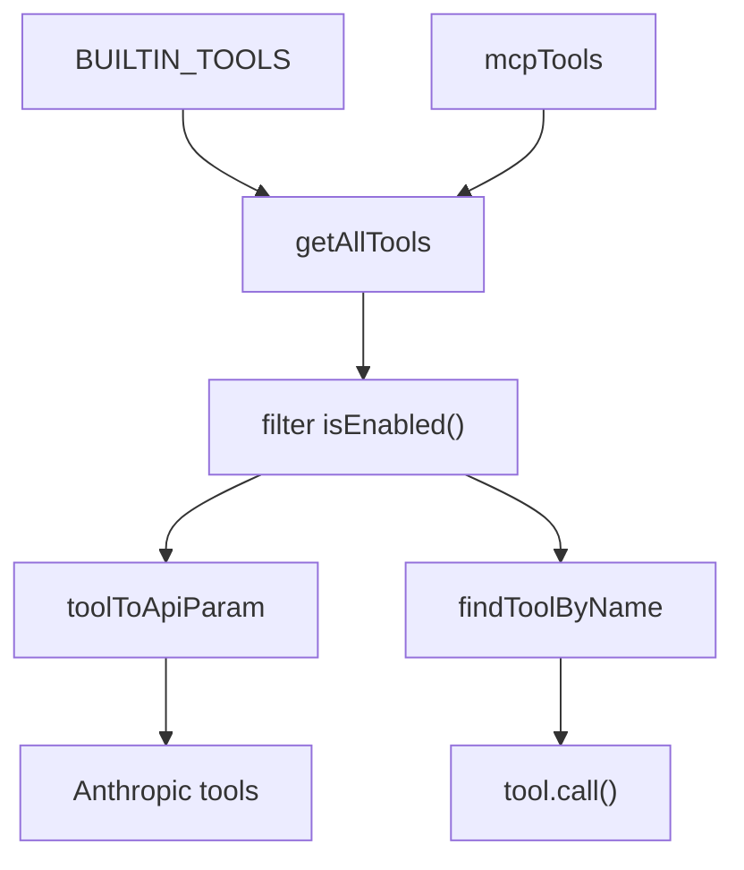
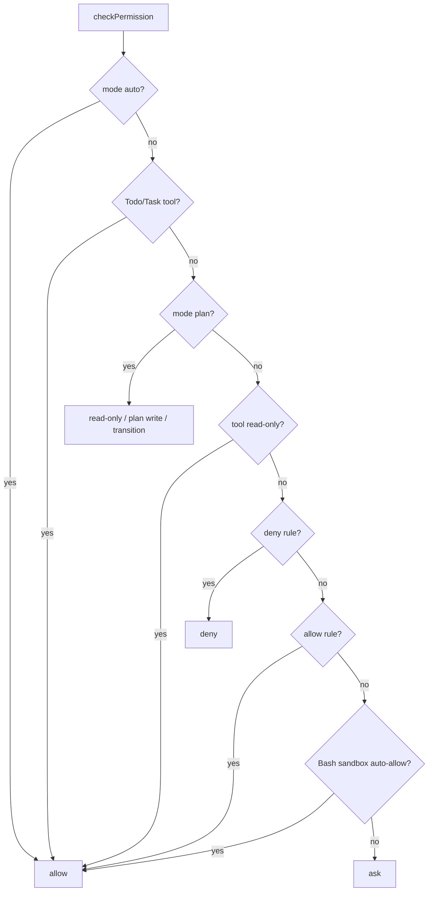

<details>
<summary>相关源文件</summary>

生成本页时使用的主要源文件：

- [src/tools/Tool.ts](../../../project-repos/easy-agent/src/tools/Tool.ts)
- [src/tools/index.ts](../../../project-repos/easy-agent/src/tools/index.ts)
- [src/tools/fileReadTool.ts](../../../project-repos/easy-agent/src/tools/fileReadTool.ts)
- [src/tools/fileWriteTool.ts](../../../project-repos/easy-agent/src/tools/fileWriteTool.ts)
- [src/tools/fileEditTool.ts](../../../project-repos/easy-agent/src/tools/fileEditTool.ts)
- [src/tools/bashTool.ts](../../../project-repos/easy-agent/src/tools/bashTool.ts)
- [src/tools/pathUtils.ts](../../../project-repos/easy-agent/src/tools/pathUtils.ts)
- [src/permissions/permissions.ts](../../../project-repos/easy-agent/src/permissions/permissions.ts)

</details>

# 工具系统与权限模型

工具系统的核心是 `Tool` 接口：每个工具有唯一 `name`、给模型看的 `description`、Anthropic tool schema、可选 result size 上限、`call()`、`isReadOnly()` 和 `isEnabled()`。工具结果是模型可读的 text，并可标记 `isError`。  
Sources: [src/tools/Tool.ts:18-46](../../../project-repos/easy-agent/src/tools/Tool.ts#L18-L46), [src/tools/Tool.ts:56-89](../../../project-repos/easy-agent/src/tools/Tool.ts#L56-L89)

<details class="source-snippets">
<summary>引用源码</summary>

<!-- source-snippets:start -->

#### `src/tools/Tool.ts:18-46`

```typescript
/** Runtime context passed to every tool invocation. */
export interface ToolContext {
  /** Current working directory */
  cwd: string;
  /** Abort signal for cancellation */
  abortSignal?: AbortSignal;
  /** Callback to switch permission mode at runtime (set by QueryEngine). */
  setPermissionMode?: (mode: string) => void;
  /** Callback to get the current permission mode. */
  getPermissionMode?: () => string;
  /** Callback to add session-level allow rules (for allowedPrompts on plan exit). */
  addSessionAllowRules?: (rules: string[]) => void;
  /**
   * Current session id. Used by session-scoped tools (e.g. TodoWrite) to
   * key their in-memory state — mirrors source code's
   * `agentId ?? getSessionId()` lookup pattern in `appState.todos[todoKey]`.
   */
  sessionId?: string;
}

// ─── Tool Result ───────────────────────────────────────────────────

/** The return value of a tool's `call()` method. */
export interface ToolResult {
  /** Human-readable text output sent back to the model. */
  content: string;
  /** Whether this call produced an error. */
  isError?: boolean;
}
```

#### `src/tools/Tool.ts:56-89`

```typescript
export const DEFAULT_MAX_RESULT_SIZE_CHARS = 100_000;

export interface Tool {
  /** Unique tool name, sent to the API and used for lookup. */
  readonly name: string;

  /** Human-readable description shown to the model. */
  readonly description: string;

  /**
   * JSON Schema describing the tool's input parameters.
   * This is sent directly to the Anthropic API as `input_schema`.
   */
  readonly inputSchema: Anthropic.Tool["input_schema"];

  /**
   * Maximum character count for the tool result content.
   * Results exceeding this limit will be truncated.
   * Defaults to DEFAULT_MAX_RESULT_SIZE_CHARS (100K).
   */
  readonly maxResultSizeChars?: number;

  /**
   * Execute the tool with the given input.
   * The model provides `input` as a parsed JSON object.
   */
  call(input: Record<string, unknown>, context: ToolContext): Promise<ToolResult>;

  /** Whether this tool only reads data (no side effects). */
  isReadOnly(): boolean;

  /** Whether this tool is available in the current environment. */
  isEnabled(): boolean;
}
```

<!-- source-snippets:end -->
</details>

## 注册表

内置工具数组包含文件读写编辑、Glob/Grep、Bash、MemoryWrite、TodoWrite、Task V2 工具、Plan Mode 工具和 Skill 工具。MCP 工具通过 `registerMcpTools()` 单独注入，最终由 `getAllTools()` 合并。  
Sources: [src/tools/index.ts:13-28](../../../project-repos/easy-agent/src/tools/index.ts#L13-L28), [src/tools/index.ts:30-65](../../../project-repos/easy-agent/src/tools/index.ts#L30-L65)

<details class="source-snippets">
<summary>引用源码</summary>

<!-- source-snippets:start -->

#### `src/tools/index.ts:13-28`

```typescript
import { bashTool } from "./bashTool.js";
import { fileEditTool } from "./fileEditTool.js";
import { fileReadTool } from "./fileReadTool.js";
import { fileWriteTool } from "./fileWriteTool.js";
import { globTool } from "./globTool.js";
import { grepTool } from "./grepTool.js";
import { memoryWriteTool } from "./memoryWriteTool.js";
import { enterPlanModeTool } from "./enterPlanModeTool.js";
import { exitPlanModeTool } from "./exitPlanModeTool.js";
import { todoWriteTool } from "./todoWriteTool.js";
import { taskCreateTool } from "./taskCreateTool.js";
import { taskUpdateTool } from "./taskUpdateTool.js";
import { taskGetTool } from "./taskGetTool.js";
import { taskListTool } from "./taskListTool.js";
import { skillTool } from "./skillTool.js";
import type { PermissionMode } from "../permissions/permissions.js";
```

#### `src/tools/index.ts:30-65`

```typescript
const BUILTIN_TOOLS: Tool[] = [
  fileReadTool,
  fileWriteTool,
  fileEditTool,
  globTool,
  grepTool,
  bashTool,
  memoryWriteTool,
  todoWriteTool,
  taskCreateTool,
  taskUpdateTool,
  taskGetTool,
  taskListTool,
  enterPlanModeTool,
  exitPlanModeTool,
  skillTool,
];

let mcpTools: Tool[] = [];

/**
 * Replace the registry of MCP-provided tools. Called once at startup after
 * connecting to all MCP servers, and again after `/mcp reconnect`.
 */
export function registerMcpTools(tools: Tool[]): void {
  mcpTools = [...tools];
}

/** Drop the MCP-provided tools — used before re-registering after reconnect. */
export function clearMcpTools(): void {
  mcpTools = [];
}

export function getAllTools(): Tool[] {
  return [...BUILTIN_TOOLS, ...mcpTools].filter((tool) => tool.isEnabled());
}
```

<!-- source-snippets:end -->
</details>



Sources: [src/tools/index.ts:30-90](../../../project-repos/easy-agent/src/tools/index.ts#L30-L90), [src/tools/Tool.ts:101-107](../../../project-repos/easy-agent/src/tools/Tool.ts#L101-L107)

<details class="source-snippets">
<summary>引用源码</summary>

<!-- source-snippets:start -->

#### `src/tools/index.ts:30-90`

```typescript
const BUILTIN_TOOLS: Tool[] = [
  fileReadTool,
  fileWriteTool,
  fileEditTool,
  globTool,
  grepTool,
  bashTool,
  memoryWriteTool,
  todoWriteTool,
  taskCreateTool,
  taskUpdateTool,
  taskGetTool,
  taskListTool,
  enterPlanModeTool,
  exitPlanModeTool,
  skillTool,
];

let mcpTools: Tool[] = [];

/**
 * Replace the registry of MCP-provided tools. Called once at startup after
 * connecting to all MCP servers, and again after `/mcp reconnect`.
 */
export function registerMcpTools(tools: Tool[]): void {
  mcpTools = [...tools];
}

/** Drop the MCP-provided tools — used before re-registering after reconnect. */
export function clearMcpTools(): void {
  mcpTools = [];
}

export function getAllTools(): Tool[] {
  return [...BUILTIN_TOOLS, ...mcpTools].filter((tool) => tool.isEnabled());
}

export function findToolByName(name: string): Tool | undefined {
  return [...BUILTIN_TOOLS, ...mcpTools].find((tool) => tool.name === name);
}

/**
 * Get tool API params with mode-aware Enter/Exit visibility.
 *
 * The model always sees all tools (Write, Edit, Bash, etc.) regardless
 * of mode. Enforcement happens in checkPermission at execution time.
 * Only the plan mode transition tools are toggled:
 * - In plan mode: hide EnterPlanMode, show ExitPlanMode
 * - Outside plan mode: show EnterPlanMode, hide ExitPlanMode
 *
 * MCP tools are always included; their visibility-in-plan is handled by
 * `checkPermission()` reading `tool.isReadOnly()` (which maps to MCP's
 * `annotations.readOnlyHint`).
 */
export function getToolsApiParams(mode?: PermissionMode): Anthropic.Tool[] {
  const tools = getAllTools();
  if (mode === "plan") {
    return tools.filter((t) => t.name !== "EnterPlanMode").map(toolToApiParam);
  }
  return tools.filter((t) => t.name !== "ExitPlanMode").map(toolToApiParam);
}
```

#### `src/tools/Tool.ts:101-107`

```typescript
/** Convert a Tool to the Anthropic API `tools` parameter format. */
export function toolToApiParam(tool: Tool): Anthropic.Tool {
  return {
    name: tool.name,
    description: tool.description,
    input_schema: tool.inputSchema,
  };
```

<!-- source-snippets:end -->
</details>

## 路径边界

文件类工具通过 `resolveWorkspacePath()` 解析路径，只允许访问当前 cwd 和 `~/.easy-agent`。这意味着默认情况下模型不能随意读写工作区外的路径，除非路径落在这两个允许根下。  
Sources: [src/tools/pathUtils.ts:4-10](../../../project-repos/easy-agent/src/tools/pathUtils.ts#L4-L10), [src/tools/pathUtils.ts:18-40](../../../project-repos/easy-agent/src/tools/pathUtils.ts#L18-L40)

<details class="source-snippets">
<summary>引用源码</summary>

<!-- source-snippets:start -->

#### `src/tools/pathUtils.ts:4-10`

```typescript
export function getToolAllowedRoots(cwd: string): string[] {
  return [path.resolve(cwd), path.resolve(getEasyAgentHome())];
}

export function describeAllowedRoots(cwd: string): string {
  return getToolAllowedRoots(cwd).join(", ");
}
```

#### `src/tools/pathUtils.ts:18-40`

```typescript
export function resolveSafePath(filePath: string, cwd: string): string {
  return path.resolve(cwd, expandHome(filePath));
}

export function ensureInsideAllowedRoots(resolvedPath: string, cwd: string): void {
  const normalizedPath = path.resolve(resolvedPath);
  for (const root of getToolAllowedRoots(cwd)) {
    const relative = path.relative(root, normalizedPath);
    if (relative === "" || relative === ".") return;
    if (!relative.startsWith("..") && !path.isAbsolute(relative)) {
      return;
    }
  }
  throw new Error(
    `Path is outside the allowed roots: ${resolvedPath}. Allowed roots: ${describeAllowedRoots(cwd)}`,
  );
}

export function resolveWorkspacePath(filePath: string, cwd: string): string {
  const resolvedPath = resolveSafePath(filePath, cwd);
  ensureInsideAllowedRoots(resolvedPath, cwd);
  return resolvedPath;
}
```

<!-- source-snippets:end -->
</details>

| 工具 | 关键行为 |
|------|----------|
| `Read` | 可读文件或目录，支持 offset/limit，并输出行号 |
| `Write` | 创建或覆盖文件，自动创建父目录 |
| `Edit` | 唯一 old_string 匹配替换，先检查 0/多次匹配 |
| `Glob` | 优先用 `rg --files`，fallback 到 `find` |
| `Grep` | 优先用 `rg -n --hidden`，fallback 到 `grep -RIn` |
| `Bash` | shell 执行，支持 timeout、abort、sandbox 包装和输出截断 |

Sources: [src/tools/fileReadTool.ts:25-105](../../../project-repos/easy-agent/src/tools/fileReadTool.ts#L25-L105), [src/tools/fileWriteTool.ts:11-68](../../../project-repos/easy-agent/src/tools/fileWriteTool.ts#L11-L68), [src/tools/fileEditTool.ts:39-103](../../../project-repos/easy-agent/src/tools/fileEditTool.ts#L39-L103), [src/tools/globTool.ts:22-81](../../../project-repos/easy-agent/src/tools/globTool.ts#L22-L81), [src/tools/grepTool.ts:23-85](../../../project-repos/easy-agent/src/tools/grepTool.ts#L23-L85), [src/tools/bashTool.ts:94-216](../../../project-repos/easy-agent/src/tools/bashTool.ts#L94-L216)

<details class="source-snippets">
<summary>引用源码</summary>

<!-- source-snippets:start -->

#### `src/tools/fileReadTool.ts:25-105`

```typescript
export const fileReadTool: Tool = {
  name: "Read",
  description:
    "Read the contents of a file at the specified path. " +
    "Use offset and limit to read specific line ranges for large files. " +
    "Output includes line numbers in cat -n format.",
  inputSchema: {
    type: "object" as const,
    properties: {
      file_path: {
        type: "string",
        description: "The absolute or relative path to the file to read",
      },
      offset: {
        type: "number",
        description: "The 1-indexed line number to start reading from (default: 1)",
      },
      limit: {
        type: "number",
        description: "The number of lines to read. If not provided, reads the entire file",
      },
    },
    required: ["file_path"],
  },
  async call(rawInput: Record<string, unknown>, context: ToolContext): Promise<ToolResult> {
    const input = rawInput as unknown as FileReadInput;
    if (!input.file_path) {
      return { content: "Error: file_path is required", isError: true };
    }

    let resolvedPath: string;
    try {
      resolvedPath = resolveWorkspacePath(input.file_path, context.cwd);
    } catch (error: unknown) {
      return {
        content: error instanceof Error ? `Error: ${error.message}` : `Error: ${String(error)}`,
        isError: true,
      };
    }

    const offset = input.offset ?? 1;
    const limit = input.limit;

    try {
      const stat = await fs.stat(resolvedPath);
      if (stat.isDirectory()) {
        const entries = await fs.readdir(resolvedPath);
        return { content: `Directory listing for ${input.file_path}:\n${entries.join("\n")}` };
      }

      const raw = await fs.readFile(resolvedPath, "utf-8");
      const allLines = raw.split("\n");
      const startIdx = Math.max(0, offset - 1);
      const endIdx = limit ? startIdx + limit : allLines.length;
      const selectedLines = allLines.slice(startIdx, endIdx);
      const numbered = addLineNumbers(selectedLines.join("\n"), startIdx + 1);
      const numLines = selectedLines.length;
      const rangeInfo =
        startIdx > 0 || endIdx < allLines.length
          ? ` (lines ${startIdx + 1}-${startIdx + numLines} of ${allLines.length})`
          : ` (${allLines.length} lines)`;

      return { content: `${resolvedPath}${rangeInfo}\n${numbered}` };
    } catch (error: unknown) {
      const err = error as NodeJS.ErrnoException;
      if (err.code === "ENOENT") {
        return { content: `Error: File not found: ${input.file_path}`, isError: true };
      }
      if (err.code === "EACCES") {
        return { content: `Error: Permission denied: ${input.file_path}`, isError: true };
      }
      return { content: `Error reading file: ${err.message}`, isError: true };
    }
  },
  isReadOnly(): boolean {
    return true;
  },
  isEnabled(): boolean {
    return true;
  },
};
```

#### `src/tools/fileWriteTool.ts:11-68`

```typescript
export const fileWriteTool: Tool = {
  name: "Write",
  description: "Create a file or overwrite an existing file with the provided content.",
  inputSchema: {
    type: "object" as const,
    properties: {
      file_path: { type: "string", description: "File path to write" },
      content: { type: "string", description: "Full file content to write" },
    },
    required: ["file_path", "content"],
  },
  async call(rawInput: Record<string, unknown>, context: ToolContext): Promise<ToolResult> {
    const input = rawInput as unknown as FileWriteInput;
    if (!input.file_path) {
      return { content: "Error: file_path is required", isError: true };
    }
    if (typeof input.content !== "string") {
      return { content: "Error: content must be a string", isError: true };
    }

    let resolvedPath: string;
    try {
      resolvedPath = resolveWorkspacePath(input.file_path, context.cwd);
    } catch (error: unknown) {
      return {
        content: error instanceof Error ? `Error: ${error.message}` : `Error: ${String(error)}`,
        isError: true,
      };
    }

    try {
      let existed = true;
      try {
        await fs.access(resolvedPath);
      } catch {
        existed = false;
      }

      await fs.mkdir(path.dirname(resolvedPath), { recursive: true });
      await fs.writeFile(resolvedPath, input.content, "utf-8");

      return {
        content: `${existed ? "Updated" : "Created"} file: ${resolvedPath} (${input.content.length} chars)`,
      };
    } catch (error: unknown) {
      return {
        content: `Error writing file: ${error instanceof Error ? error.message : String(error)}`,
        isError: true,
      };
    }
  },
  isReadOnly(): boolean {
    return false;
  },
  isEnabled(): boolean {
    return true;
  },
};
```

#### `src/tools/fileEditTool.ts:39-103`

```typescript
export const fileEditTool: Tool = {
  name: "Edit",
  description: "Find a unique string in a file, replace it, and write the updated content back.",
  inputSchema: {
    type: "object" as const,
    properties: {
      file_path: { type: "string", description: "File path to edit" },
      old_string: { type: "string", description: "Existing text to replace; must match uniquely" },
      new_string: { type: "string", description: "Replacement text" },
    },
    required: ["file_path", "old_string", "new_string"],
  },
  async call(rawInput: Record<string, unknown>, context: ToolContext): Promise<ToolResult> {
    const input = rawInput as unknown as FileEditInput;
    if (!input.file_path || typeof input.old_string !== "string" || typeof input.new_string !== "string") {
      return { content: "Error: file_path, old_string, and new_string are required", isError: true };
    }

    const oldString = normalizeQuotes(input.old_string);
    const newString = normalizeQuotes(input.new_string);

    if (!oldString) {
      return { content: "Error: old_string must not be empty", isError: true };
    }

    let resolvedPath: string;
    try {
      resolvedPath = resolveWorkspacePath(input.file_path, context.cwd);
    } catch (error: unknown) {
      return {
        content: error instanceof Error ? `Error: ${error.message}` : `Error: ${String(error)}`,
        isError: true,
      };
    }

    try {
      const original = await fs.readFile(resolvedPath, "utf-8");
      const occurrences = countOccurrences(original, oldString);
      if (occurrences === 0) {
        return { content: `Error: old_string not found in ${resolvedPath}`, isError: true };
      }
      if (occurrences > 1) {
        return { content: `Error: old_string matched ${occurrences} times; Edit requires a unique match`, isError: true };
      }

      const updated = original.replace(oldString, newString);
      await fs.writeFile(resolvedPath, updated, "utf-8");

      return {
        content: `Updated file: ${resolvedPath}\n${buildEditPreview(oldString, newString)}`,
      };
    } catch (error: unknown) {
      return {
        content: `Error editing file: ${error instanceof Error ? error.message : String(error)}`,
        isError: true,
      };
    }
  },
  isReadOnly(): boolean {
    return false;
  },
  isEnabled(): boolean {
    return true;
  },
};
```

#### `src/tools/globTool.ts:22-81`

```typescript
export const globTool: Tool = {
  name: "Glob",
  description: "Find files by glob pattern. Prefer this over Bash for file discovery.",
  inputSchema: {
    type: "object" as const,
    properties: {
      pattern: { type: "string", description: "Glob pattern to match, e.g. **/*.ts" },
      path: { type: "string", description: "Base directory to search from" },
    },
    required: ["pattern"],
  },
  async call(rawInput: Record<string, unknown>, context: ToolContext): Promise<ToolResult> {
    const input = rawInput as unknown as GlobInput;
    if (!input.pattern) {
      return { content: "Error: pattern is required", isError: true };
    }

    let basePath: string;
    try {
      basePath = resolveWorkspacePath(input.path ?? ".", context.cwd);
    } catch (error: unknown) {
      return {
        content: error instanceof Error ? `Error: ${error.message}` : `Error: ${String(error)}`,
        isError: true,
      };
    }

    try {
      if (await hasCommand("rg")) {
        const { stdout } = await execFileAsync("rg", ["--files", "--hidden", "-g", input.pattern], {
          cwd: basePath,
          maxBuffer: 1024 * 1024,
        });
        const output = stdout.trim();
        return {
          content: output ? `Matched files under ${basePath}:\n${output}` : `No files matched ${input.pattern}`,
        };
      }

      const { stdout } = await execFileAsync("find", [basePath, "-path", `*${input.pattern.replace(/\*\*/g, "*")}`], {
        maxBuffer: 1024 * 1024,
      });
      const output = stdout.trim();
      return {
        content: output ? `Matched files under ${basePath}:\n${output}` : `No files matched ${input.pattern}`,
      };
    } catch (error: unknown) {
      return {
        content: `Error running glob search: ${error instanceof Error ? error.message : String(error)}`,
        isError: true,
      };
    }
  },
  isReadOnly(): boolean {
    return true;
  },
  isEnabled(): boolean {
    return true;
  },
};
```

#### `src/tools/grepTool.ts:23-85`

```typescript
export const grepTool: Tool = {
  name: "Grep",
  description: "Search file contents by regex pattern. Prefer this over Bash for code search.",
  inputSchema: {
    type: "object" as const,
    properties: {
      pattern: { type: "string", description: "Regex pattern to search for" },
      path: { type: "string", description: "Directory or file path to search within" },
      include: { type: "string", description: "Optional glob filter, e.g. *.ts" },
    },
    required: ["pattern"],
  },
  async call(rawInput: Record<string, unknown>, context: ToolContext): Promise<ToolResult> {
    const input = rawInput as unknown as GrepInput;
    if (!input.pattern) {
      return { content: "Error: pattern is required", isError: true };
    }

    let targetPath: string;
    try {
      targetPath = resolveWorkspacePath(input.path ?? ".", context.cwd);
    } catch (error: unknown) {
      return {
        content: error instanceof Error ? `Error: ${error.message}` : `Error: ${String(error)}`,
        isError: true,
      };
    }

    try {
      if (await hasCommand("rg")) {
        const args = ["-n", "--hidden"];
        if (input.include) {
          args.push("-g", input.include);
        }
        args.push(input.pattern, targetPath);
        const { stdout } = await execFileAsync("rg", args, { maxBuffer: 1024 * 1024 });
        const output = stdout.trim();
        return {
          content: output ? output : `No matches found for pattern: ${input.pattern}`,
        };
      }

      const grepArgs = ["-RIn", input.pattern, targetPath];
      const { stdout } = await execFileAsync("grep", grepArgs, { maxBuffer: 1024 * 1024 });
      const output = stdout.trim();
      return {
        content: output ? output : `No matches found for pattern: ${input.pattern}`,
      };
    } catch (error: unknown) {
      const message = error instanceof Error ? error.message : String(error);
      if (message.includes("code 1")) {
        return { content: `No matches found for pattern: ${input.pattern}` };
      }
      return { content: `Error running grep search: ${message}`, isError: true };
    }
  },
  isReadOnly(): boolean {
    return true;
  },
  isEnabled(): boolean {
    return true;
  },
};
```

#### `src/tools/bashTool.ts:94-216`

```typescript
export const bashTool: Tool = {
  name: "Bash",
  description: "Execute a shell command in the current working directory and return stdout/stderr.",
  inputSchema: {
    type: "object" as const,
    properties: {
      command: { type: "string", description: "Shell command to execute" },
      timeout: { type: "number", description: "Timeout in milliseconds (default 120000)" },
      dangerouslyDisableSandbox: {
        type: "boolean",
        description:
          "If true, run this command OUTSIDE the sandbox even when sandboxing is enabled. Only use this when the command genuinely needs unrestricted access (e.g. installing system packages, running docker, accessing devices). Most commands should run inside the sandbox.",
      },
    },
    required: ["command"],
  },
  async call(rawInput: Record<string, unknown>, context: ToolContext): Promise<ToolResult> {
    const input = rawInput as unknown as BashInput;
    if (!input.command) {
      return { content: "Error: command is required", isError: true };
    }

    const timeoutMs = typeof input.timeout === "number" ? input.timeout : DEFAULT_TIMEOUT_MS;

    // Decide sandbox wrapping. We swallow load errors and proceed with
    // sandboxing OFF — settings.json being unparseable shouldn't block
    // command execution; the permission system already surfaces those
    // errors loudly elsewhere.
    let sandboxSettings: ResolvedSandboxSettings | null = null;
    try {
      sandboxSettings = await loadSandboxSettings(context.cwd);
    } catch {
      sandboxSettings = null;
    }

    const willSandbox = sandboxSettings
      ? shouldUseSandbox(
          {
            command: input.command,
            dangerouslyDisableSandbox: input.dangerouslyDisableSandbox,
          },
          sandboxSettings,
        )
      : false;

    let executedCommand = input.command;
    if (willSandbox && sandboxSettings) {
      const profile = await buildProfileForCwd(context.cwd, sandboxSettings);
      const wrap = wrapWithSandbox(input.command, profile);
      executedCommand = wrap.wrappedCommand;
    }

    return await new Promise<ToolResult>((resolve) => {
      const child = spawn(process.env.SHELL || "bash", ["-lc", executedCommand], {
        cwd: context.cwd,
        env: process.env,
      });

      let stdout = "";
      let stderr = "";
      let settled = false;

      const finish = (result: ToolResult) => {
        if (settled) return;
        settled = true;
        resolve(result);
      };

      const timeoutId = setTimeout(() => {
        child.kill("SIGTERM");
        finish({ content: `Command timed out after ${timeoutMs}ms`, isError: true });
      }, timeoutMs);

      const onAbort = () => {
        child.kill("SIGTERM");
        clearTimeout(timeoutId);
        finish({ content: "Command aborted", isError: true });
      };

      context.abortSignal?.addEventListener("abort", onAbort, { once: true });

      child.stdout.on("data", (chunk: Buffer | string) => {
        stdout += chunk.toString();
      });
      child.stderr.on("data", (chunk: Buffer | string) => {
        stderr += chunk.toString();
      });
      child.on("error", (error) => {
        clearTimeout(timeoutId);
        finish({ content: `Failed to start command: ${error.message}`, isError: true });
      });
      child.on("close", (code) => {
        clearTimeout(timeoutId);
        context.abortSignal?.removeEventListener("abort", onAbort);

        // Tag stderr with <sandbox_violations>...</sandbox_violations>
        // when the failure smells like a sandbox denial. The model uses
        // this signal to decide whether to retry, ask for permission,
        // or back off. The UI strips the tag before rendering.
        const annotatedStderr = willSandbox
          ? annotateStderrWithSandboxFailures(stderr, code)
          : stderr;

        const output = [
          `Command: ${input.command}`,
          `Read-only: ${isReadOnlyCommand(input.command)}`,
          `Sandbox: ${willSandbox ? "enabled" : "disabled"}`,
          `Exit code: ${code ?? -1}`,
          stdout ? `\nSTDOUT:\n${truncateOutput(stdout)}` : "",
          annotatedStderr ? `\nSTDERR:\n${truncateOutput(annotatedStderr)}` : "",
        ].filter(Boolean).join("\n");

        finish({ content: output, isError: (code ?? 1) !== 0 });
      });
    });
  },
  isReadOnly(): boolean {
    return false;
  },
  isEnabled(): boolean {
... snippet truncated ...
```

<!-- source-snippets:end -->
</details>

## Bash 工具

`Bash` 用当前 shell 执行命令，默认 timeout 120 秒，输出截断到 30K 字符。它会在调用前读取 sandbox settings，如果应启用 sandbox，就构建 profile 并把原始命令包装成 `sandbox-exec` 命令。工具结果会明确输出原命令、是否 read-only、sandbox 是否启用、exit code、stdout 和 stderr。  
Sources: [src/tools/bashTool.ts:48-92](../../../project-repos/easy-agent/src/tools/bashTool.ts#L48-L92), [src/tools/bashTool.ts:110-145](../../../project-repos/easy-agent/src/tools/bashTool.ts#L110-L145), [src/tools/bashTool.ts:146-207](../../../project-repos/easy-agent/src/tools/bashTool.ts#L146-L207)

<details class="source-snippets">
<summary>引用源码</summary>

<!-- source-snippets:start -->

#### `src/tools/bashTool.ts:48-92`

```typescript
const DEFAULT_TIMEOUT_MS = 120_000;
const MAX_OUTPUT_CHARS = 30_000;
const READ_ONLY_COMMANDS = new Set([
  "ls",
  "cat",
  "grep",
  "rg",
  "find",
  "fd",
  "pwd",
  "which",
  "git status",
  "git log",
  "git diff",
  "git show",
  "head",
  "tail",
  "wc",
  "sed",
]);

function truncateOutput(value: string): string {
  if (value.length <= MAX_OUTPUT_CHARS) return value;
  return `${value.slice(0, MAX_OUTPUT_CHARS)}\n...[truncated ${value.length - MAX_OUTPUT_CHARS} chars]`;
}

function splitCommandSegments(command: string): string[] {
  return command
    .split(/&&|\|\||\|/)
    .map((segment) => segment.trim())
    .filter(Boolean);
}

export function isReadOnlyCommand(command: string): boolean {
  const segments = splitCommandSegments(command);
  if (segments.length === 0) return false;
  return segments.every((segment) => {
    const normalized = segment.replace(/\s+/g, " ").trim();
    if (READ_ONLY_COMMANDS.has(normalized)) return true;
    const firstTwo = normalized.split(" ").slice(0, 2).join(" ");
    if (READ_ONLY_COMMANDS.has(firstTwo)) return true;
    const first = normalized.split(" ")[0];
    return READ_ONLY_COMMANDS.has(first);
  });
}
```

#### `src/tools/bashTool.ts:110-145`

```typescript
  async call(rawInput: Record<string, unknown>, context: ToolContext): Promise<ToolResult> {
    const input = rawInput as unknown as BashInput;
    if (!input.command) {
      return { content: "Error: command is required", isError: true };
    }

    const timeoutMs = typeof input.timeout === "number" ? input.timeout : DEFAULT_TIMEOUT_MS;

    // Decide sandbox wrapping. We swallow load errors and proceed with
    // sandboxing OFF — settings.json being unparseable shouldn't block
    // command execution; the permission system already surfaces those
    // errors loudly elsewhere.
    let sandboxSettings: ResolvedSandboxSettings | null = null;
    try {
      sandboxSettings = await loadSandboxSettings(context.cwd);
    } catch {
      sandboxSettings = null;
    }

    const willSandbox = sandboxSettings
      ? shouldUseSandbox(
          {
            command: input.command,
            dangerouslyDisableSandbox: input.dangerouslyDisableSandbox,
          },
          sandboxSettings,
        )
      : false;

    let executedCommand = input.command;
    if (willSandbox && sandboxSettings) {
      const profile = await buildProfileForCwd(context.cwd, sandboxSettings);
      const wrap = wrapWithSandbox(input.command, profile);
      executedCommand = wrap.wrappedCommand;
    }

```

#### `src/tools/bashTool.ts:146-207`

```typescript
    return await new Promise<ToolResult>((resolve) => {
      const child = spawn(process.env.SHELL || "bash", ["-lc", executedCommand], {
        cwd: context.cwd,
        env: process.env,
      });

      let stdout = "";
      let stderr = "";
      let settled = false;

      const finish = (result: ToolResult) => {
        if (settled) return;
        settled = true;
        resolve(result);
      };

      const timeoutId = setTimeout(() => {
        child.kill("SIGTERM");
        finish({ content: `Command timed out after ${timeoutMs}ms`, isError: true });
      }, timeoutMs);

      const onAbort = () => {
        child.kill("SIGTERM");
        clearTimeout(timeoutId);
        finish({ content: "Command aborted", isError: true });
      };

      context.abortSignal?.addEventListener("abort", onAbort, { once: true });

      child.stdout.on("data", (chunk: Buffer | string) => {
        stdout += chunk.toString();
      });
      child.stderr.on("data", (chunk: Buffer | string) => {
        stderr += chunk.toString();
      });
      child.on("error", (error) => {
        clearTimeout(timeoutId);
        finish({ content: `Failed to start command: ${error.message}`, isError: true });
      });
      child.on("close", (code) => {
        clearTimeout(timeoutId);
        context.abortSignal?.removeEventListener("abort", onAbort);

        // Tag stderr with <sandbox_violations>...</sandbox_violations>
        // when the failure smells like a sandbox denial. The model uses
        // this signal to decide whether to retry, ask for permission,
        // or back off. The UI strips the tag before rendering.
        const annotatedStderr = willSandbox
          ? annotateStderrWithSandboxFailures(stderr, code)
          : stderr;

        const output = [
          `Command: ${input.command}`,
          `Read-only: ${isReadOnlyCommand(input.command)}`,
          `Sandbox: ${willSandbox ? "enabled" : "disabled"}`,
          `Exit code: ${code ?? -1}`,
          stdout ? `\nSTDOUT:\n${truncateOutput(stdout)}` : "",
          annotatedStderr ? `\nSTDERR:\n${truncateOutput(annotatedStderr)}` : "",
        ].filter(Boolean).join("\n");

        finish({ content: output, isError: (code ?? 1) !== 0 });
      });
```

<!-- source-snippets:end -->
</details>

```mermaid
sequenceDiagram
  participant Loop as runTools
  participant Perm as checkPermission
  participant Bash as BashTool
  participant Sandbox as sandbox/*
  participant Shell as shell

  Loop->>Perm: check Bash input
  Perm-->>Loop: allow / ask / deny
  Loop->>Bash: call(command)
  Bash->>Sandbox: load settings + wrap if needed
  Bash->>Shell: spawn shell -lc
  Shell-->>Bash: stdout/stderr/code
  Bash-->>Loop: ToolResult
```

Sources: [src/core/agenticLoop.ts:135-191](../../../project-repos/easy-agent/src/core/agenticLoop.ts#L135-L191), [src/tools/bashTool.ts:118-207](../../../project-repos/easy-agent/src/tools/bashTool.ts#L118-L207)

<details class="source-snippets">
<summary>引用源码</summary>

<!-- source-snippets:start -->

#### `src/core/agenticLoop.ts:135-191`

```typescript
    try {
      // Read live permission mode from tool context (updated by Enter/ExitPlanMode)
      const liveMode = context.getPermissionMode?.() as PermissionMode | undefined;
      const permission = await checkPermission({
        tool,
        input: toolInput,
        cwd: context.cwd,
        mode: liveMode ?? options.permissionMode,
        settings: options.permissionSettings,
        sessionRules: options.sessionPermissionRules,
      });

      if (permission.behavior === "deny") {
        const result: ToolResult = {
          content: `Permission denied for ${block.name}: ${permission.reason}`,
          isError: true,
        };
        toolResults.push({
          type: "tool_result",
          tool_use_id: block.id,
          content: result.content,
          is_error: true,
        });
        executions.push({ toolUseId: block.id, toolName: block.name, toolInput, result });
        continue;
      }

      if (permission.behavior === "ask") {
        permissionRequests.push(permission.request);
        const decision = options.onPermissionRequest
          ? await options.onPermissionRequest(permission.request)
          : "deny";

        if (decision === "deny") {
          const result: ToolResult = {
            content: `Permission denied for ${block.name}: user rejected the request`,
            isError: true,
          };
          toolResults.push({
            type: "tool_result",
            tool_use_id: block.id,
            content: result.content,
            is_error: true,
          });
          executions.push({ toolUseId: block.id, toolName: block.name, toolInput, result });
          continue;
        }

        if (decision === "allow_always") {
          const allowRules = options.sessionPermissionRules?.allow;
          if (allowRules && !allowRules.includes(permission.request.ruleHint)) {
            allowRules.push(permission.request.ruleHint);
          }
        }
      }

      const rawResult = await tool.call(toolInput, context);
```

#### `src/tools/bashTool.ts:118-207`

```typescript
    // Decide sandbox wrapping. We swallow load errors and proceed with
    // sandboxing OFF — settings.json being unparseable shouldn't block
    // command execution; the permission system already surfaces those
    // errors loudly elsewhere.
    let sandboxSettings: ResolvedSandboxSettings | null = null;
    try {
      sandboxSettings = await loadSandboxSettings(context.cwd);
    } catch {
      sandboxSettings = null;
    }

    const willSandbox = sandboxSettings
      ? shouldUseSandbox(
          {
            command: input.command,
            dangerouslyDisableSandbox: input.dangerouslyDisableSandbox,
          },
          sandboxSettings,
        )
      : false;

    let executedCommand = input.command;
    if (willSandbox && sandboxSettings) {
      const profile = await buildProfileForCwd(context.cwd, sandboxSettings);
      const wrap = wrapWithSandbox(input.command, profile);
      executedCommand = wrap.wrappedCommand;
    }

    return await new Promise<ToolResult>((resolve) => {
      const child = spawn(process.env.SHELL || "bash", ["-lc", executedCommand], {
        cwd: context.cwd,
        env: process.env,
      });

      let stdout = "";
      let stderr = "";
      let settled = false;

      const finish = (result: ToolResult) => {
        if (settled) return;
        settled = true;
        resolve(result);
      };

      const timeoutId = setTimeout(() => {
        child.kill("SIGTERM");
        finish({ content: `Command timed out after ${timeoutMs}ms`, isError: true });
      }, timeoutMs);

      const onAbort = () => {
        child.kill("SIGTERM");
        clearTimeout(timeoutId);
        finish({ content: "Command aborted", isError: true });
      };

      context.abortSignal?.addEventListener("abort", onAbort, { once: true });

      child.stdout.on("data", (chunk: Buffer | string) => {
        stdout += chunk.toString();
      });
      child.stderr.on("data", (chunk: Buffer | string) => {
        stderr += chunk.toString();
      });
      child.on("error", (error) => {
        clearTimeout(timeoutId);
        finish({ content: `Failed to start command: ${error.message}`, isError: true });
      });
      child.on("close", (code) => {
        clearTimeout(timeoutId);
        context.abortSignal?.removeEventListener("abort", onAbort);

        // Tag stderr with <sandbox_violations>...</sandbox_violations>
        // when the failure smells like a sandbox denial. The model uses
        // this signal to decide whether to retry, ask for permission,
        // or back off. The UI strips the tag before rendering.
        const annotatedStderr = willSandbox
          ? annotateStderrWithSandboxFailures(stderr, code)
          : stderr;

        const output = [
          `Command: ${input.command}`,
          `Read-only: ${isReadOnlyCommand(input.command)}`,
          `Sandbox: ${willSandbox ? "enabled" : "disabled"}`,
          `Exit code: ${code ?? -1}`,
          stdout ? `\nSTDOUT:\n${truncateOutput(stdout)}` : "",
          annotatedStderr ? `\nSTDERR:\n${truncateOutput(annotatedStderr)}` : "",
        ].filter(Boolean).join("\n");

        finish({ content: output, isError: (code ?? 1) !== 0 });
      });
```

<!-- source-snippets:end -->
</details>

## 权限设置加载

权限设置从 user/project 两个 `settings.json` 路径读取。allow/deny 数组会合并，mode 由 project 覆盖 user，默认是 `default`。权限 JSON parse error 会抛错，避免用户以为配置生效但实际被静默忽略。  
Sources: [src/permissions/permissions.ts:49-59](../../../project-repos/easy-agent/src/permissions/permissions.ts#L49-L59), [src/permissions/permissions.ts:88-127](../../../project-repos/easy-agent/src/permissions/permissions.ts#L88-L127)

<details class="source-snippets">
<summary>引用源码</summary>

<!-- source-snippets:start -->

#### `src/permissions/permissions.ts:49-59`

```typescript
interface RawSettings {
  allow?: unknown;
  deny?: unknown;
  mode?: unknown;
}

const DEFAULT_PERMISSION_SETTINGS: PermissionSettings = {
  allow: [],
  deny: [],
  mode: "default",
};
```

#### `src/permissions/permissions.ts:88-127`

```typescript
async function readPermissionsFromSettings(filePath: string): Promise<Partial<PermissionSettings>> {
  // We THROW on parse errors here (matching the old behavior) so that a
  // syntactically broken settings.json doesn't silently grant fewer
  // permissions than the user thinks they configured. The MCP loader
  // chooses the opposite policy (warn + skip) because partial MCP
  // server configs are still useful — partial permission rules aren't.
  const result = await readJsonSettingsFile<RawSettings>(filePath);
  if (result.parseError) {
    throw new Error(`Invalid JSON in permissions settings: ${filePath}`);
  }
  if (!result.raw) return {};
  return {
    allow: normalizeRuleList(result.raw.allow),
    deny: normalizeRuleList(result.raw.deny),
    ...(normalizeMode(result.raw.mode) ? { mode: normalizeMode(result.raw.mode) } : {}),
  };
}

export async function loadPermissionSettings(cwd: string): Promise<PermissionSettings> {
  const { user: userSettingsPath, project: projectSettingsPath } = getSettingsPaths(cwd);

  const [userSettings, projectSettings] = await Promise.all([
    readPermissionsFromSettings(userSettingsPath),
    readPermissionsFromSettings(projectSettingsPath),
  ]);

  return {
    allow: [
      ...DEFAULT_PERMISSION_SETTINGS.allow,
      ...(userSettings.allow ?? []),
      ...(projectSettings.allow ?? []),
    ],
    deny: [
      ...DEFAULT_PERMISSION_SETTINGS.deny,
      ...(userSettings.deny ?? []),
      ...(projectSettings.deny ?? []),
    ],
    mode: projectSettings.mode ?? userSettings.mode ?? DEFAULT_PERMISSION_SETTINGS.mode,
  };
}
```

<!-- source-snippets:end -->
</details>

## 权限规则匹配

规则支持裸工具名、`Tool(pattern)` 和 MCP wildcard。`Bash(pattern)` 匹配 command，`Skill(pattern)` 匹配 skill name；`mcp__server__*` 可匹配某个 server 暴露的全部 MCP 工具。  
Sources: [src/permissions/permissions.ts:146-185](../../../project-repos/easy-agent/src/permissions/permissions.ts#L146-L185)

<details class="source-snippets">
<summary>引用源码</summary>

<!-- source-snippets:start -->

#### `src/permissions/permissions.ts:146-185`

```typescript
export function matchesPermissionRule(rule: string, toolName: string, input: Record<string, unknown>): boolean {
  const normalizedRule = rule.trim();
  if (!normalizedRule) return false;
  if (normalizedRule === toolName) return true;

  // Wildcard match for MCP tool names: `mcp__github__*` matches every tool
  // exposed by the github MCP server. Source code uses fully qualified
  // `mcp__server__tool` names for permission rule matching to avoid
  // collisions with builtin tool names — we follow the same convention
  // and additionally support a trailing `*` for whole-server allow/deny.
  if (normalizedRule.startsWith("mcp__") && normalizedRule.includes("*")) {
    return wildcardToRegExp(normalizedRule).test(toolName);
  }

  const match = normalizedRule.match(/^([A-Za-z]+)\((.*)\)$/);
  if (!match) return false;

  const [, ruleToolName, pattern] = match;
  if (ruleToolName !== toolName) return false;

  if (toolName === "Bash") {
    const command = extractBashCommand(input);
    return wildcardToRegExp(pattern.trim()).test(command);
  }

  // Skill rules: `Skill(my-skill)` exact, `Skill(review:*)` prefix-glob.
  // The argument is the skill `name` (NOT the dirname or any args). Mirrors
  // source code's `ruleMatches()` for the SkillTool branch.
  if (toolName === "Skill") {
    const skillName = extractSkillName(input);
    if (!skillName) return false;
    const trimmedPattern = pattern.trim();
    if (trimmedPattern.includes("*")) {
      return wildcardToRegExp(trimmedPattern).test(skillName);
    }
    return trimmedPattern === skillName;
  }

  return false;
}
```

<!-- source-snippets:end -->
</details>

## 决策树

`checkPermission()` 的顺序很重要：auto mode 全允许；Todo/Task planning-only 工具全模式允许；plan mode 只允许 Read/Grep/Glob、read-only Bash、Plan transition 和写 plan 文件；普通模式下 read-only 工具直接允许；显式 deny/allow 再判定；最后 Bash 可通过 sandbox auto-allow，否则危险 Bash 或普通 side-effect tool 需要 ask。  
Sources: [src/permissions/permissions.ts:325-356](../../../project-repos/easy-agent/src/permissions/permissions.ts#L325-L356), [src/permissions/permissions.ts:358-382](../../../project-repos/easy-agent/src/permissions/permissions.ts#L358-L382), [src/permissions/permissions.ts:384-443](../../../project-repos/easy-agent/src/permissions/permissions.ts#L384-L443)

<details class="source-snippets">
<summary>引用源码</summary>

<!-- source-snippets:start -->

#### `src/permissions/permissions.ts:325-356`

```typescript
export async function checkPermission(params: PermissionCheckParams): Promise<PermissionResponse> {
  const settings = params.settings ?? (await loadPermissionSettings(params.cwd));
  const mode = params.mode ?? settings.mode;
  const sessionRules = params.sessionRules ?? { allow: [], deny: [] };
  const request: PermissionRequest = {
    toolName: params.tool.name,
    input: params.input,
    summary: summarizePermissionRequest(params.tool.name, params.input),
    risk: getRiskLabel(params.tool, params.input),
    ruleHint: buildPermissionRuleHint(params.tool.name, params.input),
  };

  if (mode === "auto") {
    return { behavior: "allow", reason: "auto mode allows all operations", request };
  }

  // TodoWrite and the Task V2 tools only mutate planning state — either
  // the in-memory todo list or the ~/.easy-agent/tasks directory — with
  // no filesystem or shell side effects on the user's workspace. They
  // never need user approval in any mode. This mirrors source code's
  // `shouldDefer: true` + `checkPermissions: () => allow` combo and
  // keeps these tools usable inside Plan Mode so the model can draft
  // and iterate on the plan itself.
  if (
    params.tool.name === "TodoWrite" ||
    params.tool.name === "TaskCreate" ||
    params.tool.name === "TaskUpdate" ||
    params.tool.name === "TaskGet" ||
    params.tool.name === "TaskList"
  ) {
    return { behavior: "allow", reason: `${params.tool.name} writes planning-only state`, request };
  }
```

#### `src/permissions/permissions.ts:358-382`

```typescript
  // Plan mode: allow read-only tools, plan mode tools, plan file writes; deny everything else
  if (mode === "plan") {
    if (PLAN_ALLOWED_TOOLS.has(params.tool.name)) {
      return { behavior: "allow", reason: "read-only tool allowed in plan mode", request };
    }
    if (params.tool.name === "EnterPlanMode" || params.tool.name === "ExitPlanMode") {
      return { behavior: "ask", reason: "plan mode transition requires confirmation", request };
    }
    if (params.tool.name === "Bash") {
      const command = extractBashCommand(params.input);
      if (isReadOnlyCommand(command)) {
        return { behavior: "allow", reason: "read-only shell command allowed in plan mode", request };
      }
      return { behavior: "deny", reason: "plan mode blocks non-read-only Bash commands", request };
    }
    // Allow writing to the plan file
    if (params.tool.name === "Write") {
      const filePath = typeof params.input.file_path === "string" ? params.input.file_path : "";
      const planPath = getPlanFilePath();
      if (filePath && path.resolve(filePath) === path.resolve(planPath)) {
        return { behavior: "allow", reason: "writing to plan file is allowed in plan mode", request };
      }
    }
    return { behavior: "deny", reason: `plan mode blocks ${params.tool.name}`, request };
  }
```

#### `src/permissions/permissions.ts:384-443`

```typescript
  // EnterPlanMode always requires user approval
  if (params.tool.name === "EnterPlanMode") {
    return { behavior: "ask", reason: "entering plan mode requires confirmation", request };
  }

  if (params.tool.name === "Bash") {
    const command = extractBashCommand(params.input);
    if (isReadOnlyCommand(command)) {
      return { behavior: "allow", reason: "read-only shell command", request };
    }
  } else if (params.tool.isReadOnly()) {
    return { behavior: "allow", reason: "read-only tool", request };
  }

  if (matchesAnyRule(sessionRules.deny, params.tool.name, params.input) || matchesAnyRule(settings.deny, params.tool.name, params.input)) {
    return { behavior: "deny", reason: "matched deny rule", request };
  }

  if (matchesAnyRule(sessionRules.allow, params.tool.name, params.input) || matchesAnyRule(settings.allow, params.tool.name, params.input)) {
    return { behavior: "allow", reason: "matched allow rule", request };
  }

  // Sandbox auto-allow gate. If the user has the sandbox on AND policy
  // says "auto-allow when sandboxed", we skip the confirmation dialog
  // for Bash — but only after running per-subcommand deny checks. The
  // sandbox is the ultimate safety net; explicit deny rules still apply.
  if (params.tool.name === "Bash") {
    const command = extractBashCommand(params.input);
    let sandboxSettings;
    try {
      sandboxSettings = await loadSandboxSettings(params.cwd);
    } catch {
      sandboxSettings = null;
    }
    if (
      sandboxSettings?.enabled &&
      sandboxSettings.autoAllowBashIfSandboxed &&
      shouldUseSandbox(
        {
          command,
          dangerouslyDisableSandbox:
            params.input.dangerouslyDisableSandbox === true,
        },
        sandboxSettings,
      )
    ) {
      const decision = checkSandboxAutoAllow(
        command,
        { allow: settings.allow, deny: settings.deny },
        sessionRules,
      );
      return { behavior: decision.behavior, reason: decision.reason, request };
    }
  }

  if (params.tool.name === "Bash" && isDangerousBashCommand(extractBashCommand(params.input))) {
    return { behavior: "ask", reason: "dangerous shell command requires confirmation", request };
  }

  return { behavior: "ask", reason: "operation requires confirmation", request };
```

<!-- source-snippets:end -->
</details>



Sources: [src/permissions/permissions.ts:325-443](../../../project-repos/easy-agent/src/permissions/permissions.ts#L325-L443)

<details class="source-snippets">
<summary>引用源码</summary>

<!-- source-snippets:start -->

#### `src/permissions/permissions.ts:325-443`

```typescript
export async function checkPermission(params: PermissionCheckParams): Promise<PermissionResponse> {
  const settings = params.settings ?? (await loadPermissionSettings(params.cwd));
  const mode = params.mode ?? settings.mode;
  const sessionRules = params.sessionRules ?? { allow: [], deny: [] };
  const request: PermissionRequest = {
    toolName: params.tool.name,
    input: params.input,
    summary: summarizePermissionRequest(params.tool.name, params.input),
    risk: getRiskLabel(params.tool, params.input),
    ruleHint: buildPermissionRuleHint(params.tool.name, params.input),
  };

  if (mode === "auto") {
    return { behavior: "allow", reason: "auto mode allows all operations", request };
  }

  // TodoWrite and the Task V2 tools only mutate planning state — either
  // the in-memory todo list or the ~/.easy-agent/tasks directory — with
  // no filesystem or shell side effects on the user's workspace. They
  // never need user approval in any mode. This mirrors source code's
  // `shouldDefer: true` + `checkPermissions: () => allow` combo and
  // keeps these tools usable inside Plan Mode so the model can draft
  // and iterate on the plan itself.
  if (
    params.tool.name === "TodoWrite" ||
    params.tool.name === "TaskCreate" ||
    params.tool.name === "TaskUpdate" ||
    params.tool.name === "TaskGet" ||
    params.tool.name === "TaskList"
  ) {
    return { behavior: "allow", reason: `${params.tool.name} writes planning-only state`, request };
  }

  // Plan mode: allow read-only tools, plan mode tools, plan file writes; deny everything else
  if (mode === "plan") {
    if (PLAN_ALLOWED_TOOLS.has(params.tool.name)) {
      return { behavior: "allow", reason: "read-only tool allowed in plan mode", request };
    }
    if (params.tool.name === "EnterPlanMode" || params.tool.name === "ExitPlanMode") {
      return { behavior: "ask", reason: "plan mode transition requires confirmation", request };
    }
    if (params.tool.name === "Bash") {
      const command = extractBashCommand(params.input);
      if (isReadOnlyCommand(command)) {
        return { behavior: "allow", reason: "read-only shell command allowed in plan mode", request };
      }
      return { behavior: "deny", reason: "plan mode blocks non-read-only Bash commands", request };
    }
    // Allow writing to the plan file
    if (params.tool.name === "Write") {
      const filePath = typeof params.input.file_path === "string" ? params.input.file_path : "";
      const planPath = getPlanFilePath();
      if (filePath && path.resolve(filePath) === path.resolve(planPath)) {
        return { behavior: "allow", reason: "writing to plan file is allowed in plan mode", request };
      }
    }
    return { behavior: "deny", reason: `plan mode blocks ${params.tool.name}`, request };
  }

  // EnterPlanMode always requires user approval
  if (params.tool.name === "EnterPlanMode") {
    return { behavior: "ask", reason: "entering plan mode requires confirmation", request };
  }

  if (params.tool.name === "Bash") {
    const command = extractBashCommand(params.input);
    if (isReadOnlyCommand(command)) {
      return { behavior: "allow", reason: "read-only shell command", request };
    }
  } else if (params.tool.isReadOnly()) {
    return { behavior: "allow", reason: "read-only tool", request };
  }

  if (matchesAnyRule(sessionRules.deny, params.tool.name, params.input) || matchesAnyRule(settings.deny, params.tool.name, params.input)) {
    return { behavior: "deny", reason: "matched deny rule", request };
  }

  if (matchesAnyRule(sessionRules.allow, params.tool.name, params.input) || matchesAnyRule(settings.allow, params.tool.name, params.input)) {
    return { behavior: "allow", reason: "matched allow rule", request };
  }

  // Sandbox auto-allow gate. If the user has the sandbox on AND policy
  // says "auto-allow when sandboxed", we skip the confirmation dialog
  // for Bash — but only after running per-subcommand deny checks. The
  // sandbox is the ultimate safety net; explicit deny rules still apply.
  if (params.tool.name === "Bash") {
    const command = extractBashCommand(params.input);
    let sandboxSettings;
    try {
      sandboxSettings = await loadSandboxSettings(params.cwd);
    } catch {
      sandboxSettings = null;
    }
    if (
      sandboxSettings?.enabled &&
      sandboxSettings.autoAllowBashIfSandboxed &&
      shouldUseSandbox(
        {
          command,
          dangerouslyDisableSandbox:
            params.input.dangerouslyDisableSandbox === true,
        },
        sandboxSettings,
      )
    ) {
      const decision = checkSandboxAutoAllow(
        command,
        { allow: settings.allow, deny: settings.deny },
        sessionRules,
      );
      return { behavior: decision.behavior, reason: decision.reason, request };
    }
  }

  if (params.tool.name === "Bash" && isDangerousBashCommand(extractBashCommand(params.input))) {
    return { behavior: "ask", reason: "dangerous shell command requires confirmation", request };
  }

  return { behavior: "ask", reason: "operation requires confirmation", request };
```

<!-- source-snippets:end -->
</details>

## 相关页面

- [Sandbox 与安全边界](sandbox-security.md)
- [MCP 集成](mcp-integration.md)
- [QueryEngine 与 Agentic Loop](query-engine-agentic-loop.md)
