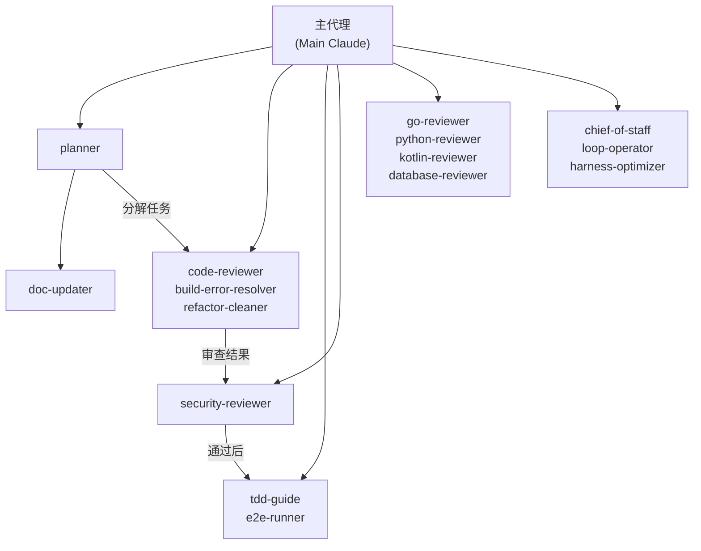
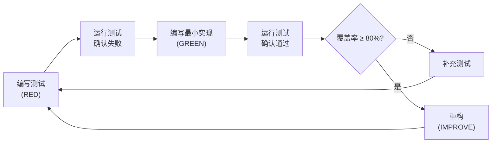
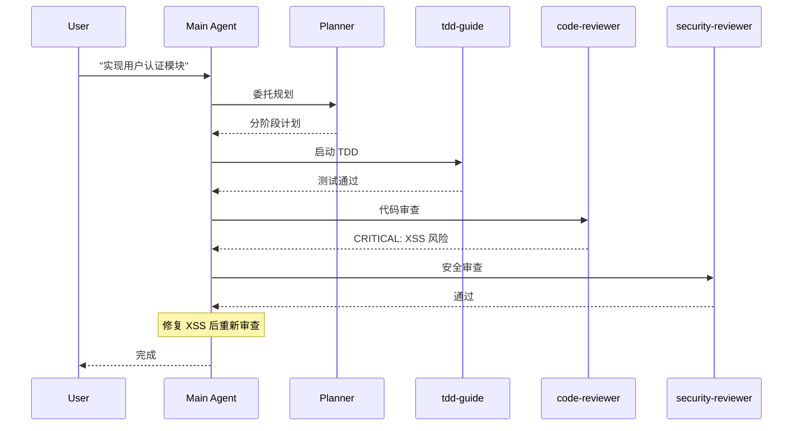
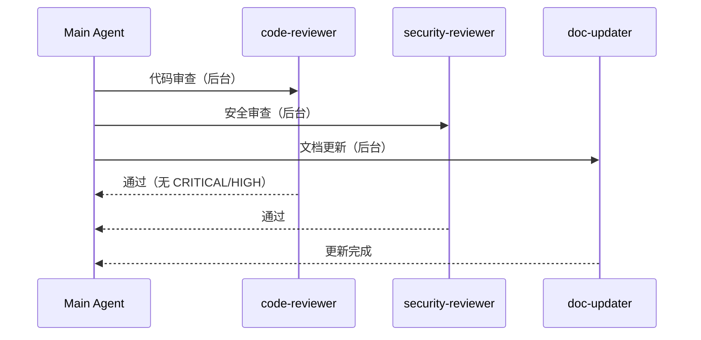

<details>
<summary>相关源文件</summary>

生成本页时使用的主要源文件：

- [AGENTS.md](../../../project-repos/everythingclaudecode/AGENTS.md)
- [agents/planner.md](../../../project-repos/everythingclaudecode/agents/planner.md)
- [agents/code-reviewer.md](../../../project-repos/everythingclaudecode/agents/code-reviewer.md)
- [agents/tdd-guide.md](../../../project-repos/everythingclaudecode/agents/tdd-guide.md)
- [agents/security-reviewer.md](../../../project-repos/everythingclaudecode/agents/security-reviewer.md)
- [agents/e2e-runner.md](../../../project-repos/everythingclaudecode/agents/e2e-runner.md)
- [agents/chief-of-staff.md](../../../project-repos/everythingclaudecode/agents/chief-of-staff.md)
- [agents/loop-operator.md](../../../project-repos/everythingclaudecode/agents/loop-operator.md)

</details>

# 代理体系

ECC 的代理系统是整个配置体系的**决策中枢**。16 个专业代理各自拥有明确的职责边界，通过自然语言委托即可激活，不需要手工写提示词。代理之间可以并行启动，互不干扰——这是 ECC 区别于单代理方案的关键：把不同性质的任务交给最合适的专业代理，避免一个通用 AI 在安全审查和技术债清理之间"精神分裂"。

## 代理架构原则

ECC 的代理设计遵循几个核心原则（来自 `AGENTS.md`）：

- **Immutability** — 所有函数返回新对象，从不修改现有状态。这一约束在代理层面同样适用：代理的输出是对新状态的建议，而非对现有代码的直接修改。
- **Agent-First** — 遇到复杂任务时，优先委托专业代理，而非在主会话里处理。代理有自己独立的上下文窗口和工具集。
- **Parallel by default** — 独立任务并行启动，不顺序等待。例如代码审查和安全检查可以同时进行。
- **Security gate** — 所有提交前必须经过 `security-reviewer`，安全问题是阻断级的。

## 代理分类总览



## 核心代理详解

### planner — 实现规划

`agents/planner.md` 定义了规划代理的行为模式。它不是简单地列清单，而是要求：

1. **识别依赖和风险** — 任务分解后，标注哪些子任务可以并行、哪些存在依赖链
2. **分阶段推进** — 不在第一次回复中给出完整实现计划，而是根据优先级分阶段输出
3. **生成实施计划** — 包含具体的文件变更、测试策略、验证步骤

规划代理的输出直接决定后续代理的工作边界——好的规划是 TDD 和代码审查的前提。

### code-reviewer — 代码质量门禁

`agents/code-reviewer.md` 定义了强制质量门禁。审查结果分为四级：

| 级别 | 含义 | 处置 |
|------|------|------|
| CRITICAL | 安全漏洞、数据损坏风险 | **必须修复**才能继续 |
| HIGH | 内存泄漏、空指针、严重逻辑错误 | 建议修复 |
| MEDIUM | 可维护性、代码风格 | 建议改进 |
| LOW | 格式、注释 | 可忽略 |

关键约束：**CRITICAL 和 HIGH 问题必须在提交前全部解决**，不允许技术负责人绕过。这一约束通过 ECC 的规则系统强制执行。

### tdd-guide — 测试先行工作流

`agents/tdd-guide.md` 强制执行 TDD 循环：



覆盖率红线 **80%** 不可绕过。这一数字来自 ECC 作者 10 个月日常使用的经验值——低于此门槛的测试覆盖率在实际项目中几乎等同于没有测试。

### security-reviewer — 安全门禁

`agents/security-reviewer.md` 是 ECC 最严格的门禁代理。检查范围：

- **硬编码密钥** — API key、password、token、credential
- **注入攻击** — SQL injection（参数化查询检查）、XSS（HTML 净化检查）、CSRF
- **认证授权** — 端点是否缺少权限验证
- **错误处理** — 错误信息是否泄露敏感数据
- **速率限制** — 公开端点是否缺少 rate limiting

发现安全问题时的处理流程：STOP → security-reviewer → 修复 CRITICAL → 轮转暴露的密钥 → 全局搜索同类问题。

### e2e-runner — Playwright 端到端测试

`agents/e2e-runner.md` 管理 Playwright 测试的生成和执行。核心能力：

- 基于用户故事生成 Playwright 测试用例
- 自动生成 locators（通过语义化查询而非 CSS 选择器）
- 支持多浏览器（Chromium / Firefox / WebKit）
- CI 环境适配（headless、并行分片）

### chief-of-staff — 沟通分类

`agents/chief-of-staff.md` 面向多渠道沟通场景（邮件、Slack、 LINE、Messenger），将收到的消息分类并生成草稿回复。这是 ECC 中唯一一个面向**非开发任务**的代理，体现了 ECC 设计者"AI 助手应覆盖知识工作全场景"的理念。

### loop-operator — 自主循环执行

`agents/loop-operator.md` 解决 Claude Code 的 turn-based 限制——平台不支持真正的 event-driven 并行监听。通过 `loop-operator`，可以在一个 turn 内安全地启动长时间运行的后台循环，监控是否 stall，并在需要干预时介入。

### harness-optimizer — 评测配置调优

`agents/harness-optimizer.md` 针对 AI 评测场景（LLM-as-judge、pass@k 指标、评分器类型），调优评测配置的可靠性、成本和吞吐量。这是 ECC 中面向**AI 工程**（而非纯软件工程）的专业代理。

## 代理编排模式

ECC 的代理编排有两种主要模式：

**顺序委托**：规划 → TDD → 代码审查 → 安全审查 → 重构 → 提交


**并行委托**：独立任务同时分派


Sources: [AGENTS.md:1-147](AGENTS.md#L1-L147), [agents/planner.md:1-50](../../../project-repos/pages/agents/planner.md#L1-L50), [agents/code-reviewer.md:1-50](../../../project-repos/pages/agents/code-reviewer.md#L1-L50), [agents/tdd-guide.md:1-50](../../../project-repos/pages/agents/tdd-guide.md#L1-L50), [agents/security-reviewer.md:1-50](../../../project-repos/pages/agents/security-reviewer.md#L1-L50), [agents/loop-operator.md:1-36](../../../project-repos/pages/agents/loop-operator.md#L1-L36)

<details class="source-snippets">
<summary>引用源码</summary>

<!-- source-snippets:start -->

#### `AGENTS.md:1-147`

````markdown
<details>
<summary>相关源文件</summary>

生成本页时使用的主要源文件：

- [AGENTS.md](../../../project-repos/everythingclaudecode/AGENTS.md)
- [agents/planner.md](../../../project-repos/everythingclaudecode/agents/planner.md)
- [agents/code-reviewer.md](../../../project-repos/everythingclaudecode/agents/code-reviewer.md)
- [agents/tdd-guide.md](../../../project-repos/everythingclaudecode/agents/tdd-guide.md)
- [agents/security-reviewer.md](../../../project-repos/everythingclaudecode/agents/security-reviewer.md)
- [agents/e2e-runner.md](../../../project-repos/everythingclaudecode/agents/e2e-runner.md)
- [agents/chief-of-staff.md](../../../project-repos/everythingclaudecode/agents/chief-of-staff.md)
- [agents/loop-operator.md](../../../project-repos/everythingclaudecode/agents/loop-operator.md)

</details>

# 代理体系

ECC 的代理系统是整个配置体系的**决策中枢**。16 个专业代理各自拥有明确的职责边界，通过自然语言委托即可激活，不需要手工写提示词。代理之间可以并行启动，互不干扰——这是 ECC 区别于单代理方案的关键：把不同性质的任务交给最合适的专业代理，避免一个通用 AI 在安全审查和技术债清理之间"精神分裂"。

## 代理架构原则

ECC 的代理设计遵循几个核心原则（来自 `AGENTS.md`）：

- **Immutability** — 所有函数返回新对象，从不修改现有状态。这一约束在代理层面同样适用：代理的输出是对新状态的建议，而非对现有代码的直接修改。
- **Agent-First** — 遇到复杂任务时，优先委托专业代理，而非在主会话里处理。代理有自己独立的上下文窗口和工具集。
- **Parallel by default** — 独立任务并行启动，不顺序等待。例如代码审查和安全检查可以同时进行。
- **Security gate** — 所有提交前必须经过 `security-reviewer`，安全问题是阻断级的。

## 代理分类总览


## 核心代理详解

### planner — 实现规划

`agents/planner.md` 定义了规划代理的行为模式。它不是简单地列清单，而是要求：

1. **识别依赖和风险** — 任务分解后，标注哪些子任务可以并行、哪些存在依赖链
2. **分阶段推进** — 不在第一次回复中给出完整实现计划，而是根据优先级分阶段输出
3. **生成实施计划** — 包含具体的文件变更、测试策略、验证步骤

规划代理的输出直接决定后续代理的工作边界——好的规划是 TDD 和代码审查的前提。

### code-reviewer — 代码质量门禁

`agents/code-reviewer.md` 定义了强制质量门禁。审查结果分为四级：

| 级别 | 含义 | 处置 |
|------|------|------|
| CRITICAL | 安全漏洞、数据损坏风险 | **必须修复**才能继续 |
| HIGH | 内存泄漏、空指针、严重逻辑错误 | 建议修复 |
| MEDIUM | 可维护性、代码风格 | 建议改进 |
| LOW | 格式、注释 | 可忽略 |

关键约束：**CRITICAL 和 HIGH 问题必须在提交前全部解决**，不允许技术负责人绕过。这一约束通过 ECC 的规则系统强制执行。

### tdd-guide — 测试先行工作流

`agents/tdd-guide.md` 强制执行 TDD 循环：


覆盖率红线 **80%** 不可绕过。这一数字来自 ECC 作者 10 个月日常使用的经验值——低于此门槛的测试覆盖率在实际项目中几乎等同于没有测试。

### security-reviewer — 安全门禁

`agents/security-reviewer.md` 是 ECC 最严格的门禁代理。检查范围：

- **硬编码密钥** — API key、password、token、credential
- **注入攻击** — SQL injection（参数化查询检查）、XSS（HTML 净化检查）、CSRF
- **认证授权** — 端点是否缺少权限验证
- **错误处理** — 错误信息是否泄露敏感数据
- **速率限制** — 公开端点是否缺少 rate limiting

发现安全问题时的处理流程：STOP → security-reviewer → 修复 CRITICAL → 轮转暴露的密钥 → 全局搜索同类问题。

### e2e-runner — Playwright 端到端测试

`agents/e2e-runner.md` 管理 Playwright 测试的生成和执行。核心能力：

- 基于用户故事生成 Playwright 测试用例
- 自动生成 locators（通过语义化查询而非 CSS 选择器）
- 支持多浏览器（Chromium / Firefox / WebKit）
- CI 环境适配（headless、并行分片）

### chief-of-staff — 沟通分类

`agents/chief-of-staff.md` 面向多渠道沟通场景（邮件、Slack、 LINE、Messenger），将收到的消息分类并生成草稿回复。这是 ECC 中唯一一个面向**非开发任务**的代理，体现了 ECC 设计者"AI 助手应覆盖知识工作全场景"的理念。

### loop-operator — 自主循环执行

`agents/loop-operator.md` 解决 Claude Code 的 turn-based 限制——平台不支持真正的 event-driven 并行监听。通过 `loop-operator`，可以在一个 turn 内安全地启动长时间运行的后台循环，监控是否 stall，并在需要干预时介入。
... snippet truncated ...
````

#### `agents/planner.md:1-50`

> 未找到引用文件：`agents/planner.md`

#### `agents/code-reviewer.md:1-50`

> 未找到引用文件：`agents/code-reviewer.md`

#### `agents/tdd-guide.md:1-50`

> 未找到引用文件：`agents/tdd-guide.md`

#### `agents/security-reviewer.md:1-50`

> 未找到引用文件：`agents/security-reviewer.md`

#### `agents/loop-operator.md:1-36`

> 未找到引用文件：`agents/loop-operator.md`

<!-- source-snippets:end -->
</details>
