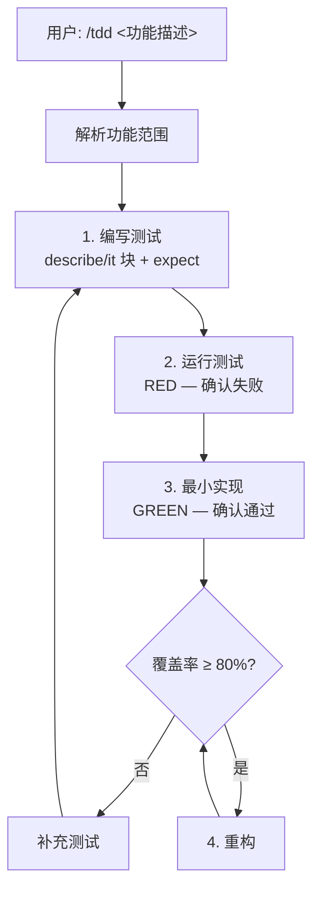
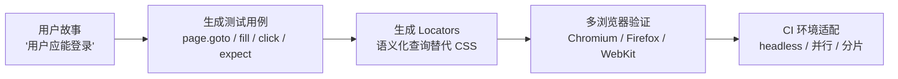
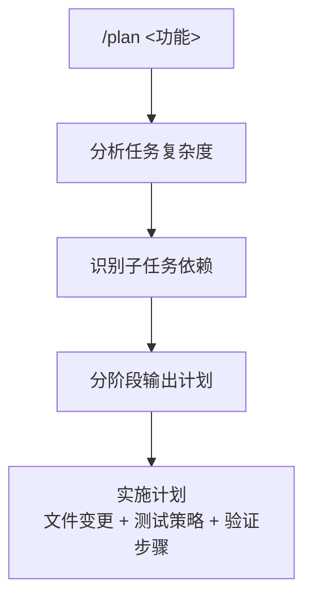
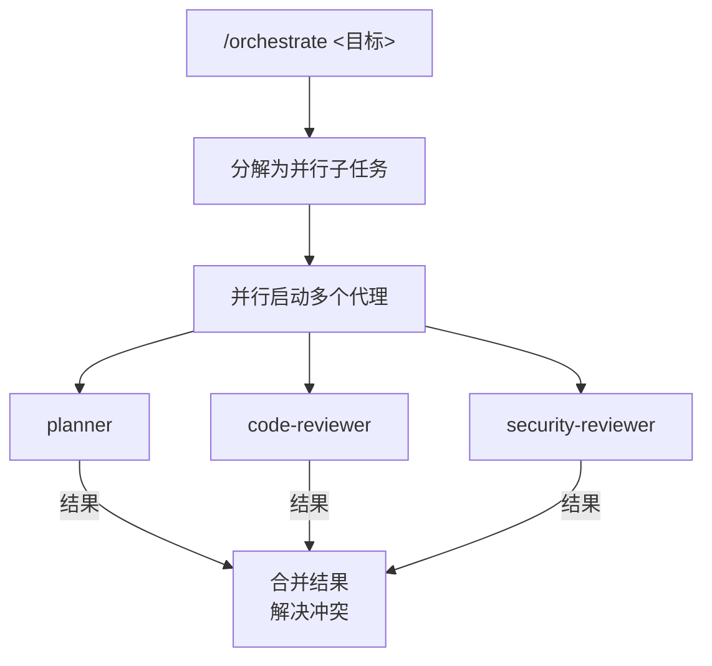

<details>
<summary>相关源文件</summary>

生成本页时使用的主要源文件：

- [commands/tdd.md](../../../project-repos/everythingclaudecode/commands/tdd.md)
- [commands/e2e.md](../../../project-repos/everythingclaudecode/commands/e2e.md)
- [commands/plan.md](../../../project-repos/everythingclaudecode/commands/plan.md)
- [commands/skill-create.md](../../../project-repos/everythingclaudecode/commands/skill-create.md)
- [commands/learn.md](../../../project-repos/everythingclaudecode/commands/learn.md)
- [commands/orchestrate.md](../../../project-repos/everythingclaudecode/commands/orchestrate.md)

</details>

# 命令系统

ECC 的命令（Commands）是技能的**可执行入口**。通过斜杠命令 `/<command>` 触发一系列预定义的工作流，无需记忆具体技能文件路径。40+ 命令覆盖从代码实现到质量门禁的完整开发链路，每个命令背后都绑定了一个或多个技能和代理的组合。

## 命令与技能的关系

**技能**（Skills）存储在 `~/.claude/skills/`，是工作流的定义文档，被代理调用时加载。
**命令**（Commands）存储在 `~/.claude/commands/`，是用户直接交互的入口，通过 `/command` 触发。

两者有重叠——一个命令可以调用多个技能，一个技能也可以被多个命令共享。`/tdd` 命令执行 TDD 工作流，背后绑定了 `tdd-guide` 代理和 `tdd-workflow` 技能。

## 核心命令详解

### /tdd — 测试先行开发

`commands/tdd.md` 定义了完整的 TDD 工作流：



关键参数：
- `--scope <path>` — 指定 TDD 覆盖的文件范围
- `--framework <name>` — 指定测试框架（jest / vitest / pytest / go test 等）
- `--watch` — 持续监听文件变化自动运行测试

### /e2e — Playwright 端到端测试

`commands/e2e.md` 是 ECC 中最复杂的命令之一，支持从用户故事生成完整的 Playwright 测试：



参数：
- `--story <text>` — 自然语言描述的用户故事
- `--output <path>` — 测试文件输出路径
- `--browsers <list>` — 指定浏览器（默认 Chromium）

### /plan — 实现规划

`commands/plan.md` 激活 planner 代理，生成结构化的实施计划：



### /learn — 从会话提取模式

`commands/learn.md` 是持续学习的交互式入口。调用 `scripts/hooks/evaluate-session.js` 分析当前会话，提炼出可复用的模式：

```bash
# 基本用法
/learn

# 指定会话
/learn --session <session-id>

# 仅显示结果，不写入文件
/learn --dry-run
```

### /skill-create — 从 Git 历史生成技能

`commands/skill-create.md` 将 git commit 历史转化为技能文件：

```bash
# 分析指定目录的 git 历史
/skill-create --path <module-path>

# 指定生成的技能名称
/skill-create --path api --name api-design
```

工作原理：
1. 读取 git log 中指定路径的 commit 历史
2. 提取 commit message 作为技能章节
3. 分析 diff 中的设计决策作为 `How It Works`
4. 生成符合 `SKILL.md` 格式的文件

### /orchestrate — 多代理编排

`commands/orchestrate.md` 是 ECC 最强大的编排命令，在一个主会话中协调多个代理并行工作：



## 命令分类表

| 命令 | 类型 | 用途 |
|------|------|------|
| `/tdd` | 开发流 | 测试先行开发 |
| `/e2e` | 测试 | Playwright 端到端测试 |
| `/plan` | 规划 | 复杂功能规划 |
| `/code-review` | 质量 | 代码审查 |
| `/build-fix` | 调试 | 构建错误修复 |
| `/go-build` / `/go-review` / `/go-test` | Go 专项 | Go 项目专用命令 |
| `/python-review` | Python 专项 | Python 代码审查 |
| `/test-coverage` | 质量 | 覆盖率检查 |
| `/learn` | 学习 | 会话模式提取 |
| `/skill-create` | 元开发 | 从 git 历史生成技能 |
| `/instinct-export` / `instinct-import` | 本能系统 | instinct 跨环境迁移 |
| `/loop-start` / `loop-status` | 自主运行 | 后台循环管理 |
| `/sessions` / `save-session` / `resume-session` | 会话管理 | Claude Code 会话持久化 |
| `/model-route` | 成本优化 | 模型选择建议 |
| `/checkpoint` | 快照 | 进度快照保存 |
| `/verify` | 质量门禁 | 提交前验证 |
| `/multi-plan` / `multi-execute` / `multi-workflow` | 并行 | 多实例并行工作流 |
| `/pm2` | 部署 | PM2 进程管理 |
| `/evolve` | 学习进化 | 技能进化优化 |
| `/eval` | 评测 | 评测执行 |
| `/harness-audit` | 评测配置 | harness 配置审计 |
| `/refactor-clean` | 重构 | 死代码清理 |
| `/update-codemaps` | 文档 | 代码地图更新 |
| `/update-docs` | 文档 | 文档更新 |
| `/quality-gate` | 质量门禁 | 综合质量检查 |
| `/setup-pm` | 配置 | 包管理器设置 |
| `/security` | 安全 | 安全审计 |
| `/gradle-build` | 构建 | Gradle 项目构建 |

Sources: [commands/tdd.md:1-80](../../../project-repos/pages/commands/tdd.md#L1-L80), [commands/e2e.md:1-100](../../../project-repos/pages/commands/e2e.md#L1-L100), [commands/plan.md:1-50](../../../project-repos/pages/commands/plan.md#L1-L50), [commands/skill-create.md:1-60](../../../project-repos/pages/commands/skill-create.md#L1-L60), [commands/learn.md:1-40](../../../project-repos/pages/commands/learn.md#L1-L40)

<details class="source-snippets">
<summary>引用源码</summary>

<!-- source-snippets:start -->

#### `commands/tdd.md:1-80`

> 未找到引用文件：`commands/tdd.md`

#### `commands/e2e.md:1-100`

> 未找到引用文件：`commands/e2e.md`

#### `commands/plan.md:1-50`

> 未找到引用文件：`commands/plan.md`

#### `commands/skill-create.md:1-60`

> 未找到引用文件：`commands/skill-create.md`

#### `commands/learn.md:1-40`

> 未找到引用文件：`commands/learn.md`

<!-- source-snippets:end -->
</details>
