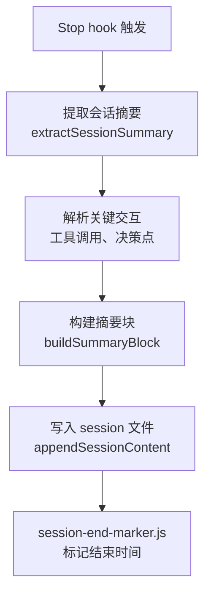
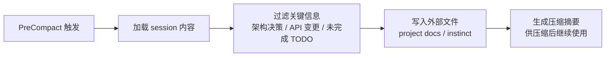

<details>
<summary>相关源文件</summary>

生成本页时使用的主要源文件：

- [hooks/hooks.json](../../../project-repos/everythingclaudecode/hooks/hooks.json)
- [hooks/README.md](../../../project-repos/everythingclaudecode/hooks/README.md)
- [scripts/hooks/session-end.js](../../../project-repos/everythingclaudecode/scripts/hooks/session-end.js)
- [scripts/hooks/session-start.js](../../../project-repos/everythingclaudecode/scripts/hooks/session-start.js)
- [scripts/hooks/pre-compact.js](../../../project-repos/everythingclaudecode/scripts/hooks/pre-compact.js)
- [scripts/hooks/cost-tracker.js](../../../project-repos/everythingclaudecode/scripts/hooks/cost-tracker.js)

</details>

# 钩子与自动化

ECC 的钩子系统是**事件驱动的自动化层**，在 Claude Code 的生命周期关键节点自动触发预设行为。与命令（需要手动调用）不同，钩子监听系统事件并在匹配条件时自动执行，实现"设置一次，永久生效"的自动化。

## 钩子类型体系

ECC 定义了 6 种钩子触发类型（来自 `hooks/hooks.json` 的 schema）：

| 触发类型 | 时机 | 典型用途 |
|----------|------|----------|
| `PreToolUse` | 工具执行前 | 验证参数、拦截危险命令、显示提醒 |
| `PostToolUse` | 工具执行后 | 格式化输出、运行质量门禁、成本追踪 |
| `UserPromptSubmit` | 用户提交消息时 | pre-commit 检查、上下文注入 |
| `Stop` | 主代理停止响应时 | session 摘要生成、标记完成状态 |
| `PreCompact` | 上下文压缩前 | 提取关键信息到外部存储、session 压缩 |
| `Notification` | 需要用户授权时 | 权限请求格式化 |

## hooks.json 结构

`hooks/hooks.json` 是 ECC 钩子系统的中央配置，格式如下：

```json
{
  "$schema": "...",
  "hooks": {
    "PreToolUse": [
      {
        "id": "tmux-reminder",
        "matcher": "tool == \"Bash\" && tool_input.command matches \"(npm|pnpm|yarn)\"",
        "profiles": ["default"],
        "hooks": [
          {
            "type": "command",
            "command": "if [ -z \"$TMUX\" ]; then echo 'Consider tmux for session persistence' >&2; fi"
          }
        ]
      }
    ],
    "PostToolUse": [...],
    "Stop": [...],
    "PreCompact": [...]
  }
}
```

**matcher** 表达式支持：
- `tool == "Bash"` — 工具名匹配
- `tool_input.command matches "<regex>"` — 命令内容正则匹配
- `session_info.project_type == "typescript"` — 项目类型匹配
- `&&` / `||` 逻辑组合

## 核心钩子详解

### session-end — 会话结束钩子

`sessions/hooks/session-end.js` 是 ECC 中最复杂的钩子之一，在主代理停止响应时执行会话摘要：



关键函数（来自 `scripts/hooks/session-end.js`）：

- `extractSessionSummary(turns)` — 从对话轮次中提取关键信息
- `buildSummarySection()` — 构建摘要的结构化文本
- `buildSummaryBlock()` — 生成可追加到 session 文件的完整块
- `escapeRegExp()` — 防止摘要内容破坏 session 文件格式

### session-start — 会话启动钩子

`sessions/hooks/session-start.js` 在新会话开始时执行：

- 读取项目的 `.claude/` 配置（如包管理器偏好、语言设置）
- 加载项目的编码规则和环境变量
- 显示上次未完成的工作摘要

### pre-compact — 上下文压缩钩子

`sessions/hooks/pre-compact.js` 在 Claude Code 压缩上下文前执行，提取重要信息到外部存储：



### cost-tracker — LLM 成本追踪

`sessions/hooks/cost-tracker.js` 追踪每次 API 调用的 token 消耗：

```javascript
// 来自 scripts/hooks/cost-tracker.js
function estimateCost(model, inputTokens, outputTokens) {
  // 各模型的每 1M token 价格（单位：美元）
  const PRICES = {
    'claude-opus-4': { input: 15, output: 75 },
    'claude-sonnet-4': { input: 3, output: 15 },
    'claude-haiku-3': { input: 0.8, output: 4 }
  }
  // 计算总成本
}
```

### pre-bash-dev-server-block — 开发服务器拦截

`sessions/hooks/pre-bash-dev-server-block.js` 拦截 `npm run dev` 等开发服务器命令，防止意外启动多个实例：

```javascript
// 关键逻辑：检查 TMUX 窗格中是否已有同类进程
// 如果有，提示用户选择：新建窗格 / 复用现有 / 取消
```

## 钩子脚本与 Claude Code 的通信协议

Claude Code 钩子通过 **stdin/stdout** 通信：

1. Claude Code 通过 stdin 传入 JSON 格式的 hook event
2. 钩子脚本处理后通过 stdout 返回结果
3. 如果需要显示通知，向 stderr 写入消息（Claude Code 捕获并显示）

```javascript
// 来自 .cursor/hooks/adapter.js
function readStdin() {
  // 从 stdin 读取 Claude Code 传入的 hook 事件
  let data = ''
  process.stdin.on('data', chunk => data += chunk)
  return JSON.parse(data)
}
```

## 钩子与规则的协同

钩子不是孤立运行的。与规则系统协同：

```mermaid
flowchart TD
    HOOK["PreToolUse Hook"]
    HOOK --> MATCHER{"matcher 匹配?"}
    MATCHER -->|"是"| RUN["执行钩子脚本"]
    RUN --> PASS{"通过?"}
    PASS -->|"否"| BLOCK["阻止工具执行<br/>返回错误"]
    PASS -->|"是"| TOOL["继续执行工具"]
    MATCHER -->|"否"| TOOL
    
    STYLE BLOCK fill:#ff6b6b,color:#fff
    STYLE TOOL fill:#51cf66,color:#fff
```

Sources: [hooks/hooks.json:1-50](../../../project-repos/pages/hooks/hooks.json#L1-L50), [hooks/README.md:1-60](../../../project-repos/pages/hooks/README.md#L1-L60), [scripts/hooks/session-end.js:1-80](../../../project-repos/pages/scripts/hooks/session-end.js#L1-L80), [scripts/hooks/session-start.js:1-50](../../../project-repos/pages/scripts/hooks/session-start.js#L1-L50), [scripts/hooks/pre-compact.js:1-48](../../../project-repos/pages/scripts/hooks/pre-compact.js#L1-L48)

<details class="source-snippets">
<summary>引用源码</summary>

<!-- source-snippets:start -->

#### `hooks/hooks.json:1-50`

> 未找到引用文件：`hooks/hooks.json`

#### `hooks/README.md:1-60`

> 未找到引用文件：`hooks/README.md`

#### `scripts/hooks/session-end.js:1-80`

> 未找到引用文件：`scripts/hooks/session-end.js`

#### `scripts/hooks/session-start.js:1-50`

> 未找到引用文件：`scripts/hooks/session-start.js`

#### `scripts/hooks/pre-compact.js:1-48`

> 未找到引用文件：`scripts/hooks/pre-compact.js`

<!-- source-snippets:end -->
</details>
