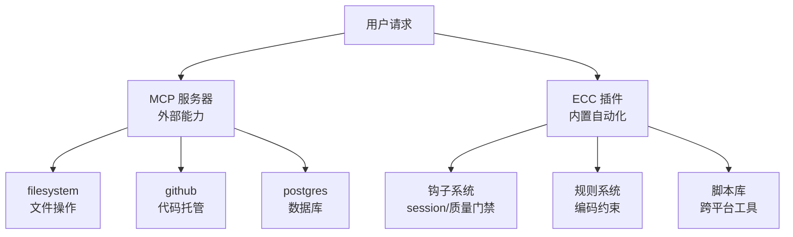

<details>
<summary>相关源文件</summary>

生成本页时使用的主要源文件：

- [mcp-configs/mcp-servers.json](../../../project-repos/everythingclaudecode/mcp-configs/mcp-servers.json)
- [.claude-plugin/plugin.json](../../../project-repos/everythingclaudecode/.claude-plugin/plugin.json)
- [.claude-plugin/marketplace.json](../../../project-repos/everythingclaudecode/.claude-plugin/marketplace.json)
- [.opencode/plugins/ecc-hooks.ts](../../../project-repos/everythingclaudecode/.opencode/plugins/ecc-hooks.ts)
- [.opencode/opencode.json](../../../project-repos/everythingclaudecode/.opencode/opencode.json)

</details>

# MCP 与扩展集成

ECC 通过 MCP（Model Context Protocol）和插件系统实现与外部工具的深度集成。MCP 配置文件定义了 ECC 可调用的外部服务器，插件系统则允许 ECC 的行为向 OpenCode 等平台延伸。

## MCP 服务器配置

`mcp-configs/mcp-servers.json` 定义了 ECC 预置的 14 个 MCP 服务器连接配置：

```json
{
  "mcpServers": {
    "filesystem": {
      "command": "npx",
      "args": ["-y", "@modelcontextprotocol/server-filesystem", "/Users/user/projects"],
      "description": "文件系统访问"
    },
    "github": {
      "command": "npx",
      "args": ["-y", "@modelcontextprotocol/server-github"],
      "description": "GitHub API 集成"
    }
  }
}
```

ECC 预置的 MCP 服务器包括：

| 服务器 | 用途 |
|--------|------|
| `filesystem` | 本地文件系统浏览 |
| `github` | GitHub API（PR、Issue、Repo 操作） |
| `slack` | Slack 消息发送 |
| `postgres` | PostgreSQL 直接查询 |
| `brave-search` | 网页搜索 |
| 等（共 14 个） |

## ECC 插件架构

`.claude-plugin/plugin.json` 定义了 ECC 作为 Claude Code 插件的元数据：

```json
{
  "name": "everything-claude-code",
  "version": "1.8.0",
  "description": "Complete collection of battle-tested Claude Code configs",
  "author": {
    "name": "Affaan Mustafa",
    "url": "https://x.com/affaanmustafa"
  },
  "schema_version": "1.0"
}
```

`marketplace.json` 则定义了插件市场的发布配置，包括插件的命名空间（`affaan-m/everything-claude-code`）和安装命令。

安装方式：
```bash
# 添加市场
/plugin marketplace add affaan-m/everything-claude-code

# 安装插件
/plugin install everything-claude-code@everything-claude-code
```

## OpenCode 插件（ecc-hooks）

ECC 同时提供了 OpenCode 平台的插件实现（`.opencode/plugins/ecc-hooks.ts`），以 TypeScript 编写，提供更丰富的可编程性：

```typescript
// 来自 .opencode/plugins/ecc-hooks.ts
class ECCHooksPlugin {
  constructor(config: { profiles?: Record<string, HookProfile> }) {
    this.profiles = normalizeProfile(config.profiles)
  }

  // 根据配置文件启用/禁用特定钩子
  hookEnabled(hookId: string, profile: string): boolean {
    return profileAllowed(this.profiles, hookId, profile)
  }
}
```

ECC 的 OpenCode 插件核心能力：
- **多 profile 支持** — 不同项目启用不同的钩子集
- **hook 条件判断** — 基于 matcher 表达式的精细化触发控制
- **工具层适配** — 适配 OpenCode 的工具调用接口

## 插件与 MCP 的协同



## OpenCode 工具集

ECC 的 OpenCode 插件还提供了一套 TypeScript 工具（`.opencode/tools/`）：

| 工具 | 文件 | 功能 |
|------|------|------|
| `check-coverage` | `check-coverage.ts` | 解析覆盖率报告，验证 80% 红线 |
| `lint-check` | `lint-check.ts` | 自动检测项目 linter 并运行 |
| `format-code` | `format-code.ts` | 自动检测并运行格式化工具 |
| `run-tests` | `run-tests.ts` | 自动检测测试框架并执行 |
| `security-audit` | `security-audit.ts` | 扫描硬编码密钥和常见漏洞模式 |
| `git-summary` | `git-summary.ts` | 生成 git 变更摘要 |

Sources: [mcp-configs/mcp-servers.json:1-50](../../../project-repos/pages/mcp-configs/mcp-servers.json#L1-L50), [claude-plugin/plugin.json:1-25](../../../project-repos/pages/claude-plugin/plugin.json#L1-L25), [opencode/plugins/ecc-hooks.ts:1-60](../../../project-repos/pages/opencode/plugins/ecc-hooks.ts#L1-L60)

<details class="source-snippets">
<summary>引用源码</summary>

<!-- source-snippets:start -->

#### `mcp-configs/mcp-servers.json:1-50`

> 未找到引用文件：`mcp-configs/mcp-servers.json`

#### `claude-plugin/plugin.json:1-25`

> 未找到引用文件：`claude-plugin/plugin.json`

#### `opencode/plugins/ecc-hooks.ts:1-60`

> 未找到引用文件：`opencode/plugins/ecc-hooks.ts`

<!-- source-snippets:end -->
</details>
