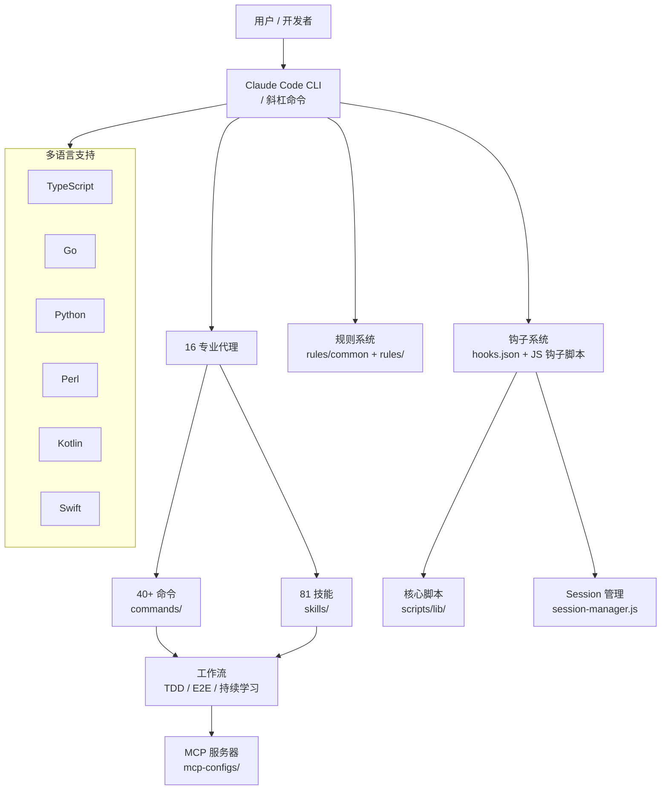

<details>
<summary>相关源文件</summary>

生成本页时使用的主要源文件：

- [README.md](../../../project-repos/everythingclaudecode/README.md)
- [README.zh-CN.md](../../../project-repos/everythingclaudecode/README.zh-CN.md)
- [AGENTS.md](../../../project-repos/everythingclaudecode/AGENTS.md)
- [CLAUDE.md](../../../project-repos/everythingclaudecode/CLAUDE.md)
- [package.json](../../../project-repos/everythingclaudecode/package.json)
- [the-shortform-guide.md](../../../project-repos/everythingclaudecode/the-shortform-guide.md)

</details>

# 项目概览

ECC（Everything Claude Code）是一个经过 10 多个月密集日常使用演化而来的**生产级 Claude Code 配置集合**，由 Anthropic 黑客马拉松获胜者构建维护。核心价值主张：**把 AI 编程工具从"能用"提升到"专业团队日常使用"的级别**——不是零散地给几个提示词，而是系统性地覆盖软件开发全生命周期：规划、编码、测试、审查、安全、部署、持续学习。

## 为什么做这个

Claude Code 的默认能力已经很强，但面对真实项目开发时存在两个核心缺口：

1. **上下文管理困境** — 长会话导致上下文膨胀，AI 开始遗忘项目约定；短会话又丢失积累的知识。需要在两者之间建立持久化记忆机制。
2. **专业深度不足** — 通用的代码审查不如 PostgreSQL 专家的审查有用；TDD 流程没有强制的测试覆盖率门槛就容易流于形式。不同技术栈、不同质量目标需要不同的**专门化代理和工作流**来支撑。

ECC 的解法是把软件开发拆解为可组合的专业子系统：代理负责思考（planner/architect），技能负责领域知识（TDD、安全审查），命令负责工作流入口（/tdd、/e2e），钩子负责自动化（session 持久化、pre-commit 检查），规则负责底线约束（不可变原则、80% 覆盖率红线）。

## 能力全景

**16 个专业代理**，覆盖软件开发完整链条：

| 代理 | 职责 | 何时启用 |
|------|------|----------|
| `planner` | 复杂功能的实现规划 | 功能需求复杂、涉及多模块 |
| `architect` | 系统设计和可扩展性审查 | 架构决策、跨模块重构 |
| `tdd-guide` | 测试先行、TDD 全流程推进 | 新功能、bug 修复 |
| `code-reviewer` | 代码质量与可维护性审查 | 每次代码修改后 |
| `security-reviewer` | 安全漏洞检测 | 提交前、敏感代码 |
| `build-error-resolver` | 构建/类型错误修复 | 构建失败时 |
| `e2e-runner` | Playwright 端到端测试 | 关键用户流程 |
| `refactor-cleaner` | 死代码清理 | 维护阶段 |
| `database-reviewer` | PostgreSQL/Supabase 专家 |  Schema 设计、查询优化 |
| `python-reviewer` / `go-reviewer` / `kotlin-reviewer` | 语言专属审查 | 各语言项目 |
| `chief-of-staff` | 多渠道沟通分类和草稿 | 邮件、Slack、Messenger |
| `loop-operator` | 自主循环安全执行 | 需要后台持续运行任务 |
| `harness-optimizer` | 评测配置调优 | 可靠性/成本/吞吐量优化 |

**81 个技能**，覆盖从编码规范（coding-standards）到垂直领域（django-patterns、swiftui-patterns、golang-testing）的全场景。

**40+ 斜杠命令**，提供 `/tdd`、`/e2e`、`/plan`、`/code-review`、`/learn`、`/skill-create` 等一键工作流入口。

**跨平台钩子系统**，基于 JSON 配置的触发式自动化，覆盖 session 持久化、成本追踪、格式检查、安全审计、pre-compact 压缩等场景。

**多语言规则体系**，TypeScript / Go / Python / Perl / Kotlin / Swift / PHP 各自独立的 coding-style、security、testing、patterns 规则集。

## 架构鸟瞰



## 技术栈与数据

- **npm 包**：`ecc-universal@1.8.0`，包含 81 个技能、16 个代理、40+ 命令
- **核心语言**：TypeScript（Node.js）、Shell、Python、Perl
- **代理格式**：Markdown + YAML frontmatter（`name`、`description`、`tools`、`model`）
- **技能格式**：Markdown，分 `When to Use`、`How It Works`、`Examples` 章节
- **钩子格式**：JSON + JavaScript，触发类型覆盖 PreToolUse / PostToolUse / UserPromptSubmit / Stop / PreCompact
- **支持平台**：macOS / Linux / Windows（通过 Node.js 跨平台脚本）
- **包管理器检测**：自动识别 npm / pnpm / yarn / bun，支持 `CLAUDE_PACKAGE_MANAGER` 环境变量覆盖

## 阅读路线推荐

根据你的目标选择入口：

- **了解 ECC 能解决什么问题** → 本页（概览）
- **理解代理体系和何时用哪个代理** → [代理体系](agents.md)
- **深入某类具体技能（如 TDD、安全审查）** → [技能系统](skills.md)
- **快速上手日常工作流** → [典型工作流](workflows.md)
- **配置自己的 ECC 环境** → [命令系统](commands.md) + [钩子与自动化](hooks.md)
- **多语言项目如何接入** → [多语言平台支持](platforms.md)
- **扩展 ECC：写自己的 skill/agent** → [技能系统](skills.md) + [核心脚本](scripts.md)

Sources: [README.md:1-50](../../../project-repos/pages/README.md#L1-L50), [AGENTS.md:1-30](AGENTS.md#L1-L30), [package.json:name,version,description](../../../project-repos/pages/package.json:name%2Cversion%2Cdescription), [the-shortform-guide.md:1-80](../../../project-repos/pages/the-shortform-guide.md#L1-L80)

<details class="source-snippets">
<summary>引用源码</summary>

<!-- source-snippets:start -->

#### `README.md:1-50`

> 未找到引用文件：`README.md`

#### `AGENTS.md:1-30`

```markdown
<details>
<summary>相关源文件</summary>

生成本页时使用的主要源文件：

- [AGENTS.md](../../../project-repos/everythingclaudecode/AGENTS.md)
- [agents/planner.md](../../../project-repos/everythingclaudecode/agents/planner.md)
- [agents/code-reviewer.md](../../../project-repos/everythingclaudecode/agents/code-reviewer.md)
- [agents/tdd-guide.md](../../../project-repos/everythingclaudecode/agents/tdd-guide.md)
- [agents/security-reviewer.md](../../../project-repos/everythingclaudecode/agents/security-reviewer.md)
- [agents/e2e-runner.md](../../../project-repos/everythingclaudecode/agents/e2e-runner.md)
- [agents/chief-of-staff.md](../../../project-repos/everythingclaudecode/agents/chief-of-staff.md)
- [agents/loop-operator.md](../../../project-repos/everythingclaudecode/agents/loop-operator.md)

</details>

# 代理体系

ECC 的代理系统是整个配置体系的**决策中枢**。16 个专业代理各自拥有明确的职责边界，通过自然语言委托即可激活，不需要手工写提示词。代理之间可以并行启动，互不干扰——这是 ECC 区别于单代理方案的关键：把不同性质的任务交给最合适的专业代理，避免一个通用 AI 在安全审查和技术债清理之间"精神分裂"。

## 代理架构原则

ECC 的代理设计遵循几个核心原则（来自 `AGENTS.md`）：

- **Immutability** — 所有函数返回新对象，从不修改现有状态。这一约束在代理层面同样适用：代理的输出是对新状态的建议，而非对现有代码的直接修改。
- **Agent-First** — 遇到复杂任务时，优先委托专业代理，而非在主会话里处理。代理有自己独立的上下文窗口和工具集。
- **Parallel by default** — 独立任务并行启动，不顺序等待。例如代码审查和安全检查可以同时进行。
- **Security gate** — 所有提交前必须经过 `security-reviewer`，安全问题是阻断级的。

## 代理分类总览
```

#### `package.json:name,version,description`

> 未找到引用文件：`package.json:name,version,description`

#### `the-shortform-guide.md:1-80`

> 未找到引用文件：`the-shortform-guide.md`

<!-- source-snippets:end -->
</details>
