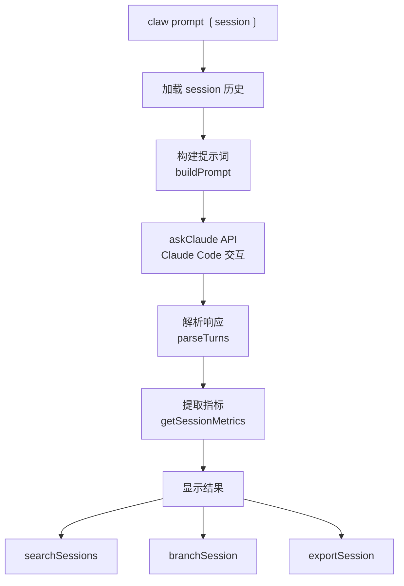
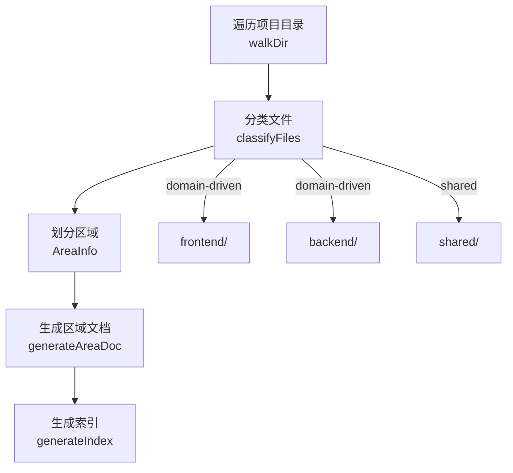

<details>
<summary>相关源文件</summary>

生成本页时使用的主要源文件：

- [scripts/claw.js](../../../project-repos/everythingclaudecode/scripts/claw.js)
- [scripts/lib/package-manager.js](../../../project-repos/everythingclaudecode/scripts/lib/package-manager.js)
- [scripts/lib/session-manager.js](../../../project-repos/everythingclaudecode/scripts/lib/session-manager.js)
- [scripts/codemaps/generate.ts](../../../project-repos/everythingclaudecode/scripts/codemaps/generate.ts)
- [scripts/lib/project-detect.js](../../../project-repos/everythingclaudecode/scripts/lib/project-detect.js)

</details>

# 核心脚本

ECC 的核心脚本是 Node.js 编写的跨平台工具，提供会话管理、包管理器检测、项目类型识别、代码地图生成等基础能力。这些脚本被钩子和命令系统调用，是 ECC 自动化机制的执行层。

## scripts/claw.js — 会话交互核心

`scripts/claw.js` 是 ECC 最复杂的脚本（468 行），负责与 Claude Code 会话进行交互：



关键函数：

- `loadHistory(sessionPath)` — 读取 session JSON 文件
- `estimateTokenCount()` — 估算当前 context 消耗
- `getSessionMetrics()` — 提取 session 指标（工具调用数、错误率、持续时间）
- `searchSessions(query)` — 跨 session 搜索历史
- `branchSession()` — 基于当前 session 创建分支
- `compactSession()` — 调用 PreCompact 钩子压缩 session

## scripts/lib/package-manager.js — 包管理器统一接口

`scripts/lib/package-manager.js` 解决了 ECC 在多语言项目中"哪个命令来安装依赖"的问题——不同项目用不同的包管理器，但上层命令不需要关心细节：

```javascript
// 来自 scripts/lib/package-manager.js
async function getPackageManager(projectRoot) {
  // 1. 检查 CLAUDE_PACKAGE_MANAGER 环境变量（最高优先级）
  if (process.env.CLAUDE_PACKAGE_MANAGER) {
    return detectFromEnv(process.env.CLAUDE_PACKAGE_MANAGER)
  }
  
  // 2. 检查 lock 文件（固定优先级）
  const lockFiles = [
    { file: 'pnpm-lock.yaml', pm: 'pnpm' },
    { file: 'yarn.lock', pm: 'yarn' },
    { file: 'bun.lockb', pm: 'bun' },
    { file: 'package-lock.json', pm: 'npm' }
  ]
  
  // 3. 检测 Python 项目
  if (await fileExists('poetry.lock')) return 'poetry'
  if (await fileExists('requirements.txt')) return 'pip'
}
```

关键接口：

- `getPackageManager(projectRoot)` — 获取当前项目的包管理器
- `getRunCommand(pm, script)` — 获取运行脚本的命令（自动加 `run` 前缀）
- `getExecCommand(pm, pkg, args)` — 获取安装依赖的命令
- `setPreferredPackageManager(pm)` — 设置全局偏好

## scripts/lib/session-manager.js — Session 生命周期管理

`scripts/lib/session-manager.js` 管理 Claude Code session 文件的读写：

```javascript
// session 文件命名格式：<timestamp>-<session-id>.json
// 元数据结构
interface SessionMetadata {
  id: string           // UUID
  title: string        // 自动从首条用户消息提取
  createdAt: Date
  updatedAt: Date
  turnCount: number    // 交互轮次
  tokenEstimate: number
  projectPath: string  // 关联的项目路径
}
```

关键函数：

- `getAllSessions(options)` — 列出所有 session，支持过滤和排序
- `getSessionContent(id)` — 读取完整 session 内容
- `appendSessionContent(id, content)` — 追加到 session 文件
- `parseSessionMetadata(filename)` — 从文件名解析 metadata（避免读文件开销）

## scripts/codemaps/generate.ts — 代码地图生成

`scripts/codemaps/generate.ts` 在项目规模变大时生成结构化代码地图，帮助 Claude Code 快速理解项目布局而不消耗 context：



代码地图将项目目录分类为：
- **入口区域** — main 文件、路由配置
- **领域区域** — 按功能模块划分的代码
- **共享区域** — 工具库、常量、类型定义
- **测试区域** — 与源码对应的测试文件

## scripts/lib/project-detect.js — 项目类型识别

`scripts/lib/project-detect.js` 自动检测项目类型和依赖，支撑 ECC 的跨语言能力：

```javascript
// 检测逻辑
async function detectProjectType(projectRoot) {
  // 1. 包管理器 lock 文件检测
  if (await hasFile('pnpm-lock.yaml')) return 'pnpm'
  if (await hasFile('go.mod')) return 'go'
  if (await hasFile('Cargo.toml')) return 'rust'
  if (await hasFile('composer.json')) return 'php'
  if (await hasFile('pom.xml')) return 'java'
  
  // 2. 框架特征文件检测
  if (await hasFile('next.config.js')) return 'nextjs'
  if (await hasFile('vite.config.ts')) return 'vite'
  if (await hasFile('django/__init__.py')) return 'django'
  
  // 3. 语言特征文件检测
  if (await hasFileWithExtension('*.swift')) return 'swift'
  if (await hasFileWithExtension('*.kt')) return 'kotlin'
}
```

Sources: [scripts/claw.js:1-100](../../../project-repos/pages/scripts/claw.js#L1-L100), [scripts/lib/package-manager.js:1-80](../../../project-repos/pages/scripts/lib/package-manager.js#L1-L80), [scripts/lib/session-manager.js:1-80](../../../project-repos/pages/scripts/lib/session-manager.js#L1-L80), [scripts/codemaps/generate.ts:1-80](../../../project-repos/pages/scripts/codemaps/generate.ts#L1-L80)

<details class="source-snippets">
<summary>引用源码</summary>

<!-- source-snippets:start -->

#### `scripts/claw.js:1-100`

> 未找到引用文件：`scripts/claw.js`

#### `scripts/lib/package-manager.js:1-80`

> 未找到引用文件：`scripts/lib/package-manager.js`

#### `scripts/lib/session-manager.js:1-80`

> 未找到引用文件：`scripts/lib/session-manager.js`

#### `scripts/codemaps/generate.ts:1-80`

> 未找到引用文件：`scripts/codemaps/generate.ts`

<!-- source-snippets:end -->
</details>
