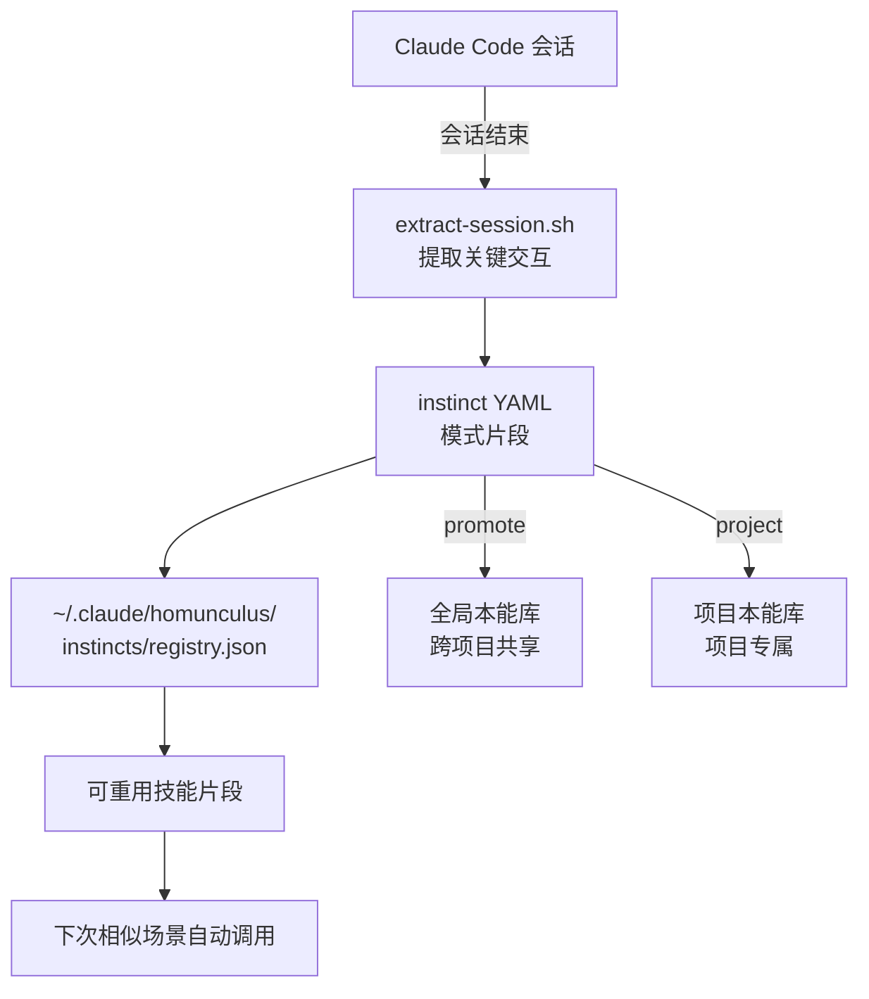

<details>
<summary>相关源文件</summary>

生成本页时使用的主要源文件：

- [skills/configure-ecc/SKILL.md](../../../project-repos/everythingclaudecode/skills/configure-ecc/SKILL.md)
- [skills/continuous-learning-v2/SKILL.md](../../../project-repos/everythingclaudecode/skills/continuous-learning-v2/SKILL.md)
- [skills/agentic-engineering/SKILL.md](../../../project-repos/everythingclaudecode/skills/agentic-engineering/SKILL.md)
- [skills/tdd-workflow/SKILL.md](../../../project-repos/everythingclaudecode/skills/tdd-workflow/SKILL.md)
- [skills/security-review/SKILL.md](../../../project-repos/everythingclaudecode/skills/security-review/SKILL.md)
- [skills/e2e-testing/SKILL.md](../../../project-repos/everythingclaudecode/skills/e2e-testing/SKILL.md)

</details>

# 技能系统

ECC 的技能（Skills）是**工作流定义和领域知识**的载体。与代理（负责决策和编排）不同，技能更像是可重用的专业工具包——当代理需要某领域的知识时，加载对应技能即可，无需每次重新注入背景。81 个技能覆盖编码标准、后端模式、前端模式、安全审查、测试策略、数据库、DevOps 等完整链条。

## 技能格式

每个技能是一个 Markdown 文件，内部结构固定：

```markdown
# Skill Name

name: <skill-name>           # 技能标识，用于目录索引
description: <描述>          # 一句话说明用途

## When to Use
什么场景触发这个技能。

## How It Works
技能的具体工作方式。

## Examples
使用示例。
```

核心约定：技能文件使用 `name` 字段而非文件名作为权威标识，这允许技能目录结构变化时系统仍然能找到正确的技能。

## 技能分类索引

### 开发方法论

| 技能 | 说明 | 核心文件 |
|------|------|----------|
| `tdd-workflow` | TDD 全流程定义，覆盖率红线 80% | `skills/tdd-workflow/SKILL.md` |
| `verification-loop` | 检查点 vs 持续评估、pass@k 指标、评分器类型 | `skills/verification-loop/SKILL.md` |
| `agentic-engineering` | 代理工程基础：工具设计、上下文边界、反馈循环 | `skills/agentic-engineering/SKILL.md` |
| `agent-harness-construction` | 代理测试用评测工具（harness）的构建方法 | `skills/agent-harness-construction/SKILL.md` |
| `continuous-learning-v2` | 从会话中自动提取模式到可重用技能的机制 | `skills/continuous-learning-v2/SKILL.md` |

### 后端与数据

| 技能 | 说明 | 核心文件 |
|------|------|----------|
| `backend-patterns` | RESTful API、GraphQL、gRPC、消息队列、微服务 | `skills/backend-patterns/SKILL.md` |
| `database-migrations` | Schema 迁移、版本控制、回滚策略 | `skills/database-migrations/SKILL.md` |
| `clickhouse-io` | ClickHouse OLAP 数据库最佳实践 | `skills/clickhouse-io/SKILL.md` |
| `postgres-patterns` | PostgreSQL 特定模式：索引、分区、JSONB | `skills/postgres-patterns/SKILL.md` |
| `api-design` | REST API 设计原则、版本控制、认证 | `skills/api-design/SKILL.md` |

### 前端与 UI

| 技能 | 说明 | 核心文件 |
|------|------|----------|
| `frontend-patterns` | React/Vue 组件设计、性能优化、状态管理 | `skills/frontend-patterns/SKILL.md` |
| `frontend-slides` | 演示文稿生成（Shuffle / Slidev / html2canvas） | `skills/frontend-slides/SKILL.md` |
| `liquid-glass-design` | Apple Liquid Glass 设计语言实现指南 | `skills/liquid-glass-design/SKILL.md` |

### 多语言深度技能

| 技能 | 说明 | 核心文件 |
|------|------|----------|
| `coding-standards` | 通用编码标准（immutability、无硬编码、错误处理） | `skills/coding-standards/SKILL.md` |
| `golang-patterns` | Go 特定模式：错误处理、goroutine、context | `skills/golang-patterns/SKILL.md` |
| `golang-testing` | Go 测试框架、mock、基准测试 | `skills/golang-testing/SKILL.md` |
| `python-patterns` | Python 特定模式：async、类型提示、数据类 | `skills/python-patterns/SKILL.md` |
| `python-testing` | pytest、mock、fixture 策略 | `skills/python-testing/SKILL.md` |
| `cpp-coding-standards` | C++ 现代标准、RAII、智能指针 | `skills/cpp-coding-standards/SKILL.md` |
| `cpp-testing` | GoogleTest、Catch2、覆盖率收集 | `skills/cpp-testing/SKILL.md` |
| `django-patterns` | Django MTV、ORM 优化、CBV | `skills/django-patterns/SKILL.md` |
| `django-tdd` / `django-verification` / `django-security` | Django 测试、安全、验证专项 | `skills/django-*/SKILL.md` |
| `swiftui-patterns` | SwiftUI 声明式 UI、状态管理、动画 | `skills/swiftui-patterns/SKILL.md` |
| `swift-actor-persistence` | Swift Actor 模型与持久化 | `skills/swift-actor-persistence/SKILL.md` |
| `compose-multiplatform-patterns` | Jetpack Compose 跨平台 | `skills/compose-multiplatform-patterns/SKILL.md` |
| `springboot-patterns` / `springboot-tdd` / `springboot-security` | Spring Boot 专项 | `skills/springboot-*/SKILL.md` |

### 安全与质量

| 技能 | 说明 | 核心文件 |
|------|------|----------|
| `security-review` | 安全审查检查清单、漏洞分类、修复优先级 | `skills/security-review/SKILL.md` |
| `security-scan` | 自动化安全扫描流程 | `skills/security-scan/SKILL.md` |
| `e2e-testing` | Playwright E2E 测试策略 | `skills/e2e-testing/SKILL.md` |
| `eval-harness` | LLM 评测工具构建方法 | `skills/eval-harness/SKILL.md` |
| `plankton-code-quality` | 代码质量指标和持续监控 | `skills/plankton-code-quality/SKILL.md` |

### 部署与基础设施

| 技能 | 说明 | 核心文件 |
|------|------|----------|
| `deployment-patterns` | 容器化、CD/CI、零停机部署 | `skills/deployment-patterns/SKILL.md` |
| `docker-patterns` | Dockerfile 最佳实践、多阶段构建 | `skills/docker-patterns/SKILL.md` |
| `cost-aware-llm-pipeline` | LLM 调用成本优化、模型路由 | `skills/cost-aware-llm-pipeline/SKILL.md` |

### 其他领域技能

还包括：`content-engine`（内容处理）、`article-writing`（文章写作）、`market-research`（市场调研）、`investor-outreach`（投资人沟通）、`search-first`（检索增强）、`iterative-retrieval`（迭代检索）等。

## 持续学习机制（continuous-learning-v2）

这是 ECC 最独特的技能之一——**从真实会话中自动提取可重用知识**。



关键概念：**Instinct** — 从会话中提炼出的原子化知识片段，格式为 YAML，包含 `trigger`（触发条件）、`response`（标准行为）和 `confidence`（置信度）。Instinct 经历从"项目本地"到"全局共享"的晋升路径，经过多次验证后成为正式技能。

`continuous-learning-v2` 还包含一个 `observer-loop`，能够监控会话行为并在发现新的可复用模式时主动建议创建 instinct。

## skill-create 命令

ECC 提供 `/skill-create` 命令（`commands/skill-create.md`），从 git 历史中自动生成技能：

1. 分析 git commit 历史，找出某个功能模块的演化轨迹
2. 从 commit message 和 diff 中提炼该功能的设计决策
3. 生成符合 `SKILL.md` 格式的技能文件

这使得技能创建从手动编写变成**从真实代码历史中归纳**，确保技能的每个建议都有实际代码支撑，而非凭空想象。

Sources: [skills/configure-ecc/SKILL.md:1-50](../../../project-repos/pages/skills/configure-ecc/SKILL.md#L1-L50), [skills/continuous-learning-v2/SKILL.md:1-80](../../../project-repos/pages/skills/continuous-learning-v2/SKILL.md#L1-L80), [skills/agentic-engineering/SKILL.md:1-63](../../../project-repos/pages/skills/agentic-engineering/SKILL.md#L1-L63), [skills/tdd-workflow/SKILL.md:1-50](../../../project-repos/pages/skills/tdd-workflow/SKILL.md#L1-L50)

<details class="source-snippets">
<summary>引用源码</summary>

<!-- source-snippets:start -->

#### `skills/configure-ecc/SKILL.md:1-50`

> 未找到引用文件：`skills/configure-ecc/SKILL.md`

#### `skills/continuous-learning-v2/SKILL.md:1-80`

> 未找到引用文件：`skills/continuous-learning-v2/SKILL.md`

#### `skills/agentic-engineering/SKILL.md:1-63`

> 未找到引用文件：`skills/agentic-engineering/SKILL.md`

#### `skills/tdd-workflow/SKILL.md:1-50`

> 未找到引用文件：`skills/tdd-workflow/SKILL.md`

<!-- source-snippets:end -->
</details>
