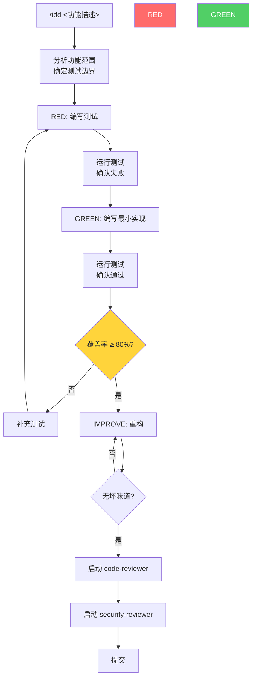
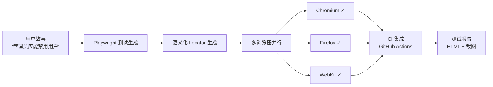
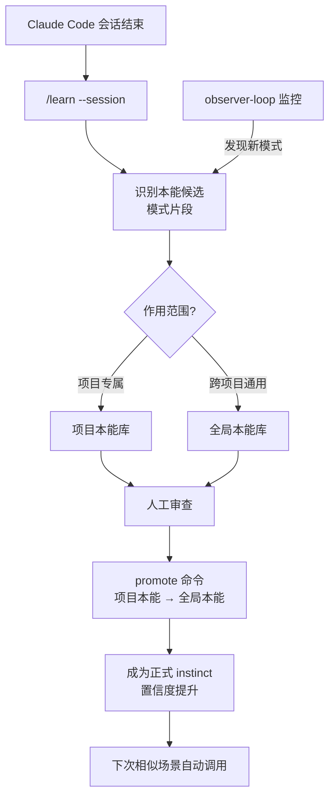
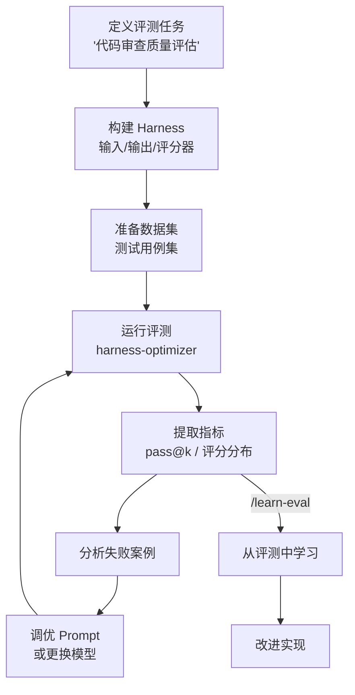

<details>
<summary>相关源文件</summary>

生成本页时使用的主要源文件：

- [commands/tdd.md](../../../project-repos/everythingclaudecode/commands/tdd.md)
- [commands/e2e.md](../../../project-repos/everythingclaudecode/commands/e2e.md)
- [commands/eval.md](../../../project-repos/everythingclaudecode/commands/eval.md)
- [skills/continuous-learning-v2/SKILL.md](../../../project-repos/everythingclaudecode/skills/continuous-learning-v2/SKILL.md)
- [skills/verification-loop/SKILL.md](../../../project-repos/everythingclaudecode/skills/verification-loop/SKILL.md)
- [skills/e2e-testing/SKILL.md](../../../project-repos/everythingclaudecode/skills/e2e-testing/SKILL.md)

</details>

# 典型工作流

ECC 的价值最终体现在具体的工作流中。本页介绍 ECC 最核心的四个典型工作流：TDD 循环、E2E 测试编排、持续学习循环、以及评测（Harness）工作流。

## TDD 工作流

TDD 工作流是 ECC 最强制化的工作流，通过 `/tdd` 命令启动：



TDD 工作流的关键约束：
- **覆盖率红线 80%** — 低于此门槛不允许进入重构阶段
- **code-reviewer 通过** — 重构后必须经过代码审查
- **security-reviewer 通过** — 任何代码修改都必须经过安全审查
- **小步提交** — 每次 green 阶段后立即 commit（不是最后才提交）

## E2E 测试编排工作流

`/e2e` 命令的完整工作流：



ECC 的 E2E 测试特点：
- **语义化 locator** — 优先使用 `getByRole`、`getByLabel` 而非 CSS 选择器，减少测试脆弱性
- **自动重试** — flaky 测试自动重试（Playwright 内置）
- **截图对比** — 可选的视觉回归测试

## 持续学习循环

ECC 的持续学习是**从真实工作会话中提取可复用知识**的机制：



`continuous-learning-v2` 的核心文件（`skills/continuous-learning-v2/`）：
- `SKILL.md` — 学习流程定义
- `agents/observer-loop.sh` — 后台监控进程
- `hooks/observe.sh` — 触发观察的钩子脚本
- `scripts/instinct-cli.py` — instinct 的 CLI 管理工具（import/export/promote）

## 评测（Harness）工作流

ECC 提供了完整的 AI 评测工程能力：



ECC 的评测能力：
- **pass@k 指标** — 评测任务中 k 次尝试内至少一次成功的概率
- **评分器类型** — LLM-as-judge、规则匹配、代码执行结果对比
- **harness-optimizer 代理** — 自动调优评测配置（可靠性/成本/吞吐量权衡）

## 安全门禁工作流

每次代码提交都必须经过的安全门禁链：

```mermaid
flowchart LR
    COMMIT["git commit"]
    COMMIT --> HOOK["PreCommit Hook"]
    HOOK --> LINT["lint 检查"]
    LINT --> FORMAT["format 检查"]
    FORMAT --> TEST["单元测试"]
    TEST --> COVERAGE["覆盖率 ≥ 80%?"]
    COVERAGE -->|"否"| FAIL["BLOCK: 覆盖率不足"]
    COVERAGE -->|"是"| SECRET["密钥扫描"]
    SECRET -->|"发现密钥"| FAIL
    SECRET -->|"无密钥"| PASS["通过"]
    
    PASS -->|/code-review" --> CR["code-reviewer"]
    CR --> CRIT{"CRITICAL/HIGH?"}
    CRIT -->|"有"| FIX["修复问题"]
    CRIT -->|"无"| SEC["security-reviewer"]
    FIX --> CR
    SEC --> SEC_CRIT{"安全漏洞?"}
    SEC_CRIT -->|CRITICAL| BLOCK["BLOCK: 修复 + 轮转密钥"]
    SEC_CRIT -->|"无"| DONE["可提交"]
    
    style FAIL fill:#ff6b6b,color:#fff
    style BLOCK fill:#ff6b6b,color:#fff
    style PASS fill:#51cf66,color:#fff
    style DONE fill:#51cf66,color:#fff
```

Sources: [commands/tdd.md:1-80](../../../project-repos/pages/commands/tdd.md#L1-L80), [commands/e2e.md:1-100](../../../project-repos/pages/commands/e2e.md#L1-L100), [commands/eval.md:1-50](../../../project-repos/pages/commands/eval.md#L1-L50), [skills/continuous-learning-v2/SKILL.md:1-80](../../../project-repos/pages/skills/continuous-learning-v2/SKILL.md#L1-L80), [skills/verification-loop/SKILL.md:1-60](../../../project-repos/pages/skills/verification-loop/SKILL.md#L1-L60)

<details class="source-snippets">
<summary>引用源码</summary>

<!-- source-snippets:start -->

#### `commands/tdd.md:1-80`

> 未找到引用文件：`commands/tdd.md`

#### `commands/e2e.md:1-100`

> 未找到引用文件：`commands/e2e.md`

#### `commands/eval.md:1-50`

> 未找到引用文件：`commands/eval.md`

#### `skills/continuous-learning-v2/SKILL.md:1-80`

> 未找到引用文件：`skills/continuous-learning-v2/SKILL.md`

#### `skills/verification-loop/SKILL.md:1-60`

> 未找到引用文件：`skills/verification-loop/SKILL.md`

<!-- source-snippets:end -->
</details>
