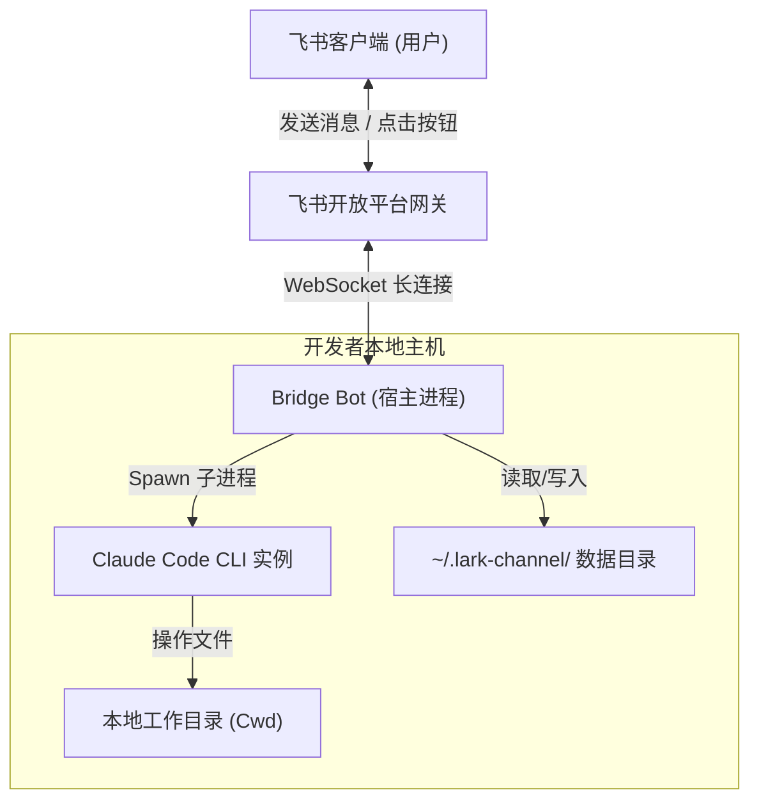
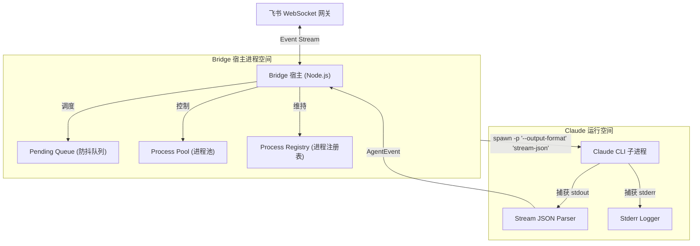
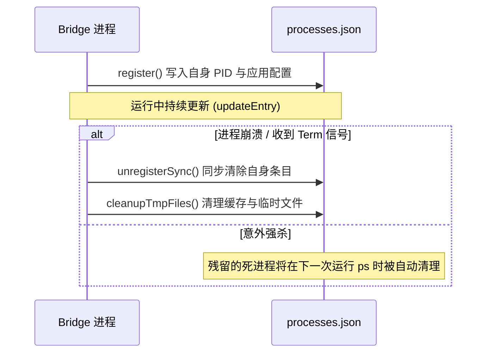
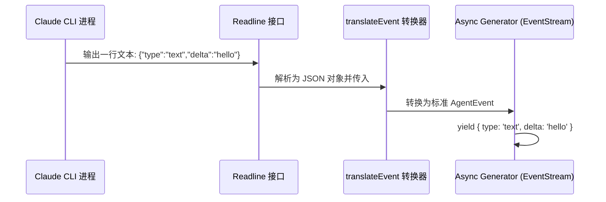
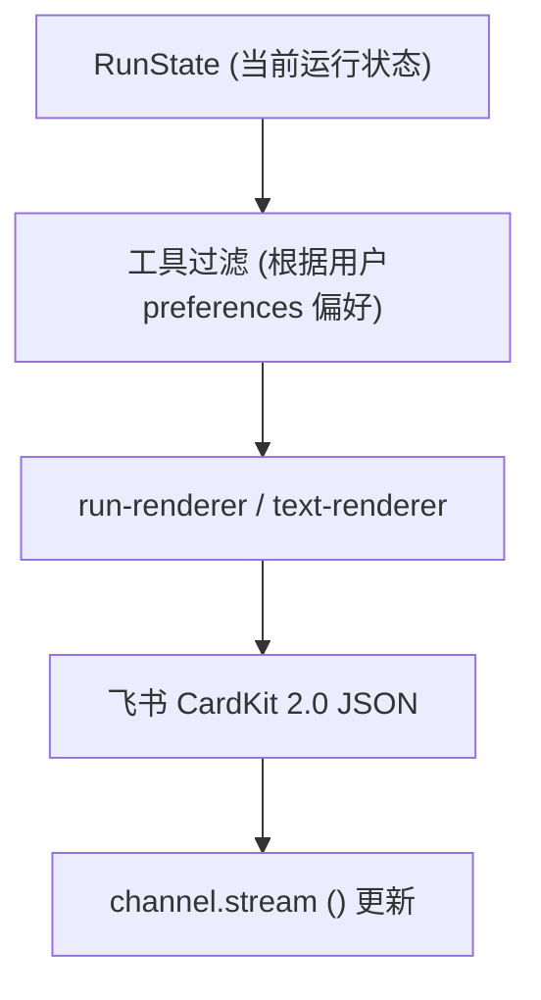
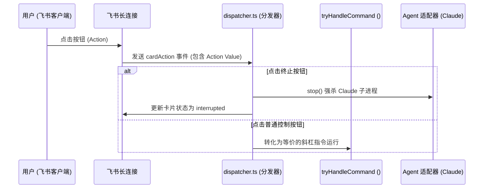
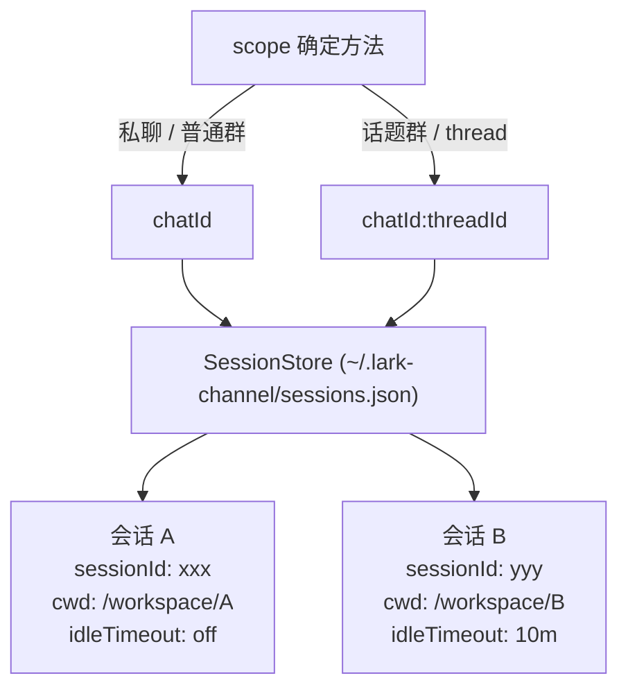
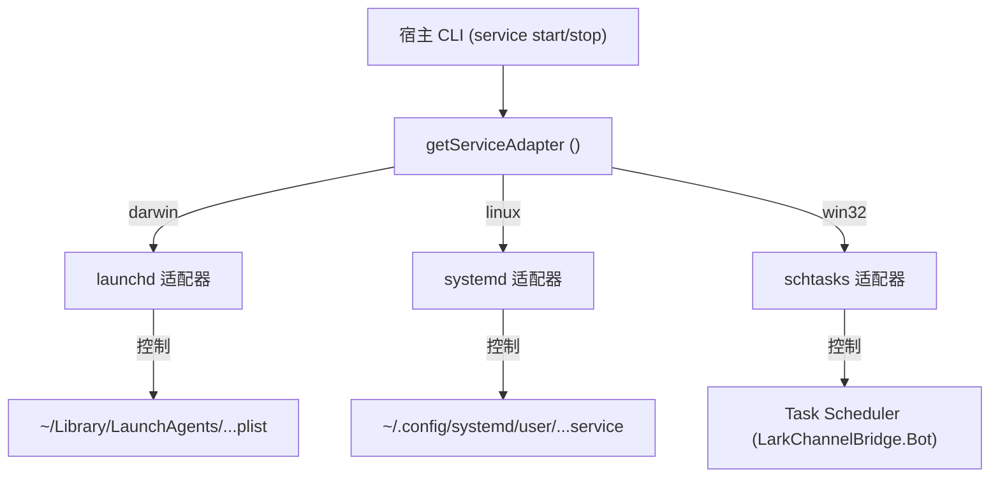
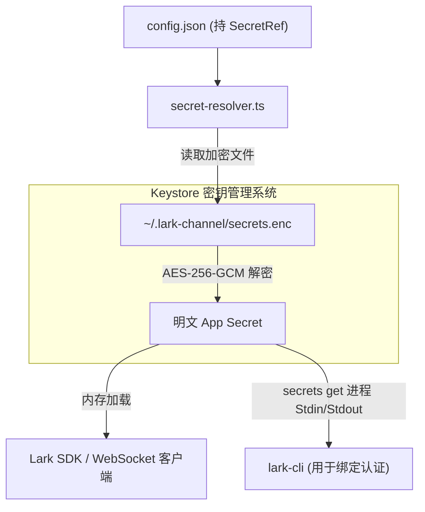
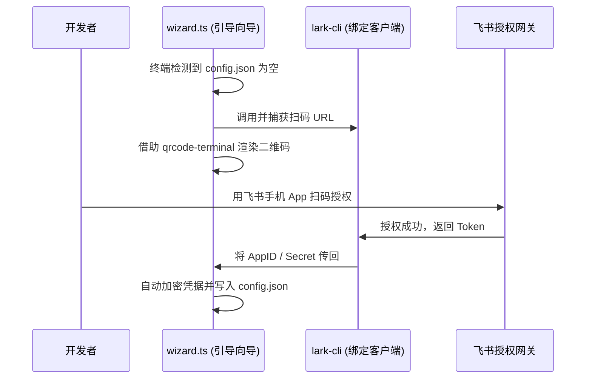

# feishu-claude-code-bridge DeepWiki 全站导出

> **这是 feishu-claude-code-bridge 仓库的单文件技术 Wiki 导出，包含完整的架构解析与核心实现说明。**
>
> - 源仓库: `https://github.com/zarazhangrui/feishu-claude-code-bridge.git`
> - 本轮 Commit: `d59e0464e514fd348488dc61a52d7d3334de0aad`
> - 生成时间: 2026年5月23日

---

<details>
<summary>相关源文件</summary>

生成本页时使用的主要源文件：

- [package.json](../../../project-repos/feishu-claude-code-bridge/package.json)
- [README.zh.md](../../../project-repos/feishu-claude-code-bridge/README.zh.md)

</details>

# 项目概览

在软件开发领域，开发者们常常需要在终端、编辑器与协作沟通软件之间频繁切换。Claude Code 作为一个强大的 CLI 工具，虽然提供了优秀的本地代码操作能力，但其运行环境仅局限于开发者的本地 Shell。对于习惯使用飞书等企业协作软件进行沟通、分享以及快速迭代的团队和个人而言，如何在聊天窗口中低延迟、高体验地与本地 Claude Code 协同操作，是一个亟待解决的痛点。

`feishu-claude-code-bridge` 正是为打通这一壁垒而诞生的轻量级桥接 Bot。它不是一个简单的“飞书 API 转发器”，而是一个经过深度设计、支持**本地守护进程托管**、**多工作空间切换**、以及**飞书流式交互卡片渲染**的本地-云端协同系统。通过将飞书作为人机交互的第一界面，该项目让 Claude 能够直接对本地指定工作目录中的代码进行阅读、诊断和修改，并实现图片和文件的无缝传输，使得团队协作和个人开发体验得到质的飞跃。

## 能力全景

- **流式卡片渲染**：将 Claude 的自然语言思考、工具调用过程以及执行结果实时呈现在飞书的同一张卡片上，用户无需在聊天界面傻等全部内容生成完毕。
- **并发与防抖队列**：在网络抖动或用户快速连发消息时，系统通过内置队列进行消息合并与防抖；对于耗时较长的任务，支持中途发送新消息进行打断与抢占。
- **多命名工作空间**：支持通过 `/cd` 和 `/ws` 命令创建、保存与切换不同的本地项目目录，并且在切换工作目录时能够自动重置并隔离会话上下文。
- **双向交互式回调**：将飞书的富媒体消息（图片/文件）下载并自动转换为本地路径提供给 Claude 读取；同时支持在飞书卡片上放置按钮，点击后将状态回调给 Claude 决策。
- **跨平台守护托管**：内置对 OS 级守护进程（macOS `launchd`、Linux `systemd`、Windows `Task Scheduler`）的一键注册和托管，确保 Bot 在后台稳定、低开销运行。

## 架构鸟瞰

下面的图表展示了 `feishu-claude-code-bridge` 在本地开发机与飞书服务器之间的连接桥梁关系。



在本地开发机上，Bridge 充当长连接守候者与子进程控制器的双重角色。它向下管理着 `claude` 命令行工具的子进程，向上通过飞书 WebSocket 长连接完成事件的高速吞吐，并维护着状态、密钥和会话的本地持久化。

Sources: [package.json:1-50](../../../project-repos/feishu-claude-code-bridge/package.json#L1-L50)

<details class="source-snippets">
<summary>引用源码</summary>

<!-- source-snippets:start -->

#### `package.json:1-50`

```json
{
  "name": "lark-channel-bridge",
  "version": "0.1.32",
  "description": "Bridge Feishu/Lark messenger with local CLI coding agents (Claude Code, ...)",
  "type": "module",
  "bin": {
    "lark-channel-bridge": "./bin/lark-channel-bridge.mjs"
  },
  "exports": {
    ".": {
      "types": "./dist/index.d.ts",
      "import": "./dist/index.js"
    }
  },
  "files": [
    "dist",
    "bin",
    "README.md",
    "README.zh.md",
    "LICENSE"
  ],
  "scripts": {
    "dev": "tsup --watch",
    "build": "tsup",
    "typecheck": "tsc --noEmit",
    "test": "vitest run",
    "prepublishOnly": "pnpm typecheck && pnpm build"
  },
  "dependencies": {
    "@clack/prompts": "^1.4.0",
    "@larksuiteoapi/node-sdk": "^1.65.0",
    "commander": "^12.1.0",
    "https-proxy-agent": "^9.0.0",
    "qrcode-terminal": "^0.12.0"
  },
  "devDependencies": {
    "@types/node": "^22.10.0",
    "@types/qrcode-terminal": "^0.12.2",
    "tsup": "^8.3.5",
    "typescript": "^5.6.3",
    "vitest": "^2.1.8"
  },
  "engines": {
    "node": ">=20.0.0"
  },
  "pnpm": {
    "onlyBuiltDependencies": [
      "esbuild",
      "protobufjs"
    ]
```

<!-- source-snippets:end -->
</details>

## 技术栈概述

- **核心语言**：TypeScript
- **打包工具**：tsup / esbuild，产出轻量高性能的单文件 CLI 目标
- **三方 SDK**：`@larksuiteoapi/node-sdk` (用于长连接、发送消息与交互卡片)
- **进程框架**：Commander.js (构建友好的 CLI 入口)
- **底层依赖**：Node.js $\ge$ 20 运行时，直接调用 OS 原生的子进程管理、软硬件信号监听与网络 DNS 解析适配

## 阅读路线推荐

- **初次接触项目，想了解整体设计**：
  建议阅读 [系统架构与进程模型](system-architecture.md) 了解 Bridge 宿主与 Claude CLI 是如何通过双进程协同工作的。
- **关注数据流与网络连接细节**：
  查阅 [飞书 Bot 消息与连接管理](feishu-bot-core.md) 以及 [Claude CLI 集成与适配器](claude-integration.md)，了解防抖队列、流式 JSON 字符解析与防超时挂起设计。
- **关注前端交互与卡片生成**：
  请直接阅读 [交互式卡片渲染与分发](interactive-cards.md) 掌握状态归约与 CardKit 2.0 模板。
- **准备进行本地部署或运维管理**：
  跳转到 [守护进程与后台托管](daemon-management.md) 以及 [安全防线与配置系统](security-config.md)。

## 相关页面

- [系统架构与进程模型](system-architecture.md) — 了解跨进程的双向控制通道
- [飞书 Bot 消息与连接管理](feishu-bot-core.md) — 消息在被发往 Claude 之前的生命旅程

---

<details>
<summary>相关源文件</summary>

生成本页时使用的主要源文件：

- [src/cli/commands/start.ts](../../../project-repos/feishu-claude-code-bridge/src/cli/commands/start.ts)
- [src/runtime/registry.ts](../../../project-repos/feishu-claude-code-bridge/src/runtime/registry.ts)

</details>

# 系统架构与进程模型

`feishu-claude-code-bridge` 在架构上采用典型的**双进程协作模式**。整个系统分为两个主要的物理进程：**Bridge 宿主进程 (Node.js)** 和 **Claude CLI 代理进程 (Claude Code)**。宿主进程主要承载飞书 WebSocket 连接和卡片渲染；而具体的任务执行（例如终端命令运行、文件读写、静态分析）则通过动态 Spawn 出的 Claude 子进程独立承载。

## 双进程协同模型

在系统运行期间，宿主进程与代理进程的角色分工非常明确：

- **Bridge 宿主进程**：
  负责与飞书开放平台网关（WebSocket）建立并保持长连接；执行消息过滤、队列排队和防抖；解析用户的交互操作并渲染卡片状态；充当代理进程的“网络代言人”。
- **Claude 代理进程**：
  由宿主进程调用 `child_process.spawn` 启动。它持有用户的会话标识（`--resume <sessionId>`），并在隔离的 Cwd（当前工作空间）下运行。它直接与本地环境（终端、文件系统）交互，其输出通过 Stdio 管道被宿主进程捕获并解析。



## 进程生命周期与异常控制

在宿主进程启动时，会进行以下初始化流程：
1. **网络降级策略**：调用 `dns.setDefaultResultOrder('ipv4first')`。
   > [!IMPORTANT]
   > 在 Node.js $\ge$ 20 中，DNS 解析默认遵循 "verbatim" 模式（即返回什么就用什么）。在一些 IPv6 路由残缺的网络环境（例如某些 VPN、酒店 WiFi 或 WSL2 内部）中，这极易导致连接卡死。显式设置为 IPv4 优先，避开了这一整类网络假死陷阱。
2. **全局 Rejection 兜底**：绑定 `unhandledRejection` 和 `uncaughtException` 监听器，确保任何异步的三方 SDK 调用失败或 Axios 请求超时不会导致 Bot 进程退出。
3. **自身注册**：在宿主进程的注册中心（`~/.lark-channel/processes.json`）中写入当前进程的 `pid`、`appId` 等信息，用来支撑终端命令行 `ps` 和 `kill` 运作。

### 优雅退出与重启防护

当系统接收到 `SIGINT`、`SIGTERM` 或飞书端的 `/exit` 命令时，系统将启动优雅关闭流程：
- 宿主进程向 Claude 代理进程发送 `SIGTERM` 信号。
- 启动一个优雅关闭等待定时器（通常为 5 秒，`stopGraceMs`）。
- 如果 Claude 代理进程在定时器结束前未能顺利退出（例如其派生的后台 bash 正在阻塞），宿主进程会果断发起 `SIGKILL` 级联清理，最后清除本地注册表文件中的僵尸进程条目并安全退出。

### Connect-before-Disconnect 重启策略

当用户在飞书端更改配置（如更改 `/config`）或网络出现故障触发 `/reconnect` 重连时，宿主进程采用**先建连、后断开 (Connect-before-disconnect)** 的设计：
- 系统首先尝试为新的配置或凭据创建并初始化一个新的 `BridgeChannel` 实例。
- 只有在新实例通过长连接握手并成功连接飞书后，系统才会关闭并 disconnect 老的 `BridgeChannel`。
- **设计考量**：如果在网络状况极差（例如拔掉网线）时进行重启，且采用“先断开后建连”逻辑，一旦新链接创建失败，老链接的保活定时器又已被摧毁，Bot 进程就会永久处于失联状态，直至人工手动重启。而 Connect-before-disconnect 能确保就算重连失败，老链接的保活机制依然存在并会在 15 秒后触发下一次自动重试。

Sources: [src/cli/commands/start.ts:32-216](../../../project-repos/feishu-claude-code-bridge/src/cli/commands/start.ts#L32-L216)

<details class="source-snippets">
<summary>引用源码</summary>

<!-- source-snippets:start -->

#### `src/cli/commands/start.ts:32-216`

```typescript
// Prefer IPv4 — Node 20+ defaults to "verbatim" which respects whatever
// the resolver returns first; in IPv6-broken networks (WSL2, certain VPNs,
// some hotel WiFi) this lands on a dead v6 route and stalls. Explicitly
// prefer v4 avoids that whole class of issue.
dns.setDefaultResultOrder('ipv4first');

// Process-level safety net: never let a stray SDK call / axios timeout
// take the whole bot down. Most outbound calls (channel.send / rawClient.*)
// are async; if any callsite misses a try/catch (or fires an update after
// its enclosing scope returned), the rejection bubbles to here. Log and
// keep the bot alive — losing a single reply is better than crashing.
process.on('unhandledRejection', (reason) => {
  log.fail('process', reason, { kind: 'unhandledRejection' });
});
process.on('uncaughtException', (err) => {
  log.fail('process', err, { kind: 'uncaughtException' });
});

const MEDIA_GC_MAX_AGE_MS = 24 * 60 * 60 * 1000;

export interface StartOptions {
  config?: string;
  skipCheckLarkCli?: boolean;
}

export async function runStart(opts: StartOptions): Promise<void> {
  const configPath = opts.config ?? paths.configFile;
  const existing = await loadConfig(configPath);

  let cfg: AppConfig;
  if (isComplete(existing)) {
    cfg = existing;
    // Migrate legacy plaintext configs: any time we see a raw string in
    // accounts.app.secret that isn't a "${VAR}" template, move it into
    // the encrypted keystore and rewrite config.json with an exec ref.
    // Idempotent — already-encrypted configs (SecretRef) pass through.
    cfg = await maybeMigratePlaintextSecret(cfg, configPath);
  } else {
    const fresh = await runRegistrationWizard();
    // Fresh credentials from the wizard arrive as a plaintext secret;
    // immediately encrypt before persisting so disk never holds the raw value.
    cfg = await persistEncrypted(fresh, configPath);
    console.log(`配置已保存到 ${configPath}\n`);
  }

  await preFlightChecks({ skipCheckLarkCli: opts.skipCheckLarkCli });

  const agent = new ClaudeAdapter();
  if (!(await agent.isAvailable())) {
    console.error('✗ 未找到 claude CLI。请先安装 Claude Code：');
    console.error('  https://docs.anthropic.com/en/docs/claude-code/quickstart');
    process.exit(1);
  }

  const sessions = new SessionStore();
  await sessions.load();
  const workspaces = new WorkspaceStore();
  await workspaces.load();

  await gcMediaCache(MEDIA_GC_MAX_AGE_MS);
  await gcOldLogs();

  // Same-app conflict detection. Open-platform routes events to one of the
  // long-connections at random, so two `start` of the same app makes "who
  // answered me" unpredictable. Warn + interactive triage before connecting.
  const conflicts = sameAppOthers(cfg.accounts.app.id);
  if (conflicts.length > 0) {
    const proceed = await resolveConflict(cfg, conflicts);
    if (!proceed) {
      console.log('已取消启动。');
      process.exit(0);
    }
  }

  // Register self in the process registry. Cleanup is wired via stop() and
  // 'exit' below — both paths run unregisterSync so stale entries don't
  // poison the next start.
  const entry = await register({
    appId: cfg.accounts.app.id,
    tenant: cfg.accounts.app.tenant,
    configPath,
    version: pkg.version,
  });
  log.info('registry', 'registered', { id: entry.id, pid: process.pid });

  // `bridge` is mutable so /account can swap it on restart. `controls` carries
  // restart() and a snapshot of the current cfg so command handlers can read
  // and replace credentials without plumbing through the whole runStart scope.
  let bridge: BridgeChannel;
  let restarting = false;

  let stopping = false;
  const stop = async (sig: string): Promise<void> => {
    if (stopping) return;
    stopping = true;
    console.log(`\n收到 ${sig}，正在关闭...`);
    try {
      await bridge.disconnect();
    } catch (err) {
      console.error('[disconnect-failed]', err);
    }
    // unregister is best-effort sync — we're about to exit anyway.
    unregisterSync(entry.id);
    process.exit(0);
  };

  const controls: Controls = {
    configPath,
    cfg,
    processId: entry.id,
    async exit() {
      await stop('exit-command');
    },
    async restart() {
      if (restarting) return;
      restarting = true;
      try {
        const next = await loadConfig(configPath);
        if (!isComplete(next)) throw new Error('config incomplete after change');
        console.log(
... snippet truncated ...
```

<!-- source-snippets:end -->
</details>

## 进程注册中心 (Registry)

宿主进程在启动与退出时，都需要与本地注册中心同步状态，其背后的维护逻辑在 `registry.ts` 中。



这种机制保障了系统在本地宿主机器上运行时的“自愈性”，防止残留的 processes.json 脏数据干扰多开检测和进程列表列出。

Sources: [src/runtime/registry.ts:1-120](../../../project-repos/feishu-claude-code-bridge/src/runtime/registry.ts#L1-L120)

<details class="source-snippets">
<summary>引用源码</summary>

<!-- source-snippets:start -->

#### `src/runtime/registry.ts:1-120`

```typescript
import { randomBytes } from 'node:crypto';
import { mkdirSync, readFileSync, renameSync, writeFileSync, unlinkSync } from 'node:fs';
import { mkdir, readFile, rename, writeFile } from 'node:fs/promises';
import { dirname } from 'node:path';
import { paths } from '../config/paths';
import type { TenantBrand } from '../config/schema';

/**
 * Tracks running `lark-channel-bridge start` processes so we can:
 *   - Warn on duplicate `start` of the same app (open-platform routes events
 *     to one of N long-connections randomly, leaving users guessing).
 *   - Let users list (`ps` / `/ps`) and terminate (`stop <id>` / `/exit <id>`)
 *     a specific process.
 *
 * Single-machine only — entries live in a local JSON file and processes are
 * identified by OS PID. PIDs may go stale (kill -9, crash, OS reboot); every
 * read prunes entries whose PID is not alive (`process.kill(pid, 0)` throws
 * ESRCH for dead PIDs). The file is rewritten atomically (temp + rename) to
 * avoid partial reads during concurrent updates.
 */

export interface ProcessEntry {
  /** 4-char random hex, stable for this process's lifetime. */
  id: string;
  pid: number;
  appId: string;
  tenant: TenantBrand;
  configPath: string;
  startedAt: string;
  version: string;
  /** Bot's display name (e.g. "尼莫"). Filled in by startChannel after the
   * WS handshake — undefined until the connection is up, or on processes
   * registered by older versions of the bridge. */
  botName?: string;
}

interface RegistryFile {
  entries: ProcessEntry[];
}

const EMPTY: RegistryFile = { entries: [] };

function readRaw(path: string): RegistryFile {
  try {
    const text = readFileSync(path, 'utf8');
    const parsed = JSON.parse(text) as Partial<RegistryFile>;
    if (!parsed || !Array.isArray(parsed.entries)) return { entries: [] };
    return { entries: parsed.entries.filter(isValidEntry) };
  } catch (err) {
    if ((err as NodeJS.ErrnoException).code === 'ENOENT') return { entries: [] };
    return { entries: [] };
  }
}

function isValidEntry(e: unknown): e is ProcessEntry {
  if (!e || typeof e !== 'object') return false;
  const x = e as Record<string, unknown>;
  return (
    typeof x.id === 'string' &&
    typeof x.pid === 'number' &&
    typeof x.appId === 'string' &&
    (x.tenant === 'feishu' || x.tenant === 'lark') &&
    typeof x.configPath === 'string' &&
    typeof x.startedAt === 'string' &&
    typeof x.version === 'string'
  );
}

export function isAlive(pid: number): boolean {
  try {
    process.kill(pid, 0);
    return true;
  } catch (err) {
    return (err as NodeJS.ErrnoException).code === 'EPERM';
  }
}

/**
 * Read the registry, dropping entries whose PID is no longer alive. The
 * pruned-back state is **not** persisted here — callers that mutate write
 * the full new state via `writeAtomic`. (Read-only callers like /ps don't
 * need to bother persisting the prune.)
 */
export function readAndPrune(path: string = paths.processesFile): ProcessEntry[] {
  const raw = readRaw(path);
  return raw.entries.filter((e) => isAlive(e.pid));
}

async function writeAtomic(entries: ProcessEntry[], path: string): Promise<void> {
  const tmp = `${path}.tmp-${process.pid}`;
  const body = `${JSON.stringify({ entries } satisfies RegistryFile, null, 2)}\n`;
  await mkdir(dirname(path), { recursive: true });
  await writeFile(tmp, body, 'utf8');
  await rename(tmp, path);
}

function writeAtomicSync(entries: ProcessEntry[], path: string): void {
  const tmp = `${path}.tmp-${process.pid}`;
  const body = `${JSON.stringify({ entries } satisfies RegistryFile, null, 2)}\n`;
  mkdirSync(dirname(path), { recursive: true });
  writeFileSync(tmp, body, 'utf8');
  renameSync(tmp, path);
}

/** Generate a short, human-typable id. Collisions are caller's problem;
 * acceptable since dead entries are pruned and same-machine fleets are
 * small. */
export function generateShortId(): string {
  return randomBytes(2).toString('hex');
}

export interface RegisterArgs {
  appId: string;
  tenant: TenantBrand;
  configPath: string;
  version: string;
}

/**
 * Atomically prune + add this process to the registry. Returns the entry
```

<!-- source-snippets:end -->
</details>

## 相关页面

- [项目概览](overview.md) — 了解双进程架构的业务源头
- [Claude CLI 集成与适配器](claude-integration.md) — 了解 Stdio 管道数据和 System Prompt 约定
- [飞书 Bot 消息与连接管理](feishu-bot-core.md) — 探究 WebSocket 消息的具体消费逻辑

---

<details>
<summary>相关源文件</summary>

生成本页时使用的主要源文件：

- [src/agent/claude/adapter.ts](../../../project-repos/feishu-claude-code-bridge/src/agent/claude/adapter.ts)
- [src/agent/claude/stream-json.ts](../../../project-repos/feishu-claude-code-bridge/src/agent/claude/stream-json.ts)
- [src/agent/types.ts](../../../project-repos/feishu-claude-code-bridge/src/agent/types.ts)

</details>

# Claude CLI 集成与适配器

`feishu-claude-code-bridge` 的核心诉求是能够完全托管和驱动本地的 `claude` CLI。这一层功能由 `src/agent/claude/adapter.ts` 模块提供，它实现了一个平台无关的代理适配器接口 `AgentAdapter`。

## 参数标准化启动与会话恢复

每当飞书端有一批新消息被确认消费时，适配器会通过 `spawn` 调起一个新的 `claude` 子进程。在启动时，系统会将一系列复杂的运行参数标准化：

```typescript
const args = [
  '-p',
  opts.prompt,
  '--output-format',
  'stream-json',
  '--verbose',
  '--permission-mode',
  opts.permissionMode ?? 'bypassPermissions',
  '--append-system-prompt',
  BRIDGE_SYSTEM_PROMPT,
];
if (opts.sessionId) args.push('--resume', opts.sessionId);
if (opts.model) args.push('--model', opts.model);
```

- **`-p <prompt>`**：将飞书接收到的消息拼装为结构化 Prompt 输入。
- **`--output-format stream-json`**：强制 Claude Code 输出流式 JSON 序列，这是实现飞书端“流式打字机卡片效果”的关键技术。
- **`--permission-mode bypassPermissions`**：在无人值守的 Bot 环境中运行，我们需要跳过 Claude 自带的文件修改/终端命令等交互式权限询问。
- **`--resume <sessionId>`**：如果当前会话已有保存的 Claude 会话 ID，则自动追加此参数进行会话历史恢复，实现上下文衔接。

Sources: [src/agent/claude/adapter.ts:122-141](../../../project-repos/feishu-claude-code-bridge/src/agent/claude/adapter.ts#L122-L141)

<details class="source-snippets">
<summary>引用源码</summary>

<!-- source-snippets:start -->

#### `src/agent/claude/adapter.ts:122-141`

```typescript
  run(opts: AgentRunOptions): AgentRun {
    const args = [
      '-p',
      opts.prompt,
      '--output-format',
      'stream-json',
      '--verbose',
      '--permission-mode',
      opts.permissionMode ?? 'bypassPermissions',
      '--append-system-prompt',
      BRIDGE_SYSTEM_PROMPT,
    ];
    if (opts.sessionId) args.push('--resume', opts.sessionId);
    if (opts.model) args.push('--model', opts.model);

    const child = spawn(this.binary, args, {
      cwd: opts.cwd,
      env: { ...process.env, LARK_CHANNEL: '1' },
      stdio: ['ignore', 'pipe', 'pipe'],
    });
```

<!-- source-snippets:end -->
</details>

## BRIDGE_SYSTEM_PROMPT 深度协议约定

由于 Claude 运行在飞书的桥接器中，它不仅是一个“代码助手”，还需要学会在特定上下文中做出符合飞书交互体验的反应。宿主通过系统提示词 `BRIDGE_SYSTEM_PROMPT` 深度规范了以下行为：

### 1. XML 标签元数据隔离
为了不破坏 Claude 的上下文理解，宿主会在输入 Prompt 的顶部注入特定 XML 块，并指示 Claude **仅理解并用于推理，严禁照抄渲染**：
- **`<bridge_context>`**：携带发送者 ID、姓名、会话类型（p2p / group）和飞书 `chat_id`。
- **`<quoted_message>`**：当用户在飞书里进行“引用回复”时注入，包含被引用消息的类型、时间、发送者及内容。
- **`<interactive_card>`**：当用户点击或引用卡片时，将卡片的原始 JSON DSL（CardKit 2.0 格式）注入，用以让 Claude 理解当前的界面状态。

### 2. 双向卡片按钮交互回调约定
这是系统的一大创新。当 Claude 需要在飞书发出一些带有按钮的交互式卡片时：
- 它必须在按钮的 `value` 字段中塞入 `"__claude_cb": true`。
- 当用户在飞书客户端点击该按钮时，Bridge 宿主拦截此事件，并将 payload 去除标记后，以 `[card-click] { ... }` 格式的消息喂给 Claude。
- 如此一来，Claude 就能在同一 Session 下持续响应用户的卡片点击动作，完成逻辑闭环。

### 3. 前台阻塞授权规避
在飞书开发中，`lark-cli` 可能需要用户进行 OAuth 扫码授权（`lark-cli auth login`）。
- **痛点**：如果 Claude 在子进程中通过 `run_in_background: true` 将该命令丢进后台执行，那么随着当前交互轮次结束，Claude 主进程死掉，它所派生的后台授权子进程也会跟着被强杀，导致授权中断。
- **解法**：`BRIDGE_SYSTEM_PROMPT` 显式强制 Claude 在遇到 `lark-cli auth login` 时，必须以**前台阻塞**的方式分两阶段运行：先调 `--no-wait` 拿到授权 URL 并吐给用户，再调 `--device-code` 阻塞等待。在此期间飞书端的所有新消息会自动进入 Pending Queue 排队，从而保障授权流程的绝对顺畅。

Sources: [src/agent/claude/adapter.ts:15-102](../../../project-repos/feishu-claude-code-bridge/src/agent/claude/adapter.ts#L15-L102)

<details class="source-snippets">
<summary>引用源码</summary>

<!-- source-snippets:start -->

#### `src/agent/claude/adapter.ts:15-102`

```typescript
const BRIDGE_SYSTEM_PROMPT = `# lark-channel-bridge 运行约定

你正在 lark-channel-bridge 里跑：把飞书/Lark 用户消息桥到本地 \`claude\` CLI。

## bridge_context

每条 user message 顶部会带一个 \`<bridge_context>\` 块：

\`\`\`
<bridge_context>
chat_id: oc_xxx
chat_type: p2p
sender_id: ou_xxx
sender_name: ...
</bridge_context>
\`\`\`

里面是当前对话的 chat_id、chat 类型（p2p / group）、发送者。这些是 bridge 注入的元数据，**不要照抄、不要在你的回复里渲染**——它对用户不可见。

## quoted_message

如果用户用"引用回复"指向某条消息，bridge 会在 \`<bridge_context>\` 后注入一个 \`<quoted_message>\` 块：

\`\`\`
<quoted_message id="om_xxx" sender_id="ou_xxx" sender_name="..." created_at="..." type="text|merge_forward|...">
（被引用消息的内容；merge_forward 类型会展开成 <forwarded_messages>...</forwarded_messages>）
</quoted_message>
\`\`\`

这是用户**指向的对象**——用户的实际问题在它之后。回答时围绕这段内容展开；它也是 bridge 注入的元数据，**不要照抄 XML 标签**到回复里。

## interactive_card

用户发 / 引用交互卡片时,bridge 会把卡的真实 JSON 注入到 \`<interactive_card>\` 块:

\`\`\`
<interactive_card>
{ "schema": "2.0", "config": { ... }, "body": { ... } }
</interactive_card>
\`\`\`

两种来源:

- **v2 CardKit (schema 2.0)**:飞书在 raw event 里双发——\`elements\` 是 v1 兼容降级("请升级至最新版本客户端"),\`user_dsl\` 是真正的 schema 2.0 DSL。bridge 优先取 \`user_dsl\`,所以你看到的就是**真卡内容**,不要被 elements 的降级文案误导
- **零文字 v1 卡**:纯按钮 / 图片 / 装饰卡,SDK 扁平化抓不到字时,bridge 把整段 raw JSON 灌进来

无论哪种,块里都是卡的完整 JSON。解析它来理解结构(按钮、字段、布局)。**不要照抄 XML 标签到回复**——对用户不可见。

## 发交互卡片（按钮、表单）的回调约定

你想发一张可交互的卡片让用户点选时：

1. 用 \`lark-cli\` 把卡发到 \`bridge_context.chat_id\`：
   \`lark-cli im send-card --chat-id <chat_id> --card '<json>'\`
2. 卡片用 CardKit 2.0 schema（\`schema: "2.0"\`）。
3. **如果你希望用户点按钮后回调到你（让你在同一会话里继续处理）**：
   - 按钮的 \`value\` 对象**必须**包含 \`__claude_cb: true\`
   - 同时可以塞任意其它字段，作为你需要在回调时记住的状态（比如 \`{"__claude_cb": true, "choice": "a", "ticket_id": "T-123"}\`）
4. 用户点击后，bridge 会把 payload（去掉 \`__claude_cb\` marker）作为 \`[card-click] {...}\` 消息发回给你；你的 session 自动续上，能看到自己上轮发了什么卡。
5. **如果只是展示卡（不需要回调）**，不要加 \`__claude_cb\`，否则点击就会触发额外的会话轮次。

示例 button：
\`\`\`json
{
  "tag": "button",
  "text": { "tag": "plain_text", "content": "方案 A" },
  "behaviors": [{
    "type": "callback",
    "value": { "__claude_cb": true, "choice": "a" }
  }]
}
\`\`\`

## 飞书 OAuth 授权（\`lark-cli auth login\`）

授权流程要让 \`lark-cli\` 进程一直活到用户在浏览器里点完为止。bridge 在你的 run 结束之后会回收 claude，**你 spawn 的任何后台 bash 也会跟着死**——所以授权必须用"前台阻塞"的方式跑：

1. **仅在 p2p 里发起授权**。从 \`bridge_context.chat_type\` 看：
   - \`chat_type: p2p\` —— 正常按下面流程走。
   - \`chat_type: group\`（含 topic 群）—— **不要**调 \`lark-cli auth login\`。device flow 把 \`verification_url\` 发到群里，谁先点谁拿走 token——会绑定到错的身份。正确做法是回复用户："授权要在私聊里做，请单独私信我。"
2. **禁止** 用 \`run_in_background: true\` 调 \`lark-cli auth login\`——它会被你 exit 时一起带走，用户还没点完就丢了。
3. **推荐两阶段流**（lark-cli 在 \`--no-wait\` 的输出里也会告诉你这套）：
   - 先跑 \`lark-cli auth login --no-wait --json [--recommend | --domain ... | --scope ...]\`，**这一步秒返回**，stdout 里有 \`verification_url\` 和 \`device_code\`。
   - 把 \`verification_url\` **原样**用代码块发给用户（不要 Markdown 链接化、不要 URL 编码）。
   - 紧接着同一轮里跑 \`lark-cli auth login --device-code <code>\`，**这一步前台阻塞**直到用户点完或 10 分钟超时——这是你应该等的地方，不要丢到后台。
4. 你前台阻塞期间，用户发的新消息 bridge 会自动排队，**不会打断你**；等你 tool_result 一回来，下一批消息再进来。所以放心阻塞。
5. 如果用户中途想取消，他们会发 \`/stop\`——那时被 kill 是预期行为，不用兜底。
`;
```

<!-- source-snippets:end -->
</details>

## JSON 流式事件的流式解析

子进程的 Stdout 是基于行分隔的 JSON 字符串流。宿主使用 Node.js 的 `readline` 模块逐行捕获 Stdout：



数据流经过 `src/agent/claude/stream-json.ts` 中的 `translateEvent`，被转换为统一的 `AgentEvent`：
- `text` / `thinking`：大模型生成的正文和深度思考过程（思维链）。
- `tool_use` / `tool_result`：Claude 调用工具的参数、输出和状态。
- `error` / `done`：异常和成功终止信号。

Sources: [src/agent/claude/stream-json.ts:1-120](../../../project-repos/feishu-claude-code-bridge/src/agent/claude/stream-json.ts#L1-L120)

<details class="source-snippets">
<summary>引用源码</summary>

<!-- source-snippets:start -->

#### `src/agent/claude/stream-json.ts:1-120`

```typescript
import type { AgentEvent } from '../types';

interface ContentBlock {
  type: string;
  text?: string;
  thinking?: string;
  id?: string;
  name?: string;
  input?: unknown;
  tool_use_id?: string;
  content?: unknown;
  is_error?: boolean;
}

interface ClaudeRawEvent {
  type?: string;
  subtype?: string;
  session_id?: string;
  cwd?: string;
  model?: string;
  message?: { content?: ContentBlock[] };
  usage?: { input_tokens?: number; output_tokens?: number };
  total_cost_usd?: number;
}

export function* translateEvent(raw: unknown): Generator<AgentEvent> {
  if (!raw || typeof raw !== 'object') return;
  const evt = raw as ClaudeRawEvent;

  if (evt.type === 'system' && evt.subtype === 'init') {
    yield {
      type: 'system',
      sessionId: evt.session_id,
      cwd: evt.cwd,
      model: evt.model,
    };
    return;
  }

  if (evt.type === 'assistant' && evt.message?.content) {
    for (const block of evt.message.content) {
      if (block.type === 'text' && typeof block.text === 'string' && block.text) {
        yield { type: 'text', delta: block.text };
      } else if (block.type === 'thinking' && typeof block.thinking === 'string' && block.thinking) {
        yield { type: 'thinking', delta: block.thinking };
      } else if (block.type === 'tool_use' && block.id && block.name) {
        yield { type: 'tool_use', id: block.id, name: block.name, input: block.input };
      }
    }
    return;
  }

  if (evt.type === 'user' && evt.message?.content) {
    for (const block of evt.message.content) {
      if (block.type === 'tool_result' && block.tool_use_id) {
        const output =
          typeof block.content === 'string' ? block.content : JSON.stringify(block.content);
        yield {
          type: 'tool_result',
          id: block.tool_use_id,
          output,
          isError: block.is_error === true,
        };
      }
    }
    return;
  }

  if (evt.type === 'result') {
    if (evt.usage) {
      yield {
        type: 'usage',
        inputTokens: evt.usage.input_tokens,
        outputTokens: evt.usage.output_tokens,
        costUsd: evt.total_cost_usd,
      };
    }
    yield { type: 'done', sessionId: evt.session_id };
  }
}
```

<!-- source-snippets:end -->
</details>

## 相关页面

- [系统架构与进程模型](system-architecture.md) — 了解子进程生命周期
- [飞书 Bot 消息与连接管理](feishu-bot-core.md) — 消息是如何流向适配器的
- [交互式卡片渲染与分发](interactive-cards.md) — 事件在被捕获后如何被渲染为飞书交互卡片

---

<details>
<summary>相关源文件</summary>

生成本页时使用的主要源文件：

- [src/bot/channel.ts](../../../project-repos/feishu-claude-code-bridge/src/bot/channel.ts)
- [src/bot/pending-queue.ts](../../../project-repos/feishu-claude-code-bridge/src/bot/pending-queue.ts)
- [src/bot/process-pool.ts](../../../project-repos/feishu-claude-code-bridge/src/bot/process-pool.ts)

</details>

# 飞书 Bot 消息与连接管理

飞书开放平台为低开销机器人提供了 WebSocket（长连接）消息网关服务。在 `feishu-claude-code-bridge` 中，WebSocket 长连接的管理、事件的捕获分配，以及消息的高并发调度，皆由 `src/bot/channel.ts` 作为核心管线串联起来。

## 飞书 WebSocket 网络参数调优

长连接建立与保活是 Bot 健壮性的根基。项目使用了飞书 Node SDK 的底层长连接能力，并在配置上做出了极其针对性的优化：

- **`wsConfig.pingTimeout: 3`**：将 WebSocket 层的 liveness 心跳无响应超时阈值压缩到 3 秒。一旦在 3 秒内心跳丢包或网络死角导致无响应，网关会果断强制触发连接自愈重连。
- **`handshakeTimeoutMs: 8000`**：长连接握手超时时间限定为 8 秒，缩短了不稳定网络下的失败重连周期。
- **`safety.chatQueue: { enabled: false }`**：禁用飞书 SDK 自带的串行队列。
  > [!NOTE]
  > 飞书 SDK 默认对同一个聊天会话的所有消息强行串行化消费，这会导致用户连发的消息必须等上一条完全回复后才能处理，阻断了合并与抢占的可能。为了自己掌握调度主动权，宿主将其关闭。

Sources: [src/bot/channel.ts:140-174](../../../project-repos/feishu-claude-code-bridge/src/bot/channel.ts#L140-L174)

<details class="source-snippets">
<summary>引用源码</summary>

<!-- source-snippets:start -->

#### `src/bot/channel.ts:140-174`

```typescript
  const opts: LarkChannelOptions = {
    appId: cfg.accounts.app.id,
    appSecret,
    domain: cfg.accounts.app.tenant === 'lark' ? Domain.Lark : Domain.Feishu,
    source: 'lark-channel-bridge',
    loggerLevel: LoggerLevel.info,
    logger: buildQuietLogger(),
    policy: {
      dmMode: 'open',
      requireMention: false,
      respondToMentionAll: false,
    },
    // Disable per-chat serialization so we can implement our own
    // debounce + run-chain policy (see pending-queue + runChain below).
    safety: {
      chatQueue: { enabled: false },
    },
    // Attach raw Feishu event body to normalized events so we can read fields
    // the normalizer drops (e.g. action.form_value on CardKit 2.0 form submits).
    includeRawEvent: true,
    outbound: {
      streamThrottleMs: 400,
    },
    // SDK 1.65.0-alpha.3+ knobs.
    wsConfig: {
      // 3s liveness watchdog: if no inbound message arrives within 3s after
      // the last ping, SDK presumes connection dead and forces a reconnect.
      pingTimeout: 3,
    },
    // 8s handshake timeout (replaces hardcoded 15s). Fast-fail + fast-retry
    // beats slow-fail in unstable networks.
    handshakeTimeoutMs: 8_000,
    // Optional WS-layer proxy agent (only when HTTPS_PROXY / HTTP_PROXY env set).
    ...(netOverrides.agent ? { agent: netOverrides.agent } : {}),
  };
```

<!-- source-snippets:end -->
</details>

## 消息防抖并发排队策略 (PendingQueue)

在多人协作、群聊或网络延迟引发消息重发的场景中，为了防止频繁调起 Claude Code CLI 子进程造成算力资源浪费，Bridge 宿主开发了自研的防抖队列 `PendingQueue`。

`PendingQueue` 的设计基于以下机制：
1. 每个聊天会话（`scope`）都有一个独立的消息数组缓冲区。
2. 当有新消息进入时，会启动一个 **600ms 的静默窗口** 定时器（`DEBOUNCE_MS = 600`）。
3. 如果在此窗口内没有收到该会话的新消息，则“冲刷 (flush)”缓冲区，将这段时间内的所有消息合并成一个 `Batch` 并推向进程池执行。
4. **运行锁机制 (Blocking)**：在 `Batch` 推送给子进程执行的瞬间，`PendingQueue` 会将该 `scope` **加锁阻塞**。即使在运行中用户再次发送新消息，消息也只会被推入缓冲区堆积而**绝不会触发新的进程执行**。
5. 当子进程执行完毕释放后，系统解除对 `scope` 的阻塞并重新计算 600ms 的静默窗口，将运行期间堆积的消息作为下一个 `Batch` 一并送出。

```mermaid
graph TD
  UserMsg["用户发消息 (A)"] --> PQ["PendingQueue 接收"]
  PQ --> |设置 600ms 定时器| Timer["防抖定时器"]
  
  alt 600ms 内又有新消息 (B)
    UserMsg2["用户发消息 (B)"] --> PQ
    PQ --> |重置 600ms 定时器| Timer
  else 600ms 内无新消息 (定时器触发)
    Timer --> |加锁 Block 该 scope| Exec["创建进程执行 [A, B]"]
  end
  
  alt 执行期间新进消息 (C)
    UserMsg3["用户发消息 (C)"] --> PQ
    Note over PQ: 消息 C 进入缓存区堆积，不触发执行
  end
  
  Exec --> |执行结束| Unlock["解锁 Unblock 该 scope"]
  Unlock --> |重新启动 600ms 计时| Timer2["防抖定时器"]
  Timer2 --> |触发执行| Exec2["创建进程执行 [C]"]
```

Sources: [src/bot/pending-queue.ts:1-120](../../../project-repos/feishu-claude-code-bridge/src/bot/pending-queue.ts#L1-L120)

<details class="source-snippets">
<summary>引用源码</summary>

<!-- source-snippets:start -->

#### `src/bot/pending-queue.ts:1-120`

```typescript
import type { NormalizedMessage } from '@larksuiteoapi/node-sdk';
import { log } from '../core/logger';

interface PendingEntry {
  messages: NormalizedMessage[];
  timer?: NodeJS.Timeout;
}

export type FlushHandler = (scope: string, batch: NormalizedMessage[]) => void;

/**
 * Per-scope debounce queue. `scope` is the session scope string (typically
 * `chatId` for p2p / regular group, `chatId:threadId` for topic groups).
 * Accumulates messages within the same scope inside a quiet window, then
 * flushes as a single batch.
 *
 * `block(scope)` pauses the debounce timer while an agent run is active on
 * that scope — pushed messages still accumulate but no flush fires until
 * `unblock(scope)`, which arms a fresh quiet window.
 *
 * Commands should bypass this queue — they're cheap and should be responsive.
 */
export class PendingQueue {
  private readonly map = new Map<string, PendingEntry>();
  private readonly blocked = new Set<string>();
  private readonly delayMs: number;
  private readonly onFlush: FlushHandler;

  constructor(delayMs: number, onFlush: FlushHandler) {
    this.delayMs = delayMs;
    this.onFlush = onFlush;
  }

  push(scope: string, msg: NormalizedMessage): number {
    const existing = this.map.get(scope);
    if (existing) {
      if (existing.timer) clearTimeout(existing.timer);
      existing.messages.push(msg);
      existing.timer = this.blocked.has(scope) ? undefined : this.armTimer(scope);
      return existing.messages.length;
    }
    this.map.set(scope, {
      messages: [msg],
      timer: this.blocked.has(scope) ? undefined : this.armTimer(scope),
    });
    return 1;
  }

  cancel(scope: string): NormalizedMessage[] {
    const entry = this.map.get(scope);
    if (!entry) return [];
    if (entry.timer) clearTimeout(entry.timer);
    this.map.delete(scope);
    return entry.messages;
  }

  cancelAll(): void {
    for (const entry of this.map.values()) {
      if (entry.timer) clearTimeout(entry.timer);
    }
    this.map.clear();
    this.blocked.clear();
  }

  /** Pause the debounce timer; pushed messages keep accumulating. */
  block(scope: string): void {
    if (this.blocked.has(scope)) return;
    this.blocked.add(scope);
    const entry = this.map.get(scope);
    if (entry?.timer) {
      clearTimeout(entry.timer);
      entry.timer = undefined;
    }
    log.info('queue', 'blocked', { scope, queued: entry?.messages.length ?? 0 });
  }

  /** Resume the debounce timer; arms a fresh quiet window if anything queued. */
  unblock(scope: string): void {
    if (!this.blocked.has(scope)) return;
    this.blocked.delete(scope);
    const entry = this.map.get(scope);
    log.info('queue', 'unblocked', { scope, queued: entry?.messages.length ?? 0 });
    if (!entry || entry.messages.length === 0) return;
    if (entry.timer) clearTimeout(entry.timer);
    entry.timer = this.armTimer(scope);
  }

  private armTimer(scope: string): NodeJS.Timeout {
    return setTimeout(() => this.flush(scope), this.delayMs);
  }

  private flush(scope: string): void {
    const entry = this.map.get(scope);
    if (!entry) return;
    this.map.delete(scope);
    try {
      this.onFlush(scope, entry.messages);
    } catch (err) {
      log.fail('queue', err, { scope, batchSize: entry.messages.length });
    }
  }
}
```

<!-- source-snippets:end -->
</details>

## 并发控制进程池 (ProcessPool)

由于本地 Claude 运行时高度消耗 CPU 及内存资源，宿主设计了基于 Semaphore（信号量）的 `ProcessPool`。
- **动态读取配置**：每次进程池在获取（`acquire`）运行时，都会实时读取 `preferences.maxConcurrentRuns` 的当前值，实现了不需要重启 Bot 即可在飞书内通过 `/config` 实时更改并发数限额。
- **全链路锁机制**：获取到空闲卡槽后才会真正进入 `runAgentBatch`，执行完毕后在 `finally` 块中归还卡槽，确保了本地运行环境不被大量并发请求压垮。

Sources: [src/bot/process-pool.ts:1-75](../../../project-repos/feishu-claude-code-bridge/src/bot/process-pool.ts#L1-L75)

<details class="source-snippets">
<summary>引用源码</summary>

<!-- source-snippets:start -->

#### `src/bot/process-pool.ts:1-75`

```typescript
import { log } from '../core/logger';

/**
 * FIFO concurrency cap for claude runs. Especially useful in topic-group
 * scenarios where each topic spawns its own run — without a cap, a single
 * busy group could trivially explode to dozens of concurrent claude
 * subprocesses, drowning RAM and Anthropic API rate limit.
 *
 * Use:
 *   const pool = new ProcessPool();
 *   const release = await pool.acquire();
 *   try { ... } finally { release(); }
 *
 * The cap is read fresh each `acquire()`, so `/config maxConcurrentRuns`
 * takes effect for the next run that asks for a slot.
 */
export class ProcessPool {
  private active = 0;
  private readonly waiters: Array<() => void> = [];
  /** Snapshot of the cap captured at the moment acquire() decided to wait. */
  private cap: () => number;

  constructor(cap: () => number) {
    this.cap = cap;
  }

  async acquire(): Promise<() => void> {
    if (this.active < this.cap()) {
      this.active++;
      log.info('pool', 'acquired', { active: this.active, cap: this.cap() });
      return () => this.release();
    }
    log.info('pool', 'wait', { active: this.active, cap: this.cap(), waiting: this.waiters.length + 1 });
    await new Promise<void>((resolve) => this.waiters.push(resolve));
    this.active++;
    log.info('pool', 'acquired', { active: this.active, cap: this.cap() });
    return () => this.release();
  }

  private release(): void {
    this.active = Math.max(0, this.active - 1);
    log.info('pool', 'released', { active: this.active });
    // Wake the next waiter if there's headroom. If cap was just lowered
    // via /config, this naturally throttles by not waking.
    if (this.active < this.cap() && this.waiters.length > 0) {
      const next = this.waiters.shift();
      if (next) next();
    }
  }

  snapshot(): { active: number; waiting: number; cap: number } {
    return { active: this.active, waiting: this.waiters.length, cap: this.cap() };
  }
}
```

<!-- source-snippets:end -->
</details>

## 预期 API 错误静音适配器

在调试和使用飞书文档的高级功能时，系统往往需要试探性地去查询 wiki 目录或云文档评论。如果节点或评论不存在，飞书 API 会返回诸如 `131005` 或 `1069307` 等状态码，这属于正常的业务逻辑分支。
- **痛点**：飞书官方 Node SDK 在捕获这些 API 返回码时，会以强烈的 `error` 级别将整个堆栈打印在控制台和输出日志里，造成严重的日志噪音干扰。
- **解法**：通过 `buildQuietLogger` 自定义了一个 Quiet Logger，过滤掉 `SUPPRESSED_API_ERROR_CODES` 中的特定错误码，避免误导系统管理员。

Sources: [src/bot/channel.ts:50-92](../../../project-repos/feishu-claude-code-bridge/src/bot/channel.ts#L50-L92)

<details class="source-snippets">
<summary>引用源码</summary>

<!-- source-snippets:start -->

#### `src/bot/channel.ts:50-92`

```typescript
// Lark SDK logs API errors at error level even when the caller catches them.
// These specific codes are EXPECTED in our flow (wiki-node lookup that
// usually misses, fileComment.get that we deliberately let fall back to
// .list) and the surrounding noise is already covered by our own logs.
const SUPPRESSED_API_ERROR_CODES = new Set([
  131005, // wiki.space.getNode "not found" — the doc isn't a wiki node
  1069307, // drive.fileComment.get "not exist" — fall back to .list
  1069302, // drive.fileCommentReply.create — whole-doc comments don't accept replies; fall back to fileComment.create
]);

function buildQuietLogger(): {
  error: (...m: unknown[]) => void;
  warn: (...m: unknown[]) => void;
  info: (...m: unknown[]) => void;
  debug: (...m: unknown[]) => void;
  trace: (...m: unknown[]) => void;
} {
  // Match either `{ code: <feishu-code> }` (the response data SDK logs as
  // its second arg) or an AxiosError where the feishu code lives at
  // `err.response.data.code` (which the SDK logs raw).
  const codeFromObj = (m: unknown): number | undefined => {
    if (!m || typeof m !== 'object') return undefined;
    const top = (m as { code?: unknown }).code;
    if (typeof top === 'number') return top;
    const nested = (m as { response?: { data?: { code?: unknown } } })?.response?.data?.code;
    return typeof nested === 'number' ? nested : undefined;
  };
  const isSuppressed = (msg: unknown): boolean => {
    if (Array.isArray(msg)) return msg.some(isSuppressed);
    const code = codeFromObj(msg);
    return code !== undefined && SUPPRESSED_API_ERROR_CODES.has(code);
  };
  return {
    error: (...args: unknown[]) => {
      if (args.some(isSuppressed)) return;
      log.warn('sdk', 'error', { args: stringifyArgs(args) });
    },
    warn: (...args: unknown[]) => log.warn('sdk', 'warn', { args: stringifyArgs(args) }),
    info: (...args: unknown[]) => log.info('sdk', 'info', { args: stringifyArgs(args) }),
    debug: () => {},
    trace: () => {},
  };
}
```

<!-- source-snippets:end -->
</details>

## 相关页面

- [系统架构与进程模型](system-architecture.md) — 探究宿主与进程的宏观连接
- [Claude CLI 集成与适配器](claude-integration.md) — 合并后的 Prompt 是如何输入给适配器的
- [交互式卡片渲染与分发](interactive-cards.md) — 消息流完成后最终展示给用户的卡片设计

---

<details>
<summary>相关源文件</summary>

生成本页时使用的主要源文件：

- [src/card/run-state.ts](../../../project-repos/feishu-claude-code-bridge/src/card/run-state.ts)
- [src/card/run-renderer.ts](../../../project-repos/feishu-claude-code-bridge/src/card/run-renderer.ts)
- [src/card/templates.ts](../../../project-repos/feishu-claude-code-bridge/src/card/templates.ts)
- [src/card/text-renderer.ts](../../../project-repos/feishu-claude-code-bridge/src/card/text-renderer.ts)
- [src/card/dispatcher.ts](../../../project-repos/feishu-claude-code-bridge/src/card/dispatcher.ts)

</details>

# 交互式卡片渲染与分发

在传统的 IM 大模型 Bot 开发中，用户往往需要等待很长的时间才能看到大模型的回复。即使在大模型支持 SSE 流式返回后，对于具有“代码修改”和“终端命令执行”这类有工具调用的复杂 Agent（如 Claude Code），如何同步且平滑地展现其思维链、正在调用的工具名以及实时输出，是交互设计的深水区。

`feishu-claude-code-bridge` 通过一套**基于声明式状态机的流式卡片渲染与分发系统**，彻底解决了这一交互难题。

## 声明式运行状态机 (RunState)

在设计上，宿主并不直接把 Claude 的原始事件序列直接转为 Markdown 字符串发给飞书，而是维护了一个统一的、不可变的状态机 `RunState`。

`RunState` 的核心结构定义如下：
- **`blocks`**：一系列混合组件列表，既包含已产出的文本块（`text`），又包含执行中的工具条目（`tool`）。
- **`reasoning`**：正在生成的思维链思考内容。
- **`footer`**：当前的页脚指示器（思考中 `thinking`、工具运行中 `tool_running`、打字机流式输出中 `streaming`）。
- **`terminal`**：运行终止状态（运行中 `running`、成功结束 `done`、用户终止 `interrupted`、报错退出 `error`、超时关闭 `idle_timeout`）。

宿主调用 `reduce` 纯函数，根据捕获到的 `AgentEvent` 事件更新状态并返回全新的 `RunState`。这种设计使得卡片的渲染工作变得极其简单：只需每次将状态机传入渲染器，就能幂等地计算出最新的飞书 Card JSON。

Sources: [src/card/run-state.ts:13-120](../../../project-repos/feishu-claude-code-bridge/src/card/run-state.ts#L13-L120)

<details class="source-snippets">
<summary>引用源码</summary>

<!-- source-snippets:start -->

#### `src/card/run-state.ts:13-120`

```typescript
export type Block =
  | { kind: 'text'; content: string; streaming: boolean }
  | { kind: 'tool'; tool: ToolEntry };

export type FooterStatus = 'thinking' | 'tool_running' | 'streaming' | null;
export type Terminal = 'running' | 'done' | 'interrupted' | 'error' | 'idle_timeout';

export interface RunState {
  blocks: Block[];
  reasoning: { content: string; active: boolean };
  footer: FooterStatus;
  terminal: Terminal;
  errorMsg?: string;
  /** Set when terminal === 'idle_timeout' — how long claude was idle before
   * the watchdog gave up (so the message can say "N 分钟无响应"). */
  idleTimeoutMinutes?: number;
}

export const initialState: RunState = {
  blocks: [],
  reasoning: { content: '', active: false },
  footer: 'thinking',
  terminal: 'running',
};

function closeStreamingText(blocks: Block[]): Block[] {
  return blocks.map((b) =>
    b.kind === 'text' && b.streaming ? { ...b, streaming: false } : b,
  );
}

export function reduce(state: RunState, evt: AgentEvent): RunState {
  switch (evt.type) {
    case 'text': {
      const last = state.blocks[state.blocks.length - 1];
      if (last && last.kind === 'text' && last.streaming) {
        const next: Block = { ...last, content: last.content + evt.delta };
        return {
          ...state,
          blocks: [...state.blocks.slice(0, -1), next],
          reasoning: { ...state.reasoning, active: false },
          footer: 'streaming',
        };
      }
      return {
        ...state,
        blocks: [...state.blocks, { kind: 'text', content: evt.delta, streaming: true }],
        reasoning: { ...state.reasoning, active: false },
        footer: 'streaming',
      };
    }

    case 'thinking': {
      return {
        ...state,
        reasoning: { content: state.reasoning.content + evt.delta, active: true },
        footer: 'thinking',
      };
    }

    case 'tool_use': {
      const tool: ToolEntry = {
        id: evt.id,
        name: evt.name,
        input: evt.input,
        status: 'running',
      };
      return {
        ...state,
        blocks: [...closeStreamingText(state.blocks), { kind: 'tool', tool }],
        reasoning: { ...state.reasoning, active: false },
        footer: 'tool_running',
      };
    }

    case 'tool_result': {
      const blocks = state.blocks.map((b) => {
        if (b.kind !== 'tool' || b.tool.id !== evt.id) return b;
        return {
          ...b,
          tool: {
            ...b.tool,
            status: evt.isError ? ('error' as const) : ('done' as const),
            output: evt.output,
          },
        };
      });
      return { ...state, blocks };
    }

    case 'error': {
      return { ...state, terminal: 'error', errorMsg: evt.message, footer: null };
    }

    case 'done': {
      return {
        ...state,
        blocks: closeStreamingText(state.blocks),
        reasoning: { ...state.reasoning, active: false },
        terminal: 'done',
        footer: null,
      };
    }

    default:
      return state;
  }
}
```

<!-- source-snippets:end -->
</details>

## 卡片模板化渲染与 CardKit 2.0 (templates.ts)

飞书客户端的卡片基于 XML 样式的 DSL 渲染。在 `templates.ts` 中，系统采用飞书官方最新的 **CardKit 2.0 (schema 2.0)** 构造卡片模板，相比 1.0 版本具有更强的组件化和响应式特性。



渲染时，系统会对当前的状态进行过滤和修饰：
1. **隐藏/显示工具调用**：读取配置 `getShowToolCalls`，如果用户配置了隐藏，则将 blocks 中所有 `kind === 'tool'` 的块剔除后再渲染。
2. **构建富文本组件**：通过 `text-renderer.ts`，将所有已完成的块格式化为 Markdown 语法输出。对于每一个工具块（`ToolEntry`），都会以折叠面板或代码块形式直观展示：
   - 🔵 `[Running] tool_name` (带有运行参数 JSON)
   - 🟢 `[Done] tool_name`
   - 🔴 `[Error] tool_name` (带有 stderr 错误细节)
3. **卡片页脚及终止按钮**：如果卡片处于 `running` 状态，底部会附带一个 ⏹ **终止** 按钮。如果用户点击了它，卡片将即刻进入 `interrupted` 状态并优雅强杀子进程。

Sources: [src/card/run-renderer.ts:1-60](../../../project-repos/feishu-claude-code-bridge/src/card/run-renderer.ts#L1-L60), [src/card/templates.ts:1-120](../../../project-repos/feishu-claude-code-bridge/src/card/templates.ts#L1-L120)

<details class="source-snippets">
<summary>引用源码</summary>

<!-- source-snippets:start -->

#### `src/card/run-renderer.ts:1-60`

```typescript
import type { Block, FooterStatus, RunState, ToolEntry } from './run-state';
import { toolBodyMd, toolHeaderText } from './tool-render';

const REASONING_MAX = 1500;
const COLLAPSE_TOOL_THRESHOLD = 3;

interface ToolGroup {
  kind: 'tools';
  tools: ToolEntry[];
}
interface TextGroup {
  kind: 'text';
  content: string;
}
type Group = ToolGroup | TextGroup;

export function renderCard(state: RunState): object {
  const elements: object[] = [];

  if (state.reasoning.content) {
    elements.push(reasoningPanel(state.reasoning.content, state.reasoning.active));
  }

  for (const group of groupBlocks(state.blocks)) {
    if (group.kind === 'text') {
      if (group.content.trim()) {
        elements.push(markdown(group.content));
      }
    } else {
      elements.push(...renderToolGroup(group.tools, state.terminal !== 'running'));
    }
  }

  if (state.terminal === 'interrupted') {
    elements.push(noteMd('_⏹ 已被中断_'));
  } else if (state.terminal === 'idle_timeout') {
    const mins = state.idleTimeoutMinutes ?? 0;
    elements.push(noteMd(`_⏱ ${mins} 分钟无响应,已自动终止_`));
  } else if (state.terminal === 'error' && state.errorMsg) {
    elements.push(noteMd(`⚠️ agent 失败：${state.errorMsg}`));
  } else if (state.terminal === 'done' && elements.length === 0) {
    elements.push(noteMd('_（未返回内容）_'));
  }

  if (state.terminal === 'running') {
    if (state.footer) elements.push(footerStatus(state.footer));
    elements.push(stopButton());
  }

  return {
    schema: '2.0',
    config: {
      streaming_mode: state.terminal === 'running',
      summary: { content: summaryText(state) },
    },
    body: { elements },
  };
}

function* groupBlocks(blocks: Block[]): Generator<Group> {
```

#### `src/card/templates.ts:1-120`

```typescript
interface ButtonSpec {
  text: string;
  value: Record<string, unknown>;
  style?: 'primary' | 'danger' | 'default';
}

function button(spec: ButtonSpec): object {
  return {
    tag: 'button',
    text: { tag: 'plain_text', content: spec.text },
    type: spec.style ?? 'default',
    value: spec.value,
  };
}

function divMd(content: string): object {
  return { tag: 'div', text: { tag: 'lark_md', content } };
}

function actions(buttons: ButtonSpec[]): object {
  return { tag: 'action', actions: buttons.map(button) };
}

const HR: object = { tag: 'hr' };

function shell(title: string, elements: object[]): object {
  return {
    config: { wide_screen_mode: true, update_multi: true },
    header: { title: { tag: 'plain_text', content: title } },
    elements,
  };
}

export function workspacesCard(current: string | undefined, named: Record<string, string>): object {
  const entries = Object.entries(named);
  const elements: object[] = [];

  elements.push(divMd(`当前 cwd：\`${escapeCode(current ?? '(未设置，使用 $HOME)')}\``));

  if (entries.length === 0) {
    elements.push(HR);
    elements.push(divMd('暂无命名工作空间。'));
    elements.push(
      divMd('💡 发送 `/ws save <name>` 把当前 cwd 存为命名工作空间'),
    );
  } else {
    elements.push(HR);
    entries.forEach(([name, path], i) => {
      const marker = path === current ? '  ← 当前' : '';
      elements.push(divMd(`**${escapeMd(name)}** → \`${escapeCode(path)}\`${marker}`));
      elements.push(
        actions([
          { text: '切换到此处', value: { cmd: 'ws.use', name }, style: 'primary' },
          { text: '删除', value: { cmd: 'ws.remove', name }, style: 'danger' },
        ]),
      );
      if (i < entries.length - 1) elements.push(HR);
    });
  }

  return shell('📂 工作空间', elements);
}

export interface StatusInfo {
  cwd: string;
  sessionId?: string;
  sessionStale: boolean;
  agentName: string;
  /** Session scope (= chatId or chatId:threadId in topic groups). */
  scope: string;
  /** Chat mode — used to label scope. */
  chatMode: 'p2p' | 'group' | 'topic';
}

export function statusCard(info: StatusInfo): object {
  const sessionLine = info.sessionId
    ? `\`${info.sessionId.slice(0, 8)}…\`${info.sessionStale ? ' ⚠️ 旧 cwd，下一条会新建' : ''}`
    : '(无)';
  // For topic groups, surface that the scope is per-topic so the user
  // knows /cd / /new only affect this topic.
  const scopeLine =
    info.chatMode === 'topic'
      ? `\`${escapeCode(info.scope)}\` _（话题独立 session）_`
      : `\`${escapeCode(info.scope)}\``;
  const lines = [
    `🧭 **scope**: ${scopeLine}`,
    `📁 **cwd**: \`${escapeCode(info.cwd)}\``,
    `🔗 **session**: ${sessionLine}`,
    `🤖 **agent**: ${escapeMd(info.agentName)}`,
  ];
  return shell('📊 当前状态', [
    divMd(lines.join('\n')),
    HR,
    actions([
      { text: '🆕 新会话', value: { cmd: 'new' }, style: 'primary' },
      { text: '🔁 恢复会话', value: { cmd: 'resume' } },
      { text: '📂 工作空间', value: { cmd: 'ws.list' } },
      { text: '💡 帮助', value: { cmd: 'help' } },
    ]),
  ]);
}

export interface ResumeEntry {
  sessionId: string;
  preview: string;
  relTime: string;
  lineCount: number;
  current?: boolean;
}

export function resumeCard(cwd: string, entries: ResumeEntry[]): object {
  const elements: object[] = [];
  elements.push(divMd(`当前 cwd：\`${escapeCode(cwd)}\``));

  if (entries.length === 0) {
    elements.push(HR);
    elements.push(divMd('此 cwd 下没有历史会话。'));
    return shell('🔁 恢复历史会话', elements);
  }

```

<!-- source-snippets:end -->
</details>

## 点击动作分发与路由机制 (dispatcher.ts)

用户点击卡片上的交互按钮（例如点击 ⏹ 终止，或者点击快捷命令）时，飞书网关会向宿主发送一个 `cardAction` 交互事件。宿主通过 `dispatcher.ts` 模块来解析和分发这个点击动作：



如果用户点击的是具有 `__claude_cb: true` 标识的自定义交互按钮，分发器会剥离该标识，将剩余的值拼装成大模型可读的回调字符串（例如 `[card-click] {"choice":"a"}`）直接写给 Claude 的输入管道，让会话无缝流转下去。

Sources: [src/card/dispatcher.ts:1-100](../../../project-repos/feishu-claude-code-bridge/src/card/dispatcher.ts#L1-L100)

<details class="source-snippets">
<summary>引用源码</summary>

<!-- source-snippets:start -->

#### `src/card/dispatcher.ts:1-100`

```typescript
import type { CardActionEvent, LarkChannel, NormalizedMessage } from '@larksuiteoapi/node-sdk';
import type { AgentAdapter } from '../agent/types';
import type { ActiveRuns } from '../bot/active-runs';
import type { ChatModeCache } from '../bot/chat-mode-cache';
import type { PendingQueue } from '../bot/pending-queue';
import { runCommandHandler, type CommandContext, type Controls } from '../commands';
import { isChatAllowed, isUserAllowed } from '../config/schema';
import { log } from '../core/logger';
import type { SessionStore } from '../session/store';
import type { WorkspaceStore } from '../workspace/store';

/** Marker key on a button's value object that flags the cardAction as
 * a callback that should be forwarded back to the agent (Claude) instead
 * of dispatched to a built-in command handler. The double-underscore
 * sigils make it virtually impossible to collide with normal payload
 * fields the agent might set.
 */
const CLAUDE_CALLBACK_MARKER = '__claude_cb';

export interface CardDispatchDeps {
  channel: LarkChannel;
  evt: CardActionEvent;
  sessions: SessionStore;
  workspaces: WorkspaceStore;
  activeRuns: ActiveRuns;
  agent: AgentAdapter;
  controls: Controls;
  pending: PendingQueue;
  chatModeCache: ChatModeCache;
}

export async function handleCardAction(deps: CardDispatchDeps): Promise<void> {
  const value = deps.evt.action.value;
  if (!value || typeof value !== 'object') return;
  const payload = value as Record<string, unknown>;

  const operatorId = deps.evt.operator.openId;
  const chatId = deps.evt.chatId;

  // CardKit 2.0 form submits drop user-input values from action.value; they
  // arrive on raw.action.form_value. The SDK forwards the raw event when
  // includeRawEvent: true is set on the channel options.
  const raw = (deps.evt as CardActionEvent & { raw?: unknown }).raw as
    | { action?: { form_value?: Record<string, unknown> } }
    | undefined;
  const formValue = raw?.action?.form_value;

  // Resolve the click's session scope. For topic groups we need to know
  // the message's thread_id so the action targets the right topic's
  // session — look up the carrier message (the card lives on it) once.
  // Done before the access check so we know the chat mode (p2p vs group)
  // and can skip the chat allowlist for DMs.
  const { scope, threadId, mode } = await resolveScope(deps);

  // Access control. Operator must be on the same allowlists as message
  // senders. Silent drop — sending a denial card to an unauthorized user
  // just confirms the bot exists.
  if (!isUserAllowed(deps.controls.cfg, operatorId)) {
    log.info('cardAction', 'skip-not-allowed-user', {
      operator: operatorId.slice(-6),
    });
    return;
  }
  // `allowedChats` is group-only — see intakeMessage in bot/channel.ts for
  // the rationale (p2p chat_ids aren't a meaningful access boundary, the
  // user check above is authoritative for DMs).
  if (mode !== 'p2p' && !isChatAllowed(deps.controls.cfg, chatId)) {
    log.info('cardAction', 'skip-not-allowed-chat', {
      chatId: chatId.slice(-6),
    });
    return;
  }

  // Claude-driven callback: the button was rendered by claude itself via
  // lark-cli, with `__claude_cb` set on the value. Forward the click back
  // into the scope's pending queue so claude resumes its session and sees
  // the click as a follow-up message, with full context of what it sent.
  if (CLAUDE_CALLBACK_MARKER in payload) {
    forwardToClaude(deps, payload, formValue, scope, threadId);
    return;
  }

  const cmd = typeof payload.cmd === 'string' ? payload.cmd : '';
  if (!cmd) return;
  log.info('cardAction', 'cmd', { cmd, scope });

  const ctx: CommandContext = {
    channel: deps.channel,
    msg: makeFakeMsg(deps.evt, threadId),
    scope,
    chatMode: mode,
    sessions: deps.sessions,
    workspaces: deps.workspaces,
    activeRuns: deps.activeRuns,
    agent: deps.agent,
    controls: deps.controls,
    formValue,
    fromCardAction: true,
  };

```

<!-- source-snippets:end -->
</details>

## 相关页面

- [飞书 Bot 消息与连接管理](feishu-bot-core.md) — 了解长连接如何承载流式流输出
- [Claude CLI 集成与适配器](claude-integration.md) — 探究 Claude 子进程事件的来源
- [会话与指令系统](commands-sessions.md) — 斜杠命令如何转化为卡片上的交互按钮

---

<details>
<summary>相关源文件</summary>

生成本页时使用的主要源文件：

- [src/commands/index.ts](../../../project-repos/feishu-claude-code-bridge/src/commands/index.ts)
- [src/session/store.ts](../../../project-repos/feishu-claude-code-bridge/src/session/store.ts)
- [src/workspace/store.ts](../../../project-repos/feishu-claude-code-bridge/src/workspace/store.ts)

</details>

# 会话与指令系统

为了控制本地 Claude Code 并调整 Bot 的运行状态，系统内建了一套丰富的斜杠指令（Slash Commands）以及与之紧密配合的会话与工作空间持久化存储模块。

## 斜杠指令分发系统

当用户在飞书端发送一条以 `/` 开头的文本消息时，该消息在经过连接层的安全校验后，会在第一时间进入 `src/commands/index.ts` 中的 `tryHandleCommand` 函数进行拦截处理。

系统支持的完整指令列表及其技术行为如下表所示：

| 斜杠指令 | 参数格式 | 核心行为 |
| :--- | :--- | :--- |
| `/new` 或 `/reset` | 无 | 强制清理当前会话（`scope`）在本地的 Claude 会话 ID，相当于开启干净的新对话。 |
| `/cd` | `<path>` | 切换该会话的工作目录（`cwd`），并自动重置并隔离会话。 |
| `/ws` | `list \| save <name> \| use <name> \| remove <name>` | 管理命名工作空间。保存和重用常用的开发目录路径，无需每次打绝对路径。 |
| `/status` | 无 | 返回当前会话的工作路径、会话 ID 和运行状态等诊断卡片。 |
| `/config` | 无 | 返回配置调整卡片，支持图形化更改管理员列表、用户白名单、群白名单及交互偏好。 |
| `/stop` | 无 | 强制向当前会话中活跃运行的 Claude 子进程发送 `SIGTERM`（继而 `SIGKILL`）。 |
| `/timeout` | `[N \| off \| default]` | 设置当前会话的 idle 超时探活分钟数或重置回全局配置。 |
| `/ps` | 无 | 列出本地主机上所有处于活跃状态的 Bridge 进程信息。 |
| `/exit` | `<id \| #>` | 终止指定的 Bridge 进程（如果是自身则触发优雅关机退出）。 |
| `/reconnect` | 无 | 强制断开当前的 WebSocket 连接并拉起新凭据进行热重载建连。 |
| `/doctor` | `[描述]` | 自助诊断命令。自动抓取最近的 JSON 日志，拼装用户的故障描述后灌给 Claude 进行诊断。 |

Sources: [src/commands/index.ts:1-250](../../../project-repos/feishu-claude-code-bridge/src/commands/index.ts#L1-L250)

<details class="source-snippets">
<summary>引用源码</summary>

<!-- source-snippets:start -->

#### `src/commands/index.ts:1-250`

```typescript
import { stat } from 'node:fs/promises';
import { homedir } from 'node:os';
import type { LarkChannel, NormalizedMessage } from '@larksuiteoapi/node-sdk';
import type { AgentAdapter } from '../agent/types';
import type { ActiveRuns } from '../bot/active-runs';
import {
  accountCurrentCard,
  accountFailureCard,
  accountFormCard,
  accountSuccessCard,
} from '../card/account-cards';
import { configCancelledCard, configFormCard, configSavedCard } from '../card/config-card';
import { forgetManagedCard, sendManagedCard, updateManagedCard } from '../card/managed';
import { helpCard, resumeCard, statusCard, workspacesCard } from '../card/templates';
import type { AppConfig, MessageReplyMode, TenantBrand } from '../config/schema';
import {
  getAgentStopGraceMs,
  getMaxConcurrentRuns,
  getMessageReplyMode,
  getRequireMentionInGroup,
  getRunIdleTimeoutMs,
  getShowToolCalls,
  isAdmin,
  secretKeyForApp,
} from '../config/schema';
import { setSecret } from '../config/keystore';
import { buildEncryptedAccountConfig, saveConfig } from '../config/store';
import { log, readRecentLogs, sanitizeLogsForDoctor } from '../core/logger';
import { renderCard } from '../card/run-renderer';
import {
  finalizeIfRunning,
  initialState,
  markInterrupted,
  reduce,
  type RunState,
} from '../card/run-state';
import { formatRelTime, listRecentSessions } from '../session/history';
import { isAlive, readAndPrune, resolveTarget } from '../runtime/registry';
import type { SessionStore } from '../session/store';
import { validateAppCredentials } from '../utils/feishu-auth';
import type { WorkspaceStore } from '../workspace/store';
import { createBoundChat, defaultChatName } from '../bot/group';

export interface Controls {
  /** Restart the bridge in-process: disconnect WS, kill claude runs, reload
   * config, reconnect with the new credentials. */
  restart(): Promise<void>;
  /** Stop this whole process gracefully (disconnect + exit). Used by /exit
   * when the user targets the receiving process itself. */
  exit(): Promise<void>;
  /** Path to the config file the bridge was started with. */
  configPath: string;
  /** The current app config (snapshot at startChannel time). */
  cfg: AppConfig;
  /** This process's short id in the registry. Used by /ps to highlight the
   * receiving process and by /exit to detect self-target. */
  processId: string;
}

export interface CommandContext {
  channel: LarkChannel;
  msg: NormalizedMessage;
  /**
   * Session scope string. For p2p / regular group it equals `msg.chatId`;
   * for topic groups it's `${chatId}:${threadId}` (so each topic gets its
   * own session / cwd / active-run). All handlers should read/write
   * session / workspace / activeRuns through this — never through
   * `msg.chatId` directly.
   */
  scope: string;
  /** Resolved chat mode for `msg.chatId`. Used by /status to surface the
   * scope semantic to the user (`topic` shows "话题独立 session"). */
  chatMode: 'p2p' | 'group' | 'topic';
  sessions: SessionStore;
  workspaces: WorkspaceStore;
  agent: AgentAdapter;
  activeRuns: ActiveRuns;
  controls: Controls;
  /** Set when invoked from a CardKit 2.0 form submit. Keys are input `name`s. */
  formValue?: Record<string, unknown>;
  /** True when this invocation came from a card button click rather than a
   * text command. Determines whether to update the existing card vs send a
   * new one. */
  fromCardAction?: boolean;
}

type Handler = (args: string, ctx: CommandContext) => Promise<void>;

const handlers: Record<string, Handler> = {
  '/new': handleNew,
  '/reset': handleNew,
  '/cd': handleCd,
  '/ws': handleWs,
  '/resume': handleResume,
  '/status': handleStatus,
  '/help': handleHelp,
  '/account': handleAccount,
  '/config': handleConfig,
  '/stop': handleStop,
  '/timeout': handleTimeout,
  '/ps': handlePs,
  '/exit': handleExit,
  '/doctor': handleDoctor,
  '/reconnect': handleReconnect,
};

/**
 * Commands that can mutate credentials, lifecycle, filesystem reach, or
 * surface sensitive runtime state. Gated on the configured admin allowlist;
 * empty list = no restriction (every allowed user can run them — see
 * `isAdmin` in config/schema).
 */
const ADMIN_COMMANDS = new Set([
  '/account',
  '/config',
  '/exit',
  '/reconnect',
  '/doctor',
  '/cd',
  '/ws',
... snippet truncated ...
```

<!-- source-snippets:end -->
</details>

## 会话存储管理 (SessionStore)

在多用户和多群聊环境中，Bridge 必须保证“各聊各的，互不干扰”。飞书会话由全局 `scope` 唯一标识：
- 在私聊（P2P）中，`scope` 对应飞书的私聊 `chatId`。
- 在普通的群组中，`scope` 对应群的 `chatId`。
- 在话题群（Topic Chat）中，`scope` 对应 `chatId:threadId` 的复合键值，确保飞书的每个讨论话题线程都是一个完全独立的上下文。



`SessionStore` 被持久化保存在本地的 `~/.lark-channel/sessions.json` 文件中。每条记录（`SessionEntry`）包含了：
- `sessionId`：Claude CLI 为该会话生成的上下文 Session ID（例如 `session_xxxxxxxx`）。
- `cwd`：该会话当前绑定的本地工作空间绝对路径。
- `idleTimeoutMinutes`：专门针对该会话的闲置超时分钟数。

Sources: [src/session/store.ts:1-110](../../../project-repos/feishu-claude-code-bridge/src/session/store.ts#L1-L110)

<details class="source-snippets">
<summary>引用源码</summary>

<!-- source-snippets:start -->

#### `src/session/store.ts:1-110`

```typescript
import { mkdir, readFile, writeFile } from 'node:fs/promises';
import { dirname } from 'node:path';
import { paths } from '../config/paths';
import { log } from '../core/logger';

export interface SessionEntry {
  /** May be absent if the entry was created by /timeout before any run
   * recorded a session id. Treat absence as "no resumable session". */
  sessionId?: string;
  /** Pinned cwd for the resumable session. Absent for the same reason. */
  cwd?: string;
  updatedAt: number;
  /** Per-scope idle-timeout override (minutes). 0 = explicitly off for this
   * scope, undefined = follow global default. /new clears the whole entry,
   * so this resets to "follow global" when the user starts a new session. */
  idleTimeoutMinutes?: number;
}

type SessionMap = Record<string, SessionEntry>;

export class SessionStore {
  private data: SessionMap = {};
  private saving: Promise<void> = Promise.resolve();
  private readonly path: string;

  constructor(path: string = paths.sessionsFile) {
    this.path = path;
  }

  async load(): Promise<void> {
    try {
      const text = await readFile(this.path, 'utf8');
      const raw = JSON.parse(text) as Record<string, Partial<SessionEntry>>;
      this.data = {};
      for (const [chatId, entry] of Object.entries(raw)) {
        if (!entry || typeof entry.updatedAt !== 'number') continue;
        // Drop entries without a `cwd`/`sessionId` pair *unless* there's
        // some other persisted state worth keeping (e.g. an idle-timeout
        // override). Resuming a session whose cwd we don't know about
        // would hang claude on a missing jsonl, so resume keys still need
        // the full pair; but a bare timeout override is fine on its own.
        const sessionId = typeof entry.sessionId === 'string' ? entry.sessionId : undefined;
        const cwd = typeof entry.cwd === 'string' ? entry.cwd : undefined;
        const idleTimeoutMinutes =
          typeof entry.idleTimeoutMinutes === 'number' ? entry.idleTimeoutMinutes : undefined;
        const hasSession = sessionId !== undefined && cwd !== undefined;
        if (!hasSession && idleTimeoutMinutes === undefined) continue;
        this.data[chatId] = {
          ...(sessionId !== undefined ? { sessionId } : {}),
          ...(cwd !== undefined ? { cwd } : {}),
          updatedAt: entry.updatedAt,
          ...(idleTimeoutMinutes !== undefined ? { idleTimeoutMinutes } : {}),
        };
      }
    } catch (err) {
      if ((err as NodeJS.ErrnoException).code === 'ENOENT') return;
      throw err;
    }
  }

  /**
   * Return the session id for this chat if it was created in the given cwd.
   * Sessions recorded in a different cwd are stale — claude can't resume
   * them from a different working directory.
   */
  resumeFor(chatId: string, cwd: string): string | undefined {
    const entry = this.data[chatId];
    if (!entry) return undefined;
    if (entry.cwd !== cwd) return undefined;
    return entry.sessionId;
  }

  getRaw(chatId: string): SessionEntry | undefined {
    return this.data[chatId];
  }

  set(chatId: string, sessionId: string, cwd: string): void {
    // Preserve idleTimeoutMinutes across run starts — it's a per-scope
    // preference, not per-run-instance state. /new (clear) wipes it.
    const prev = this.data[chatId];
    this.data[chatId] = {
      sessionId,
      cwd,
      updatedAt: Date.now(),
      ...(prev?.idleTimeoutMinutes !== undefined
        ? { idleTimeoutMinutes: prev.idleTimeoutMinutes }
        : {}),
    };
    this.schedulePersist();
  }

  clear(chatId: string): void {
    if (!(chatId in this.data)) return;
    delete this.data[chatId];
    this.schedulePersist();
  }

  /** Per-scope idle-timeout override. `undefined` means no override set. */
  getIdleTimeoutMinutes(chatId: string): number | undefined {
    return this.data[chatId]?.idleTimeoutMinutes;
  }

  setIdleTimeoutMinutes(chatId: string, minutes: number): void {
    const clamped = Math.min(Math.max(Math.floor(minutes), 0), 120);
    const prev = this.data[chatId];
    this.data[chatId] = {
      ...(prev ?? { updatedAt: Date.now() }),
      idleTimeoutMinutes: clamped,
      updatedAt: Date.now(),
    };
```

<!-- source-snippets:end -->
</details>

## 命名工作空间管理 (WorkspaceStore)

为了提高切换目录的效率，宿主还提供了命名工作空间管理。
- **存储映射**：`WorkspaceStore` 对应 `~/.lark-channel/workspaces.json`，存储了工作空间短名与本地物理绝对路径的键值对。
- **操作安全**：当用户通过 `/cd` 或 `/ws use` 切换目录时，系统会自动重置对应的 `SessionEntry`（将会话 ID 擦除）。这是为了防止在 `Cwd A` 生成的 Claude 会话引用到 `Cwd B` 中的相对路径，导致子进程执行文件读取时报找不到文件或读写越界错误。

Sources: [src/workspace/store.ts:1-80](../../../project-repos/feishu-claude-code-bridge/src/workspace/store.ts#L1-L80)

<details class="source-snippets">
<summary>引用源码</summary>

<!-- source-snippets:start -->

#### `src/workspace/store.ts:1-80`

```typescript
import { mkdir, readFile, writeFile } from 'node:fs/promises';
import { dirname } from 'node:path';
import { paths } from '../config/paths';
import { log } from '../core/logger';

interface WorkspaceData {
  chats: Record<string, { cwd: string }>;
  named: Record<string, string>;
}

export class WorkspaceStore {
  private data: WorkspaceData = { chats: {}, named: {} };
  private saving: Promise<void> = Promise.resolve();
  private readonly path: string;

  constructor(path: string = paths.workspacesFile) {
    this.path = path;
  }

  async load(): Promise<void> {
    try {
      const text = await readFile(this.path, 'utf8');
      const parsed = JSON.parse(text) as Partial<WorkspaceData>;
      this.data = {
        chats: parsed.chats ?? {},
        named: parsed.named ?? {},
      };
    } catch (err) {
      if ((err as NodeJS.ErrnoException).code === 'ENOENT') return;
      throw err;
    }
  }

  cwdFor(chatId: string): string | undefined {
    return this.data.chats[chatId]?.cwd;
  }

  setCwd(chatId: string, cwd: string): void {
    this.data.chats[chatId] = { cwd };
    this.schedulePersist();
  }

  listNamed(): Record<string, string> {
    return { ...this.data.named };
  }

  getNamed(name: string): string | undefined {
    return this.data.named[name];
  }

  saveNamed(name: string, cwd: string): void {
    this.data.named[name] = cwd;
    this.schedulePersist();
  }

  removeNamed(name: string): boolean {
    if (!(name in this.data.named)) return false;
    delete this.data.named[name];
    this.schedulePersist();
    return true;
  }

  async flush(): Promise<void> {
    await this.saving;
  }

  private schedulePersist(): void {
    this.saving = this.saving
      .then(async () => {
        await mkdir(dirname(this.path), { recursive: true });
        await writeFile(this.path, `${JSON.stringify(this.data, null, 2)}\n`, 'utf8');
      })
      .catch((err: unknown) => {
        log.fail('workspace', err, { step: 'persist' });
      });
  }
}
```

<!-- source-snippets:end -->
</details>

## 相关页面

- [飞书 Bot 消息与连接管理](feishu-bot-core.md) — 了解斜杠指令在排队与防抖中的拦截逻辑
- [安全防线与配置系统](security-config.md) — 探究指令执行的鉴权与配置存取
- [媒体流与辅助工具](media-utils.md) — 探讨配置向导的交互逻辑

---

<details>
<summary>相关源文件</summary>

生成本页时使用的主要源文件：

- [src/cli/commands/service.ts](../../../project-repos/feishu-claude-code-bridge/src/cli/commands/service.ts)
- [src/daemon/service-adapter.ts](../../../project-repos/feishu-claude-code-bridge/src/daemon/service-adapter.ts)
- [src/daemon/launchd.ts](../../../project-repos/feishu-claude-code-bridge/src/daemon/launchd.ts)
- [src/daemon/systemd.ts](../../../project-repos/feishu-claude-code-bridge/src/daemon/systemd.ts)
- [src/daemon/schtasks.ts](../../../project-repos/feishu-claude-code-bridge/src/daemon/schtasks.ts)

</details>

# 守护进程与后台托管

当 Bridge 进程部署在本地开发机或长守服务器上时，前台运行终端窗口显然不具备抗崩溃自恢复和随系统自动开机启动的能力。为了实现真正可靠的企业级运维体验，`feishu-claude-code-bridge` 引入了**操作系统级守护进程 (OS-managed Daemon) 后台托管机制**。

## 为什么禁止在 Daemon 状态下使用 npx 启动？

> [!WARNING]
> 服务级控制命令（如 `start`、`restart` 等）**必须在全局安装** Bot 后使用，绝对不能直接用 `npx lark-channel-bridge start` 运行。
> 
> 原因在于，Daemon 在底层生成系统的 `plist`、`service` 或任务计划定义时，必须**硬编码**当前 CLI 可执行文件的物理绝对路径。如果使用 `npx` 启动，该路径指向的是 npm 的临时缓存目录（如 `~/.npm/_npx/<hash>/...`）。由于 npm 缓存会被系统的 GC 定期清理，一旦该临时目录被清空，系统 Daemon 就会彻底失效且再也无法自启。

## 跨平台服务适配器设计 (ServiceAdapter)

由于主流操作系统（macOS、Linux、Windows）的服务管理工具差异极大，宿主设计了平台抹平接口 `ServiceAdapter`，将复杂的操作系统差异封装在统一的行为之下：

```typescript
export interface ServiceAdapter {
  readonly platformName: string;
  fileExists(): boolean;
  isRunning(): boolean;
  servicePath(): string;
  install(): Promise<void>;
  start(): ServiceResultLike;
  stop(): ServiceResultLike;
  stopAndDisableAutostart(): ServiceResultLike;
  restart(): ServiceResultLike;
  waitUntilStopped(timeoutMs?: number): Promise<boolean>;
  deleteFile(): Promise<void>;
  describeStatus(): string;
  parseStatus(text: string): { pid?: string; lastExit?: string };
}
```

每次调用服务层命令时，系统通过 `process.platform` 进行判断，并自动路由到具体的系统实现：



Sources: [src/daemon/service-adapter.ts:20-62](../../../project-repos/feishu-claude-code-bridge/src/daemon/service-adapter.ts#L20-L62)

<details class="source-snippets">
<summary>引用源码</summary>

<!-- source-snippets:start -->

#### `src/daemon/service-adapter.ts:20-62`

```typescript
export interface ServiceAdapter {
  /** Display name used in error / status messages. */
  readonly platformName: string;

  /** Whether the service file (plist / unit / task) is on disk / registered. */
  fileExists(): boolean;

  /** Whether the service is currently running (process alive). */
  isRunning(): boolean;

  /** Path/name to the service definition (for status output). */
  servicePath(): string;

  /** Write or overwrite the service definition. */
  install(): Promise<void>;

  /** Start the service (enables autostart where applicable). */
  start(): ServiceResultLike;

  /** Stop the service. Does NOT disable autostart on its own. */
  stop(): ServiceResultLike;

  /** Stop + disable autostart. Used by `unregister` flow. */
  stopAndDisableAutostart(): ServiceResultLike;

  /** Restart the running service in place. */
  restart(): ServiceResultLike;

  /** Poll until the service is no longer running, or timeout. */
  waitUntilStopped(timeoutMs?: number): Promise<boolean>;

  /** Remove the service definition from the OS. */
  deleteFile(): Promise<void>;

  /** Raw status output from the underlying tool, for downstream parsing. */
  describeStatus(): string;

  /**
   * Extract pid / last exit code from `describeStatus()` text. Returns
   * undefined for fields the platform doesn't expose or hasn't recorded yet.
   */
  parseStatus(text: string): { pid?: string; lastExit?: string };
}
```

<!-- source-snippets:end -->
</details>

## 跨平台具体实现细节

### 1. macOS (launchd) 用户代理
- **注册路径**：`~/Library/LaunchAgents/ai.lark-channel-bridge.bot.plist`
- **生命周期**：plist 中配置了 `RunAtLoad: true` (开机或登录时自启) 以及 `KeepAlive: true` (崩溃自动拉起)。
- **操作指令**：底层使用 `launchctl bootstrap` 加载和启动服务，使用 `launchctl bootout` 停用，使用 `launchctl kickstart -k` 进行重载。

Sources: [src/daemon/launchd.ts:1-120](../../../project-repos/feishu-claude-code-bridge/src/daemon/launchd.ts#L1-L120)

<details class="source-snippets">
<summary>引用源码</summary>

<!-- source-snippets:start -->

#### `src/daemon/launchd.ts:1-120`

```typescript
import { spawnSync } from 'node:child_process';
import { existsSync } from 'node:fs';
import { mkdir, rm, writeFile } from 'node:fs/promises';
import { userInfo } from 'node:os';
import { dirname } from 'node:path';
import {
  LAUNCH_AGENT_LABEL,
  daemonLogDir,
  daemonStderrPath,
  daemonStdoutPath,
  launchAgentPlistPath,
} from './paths';

export interface PlistInputs {
  /** Absolute path to the node binary that should run the bridge. */
  nodePath: string;
  /** Absolute path to the bridge CLI entry (the file currently executing). */
  bridgeEntryPath: string;
  /** PATH for the daemon process — captured from current shell so child
   * tools (lark-cli, claude) can be resolved by name. launchd defaults
   * to a very minimal PATH otherwise. */
  envPath: string;
}

export function buildPlist(inputs: PlistInputs): string {
  const escape = (s: string): string =>
    s
      .replace(/&/g, '&amp;')
      .replace(/</g, '&lt;')
      .replace(/>/g, '&gt;')
      .replace(/"/g, '&quot;');
  return `<?xml version="1.0" encoding="UTF-8"?>
<!DOCTYPE plist PUBLIC "-//Apple//DTD PLIST 1.0//EN" "http://www.apple.com/DTDs/PropertyList-1.0.dtd">
<plist version="1.0">
<dict>
    <key>Label</key>
    <string>${LAUNCH_AGENT_LABEL}</string>
    <key>ProgramArguments</key>
    <array>
        <string>${escape(inputs.nodePath)}</string>
        <string>${escape(inputs.bridgeEntryPath)}</string>
        <string>run</string>
    </array>
    <key>RunAtLoad</key>
    <true/>
    <key>KeepAlive</key>
    <true/>
    <key>StandardOutPath</key>
    <string>${escape(daemonStdoutPath())}</string>
    <key>StandardErrorPath</key>
    <string>${escape(daemonStderrPath())}</string>
    <key>EnvironmentVariables</key>
    <dict>
        <key>PATH</key>
        <string>${escape(inputs.envPath)}</string>
    </dict>
</dict>
</plist>
`;
}

export async function writePlist(): Promise<void> {
  const bridgeEntryPath = process.argv[1];
  if (!bridgeEntryPath) {
    throw new Error('cannot determine bridge entry path (process.argv[1] is empty)');
  }
  const content = buildPlist({
    nodePath: process.execPath,
    bridgeEntryPath,
    envPath: process.env.PATH ?? '',
  });
  const plistPath = launchAgentPlistPath();
  await mkdir(dirname(plistPath), { recursive: true });
  await mkdir(daemonLogDir(), { recursive: true });
  await writeFile(plistPath, content, 'utf8');
}

export function plistExists(): boolean {
  return existsSync(launchAgentPlistPath());
}

function userTarget(): string {
  return `gui/${userInfo().uid}`;
}

function serviceTarget(): string {
  return `${userTarget()}/${LAUNCH_AGENT_LABEL}`;
}

interface LaunchctlResult {
  ok: boolean;
  stderr: string;
  stdout: string;
}

function runLaunchctl(args: string[]): LaunchctlResult {
  const r = spawnSync('launchctl', args, { encoding: 'utf8' });
  return {
    ok: r.status === 0,
    stderr: r.stderr ?? '',
    stdout: r.stdout ?? '',
  };
}

export function bootstrap(): LaunchctlResult {
  return runLaunchctl(['bootstrap', userTarget(), launchAgentPlistPath()]);
}

export function bootout(): LaunchctlResult {
  return runLaunchctl(['bootout', serviceTarget()]);
}

/** kickstart -k: kill the running instance and start a new one. Service
 * must already be bootstrapped (loaded into launchd). */
export function kickstart(): LaunchctlResult {
  return runLaunchctl(['kickstart', '-k', serviceTarget()]);
}

/** `launchctl print <target>` returns 0 iff the service is loaded.
 * We discard the verbose stdout for the existence check. */
```

<!-- source-snippets:end -->
</details>

### 2. Linux (systemd) 用户单元
- **注册路径**：`~/.config/systemd/user/lark-channel-bridge.bot.service`
- **生命周期**：配置文件使用 `Restart=always` 属性，并依赖 `WantedBy=default.target` 实现用户登录自动拉起。
- **持久化运行提示**：由于 Linux 默认会在用户登出 SSH 后强行杀掉该用户的所有 systemd user 进程，如果想让 Bot 在登出后仍能稳定长驻，需要让系统管理员或当前用户执行一次 `loginctl enable-linger $USER` 开启常驻运行属性。

Sources: [src/daemon/systemd.ts:1-120](../../../project-repos/feishu-claude-code-bridge/src/daemon/systemd.ts#L1-L120)

<details class="source-snippets">
<summary>引用源码</summary>

<!-- source-snippets:start -->

#### `src/daemon/systemd.ts:1-120`

```typescript
import { spawnSync } from 'node:child_process';
import { existsSync } from 'node:fs';
import { mkdir, rm, writeFile } from 'node:fs/promises';
import { dirname } from 'node:path';
import {
  SYSTEMD_UNIT_NAME,
  daemonLogDir,
  daemonStderrPath,
  daemonStdoutPath,
  systemdUnitPath,
} from './paths';

export interface UnitInputs {
  /** Absolute path to the node binary that should run the bridge. */
  nodePath: string;
  /** Absolute path to the bridge CLI entry (the file currently executing). */
  bridgeEntryPath: string;
  /** PATH for the daemon process — captured from current shell so child
   * tools (lark-cli, claude) can be resolved by name. systemd user units
   * inherit a minimal env otherwise. */
  envPath: string;
}

/**
 * `Restart=always` + `RestartSec=5` matches launchd's KeepAlive=true
 * behaviour with a 5s back-off so a crash-loop doesn't pin the CPU.
 *
 * `Type=simple` is the right fit: systemd treats the service as started
 * the moment ExecStart fires (bridge's WS handshake happens later, just
 * as on macOS). Our CLI polls the registry for the connection separately.
 *
 * `WantedBy=default.target` makes `systemctl --user enable` auto-start
 * the service when the user logs in. Note: systemd user services only
 * survive logout if `loginctl enable-linger <user>` is set — we mention
 * this in the user-facing success message.
 */
export function buildUnit(inputs: UnitInputs): string {
  const escape = (s: string): string => s.replace(/\\/g, '\\\\').replace(/"/g, '\\"');
  return `[Unit]
Description=Lark Channel Bridge bot
After=network-online.target
Wants=network-online.target

[Service]
Type=simple
ExecStart="${escape(inputs.nodePath)}" "${escape(inputs.bridgeEntryPath)}" run
Restart=always
RestartSec=5
StandardOutput=append:${daemonStdoutPath()}
StandardError=append:${daemonStderrPath()}
Environment="PATH=${escape(inputs.envPath)}"

[Install]
WantedBy=default.target
`;
}

export async function writeUnit(): Promise<void> {
  const bridgeEntryPath = process.argv[1];
  if (!bridgeEntryPath) {
    throw new Error('cannot determine bridge entry path (process.argv[1] is empty)');
  }
  const content = buildUnit({
    nodePath: process.execPath,
    bridgeEntryPath,
    envPath: process.env.PATH ?? '',
  });
  const unitPath = systemdUnitPath();
  await mkdir(dirname(unitPath), { recursive: true });
  await mkdir(daemonLogDir(), { recursive: true });
  await writeFile(unitPath, content, 'utf8');
}

export function unitExists(): boolean {
  return existsSync(systemdUnitPath());
}

interface SystemctlResult {
  ok: boolean;
  stderr: string;
  stdout: string;
}

function runSystemctl(args: string[]): SystemctlResult {
  const r = spawnSync('systemctl', ['--user', ...args], { encoding: 'utf8' });
  return {
    ok: r.status === 0,
    stderr: r.stderr ?? '',
    stdout: r.stdout ?? '',
  };
}

/** Tell systemd to re-scan unit files after we write/remove one. */
export function daemonReload(): SystemctlResult {
  return runSystemctl(['daemon-reload']);
}

/** Enable autostart on login + start now. Equivalent to launchd bootstrap. */
export function enableAndStart(): SystemctlResult {
  return runSystemctl(['enable', '--now', SYSTEMD_UNIT_NAME]);
}

/** Stop now (service stays enabled — will auto-start on next boot). */
export function stop(): SystemctlResult {
  return runSystemctl(['stop', SYSTEMD_UNIT_NAME]);
}

/** Disable autostart + stop now. Used by `unregister` flow. */
export function disableAndStop(): SystemctlResult {
  return runSystemctl(['disable', '--now', SYSTEMD_UNIT_NAME]);
}

/** Bounce the service in place. */
export function restart(): SystemctlResult {
  return runSystemctl(['restart', SYSTEMD_UNIT_NAME]);
}

/**
 * `is-active` returns 0 iff service state is "active". inactive/failed
 * both yield non-zero (and the failure reason lands in stdout, not stderr).
```

<!-- source-snippets:end -->
</details>

### 3. Windows 任务计划程序 (schtasks)
- **注册方式**：调用 Windows 内置的 `schtasks.exe /Create` 创建名为 `LarkChannelBridge.Bot` 的系统任务。
- **触发条件**：触发器绑定为 `ONLOGON`（当前 Windows 用户登录时触发）。
- **Windows 开机引导脚本**：由于 Windows 无法直接像 Linux 那样在后台优雅运行 CLI 脚本，Windows 适配器会在 `~/.lark-channel/daemon-launcher.cmd` 自动生成一个带有 Node 绝对路径的引导脚本，作为 schtasks 任务的实际载体，并以此实现后台无窗口挂起。

Sources: [src/daemon/schtasks.ts:1-120](../../../project-repos/feishu-claude-code-bridge/src/daemon/schtasks.ts#L1-L120)

<details class="source-snippets">
<summary>引用源码</summary>

<!-- source-snippets:start -->

#### `src/daemon/schtasks.ts:1-120`

```typescript
import { spawnSync } from 'node:child_process';
import { existsSync } from 'node:fs';
import { mkdir, rm, writeFile } from 'node:fs/promises';
import { dirname } from 'node:path';
import {
  WINDOWS_TASK_NAME,
  daemonLogDir,
  daemonStderrPath,
  daemonStdoutPath,
  windowsLauncherCmdPath,
} from './paths';

export interface LauncherInputs {
  /** Absolute path to node.exe. */
  nodePath: string;
  /** Absolute path to the bridge CLI entry. */
  bridgeEntryPath: string;
  /** PATH for the child process; baked into the .cmd via `set PATH=`. */
  envPath: string;
}

/**
 * Generate the .cmd wrapper script that the scheduled task actually invokes.
 *
 * schtasks `/TR` can accept a direct command, but we need stdout/stderr
 * redirection + a PATH override so child tools (lark-cli, claude) resolve
 * correctly when the daemon runs under Task Scheduler. A `.cmd` script
 * is the natural place for both.
 *
 * `@echo off` keeps the script's own commands out of the daemon log.
 * `>>` / `2>>` append (not truncate) so log history is preserved across
 * daemon restarts.
 */
export function buildLauncherCmd(inputs: LauncherInputs): string {
  return [
    '@echo off',
    `set "PATH=${inputs.envPath}"`,
    `"${inputs.nodePath}" "${inputs.bridgeEntryPath}" run >> "${daemonStdoutPath()}" 2>> "${daemonStderrPath()}"`,
    '',
  ].join('\r\n');
}

async function writeLauncherCmd(): Promise<void> {
  const bridgeEntryPath = process.argv[1];
  if (!bridgeEntryPath) {
    throw new Error('cannot determine bridge entry path (process.argv[1] is empty)');
  }
  const content = buildLauncherCmd({
    nodePath: process.execPath,
    bridgeEntryPath,
    envPath: process.env.PATH ?? '',
  });
  const cmdPath = windowsLauncherCmdPath();
  await mkdir(dirname(cmdPath), { recursive: true });
  await mkdir(daemonLogDir(), { recursive: true });
  await writeFile(cmdPath, content, 'utf8');
}

interface SchtasksResult {
  ok: boolean;
  stderr: string;
  stdout: string;
}

function runSchtasks(args: string[]): SchtasksResult {
  const r = spawnSync('schtasks', args, { encoding: 'utf8' });
  return {
    ok: r.status === 0,
    stderr: r.stderr ?? '',
    stdout: r.stdout ?? '',
  };
}

/**
 * Create (or overwrite) the scheduled task. Trigger: ONLOGON.
 * `/RL LIMITED` runs as the current user without admin elevation.
 * `/F` overwrites if the task already exists.
 *
 * The /TR value is the .cmd wrapper path. Schtasks treats /TR as a command
 * line, so wrapping in quotes keeps spaces in the path intact.
 */
export async function installTask(): Promise<SchtasksResult> {
  await writeLauncherCmd();
  return runSchtasks([
    '/Create',
    '/F',
    '/SC',
    'ONLOGON',
    '/RL',
    'LIMITED',
    '/TN',
    WINDOWS_TASK_NAME,
    '/TR',
    `"${windowsLauncherCmdPath()}"`,
  ]);
}

/** Start the task now (regardless of trigger). */
export function runTask(): SchtasksResult {
  return runSchtasks(['/Run', '/TN', WINDOWS_TASK_NAME]);
}

/** End the running instance. Task stays registered for next logon. */
export function endTask(): SchtasksResult {
  return runSchtasks(['/End', '/TN', WINDOWS_TASK_NAME]);
}

/** Disable autostart (task stays registered but ONLOGON trigger won't fire). */
export function disableTask(): SchtasksResult {
  return runSchtasks(['/Change', '/TN', WINDOWS_TASK_NAME, '/Disable']);
}

/** Re-enable autostart. Called from installTask is unnecessary — /Create /F
 * resets the enabled flag. Only needed if you Disabled and want it back. */
export function enableTask(): SchtasksResult {
  return runSchtasks(['/Change', '/TN', WINDOWS_TASK_NAME, '/Enable']);
}

/** End + disable. The cross-platform "stop = stay stopped" semantic. */
export function endAndDisable(): SchtasksResult {
```

<!-- source-snippets:end -->
</details>

## 日志落盘与监控

通过 Daemon 托管的 Bridge 进程，其 stdout (标准输出) 和 stderr (错误输出) 会被底层服务管理器重定向，自动落盘写入到如下本地文件中：
- `~/.lark-channel/logs/daemon-stdout.log`
- `~/.lark-channel/logs/daemon-stderr.log`

这与 Bridge 自身的每日滚动 JSON 格式日志区分开来，方便系统管理员在 Bot 失联或遇到 Node 崩溃时，通过阅读 Daemon 错误日志进行底层网络和运行时崩溃排查。

## 相关页面

- [系统架构与进程模型](system-architecture.md) — 进程注册表的双向设计
- [安全防线与配置系统](security-config.md) — 热重载与 Keystore 密钥持久化

---

<details>
<summary>相关源file</summary>

生成本页时使用的主要源文件：

- [src/config/keystore.ts](../../../project-repos/feishu-claude-code-bridge/src/config/keystore.ts)
- [src/config/secret-resolver.ts](../../../project-repos/feishu-claude-code-bridge/src/config/secret-resolver.ts)
- [src/config/schema.ts](../../../project-repos/feishu-claude-code-bridge/src/config/schema.ts)
- [src/config/store.ts](../../../project-repos/feishu-claude-code-bridge/src/config/store.ts)
- [src/cli/commands/secrets.ts](../../../project-repos/feishu-claude-code-bridge/src/cli/commands/secrets.ts)

</details>

# 安全防线与配置系统

在将本地开发机上的 Claude 桥接到公网飞书平台时，系统的安全性与配置的保密性是重中之重。系统为此构建了**多级访问控制**、**凭据加密 Keystore 数据库**、**Schema 验证体系**以及**热重载配置更新**四道核心防线。

## 多级访问控制鉴权

默认情况下，Bot 是完全开放的，这对于个人在封闭域内使用已经足够。但在群聊等公开协作环境中，为了防止接口被无关人员恶意刷量，系统在 `schema.ts` 和消息接收层中设计了多级白名单鉴权机制：

- **用户白名单 (`allowedUsers`)**：配置后，只有名单内飞书用户的 `open_id` 发送的消息才会被受理。
  > [!IMPORTANT]
  > 对于白名单外用户的消息，Bot 会采取**静默丢弃**策略而绝不会回复“你没有权限”等提示信息。这种“隐身”机制能够最大程度保护 Bot 的存在不被泄露，从而规避潜在的安全探测。
- **群组白名单 (`allowedChats`)**：用于控制 Bot 在群聊场景下的活动边界。私聊会话默认不受此选项限制，以保证管理员随时可以通过私聊对 Bot 发送配置修改命令。
- **管理员名单 (`admins`)**：对于诸如 `/config` (修改设置)、`/exit` (停用进程)、`/reconnect` (重新连接网络) 等敏感的维护类指令，系统会严格匹配发送者的 `open_id`。非管理员发送这些命令将直接收到 `❌ 此命令仅管理员可用` 警告。

Sources: [src/config/schema.ts:1-120](../../../project-repos/feishu-claude-code-bridge/src/config/schema.ts#L1-L120), [src/bot/channel.ts:370-392](../../../project-repos/feishu-claude-code-bridge/src/bot/channel.ts#L370-L392)

<details class="source-snippets">
<summary>引用源码</summary>

<!-- source-snippets:start -->

#### `src/config/schema.ts:1-120`

```typescript
export type TenantBrand = 'feishu' | 'lark';

/**
 * SecretRef points at a secret stored outside this file — keeps secrets out
 * of `config.json` so backups / accidental git commits / log dumps don't
 * leak the bot's App Secret. Mirrors openclaw / lark-cli's `SecretRef`
 * shape so lark-cli's `--source lark-channel` reads it through the same
 * generic `ResolveSecretInput` pipeline as openclaw.
 *
 *   - `env`:  value is in process env at `id` (optionally allowlisted via provider)
 *   - `file`: value is at the path `id` (or `provider.path` if provider config)
 *   - `exec`: spawn `provider.command`, send JSON over stdin, read JSON from stdout
 */
export interface SecretRef {
  source: 'env' | 'file' | 'exec';
  provider?: string;
  id: string;
}

/** A secret field can be either a plain string (potentially a `${VAR}`
 * template) or a SecretRef. JSON deserializer accepts both forms. */
export type SecretInput = string | SecretRef;

export interface AppCredentials {
  id: string;
  secret: SecretInput;
  tenant: TenantBrand;
}

/**
 * `secrets.providers` is openclaw-compatible: each named provider declares
 * how SecretRefs resolve to plaintext (env allowlist, file path, exec
 * command). Only the fields actually consumed by bridge's resolver are
 * typed here; lark-cli reads the same JSON via its richer Go types.
 */
export interface ProviderConfig {
  source: 'env' | 'file' | 'exec';
  /** env: allowlist of env var names that ref.id is allowed to be in. */
  allowlist?: string[];
  /** file: optional base path; ref.id is joined onto it. */
  path?: string;
  /** exec: command to spawn + args. */
  command?: string;
  args?: string[];
  /** exec: explicit env to inject (key=value pairs). */
  env?: Record<string, string>;
  /** exec: env var names to pass through from parent env. */
  passEnv?: string[];
  /** exec: max ms to wait for the child. */
  noOutputTimeoutMs?: number;
  /** exec: max stdout bytes accepted before treating as runaway. */
  maxOutputBytes?: number;
}

export interface SecretsConfig {
  providers?: Record<string, ProviderConfig>;
  defaults?: { env?: string; file?: string; exec?: string };
}

/**
 * How replies are rendered in IM chats:
 *   - `card`: full interactive card (tool panels, ⏹ button, footer status)
 *   - `markdown`: lightweight streaming markdown card (typewriter, no buttons)
 *   - `text`: plain markdown post sent once at run completion (no streaming)
 *
 * Pre-0.1.27 only had `card` and `text`, where `text` meant what's now called
 * `markdown`. See `messageReplyMigrated` for the auto-coercion logic.
 */
export type MessageReplyMode = 'card' | 'markdown' | 'text';

/**
 * Access control settings. All three lists default to "no restriction" when
 * empty / undefined, so existing deployments are not broken on upgrade.
 * Operators that want a hardened deployment fill these in via
 * `~/.lark-channel/config.json` (no CLI surface yet — by design, since
 * persisting the lists requires the operator to look up open_ids/chat_ids
 * out-of-band anyway).
 */
export interface AppAccess {
  /** open_id whitelist for who can interact with the bot (DM + group @bot).
   * Empty/undefined = allow everyone. */
  allowedUsers?: string[];
  /** chat_id whitelist for chats the bot responds in. Empty/undefined =
   * respond in all chats it's invited to. */
  allowedChats?: string[];
  /** open_id list with admin privileges. Gates sensitive commands
   * (/account, /config, /exit, /reconnect, /doctor, /cd, /ws). Empty /
   * undefined = no admin restriction (every allowed user is an admin). */
  admins?: string[];
}

export interface AppPreferences {
  /** Reply rendering mode for IM (group/p2p) messages. Default 'card'. */
  messageReply?: MessageReplyMode;
  /**
   * Internal marker: pre-0.1.27 the value `'text'` meant "lightweight
   * streaming markdown card" (what's now called `'markdown'`). On upgrade
   * we'd silently switch those users to true plain-text behavior unless we
   * coerce; this flag is set the first time the user submits `/config`
   * after the rename, indicating their `messageReply` value is in the
   * new semantic.
   */
  messageReplyMigrated?: boolean;
  /**
   * Whether to render tool-call blocks (Bash / Read / Edit / ...) in the
   * output. Default true. Turn off if you only care about Claude's final
   * text answer and want to hide the "工具调用过程".
   */
  showToolCalls?: boolean;
  /**
   * Cap on concurrent claude runs across all chats / topics. Excess runs
   * queue FIFO. Default 10. Mostly relevant for topic groups where each
   * topic can spawn its own run; capping protects RAM / token spend.
   */
  maxConcurrentRuns?: number;
  /**
   * Global default idle-timeout for claude runs, in minutes. When set,
   * if claude emits no stream event for this long the bridge kills the
   * run as presumed-hung. Undefined / 0 = no timeout (the default — runs
   * can hang indefinitely). Per-scope `/timeout` overrides this.
```

#### `src/bot/channel.ts:370-392`

```typescript

  // Access control. Silent drop — replying would reveal the bot to
  // unauthorized users and let them spam the chat with denial messages.
  // Operator-defined lists; both empty = allow all (back-compat).
  if (!isUserAllowed(controls.cfg, msg.senderId)) {
    log.info('intake', 'skip-not-allowed-user', {
      scope,
      sender: msg.senderId.slice(-6),
    });
    return;
  }
  // `allowedChats` is intentionally a group-only gate. p2p chat_ids are
  // generated per-user-pair and can't be hijacked by an unauthorized
  // sender, so the user allowlist above is already authoritative for DMs.
  // Restricting p2p by chat_id would also create a chicken-and-egg lockout
  // hazard (the operator must know the chat_id before they ever DM the bot).
  if (msg.chatType !== 'p2p' && !isChatAllowed(controls.cfg, msg.chatId)) {
    log.info('intake', 'skip-not-allowed-chat', {
      scope,
      chatId: msg.chatId.slice(-6),
    });
    return;
  }
```

<!-- source-snippets:end -->
</details>

## 凭据加密 Keystore 数据库与解密

飞书 PersonalAgent 应用具有核心的 `App Secret` 敏感凭据。如果将其以明文硬编码在配置文件中，会有极大的泄露风险。

为此，Bridge 宿主设计了基于 AES-256-GCM 算法的加密密钥数据库：
- **`secrets.enc` 文件**：将敏感凭据加密落盘于 `~/.lark-channel/secrets.enc`。
- **Exec-Provider 双向读取**：当通过扫码或向导绑定飞书客户端 `lark-cli` 时，`lark-cli` 本身也需要读取 App Secret。项目通过实现 `lark-channel-bridge secrets get` 进程命令接口，充当 exec 凭据源，将解密后的凭据直接在内存中同步提供给 `lark-cli` 进程的 Stdin/Stdout，全程保证物理磁盘上不留任何明文的 App Secret 备份。
- **Secret 自动迁移**：如果加载的 config.json 中含有历史版本遗留的明文凭据，`runStart` 启动时会自动将其加密迁移到 `secrets.enc`，并自动把 config 升级改写为 `SecretRef`。



Sources: [src/config/keystore.ts:1-120](../../../project-repos/feishu-claude-code-bridge/src/config/keystore.ts#L1-L120), [src/config/secret-resolver.ts:1-90](../../../project-repos/feishu-claude-code-bridge/src/config/secret-resolver.ts#L1-L90)

<details class="source-snippets">
<summary>引用源码</summary>

<!-- source-snippets:start -->

#### `src/config/keystore.ts:1-120`

```typescript
import { createCipheriv, createDecipheriv, pbkdf2Sync, randomBytes } from 'node:crypto';
import { chmod, mkdir, readFile, rename, writeFile } from 'node:fs/promises';
import { hostname, userInfo } from 'node:os';
import { dirname } from 'node:path';
import { paths } from './paths';

/**
 * Local AES-256-GCM keystore for App Secrets and similar.
 *
 * Layout on disk:
 *   ~/.lark-channel/secrets.enc      — JSON map { id → encrypted envelope }
 *   ~/.lark-channel/.keystore.salt   — 32 random bytes, generated once
 *
 * Both files are chmod 0600. The encryption key is derived (PBKDF2-SHA256,
 * 100k iters) from `hostname + userInfo().username + salt`. This is
 * **defense-in-depth against accidental disclosure** (backups, git commits,
 * log dumps) — *not* against a same-user process actively decrypting. That
 * threat needs a real OS keychain, which is out of scope for this bridge
 * given lark-cli already terminates secrets in its own keychain on bind.
 */

const KEY_LEN = 32;
const IV_LEN = 12; // GCM standard
const TAG_LEN = 16; // GCM auth tag
const PBKDF2_ITER = 100_000;
const FILE_VERSION = 1;

interface Envelope {
  /** base64 of 12-byte IV */
  iv: string;
  /** base64 of ciphertext */
  data: string;
  /** base64 of 16-byte GCM auth tag */
  tag: string;
}

interface StoreFile {
  version: number;
  entries: Record<string, Envelope>;
}

const EMPTY: StoreFile = { version: FILE_VERSION, entries: {} };

/** Read + return the full keystore. Missing file or unreadable → empty store. */
async function readStore(): Promise<StoreFile> {
  try {
    const text = await readFile(paths.secretsFile, 'utf8');
    const parsed = JSON.parse(text) as Partial<StoreFile>;
    if (parsed?.version !== FILE_VERSION || !parsed.entries) return { ...EMPTY };
    return { version: parsed.version, entries: { ...parsed.entries } };
  } catch (err) {
    if ((err as NodeJS.ErrnoException).code === 'ENOENT') return { ...EMPTY };
    throw err;
  }
}

async function writeStore(store: StoreFile): Promise<void> {
  await mkdir(dirname(paths.secretsFile), { recursive: true });
  const tmp = `${paths.secretsFile}.tmp-${process.pid}`;
  await writeFile(tmp, `${JSON.stringify(store, null, 2)}\n`, 'utf8');
  await chmod(tmp, 0o600);
  await rename(tmp, paths.secretsFile);
}

/**
 * Load the salt, or generate one if absent. The salt is **not a secret** —
 * an attacker that can read this file can also read the keystore. Its job
 * is to ensure two users on the same machine don't derive the same key.
 */
async function loadOrCreateSalt(): Promise<Buffer> {
  try {
    const buf = await readFile(paths.keystoreSaltFile);
    if (buf.length === KEY_LEN) return buf;
  } catch (err) {
    if ((err as NodeJS.ErrnoException).code !== 'ENOENT') throw err;
  }
  const salt = randomBytes(KEY_LEN);
  await mkdir(dirname(paths.keystoreSaltFile), { recursive: true });
  const tmp = `${paths.keystoreSaltFile}.tmp-${process.pid}`;
  await writeFile(tmp, salt);
  await chmod(tmp, 0o600);
  await rename(tmp, paths.keystoreSaltFile);
  return salt;
}

async function deriveKey(): Promise<Buffer> {
  const salt = await loadOrCreateSalt();
  const seed = `${hostname()}|${userInfo().username}`;
  return pbkdf2Sync(seed, salt, PBKDF2_ITER, KEY_LEN, 'sha256');
}

function encrypt(key: Buffer, plaintext: string): Envelope {
  const iv = randomBytes(IV_LEN);
  const cipher = createCipheriv('aes-256-gcm', key, iv);
  const enc = Buffer.concat([cipher.update(plaintext, 'utf8'), cipher.final()]);
  const tag = cipher.getAuthTag();
  return {
    iv: iv.toString('base64'),
    data: enc.toString('base64'),
    tag: tag.toString('base64'),
  };
}

function decrypt(key: Buffer, env: Envelope): string {
  const iv = Buffer.from(env.iv, 'base64');
  const data = Buffer.from(env.data, 'base64');
  const tag = Buffer.from(env.tag, 'base64');
  if (iv.length !== IV_LEN) throw new Error('invalid IV length');
  if (tag.length !== TAG_LEN) throw new Error('invalid auth tag length');
  const decipher = createDecipheriv('aes-256-gcm', key, iv);
  decipher.setAuthTag(tag);
  const dec = Buffer.concat([decipher.update(data), decipher.final()]);
  return dec.toString('utf8');
}

/** Look up an entry by id (e.g. "app-cli_xxx"). Returns plaintext or
 * `undefined` when not present. Errors (decryption failure, invalid file)
 * propagate. */
export async function getSecret(id: string): Promise<string | undefined> {
  const store = await readStore();
```

#### `src/config/secret-resolver.ts:1-90`

```typescript
import { spawn } from 'node:child_process';
import { readFile } from 'node:fs/promises';
import { join } from 'node:path';
import { getSecret } from './keystore';
import { paths } from './paths';
import type { AppConfig, ProviderConfig, SecretInput, SecretRef } from './schema';
import { isSecretRef, secretKeyForApp } from './schema';

/**
 * Bridge runtime secret resolver. Mirrors the openclaw / lark-cli
 * `ResolveSecretInput` contract so users can keep their App Secret out of
 * `config.json` via:
 *
 *   - plain string                              → as-is
 *   - "${VAR_NAME}" template                    → process.env[VAR_NAME]
 *   - { source: "env", id: "VAR", ... }         → process.env[VAR] (+ allowlist)
 *   - { source: "file", id: "/path", ... }      → contents of file
 *   - { source: "exec", id, provider, ... }     → spawn provider command, JSON RPC
 *
 * The exec branch short-circuits when the provider command points at this
 * same bridge binary — we then read the AES keystore directly instead of
 * spawning ourselves (avoids fork bombs on misconfig, and keeps `bridge
 * start` working without `lark-channel-bridge` on $PATH).
 */

const ENV_TEMPLATE_RE = /^\$\{([A-Z][A-Z0-9_]{0,127})\}$/;

const DEFAULT_PROVIDER = 'default';

const DEFAULT_EXEC_TIMEOUT_MS = 5_000;
const DEFAULT_EXEC_MAX_OUTPUT = 64 * 1024;

export async function resolveAppSecret(cfg: AppConfig): Promise<string> {
  const appId = cfg.accounts.app.id;
  const secret = cfg.accounts.app.secret;
  return resolveSecretInput(secret, cfg.secrets, appId);
}

async function resolveSecretInput(
  input: SecretInput,
  secretsCfg: AppConfig['secrets'],
  appId: string,
): Promise<string> {
  if (!input) {
    throw new Error('app secret is missing');
  }
  if (typeof input === 'string') {
    return resolvePlainOrTemplate(input);
  }
  if (!isSecretRef(input)) {
    throw new Error(`unsupported secret form: ${JSON.stringify(input)}`);
  }
  switch (input.source) {
    case 'env':
      return resolveEnvRef(input, lookupProvider(secretsCfg, input));
    case 'file':
      return resolveFileRef(input, lookupProvider(secretsCfg, input));
    case 'exec':
      return resolveExecRef(input, lookupProvider(secretsCfg, input), appId);
    default:
      throw new Error(`unknown secret source: ${(input as { source?: string }).source}`);
  }
}

function resolvePlainOrTemplate(value: string): string {
  if (!value) throw new Error('app secret is empty');
  const m = ENV_TEMPLATE_RE.exec(value);
  if (m) {
    const name = m[1] as string;
    const v = process.env[name];
    if (!v) throw new Error(`env var ${name} referenced by secret is not set`);
    return v;
  }
  return value;
}

function lookupProvider(
  secretsCfg: AppConfig['secrets'],
  ref: SecretRef,
): ProviderConfig | undefined {
  if (!secretsCfg?.providers) return undefined;
  const name = ref.provider ?? secretsCfg.defaults?.[ref.source] ?? DEFAULT_PROVIDER;
  return secretsCfg.providers[name];
}

function resolveEnvRef(ref: SecretRef, pc: ProviderConfig | undefined): string {
  if (pc?.allowlist && pc.allowlist.length > 0 && !pc.allowlist.includes(ref.id)) {
    throw new Error(`env var ${ref.id} is not allowlisted in provider`);
  }
  const v = process.env[ref.id];
```

<!-- source-snippets:end -->
</details>

## Zod 级别配置 Schema 校验

系统的配置通过 Zod 对所有关键字段进行了强类型 Schema 约束，其中包括对一些高级参数的限制：
- **`maxConcurrentRuns`**：限制全局同时运行的 Claude 实例最大数，防止爆内存。
- **`messageReplyMode`**：回复模式（`card` 流式卡片、`markdown` 流式富文本、`text` 纯文本）。
- **`showToolCalls`**：是否展示 Claude 调用的具体工具细节，不显示工具能有效保持飞书卡片的整洁和可读性。

Sources: [src/config/schema.ts:121-220](../../../project-repos/feishu-claude-code-bridge/src/config/schema.ts#L121-L220)

<details class="source-snippets">
<summary>引用源码</summary>

<!-- source-snippets:start -->

#### `src/config/schema.ts:121-220`

```typescript
   */
  runIdleTimeoutMinutes?: number;
  /**
   * Whether the bot only responds to messages that @-mention it in groups
   * (regular and topic groups). p2p is always unrestricted. Default true:
   * groups are quiet unless the user @bot. Set false to let any group
   * message reach Claude (the 0.1.21-and-earlier behavior).
   *
   * @全员 is never responded to regardless (SDK `respondToMentionAll: false`).
   * Cloud-doc comments still require @-mention unconditionally.
   */
  requireMentionInGroup?: boolean;
  /** Access control — user/chat allowlists + admin gating. See AppAccess. */
  access?: AppAccess;
  /**
   * Grace period (ms) between SIGTERM and SIGKILL when killing the claude
   * subprocess. Bumped from a hardcoded 500ms because claude often has its
   * own subprocesses (e.g. lark-cli mid-OAuth) that need a moment to clean
   * up — too short a window and the SIGKILL cascade kills the descendants
   * before they can finish what the user is waiting on. Default 5000ms.
   * Range 100-30000; out-of-range values fall back to default.
   */
  agentStopGraceMs?: number;
}

/**
 * Top-level config shape on disk.
 *
 * `accounts` is a namespace for credential-flavored fields (currently just
 * the bot app, room for OAuth / alternate apps later). `preferences`
 * holds user-tunable behavior knobs. Other future sections (mcp, etc.)
 * belong at this top level alongside them.
 */
export interface AppConfig {
  accounts: {
    app: AppCredentials;
  };
  secrets?: SecretsConfig;
  preferences?: AppPreferences;
}

export function isComplete(cfg: Partial<AppConfig>): cfg is AppConfig {
  const app = cfg.accounts?.app;
  return Boolean(app?.id && hasSecret(app?.secret) && app?.tenant);
}

function hasSecret(s: SecretInput | undefined): boolean {
  if (!s) return false;
  if (typeof s === 'string') return s.length > 0;
  return Boolean(s.source && s.id);
}

/** True iff this credential's secret is stored externally (env/file/exec). */
export function isSecretRef(s: SecretInput): s is SecretRef {
  return typeof s === 'object' && s !== null;
}

/** Account/keystore key for the bot's App Secret. lark-cli also uses a
 * similar `appsecret:` convention so audit/grep is consistent. */
export function secretKeyForApp(appId: string): string {
  return `app-${appId}`;
}

/**
 * Resolve the message-reply preference with default fallback + legacy coerce.
 *
 * Pre-0.1.27 users with `messageReply: 'text'` actually wanted the streaming
 * markdown card (the new `'markdown'`). Until they re-submit `/config`
 * (which sets `messageReplyMigrated: true`), we map their `text` →
 * `markdown` so the behavior stays the same after upgrade.
 *
 * Default for fresh configs (no `messageReply` set) is `'markdown'`.
 */
export function getMessageReplyMode(cfg: AppConfig): MessageReplyMode {
  const raw = cfg.preferences?.messageReply;
  if (raw === 'text' && cfg.preferences?.messageReplyMigrated !== true) {
    return 'markdown';
  }
  if (raw === 'card' || raw === 'markdown' || raw === 'text') return raw;
  return 'markdown';
}

/** Resolve the show-tool-calls preference with default fallback. */
export function getShowToolCalls(cfg: AppConfig): boolean {
  return cfg.preferences?.showToolCalls !== false;
}

/** Resolve the max-concurrent-runs preference with default + sanity clamp. */
export function getMaxConcurrentRuns(cfg: AppConfig): number {
  const raw = cfg.preferences?.maxConcurrentRuns;
  if (typeof raw !== 'number' || !Number.isFinite(raw) || raw < 1) return 10;
  // Reasonable upper bound — at 50+ concurrent claudes the bot box is
  // probably already RAM-starved. Clamp to keep typos from killing the box.
  return Math.min(Math.floor(raw), 50);
}

/**
 * Resolve the require-mention-in-group preference. Default `true` — the
 * `!== false` check makes "undefined" (older configs that don't have the
 * field) inherit the new safer default automatically.
```

<!-- source-snippets:end -->
</details>

## 配置文件热重载

当管理员通过飞书 `/config` 修改了偏好或在磁盘上手动修改了配置文件后，系统**不需要停机重启**。
- 宿主在命令通道拦截到配置更改时，会自动调用 `store.ts` 加载新配置。
- 随后会调用 `controls.restart()`，重新以新的配置实例化飞书网络客户端并接入网关，老链接随后优雅断开，完成了在几毫秒之内的平滑热重载。

Sources: [src/config/store.ts:1-100](../../../project-repos/feishu-claude-code-bridge/src/config/store.ts#L1-L100)

<details class="source-snippets">
<summary>引用源码</summary>

<!-- source-snippets:start -->

#### `src/config/store.ts:1-100`

```typescript
import { chmod, mkdir, readFile, rename, writeFile } from 'node:fs/promises';
import { dirname } from 'node:path';
import { paths } from './paths';
import type { AppConfig, AppPreferences, TenantBrand } from './schema';
import { secretKeyForApp } from './schema';

export async function loadConfig(path: string = paths.configFile): Promise<Partial<AppConfig>> {
  try {
    const text = await readFile(path, 'utf8');
    return JSON.parse(text) as Partial<AppConfig>;
  } catch (err) {
    if ((err as NodeJS.ErrnoException).code === 'ENOENT') return {};
    throw err;
  }
}

/**
 * Atomic write: write to a sibling temp file with 0600 perms, then rename
 * (atomic on POSIX) into place. Avoids the partial-write window where a
 * crash could leave the config truncated, and keeps secret-bearing bytes
 * from ever existing at the final path with looser perms.
 */
/**
 * Build an AppConfig that points the app's secret at the encrypted local
 * keystore via an exec-provider SecretRef. Used by /account change and the
 * first-run migration path. Preserves the existing `preferences` block so
 * users don't lose unrelated settings on credential update.
 *
 * The provider command is a thin shell wrapper bridge writes under
 * `~/.lark-channel/secrets-getter` (always user-owned, never a symlink) so
 * lark-cli's AssertSecurePath audit accepts it regardless of how node was
 * installed (Homebrew / Volta / system pkg may put node behind a symlink
 * or root-own it). The wrapper internally `exec`s the real node + bridge
 * with `secrets get`. Bridge itself short-circuits the spawn and reads the
 * keystore directly when it sees its own wrapper path in `command`.
 */
export async function buildEncryptedAccountConfig(
  appId: string,
  tenant: TenantBrand,
  preferences?: AppPreferences,
): Promise<AppConfig> {
  const wrapperPath = await ensureSecretsGetterWrapper();
  return {
    accounts: {
      app: {
        id: appId,
        secret: {
          source: 'exec',
          provider: 'bridge',
          id: secretKeyForApp(appId),
        },
        tenant,
      },
    },
    secrets: {
      providers: {
        bridge: {
          source: 'exec',
          command: wrapperPath,
          // The wrapper has args baked in; pass none here.
          args: [],
        },
      },
    },
    ...(preferences ? { preferences } : {}),
  };
}

/**
 * Write (or rewrite) the secrets-getter wrapper to point at the currently-
 * running node + bridge entry script. Always rewrites — node path can move
 * between bridge runs (nvm version switch, re-install) and the wrapper
 * must stay in sync. Returns the wrapper path.
 *
 * File perms 0700 so audit's `world/group-writable` check passes (and
 * extra restrictive — wrapper is a private user resource).
 */
export async function ensureSecretsGetterWrapper(): Promise<string> {
  const wrapperPath = paths.secretsGetterScript;
  const node = process.execPath;
  const bridgeEntry = process.argv[1] ?? '';
  // Single-quoted shell-safe strings: escape any embedded single quotes.
  const sq = (s: string): string => `'${s.replace(/'/g, `'\\''`)}'`;
  const content =
    `#!/bin/sh\n` +
    `# Auto-generated by lark-channel-bridge. Do not edit.\n` +
    `# Forwards exec-provider requests to: node bridge secrets get\n` +
    `exec ${sq(node)} ${sq(bridgeEntry)} secrets get "$@"\n`;

  await mkdir(dirname(wrapperPath), { recursive: true });
  const tmp = `${wrapperPath}.tmp-${process.pid}`;
  await writeFile(tmp, content, 'utf8');
  await chmod(tmp, 0o700);
  await rename(tmp, wrapperPath);
  return wrapperPath;
}

export async function saveConfig(cfg: AppConfig, path: string = paths.configFile): Promise<void> {
  await mkdir(dirname(path), { recursive: true });
  const tmp = `${path}.tmp-${process.pid}`;
```

<!-- source-snippets:end -->
</details>

## 相关页面

- [会话与指令系统](commands-sessions.md) — 了解 `/config` 和 `/reconnect` 指令细节
- [系统架构与进程模型](system-architecture.md) — 探究重连策略对网络断开的防范
- [媒体流与辅助工具](media-utils.md) — 了解绑定向导的凭据流转

---

<details>
<summary>相关源文件</summary>

生成本页时使用的主要源文件：

- [src/media/cache.ts](../../../project-repos/feishu-claude-code-bridge/src/media/cache.ts)
- [src/bot/wizard.ts](../../../project-repos/feishu-claude-code-bridge/src/bot/wizard.ts)
- [src/utils/feishu-auth.ts](../../../project-repos/feishu-claude-code-bridge/src/utils/feishu-auth.ts)

</details>

# 媒体流与辅助工具

在企业级 AI Bot 的日常协同中，除了纯文字对话，用户往往还需要向大模型发送图片（如 UI 截图）、代码文件或报错日志附件，这就需要 Bot 能够支持富媒体流处理。另外，系统的引导与启动也是产品体验中不可忽视的环节。

## 飞书消息附件的流式下载与有效期 GC

当飞书端的消息中带有资源附件时，网关在 `channel.ts` 中拦截到消息，并将附件的 `fileKey` 提取出来，转交给 `src/media/cache.ts` 中的 `MediaCache` 模块。

附件下载与生命周期的维护机制如下：
1. **分级缓存落盘**：`MediaCache` 会根据当前的 `chatId` 自动在本地创建分层数据目录：`~/.lark-channel/media/<chatId>/`。
2. **下载流式处理**：通过调用飞书的 `im.messageResource.get` 接口获取数据流（`Readable`），将其以管道模式（`pipe`）输出并写入到本地缓存目录中，同时利用 `mime-types` 根据飞书的响应头自动纠正并补充文件的后缀名。
3. **本地路径注入**：文件成功写入本地后，`MediaCache` 会返回文件的物理绝对路径（例如 `/Users/username/.lark-channel/media/oc_xxx/temp.png`）。在最终喂给 Claude 的 Prompt 中，系统会将原本的飞书文件占位符替换为该本地绝对路径，从而让拥有本地文件读写权限的 Claude Code 可以直接通过 Node.js API 读取文件内容。
4. **24 小时缓存 GC**：由于图片和文件可能非常大，长期累积会撑爆本地磁盘。宿主进程在每次启动时，都会异步执行 `gcMediaCache(24 * 60 * 60 * 1000)`，自动扫描媒体文件夹，强制强杀并删除所有创建时间超过 24 小时的媒体文件，保证了系统磁盘的整洁性。

Sources: [src/media/cache.ts:1-130](../../../project-repos/feishu-claude-code-bridge/src/media/cache.ts#L1-L130), [src/cli/commands/start.ts:90-93](../../../project-repos/feishu-claude-code-bridge/src/cli/commands/start.ts#L90-L93)

<details class="source-snippets">
<summary>引用源码</summary>

<!-- source-snippets:start -->

#### `src/media/cache.ts:1-130`

```typescript
import { mkdir, readdir, rm, stat } from 'node:fs/promises';
import { join } from 'node:path';
import type { LarkChannel, ResourceDescriptor } from '@larksuiteoapi/node-sdk';
import { paths } from '../config/paths';
import { log } from '../core/logger';

export type AttachmentKind = 'image' | 'file' | 'audio' | 'video';

export interface LocalAttachment {
  path: string;
  kind: AttachmentKind;
  originalName?: string;
}

export interface ResourceRequest {
  messageId: string;
  resource: ResourceDescriptor;
}

export class MediaCache {
  private readonly channel: LarkChannel;

  constructor(channel: LarkChannel) {
    this.channel = channel;
  }

  async resolve(chatId: string, items: ResourceRequest[]): Promise<LocalAttachment[]> {
    if (items.length === 0) return [];
    const dir = dirFor(chatId);
    await mkdir(dir, { recursive: true });

    const results: LocalAttachment[] = [];
    for (const item of items) {
      try {
        const file = await this.resolveOne(dir, item);
        if (file) results.push(file);
      } catch (err) {
        log.fail('media', err, { fileKey: item.resource.fileKey });
      }
    }
    return results;
  }

  private async resolveOne(dir: string, item: ResourceRequest): Promise<LocalAttachment | null> {
    const { messageId, resource: r } = item;
    if (r.type === 'sticker') {
      log.info('media', 'skip', { reason: 'sticker', fileKey: r.fileKey });
      return null;
    }
    const kind: AttachmentKind = r.type;
    const fileName = pickFileName(r);
    const path = join(dir, fileName);

    try {
      await stat(path);
      log.info('media', 'cache-hit', { path });
      return { path, kind, originalName: r.fileName };
    } catch {
      /* not cached */
    }

    // Use the message-resource endpoint, which is required for resources
    // that arrived from user messages. The channel's downloadResource()
    // helper targets a different endpoint only valid for bot-uploaded files.
    const result = await this.channel.rawClient.im.v1.messageResource.get({
      params: { type: r.type },
      path: { message_id: messageId, file_key: r.fileKey },
    });
    await result.writeFile(path);

    const size = await stat(path).then((s) => s.size).catch(() => 0);
    log.info('media', 'downloaded', { path, size });
    return { path, kind, originalName: r.fileName };
  }
}

/** Delete files under the media cache whose mtime is older than maxAgeMs. */
export async function gcMediaCache(maxAgeMs: number): Promise<void> {
  const root = paths.mediaDir;
  try {
    await stat(root);
  } catch {
    return;
  }
  const cutoff = Date.now() - maxAgeMs;
  let removed = 0;
  const chats = await readdir(root).catch(() => []);
  for (const chat of chats) {
    const dir = join(root, chat);
    const files = await readdir(dir).catch(() => []);
    for (const f of files) {
      const p = join(dir, f);
      try {
        const st = await stat(p);
        if (st.isFile() && st.mtimeMs < cutoff) {
          await rm(p);
          removed++;
        }
      } catch {
        /* skip */
      }
    }
  }
  if (removed > 0) log.info('media', 'gc', { removed });
}

function dirFor(chatId: string): string {
  const safe = chatId.replace(/[^a-zA-Z0-9_-]/g, '_');
  return join(paths.mediaDir, safe);
}

function pickFileName(r: ResourceDescriptor): string {
  // Use the full fileKey, sanitized. Feishu keys share long stable prefixes
  // (e.g. "img_v3_<bucket>_<hash>-..."), so truncating would collide across
  // different uploads from the same bucket.
  const id = r.fileKey.replace(/[^a-zA-Z0-9_-]/g, '_');
  if (r.fileName) {
    return `${id}-${sanitize(r.fileName)}`;
  }
  switch (r.type) {
... snippet truncated ...
```

#### `src/cli/commands/start.ts:90-93`

```typescript

  await gcMediaCache(MEDIA_GC_MAX_AGE_MS);
  await gcOldLogs();

```

<!-- source-snippets:end -->
</details>

## 终端二维码扫码绑定向导 (wizard.ts)

为了降低用户的配置成本，当系统检测到本地未配置应用凭证时，会自动在终端（TTY）中启动交互式扫码引导向导 `runRegistrationWizard`：



- **终端二维码渲染**：借助 `qrcode-terminal` 将飞书的应用绑定链接渲染为 ASCII 二维码，用户只需使用飞书手机 App 扫码即可在开放平台中创建或选择 PersonalAgent 应用。
- **自动认证流处理**：使用 `lark-cli config bind --source lark-channel` 建立应用凭证的绑定，向导捕获返回的 `AppID` 与 `Tenant` 后，会自动将其写入 `~/.lark-channel/config.json`，完成了零门槛的快速上手。

Sources: [src/bot/wizard.ts:1-120](../../../project-repos/feishu-claude-code-bridge/src/bot/wizard.ts#L1-L120)

<details class="source-snippets">
<summary>引用源码</summary>

<!-- source-snippets:start -->

#### `src/bot/wizard.ts:1-120`

```typescript
import { registerApp } from '@larksuiteoapi/node-sdk';
import qrcode from 'qrcode-terminal';
import type { AppConfig, TenantBrand } from '../config/schema';

export async function runRegistrationWizard(): Promise<AppConfig> {
  console.log('\n未检测到飞书应用配置，进入扫码创建向导。\n');

  const result = await registerApp({
    onQRCodeReady: (info) => {
      console.log('请用飞书 App 扫描以下二维码完成应用创建：\n');
      qrcode.generate(info.url, { small: true });
      const mins = Math.max(1, Math.round(info.expireIn / 60));
      console.log(`\n二维码有效期：约 ${mins} 分钟`);
      console.log(`也可以直接在浏览器打开：${info.url}\n`);
    },
    onStatusChange: (info) => {
      if (info.status === 'domain_switched') {
        console.log('识别到国际版租户，已切换到 larksuite.com 域名。');
      } else if (info.status === 'slow_down') {
        console.log('轮询速度过快，已自动降速。');
      }
    },
  });

  const tenant: TenantBrand = result.user_info?.tenant_brand ?? 'feishu';
  const operatorOpenId = result.user_info?.open_id;

  console.log('\n✓ 应用创建成功');
  console.log(`  App ID:  ${result.client_id}`);
  console.log(`  Tenant:  ${tenant}`);

  const cfg: AppConfig = {
    accounts: {
      app: {
        id: result.client_id,
        secret: result.client_secret,
        tenant,
      },
    },
  };

  // Bootstrap the QR scanner as the initial admin. Without this seed the
  // /config gate stays open to everyone in any chat the bot joins, making
  // it awkward to ever tighten things (the operator would need to hand-edit
  // config.json to set the first admin).
  //
  // `allowedUsers` and `allowedChats` stay empty (unrestricted) by default
  // so the bot remains inviteable and responds anywhere it's invited; the
  // operator can tighten via /config later.
  if (operatorOpenId) {
    cfg.preferences = {
      access: { admins: [operatorOpenId] },
    };
    console.log(`  Admin:   ${operatorOpenId} (你自己，已自动加入管理员名单)`);
  } else {
    console.log(
      '  ⚠️ 未拿到扫码用户的 open_id；管理员列表留空 = 所有用户都能跑敏感命令。' +
        '\n     你可以稍后在飞书发 /config 手动设置管理员。',
    );
  }

  console.log('');
  return cfg;
}
```

<!-- source-snippets:end -->
</details>

## 网络 DNS 防挂起策略

在 Node.js 中，如果底层网络路由（例如 VPN 代理或局域网 IPv6 配置）残缺，会导致网络请求挂起超时。
系统在底层 `start.ts` 启动时，第一行就强制调用了：
```typescript
dns.setDefaultResultOrder('ipv4first');
```
这让 Node.js 优先去解析 IPv4 路由，能够有效规避国内一些特殊网络拓扑环境下拉取飞书媒体附件或连接 WebSocket 网关时出现的 DNS 查询挂起假死现象。

Sources: [src/cli/commands/start.ts:32-37](../../../project-repos/feishu-claude-code-bridge/src/cli/commands/start.ts#L32-L37)

<details class="source-snippets">
<summary>引用源码</summary>

<!-- source-snippets:start -->

#### `src/cli/commands/start.ts:32-37`

```typescript
// Prefer IPv4 — Node 20+ defaults to "verbatim" which respects whatever
// the resolver returns first; in IPv6-broken networks (WSL2, certain VPNs,
// some hotel WiFi) this lands on a dead v6 route and stalls. Explicitly
// prefer v4 avoids that whole class of issue.
dns.setDefaultResultOrder('ipv4first');

```

<!-- source-snippets:end -->
</details>

## 相关页面

- [系统架构与进程模型](system-architecture.md) — 了解启动流程中 DNS 重设的阶段
- [飞书 Bot 消息与连接管理](feishu-bot-core.md) — 探究文件附件是如何从长连接被接收的
- [安全防线与配置系统](security-config.md) — 密钥加密的流程设计

