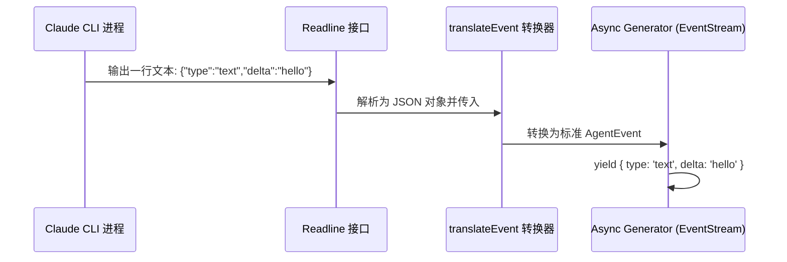

<details>
<summary>相关源文件</summary>

生成本页时使用的主要源文件：

- [src/agent/claude/adapter.ts](../../../project-repos/feishu-claude-code-bridge/src/agent/claude/adapter.ts)
- [src/agent/claude/stream-json.ts](../../../project-repos/feishu-claude-code-bridge/src/agent/claude/stream-json.ts)
- [src/agent/types.ts](../../../project-repos/feishu-claude-code-bridge/src/agent/types.ts)

</details>

# Claude CLI 集成与适配器

`feishu-claude-code-bridge` 的核心诉求是能够完全托管和驱动本地的 `claude` CLI。这一层功能由 `src/agent/claude/adapter.ts` 模块提供，它实现了一个平台无关的代理适配器接口 `AgentAdapter`。

## 参数标准化启动与会话恢复

每当飞书端有一批新消息被确认消费时，适配器会通过 `spawn` 调起一个新的 `claude` 子进程。在启动时，系统会将一系列复杂的运行参数标准化：

```typescript
const args = [
  '-p',
  opts.prompt,
  '--output-format',
  'stream-json',
  '--verbose',
  '--permission-mode',
  opts.permissionMode ?? 'bypassPermissions',
  '--append-system-prompt',
  BRIDGE_SYSTEM_PROMPT,
];
if (opts.sessionId) args.push('--resume', opts.sessionId);
if (opts.model) args.push('--model', opts.model);
```

- **`-p <prompt>`**：将飞书接收到的消息拼装为结构化 Prompt 输入。
- **`--output-format stream-json`**：强制 Claude Code 输出流式 JSON 序列，这是实现飞书端“流式打字机卡片效果”的关键技术。
- **`--permission-mode bypassPermissions`**：在无人值守的 Bot 环境中运行，我们需要跳过 Claude 自带的文件修改/终端命令等交互式权限询问。
- **`--resume <sessionId>`**：如果当前会话已有保存的 Claude 会话 ID，则自动追加此参数进行会话历史恢复，实现上下文衔接。

Sources: [src/agent/claude/adapter.ts:122-141](../../../project-repos/feishu-claude-code-bridge/src/agent/claude/adapter.ts#L122-L141)

<details class="source-snippets">
<summary>引用源码</summary>

<!-- source-snippets:start -->

#### `src/agent/claude/adapter.ts:122-141`

```typescript
  run(opts: AgentRunOptions): AgentRun {
    const args = [
      '-p',
      opts.prompt,
      '--output-format',
      'stream-json',
      '--verbose',
      '--permission-mode',
      opts.permissionMode ?? 'bypassPermissions',
      '--append-system-prompt',
      BRIDGE_SYSTEM_PROMPT,
    ];
    if (opts.sessionId) args.push('--resume', opts.sessionId);
    if (opts.model) args.push('--model', opts.model);

    const child = spawn(this.binary, args, {
      cwd: opts.cwd,
      env: { ...process.env, LARK_CHANNEL: '1' },
      stdio: ['ignore', 'pipe', 'pipe'],
    });
```

<!-- source-snippets:end -->
</details>

## BRIDGE_SYSTEM_PROMPT 深度协议约定

由于 Claude 运行在飞书的桥接器中，它不仅是一个“代码助手”，还需要学会在特定上下文中做出符合飞书交互体验的反应。宿主通过系统提示词 `BRIDGE_SYSTEM_PROMPT` 深度规范了以下行为：

### 1. XML 标签元数据隔离
为了不破坏 Claude 的上下文理解，宿主会在输入 Prompt 的顶部注入特定 XML 块，并指示 Claude **仅理解并用于推理，严禁照抄渲染**：
- **`<bridge_context>`**：携带发送者 ID、姓名、会话类型（p2p / group）和飞书 `chat_id`。
- **`<quoted_message>`**：当用户在飞书里进行“引用回复”时注入，包含被引用消息的类型、时间、发送者及内容。
- **`<interactive_card>`**：当用户点击或引用卡片时，将卡片的原始 JSON DSL（CardKit 2.0 格式）注入，用以让 Claude 理解当前的界面状态。

### 2. 双向卡片按钮交互回调约定
这是系统的一大创新。当 Claude 需要在飞书发出一些带有按钮的交互式卡片时：
- 它必须在按钮的 `value` 字段中塞入 `"__claude_cb": true`。
- 当用户在飞书客户端点击该按钮时，Bridge 宿主拦截此事件，并将 payload 去除标记后，以 `[card-click] { ... }` 格式的消息喂给 Claude。
- 如此一来，Claude 就能在同一 Session 下持续响应用户的卡片点击动作，完成逻辑闭环。

### 3. 前台阻塞授权规避
在飞书开发中，`lark-cli` 可能需要用户进行 OAuth 扫码授权（`lark-cli auth login`）。
- **痛点**：如果 Claude 在子进程中通过 `run_in_background: true` 将该命令丢进后台执行，那么随着当前交互轮次结束，Claude 主进程死掉，它所派生的后台授权子进程也会跟着被强杀，导致授权中断。
- **解法**：`BRIDGE_SYSTEM_PROMPT` 显式强制 Claude 在遇到 `lark-cli auth login` 时，必须以**前台阻塞**的方式分两阶段运行：先调 `--no-wait` 拿到授权 URL 并吐给用户，再调 `--device-code` 阻塞等待。在此期间飞书端的所有新消息会自动进入 Pending Queue 排队，从而保障授权流程的绝对顺畅。

Sources: [src/agent/claude/adapter.ts:15-102](../../../project-repos/feishu-claude-code-bridge/src/agent/claude/adapter.ts#L15-L102)

<details class="source-snippets">
<summary>引用源码</summary>

<!-- source-snippets:start -->

#### `src/agent/claude/adapter.ts:15-102`

```typescript
const BRIDGE_SYSTEM_PROMPT = `# lark-channel-bridge 运行约定

你正在 lark-channel-bridge 里跑：把飞书/Lark 用户消息桥到本地 \`claude\` CLI。

## bridge_context

每条 user message 顶部会带一个 \`<bridge_context>\` 块：

\`\`\`
<bridge_context>
chat_id: oc_xxx
chat_type: p2p
sender_id: ou_xxx
sender_name: ...
</bridge_context>
\`\`\`

里面是当前对话的 chat_id、chat 类型（p2p / group）、发送者。这些是 bridge 注入的元数据，**不要照抄、不要在你的回复里渲染**——它对用户不可见。

## quoted_message

如果用户用"引用回复"指向某条消息，bridge 会在 \`<bridge_context>\` 后注入一个 \`<quoted_message>\` 块：

\`\`\`
<quoted_message id="om_xxx" sender_id="ou_xxx" sender_name="..." created_at="..." type="text|merge_forward|...">
（被引用消息的内容；merge_forward 类型会展开成 <forwarded_messages>...</forwarded_messages>）
</quoted_message>
\`\`\`

这是用户**指向的对象**——用户的实际问题在它之后。回答时围绕这段内容展开；它也是 bridge 注入的元数据，**不要照抄 XML 标签**到回复里。

## interactive_card

用户发 / 引用交互卡片时,bridge 会把卡的真实 JSON 注入到 \`<interactive_card>\` 块:

\`\`\`
<interactive_card>
{ "schema": "2.0", "config": { ... }, "body": { ... } }
</interactive_card>
\`\`\`

两种来源:

- **v2 CardKit (schema 2.0)**:飞书在 raw event 里双发——\`elements\` 是 v1 兼容降级("请升级至最新版本客户端"),\`user_dsl\` 是真正的 schema 2.0 DSL。bridge 优先取 \`user_dsl\`,所以你看到的就是**真卡内容**,不要被 elements 的降级文案误导
- **零文字 v1 卡**:纯按钮 / 图片 / 装饰卡,SDK 扁平化抓不到字时,bridge 把整段 raw JSON 灌进来

无论哪种,块里都是卡的完整 JSON。解析它来理解结构(按钮、字段、布局)。**不要照抄 XML 标签到回复**——对用户不可见。

## 发交互卡片（按钮、表单）的回调约定

你想发一张可交互的卡片让用户点选时：

1. 用 \`lark-cli\` 把卡发到 \`bridge_context.chat_id\`：
   \`lark-cli im send-card --chat-id <chat_id> --card '<json>'\`
2. 卡片用 CardKit 2.0 schema（\`schema: "2.0"\`）。
3. **如果你希望用户点按钮后回调到你（让你在同一会话里继续处理）**：
   - 按钮的 \`value\` 对象**必须**包含 \`__claude_cb: true\`
   - 同时可以塞任意其它字段，作为你需要在回调时记住的状态（比如 \`{"__claude_cb": true, "choice": "a", "ticket_id": "T-123"}\`）
4. 用户点击后，bridge 会把 payload（去掉 \`__claude_cb\` marker）作为 \`[card-click] {...}\` 消息发回给你；你的 session 自动续上，能看到自己上轮发了什么卡。
5. **如果只是展示卡（不需要回调）**，不要加 \`__claude_cb\`，否则点击就会触发额外的会话轮次。

示例 button：
\`\`\`json
{
  "tag": "button",
  "text": { "tag": "plain_text", "content": "方案 A" },
  "behaviors": [{
    "type": "callback",
    "value": { "__claude_cb": true, "choice": "a" }
  }]
}
\`\`\`

## 飞书 OAuth 授权（\`lark-cli auth login\`）

授权流程要让 \`lark-cli\` 进程一直活到用户在浏览器里点完为止。bridge 在你的 run 结束之后会回收 claude，**你 spawn 的任何后台 bash 也会跟着死**——所以授权必须用"前台阻塞"的方式跑：

1. **仅在 p2p 里发起授权**。从 \`bridge_context.chat_type\` 看：
   - \`chat_type: p2p\` —— 正常按下面流程走。
   - \`chat_type: group\`（含 topic 群）—— **不要**调 \`lark-cli auth login\`。device flow 把 \`verification_url\` 发到群里，谁先点谁拿走 token——会绑定到错的身份。正确做法是回复用户："授权要在私聊里做，请单独私信我。"
2. **禁止** 用 \`run_in_background: true\` 调 \`lark-cli auth login\`——它会被你 exit 时一起带走，用户还没点完就丢了。
3. **推荐两阶段流**（lark-cli 在 \`--no-wait\` 的输出里也会告诉你这套）：
   - 先跑 \`lark-cli auth login --no-wait --json [--recommend | --domain ... | --scope ...]\`，**这一步秒返回**，stdout 里有 \`verification_url\` 和 \`device_code\`。
   - 把 \`verification_url\` **原样**用代码块发给用户（不要 Markdown 链接化、不要 URL 编码）。
   - 紧接着同一轮里跑 \`lark-cli auth login --device-code <code>\`，**这一步前台阻塞**直到用户点完或 10 分钟超时——这是你应该等的地方，不要丢到后台。
4. 你前台阻塞期间，用户发的新消息 bridge 会自动排队，**不会打断你**；等你 tool_result 一回来，下一批消息再进来。所以放心阻塞。
5. 如果用户中途想取消，他们会发 \`/stop\`——那时被 kill 是预期行为，不用兜底。
`;
```

<!-- source-snippets:end -->
</details>

## JSON 流式事件的流式解析

子进程的 Stdout 是基于行分隔的 JSON 字符串流。宿主使用 Node.js 的 `readline` 模块逐行捕获 Stdout：



数据流经过 `src/agent/claude/stream-json.ts` 中的 `translateEvent`，被转换为统一的 `AgentEvent`：
- `text` / `thinking`：大模型生成的正文和深度思考过程（思维链）。
- `tool_use` / `tool_result`：Claude 调用工具的参数、输出和状态。
- `error` / `done`：异常和成功终止信号。

Sources: [src/agent/claude/stream-json.ts:1-120](../../../project-repos/feishu-claude-code-bridge/src/agent/claude/stream-json.ts#L1-L120)

<details class="source-snippets">
<summary>引用源码</summary>

<!-- source-snippets:start -->

#### `src/agent/claude/stream-json.ts:1-120`

```typescript
import type { AgentEvent } from '../types';

interface ContentBlock {
  type: string;
  text?: string;
  thinking?: string;
  id?: string;
  name?: string;
  input?: unknown;
  tool_use_id?: string;
  content?: unknown;
  is_error?: boolean;
}

interface ClaudeRawEvent {
  type?: string;
  subtype?: string;
  session_id?: string;
  cwd?: string;
  model?: string;
  message?: { content?: ContentBlock[] };
  usage?: { input_tokens?: number; output_tokens?: number };
  total_cost_usd?: number;
}

export function* translateEvent(raw: unknown): Generator<AgentEvent> {
  if (!raw || typeof raw !== 'object') return;
  const evt = raw as ClaudeRawEvent;

  if (evt.type === 'system' && evt.subtype === 'init') {
    yield {
      type: 'system',
      sessionId: evt.session_id,
      cwd: evt.cwd,
      model: evt.model,
    };
    return;
  }

  if (evt.type === 'assistant' && evt.message?.content) {
    for (const block of evt.message.content) {
      if (block.type === 'text' && typeof block.text === 'string' && block.text) {
        yield { type: 'text', delta: block.text };
      } else if (block.type === 'thinking' && typeof block.thinking === 'string' && block.thinking) {
        yield { type: 'thinking', delta: block.thinking };
      } else if (block.type === 'tool_use' && block.id && block.name) {
        yield { type: 'tool_use', id: block.id, name: block.name, input: block.input };
      }
    }
    return;
  }

  if (evt.type === 'user' && evt.message?.content) {
    for (const block of evt.message.content) {
      if (block.type === 'tool_result' && block.tool_use_id) {
        const output =
          typeof block.content === 'string' ? block.content : JSON.stringify(block.content);
        yield {
          type: 'tool_result',
          id: block.tool_use_id,
          output,
          isError: block.is_error === true,
        };
      }
    }
    return;
  }

  if (evt.type === 'result') {
    if (evt.usage) {
      yield {
        type: 'usage',
        inputTokens: evt.usage.input_tokens,
        outputTokens: evt.usage.output_tokens,
        costUsd: evt.total_cost_usd,
      };
    }
    yield { type: 'done', sessionId: evt.session_id };
  }
}
```

<!-- source-snippets:end -->
</details>

## 相关页面

- [系统架构与进程模型](system-architecture.md) — 了解子进程生命周期
- [飞书 Bot 消息与连接管理](feishu-bot-core.md) — 消息是如何流向适配器的
- [交互式卡片渲染与分发](interactive-cards.md) — 事件在被捕获后如何被渲染为飞书交互卡片
