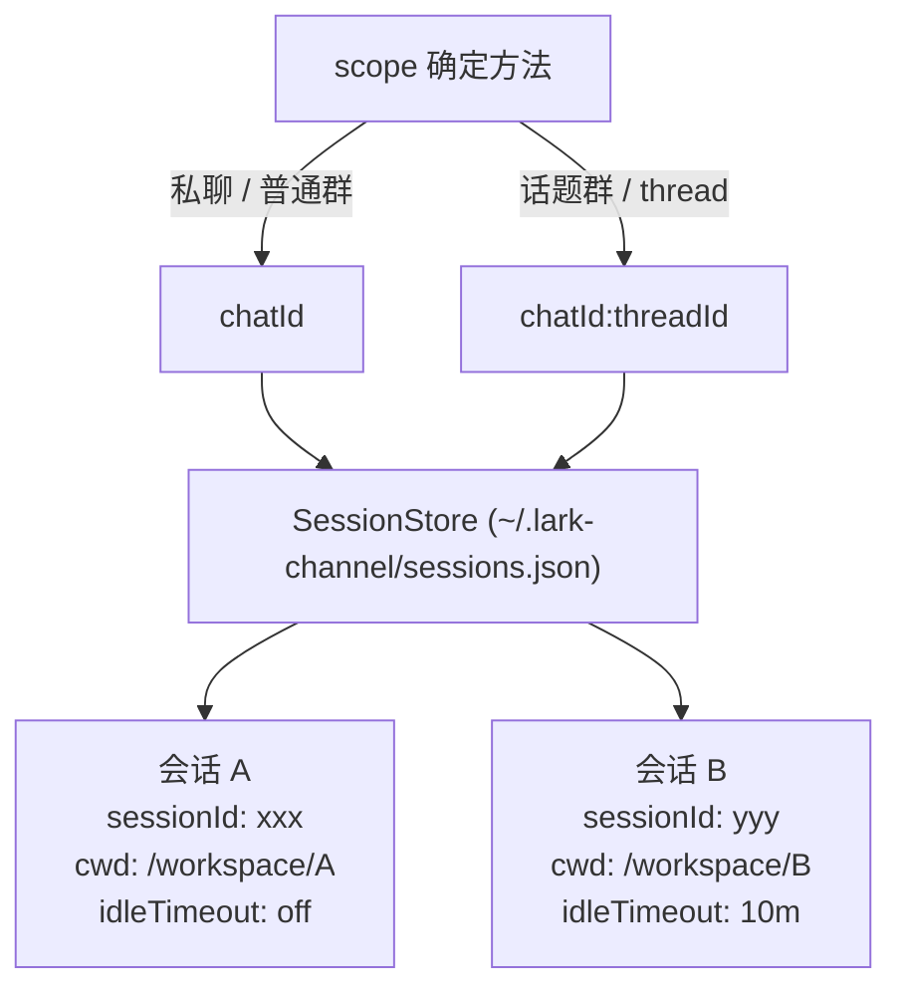

<details>
<summary>相关源文件</summary>

生成本页时使用的主要源文件：

- [src/commands/index.ts](../../../project-repos/feishu-claude-code-bridge/src/commands/index.ts)
- [src/session/store.ts](../../../project-repos/feishu-claude-code-bridge/src/session/store.ts)
- [src/workspace/store.ts](../../../project-repos/feishu-claude-code-bridge/src/workspace/store.ts)

</details>

# 会话与指令系统

为了控制本地 Claude Code 并调整 Bot 的运行状态，系统内建了一套丰富的斜杠指令（Slash Commands）以及与之紧密配合的会话与工作空间持久化存储模块。

## 斜杠指令分发系统

当用户在飞书端发送一条以 `/` 开头的文本消息时，该消息在经过连接层的安全校验后，会在第一时间进入 `src/commands/index.ts` 中的 `tryHandleCommand` 函数进行拦截处理。

系统支持的完整指令列表及其技术行为如下表所示：

| 斜杠指令 | 参数格式 | 核心行为 |
| :--- | :--- | :--- |
| `/new` 或 `/reset` | 无 | 强制清理当前会话（`scope`）在本地的 Claude 会话 ID，相当于开启干净的新对话。 |
| `/cd` | `<path>` | 切换该会话的工作目录（`cwd`），并自动重置并隔离会话。 |
| `/ws` | `list \| save <name> \| use <name> \| remove <name>` | 管理命名工作空间。保存和重用常用的开发目录路径，无需每次打绝对路径。 |
| `/status` | 无 | 返回当前会话的工作路径、会话 ID 和运行状态等诊断卡片。 |
| `/config` | 无 | 返回配置调整卡片，支持图形化更改管理员列表、用户白名单、群白名单及交互偏好。 |
| `/stop` | 无 | 强制向当前会话中活跃运行的 Claude 子进程发送 `SIGTERM`（继而 `SIGKILL`）。 |
| `/timeout` | `[N \| off \| default]` | 设置当前会话的 idle 超时探活分钟数或重置回全局配置。 |
| `/ps` | 无 | 列出本地主机上所有处于活跃状态的 Bridge 进程信息。 |
| `/exit` | `<id \| #>` | 终止指定的 Bridge 进程（如果是自身则触发优雅关机退出）。 |
| `/reconnect` | 无 | 强制断开当前的 WebSocket 连接并拉起新凭据进行热重载建连。 |
| `/doctor` | `[描述]` | 自助诊断命令。自动抓取最近的 JSON 日志，拼装用户的故障描述后灌给 Claude 进行诊断。 |

Sources: [src/commands/index.ts:1-250](../../../project-repos/feishu-claude-code-bridge/src/commands/index.ts#L1-L250)

<details class="source-snippets">
<summary>引用源码</summary>

<!-- source-snippets:start -->

#### `src/commands/index.ts:1-250`

```typescript
import { stat } from 'node:fs/promises';
import { homedir } from 'node:os';
import type { LarkChannel, NormalizedMessage } from '@larksuiteoapi/node-sdk';
import type { AgentAdapter } from '../agent/types';
import type { ActiveRuns } from '../bot/active-runs';
import {
  accountCurrentCard,
  accountFailureCard,
  accountFormCard,
  accountSuccessCard,
} from '../card/account-cards';
import { configCancelledCard, configFormCard, configSavedCard } from '../card/config-card';
import { forgetManagedCard, sendManagedCard, updateManagedCard } from '../card/managed';
import { helpCard, resumeCard, statusCard, workspacesCard } from '../card/templates';
import type { AppConfig, MessageReplyMode, TenantBrand } from '../config/schema';
import {
  getAgentStopGraceMs,
  getMaxConcurrentRuns,
  getMessageReplyMode,
  getRequireMentionInGroup,
  getRunIdleTimeoutMs,
  getShowToolCalls,
  isAdmin,
  secretKeyForApp,
} from '../config/schema';
import { setSecret } from '../config/keystore';
import { buildEncryptedAccountConfig, saveConfig } from '../config/store';
import { log, readRecentLogs, sanitizeLogsForDoctor } from '../core/logger';
import { renderCard } from '../card/run-renderer';
import {
  finalizeIfRunning,
  initialState,
  markInterrupted,
  reduce,
  type RunState,
} from '../card/run-state';
import { formatRelTime, listRecentSessions } from '../session/history';
import { isAlive, readAndPrune, resolveTarget } from '../runtime/registry';
import type { SessionStore } from '../session/store';
import { validateAppCredentials } from '../utils/feishu-auth';
import type { WorkspaceStore } from '../workspace/store';
import { createBoundChat, defaultChatName } from '../bot/group';

export interface Controls {
  /** Restart the bridge in-process: disconnect WS, kill claude runs, reload
   * config, reconnect with the new credentials. */
  restart(): Promise<void>;
  /** Stop this whole process gracefully (disconnect + exit). Used by /exit
   * when the user targets the receiving process itself. */
  exit(): Promise<void>;
  /** Path to the config file the bridge was started with. */
  configPath: string;
  /** The current app config (snapshot at startChannel time). */
  cfg: AppConfig;
  /** This process's short id in the registry. Used by /ps to highlight the
   * receiving process and by /exit to detect self-target. */
  processId: string;
}

export interface CommandContext {
  channel: LarkChannel;
  msg: NormalizedMessage;
  /**
   * Session scope string. For p2p / regular group it equals `msg.chatId`;
   * for topic groups it's `${chatId}:${threadId}` (so each topic gets its
   * own session / cwd / active-run). All handlers should read/write
   * session / workspace / activeRuns through this — never through
   * `msg.chatId` directly.
   */
  scope: string;
  /** Resolved chat mode for `msg.chatId`. Used by /status to surface the
   * scope semantic to the user (`topic` shows "话题独立 session"). */
  chatMode: 'p2p' | 'group' | 'topic';
  sessions: SessionStore;
  workspaces: WorkspaceStore;
  agent: AgentAdapter;
  activeRuns: ActiveRuns;
  controls: Controls;
  /** Set when invoked from a CardKit 2.0 form submit. Keys are input `name`s. */
  formValue?: Record<string, unknown>;
  /** True when this invocation came from a card button click rather than a
   * text command. Determines whether to update the existing card vs send a
   * new one. */
  fromCardAction?: boolean;
}

type Handler = (args: string, ctx: CommandContext) => Promise<void>;

const handlers: Record<string, Handler> = {
  '/new': handleNew,
  '/reset': handleNew,
  '/cd': handleCd,
  '/ws': handleWs,
  '/resume': handleResume,
  '/status': handleStatus,
  '/help': handleHelp,
  '/account': handleAccount,
  '/config': handleConfig,
  '/stop': handleStop,
  '/timeout': handleTimeout,
  '/ps': handlePs,
  '/exit': handleExit,
  '/doctor': handleDoctor,
  '/reconnect': handleReconnect,
};

/**
 * Commands that can mutate credentials, lifecycle, filesystem reach, or
 * surface sensitive runtime state. Gated on the configured admin allowlist;
 * empty list = no restriction (every allowed user can run them — see
 * `isAdmin` in config/schema).
 */
const ADMIN_COMMANDS = new Set([
  '/account',
  '/config',
  '/exit',
  '/reconnect',
  '/doctor',
  '/cd',
  '/ws',
... snippet truncated ...
```

<!-- source-snippets:end -->
</details>

## 会话存储管理 (SessionStore)

在多用户和多群聊环境中，Bridge 必须保证“各聊各的，互不干扰”。飞书会话由全局 `scope` 唯一标识：
- 在私聊（P2P）中，`scope` 对应飞书的私聊 `chatId`。
- 在普通的群组中，`scope` 对应群的 `chatId`。
- 在话题群（Topic Chat）中，`scope` 对应 `chatId:threadId` 的复合键值，确保飞书的每个讨论话题线程都是一个完全独立的上下文。



`SessionStore` 被持久化保存在本地的 `~/.lark-channel/sessions.json` 文件中。每条记录（`SessionEntry`）包含了：
- `sessionId`：Claude CLI 为该会话生成的上下文 Session ID（例如 `session_xxxxxxxx`）。
- `cwd`：该会话当前绑定的本地工作空间绝对路径。
- `idleTimeoutMinutes`：专门针对该会话的闲置超时分钟数。

Sources: [src/session/store.ts:1-110](../../../project-repos/feishu-claude-code-bridge/src/session/store.ts#L1-L110)

<details class="source-snippets">
<summary>引用源码</summary>

<!-- source-snippets:start -->

#### `src/session/store.ts:1-110`

```typescript
import { mkdir, readFile, writeFile } from 'node:fs/promises';
import { dirname } from 'node:path';
import { paths } from '../config/paths';
import { log } from '../core/logger';

export interface SessionEntry {
  /** May be absent if the entry was created by /timeout before any run
   * recorded a session id. Treat absence as "no resumable session". */
  sessionId?: string;
  /** Pinned cwd for the resumable session. Absent for the same reason. */
  cwd?: string;
  updatedAt: number;
  /** Per-scope idle-timeout override (minutes). 0 = explicitly off for this
   * scope, undefined = follow global default. /new clears the whole entry,
   * so this resets to "follow global" when the user starts a new session. */
  idleTimeoutMinutes?: number;
}

type SessionMap = Record<string, SessionEntry>;

export class SessionStore {
  private data: SessionMap = {};
  private saving: Promise<void> = Promise.resolve();
  private readonly path: string;

  constructor(path: string = paths.sessionsFile) {
    this.path = path;
  }

  async load(): Promise<void> {
    try {
      const text = await readFile(this.path, 'utf8');
      const raw = JSON.parse(text) as Record<string, Partial<SessionEntry>>;
      this.data = {};
      for (const [chatId, entry] of Object.entries(raw)) {
        if (!entry || typeof entry.updatedAt !== 'number') continue;
        // Drop entries without a `cwd`/`sessionId` pair *unless* there's
        // some other persisted state worth keeping (e.g. an idle-timeout
        // override). Resuming a session whose cwd we don't know about
        // would hang claude on a missing jsonl, so resume keys still need
        // the full pair; but a bare timeout override is fine on its own.
        const sessionId = typeof entry.sessionId === 'string' ? entry.sessionId : undefined;
        const cwd = typeof entry.cwd === 'string' ? entry.cwd : undefined;
        const idleTimeoutMinutes =
          typeof entry.idleTimeoutMinutes === 'number' ? entry.idleTimeoutMinutes : undefined;
        const hasSession = sessionId !== undefined && cwd !== undefined;
        if (!hasSession && idleTimeoutMinutes === undefined) continue;
        this.data[chatId] = {
          ...(sessionId !== undefined ? { sessionId } : {}),
          ...(cwd !== undefined ? { cwd } : {}),
          updatedAt: entry.updatedAt,
          ...(idleTimeoutMinutes !== undefined ? { idleTimeoutMinutes } : {}),
        };
      }
    } catch (err) {
      if ((err as NodeJS.ErrnoException).code === 'ENOENT') return;
      throw err;
    }
  }

  /**
   * Return the session id for this chat if it was created in the given cwd.
   * Sessions recorded in a different cwd are stale — claude can't resume
   * them from a different working directory.
   */
  resumeFor(chatId: string, cwd: string): string | undefined {
    const entry = this.data[chatId];
    if (!entry) return undefined;
    if (entry.cwd !== cwd) return undefined;
    return entry.sessionId;
  }

  getRaw(chatId: string): SessionEntry | undefined {
    return this.data[chatId];
  }

  set(chatId: string, sessionId: string, cwd: string): void {
    // Preserve idleTimeoutMinutes across run starts — it's a per-scope
    // preference, not per-run-instance state. /new (clear) wipes it.
    const prev = this.data[chatId];
    this.data[chatId] = {
      sessionId,
      cwd,
      updatedAt: Date.now(),
      ...(prev?.idleTimeoutMinutes !== undefined
        ? { idleTimeoutMinutes: prev.idleTimeoutMinutes }
        : {}),
    };
    this.schedulePersist();
  }

  clear(chatId: string): void {
    if (!(chatId in this.data)) return;
    delete this.data[chatId];
    this.schedulePersist();
  }

  /** Per-scope idle-timeout override. `undefined` means no override set. */
  getIdleTimeoutMinutes(chatId: string): number | undefined {
    return this.data[chatId]?.idleTimeoutMinutes;
  }

  setIdleTimeoutMinutes(chatId: string, minutes: number): void {
    const clamped = Math.min(Math.max(Math.floor(minutes), 0), 120);
    const prev = this.data[chatId];
    this.data[chatId] = {
      ...(prev ?? { updatedAt: Date.now() }),
      idleTimeoutMinutes: clamped,
      updatedAt: Date.now(),
    };
```

<!-- source-snippets:end -->
</details>

## 命名工作空间管理 (WorkspaceStore)

为了提高切换目录的效率，宿主还提供了命名工作空间管理。
- **存储映射**：`WorkspaceStore` 对应 `~/.lark-channel/workspaces.json`，存储了工作空间短名与本地物理绝对路径的键值对。
- **操作安全**：当用户通过 `/cd` 或 `/ws use` 切换目录时，系统会自动重置对应的 `SessionEntry`（将会话 ID 擦除）。这是为了防止在 `Cwd A` 生成的 Claude 会话引用到 `Cwd B` 中的相对路径，导致子进程执行文件读取时报找不到文件或读写越界错误。

Sources: [src/workspace/store.ts:1-80](../../../project-repos/feishu-claude-code-bridge/src/workspace/store.ts#L1-L80)

<details class="source-snippets">
<summary>引用源码</summary>

<!-- source-snippets:start -->

#### `src/workspace/store.ts:1-80`

```typescript
import { mkdir, readFile, writeFile } from 'node:fs/promises';
import { dirname } from 'node:path';
import { paths } from '../config/paths';
import { log } from '../core/logger';

interface WorkspaceData {
  chats: Record<string, { cwd: string }>;
  named: Record<string, string>;
}

export class WorkspaceStore {
  private data: WorkspaceData = { chats: {}, named: {} };
  private saving: Promise<void> = Promise.resolve();
  private readonly path: string;

  constructor(path: string = paths.workspacesFile) {
    this.path = path;
  }

  async load(): Promise<void> {
    try {
      const text = await readFile(this.path, 'utf8');
      const parsed = JSON.parse(text) as Partial<WorkspaceData>;
      this.data = {
        chats: parsed.chats ?? {},
        named: parsed.named ?? {},
      };
    } catch (err) {
      if ((err as NodeJS.ErrnoException).code === 'ENOENT') return;
      throw err;
    }
  }

  cwdFor(chatId: string): string | undefined {
    return this.data.chats[chatId]?.cwd;
  }

  setCwd(chatId: string, cwd: string): void {
    this.data.chats[chatId] = { cwd };
    this.schedulePersist();
  }

  listNamed(): Record<string, string> {
    return { ...this.data.named };
  }

  getNamed(name: string): string | undefined {
    return this.data.named[name];
  }

  saveNamed(name: string, cwd: string): void {
    this.data.named[name] = cwd;
    this.schedulePersist();
  }

  removeNamed(name: string): boolean {
    if (!(name in this.data.named)) return false;
    delete this.data.named[name];
    this.schedulePersist();
    return true;
  }

  async flush(): Promise<void> {
    await this.saving;
  }

  private schedulePersist(): void {
    this.saving = this.saving
      .then(async () => {
        await mkdir(dirname(this.path), { recursive: true });
        await writeFile(this.path, `${JSON.stringify(this.data, null, 2)}\n`, 'utf8');
      })
      .catch((err: unknown) => {
        log.fail('workspace', err, { step: 'persist' });
      });
  }
}
```

<!-- source-snippets:end -->
</details>

## 相关页面

- [飞书 Bot 消息与连接管理](feishu-bot-core.md) — 了解斜杠指令在排队与防抖中的拦截逻辑
- [安全防线与配置系统](security-config.md) — 探究指令执行的鉴权与配置存取
- [媒体流与辅助工具](media-utils.md) — 探讨配置向导的交互逻辑
