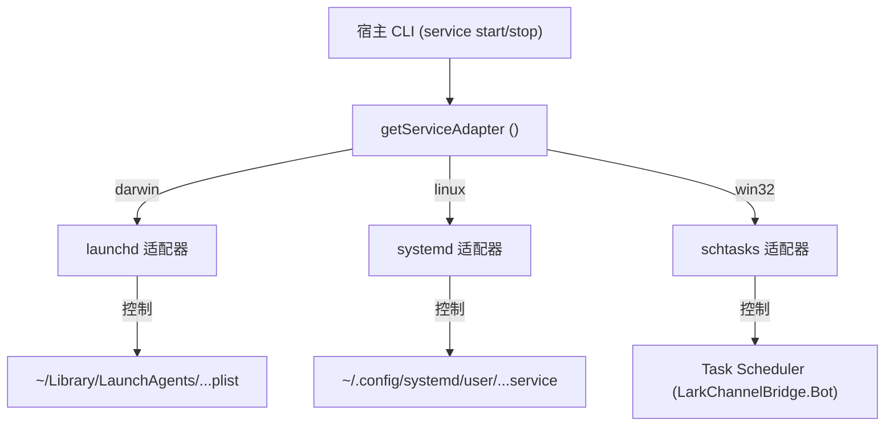

<details>
<summary>相关源文件</summary>

生成本页时使用的主要源文件：

- [src/cli/commands/service.ts](../../../project-repos/feishu-claude-code-bridge/src/cli/commands/service.ts)
- [src/daemon/service-adapter.ts](../../../project-repos/feishu-claude-code-bridge/src/daemon/service-adapter.ts)
- [src/daemon/launchd.ts](../../../project-repos/feishu-claude-code-bridge/src/daemon/launchd.ts)
- [src/daemon/systemd.ts](../../../project-repos/feishu-claude-code-bridge/src/daemon/systemd.ts)
- [src/daemon/schtasks.ts](../../../project-repos/feishu-claude-code-bridge/src/daemon/schtasks.ts)

</details>

# 守护进程与后台托管

当 Bridge 进程部署在本地开发机或长守服务器上时，前台运行终端窗口显然不具备抗崩溃自恢复和随系统自动开机启动的能力。为了实现真正可靠的企业级运维体验，`feishu-claude-code-bridge` 引入了**操作系统级守护进程 (OS-managed Daemon) 后台托管机制**。

## 为什么禁止在 Daemon 状态下使用 npx 启动？

> [!WARNING]
> 服务级控制命令（如 `start`、`restart` 等）**必须在全局安装** Bot 后使用，绝对不能直接用 `npx lark-channel-bridge start` 运行。
> 
> 原因在于，Daemon 在底层生成系统的 `plist`、`service` 或任务计划定义时，必须**硬编码**当前 CLI 可执行文件的物理绝对路径。如果使用 `npx` 启动，该路径指向的是 npm 的临时缓存目录（如 `~/.npm/_npx/<hash>/...`）。由于 npm 缓存会被系统的 GC 定期清理，一旦该临时目录被清空，系统 Daemon 就会彻底失效且再也无法自启。

## 跨平台服务适配器设计 (ServiceAdapter)

由于主流操作系统（macOS、Linux、Windows）的服务管理工具差异极大，宿主设计了平台抹平接口 `ServiceAdapter`，将复杂的操作系统差异封装在统一的行为之下：

```typescript
export interface ServiceAdapter {
  readonly platformName: string;
  fileExists(): boolean;
  isRunning(): boolean;
  servicePath(): string;
  install(): Promise<void>;
  start(): ServiceResultLike;
  stop(): ServiceResultLike;
  stopAndDisableAutostart(): ServiceResultLike;
  restart(): ServiceResultLike;
  waitUntilStopped(timeoutMs?: number): Promise<boolean>;
  deleteFile(): Promise<void>;
  describeStatus(): string;
  parseStatus(text: string): { pid?: string; lastExit?: string };
}
```

每次调用服务层命令时，系统通过 `process.platform` 进行判断，并自动路由到具体的系统实现：



Sources: [src/daemon/service-adapter.ts:20-62](../../../project-repos/feishu-claude-code-bridge/src/daemon/service-adapter.ts#L20-L62)

<details class="source-snippets">
<summary>引用源码</summary>

<!-- source-snippets:start -->

#### `src/daemon/service-adapter.ts:20-62`

```typescript
export interface ServiceAdapter {
  /** Display name used in error / status messages. */
  readonly platformName: string;

  /** Whether the service file (plist / unit / task) is on disk / registered. */
  fileExists(): boolean;

  /** Whether the service is currently running (process alive). */
  isRunning(): boolean;

  /** Path/name to the service definition (for status output). */
  servicePath(): string;

  /** Write or overwrite the service definition. */
  install(): Promise<void>;

  /** Start the service (enables autostart where applicable). */
  start(): ServiceResultLike;

  /** Stop the service. Does NOT disable autostart on its own. */
  stop(): ServiceResultLike;

  /** Stop + disable autostart. Used by `unregister` flow. */
  stopAndDisableAutostart(): ServiceResultLike;

  /** Restart the running service in place. */
  restart(): ServiceResultLike;

  /** Poll until the service is no longer running, or timeout. */
  waitUntilStopped(timeoutMs?: number): Promise<boolean>;

  /** Remove the service definition from the OS. */
  deleteFile(): Promise<void>;

  /** Raw status output from the underlying tool, for downstream parsing. */
  describeStatus(): string;

  /**
   * Extract pid / last exit code from `describeStatus()` text. Returns
   * undefined for fields the platform doesn't expose or hasn't recorded yet.
   */
  parseStatus(text: string): { pid?: string; lastExit?: string };
}
```

<!-- source-snippets:end -->
</details>

## 跨平台具体实现细节

### 1. macOS (launchd) 用户代理
- **注册路径**：`~/Library/LaunchAgents/ai.lark-channel-bridge.bot.plist`
- **生命周期**：plist 中配置了 `RunAtLoad: true` (开机或登录时自启) 以及 `KeepAlive: true` (崩溃自动拉起)。
- **操作指令**：底层使用 `launchctl bootstrap` 加载和启动服务，使用 `launchctl bootout` 停用，使用 `launchctl kickstart -k` 进行重载。

Sources: [src/daemon/launchd.ts:1-120](../../../project-repos/feishu-claude-code-bridge/src/daemon/launchd.ts#L1-L120)

<details class="source-snippets">
<summary>引用源码</summary>

<!-- source-snippets:start -->

#### `src/daemon/launchd.ts:1-120`

```typescript
import { spawnSync } from 'node:child_process';
import { existsSync } from 'node:fs';
import { mkdir, rm, writeFile } from 'node:fs/promises';
import { userInfo } from 'node:os';
import { dirname } from 'node:path';
import {
  LAUNCH_AGENT_LABEL,
  daemonLogDir,
  daemonStderrPath,
  daemonStdoutPath,
  launchAgentPlistPath,
} from './paths';

export interface PlistInputs {
  /** Absolute path to the node binary that should run the bridge. */
  nodePath: string;
  /** Absolute path to the bridge CLI entry (the file currently executing). */
  bridgeEntryPath: string;
  /** PATH for the daemon process — captured from current shell so child
   * tools (lark-cli, claude) can be resolved by name. launchd defaults
   * to a very minimal PATH otherwise. */
  envPath: string;
}

export function buildPlist(inputs: PlistInputs): string {
  const escape = (s: string): string =>
    s
      .replace(/&/g, '&amp;')
      .replace(/</g, '&lt;')
      .replace(/>/g, '&gt;')
      .replace(/"/g, '&quot;');
  return `<?xml version="1.0" encoding="UTF-8"?>
<!DOCTYPE plist PUBLIC "-//Apple//DTD PLIST 1.0//EN" "http://www.apple.com/DTDs/PropertyList-1.0.dtd">
<plist version="1.0">
<dict>
    <key>Label</key>
    <string>${LAUNCH_AGENT_LABEL}</string>
    <key>ProgramArguments</key>
    <array>
        <string>${escape(inputs.nodePath)}</string>
        <string>${escape(inputs.bridgeEntryPath)}</string>
        <string>run</string>
    </array>
    <key>RunAtLoad</key>
    <true/>
    <key>KeepAlive</key>
    <true/>
    <key>StandardOutPath</key>
    <string>${escape(daemonStdoutPath())}</string>
    <key>StandardErrorPath</key>
    <string>${escape(daemonStderrPath())}</string>
    <key>EnvironmentVariables</key>
    <dict>
        <key>PATH</key>
        <string>${escape(inputs.envPath)}</string>
    </dict>
</dict>
</plist>
`;
}

export async function writePlist(): Promise<void> {
  const bridgeEntryPath = process.argv[1];
  if (!bridgeEntryPath) {
    throw new Error('cannot determine bridge entry path (process.argv[1] is empty)');
  }
  const content = buildPlist({
    nodePath: process.execPath,
    bridgeEntryPath,
    envPath: process.env.PATH ?? '',
  });
  const plistPath = launchAgentPlistPath();
  await mkdir(dirname(plistPath), { recursive: true });
  await mkdir(daemonLogDir(), { recursive: true });
  await writeFile(plistPath, content, 'utf8');
}

export function plistExists(): boolean {
  return existsSync(launchAgentPlistPath());
}

function userTarget(): string {
  return `gui/${userInfo().uid}`;
}

function serviceTarget(): string {
  return `${userTarget()}/${LAUNCH_AGENT_LABEL}`;
}

interface LaunchctlResult {
  ok: boolean;
  stderr: string;
  stdout: string;
}

function runLaunchctl(args: string[]): LaunchctlResult {
  const r = spawnSync('launchctl', args, { encoding: 'utf8' });
  return {
    ok: r.status === 0,
    stderr: r.stderr ?? '',
    stdout: r.stdout ?? '',
  };
}

export function bootstrap(): LaunchctlResult {
  return runLaunchctl(['bootstrap', userTarget(), launchAgentPlistPath()]);
}

export function bootout(): LaunchctlResult {
  return runLaunchctl(['bootout', serviceTarget()]);
}

/** kickstart -k: kill the running instance and start a new one. Service
 * must already be bootstrapped (loaded into launchd). */
export function kickstart(): LaunchctlResult {
  return runLaunchctl(['kickstart', '-k', serviceTarget()]);
}

/** `launchctl print <target>` returns 0 iff the service is loaded.
 * We discard the verbose stdout for the existence check. */
```

<!-- source-snippets:end -->
</details>

### 2. Linux (systemd) 用户单元
- **注册路径**：`~/.config/systemd/user/lark-channel-bridge.bot.service`
- **生命周期**：配置文件使用 `Restart=always` 属性，并依赖 `WantedBy=default.target` 实现用户登录自动拉起。
- **持久化运行提示**：由于 Linux 默认会在用户登出 SSH 后强行杀掉该用户的所有 systemd user 进程，如果想让 Bot 在登出后仍能稳定长驻，需要让系统管理员或当前用户执行一次 `loginctl enable-linger $USER` 开启常驻运行属性。

Sources: [src/daemon/systemd.ts:1-120](../../../project-repos/feishu-claude-code-bridge/src/daemon/systemd.ts#L1-L120)

<details class="source-snippets">
<summary>引用源码</summary>

<!-- source-snippets:start -->

#### `src/daemon/systemd.ts:1-120`

```typescript
import { spawnSync } from 'node:child_process';
import { existsSync } from 'node:fs';
import { mkdir, rm, writeFile } from 'node:fs/promises';
import { dirname } from 'node:path';
import {
  SYSTEMD_UNIT_NAME,
  daemonLogDir,
  daemonStderrPath,
  daemonStdoutPath,
  systemdUnitPath,
} from './paths';

export interface UnitInputs {
  /** Absolute path to the node binary that should run the bridge. */
  nodePath: string;
  /** Absolute path to the bridge CLI entry (the file currently executing). */
  bridgeEntryPath: string;
  /** PATH for the daemon process — captured from current shell so child
   * tools (lark-cli, claude) can be resolved by name. systemd user units
   * inherit a minimal env otherwise. */
  envPath: string;
}

/**
 * `Restart=always` + `RestartSec=5` matches launchd's KeepAlive=true
 * behaviour with a 5s back-off so a crash-loop doesn't pin the CPU.
 *
 * `Type=simple` is the right fit: systemd treats the service as started
 * the moment ExecStart fires (bridge's WS handshake happens later, just
 * as on macOS). Our CLI polls the registry for the connection separately.
 *
 * `WantedBy=default.target` makes `systemctl --user enable` auto-start
 * the service when the user logs in. Note: systemd user services only
 * survive logout if `loginctl enable-linger <user>` is set — we mention
 * this in the user-facing success message.
 */
export function buildUnit(inputs: UnitInputs): string {
  const escape = (s: string): string => s.replace(/\\/g, '\\\\').replace(/"/g, '\\"');
  return `[Unit]
Description=Lark Channel Bridge bot
After=network-online.target
Wants=network-online.target

[Service]
Type=simple
ExecStart="${escape(inputs.nodePath)}" "${escape(inputs.bridgeEntryPath)}" run
Restart=always
RestartSec=5
StandardOutput=append:${daemonStdoutPath()}
StandardError=append:${daemonStderrPath()}
Environment="PATH=${escape(inputs.envPath)}"

[Install]
WantedBy=default.target
`;
}

export async function writeUnit(): Promise<void> {
  const bridgeEntryPath = process.argv[1];
  if (!bridgeEntryPath) {
    throw new Error('cannot determine bridge entry path (process.argv[1] is empty)');
  }
  const content = buildUnit({
    nodePath: process.execPath,
    bridgeEntryPath,
    envPath: process.env.PATH ?? '',
  });
  const unitPath = systemdUnitPath();
  await mkdir(dirname(unitPath), { recursive: true });
  await mkdir(daemonLogDir(), { recursive: true });
  await writeFile(unitPath, content, 'utf8');
}

export function unitExists(): boolean {
  return existsSync(systemdUnitPath());
}

interface SystemctlResult {
  ok: boolean;
  stderr: string;
  stdout: string;
}

function runSystemctl(args: string[]): SystemctlResult {
  const r = spawnSync('systemctl', ['--user', ...args], { encoding: 'utf8' });
  return {
    ok: r.status === 0,
    stderr: r.stderr ?? '',
    stdout: r.stdout ?? '',
  };
}

/** Tell systemd to re-scan unit files after we write/remove one. */
export function daemonReload(): SystemctlResult {
  return runSystemctl(['daemon-reload']);
}

/** Enable autostart on login + start now. Equivalent to launchd bootstrap. */
export function enableAndStart(): SystemctlResult {
  return runSystemctl(['enable', '--now', SYSTEMD_UNIT_NAME]);
}

/** Stop now (service stays enabled — will auto-start on next boot). */
export function stop(): SystemctlResult {
  return runSystemctl(['stop', SYSTEMD_UNIT_NAME]);
}

/** Disable autostart + stop now. Used by `unregister` flow. */
export function disableAndStop(): SystemctlResult {
  return runSystemctl(['disable', '--now', SYSTEMD_UNIT_NAME]);
}

/** Bounce the service in place. */
export function restart(): SystemctlResult {
  return runSystemctl(['restart', SYSTEMD_UNIT_NAME]);
}

/**
 * `is-active` returns 0 iff service state is "active". inactive/failed
 * both yield non-zero (and the failure reason lands in stdout, not stderr).
```

<!-- source-snippets:end -->
</details>

### 3. Windows 任务计划程序 (schtasks)
- **注册方式**：调用 Windows 内置的 `schtasks.exe /Create` 创建名为 `LarkChannelBridge.Bot` 的系统任务。
- **触发条件**：触发器绑定为 `ONLOGON`（当前 Windows 用户登录时触发）。
- **Windows 开机引导脚本**：由于 Windows 无法直接像 Linux 那样在后台优雅运行 CLI 脚本，Windows 适配器会在 `~/.lark-channel/daemon-launcher.cmd` 自动生成一个带有 Node 绝对路径的引导脚本，作为 schtasks 任务的实际载体，并以此实现后台无窗口挂起。

Sources: [src/daemon/schtasks.ts:1-120](../../../project-repos/feishu-claude-code-bridge/src/daemon/schtasks.ts#L1-L120)

<details class="source-snippets">
<summary>引用源码</summary>

<!-- source-snippets:start -->

#### `src/daemon/schtasks.ts:1-120`

```typescript
import { spawnSync } from 'node:child_process';
import { existsSync } from 'node:fs';
import { mkdir, rm, writeFile } from 'node:fs/promises';
import { dirname } from 'node:path';
import {
  WINDOWS_TASK_NAME,
  daemonLogDir,
  daemonStderrPath,
  daemonStdoutPath,
  windowsLauncherCmdPath,
} from './paths';

export interface LauncherInputs {
  /** Absolute path to node.exe. */
  nodePath: string;
  /** Absolute path to the bridge CLI entry. */
  bridgeEntryPath: string;
  /** PATH for the child process; baked into the .cmd via `set PATH=`. */
  envPath: string;
}

/**
 * Generate the .cmd wrapper script that the scheduled task actually invokes.
 *
 * schtasks `/TR` can accept a direct command, but we need stdout/stderr
 * redirection + a PATH override so child tools (lark-cli, claude) resolve
 * correctly when the daemon runs under Task Scheduler. A `.cmd` script
 * is the natural place for both.
 *
 * `@echo off` keeps the script's own commands out of the daemon log.
 * `>>` / `2>>` append (not truncate) so log history is preserved across
 * daemon restarts.
 */
export function buildLauncherCmd(inputs: LauncherInputs): string {
  return [
    '@echo off',
    `set "PATH=${inputs.envPath}"`,
    `"${inputs.nodePath}" "${inputs.bridgeEntryPath}" run >> "${daemonStdoutPath()}" 2>> "${daemonStderrPath()}"`,
    '',
  ].join('\r\n');
}

async function writeLauncherCmd(): Promise<void> {
  const bridgeEntryPath = process.argv[1];
  if (!bridgeEntryPath) {
    throw new Error('cannot determine bridge entry path (process.argv[1] is empty)');
  }
  const content = buildLauncherCmd({
    nodePath: process.execPath,
    bridgeEntryPath,
    envPath: process.env.PATH ?? '',
  });
  const cmdPath = windowsLauncherCmdPath();
  await mkdir(dirname(cmdPath), { recursive: true });
  await mkdir(daemonLogDir(), { recursive: true });
  await writeFile(cmdPath, content, 'utf8');
}

interface SchtasksResult {
  ok: boolean;
  stderr: string;
  stdout: string;
}

function runSchtasks(args: string[]): SchtasksResult {
  const r = spawnSync('schtasks', args, { encoding: 'utf8' });
  return {
    ok: r.status === 0,
    stderr: r.stderr ?? '',
    stdout: r.stdout ?? '',
  };
}

/**
 * Create (or overwrite) the scheduled task. Trigger: ONLOGON.
 * `/RL LIMITED` runs as the current user without admin elevation.
 * `/F` overwrites if the task already exists.
 *
 * The /TR value is the .cmd wrapper path. Schtasks treats /TR as a command
 * line, so wrapping in quotes keeps spaces in the path intact.
 */
export async function installTask(): Promise<SchtasksResult> {
  await writeLauncherCmd();
  return runSchtasks([
    '/Create',
    '/F',
    '/SC',
    'ONLOGON',
    '/RL',
    'LIMITED',
    '/TN',
    WINDOWS_TASK_NAME,
    '/TR',
    `"${windowsLauncherCmdPath()}"`,
  ]);
}

/** Start the task now (regardless of trigger). */
export function runTask(): SchtasksResult {
  return runSchtasks(['/Run', '/TN', WINDOWS_TASK_NAME]);
}

/** End the running instance. Task stays registered for next logon. */
export function endTask(): SchtasksResult {
  return runSchtasks(['/End', '/TN', WINDOWS_TASK_NAME]);
}

/** Disable autostart (task stays registered but ONLOGON trigger won't fire). */
export function disableTask(): SchtasksResult {
  return runSchtasks(['/Change', '/TN', WINDOWS_TASK_NAME, '/Disable']);
}

/** Re-enable autostart. Called from installTask is unnecessary — /Create /F
 * resets the enabled flag. Only needed if you Disabled and want it back. */
export function enableTask(): SchtasksResult {
  return runSchtasks(['/Change', '/TN', WINDOWS_TASK_NAME, '/Enable']);
}

/** End + disable. The cross-platform "stop = stay stopped" semantic. */
export function endAndDisable(): SchtasksResult {
```

<!-- source-snippets:end -->
</details>

## 日志落盘与监控

通过 Daemon 托管的 Bridge 进程，其 stdout (标准输出) 和 stderr (错误输出) 会被底层服务管理器重定向，自动落盘写入到如下本地文件中：
- `~/.lark-channel/logs/daemon-stdout.log`
- `~/.lark-channel/logs/daemon-stderr.log`

这与 Bridge 自身的每日滚动 JSON 格式日志区分开来，方便系统管理员在 Bot 失联或遇到 Node 崩溃时，通过阅读 Daemon 错误日志进行底层网络和运行时崩溃排查。

## 相关页面

- [系统架构与进程模型](system-architecture.md) — 进程注册表的双向设计
- [安全防线与配置系统](security-config.md) — 热重载与 Keystore 密钥持久化
