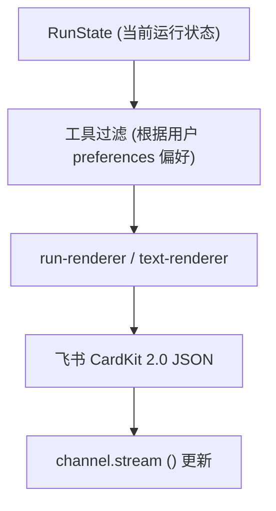
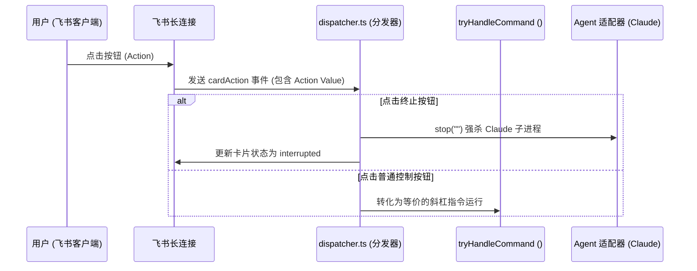

<details>
<summary>相关源文件</summary>

生成本页时使用的主要源文件：

- [src/card/run-state.ts](../../../project-repos/feishu-claude-code-bridge/src/card/run-state.ts)
- [src/card/run-renderer.ts](../../../project-repos/feishu-claude-code-bridge/src/card/run-renderer.ts)
- [src/card/templates.ts](../../../project-repos/feishu-claude-code-bridge/src/card/templates.ts)
- [src/card/text-renderer.ts](../../../project-repos/feishu-claude-code-bridge/src/card/text-renderer.ts)
- [src/card/dispatcher.ts](../../../project-repos/feishu-claude-code-bridge/src/card/dispatcher.ts)

</details>

# 交互式卡片渲染与分发

在传统的 IM 大模型 Bot 开发中，用户往往需要等待很长的时间才能看到大模型的回复。即使在大模型支持 SSE 流式返回后，对于具有“代码修改”和“终端命令执行”这类有工具调用的复杂 Agent（如 Claude Code），如何同步且平滑地展现其思维链、正在调用的工具名以及实时输出，是交互设计的深水区。

`feishu-claude-code-bridge` 通过一套**基于声明式状态机的流式卡片渲染与分发系统**，彻底解决了这一交互难题。

## 声明式运行状态机 (RunState)

在设计上，宿主并不直接把 Claude 的原始事件序列直接转为 Markdown 字符串发给飞书，而是维护了一个统一的、不可变的状态机 `RunState`。

`RunState` 的核心结构定义如下：
- **`blocks`**：一系列混合组件列表，既包含已产出的文本块（`text`），又包含执行中的工具条目（`tool`）。
- **`reasoning`**：正在生成的思维链思考内容。
- **`footer`**：当前的页脚指示器（思考中 `thinking`、工具运行中 `tool_running`、打字机流式输出中 `streaming`）。
- **`terminal`**：运行终止状态（运行中 `running`、成功结束 `done`、用户终止 `interrupted`、报错退出 `error`、超时关闭 `idle_timeout`）。

宿主调用 `reduce` 纯函数，根据捕获到的 `AgentEvent` 事件更新状态并返回全新的 `RunState`。这种设计使得卡片的渲染工作变得极其简单：只需每次将状态机传入渲染器，就能幂等地计算出最新的飞书 Card JSON。

Sources: [src/card/run-state.ts:13-120](../../../project-repos/feishu-claude-code-bridge/src/card/run-state.ts#L13-L120)

<details class="source-snippets">
<summary>引用源码</summary>

<!-- source-snippets:start -->

#### `src/card/run-state.ts:13-120`

```typescript
export type Block =
  | { kind: 'text'; content: string; streaming: boolean }
  | { kind: 'tool'; tool: ToolEntry };

export type FooterStatus = 'thinking' | 'tool_running' | 'streaming' | null;
export type Terminal = 'running' | 'done' | 'interrupted' | 'error' | 'idle_timeout';

export interface RunState {
  blocks: Block[];
  reasoning: { content: string; active: boolean };
  footer: FooterStatus;
  terminal: Terminal;
  errorMsg?: string;
  /** Set when terminal === 'idle_timeout' — how long claude was idle before
   * the watchdog gave up (so the message can say "N 分钟无响应"). */
  idleTimeoutMinutes?: number;
}

export const initialState: RunState = {
  blocks: [],
  reasoning: { content: '', active: false },
  footer: 'thinking',
  terminal: 'running',
};

function closeStreamingText(blocks: Block[]): Block[] {
  return blocks.map((b) =>
    b.kind === 'text' && b.streaming ? { ...b, streaming: false } : b,
  );
}

export function reduce(state: RunState, evt: AgentEvent): RunState {
  switch (evt.type) {
    case 'text': {
      const last = state.blocks[state.blocks.length - 1];
      if (last && last.kind === 'text' && last.streaming) {
        const next: Block = { ...last, content: last.content + evt.delta };
        return {
          ...state,
          blocks: [...state.blocks.slice(0, -1), next],
          reasoning: { ...state.reasoning, active: false },
          footer: 'streaming',
        };
      }
      return {
        ...state,
        blocks: [...state.blocks, { kind: 'text', content: evt.delta, streaming: true }],
        reasoning: { ...state.reasoning, active: false },
        footer: 'streaming',
      };
    }

    case 'thinking': {
      return {
        ...state,
        reasoning: { content: state.reasoning.content + evt.delta, active: true },
        footer: 'thinking',
      };
    }

    case 'tool_use': {
      const tool: ToolEntry = {
        id: evt.id,
        name: evt.name,
        input: evt.input,
        status: 'running',
      };
      return {
        ...state,
        blocks: [...closeStreamingText(state.blocks), { kind: 'tool', tool }],
        reasoning: { ...state.reasoning, active: false },
        footer: 'tool_running',
      };
    }

    case 'tool_result': {
      const blocks = state.blocks.map((b) => {
        if (b.kind !== 'tool' || b.tool.id !== evt.id) return b;
        return {
          ...b,
          tool: {
            ...b.tool,
            status: evt.isError ? ('error' as const) : ('done' as const),
            output: evt.output,
          },
        };
      });
      return { ...state, blocks };
    }

    case 'error': {
      return { ...state, terminal: 'error', errorMsg: evt.message, footer: null };
    }

    case 'done': {
      return {
        ...state,
        blocks: closeStreamingText(state.blocks),
        reasoning: { ...state.reasoning, active: false },
        terminal: 'done',
        footer: null,
      };
    }

    default:
      return state;
  }
}
```

<!-- source-snippets:end -->
</details>

## 卡片模板化渲染与 CardKit 2.0 (templates.ts)

飞书客户端的卡片基于 XML 样式的 DSL 渲染。在 `templates.ts` 中，系统采用飞书官方最新的 **CardKit 2.0 (schema 2.0)** 构造卡片模板，相比 1.0 版本具有更强的组件化和响应式特性。



渲染时，系统会对当前的状态进行过滤和修饰：
1. **隐藏/显示工具调用**：读取配置 `getShowToolCalls`，如果用户配置了隐藏，则将 blocks 中所有 `kind === 'tool'` 的块剔除后再渲染。
2. **构建富文本组件**：通过 `text-renderer.ts`，将所有已完成的块格式化为 Markdown 语法输出。对于每一个工具块（`ToolEntry`），都会以折叠面板或代码块形式直观展示：
   - 🔵 `[Running] tool_name` (带有运行参数 JSON)
   - 🟢 `[Done] tool_name`
   - 🔴 `[Error] tool_name` (带有 stderr 错误细节)
3. **卡片页脚及终止按钮**：如果卡片处于 `running` 状态，底部会附带一个 ⏹ **终止** 按钮。如果用户点击了它，卡片将即刻进入 `interrupted` 状态并优雅强杀子进程。

Sources: [src/card/run-renderer.ts:1-60](../../../project-repos/feishu-claude-code-bridge/src/card/run-renderer.ts#L1-L60), [src/card/templates.ts:1-120](../../../project-repos/feishu-claude-code-bridge/src/card/templates.ts#L1-L120)

<details class="source-snippets">
<summary>引用源码</summary>

<!-- source-snippets:start -->

#### `src/card/run-renderer.ts:1-60`

```typescript
import type { Block, FooterStatus, RunState, ToolEntry } from './run-state';
import { toolBodyMd, toolHeaderText } from './tool-render';

const REASONING_MAX = 1500;
const COLLAPSE_TOOL_THRESHOLD = 3;

interface ToolGroup {
  kind: 'tools';
  tools: ToolEntry[];
}
interface TextGroup {
  kind: 'text';
  content: string;
}
type Group = ToolGroup | TextGroup;

export function renderCard(state: RunState): object {
  const elements: object[] = [];

  if (state.reasoning.content) {
    elements.push(reasoningPanel(state.reasoning.content, state.reasoning.active));
  }

  for (const group of groupBlocks(state.blocks)) {
    if (group.kind === 'text') {
      if (group.content.trim()) {
        elements.push(markdown(group.content));
      }
    } else {
      elements.push(...renderToolGroup(group.tools, state.terminal !== 'running'));
    }
  }

  if (state.terminal === 'interrupted') {
    elements.push(noteMd('_⏹ 已被中断_'));
  } else if (state.terminal === 'idle_timeout') {
    const mins = state.idleTimeoutMinutes ?? 0;
    elements.push(noteMd(`_⏱ ${mins} 分钟无响应,已自动终止_`));
  } else if (state.terminal === 'error' && state.errorMsg) {
    elements.push(noteMd(`⚠️ agent 失败：${state.errorMsg}`));
  } else if (state.terminal === 'done' && elements.length === 0) {
    elements.push(noteMd('_（未返回内容）_'));
  }

  if (state.terminal === 'running') {
    if (state.footer) elements.push(footerStatus(state.footer));
    elements.push(stopButton());
  }

  return {
    schema: '2.0',
    config: {
      streaming_mode: state.terminal === 'running',
      summary: { content: summaryText(state) },
    },
    body: { elements },
  };
}

function* groupBlocks(blocks: Block[]): Generator<Group> {
```

#### `src/card/templates.ts:1-120`

```typescript
interface ButtonSpec {
  text: string;
  value: Record<string, unknown>;
  style?: 'primary' | 'danger' | 'default';
}

function button(spec: ButtonSpec): object {
  return {
    tag: 'button',
    text: { tag: 'plain_text', content: spec.text },
    type: spec.style ?? 'default',
    value: spec.value,
  };
}

function divMd(content: string): object {
  return { tag: 'div', text: { tag: 'lark_md', content } };
}

function actions(buttons: ButtonSpec[]): object {
  return { tag: 'action', actions: buttons.map(button) };
}

const HR: object = { tag: 'hr' };

function shell(title: string, elements: object[]): object {
  return {
    config: { wide_screen_mode: true, update_multi: true },
    header: { title: { tag: 'plain_text', content: title } },
    elements,
  };
}

export function workspacesCard(current: string | undefined, named: Record<string, string>): object {
  const entries = Object.entries(named);
  const elements: object[] = [];

  elements.push(divMd(`当前 cwd：\`${escapeCode(current ?? '(未设置，使用 $HOME)')}\``));

  if (entries.length === 0) {
    elements.push(HR);
    elements.push(divMd('暂无命名工作空间。'));
    elements.push(
      divMd('💡 发送 `/ws save <name>` 把当前 cwd 存为命名工作空间'),
    );
  } else {
    elements.push(HR);
    entries.forEach(([name, path], i) => {
      const marker = path === current ? '  ← 当前' : '';
      elements.push(divMd(`**${escapeMd(name)}** → \`${escapeCode(path)}\`${marker}`));
      elements.push(
        actions([
          { text: '切换到此处', value: { cmd: 'ws.use', name }, style: 'primary' },
          { text: '删除', value: { cmd: 'ws.remove', name }, style: 'danger' },
        ]),
      );
      if (i < entries.length - 1) elements.push(HR);
    });
  }

  return shell('📂 工作空间', elements);
}

export interface StatusInfo {
  cwd: string;
  sessionId?: string;
  sessionStale: boolean;
  agentName: string;
  /** Session scope (= chatId or chatId:threadId in topic groups). */
  scope: string;
  /** Chat mode — used to label scope. */
  chatMode: 'p2p' | 'group' | 'topic';
}

export function statusCard(info: StatusInfo): object {
  const sessionLine = info.sessionId
    ? `\`${info.sessionId.slice(0, 8)}…\`${info.sessionStale ? ' ⚠️ 旧 cwd，下一条会新建' : ''}`
    : '(无)';
  // For topic groups, surface that the scope is per-topic so the user
  // knows /cd / /new only affect this topic.
  const scopeLine =
    info.chatMode === 'topic'
      ? `\`${escapeCode(info.scope)}\` _（话题独立 session）_`
      : `\`${escapeCode(info.scope)}\``;
  const lines = [
    `🧭 **scope**: ${scopeLine}`,
    `📁 **cwd**: \`${escapeCode(info.cwd)}\``,
    `🔗 **session**: ${sessionLine}`,
    `🤖 **agent**: ${escapeMd(info.agentName)}`,
  ];
  return shell('📊 当前状态', [
    divMd(lines.join('\n')),
    HR,
    actions([
      { text: '🆕 新会话', value: { cmd: 'new' }, style: 'primary' },
      { text: '🔁 恢复会话', value: { cmd: 'resume' } },
      { text: '📂 工作空间', value: { cmd: 'ws.list' } },
      { text: '💡 帮助', value: { cmd: 'help' } },
    ]),
  ]);
}

export interface ResumeEntry {
  sessionId: string;
  preview: string;
  relTime: string;
  lineCount: number;
  current?: boolean;
}

export function resumeCard(cwd: string, entries: ResumeEntry[]): object {
  const elements: object[] = [];
  elements.push(divMd(`当前 cwd：\`${escapeCode(cwd)}\``));

  if (entries.length === 0) {
    elements.push(HR);
    elements.push(divMd('此 cwd 下没有历史会话。'));
    return shell('🔁 恢复历史会话', elements);
  }

```

<!-- source-snippets:end -->
</details>

## 点击动作分发与路由机制 (dispatcher.ts)

用户点击卡片上的交互按钮（例如点击 ⏹ 终止，或者点击快捷命令）时，飞书网关会向宿主发送一个 `cardAction` 交互事件。宿主通过 `dispatcher.ts` 模块来解析和分发这个点击动作：



如果用户点击的是具有 `__claude_cb: true` 标识的自定义交互按钮，分发器会剥离该标识，将剩余的值拼装成大模型可读的回调字符串（例如 `[card-click] {"choice":"a"}`）直接写给 Claude 的输入管道，让会话无缝流转下去。

Sources: [src/card/dispatcher.ts:1-100](../../../project-repos/feishu-claude-code-bridge/src/card/dispatcher.ts#L1-L100)

<details class="source-snippets">
<summary>引用源码</summary>

<!-- source-snippets:start -->

#### `src/card/dispatcher.ts:1-100`

```typescript
import type { CardActionEvent, LarkChannel, NormalizedMessage } from '@larksuiteoapi/node-sdk';
import type { AgentAdapter } from '../agent/types';
import type { ActiveRuns } from '../bot/active-runs';
import type { ChatModeCache } from '../bot/chat-mode-cache';
import type { PendingQueue } from '../bot/pending-queue';
import { runCommandHandler, type CommandContext, type Controls } from '../commands';
import { isChatAllowed, isUserAllowed } from '../config/schema';
import { log } from '../core/logger';
import type { SessionStore } from '../session/store';
import type { WorkspaceStore } from '../workspace/store';

/** Marker key on a button's value object that flags the cardAction as
 * a callback that should be forwarded back to the agent (Claude) instead
 * of dispatched to a built-in command handler. The double-underscore
 * sigils make it virtually impossible to collide with normal payload
 * fields the agent might set.
 */
const CLAUDE_CALLBACK_MARKER = '__claude_cb';

export interface CardDispatchDeps {
  channel: LarkChannel;
  evt: CardActionEvent;
  sessions: SessionStore;
  workspaces: WorkspaceStore;
  activeRuns: ActiveRuns;
  agent: AgentAdapter;
  controls: Controls;
  pending: PendingQueue;
  chatModeCache: ChatModeCache;
}

export async function handleCardAction(deps: CardDispatchDeps): Promise<void> {
  const value = deps.evt.action.value;
  if (!value || typeof value !== 'object') return;
  const payload = value as Record<string, unknown>;

  const operatorId = deps.evt.operator.openId;
  const chatId = deps.evt.chatId;

  // CardKit 2.0 form submits drop user-input values from action.value; they
  // arrive on raw.action.form_value. The SDK forwards the raw event when
  // includeRawEvent: true is set on the channel options.
  const raw = (deps.evt as CardActionEvent & { raw?: unknown }).raw as
    | { action?: { form_value?: Record<string, unknown> } }
    | undefined;
  const formValue = raw?.action?.form_value;

  // Resolve the click's session scope. For topic groups we need to know
  // the message's thread_id so the action targets the right topic's
  // session — look up the carrier message (the card lives on it) once.
  // Done before the access check so we know the chat mode (p2p vs group)
  // and can skip the chat allowlist for DMs.
  const { scope, threadId, mode } = await resolveScope(deps);

  // Access control. Operator must be on the same allowlists as message
  // senders. Silent drop — sending a denial card to an unauthorized user
  // just confirms the bot exists.
  if (!isUserAllowed(deps.controls.cfg, operatorId)) {
    log.info('cardAction', 'skip-not-allowed-user', {
      operator: operatorId.slice(-6),
    });
    return;
  }
  // `allowedChats` is group-only — see intakeMessage in bot/channel.ts for
  // the rationale (p2p chat_ids aren't a meaningful access boundary, the
  // user check above is authoritative for DMs).
  if (mode !== 'p2p' && !isChatAllowed(deps.controls.cfg, chatId)) {
    log.info('cardAction', 'skip-not-allowed-chat', {
      chatId: chatId.slice(-6),
    });
    return;
  }

  // Claude-driven callback: the button was rendered by claude itself via
  // lark-cli, with `__claude_cb` set on the value. Forward the click back
  // into the scope's pending queue so claude resumes its session and sees
  // the click as a follow-up message, with full context of what it sent.
  if (CLAUDE_CALLBACK_MARKER in payload) {
    forwardToClaude(deps, payload, formValue, scope, threadId);
    return;
  }

  const cmd = typeof payload.cmd === 'string' ? payload.cmd : '';
  if (!cmd) return;
  log.info('cardAction', 'cmd', { cmd, scope });

  const ctx: CommandContext = {
    channel: deps.channel,
    msg: makeFakeMsg(deps.evt, threadId),
    scope,
    chatMode: mode,
    sessions: deps.sessions,
    workspaces: deps.workspaces,
    activeRuns: deps.activeRuns,
    agent: deps.agent,
    controls: deps.controls,
    formValue,
    fromCardAction: true,
  };

```

<!-- source-snippets:end -->
</details>

## 相关页面

- [飞书 Bot 消息与连接管理](feishu-bot-core.md) — 了解长连接如何承载流式流输出
- [Claude CLI 集成与适配器](claude-integration.md) — 探究 Claude 子进程事件的来源
- [会话与指令系统](commands-sessions.md) — 斜杠命令如何转化为卡片上的交互按钮
