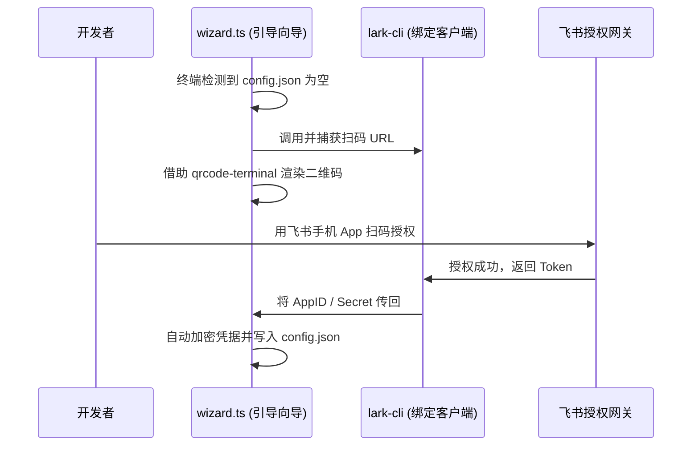

<details>
<summary>相关源文件</summary>

生成本页时使用的主要源文件：

- [src/media/cache.ts](../../../project-repos/feishu-claude-code-bridge/src/media/cache.ts)
- [src/bot/wizard.ts](../../../project-repos/feishu-claude-code-bridge/src/bot/wizard.ts)
- [src/utils/feishu-auth.ts](../../../project-repos/feishu-claude-code-bridge/src/utils/feishu-auth.ts)

</details>

# 媒体流与辅助工具

在企业级 AI Bot 的日常协同中，除了纯文字对话，用户往往还需要向大模型发送图片（如 UI 截图）、代码文件或报错日志附件，这就需要 Bot 能够支持富媒体流处理。另外，系统的引导与启动也是产品体验中不可忽视的环节。

## 飞书消息附件的流式下载与有效期 GC

当飞书端的消息中带有资源附件时，网关在 `channel.ts` 中拦截到消息，并将附件的 `fileKey` 提取出来，转交给 `src/media/cache.ts` 中的 `MediaCache` 模块。

附件下载与生命周期的维护机制如下：
1. **分级缓存落盘**：`MediaCache` 会根据当前的 `chatId` 自动在本地创建分层数据目录：`~/.lark-channel/media/<chatId>/`。
2. **下载流式处理**：通过调用飞书的 `im.messageResource.get` 接口获取数据流（`Readable`），将其以管道模式（`pipe`）输出并写入到本地缓存目录中，同时利用 `mime-types` 根据飞书的响应头自动纠正并补充文件的后缀名。
3. **本地路径注入**：文件成功写入本地后，`MediaCache` 会返回文件的物理绝对路径（例如 `/Users/username/.lark-channel/media/oc_xxx/temp.png`）。在最终喂给 Claude 的 Prompt 中，系统会将原本的飞书文件占位符替换为该本地绝对路径，从而让拥有本地文件读写权限的 Claude Code 可以直接通过 Node.js API 读取文件内容。
4. **24 小时缓存 GC**：由于图片和文件可能非常大，长期累积会撑爆本地磁盘。宿主进程在每次启动时，都会异步执行 `gcMediaCache(24 * 60 * 60 * 1000)`，自动扫描媒体文件夹，强制强杀并删除所有创建时间超过 24 小时的媒体文件，保证了系统磁盘的整洁性。

Sources: [src/media/cache.ts:1-130](../../../project-repos/feishu-claude-code-bridge/src/media/cache.ts#L1-L130), [src/cli/commands/start.ts:90-93](../../../project-repos/feishu-claude-code-bridge/src/cli/commands/start.ts#L90-L93)

<details class="source-snippets">
<summary>引用源码</summary>

<!-- source-snippets:start -->

#### `src/media/cache.ts:1-130`

```typescript
import { mkdir, readdir, rm, stat } from 'node:fs/promises';
import { join } from 'node:path';
import type { LarkChannel, ResourceDescriptor } from '@larksuiteoapi/node-sdk';
import { paths } from '../config/paths';
import { log } from '../core/logger';

export type AttachmentKind = 'image' | 'file' | 'audio' | 'video';

export interface LocalAttachment {
  path: string;
  kind: AttachmentKind;
  originalName?: string;
}

export interface ResourceRequest {
  messageId: string;
  resource: ResourceDescriptor;
}

export class MediaCache {
  private readonly channel: LarkChannel;

  constructor(channel: LarkChannel) {
    this.channel = channel;
  }

  async resolve(chatId: string, items: ResourceRequest[]): Promise<LocalAttachment[]> {
    if (items.length === 0) return [];
    const dir = dirFor(chatId);
    await mkdir(dir, { recursive: true });

    const results: LocalAttachment[] = [];
    for (const item of items) {
      try {
        const file = await this.resolveOne(dir, item);
        if (file) results.push(file);
      } catch (err) {
        log.fail('media', err, { fileKey: item.resource.fileKey });
      }
    }
    return results;
  }

  private async resolveOne(dir: string, item: ResourceRequest): Promise<LocalAttachment | null> {
    const { messageId, resource: r } = item;
    if (r.type === 'sticker') {
      log.info('media', 'skip', { reason: 'sticker', fileKey: r.fileKey });
      return null;
    }
    const kind: AttachmentKind = r.type;
    const fileName = pickFileName(r);
    const path = join(dir, fileName);

    try {
      await stat(path);
      log.info('media', 'cache-hit', { path });
      return { path, kind, originalName: r.fileName };
    } catch {
      /* not cached */
    }

    // Use the message-resource endpoint, which is required for resources
    // that arrived from user messages. The channel's downloadResource()
    // helper targets a different endpoint only valid for bot-uploaded files.
    const result = await this.channel.rawClient.im.v1.messageResource.get({
      params: { type: r.type },
      path: { message_id: messageId, file_key: r.fileKey },
    });
    await result.writeFile(path);

    const size = await stat(path).then((s) => s.size).catch(() => 0);
    log.info('media', 'downloaded', { path, size });
    return { path, kind, originalName: r.fileName };
  }
}

/** Delete files under the media cache whose mtime is older than maxAgeMs. */
export async function gcMediaCache(maxAgeMs: number): Promise<void> {
  const root = paths.mediaDir;
  try {
    await stat(root);
  } catch {
    return;
  }
  const cutoff = Date.now() - maxAgeMs;
  let removed = 0;
  const chats = await readdir(root).catch(() => []);
  for (const chat of chats) {
    const dir = join(root, chat);
    const files = await readdir(dir).catch(() => []);
    for (const f of files) {
      const p = join(dir, f);
      try {
        const st = await stat(p);
        if (st.isFile() && st.mtimeMs < cutoff) {
          await rm(p);
          removed++;
        }
      } catch {
        /* skip */
      }
    }
  }
  if (removed > 0) log.info('media', 'gc', { removed });
}

function dirFor(chatId: string): string {
  const safe = chatId.replace(/[^a-zA-Z0-9_-]/g, '_');
  return join(paths.mediaDir, safe);
}

function pickFileName(r: ResourceDescriptor): string {
  // Use the full fileKey, sanitized. Feishu keys share long stable prefixes
  // (e.g. "img_v3_<bucket>_<hash>-..."), so truncating would collide across
  // different uploads from the same bucket.
  const id = r.fileKey.replace(/[^a-zA-Z0-9_-]/g, '_');
  if (r.fileName) {
    return `${id}-${sanitize(r.fileName)}`;
  }
  switch (r.type) {
... snippet truncated ...
```

#### `src/cli/commands/start.ts:90-93`

```typescript

  await gcMediaCache(MEDIA_GC_MAX_AGE_MS);
  await gcOldLogs();

```

<!-- source-snippets:end -->
</details>

## 终端二维码扫码绑定向导 (wizard.ts)

为了降低用户的配置成本，当系统检测到本地未配置应用凭证时，会自动在终端（TTY）中启动交互式扫码引导向导 `runRegistrationWizard`：



- **终端二维码渲染**：借助 `qrcode-terminal` 将飞书的应用绑定链接渲染为 ASCII 二维码，用户只需使用飞书手机 App 扫码即可在开放平台中创建或选择 PersonalAgent 应用。
- **自动认证流处理**：使用 `lark-cli config bind --source lark-channel` 建立应用凭证的绑定，向导捕获返回的 `AppID` 与 `Tenant` 后，会自动将其写入 `~/.lark-channel/config.json`，完成了零门槛的快速上手。

Sources: [src/bot/wizard.ts:1-120](../../../project-repos/feishu-claude-code-bridge/src/bot/wizard.ts#L1-L120)

<details class="source-snippets">
<summary>引用源码</summary>

<!-- source-snippets:start -->

#### `src/bot/wizard.ts:1-120`

```typescript
import { registerApp } from '@larksuiteoapi/node-sdk';
import qrcode from 'qrcode-terminal';
import type { AppConfig, TenantBrand } from '../config/schema';

export async function runRegistrationWizard(): Promise<AppConfig> {
  console.log('\n未检测到飞书应用配置，进入扫码创建向导。\n');

  const result = await registerApp({
    onQRCodeReady: (info) => {
      console.log('请用飞书 App 扫描以下二维码完成应用创建：\n');
      qrcode.generate(info.url, { small: true });
      const mins = Math.max(1, Math.round(info.expireIn / 60));
      console.log(`\n二维码有效期：约 ${mins} 分钟`);
      console.log(`也可以直接在浏览器打开：${info.url}\n`);
    },
    onStatusChange: (info) => {
      if (info.status === 'domain_switched') {
        console.log('识别到国际版租户，已切换到 larksuite.com 域名。');
      } else if (info.status === 'slow_down') {
        console.log('轮询速度过快，已自动降速。');
      }
    },
  });

  const tenant: TenantBrand = result.user_info?.tenant_brand ?? 'feishu';
  const operatorOpenId = result.user_info?.open_id;

  console.log('\n✓ 应用创建成功');
  console.log(`  App ID:  ${result.client_id}`);
  console.log(`  Tenant:  ${tenant}`);

  const cfg: AppConfig = {
    accounts: {
      app: {
        id: result.client_id,
        secret: result.client_secret,
        tenant,
      },
    },
  };

  // Bootstrap the QR scanner as the initial admin. Without this seed the
  // /config gate stays open to everyone in any chat the bot joins, making
  // it awkward to ever tighten things (the operator would need to hand-edit
  // config.json to set the first admin).
  //
  // `allowedUsers` and `allowedChats` stay empty (unrestricted) by default
  // so the bot remains inviteable and responds anywhere it's invited; the
  // operator can tighten via /config later.
  if (operatorOpenId) {
    cfg.preferences = {
      access: { admins: [operatorOpenId] },
    };
    console.log(`  Admin:   ${operatorOpenId} (你自己，已自动加入管理员名单)`);
  } else {
    console.log(
      '  ⚠️ 未拿到扫码用户的 open_id；管理员列表留空 = 所有用户都能跑敏感命令。' +
        '\n     你可以稍后在飞书发 /config 手动设置管理员。',
    );
  }

  console.log('');
  return cfg;
}
```

<!-- source-snippets:end -->
</details>

## 网络 DNS 防挂起策略

在 Node.js 中，如果底层网络路由（例如 VPN 代理或局域网 IPv6 配置）残缺，会导致网络请求挂起超时。
系统在底层 `start.ts` 启动时，第一行就强制调用了：
```typescript
dns.setDefaultResultOrder('ipv4first');
```
这让 Node.js 优先去解析 IPv4 路由，能够有效规避国内一些特殊网络拓扑环境下拉取飞书媒体附件或连接 WebSocket 网关时出现的 DNS 查询挂起假死现象。

Sources: [src/cli/commands/start.ts:32-37](../../../project-repos/feishu-claude-code-bridge/src/cli/commands/start.ts#L32-L37)

<details class="source-snippets">
<summary>引用源码</summary>

<!-- source-snippets:start -->

#### `src/cli/commands/start.ts:32-37`

```typescript
// Prefer IPv4 — Node 20+ defaults to "verbatim" which respects whatever
// the resolver returns first; in IPv6-broken networks (WSL2, certain VPNs,
// some hotel WiFi) this lands on a dead v6 route and stalls. Explicitly
// prefer v4 avoids that whole class of issue.
dns.setDefaultResultOrder('ipv4first');

```

<!-- source-snippets:end -->
</details>

## 相关页面

- [系统架构与进程模型](system-architecture.md) — 了解启动流程中 DNS 重设的阶段
- [飞书 Bot 消息与连接管理](feishu-bot-core.md) — 探究文件附件是如何从长连接被接收的
- [安全防线与配置系统](security-config.md) — 密钥加密的流程设计
