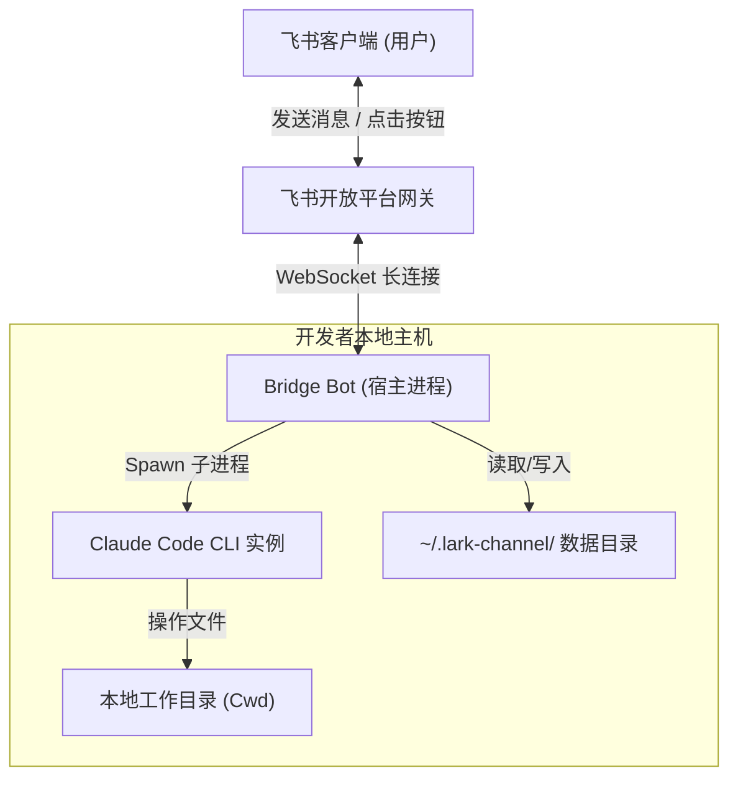

<details>
<summary>相关源文件</summary>

生成本页时使用的主要源文件：

- [package.json](../../../project-repos/feishu-claude-code-bridge/package.json)
- [README.zh.md](../../../project-repos/feishu-claude-code-bridge/README.zh.md)

</details>

# 项目概览

在软件开发领域，开发者们常常需要在终端、编辑器与协作沟通软件之间频繁切换。Claude Code 作为一个强大的 CLI 工具，虽然提供了优秀的本地代码操作能力，但其运行环境仅局限于开发者的本地 Shell。对于习惯使用飞书等企业协作软件进行沟通、分享以及快速迭代的团队和个人而言，如何在聊天窗口中低延迟、高体验地与本地 Claude Code 协同操作，是一个亟待解决的痛点。

`feishu-claude-code-bridge` 正是为打通这一壁垒而诞生的轻量级桥接 Bot。它不是一个简单的“飞书 API 转发器”，而是一个经过深度设计、支持**本地守护进程托管**、**多工作空间切换**、以及**飞书流式交互卡片渲染**的本地-云端协同系统。通过将飞书作为人机交互的第一界面，该项目让 Claude 能够直接对本地指定工作目录中的代码进行阅读、诊断和修改，并实现图片和文件的无缝传输，使得团队协作和个人开发体验得到质的飞跃。

## 能力全景

- **流式卡片渲染**：将 Claude 的自然语言思考、工具调用过程以及执行结果实时呈现在飞书的同一张卡片上，用户无需在聊天界面傻等全部内容生成完毕。
- **并发与防抖队列**：在网络抖动或用户快速连发消息时，系统通过内置队列进行消息合并与防抖；对于耗时较长的任务，支持中途发送新消息进行打断与抢占。
- **多命名工作空间**：支持通过 `/cd` 和 `/ws` 命令创建、保存与切换不同的本地项目目录，并且在切换工作目录时能够自动重置并隔离会话上下文。
- **双向交互式回调**：将飞书的富媒体消息（图片/文件）下载并自动转换为本地路径提供给 Claude 读取；同时支持在飞书卡片上放置按钮，点击后将状态回调给 Claude 决策。
- **跨平台守护托管**：内置对 OS 级守护进程（macOS `launchd`、Linux `systemd`、Windows `Task Scheduler`）的一键注册和托管，确保 Bot 在后台稳定、低开销运行。

## 架构鸟瞰

下面的图表展示了 `feishu-claude-code-bridge` 在本地开发机与飞书服务器之间的连接桥梁关系。



在本地开发机上，Bridge 充当长连接守候者与子进程控制器的双重角色。它向下管理着 `claude` 命令行工具的子进程，向上通过飞书 WebSocket 长连接完成事件的高速吞吐，并维护着状态、密钥和会话的本地持久化。

Sources: [package.json:1-50](../../../project-repos/feishu-claude-code-bridge/package.json#L1-L50)

<details class="source-snippets">
<summary>引用源码</summary>

<!-- source-snippets:start -->

#### `package.json:1-50`

```json
{
  "name": "lark-channel-bridge",
  "version": "0.1.32",
  "description": "Bridge Feishu/Lark messenger with local CLI coding agents (Claude Code, ...)",
  "type": "module",
  "bin": {
    "lark-channel-bridge": "./bin/lark-channel-bridge.mjs"
  },
  "exports": {
    ".": {
      "types": "./dist/index.d.ts",
      "import": "./dist/index.js"
    }
  },
  "files": [
    "dist",
    "bin",
    "README.md",
    "README.zh.md",
    "LICENSE"
  ],
  "scripts": {
    "dev": "tsup --watch",
    "build": "tsup",
    "typecheck": "tsc --noEmit",
    "test": "vitest run",
    "prepublishOnly": "pnpm typecheck && pnpm build"
  },
  "dependencies": {
    "@clack/prompts": "^1.4.0",
    "@larksuiteoapi/node-sdk": "^1.65.0",
    "commander": "^12.1.0",
    "https-proxy-agent": "^9.0.0",
    "qrcode-terminal": "^0.12.0"
  },
  "devDependencies": {
    "@types/node": "^22.10.0",
    "@types/qrcode-terminal": "^0.12.2",
    "tsup": "^8.3.5",
    "typescript": "^5.6.3",
    "vitest": "^2.1.8"
  },
  "engines": {
    "node": ">=20.0.0"
  },
  "pnpm": {
    "onlyBuiltDependencies": [
      "esbuild",
      "protobufjs"
    ]
```

<!-- source-snippets:end -->
</details>

## 技术栈概述

- **核心语言**：TypeScript
- **打包工具**：tsup / esbuild，产出轻量高性能的单文件 CLI 目标
- **三方 SDK**：`@larksuiteoapi/node-sdk` (用于长连接、发送消息与交互卡片)
- **进程框架**：Commander.js (构建友好的 CLI 入口)
- **底层依赖**：Node.js $\ge$ 20 运行时，直接调用 OS 原生的子进程管理、软硬件信号监听与网络 DNS 解析适配

## 阅读路线推荐

- **初次接触项目，想了解整体设计**：
  建议阅读 [系统架构与进程模型](system-architecture.md) 了解 Bridge 宿主与 Claude CLI 是如何通过双进程协同工作的。
- **关注数据流与网络连接细节**：
  查阅 [飞书 Bot 消息与连接管理](feishu-bot-core.md) 以及 [Claude CLI 集成与适配器](claude-integration.md)，了解防抖队列、流式 JSON 字符解析与防超时挂起设计。
- **关注前端交互与卡片生成**：
  请直接阅读 [交互式卡片渲染与分发](interactive-cards.md) 掌握状态归约与 CardKit 2.0 模板。
- **准备进行本地部署或运维管理**：
  跳转到 [守护进程与后台托管](daemon-management.md) 以及 [安全防线与配置系统](security-config.md)。

## 相关页面

- [系统架构与进程模型](system-architecture.md) — 了解跨进程的双向控制通道
- [飞书 Bot 消息与连接管理](feishu-bot-core.md) — 消息在被发往 Claude 之前的生命旅程
