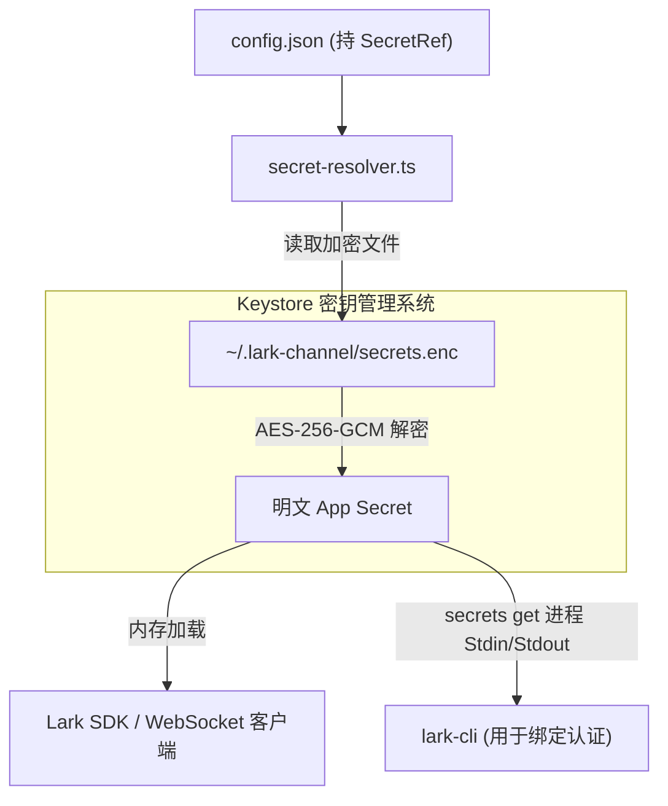

<details>
<summary>相关源file</summary>

生成本页时使用的主要源文件：

- [src/config/keystore.ts](../../../project-repos/feishu-claude-code-bridge/src/config/keystore.ts)
- [src/config/secret-resolver.ts](../../../project-repos/feishu-claude-code-bridge/src/config/secret-resolver.ts)
- [src/config/schema.ts](../../../project-repos/feishu-claude-code-bridge/src/config/schema.ts)
- [src/config/store.ts](../../../project-repos/feishu-claude-code-bridge/src/config/store.ts)
- [src/cli/commands/secrets.ts](../../../project-repos/feishu-claude-code-bridge/src/cli/commands/secrets.ts)

</details>

# 安全防线与配置系统

在将本地开发机上的 Claude 桥接到公网飞书平台时，系统的安全性与配置的保密性是重中之重。系统为此构建了**多级访问控制**、**凭据加密 Keystore 数据库**、**Schema 验证体系**以及**热重载配置更新**四道核心防线。

## 多级访问控制鉴权

默认情况下，Bot 是完全开放的，这对于个人在封闭域内使用已经足够。但在群聊等公开协作环境中，为了防止接口被无关人员恶意刷量，系统在 `schema.ts` 和消息接收层中设计了多级白名单鉴权机制：

- **用户白名单 (`allowedUsers`)**：配置后，只有名单内飞书用户的 `open_id` 发送的消息才会被受理。
  > [!IMPORTANT]
  > 对于白名单外用户的消息，Bot 会采取**静默丢弃**策略而绝不会回复“你没有权限”等提示信息。这种“隐身”机制能够最大程度保护 Bot 的存在不被泄露，从而规避潜在的安全探测。
- **群组白名单 (`allowedChats`)**：用于控制 Bot 在群聊场景下的活动边界。私聊会话默认不受此选项限制，以保证管理员随时可以通过私聊对 Bot 发送配置修改命令。
- **管理员名单 (`admins`)**：对于诸如 `/config` (修改设置)、`/exit` (停用进程)、`/reconnect` (重新连接网络) 等敏感的维护类指令，系统会严格匹配发送者的 `open_id`。非管理员发送这些命令将直接收到 `❌ 此命令仅管理员可用` 警告。

Sources: [src/config/schema.ts:1-120](../../../project-repos/feishu-claude-code-bridge/src/config/schema.ts#L1-L120), [src/bot/channel.ts:370-392](../../../project-repos/feishu-claude-code-bridge/src/bot/channel.ts#L370-L392)

<details class="source-snippets">
<summary>引用源码</summary>

<!-- source-snippets:start -->

#### `src/config/schema.ts:1-120`

```typescript
export type TenantBrand = 'feishu' | 'lark';

/**
 * SecretRef points at a secret stored outside this file — keeps secrets out
 * of `config.json` so backups / accidental git commits / log dumps don't
 * leak the bot's App Secret. Mirrors openclaw / lark-cli's `SecretRef`
 * shape so lark-cli's `--source lark-channel` reads it through the same
 * generic `ResolveSecretInput` pipeline as openclaw.
 *
 *   - `env`:  value is in process env at `id` (optionally allowlisted via provider)
 *   - `file`: value is at the path `id` (or `provider.path` if provider config)
 *   - `exec`: spawn `provider.command`, send JSON over stdin, read JSON from stdout
 */
export interface SecretRef {
  source: 'env' | 'file' | 'exec';
  provider?: string;
  id: string;
}

/** A secret field can be either a plain string (potentially a `${VAR}`
 * template) or a SecretRef. JSON deserializer accepts both forms. */
export type SecretInput = string | SecretRef;

export interface AppCredentials {
  id: string;
  secret: SecretInput;
  tenant: TenantBrand;
}

/**
 * `secrets.providers` is openclaw-compatible: each named provider declares
 * how SecretRefs resolve to plaintext (env allowlist, file path, exec
 * command). Only the fields actually consumed by bridge's resolver are
 * typed here; lark-cli reads the same JSON via its richer Go types.
 */
export interface ProviderConfig {
  source: 'env' | 'file' | 'exec';
  /** env: allowlist of env var names that ref.id is allowed to be in. */
  allowlist?: string[];
  /** file: optional base path; ref.id is joined onto it. */
  path?: string;
  /** exec: command to spawn + args. */
  command?: string;
  args?: string[];
  /** exec: explicit env to inject (key=value pairs). */
  env?: Record<string, string>;
  /** exec: env var names to pass through from parent env. */
  passEnv?: string[];
  /** exec: max ms to wait for the child. */
  noOutputTimeoutMs?: number;
  /** exec: max stdout bytes accepted before treating as runaway. */
  maxOutputBytes?: number;
}

export interface SecretsConfig {
  providers?: Record<string, ProviderConfig>;
  defaults?: { env?: string; file?: string; exec?: string };
}

/**
 * How replies are rendered in IM chats:
 *   - `card`: full interactive card (tool panels, ⏹ button, footer status)
 *   - `markdown`: lightweight streaming markdown card (typewriter, no buttons)
 *   - `text`: plain markdown post sent once at run completion (no streaming)
 *
 * Pre-0.1.27 only had `card` and `text`, where `text` meant what's now called
 * `markdown`. See `messageReplyMigrated` for the auto-coercion logic.
 */
export type MessageReplyMode = 'card' | 'markdown' | 'text';

/**
 * Access control settings. All three lists default to "no restriction" when
 * empty / undefined, so existing deployments are not broken on upgrade.
 * Operators that want a hardened deployment fill these in via
 * `~/.lark-channel/config.json` (no CLI surface yet — by design, since
 * persisting the lists requires the operator to look up open_ids/chat_ids
 * out-of-band anyway).
 */
export interface AppAccess {
  /** open_id whitelist for who can interact with the bot (DM + group @bot).
   * Empty/undefined = allow everyone. */
  allowedUsers?: string[];
  /** chat_id whitelist for chats the bot responds in. Empty/undefined =
   * respond in all chats it's invited to. */
  allowedChats?: string[];
  /** open_id list with admin privileges. Gates sensitive commands
   * (/account, /config, /exit, /reconnect, /doctor, /cd, /ws). Empty /
   * undefined = no admin restriction (every allowed user is an admin). */
  admins?: string[];
}

export interface AppPreferences {
  /** Reply rendering mode for IM (group/p2p) messages. Default 'card'. */
  messageReply?: MessageReplyMode;
  /**
   * Internal marker: pre-0.1.27 the value `'text'` meant "lightweight
   * streaming markdown card" (what's now called `'markdown'`). On upgrade
   * we'd silently switch those users to true plain-text behavior unless we
   * coerce; this flag is set the first time the user submits `/config`
   * after the rename, indicating their `messageReply` value is in the
   * new semantic.
   */
  messageReplyMigrated?: boolean;
  /**
   * Whether to render tool-call blocks (Bash / Read / Edit / ...) in the
   * output. Default true. Turn off if you only care about Claude's final
   * text answer and want to hide the "工具调用过程".
   */
  showToolCalls?: boolean;
  /**
   * Cap on concurrent claude runs across all chats / topics. Excess runs
   * queue FIFO. Default 10. Mostly relevant for topic groups where each
   * topic can spawn its own run; capping protects RAM / token spend.
   */
  maxConcurrentRuns?: number;
  /**
   * Global default idle-timeout for claude runs, in minutes. When set,
   * if claude emits no stream event for this long the bridge kills the
   * run as presumed-hung. Undefined / 0 = no timeout (the default — runs
   * can hang indefinitely). Per-scope `/timeout` overrides this.
```

#### `src/bot/channel.ts:370-392`

```typescript

  // Access control. Silent drop — replying would reveal the bot to
  // unauthorized users and let them spam the chat with denial messages.
  // Operator-defined lists; both empty = allow all (back-compat).
  if (!isUserAllowed(controls.cfg, msg.senderId)) {
    log.info('intake', 'skip-not-allowed-user', {
      scope,
      sender: msg.senderId.slice(-6),
    });
    return;
  }
  // `allowedChats` is intentionally a group-only gate. p2p chat_ids are
  // generated per-user-pair and can't be hijacked by an unauthorized
  // sender, so the user allowlist above is already authoritative for DMs.
  // Restricting p2p by chat_id would also create a chicken-and-egg lockout
  // hazard (the operator must know the chat_id before they ever DM the bot).
  if (msg.chatType !== 'p2p' && !isChatAllowed(controls.cfg, msg.chatId)) {
    log.info('intake', 'skip-not-allowed-chat', {
      scope,
      chatId: msg.chatId.slice(-6),
    });
    return;
  }
```

<!-- source-snippets:end -->
</details>

## 凭据加密 Keystore 数据库与解密

飞书 PersonalAgent 应用具有核心的 `App Secret` 敏感凭据。如果将其以明文硬编码在配置文件中，会有极大的泄露风险。

为此，Bridge 宿主设计了基于 AES-256-GCM 算法的加密密钥数据库：
- **`secrets.enc` 文件**：将敏感凭据加密落盘于 `~/.lark-channel/secrets.enc`。
- **Exec-Provider 双向读取**：当通过扫码或向导绑定飞书客户端 `lark-cli` 时，`lark-cli` 本身也需要读取 App Secret。项目通过实现 `lark-channel-bridge secrets get` 进程命令接口，充当 exec 凭据源，将解密后的凭据直接在内存中同步提供给 `lark-cli` 进程的 Stdin/Stdout，全程保证物理磁盘上不留任何明文的 App Secret 备份。
- **Secret 自动迁移**：如果加载的 config.json 中含有历史版本遗留的明文凭据，`runStart` 启动时会自动将其加密迁移到 `secrets.enc`，并自动把 config 升级改写为 `SecretRef`。



Sources: [src/config/keystore.ts:1-120](../../../project-repos/feishu-claude-code-bridge/src/config/keystore.ts#L1-L120), [src/config/secret-resolver.ts:1-90](../../../project-repos/feishu-claude-code-bridge/src/config/secret-resolver.ts#L1-L90)

<details class="source-snippets">
<summary>引用源码</summary>

<!-- source-snippets:start -->

#### `src/config/keystore.ts:1-120`

```typescript
import { createCipheriv, createDecipheriv, pbkdf2Sync, randomBytes } from 'node:crypto';
import { chmod, mkdir, readFile, rename, writeFile } from 'node:fs/promises';
import { hostname, userInfo } from 'node:os';
import { dirname } from 'node:path';
import { paths } from './paths';

/**
 * Local AES-256-GCM keystore for App Secrets and similar.
 *
 * Layout on disk:
 *   ~/.lark-channel/secrets.enc      — JSON map { id → encrypted envelope }
 *   ~/.lark-channel/.keystore.salt   — 32 random bytes, generated once
 *
 * Both files are chmod 0600. The encryption key is derived (PBKDF2-SHA256,
 * 100k iters) from `hostname + userInfo().username + salt`. This is
 * **defense-in-depth against accidental disclosure** (backups, git commits,
 * log dumps) — *not* against a same-user process actively decrypting. That
 * threat needs a real OS keychain, which is out of scope for this bridge
 * given lark-cli already terminates secrets in its own keychain on bind.
 */

const KEY_LEN = 32;
const IV_LEN = 12; // GCM standard
const TAG_LEN = 16; // GCM auth tag
const PBKDF2_ITER = 100_000;
const FILE_VERSION = 1;

interface Envelope {
  /** base64 of 12-byte IV */
  iv: string;
  /** base64 of ciphertext */
  data: string;
  /** base64 of 16-byte GCM auth tag */
  tag: string;
}

interface StoreFile {
  version: number;
  entries: Record<string, Envelope>;
}

const EMPTY: StoreFile = { version: FILE_VERSION, entries: {} };

/** Read + return the full keystore. Missing file or unreadable → empty store. */
async function readStore(): Promise<StoreFile> {
  try {
    const text = await readFile(paths.secretsFile, 'utf8');
    const parsed = JSON.parse(text) as Partial<StoreFile>;
    if (parsed?.version !== FILE_VERSION || !parsed.entries) return { ...EMPTY };
    return { version: parsed.version, entries: { ...parsed.entries } };
  } catch (err) {
    if ((err as NodeJS.ErrnoException).code === 'ENOENT') return { ...EMPTY };
    throw err;
  }
}

async function writeStore(store: StoreFile): Promise<void> {
  await mkdir(dirname(paths.secretsFile), { recursive: true });
  const tmp = `${paths.secretsFile}.tmp-${process.pid}`;
  await writeFile(tmp, `${JSON.stringify(store, null, 2)}\n`, 'utf8');
  await chmod(tmp, 0o600);
  await rename(tmp, paths.secretsFile);
}

/**
 * Load the salt, or generate one if absent. The salt is **not a secret** —
 * an attacker that can read this file can also read the keystore. Its job
 * is to ensure two users on the same machine don't derive the same key.
 */
async function loadOrCreateSalt(): Promise<Buffer> {
  try {
    const buf = await readFile(paths.keystoreSaltFile);
    if (buf.length === KEY_LEN) return buf;
  } catch (err) {
    if ((err as NodeJS.ErrnoException).code !== 'ENOENT') throw err;
  }
  const salt = randomBytes(KEY_LEN);
  await mkdir(dirname(paths.keystoreSaltFile), { recursive: true });
  const tmp = `${paths.keystoreSaltFile}.tmp-${process.pid}`;
  await writeFile(tmp, salt);
  await chmod(tmp, 0o600);
  await rename(tmp, paths.keystoreSaltFile);
  return salt;
}

async function deriveKey(): Promise<Buffer> {
  const salt = await loadOrCreateSalt();
  const seed = `${hostname()}|${userInfo().username}`;
  return pbkdf2Sync(seed, salt, PBKDF2_ITER, KEY_LEN, 'sha256');
}

function encrypt(key: Buffer, plaintext: string): Envelope {
  const iv = randomBytes(IV_LEN);
  const cipher = createCipheriv('aes-256-gcm', key, iv);
  const enc = Buffer.concat([cipher.update(plaintext, 'utf8'), cipher.final()]);
  const tag = cipher.getAuthTag();
  return {
    iv: iv.toString('base64'),
    data: enc.toString('base64'),
    tag: tag.toString('base64'),
  };
}

function decrypt(key: Buffer, env: Envelope): string {
  const iv = Buffer.from(env.iv, 'base64');
  const data = Buffer.from(env.data, 'base64');
  const tag = Buffer.from(env.tag, 'base64');
  if (iv.length !== IV_LEN) throw new Error('invalid IV length');
  if (tag.length !== TAG_LEN) throw new Error('invalid auth tag length');
  const decipher = createDecipheriv('aes-256-gcm', key, iv);
  decipher.setAuthTag(tag);
  const dec = Buffer.concat([decipher.update(data), decipher.final()]);
  return dec.toString('utf8');
}

/** Look up an entry by id (e.g. "app-cli_xxx"). Returns plaintext or
 * `undefined` when not present. Errors (decryption failure, invalid file)
 * propagate. */
export async function getSecret(id: string): Promise<string | undefined> {
  const store = await readStore();
```

#### `src/config/secret-resolver.ts:1-90`

```typescript
import { spawn } from 'node:child_process';
import { readFile } from 'node:fs/promises';
import { join } from 'node:path';
import { getSecret } from './keystore';
import { paths } from './paths';
import type { AppConfig, ProviderConfig, SecretInput, SecretRef } from './schema';
import { isSecretRef, secretKeyForApp } from './schema';

/**
 * Bridge runtime secret resolver. Mirrors the openclaw / lark-cli
 * `ResolveSecretInput` contract so users can keep their App Secret out of
 * `config.json` via:
 *
 *   - plain string                              → as-is
 *   - "${VAR_NAME}" template                    → process.env[VAR_NAME]
 *   - { source: "env", id: "VAR", ... }         → process.env[VAR] (+ allowlist)
 *   - { source: "file", id: "/path", ... }      → contents of file
 *   - { source: "exec", id, provider, ... }     → spawn provider command, JSON RPC
 *
 * The exec branch short-circuits when the provider command points at this
 * same bridge binary — we then read the AES keystore directly instead of
 * spawning ourselves (avoids fork bombs on misconfig, and keeps `bridge
 * start` working without `lark-channel-bridge` on $PATH).
 */

const ENV_TEMPLATE_RE = /^\$\{([A-Z][A-Z0-9_]{0,127})\}$/;

const DEFAULT_PROVIDER = 'default';

const DEFAULT_EXEC_TIMEOUT_MS = 5_000;
const DEFAULT_EXEC_MAX_OUTPUT = 64 * 1024;

export async function resolveAppSecret(cfg: AppConfig): Promise<string> {
  const appId = cfg.accounts.app.id;
  const secret = cfg.accounts.app.secret;
  return resolveSecretInput(secret, cfg.secrets, appId);
}

async function resolveSecretInput(
  input: SecretInput,
  secretsCfg: AppConfig['secrets'],
  appId: string,
): Promise<string> {
  if (!input) {
    throw new Error('app secret is missing');
  }
  if (typeof input === 'string') {
    return resolvePlainOrTemplate(input);
  }
  if (!isSecretRef(input)) {
    throw new Error(`unsupported secret form: ${JSON.stringify(input)}`);
  }
  switch (input.source) {
    case 'env':
      return resolveEnvRef(input, lookupProvider(secretsCfg, input));
    case 'file':
      return resolveFileRef(input, lookupProvider(secretsCfg, input));
    case 'exec':
      return resolveExecRef(input, lookupProvider(secretsCfg, input), appId);
    default:
      throw new Error(`unknown secret source: ${(input as { source?: string }).source}`);
  }
}

function resolvePlainOrTemplate(value: string): string {
  if (!value) throw new Error('app secret is empty');
  const m = ENV_TEMPLATE_RE.exec(value);
  if (m) {
    const name = m[1] as string;
    const v = process.env[name];
    if (!v) throw new Error(`env var ${name} referenced by secret is not set`);
    return v;
  }
  return value;
}

function lookupProvider(
  secretsCfg: AppConfig['secrets'],
  ref: SecretRef,
): ProviderConfig | undefined {
  if (!secretsCfg?.providers) return undefined;
  const name = ref.provider ?? secretsCfg.defaults?.[ref.source] ?? DEFAULT_PROVIDER;
  return secretsCfg.providers[name];
}

function resolveEnvRef(ref: SecretRef, pc: ProviderConfig | undefined): string {
  if (pc?.allowlist && pc.allowlist.length > 0 && !pc.allowlist.includes(ref.id)) {
    throw new Error(`env var ${ref.id} is not allowlisted in provider`);
  }
  const v = process.env[ref.id];
```

<!-- source-snippets:end -->
</details>

## Zod 级别配置 Schema 校验

系统的配置通过 Zod 对所有关键字段进行了强类型 Schema 约束，其中包括对一些高级参数的限制：
- **`maxConcurrentRuns`**：限制全局同时运行的 Claude 实例最大数，防止爆内存。
- **`messageReplyMode`**：回复模式（`card` 流式卡片、`markdown` 流式富文本、`text` 纯文本）。
- **`showToolCalls`**：是否展示 Claude 调用的具体工具细节，不显示工具能有效保持飞书卡片的整洁和可读性。

Sources: [src/config/schema.ts:121-220](../../../project-repos/feishu-claude-code-bridge/src/config/schema.ts#L121-L220)

<details class="source-snippets">
<summary>引用源码</summary>

<!-- source-snippets:start -->

#### `src/config/schema.ts:121-220`

```typescript
   */
  runIdleTimeoutMinutes?: number;
  /**
   * Whether the bot only responds to messages that @-mention it in groups
   * (regular and topic groups). p2p is always unrestricted. Default true:
   * groups are quiet unless the user @bot. Set false to let any group
   * message reach Claude (the 0.1.21-and-earlier behavior).
   *
   * @全员 is never responded to regardless (SDK `respondToMentionAll: false`).
   * Cloud-doc comments still require @-mention unconditionally.
   */
  requireMentionInGroup?: boolean;
  /** Access control — user/chat allowlists + admin gating. See AppAccess. */
  access?: AppAccess;
  /**
   * Grace period (ms) between SIGTERM and SIGKILL when killing the claude
   * subprocess. Bumped from a hardcoded 500ms because claude often has its
   * own subprocesses (e.g. lark-cli mid-OAuth) that need a moment to clean
   * up — too short a window and the SIGKILL cascade kills the descendants
   * before they can finish what the user is waiting on. Default 5000ms.
   * Range 100-30000; out-of-range values fall back to default.
   */
  agentStopGraceMs?: number;
}

/**
 * Top-level config shape on disk.
 *
 * `accounts` is a namespace for credential-flavored fields (currently just
 * the bot app, room for OAuth / alternate apps later). `preferences`
 * holds user-tunable behavior knobs. Other future sections (mcp, etc.)
 * belong at this top level alongside them.
 */
export interface AppConfig {
  accounts: {
    app: AppCredentials;
  };
  secrets?: SecretsConfig;
  preferences?: AppPreferences;
}

export function isComplete(cfg: Partial<AppConfig>): cfg is AppConfig {
  const app = cfg.accounts?.app;
  return Boolean(app?.id && hasSecret(app?.secret) && app?.tenant);
}

function hasSecret(s: SecretInput | undefined): boolean {
  if (!s) return false;
  if (typeof s === 'string') return s.length > 0;
  return Boolean(s.source && s.id);
}

/** True iff this credential's secret is stored externally (env/file/exec). */
export function isSecretRef(s: SecretInput): s is SecretRef {
  return typeof s === 'object' && s !== null;
}

/** Account/keystore key for the bot's App Secret. lark-cli also uses a
 * similar `appsecret:` convention so audit/grep is consistent. */
export function secretKeyForApp(appId: string): string {
  return `app-${appId}`;
}

/**
 * Resolve the message-reply preference with default fallback + legacy coerce.
 *
 * Pre-0.1.27 users with `messageReply: 'text'` actually wanted the streaming
 * markdown card (the new `'markdown'`). Until they re-submit `/config`
 * (which sets `messageReplyMigrated: true`), we map their `text` →
 * `markdown` so the behavior stays the same after upgrade.
 *
 * Default for fresh configs (no `messageReply` set) is `'markdown'`.
 */
export function getMessageReplyMode(cfg: AppConfig): MessageReplyMode {
  const raw = cfg.preferences?.messageReply;
  if (raw === 'text' && cfg.preferences?.messageReplyMigrated !== true) {
    return 'markdown';
  }
  if (raw === 'card' || raw === 'markdown' || raw === 'text') return raw;
  return 'markdown';
}

/** Resolve the show-tool-calls preference with default fallback. */
export function getShowToolCalls(cfg: AppConfig): boolean {
  return cfg.preferences?.showToolCalls !== false;
}

/** Resolve the max-concurrent-runs preference with default + sanity clamp. */
export function getMaxConcurrentRuns(cfg: AppConfig): number {
  const raw = cfg.preferences?.maxConcurrentRuns;
  if (typeof raw !== 'number' || !Number.isFinite(raw) || raw < 1) return 10;
  // Reasonable upper bound — at 50+ concurrent claudes the bot box is
  // probably already RAM-starved. Clamp to keep typos from killing the box.
  return Math.min(Math.floor(raw), 50);
}

/**
 * Resolve the require-mention-in-group preference. Default `true` — the
 * `!== false` check makes "undefined" (older configs that don't have the
 * field) inherit the new safer default automatically.
```

<!-- source-snippets:end -->
</details>

## 配置文件热重载

当管理员通过飞书 `/config` 修改了偏好或在磁盘上手动修改了配置文件后，系统**不需要停机重启**。
- 宿主在命令通道拦截到配置更改时，会自动调用 `store.ts` 加载新配置。
- 随后会调用 `controls.restart()`，重新以新的配置实例化飞书网络客户端并接入网关，老链接随后优雅断开，完成了在几毫秒之内的平滑热重载。

Sources: [src/config/store.ts:1-100](../../../project-repos/feishu-claude-code-bridge/src/config/store.ts#L1-L100)

<details class="source-snippets">
<summary>引用源码</summary>

<!-- source-snippets:start -->

#### `src/config/store.ts:1-100`

```typescript
import { chmod, mkdir, readFile, rename, writeFile } from 'node:fs/promises';
import { dirname } from 'node:path';
import { paths } from './paths';
import type { AppConfig, AppPreferences, TenantBrand } from './schema';
import { secretKeyForApp } from './schema';

export async function loadConfig(path: string = paths.configFile): Promise<Partial<AppConfig>> {
  try {
    const text = await readFile(path, 'utf8');
    return JSON.parse(text) as Partial<AppConfig>;
  } catch (err) {
    if ((err as NodeJS.ErrnoException).code === 'ENOENT') return {};
    throw err;
  }
}

/**
 * Atomic write: write to a sibling temp file with 0600 perms, then rename
 * (atomic on POSIX) into place. Avoids the partial-write window where a
 * crash could leave the config truncated, and keeps secret-bearing bytes
 * from ever existing at the final path with looser perms.
 */
/**
 * Build an AppConfig that points the app's secret at the encrypted local
 * keystore via an exec-provider SecretRef. Used by /account change and the
 * first-run migration path. Preserves the existing `preferences` block so
 * users don't lose unrelated settings on credential update.
 *
 * The provider command is a thin shell wrapper bridge writes under
 * `~/.lark-channel/secrets-getter` (always user-owned, never a symlink) so
 * lark-cli's AssertSecurePath audit accepts it regardless of how node was
 * installed (Homebrew / Volta / system pkg may put node behind a symlink
 * or root-own it). The wrapper internally `exec`s the real node + bridge
 * with `secrets get`. Bridge itself short-circuits the spawn and reads the
 * keystore directly when it sees its own wrapper path in `command`.
 */
export async function buildEncryptedAccountConfig(
  appId: string,
  tenant: TenantBrand,
  preferences?: AppPreferences,
): Promise<AppConfig> {
  const wrapperPath = await ensureSecretsGetterWrapper();
  return {
    accounts: {
      app: {
        id: appId,
        secret: {
          source: 'exec',
          provider: 'bridge',
          id: secretKeyForApp(appId),
        },
        tenant,
      },
    },
    secrets: {
      providers: {
        bridge: {
          source: 'exec',
          command: wrapperPath,
          // The wrapper has args baked in; pass none here.
          args: [],
        },
      },
    },
    ...(preferences ? { preferences } : {}),
  };
}

/**
 * Write (or rewrite) the secrets-getter wrapper to point at the currently-
 * running node + bridge entry script. Always rewrites — node path can move
 * between bridge runs (nvm version switch, re-install) and the wrapper
 * must stay in sync. Returns the wrapper path.
 *
 * File perms 0700 so audit's `world/group-writable` check passes (and
 * extra restrictive — wrapper is a private user resource).
 */
export async function ensureSecretsGetterWrapper(): Promise<string> {
  const wrapperPath = paths.secretsGetterScript;
  const node = process.execPath;
  const bridgeEntry = process.argv[1] ?? '';
  // Single-quoted shell-safe strings: escape any embedded single quotes.
  const sq = (s: string): string => `'${s.replace(/'/g, `'\\''`)}'`;
  const content =
    `#!/bin/sh\n` +
    `# Auto-generated by lark-channel-bridge. Do not edit.\n` +
    `# Forwards exec-provider requests to: node bridge secrets get\n` +
    `exec ${sq(node)} ${sq(bridgeEntry)} secrets get "$@"\n`;

  await mkdir(dirname(wrapperPath), { recursive: true });
  const tmp = `${wrapperPath}.tmp-${process.pid}`;
  await writeFile(tmp, content, 'utf8');
  await chmod(tmp, 0o700);
  await rename(tmp, wrapperPath);
  return wrapperPath;
}

export async function saveConfig(cfg: AppConfig, path: string = paths.configFile): Promise<void> {
  await mkdir(dirname(path), { recursive: true });
  const tmp = `${path}.tmp-${process.pid}`;
```

<!-- source-snippets:end -->
</details>

## 相关页面

- [会话与指令系统](commands-sessions.md) — 了解 `/config` 和 `/reconnect` 指令细节
- [系统架构与进程模型](system-architecture.md) — 探究重连策略对网络断开的防范
- [媒体流与辅助工具](media-utils.md) — 了解绑定向导的凭据流转
