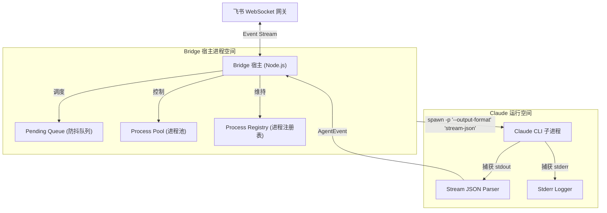
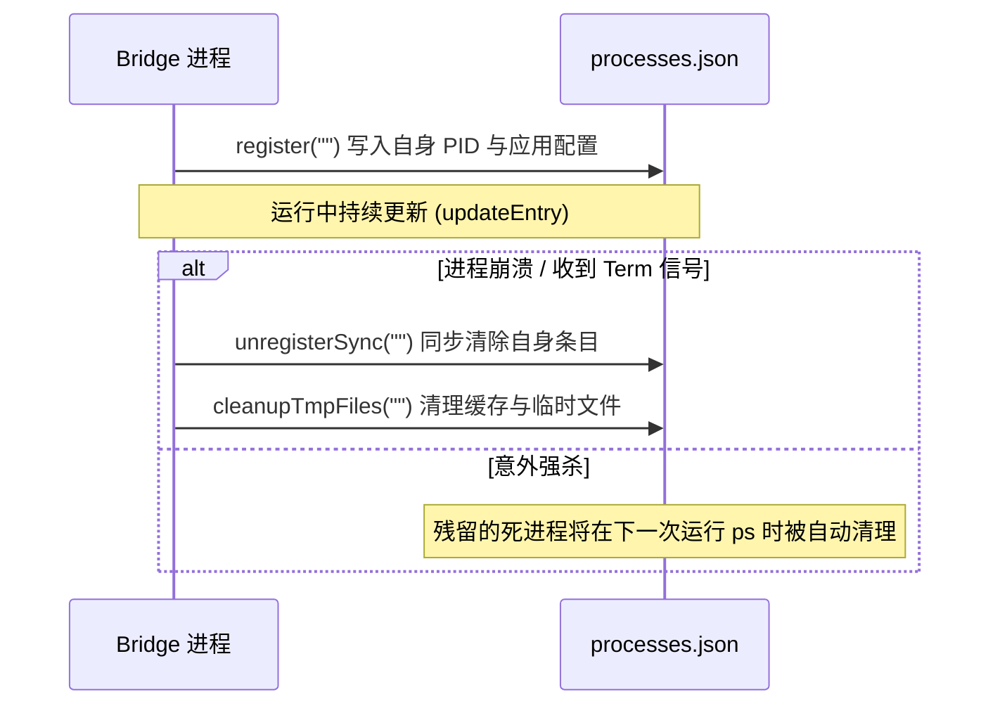

<details>
<summary>相关源文件</summary>

生成本页时使用的主要源文件：

- [src/cli/commands/start.ts](../../../project-repos/feishu-claude-code-bridge/src/cli/commands/start.ts)
- [src/runtime/registry.ts](../../../project-repos/feishu-claude-code-bridge/src/runtime/registry.ts)

</details>

# 系统架构与进程模型

`feishu-claude-code-bridge` 在架构上采用典型的**双进程协作模式**。整个系统分为两个主要的物理进程：**Bridge 宿主进程 (Node.js)** 和 **Claude CLI 代理进程 (Claude Code)**。宿主进程主要承载飞书 WebSocket 连接和卡片渲染；而具体的任务执行（例如终端命令运行、文件读写、静态分析）则通过动态 Spawn 出的 Claude 子进程独立承载。

## 双进程协同模型

在系统运行期间，宿主进程与代理进程的角色分工非常明确：

- **Bridge 宿主进程**：
  负责与飞书开放平台网关（WebSocket）建立并保持长连接；执行消息过滤、队列排队和防抖；解析用户的交互操作并渲染卡片状态；充当代理进程的“网络代言人”。
- **Claude 代理进程**：
  由宿主进程调用 `child_process.spawn` 启动。它持有用户的会话标识（`--resume <sessionId>`），并在隔离的 Cwd（当前工作空间）下运行。它直接与本地环境（终端、文件系统）交互，其输出通过 Stdio 管道被宿主进程捕获并解析。



## 进程生命周期与异常控制

在宿主进程启动时，会进行以下初始化流程：
1. **网络降级策略**：调用 `dns.setDefaultResultOrder('ipv4first')`。
   > [!IMPORTANT]
   > 在 Node.js $\ge$ 20 中，DNS 解析默认遵循 "verbatim" 模式（即返回什么就用什么）。在一些 IPv6 路由残缺的网络环境（例如某些 VPN、酒店 WiFi 或 WSL2 内部）中，这极易导致连接卡死。显式设置为 IPv4 优先，避开了这一整类网络假死陷阱。
2. **全局 Rejection 兜底**：绑定 `unhandledRejection` 和 `uncaughtException` 监听器，确保任何异步的三方 SDK 调用失败或 Axios 请求超时不会导致 Bot 进程退出。
3. **自身注册**：在宿主进程的注册中心（`~/.lark-channel/processes.json`）中写入当前进程的 `pid`、`appId` 等信息，用来支撑终端命令行 `ps` 和 `kill` 运作。

### 优雅退出与重启防护

当系统接收到 `SIGINT`、`SIGTERM` 或飞书端的 `/exit` 命令时，系统将启动优雅关闭流程：
- 宿主进程向 Claude 代理进程发送 `SIGTERM` 信号。
- 启动一个优雅关闭等待定时器（通常为 5 秒，`stopGraceMs`）。
- 如果 Claude 代理进程在定时器结束前未能顺利退出（例如其派生的后台 bash 正在阻塞），宿主进程会果断发起 `SIGKILL` 级联清理，最后清除本地注册表文件中的僵尸进程条目并安全退出。

### Connect-before-Disconnect 重启策略

当用户在飞书端更改配置（如更改 `/config`）或网络出现故障触发 `/reconnect` 重连时，宿主进程采用**先建连、后断开 (Connect-before-disconnect)** 的设计：
- 系统首先尝试为新的配置或凭据创建并初始化一个新的 `BridgeChannel` 实例。
- 只有在新实例通过长连接握手并成功连接飞书后，系统才会关闭并 disconnect 老的 `BridgeChannel`。
- **设计考量**：如果在网络状况极差（例如拔掉网线）时进行重启，且采用“先断开后建连”逻辑，一旦新链接创建失败，老链接的保活定时器又已被摧毁，Bot 进程就会永久处于失联状态，直至人工手动重启。而 Connect-before-disconnect 能确保就算重连失败，老链接的保活机制依然存在并会在 15 秒后触发下一次自动重试。

Sources: [src/cli/commands/start.ts:32-216](../../../project-repos/feishu-claude-code-bridge/src/cli/commands/start.ts#L32-L216)

<details class="source-snippets">
<summary>引用源码</summary>

<!-- source-snippets:start -->

#### `src/cli/commands/start.ts:32-216`

```typescript
// Prefer IPv4 — Node 20+ defaults to "verbatim" which respects whatever
// the resolver returns first; in IPv6-broken networks (WSL2, certain VPNs,
// some hotel WiFi) this lands on a dead v6 route and stalls. Explicitly
// prefer v4 avoids that whole class of issue.
dns.setDefaultResultOrder('ipv4first');

// Process-level safety net: never let a stray SDK call / axios timeout
// take the whole bot down. Most outbound calls (channel.send / rawClient.*)
// are async; if any callsite misses a try/catch (or fires an update after
// its enclosing scope returned), the rejection bubbles to here. Log and
// keep the bot alive — losing a single reply is better than crashing.
process.on('unhandledRejection', (reason) => {
  log.fail('process', reason, { kind: 'unhandledRejection' });
});
process.on('uncaughtException', (err) => {
  log.fail('process', err, { kind: 'uncaughtException' });
});

const MEDIA_GC_MAX_AGE_MS = 24 * 60 * 60 * 1000;

export interface StartOptions {
  config?: string;
  skipCheckLarkCli?: boolean;
}

export async function runStart(opts: StartOptions): Promise<void> {
  const configPath = opts.config ?? paths.configFile;
  const existing = await loadConfig(configPath);

  let cfg: AppConfig;
  if (isComplete(existing)) {
    cfg = existing;
    // Migrate legacy plaintext configs: any time we see a raw string in
    // accounts.app.secret that isn't a "${VAR}" template, move it into
    // the encrypted keystore and rewrite config.json with an exec ref.
    // Idempotent — already-encrypted configs (SecretRef) pass through.
    cfg = await maybeMigratePlaintextSecret(cfg, configPath);
  } else {
    const fresh = await runRegistrationWizard();
    // Fresh credentials from the wizard arrive as a plaintext secret;
    // immediately encrypt before persisting so disk never holds the raw value.
    cfg = await persistEncrypted(fresh, configPath);
    console.log(`配置已保存到 ${configPath}\n`);
  }

  await preFlightChecks({ skipCheckLarkCli: opts.skipCheckLarkCli });

  const agent = new ClaudeAdapter();
  if (!(await agent.isAvailable())) {
    console.error('✗ 未找到 claude CLI。请先安装 Claude Code：');
    console.error('  https://docs.anthropic.com/en/docs/claude-code/quickstart');
    process.exit(1);
  }

  const sessions = new SessionStore();
  await sessions.load();
  const workspaces = new WorkspaceStore();
  await workspaces.load();

  await gcMediaCache(MEDIA_GC_MAX_AGE_MS);
  await gcOldLogs();

  // Same-app conflict detection. Open-platform routes events to one of the
  // long-connections at random, so two `start` of the same app makes "who
  // answered me" unpredictable. Warn + interactive triage before connecting.
  const conflicts = sameAppOthers(cfg.accounts.app.id);
  if (conflicts.length > 0) {
    const proceed = await resolveConflict(cfg, conflicts);
    if (!proceed) {
      console.log('已取消启动。');
      process.exit(0);
    }
  }

  // Register self in the process registry. Cleanup is wired via stop() and
  // 'exit' below — both paths run unregisterSync so stale entries don't
  // poison the next start.
  const entry = await register({
    appId: cfg.accounts.app.id,
    tenant: cfg.accounts.app.tenant,
    configPath,
    version: pkg.version,
  });
  log.info('registry', 'registered', { id: entry.id, pid: process.pid });

  // `bridge` is mutable so /account can swap it on restart. `controls` carries
  // restart() and a snapshot of the current cfg so command handlers can read
  // and replace credentials without plumbing through the whole runStart scope.
  let bridge: BridgeChannel;
  let restarting = false;

  let stopping = false;
  const stop = async (sig: string): Promise<void> => {
    if (stopping) return;
    stopping = true;
    console.log(`\n收到 ${sig}，正在关闭...`);
    try {
      await bridge.disconnect();
    } catch (err) {
      console.error('[disconnect-failed]', err);
    }
    // unregister is best-effort sync — we're about to exit anyway.
    unregisterSync(entry.id);
    process.exit(0);
  };

  const controls: Controls = {
    configPath,
    cfg,
    processId: entry.id,
    async exit() {
      await stop('exit-command');
    },
    async restart() {
      if (restarting) return;
      restarting = true;
      try {
        const next = await loadConfig(configPath);
        if (!isComplete(next)) throw new Error('config incomplete after change');
        console.log(
... snippet truncated ...
```

<!-- source-snippets:end -->
</details>

## 进程注册中心 (Registry)

宿主进程在启动与退出时，都需要与本地注册中心同步状态，其背后的维护逻辑在 `registry.ts` 中。



这种机制保障了系统在本地宿主机器上运行时的“自愈性”，防止残留的 processes.json 脏数据干扰多开检测和进程列表列出。

Sources: [src/runtime/registry.ts:1-120](../../../project-repos/feishu-claude-code-bridge/src/runtime/registry.ts#L1-L120)

<details class="source-snippets">
<summary>引用源码</summary>

<!-- source-snippets:start -->

#### `src/runtime/registry.ts:1-120`

```typescript
import { randomBytes } from 'node:crypto';
import { mkdirSync, readFileSync, renameSync, writeFileSync, unlinkSync } from 'node:fs';
import { mkdir, readFile, rename, writeFile } from 'node:fs/promises';
import { dirname } from 'node:path';
import { paths } from '../config/paths';
import type { TenantBrand } from '../config/schema';

/**
 * Tracks running `lark-channel-bridge start` processes so we can:
 *   - Warn on duplicate `start` of the same app (open-platform routes events
 *     to one of N long-connections randomly, leaving users guessing).
 *   - Let users list (`ps` / `/ps`) and terminate (`stop <id>` / `/exit <id>`)
 *     a specific process.
 *
 * Single-machine only — entries live in a local JSON file and processes are
 * identified by OS PID. PIDs may go stale (kill -9, crash, OS reboot); every
 * read prunes entries whose PID is not alive (`process.kill(pid, 0)` throws
 * ESRCH for dead PIDs). The file is rewritten atomically (temp + rename) to
 * avoid partial reads during concurrent updates.
 */

export interface ProcessEntry {
  /** 4-char random hex, stable for this process's lifetime. */
  id: string;
  pid: number;
  appId: string;
  tenant: TenantBrand;
  configPath: string;
  startedAt: string;
  version: string;
  /** Bot's display name (e.g. "尼莫"). Filled in by startChannel after the
   * WS handshake — undefined until the connection is up, or on processes
   * registered by older versions of the bridge. */
  botName?: string;
}

interface RegistryFile {
  entries: ProcessEntry[];
}

const EMPTY: RegistryFile = { entries: [] };

function readRaw(path: string): RegistryFile {
  try {
    const text = readFileSync(path, 'utf8');
    const parsed = JSON.parse(text) as Partial<RegistryFile>;
    if (!parsed || !Array.isArray(parsed.entries)) return { entries: [] };
    return { entries: parsed.entries.filter(isValidEntry) };
  } catch (err) {
    if ((err as NodeJS.ErrnoException).code === 'ENOENT') return { entries: [] };
    return { entries: [] };
  }
}

function isValidEntry(e: unknown): e is ProcessEntry {
  if (!e || typeof e !== 'object') return false;
  const x = e as Record<string, unknown>;
  return (
    typeof x.id === 'string' &&
    typeof x.pid === 'number' &&
    typeof x.appId === 'string' &&
    (x.tenant === 'feishu' || x.tenant === 'lark') &&
    typeof x.configPath === 'string' &&
    typeof x.startedAt === 'string' &&
    typeof x.version === 'string'
  );
}

export function isAlive(pid: number): boolean {
  try {
    process.kill(pid, 0);
    return true;
  } catch (err) {
    return (err as NodeJS.ErrnoException).code === 'EPERM';
  }
}

/**
 * Read the registry, dropping entries whose PID is no longer alive. The
 * pruned-back state is **not** persisted here — callers that mutate write
 * the full new state via `writeAtomic`. (Read-only callers like /ps don't
 * need to bother persisting the prune.)
 */
export function readAndPrune(path: string = paths.processesFile): ProcessEntry[] {
  const raw = readRaw(path);
  return raw.entries.filter((e) => isAlive(e.pid));
}

async function writeAtomic(entries: ProcessEntry[], path: string): Promise<void> {
  const tmp = `${path}.tmp-${process.pid}`;
  const body = `${JSON.stringify({ entries } satisfies RegistryFile, null, 2)}\n`;
  await mkdir(dirname(path), { recursive: true });
  await writeFile(tmp, body, 'utf8');
  await rename(tmp, path);
}

function writeAtomicSync(entries: ProcessEntry[], path: string): void {
  const tmp = `${path}.tmp-${process.pid}`;
  const body = `${JSON.stringify({ entries } satisfies RegistryFile, null, 2)}\n`;
  mkdirSync(dirname(path), { recursive: true });
  writeFileSync(tmp, body, 'utf8');
  renameSync(tmp, path);
}

/** Generate a short, human-typable id. Collisions are caller's problem;
 * acceptable since dead entries are pruned and same-machine fleets are
 * small. */
export function generateShortId(): string {
  return randomBytes(2).toString('hex');
}

export interface RegisterArgs {
  appId: string;
  tenant: TenantBrand;
  configPath: string;
  version: string;
}

/**
 * Atomically prune + add this process to the registry. Returns the entry
```

<!-- source-snippets:end -->
</details>

## 相关页面

- [项目概览](overview.md) — 了解双进程架构的业务源头
- [Claude CLI 集成与适配器](claude-integration.md) — 了解 Stdio 管道数据和 System Prompt 约定
- [飞书 Bot 消息与连接管理](feishu-bot-core.md) — 探究 WebSocket 消息的具体消费逻辑
