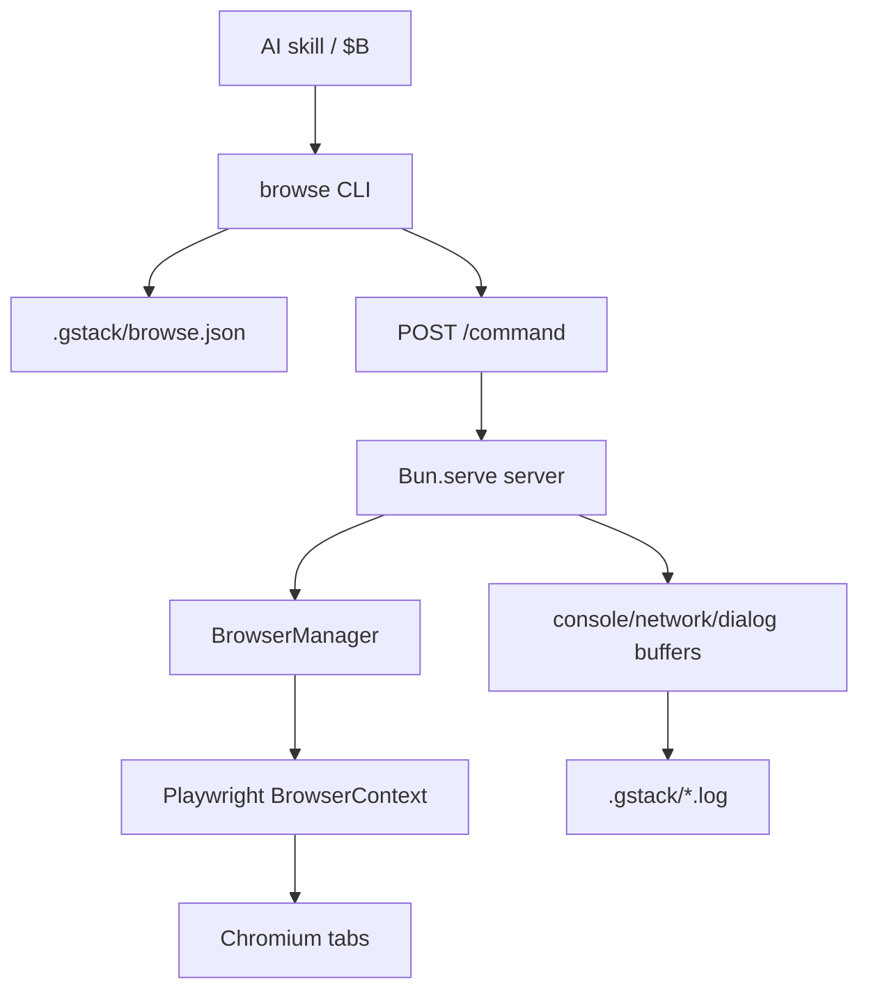
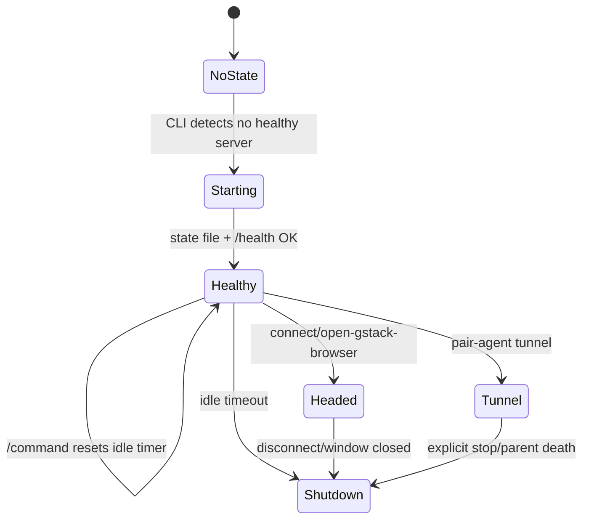

<details>
<summary>相关源文件</summary>

生成本页时使用的主要源文件：

- [ARCHITECTURE.md](../../../project-repos/gstack/ARCHITECTURE.md)
- [browse/src/cli.ts](../../../project-repos/gstack/browse/src/cli.ts)
- [browse/src/server.ts](../../../project-repos/gstack/browse/src/server.ts)
- [browse/src/commands.ts](../../../project-repos/gstack/browse/src/commands.ts)
- [browse/src/browser-manager.ts](../../../project-repos/gstack/browse/src/browser-manager.ts)
- [browse/src/config.ts](../../../project-repos/gstack/browse/src/config.ts)

</details>

# Browse 运行时

Browse 是 gstack 的技术核心。它把每次浏览器动作变成对长期运行 Chromium 守护进程的 localhost HTTP 请求，避免每个工具调用都冷启动浏览器。设计文档给出的目标是首个命令启动约 3 秒，后续命令约 100-200ms。Sources: [ARCHITECTURE.md:5-37](../../../project-repos/gstack/ARCHITECTURE.md#L5-L37), [browse/src/cli.ts:1-10](../../../project-repos/gstack/browse/src/cli.ts#L1-L10)

<details class="source-snippets">
<summary>引用源码</summary>

<!-- source-snippets:start -->

#### `ARCHITECTURE.md:5-37`

````markdown
## The core idea

gstack gives Claude Code a persistent browser and a set of opinionated workflow skills. The browser is the hard part — everything else is Markdown.

The key insight: an AI agent interacting with a browser needs **sub-second latency** and **persistent state**. If every command cold-starts a browser, you're waiting 3-5 seconds per tool call. If the browser dies between commands, you lose cookies, tabs, and login sessions. So gstack runs a long-lived Chromium daemon that the CLI talks to over localhost HTTP.

```
Claude Code                     gstack
─────────                      ──────
                               ┌──────────────────────┐
  Tool call: $B snapshot -i    │  CLI (compiled binary)│
  ─────────────────────────→   │  • reads state file   │
                               │  • POST /command      │
                               │    to localhost:PORT   │
                               └──────────┬───────────┘
                                          │ HTTP
                               ┌──────────▼───────────┐
                               │  Server (Bun.serve)   │
                               │  • dispatches command  │
                               │  • talks to Chromium   │
                               │  • returns plain text  │
                               └──────────┬───────────┘
                                          │ CDP
                               ┌──────────▼───────────┐
                               │  Chromium (headless)   │
                               │  • persistent tabs     │
                               │  • cookies carry over  │
                               │  • 30min idle timeout  │
                               └───────────────────────┘
```

First call starts everything (~3s). Every call after: ~100-200ms.

````

#### `browse/src/cli.ts:1-10`

```typescript
/**
 * gstack CLI — thin wrapper that talks to the persistent server
 *
 * Flow:
 *   1. Read .gstack/browse.json for port + token
 *   2. If missing or stale PID → start server in background
 *   3. Health check + version mismatch detection
 *   4. Send command via HTTP POST
 *   5. Print response to stdout (or stderr for errors)
 */
```

<!-- source-snippets:end -->
</details>
## 运行时拓扑



CLI 读取 state file、判断服务健康、必要时启动 server，再通过 `/command` 发送命令；server 写入的 state file 包含 pid、port、token、startedAt、serverPath、binaryVersion 和 mode。Sources: [browse/src/cli.ts:97-124](../../../project-repos/gstack/browse/src/cli.ts#L97-L124), [browse/src/cli.ts:203-276](../../../project-repos/gstack/browse/src/cli.ts#L203-L276), [browse/src/server.ts:1986-2004](../../../project-repos/gstack/browse/src/server.ts#L1986-L2004)

<details class="source-snippets">
<summary>引用源码</summary>

<!-- source-snippets:start -->

#### `browse/src/cli.ts:97-124`

```typescript
// ─── State File ────────────────────────────────────────────────
function readState(): ServerState | null {
  try {
    const data = fs.readFileSync(config.stateFile, 'utf-8');
    return JSON.parse(data);
  } catch {
    return null;
  }
}

// isProcessAlive is imported from ./error-handling

/**
 * HTTP health check — definitive proof the server is alive and responsive.
 * Used in all polling loops instead of isProcessAlive() (which is slow on Windows).
 */
export async function isServerHealthy(port: number): Promise<boolean> {
  try {
    const resp = await fetch(`http://127.0.0.1:${port}/health`, {
      signal: AbortSignal.timeout(2000),
    });
    if (!resp.ok) return false;
    const health = await resp.json() as any;
    return health.status === 'healthy';
  } catch {
    return false;
  }
}
```

#### `browse/src/cli.ts:203-276`

```typescript
// ─── Server Lifecycle ──────────────────────────────────────────
async function startServer(extraEnv?: Record<string, string>): Promise<ServerState> {
  ensureStateDir(config);

  // Clean up stale state file and error log
  safeUnlink(config.stateFile);
  safeUnlink(path.join(config.stateDir, 'browse-startup-error.log'));

  let proc: any = null;

  // Allow the caller to opt out of the parent-process watchdog by setting
  // BROWSE_PARENT_PID=0 in the environment. Useful for CI, non-interactive
  // shells, and short-lived Bash invocations that need the server to outlive
  // the spawning CLI. Defaults to the current process PID (watchdog active).
  // Parse as int so stray whitespace ("0\n") still opts out — matches the
  // server's own parseInt at server.ts:760.
  const parentPid = parseInt(process.env.BROWSE_PARENT_PID || '', 10) === 0 ? '0' : String(process.pid);

  if (IS_WINDOWS && NODE_SERVER_SCRIPT) {
    // Windows: Bun.spawn() + proc.unref() doesn't truly detach on Windows —
    // when the CLI exits, the server dies with it. Use Node's child_process.spawn
    // with { detached: true } instead, which is the gold standard for Windows
    // process independence. Credit: PR #191 by @fqueiro.
    const extraEnvStr = JSON.stringify({ BROWSE_STATE_FILE: config.stateFile, BROWSE_PARENT_PID: parentPid, ...(extraEnv || {}) });
    const launcherCode =
      `const{spawn}=require('child_process');` +
      `spawn(process.execPath,[${JSON.stringify(NODE_SERVER_SCRIPT)}],` +
      `{detached:true,stdio:['ignore','ignore','ignore'],env:Object.assign({},process.env,` +
      `${extraEnvStr})}).unref()`;
    Bun.spawnSync(['node', '-e', launcherCode], { stdio: ['ignore', 'ignore', 'ignore'] });
  } else {
    // macOS/Linux: Bun.spawn + unref works correctly
    proc = Bun.spawn(['bun', 'run', SERVER_SCRIPT], {
      stdio: ['ignore', 'pipe', 'pipe'],
      env: { ...process.env, BROWSE_STATE_FILE: config.stateFile, BROWSE_PARENT_PID: parentPid, ...extraEnv },
    });
    proc.unref();
  }

  // Wait for server to become healthy.
  // Use HTTP health check (not isProcessAlive) — it's fast (~instant ECONNREFUSED)
  // and works reliably on all platforms including Windows.
  const start = Date.now();
  while (Date.now() - start < MAX_START_WAIT) {
    const state = readState();
    if (state && await isServerHealthy(state.port)) {
      return state;
    }
    await Bun.sleep(100);
  }

  // Server didn't start in time — try to get error details
  if (proc?.stderr) {
    // macOS/Linux: read stderr from the spawned process
    const reader = proc.stderr.getReader();
    const { value } = await reader.read();
    if (value) {
      const errText = new TextDecoder().decode(value);
      throw new Error(`Server failed to start:\n${errText}`);
    }
  } else {
    // Windows: check startup error log (server writes errors to disk since
    // stderr is unavailable due to stdio: 'ignore' for detachment)
    const errorLogPath = path.join(config.stateDir, 'browse-startup-error.log');
    try {
      const errorLog = fs.readFileSync(errorLogPath, 'utf-8').trim();
      if (errorLog) {
        throw new Error(`Server failed to start:\n${errorLog}`);
      }
    } catch (e: any) {
      if (e.code !== 'ENOENT') throw e;
    }
  }
  throw new Error(`Server failed to start within ${MAX_START_WAIT / 1000}s`);
```

#### `browse/src/server.ts:1986-2004`

```typescript
  const server = Bun.serve({
    port,
    hostname: '127.0.0.1',
    fetch: makeFetchHandler('local'),
  });

  // Write state file (atomic: write .tmp then rename)
  const state: Record<string, unknown> = {
    pid: process.pid,
    port,
    token: AUTH_TOKEN,
    startedAt: new Date().toISOString(),
    serverPath: path.resolve(import.meta.dir, 'server.ts'),
    binaryVersion: readVersionHash() || undefined,
    mode: browserManager.getConnectionMode(),
  };
  const tmpFile = config.stateFile + '.tmp';
  fs.writeFileSync(tmpFile, JSON.stringify(state, null, 2), { mode: 0o600 });
  fs.renameSync(tmpFile, config.stateFile);
```

<!-- source-snippets:end -->
</details>
## 状态与配置解析

`browse/src/config.ts` 的解析顺序是：`BROWSE_STATE_FILE` 环境变量、git 根目录、当前工作目录 fallback。所有日志和 state 都落在项目 `.gstack/` 下，`ensureStateDir` 会创建目录并尝试把 `.gstack/` 加到 `.gitignore`。Sources: [browse/src/config.ts:1-11](../../../project-repos/gstack/browse/src/config.ts#L1-L11), [browse/src/config.ts:50-75](../../../project-repos/gstack/browse/src/config.ts#L50-L75), [browse/src/config.ts:78-115](../../../project-repos/gstack/browse/src/config.ts#L78-L115)

<details class="source-snippets">
<summary>引用源码</summary>

<!-- source-snippets:start -->

#### `browse/src/config.ts:1-11`

```typescript
/**
 * Shared config for browse CLI + server.
 *
 * Resolution:
 *   1. BROWSE_STATE_FILE env → derive stateDir from parent
 *   2. git rev-parse --show-toplevel → projectDir/.gstack/
 *   3. process.cwd() fallback (non-git environments)
 *
 * The CLI computes the config and passes BROWSE_STATE_FILE to the
 * spawned server. The server derives all paths from that env var.
 */
```

#### `browse/src/config.ts:50-75`

```typescript
export function resolveConfig(
  env: Record<string, string | undefined> = process.env,
): BrowseConfig {
  let stateFile: string;
  let stateDir: string;
  let projectDir: string;

  if (env.BROWSE_STATE_FILE) {
    stateFile = env.BROWSE_STATE_FILE;
    stateDir = path.dirname(stateFile);
    projectDir = path.dirname(stateDir); // parent of .gstack/
  } else {
    projectDir = getGitRoot() || process.cwd();
    stateDir = path.join(projectDir, '.gstack');
    stateFile = path.join(stateDir, 'browse.json');
  }

  return {
    projectDir,
    stateDir,
    stateFile,
    consoleLog: path.join(stateDir, 'browse-console.log'),
    networkLog: path.join(stateDir, 'browse-network.log'),
    dialogLog: path.join(stateDir, 'browse-dialog.log'),
    auditLog: path.join(stateDir, 'browse-audit.jsonl'),
  };
```

#### `browse/src/config.ts:78-115`

```typescript
/**
 * Create the .gstack/ state directory if it doesn't exist.
 * Throws with a clear message on permission errors.
 */
export function ensureStateDir(config: BrowseConfig): void {
  try {
    fs.mkdirSync(config.stateDir, { recursive: true, mode: 0o700 });
  } catch (err: any) {
    if (err.code === 'EACCES') {
      throw new Error(`Cannot create state directory ${config.stateDir}: permission denied`);
    }
    if (err.code === 'ENOTDIR') {
      throw new Error(`Cannot create state directory ${config.stateDir}: a file exists at that path`);
    }
    throw err;
  }

  // Ensure .gstack/ is in the project's .gitignore
  const gitignorePath = path.join(config.projectDir, '.gitignore');
  try {
    const content = fs.readFileSync(gitignorePath, 'utf-8');
    if (!content.match(/^\.gstack\/?$/m)) {
      const separator = content.endsWith('\n') ? '' : '\n';
      fs.appendFileSync(gitignorePath, `${separator}.gstack/\n`);
    }
  } catch (err: any) {
    if (err.code !== 'ENOENT') {
      // Write warning to server log (visible even in daemon mode)
      const logPath = path.join(config.stateDir, 'browse-server.log');
      try {
        fs.appendFileSync(logPath, `[${new Date().toISOString()}] Warning: could not update .gitignore at ${gitignorePath}: ${err.message}\n`);
      } catch {
        // stateDir write failed too — nothing more we can do
      }
    }
    // ENOENT (no .gitignore) — skip silently
  }
}
```

<!-- source-snippets:end -->
</details>
## 命令分发

`commands.ts` 是命令事实来源，并把命令分成 READ、WRITE、META 三类。server 内部按这些 set 分发到 `handleReadCommand`、`handleWriteCommand`、`handleMetaCommand`。Sources: [browse/src/commands.ts:1-50](../../../project-repos/gstack/browse/src/commands.ts#L1-L50), [ARCHITECTURE.md:300-317](../../../project-repos/gstack/ARCHITECTURE.md#L300-L317), [browse/src/server.ts:556-740](../../../project-repos/gstack/browse/src/server.ts#L556-L740)

<details class="source-snippets">
<summary>引用源码</summary>

<!-- source-snippets:start -->

#### `browse/src/commands.ts:1-50`

```typescript
/**
 * Command registry — single source of truth for all browse commands.
 *
 * Dependency graph:
 *   commands.ts ──▶ server.ts (runtime dispatch)
 *                ──▶ gen-skill-docs.ts (doc generation)
 *                ──▶ skill-parser.ts (validation)
 *                ──▶ skill-check.ts (health reporting)
 *
 * Zero side effects. Safe to import from build scripts and tests.
 */

export const READ_COMMANDS = new Set([
  'text', 'html', 'links', 'forms', 'accessibility',
  'js', 'eval', 'css', 'attrs',
  'console', 'network', 'cookies', 'storage', 'perf',
  'dialog', 'is',
  'inspect',
  'media', 'data',
]);

export const WRITE_COMMANDS = new Set([
  'goto', 'back', 'forward', 'reload',
  'load-html',
  'click', 'fill', 'select', 'hover', 'type', 'press', 'scroll', 'wait',
  'viewport', 'cookie', 'cookie-import', 'cookie-import-browser', 'header', 'useragent',
  'upload', 'dialog-accept', 'dialog-dismiss',
  'style', 'cleanup', 'prettyscreenshot',
  'download', 'scrape', 'archive',
]);

export const META_COMMANDS = new Set([
  'tabs', 'tab', 'tab-each', 'newtab', 'closetab',
  'status', 'stop', 'restart',
  'screenshot', 'pdf', 'responsive',
  'chain', 'diff',
  'url', 'snapshot',
  'handoff', 'resume',
  'connect', 'disconnect', 'focus',
  'inbox',
  'watch',
  'state',
  'frame',
  'ux-audit',
  'domain-skill',
  'skill',
  'cdp',
]);

export const ALL_COMMANDS = new Set([...READ_COMMANDS, ...WRITE_COMMANDS, ...META_COMMANDS]);
```

#### `ARCHITECTURE.md:300-317`

````markdown
## Command dispatch

Commands are categorized by side effects:

- **READ** (text, html, links, console, cookies, ...): No mutations. Safe to retry. Returns page state.
- **WRITE** (goto, click, fill, press, ...): Mutates page state. Not idempotent.
- **META** (snapshot, screenshot, tabs, chain, ...): Server-level operations that don't fit neatly into read/write.

This isn't just organizational. The server uses it for dispatch:

```typescript
if (READ_COMMANDS.has(cmd))  → handleReadCommand(cmd, args, bm)
if (WRITE_COMMANDS.has(cmd)) → handleWriteCommand(cmd, args, bm)
if (META_COMMANDS.has(cmd))  → handleMetaCommand(cmd, args, bm, shutdown)
```

The `help` command returns all three sets so agents can self-discover available commands.

````

#### `browse/src/server.ts:556-740`

```typescript
async function handleCommandInternal(
  body: { command: string; args?: string[]; tabId?: number },
  tokenInfo?: TokenInfo | null,
  opts?: { skipRateCheck?: boolean; skipActivity?: boolean; chainDepth?: number },
): Promise<CommandResult> {
  const { args = [], tabId } = body;
  const rawCommand = body.command;

  if (!rawCommand) {
    return { status: 400, result: JSON.stringify({ error: 'Missing "command" field' }), json: true };
  }

  // ─── Alias canonicalization (before scope, watch, tab-ownership, dispatch) ─
  // Agent-friendly names like 'setcontent' route to canonical 'load-html'. Must
  // happen BEFORE scope check so a read-scoped token calling 'setcontent' is still
  // rejected (load-html lives in SCOPE_WRITE). Audit logging preserves rawCommand
  // so the trail records what the agent actually typed.
  const command = canonicalizeCommand(rawCommand);
  const isAliased = command !== rawCommand;

  // ─── Recursion guard: reject nested chains ──────────────────
  if (command === 'chain' && (opts?.chainDepth ?? 0) > 0) {
    return { status: 400, result: JSON.stringify({ error: 'Nested chain commands are not allowed' }), json: true };
  }

  // ─── Scope check (for scoped tokens) ──────────────────────────
  if (tokenInfo && tokenInfo.clientId !== 'root') {
    if (!checkScope(tokenInfo, command)) {
      return {
        status: 403, json: true,
        result: JSON.stringify({
          error: `Command "${command}" not allowed by your token scope`,
          hint: `Your scopes: ${tokenInfo.scopes.join(', ')}. Ask the user to re-pair with --admin for eval/cookies/storage access.`,
        }),
      };
    }

    // Domain check for navigation commands
    if ((command === 'goto' || command === 'newtab') && args[0]) {
      if (!checkDomain(tokenInfo, args[0])) {
        return {
          status: 403, json: true,
          result: JSON.stringify({
            error: `Domain not allowed by your token scope`,
            hint: `Allowed domains: ${tokenInfo.domains?.join(', ') || 'none configured'}`,
          }),
        };
      }
    }

    // Rate check (skipped for chain subcommands — chain counts as 1 request)
    if (!opts?.skipRateCheck) {
      const rateResult = checkRate(tokenInfo);
      if (!rateResult.allowed) {
        return {
          status: 429, json: true,
          result: JSON.stringify({
            error: 'Rate limit exceeded',
            hint: `Max ${tokenInfo.rateLimit} requests/second. Retry after ${rateResult.retryAfterMs}ms.`,
          }),
          headers: { 'Retry-After': String(Math.ceil((rateResult.retryAfterMs || 1000) / 1000)) },
        };
      }
    }

    // Record command execution for idempotent key exchange tracking
    if (!opts?.skipRateCheck && tokenInfo.token) recordCommand(tokenInfo.token);
  }

  // Pin to a specific tab if requested (set by BROWSE_TAB env var in sidebar agents).
  // This prevents parallel agents from interfering with each other's tab context.
  // Safe because Bun's event loop is single-threaded — no concurrent handleCommand.
  let savedTabId: number | null = null;
  if (tabId !== undefined && tabId !== null) {
    savedTabId = browserManager.getActiveTabId();
    // bringToFront: false — internal tab pinning must NOT steal window focus
    try { browserManager.switchTab(tabId, { bringToFront: false }); } catch (err: any) {
      console.warn('[browse] Failed to pin tab', tabId, ':', err.message);
    }
  }

  // ─── Tab ownership check (own-only tokens / pair-agent isolation) ──
  //
  // Only `own-only` tokens (pair-agent over tunnel) are bound to their own
  // tabs. `shared` tokens — the default for skill spawns and local scoped
  // clients — can drive any tab; the capability gate (scope checks above)
  // and rate limits already constrain what they can do.
  //
  // Skip for `newtab` — it creates a tab rather than accessing one.
  if (command !== 'newtab' && tokenInfo && tokenInfo.clientId !== 'root' && tokenInfo.tabPolicy === 'own-only') {
    const targetTab = tabId ?? browserManager.getActiveTabId();
    if (!browserManager.checkTabAccess(targetTab, tokenInfo.clientId, { isWrite: WRITE_COMMANDS.has(command), ownOnly: true })) {
      return {
        status: 403, json: true,
        result: JSON.stringify({
          error: 'Tab not owned by your agent. Use newtab to create your own tab.',
          hint: `Tab ${targetTab} is owned by ${browserManager.getTabOwner(targetTab) || 'root'}. Your agent: ${tokenInfo.clientId}.`,
        }),
      };
    }
  }

  // ─── newtab with ownership for scoped tokens ──────────────
  if (command === 'newtab' && tokenInfo && tokenInfo.clientId !== 'root') {
    const newId = await browserManager.newTab(args[0] || undefined, tokenInfo.clientId);
    return {
      status: 200, json: true,
      result: JSON.stringify({
        tabId: newId,
        owner: tokenInfo.clientId,
        hint: 'Include "tabId": ' + newId + ' in subsequent commands to target this tab.',
      }),
    };
  }

  // Block mutation commands while watching (read-only observation mode)
  if (browserManager.isWatching() && WRITE_COMMANDS.has(command)) {
    return {
      status: 400, json: true,
      result: JSON.stringify({ error: 'Cannot run mutation commands while watching. Run `$B watch stop` first.' }),
... snippet truncated ...
```

<!-- source-snippets:end -->
</details>
| 分类 | 示例 | 风险语义 |
|---|---|---|
| READ | `text`, `html`, `links`, `console`, `cookies`, `inspect` | 读取页面或运行时状态，适合封装 untrusted output |
| WRITE | `goto`, `click`, `fill`, `viewport`, `cookie-import-browser`, `style` | 会改变页面、上下文或浏览器状态 |
| META | `tabs`, `snapshot`, `chain`, `handoff`, `domain-skill`, `cdp` | 管理 tab、server、链式执行或扩展能力 |

Sources: [browse/src/commands.ts:13-49](../../../project-repos/gstack/browse/src/commands.ts#L13-L49), [browse/src/commands.ts:90-185](../../../project-repos/gstack/browse/src/commands.ts#L90-L185)

<details class="source-snippets">
<summary>引用源码</summary>

<!-- source-snippets:start -->

#### `browse/src/commands.ts:13-49`

```typescript
export const READ_COMMANDS = new Set([
  'text', 'html', 'links', 'forms', 'accessibility',
  'js', 'eval', 'css', 'attrs',
  'console', 'network', 'cookies', 'storage', 'perf',
  'dialog', 'is',
  'inspect',
  'media', 'data',
]);

export const WRITE_COMMANDS = new Set([
  'goto', 'back', 'forward', 'reload',
  'load-html',
  'click', 'fill', 'select', 'hover', 'type', 'press', 'scroll', 'wait',
  'viewport', 'cookie', 'cookie-import', 'cookie-import-browser', 'header', 'useragent',
  'upload', 'dialog-accept', 'dialog-dismiss',
  'style', 'cleanup', 'prettyscreenshot',
  'download', 'scrape', 'archive',
]);

export const META_COMMANDS = new Set([
  'tabs', 'tab', 'tab-each', 'newtab', 'closetab',
  'status', 'stop', 'restart',
  'screenshot', 'pdf', 'responsive',
  'chain', 'diff',
  'url', 'snapshot',
  'handoff', 'resume',
  'connect', 'disconnect', 'focus',
  'inbox',
  'watch',
  'state',
  'frame',
  'ux-audit',
  'domain-skill',
  'skill',
  'cdp',
]);

```

#### `browse/src/commands.ts:90-185`

```typescript
export const COMMAND_DESCRIPTIONS: Record<string, { category: string; description: string; usage?: string }> = {
  // Navigation
  'goto':    { category: 'Navigation', description: 'Navigate to URL (http://, https://, or file:// scoped to cwd/TEMP_DIR)', usage: 'goto <url>' },
  'load-html': { category: 'Navigation', description: 'Load HTML via setContent. Accepts a file path under safe-dirs (validated), OR --from-file <payload.json> with {"html":"...","waitUntil":"..."} for large inline HTML (Windows argv safe).', usage: 'load-html <file> [--wait-until load|domcontentloaded|networkidle] [--tab-id <N>]  |  load-html --from-file <payload.json> [--tab-id <N>]' },
  'back':    { category: 'Navigation', description: 'History back' },
  'forward': { category: 'Navigation', description: 'History forward' },
  'reload':  { category: 'Navigation', description: 'Reload page' },
  'url':     { category: 'Navigation', description: 'Print current URL' },
  // Reading
  'text':    { category: 'Reading', description: 'Cleaned page text' },
  'html':    { category: 'Reading', description: 'innerHTML of selector (throws if not found), or full page HTML if no selector given', usage: 'html [selector]' },
  'links':   { category: 'Reading', description: 'All links as "text → href"' },
  'forms':   { category: 'Reading', description: 'Form fields as JSON' },
  'accessibility': { category: 'Reading', description: 'Full ARIA tree' },
  'media':   { category: 'Reading', description: 'All media elements (images, videos, audio) with URLs, dimensions, types', usage: 'media [--images|--videos|--audio] [selector]' },
  'data':    { category: 'Reading', description: 'Structured data: JSON-LD, Open Graph, Twitter Cards, meta tags', usage: 'data [--jsonld|--og|--meta|--twitter]' },
  // Inspection
  'js':      { category: 'Inspection', description: 'Run inline JavaScript expression in the page context and return result as string. Same JS sandbox as eval; the only difference is js takes an inline expr while eval reads from a file.', usage: 'js <expr>' },
  'eval':    { category: 'Inspection', description: 'Run JavaScript from a file in the page context and return result as string. Path must resolve under /tmp or cwd (no traversal). Use eval for multi-line scripts; use js for one-liners.', usage: 'eval <file>' },
  'css':     { category: 'Inspection', description: 'Computed CSS value', usage: 'css <sel> <prop>' },
  'attrs':   { category: 'Inspection', description: 'Element attributes as JSON', usage: 'attrs <sel|@ref>' },
  'is':      { category: 'Inspection', description: 'State check on element. Valid <prop> values: visible, hidden, enabled, disabled, checked, editable, focused (case-sensitive). <sel> accepts a CSS selector OR an @ref token from a prior snapshot (e.g. @e3, @c1) — refs are interchangeable with selectors anywhere a selector is expected.', usage: 'is <prop> <sel|@ref>' },
  'console': { category: 'Inspection', description: 'Console messages (--errors filters to error/warning)', usage: 'console [--clear|--errors]' },
  'network': { category: 'Inspection', description: 'Network requests', usage: 'network [--clear]' },
  'dialog':  { category: 'Inspection', description: 'Dialog messages', usage: 'dialog [--clear]' },
  'cookies': { category: 'Inspection', description: 'All cookies as JSON' },
  'storage': { category: 'Inspection', description: 'Read both localStorage and sessionStorage as JSON. With "set <key> <value>", write to localStorage only (sessionStorage is read-only via this command — set it with `js sessionStorage.setItem(...)`).', usage: 'storage  |  storage set <key> <value>' },
  'perf':    { category: 'Inspection', description: 'Page load timings' },
  // Interaction
  'click':   { category: 'Interaction', description: 'Click element', usage: 'click <sel>' },
  'fill':    { category: 'Interaction', description: 'Fill input', usage: 'fill <sel> <val>' },
  'select':  { category: 'Interaction', description: 'Select dropdown option by value, label, or visible text', usage: 'select <sel> <val>' },
  'hover':   { category: 'Interaction', description: 'Hover element', usage: 'hover <sel>' },
  'type':    { category: 'Interaction', description: 'Type into focused element', usage: 'type <text>' },
  'press':   { category: 'Interaction', description: 'Press a Playwright keyboard key against the focused element. Names are case-sensitive: Enter, Tab, Escape, ArrowUp/Down/Left/Right, Backspace, Delete, Home, End, PageUp, PageDown. Modifiers combine with +: Shift+Enter, Control+A, Meta+K. Single printable chars (a, A, 1) work too. Full key list: https://playwright.dev/docs/api/class-keyboard#keyboard-press', usage: 'press <key>' },
  'scroll':  { category: 'Interaction', description: 'With a selector, smooth-scrolls the element into view. Without a selector, jumps to page bottom. No --by/--to amount option; for pixel-precise scrolling use `js window.scrollTo(0, N)`.', usage: 'scroll [sel|@ref]' },
  'wait':    { category: 'Interaction', description: 'Wait for element, network idle, or page load (timeout: 15s)', usage: 'wait <sel|--networkidle|--load>' },
  'upload':  { category: 'Interaction', description: 'Upload file(s)', usage: 'upload <sel> <file> [file2...]' },
  'viewport':{ category: 'Interaction', description: 'Set viewport size and optional deviceScaleFactor (1-3, for retina screenshots). --scale requires a context rebuild.', usage: 'viewport [<WxH>] [--scale <n>]' },
  'cookie':  { category: 'Interaction', description: 'Set cookie on current page domain', usage: 'cookie <name>=<value>' },
  'cookie-import': { category: 'Interaction', description: 'Import cookies from JSON file', usage: 'cookie-import <json>' },
  'cookie-import-browser': { category: 'Interaction', description: 'Import cookies from installed Chromium browsers (opens picker, or use --domain for direct import)', usage: 'cookie-import-browser [browser] [--domain d]' },
  'header':  { category: 'Interaction', description: 'Set custom request header (colon-separated, sensitive values auto-redacted)', usage: 'header <name>:<value>' },
  'useragent': { category: 'Interaction', description: 'Set user agent', usage: 'useragent <string>' },
  'dialog-accept': { category: 'Interaction', description: 'Auto-accept next alert/confirm/prompt. Optional text is sent as the prompt response', usage: 'dialog-accept [text]' },
  'dialog-dismiss': { category: 'Interaction', description: 'Auto-dismiss next dialog' },
  // Data extraction
  'download': { category: 'Extraction', description: 'Download URL or media element to disk using browser cookies', usage: 'download <url|@ref> [path] [--base64]' },
  'scrape':   { category: 'Extraction', description: 'Bulk download all media from page. Writes manifest.json', usage: 'scrape <images|videos|media> [--selector sel] [--dir path] [--limit N]' },
  'archive':  { category: 'Extraction', description: 'Save complete page as MHTML via CDP', usage: 'archive [path]' },
  // Visual
  'screenshot': { category: 'Visual', description: 'Save screenshot. --selector targets a specific element (explicit flag form). Positional selectors starting with ./#/@/[ still work.', usage: 'screenshot [--selector <css>] [--viewport] [--clip x,y,w,h] [--base64] [selector|@ref] [path]' },
  'pdf':     { category: 'Visual', description: 'Save the current page as PDF. Supports page layout (--format, --width, --height, --margins, --margin-*), structure (--toc waits for Paged.js), branding (--header-template, --footer-template, --page-numbers), accessibility (--tagged, --outline), and --from-file <payload.json> for large payloads. Use --tab-id <N> to target a specific tab.', usage: 'pdf [path] [--format letter|a4|legal] [--width <dim> --height <dim>] [--margins <dim>] [--margin-top <dim> --margin-right <dim> --margin-bottom <dim> --margin-left <dim>] [--header-template <html>] [--footer-template <html>] [--page-numbers] [--tagged] [--outline] [--print-background] [--prefer-css-page-size] [--toc] [--tab-id <N>]  |  pdf --from-file <payload.json> [--tab-id <N>]' },
  'responsive': { category: 'Visual', description: 'Screenshots at mobile (375x812), tablet (768x1024), desktop (1280x720). Saves as {prefix}-mobile.png etc.', usage: 'responsive [prefix]' },
  'diff':    { category: 'Visual', description: 'Text diff between pages', usage: 'diff <url1> <url2>' },
  // Tabs
  'tabs':    { category: 'Tabs', description: 'List open tabs' },
  'tab':     { category: 'Tabs', description: 'Switch to tab', usage: 'tab <id>' },
  'newtab':  { category: 'Tabs', description: 'Open new tab. With --json, returns {"tabId":N,"url":...} for programmatic use (make-pdf).', usage: 'newtab [url] [--json]' },
  'closetab':{ category: 'Tabs', description: 'Close tab', usage: 'closetab [id]' },
  'tab-each':{ category: 'Tabs', description: 'Run a command on every open tab. Returns JSON with per-tab results.', usage: 'tab-each <command> [args...]' },
  // Server
  'status':  { category: 'Server', description: 'Health check' },
  'stop':    { category: 'Server', description: 'Shutdown server' },
  'restart': { category: 'Server', description: 'Restart server' },
  // Meta
  'snapshot':{ category: 'Snapshot', description: 'Accessibility tree with @e refs for element selection. Flags: -i interactive only, -c compact, -d N depth limit, -s sel scope, -D diff vs previous, -a annotated screenshot, -o path output, -C cursor-interactive @c refs', usage: 'snapshot [flags]' },
  'chain':   { category: 'Meta', description: 'Run a sequence of commands from JSON on stdin. One JSON array of arrays, each inner array is [cmd, ...args]. Output is one JSON result per command. Pipe a JSON array (e.g. `[["goto","https://example.com"],["text","h1"]]`) to `$B chain` and it runs the goto then the text command in order. Stops at the first error.', usage: 'chain  (JSON via stdin)' },
  // Handoff
  'handoff': { category: 'Server', description: 'Open visible Chrome at current page for user takeover', usage: 'handoff [message]' },
  'resume':  { category: 'Server', description: 'Re-snapshot after user takeover, return control to AI', usage: 'resume' },
  // Headed mode
  'connect': { category: 'Server', description: 'Launch headed Chromium with Chrome extension', usage: 'connect' },
  'disconnect': { category: 'Server', description: 'Disconnect headed browser, return to headless mode' },
  'focus':   { category: 'Server', description: 'Bring headed browser window to foreground (macOS)', usage: 'focus [@ref]' },
  // Inbox
  'inbox':   { category: 'Meta', description: 'List messages from sidebar scout inbox', usage: 'inbox [--clear]' },
  // Watch
  'watch':   { category: 'Meta', description: 'Passive observation — periodic snapshots while user browses', usage: 'watch [stop]' },
  // State
  'state':   { category: 'Server', description: 'Save/load browser state (cookies + URLs)', usage: 'state save|load <name>' },
  // Frame
  'frame':   { category: 'Meta', description: 'Switch to iframe context (or main to return)', usage: 'frame <sel|@ref|--name n|--url pattern|main>' },
  // CSS Inspector
  'inspect': { category: 'Inspection', description: 'Deep CSS inspection via CDP — full rule cascade, box model, computed styles', usage: 'inspect [selector] [--all] [--history]' },
  'style':   { category: 'Interaction', description: 'Modify CSS property on element (with undo support)', usage: 'style <sel> <prop> <value> | style --undo [N]' },
  'cleanup': { category: 'Interaction', description: 'Remove page clutter (ads, cookie banners, sticky elements, social widgets)', usage: 'cleanup [--ads] [--cookies] [--sticky] [--social] [--all]' },
  'prettyscreenshot': { category: 'Visual', description: 'Clean screenshot with optional cleanup, scroll positioning, and element hiding', usage: 'prettyscreenshot [--scroll-to sel|text] [--cleanup] [--hide sel...] [--width px] [path]' },
  // UX Audit
  'ux-audit': { category: 'Inspection', description: 'Extract page structure for UX behavioral analysis — site ID, nav, headings, text blocks, interactive elements. Returns JSON for agent interpretation.', usage: 'ux-audit' },
  // Domain skills (per-site notes the agent writes for itself)
  'domain-skill': { category: 'Meta', description: 'Per-site notes the agent writes for itself. Host is derived from the active tab. Lifecycle: `save` adds a quarantined note → after N=3 successful uses without the prompt-injection classifier flagging it, the note auto-promotes to "active" → `promote-to-global` lifts it to the global tier (machine-wide, all projects). The classifier flag is set automatically by the L4 prompt-injection scan; agents do not set it manually. Use `list` / `show` to inspect, `edit` to revise, `rollback` to demote, `rm` to tombstone.', usage: 'domain-skill save|list|show|edit|promote-to-global|rollback|rm <host?>' },
  // Browser-skills (hand-written or generated Playwright scripts the runtime spawns)
  'skill':        { category: 'Meta', description: 'Run a browser-skill: deterministic Playwright script that drives the daemon over loopback HTTP. 3-tier lookup (project > global > bundled). Spawned scripts get a per-spawn scoped token (read+write only) — never the daemon root token.', usage: 'skill list|show|run|test|rm <name?> [--arg k=v]... [--timeout=Ns]' },
  // CDP escape hatch (deny-default; see browse/src/cdp-allowlist.ts)
  'cdp':          { category: 'Inspection', description: 'Raw Chrome DevTools Protocol method dispatch. Deny-default: only methods enumerated in `browse/src/cdp-allowlist.ts` (CDP_ALLOWLIST const) are reachable; any other method 403s. Each allowlist entry declares scope (tab vs browser) and output (trusted vs untrusted) — untrusted methods (data-exfil-shaped, e.g. Network.getResponseBody) get UNTRUSTED-envelope wrapped output. To discover allowed methods: read `browse/src/cdp-allowlist.ts`. Example: `$B cdp Page.getLayoutMetrics`.', usage: 'cdp <Domain.method> [json-params]' },
```

<!-- source-snippets:end -->
</details>
## 生命周期



server 每分钟检查 idle timer，headed mode 和 tunnel mode 不自动 idle shutdown；普通 headless 模式空闲超过默认 30 分钟会关闭。Sources: [browse/src/server.ts:378-395](../../../project-repos/gstack/browse/src/server.ts#L378-L395)

<details class="source-snippets">
<summary>引用源码</summary>

<!-- source-snippets:start -->

#### `browse/src/server.ts:378-395`

```typescript
// ─── Idle Timer ────────────────────────────────────────────────
let lastActivity = Date.now();

function resetIdleTimer() {
  lastActivity = Date.now();
}

const idleCheckInterval = setInterval(() => {
  // Headed mode: the user is looking at the browser. Never auto-die.
  // Only shut down when the user explicitly disconnects or closes the window.
  if (browserManager.getConnectionMode() === 'headed') return;
  // Tunnel mode: remote agents may send commands sporadically. Never auto-die.
  if (tunnelActive) return;
  if (Date.now() - lastActivity > IDLE_TIMEOUT_MS) {
    console.log(`[browse] Idle for ${IDLE_TIMEOUT_MS / 1000}s, shutting down`);
    shutdown();
  }
}, 60_000);
```

<!-- source-snippets:end -->
</details>
## BrowserManager 职责

`BrowserManager` 持有 Playwright browser/context、tab map、tab session、额外 header、user agent、viewport/deviceScaleFactor、tab ownership、watch mode 和 headed mode 状态。Sources: [browse/src/browser-manager.ts:49-104](../../../project-repos/gstack/browse/src/browser-manager.ts#L49-L104), [browse/src/browser-manager.ts:177-234](../../../project-repos/gstack/browse/src/browser-manager.ts#L177-L234), [browse/src/browser-manager.ts:236-280](../../../project-repos/gstack/browse/src/browser-manager.ts#L236-L280)

<details class="source-snippets">
<summary>引用源码</summary>

<!-- source-snippets:start -->

#### `browse/src/browser-manager.ts:49-104`

```typescript
export class BrowserManager {
  private browser: Browser | null = null;
  private context: BrowserContext | null = null;
  private pages: Map<number, Page> = new Map();
  private tabSessions: Map<number, TabSession> = new Map();
  private activeTabId: number = 0;
  private nextTabId: number = 1;
  private extraHeaders: Record<string, string> = {};
  private customUserAgent: string | null = null;

  // ─── Viewport + deviceScaleFactor (context options) ──────────
  // Tracked at the manager level so recreateContext() preserves them.
  // deviceScaleFactor is a *context* option, not a page-level setter — changes
  // require recreateContext(). Viewport width/height can change on-page, but we
  // track the latest so context recreation restores it instead of hardcoding 1280x720.
  private deviceScaleFactor: number = 1;
  private currentViewport: { width: number; height: number } = { width: 1280, height: 720 };

  /** Server port — set after server starts, used by cookie-import-browser command */
  public serverPort: number = 0;

  // ─── Tab Ownership (multi-agent isolation) ──────────────
  // Maps tabId → clientId. Unowned tabs (not in this map) are root-only for writes.
  private tabOwnership: Map<number, string> = new Map();

  // ─── Dialog Handling (global, not per-tab) ──────────────────
  private dialogAutoAccept: boolean = true;
  private dialogPromptText: string | null = null;

  // ─── Cookie Origin Tracking ────────────────────────────────
  private cookieImportedDomains: Set<string> = new Set();

  // ─── Handoff State ─────────────────────────────────────────
  private isHeaded: boolean = false;
  private consecutiveFailures: number = 0;

  // ─── Watch Mode ─────────────────────────────────────────
  private watching = false;
  public watchInterval: ReturnType<typeof setInterval> | null = null;
  private watchSnapshots: string[] = [];
  private watchStartTime: number = 0;

  // ─── Headed State ────────────────────────────────────────
  private connectionMode: 'launched' | 'headed' = 'launched';
  private intentionalDisconnect = false;

  // Called when the headed browser disconnects without intentional teardown
  // (user closed the window). Wired up by server.ts to run full cleanup
  // (sidebar-agent, state file, profile locks) before exiting with code 2.
  // Returns void or a Promise; rejections are caught and fall back to exit(2).
  public onDisconnect: (() => void | Promise<void>) | null = null;

  getConnectionMode(): 'launched' | 'headed' { return this.connectionMode; }

  // ─── Watch Mode Methods ─────────────────────────────────
  isWatching(): boolean { return this.watching; }
```

#### `browse/src/browser-manager.ts:177-234`

```typescript
  async launch() {
    // ─── Extension Support ────────────────────────────────────
    // BROWSE_EXTENSIONS_DIR points to an unpacked Chrome extension directory.
    // Extensions only work in headed mode, so we use an off-screen window.
    const extensionsDir = process.env.BROWSE_EXTENSIONS_DIR;
    const launchArgs: string[] = [];
    let useHeadless = true;

    // Docker/CI: Chromium sandbox requires unprivileged user namespaces which
    // are typically disabled in containers. Detect container environment and
    // add --no-sandbox automatically.
    if (process.env.CI || process.env.CONTAINER) {
      launchArgs.push('--no-sandbox');
    }

    if (extensionsDir) {
      launchArgs.push(
        `--disable-extensions-except=${extensionsDir}`,
        `--load-extension=${extensionsDir}`,
        '--window-position=-9999,-9999',
        '--window-size=1,1',
      );
      useHeadless = false; // extensions require headed mode; off-screen window simulates headless
      console.log(`[browse] Extensions loaded from: ${extensionsDir}`);
    }

    this.browser = await chromium.launch({
      headless: useHeadless,
      // On Windows, Chromium's sandbox fails when the server is spawned through
      // the Bun→Node process chain (GitHub #276). Disable it — local daemon
      // browsing user-specified URLs has marginal sandbox benefit.
      chromiumSandbox: process.platform !== 'win32',
      ...(launchArgs.length > 0 ? { args: launchArgs } : {}),
    });

    // Chromium crash → exit with clear message
    this.browser.on('disconnected', () => {
      console.error('[browse] FATAL: Chromium process crashed or was killed. Server exiting.');
      console.error('[browse] Console/network logs flushed to .gstack/browse-*.log');
      process.exit(1);
    });

    const contextOptions: BrowserContextOptions = {
      viewport: { width: this.currentViewport.width, height: this.currentViewport.height },
      deviceScaleFactor: this.deviceScaleFactor,
    };
    if (this.customUserAgent) {
      contextOptions.userAgent = this.customUserAgent;
    }
    this.context = await this.browser.newContext(contextOptions);

    if (Object.keys(this.extraHeaders).length > 0) {
      await this.context.setExtraHTTPHeaders(this.extraHeaders);
    }

    // Create first tab
    await this.newTab();
  }
```

#### `browse/src/browser-manager.ts:236-280`

```typescript
  // ─── Headed Mode ─────────────────────────────────────────────
  /**
   * Launch Playwright's bundled Chromium in headed mode with the gstack
   * Chrome extension auto-loaded. Uses launchPersistentContext() which
   * is required for extension loading (launch() + newContext() can't
   * load extensions).
   *
   * The browser launches headed with a visible window — the user sees
   * every action Claude takes in real time.
   */
  async launchHeaded(authToken?: string): Promise<void> {
    // Clear old state before repopulating
    this.pages.clear();
    this.tabSessions.clear();
    this.nextTabId = 1;

    // Find the gstack extension directory for auto-loading
    const extensionPath = this.findExtensionPath();
    const launchArgs = [
      '--hide-crash-restore-bubble',
      // Anti-bot-detection: remove the navigator.webdriver flag that Playwright sets.
      // Sites like Google and NYTimes check this to block automation browsers.
      '--disable-blink-features=AutomationControlled',
    ];
    if (extensionPath) {
      launchArgs.push(`--disable-extensions-except=${extensionPath}`);
      launchArgs.push(`--load-extension=${extensionPath}`);
      // Write auth token for extension bootstrap.
      // Write to ~/.gstack/.auth.json (not the extension dir, which may be read-only
      // in .app bundles and breaks codesigning).
      if (authToken) {
        const fs = require('fs');
        const path = require('path');
        const gstackDir = path.join(process.env.HOME || '/tmp', '.gstack');
        fs.mkdirSync(gstackDir, { recursive: true });
        const authFile = path.join(gstackDir, '.auth.json');
        try {
          fs.writeFileSync(authFile, JSON.stringify({ token: authToken, port: this.serverPort || 34567 }), { mode: 0o600 });
        } catch (err: any) {
          console.warn(`[browse] Could not write .auth.json: ${err.message}`);
        }
      }
    }

    // Launch headed Chromium via Playwright's persistent context.
```

<!-- source-snippets:end -->
</details>
## 相关页面

- [浏览器安全模型](browser-security.md)
- [技能工作流](skill-workflow.md)
- [设计与 PDF 工具](design-pdf-tools.md)
