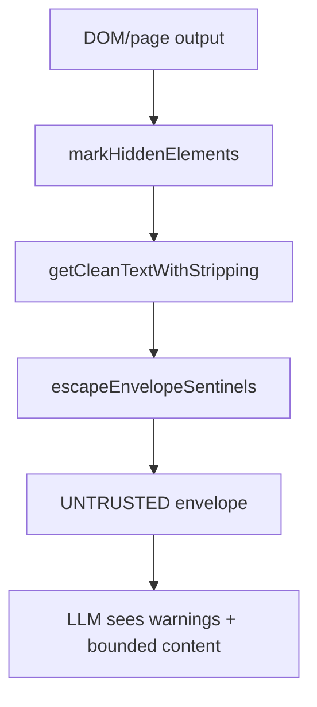

<details>
<summary>相关源文件</summary>

生成本页时使用的主要源文件：

- [ARCHITECTURE.md](../../../project-repos/gstack/ARCHITECTURE.md)
- [browse/src/server.ts](../../../project-repos/gstack/browse/src/server.ts)
- [browse/src/content-security.ts](../../../project-repos/gstack/browse/src/content-security.ts)
- [browse/src/security.ts](../../../project-repos/gstack/browse/src/security.ts)
- [browse/src/cdp-allowlist.ts](../../../project-repos/gstack/browse/src/cdp-allowlist.ts)
- [browse/src/token-registry.ts](../../../project-repos/gstack/browse/src/token-registry.ts)
- [browse/src/commands.ts](../../../project-repos/gstack/browse/src/commands.ts)

</details>

# 浏览器安全模型

gstack 的 Browse 安全边界围绕“本机 daemon + scoped remote pairing + untrusted page content”展开。基础 server 只绑定 `127.0.0.1`，写入 owner-only state file，并用 Bearer token 保护会改变状态的请求；远程 pair-agent 则通过独立 tunnel listener 暴露极小路径集合。Sources: [ARCHITECTURE.md:82-128](../../../project-repos/gstack/ARCHITECTURE.md#L82-L128), [browse/src/server.ts:62-67](../../../project-repos/gstack/browse/src/server.ts#L62-L67), [browse/src/server.ts:1020-1074](../../../project-repos/gstack/browse/src/server.ts#L1020-L1074)

<details class="source-snippets">
<summary>引用源码</summary>

<!-- source-snippets:start -->

#### `ARCHITECTURE.md:82-128`

```markdown
## Security model

### Localhost only

The HTTP server binds to `127.0.0.1`, not `0.0.0.0`. It's not reachable from the network.

### Dual-listener tunnel architecture (v1.6.0.0)

When a user runs `pair-agent --client`, the daemon starts an ngrok tunnel so a remote paired agent can drive the browser. Exposing the full daemon surface to the internet (even behind a random ngrok subdomain) meant `/health` leaked the root token on any Origin spoof, and `/cookie-picker` embedded the token into HTML that any caller could fetch.

The fix is **two HTTP listeners**, not one:

- **Local listener** (`127.0.0.1:LOCAL_PORT`) — always bound. Serves bootstrap (`/health` with token delivery), `/cookie-picker`, `/inspector/*`, `/welcome`, `/refs`, the sidebar-agent API, and the full command surface. Never forwarded.
- **Tunnel listener** (`127.0.0.1:TUNNEL_PORT`) — bound lazily on `/tunnel/start`, torn down on `/tunnel/stop`. Serves a locked allowlist: `/connect` (pairing ceremony, unauth + rate-limited), `/command` (scoped tokens only, further restricted to a browser-driving command allowlist), and `/sidebar-chat`. Everything else 404s.

ngrok forwards only the tunnel port. The security property comes from **physical port separation**: a tunnel caller cannot reach `/health` or `/cookie-picker` because those paths don't exist on that TCP socket. Header inference (check `x-forwarded-for`, check origin) is unreliable (ngrok header behavior changes; local proxies can add these headers); socket separation isn't.

| Endpoint | Local listener | Tunnel listener | Notes |
|---|---|---|---|
| `GET /health` | public (no token unless headed/extension) | 404 | Token bootstrap for extension happens locally only |
| `GET /connect` | public (`{alive:true}`) | public (`{alive:true}`) | Probe path for tunnel liveness |
| `POST /connect` | public (rate-limited 300/min) | public (rate-limited) | Setup-key exchange for pair-agent |
| `POST /command` | auth (Bearer root OR scoped) | auth (scoped only, allowlisted commands) | Root token on tunnel = 403 |
| `POST /sidebar-chat` | auth | auth | Lets remote agent post into local sidebar |
| `POST /pair` | root-only | 404 | Pairing mint — local operator action |
| `POST /tunnel/{start,stop}` | root-only | 404 | Daemon configuration |
| `POST /token`, `DELETE /token/:id` | root-only | 404 | Scoped token mint/revoke |
| `GET /cookie-picker`, `GET /cookie-picker/*` | public UI, auth API | 404 | Local-only — reads local browser DBs |
| `GET /inspector`, `/inspector/events`, etc. | auth | 404 | Extension callback, local-only |
| `GET /welcome` | public | 404 | GStack Browser landing page, local-only |
| `GET /refs` | auth | 404 | Ref map — internal state |
| `GET /activity/stream` | Bearer OR HttpOnly `gstack_sse` cookie | 404 | SSE. ?token= query param no longer accepted |
| `GET /inspector/events` | Bearer OR HttpOnly `gstack_sse` cookie | 404 | SSE. Same cookie as /activity/stream |
| `POST /sse-session` | auth (Bearer) | 404 | Mints the view-only 30-min SSE session cookie |

**Tunnel surface denial logs.** Every rejection on the tunnel listener (`path_not_on_tunnel`, `root_token_on_tunnel`, `missing_scoped_token`, `disallowed_command:*`) is recorded asynchronously to `~/.gstack/security/attempts.jsonl` with timestamp, source IP (from `x-forwarded-for`), path, and method. Rate-capped at 60 writes/min globally to prevent log-flood DoS. Shares the attempt log with the prompt-injection scanner.

**SSE session cookies.** EventSource can't send Authorization headers, so the extension POSTs `/sse-session` once at bootstrap with the root Bearer and receives a 30-minute view-only cookie (`gstack_sse`, HttpOnly, SameSite=Strict). The cookie is valid ONLY for `/activity/stream` and `/inspector/events` — it is NOT a scoped token and cannot be used on `/command`. Scope isolation is enforced by the module boundary: `sse-session-cookie.ts` has no imports from `token-registry.ts`.

**Non-goal in this wave** (tracked as #1136): the cookie-import-browser path launches Chrome with `--remote-debugging-port=<random>`. On Windows with App-Bound Encryption v20, a same-user local process can connect to that port and exfiltrate decrypted v20 cookies — an elevation path relative to reading the SQLite DB directly (which can't decrypt v20 without DPAPI context). Fix direction is `--remote-debugging-pipe` instead of TCP; requires restructuring the CDP client.

### Bearer token auth

Every server session generates a random UUID token, written to the state file with mode 0o600 (owner-only read). Every HTTP request that mutates browser state must include `Authorization: Bearer <token>`. If the token doesn't match, the server returns 401.

This prevents other processes on the same machine from talking to your browse server. The cookie picker UI (`/cookie-picker`) and health check (`/health`) are exempt on the local listener — they're 127.0.0.1-bound and don't execute commands. On the tunnel listener nothing is exempt except `/connect`.

```

#### `browse/src/server.ts:62-67`

```typescript
// ─── Auth ───────────────────────────────────────────────────────
const AUTH_TOKEN = crypto.randomUUID();
initRegistry(AUTH_TOKEN);
const BROWSE_PORT = parseInt(process.env.BROWSE_PORT || '0', 10);
const IDLE_TIMEOUT_MS = parseInt(process.env.BROWSE_IDLE_TIMEOUT || '1800000', 10); // 30 min

```

#### `browse/src/server.ts:1020-1074`

```typescript
  const port = await findPort();
  LOCAL_LISTEN_PORT = port;

  // Launch browser (headless or headed with extension)
  // BROWSE_HEADLESS_SKIP=1 skips browser launch entirely (for HTTP-only testing)
  const skipBrowser = process.env.BROWSE_HEADLESS_SKIP === '1';
  if (!skipBrowser) {
    const headed = process.env.BROWSE_HEADED === '1';
    if (headed) {
      await browserManager.launchHeaded(AUTH_TOKEN);
      console.log(`[browse] Launched headed Chromium with extension`);
    } else {
      await browserManager.launch();
    }
  }

  const startTime = Date.now();

  // ─── Request handler factory ────────────────────────────────────
  //
  // Same logic serves both the local listener (bootstrap, CLI, sidebar) and
  // the tunnel listener (pairing + scoped-token commands).  The factory
  // closes over `surface` so the filter that runs before route dispatch
  // knows which socket accepted the request.
  //
  // On the tunnel surface: reject anything not in TUNNEL_PATHS (404), reject
  // root-token bearers (403), and require a scoped token for everything
  // except /connect.  Denials are logged to ~/.gstack/security/attempts.jsonl.
  const makeFetchHandler = (surface: Surface) => async (req: Request): Promise<Response> => {
    const url = new URL(req.url);

    // ─── Tunnel surface filter (runs before any route dispatch) ──
    if (surface === 'tunnel') {
      const isGetConnect = req.method === 'GET' && url.pathname === '/connect';
      const allowed = TUNNEL_PATHS.has(url.pathname);
      if (!allowed && !isGetConnect) {
        logTunnelDenial(req, url, 'path_not_on_tunnel');
        return new Response(JSON.stringify({ error: 'Not found' }), {
          status: 404, headers: { 'Content-Type': 'application/json' },
        });
      }
      if (isRootRequest(req)) {
        logTunnelDenial(req, url, 'root_token_on_tunnel');
        return new Response(JSON.stringify({
          error: 'Root token rejected on tunnel surface',
          hint: 'Remote agents must pair via /connect to receive a scoped token.',
        }), { status: 403, headers: { 'Content-Type': 'application/json' } });
      }
      if (url.pathname !== '/connect' && !getTokenInfo(req)) {
        logTunnelDenial(req, url, 'missing_scoped_token');
        return new Response(JSON.stringify({ error: 'Unauthorized' }), {
          status: 401, headers: { 'Content-Type': 'application/json' },
        });
      }
    }
```

<!-- source-snippets:end -->
</details>
## 双监听器 tunnel

```mermaid
flowchart TD
  A[Local listener 127.0.0.1] --> A1[/health]
  A --> A2[/cookie-picker]
  A --> A3[/inspector/*]
  A --> A4[/command root or scoped]
  B[Tunnel listener 127.0.0.1] --> B1[/connect]
  B --> B2[/command scoped only]
  B --> B3[/sidebar-chat]
  C[ngrok] --> B
  D[remote agent] --> C
```

架构文档明确说安全属性来自物理端口分离，而不是依赖 header 判断。server 代码也在 tunnel surface 上先拒绝非 allowlist path、拒绝 root token、要求 scoped token。Sources: [ARCHITECTURE.md:88-121](../../../project-repos/gstack/ARCHITECTURE.md#L88-L121), [browse/src/server.ts:77-142](../../../project-repos/gstack/browse/src/server.ts#L77-L142), [browse/src/server.ts:1048-1074](../../../project-repos/gstack/browse/src/server.ts#L1048-L1074)

<details class="source-snippets">
<summary>引用源码</summary>

<!-- source-snippets:start -->

#### `ARCHITECTURE.md:88-121`

```markdown
### Dual-listener tunnel architecture (v1.6.0.0)

When a user runs `pair-agent --client`, the daemon starts an ngrok tunnel so a remote paired agent can drive the browser. Exposing the full daemon surface to the internet (even behind a random ngrok subdomain) meant `/health` leaked the root token on any Origin spoof, and `/cookie-picker` embedded the token into HTML that any caller could fetch.

The fix is **two HTTP listeners**, not one:

- **Local listener** (`127.0.0.1:LOCAL_PORT`) — always bound. Serves bootstrap (`/health` with token delivery), `/cookie-picker`, `/inspector/*`, `/welcome`, `/refs`, the sidebar-agent API, and the full command surface. Never forwarded.
- **Tunnel listener** (`127.0.0.1:TUNNEL_PORT`) — bound lazily on `/tunnel/start`, torn down on `/tunnel/stop`. Serves a locked allowlist: `/connect` (pairing ceremony, unauth + rate-limited), `/command` (scoped tokens only, further restricted to a browser-driving command allowlist), and `/sidebar-chat`. Everything else 404s.

ngrok forwards only the tunnel port. The security property comes from **physical port separation**: a tunnel caller cannot reach `/health` or `/cookie-picker` because those paths don't exist on that TCP socket. Header inference (check `x-forwarded-for`, check origin) is unreliable (ngrok header behavior changes; local proxies can add these headers); socket separation isn't.

| Endpoint | Local listener | Tunnel listener | Notes |
|---|---|---|---|
| `GET /health` | public (no token unless headed/extension) | 404 | Token bootstrap for extension happens locally only |
| `GET /connect` | public (`{alive:true}`) | public (`{alive:true}`) | Probe path for tunnel liveness |
| `POST /connect` | public (rate-limited 300/min) | public (rate-limited) | Setup-key exchange for pair-agent |
| `POST /command` | auth (Bearer root OR scoped) | auth (scoped only, allowlisted commands) | Root token on tunnel = 403 |
| `POST /sidebar-chat` | auth | auth | Lets remote agent post into local sidebar |
| `POST /pair` | root-only | 404 | Pairing mint — local operator action |
| `POST /tunnel/{start,stop}` | root-only | 404 | Daemon configuration |
| `POST /token`, `DELETE /token/:id` | root-only | 404 | Scoped token mint/revoke |
| `GET /cookie-picker`, `GET /cookie-picker/*` | public UI, auth API | 404 | Local-only — reads local browser DBs |
| `GET /inspector`, `/inspector/events`, etc. | auth | 404 | Extension callback, local-only |
| `GET /welcome` | public | 404 | GStack Browser landing page, local-only |
| `GET /refs` | auth | 404 | Ref map — internal state |
| `GET /activity/stream` | Bearer OR HttpOnly `gstack_sse` cookie | 404 | SSE. ?token= query param no longer accepted |
| `GET /inspector/events` | Bearer OR HttpOnly `gstack_sse` cookie | 404 | SSE. Same cookie as /activity/stream |
| `POST /sse-session` | auth (Bearer) | 404 | Mints the view-only 30-min SSE session cookie |

**Tunnel surface denial logs.** Every rejection on the tunnel listener (`path_not_on_tunnel`, `root_token_on_tunnel`, `missing_scoped_token`, `disallowed_command:*`) is recorded asynchronously to `~/.gstack/security/attempts.jsonl` with timestamp, source IP (from `x-forwarded-for`), path, and method. Rate-capped at 60 writes/min globally to prevent log-flood DoS. Shares the attempt log with the prompt-injection scanner.

**SSE session cookies.** EventSource can't send Authorization headers, so the extension POSTs `/sse-session` once at bootstrap with the root Bearer and receives a 30-minute view-only cookie (`gstack_sse`, HttpOnly, SameSite=Strict). The cookie is valid ONLY for `/activity/stream` and `/inspector/events` — it is NOT a scoped token and cannot be used on `/command`. Scope isolation is enforced by the module boundary: `sse-session-cookie.ts` has no imports from `token-registry.ts`.

**Non-goal in this wave** (tracked as #1136): the cookie-import-browser path launches Chrome with `--remote-debugging-port=<random>`. On Windows with App-Bound Encryption v20, a same-user local process can connect to that port and exfiltrate decrypted v20 cookies — an elevation path relative to reading the SQLite DB directly (which can't decrypt v20 without DPAPI context). Fix direction is `--remote-debugging-pipe` instead of TCP; requires restructuring the CDP client.
```

#### `browse/src/server.ts:77-142`

```typescript
// ─── Tunnel State ───────────────────────────────────────────────
//
// Dual-listener architecture: the daemon binds TWO HTTP listeners when a
// tunnel is active. The local listener serves bootstrap + CLI + sidebar
// (never exposed to ngrok). The tunnel listener serves only the pairing
// ceremony and scoped-token command endpoints (the ONLY port ngrok forwards).
//
// Security property comes from physical port separation: a tunnel caller
// cannot reach bootstrap endpoints because they live on a different TCP
// socket, not because of any per-request check.
let tunnelActive = false;
let tunnelUrl: string | null = null;
let tunnelListener: any = null;           // ngrok listener handle
let tunnelServer: ReturnType<typeof Bun.serve> | null = null; // tunnel HTTP listener

/** Which HTTP listener accepted this request. */
export type Surface = 'local' | 'tunnel';

/**
 * Paths reachable over the tunnel surface. Everything else returns 404.
 *
 * `/connect` is the only unauthenticated tunnel endpoint — POST for setup-key
 * exchange, GET for an `{alive: true}` probe used by /pair and /tunnel/start
 * to detect dead ngrok tunnels. Other paths in this set require a scoped
 * token via Authorization: Bearer.
 *
 * Updating this set is a deliberate security decision. Every addition widens
 * the tunnel attack surface.
 */
const TUNNEL_PATHS = new Set<string>([
  '/connect',
  '/command',
  '/sidebar-chat',
]);

/**
 * Commands reachable via POST /command over the tunnel surface. A paired
 * remote agent can drive the browser (goto, click, text, etc.) but cannot
 * configure the daemon, bootstrap new sessions, import cookies, or reach
 * extension-inspector state. This allowlist maps to the eng-review decision
 * logged in the CEO plan for sec-wave v1.6.0.0.
 */
export const TUNNEL_COMMANDS = new Set<string>([
  // Original 17
  'goto', 'click', 'text', 'screenshot',
  'html', 'links', 'forms', 'accessibility',
  'attrs', 'media', 'data',
  'scroll', 'press', 'type', 'select', 'wait', 'eval',
  // Tab + navigation primitives operator docs and CLI hints already promised
  'newtab', 'tabs', 'back', 'forward', 'reload',
  // Read/inspect/write operators paired agents need to be useful
  'snapshot', 'fill', 'url', 'closetab',
]);

/**
 * Pure gate: returns true iff the command is reachable over the tunnel surface.
 * Extracted from the inline /command handler so the gate logic is unit-testable
 * without standing up an HTTP listener. Behavior is identical to the inline
 * check; the function canonicalizes the command (so aliases hit the same set)
 * and returns false for null/undefined input.
 */
export function canDispatchOverTunnel(command: string | undefined | null): boolean {
  if (typeof command !== 'string' || command.length === 0) return false;
  const cmd = canonicalizeCommand(command);
  return TUNNEL_COMMANDS.has(cmd);
}
```

#### `browse/src/server.ts:1048-1074`

```typescript
  const makeFetchHandler = (surface: Surface) => async (req: Request): Promise<Response> => {
    const url = new URL(req.url);

    // ─── Tunnel surface filter (runs before any route dispatch) ──
    if (surface === 'tunnel') {
      const isGetConnect = req.method === 'GET' && url.pathname === '/connect';
      const allowed = TUNNEL_PATHS.has(url.pathname);
      if (!allowed && !isGetConnect) {
        logTunnelDenial(req, url, 'path_not_on_tunnel');
        return new Response(JSON.stringify({ error: 'Not found' }), {
          status: 404, headers: { 'Content-Type': 'application/json' },
        });
      }
      if (isRootRequest(req)) {
        logTunnelDenial(req, url, 'root_token_on_tunnel');
        return new Response(JSON.stringify({
          error: 'Root token rejected on tunnel surface',
          hint: 'Remote agents must pair via /connect to receive a scoped token.',
        }), { status: 403, headers: { 'Content-Type': 'application/json' } });
      }
      if (url.pathname !== '/connect' && !getTokenInfo(req)) {
        logTunnelDenial(req, url, 'missing_scoped_token');
        return new Response(JSON.stringify({ error: 'Unauthorized' }), {
          status: 401, headers: { 'Content-Type': 'application/json' },
        });
      }
    }
```

<!-- source-snippets:end -->
</details>
## 命令面收敛

`tunnel` 面只允许浏览器驱动类命令，例如 `goto`、`click`、`text`、`screenshot`、`snapshot`、`fill`、`newtab`、`tabs` 等；server 对 `/command` 再次调用 `canDispatchOverTunnel` 检查。Sources: [browse/src/server.ts:112-142](../../../project-repos/gstack/browse/src/server.ts#L112-L142), [browse/src/server.ts:1792-1817](../../../project-repos/gstack/browse/src/server.ts#L1792-L1817)

<details class="source-snippets">
<summary>引用源码</summary>

<!-- source-snippets:start -->

#### `browse/src/server.ts:112-142`

```typescript
/**
 * Commands reachable via POST /command over the tunnel surface. A paired
 * remote agent can drive the browser (goto, click, text, etc.) but cannot
 * configure the daemon, bootstrap new sessions, import cookies, or reach
 * extension-inspector state. This allowlist maps to the eng-review decision
 * logged in the CEO plan for sec-wave v1.6.0.0.
 */
export const TUNNEL_COMMANDS = new Set<string>([
  // Original 17
  'goto', 'click', 'text', 'screenshot',
  'html', 'links', 'forms', 'accessibility',
  'attrs', 'media', 'data',
  'scroll', 'press', 'type', 'select', 'wait', 'eval',
  // Tab + navigation primitives operator docs and CLI hints already promised
  'newtab', 'tabs', 'back', 'forward', 'reload',
  // Read/inspect/write operators paired agents need to be useful
  'snapshot', 'fill', 'url', 'closetab',
]);

/**
 * Pure gate: returns true iff the command is reachable over the tunnel surface.
 * Extracted from the inline /command handler so the gate logic is unit-testable
 * without standing up an HTTP listener. Behavior is identical to the inline
 * check; the function canonicalizes the command (so aliases hit the same set)
 * and returns false for null/undefined input.
 */
export function canDispatchOverTunnel(command: string | undefined | null): boolean {
  if (typeof command !== 'string' || command.length === 0) return false;
  const cmd = canonicalizeCommand(command);
  return TUNNEL_COMMANDS.has(cmd);
}
```

#### `browse/src/server.ts:1792-1817`

```typescript
      // ─── Command endpoint (accepts both root AND scoped tokens) ────
      // Must be checked BEFORE the blanket root-only auth gate below,
      // because scoped tokens from /connect are valid for /command.
      if (url.pathname === '/command' && req.method === 'POST') {
        const tokenInfo = getTokenInfo(req);
        if (!tokenInfo) {
          return new Response(JSON.stringify({ error: 'Unauthorized' }), {
            status: 401,
            headers: { 'Content-Type': 'application/json' },
          });
        }
        resetIdleTimer();
        const body = await req.json() as any;
        // Tunnel surface: only commands in TUNNEL_COMMANDS are allowed.
        // Paired remote agents drive the browser but cannot configure the
        // daemon, launch new browsers, import cookies, or rotate tokens.
        if (surface === 'tunnel') {
          if (!canDispatchOverTunnel(body?.command)) {
            logTunnelDenial(req, url, `disallowed_command:${body?.command}`);
            return new Response(JSON.stringify({
              error: `Command '${body?.command}' is not allowed over the tunnel surface`,
              hint: `Tunnel commands: ${[...TUNNEL_COMMANDS].sort().join(', ')}`,
            }), { status: 403, headers: { 'Content-Type': 'application/json' } });
          }
        }
        return handleCommand(body, tokenInfo);
```

<!-- source-snippets:end -->
</details>
## 内容安全层

页面内容是攻击面。`content-security.ts` 提供 datamarking、隐藏元素/ARIA injection 检测、untrusted envelope 和可注册内容过滤器。`commands.ts` 还把 `snapshot` 纳入 `PAGE_CONTENT_COMMANDS`，因为 aria-label 也可能是攻击者控制的文本。Sources: [browse/src/content-security.ts:1-11](../../../project-repos/gstack/browse/src/content-security.ts#L1-L11), [browse/src/content-security.ts:60-88](../../../project-repos/gstack/browse/src/content-security.ts#L60-L88), [browse/src/content-security.ts:198-244](../../../project-repos/gstack/browse/src/content-security.ts#L198-L244), [browse/src/commands.ts:52-80](../../../project-repos/gstack/browse/src/commands.ts#L52-L80)

<details class="source-snippets">
<summary>引用源码</summary>

<!-- source-snippets:start -->

#### `browse/src/content-security.ts:1-11`

```typescript
/**
 * Content security layer for pair-agent browser sharing.
 *
 * Four defense layers:
 *   1. Datamarking — watermark text output to detect exfiltration
 *   2. Hidden element stripping — remove invisible/deceptive elements from output
 *   3. Content filter hooks — extensible URL/content filter pipeline
 *   4. Instruction block hardening — SECURITY section in agent instructions
 *
 * This module handles layers 1-3. Layer 4 is in cli.ts.
 */
```

#### `browse/src/content-security.ts:60-88`

```typescript
// ─── Hidden Element Stripping (Layer 2) ─────────────────────────

/** Injection-like patterns in ARIA labels */
const ARIA_INJECTION_PATTERNS = [
  /ignore\s+(previous|above|all)\s+instructions?/i,
  /you\s+are\s+(now|a)\s+/i,
  /system\s*:\s*/i,
  /\bdo\s+not\s+(follow|obey|listen)/i,
  /\bexecute\s+(the\s+)?following/i,
  /\bforget\s+(everything|all|your)/i,
  /\bnew\s+instructions?\s*:/i,
];

/**
 * Detect hidden elements and ARIA injection on a page.
 * Marks hidden elements with data-gstack-hidden attribute.
 * Returns descriptions of what was found for logging.
 *
 * Detection criteria:
 *   - opacity < 0.1
 *   - font-size < 1px
 *   - off-screen (positioned far outside viewport)
 *   - visibility:hidden or display:none with text content
 *   - same foreground/background color
 *   - clip/clip-path hiding
 *   - ARIA labels with injection patterns
 */
export async function markHiddenElements(page: Page | Frame): Promise<string[]> {
  return page.evaluate((ariaPatterns: string[]) => {
```

#### `browse/src/content-security.ts:198-244`

```typescript
// ─── Content Envelope (wrapping) ────────────────────────────────

const ENVELOPE_BEGIN = '═══ BEGIN UNTRUSTED WEB CONTENT ═══';
const ENVELOPE_END = '═══ END UNTRUSTED WEB CONTENT ═══';

/**
 * Defuse envelope sentinels that appear inside attacker-controlled page
 * content. Any raw BEGIN/END marker inside `content` gets a zero-width
 * space spliced through CONTENT so the marker still renders visibly but
 * no longer matches the envelope grep the LLM anchors on.
 *
 * Both the wrap path (full-page content) and the split path (scoped
 * snapshots) must funnel untrusted text through this helper before
 * emitting the outer envelope, otherwise a page whose accessibility
 * tree contains the literal sentinel can close the envelope early and
 * forge a fake "trusted" section in the LLM's view.
 */
export function escapeEnvelopeSentinels(content: string): string {
  const zwsp = '\u200B';
  return content
    .replace(/═══ BEGIN UNTRUSTED WEB CONTENT ═══/g, `═══ BEGIN UNTRUSTED WEB C${zwsp}ONTENT ═══`)
    .replace(/═══ END UNTRUSTED WEB CONTENT ═══/g, `═══ END UNTRUSTED WEB C${zwsp}ONTENT ═══`);
}

/**
 * Wrap page content in a trust boundary envelope for scoped tokens.
 * Escapes envelope markers in content to prevent boundary escape attacks.
 */
export function wrapUntrustedPageContent(
  content: string,
  command: string,
  filterWarnings?: string[],
): string {
  const safeContent = escapeEnvelopeSentinels(content);

  const parts: string[] = [];

  if (filterWarnings && filterWarnings.length > 0) {
    parts.push(`⚠ CONTENT WARNINGS: ${filterWarnings.join('; ')}`);
  }

  parts.push(ENVELOPE_BEGIN);
  parts.push(safeContent);
  parts.push(ENVELOPE_END);

  return parts.join('\n');
}
```

#### `browse/src/commands.ts:52-80`

```typescript
/** Commands that return untrusted third-party page content */
export const PAGE_CONTENT_COMMANDS = new Set([
  'text', 'html', 'links', 'forms', 'accessibility', 'attrs',
  'console', 'dialog',
  'media', 'data',
  'ux-audit',
  // snapshot emits aria tree with attacker-controlled aria-label strings.
  // The sidebar's system prompt pushes agents to run `$B snapshot` as the
  // primary read path, so unwrapped snapshot output is the biggest ingress
  // for indirect prompt injection. Envelope it like every other read.
  'snapshot',
]);

/**
 * Subset of PAGE_CONTENT_COMMANDS whose output is derived from the
 * live page DOM. These channels can carry hidden elements or
 * ARIA-injection payloads that the centralized envelope wrap alone
 * does not neutralize, so the scoped-token pipeline runs
 * `markHiddenElements` on the page before the read and surfaces any
 * hits as CONTENT WARNINGS to the LLM.
 *
 * `console`, `dialog` intentionally excluded — they read separate
 * runtime state (console capture, dialog events), not the DOM tree.
 */
export const DOM_CONTENT_COMMANDS = new Set([
  'text', 'html', 'links', 'forms', 'accessibility', 'attrs',
  'media', 'data', 'ux-audit',
]);

```

<!-- source-snippets:end -->
</details>


## Prompt injection 防御

`ARCHITECTURE.md` 记录了 sidebar agent 的分层防御：L1-L3 内容安全、L4 本地 ML classifier、L4b transcript classifier、L5 canary token、L6 ensemble combiner。`security.ts` 只包含纯字符串和 ML-free 部分，避免 compiled Bun binary 加载 native ONNX runtime。Sources: [ARCHITECTURE.md:147-165](../../../project-repos/gstack/ARCHITECTURE.md#L147-L165), [browse/src/security.ts:1-20](../../../project-repos/gstack/browse/src/security.ts#L1-L20), [browse/src/security.ts:28-51](../../../project-repos/gstack/browse/src/security.ts#L28-L51), [browse/src/security.ts:87-148](../../../project-repos/gstack/browse/src/security.ts#L87-L148)

<details class="source-snippets">
<summary>引用源码</summary>

<!-- source-snippets:start -->

#### `ARCHITECTURE.md:147-165`

```markdown
### Prompt injection defense (sidebar agent)

The Chrome sidebar agent has tools (Bash, Read, Glob, Grep, WebFetch) and reads hostile web pages, so it's the part of gstack most exposed to prompt injection. Defense is layered, not single-point.

1. **L1-L3 content security (`browse/src/content-security.ts`).** Runs on every page-content command and every tool output: datamarking, hidden-element strip, ARIA regex, URL blocklist, and a trust-boundary envelope wrapper. Applied at both the server and the agent.

2. **L4 ML classifier — TestSavantAI (`browse/src/security-classifier.ts`).** A 22MB BERT-small ONNX model (int8 quantized) bundled with the agent. Runs locally, no network. Scans every user message and every Read/Glob/Grep/WebFetch tool output before Claude sees it. Opt-in 721MB DeBERTa-v3 ensemble via `GSTACK_SECURITY_ENSEMBLE=deberta`.

3. **L4b transcript classifier.** A Claude Haiku pass that looks at the full conversation shape (user message, tool calls, tool output), not just text. Gated by `LOG_ONLY: 0.40` so most clean traffic skips the paid call.

4. **L5 canary token (`browse/src/security.ts`).** A random token injected into the system prompt at session start. Rolling-buffer detection across `text_delta` and `input_json_delta` streams catches the token if it shows up anywhere in Claude's output, tool arguments, URLs, or file writes. Deterministic BLOCK — if the token leaks, the attacker convinced Claude to reveal the system prompt, and the session ends.

5. **L6 ensemble combiner (`combineVerdict`).** BLOCK requires agreement from two ML classifiers at >= `WARN` (0.60), not a single confident hit. This is the Stack Overflow instruction-writing false-positive mitigation. On tool-output scans, single-layer high confidence BLOCKs directly — the content wasn't user-authored, so the FP concern doesn't apply.

**Critical constraint:** `security-classifier.ts` runs only in the sidebar-agent process, never in the compiled browse binary. `@huggingface/transformers` v4 requires `onnxruntime-node`, which fails `dlopen` from Bun compile's temp extract directory. Only the pure-string pieces (canary inject/check, verdict combiner, attack log, status) are in `security.ts`, which is safe to import from `server.ts`.

**Env knobs:** `GSTACK_SECURITY_OFF=1` is a real kill switch (skips ML scan, canary still injects). Model cache at `~/.gstack/models/testsavant-small/` (112MB, first run) and `~/.gstack/models/deberta-v3-injection/` (721MB, opt-in only). Attack log at `~/.gstack/security/attempts.jsonl` (salted sha256 + domain, rotates at 10MB, 5 generations). Per-device salt at `~/.gstack/security/device-salt` (0600), cached in-process to survive FS-unwritable environments.

**Visibility.** The sidebar header shows a shield icon (green/amber/red) polled via `/sidebar-chat`. A centered banner appears on canary leak or BLOCK verdict with the exact layer scores. `bin/gstack-security-dashboard` aggregates local attempts; `supabase/functions/community-pulse` aggregates opt-in community telemetry across users.
```

#### `browse/src/security.ts:1-20`

```typescript
/**
 * Security module: prompt injection defense layer.
 *
 * This file contains the PURE-STRING / ML-FREE parts of the security stack.
 * Safe to import from the compiled `browse/dist/browse` binary because it
 * does not load onnxruntime-node or other native modules.
 *
 * ML classifier code lives in `security-classifier.ts`, which is only
 * imported from `sidebar-agent.ts` (runs as non-compiled bun script).
 *
 * Layering (see CEO plan 2026-04-19-prompt-injection-guard.md):
 *   L1-L3: content-security.ts (existing, datamarking / DOM strip / URL blocklist)
 *   L4:    ML content classifier (TestSavantAI via security-classifier.ts)
 *   L4b:   ML transcript classifier (Haiku via security-classifier.ts)
 *   L5:    Canary (this module — inject + check)
 *   L6:    Threshold aggregation (this module — combineVerdict)
 *
 * Cross-process state lives at ~/.gstack/security/session-state.json
 * (per eng review finding 1.2 — server.ts and sidebar-agent.ts are different processes).
 */
```

#### `browse/src/security.ts:28-51`

```typescript
// ─── Thresholds + verdict types ──────────────────────────────

/**
 * Confidence thresholds for classifier output. Calibrated against BrowseSafe-Bench
 * smoke (200 cases) + benign corpus (50 pages). BLOCK is intentionally conservative.
 * See plan §"Threshold Spec" for calibration methodology.
 */
export const THRESHOLDS = {
  BLOCK: 0.85,
  WARN: 0.75,
  LOG_ONLY: 0.40,
  // Single-layer BLOCK threshold for content classifiers (testsavant, deberta)
  // — intentionally HIGHER than BLOCK because these layers are label-less and
  // cannot distinguish "this is an injection" from "this looks like phishing
  // aimed at the user." On the 500-case BrowseSafe-Bench smoke, testsavant
  // alone at >= 0.85 generated 34+ false positives on benign phishing-flavored
  // content. At 0.92 the FP rate drops below the 25% ceiling while detection
  // stays above the 55% floor (v2 measured 56.2% / 22.9%).
  // The transcript_classifier keeps a separate, label-gated solo path that
  // requires meta.verdict === 'block' + confidence >= BLOCK (0.85). It
  // doesn't need the higher threshold because Haiku's block label is
  // inherently more selective than testsavant's raw confidence.
  SOLO_CONTENT_BLOCK: 0.92,
} as const;
```

#### `browse/src/security.ts:87-148`

```typescript
// ─── Verdict combiner (ensemble rule, label-first for transcript) ────

/**
 * Combine per-layer signals into a single verdict. Post-v2 ensemble rule
 * (v1.5.2.0+) is label-first for the transcript layer: Haiku's verdict
 * label is the primary signal, not its self-reported confidence. Other ML
 * layers (testsavant_content, deberta_content) remain confidence-based
 * because they emit only a scalar.
 *
 * BLOCK requires 2 block-votes across testsavant + deberta + transcript.
 * Vote rules:
 *   - testsavant_content / deberta_content: block-vote iff confidence >= WARN
 *   - transcript_classifier + meta.verdict === 'block' + confidence >= LOG_ONLY:
 *     block-vote (label-first; LOG_ONLY floor is the hallucination guard —
 *     a block label with confidence < 0.40 is treated as a warn-vote because
 *     it likely signals model breakage, not a real block decision)
 *   - transcript_classifier + meta.verdict === 'warn': warn-vote only
 *   - transcript_classifier + missing meta.verdict (backward-compat): warn-vote
 *     only when confidence >= WARN; missing meta NEVER block-votes
 *
 * Warn-votes are soft signals: retained in the signals array for surfacing
 * in the review banner, but they do NOT count toward the 2-of-N block count.
 *
 * Canary leak (confidence >= 1.0 on 'canary' layer) always BLOCKs — it's
 * deterministic, not a probabilistic signal.
 *
 * toolOutput branch: single-layer BLOCK (confidence >= 0.85) on any ML layer
 * kills the session even without cross-confirm. Tool outputs aren't
 * user-authored, so the SO-FP mitigation that motivated the 2-of-N rule
 * for user input doesn't apply.
 */
export interface CombineVerdictOpts {
  toolOutput?: boolean;
}

type VoteStrength = 'block' | 'warn' | 'none';

function classifyTranscript(signal: LayerSignal): VoteStrength {
  const verdict = signal.meta?.verdict as string | undefined;
  const confidence = signal.confidence;

  if (verdict === 'block') {
    // Hallucination guard: verdict=block with confidence < LOG_ONLY drops
    // to warn-vote. Prevents a malformed low-confidence block from becoming
    // authoritative.
    return confidence >= THRESHOLDS.LOG_ONLY ? 'block' : 'warn';
  }
  if (verdict === 'warn') {
    return 'warn';
  }
  if (verdict === 'safe') {
    return 'none';
  }
  // Backward-compat: signal with no meta.verdict (old tests, pre-v2 cached
  // signals). Confidence-only fallback: warn-vote when >= WARN, else no vote.
  // Missing meta NEVER block-votes — the old confidence-only block-vote rule
  // is deprecated for the transcript layer.
  if (confidence >= THRESHOLDS.WARN) return 'warn';
  return 'none';
}

export function combineVerdict(signals: LayerSignal[], opts: CombineVerdictOpts = {}): SecurityResult {
```

<!-- source-snippets:end -->
</details>
## CDP escape hatch

`$B cdp` 是默认拒绝策略：每个允许的 CDP method 都必须声明 domain、method、scope、output 和 justification；危险方法如 `Runtime.evaluate`、`Network.getResponseBody`、`Page.navigate` 不在 allowlist 中。Sources: [browse/src/cdp-allowlist.ts:1-17](../../../project-repos/gstack/browse/src/cdp-allowlist.ts#L1-L17), [browse/src/cdp-allowlist.ts:30-214](../../../project-repos/gstack/browse/src/cdp-allowlist.ts#L30-L214)

<details class="source-snippets">
<summary>引用源码</summary>

<!-- source-snippets:start -->

#### `browse/src/cdp-allowlist.ts:1-17`

```typescript
/**
 * CDP method allow-list (T2: deny-default).
 *
 * Codex outside-voice T2: allow-default with a deny-list is backwards because
 * Target.*, Browser.*, Runtime.evaluate, Page.addScriptToEvaluateOnNewDocument,
 * Fetch.*, IO.read, etc. are all dangerous and easy to forget. Default-deny
 * inverts the failure mode: missing a method means it's blocked (annoying),
 * not exposed (silent compromise).
 *
 * Each entry has:
 *   - domain.method     unique CDP identifier
 *   - scope             "tab" | "browser" — controls T7 mutex tier
 *   - output            "trusted" | "untrusted" — wraps result if "untrusted"
 *   - justification     why this method is safe to allow
 *
 * Add entries via PR. CI lint (cdp-allowlist.test.ts) ensures every entry has all 4 fields.
 */
```

#### `browse/src/cdp-allowlist.ts:30-214`

```typescript
export const CDP_ALLOWLIST: ReadonlyArray<CdpAllowEntry> = Object.freeze([
  // ─── Accessibility (read-only) ─────────────────────────────
  {
    domain: 'Accessibility',
    method: 'getFullAXTree',
    scope: 'tab',
    output: 'untrusted',
    justification: 'Read-only AX tree extraction. Output is third-party page content; wrap in UNTRUSTED.',
  },
  {
    domain: 'Accessibility',
    method: 'getPartialAXTree',
    scope: 'tab',
    output: 'untrusted',
    justification: 'Read-only AX tree subtree by node. Output is third-party page content.',
  },
  {
    domain: 'Accessibility',
    method: 'getRootAXNode',
    scope: 'tab',
    output: 'untrusted',
    justification: 'Read-only root AX node accessor.',
  },
  // ─── DOM (read-only inspection) ────────────────────────────
  {
    domain: 'DOM',
    method: 'describeNode',
    scope: 'tab',
    output: 'untrusted',
    justification: 'Inspect a DOM node by backend ID; pure read.',
  },
  {
    domain: 'DOM',
    method: 'getBoxModel',
    scope: 'tab',
    output: 'trusted',
    justification: 'Pure geometric data (box dimensions). No page content leaks; safe trusted.',
  },
  {
    domain: 'DOM',
    method: 'getNodeForLocation',
    scope: 'tab',
    output: 'trusted',
    justification: 'Pure coordinate→nodeId mapping; no content leak.',
  },
  // ─── CSS (read-only) ───────────────────────────────────────
  {
    domain: 'CSS',
    method: 'getMatchedStylesForNode',
    scope: 'tab',
    output: 'untrusted',
    justification: 'Read computed cascade for a node; output may contain attacker-controlled selectors.',
  },
  {
    domain: 'CSS',
    method: 'getComputedStyleForNode',
    scope: 'tab',
    output: 'trusted',
    justification: 'Computed style values are bounded (CSS keywords/numbers); safe trusted.',
  },
  {
    domain: 'CSS',
    method: 'getInlineStylesForNode',
    scope: 'tab',
    output: 'untrusted',
    justification: 'Inline style content may contain attacker-controlled custom-property values.',
  },
  // ─── Performance metrics ───────────────────────────────────
  {
    domain: 'Performance',
    method: 'getMetrics',
    scope: 'tab',
    output: 'trusted',
    justification: 'Pure numeric metrics (timing, layout count); safe.',
  },
  {
    domain: 'Performance',
    method: 'enable',
    scope: 'tab',
    output: 'trusted',
    justification: 'Domain enable; no content; required prerequisite for getMetrics.',
  },
  {
    domain: 'Performance',
    method: 'disable',
    scope: 'tab',
    output: 'trusted',
    justification: 'Domain disable; no content.',
  },
  // ─── Tracing (event capture) ───────────────────────────────
  // NOTE: Tracing.start can capture cross-tab data depending on categories.
  // We mark it browser-scoped to acquire the global lock when in use.
  {
    domain: 'Tracing',
    method: 'start',
    scope: 'browser',
    output: 'trusted',
    justification: 'Trace category capture. Browser-scoped to serialize against other CDP ops.',
  },
  {
    domain: 'Tracing',
    method: 'end',
    scope: 'browser',
    output: 'untrusted',
    justification: 'Trace dump may contain URLs and page data; wrap.',
  },
  // ─── Emulation (viewport/device) ───────────────────────────
  {
    domain: 'Emulation',
    method: 'setDeviceMetricsOverride',
    scope: 'tab',
    output: 'trusted',
    justification: 'Viewport/scale override on the active tab.',
  },
  {
    domain: 'Emulation',
    method: 'clearDeviceMetricsOverride',
    scope: 'tab',
    output: 'trusted',
    justification: 'Clear viewport override.',
... snippet truncated ...
```

<!-- source-snippets:end -->
</details>
## 相关页面

- [Browse 运行时](browse-runtime.md)
- [测试、CI 与质量门](testing-ci-quality.md)
- [OpenClaw 集成](openclaw-integration.md)
