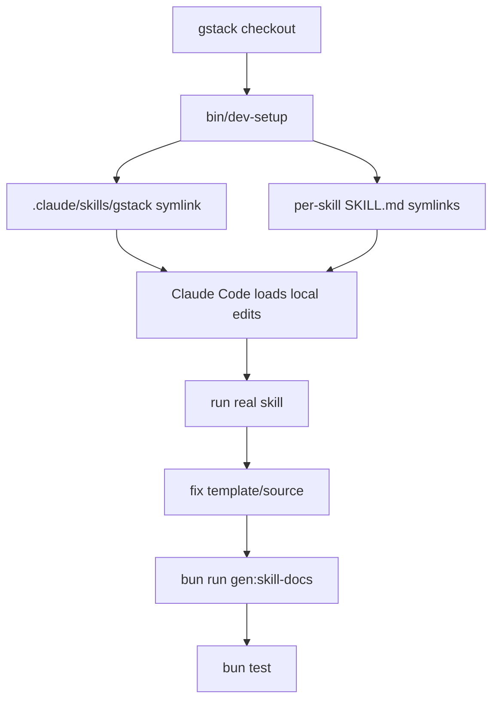

<details>
<summary>相关源文件</summary>

生成本页时使用的主要源文件：

- [CONTRIBUTING.md](../../../project-repos/gstack/CONTRIBUTING.md)
- [docs/ADDING_A_HOST.md](../../../project-repos/gstack/docs/ADDING_A_HOST.md)
- [setup](../../../project-repos/gstack/setup)
- [CLAUDE.md](../../../project-repos/gstack/CLAUDE.md)
- [scripts/host-config.ts](../../../project-repos/gstack/scripts/host-config.ts)
- [hosts/index.ts](../../../project-repos/gstack/hosts/index.ts)

</details>

# 贡献、扩展与新增宿主

贡献 gstack 的关键不是直接改生成产物，而是在真实项目中复现痛点、进入 dev mode、编辑 `.tmpl` 或源码、重新生成、运行测试，再用 `/ship` 走发布流程。Sources: [CONTRIBUTING.md:1-24](../../../project-repos/gstack/CONTRIBUTING.md#L1-L24), [CONTRIBUTING.md:34-52](../../../project-repos/gstack/CONTRIBUTING.md#L34-L52), [CONTRIBUTING.md:480-488](../../../project-repos/gstack/CONTRIBUTING.md#L480-L488)

<details class="source-snippets">
<summary>引用源码</summary>

<!-- source-snippets:start -->

#### `CONTRIBUTING.md:1-24`

````markdown
# Contributing to gstack

Thanks for wanting to make gstack better. Whether you're fixing a typo in a skill prompt or building an entirely new workflow, this guide will get you up and running fast.

## Quick start

gstack skills are Markdown files that Claude Code discovers from a `skills/` directory. Normally they live at `~/.claude/skills/gstack/` (your global install). But when you're developing gstack itself, you want Claude Code to use the skills *in your working tree* — so edits take effect instantly without copying or deploying anything.

That's what dev mode does. It symlinks your repo into the local `.claude/skills/` directory so Claude Code reads skills straight from your checkout.

```bash
git clone https://github.com/garrytan/gstack.git && cd gstack
bun install                    # install dependencies
bin/dev-setup                  # activate dev mode
```

> **Full clone vs shallow.** The README's user-facing install uses `--depth 1` for speed. As a contributor, use a full clone (no `--depth` flag) — you'll need history for `git log`, `git blame`, `git bisect`, and reviewing PRs against earlier versions. If you already have a `--depth 1` clone from following the README, promote it to a full clone with `git fetch --unshallow`.

Now edit any `SKILL.md`, invoke it in Claude Code (e.g. `/review`), and see your changes live. When you're done developing:

```bash
bin/dev-teardown               # deactivate — back to your global install
```

````

#### `CONTRIBUTING.md:34-52`

````markdown
### The contributor workflow

1. **Use gstack normally** — operational learnings are captured automatically
2. **Check your learnings:** `/learn` or `ls ~/.gstack/projects/*/learnings.jsonl`
3. **Fork and clone gstack** (if you haven't already)
4. **Symlink your fork into the project where you hit the bug:**
   ```bash
   # In your core project (the one where gstack annoyed you)
   ln -sfn /path/to/your/gstack-fork .claude/skills/gstack
   cd .claude/skills/gstack && bun install && bun run build && ./setup
   ```
   Setup creates per-skill directories with SKILL.md symlinks inside (`qa/SKILL.md -> gstack/qa/SKILL.md`)
   and asks your prefix preference. Pass `--no-prefix` to skip the prompt and use short names.
5. **Fix the issue** — your changes are live immediately in this project
6. **Test by actually using gstack** — do the thing that annoyed you, verify it's fixed
7. **Open a PR from your fork**

This is the best way to contribute: fix gstack while doing your real work, in the
project where you actually felt the pain.
````

#### `CONTRIBUTING.md:480-488`

````markdown
## Shipping your changes

When you're happy with your skill edits:

```bash
/ship
```

This runs tests, reviews the diff, triages Greptile comments (with 2-tier escalation), manages TODOS.md, bumps the version, and opens a PR. See `ship/SKILL.md` for the full workflow.
````

<!-- source-snippets:end -->
</details>
## Dev mode

`bin/dev-setup` 会把当前 checkout symlink 到项目本地 `.claude/skills/`，让 Claude Code 直接读取工作树里的技能；`bin/dev-teardown` 恢复到全局安装。Sources: [CONTRIBUTING.md:5-24](../../../project-repos/gstack/CONTRIBUTING.md#L5-L24), [CONTRIBUTING.md:58-89](../../../project-repos/gstack/CONTRIBUTING.md#L58-L89), [CONTRIBUTING.md:90-107](../../../project-repos/gstack/CONTRIBUTING.md#L90-L107)

<details class="source-snippets">
<summary>引用源码</summary>

<!-- source-snippets:start -->

#### `CONTRIBUTING.md:5-24`

````markdown
## Quick start

gstack skills are Markdown files that Claude Code discovers from a `skills/` directory. Normally they live at `~/.claude/skills/gstack/` (your global install). But when you're developing gstack itself, you want Claude Code to use the skills *in your working tree* — so edits take effect instantly without copying or deploying anything.

That's what dev mode does. It symlinks your repo into the local `.claude/skills/` directory so Claude Code reads skills straight from your checkout.

```bash
git clone https://github.com/garrytan/gstack.git && cd gstack
bun install                    # install dependencies
bin/dev-setup                  # activate dev mode
```

> **Full clone vs shallow.** The README's user-facing install uses `--depth 1` for speed. As a contributor, use a full clone (no `--depth` flag) — you'll need history for `git log`, `git blame`, `git bisect`, and reviewing PRs against earlier versions. If you already have a `--depth 1` clone from following the README, promote it to a full clone with `git fetch --unshallow`.

Now edit any `SKILL.md`, invoke it in Claude Code (e.g. `/review`), and see your changes live. When you're done developing:

```bash
bin/dev-teardown               # deactivate — back to your global install
```

````

#### `CONTRIBUTING.md:58-89`

````markdown
## Working on gstack inside the gstack repo

When you're editing gstack skills and want to test them by actually using gstack
in the same repo, `bin/dev-setup` wires this up. It creates `.claude/skills/`
symlinks (gitignored) pointing back to your working tree, so Claude Code uses
your local edits instead of the global install.

```
gstack/                          <- your working tree
├── .claude/skills/              <- created by dev-setup (gitignored)
│   ├── gstack -> ../../         <- symlink back to repo root
│   ├── review/                  <- real directory (short name, default)
│   │   └── SKILL.md -> gstack/review/SKILL.md
│   ├── ship/                    <- or gstack-review/, gstack-ship/ if --prefix
│   │   └── SKILL.md -> gstack/ship/SKILL.md
│   └── ...                      <- one directory per skill
├── review/
│   └── SKILL.md                 <- edit this, test with /review
├── ship/
│   └── SKILL.md
├── browse/
│   ├── src/                     <- TypeScript source
│   └── dist/                    <- compiled binary (gitignored)
└── ...
```

Setup creates real directories (not symlinks) at the top level with a SKILL.md
symlink inside. This ensures Claude discovers them as top-level skills, not nested
under `gstack/`. Names depend on your prefix setting (`~/.gstack/config.yaml`).
Short names (`/review`, `/ship`) are the default. Run `./setup --prefix` if you
prefer namespaced names (`/gstack-review`, `/gstack-ship`).

````

#### `CONTRIBUTING.md:90-107`

````markdown
## Day-to-day workflow

```bash
# 1. Enter dev mode
bin/dev-setup

# 2. Edit a skill
vim review/SKILL.md

# 3. Test it in Claude Code — changes are live
#    > /review

# 4. Editing browse source? Rebuild the binary
bun run build

# 5. Done for the day? Tear down
bin/dev-teardown
```
````

<!-- source-snippets:end -->
</details>


## 编辑规则

`CONTRIBUTING.md` 和 `CLAUDE.md` 都强调：`SKILL.md` 是从 `.tmpl` 生成的，普通改动应编辑模板、运行 `bun run gen:skill-docs`，并提交模板和生成结果；不要在 generated `SKILL.md` 合并冲突中直接接受一侧。Sources: [CONTRIBUTING.md:213-233](../../../project-repos/gstack/CONTRIBUTING.md#L213-L233), [CLAUDE.md:151-177](../../../project-repos/gstack/CLAUDE.md#L151-L177)

<details class="source-snippets">
<summary>引用源码</summary>

<!-- source-snippets:start -->

#### `CONTRIBUTING.md:213-233`

````markdown
## Editing SKILL.md files

SKILL.md files are **generated** from `.tmpl` templates. Don't edit the `.md` directly — your changes will be overwritten on the next build.

```bash
# 1. Edit the template
vim SKILL.md.tmpl              # or browse/SKILL.md.tmpl

# 2. Regenerate for all hosts
bun run gen:skill-docs --host all

# 3. Check health (reports all hosts)
bun run skill:check

# Or use watch mode — auto-regenerates on save
bun run dev:skill
```

For template authoring best practices (natural language over bash-isms, dynamic branch detection, `{{BASE_BRANCH_DETECT}}` usage), see CLAUDE.md's "Writing SKILL templates" section.

To add a browse command, add it to `browse/src/commands.ts`. To add a snapshot flag, add it to `SNAPSHOT_FLAGS` in `browse/src/snapshot.ts`. Then rebuild.
````

#### `CLAUDE.md:151-177`

```markdown
## SKILL.md workflow

SKILL.md files are **generated** from `.tmpl` templates. To update docs:

1. Edit the `.tmpl` file (e.g. `SKILL.md.tmpl` or `browse/SKILL.md.tmpl`)
2. Run `bun run gen:skill-docs` (or `bun run build` which does it automatically)
3. Commit both the `.tmpl` and generated `.md` files

To add a new browse command: add it to `browse/src/commands.ts` and rebuild.
To add a snapshot flag: add it to `SNAPSHOT_FLAGS` in `browse/src/snapshot.ts` and rebuild.

**Token ceiling:** Generated SKILL.md files trip a warning above 160KB (~40K tokens).
This is a "watch for feature bloat" guardrail, not a hard gate. Modern flagship
models have 200K-1M context windows, so 40K is 4-20% of window, and prompt caching
makes the marginal cost of larger skills small. The ceiling exists to catch runaway
preamble/resolver growth, not to force compression on carefully-tuned big skills
(`ship`, `plan-ceo-review`, `office-hours` legitimately pack 25-35K tokens of
behavior). If you blow past 40K, the right fix is usually: (1) look at WHAT grew,
(2) if one resolver added 10K+ in a single PR, question whether it belongs inline
or as a reference doc, (3) only compress carefully-tuned prose as a last resort —
cuts to the coverage audit, review army, or voice directive have real quality cost.

**Merge conflicts on SKILL.md files:** NEVER resolve conflicts on generated SKILL.md
files by accepting either side. Instead: (1) resolve conflicts on the `.tmpl` templates
and `scripts/gen-skill-docs.ts` (the sources of truth), (2) run `bun run gen:skill-docs`
to regenerate all SKILL.md files, (3) stage the regenerated files. Accepting one side's
generated output silently drops the other side's template changes.
```

<!-- source-snippets:end -->
</details>
## 新增 host

新增宿主是 declarative config，不需要改生成器核心：创建 `hosts/myhost.ts`、在 `hosts/index.ts` 注册、加 `.gitignore`、运行生成和测试。`docs/ADDING_A_HOST.md` 给出配置字段和 adapter pattern。Sources: [docs/ADDING_A_HOST.md:1-32](../../../project-repos/gstack/docs/ADDING_A_HOST.md#L1-L32), [docs/ADDING_A_HOST.md:34-147](../../../project-repos/gstack/docs/ADDING_A_HOST.md#L34-L147), [docs/ADDING_A_HOST.md:165-182](../../../project-repos/gstack/docs/ADDING_A_HOST.md#L165-L182)

<details class="source-snippets">
<summary>引用源码</summary>

<!-- source-snippets:start -->

#### `docs/ADDING_A_HOST.md:1-32`

````markdown
# Adding a New Host to gstack

gstack uses a declarative host config system. Each supported AI coding agent
(Claude, Codex, Factory, Kiro, OpenCode, Slate, Cursor, OpenClaw) is defined
as a typed TypeScript config object. Adding a new host means creating one file
and re-exporting it. Zero code changes to the generator, setup, or tooling.

## How it works

```
hosts/
├── claude.ts        # Primary host
├── codex.ts         # OpenAI Codex CLI
├── factory.ts       # Factory Droid
├── kiro.ts          # Amazon Kiro
├── opencode.ts      # OpenCode
├── slate.ts         # Slate (Random Labs)
├── cursor.ts        # Cursor
├── openclaw.ts      # OpenClaw (hybrid: config + adapter)
└── index.ts         # Registry: imports all, derives Host type
```

Each config file exports a `HostConfig` object that tells the generator:
- Where to put generated skills (paths)
- How to transform frontmatter (allowlist/denylist fields)
- What Claude-specific references to rewrite (paths, tool names)
- What binary to detect for auto-install
- What resolver sections to suppress
- What assets to symlink at install time

The generator, setup script, platform-detect, uninstall, health checks, worktree
copy, and tests all read from these configs. None of them have per-host code.
````

#### `docs/ADDING_A_HOST.md:34-147`

````markdown
## Step-by-step: add a new host

### 1. Create the config file

Copy an existing config as a starting point. `hosts/opencode.ts` is a good
minimal example. `hosts/factory.ts` shows tool rewrites and conditional fields.
`hosts/openclaw.ts` shows the adapter pattern for hosts with different tool models.

Create `hosts/myhost.ts`:

```typescript
import type { HostConfig } from '../scripts/host-config';

const myhost: HostConfig = {
  name: 'myhost',
  displayName: 'MyHost',
  cliCommand: 'myhost',        // binary name for `command -v` detection
  cliAliases: [],              // alternative binary names

  globalRoot: '.myhost/skills/gstack',
  localSkillRoot: '.myhost/skills/gstack',
  hostSubdir: '.myhost',
  usesEnvVars: true,           // false only for Claude (uses literal ~ paths)

  frontmatter: {
    mode: 'allowlist',         // 'allowlist' keeps only listed fields
    keepFields: ['name', 'description'],
    descriptionLimit: null,    // set to 1024 for hosts with limits
  },

  generation: {
    generateMetadata: false,   // true only for Codex (openai.yaml)
    skipSkills: ['codex'],     // codex skill is Claude-only
  },

  pathRewrites: [
    { from: '~/.claude/skills/gstack', to: '~/.myhost/skills/gstack' },
    { from: '.claude/skills/gstack', to: '.myhost/skills/gstack' },
    { from: '.claude/skills', to: '.myhost/skills' },
  ],

  runtimeRoot: {
    globalSymlinks: ['bin', 'browse/dist', 'browse/bin', 'gstack-upgrade', 'ETHOS.md'],
    globalFiles: { 'review': ['checklist.md', 'TODOS-format.md'] },
  },

  install: {
    prefixable: false,
    linkingStrategy: 'symlink-generated',
  },

  learningsMode: 'basic',
};

export default myhost;
```

### 2. Register in the index

Edit `hosts/index.ts`:

```typescript
import myhost from './myhost';

// Add to ALL_HOST_CONFIGS array:
export const ALL_HOST_CONFIGS: HostConfig[] = [
  claude, codex, factory, kiro, opencode, slate, cursor, openclaw, myhost
];

// Add to re-exports:
export { claude, codex, factory, kiro, opencode, slate, cursor, openclaw, myhost };
```

### 3. Add to .gitignore

Add `.myhost/` to `.gitignore` (generated skill docs are gitignored).

### 4. Generate and verify

```bash
# Generate skill docs for the new host
bun run gen:skill-docs --host myhost

# Verify output exists and has no .claude/skills leakage
ls .myhost/skills/gstack-*/SKILL.md
grep -r ".claude/skills" .myhost/skills/ | head -5
# (should be empty)

# Generate for all hosts (includes the new one)
bun run gen:skill-docs --host all

# Health dashboard shows the new host
bun run skill:check
```

### 5. Run tests

```bash
bun test test/gen-skill-docs.test.ts
bun test test/host-config.test.ts
```

The parameterized smoke tests automatically pick up the new host. Zero test
code to write. They verify: output exists, no path leakage, valid frontmatter,
freshness check passes, codex skill excluded.

### 6. Update README.md

Add install instructions for the new host in the appropriate section.

## Config field reference

See `scripts/host-config.ts` for the full `HostConfig` interface with JSDoc
comments on every field.
````

#### `docs/ADDING_A_HOST.md:165-182`

```markdown
## Adapter pattern (for hosts with different tool models)

If string-replace tool rewrites aren't enough (the host has fundamentally
different tool semantics), use the adapter pattern. See `hosts/openclaw.ts`
and `scripts/host-adapters/openclaw-adapter.ts`.

The adapter runs as a post-processing step after all generic rewrites. It
exports `transform(content: string, config: HostConfig): string`.

## Validation

The `validateHostConfig()` function in `scripts/host-config.ts` checks:
- Name: lowercase alphanumeric with hyphens
- CLI command: alphanumeric with hyphens/underscores
- Paths: safe characters only (alphanumeric, `.`, `/`, `$`, `{}`, `~`, `-`, `_`)
- No duplicate names, hostSubdirs, or globalRoots across configs

Run `bun run scripts/host-config-export.ts validate` to check all configs.
```

<!-- source-snippets:end -->
</details>
| 步骤 | 文件 |
|---|---|
| 定义 host | `hosts/<host>.ts` |
| 注册 host | `hosts/index.ts` |
| 验证配置 | `scripts/host-config.ts` / `host-config-export.ts` |
| 生成技能 | `bun run gen:skill-docs --host <host>` |
| 测试 | `bun test test/gen-skill-docs.test.ts test/host-config.test.ts` |

Sources: [docs/ADDING_A_HOST.md:91-139](../../../project-repos/gstack/docs/ADDING_A_HOST.md#L91-L139), [hosts/index.ts:20-67](../../../project-repos/gstack/hosts/index.ts#L20-L67), [scripts/host-config.ts:120-190](../../../project-repos/gstack/scripts/host-config.ts#L120-L190)

<details class="source-snippets">
<summary>引用源码</summary>

<!-- source-snippets:start -->

#### `docs/ADDING_A_HOST.md:91-139`

````markdown
### 2. Register in the index

Edit `hosts/index.ts`:

```typescript
import myhost from './myhost';

// Add to ALL_HOST_CONFIGS array:
export const ALL_HOST_CONFIGS: HostConfig[] = [
  claude, codex, factory, kiro, opencode, slate, cursor, openclaw, myhost
];

// Add to re-exports:
export { claude, codex, factory, kiro, opencode, slate, cursor, openclaw, myhost };
```

### 3. Add to .gitignore

Add `.myhost/` to `.gitignore` (generated skill docs are gitignored).

### 4. Generate and verify

```bash
# Generate skill docs for the new host
bun run gen:skill-docs --host myhost

# Verify output exists and has no .claude/skills leakage
ls .myhost/skills/gstack-*/SKILL.md
grep -r ".claude/skills" .myhost/skills/ | head -5
# (should be empty)

# Generate for all hosts (includes the new one)
bun run gen:skill-docs --host all

# Health dashboard shows the new host
bun run skill:check
```

### 5. Run tests

```bash
bun test test/gen-skill-docs.test.ts
bun test test/host-config.test.ts
```

The parameterized smoke tests automatically pick up the new host. Zero test
code to write. They verify: output exists, no path leakage, valid frontmatter,
freshness check passes, codex skill excluded.

````

#### `hosts/index.ts:20-67`

```typescript
/** All registered host configs. Add new hosts here. */
export const ALL_HOST_CONFIGS: HostConfig[] = [claude, codex, factory, kiro, opencode, slate, cursor, openclaw, hermes, gbrain];

/** Map from host name to config. */
export const HOST_CONFIG_MAP: Record<string, HostConfig> = Object.fromEntries(
  ALL_HOST_CONFIGS.map(c => [c.name, c])
);

/** Union type of all host names, derived from configs. */
export type Host = (typeof ALL_HOST_CONFIGS)[number]['name'];

/** All host names as a string array (for CLI arg validation, etc.). */
export const ALL_HOST_NAMES: string[] = ALL_HOST_CONFIGS.map(c => c.name);

/** Get a host config by name. Throws if not found. */
export function getHostConfig(name: string): HostConfig {
  const config = HOST_CONFIG_MAP[name];
  if (!config) {
    throw new Error(`Unknown host '${name}'. Valid hosts: ${ALL_HOST_NAMES.join(', ')}`);
  }
  return config;
}

/**
 * Resolve a host name from a CLI argument, handling aliases.
 * e.g., 'agents' → 'codex', 'droid' → 'factory'
 */
export function resolveHostArg(arg: string): string {
  // Direct name match
  if (HOST_CONFIG_MAP[arg]) return arg;

  // Alias match
  for (const config of ALL_HOST_CONFIGS) {
    if (config.cliAliases?.includes(arg)) return config.name;
  }

  throw new Error(`Unknown host '${arg}'. Valid hosts: ${ALL_HOST_NAMES.join(', ')}`);
}

/**
 * Get hosts that are NOT the primary host (Claude).
 * These are the hosts that need generated skill docs.
 */
export function getExternalHosts(): HostConfig[] {
  return ALL_HOST_CONFIGS.filter(c => c.name !== 'claude');
}

// Re-export individual configs for direct import
```

#### `scripts/host-config.ts:120-190`

```typescript
export function validateHostConfig(config: HostConfig): string[] {
  const errors: string[] = [];

  if (!NAME_REGEX.test(config.name)) {
    errors.push(`name '${config.name}' must be lowercase alphanumeric with hyphens`);
  }
  if (!config.displayName) {
    errors.push('displayName is required');
  }
  if (!CLI_REGEX.test(config.cliCommand)) {
    errors.push(`cliCommand '${config.cliCommand}' contains invalid characters`);
  }
  if (config.cliAliases) {
    for (const alias of config.cliAliases) {
      if (!CLI_REGEX.test(alias)) {
        errors.push(`cliAlias '${alias}' contains invalid characters`);
      }
    }
  }
  if (!PATH_REGEX.test(config.globalRoot)) {
    errors.push(`globalRoot '${config.globalRoot}' contains invalid characters`);
  }
  if (!PATH_REGEX.test(config.localSkillRoot)) {
    errors.push(`localSkillRoot '${config.localSkillRoot}' contains invalid characters`);
  }
  if (!PATH_REGEX.test(config.hostSubdir)) {
    errors.push(`hostSubdir '${config.hostSubdir}' contains invalid characters`);
  }
  if (!['allowlist', 'denylist'].includes(config.frontmatter.mode)) {
    errors.push(`frontmatter.mode must be 'allowlist' or 'denylist'`);
  }
  if (!['real-dir-symlink', 'symlink-generated'].includes(config.install.linkingStrategy)) {
    errors.push(`install.linkingStrategy must be 'real-dir-symlink' or 'symlink-generated'`);
  }

  return errors;
}

export function validateAllConfigs(configs: HostConfig[]): string[] {
  const errors: string[] = [];

  // Per-config validation
  for (const config of configs) {
    const configErrors = validateHostConfig(config);
    errors.push(...configErrors.map(e => `[${config.name}] ${e}`));
  }

  // Cross-config uniqueness checks
  const hostSubdirs = new Map<string, string>();
  const globalRoots = new Map<string, string>();
  const names = new Map<string, string>();

  for (const config of configs) {
    if (names.has(config.name)) {
      errors.push(`Duplicate name '${config.name}' (also used by ${names.get(config.name)})`);
    }
    names.set(config.name, config.name);

    if (hostSubdirs.has(config.hostSubdir)) {
      errors.push(`Duplicate hostSubdir '${config.hostSubdir}' (${config.name} and ${hostSubdirs.get(config.hostSubdir)})`);
    }
    hostSubdirs.set(config.hostSubdir, config.name);

    if (globalRoots.has(config.globalRoot)) {
      errors.push(`Duplicate globalRoot '${config.globalRoot}' (${config.name} and ${globalRoots.get(config.globalRoot)})`);
    }
    globalRoots.set(config.globalRoot, config.name);
  }

  return errors;
}
```

<!-- source-snippets:end -->
</details>
## 迁移与发布

当版本改变 on-disk state，例如技能目录结构、配置 key 或 `~/.gstack/` 格式，贡献者需要在 `gstack-upgrade/migrations/v{VERSION}.sh` 添加幂等、非致命迁移脚本。Sources: [CONTRIBUTING.md:430-479](../../../project-repos/gstack/CONTRIBUTING.md#L430-L479)

<details class="source-snippets">
<summary>引用源码</summary>

<!-- source-snippets:start -->

#### `CONTRIBUTING.md:430-479`

````markdown
## Upgrade migrations

When a release changes on-disk state (directory structure, config format, stale
files) in ways that `./setup` alone can't fix, add a migration script so existing
users get a clean upgrade.

### When to add a migration

- Changed how skill directories are created (symlinks vs real dirs)
- Renamed or moved config keys in `~/.gstack/config.yaml`
- Need to delete orphaned files from a previous version
- Changed the format of `~/.gstack/` state files

Don't add a migration for: new features (users get them automatically), new
skills (setup discovers them), or code-only changes (no on-disk state).

### How to add one

1. Create `gstack-upgrade/migrations/v{VERSION}.sh` where `{VERSION}` matches
   the VERSION file for the release that needs the fix.
2. Make it executable: `chmod +x gstack-upgrade/migrations/v{VERSION}.sh`
3. The script must be **idempotent** (safe to run multiple times) and
   **non-fatal** (failures are logged but don't block the upgrade).
4. Include a comment block at the top explaining what changed, why the
   migration is needed, and which users are affected.

Example:

```bash
#!/usr/bin/env bash
# Migration: v0.15.2.0 — Fix skill directory structure
# Affected: users who installed with --no-prefix before v0.15.2.0
set -euo pipefail
SCRIPT_DIR="$(cd "$(dirname "$0")/../.." && pwd)"
"$SCRIPT_DIR/bin/gstack-relink" 2>/dev/null || true
```

### How it runs

During `/gstack-upgrade`, after `./setup` completes (Step 4.75), the upgrade
skill scans `gstack-upgrade/migrations/` and runs every `v*.sh` script whose
version is newer than the user's old version. Scripts run in version order.
Failures are logged but never block the upgrade.

### Testing migrations

Migrations are tested as part of `bun test` (tier 1, free). The test suite
verifies that all migration scripts in `gstack-upgrade/migrations/` are
executable and parse without syntax errors.

````

<!-- source-snippets:end -->
</details>
社区 PR 积压时，贡献文档建议按主题 wave 批处理：分类、去重、collector branch、清晰关闭说明、单 PR ship。Sources: [CONTRIBUTING.md:413-428](../../../project-repos/gstack/CONTRIBUTING.md#L413-L428)

<details class="source-snippets">
<summary>引用源码</summary>

<!-- source-snippets:start -->

#### `CONTRIBUTING.md:413-428`

```markdown
## Community PR triage (wave process)

When community PRs accumulate, batch them into themed waves:

1. **Categorize** — group by theme (security, features, infra, docs)
2. **Deduplicate** — if two PRs fix the same thing, pick the one that
   changes fewer lines. Close the other with a note pointing to the winner.
3. **Collector branch** — create `pr-wave-N`, merge clean PRs, resolve
   conflicts for dirty ones, verify with `bun test && bun run build`
4. **Close with context** — every closed PR gets a comment explaining
   why and what (if anything) supersedes it. Contributors did real work;
   respect that with clear communication.
5. **Ship as one PR** — single PR to main with all attributions preserved
   in merge commits. Include a summary table of what merged and what closed.

See [PR #205](../../pull/205) (v0.8.3) for the first wave as an example.
```

<!-- source-snippets:end -->
</details>
## 相关页面

- [安装与多宿主接入](setup-and-hosts.md)
- [技能生成系统](skill-generation.md)
- [测试、CI 与质量门](testing-ci-quality.md)
