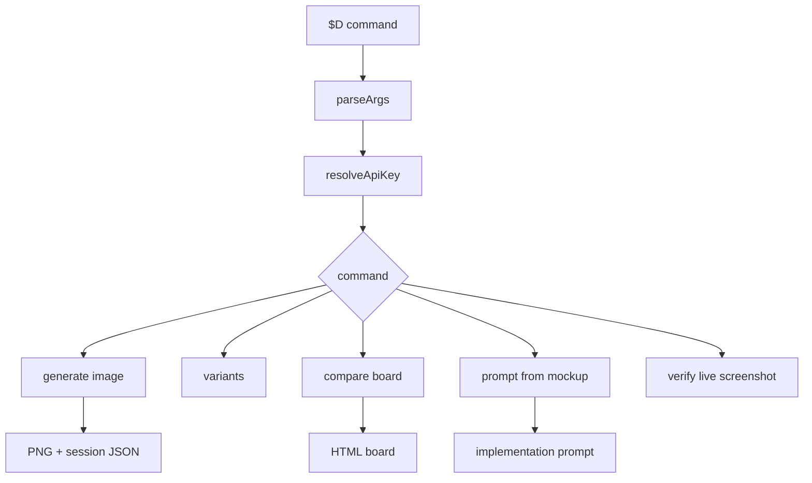
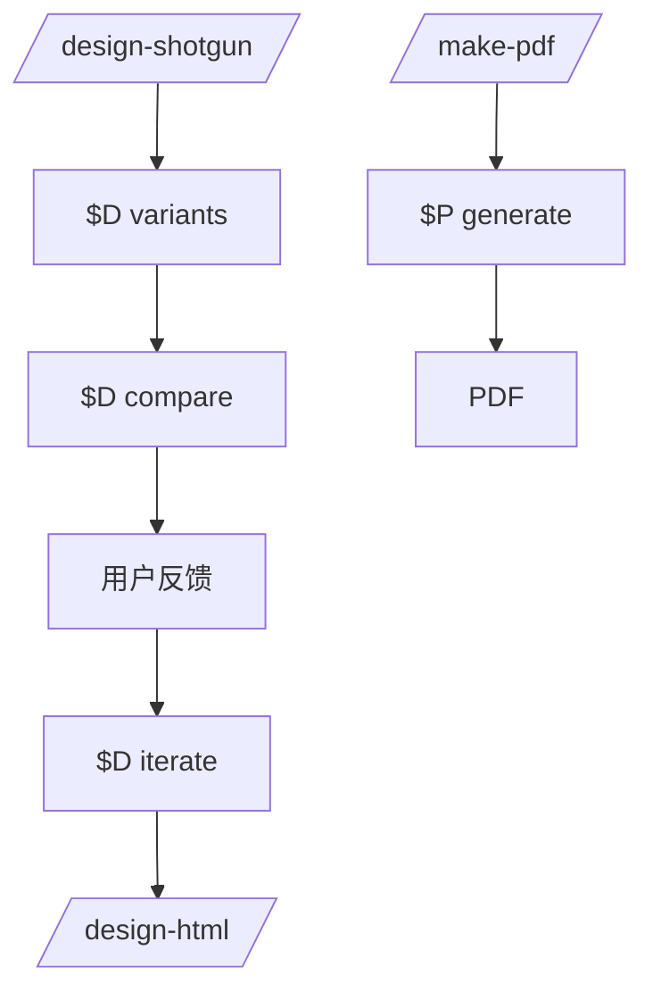

<details>
<summary>相关源文件</summary>

生成本页时使用的主要源文件：

- [README.md](../../../project-repos/gstack/README.md)
- [design/src/cli.ts](../../../project-repos/gstack/design/src/cli.ts)
- [design/src/commands.ts](../../../project-repos/gstack/design/src/commands.ts)
- [design/src/generate.ts](../../../project-repos/gstack/design/src/generate.ts)
- [design/src/design-to-code.ts](../../../project-repos/gstack/design/src/design-to-code.ts)
- [make-pdf/src/cli.ts](../../../project-repos/gstack/make-pdf/src/cli.ts)
- [make-pdf/SKILL.md](../../../project-repos/gstack/make-pdf/SKILL.md)

</details>

# 设计与 PDF 工具

除了 Browse，gstack 还内置了两个面向产物的二进制工具：`design` 负责 AI mockup、视觉比较和 design-to-code prompt；`make-pdf` 负责把 Markdown 转为出版质量 PDF。README 把 design-shotgun → design-html 描述为并行 sprint 的关键能力。Sources: [README.md:259-268](../../../project-repos/gstack/README.md#L259-L268), [package.json:7-19](../../../project-repos/gstack/package.json#L7-L19)

<details class="source-snippets">
<summary>引用源码</summary>

<!-- source-snippets:start -->

#### `README.md:259-268`

```markdown
## Parallel sprints

gstack works well with one sprint. It gets interesting with ten running at once.

**Design is at the heart.** `/design-consultation` builds your design system from scratch, researches what's out there, proposes creative risks, and writes `DESIGN.md`. But the real magic is the shotgun-to-HTML pipeline.

**`/design-shotgun` is how you explore.** You describe what you want. It generates 4-6 AI mockup variants using GPT Image. Then it opens a comparison board in your browser with all variants side by side. You pick favorites, leave feedback ("more whitespace", "bolder headline", "lose the gradient"), and it generates a new round. Repeat until you love something. Taste memory kicks in after a few rounds so it starts biasing toward what you actually like. No more describing your vision in words and hoping the AI gets it. You see options, pick the good ones, and iterate visually.

**`/design-html` makes it real.** Take that approved mockup (from `/design-shotgun`, a CEO plan, a design review, or just a description) and turn it into production-quality HTML/CSS. Not the kind of AI HTML that looks fine at one viewport width and breaks everywhere else. This uses Pretext for computed text layout: text actually reflows on resize, heights adjust to content, layouts are dynamic. 30KB overhead, zero dependencies. It detects your framework (React, Svelte, Vue) and outputs the right format. Smart API routing picks different Pretext patterns depending on whether it's a landing page, dashboard, form, or card layout. The output is something you'd actually ship, not a demo.

```

#### `package.json:7-19`

```json
  "bin": {
    "browse": "./browse/dist/browse",
    "make-pdf": "./make-pdf/dist/pdf"
  },
  "scripts": {
    "build": "bun run vendor:xterm && bun run gen:skill-docs --host all; bun build --compile browse/src/cli.ts --outfile browse/dist/browse && bun build --compile browse/src/find-browse.ts --outfile browse/dist/find-browse && bun build --compile design/src/cli.ts --outfile design/dist/design && bun build --compile make-pdf/src/cli.ts --outfile make-pdf/dist/pdf && bun build --compile bin/gstack-global-discover.ts --outfile bin/gstack-global-discover && bash browse/scripts/build-node-server.sh && git rev-parse HEAD > browse/dist/.version && git rev-parse HEAD > design/dist/.version && git rev-parse HEAD > make-pdf/dist/.version && chmod +x browse/dist/browse browse/dist/find-browse design/dist/design make-pdf/dist/pdf bin/gstack-global-discover && (rm -f .*.bun-build || true)",
    "vendor:xterm": "mkdir -p extension/lib && cp node_modules/xterm/lib/xterm.js extension/lib/xterm.js && cp node_modules/xterm/css/xterm.css extension/lib/xterm.css && cp node_modules/xterm-addon-fit/lib/xterm-addon-fit.js extension/lib/xterm-addon-fit.js",
    "dev:make-pdf": "bun run make-pdf/src/cli.ts",
    "dev:design": "bun run design/src/cli.ts",
    "gen:skill-docs": "bun run scripts/gen-skill-docs.ts",
    "dev": "bun run browse/src/cli.ts",
    "server": "bun run browse/src/server.ts",
    "test": "bun test browse/test/ test/ make-pdf/test/ --ignore 'test/skill-e2e-*.test.ts' --ignore test/skill-llm-eval.test.ts --ignore test/skill-routing-e2e.test.ts --ignore test/codex-e2e.test.ts --ignore test/gemini-e2e.test.ts && (bun run slop:diff 2>/dev/null || true)",
```

<!-- source-snippets:end -->
</details>

## Design CLI

`design/src/cli.ts` 明确说明它是 stateless CLI：每次调用解析参数、解析 OpenAI auth、执行 API 调用并写入 PNG/HTML，多轮迭代状态保存在 `/tmp` JSON 文件里。Sources: [design/src/cli.ts:1-13](../../../project-repos/gstack/design/src/cli.ts#L1-L13)

<details class="source-snippets">
<summary>引用源码</summary>

<!-- source-snippets:start -->

#### `design/src/cli.ts:1-13`

```typescript
/**
 * gstack design CLI — stateless CLI for AI-powered design generation.
 *
 * Unlike the browse binary (persistent Chromium daemon), the design binary
 * is stateless: each invocation makes API calls and writes files. Session
 * state for multi-turn iteration is a JSON file in /tmp.
 *
 * Flow:
 *   1. Parse command + flags from argv
 *   2. Resolve auth (~/. gstack/openai.json → OPENAI_API_KEY → guided setup)
 *   3. Execute command (API call → write PNG/HTML)
 *   4. Print result JSON to stdout
 */
```

<!-- source-snippets:end -->
</details>



命令 registry 覆盖 `generate`、`variants`、`iterate`、`check`、`compare`、`diff`、`evolve`、`verify`、`prompt`、`extract`、`gallery`、`serve`、`setup`。Sources: [design/src/commands.ts:12-82](../../../project-repos/gstack/design/src/commands.ts#L12-L82), [design/src/cli.ts:118-254](../../../project-repos/gstack/design/src/cli.ts#L118-L254)

<details class="source-snippets">
<summary>引用源码</summary>

<!-- source-snippets:start -->

#### `design/src/commands.ts:12-82`

```typescript
export const COMMANDS = new Map<string, {
  description: string;
  usage: string;
  flags?: string[];
}>([
  ["generate", {
    description: "Generate a UI mockup from a design brief",
    usage: "generate --brief \"...\" --output /path.png",
    flags: ["--brief", "--brief-file", "--output", "--check", "--retry", "--size", "--quality"],
  }],
  ["variants", {
    description: "Generate N design variants from a brief",
    usage: "variants --brief \"...\" --count 3 --output-dir /path/",
    flags: ["--brief", "--brief-file", "--count", "--output-dir", "--size", "--quality", "--viewports"],
  }],
  ["iterate", {
    description: "Iterate on an existing mockup with feedback",
    usage: "iterate --session /path/session.json --feedback \"...\" --output /path.png",
    flags: ["--session", "--feedback", "--output"],
  }],
  ["check", {
    description: "Vision-based quality check on a mockup",
    usage: "check --image /path.png --brief \"...\"",
    flags: ["--image", "--brief"],
  }],
  ["compare", {
    description: "Generate HTML comparison board for user review",
    usage: "compare --images /path/*.png --output /path/board.html [--serve]",
    flags: ["--images", "--output", "--serve", "--timeout"],
  }],
  ["diff", {
    description: "Visual diff between two mockups",
    usage: "diff --before old.png --after new.png",
    flags: ["--before", "--after", "--output"],
  }],
  ["evolve", {
    description: "Generate improved mockup from existing screenshot",
    usage: "evolve --screenshot current.png --brief \"make it calmer\" --output /path.png",
    flags: ["--screenshot", "--brief", "--output"],
  }],
  ["verify", {
    description: "Compare live site screenshot against approved mockup",
    usage: "verify --mockup approved.png --screenshot live.png",
    flags: ["--mockup", "--screenshot", "--output"],
  }],
  ["prompt", {
    description: "Generate structured implementation prompt from approved mockup",
    usage: "prompt --image approved.png",
    flags: ["--image"],
  }],
  ["extract", {
    description: "Extract design language from approved mockup into DESIGN.md",
    usage: "extract --image approved.png",
    flags: ["--image"],
  }],
  ["gallery", {
    description: "Generate HTML timeline of all design explorations for a project",
    usage: "gallery --designs-dir ~/.gstack/projects/$SLUG/designs/ --output /path/gallery.html",
    flags: ["--designs-dir", "--output"],
  }],
  ["serve", {
    description: "Serve comparison board over HTTP and collect user feedback",
    usage: "serve --html /path/board.html [--timeout 600]",
    flags: ["--html", "--timeout"],
  }],
  ["setup", {
    description: "Guided API key setup + smoke test",
    usage: "setup",
    flags: [],
  }],
]);
```

#### `design/src/cli.ts:118-254`

```typescript
  switch (command) {
    case "generate":
      await generate({
        brief: flags.brief as string,
        briefFile: flags["brief-file"] as string,
        output: (flags.output as string) || "/tmp/gstack-mockup.png",
        check: !!flags.check,
        retry: flags.retry ? parseInt(flags.retry as string) : 0,
        size: flags.size as string,
        quality: flags.quality as string,
      });
      break;

    case "check":
      await checkCommand(flags.image as string, flags.brief as string);
      break;

    case "compare": {
      // Parse --images as glob or multiple files
      const imagesArg = flags.images as string;
      const images = await resolveImagePaths(imagesArg);
      const outputPath = (flags.output as string) || "/tmp/gstack-design-board.html";
      compare({ images, output: outputPath });
      // If --serve flag is set, start HTTP server for the board
      if (flags.serve) {
        await serve({
          html: outputPath,
          timeout: flags.timeout ? parseInt(flags.timeout as string) : 600,
        });
      }
      break;
    }

    case "prompt": {
      const promptImage = flags.image as string;
      if (!promptImage) {
        console.error("--image is required");
        process.exit(1);
      }
      console.error(`Generating implementation prompt from ${promptImage}...`);
      const proc2 = Bun.spawn(["git", "rev-parse", "--show-toplevel"]);
      const root = (await new Response(proc2.stdout).text()).trim();
      const d2c = await generateDesignToCodePrompt(promptImage, root || undefined);
      console.log(JSON.stringify(d2c, null, 2));
      break;
    }

    case "setup":
      await runSetup();
      break;

    case "variants":
      await variants({
        brief: flags.brief as string,
        briefFile: flags["brief-file"] as string,
        count: flags.count ? parseInt(flags.count as string) : 3,
        outputDir: (flags["output-dir"] as string) || "/tmp/gstack-variants/",
        size: flags.size as string,
        quality: flags.quality as string,
        viewports: flags.viewports as string,
      });
      break;

    case "iterate":
      await iterate({
        session: flags.session as string,
        feedback: flags.feedback as string,
        output: (flags.output as string) || "/tmp/gstack-iterate.png",
      });
      break;

    case "extract": {
      const imagePath = flags.image as string;
      if (!imagePath) {
        console.error("--image is required");
        process.exit(1);
      }
      console.error(`Extracting design language from ${imagePath}...`);
      const extracted = await extractDesignLanguage(imagePath);
      const proc = Bun.spawn(["git", "rev-parse", "--show-toplevel"]);
      const repoRoot = (await new Response(proc.stdout).text()).trim();
      if (repoRoot) {
        updateDesignMd(repoRoot, extracted, imagePath);
      }
      console.log(JSON.stringify(extracted, null, 2));
      break;
    }

    case "diff": {
      const before = flags.before as string;
      const after = flags.after as string;
      if (!before || !after) {
        console.error("--before and --after are required");
        process.exit(1);
      }
      console.error(`Comparing ${before} vs ${after}...`);
      const diffResult = await diffMockups(before, after);
      console.log(JSON.stringify(diffResult, null, 2));
      break;
    }

    case "verify": {
      const mockup = flags.mockup as string;
      const screenshot = flags.screenshot as string;
      if (!mockup || !screenshot) {
        console.error("--mockup and --screenshot are required");
        process.exit(1);
      }
      console.error(`Verifying implementation against approved mockup...`);
      const verifyResult = await verifyAgainstMockup(mockup, screenshot);
      console.error(`Match: ${verifyResult.matchScore}/100 — ${verifyResult.pass ? "PASS" : "FAIL"}`);
      console.log(JSON.stringify(verifyResult, null, 2));
      break;
    }

    case "evolve":
      await evolve({
        screenshot: flags.screenshot as string,
        brief: flags.brief as string,
        output: (flags.output as string) || "/tmp/gstack-evolved.png",
... snippet truncated ...
```

<!-- source-snippets:end -->
</details>

## 图像生成与实现提示

`generate.ts` 使用 OpenAI Responses API 的 `image_generation` tool，默认生成 `1536x1024`、`high` quality，并可选做视觉质量检查和重试。`design-to-code.ts` 则用 GPT-4o vision 从批准的 mockup 中提取颜色、排版、布局和组件，输出 JSON 结构化实现提示。Sources: [design/src/generate.ts:29-92](../../../project-repos/gstack/design/src/generate.ts#L29-L92), [design/src/generate.ts:97-160](../../../project-repos/gstack/design/src/generate.ts#L97-L160), [design/src/design-to-code.ts:1-18](../../../project-repos/gstack/design/src/design-to-code.ts#L1-L18), [design/src/design-to-code.ts:22-88](../../../project-repos/gstack/design/src/design-to-code.ts#L22-L88)

<details class="source-snippets">
<summary>引用源码</summary>

<!-- source-snippets:start -->

#### `design/src/generate.ts:29-92`

```typescript
/**
 * Call OpenAI Responses API with image_generation tool.
 * Returns the response ID and base64 image data.
 */
async function callImageGeneration(
  apiKey: string,
  prompt: string,
  size: string,
  quality: string,
): Promise<{ responseId: string; imageData: string }> {
  const controller = new AbortController();
  const timeout = setTimeout(() => controller.abort(), 120_000);

  try {
    const response = await fetch("https://api.openai.com/v1/responses", {
      method: "POST",
      headers: {
        "Authorization": `Bearer ${apiKey}`,
        "Content-Type": "application/json",
      },
      body: JSON.stringify({
        model: "gpt-4o",
        input: prompt,
        tools: [{
          type: "image_generation",
          size,
          quality,
        }],
      }),
      signal: controller.signal,
    });

    if (!response.ok) {
      const error = await response.text();
      if (response.status === 403 && error.includes("organization must be verified")) {
        throw new Error(
          "OpenAI organization verification required.\n"
          + "Go to https://platform.openai.com/settings/organization to verify.\n"
          + "After verification, wait up to 15 minutes for access to propagate.",
        );
      }
      throw new Error(`API error (${response.status}): ${error.slice(0, 200)}`);
    }

    const data = await response.json() as any;

    const imageItem = data.output?.find((item: any) =>
      item.type === "image_generation_call"
    );

    if (!imageItem?.result) {
      throw new Error(
        `No image data in response. Output types: ${data.output?.map((o: any) => o.type).join(", ") || "none"}`
      );
    }

    return {
      responseId: data.id,
      imageData: imageItem.result,
    };
  } finally {
    clearTimeout(timeout);
  }
}
```

#### `design/src/generate.ts:97-160`

```typescript
export async function generate(options: GenerateOptions): Promise<GenerateResult> {
  const apiKey = requireApiKey();

  // Parse the brief
  const prompt = options.briefFile
    ? parseBrief(options.briefFile, true)
    : parseBrief(options.brief!, false);

  const size = options.size || "1536x1024";
  const quality = options.quality || "high";
  const maxRetries = options.retry ?? 0;

  let lastResult: GenerateResult | null = null;

  for (let attempt = 0; attempt <= maxRetries; attempt++) {
    if (attempt > 0) {
      console.error(`Retry ${attempt}/${maxRetries}...`);
    }

    // Generate the image
    const startTime = Date.now();
    const { responseId, imageData } = await callImageGeneration(apiKey, prompt, size, quality);
    const elapsed = ((Date.now() - startTime) / 1000).toFixed(1);

    // Write to disk
    const outputDir = path.dirname(options.output);
    fs.mkdirSync(outputDir, { recursive: true });
    const imageBuffer = Buffer.from(imageData, "base64");
    fs.writeFileSync(options.output, imageBuffer);

    // Create session
    const session = createSession(responseId, prompt, options.output);

    console.error(`Generated (${elapsed}s, ${(imageBuffer.length / 1024).toFixed(0)}KB) → ${options.output}`);

    lastResult = {
      outputPath: options.output,
      sessionFile: sessionPath(session.id),
      responseId,
    };

    // Quality check if requested
    if (options.check) {
      const checkResult = await checkMockup(options.output, prompt);
      lastResult.checkResult = checkResult;

      if (checkResult.pass) {
        console.error(`Quality check: PASS`);
        break;
      } else {
        console.error(`Quality check: FAIL — ${checkResult.issues}`);
        if (attempt < maxRetries) {
          console.error("Will retry...");
        }
      }
    } else {
      break;
    }
  }

  // Output result as JSON to stdout
  console.log(JSON.stringify(lastResult, null, 2));
  return lastResult!;
}
```

#### `design/src/design-to-code.ts:1-18`

```typescript
/**
 * Design-to-Code Prompt Generator.
 * Extracts implementation instructions from an approved mockup via GPT-4o vision.
 * Produces a structured prompt the agent can use to implement the design.
 */

import fs from "fs";
import { requireApiKey } from "./auth";
import { readDesignConstraints } from "./memory";

export interface DesignToCodeResult {
  implementationPrompt: string;
  colors: string[];
  typography: string[];
  layout: string[];
  components: string[];
}

```

#### `design/src/design-to-code.ts:22-88`

```typescript
export async function generateDesignToCodePrompt(
  imagePath: string,
  repoRoot?: string,
): Promise<DesignToCodeResult> {
  const apiKey = requireApiKey();
  const imageData = fs.readFileSync(imagePath).toString("base64");

  // Read DESIGN.md if available for additional context
  const designConstraints = repoRoot ? readDesignConstraints(repoRoot) : null;

  const controller = new AbortController();
  const timeout = setTimeout(() => controller.abort(), 60_000);

  try {
    const contextBlock = designConstraints
      ? `\n\nExisting DESIGN.md (use these as constraints):\n${designConstraints}`
      : "";

    const response = await fetch("https://api.openai.com/v1/chat/completions", {
      method: "POST",
      headers: {
        "Authorization": `Bearer ${apiKey}`,
        "Content-Type": "application/json",
      },
      body: JSON.stringify({
        model: "gpt-4o",
        messages: [{
          role: "user",
          content: [
            {
              type: "image_url",
              image_url: { url: `data:image/png;base64,${imageData}` },
            },
            {
              type: "text",
              text: `Analyze this approved UI mockup and generate a structured implementation prompt. Return valid JSON only:

{
  "implementationPrompt": "A detailed paragraph telling a developer exactly how to build this UI. Include specific CSS values, layout approach (flex/grid), component structure, and interaction behaviors. Reference the specific elements visible in the mockup.",
  "colors": ["#hex - usage", ...],
  "typography": ["role: family, size, weight", ...],
  "layout": ["description of layout pattern", ...],
  "components": ["component name - description", ...]
}

Be specific about every visual detail: exact hex colors, font sizes in px, spacing values, border-radius, shadows. The developer should be able to implement this without looking at the mockup again.${contextBlock}`,
            },
          ],
        }],
        max_tokens: 1000,
        response_format: { type: "json_object" },
      }),
      signal: controller.signal,
    });

    if (!response.ok) {
      const error = await response.text();
      throw new Error(`API error (${response.status}): ${error.slice(0, 200)}`);
    }

    const data = await response.json() as any;
    const content = data.choices?.[0]?.message?.content?.trim() || "";
    return JSON.parse(content) as DesignToCodeResult;
  } finally {
    clearTimeout(timeout);
  }
}
```

<!-- source-snippets:end -->
</details>

## make-pdf CLI

`make-pdf/src/cli.ts` 的输出契约很严格：成功时 stdout 只输出路径，stderr 输出进度和错误；exit code 区分 bad args、render error、Paged.js timeout、browse unavailable。CLI 支持 cover、TOC、page numbers、tagged PDF、outline、watermark、header/footer template、network control 等。Sources: [make-pdf/src/cli.ts:1-11](../../../project-repos/gstack/make-pdf/src/cli.ts#L1-L11), [make-pdf/src/cli.ts:56-99](../../../project-repos/gstack/make-pdf/src/cli.ts#L56-L99), [make-pdf/src/cli.ts:174-253](../../../project-repos/gstack/make-pdf/src/cli.ts#L174-L253)

<details class="source-snippets">
<summary>引用源码</summary>

<!-- source-snippets:start -->

#### `make-pdf/src/cli.ts:1-11`

```typescript
#!/usr/bin/env bun
/**
 * make-pdf CLI — argv parse, dispatch, exit.
 *
 * Output contract (per CEO plan DX spec):
 *   stdout: ONLY the output path on success. One line. Nothing else.
 *   stderr: progress spinner per stage, final "Done in Xs. N pages."
 *   --quiet: suppress progress. Errors still print.
 *   --verbose: per-stage timings.
 *   exit 0 success / 1 bad args / 2 render error / 3 Paged.js timeout / 4 browse unavailable.
 */
```

#### `make-pdf/src/cli.ts:56-99`

```typescript
function printUsage(): void {
  const lines = [
    "make-pdf — turn markdown into publication-quality PDFs",
    "",
    "Usage:",
  ];
  for (const [name, info] of COMMANDS) {
    lines.push(`  $P ${info.usage}`);
    lines.push(`      ${info.description}`);
  }
  lines.push("");
  lines.push("Page layout:");
  lines.push("  --margins <dim>           All four margins (default: 1in). in, pt, cm, mm.");
  lines.push("  --page-size letter|a4|legal  (aliases: --format)");
  lines.push("");
  lines.push("Document structure:");
  lines.push("  --cover                   Add a cover page.");
  lines.push("  --toc                     Generate clickable table of contents.");
  lines.push("  --no-chapter-breaks       Don't start a new page at every H1.");
  lines.push("");
  lines.push("Branding:");
  lines.push("  --watermark <text>        Diagonal watermark on every page.");
  lines.push("  --header-template <html>");
  lines.push("  --footer-template <html>  Mutex with --page-numbers.");
  lines.push("  --no-confidential         Suppress the CONFIDENTIAL footer.");
  lines.push("");
  lines.push("Output control:");
  lines.push("  --page-numbers / --no-page-numbers   (default: on)");
  lines.push("  --tagged / --no-tagged               (default: on, accessible PDF)");
  lines.push("  --outline / --no-outline             (default: on, PDF bookmarks)");
  lines.push("  --quiet                   Suppress progress on stderr.");
  lines.push("  --verbose                 Per-stage timings on stderr.");
  lines.push("");
  lines.push("Network:");
  lines.push("  --allow-network           Load external images (off by default).");
  lines.push("");
  lines.push("Examples:");
  lines.push("  $P generate letter.md");
  lines.push("  $P generate --cover --toc essay.md essay.pdf");
  lines.push("  $P generate --watermark DRAFT memo.md draft.pdf");
  lines.push("  $P preview letter.md");
  lines.push("");
  lines.push("Run `$P setup` to verify browse + Chromium + pdftotext install.");
  console.error(lines.join("\n"));
```

#### `make-pdf/src/cli.ts:174-253`

```typescript
async function main(): Promise<void> {
  const parsed = parseArgs(process.argv);

  if (!parsed.command) {
    printUsage();
    process.exit(ExitCode.BadArgs);
  }

  if (!COMMANDS.has(parsed.command)) {
    console.error(`$P: unknown command: ${parsed.command}`);
    console.error("");
    printUsage();
    process.exit(ExitCode.BadArgs);
  }

  try {
    switch (parsed.command) {
      case "version": {
        // Read from VERSION file or fall back to a hard-coded default.
        try {
          const fs = await import("node:fs");
          const path = await import("node:path");
          const versionFile = path.resolve(
            path.dirname(process.argv[1] || ""),
            "../../VERSION",
          );
          const version = fs.readFileSync(versionFile, "utf8").trim();
          console.log(version);
        } catch {
          console.log("make-pdf (version unknown)");
        }
        process.exit(ExitCode.Success);
      }

      case "setup": {
        const { runSetup } = await import("./setup");
        await runSetup();
        process.exit(ExitCode.Success);
      }

      case "generate": {
        const opts = generateOptionsFromFlags(parsed);
        const { generate } = await import("./orchestrator");
        const outputPath = await generate(opts);
        // Contract: stdout = output path only
        console.log(outputPath);
        process.exit(ExitCode.Success);
      }

      case "preview": {
        const opts = previewOptionsFromFlags(parsed);
        const { preview } = await import("./orchestrator");
        const htmlPath = await preview(opts);
        console.log(htmlPath);
        process.exit(ExitCode.Success);
      }

      default:
        // Unreachable: COMMANDS.has guarded above
        process.exit(ExitCode.BadArgs);
    }
  } catch (err: any) {
    if (err instanceof BrowseClientError) {
      console.error(`$P: ${err.message}`);
      process.exit(ExitCode.BrowseUnavailable);
    }
    if (err?.code === "ENOENT") {
      console.error(`$P: file not found: ${err.path ?? err.message}`);
      process.exit(ExitCode.BadArgs);
    }
    if (err?.name === "PagedJsTimeout") {
      console.error(`$P: ${err.message}`);
      process.exit(ExitCode.PagedJsTimeout);
    }
    console.error(`$P: ${err?.message ?? String(err)}`);
    if (parsed.flags.verbose && err?.stack) {
      console.error(err.stack);
    }
    process.exit(ExitCode.RenderError);
  }
```

<!-- source-snippets:end -->
</details>

## 与技能层的关系



`make-pdf/SKILL.md` 是生成技能，要求把 Markdown 变成“finished artifact”，而不只是草稿；设计技能则通过 `$D` 二进制把 mockup、比较板和实现提示接入代理工作流。Sources: [make-pdf/SKILL.md:1-23](../../../project-repos/gstack/make-pdf/SKILL.md#L1-L23), [README.md:263-268](../../../project-repos/gstack/README.md#L263-L268)

<details class="source-snippets">
<summary>引用源码</summary>

<!-- source-snippets:start -->

#### `make-pdf/SKILL.md:1-23`

```markdown
---
name: make-pdf
preamble-tier: 1
version: 1.0.0
description: |
  Turn any markdown file into a publication-quality PDF. Proper 1in margins,
  intelligent page breaks, page numbers, cover pages, running headers, curly
  quotes and em dashes, clickable TOC, diagonal DRAFT watermark. Not a draft
  artifact — a finished artifact. Use when asked to "make a PDF", "export to
  PDF", "turn this markdown into a PDF", or "generate a document". (gstack)
  Voice triggers (speech-to-text aliases): "make this a pdf", "make it a pdf", "export to pdf", "turn this into a pdf", "turn this markdown into a pdf", "generate a pdf", "make a pdf from", "pdf this markdown".
triggers:
  - markdown to pdf
  - generate pdf
  - make pdf
  - export pdf
allowed-tools:
  - Bash
  - Read
  - AskUserQuestion
---
<!-- AUTO-GENERATED from SKILL.md.tmpl — do not edit directly -->
<!-- Regenerate: bun run gen:skill-docs -->
```

#### `README.md:263-268`

```markdown
**Design is at the heart.** `/design-consultation` builds your design system from scratch, researches what's out there, proposes creative risks, and writes `DESIGN.md`. But the real magic is the shotgun-to-HTML pipeline.

**`/design-shotgun` is how you explore.** You describe what you want. It generates 4-6 AI mockup variants using GPT Image. Then it opens a comparison board in your browser with all variants side by side. You pick favorites, leave feedback ("more whitespace", "bolder headline", "lose the gradient"), and it generates a new round. Repeat until you love something. Taste memory kicks in after a few rounds so it starts biasing toward what you actually like. No more describing your vision in words and hoping the AI gets it. You see options, pick the good ones, and iterate visually.

**`/design-html` makes it real.** Take that approved mockup (from `/design-shotgun`, a CEO plan, a design review, or just a description) and turn it into production-quality HTML/CSS. Not the kind of AI HTML that looks fine at one viewport width and breaks everywhere else. This uses Pretext for computed text layout: text actually reflows on resize, heights adjust to content, layouts are dynamic. 30KB overhead, zero dependencies. It detects your framework (React, Svelte, Vue) and outputs the right format. Smart API routing picks different Pretext patterns depending on whether it's a landing page, dashboard, form, or card layout. The output is something you'd actually ship, not a demo.

```

<!-- source-snippets:end -->
</details>

## 相关页面

- [技能工作流](skill-workflow.md)
- [Browse 运行时](browse-runtime.md)
- [测试、CI 与质量门](testing-ci-quality.md)
