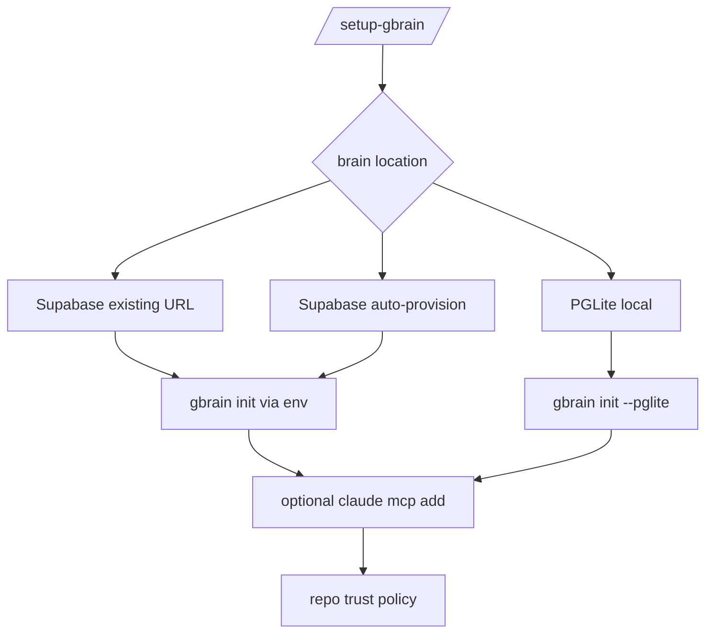
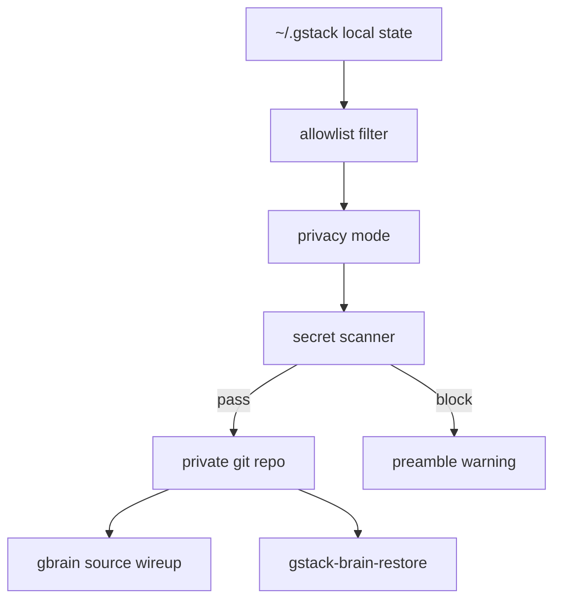

<details>
<summary>相关源文件</summary>

生成本页时使用的主要源文件：

- [README.md](https://github.com/garrytan/gstack/blob/454423aeb3d3dafa88d5b57bfbe0ead05569d21e/README.md)
- [USING_GBRAIN_WITH_GSTACK.md](https://github.com/garrytan/gstack/blob/454423aeb3d3dafa88d5b57bfbe0ead05569d21e/USING_GBRAIN_WITH_GSTACK.md)
- [docs/gbrain-sync.md](https://github.com/garrytan/gstack/blob/454423aeb3d3dafa88d5b57bfbe0ead05569d21e/docs/gbrain-sync.md)
- [bin/gstack-brain-init](https://github.com/garrytan/gstack/tree/454423aeb3d3dafa88d5b57bfbe0ead05569d21e/bin/gstack-brain-init)
- [setup-gbrain/SKILL.md](https://github.com/garrytan/gstack/blob/454423aeb3d3dafa88d5b57bfbe0ead05569d21e/setup-gbrain/SKILL.md)

</details>

# GBrain 与记忆系统

gstack 的记忆分两层：GBrain 是外部持久知识库，`/setup-gbrain` 负责安装、初始化和 MCP 注册；GStack memory sync 则把 `~/.gstack/` 中的 allowlisted 状态同步到私有 git repo，供跨机器恢复和 GBrain 索引。Sources: [README.md:372-405](../../../project-repos/gstack/README.md#L372-L405), [USING_GBRAIN_WITH_GSTACK.md:1-18](../../../project-repos/gstack/USING_GBRAIN_WITH_GSTACK.md#L1-L18), [USING_GBRAIN_WITH_GSTACK.md:110-128](../../../project-repos/gstack/USING_GBRAIN_WITH_GSTACK.md#L110-L128)

<details class="source-snippets">
<summary>引用源码</summary>

<!-- source-snippets:start -->

#### `README.md:372-405`

````markdown
## GBrain — persistent knowledge for your coding agent

[GBrain](https://github.com/garrytan/gbrain) is a persistent knowledge base for AI agents — think of it as the memory your agent actually keeps between sessions. GStack gives you a one-command path from zero to "it's running, my agent can call it."

```bash
/setup-gbrain
```

Three paths, pick one:

- **Supabase, existing URL** — your cloud agent already provisioned a brain; paste the Session Pooler URL, now this laptop uses the same data.
- **Supabase, auto-provision** — paste a Supabase Personal Access Token; the skill creates a new project, polls to healthy, fetches the pooler URL, hands it to `gbrain init`. ~90 seconds end-to-end.
- **PGLite local** — zero accounts, zero network, ~30 seconds. Isolated brain on this Mac only. Great for try-first; migrate to Supabase later with `/setup-gbrain --switch`.

After init, the skill offers to register gbrain as an MCP server for Claude Code (`claude mcp add gbrain -- gbrain serve`) so `gbrain search`, `gbrain put_page`, etc. show up as first-class typed tools — not bash shell-outs.

**Per-remote trust policy.** Each repo on your machine gets one of three tiers:

- `read-write` — agent can search the brain AND write new pages back from this repo
- `read-only` — agent can search but never writes (best for multi-client consultants: search the shared brain, don't contaminate it with Client A's work while in Client B's repo)
- `deny` — no gbrain interaction at all

The skill asks once per repo. The decision is sticky across worktrees and branches of the same remote.

**GStack memory sync (different feature, same private-repo infra).** Optionally pushes your gstack state (learnings, CEO plans, design docs, retros, developer profile) to a private git repo so your memory follows you across machines, with a one-time privacy prompt (everything allowlisted / artifacts only / off) and a defense-in-depth secret scanner that blocks AWS keys, tokens, PEM blocks, and JWTs before they leave your machine.

```bash
gstack-brain-init
```

**Full monty — every scenario, every flag, every bin helper, every troubleshooting step:** [USING_GBRAIN_WITH_GSTACK.md](USING_GBRAIN_WITH_GSTACK.md)

Other references: [docs/gbrain-sync.md](docs/gbrain-sync.md) (sync-specific guide) • [docs/gbrain-sync-errors.md](docs/gbrain-sync-errors.md) (error index)

````

#### `USING_GBRAIN_WITH_GSTACK.md:1-18`

````markdown
# Using GBrain with GStack

Your coding agent, with a memory it actually keeps.

[GBrain](https://github.com/garrytan/gbrain) is a persistent knowledge base designed for AI agents. It stores what your agent learns, what you've decided, what worked and what didn't, and lets the agent search all of it on demand. GStack gives you a one-command path from zero to "gbrain is running, and my agent can call it" — with paths for try-it-local, share-with-your-team, and everything between.

This is the full monty: every scenario, every flag, every helper bin, every troubleshooting step. For the quick pitch, see the [README's GBrain section](README.md#gbrain--persistent-knowledge-for-your-coding-agent). For error codes and sync-specific issues, see [docs/gbrain-sync.md](docs/gbrain-sync.md).

---

## The one-command install

```bash
/setup-gbrain
```

That's it. The skill detects your current state, asks three questions at most, and walks you through install, init, MCP registration for Claude Code, and per-repo trust policy. On a clean Mac with nothing installed it finishes in under five minutes. On a Mac where something's already set up it takes seconds (it detects the existing state and skips done work).

````

#### `USING_GBRAIN_WITH_GSTACK.md:110-128`

````markdown
## GStack memory sync (a separate concern)

This is different from gbrain itself. Your gstack state (`~/.gstack/` — learnings, plans, retros, timeline, developer profile) is machine-local by default. "GStack memory sync" optionally pushes a curated, secret-scanned subset to a private git repo so your memory follows you across machines — and, if you're running gbrain, that git repo becomes indexable there too.

Turn it on with:

```bash
gstack-brain-init
```

You'll get a one-time privacy prompt: **everything allowlisted** / **artifacts only** (plans, designs, retros, learnings — skip behavioral data like timelines) / **off**. Every skill run syncs the queue at start and end — no daemon, no background process.

Secret-shaped content (AWS keys, GitHub tokens, PEM blocks, JWTs, bearer tokens) is blocked from sync before it leaves your machine.

**On a new machine:** Copy `~/.gstack-brain-remote.txt` over, run `gstack-brain-restore`, and yesterday's learnings surface on today's laptop.

Full guide: [docs/gbrain-sync.md](docs/gbrain-sync.md). Error index: [docs/gbrain-sync-errors.md](docs/gbrain-sync-errors.md).

`/setup-gbrain` offers to wire this up for you at the end of initial setup — it's one more AskUserQuestion, and it integrates with the same private-repo infrastructure.
````

<!-- source-snippets:end -->
</details>
## `/setup-gbrain` 三条路径



文档列出三种初始化方式：已有 Supabase Session Pooler URL、自动 provision 新 Supabase 项目、PGLite 本地 brain。所有 secret 都通过环境变量或 echo-off 读取，避免出现在 argv 或 shell history。Sources: [USING_GBRAIN_WITH_GSTACK.md:19-67](../../../project-repos/gstack/USING_GBRAIN_WITH_GSTACK.md#L19-L67), [USING_GBRAIN_WITH_GSTACK.md:204-224](../../../project-repos/gstack/USING_GBRAIN_WITH_GSTACK.md#L204-L224)

<details class="source-snippets">
<summary>引用源码</summary>

<!-- source-snippets:start -->

#### `USING_GBRAIN_WITH_GSTACK.md:19-67`

````markdown
## The three paths

You pick one when the skill asks "Where should your brain live?"

### Path 1: Supabase, you already have a connection string

Best for: you (or a teammate's cloud agent) already provisioned a Supabase brain and you want this local machine to use the same data.

**What happens:** Paste the Session Pooler URL (Settings → Database → Connection Pooler → Session → copy URI, port 6543). The skill reads it with echo off, shows you a redacted preview (`aws-0-us-east-1.pooler.supabase.com:6543/postgres` — host visible, password masked), hands it to `gbrain init` via the `GBRAIN_DATABASE_URL` environment variable, and the URL is never written to argv or your shell history.

**Trust warning:** Pasting this URL gives your local Claude Code full read/write access to every page in the shared brain. If that's not the trust level you want, pick PGLite local (Path 3) instead and accept the brains are disjoint.

### Path 2a: Supabase, auto-provision a new project

Best for: fresh Supabase account, you want a clean new project with zero clicking.

**What happens:** You paste a Supabase Personal Access Token (PAT). The skill shows you the scope disclosure first — *the token grants full access to every project in your Supabase account, not just the one we're about to create*. It lists your organizations, asks which one and which region (default `us-east-1`), generates a database password, calls `POST /v1/projects`, polls `GET /v1/projects/{ref}` every 5 seconds until the project is `ACTIVE_HEALTHY` (180s timeout), fetches the pooler URL, hands it to `gbrain init`. End-to-end: ~90 seconds.

At the end: explicit reminder to revoke the PAT at https://supabase.com/dashboard/account/tokens. The skill already discarded it from memory.

**If you Ctrl-C mid-provision:** The SIGINT trap prints your in-flight project ref + a resume command. You can delete the orphan at the Supabase dashboard, or run `/setup-gbrain --resume-provision <ref>` to pick up where you left off.

### Path 2b: Supabase, create manually

Best for: you'd rather click through supabase.com yourself than paste a PAT.

**What happens:** The skill walks you through the four manual steps (signup → new project → wait ~2 min → copy Session Pooler URL), then takes over from Path 1's paste step. Same security treatment as Path 1.

### Path 3: PGLite local

Best for: try-it-first, no account, no cloud, no sharing. Or a dedicated "this Mac's brain" that stays isolated from any cloud agent.

**What happens:** `gbrain init --pglite`. Brain lives at `~/.gbrain/brain.pglite`. No network calls. Done in 30 seconds.

This is the best first choice if you just want to see what gbrain feels like before committing to cloud. You can always migrate later with `/setup-gbrain --switch`.

## MCP registration for Claude Code

By default the skill asks "Give Claude Code a typed tool surface for gbrain?" If you say yes, it runs:

```bash
claude mcp add gbrain -- gbrain serve
```

That registers gbrain's stdio MCP server with Claude Code. Now `gbrain search`, `gbrain put_page`, `gbrain get_page`, etc. show up as first-class tools in every session, not bash shell-outs.

**If `claude` is not on PATH**, the skill skips MCP registration gracefully with a manual-register hint. The CLI resolver still works from any skill that shells out to `gbrain` — MCP is an upgrade, not a prerequisite.

**Other local agents** (Cursor, Codex CLI, etc.) need their own MCP registration. The skill is Claude-Code-targeted for v1; other hosts can register `gbrain serve` manually in their own MCP config.
````

#### `USING_GBRAIN_WITH_GSTACK.md:204-224`

```markdown
## Security model

One rule for every secret this skill touches: **env var only, never argv, never logged, never written to disk by us.** The only persistent storage is gbrain's own `~/.gbrain/config.json` at mode 0600, which is gbrain's discipline, not ours.

**Enforced in code:**

- CI grep test in `test/skill-validation.test.ts` fails the build if `$SUPABASE_ACCESS_TOKEN` or `$GBRAIN_DATABASE_URL` appears in an argv position
- CI grep test fails if `--insecure`, `-k`, or `NODE_TLS_REJECT_UNAUTHORIZED=0` appear in `bin/gstack-gbrain-supabase-provision`
- `set +x` at the top of the provision helper prevents debug tracing from leaking PAT
- Telemetry payload contains only enumerated categorical values (scenario, install result, MCP opt-in, trust tier) — never free-form strings that could contain secrets

**Enforced via tests:**

- `test/secret-sink-harness.test.ts` runs every secret-handling bin with a seeded secret and asserts the seed never appears in any captured channel (stdout, stderr, files under `$HOME`, telemetry JSONL). Four match rules per seed: exact, URL-decoded, first-12-char prefix, base64.
- Positive controls in the same test file deliberately leak seeds in every covered channel and assert the harness catches each one. Without the positive controls, a harness that silently under-reports would look identical to a working harness.

**What you can still leak** (the honest limits of v1):

- If you paste a secret into a normal chat message outside `read -s`, it's in the conversation transcript and any host-side logging
- The leak harness doesn't dump subprocess environment — a bin that `env >> ~/.log` would evade detection (no bin in v1 does this; grep tests prevent it)
- Your shell's own `HISTFILE` behavior is your shell's, not ours — we never pass secrets to argv so they don't land there via our code, but nothing stops you from pasting one into a raw `curl` command yourself
```

<!-- source-snippets:end -->
</details>
## Per-remote trust triad

每个 repo 对 GBrain 有 `read-write`、`read-only`、`deny` 三档策略，按远端归一化后持久化到 `~/.gstack/gbrain-repo-policy.json`。这避免在客户仓库或敏感 repo 中把本地工作污染到共享 brain。Sources: [USING_GBRAIN_WITH_GSTACK.md:69-97](../../../project-repos/gstack/USING_GBRAIN_WITH_GSTACK.md#L69-L97)

<details class="source-snippets">
<summary>引用源码</summary>

<!-- source-snippets:start -->

#### `USING_GBRAIN_WITH_GSTACK.md:69-97`

````markdown
## Per-remote trust policy (the triad)

Every repo on your machine gets a policy decision: **read-write**, **read-only**, or **deny**.

- **read-write** — your agent can `gbrain search` from this repo's context AND write new pages back to the brain. Default for your own projects.
- **read-only** — your agent can search the brain but never writes new pages from this repo's sessions. Ideal for multi-client consultants: search the shared brain, don't contaminate it with Client A's code while you're in Client B's repo.
- **deny** — no gbrain interaction at all. The repo is invisible to gbrain tooling.

The skill asks once per repo the first time you run a gstack skill there. After that the decision is sticky — every worktree + branch of the same git remote shares the same policy, so you set it once and it follows you.

SSH and HTTPS remote variants collapse to the same key: `https://github.com/foo/bar.git` and `git@github.com:foo/bar.git` are the same repo.

**To change a policy:**

```bash
/setup-gbrain --repo      # re-prompt for this repo only

# Or directly:
~/.claude/skills/gstack/bin/gstack-gbrain-repo-policy set "github.com/foo/bar" read-only
```

**To see every policy:**

```bash
~/.claude/skills/gstack/bin/gstack-gbrain-repo-policy list
```

Storage: `~/.gstack/gbrain-repo-policy.json`, mode 0600, schema-versioned so future migrations stay deterministic.

````

<!-- source-snippets:end -->
</details>
## Memory sync

`gstack-brain-init` 把 `~/.gstack/` 初始化为 git repo，写入 ignore-everything base、allowlist、privacy map、gitattributes、JSONL merge driver 和 pre-commit secret scan hook，然后推送到私有 remote。Sources: [bin/gstack-brain-init:1-24](../../../project-repos/gstack/bin/gstack-brain-init#L1-L24), [bin/gstack-brain-init:141-240](../../../project-repos/gstack/bin/gstack-brain-init#L141-L240)

<details class="source-snippets">
<summary>引用源码</summary>

<!-- source-snippets:start -->

#### `bin/gstack-brain-init:1-24`

```
#!/usr/bin/env bash
# gstack-brain-init — set up ~/.gstack/ as a git repo that syncs to GBrain.
#
# Usage:
#   gstack-brain-init [--remote <url>]
#
# Interactive by default. Pass --remote to skip the remote prompt.
#
# Idempotent: safe to re-run. If ~/.gstack/.git already exists AND points at
# the same remote, reconfigures drivers/hooks/attributes without clobbering
# history. If it points at a DIFFERENT remote, refuses and suggests
# `gstack-brain-uninstall` first.
#
# What it does:
#   1. git init ~/.gstack/  (or verify existing repo points at the right remote)
#   2. Write .gitignore = "*"  (ignore everything; allowlist is explicit)
#   3. Write .brain-allowlist  (canonical paths to sync)
#   4. Write .brain-privacy-map.json  (paths → privacy class)
#   5. Write .gitattributes  (register JSONL + union merge drivers)
#   6. git config  merge.jsonl-append.driver + merge.union.driver
#   7. Install .git/hooks/pre-commit  (defense-in-depth secret scan)
#   8. Prompt for remote (default: gh repo create --private gstack-brain-$USER)
#   9. Initial commit + push
#   10. Write ~/.gstack-brain-remote.txt  (URL-only, safe to share)
```

#### `bin/gstack-brain-init:141-240`

```
# ---- write canonical files (idempotent) ----
cat > "$GSTACK_HOME/.gitignore" <<'EOF'
# gstack-brain sync: ignore-everything base. Paths are included explicitly via
# .brain-allowlist and `git add -f` from gstack-brain-sync. Do not edit.
*
EOF

cat > "$GSTACK_HOME/.brain-allowlist" <<'EOF'
# Canonical allowlist of paths that gstack-brain-sync will publish.
# One glob per line. Anything not matching stays local.
# Do not edit directly; managed by gstack-brain-init. User additions go below
# the marker and survive re-init.
projects/*/learnings.jsonl
projects/*/*-reviews.jsonl
projects/*/ceo-plans/*.md
projects/*/ceo-plans/*/*.md
projects/*/designs/*.md
projects/*/designs/*/*.md
projects/*/timeline.jsonl
retros/*.md
developer-profile.json
builder-journey.md
builder-profile.jsonl
# NOT synced (per Codex v2 review — machine-local UX state):
#   projects/*/question-preferences.json (per-machine UX preferences)
#   projects/*/question-log.jsonl (audit/derivation log stays with preferences)
#   projects/*/question-events.jsonl (same)
# ---- USER ADDITIONS BELOW ---- (survives re-init; above is managed)
EOF

cat > "$GSTACK_HOME/.brain-privacy-map.json" <<'EOF'
[
  {"pattern": "projects/*/learnings.jsonl", "class": "artifact"},
  {"pattern": "projects/*/*-reviews.jsonl", "class": "artifact"},
  {"pattern": "projects/*/ceo-plans/*.md", "class": "artifact"},
  {"pattern": "projects/*/ceo-plans/*/*.md", "class": "artifact"},
  {"pattern": "projects/*/designs/*.md", "class": "artifact"},
  {"pattern": "projects/*/designs/*/*.md", "class": "artifact"},
  {"pattern": "retros/*.md", "class": "artifact"},
  {"pattern": "builder-journey.md", "class": "artifact"},
  {"pattern": "projects/*/timeline.jsonl", "class": "behavioral"},
  {"pattern": "developer-profile.json", "class": "behavioral"},
  {"pattern": "builder-profile.jsonl", "class": "behavioral"}
]
EOF

cat > "$GSTACK_HOME/.gitattributes" <<'EOF'
# gstack-brain: merge drivers for cross-machine sync conflicts.
# Matching driver must be registered in local git config; gstack-brain-init
# and gstack-brain-restore run `git config merge.<name>.driver ...` after init.
*.jsonl merge=jsonl-append
retros/*.md merge=union
projects/*/designs/**/*.md merge=union
projects/*/ceo-plans/**/*.md merge=union
EOF

# ---- register merge drivers in local git config ----
git -C "$GSTACK_HOME" config merge.jsonl-append.driver "$SCRIPT_DIR/gstack-jsonl-merge %O %A %B"
git -C "$GSTACK_HOME" config merge.jsonl-append.name "gstack JSONL append-only merger"
git -C "$GSTACK_HOME" config merge.union.driver "cat %A %B > %A.merged && mv %A.merged %A"
git -C "$GSTACK_HOME" config merge.union.name "union concat"

# ---- install pre-commit hook (defense-in-depth) ----
HOOK="$GSTACK_HOME/.git/hooks/pre-commit"
mkdir -p "$(dirname "$HOOK")"
cat > "$HOOK" <<'HOOK_EOF'
#!/usr/bin/env bash
# gstack-brain pre-commit hook — secret-scan defense-in-depth.
# The primary scanner runs inside gstack-brain-sync BEFORE staging. This hook
# catches any manual `git commit` a user might accidentally run against the
# brain repo.
set -uo pipefail

python3 -c "
import sys, re, subprocess
try:
    out = subprocess.check_output(['git', 'diff', '--cached'], stderr=subprocess.DEVNULL).decode('utf-8', 'replace')
except Exception:
    sys.exit(0)

patterns = [
    ('aws-access-key', re.compile(r'AKIA[0-9A-Z]{16}')),
    ('github-token', re.compile(r'\b(gh[pousr]_[A-Za-z0-9]{20,}|github_pat_[A-Za-z0-9_]{20,})')),
    ('openai-key', re.compile(r'\bsk-[A-Za-z0-9_-]{20,}')),
    ('pem-block', re.compile(r'-----BEGIN [A-Z ]{3,}-----')),
    ('jwt', re.compile(r'\beyJ[A-Za-z0-9_-]{10,}\.[A-Za-z0-9_-]{10,}\.[A-Za-z0-9_-]{10,}\b')),
    ('bearer-token-json',
     re.compile(r'\"(authorization|api[_-]?key|apikey|token|secret|password)\"\s*:\s*\"[A-Za-z0-9_./+=-]{16,}\"',
                re.IGNORECASE)),
]
for name, rx in patterns:
    if rx.search(out):
        sys.stderr.write(f'gstack-brain pre-commit: refusing commit — {name} detected in staged diff.\n')
        sys.stderr.write('Either edit the offending file, or if intentional, run:\n')
        sys.stderr.write('  gstack-brain-sync --skip-file <path>  (to permanently exclude)\n')
        sys.exit(1)
sys.exit(0)
"
HOOK_EOF
chmod +x "$HOOK"
```

<!-- source-snippets:end -->
</details>


## 同步范围与隐私

`docs/gbrain-sync.md` 明确排除凭证、Chromium profiles、ONNX 模型、cache、prompt marker、question-preferences 等机器本地状态；隐私模式分为 off、artifacts-only、full。Sources: [docs/gbrain-sync.md:16-29](../../../project-repos/gstack/docs/gbrain-sync.md#L16-L29), [docs/gbrain-sync.md:100-112](../../../project-repos/gstack/docs/gbrain-sync.md#L100-L112)

<details class="source-snippets">
<summary>引用源码</summary>

<!-- source-snippets:start -->

#### `docs/gbrain-sync.md:16-29`

```markdown
## What does NOT leave your machine

By design, these stay local even when sync is on:

- Credentials: `.auth.json`, `auth-token.json`, `sidebar-sessions/`,
  `security/device-salt`, consumer tokens in `config.yaml`
- Machine-specific state: Chromium profiles, ONNX model weights,
  caches, eval-cache, CDP-profile, one-time prompt markers
  (`.welcome-seen`, `.telemetry-prompted`, `.vendoring-warned-*`, etc.)
- Question-preferences: per-machine UX preferences
  (`question-preferences.json`, `question-log.jsonl`, `question-events.jsonl`).

The exact allowlist lives in `~/.gstack/.brain-allowlist`. The CLI manages
it; you can append your own entries below the marker line.
```

#### `docs/gbrain-sync.md:100-112`

````markdown
## Privacy modes in detail

| Mode | What syncs |
|------|------------|
| `off` | Nothing (default). |
| `artifacts-only` | Plans, designs, retros, learnings, reviews. Skips timelines + developer-profile. |
| `full` | Everything in the allowlist, including behavioral state. |

Change anytime with:
```bash
gstack-config set gbrain_sync_mode full
gstack-config set gbrain_sync_mode off
```
````

<!-- source-snippets:end -->
</details>
## Secret 保护

同步前会扫描 AWS、GitHub token、OpenAI key、PEM、JWT、Bearer/API key 等模式；命中后保留队列并阻止 sync。`bin/gstack-brain-init` 还安装了 pre-commit hook 作为 defense-in-depth。Sources: [docs/gbrain-sync.md:114-142](../../../project-repos/gstack/docs/gbrain-sync.md#L114-L142), [bin/gstack-brain-init:203-240](../../../project-repos/gstack/bin/gstack-brain-init#L203-L240)

<details class="source-snippets">
<summary>引用源码</summary>

<!-- source-snippets:start -->

#### `docs/gbrain-sync.md:114-142`

````markdown
## Secret protection

Every commit is scanned for credential-shaped content before it leaves
your machine. Blocked patterns include:

- AWS access keys (`AKIA…`)
- GitHub tokens (`ghp_`, `gho_`, `ghu_`, `ghs_`, `ghr_`, `github_pat_`)
- OpenAI keys (`sk-…`)
- PEM blocks (`-----BEGIN …-----`)
- JWTs (`eyJ…`)
- Bearer tokens in JSON (`"authorization": "…"`, `"api_key": "…"`, etc.)

If a scan hits, sync stops, the queue is preserved, and your preamble
prints:

```
BRAIN_SYNC: blocked: <pattern-family>:<snippet>
```

To remediate:

1. Review the offending file.
2. If the match is a false positive on content you explicitly want to
   sync, run `gstack-brain-sync --skip-file <path>` to permanently
   exclude that path.
3. Otherwise, edit the file to remove the secret and re-run any skill.

There's a defense-in-depth hook at `~/.gstack/.git/hooks/pre-commit` that
runs the same scan if you manually `git commit` against the repo.
````

#### `bin/gstack-brain-init:203-240`

```
# ---- install pre-commit hook (defense-in-depth) ----
HOOK="$GSTACK_HOME/.git/hooks/pre-commit"
mkdir -p "$(dirname "$HOOK")"
cat > "$HOOK" <<'HOOK_EOF'
#!/usr/bin/env bash
# gstack-brain pre-commit hook — secret-scan defense-in-depth.
# The primary scanner runs inside gstack-brain-sync BEFORE staging. This hook
# catches any manual `git commit` a user might accidentally run against the
# brain repo.
set -uo pipefail

python3 -c "
import sys, re, subprocess
try:
    out = subprocess.check_output(['git', 'diff', '--cached'], stderr=subprocess.DEVNULL).decode('utf-8', 'replace')
except Exception:
    sys.exit(0)

patterns = [
    ('aws-access-key', re.compile(r'AKIA[0-9A-Z]{16}')),
    ('github-token', re.compile(r'\b(gh[pousr]_[A-Za-z0-9]{20,}|github_pat_[A-Za-z0-9_]{20,})')),
    ('openai-key', re.compile(r'\bsk-[A-Za-z0-9_-]{20,}')),
    ('pem-block', re.compile(r'-----BEGIN [A-Z ]{3,}-----')),
    ('jwt', re.compile(r'\beyJ[A-Za-z0-9_-]{10,}\.[A-Za-z0-9_-]{10,}\.[A-Za-z0-9_-]{10,}\b')),
    ('bearer-token-json',
     re.compile(r'\"(authorization|api[_-]?key|apikey|token|secret|password)\"\s*:\s*\"[A-Za-z0-9_./+=-]{16,}\"',
                re.IGNORECASE)),
]
for name, rx in patterns:
    if rx.search(out):
        sys.stderr.write(f'gstack-brain pre-commit: refusing commit — {name} detected in staged diff.\n')
        sys.stderr.write('Either edit the offending file, or if intentional, run:\n')
        sys.stderr.write('  gstack-brain-sync --skip-file <path>  (to permanently exclude)\n')
        sys.exit(1)
sys.exit(0)
"
HOOK_EOF
chmod +x "$HOOK"
```

<!-- source-snippets:end -->
</details>
## 相关页面

- [技能工作流](skill-workflow.md)
- [安装与多宿主接入](setup-and-hosts.md)
- [测试、CI 与质量门](testing-ci-quality.md)
