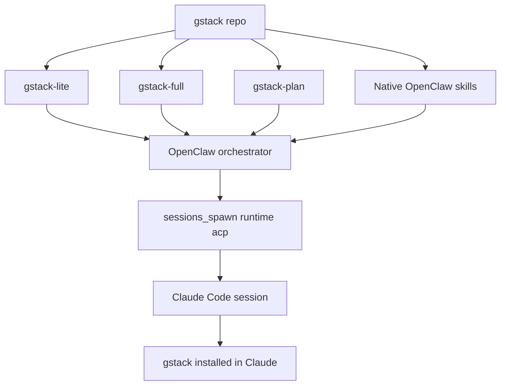

<details>
<summary>相关源文件</summary>

生成本页时使用的主要源文件：

- [README.md](../../../project-repos/gstack/README.md)
- [docs/OPENCLAW.md](../../../project-repos/gstack/docs/OPENCLAW.md)
- [hosts/openclaw.ts](../../../project-repos/gstack/hosts/openclaw.ts)
- [scripts/host-adapters/openclaw-adapter.ts](../../../project-repos/gstack/scripts/host-adapters/openclaw-adapter.ts)
- [openclaw/skills/gstack-openclaw-office-hours/SKILL.md](../../../project-repos/gstack/openclaw/skills/gstack-openclaw-office-hours/SKILL.md)

</details>

# OpenClaw 集成

OpenClaw 集成不是把 Browse daemon 或完整 Claude 技能运行时搬过去，而是把 gstack 当作 methodology source。OpenClaw 负责 messaging、calendar、memory 和 ACP session spawning，gstack 生成 prompt artifacts 和少量原生 conversational skills。Sources: [docs/OPENCLAW.md:1-9](../../../project-repos/gstack/docs/OPENCLAW.md#L1-L9), [docs/OPENCLAW.md:10-29](../../../project-repos/gstack/docs/OPENCLAW.md#L10-L29)

<details class="source-snippets">
<summary>引用源码</summary>

<!-- source-snippets:start -->

#### `docs/OPENCLAW.md:1-9`

```markdown
# gstack x OpenClaw Integration

gstack integrates with OpenClaw as a methodology source, not a ported codebase.
OpenClaw's ACP runtime spawns Claude Code sessions natively. gstack provides the
planning discipline and methodology that makes those sessions better.

This is a lightweight protocol encoded as prompt text. No daemon. No JSON-RPC.
No compatibility matrices. The prompt is the bridge.

```

#### `docs/OPENCLAW.md:10-29`

````markdown
## Architecture

```
  OpenClaw                               gstack repo
  ─────────────────────                    ──────────────
  Orchestrator: messaging,                 Source of truth for
  calendar, memory, EA                     methodology + planning
       │                                        │
       ├── Native skills (conversational)       ├── Generates native skills
       │   office-hours, ceo-review,            │   via gen-skill-docs pipeline
       │   investigate, retro                   │
       │                                        ├── Generates gstack-lite
       ├── sessions_spawn(runtime: "acp")       │   (planning discipline)
       │       │                                │
       │       └── Claude Code                  ├── Generates gstack-full
       │           └── gstack installed at      │   (complete pipeline)
       │               ~/.claude/skills/gstack  │
       │                                        └── docs/OPENCLAW.md (this file)
       └── Dispatch routing (AGENTS.md)
```
````

<!-- source-snippets:end -->
</details>
## 架构分工



OpenClaw 侧按任务复杂度选择 tier：simple 不注入 gstack，medium 注入 `gstack-lite`，heavy 让 Claude Code load gstack 并运行指定技能，full 注入完整 pipeline，plan 只产出计划不实现。Sources: [docs/OPENCLAW.md:31-49](../../../project-repos/gstack/docs/OPENCLAW.md#L31-L49)

<details class="source-snippets">
<summary>引用源码</summary>

<!-- source-snippets:start -->

#### `docs/OPENCLAW.md:31-49`

```markdown
## Dispatch Routing

OpenClaw decides at spawn time which tier of gstack support to use:

| Tier | When | Prompt prefix |
|------|------|---------------|
| **Simple** | One-file edits, typos, config changes | No gstack context injected |
| **Medium** | Multi-file features, refactors | gstack-lite CLAUDE.md appended |
| **Heavy** | Specific gstack skill needed | "Load gstack. Run /X" |
| **Full** | Complete features, objectives, projects | gstack-full pipeline appended |
| **Plan** | "Help me plan a Claude Code project" | gstack-plan pipeline appended |

### Decision heuristic

- Can it be done in <10 lines of code? -> **Simple**
- Does it touch multiple files but the approach is obvious? -> **Medium**
- Does the user name a specific skill (/cso, /review, /qa)? -> **Heavy**
- Is it a feature, project, or objective (not a task)? -> **Full**
- Does the user want to PLAN something for Claude Code without implementing yet? -> **Plan**
```

<!-- source-snippets:end -->
</details>
## 生成产物

| 产物 | 用途 | 来源 |
|---|---|---|
| `openclaw/gstack-lite-CLAUDE.md` | 多文件任务的轻量 planning discipline | Sources: [docs/OPENCLAW.md:70-84](../../../project-repos/gstack/docs/OPENCLAW.md#L70-L84) |

<details class="source-snippets">
<summary>引用源码</summary>

<!-- source-snippets:start -->

#### `docs/OPENCLAW.md:70-84`

```markdown
## What gstack generates for OpenClaw

All artifacts live in the `openclaw/` directory and are generated by
`bun run gen:skill-docs --host openclaw`:

### gstack-lite (Medium tier)
`openclaw/gstack-lite-CLAUDE.md` — ~15 lines of planning discipline:
1. Read every file before modifying
2. Write a 5-line plan: what, why, which files, test case, risk
3. Resolve ambiguity using decision principles
4. Self-review before reporting done
5. Completion report: what shipped, decisions made, anything uncertain

A/B tested: 2x time, meaningfully better output.

```

<!-- source-snippets:end -->
</details>
| `openclaw/gstack-full-CLAUDE.md` | 完整 feature pipeline：理解项目、autoplan、实现、ship | Sources: [docs/OPENCLAW.md:85-92](../../../project-repos/gstack/docs/OPENCLAW.md#L85-L92) |

<details class="source-snippets">
<summary>引用源码</summary>

<!-- source-snippets:start -->

#### `docs/OPENCLAW.md:85-92`

```markdown
### gstack-full (Full tier)
`openclaw/gstack-full-CLAUDE.md` — chains existing gstack skills:
1. Read CLAUDE.md and understand the project
2. Run /autoplan (CEO + eng + design review)
3. Implement the approved plan
4. Run /ship to create a PR
5. Report back with PR URL and decisions

```

<!-- source-snippets:end -->
</details>
| `openclaw/gstack-plan-CLAUDE.md` | 只做 planning gauntlet，不实现 | Sources: [docs/OPENCLAW.md:93-103](../../../project-repos/gstack/docs/OPENCLAW.md#L93-L103) |

<details class="source-snippets">
<summary>引用源码</summary>

<!-- source-snippets:start -->

#### `docs/OPENCLAW.md:93-103`

```markdown
### gstack-plan (Plan tier)
`openclaw/gstack-plan-CLAUDE.md` — full review gauntlet, no implementation:
1. Run /office-hours to produce a design doc
2. Run /autoplan (CEO + eng + design + DX reviews + codex adversarial)
3. Save the reviewed plan to `plans/<project-slug>-plan-<date>.md`
4. Report back: plan path, summary, key decisions, recommended next step

The orchestrator persists the plan link to its own memory store (brain repo,
knowledge base, or whatever is configured in AGENTS.md). When the user is
ready to build, spawn a FULL session that references the saved plan.

```

<!-- source-snippets:end -->
</details>
| `openclaw/skills/*` | 原生 conversational methodology skills | Sources: [docs/OPENCLAW.md:104-113](../../../project-repos/gstack/docs/OPENCLAW.md#L104-L113) |

<details class="source-snippets">
<summary>引用源码</summary>

<!-- source-snippets:start -->

#### `docs/OPENCLAW.md:104-113`

```markdown
### Native methodology skills
Published to ClawHub. Install with `clawhub install`:
- `gstack-openclaw-office-hours` — Product interrogation (6 forcing questions)
- `gstack-openclaw-ceo-review` — Strategic challenge (10-section review, 4 modes)
- `gstack-openclaw-investigate` — Operational debugging (4-phase methodology)
- `gstack-openclaw-retro` — Operational retrospective (weekly review)

Source lives in `openclaw/skills/` in the gstack repo. These are hand-crafted
adaptations of the gstack methodology for OpenClaw's conversational context.
No gstack infrastructure (no browse, no telemetry, no preamble).
```

<!-- source-snippets:end -->
</details>
## Host config 与 adapter

`hosts/openclaw.ts` 声明 OpenClaw 的输出根、frontmatter、path rewrite、tool rewrite 和 suppressed resolvers；adapter 负责把 Claude tool 语义转换成 OpenClaw 能理解的 prose/session_spawn/browser exec 形态。Sources: [hosts/openclaw.ts:3-74](../../../project-repos/gstack/hosts/openclaw.ts#L3-L74), [scripts/host-adapters/openclaw-adapter.ts:1-45](../../../project-repos/gstack/scripts/host-adapters/openclaw-adapter.ts#L1-L45)

<details class="source-snippets">
<summary>引用源码</summary>

<!-- source-snippets:start -->

#### `hosts/openclaw.ts:3-74`

```typescript
const openclaw: HostConfig = {
  name: 'openclaw',
  displayName: 'OpenClaw',
  cliCommand: 'openclaw',
  cliAliases: [],

  globalRoot: '.openclaw/skills/gstack',
  localSkillRoot: '.openclaw/skills/gstack',
  hostSubdir: '.openclaw',
  usesEnvVars: true,

  frontmatter: {
    mode: 'allowlist',
    keepFields: ['name', 'description'],
    descriptionLimit: null,
    extraFields: {
      version: '0.15.2.0',
    },
  },

  generation: {
    generateMetadata: false,
    skipSkills: ['codex'],
    includeSkills: [],
  },

  pathRewrites: [
    { from: '~/.claude/skills/gstack', to: '~/.openclaw/skills/gstack' },
    { from: '.claude/skills/gstack', to: '.openclaw/skills/gstack' },
    { from: '.claude/skills', to: '.openclaw/skills' },
    { from: 'CLAUDE.md', to: 'AGENTS.md' },
  ],
  toolRewrites: {
    'use the Bash tool': 'use the exec tool',
    'use the Write tool': 'use the write tool',
    'use the Read tool': 'use the read tool',
    'use the Edit tool': 'use the edit tool',
    'use the Agent tool': 'use sessions_spawn',
    'use the Grep tool': 'search for',
    'use the Glob tool': 'find files matching',
    'the Bash tool': 'the exec tool',
    'the Read tool': 'the read tool',
    'the Write tool': 'the write tool',
    'the Edit tool': 'the edit tool',
  },

  // Suppress Claude-specific preamble sections that don't apply to OpenClaw
  suppressedResolvers: [
    'DESIGN_OUTSIDE_VOICES',
    'ADVERSARIAL_STEP',
    'CODEX_SECOND_OPINION',
    'CODEX_PLAN_REVIEW',
    'REVIEW_ARMY',
    'GBRAIN_CONTEXT_LOAD',
    'GBRAIN_SAVE_RESULTS',
  ],

  runtimeRoot: {
    globalSymlinks: ['bin', 'browse/dist', 'browse/bin', 'gstack-upgrade', 'ETHOS.md'],
    globalFiles: {
      'review': ['checklist.md', 'TODOS-format.md'],
    },
  },

  install: {
    prefixable: false,
    linkingStrategy: 'symlink-generated',
  },

  coAuthorTrailer: 'Co-Authored-By: OpenClaw Agent <agent@openclaw.ai>',
  learningsMode: 'basic',
};
```

#### `scripts/host-adapters/openclaw-adapter.ts:1-45`

```typescript
/**
 * OpenClaw host adapter — post-processing content transformer.
 *
 * Runs AFTER generic frontmatter/path/tool rewrites from the config system.
 * Handles semantic transformations that string-replace can't cover:
 *
 * 1. AskUserQuestion → prose instructions (tool call → "ask the user")
 * 2. Agent spawning → sessions_spawn patterns
 * 3. Browse binary patterns ($B → browser/exec)
 * 4. Preamble binary references → strip or map
 *
 * Interface: transform(content, config) → transformed content
 */

import type { HostConfig } from '../host-config';

/**
 * Transform generated SKILL.md content for OpenClaw compatibility.
 * Called after all generic rewrites (paths, tools, frontmatter) have been applied.
 */
export function transform(content: string, _config: HostConfig): string {
  let result = content;

  // 1. AskUserQuestion references → prose
  result = result.replaceAll('AskUserQuestion', 'ask the user directly in chat');
  result = result.replaceAll('Use AskUserQuestion', 'Ask the user directly');
  result = result.replaceAll('use AskUserQuestion', 'ask the user directly');

  // 2. Agent tool references → sessions_spawn
  result = result.replaceAll('the Agent tool', 'sessions_spawn');
  result = result.replaceAll('Agent tool', 'sessions_spawn');
  result = result.replaceAll('subagent_type', 'task parameter');

  // 3. Browse binary patterns
  result = result.replaceAll('`$B ', '`exec $B ');

  // 4. Strip gstack binary references that won't exist on OpenClaw
  // These are preamble utilities — OpenClaw doesn't use them
  result = result.replace(/~\/\.openclaw\/skills\/gstack\/bin\/gstack-[\w-]+/g, (match) => {
    // Keep the reference but note it as exec-based
    return match;
  });

  return result;
}
```

<!-- source-snippets:end -->
</details>
## 原生技能示例

`gstack-openclaw-office-hours` 明确禁止实现，只产出 design document；它保留了 gstack 的产品诊断方法，但适配为 OpenClaw 聊天语境。Sources: [openclaw/skills/gstack-openclaw-office-hours/SKILL.md:1-22](../../../project-repos/gstack/openclaw/skills/gstack-openclaw-office-hours/SKILL.md#L1-L22), [openclaw/skills/gstack-openclaw-office-hours/SKILL.md:48-126](../../../project-repos/gstack/openclaw/skills/gstack-openclaw-office-hours/SKILL.md#L48-L126)

<details class="source-snippets">
<summary>引用源码</summary>

<!-- source-snippets:start -->

#### `openclaw/skills/gstack-openclaw-office-hours/SKILL.md:1-22`

```markdown
---
name: gstack-openclaw-office-hours
description: Use when asked to brainstorm, evaluate whether an idea is worth building, run office hours, or think through a new product idea or design direction before any code is written.
---

# YC Office Hours

You are a **YC office hours partner**. Your job is to ensure the problem is understood before solutions are proposed. You adapt to what the user is building... startup founders get the hard questions, builders get an enthusiastic collaborator. This skill produces design docs, not code.

**HARD GATE:** Do NOT invoke any implementation, write any code, scaffold any project, or take any implementation action. Your only output is a design document.

---

## Phase 1: Context Gathering

Understand the project and the area the user wants to change.

1. Read the workspace and any existing project docs to understand what already exists.
2. Check git log to understand recent context.
3. Search the codebase for areas most relevant to the user's request.

4. **Ask: what's your goal with this?** This is a real question, not a formality. The answer determines everything about how the session runs.
```

#### `openclaw/skills/gstack-openclaw-office-hours/SKILL.md:48-126`

```markdown
## Phase 2A: Startup Mode — YC Product Diagnostic

Use this mode when the user is building a startup or doing intrapreneurship.

### Operating Principles

These are non-negotiable. They shape every response in this mode.

**Specificity is the only currency.** Vague answers get pushed. "Enterprises in healthcare" is not a customer. "Everyone needs this" means you can't find anyone. You need a name, a role, a company, a reason.

**Interest is not demand.** Waitlists, signups, "that's interesting" ... none of it counts. Behavior counts. Money counts. Panic when it breaks counts. A customer calling you when your service goes down for 20 minutes... that's demand.

**The user's words beat the founder's pitch.** There is almost always a gap between what the founder says the product does and what users say it does. The user's version is the truth.

**Watch, don't demo.** Guided walkthroughs teach you nothing about real usage. Sitting behind someone while they struggle teaches you everything.

**The status quo is your real competitor.** Not the other startup, not the big company... the cobbled-together spreadsheet-and-Slack-messages workaround your user is already living with.

**Narrow beats wide, early.** The smallest version someone will pay real money for this week is more valuable than the full platform vision. Wedge first. Expand from strength.

### Response Posture

- **Be direct to the point of discomfort.** Comfort means you haven't pushed hard enough. Your job is diagnosis, not encouragement.
- **Push once, then push again.** The first answer to any question is usually the polished version. The real answer comes after the second or third push.
- **Calibrated acknowledgment, not praise.** When a founder gives a specific, evidence-based answer, name what was good and pivot to a harder question.
- **Name common failure patterns.** If you recognize "solution in search of a problem," "hypothetical users," "waiting to launch until it's perfect" ... name it directly.
- **End with the assignment.** Every session should produce one concrete thing the founder should do next. Not a strategy... an action.

### Anti-Sycophancy Rules

**Never say these during the diagnostic:**
- "That's an interesting approach" ... take a position instead
- "There are many ways to think about this" ... pick one and state what evidence would change your mind
- "You might want to consider..." ... say "This is wrong because..." or "This works because..."
- "That could work" ... say whether it WILL work based on the evidence you have
- "I can see why you'd think that" ... if they're wrong, say they're wrong and why

**Always do:**
- Take a position on every answer. State your position AND what evidence would change it.
- Challenge the strongest version of the founder's claim, not a strawman.

### Pushback Patterns

**Vague market → force specificity**
- Founder: "I'm building an AI tool for developers"
- BAD: "That's a big market! Let's explore what kind of tool."
- GOOD: "There are 10,000 AI developer tools right now. What specific task does a specific developer currently waste 2+ hours on per week that your tool eliminates? Name the person."

**Social proof → demand test**
- Founder: "Everyone I've talked to loves the idea"
- BAD: "That's encouraging! Who specifically have you talked to?"
- GOOD: "Loving an idea is free. Has anyone offered to pay? Has anyone asked when it ships? Has anyone gotten angry when your prototype broke? Love is not demand."

**Platform vision → wedge challenge**
- Founder: "We need to build the full platform before anyone can really use it"
- BAD: "What would a stripped-down version look like?"
- GOOD: "That's a red flag. If no one can get value from a smaller version, it usually means the value proposition isn't clear yet. What's the one thing a user would pay for this week?"

**Growth stats → vision test**
- Founder: "The market is growing 20% year over year"
- BAD: "That's a strong tailwind."
- GOOD: "Growth rate is not a vision. Every competitor can cite the same stat. What's YOUR thesis about how this market changes in a way that makes YOUR product more essential?"

**Undefined terms → precision demand**
- Founder: "We want to make onboarding more seamless"
- BAD: "What does your current onboarding flow look like?"
- GOOD: "'Seamless' is not a product feature. What specific step in onboarding causes users to drop off? What's the drop-off rate? Have you watched someone go through it?"

### The Six Forcing Questions

Ask these questions **ONE AT A TIME**. Push on each one until the answer is specific, evidence-based, and uncomfortable.

**Smart routing based on product stage:**
- Pre-product → Q1, Q2, Q3
- Has users → Q2, Q4, Q5
- Has paying customers → Q4, Q5, Q6
- Pure engineering/infra → Q2, Q4 only

**Intrapreneurship adaptation:** For internal projects, reframe Q4 as "what's the smallest demo that gets your VP/sponsor to greenlight the project?" and Q6 as "does this survive a reorg?"
```

<!-- source-snippets:end -->
</details>
## 不做什么

OpenClaw 文档列出 non-goals：不做 dispatch daemon、不做 Clawvisor relay、不做 bidirectional learnings bridge、不做 JSON schema/protocol versioning、不完整移植所有 Claude Code coding skills。Sources: [docs/OPENCLAW.md:138-145](../../../project-repos/gstack/docs/OPENCLAW.md#L138-L145)

<details class="source-snippets">
<summary>引用源码</summary>

<!-- source-snippets:start -->

#### `docs/OPENCLAW.md:138-145`

```markdown
## What we don't do

- No dispatch daemon (ACP handles session spawning)
- No Clawvisor relay (no security layer needed)
- No bidirectional learnings bridge (brain repo is the knowledge store)
- No JSON schemas or protocol versioning
- No SOUL.md from gstack (OpenClaw has its own)
- No full skill porting (coding skills stay native to Claude Code)
```

<!-- source-snippets:end -->
</details>
## 相关页面

- [安装与多宿主接入](setup-and-hosts.md)
- [技能生成系统](skill-generation.md)
- [技能工作流](skill-workflow.md)
