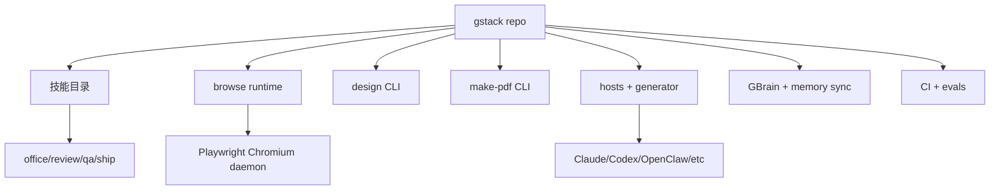

<details>
<summary>相关源文件</summary>

生成本页时使用的主要源文件：

- [README.md](https://github.com/garrytan/gstack/blob/454423aeb3d3dafa88d5b57bfbe0ead05569d21e/README.md)
- [ARCHITECTURE.md](https://github.com/garrytan/gstack/blob/454423aeb3d3dafa88d5b57bfbe0ead05569d21e/ARCHITECTURE.md)
- [CLAUDE.md](https://github.com/garrytan/gstack/blob/454423aeb3d3dafa88d5b57bfbe0ead05569d21e/CLAUDE.md)
- [package.json](https://github.com/garrytan/gstack/blob/454423aeb3d3dafa88d5b57bfbe0ead05569d21e/package.json)
- [00-repo-inventory.md](../00-repo-inventory.md)

</details>

# 项目概览

gstack 是一个面向 AI 编码代理的“软件工厂”仓库：核心是 Claude Code 风格的 Markdown 技能集合，配套一个低延迟浏览器守护进程、设计生成工具、PDF 工具、GBrain 记忆接入、多宿主技能生成器和一组 CI/eval 质量门。README 把它描述成把 Claude Code 组织成虚拟工程团队的工作流，而 `ARCHITECTURE.md` 明确说“浏览器是难点，其他主要是 Markdown”。Sources: [README.md:53-64](../../../project-repos/gstack/README.md#L53-L64), [ARCHITECTURE.md:5-10](../../../project-repos/gstack/ARCHITECTURE.md#L5-L10)

<details class="source-snippets">
<summary>引用源码</summary>

<!-- source-snippets:start -->

#### `README.md:53-64`

````markdown
### Step 2: Team mode — auto-update for shared repos (recommended)

From inside your repo, paste this. Switches you to team mode, bootstraps the repo so teammates get gstack automatically, and commits the change:

```bash
(cd ~/.claude/skills/gstack && ./setup --team) && ~/.claude/skills/gstack/bin/gstack-team-init required && git add .claude/ CLAUDE.md && git commit -m "require gstack for AI-assisted work"
```

No vendored files in your repo, no version drift, no manual upgrades. Every Claude Code session starts with a fast auto-update check (throttled to once/hour, network-failure-safe, completely silent).

Swap `required` for `optional` if you'd rather nudge teammates than block them.

````

#### `ARCHITECTURE.md:5-10`

```markdown
## The core idea

gstack gives Claude Code a persistent browser and a set of opinionated workflow skills. The browser is the hard part — everything else is Markdown.

The key insight: an AI agent interacting with a browser needs **sub-second latency** and **persistent state**. If every command cold-starts a browser, you're waiting 3-5 seconds per tool call. If the browser dies between commands, you lose cookies, tabs, and login sessions. So gstack runs a long-lived Chromium daemon that the CLI talks to over localhost HTTP.

```

<!-- source-snippets:end -->
</details>
## 一句话定位

| 维度 | 结论 | 证据 |
|---|---|---|
| 主要用户 | founders、第一次使用 Claude Code 的用户、tech lead/staff engineer | Sources: [README.md:56-64](../../../project-repos/gstack/README.md#L56-L64) |

<details class="source-snippets">
<summary>引用源码</summary>

<!-- source-snippets:start -->

#### `README.md:56-64`

````markdown

```bash
(cd ~/.claude/skills/gstack && ./setup --team) && ~/.claude/skills/gstack/bin/gstack-team-init required && git add .claude/ CLAUDE.md && git commit -m "require gstack for AI-assisted work"
```

No vendored files in your repo, no version drift, no manual upgrades. Every Claude Code session starts with a fast auto-update check (throttled to once/hour, network-failure-safe, completely silent).

Swap `required` for `optional` if you'd rather nudge teammates than block them.

````

<!-- source-snippets:end -->
</details>
| 核心形态 | Slash-command skills + compiled Bun tools + Playwright browser daemon | Sources: [package.json:7-19](../../../project-repos/gstack/package.json#L7-L19), [ARCHITECTURE.md:5-10](../../../project-repos/gstack/ARCHITECTURE.md#L5-L10) |

<details class="source-snippets">
<summary>引用源码</summary>

<!-- source-snippets:start -->

#### `package.json:7-19`

```json
  "bin": {
    "browse": "./browse/dist/browse",
    "make-pdf": "./make-pdf/dist/pdf"
  },
  "scripts": {
    "build": "bun run vendor:xterm && bun run gen:skill-docs --host all; bun build --compile browse/src/cli.ts --outfile browse/dist/browse && bun build --compile browse/src/find-browse.ts --outfile browse/dist/find-browse && bun build --compile design/src/cli.ts --outfile design/dist/design && bun build --compile make-pdf/src/cli.ts --outfile make-pdf/dist/pdf && bun build --compile bin/gstack-global-discover.ts --outfile bin/gstack-global-discover && bash browse/scripts/build-node-server.sh && git rev-parse HEAD > browse/dist/.version && git rev-parse HEAD > design/dist/.version && git rev-parse HEAD > make-pdf/dist/.version && chmod +x browse/dist/browse browse/dist/find-browse design/dist/design make-pdf/dist/pdf bin/gstack-global-discover && (rm -f .*.bun-build || true)",
    "vendor:xterm": "mkdir -p extension/lib && cp node_modules/xterm/lib/xterm.js extension/lib/xterm.js && cp node_modules/xterm/css/xterm.css extension/lib/xterm.css && cp node_modules/xterm-addon-fit/lib/xterm-addon-fit.js extension/lib/xterm-addon-fit.js",
    "dev:make-pdf": "bun run make-pdf/src/cli.ts",
    "dev:design": "bun run design/src/cli.ts",
    "gen:skill-docs": "bun run scripts/gen-skill-docs.ts",
    "dev": "bun run browse/src/cli.ts",
    "server": "bun run browse/src/server.ts",
    "test": "bun test browse/test/ test/ make-pdf/test/ --ignore 'test/skill-e2e-*.test.ts' --ignore test/skill-llm-eval.test.ts --ignore test/skill-routing-e2e.test.ts --ignore test/codex-e2e.test.ts --ignore test/gemini-e2e.test.ts && (bun run slop:diff 2>/dev/null || true)",
```

#### `ARCHITECTURE.md:5-10`

```markdown
## The core idea

gstack gives Claude Code a persistent browser and a set of opinionated workflow skills. The browser is the hard part — everything else is Markdown.

The key insight: an AI agent interacting with a browser needs **sub-second latency** and **persistent state**. If every command cold-starts a browser, you're waiting 3-5 seconds per tool call. If the browser dies between commands, you lose cookies, tabs, and login sessions. So gstack runs a long-lived Chromium daemon that the CLI talks to over localhost HTTP.

```

<!-- source-snippets:end -->
</details>
| 工作流理念 | Think → Plan → Build → Review → Test → Ship → Reflect | Sources: [README.md:169-177](../../../project-repos/gstack/README.md#L169-L177) |

<details class="source-snippets">
<summary>引用源码</summary>

<!-- source-snippets:start -->

#### `README.md:169-177`

```markdown
You said "daily briefing app." The agent said "you're building a chief of staff AI" — because it listened to your pain, not your feature request. Eight commands, end to end. That is not a copilot. That is a team.

## The sprint

gstack is a process, not a collection of tools. The skills run in the order a sprint runs:

**Think → Plan → Build → Review → Test → Ship → Reflect**

Each skill feeds into the next. `/office-hours` writes a design doc that `/plan-ceo-review` reads. `/plan-eng-review` writes a test plan that `/qa` picks up. `/review` catches bugs that `/ship` verifies are fixed. Nothing falls through the cracks because every step knows what came before it.
```

<!-- source-snippets:end -->
</details>
| 源码规模 | 687 个扫描文件，TypeScript、Markdown、shell 和工作流文件占主体 | Sources: [00-repo-inventory.md:11-33](../00-repo-inventory.md#L11-L33) |

<details class="source-snippets">
<summary>引用源码</summary>

<!-- source-snippets:start -->

#### `00-repo-inventory.md:11-33`

```markdown

- Files scanned: 687
- Top-level directories: `.github`, `agents`, `autoplan`, `benchmark`, `benchmark-models`, `bin`, `browse`, `browser-skills`, `canary`, `careful`, `claude`, `codex`, `context-restore`, `context-save`, `contrib`, `cso`, `design`, `design-consultation`, `design-html`, `design-review`, `design-shotgun`, `devex-review`, `docs`, `document-release`, `extension`, `freeze`, `gstack-upgrade`, `guard`, `health`, `hosts`, `investigate`, `land-and-deploy`, `landing-report`, `learn`, `lib`, `make-pdf`, `model-overlays`, `office-hours`, `open-gstack-browser`, `openclaw`, `pair-agent`, `plan-ceo-review`, `plan-design-review`, `plan-devex-review`, `plan-eng-review`, `plan-tune`, `qa`, `qa-only`, `retro`, `review`, `scrape`, `scripts`, `setup-browser-cookies`, `setup-deploy`, `setup-gbrain`, `ship`, `skillify`, `supabase`, `test`, `unfreeze`

| Extension | Count |
|-----------|------:|
| `.ts` | 367 |
| `.md` | 122 |
| `[no extension]` | 59 |
| `.tmpl` | 47 |
| `.html` | 26 |
| `.sh` | 13 |
| `.json` | 11 |
| `.yml` | 9 |
| `.js` | 6 |
| `.png` | 5 |
| `.sql` | 5 |
| `.css` | 4 |
| `.rb` | 4 |
| `.yaml` | 3 |
| `.example` | 1 |
| `.ci` | 1 |
| `.cjs` | 1 |
```

<!-- source-snippets:end -->
</details>
## 仓库地形



`CLAUDE.md` 给出开发者视角的项目结构：`browse/src` 是命令注册和浏览器服务，`hosts` 是多宿主配置，`scripts` 负责模板生成，`test` 覆盖静态验证与 E2E eval，技能目录则承载实际工作流。Sources: [CLAUDE.md:78-149](../../../project-repos/gstack/CLAUDE.md#L78-L149)

<details class="source-snippets">
<summary>引用源码</summary>

<!-- source-snippets:start -->

#### `CLAUDE.md:78-149`

````markdown
## Project structure

```
gstack/
├── browse/          # Headless browser CLI (Playwright)
│   ├── src/         # CLI + server + commands
│   │   ├── commands.ts  # Command registry (single source of truth)
│   │   └── snapshot.ts  # SNAPSHOT_FLAGS metadata array
│   ├── test/        # Integration tests + fixtures
│   └── dist/        # Compiled binary
├── hosts/           # Typed host configs (one per AI agent)
│   ├── claude.ts    # Primary host config
│   ├── codex.ts, factory.ts, kiro.ts  # Existing hosts
│   ├── opencode.ts, slate.ts, cursor.ts, openclaw.ts  # IDE hosts
│   ├── hermes.ts, gbrain.ts  # Agent runtime hosts
│   └── index.ts     # Registry: exports all, derives Host type
├── scripts/         # Build + DX tooling
│   ├── gen-skill-docs.ts  # Template → SKILL.md generator (config-driven)
│   ├── host-config.ts     # HostConfig interface + validator
│   ├── host-config-export.ts  # Shell bridge for setup script
│   ├── host-adapters/     # Host-specific adapters (OpenClaw tool mapping)
│   ├── resolvers/   # Template resolver modules (preamble, design, review, gbrain, etc.)
│   ├── skill-check.ts     # Health dashboard
│   └── dev-skill.ts       # Watch mode
├── test/            # Skill validation + eval tests
│   ├── helpers/     # skill-parser.ts, session-runner.ts, llm-judge.ts, eval-store.ts
│   ├── fixtures/    # Ground truth JSON, planted-bug fixtures, eval baselines
│   ├── skill-validation.test.ts  # Tier 1: static validation (free, <1s)
│   ├── gen-skill-docs.test.ts    # Tier 1: generator quality (free, <1s)
│   ├── skill-llm-eval.test.ts   # Tier 3: LLM-as-judge (~$0.15/run)
│   └── skill-e2e-*.test.ts       # Tier 2: E2E via claude -p (~$3.85/run, split by category)
├── qa-only/         # /qa-only skill (report-only QA, no fixes)
├── plan-design-review/  # /plan-design-review skill (report-only design audit)
├── design-review/    # /design-review skill (design audit + fix loop)
├── ship/            # Ship workflow skill
├── review/          # PR review skill
├── plan-ceo-review/ # /plan-ceo-review skill
├── plan-eng-review/ # /plan-eng-review skill
├── autoplan/        # /autoplan skill (auto-review pipeline: CEO → design → eng)
├── benchmark/       # /benchmark skill (performance regression detection)
├── canary/          # /canary skill (post-deploy monitoring loop)
├── codex/           # /codex skill (multi-AI second opinion via OpenAI Codex CLI)
├── land-and-deploy/ # /land-and-deploy skill (merge → deploy → canary verify)
├── office-hours/    # /office-hours skill (YC Office Hours — startup diagnostic + builder brainstorm)
├── investigate/     # /investigate skill (systematic root-cause debugging)
├── retro/           # Retrospective skill (includes /retro global cross-project mode)
├── bin/             # CLI utilities (gstack-repo-mode, gstack-slug, gstack-config, etc.)
├── document-release/ # /document-release skill (post-ship doc updates)
├── cso/             # /cso skill (OWASP Top 10 + STRIDE security audit)
├── design-consultation/ # /design-consultation skill (design system from scratch)
├── design-shotgun/  # /design-shotgun skill (visual design exploration)
├── open-gstack-browser/  # /open-gstack-browser skill (launch GStack Browser)
├── connect-chrome/  # symlink → open-gstack-browser (backwards compat)
├── design/          # Design binary CLI (GPT Image API)
│   ├── src/         # CLI + commands (generate, variants, compare, serve, etc.)
│   ├── test/        # Integration tests
│   └── dist/        # Compiled binary
├── extension/       # Chrome extension (side panel + activity feed + CSS inspector)
├── lib/             # Shared libraries (worktree.ts)
├── docs/designs/    # Design documents
├── setup-deploy/    # /setup-deploy skill (one-time deploy config)
├── .github/         # CI workflows + Docker image
│   ├── workflows/   # evals.yml (E2E on Ubicloud), skill-docs.yml, actionlint.yml
│   └── docker/      # Dockerfile.ci (pre-baked toolchain + Playwright/Chromium)
├── contrib/         # Contributor-only tools (never installed for users)
│   └── add-host/    # /gstack-contrib-add-host skill
├── setup            # One-time setup: build binary + symlink skills
├── SKILL.md         # Generated from SKILL.md.tmpl (don't edit directly)
├── SKILL.md.tmpl    # Template: edit this, run gen:skill-docs
├── ETHOS.md         # Builder philosophy (Boil the Lake, Search Before Building)
└── package.json     # Build scripts for browse
```
````

<!-- source-snippets:end -->
</details>
## 主要子系统

| 子系统 | 关键路径 | 作用 |
|---|---|---|
| 技能包 | `*/SKILL.md`, `*/SKILL.md.tmpl` | 面向代理的行为说明、审查流程、发布流程和工具使用规则 |
| Browse | `browse/src/cli.ts`, `browse/src/server.ts`, `browse/src/commands.ts` | 低延迟浏览器访问、页面读取、交互、截图、CDP escape hatch |
| 设计工具 | `design/src/*`, `design-html/`, `design-shotgun/` | 生成 mockup、比较方案、从 mockup 生成实现提示 |
| PDF 工具 | `make-pdf/src/*`, `make-pdf/SKILL.md` | Markdown 到出版质量 PDF 的 CLI 和技能入口 |
| 多宿主生成 | `hosts/*.ts`, `scripts/gen-skill-docs.ts` | 将 Claude 技能模板转换成 Codex、Factory、OpenClaw 等宿主格式 |
| 记忆系统 | `setup-gbrain/`, `bin/gstack-brain-*`, `docs/gbrain-sync.md` | 接入 GBrain，并把 gstack 本地状态安全同步到私有 git repo |

## 阅读路线

1. 想知道用户怎样使用：先读 [技能工作流](skill-workflow.md)。
2. 想理解安装和多宿主：读 [安装与多宿主接入](setup-and-hosts.md)。
3. 想看技术核心：读 [Browse 运行时](browse-runtime.md) 和 [浏览器安全模型](browser-security.md)。
4. 想贡献或扩展：读 [技能生成系统](skill-generation.md) 与 [贡献、扩展与新增宿主](contributing-extension.md)。

## 相关页面

- [技能工作流](skill-workflow.md)
- [Browse 运行时](browse-runtime.md)
- [安装与多宿主接入](setup-and-hosts.md)
