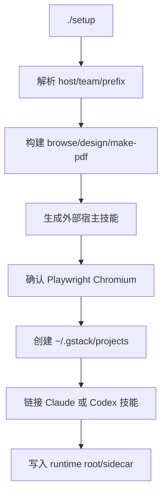
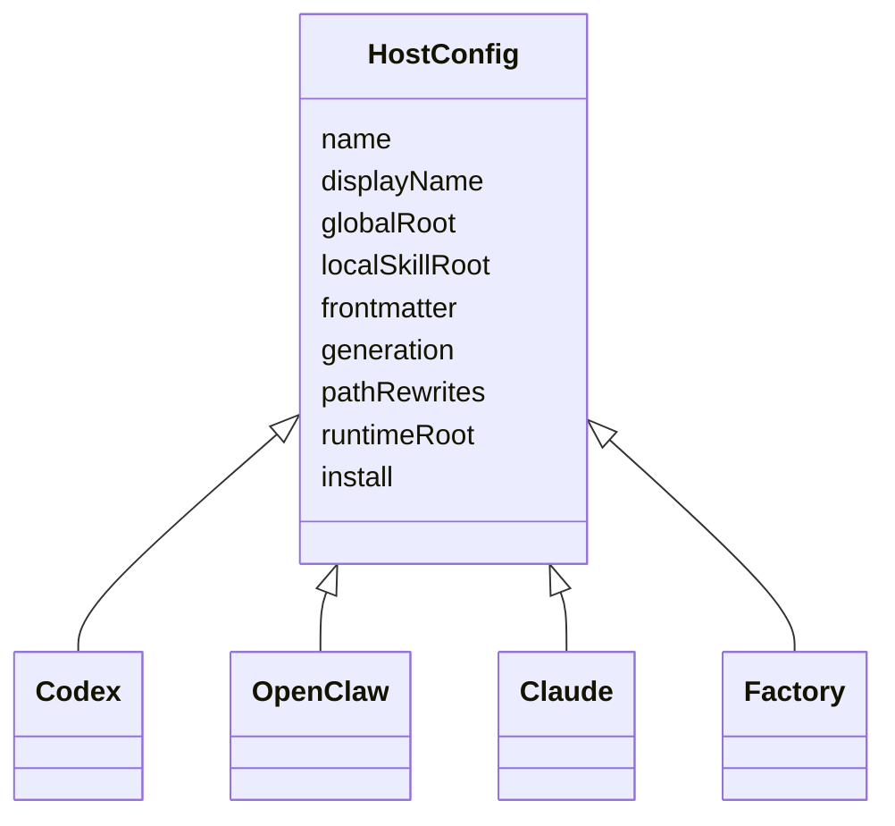

<details>
<summary>相关源文件</summary>

生成本页时使用的主要源文件：

- [README.md](../../../project-repos/gstack/README.md)
- [setup](../../../project-repos/gstack/setup)
- [hosts/index.ts](../../../project-repos/gstack/hosts/index.ts)
- [hosts/codex.ts](../../../project-repos/gstack/hosts/codex.ts)
- [hosts/openclaw.ts](../../../project-repos/gstack/hosts/openclaw.ts)
- [CONTRIBUTING.md](../../../project-repos/gstack/CONTRIBUTING.md)

</details>

# 安装与多宿主接入

gstack 的安装不是简单复制文件。`setup` 会验证 Bun/Playwright、构建二进制、生成宿主格式的技能文档、创建每个技能的发现入口，并根据宿主差异链接 runtime assets。README 的 30 秒安装命令只是用户入口，真实行为在 `setup` 和 `hosts/*.ts` 中。Sources: [README.md:67-104](../../../project-repos/gstack/README.md#L67-L104), [setup:1-15](../../../project-repos/gstack/setup#L1-L15), [setup:223-362](../../../project-repos/gstack/setup#L223-L362)

<details class="source-snippets">
<summary>引用源码</summary>

<!-- source-snippets:start -->

#### `README.md:67-104`

````markdown
OpenClaw spawns Claude Code sessions via ACP, so every gstack skill just works
when Claude Code has gstack installed. Paste this to your OpenClaw agent:

> Install gstack: run `git clone --single-branch --depth 1 https://github.com/garrytan/gstack.git ~/.claude/skills/gstack && cd ~/.claude/skills/gstack && ./setup` to install gstack for Claude Code. Then add a "Coding Tasks" section to AGENTS.md that says: when spawning Claude Code sessions for coding work, tell the session to use gstack skills. Include these examples — security audit: "Load gstack. Run /cso", code review: "Load gstack. Run /review", QA test a URL: "Load gstack. Run /qa https://...", build a feature end-to-end: "Load gstack. Run /autoplan, implement the plan, then run /ship", plan before building: "Load gstack. Run /office-hours then /autoplan. Save the plan, don't implement."

**After setup, just talk to your OpenClaw agent naturally:**

| You say | What happens |
|---------|-------------|
| "Fix the typo in README" | Simple — Claude Code session, no gstack needed |
| "Run a security audit on this repo" | Spawns Claude Code with `Run /cso` |
| "Build me a notifications feature" | Spawns Claude Code with /autoplan → implement → /ship |
| "Help me plan the v2 API redesign" | Spawns Claude Code with /office-hours → /autoplan, saves plan |

See [docs/OPENCLAW.md](docs/OPENCLAW.md) for advanced dispatch routing and
the gstack-lite/gstack-full prompt templates.

### Native OpenClaw Skills (via ClawHub)

Four methodology skills that work directly in your OpenClaw agent, no Claude Code
session needed. Install from ClawHub:

```
clawhub install gstack-openclaw-office-hours gstack-openclaw-ceo-review gstack-openclaw-investigate gstack-openclaw-retro
```

| Skill | What it does |
|-------|-------------|
| `gstack-openclaw-office-hours` | Product interrogation with 6 forcing questions |
| `gstack-openclaw-ceo-review` | Strategic challenge with 4 scope modes |
| `gstack-openclaw-investigate` | Root cause debugging methodology |
| `gstack-openclaw-retro` | Weekly engineering retrospective |

These are conversational skills. Your OpenClaw agent runs them directly via chat.

### Other AI Agents

gstack works on 10 AI coding agents, not just Claude. Setup auto-detects which
````

#### `setup:1-15`

```
#!/usr/bin/env bash
# gstack setup — build browser binary + register skills with Claude Code / Codex
set -e
umask 077  # Restrict new files to owner-only (0o600 files, 0o700 dirs)

if ! command -v bun >/dev/null 2>&1; then
  echo "Error: bun is required but not installed." >&2
  echo "Install with checksum verification:" >&2
  echo '  BUN_VERSION="1.3.10"' >&2
  echo '  tmpfile=$(mktemp)' >&2
  echo '  curl -fsSL "https://bun.sh/install" -o "$tmpfile"' >&2
  echo '  echo "Verify checksum before running: shasum -a 256 $tmpfile"' >&2
  echo '  BUN_VERSION="$BUN_VERSION" bash "$tmpfile" && rm "$tmpfile"' >&2
  exit 1
fi
```

#### `setup:223-362`

```
# 1. Build browse binary if needed (smart rebuild: stale sources, package.json, lock)
NEEDS_BUILD=0
if [ ! -x "$BROWSE_BIN" ]; then
  NEEDS_BUILD=1
elif [ -n "$(find "$SOURCE_GSTACK_DIR/browse/src" -type f -newer "$BROWSE_BIN" -print -quit 2>/dev/null)" ]; then
  NEEDS_BUILD=1
elif [ "$SOURCE_GSTACK_DIR/package.json" -nt "$BROWSE_BIN" ]; then
  NEEDS_BUILD=1
elif [ -f "$SOURCE_GSTACK_DIR/bun.lock" ] && [ "$SOURCE_GSTACK_DIR/bun.lock" -nt "$BROWSE_BIN" ]; then
  NEEDS_BUILD=1
fi

if [ "$NEEDS_BUILD" -eq 1 ]; then
  log "Building browse binary..."
  (
    cd "$SOURCE_GSTACK_DIR"
    bun install --frozen-lockfile 2>/dev/null || bun install
    bun run build
  )
  # Safety net: write .version if build script didn't (e.g., git not available during build)
  if [ ! -f "$SOURCE_GSTACK_DIR/browse/dist/.version" ]; then
    git -C "$SOURCE_GSTACK_DIR" rev-parse HEAD > "$SOURCE_GSTACK_DIR/browse/dist/.version" 2>/dev/null || true
  fi

  # macOS Apple Silicon: ad-hoc codesign compiled binaries.
  # Bun's --compile can produce a corrupt or linker-only code signature that
  # macOS kills with SIGKILL (exit 137). The two-step remove+re-sign is
  # required because a naive `codesign -s - -f` fails when the existing
  # signature block is corrupt. This is idempotent and costs <1s.
  # See: https://github.com/garrytan/gstack/issues/997
  if [ "$(uname -s)" = "Darwin" ] && [ "$(uname -m)" = "arm64" ]; then
    for _bin in browse/dist/browse browse/dist/find-browse design/dist/design make-pdf/dist/pdf bin/gstack-global-discover; do
      _bin_path="$SOURCE_GSTACK_DIR/$_bin"
      [ -f "$_bin_path" ] && [ -x "$_bin_path" ] || continue
      codesign --remove-signature "$_bin_path" 2>/dev/null || true
      if ! codesign -s - -f "$_bin_path" 2>/dev/null; then
        log "warning: codesign failed for $_bin (binary may not run on Apple Silicon)"
      fi
    done
  fi

  # macOS: install coreutils for `gtimeout` (Codex hang protection in /codex + /autoplan).
  # macOS ships BSD `timeout`-less; Homebrew's coreutils installs GNU timeout as
  # `gtimeout` to avoid shadowing BSD utilities. The /codex and /autoplan skills
  # fall back to unwrapped codex invocations when neither is available — this
  # auto-install upgrades them to hang-protected where possible.
  # Skip entirely with GSTACK_SKIP_COREUTILS=1 (CI, managed machines, offline envs).
  if [ "$(uname -s)" = "Darwin" ] && [ "${GSTACK_SKIP_COREUTILS:-0}" != "1" ]; then
    if ! command -v gtimeout >/dev/null 2>&1 && ! command -v timeout >/dev/null 2>&1; then
      if command -v brew >/dev/null 2>&1; then
        log "Installing coreutils for Codex hang protection (set GSTACK_SKIP_COREUTILS=1 to skip)..."
        brew install coreutils >/dev/null 2>&1 || log "warning: brew install coreutils failed; /codex will run without hang protection"
      else
        log "warning: Homebrew not found. /codex will run without hang protection. Install coreutils manually or set GSTACK_SKIP_COREUTILS=1."
      fi
    fi
  fi
fi

if [ ! -x "$BROWSE_BIN" ]; then
  echo "gstack setup failed: browse binary missing at $BROWSE_BIN" >&2
  exit 1
fi

# 1b. Generate .agents/ Codex skill docs — always regenerate to prevent stale descriptions.
# .agents/ is no longer committed — generated at setup time from .tmpl templates.
# bun run build already does this, but we need it when NEEDS_BUILD=0 (binary is fresh).
# Always regenerate: generation is fast (<2s) and mtime-based staleness checks are fragile
# (miss stale files when timestamps match after clone/checkout/upgrade).
AGENTS_DIR="$SOURCE_GSTACK_DIR/.agents/skills"
NEEDS_AGENTS_GEN=1

if [ "$NEEDS_AGENTS_GEN" -eq 1 ] && [ "$NEEDS_BUILD" -eq 0 ]; then
  log "Generating .agents/ skill docs..."
  (
    cd "$SOURCE_GSTACK_DIR"
    bun install --frozen-lockfile 2>/dev/null || bun install
    bun run gen:skill-docs --host codex
  )
fi

# 1c. Generate .factory/ Factory Droid skill docs
if [ "$INSTALL_FACTORY" -eq 1 ] && [ "$NEEDS_BUILD" -eq 0 ]; then
  log "Generating .factory/ skill docs..."
  (
    cd "$SOURCE_GSTACK_DIR"
    bun install --frozen-lockfile 2>/dev/null || bun install
    bun run gen:skill-docs --host factory
  )
fi

# 1d. Generate .opencode/ OpenCode skill docs
if [ "$INSTALL_OPENCODE" -eq 1 ] && [ "$NEEDS_BUILD" -eq 0 ]; then
  log "Generating .opencode/ skill docs..."
  (
    cd "$SOURCE_GSTACK_DIR"
    bun install --frozen-lockfile 2>/dev/null || bun install
    bun run gen:skill-docs --host opencode
  )
fi

# 2. Ensure Playwright's Chromium is available
if ! ensure_playwright_browser; then
  echo "Installing Playwright Chromium..."
  (
    cd "$SOURCE_GSTACK_DIR"
    bunx playwright install chromium
  )

  if [ "$IS_WINDOWS" -eq 1 ]; then
    # On Windows, Node.js launches Chromium (not Bun — see oven-sh/bun#4253).
    # Ensure playwright is importable by Node from the gstack directory.
    if ! command -v node >/dev/null 2>&1; then
      echo "gstack setup failed: Node.js is required on Windows (Bun cannot launch Chromium due to a pipe bug)" >&2
      echo "  Install Node.js: https://nodejs.org/" >&2
      exit 1
    fi
    echo "Windows detected — verifying Node.js can load Playwright..."
    (
      cd "$SOURCE_GSTACK_DIR"
... snippet truncated ...
```

<!-- source-snippets:end -->
</details>

## 安装主流程



`setup` 默认 host 是 Claude，同时支持 `--host codex|kiro|factory|opencode|auto`；`openclaw`、`hermes`、`gbrain` 在脚本里被特殊处理，因为它们不是普通“把技能目录装进去”的模型。Sources: [setup:37-95](../../../project-repos/gstack/setup#L37-L95), [setup:152-178](../../../project-repos/gstack/setup#L152-L178)

<details class="source-snippets">
<summary>引用源码</summary>

<!-- source-snippets:start -->

#### `setup:37-95`

```
# ─── Parse flags ──────────────────────────────────────────────
HOST="claude"
LOCAL_INSTALL=0
SKILL_PREFIX=1
SKILL_PREFIX_FLAG=0
TEAM_MODE=0
NO_TEAM_MODE=0
while [ $# -gt 0 ]; do
  case "$1" in
    --host) [ -z "$2" ] && echo "Missing value for --host (expected claude, codex, kiro, factory, opencode, openclaw, hermes, gbrain, or auto)" >&2 && exit 1; HOST="$2"; shift 2 ;;
    --host=*) HOST="${1#--host=}"; shift ;;
    --local) LOCAL_INSTALL=1; shift ;;
    --prefix)    SKILL_PREFIX=1; SKILL_PREFIX_FLAG=1; shift ;;
    --no-prefix) SKILL_PREFIX=0; SKILL_PREFIX_FLAG=1; shift ;;
    --team)    TEAM_MODE=1; shift ;;
    --no-team) NO_TEAM_MODE=1; shift ;;
    -q|--quiet) QUIET=1; shift ;;
    *) shift ;;
  esac
done

case "$HOST" in
  claude|codex|kiro|factory|opencode|auto) ;;
  openclaw)
    echo ""
    echo "OpenClaw integration uses a different model — OpenClaw spawns Claude Code"
    echo "sessions natively via ACP. gstack provides methodology artifacts, not a"
    echo "full skill installation."
    echo ""
    echo "To integrate gstack with OpenClaw:"
    echo "  1. Tell your OpenClaw agent: 'install gstack for openclaw'"
    echo "  2. Or generate artifacts: bun run gen:skill-docs --host openclaw"
    echo "  3. See docs/OPENCLAW.md for the full architecture"
    echo ""
    exit 0 ;;
  hermes)
    echo ""
    echo "Hermes integration uses the same model as OpenClaw — Hermes spawns"
    echo "Claude Code sessions, and gstack provides methodology artifacts."
    echo ""
    echo "To integrate gstack with Hermes:"
    echo "  1. Tell your Hermes agent: 'install gstack for hermes'"
    echo "  2. Or generate artifacts: bun run gen:skill-docs --host hermes"
    echo ""
    exit 0 ;;
  gbrain)
    echo ""
    echo "GBrain is a mod for gstack — it makes coding skills brain-aware."
    echo "GBrain generates brain-enhanced skill variants that search your brain"
    echo "for context before starting and save results after finishing."
    echo ""
    echo "To generate brain-aware skills:"
    echo "  bun run gen:skill-docs --host gbrain"
    echo ""
    echo "GBrain setup and brain skills ship from the GBrain repo."
    echo ""
    exit 0 ;;
  *) echo "Unknown --host value: $HOST (expected claude, codex, kiro, factory, opencode, openclaw, hermes, gbrain, or auto)" >&2; exit 1 ;;
esac
```

#### `setup:152-178`

```
# For auto: detect which agents are installed
INSTALL_CLAUDE=0
INSTALL_CODEX=0
INSTALL_KIRO=0
INSTALL_FACTORY=0
INSTALL_OPENCODE=0
if [ "$HOST" = "auto" ]; then
  command -v claude >/dev/null 2>&1 && INSTALL_CLAUDE=1
  command -v codex >/dev/null 2>&1 && INSTALL_CODEX=1
  command -v kiro-cli >/dev/null 2>&1 && INSTALL_KIRO=1
  command -v droid >/dev/null 2>&1 && INSTALL_FACTORY=1
  command -v opencode >/dev/null 2>&1 && INSTALL_OPENCODE=1
  # If none found, default to claude
  if [ "$INSTALL_CLAUDE" -eq 0 ] && [ "$INSTALL_CODEX" -eq 0 ] && [ "$INSTALL_KIRO" -eq 0 ] && [ "$INSTALL_FACTORY" -eq 0 ] && [ "$INSTALL_OPENCODE" -eq 0 ]; then
    INSTALL_CLAUDE=1
  fi
elif [ "$HOST" = "claude" ]; then
  INSTALL_CLAUDE=1
elif [ "$HOST" = "codex" ]; then
  INSTALL_CODEX=1
elif [ "$HOST" = "kiro" ]; then
  INSTALL_KIRO=1
elif [ "$HOST" = "factory" ]; then
  INSTALL_FACTORY=1
elif [ "$HOST" = "opencode" ]; then
  INSTALL_OPENCODE=1
fi
```

<!-- source-snippets:end -->
</details>

## 关键安装行为

| 行为 | 实现位置 | 说明 |
|---|---|---|
| Bun 前置检查 | `setup` | 缺失时直接退出并给 checksum-aware 安装提示 |
| smart rebuild | `setup` | 根据 browse 源码、`package.json`、`bun.lock` 判断是否需要重新构建 |
| Playwright 校验 | `setup` | Windows 下通过 Node.js fallback 验证 Chromium 启动 |
| Claude 技能链接 | `link_claude_skill_dirs` | 每个技能建真实目录，`SKILL.md` 指回 gstack 源目录 |
| Codex runtime root | `create_codex_runtime_root` | 只暴露 runtime assets，避免 Codex 递归扫描重复技能 |

Sources: [setup:223-285](../../../project-repos/gstack/setup#L223-L285), [setup:324-362](../../../project-repos/gstack/setup#L324-L362), [setup:367-410](../../../project-repos/gstack/setup#L367-L410), [setup:494-609](../../../project-repos/gstack/setup#L494-L609)

<details class="source-snippets">
<summary>引用源码</summary>

<!-- source-snippets:start -->

#### `setup:223-285`

```
# 1. Build browse binary if needed (smart rebuild: stale sources, package.json, lock)
NEEDS_BUILD=0
if [ ! -x "$BROWSE_BIN" ]; then
  NEEDS_BUILD=1
elif [ -n "$(find "$SOURCE_GSTACK_DIR/browse/src" -type f -newer "$BROWSE_BIN" -print -quit 2>/dev/null)" ]; then
  NEEDS_BUILD=1
elif [ "$SOURCE_GSTACK_DIR/package.json" -nt "$BROWSE_BIN" ]; then
  NEEDS_BUILD=1
elif [ -f "$SOURCE_GSTACK_DIR/bun.lock" ] && [ "$SOURCE_GSTACK_DIR/bun.lock" -nt "$BROWSE_BIN" ]; then
  NEEDS_BUILD=1
fi

if [ "$NEEDS_BUILD" -eq 1 ]; then
  log "Building browse binary..."
  (
    cd "$SOURCE_GSTACK_DIR"
    bun install --frozen-lockfile 2>/dev/null || bun install
    bun run build
  )
  # Safety net: write .version if build script didn't (e.g., git not available during build)
  if [ ! -f "$SOURCE_GSTACK_DIR/browse/dist/.version" ]; then
    git -C "$SOURCE_GSTACK_DIR" rev-parse HEAD > "$SOURCE_GSTACK_DIR/browse/dist/.version" 2>/dev/null || true
  fi

  # macOS Apple Silicon: ad-hoc codesign compiled binaries.
  # Bun's --compile can produce a corrupt or linker-only code signature that
  # macOS kills with SIGKILL (exit 137). The two-step remove+re-sign is
  # required because a naive `codesign -s - -f` fails when the existing
  # signature block is corrupt. This is idempotent and costs <1s.
  # See: https://github.com/garrytan/gstack/issues/997
  if [ "$(uname -s)" = "Darwin" ] && [ "$(uname -m)" = "arm64" ]; then
    for _bin in browse/dist/browse browse/dist/find-browse design/dist/design make-pdf/dist/pdf bin/gstack-global-discover; do
      _bin_path="$SOURCE_GSTACK_DIR/$_bin"
      [ -f "$_bin_path" ] && [ -x "$_bin_path" ] || continue
      codesign --remove-signature "$_bin_path" 2>/dev/null || true
      if ! codesign -s - -f "$_bin_path" 2>/dev/null; then
        log "warning: codesign failed for $_bin (binary may not run on Apple Silicon)"
      fi
    done
  fi

  # macOS: install coreutils for `gtimeout` (Codex hang protection in /codex + /autoplan).
  # macOS ships BSD `timeout`-less; Homebrew's coreutils installs GNU timeout as
  # `gtimeout` to avoid shadowing BSD utilities. The /codex and /autoplan skills
  # fall back to unwrapped codex invocations when neither is available — this
  # auto-install upgrades them to hang-protected where possible.
  # Skip entirely with GSTACK_SKIP_COREUTILS=1 (CI, managed machines, offline envs).
  if [ "$(uname -s)" = "Darwin" ] && [ "${GSTACK_SKIP_COREUTILS:-0}" != "1" ]; then
    if ! command -v gtimeout >/dev/null 2>&1 && ! command -v timeout >/dev/null 2>&1; then
      if command -v brew >/dev/null 2>&1; then
        log "Installing coreutils for Codex hang protection (set GSTACK_SKIP_COREUTILS=1 to skip)..."
        brew install coreutils >/dev/null 2>&1 || log "warning: brew install coreutils failed; /codex will run without hang protection"
      else
        log "warning: Homebrew not found. /codex will run without hang protection. Install coreutils manually or set GSTACK_SKIP_COREUTILS=1."
      fi
    fi
  fi
fi

if [ ! -x "$BROWSE_BIN" ]; then
  echo "gstack setup failed: browse binary missing at $BROWSE_BIN" >&2
  exit 1
fi
```

#### `setup:324-362`

```
# 2. Ensure Playwright's Chromium is available
if ! ensure_playwright_browser; then
  echo "Installing Playwright Chromium..."
  (
    cd "$SOURCE_GSTACK_DIR"
    bunx playwright install chromium
  )

  if [ "$IS_WINDOWS" -eq 1 ]; then
    # On Windows, Node.js launches Chromium (not Bun — see oven-sh/bun#4253).
    # Ensure playwright is importable by Node from the gstack directory.
    if ! command -v node >/dev/null 2>&1; then
      echo "gstack setup failed: Node.js is required on Windows (Bun cannot launch Chromium due to a pipe bug)" >&2
      echo "  Install Node.js: https://nodejs.org/" >&2
      exit 1
    fi
    echo "Windows detected — verifying Node.js can load Playwright..."
    (
      cd "$SOURCE_GSTACK_DIR"
      # Bun's node_modules already has playwright; verify Node can require it
      node -e "require('playwright')" 2>/dev/null || npm install --no-save playwright
      # @ngrok/ngrok is externalized in server-node.mjs and resolved at runtime.
      # Verify the platform-specific native binary is installed so /pair-agent
      # tunnels don't fail later with a cryptic module-not-found error.
      node -e "require('@ngrok/ngrok')" 2>/dev/null || npm install --no-save @ngrok/ngrok
    )
  fi
fi

if ! ensure_playwright_browser; then
  if [ "$IS_WINDOWS" -eq 1 ]; then
    echo "gstack setup failed: Playwright Chromium could not be launched via Node.js" >&2
    echo "  This is a known issue with Bun on Windows (oven-sh/bun#4253)." >&2
    echo "  Ensure Node.js is installed and 'node -e \"require('playwright')\"' works." >&2
  else
    echo "gstack setup failed: Playwright Chromium could not be launched" >&2
  fi
  exit 1
fi
```

#### `setup:367-410`

```
# ─── Helper: link Claude skill subdirectories into a skills parent directory ──
# Creates real directories (not symlinks) at the top level with a SKILL.md symlink
# inside. This ensures Claude discovers them as top-level skills, not nested under
# gstack/ (which would auto-prefix them as gstack-*).
# When SKILL_PREFIX=1, directories are prefixed with "gstack-".
# Use --no-prefix to restore flat names.
link_claude_skill_dirs() {
  local gstack_dir="$1"
  local skills_dir="$2"
  local linked=()
  for skill_dir in "$gstack_dir"/*/; do
    if [ -f "$skill_dir/SKILL.md" ]; then
      dir_name="$(basename "$skill_dir")"
      # Skip node_modules
      [ "$dir_name" = "node_modules" ] && continue
      # Use frontmatter name: if present (e.g., run-tests/ with name: test → symlink as "test")
      skill_name=$(grep -m1 '^name:' "$skill_dir/SKILL.md" 2>/dev/null | sed 's/^name:[[:space:]]*//' | tr -d '[:space:]')
      [ -z "$skill_name" ] && skill_name="$dir_name"
      # Apply gstack- prefix unless --no-prefix or already prefixed
      if [ "$SKILL_PREFIX" -eq 1 ]; then
        case "$skill_name" in
          gstack-*) link_name="$skill_name" ;;
          *)        link_name="gstack-$skill_name" ;;
        esac
      else
        link_name="$skill_name"
      fi
      target="$skills_dir/$link_name"
      # Upgrade old directory symlinks to real directories
      if [ -L "$target" ]; then
        rm -f "$target"
      fi
      # Create real directory with symlinked SKILL.md (absolute path)
      # Use mkdir -p unconditionally (idempotent) to avoid TOCTOU race
      mkdir -p "$target"
      # Validate target isn't a symlink before creating the link
      if [ -L "$target/SKILL.md" ]; then rm "$target/SKILL.md"; fi
      ln -snf "$gstack_dir/$dir_name/SKILL.md" "$target/SKILL.md"
      linked+=("$link_name")
    fi
  done
  if [ ${#linked[@]} -gt 0 ]; then
    echo "  linked skills: ${linked[*]}"
  fi
```

#### `setup:494-609`

```
# ─── Helper: link generated Codex skills into a skills parent directory ──
# Installs from .agents/skills/gstack-* (the generated Codex-format skills)
# instead of source dirs (which have Claude paths).
link_codex_skill_dirs() {
  local gstack_dir="$1"
  local skills_dir="$2"
  local agents_dir="$gstack_dir/.agents/skills"
  local linked=()

  if [ ! -d "$agents_dir" ]; then
    echo "  Generating .agents/ skill docs..."
    ( cd "$gstack_dir" && bun run gen:skill-docs --host codex )
  fi

  if [ ! -d "$agents_dir" ]; then
    echo "  warning: .agents/skills/ generation failed — run 'bun run gen:skill-docs --host codex' manually" >&2
    return 1
  fi

  for skill_dir in "$agents_dir"/gstack*/; do
    if [ -f "$skill_dir/SKILL.md" ]; then
      skill_name="$(basename "$skill_dir")"
      # Skip the sidecar directory — it contains runtime asset symlinks (bin/,
      # browse/), not a skill. Linking it would overwrite the root gstack
      # symlink that Step 5 already pointed at the repo root.
      [ "$skill_name" = "gstack" ] && continue
      target="$skills_dir/$skill_name"
      # Create or update symlink
      if [ -L "$target" ] || [ ! -e "$target" ]; then
        ln -snf "$skill_dir" "$target"
        linked+=("$skill_name")
      fi
    fi
  done
  if [ ${#linked[@]} -gt 0 ]; then
    echo "  linked skills: ${linked[*]}"
  fi
}

# ─── Helper: create .agents/skills/gstack/ sidecar symlinks ──────────
# Codex/Gemini/Cursor read skills from .agents/skills/. We link runtime
# assets (bin/, browse/dist/, review/, qa/, etc.) so skill templates can
# resolve paths like $SKILL_ROOT/review/design-checklist.md.
create_agents_sidecar() {
  local repo_root="$1"
  local agents_gstack="$repo_root/.agents/skills/gstack"
  mkdir -p "$agents_gstack"

  # Sidecar directories that skills reference at runtime
  for asset in bin browse review qa; do
    local src="$SOURCE_GSTACK_DIR/$asset"
    local dst="$agents_gstack/$asset"
    if [ -d "$src" ] || [ -f "$src" ]; then
      if [ -L "$dst" ] || [ ! -e "$dst" ]; then
        ln -snf "$src" "$dst"
      fi
    fi
  done

  # Sidecar files that skills reference at runtime
  for file in ETHOS.md; do
    local src="$SOURCE_GSTACK_DIR/$file"
    local dst="$agents_gstack/$file"
    if [ -f "$src" ]; then
      if [ -L "$dst" ] || [ ! -e "$dst" ]; then
        ln -snf "$src" "$dst"
      fi
    fi
  done
}

# ─── Helper: create a minimal ~/.codex/skills/gstack runtime root ───────────
# Codex scans ~/.codex/skills recursively. Exposing the whole repo here causes
# duplicate skills because source SKILL.md files and generated Codex skills are
# both discoverable. Keep this directory limited to runtime assets + root skill.
create_codex_runtime_root() {
  local gstack_dir="$1"
  local codex_gstack="$2"
  local agents_dir="$gstack_dir/.agents/skills"

  if [ -L "$codex_gstack" ]; then
    rm -f "$codex_gstack"
  elif [ -d "$codex_gstack" ] && [ "$codex_gstack" != "$gstack_dir" ]; then
    # Old direct installs left a real directory here with stale source skills.
    # Remove it so we start fresh with only the minimal runtime assets.
    rm -rf "$codex_gstack"
  fi

  mkdir -p "$codex_gstack" "$codex_gstack/browse" "$codex_gstack/gstack-upgrade" "$codex_gstack/review"

  if [ -f "$agents_dir/gstack/SKILL.md" ]; then
    ln -snf "$agents_dir/gstack/SKILL.md" "$codex_gstack/SKILL.md"
  fi
  if [ -d "$gstack_dir/bin" ]; then
    ln -snf "$gstack_dir/bin" "$codex_gstack/bin"
  fi
  if [ -d "$gstack_dir/browse/dist" ]; then
    ln -snf "$gstack_dir/browse/dist" "$codex_gstack/browse/dist"
  fi
  if [ -d "$gstack_dir/browse/bin" ]; then
    ln -snf "$gstack_dir/browse/bin" "$codex_gstack/browse/bin"
  fi
  if [ -f "$agents_dir/gstack-upgrade/SKILL.md" ]; then
    ln -snf "$agents_dir/gstack-upgrade/SKILL.md" "$codex_gstack/gstack-upgrade/SKILL.md"
  fi
  # Review runtime assets (individual files, NOT the whole review/ dir which has SKILL.md)
  for f in checklist.md design-checklist.md greptile-triage.md TODOS-format.md; do
    if [ -f "$gstack_dir/review/$f" ]; then
      ln -snf "$gstack_dir/review/$f" "$codex_gstack/review/$f"
    fi
  done
  # ETHOS.md — referenced by "Search Before Building" in all skill preambles
  if [ -f "$gstack_dir/ETHOS.md" ]; then
    ln -snf "$gstack_dir/ETHOS.md" "$codex_gstack/ETHOS.md"
  fi
}
```

<!-- source-snippets:end -->
</details>

## 多宿主配置模型

`hosts/index.ts` 注册了 Claude、Codex、Factory、Kiro、OpenCode、Slate、Cursor、OpenClaw、Hermes、GBrain 等配置；每个配置通过 `HostConfig` 声明路径、frontmatter 转换、生成策略、路径 rewrite、runtime assets 和安装策略。Sources: [hosts/index.ts:20-67](../../../project-repos/gstack/hosts/index.ts#L20-L67), [scripts/host-config.ts:17-112](../../../project-repos/gstack/scripts/host-config.ts#L17-L112)

<details class="source-snippets">
<summary>引用源码</summary>

<!-- source-snippets:start -->

#### `hosts/index.ts:20-67`

```typescript
/** All registered host configs. Add new hosts here. */
export const ALL_HOST_CONFIGS: HostConfig[] = [claude, codex, factory, kiro, opencode, slate, cursor, openclaw, hermes, gbrain];

/** Map from host name to config. */
export const HOST_CONFIG_MAP: Record<string, HostConfig> = Object.fromEntries(
  ALL_HOST_CONFIGS.map(c => [c.name, c])
);

/** Union type of all host names, derived from configs. */
export type Host = (typeof ALL_HOST_CONFIGS)[number]['name'];

/** All host names as a string array (for CLI arg validation, etc.). */
export const ALL_HOST_NAMES: string[] = ALL_HOST_CONFIGS.map(c => c.name);

/** Get a host config by name. Throws if not found. */
export function getHostConfig(name: string): HostConfig {
  const config = HOST_CONFIG_MAP[name];
  if (!config) {
    throw new Error(`Unknown host '${name}'. Valid hosts: ${ALL_HOST_NAMES.join(', ')}`);
  }
  return config;
}

/**
 * Resolve a host name from a CLI argument, handling aliases.
 * e.g., 'agents' → 'codex', 'droid' → 'factory'
 */
export function resolveHostArg(arg: string): string {
  // Direct name match
  if (HOST_CONFIG_MAP[arg]) return arg;

  // Alias match
  for (const config of ALL_HOST_CONFIGS) {
    if (config.cliAliases?.includes(arg)) return config.name;
  }

  throw new Error(`Unknown host '${arg}'. Valid hosts: ${ALL_HOST_NAMES.join(', ')}`);
}

/**
 * Get hosts that are NOT the primary host (Claude).
 * These are the hosts that need generated skill docs.
 */
export function getExternalHosts(): HostConfig[] {
  return ALL_HOST_CONFIGS.filter(c => c.name !== 'claude');
}

// Re-export individual configs for direct import
```

#### `scripts/host-config.ts:17-112`

```typescript
export interface HostConfig {
  /** Unique host identifier (e.g., 'opencode'). Must match filename in hosts/. */
  name: string;
  /** Human-readable name for UI/logs (e.g., 'OpenCode'). */
  displayName: string;
  /** Binary name for `command -v` detection (e.g., 'opencode'). */
  cliCommand: string;
  /** Alternative binary names (e.g., ['droid'] for factory). */
  cliAliases?: string[];

  // --- Path Configuration ---
  /** Global install path relative to $HOME (e.g., '.config/opencode/skills/gstack'). */
  globalRoot: string;
  /** Project-local skill path relative to repo root (e.g., '.opencode/skills/gstack'). */
  localSkillRoot: string;
  /** Gitignored directory under repo root for generated docs (e.g., '.opencode'). */
  hostSubdir: string;
  /** Whether preamble generates $GSTACK_ROOT env vars (true for non-Claude hosts). */
  usesEnvVars: boolean;

  // --- Frontmatter Transformation ---
  frontmatter: {
    /** 'allowlist': ONLY keepFields survive. 'denylist': strip listed fields. */
    mode: 'allowlist' | 'denylist';
    /** Fields to preserve (allowlist mode only). */
    keepFields?: string[];
    /** Fields to remove (denylist mode only). */
    stripFields?: string[];
    /** Max chars for description field. null = no limit. */
    descriptionLimit?: number | null;
    /** What to do when description exceeds limit. Default: 'error'. */
    descriptionLimitBehavior?: 'error' | 'truncate' | 'warn';
    /** Additional frontmatter fields to inject (host-wide). */
    extraFields?: Record<string, unknown>;
    /** Rename fields from template (e.g., { 'voice-triggers': 'triggers' }). */
    renameFields?: Record<string, string>;
    /** Conditionally add fields based on template frontmatter values. */
    conditionalFields?: Array<{ if: Record<string, unknown>; add: Record<string, unknown> }>;
  };

  // --- Generation ---
  generation: {
    /** Whether to create sidecar metadata file (e.g., openai.yaml for Codex). */
    generateMetadata: boolean;
    /** Metadata file format (e.g., 'openai.yaml'). */
    metadataFormat?: string | null;
    /** Skill directories to exclude from generation for this host. */
    skipSkills?: string[];
    /** Skill directories to include (allowlist). Union logic: include minus skip. */
    includeSkills?: string[];
  };

  // --- Content Rewrites ---
  /** Literal string replacements on generated SKILL.md content. Order matters, replaceAll. */
  pathRewrites: Array<{ from: string; to: string }>;
  /** Tool name string replacements on content. */
  toolRewrites?: Record<string, string>;
  /** Resolver functions that return empty string for this host. */
  suppressedResolvers?: string[];

  // --- Runtime Root ---
  runtimeRoot: {
    /** Explicit asset list for global install symlinks (no globs). */
    globalSymlinks: string[];
    /** Dir → explicit file list for selective file linking. */
    globalFiles?: Record<string, string[]>;
  };
  /** Optional repo-local sidecar config (e.g., Codex uses .agents/skills/gstack). */
  sidecar?: {
    /** Sidecar path relative to repo root (e.g., '.agents/skills/gstack'). */
    path: string;
    /** Assets to symlink into sidecar (different set than global). */
    symlinks: string[];
  };

  // --- Install Behavior ---
  install: {
    /** Whether gstack-config skill_prefix applies (Claude only). */
    prefixable: boolean;
    /** How skills are linked into the host dir. */
    linkingStrategy: 'real-dir-symlink' | 'symlink-generated';
  };

  // --- Host-Specific Behavioral Config ---
  /** Git co-author trailer string. */
  coAuthorTrailer?: string;
  /** Learnings implementation: 'full' = cross-project, 'basic' = simple. */
  learningsMode?: 'full' | 'basic';
  /** Anti-prompt-injection boundary instruction for cross-model invocations. */
  boundaryInstruction?: string;

  /** Static files to copy alongside generated skills (e.g., { 'SOUL.md': 'openclaw/SOUL.md' }). */
  staticFiles?: Record<string, string>;
  /** Optional path to host-adapter module for complex transformations. */
  adapter?: string;
}
```

<!-- source-snippets:end -->
</details>



Codex 配置展示了外部宿主的典型差异：输出根是 `.agents/skills/gstack`，frontmatter 只保留 `name` 和 `description`，会生成 `openai.yaml`，并跳过 Claude-only 的 `codex` 技能。Sources: [hosts/codex.ts:3-63](../../../project-repos/gstack/hosts/codex.ts#L3-L63)

<details class="source-snippets">
<summary>引用源码</summary>

<!-- source-snippets:start -->

#### `hosts/codex.ts:3-63`

```typescript
const codex: HostConfig = {
  name: 'codex',
  displayName: 'OpenAI Codex CLI',
  cliCommand: 'codex',
  cliAliases: ['agents'],

  globalRoot: '.codex/skills/gstack',
  localSkillRoot: '.agents/skills/gstack',
  hostSubdir: '.agents',
  usesEnvVars: true,

  frontmatter: {
    mode: 'allowlist',
    keepFields: ['name', 'description'],
    descriptionLimit: 1024,
    descriptionLimitBehavior: 'error',
  },

  generation: {
    generateMetadata: true,
    metadataFormat: 'openai.yaml',
    skipSkills: ['codex'],  // Codex skill is a Claude wrapper around codex exec
  },

  pathRewrites: [
    { from: '~/.claude/skills/gstack', to: '$GSTACK_ROOT' },
    { from: '.claude/skills/gstack', to: '.agents/skills/gstack' },
    { from: '.claude/skills/review', to: '.agents/skills/gstack/review' },
    { from: '.claude/skills', to: '.agents/skills' },
  ],

  suppressedResolvers: [
    'DESIGN_OUTSIDE_VOICES',  // design.ts:485 — Codex can't invoke itself
    'ADVERSARIAL_STEP',       // review.ts:408 — Codex can't invoke itself
    'CODEX_SECOND_OPINION',   // review.ts:257 — Codex can't invoke itself
    'CODEX_PLAN_REVIEW',      // review.ts:541 — Codex can't invoke itself
    'REVIEW_ARMY',            // review-army.ts:180 — Codex shouldn't orchestrate
    'GBRAIN_CONTEXT_LOAD',
    'GBRAIN_SAVE_RESULTS',
  ],

  runtimeRoot: {
    globalSymlinks: ['bin', 'browse/dist', 'browse/bin', 'gstack-upgrade', 'ETHOS.md'],
    globalFiles: {
      'review': ['checklist.md', 'TODOS-format.md'],
    },
  },
  sidecar: {
    path: '.agents/skills/gstack',
    symlinks: ['bin', 'browse', 'review', 'qa', 'ETHOS.md'],
  },

  install: {
    prefixable: false,
    linkingStrategy: 'symlink-generated',
  },

  coAuthorTrailer: 'Co-Authored-By: OpenAI Codex <noreply@openai.com>',
  learningsMode: 'basic',
  boundaryInstruction: 'IMPORTANT: Do NOT read or execute any files under ~/.claude/, ~/.agents/, .claude/skills/, or agents/. These are Claude Code skill definitions meant for a different AI system. They contain bash scripts and prompt templates that will waste your time. Ignore them completely. Do NOT modify agents/openai.yaml. Stay focused on the repository code only.',
};
```

<!-- source-snippets:end -->
</details>

## Team mode 与共享仓库

README 推荐 team mode：全局安装 gstack，然后在项目里用 `gstack-team-init required` 让队友自动获得版本约束和启动检查；这种模式避免把完整 gstack vendor 到业务仓库里。Sources: [README.md:93-104](../../../project-repos/gstack/README.md#L93-L104), [README.md:419-447](../../../project-repos/gstack/README.md#L419-L447)

<details class="source-snippets">
<summary>引用源码</summary>

<!-- source-snippets:start -->

#### `README.md:93-104`

```markdown
| Skill | What it does |
|-------|-------------|
| `gstack-openclaw-office-hours` | Product interrogation with 6 forcing questions |
| `gstack-openclaw-ceo-review` | Strategic challenge with 4 scope modes |
| `gstack-openclaw-investigate` | Root cause debugging methodology |
| `gstack-openclaw-retro` | Weekly engineering retrospective |

These are conversational skills. Your OpenClaw agent runs them directly via chat.

### Other AI Agents

gstack works on 10 AI coding agents, not just Claude. Setup auto-detects which
```

#### `README.md:419-447`

```markdown
## Privacy & Telemetry

gstack includes **opt-in** usage telemetry to help improve the project. Here's exactly what happens:

- **Default is off.** Nothing is sent anywhere unless you explicitly say yes.
- **On first run,** gstack asks if you want to share anonymous usage data. You can say no.
- **What's sent (if you opt in):** skill name, duration, success/fail, gstack version, OS. That's it.
- **What's never sent:** code, file paths, repo names, branch names, prompts, or any user-generated content.
- **Change anytime:** `gstack-config set telemetry off` disables everything instantly.

Data is stored in [Supabase](https://supabase.com) (open source Firebase alternative). The schema is in [`supabase/migrations/`](supabase/migrations/) — you can verify exactly what's collected. The Supabase publishable key in the repo is a public key (like a Firebase API key) — row-level security policies deny all direct access. Telemetry flows through validated edge functions that enforce schema checks, event type allowlists, and field length limits.

**Local analytics are always available.** Run `gstack-analytics` to see your personal usage dashboard from the local JSONL file — no remote data needed.

## Troubleshooting

**Skill not showing up?** `cd ~/.claude/skills/gstack && ./setup`

**`/browse` fails?** `cd ~/.claude/skills/gstack && bun install && bun run build`

**Stale install?** Run `/gstack-upgrade` — or set `auto_upgrade: true` in `~/.gstack/config.yaml`

**Want shorter commands?** `cd ~/.claude/skills/gstack && ./setup --no-prefix` — switches from `/gstack-qa` to `/qa`. Your choice is remembered for future upgrades.

**Want namespaced commands?** `cd ~/.claude/skills/gstack && ./setup --prefix` — switches from `/qa` to `/gstack-qa`. Useful if you run other skill packs alongside gstack.

**Codex says "Skipped loading skill(s) due to invalid SKILL.md"?** Your Codex skill descriptions are stale. Fix: `cd ~/.codex/skills/gstack && git pull && ./setup --host codex` — or for repo-local installs: `cd "$(readlink -f .agents/skills/gstack)" && git pull && ./setup --host codex`

**Windows users:** gstack works on Windows 11 via Git Bash or WSL. Node.js is required in addition to Bun — Bun has a known bug with Playwright's pipe transport on Windows ([bun#4253](https://github.com/oven-sh/bun/issues/4253)). The browse server automatically falls back to Node.js. Make sure both `bun` and `node` are on your PATH.
```

<!-- source-snippets:end -->
</details>

## 相关页面

- [技能生成系统](skill-generation.md)
- [OpenClaw 集成](openclaw-integration.md)
- [贡献、扩展与新增宿主](contributing-extension.md)
