<details>
<summary>相关源文件</summary>

生成本页时使用的主要源文件：

- [ARCHITECTURE.md](https://github.com/garrytan/gstack/blob/454423aeb3d3dafa88d5b57bfbe0ead05569d21e/ARCHITECTURE.md)
- [scripts/gen-skill-docs.ts](https://github.com/garrytan/gstack/blob/454423aeb3d3dafa88d5b57bfbe0ead05569d21e/scripts/gen-skill-docs.ts)
- [scripts/discover-skills.ts](https://github.com/garrytan/gstack/blob/454423aeb3d3dafa88d5b57bfbe0ead05569d21e/scripts/discover-skills.ts)
- [scripts/resolvers/index.ts](https://github.com/garrytan/gstack/blob/454423aeb3d3dafa88d5b57bfbe0ead05569d21e/scripts/resolvers/index.ts)
- [scripts/host-config.ts](https://github.com/garrytan/gstack/blob/454423aeb3d3dafa88d5b57bfbe0ead05569d21e/scripts/host-config.ts)
- [package.json](https://github.com/garrytan/gstack/blob/454423aeb3d3dafa88d5b57bfbe0ead05569d21e/package.json)
- [CONTRIBUTING.md](https://github.com/garrytan/gstack/blob/454423aeb3d3dafa88d5b57bfbe0ead05569d21e/CONTRIBUTING.md)

</details>

# 技能生成系统

gstack 把 `SKILL.md.tmpl` 视为人工维护的源，把 `SKILL.md` 视为提交到仓库的生成产物。这样技能在被 Claude 或其他宿主加载时已经完整，CI 又能用生成器检查文档是否陈旧。Sources: [ARCHITECTURE.md:234-289](../../../project-repos/gstack/ARCHITECTURE.md#L234-L289), [CONTRIBUTING.md:213-233](../../../project-repos/gstack/CONTRIBUTING.md#L213-L233)

<details class="source-snippets">
<summary>引用源码</summary>

<!-- source-snippets:start -->

#### `ARCHITECTURE.md:234-289`

````markdown
## SKILL.md template system

### The problem

SKILL.md files tell Claude how to use the browse commands. If the docs list a flag that doesn't exist, or miss a command that was added, the agent hits errors. Hand-maintained docs always drift from code.

### The solution

```
SKILL.md.tmpl          (human-written prose + placeholders)
       ↓
gen-skill-docs.ts      (reads source code metadata)
       ↓
SKILL.md               (committed, auto-generated sections)
```

Templates contain the workflows, tips, and examples that require human judgment. Placeholders are filled from source code at build time:

| Placeholder | Source | What it generates |
|-------------|--------|-------------------|
| `{{COMMAND_REFERENCE}}` | `commands.ts` | Categorized command table |
| `{{SNAPSHOT_FLAGS}}` | `snapshot.ts` | Flag reference with examples |
| `{{PREAMBLE}}` | `gen-skill-docs.ts` | Startup block: update check, session tracking, contributor mode, AskUserQuestion format |
| `{{BROWSE_SETUP}}` | `gen-skill-docs.ts` | Binary discovery + setup instructions |
| `{{BASE_BRANCH_DETECT}}` | `gen-skill-docs.ts` | Dynamic base branch detection for PR-targeting skills (ship, review, qa, plan-ceo-review) |
| `{{QA_METHODOLOGY}}` | `gen-skill-docs.ts` | Shared QA methodology block for /qa and /qa-only |
| `{{DESIGN_METHODOLOGY}}` | `gen-skill-docs.ts` | Shared design audit methodology for /plan-design-review and /design-review |
| `{{REVIEW_DASHBOARD}}` | `gen-skill-docs.ts` | Review Readiness Dashboard for /ship pre-flight |
| `{{TEST_BOOTSTRAP}}` | `gen-skill-docs.ts` | Test framework detection, bootstrap, CI/CD setup for /qa, /ship, /design-review |
| `{{CODEX_PLAN_REVIEW}}` | `gen-skill-docs.ts` | Optional cross-model plan review (Codex or Claude subagent fallback) for /plan-ceo-review and /plan-eng-review |
| `{{DESIGN_SETUP}}` | `resolvers/design.ts` | Discovery pattern for `$D` design binary, mirrors `{{BROWSE_SETUP}}` |
| `{{DESIGN_SHOTGUN_LOOP}}` | `resolvers/design.ts` | Shared comparison board feedback loop for /design-shotgun, /plan-design-review, /design-consultation |
| `{{UX_PRINCIPLES}}` | `resolvers/design.ts` | User behavioral foundations (scanning, satisficing, goodwill reservoir, trunk test) for /design-html, /design-shotgun, /design-review, /plan-design-review |
| `{{GBRAIN_CONTEXT_LOAD}}` | `resolvers/gbrain.ts` | Brain-first context search with keyword extraction, health awareness, and data-research routing. Injected into 10 brain-aware skills. Suppressed on non-brain hosts. |
| `{{GBRAIN_SAVE_RESULTS}}` | `resolvers/gbrain.ts` | Post-skill brain persistence with entity enrichment, throttle handling, and per-skill save instructions. 8 skill-specific save formats. |

This is structurally sound — if a command exists in code, it appears in docs. If it doesn't exist, it can't appear.

### The preamble

Every skill starts with a `{{PREAMBLE}}` block that runs before the skill's own logic. It handles five things in a single bash command:

1. **Update check** — calls `gstack-update-check`, reports if an upgrade is available.
2. **Session tracking** — touches `~/.gstack/sessions/$PPID` and counts active sessions (files modified in the last 2 hours). When 3+ sessions are running, all skills enter "ELI16 mode" — every question re-grounds the user on context because they're juggling windows.
3. **Operational self-improvement** — at the end of every skill session, the agent reflects on failures (CLI errors, wrong approaches, project quirks) and logs operational learnings to the project's JSONL file for future sessions.
4. **AskUserQuestion format** — universal format: context, question, `RECOMMENDATION: Choose X because ___`, lettered options. Consistent across all skills.
5. **Search Before Building** — before building infrastructure or unfamiliar patterns, search first. Three layers of knowledge: tried-and-true (Layer 1), new-and-popular (Layer 2), first-principles (Layer 3). When first-principles reasoning reveals conventional wisdom is wrong, the agent names the "eureka moment" and logs it. See `ETHOS.md` for the full builder philosophy.

### Why committed, not generated at runtime?

Three reasons:

1. **Claude reads SKILL.md at skill load time.** There's no build step when a user invokes `/browse`. The file must already exist and be correct.
2. **CI can validate freshness.** `gen:skill-docs --dry-run` + `git diff --exit-code` catches stale docs before merge.
3. **Git blame works.** You can see when a command was added and in which commit.

````

#### `CONTRIBUTING.md:213-233`

````markdown
## Editing SKILL.md files

SKILL.md files are **generated** from `.tmpl` templates. Don't edit the `.md` directly — your changes will be overwritten on the next build.

```bash
# 1. Edit the template
vim SKILL.md.tmpl              # or browse/SKILL.md.tmpl

# 2. Regenerate for all hosts
bun run gen:skill-docs --host all

# 3. Check health (reports all hosts)
bun run skill:check

# Or use watch mode — auto-regenerates on save
bun run dev:skill
```

For template authoring best practices (natural language over bash-isms, dynamic branch detection, `{{BASE_BRANCH_DETECT}}` usage), see CLAUDE.md's "Writing SKILL templates" section.

To add a browse command, add it to `browse/src/commands.ts`. To add a snapshot flag, add it to `SNAPSHOT_FLAGS` in `browse/src/snapshot.ts`. Then rebuild.
````

<!-- source-snippets:end -->
</details>
## 生成管线

```mermaid
flowchart TD
  A[discoverTemplates] --> B[读取 SKILL.md.tmpl]
  B --> C[解析 frontmatter]
  C --> D[替换 &#123;&#123;RESOLVERS&#125;&#125;]
  D --> E[voice trigger 处理]
  E --> F{host == claude?}
  F -->|yes| G[transformFrontmatter]
  F -->|no| H[processExternalHost]
  H --> I[path/tool rewrites]
  H --> J[metadata 如 openai.yaml]
  G --> K[写入 SKILL.md]
  I --> K
  J --> K
```



生成脚本的注释直接说明管线是 “read .tmpl → find placeholders → resolve from source → format → write .md”，并支持 `--dry-run` 作为 CI freshness gate。Sources: [scripts/gen-skill-docs.ts:1-24](../../../project-repos/gstack/scripts/gen-skill-docs.ts#L1-L24), [scripts/gen-skill-docs.ts:403-485](../../../project-repos/gstack/scripts/gen-skill-docs.ts#L403-L485)

<details class="source-snippets">
<summary>引用源码</summary>

<!-- source-snippets:start -->

#### `scripts/gen-skill-docs.ts:1-24`

```typescript
#!/usr/bin/env bun
/**
 * Generate SKILL.md files from .tmpl templates.
 *
 * Pipeline:
 *   read .tmpl → find {{PLACEHOLDERS}} → resolve from source → format → write .md
 *
 * Supports --dry-run: generate to memory, exit 1 if different from committed file.
 * Used by skill:check and CI freshness checks.
 */

import { COMMAND_DESCRIPTIONS } from '../browse/src/commands';
import { SNAPSHOT_FLAGS } from '../browse/src/snapshot';
import { discoverTemplates } from './discover-skills';
import * as fs from 'fs';
import * as path from 'path';
import type { Host, TemplateContext } from './resolvers/types';
import { HOST_PATHS } from './resolvers/types';
import { RESOLVERS } from './resolvers/index';
import { externalSkillName, extractHookSafetyProse as _extractHookSafetyProse, extractNameAndDescription as _extractNameAndDescription, condenseOpenAIShortDescription as _condenseOpenAIShortDescription, generateOpenAIYaml as _generateOpenAIYaml } from './resolvers/codex-helpers';
import { generatePlanCompletionAuditShip, generatePlanCompletionAuditReview, generatePlanVerificationExec } from './resolvers/review';
import { ALL_HOST_CONFIGS, ALL_HOST_NAMES, resolveHostArg, getHostConfig } from '../hosts/index';
import type { HostConfig } from './host-config';

```

#### `scripts/gen-skill-docs.ts:403-485`

```typescript
function processTemplate(tmplPath: string, host: Host = 'claude'): { outputPath: string; content: string; symlinkLoop?: boolean } {
  const tmplContent = fs.readFileSync(tmplPath, 'utf-8');
  const relTmplPath = path.relative(ROOT, tmplPath);
  let outputPath = tmplPath.replace(/\.tmpl$/, '');

  // Determine skill directory relative to ROOT
  const skillDir = path.relative(ROOT, path.dirname(tmplPath));

  // Extract skill name from frontmatter early — needed for both TemplateContext and external host output paths.
  // When frontmatter name: differs from directory name (e.g., run-tests/ with name: test),
  // the frontmatter name is used for external skill naming and setup script symlinks.
  const { name: extractedName, description: extractedDescription } = extractNameAndDescription(tmplContent);
  const skillName = extractedName || path.basename(path.dirname(tmplPath));


  // Extract benefits-from list from frontmatter (inline YAML: benefits-from: [a, b])
  const benefitsMatch = tmplContent.match(/^benefits-from:\s*\[([^\]]*)\]/m);
  const benefitsFrom = benefitsMatch
    ? benefitsMatch[1].split(',').map(s => s.trim()).filter(Boolean)
    : undefined;

  // Extract preamble-tier from frontmatter (1-4, controls which preamble sections are included)
  const tierMatch = tmplContent.match(/^preamble-tier:\s*(\d+)$/m);
  const preambleTier = tierMatch ? parseInt(tierMatch[1], 10) : undefined;

  // Extract interactive flag from frontmatter (generator-only; controls plan-mode handshake inclusion)
  const interactiveMatch = tmplContent.match(/^interactive:\s*(true|false)\s*$/m);
  const interactive = interactiveMatch ? interactiveMatch[1] === 'true' : undefined;

  const ctx: TemplateContext = { skillName, tmplPath, benefitsFrom, host, paths: HOST_PATHS[host], preambleTier, model: MODEL_ARG_VAL, interactive };

  // Replace placeholders (supports parameterized: {{NAME:arg1:arg2}})
  // Config-driven: suppressedResolvers return empty string for this host
  const currentHostConfig = getHostConfig(host);
  const suppressed = new Set(currentHostConfig.suppressedResolvers || []);
  let content = tmplContent.replace(/\{\{(\w+(?::[^}]+)?)\}\}/g, (match, fullKey) => {
    const parts = fullKey.split(':');
    const resolverName = parts[0];
    const args = parts.slice(1);
    if (suppressed.has(resolverName)) return '';
    const resolver = RESOLVERS[resolverName];
    if (!resolver) throw new Error(`Unknown placeholder {{${resolverName}}} in ${relTmplPath}`);
    return args.length > 0 ? resolver(ctx, args) : resolver(ctx);
  });

  // Check for any remaining unresolved placeholders
  const remaining = content.match(/\{\{(\w+(?::[^}]+)?)\}\}/g);
  if (remaining) {
    throw new Error(`Unresolved placeholders in ${relTmplPath}: ${remaining.join(', ')}`);
  }

  // Preprocess voice triggers: fold into description, strip field from frontmatter.
  // Must run BEFORE transformFrontmatter so all hosts see the updated description,
  // and BEFORE extractedDescription is used by external host metadata.
  content = processVoiceTriggers(content);

  // Re-extract description AFTER voice trigger preprocessing so Codex openai.yaml
  // metadata gets the updated description with voice triggers included.
  const postProcessDescription = extractNameAndDescription(content).description;

  // For Claude: strip sensitive: field (only Factory uses it)
  // For external hosts: route output, transform frontmatter, rewrite paths
  let symlinkLoop = false;
  if (host === 'claude') {
    content = transformFrontmatter(content, host);
  } else {
    const result = processExternalHost(content, tmplContent, host, skillDir, postProcessDescription, ctx, extractedName || undefined);
    content = result.content;
    outputPath = result.outputPath;
    symlinkLoop = result.symlinkLoop;
  }

  // Prepend generated header (after frontmatter)
  const header = GENERATED_HEADER.replace('{{SOURCE}}', path.basename(tmplPath));
  const fmEnd = content.indexOf('---', content.indexOf('---') + 3);
  if (fmEnd !== -1) {
    const insertAt = content.indexOf('\n', fmEnd) + 1;
    content = content.slice(0, insertAt) + header + content.slice(insertAt);
  } else {
    content = header + content;
  }

  return { outputPath, content, symlinkLoop };
```

<!-- source-snippets:end -->
</details>
## Template 发现与 resolver

`discover-skills.ts` 只扫描仓库根和一级子目录，跳过 `node_modules`、`.git`、`dist`，寻找 `SKILL.md.tmpl` 与 `SKILL.md`。resolver registry 把 &lt;code v-pre>&lt;span v-pre>&#123;&#123;&lt;/span>COMMAND_REFERENCE&#125;&#125;&lt;/code>、&lt;code v-pre>&lt;span v-pre>&#123;&#123;&lt;/span>SNAPSHOT_FLAGS&#125;&#125;&lt;/code>、&lt;code v-pre>&lt;span v-pre>&#123;&#123;&lt;/span>PREAMBLE&#125;&#125;&lt;/code>、&lt;code v-pre>&lt;span v-pre>&#123;&#123;&lt;/span>BROWSE_SETUP&#125;&#125;&lt;/code>、&lt;code v-pre>&lt;span v-pre>&#123;&#123;&lt;/span>GBRAIN_CONTEXT_LOAD&#125;&#125;&lt;/code> 等占位符映射到具体生成函数。Sources: [scripts/discover-skills.ts:1-38](../../../project-repos/gstack/scripts/discover-skills.ts#L1-L38), [scripts/resolvers/index.ts:26-79](../../../project-repos/gstack/scripts/resolvers/index.ts#L26-L79)

<details class="source-snippets">
<summary>引用源码</summary>

<!-- source-snippets:start -->

#### `scripts/discover-skills.ts:1-38`

```typescript
/**
 * Shared discovery for SKILL.md and .tmpl files.
 * Scans root + one level of subdirs, skipping node_modules/.git/dist.
 */

import * as fs from 'fs';
import * as path from 'path';

const SKIP = new Set(['node_modules', '.git', 'dist']);

function subdirs(root: string): string[] {
  return fs.readdirSync(root, { withFileTypes: true })
    .filter(d => d.isDirectory() && !d.name.startsWith('.') && !SKIP.has(d.name))
    .map(d => d.name);
}

export function discoverTemplates(root: string): Array<{ tmpl: string; output: string }> {
  const dirs = ['', ...subdirs(root)];
  const results: Array<{ tmpl: string; output: string }> = [];
  for (const dir of dirs) {
    const rel = dir ? `${dir}/SKILL.md.tmpl` : 'SKILL.md.tmpl';
    if (fs.existsSync(path.join(root, rel))) {
      results.push({ tmpl: rel, output: rel.replace(/\.tmpl$/, '') });
    }
  }
  return results;
}

export function discoverSkillFiles(root: string): string[] {
  const dirs = ['', ...subdirs(root)];
  const results: string[] = [];
  for (const dir of dirs) {
    const rel = dir ? `${dir}/SKILL.md` : 'SKILL.md';
    if (fs.existsSync(path.join(root, rel))) {
      results.push(rel);
    }
  }
  return results;
```

#### `scripts/resolvers/index.ts:26-79`

```typescript
export const RESOLVERS: Record<string, ResolverFn> = {
  SLUG_EVAL: generateSlugEval,
  SLUG_SETUP: generateSlugSetup,
  COMMAND_REFERENCE: generateCommandReference,
  SNAPSHOT_FLAGS: generateSnapshotFlags,
  PREAMBLE: generatePreamble,
  BROWSE_SETUP: generateBrowseSetup,
  BASE_BRANCH_DETECT: generateBaseBranchDetect,
  QA_METHODOLOGY: generateQAMethodology,
  DESIGN_METHODOLOGY: generateDesignMethodology,
  DESIGN_HARD_RULES: generateDesignHardRules,
  UX_PRINCIPLES: generateUXPrinciples,
  DESIGN_OUTSIDE_VOICES: generateDesignOutsideVoices,
  DESIGN_REVIEW_LITE: generateDesignReviewLite,
  REVIEW_DASHBOARD: generateReviewDashboard,
  PLAN_FILE_REVIEW_REPORT: generatePlanFileReviewReport,
  TEST_BOOTSTRAP: generateTestBootstrap,
  TEST_COVERAGE_AUDIT_PLAN: generateTestCoverageAuditPlan,
  TEST_COVERAGE_AUDIT_SHIP: generateTestCoverageAuditShip,
  TEST_COVERAGE_AUDIT_REVIEW: generateTestCoverageAuditReview,
  TEST_FAILURE_TRIAGE: generateTestFailureTriage,
  SPEC_REVIEW_LOOP: generateSpecReviewLoop,
  DESIGN_SKETCH: generateDesignSketch,
  DESIGN_SETUP: generateDesignSetup,
  DESIGN_MOCKUP: generateDesignMockup,
  DESIGN_SHOTGUN_LOOP: generateDesignShotgunLoop,
  BENEFITS_FROM: generateBenefitsFrom,
  CODEX_SECOND_OPINION: generateCodexSecondOpinion,
  ADVERSARIAL_STEP: generateAdversarialStep,
  SCOPE_DRIFT: generateScopeDrift,
  DEPLOY_BOOTSTRAP: generateDeployBootstrap,
  CODEX_PLAN_REVIEW: generateCodexPlanReview,
  PLAN_COMPLETION_AUDIT_SHIP: generatePlanCompletionAuditShip,
  PLAN_COMPLETION_AUDIT_REVIEW: generatePlanCompletionAuditReview,
  PLAN_VERIFICATION_EXEC: generatePlanVerificationExec,
  CO_AUTHOR_TRAILER: generateCoAuthorTrailer,
  LEARNINGS_SEARCH: generateLearningsSearch,
  LEARNINGS_LOG: generateLearningsLog,
  CONFIDENCE_CALIBRATION: generateConfidenceCalibration,
  INVOKE_SKILL: generateInvokeSkill,
  CHANGELOG_WORKFLOW: generateChangelogWorkflow,
  REVIEW_ARMY: generateReviewArmy,
  CROSS_REVIEW_DEDUP: generateCrossReviewDedup,
  DX_FRAMEWORK: generateDxFramework,
  MODEL_OVERLAY: generateModelOverlay,
  TASTE_PROFILE: generateTasteProfile,
  BIN_DIR: (ctx) => ctx.paths.binDir,
  GBRAIN_CONTEXT_LOAD: generateGBrainContextLoad,
  GBRAIN_SAVE_RESULTS: generateGBrainSaveResults,
  QUESTION_PREFERENCE_CHECK: generateQuestionPreferenceCheck,
  QUESTION_LOG: generateQuestionLog,
  INLINE_TUNE_FEEDBACK: generateInlineTuneFeedback,
  MAKE_PDF_SETUP: generateMakePdfSetup,
};
```

<!-- source-snippets:end -->
</details>
## 为什么命令文档不手写

Browse 命令表和 snapshot flag 来自源码，生成器把这些信息注入技能。`ARCHITECTURE.md` 明确把 `commands.ts`、`snapshot.ts` 和 `gen-skill-docs.ts` 作为防止文档漂移的结构性方案。Sources: [ARCHITECTURE.md:242-270](../../../project-repos/gstack/ARCHITECTURE.md#L242-L270)

<details class="source-snippets">
<summary>引用源码</summary>

<!-- source-snippets:start -->

#### `ARCHITECTURE.md:242-270`

````markdown
```
SKILL.md.tmpl          (human-written prose + placeholders)
       ↓
gen-skill-docs.ts      (reads source code metadata)
       ↓
SKILL.md               (committed, auto-generated sections)
```

Templates contain the workflows, tips, and examples that require human judgment. Placeholders are filled from source code at build time:

| Placeholder | Source | What it generates |
|-------------|--------|-------------------|
| `{{COMMAND_REFERENCE}}` | `commands.ts` | Categorized command table |
| `{{SNAPSHOT_FLAGS}}` | `snapshot.ts` | Flag reference with examples |
| `{{PREAMBLE}}` | `gen-skill-docs.ts` | Startup block: update check, session tracking, contributor mode, AskUserQuestion format |
| `{{BROWSE_SETUP}}` | `gen-skill-docs.ts` | Binary discovery + setup instructions |
| `{{BASE_BRANCH_DETECT}}` | `gen-skill-docs.ts` | Dynamic base branch detection for PR-targeting skills (ship, review, qa, plan-ceo-review) |
| `{{QA_METHODOLOGY}}` | `gen-skill-docs.ts` | Shared QA methodology block for /qa and /qa-only |
| `{{DESIGN_METHODOLOGY}}` | `gen-skill-docs.ts` | Shared design audit methodology for /plan-design-review and /design-review |
| `{{REVIEW_DASHBOARD}}` | `gen-skill-docs.ts` | Review Readiness Dashboard for /ship pre-flight |
| `{{TEST_BOOTSTRAP}}` | `gen-skill-docs.ts` | Test framework detection, bootstrap, CI/CD setup for /qa, /ship, /design-review |
| `{{CODEX_PLAN_REVIEW}}` | `gen-skill-docs.ts` | Optional cross-model plan review (Codex or Claude subagent fallback) for /plan-ceo-review and /plan-eng-review |
| `{{DESIGN_SETUP}}` | `resolvers/design.ts` | Discovery pattern for `$D` design binary, mirrors `{{BROWSE_SETUP}}` |
| `{{DESIGN_SHOTGUN_LOOP}}` | `resolvers/design.ts` | Shared comparison board feedback loop for /design-shotgun, /plan-design-review, /design-consultation |
| `{{UX_PRINCIPLES}}` | `resolvers/design.ts` | User behavioral foundations (scanning, satisficing, goodwill reservoir, trunk test) for /design-html, /design-shotgun, /design-review, /plan-design-review |
| `{{GBRAIN_CONTEXT_LOAD}}` | `resolvers/gbrain.ts` | Brain-first context search with keyword extraction, health awareness, and data-research routing. Injected into 10 brain-aware skills. Suppressed on non-brain hosts. |
| `{{GBRAIN_SAVE_RESULTS}}` | `resolvers/gbrain.ts` | Post-skill brain persistence with entity enrichment, throttle handling, and per-skill save instructions. 8 skill-specific save formats. |

This is structurally sound — if a command exists in code, it appears in docs. If it doesn't exist, it can't appear.
````

<!-- source-snippets:end -->
</details>
| Placeholder | 来源 | 产物 |
|---|---|---|
| &lt;code v-pre>&lt;span v-pre>&#123;&#123;&lt;/span>COMMAND_REFERENCE&#125;&#125;&lt;/code> | `browse/src/commands.ts` | 分类命令表 |
| &lt;code v-pre>&lt;span v-pre>&#123;&#123;&lt;/span>SNAPSHOT_FLAGS&#125;&#125;&lt;/code> | `browse/src/snapshot.ts` | snapshot flag 文档 |
| &lt;code v-pre>&lt;span v-pre>&#123;&#123;&lt;/span>PREAMBLE&#125;&#125;&lt;/code> | `scripts/resolvers/preamble.ts` | 更新检查、会话跟踪、telemetry、routing 等通用前置块 |
| &lt;code v-pre>&lt;span v-pre>&#123;&#123;&lt;/span>GBRAIN_CONTEXT_LOAD&#125;&#125;&lt;/code> | `scripts/resolvers/gbrain.ts` | brain-aware 技能上下文加载 |

Sources: [ARCHITECTURE.md:250-269](../../../project-repos/gstack/ARCHITECTURE.md#L250-L269)

<details class="source-snippets">
<summary>引用源码</summary>

<!-- source-snippets:start -->

#### `ARCHITECTURE.md:250-269`

```markdown
Templates contain the workflows, tips, and examples that require human judgment. Placeholders are filled from source code at build time:

| Placeholder | Source | What it generates |
|-------------|--------|-------------------|
| `{{COMMAND_REFERENCE}}` | `commands.ts` | Categorized command table |
| `{{SNAPSHOT_FLAGS}}` | `snapshot.ts` | Flag reference with examples |
| `{{PREAMBLE}}` | `gen-skill-docs.ts` | Startup block: update check, session tracking, contributor mode, AskUserQuestion format |
| `{{BROWSE_SETUP}}` | `gen-skill-docs.ts` | Binary discovery + setup instructions |
| `{{BASE_BRANCH_DETECT}}` | `gen-skill-docs.ts` | Dynamic base branch detection for PR-targeting skills (ship, review, qa, plan-ceo-review) |
| `{{QA_METHODOLOGY}}` | `gen-skill-docs.ts` | Shared QA methodology block for /qa and /qa-only |
| `{{DESIGN_METHODOLOGY}}` | `gen-skill-docs.ts` | Shared design audit methodology for /plan-design-review and /design-review |
| `{{REVIEW_DASHBOARD}}` | `gen-skill-docs.ts` | Review Readiness Dashboard for /ship pre-flight |
| `{{TEST_BOOTSTRAP}}` | `gen-skill-docs.ts` | Test framework detection, bootstrap, CI/CD setup for /qa, /ship, /design-review |
| `{{CODEX_PLAN_REVIEW}}` | `gen-skill-docs.ts` | Optional cross-model plan review (Codex or Claude subagent fallback) for /plan-ceo-review and /plan-eng-review |
| `{{DESIGN_SETUP}}` | `resolvers/design.ts` | Discovery pattern for `$D` design binary, mirrors `{{BROWSE_SETUP}}` |
| `{{DESIGN_SHOTGUN_LOOP}}` | `resolvers/design.ts` | Shared comparison board feedback loop for /design-shotgun, /plan-design-review, /design-consultation |
| `{{UX_PRINCIPLES}}` | `resolvers/design.ts` | User behavioral foundations (scanning, satisficing, goodwill reservoir, trunk test) for /design-html, /design-shotgun, /design-review, /plan-design-review |
| `{{GBRAIN_CONTEXT_LOAD}}` | `resolvers/gbrain.ts` | Brain-first context search with keyword extraction, health awareness, and data-research routing. Injected into 10 brain-aware skills. Suppressed on non-brain hosts. |
| `{{GBRAIN_SAVE_RESULTS}}` | `resolvers/gbrain.ts` | Post-skill brain persistence with entity enrichment, throttle handling, and per-skill save instructions. 8 skill-specific save formats. |

```

<!-- source-snippets:end -->
</details>
## Host-aware 输出

外部宿主输出由 `processExternalHost` 处理：变换 frontmatter、插入安全 advisory、执行 `pathRewrites` 和 `toolRewrites`，并按配置生成 metadata。`HostConfig` 约束每个 host 的路径、安全、frontmatter 和 runtime root。Sources: [scripts/gen-skill-docs.ts:339-400](../../../project-repos/gstack/scripts/gen-skill-docs.ts#L339-L400), [scripts/host-config.ts:17-112](../../../project-repos/gstack/scripts/host-config.ts#L17-L112)

<details class="source-snippets">
<summary>引用源码</summary>

<!-- source-snippets:start -->

#### `scripts/gen-skill-docs.ts:339-400`

```typescript
function processExternalHost(
  content: string,
  tmplContent: string,
  host: Host,
  skillDir: string,
  extractedDescription: string,
  ctx: TemplateContext,
  frontmatterName?: string,
): { content: string; outputPath: string; outputDir: string; symlinkLoop: boolean } {
  const hostConfig = getHostConfig(host);

  const name = externalSkillName(skillDir === '.' ? '' : skillDir, frontmatterName);
  const outputDir = path.join(ROOT, hostConfig.hostSubdir, 'skills', name);
  fs.mkdirSync(outputDir, { recursive: true });
  const outputPath = path.join(outputDir, 'SKILL.md');

  // Guard against symlink loops
  let symlinkLoop = false;
  const claudePath = ctx.tmplPath.replace(/\.tmpl$/, '');
  try {
    const resolvedClaude = fs.realpathSync(claudePath);
    const resolvedExternal = fs.realpathSync(path.dirname(outputPath)) + '/' + path.basename(outputPath);
    if (resolvedClaude === resolvedExternal) {
      symlinkLoop = true;
    }
  } catch {
    // realpathSync fails if file doesn't exist yet — no symlink loop
  }

  // Extract hook safety prose BEFORE transforming frontmatter (which strips hooks)
  const safetyProse = extractHookSafetyProse(tmplContent);

  // Transform frontmatter (host-aware)
  let result = transformFrontmatter(content, host);

  // Insert safety advisory at the top of the body (after frontmatter)
  if (safetyProse) {
    const bodyStart = result.indexOf('\n---') + 4;
    result = result.slice(0, bodyStart) + '\n' + safetyProse + '\n' + result.slice(bodyStart);
  }

  // Config-driven path rewrites (order matters, replaceAll)
  for (const rewrite of hostConfig.pathRewrites) {
    result = result.replaceAll(rewrite.from, rewrite.to);
  }

  // Config-driven tool rewrites
  if (hostConfig.toolRewrites) {
    for (const [from, to] of Object.entries(hostConfig.toolRewrites)) {
      result = result.replaceAll(from, to);
    }
  }

  // Config-driven: generate metadata (e.g., openai.yaml for Codex)
  if (hostConfig.generation.generateMetadata && !symlinkLoop) {
    const agentsDir = path.join(outputDir, 'agents');
    fs.mkdirSync(agentsDir, { recursive: true });
    const shortDescription = condenseOpenAIShortDescription(extractedDescription);
    fs.writeFileSync(path.join(agentsDir, 'openai.yaml'), generateOpenAIYaml(name, shortDescription));
  }

  return { content: result, outputPath, outputDir, symlinkLoop };
```

#### `scripts/host-config.ts:17-112`

```typescript
export interface HostConfig {
  /** Unique host identifier (e.g., 'opencode'). Must match filename in hosts/. */
  name: string;
  /** Human-readable name for UI/logs (e.g., 'OpenCode'). */
  displayName: string;
  /** Binary name for `command -v` detection (e.g., 'opencode'). */
  cliCommand: string;
  /** Alternative binary names (e.g., ['droid'] for factory). */
  cliAliases?: string[];

  // --- Path Configuration ---
  /** Global install path relative to $HOME (e.g., '.config/opencode/skills/gstack'). */
  globalRoot: string;
  /** Project-local skill path relative to repo root (e.g., '.opencode/skills/gstack'). */
  localSkillRoot: string;
  /** Gitignored directory under repo root for generated docs (e.g., '.opencode'). */
  hostSubdir: string;
  /** Whether preamble generates $GSTACK_ROOT env vars (true for non-Claude hosts). */
  usesEnvVars: boolean;

  // --- Frontmatter Transformation ---
  frontmatter: {
    /** 'allowlist': ONLY keepFields survive. 'denylist': strip listed fields. */
    mode: 'allowlist' | 'denylist';
    /** Fields to preserve (allowlist mode only). */
    keepFields?: string[];
    /** Fields to remove (denylist mode only). */
    stripFields?: string[];
    /** Max chars for description field. null = no limit. */
    descriptionLimit?: number | null;
    /** What to do when description exceeds limit. Default: 'error'. */
    descriptionLimitBehavior?: 'error' | 'truncate' | 'warn';
    /** Additional frontmatter fields to inject (host-wide). */
    extraFields?: Record<string, unknown>;
    /** Rename fields from template (e.g., { 'voice-triggers': 'triggers' }). */
    renameFields?: Record<string, string>;
    /** Conditionally add fields based on template frontmatter values. */
    conditionalFields?: Array<{ if: Record<string, unknown>; add: Record<string, unknown> }>;
  };

  // --- Generation ---
  generation: {
    /** Whether to create sidecar metadata file (e.g., openai.yaml for Codex). */
    generateMetadata: boolean;
    /** Metadata file format (e.g., 'openai.yaml'). */
    metadataFormat?: string | null;
    /** Skill directories to exclude from generation for this host. */
    skipSkills?: string[];
    /** Skill directories to include (allowlist). Union logic: include minus skip. */
    includeSkills?: string[];
  };

  // --- Content Rewrites ---
  /** Literal string replacements on generated SKILL.md content. Order matters, replaceAll. */
  pathRewrites: Array<{ from: string; to: string }>;
  /** Tool name string replacements on content. */
  toolRewrites?: Record<string, string>;
  /** Resolver functions that return empty string for this host. */
  suppressedResolvers?: string[];

  // --- Runtime Root ---
  runtimeRoot: {
    /** Explicit asset list for global install symlinks (no globs). */
    globalSymlinks: string[];
    /** Dir → explicit file list for selective file linking. */
    globalFiles?: Record<string, string[]>;
  };
  /** Optional repo-local sidecar config (e.g., Codex uses .agents/skills/gstack). */
  sidecar?: {
    /** Sidecar path relative to repo root (e.g., '.agents/skills/gstack'). */
    path: string;
    /** Assets to symlink into sidecar (different set than global). */
    symlinks: string[];
  };

  // --- Install Behavior ---
  install: {
    /** Whether gstack-config skill_prefix applies (Claude only). */
    prefixable: boolean;
    /** How skills are linked into the host dir. */
    linkingStrategy: 'real-dir-symlink' | 'symlink-generated';
  };

  // --- Host-Specific Behavioral Config ---
  /** Git co-author trailer string. */
  coAuthorTrailer?: string;
  /** Learnings implementation: 'full' = cross-project, 'basic' = simple. */
  learningsMode?: 'full' | 'basic';
  /** Anti-prompt-injection boundary instruction for cross-model invocations. */
  boundaryInstruction?: string;

  /** Static files to copy alongside generated skills (e.g., { 'SOUL.md': 'openclaw/SOUL.md' }). */
  staticFiles?: Record<string, string>;
  /** Optional path to host-adapter module for complex transformations. */
  adapter?: string;
}
```

<!-- source-snippets:end -->
</details>
## 风险点

- 生成脚本目前既处理模板，也直接写外部宿主目录和 OpenClaw artifacts；这让 `gen-skill-docs` 同时承担文档生成和部分安装产物生成。Sources: [scripts/gen-skill-docs.ts:498-614](../../../project-repos/gstack/scripts/gen-skill-docs.ts#L498-L614)

<details class="source-snippets">
<summary>引用源码</summary>

<!-- source-snippets:start -->

#### `scripts/gen-skill-docs.ts:498-614`

```typescript
for (const currentHost of hostsToRun) {
  HOST = currentHost;

  try {
    let hasChanges = false;
    const tokenBudget: Array<{ skill: string; lines: number; tokens: number }> = [];

    const currentHostConfig = getHostConfig(currentHost);
    for (const tmplPath of findTemplates()) {
      const dir = path.basename(path.dirname(tmplPath));

      // includeSkills allowlist (union logic: include minus skip)
      if (currentHostConfig.generation.includeSkills?.length) {
        if (!currentHostConfig.generation.includeSkills.includes(dir)) continue;
      }
      // skipSkills denylist (subtracts from includeSkills or full set)
      if (currentHostConfig.generation.skipSkills?.length) {
        if (currentHostConfig.generation.skipSkills.includes(dir)) continue;
      }

      const { outputPath, content, symlinkLoop } = processTemplate(tmplPath, currentHost);
      const relOutput = path.relative(ROOT, outputPath);

      if (symlinkLoop) {
        console.log(`SKIPPED (symlink loop): ${relOutput}`);
      } else if (DRY_RUN) {
        const existing = fs.existsSync(outputPath) ? fs.readFileSync(outputPath, 'utf-8') : '';
        if (existing !== content) {
          console.log(`STALE: ${relOutput}`);
          hasChanges = true;
        } else {
          console.log(`FRESH: ${relOutput}`);
        }
      } else {
        fs.writeFileSync(outputPath, content);
        console.log(`GENERATED: ${relOutput}`);
      }

      // Track token budget
      const lines = content.split('\n').length;
      const tokens = Math.round(content.length / 4); // ~4 chars per token
      tokenBudget.push({ skill: relOutput, lines, tokens });

      // Token ceiling check: warn if any generated SKILL.md exceeds ~40K tokens (160KB).
      // The ceiling is a "watch for feature bloat" guardrail, not a hard gate. Modern
      // flagship models have 200K-1M context windows, so 40K (4-20% of window) is fine.
      // Prompt caching further reduces the marginal cost of larger skills. This ceiling
      // exists to catch a runaway preamble or resolver that's grown by 10K+ tokens in
      // a release, not to force compression on carefully-tuned big skills (ship,
      // plan-ceo-review, office-hours all legitimately pack 25-35K tokens of behavior).
      const TOKEN_CEILING_BYTES = 160_000;
      if (content.length > TOKEN_CEILING_BYTES) {
        console.warn(`⚠️  TOKEN CEILING: ${relOutput} is ${content.length} bytes (~${tokens} tokens), exceeds ${TOKEN_CEILING_BYTES} byte ceiling (~40K tokens)`);
      }
    }

    // Generate gstack-lite and gstack-full for OpenClaw host
    if (currentHost === 'openclaw' && !DRY_RUN) {
      const openclawDir = path.join(ROOT, 'openclaw');
      if (!fs.existsSync(openclawDir)) fs.mkdirSync(openclawDir, { recursive: true });

      const gstackLite = `# gstack-lite Planning Discipline

Injected by the orchestrator into spawned Claude Code sessions. Append to existing CLAUDE.md.

## Planning Discipline
1. Read every file you will modify. Understand existing patterns first.
2. Before writing code, state your plan: what, why, which files, test case, risk.
3. When ambiguous, prefer: completeness over shortcuts, existing patterns over new ones,
   reversible choices over irreversible ones, safe defaults over clever ones.
4. Self-review your changes before reporting done. Check for: missed files, broken
   imports, untested paths, style inconsistencies.
5. Report when done: what shipped, what decisions you made, anything uncertain.
`;
      fs.writeFileSync(path.join(openclawDir, 'gstack-lite-CLAUDE.md'), gstackLite);
      console.log('GENERATED: openclaw/gstack-lite-CLAUDE.md');

      const gstackFull = `# gstack-full Pipeline

Injected by the orchestrator for complete feature builds. Append to existing CLAUDE.md.

## Full Pipeline
1. Read CLAUDE.md and understand the project context.
2. Run /autoplan to review your approach (CEO + eng + design review pipeline).
3. Implement the approved plan. Follow the planning discipline above.
4. Run /ship to create a PR with tests, changelog, and version bump.
5. Report back: PR URL, what shipped, decisions made, anything uncertain.

Do not ask for human input until the PR is ready for review.
`;
      fs.writeFileSync(path.join(openclawDir, 'gstack-full-CLAUDE.md'), gstackFull);
      console.log('GENERATED: openclaw/gstack-full-CLAUDE.md');

      const gstackPlan = `# gstack-plan: Full Review Gauntlet

Injected by the orchestrator when the user wants to plan a Claude Code project.
Append to existing CLAUDE.md.

## Planning Pipeline
1. Read CLAUDE.md and understand the project context.
2. Run /office-hours to produce a design doc (problem statement, premises, alternatives).
3. Run /autoplan to review the design (CEO + eng + design + DX reviews + codex adversarial).
4. Save the final reviewed plan to a file the orchestrator can reference later.
   Write it to: plans/<project-slug>-plan-<date>.md in the current repo.
   Include the design doc, all review decisions, and the implementation sequence.
5. Report back to the orchestrator:
   - Plan file path
   - One-paragraph summary of what was designed and the key decisions
   - List of accepted scope expansions (if any)
   - Recommended next step (usually: spawn a new session with gstack-full to implement)

Do not implement anything. This is planning only.
The orchestrator will persist the plan link to its own memory/knowledge store.
`;
      fs.writeFileSync(path.join(openclawDir, 'gstack-plan-CLAUDE.md'), gstackPlan);
      console.log('GENERATED: openclaw/gstack-plan-CLAUDE.md');
    }
```

<!-- source-snippets:end -->
</details>
- `discoverTemplates` 只扫一级子目录，因此深层技能（如 `openclaw/skills/*`）不是普通 `.tmpl` 生成路径，属于手写/特殊产物。Sources: [scripts/discover-skills.ts:17-38](../../../project-repos/gstack/scripts/discover-skills.ts#L17-L38), [docs/OPENCLAW.md:104-113](../../../project-repos/gstack/docs/OPENCLAW.md#L104-L113)

<details class="source-snippets">
<summary>引用源码</summary>

<!-- source-snippets:start -->

#### `scripts/discover-skills.ts:17-38`

```typescript
export function discoverTemplates(root: string): Array<{ tmpl: string; output: string }> {
  const dirs = ['', ...subdirs(root)];
  const results: Array<{ tmpl: string; output: string }> = [];
  for (const dir of dirs) {
    const rel = dir ? `${dir}/SKILL.md.tmpl` : 'SKILL.md.tmpl';
    if (fs.existsSync(path.join(root, rel))) {
      results.push({ tmpl: rel, output: rel.replace(/\.tmpl$/, '') });
    }
  }
  return results;
}

export function discoverSkillFiles(root: string): string[] {
  const dirs = ['', ...subdirs(root)];
  const results: string[] = [];
  for (const dir of dirs) {
    const rel = dir ? `${dir}/SKILL.md` : 'SKILL.md';
    if (fs.existsSync(path.join(root, rel))) {
      results.push(rel);
    }
  }
  return results;
```

#### `docs/OPENCLAW.md:104-113`

```markdown
### Native methodology skills
Published to ClawHub. Install with `clawhub install`:
- `gstack-openclaw-office-hours` — Product interrogation (6 forcing questions)
- `gstack-openclaw-ceo-review` — Strategic challenge (10-section review, 4 modes)
- `gstack-openclaw-investigate` — Operational debugging (4-phase methodology)
- `gstack-openclaw-retro` — Operational retrospective (weekly review)

Source lives in `openclaw/skills/` in the gstack repo. These are hand-crafted
adaptations of the gstack methodology for OpenClaw's conversational context.
No gstack infrastructure (no browse, no telemetry, no preamble).
```

<!-- source-snippets:end -->
</details>
## 相关页面

- [安装与多宿主接入](setup-and-hosts.md)
- [测试、CI 与质量门](testing-ci-quality.md)
- [贡献、扩展与新增宿主](contributing-extension.md)
