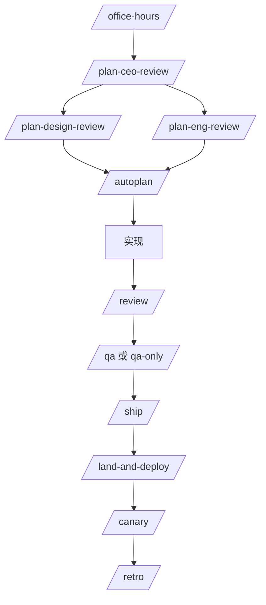
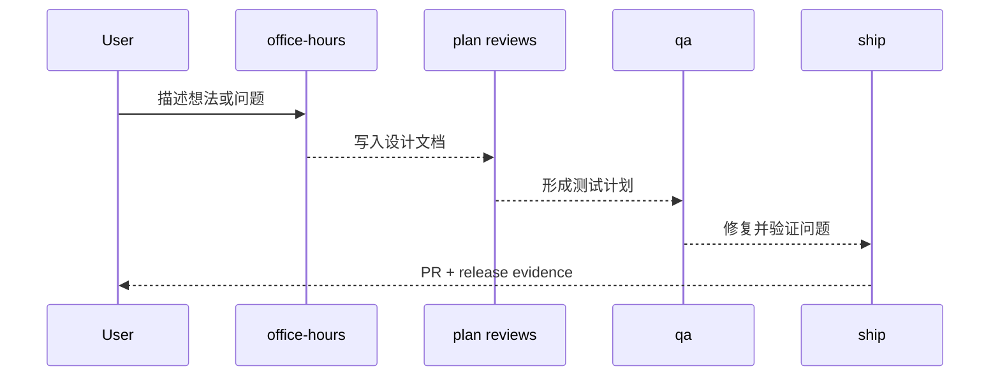

<details>
<summary>相关源文件</summary>

生成本页时使用的主要源文件：

- [README.md](../../../project-repos/gstack/README.md)
- [docs/skills.md](../../../project-repos/gstack/docs/skills.md)
- [office-hours/SKILL.md](../../../project-repos/gstack/office-hours/SKILL.md)
- [plan-eng-review/SKILL.md](../../../project-repos/gstack/plan-eng-review/SKILL.md)
- [qa/SKILL.md](../../../project-repos/gstack/qa/SKILL.md)
- [ship/SKILL.md](../../../project-repos/gstack/ship/SKILL.md)

</details>

# 技能工作流

技能层是 gstack 的主入口。README 把它包装成一个 sprint：从 `/office-hours` 发现真实问题，到 `/plan-*` 锁定方向，再到 `/review`、`/qa`、`/ship`、`/retro`。这不是普通命令列表，而是一套按阶段拆开的代理角色系统。Sources: [README.md:169-238](../../../project-repos/gstack/README.md#L169-L238), [docs/skills.md:5-42](../../../project-repos/gstack/docs/skills.md#L5-L42)

<details class="source-snippets">
<summary>引用源码</summary>

<!-- source-snippets:start -->

#### `README.md:169-238`

```markdown
You said "daily briefing app." The agent said "you're building a chief of staff AI" — because it listened to your pain, not your feature request. Eight commands, end to end. That is not a copilot. That is a team.

## The sprint

gstack is a process, not a collection of tools. The skills run in the order a sprint runs:

**Think → Plan → Build → Review → Test → Ship → Reflect**

Each skill feeds into the next. `/office-hours` writes a design doc that `/plan-ceo-review` reads. `/plan-eng-review` writes a test plan that `/qa` picks up. `/review` catches bugs that `/ship` verifies are fixed. Nothing falls through the cracks because every step knows what came before it.

| Skill | Your specialist | What they do |
|-------|----------------|--------------|
| `/office-hours` | **YC Office Hours** | Start here. Six forcing questions that reframe your product before you write code. Pushes back on your framing, challenges premises, generates implementation alternatives. Design doc feeds into every downstream skill. |
| `/plan-ceo-review` | **CEO / Founder** | Rethink the problem. Find the 10-star product hiding inside the request. Four modes: Expansion, Selective Expansion, Hold Scope, Reduction. |
| `/plan-eng-review` | **Eng Manager** | Lock in architecture, data flow, diagrams, edge cases, and tests. Forces hidden assumptions into the open. |
| `/plan-design-review` | **Senior Designer** | Rates each design dimension 0-10, explains what a 10 looks like, then edits the plan to get there. AI Slop detection. Interactive — one AskUserQuestion per design choice. |
| `/plan-devex-review` | **Developer Experience Lead** | Interactive DX review: explores developer personas, benchmarks against competitors' TTHW, designs your magical moment, traces friction points step by step. Three modes: DX EXPANSION, DX POLISH, DX TRIAGE. 20-45 forcing questions. |
| `/design-consultation` | **Design Partner** | Build a complete design system from scratch. Researches the landscape, proposes creative risks, generates realistic product mockups. |
| `/review` | **Staff Engineer** | Find the bugs that pass CI but blow up in production. Auto-fixes the obvious ones. Flags completeness gaps. |
| `/investigate` | **Debugger** | Systematic root-cause debugging. Iron Law: no fixes without investigation. Traces data flow, tests hypotheses, stops after 3 failed fixes. |
| `/design-review` | **Designer Who Codes** | Same audit as /plan-design-review, then fixes what it finds. Atomic commits, before/after screenshots. |
| `/devex-review` | **DX Tester** | Live developer experience audit. Actually tests your onboarding: navigates docs, tries the getting started flow, times TTHW, screenshots errors. Compares against `/plan-devex-review` scores — the boomerang that shows if your plan matched reality. |
| `/design-shotgun` | **Design Explorer** | "Show me options." Generates 4-6 AI mockup variants, opens a comparison board in your browser, collects your feedback, and iterates. Taste memory learns what you like. Repeat until you love something, then hand it to `/design-html`. |
| `/design-html` | **Design Engineer** | Turn a mockup into production HTML that actually works. Pretext computed layout: text reflows, heights adjust, layouts are dynamic. 30KB, zero deps. Detects React/Svelte/Vue. Smart API routing per design type (landing page vs dashboard vs form). The output is shippable, not a demo. |
| `/qa` | **QA Lead** | Test your app, find bugs, fix them with atomic commits, re-verify. Auto-generates regression tests for every fix. |
| `/qa-only` | **QA Reporter** | Same methodology as /qa but report only. Pure bug report without code changes. |
| `/pair-agent` | **Multi-Agent Coordinator** | Share your browser with any AI agent. One command, one paste, connected. Works with OpenClaw, Hermes, Codex, Cursor, or anything that can curl. Each agent gets its own tab. Auto-launches headed mode so you watch everything. Auto-starts ngrok tunnel for remote agents. Scoped tokens, tab isolation, rate limiting, activity attribution. |
| `/cso` | **Chief Security Officer** | OWASP Top 10 + STRIDE threat model. Zero-noise: 17 false positive exclusions, 8/10+ confidence gate, independent finding verification. Each finding includes a concrete exploit scenario. |
| `/ship` | **Release Engineer** | Sync main, run tests, audit coverage, push, open PR. Bootstraps test frameworks if you don't have one. |
| `/land-and-deploy` | **Release Engineer** | Merge the PR, wait for CI and deploy, verify production health. One command from "approved" to "verified in production." |
| `/canary` | **SRE** | Post-deploy monitoring loop. Watches for console errors, performance regressions, and page failures. |
| `/benchmark` | **Performance Engineer** | Baseline page load times, Core Web Vitals, and resource sizes. Compare before/after on every PR. |
| `/document-release` | **Technical Writer** | Update all project docs to match what you just shipped. Catches stale READMEs automatically. |
| `/retro` | **Eng Manager** | Team-aware weekly retro. Per-person breakdowns, shipping streaks, test health trends, growth opportunities. `/retro global` runs across all your projects and AI tools (Claude Code, Codex, Gemini). |
| `/browse` | **QA Engineer** | Give the agent eyes. Real Chromium browser, real clicks, real screenshots. ~100ms per command. `/open-gstack-browser` launches GStack Browser with sidebar, anti-bot stealth, and auto model routing. |
| `/setup-browser-cookies` | **Session Manager** | Import cookies from your real browser (Chrome, Arc, Brave, Edge) into the headless session. Test authenticated pages. |
| `/autoplan` | **Review Pipeline** | One command, fully reviewed plan. Runs CEO → design → eng review automatically with encoded decision principles. Surfaces only taste decisions for your approval. |
| `/learn` | **Memory** | Manage what gstack learned across sessions. Review, search, prune, and export project-specific patterns, pitfalls, and preferences. Learnings compound across sessions so gstack gets smarter on your codebase over time. |

### Which review should I use?

| Building for... | Plan stage (before code) | Live audit (after shipping) |
|-----------------|--------------------------|----------------------------|
| **End users** (UI, web app, mobile) | `/plan-design-review` | `/design-review` |
| **Developers** (API, CLI, SDK, docs) | `/plan-devex-review` | `/devex-review` |
| **Architecture** (data flow, perf, tests) | `/plan-eng-review` | `/review` |
| **All of the above** | `/autoplan` (runs CEO → design → eng → DX, auto-detects which apply) | — |

### Power tools

| Skill | What it does |
|-------|-------------|
| `/codex` | **Second Opinion** — independent code review from OpenAI Codex CLI. Three modes: review (pass/fail gate), adversarial challenge, and open consultation. Cross-model analysis when both `/review` and `/codex` have run. |
| `/careful` | **Safety Guardrails** — warns before destructive commands (rm -rf, DROP TABLE, force-push). Say "be careful" to activate. Override any warning. |
| `/freeze` | **Edit Lock** — restrict file edits to one directory. Prevents accidental changes outside scope while debugging. |
| `/guard` | **Full Safety** — `/careful` + `/freeze` in one command. Maximum safety for prod work. |
| `/unfreeze` | **Unlock** — remove the `/freeze` boundary. |
| `/open-gstack-browser` | **GStack Browser** — launch GStack Browser with sidebar, anti-bot stealth, auto model routing (Sonnet for actions, Opus for analysis), one-click cookie import, and Claude Code integration. Clean up pages, take smart screenshots, edit CSS, and pass info back to your terminal. |
| `/setup-deploy` | **Deploy Configurator** — one-time setup for `/land-and-deploy`. Detects your platform, production URL, and deploy commands. |
| `/setup-gbrain` | **GBrain Onboarding** — from zero to running gbrain in under 5 minutes. PGLite local, Supabase existing URL, or auto-provision a new Supabase project via Management API. MCP registration for Claude Code + per-repo trust triad (read-write/read-only/deny). [Full guide](USING_GBRAIN_WITH_GSTACK.md). |
| `/gstack-upgrade` | **Self-Updater** — upgrade gstack to latest. Detects global vs vendored install, syncs both, shows what changed. |

### New binaries (v0.19)

Beyond the slash-command skills, gstack ships standalone CLIs for workflows that don't belong inside a session:

| Command | What it does |
|---------|-------------|
| `gstack-model-benchmark` | **Cross-model benchmark** — run the same prompt through Claude, GPT (via Codex CLI), and Gemini; compare latency, tokens, cost, and (optionally) LLM-judge quality score. Auth detected per provider, unavailable providers skip cleanly. Output as table, JSON, or markdown. `--dry-run` validates flags + auth without spending API calls. |
| `gstack-taste-update` | **Design taste learning** — writes approvals and rejections from `/design-shotgun` into a persistent per-project taste profile. Decays 5%/week. Feeds back into future variant generation so the system learns what you actually pick. |
```

#### `docs/skills.md:5-42`

```markdown
| Skill | Your specialist | What they do |
|-------|----------------|--------------|
| [`/office-hours`](#office-hours) | **YC Office Hours** | Start here. Six forcing questions that reframe your product before you write code. Pushes back on your framing, challenges premises, generates implementation alternatives. Design doc feeds into every downstream skill. |
| [`/plan-ceo-review`](#plan-ceo-review) | **CEO / Founder** | Rethink the problem. Find the 10-star product hiding inside the request. Four modes: Expansion, Selective Expansion, Hold Scope, Reduction. |
| [`/plan-eng-review`](#plan-eng-review) | **Eng Manager** | Lock in architecture, data flow, diagrams, edge cases, and tests. Forces hidden assumptions into the open. |
| [`/plan-design-review`](#plan-design-review) | **Senior Designer** | Interactive plan-mode design review. Rates each dimension 0-10, explains what a 10 looks like, fixes the plan. Works in plan mode. |
| [`/design-consultation`](#design-consultation) | **Design Partner** | Build a complete design system from scratch. Knows the landscape, proposes creative risks, generates realistic product mockups. Design at the heart of all other phases. |
| [`/review`](#review) | **Staff Engineer** | Find the bugs that pass CI but blow up in production. Auto-fixes the obvious ones. Flags completeness gaps. |
| [`/investigate`](#investigate) | **Debugger** | Systematic root-cause debugging. Iron Law: no fixes without investigation. Traces data flow, tests hypotheses, stops after 3 failed fixes. |
| [`/design-review`](#design-review) | **Designer Who Codes** | Live-site visual audit + fix loop. 80-item audit, then fixes what it finds. Atomic commits, before/after screenshots. |
| [`/design-shotgun`](#design-shotgun) | **Design Explorer** | Generate multiple AI design variants, open a comparison board in your browser, and iterate until you approve a direction. Taste memory biases toward your preferences. |
| [`/design-html`](#design-html) | **Design Engineer** | Generates production-quality Pretext-native HTML. Works with approved mockups, CEO plans, design reviews, or from scratch. Text reflows on resize, heights adjust to content. Smart API routing per design type. Framework detection for React/Svelte/Vue. |
| [`/qa`](#qa) | **QA Lead** | Test your app, find bugs, fix them with atomic commits, re-verify. Auto-generates regression tests for every fix. |
| [`/qa-only`](#qa) | **QA Reporter** | Same methodology as /qa but report only. Use when you want a pure bug report without code changes. |
| [`/ship`](#ship) | **Release Engineer** | Sync main, run tests, audit coverage, push, open PR. Bootstraps test frameworks if you don't have one. One command. |
| [`/land-and-deploy`](#land-and-deploy) | **Release Engineer** | Merge the PR, wait for CI and deploy, verify production health. One command from "approved" to "verified in production." |
| [`/canary`](#canary) | **SRE** | Post-deploy monitoring loop. Watches for console errors, performance regressions, and page failures using the browse daemon. |
| [`/benchmark`](#benchmark) | **Performance Engineer** | Baseline page load times, Core Web Vitals, and resource sizes. Compare before/after on every PR. Track trends over time. |
| [`/cso`](#cso) | **Chief Security Officer** | OWASP Top 10 + STRIDE threat modeling security audit. Scans for injection, auth, crypto, and access control issues. |
| [`/document-release`](#document-release) | **Technical Writer** | Update all project docs to match what you just shipped. Catches stale READMEs automatically. |
| [`/retro`](#retro) | **Eng Manager** | Team-aware weekly retro. Per-person breakdowns, shipping streaks, test health trends, growth opportunities. |
| [`/browse`](#browse) | **QA Engineer** | Give the agent eyes. Real Chromium browser, real clicks, real screenshots. ~100ms per command. |
| [`/setup-browser-cookies`](#setup-browser-cookies) | **Session Manager** | Import cookies from your real browser (Chrome, Arc, Brave, Edge) into the headless session. Test authenticated pages. |
| [`/autoplan`](#autoplan) | **Review Pipeline** | One command, fully reviewed plan. Runs CEO → design → eng review automatically with encoded decision principles. Surfaces only taste decisions for your approval. |
| [`/learn`](#learn) | **Memory** | Manage what gstack learned across sessions. Review, search, prune, and export project-specific patterns and preferences. |
| | | |
| **Multi-AI** | | |
| [`/codex`](#codex) | **Second Opinion** | Independent review from OpenAI Codex CLI. Three modes: code review (pass/fail gate), adversarial challenge, and open consultation with session continuity. Cross-model analysis when both `/review` and `/codex` have run. |
| | | |
| **Safety & Utility** | | |
| [`/careful`](#safety--guardrails) | **Safety Guardrails** | Warns before destructive commands (rm -rf, DROP TABLE, force-push, git reset --hard). Override any warning. Common build cleanups whitelisted. |
| [`/freeze`](#safety--guardrails) | **Edit Lock** | Restrict all file edits to a single directory. Blocks Edit and Write outside the boundary. Accident prevention for debugging. |
| [`/guard`](#safety--guardrails) | **Full Safety** | Combines /careful + /freeze in one command. Maximum safety for prod work. |
| [`/unfreeze`](#safety--guardrails) | **Unlock** | Remove the /freeze boundary, allowing edits everywhere again. |
| [`/open-gstack-browser`](#open-gstack-browser) | **GStack Browser** | Launch GStack Browser with sidebar, anti-bot stealth, auto model routing, cookie import, and Claude Code integration. Watch every action live. |
| [`/setup-deploy`](#setup-deploy) | **Deploy Configurator** | One-time setup for `/land-and-deploy`. Detects your platform, production URL, and deploy commands. |
| [`/gstack-upgrade`](#gstack-upgrade) | **Self-Updater** | Upgrade gstack to the latest version. Detects global vs vendored install, syncs both, shows what changed. |

```

<!-- source-snippets:end -->
</details>

## Sprint 拓扑



`/office-hours` 明确产出设计文档，后续 CEO/工程/QA 技能会读取该上下文；`docs/skills.md` 也把 office-hours 的结果描述为进入 plan、implementation、review、QA、ship、retro 的生命周期输入。Sources: [docs/skills.md:94-99](../../../project-repos/gstack/docs/skills.md#L94-L99), [README.md:169-177](../../../project-repos/gstack/README.md#L169-L177)

<details class="source-snippets">
<summary>引用源码</summary>

<!-- source-snippets:start -->

#### `docs/skills.md:94-99`

```markdown
### The design doc

Both modes end with a design doc written to `~/.gstack/projects/` — and that doc feeds directly into `/plan-ceo-review` and `/plan-eng-review`. The full lifecycle is now: `office-hours → plan → implement → review → QA → ship → retro`.

After the design doc is approved, `/office-hours` reflects on what it noticed about how you think — not generic praise, but specific callbacks to things you said during the session. The observations appear in the design doc too, so you re-encounter them when you re-read later.

```

#### `README.md:169-177`

```markdown
You said "daily briefing app." The agent said "you're building a chief of staff AI" — because it listened to your pain, not your feature request. Eight commands, end to end. That is not a copilot. That is a team.

## The sprint

gstack is a process, not a collection of tools. The skills run in the order a sprint runs:

**Think → Plan → Build → Review → Test → Ship → Reflect**

Each skill feeds into the next. `/office-hours` writes a design doc that `/plan-ceo-review` reads. `/plan-eng-review` writes a test plan that `/qa` picks up. `/review` catches bugs that `/ship` verifies are fixed. Nothing falls through the cracks because every step knows what came before it.
```

<!-- source-snippets:end -->
</details>

## 角色分层

| 阶段 | 代表技能 | 行为重点 |
|---|---|---|
| 产品发现 | `/office-hours`, `/plan-ceo-review` | 逼问需求证据、scope expansion/reduction、找 10-star product |
| 技术计划 | `/plan-eng-review`, `/autoplan` | 架构、状态、边界、测试矩阵和隐藏假设 |
| 设计计划与实现 | `/plan-design-review`, `/design-shotgun`, `/design-html`, `/design-review` | 视觉方案、mockup、生产 HTML、上线后设计 QA |
| 质量与安全 | `/review`, `/qa`, `/qa-only`, `/cso`, `/benchmark` | diff 审查、浏览器测试、漏洞审计、性能回归 |
| 发布运维 | `/ship`, `/land-and-deploy`, `/canary`, `/document-release` | PR、merge、部署验证、监控、文档同步 |
| 复盘记忆 | `/retro`, `/learn`, `/context-save`, `/context-restore` | 周复盘、跨会话 learnings、上下文恢复 |

Sources: [docs/skills.md:5-42](../../../project-repos/gstack/docs/skills.md#L5-L42), [README.md:179-237](../../../project-repos/gstack/README.md#L179-L237)

<details class="source-snippets">
<summary>引用源码</summary>

<!-- source-snippets:start -->

#### `docs/skills.md:5-42`

```markdown
| Skill | Your specialist | What they do |
|-------|----------------|--------------|
| [`/office-hours`](#office-hours) | **YC Office Hours** | Start here. Six forcing questions that reframe your product before you write code. Pushes back on your framing, challenges premises, generates implementation alternatives. Design doc feeds into every downstream skill. |
| [`/plan-ceo-review`](#plan-ceo-review) | **CEO / Founder** | Rethink the problem. Find the 10-star product hiding inside the request. Four modes: Expansion, Selective Expansion, Hold Scope, Reduction. |
| [`/plan-eng-review`](#plan-eng-review) | **Eng Manager** | Lock in architecture, data flow, diagrams, edge cases, and tests. Forces hidden assumptions into the open. |
| [`/plan-design-review`](#plan-design-review) | **Senior Designer** | Interactive plan-mode design review. Rates each dimension 0-10, explains what a 10 looks like, fixes the plan. Works in plan mode. |
| [`/design-consultation`](#design-consultation) | **Design Partner** | Build a complete design system from scratch. Knows the landscape, proposes creative risks, generates realistic product mockups. Design at the heart of all other phases. |
| [`/review`](#review) | **Staff Engineer** | Find the bugs that pass CI but blow up in production. Auto-fixes the obvious ones. Flags completeness gaps. |
| [`/investigate`](#investigate) | **Debugger** | Systematic root-cause debugging. Iron Law: no fixes without investigation. Traces data flow, tests hypotheses, stops after 3 failed fixes. |
| [`/design-review`](#design-review) | **Designer Who Codes** | Live-site visual audit + fix loop. 80-item audit, then fixes what it finds. Atomic commits, before/after screenshots. |
| [`/design-shotgun`](#design-shotgun) | **Design Explorer** | Generate multiple AI design variants, open a comparison board in your browser, and iterate until you approve a direction. Taste memory biases toward your preferences. |
| [`/design-html`](#design-html) | **Design Engineer** | Generates production-quality Pretext-native HTML. Works with approved mockups, CEO plans, design reviews, or from scratch. Text reflows on resize, heights adjust to content. Smart API routing per design type. Framework detection for React/Svelte/Vue. |
| [`/qa`](#qa) | **QA Lead** | Test your app, find bugs, fix them with atomic commits, re-verify. Auto-generates regression tests for every fix. |
| [`/qa-only`](#qa) | **QA Reporter** | Same methodology as /qa but report only. Use when you want a pure bug report without code changes. |
| [`/ship`](#ship) | **Release Engineer** | Sync main, run tests, audit coverage, push, open PR. Bootstraps test frameworks if you don't have one. One command. |
| [`/land-and-deploy`](#land-and-deploy) | **Release Engineer** | Merge the PR, wait for CI and deploy, verify production health. One command from "approved" to "verified in production." |
| [`/canary`](#canary) | **SRE** | Post-deploy monitoring loop. Watches for console errors, performance regressions, and page failures using the browse daemon. |
| [`/benchmark`](#benchmark) | **Performance Engineer** | Baseline page load times, Core Web Vitals, and resource sizes. Compare before/after on every PR. Track trends over time. |
| [`/cso`](#cso) | **Chief Security Officer** | OWASP Top 10 + STRIDE threat modeling security audit. Scans for injection, auth, crypto, and access control issues. |
| [`/document-release`](#document-release) | **Technical Writer** | Update all project docs to match what you just shipped. Catches stale READMEs automatically. |
| [`/retro`](#retro) | **Eng Manager** | Team-aware weekly retro. Per-person breakdowns, shipping streaks, test health trends, growth opportunities. |
| [`/browse`](#browse) | **QA Engineer** | Give the agent eyes. Real Chromium browser, real clicks, real screenshots. ~100ms per command. |
| [`/setup-browser-cookies`](#setup-browser-cookies) | **Session Manager** | Import cookies from your real browser (Chrome, Arc, Brave, Edge) into the headless session. Test authenticated pages. |
| [`/autoplan`](#autoplan) | **Review Pipeline** | One command, fully reviewed plan. Runs CEO → design → eng review automatically with encoded decision principles. Surfaces only taste decisions for your approval. |
| [`/learn`](#learn) | **Memory** | Manage what gstack learned across sessions. Review, search, prune, and export project-specific patterns and preferences. |
| | | |
| **Multi-AI** | | |
| [`/codex`](#codex) | **Second Opinion** | Independent review from OpenAI Codex CLI. Three modes: code review (pass/fail gate), adversarial challenge, and open consultation with session continuity. Cross-model analysis when both `/review` and `/codex` have run. |
| | | |
| **Safety & Utility** | | |
| [`/careful`](#safety--guardrails) | **Safety Guardrails** | Warns before destructive commands (rm -rf, DROP TABLE, force-push, git reset --hard). Override any warning. Common build cleanups whitelisted. |
| [`/freeze`](#safety--guardrails) | **Edit Lock** | Restrict all file edits to a single directory. Blocks Edit and Write outside the boundary. Accident prevention for debugging. |
| [`/guard`](#safety--guardrails) | **Full Safety** | Combines /careful + /freeze in one command. Maximum safety for prod work. |
| [`/unfreeze`](#safety--guardrails) | **Unlock** | Remove the /freeze boundary, allowing edits everywhere again. |
| [`/open-gstack-browser`](#open-gstack-browser) | **GStack Browser** | Launch GStack Browser with sidebar, anti-bot stealth, auto model routing, cookie import, and Claude Code integration. Watch every action live. |
| [`/setup-deploy`](#setup-deploy) | **Deploy Configurator** | One-time setup for `/land-and-deploy`. Detects your platform, production URL, and deploy commands. |
| [`/gstack-upgrade`](#gstack-upgrade) | **Self-Updater** | Upgrade gstack to the latest version. Detects global vs vendored install, syncs both, shows what changed. |

```

#### `README.md:179-237`

```markdown
| Skill | Your specialist | What they do |
|-------|----------------|--------------|
| `/office-hours` | **YC Office Hours** | Start here. Six forcing questions that reframe your product before you write code. Pushes back on your framing, challenges premises, generates implementation alternatives. Design doc feeds into every downstream skill. |
| `/plan-ceo-review` | **CEO / Founder** | Rethink the problem. Find the 10-star product hiding inside the request. Four modes: Expansion, Selective Expansion, Hold Scope, Reduction. |
| `/plan-eng-review` | **Eng Manager** | Lock in architecture, data flow, diagrams, edge cases, and tests. Forces hidden assumptions into the open. |
| `/plan-design-review` | **Senior Designer** | Rates each design dimension 0-10, explains what a 10 looks like, then edits the plan to get there. AI Slop detection. Interactive — one AskUserQuestion per design choice. |
| `/plan-devex-review` | **Developer Experience Lead** | Interactive DX review: explores developer personas, benchmarks against competitors' TTHW, designs your magical moment, traces friction points step by step. Three modes: DX EXPANSION, DX POLISH, DX TRIAGE. 20-45 forcing questions. |
| `/design-consultation` | **Design Partner** | Build a complete design system from scratch. Researches the landscape, proposes creative risks, generates realistic product mockups. |
| `/review` | **Staff Engineer** | Find the bugs that pass CI but blow up in production. Auto-fixes the obvious ones. Flags completeness gaps. |
| `/investigate` | **Debugger** | Systematic root-cause debugging. Iron Law: no fixes without investigation. Traces data flow, tests hypotheses, stops after 3 failed fixes. |
| `/design-review` | **Designer Who Codes** | Same audit as /plan-design-review, then fixes what it finds. Atomic commits, before/after screenshots. |
| `/devex-review` | **DX Tester** | Live developer experience audit. Actually tests your onboarding: navigates docs, tries the getting started flow, times TTHW, screenshots errors. Compares against `/plan-devex-review` scores — the boomerang that shows if your plan matched reality. |
| `/design-shotgun` | **Design Explorer** | "Show me options." Generates 4-6 AI mockup variants, opens a comparison board in your browser, collects your feedback, and iterates. Taste memory learns what you like. Repeat until you love something, then hand it to `/design-html`. |
| `/design-html` | **Design Engineer** | Turn a mockup into production HTML that actually works. Pretext computed layout: text reflows, heights adjust, layouts are dynamic. 30KB, zero deps. Detects React/Svelte/Vue. Smart API routing per design type (landing page vs dashboard vs form). The output is shippable, not a demo. |
| `/qa` | **QA Lead** | Test your app, find bugs, fix them with atomic commits, re-verify. Auto-generates regression tests for every fix. |
| `/qa-only` | **QA Reporter** | Same methodology as /qa but report only. Pure bug report without code changes. |
| `/pair-agent` | **Multi-Agent Coordinator** | Share your browser with any AI agent. One command, one paste, connected. Works with OpenClaw, Hermes, Codex, Cursor, or anything that can curl. Each agent gets its own tab. Auto-launches headed mode so you watch everything. Auto-starts ngrok tunnel for remote agents. Scoped tokens, tab isolation, rate limiting, activity attribution. |
| `/cso` | **Chief Security Officer** | OWASP Top 10 + STRIDE threat model. Zero-noise: 17 false positive exclusions, 8/10+ confidence gate, independent finding verification. Each finding includes a concrete exploit scenario. |
| `/ship` | **Release Engineer** | Sync main, run tests, audit coverage, push, open PR. Bootstraps test frameworks if you don't have one. |
| `/land-and-deploy` | **Release Engineer** | Merge the PR, wait for CI and deploy, verify production health. One command from "approved" to "verified in production." |
| `/canary` | **SRE** | Post-deploy monitoring loop. Watches for console errors, performance regressions, and page failures. |
| `/benchmark` | **Performance Engineer** | Baseline page load times, Core Web Vitals, and resource sizes. Compare before/after on every PR. |
| `/document-release` | **Technical Writer** | Update all project docs to match what you just shipped. Catches stale READMEs automatically. |
| `/retro` | **Eng Manager** | Team-aware weekly retro. Per-person breakdowns, shipping streaks, test health trends, growth opportunities. `/retro global` runs across all your projects and AI tools (Claude Code, Codex, Gemini). |
| `/browse` | **QA Engineer** | Give the agent eyes. Real Chromium browser, real clicks, real screenshots. ~100ms per command. `/open-gstack-browser` launches GStack Browser with sidebar, anti-bot stealth, and auto model routing. |
| `/setup-browser-cookies` | **Session Manager** | Import cookies from your real browser (Chrome, Arc, Brave, Edge) into the headless session. Test authenticated pages. |
| `/autoplan` | **Review Pipeline** | One command, fully reviewed plan. Runs CEO → design → eng review automatically with encoded decision principles. Surfaces only taste decisions for your approval. |
| `/learn` | **Memory** | Manage what gstack learned across sessions. Review, search, prune, and export project-specific patterns, pitfalls, and preferences. Learnings compound across sessions so gstack gets smarter on your codebase over time. |

### Which review should I use?

| Building for... | Plan stage (before code) | Live audit (after shipping) |
|-----------------|--------------------------|----------------------------|
| **End users** (UI, web app, mobile) | `/plan-design-review` | `/design-review` |
| **Developers** (API, CLI, SDK, docs) | `/plan-devex-review` | `/devex-review` |
| **Architecture** (data flow, perf, tests) | `/plan-eng-review` | `/review` |
| **All of the above** | `/autoplan` (runs CEO → design → eng → DX, auto-detects which apply) | — |

### Power tools

| Skill | What it does |
|-------|-------------|
| `/codex` | **Second Opinion** — independent code review from OpenAI Codex CLI. Three modes: review (pass/fail gate), adversarial challenge, and open consultation. Cross-model analysis when both `/review` and `/codex` have run. |
| `/careful` | **Safety Guardrails** — warns before destructive commands (rm -rf, DROP TABLE, force-push). Say "be careful" to activate. Override any warning. |
| `/freeze` | **Edit Lock** — restrict file edits to one directory. Prevents accidental changes outside scope while debugging. |
| `/guard` | **Full Safety** — `/careful` + `/freeze` in one command. Maximum safety for prod work. |
| `/unfreeze` | **Unlock** — remove the `/freeze` boundary. |
| `/open-gstack-browser` | **GStack Browser** — launch GStack Browser with sidebar, anti-bot stealth, auto model routing (Sonnet for actions, Opus for analysis), one-click cookie import, and Claude Code integration. Clean up pages, take smart screenshots, edit CSS, and pass info back to your terminal. |
| `/setup-deploy` | **Deploy Configurator** — one-time setup for `/land-and-deploy`. Detects your platform, production URL, and deploy commands. |
| `/setup-gbrain` | **GBrain Onboarding** — from zero to running gbrain in under 5 minutes. PGLite local, Supabase existing URL, or auto-provision a new Supabase project via Management API. MCP registration for Claude Code + per-repo trust triad (read-write/read-only/deny). [Full guide](USING_GBRAIN_WITH_GSTACK.md). |
| `/gstack-upgrade` | **Self-Updater** — upgrade gstack to latest. Detects global vs vendored install, syncs both, shows what changed. |

### New binaries (v0.19)

Beyond the slash-command skills, gstack ships standalone CLIs for workflows that don't belong inside a session:

| Command | What it does |
|---------|-------------|
| `gstack-model-benchmark` | **Cross-model benchmark** — run the same prompt through Claude, GPT (via Codex CLI), and Gemini; compare latency, tokens, cost, and (optionally) LLM-judge quality score. Auth detected per provider, unavailable providers skip cleanly. Output as table, JSON, or markdown. `--dry-run` validates flags + auth without spending API calls. |
```

<!-- source-snippets:end -->
</details>

## 决策传递

技能之间通过文件系统和约定传递上下文。例如 `/office-hours` 会把设计文档写到 `~/.gstack/projects/`，后续 `/plan-ceo-review` 和 `/plan-eng-review` 会消费；`/plan-eng-review` 写出的测试计划会被 `/qa` 自动捡起。Sources: [docs/skills.md:94-99](../../../project-repos/gstack/docs/skills.md#L94-L99), [docs/skills.md:229-231](../../../project-repos/gstack/docs/skills.md#L229-L231)

<details class="source-snippets">
<summary>引用源码</summary>

<!-- source-snippets:start -->

#### `docs/skills.md:94-99`

```markdown
### The design doc

Both modes end with a design doc written to `~/.gstack/projects/` — and that doc feeds directly into `/plan-ceo-review` and `/plan-eng-review`. The full lifecycle is now: `office-hours → plan → implement → review → QA → ship → retro`.

After the design doc is approved, `/office-hours` reflects on what it noticed about how you think — not generic praise, but specific callbacks to things you said during the session. The observations appear in the design doc too, so you re-encounter them when you re-read later.

```

#### `docs/skills.md:229-231`

```markdown
### Plan-to-QA flow

When `/plan-eng-review` finishes the test review section, it writes a test plan artifact to `~/.gstack/projects/`. When you later run `/qa`, it picks up that test plan automatically — your engineering review feeds directly into QA testing with no manual copy-paste.
```

<!-- source-snippets:end -->
</details>



## 技能包不是全部等价

仓库里既有大型工作流技能，也有安全/范围控制小技能。`/careful`、`/freeze`、`/guard`、`/unfreeze` 只负责安全边界；`/browse`、`/open-gstack-browser` 是工具入口；`/skillify` 和 `browser-skills/*` 则把成功的浏览器流程固化为可复用脚本。Sources: [README.md:244-251](../../../project-repos/gstack/README.md#L244-L251), [README.md:285-293](../../../project-repos/gstack/README.md#L285-L293), [browser-skills/hackernews-frontpage/SKILL.md:1-12](../../../project-repos/gstack/browser-skills/hackernews-frontpage/SKILL.md#L1-L12)

<details class="source-snippets">
<summary>引用源码</summary>

<!-- source-snippets:start -->

#### `README.md:244-251`

```markdown
### Domain skills + raw CDP escape hatch

Two new browser primitives compound the gstack agent over time:

- **`$B domain-skill save`** — agent saves a per-site note (e.g., "LinkedIn's Apply button lives in an iframe") that fires automatically next time it visits that hostname. Quarantined → active after 3 successful uses → optional cross-project promotion via `$B domain-skill promote-to-global`. Storage lives alongside `/learn`'s per-project learnings file. Full reference: **[docs/domain-skills.md](docs/domain-skills.md)**.
- **`$B cdp <Domain.method>`** — raw Chrome DevTools Protocol escape hatch for the rare case curated commands miss. Deny-default: methods must be explicitly added to `browse/src/cdp-allowlist.ts` with a one-line justification. Two-tier mutex serializes browser-scoped CDP calls against per-tab work. Output for data-exfil methods is wrapped in the UNTRUSTED envelope.

> Want raw CDP with no rails, no allowlist, no daemon — just thin transport from agent to Chrome? [browser-use/browser-harness-js](https://github.com/browser-use/browser-harness-js) is a different philosophy (agent-authored helpers vs gstack's curated commands) and a good fit if you don't want gstack's security stack. The two can coexist: gstack's `$B cdp` and harness can both attach to the same Chrome via Playwright's `newCDPSession`.
```

#### `README.md:285-293`

```markdown
**Browser handoff when the AI gets stuck.** Hit a CAPTCHA, auth wall, or MFA prompt? `$B handoff` opens a visible Chrome at the exact same page with all your cookies and tabs intact. Solve the problem, tell Claude you're done, `$B resume` picks up right where it left off. The agent even suggests it automatically after 3 consecutive failures.

**`/pair-agent` is cross-agent coordination.** You're in Claude Code. You also have OpenClaw running. Or Hermes. Or Codex. You want them both looking at the same website. Type `/pair-agent`, pick your agent, and a GStack Browser window opens so you can watch. The skill prints a block of instructions. Paste that block into the other agent's chat. It exchanges a one-time setup key for a session token, creates its own tab, and starts browsing. You see both agents working in the same browser, each in their own tab, neither able to interfere with the other. If ngrok is installed, the tunnel starts automatically so the other agent can be on a completely different machine. Same-machine agents get a zero-friction shortcut that writes credentials directly. This is the first time AI agents from different vendors can coordinate through a shared browser with real security: scoped tokens, tab isolation, rate limiting, domain restrictions, and activity attribution.

**Multi-AI second opinion.** `/codex` gets an independent review from OpenAI's Codex CLI — a completely different AI looking at the same diff. Three modes: code review with a pass/fail gate, adversarial challenge that actively tries to break your code, and open consultation with session continuity. When both `/review` (Claude) and `/codex` (OpenAI) have reviewed the same branch, you get a cross-model analysis showing which findings overlap and which are unique to each.

**Safety guardrails on demand.** Say "be careful" and `/careful` warns before any destructive command — rm -rf, DROP TABLE, force-push, git reset --hard. `/freeze` locks edits to one directory while debugging so Claude can't accidentally "fix" unrelated code. `/guard` activates both. `/investigate` auto-freezes to the module being investigated.

**Proactive skill suggestions.** gstack notices what stage you're in — brainstorming, reviewing, debugging, testing — and suggests the right skill. Don't like it? Say "stop suggesting" and it remembers across sessions.
```

#### `browser-skills/hackernews-frontpage/SKILL.md:1-12`

```markdown
---
name: hackernews-frontpage
description: Scrape the Hacker News front page (titles, points, comment counts).
host: news.ycombinator.com
trusted: true
source: human
version: 1.0.0
args: []
triggers:
  - scrape hacker news frontpage
  - scrape hn frontpage
  - get hn top stories
```

<!-- source-snippets:end -->
</details>

## 相关页面

- [项目概览](overview.md)
- [技能生成系统](skill-generation.md)
- [测试、CI 与质量门](testing-ci-quality.md)
