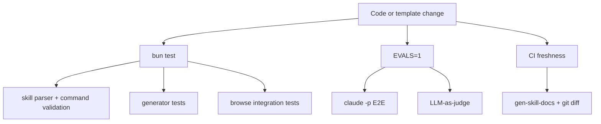

<details>
<summary>相关源文件</summary>

生成本页时使用的主要源文件：

- [package.json](../../../project-repos/gstack/package.json)
- [CONTRIBUTING.md](../../../project-repos/gstack/CONTRIBUTING.md)
- [test/skill-validation.test.ts](../../../project-repos/gstack/test/skill-validation.test.ts)
- [.github/workflows/skill-docs.yml](../../../project-repos/gstack/.github/workflows/skill-docs.yml)
- [.github/workflows/evals.yml](../../../project-repos/gstack/.github/workflows/evals.yml)
- [ARCHITECTURE.md](../../../project-repos/gstack/ARCHITECTURE.md)
- [browse/src/cdp-allowlist.ts](../../../project-repos/gstack/browse/src/cdp-allowlist.ts)

</details>

# 测试、CI 与质量门

gstack 的质量体系分成免费静态测试、付费/慢速 E2E eval、LLM-as-judge、技能文档 freshness gate 和 GitHub Actions 矩阵。`package.json` 把这些都暴露为 `bun test`、`test:evals`、`test:e2e`、`test:gate`、`skill:check` 等脚本。Sources: [package.json:19-41](../../../project-repos/gstack/package.json#L19-L41), [CONTRIBUTING.md:109-137](../../../project-repos/gstack/CONTRIBUTING.md#L109-L137)

<details class="source-snippets">
<summary>引用源码</summary>

<!-- source-snippets:start -->

#### `package.json:19-41`

```json
    "test": "bun test browse/test/ test/ make-pdf/test/ --ignore 'test/skill-e2e-*.test.ts' --ignore test/skill-llm-eval.test.ts --ignore test/skill-routing-e2e.test.ts --ignore test/codex-e2e.test.ts --ignore test/gemini-e2e.test.ts && (bun run slop:diff 2>/dev/null || true)",
    "test:evals": "EVALS=1 bun test --retry 2 --concurrent --max-concurrency ${EVALS_CONCURRENCY:-15} test/skill-llm-eval.test.ts test/skill-e2e-*.test.ts test/skill-routing-e2e.test.ts test/codex-e2e.test.ts test/gemini-e2e.test.ts",
    "test:evals:all": "EVALS=1 EVALS_ALL=1 bun test --retry 2 --concurrent --max-concurrency ${EVALS_CONCURRENCY:-15} test/skill-llm-eval.test.ts test/skill-e2e-*.test.ts test/skill-routing-e2e.test.ts test/codex-e2e.test.ts test/gemini-e2e.test.ts",
    "test:e2e": "EVALS=1 bun test --retry 2 --concurrent --max-concurrency ${EVALS_CONCURRENCY:-15} test/skill-e2e-*.test.ts test/skill-routing-e2e.test.ts test/codex-e2e.test.ts test/gemini-e2e.test.ts",
    "test:e2e:all": "EVALS=1 EVALS_ALL=1 bun test --retry 2 --concurrent --max-concurrency ${EVALS_CONCURRENCY:-15} test/skill-e2e-*.test.ts test/skill-routing-e2e.test.ts test/codex-e2e.test.ts test/gemini-e2e.test.ts",
    "test:gate": "EVALS=1 EVALS_TIER=gate bun test --retry 2 --concurrent --max-concurrency ${EVALS_CONCURRENCY:-15} test/skill-llm-eval.test.ts test/skill-e2e-*.test.ts test/skill-routing-e2e.test.ts test/codex-e2e.test.ts test/gemini-e2e.test.ts",
    "test:periodic": "EVALS=1 EVALS_TIER=periodic EVALS_ALL=1 bun test --retry 2 --concurrent --max-concurrency ${EVALS_CONCURRENCY:-15} test/skill-e2e-*.test.ts test/skill-routing-e2e.test.ts test/codex-e2e.test.ts test/gemini-e2e.test.ts",
    "test:codex": "EVALS=1 bun test test/codex-e2e.test.ts",
    "test:codex:all": "EVALS=1 EVALS_ALL=1 bun test test/codex-e2e.test.ts",
    "test:gemini": "EVALS=1 bun test test/gemini-e2e.test.ts",
    "test:gemini:all": "EVALS=1 EVALS_ALL=1 bun test test/gemini-e2e.test.ts",
    "skill:check": "bun run scripts/skill-check.ts",
    "dev:skill": "bun run scripts/dev-skill.ts",
    "start": "bun run browse/src/server.ts",
    "eval:list": "bun run scripts/eval-list.ts",
    "eval:compare": "bun run scripts/eval-compare.ts",
    "eval:summary": "bun run scripts/eval-summary.ts",
    "eval:watch": "bun run scripts/eval-watch.ts",
    "eval:select": "bun run scripts/eval-select.ts",
    "analytics": "bun run scripts/analytics.ts",
    "test:audit": "bun test test/audit-compliance.test.ts",
    "slop": "npx slop-scan scan . 2>/dev/null || echo 'slop-scan not available (install with: npm i -g slop-scan)'",
    "slop:diff": "bun run scripts/slop-diff.ts"
```

#### `CONTRIBUTING.md:109-137`

````markdown
## Testing & evals

### Setup

```bash
# 1. Copy .env.example and add your API key
cp .env.example .env
# Edit .env → set ANTHROPIC_API_KEY=sk-ant-...

# 2. Install deps (if you haven't already)
bun install
```

Bun auto-loads `.env` — no extra config. Conductor workspaces inherit `.env` from the main worktree automatically (see "Conductor workspaces" below).

### Test tiers

| Tier | Command | Cost | What it tests |
|------|---------|------|---------------|
| 1 — Static | `bun test` | Free | Command validation, snapshot flags, SKILL.md correctness, TODOS-format.md refs, observability unit tests |
| 2 — E2E | `bun run test:e2e` | ~$3.85 | Full skill execution via `claude -p` subprocess |
| 3 — LLM eval | `bun run test:evals` | ~$0.15 standalone | LLM-as-judge scoring of generated SKILL.md docs |
| 2+3 | `bun run test:evals` | ~$4 combined | E2E + LLM-as-judge (runs both) |

```bash
bun test                     # Tier 1 only (runs on every commit, <5s)
bun run test:e2e             # Tier 2: E2E only (needs EVALS=1, can't run inside Claude Code)
bun run test:evals           # Tier 2 + 3 combined (~$4/run)
```
````

<!-- source-snippets:end -->
</details>
## 测试分层



`CONTRIBUTING.md` 说明 Tier 1 是免费静态验证，Tier 2 通过 `claude -p` 跑完整技能执行，Tier 3 用 Sonnet 给生成技能文档打分。Sources: [CONTRIBUTING.md:124-205](../../../project-repos/gstack/CONTRIBUTING.md#L124-L205), [ARCHITECTURE.md:290-298](../../../project-repos/gstack/ARCHITECTURE.md#L290-L298), [ARCHITECTURE.md:332-412](../../../project-repos/gstack/ARCHITECTURE.md#L332-L412)

<details class="source-snippets">
<summary>引用源码</summary>

<!-- source-snippets:start -->

#### `CONTRIBUTING.md:124-205`

````markdown
### Test tiers

| Tier | Command | Cost | What it tests |
|------|---------|------|---------------|
| 1 — Static | `bun test` | Free | Command validation, snapshot flags, SKILL.md correctness, TODOS-format.md refs, observability unit tests |
| 2 — E2E | `bun run test:e2e` | ~$3.85 | Full skill execution via `claude -p` subprocess |
| 3 — LLM eval | `bun run test:evals` | ~$0.15 standalone | LLM-as-judge scoring of generated SKILL.md docs |
| 2+3 | `bun run test:evals` | ~$4 combined | E2E + LLM-as-judge (runs both) |

```bash
bun test                     # Tier 1 only (runs on every commit, <5s)
bun run test:e2e             # Tier 2: E2E only (needs EVALS=1, can't run inside Claude Code)
bun run test:evals           # Tier 2 + 3 combined (~$4/run)
```

### Tier 1: Static validation (free)

Runs automatically with `bun test`. No API keys needed.

- **Skill parser tests** (`test/skill-parser.test.ts`) — Extracts every `$B` command from SKILL.md bash code blocks and validates against the command registry in `browse/src/commands.ts`. Catches typos, removed commands, and invalid snapshot flags.
- **Skill validation tests** (`test/skill-validation.test.ts`) — Validates that SKILL.md files reference only real commands and flags, and that command descriptions meet quality thresholds.
- **Generator tests** (`test/gen-skill-docs.test.ts`) — Tests the template system: verifies placeholders resolve correctly, output includes value hints for flags (e.g. `-d <N>` not just `-d`), enriched descriptions for key commands (e.g. `is` lists valid states, `press` lists key examples).

### Tier 2: E2E via `claude -p` (~$3.85/run)

Spawns `claude -p` as a subprocess with `--output-format stream-json --verbose`, streams NDJSON for real-time progress, and scans for browse errors. This is the closest thing to "does this skill actually work end-to-end?"

```bash
# Must run from a plain terminal — can't nest inside Claude Code or Conductor
EVALS=1 bun test test/skill-e2e-*.test.ts
```

- Gated by `EVALS=1` env var (prevents accidental expensive runs)
- Auto-skips if running inside Claude Code (`claude -p` can't nest)
- API connectivity pre-check — fails fast on ConnectionRefused before burning budget
- Real-time progress to stderr: `[Ns] turn T tool #C: Name(...)`
- Saves full NDJSON transcripts and failure JSON for debugging
- Tests live in `test/skill-e2e-*.test.ts` (split by category), runner logic in `test/helpers/session-runner.ts`

### E2E observability

When E2E tests run, they produce machine-readable artifacts in `~/.gstack-dev/`:

| Artifact | Path | Purpose |
|----------|------|---------|
| Heartbeat | `e2e-live.json` | Current test status (updated per tool call) |
| Partial results | `evals/_partial-e2e.json` | Completed tests (survives kills) |
| Progress log | `e2e-runs/{runId}/progress.log` | Append-only text log |
| NDJSON transcripts | `e2e-runs/{runId}/{test}.ndjson` | Raw `claude -p` output per test |
| Failure JSON | `e2e-runs/{runId}/{test}-failure.json` | Diagnostic data on failure |

**Live dashboard:** Run `bun run eval:watch` in a second terminal to see a live dashboard showing completed tests, the currently running test, and cost. Use `--tail` to also show the last 10 lines of progress.log.

**Eval history tools:**

```bash
bun run eval:list            # list all eval runs (turns, duration, cost per run)
bun run eval:compare         # compare two runs — shows per-test deltas + Takeaway commentary
bun run eval:summary         # aggregate stats + per-test efficiency averages across runs
```

**Eval comparison commentary:** `eval:compare` generates natural-language Takeaway sections interpreting what changed between runs — flagging regressions, noting improvements, calling out efficiency gains (fewer turns, faster, cheaper), and producing an overall summary. This is driven by `generateCommentary()` in `eval-store.ts`.

Artifacts are never cleaned up — they accumulate in `~/.gstack-dev/` for post-mortem debugging and trend analysis.

### Tier 3: LLM-as-judge (~$0.15/run)

Uses Claude Sonnet to score generated SKILL.md docs on three dimensions:

- **Clarity** — Can an AI agent understand the instructions without ambiguity?
- **Completeness** — Are all commands, flags, and usage patterns documented?
- **Actionability** — Can the agent execute tasks using only the information in the doc?

Each dimension is scored 1-5. Threshold: every dimension must score **≥ 4**. There's also a regression test that compares generated docs against the hand-maintained baseline from `origin/main` — generated must score equal or higher.

```bash
# Needs ANTHROPIC_API_KEY in .env — included in bun run test:evals
```

- Uses `claude-sonnet-4-6` for scoring stability
- Tests live in `test/skill-llm-eval.test.ts`
- Calls the Anthropic API directly (not `claude -p`), so it works from anywhere including inside Claude Code
````

#### `ARCHITECTURE.md:290-298`

```markdown
### Template test tiers

| Tier | What | Cost | Speed |
|------|------|------|-------|
| 1 — Static validation | Parse every `$B` command in SKILL.md, validate against registry | Free | <2s |
| 2 — E2E via `claude -p` | Spawn real Claude session, run each skill, check for errors | ~$3.85 | ~20min |
| 3 — LLM-as-judge | Sonnet scores docs on clarity/completeness/actionability | ~$0.15 | ~30s |

Tier 1 runs on every `bun test`. Tiers 2+3 are gated behind `EVALS=1`. The idea is: catch 95% of issues for free, use LLMs only for judgment calls.
```

#### `ARCHITECTURE.md:332-412`

````markdown
## E2E test infrastructure

### Session runner (`test/helpers/session-runner.ts`)

E2E tests spawn `claude -p` as a completely independent subprocess — not via the Agent SDK, which can't nest inside Claude Code sessions. The runner:

1. Writes the prompt to a temp file (avoids shell escaping issues)
2. Spawns `sh -c 'cat prompt | claude -p --output-format stream-json --verbose'`
3. Streams NDJSON from stdout for real-time progress
4. Races against a configurable timeout
5. Parses the full NDJSON transcript into structured results

The `parseNDJSON()` function is pure — no I/O, no side effects — making it independently testable.

### Observability data flow

```
  skill-e2e-*.test.ts
        │
        │ generates runId, passes testName + runId to each call
        │
  ┌─────┼──────────────────────────────┐
  │     │                              │
  │  runSkillTest()              evalCollector
  │  (session-runner.ts)         (eval-store.ts)
  │     │                              │
  │  per tool call:              per addTest():
  │  ┌──┼──────────┐              savePartial()
  │  │  │          │                   │
  │  ▼  ▼          ▼                   ▼
  │ [HB] [PL]    [NJ]          _partial-e2e.json
  │  │    │        │             (atomic overwrite)
  │  │    │        │
  │  ▼    ▼        ▼
  │ e2e-  prog-  {name}
  │ live  ress   .ndjson
  │ .json .log
  │
  │  on failure:
  │  {name}-failure.json
  │
  │  ALL files in ~/.gstack-dev/
  │  Run dir: e2e-runs/{runId}/
  │
  │         eval-watch.ts
  │              │
  │        ┌─────┴─────┐
  │     read HB     read partial
  │        └─────┬─────┘
  │              ▼
  │        render dashboard
  │        (stale >10min? warn)
```

**Split ownership:** session-runner owns the heartbeat (current test state), eval-store owns partial results (completed test state). The watcher reads both. Neither component knows about the other — they share data only through the filesystem.

**Non-fatal everything:** All observability I/O is wrapped in try/catch. A write failure never causes a test to fail. The tests themselves are the source of truth; observability is best-effort.

**Machine-readable diagnostics:** Each test result includes `exit_reason` (success, timeout, error_max_turns, error_api, exit_code_N), `timeout_at_turn`, and `last_tool_call`. This enables `jq` queries like:
```bash
jq '.tests[] | select(.exit_reason == "timeout") | .last_tool_call' ~/.gstack-dev/evals/_partial-e2e.json
```

### Eval persistence (`test/helpers/eval-store.ts`)

The `EvalCollector` accumulates test results and writes them in two ways:

1. **Incremental:** `savePartial()` writes `_partial-e2e.json` after each test (atomic: write `.tmp`, `fs.renameSync`). Survives kills.
2. **Final:** `finalize()` writes a timestamped eval file (e.g. `e2e-20260314-143022.json`). The partial file is never cleaned up — it persists alongside the final file for observability.

`eval:compare` diffs two eval runs. `eval:summary` aggregates stats across all runs in `~/.gstack-dev/evals/`.

### Test tiers

| Tier | What | Cost | Speed |
|------|------|------|-------|
| 1 — Static validation | Parse `$B` commands, validate against registry, observability unit tests | Free | <5s |
| 2 — E2E via `claude -p` | Spawn real Claude session, run each skill, scan for errors | ~$3.85 | ~20min |
| 3 — LLM-as-judge | Sonnet scores docs on clarity/completeness/actionability | ~$0.15 | ~30s |

Tier 1 runs on every `bun test`. Tiers 2+3 are gated behind `EVALS=1`. The idea: catch 95% of issues for free, use LLMs only for judgment calls and integration testing.
````

<!-- source-snippets:end -->
</details>
## 静态验证重点

`test/skill-validation.test.ts` 检查 `$B` 命令是否存在于 registry、snapshot flags 是否有效、`COMMAND_DESCRIPTIONS` 是否覆盖所有 command set、生成的 `SKILL.md` 是否没有未解析 placeholder。Sources: [test/skill-validation.test.ts:1-116](../../../project-repos/gstack/test/skill-validation.test.ts#L1-L116), [test/skill-validation.test.ts:118-224](../../../project-repos/gstack/test/skill-validation.test.ts#L118-L224)

<details class="source-snippets">
<summary>引用源码</summary>

<!-- source-snippets:start -->

#### `test/skill-validation.test.ts:1-116`

```typescript
import { describe, test, expect } from 'bun:test';
import { validateSkill, extractRemoteSlugPatterns, extractWeightsFromTable } from './helpers/skill-parser';
import { ALL_COMMANDS, COMMAND_DESCRIPTIONS, READ_COMMANDS, WRITE_COMMANDS, META_COMMANDS } from '../browse/src/commands';
import { SNAPSHOT_FLAGS } from '../browse/src/snapshot';
import * as fs from 'fs';
import * as path from 'path';

const ROOT = path.resolve(import.meta.dir, '..');

describe('SKILL.md command validation', () => {
  test('all $B commands in SKILL.md are valid browse commands', () => {
    const result = validateSkill(path.join(ROOT, 'SKILL.md'));
    expect(result.invalid).toHaveLength(0);
    expect(result.valid.length).toBeGreaterThan(0);
  });

  test('all snapshot flags in SKILL.md are valid', () => {
    const result = validateSkill(path.join(ROOT, 'SKILL.md'));
    expect(result.snapshotFlagErrors).toHaveLength(0);
  });

  test('all $B commands in browse/SKILL.md are valid browse commands', () => {
    const result = validateSkill(path.join(ROOT, 'browse', 'SKILL.md'));
    expect(result.invalid).toHaveLength(0);
    expect(result.valid.length).toBeGreaterThan(0);
  });

  test('all snapshot flags in browse/SKILL.md are valid', () => {
    const result = validateSkill(path.join(ROOT, 'browse', 'SKILL.md'));
    expect(result.snapshotFlagErrors).toHaveLength(0);
  });

  test('all $B commands in qa/SKILL.md are valid browse commands', () => {
    const qaSkill = path.join(ROOT, 'qa', 'SKILL.md');
    if (!fs.existsSync(qaSkill)) return; // skip if missing
    const result = validateSkill(qaSkill);
    expect(result.invalid).toHaveLength(0);
  });

  test('all snapshot flags in qa/SKILL.md are valid', () => {
    const qaSkill = path.join(ROOT, 'qa', 'SKILL.md');
    if (!fs.existsSync(qaSkill)) return;
    const result = validateSkill(qaSkill);
    expect(result.snapshotFlagErrors).toHaveLength(0);
  });

  test('all $B commands in qa-only/SKILL.md are valid browse commands', () => {
    const qaOnlySkill = path.join(ROOT, 'qa-only', 'SKILL.md');
    if (!fs.existsSync(qaOnlySkill)) return;
    const result = validateSkill(qaOnlySkill);
    expect(result.invalid).toHaveLength(0);
  });

  test('all snapshot flags in qa-only/SKILL.md are valid', () => {
    const qaOnlySkill = path.join(ROOT, 'qa-only', 'SKILL.md');
    if (!fs.existsSync(qaOnlySkill)) return;
    const result = validateSkill(qaOnlySkill);
    expect(result.snapshotFlagErrors).toHaveLength(0);
  });

  test('all $B commands in plan-design-review/SKILL.md are valid browse commands', () => {
    const skill = path.join(ROOT, 'plan-design-review', 'SKILL.md');
    if (!fs.existsSync(skill)) return;
    const result = validateSkill(skill);
    expect(result.invalid).toHaveLength(0);
  });

  test('all snapshot flags in plan-design-review/SKILL.md are valid', () => {
    const skill = path.join(ROOT, 'plan-design-review', 'SKILL.md');
    if (!fs.existsSync(skill)) return;
    const result = validateSkill(skill);
    expect(result.snapshotFlagErrors).toHaveLength(0);
  });

  test('all $B commands in design-review/SKILL.md are valid browse commands', () => {
    const skill = path.join(ROOT, 'design-review', 'SKILL.md');
    if (!fs.existsSync(skill)) return;
    const result = validateSkill(skill);
    expect(result.invalid).toHaveLength(0);
  });

  test('all snapshot flags in design-review/SKILL.md are valid', () => {
    const skill = path.join(ROOT, 'design-review', 'SKILL.md');
    if (!fs.existsSync(skill)) return;
    const result = validateSkill(skill);
    expect(result.snapshotFlagErrors).toHaveLength(0);
  });

  test('all $B commands in design-consultation/SKILL.md are valid browse commands', () => {
    const skill = path.join(ROOT, 'design-consultation', 'SKILL.md');
    if (!fs.existsSync(skill)) return;
    const result = validateSkill(skill);
    expect(result.invalid).toHaveLength(0);
  });

  test('all snapshot flags in design-consultation/SKILL.md are valid', () => {
    const skill = path.join(ROOT, 'design-consultation', 'SKILL.md');
    if (!fs.existsSync(skill)) return;
    const result = validateSkill(skill);
    expect(result.snapshotFlagErrors).toHaveLength(0);
  });

  test('all $B commands in autoplan/SKILL.md are valid browse commands', () => {
    const skill = path.join(ROOT, 'autoplan', 'SKILL.md');
    if (!fs.existsSync(skill)) return;
    const result = validateSkill(skill);
    expect(result.invalid).toHaveLength(0);
  });

  test('all snapshot flags in autoplan/SKILL.md are valid', () => {
    const skill = path.join(ROOT, 'autoplan', 'SKILL.md');
    if (!fs.existsSync(skill)) return;
    const result = validateSkill(skill);
    expect(result.snapshotFlagErrors).toHaveLength(0);
  });
});
```

#### `test/skill-validation.test.ts:118-224`

```typescript
describe('Command registry consistency', () => {
  test('COMMAND_DESCRIPTIONS covers all commands in sets', () => {
    const allCmds = new Set([...READ_COMMANDS, ...WRITE_COMMANDS, ...META_COMMANDS]);
    const descKeys = new Set(Object.keys(COMMAND_DESCRIPTIONS));
    for (const cmd of allCmds) {
      expect(descKeys.has(cmd)).toBe(true);
    }
  });

  test('COMMAND_DESCRIPTIONS has no extra commands not in sets', () => {
    const allCmds = new Set([...READ_COMMANDS, ...WRITE_COMMANDS, ...META_COMMANDS]);
    for (const key of Object.keys(COMMAND_DESCRIPTIONS)) {
      expect(allCmds.has(key)).toBe(true);
    }
  });

  test('ALL_COMMANDS matches union of all sets', () => {
    const union = new Set([...READ_COMMANDS, ...WRITE_COMMANDS, ...META_COMMANDS]);
    expect(ALL_COMMANDS.size).toBe(union.size);
    for (const cmd of union) {
      expect(ALL_COMMANDS.has(cmd)).toBe(true);
    }
  });

  test('SNAPSHOT_FLAGS option keys are valid SnapshotOptions fields', () => {
    const validKeys = new Set([
      'interactive', 'compact', 'depth', 'selector',
      'diff', 'annotate', 'outputPath', 'cursorInteractive',
      'heatmap',
    ]);
    for (const flag of SNAPSHOT_FLAGS) {
      expect(validKeys.has(flag.optionKey)).toBe(true);
    }
  });
});

describe('Usage string consistency', () => {
  // Normalize a usage string to its structural skeleton for comparison.
  // Replaces <param-names> with <>, [optional] with [], strips parenthetical hints.
  // This catches format mismatches (e.g., <name>:<value> vs <name> <value>)
  // without tripping on abbreviation differences (e.g., <sel> vs <selector>).
  function skeleton(usage: string): string {
    return usage
      .replace(/\(.*?\)/g, '')        // strip parenthetical hints like (e.g., Enter, Tab)
      .replace(/<[^>]*>/g, '<>')      // normalize <param-name> → <>
      .replace(/\[[^\]]*\]/g, '[]')   // normalize [optional] → []
      .replace(/\s+/g, ' ')           // collapse whitespace
      .trim();
  }

  // Cross-check Usage: patterns in implementation against COMMAND_DESCRIPTIONS
  test('implementation Usage: structural format matches COMMAND_DESCRIPTIONS', () => {
    const implFiles = [
      path.join(ROOT, 'browse', 'src', 'write-commands.ts'),
      path.join(ROOT, 'browse', 'src', 'read-commands.ts'),
      path.join(ROOT, 'browse', 'src', 'meta-commands.ts'),
    ];

    // Extract "Usage: browse <pattern>" from throw new Error(...) calls
    const usagePattern = /throw new Error\(['"`]Usage:\s*browse\s+(.+?)['"`]\)/g;
    const implUsages = new Map<string, string>();

    for (const file of implFiles) {
      const content = fs.readFileSync(file, 'utf-8');
      let match;
      while ((match = usagePattern.exec(content)) !== null) {
        const usage = match[1].split('\\n')[0].trim();
        const cmd = usage.split(/\s/)[0];
        implUsages.set(cmd, usage);
      }
    }

    // Compare structural skeletons
    const mismatches: string[] = [];
    for (const [cmd, implUsage] of implUsages) {
      const desc = COMMAND_DESCRIPTIONS[cmd];
      if (!desc) continue;
      if (!desc.usage) continue;
      const descSkel = skeleton(desc.usage);
      const implSkel = skeleton(implUsage);
      if (descSkel !== implSkel) {
        mismatches.push(`${cmd}: docs "${desc.usage}" (${descSkel}) vs impl "${implUsage}" (${implSkel})`);
      }
    }

    expect(mismatches).toEqual([]);
  });
});

describe('Generated SKILL.md freshness', () => {
  test('no unresolved {{placeholders}} in generated SKILL.md', () => {
    const content = fs.readFileSync(path.join(ROOT, 'SKILL.md'), 'utf-8');
    const unresolved = content.match(/\{\{\w+\}\}/g);
    expect(unresolved).toBeNull();
  });

  test('no unresolved {{placeholders}} in generated browse/SKILL.md', () => {
    const content = fs.readFileSync(path.join(ROOT, 'browse', 'SKILL.md'), 'utf-8');
    const unresolved = content.match(/\{\{\w+\}\}/g);
    expect(unresolved).toBeNull();
  });

  test('generated SKILL.md has AUTO-GENERATED header', () => {
    const content = fs.readFileSync(path.join(ROOT, 'SKILL.md'), 'utf-8');
    expect(content).toContain('AUTO-GENERATED');
  });
});
```

<!-- source-snippets:end -->
</details>
| 检查 | 目的 |
|---|---|
| `$B` command validation | 避免技能文档引用不存在的 Browse 命令 |
| snapshot flag validation | 避免 agent 使用无效 flag |
| command registry consistency | 保证 READ/WRITE/META 与描述表一致 |
| unresolved placeholder check | 保证提交的 `SKILL.md` 是生成完成状态 |

Sources: [test/skill-validation.test.ts:10-116](../../../project-repos/gstack/test/skill-validation.test.ts#L10-L116), [test/skill-validation.test.ts:118-224](../../../project-repos/gstack/test/skill-validation.test.ts#L118-L224)

<details class="source-snippets">
<summary>引用源码</summary>

<!-- source-snippets:start -->

#### `test/skill-validation.test.ts:10-116`

```typescript
describe('SKILL.md command validation', () => {
  test('all $B commands in SKILL.md are valid browse commands', () => {
    const result = validateSkill(path.join(ROOT, 'SKILL.md'));
    expect(result.invalid).toHaveLength(0);
    expect(result.valid.length).toBeGreaterThan(0);
  });

  test('all snapshot flags in SKILL.md are valid', () => {
    const result = validateSkill(path.join(ROOT, 'SKILL.md'));
    expect(result.snapshotFlagErrors).toHaveLength(0);
  });

  test('all $B commands in browse/SKILL.md are valid browse commands', () => {
    const result = validateSkill(path.join(ROOT, 'browse', 'SKILL.md'));
    expect(result.invalid).toHaveLength(0);
    expect(result.valid.length).toBeGreaterThan(0);
  });

  test('all snapshot flags in browse/SKILL.md are valid', () => {
    const result = validateSkill(path.join(ROOT, 'browse', 'SKILL.md'));
    expect(result.snapshotFlagErrors).toHaveLength(0);
  });

  test('all $B commands in qa/SKILL.md are valid browse commands', () => {
    const qaSkill = path.join(ROOT, 'qa', 'SKILL.md');
    if (!fs.existsSync(qaSkill)) return; // skip if missing
    const result = validateSkill(qaSkill);
    expect(result.invalid).toHaveLength(0);
  });

  test('all snapshot flags in qa/SKILL.md are valid', () => {
    const qaSkill = path.join(ROOT, 'qa', 'SKILL.md');
    if (!fs.existsSync(qaSkill)) return;
    const result = validateSkill(qaSkill);
    expect(result.snapshotFlagErrors).toHaveLength(0);
  });

  test('all $B commands in qa-only/SKILL.md are valid browse commands', () => {
    const qaOnlySkill = path.join(ROOT, 'qa-only', 'SKILL.md');
    if (!fs.existsSync(qaOnlySkill)) return;
    const result = validateSkill(qaOnlySkill);
    expect(result.invalid).toHaveLength(0);
  });

  test('all snapshot flags in qa-only/SKILL.md are valid', () => {
    const qaOnlySkill = path.join(ROOT, 'qa-only', 'SKILL.md');
    if (!fs.existsSync(qaOnlySkill)) return;
    const result = validateSkill(qaOnlySkill);
    expect(result.snapshotFlagErrors).toHaveLength(0);
  });

  test('all $B commands in plan-design-review/SKILL.md are valid browse commands', () => {
    const skill = path.join(ROOT, 'plan-design-review', 'SKILL.md');
    if (!fs.existsSync(skill)) return;
    const result = validateSkill(skill);
    expect(result.invalid).toHaveLength(0);
  });

  test('all snapshot flags in plan-design-review/SKILL.md are valid', () => {
    const skill = path.join(ROOT, 'plan-design-review', 'SKILL.md');
    if (!fs.existsSync(skill)) return;
    const result = validateSkill(skill);
    expect(result.snapshotFlagErrors).toHaveLength(0);
  });

  test('all $B commands in design-review/SKILL.md are valid browse commands', () => {
    const skill = path.join(ROOT, 'design-review', 'SKILL.md');
    if (!fs.existsSync(skill)) return;
    const result = validateSkill(skill);
    expect(result.invalid).toHaveLength(0);
  });

  test('all snapshot flags in design-review/SKILL.md are valid', () => {
    const skill = path.join(ROOT, 'design-review', 'SKILL.md');
    if (!fs.existsSync(skill)) return;
    const result = validateSkill(skill);
    expect(result.snapshotFlagErrors).toHaveLength(0);
  });

  test('all $B commands in design-consultation/SKILL.md are valid browse commands', () => {
    const skill = path.join(ROOT, 'design-consultation', 'SKILL.md');
    if (!fs.existsSync(skill)) return;
    const result = validateSkill(skill);
    expect(result.invalid).toHaveLength(0);
  });

  test('all snapshot flags in design-consultation/SKILL.md are valid', () => {
    const skill = path.join(ROOT, 'design-consultation', 'SKILL.md');
    if (!fs.existsSync(skill)) return;
    const result = validateSkill(skill);
    expect(result.snapshotFlagErrors).toHaveLength(0);
  });

  test('all $B commands in autoplan/SKILL.md are valid browse commands', () => {
    const skill = path.join(ROOT, 'autoplan', 'SKILL.md');
    if (!fs.existsSync(skill)) return;
    const result = validateSkill(skill);
    expect(result.invalid).toHaveLength(0);
  });

  test('all snapshot flags in autoplan/SKILL.md are valid', () => {
    const skill = path.join(ROOT, 'autoplan', 'SKILL.md');
    if (!fs.existsSync(skill)) return;
    const result = validateSkill(skill);
    expect(result.snapshotFlagErrors).toHaveLength(0);
  });
});
```

#### `test/skill-validation.test.ts:118-224`

```typescript
describe('Command registry consistency', () => {
  test('COMMAND_DESCRIPTIONS covers all commands in sets', () => {
    const allCmds = new Set([...READ_COMMANDS, ...WRITE_COMMANDS, ...META_COMMANDS]);
    const descKeys = new Set(Object.keys(COMMAND_DESCRIPTIONS));
    for (const cmd of allCmds) {
      expect(descKeys.has(cmd)).toBe(true);
    }
  });

  test('COMMAND_DESCRIPTIONS has no extra commands not in sets', () => {
    const allCmds = new Set([...READ_COMMANDS, ...WRITE_COMMANDS, ...META_COMMANDS]);
    for (const key of Object.keys(COMMAND_DESCRIPTIONS)) {
      expect(allCmds.has(key)).toBe(true);
    }
  });

  test('ALL_COMMANDS matches union of all sets', () => {
    const union = new Set([...READ_COMMANDS, ...WRITE_COMMANDS, ...META_COMMANDS]);
    expect(ALL_COMMANDS.size).toBe(union.size);
    for (const cmd of union) {
      expect(ALL_COMMANDS.has(cmd)).toBe(true);
    }
  });

  test('SNAPSHOT_FLAGS option keys are valid SnapshotOptions fields', () => {
    const validKeys = new Set([
      'interactive', 'compact', 'depth', 'selector',
      'diff', 'annotate', 'outputPath', 'cursorInteractive',
      'heatmap',
    ]);
    for (const flag of SNAPSHOT_FLAGS) {
      expect(validKeys.has(flag.optionKey)).toBe(true);
    }
  });
});

describe('Usage string consistency', () => {
  // Normalize a usage string to its structural skeleton for comparison.
  // Replaces <param-names> with <>, [optional] with [], strips parenthetical hints.
  // This catches format mismatches (e.g., <name>:<value> vs <name> <value>)
  // without tripping on abbreviation differences (e.g., <sel> vs <selector>).
  function skeleton(usage: string): string {
    return usage
      .replace(/\(.*?\)/g, '')        // strip parenthetical hints like (e.g., Enter, Tab)
      .replace(/<[^>]*>/g, '<>')      // normalize <param-name> → <>
      .replace(/\[[^\]]*\]/g, '[]')   // normalize [optional] → []
      .replace(/\s+/g, ' ')           // collapse whitespace
      .trim();
  }

  // Cross-check Usage: patterns in implementation against COMMAND_DESCRIPTIONS
  test('implementation Usage: structural format matches COMMAND_DESCRIPTIONS', () => {
    const implFiles = [
      path.join(ROOT, 'browse', 'src', 'write-commands.ts'),
      path.join(ROOT, 'browse', 'src', 'read-commands.ts'),
      path.join(ROOT, 'browse', 'src', 'meta-commands.ts'),
    ];

    // Extract "Usage: browse <pattern>" from throw new Error(...) calls
    const usagePattern = /throw new Error\(['"`]Usage:\s*browse\s+(.+?)['"`]\)/g;
    const implUsages = new Map<string, string>();

    for (const file of implFiles) {
      const content = fs.readFileSync(file, 'utf-8');
      let match;
      while ((match = usagePattern.exec(content)) !== null) {
        const usage = match[1].split('\\n')[0].trim();
        const cmd = usage.split(/\s/)[0];
        implUsages.set(cmd, usage);
      }
    }

    // Compare structural skeletons
    const mismatches: string[] = [];
    for (const [cmd, implUsage] of implUsages) {
      const desc = COMMAND_DESCRIPTIONS[cmd];
      if (!desc) continue;
      if (!desc.usage) continue;
      const descSkel = skeleton(desc.usage);
      const implSkel = skeleton(implUsage);
      if (descSkel !== implSkel) {
        mismatches.push(`${cmd}: docs "${desc.usage}" (${descSkel}) vs impl "${implUsage}" (${implSkel})`);
      }
    }

    expect(mismatches).toEqual([]);
  });
});

describe('Generated SKILL.md freshness', () => {
  test('no unresolved {{placeholders}} in generated SKILL.md', () => {
    const content = fs.readFileSync(path.join(ROOT, 'SKILL.md'), 'utf-8');
    const unresolved = content.match(/\{\{\w+\}\}/g);
    expect(unresolved).toBeNull();
  });

  test('no unresolved {{placeholders}} in generated browse/SKILL.md', () => {
    const content = fs.readFileSync(path.join(ROOT, 'browse', 'SKILL.md'), 'utf-8');
    const unresolved = content.match(/\{\{\w+\}\}/g);
    expect(unresolved).toBeNull();
  });

  test('generated SKILL.md has AUTO-GENERATED header', () => {
    const content = fs.readFileSync(path.join(ROOT, 'SKILL.md'), 'utf-8');
    expect(content).toContain('AUTO-GENERATED');
  });
});
```

<!-- source-snippets:end -->
</details>
## CI freshness gate

`skill-docs.yml` 在 push/PR 上运行 `bun run gen:skill-docs`、检查 git diff，再对 Codex 和 Factory host 重复生成并比较 `.agents/`、`.factory/`。Sources: [github/workflows/skill-docs.yml:1-33](../../../project-repos/gstack/.github/workflows/skill-docs.yml#L1-L33)

<details class="source-snippets">
<summary>引用源码</summary>

<!-- source-snippets:start -->

#### `github/workflows/skill-docs.yml:1-33`

```yaml
name: Skill Docs Freshness
on: [push, pull_request]
jobs:
  check-freshness:
    runs-on: ubuntu-latest
    steps:
      - uses: actions/checkout@v4
      - uses: oven-sh/setup-bun@v2
      - run: bun install
      - name: Check Claude host freshness
        run: bun run gen:skill-docs
      - name: Verify Claude skill docs are fresh
        run: |
          git diff --exit-code || {
            echo "Generated SKILL.md files are stale. Run: bun run gen:skill-docs"
            exit 1
          }
      - name: Check Codex host freshness
        run: bun run gen:skill-docs --host codex
      - name: Verify Codex skill docs are fresh
        run: |
          git diff --exit-code -- .agents/ || {
            echo "Generated Codex SKILL.md files are stale. Run: bun run gen:skill-docs --host codex"
            exit 1
          }
      - name: Generate Factory skill docs
        run: bun run gen:skill-docs --host factory
      - name: Verify Factory skill docs are fresh
        run: |
          git diff --exit-code -- .factory/ || {
            echo "Generated Factory SKILL.md files are stale. Run: bun run gen:skill-docs --host factory"
            exit 1
          }
```

<!-- source-snippets:end -->
</details>
## E2E eval workflow

`evals.yml` 使用预烘焙 Docker image、Ubicloud runners、矩阵拆分 12 个 suite，并在 PR 上上传 eval artifacts、汇总通过率和成本到评论。Sources: [github/workflows/evals.yml:1-15](../../../project-repos/gstack/.github/workflows/evals.yml#L1-L15), [github/workflows/evals.yml:58-147](../../../project-repos/gstack/.github/workflows/evals.yml#L58-L147), [github/workflows/evals.yml:149-240](../../../project-repos/gstack/.github/workflows/evals.yml#L149-L240)

<details class="source-snippets">
<summary>引用源码</summary>

<!-- source-snippets:start -->

#### `github/workflows/evals.yml:1-15`

```yaml
name: E2E Evals
on:
  pull_request:
    branches: [main]
  workflow_dispatch:

concurrency:
  group: evals-${{ github.head_ref }}
  cancel-in-progress: true

env:
  IMAGE: ghcr.io/${{ github.repository }}/ci
  EVALS_TIER: gate

jobs:
```

#### `github/workflows/evals.yml:58-147`

```yaml
  evals:
    runs-on: ${{ matrix.suite.runner || 'ubicloud-standard-2' }}
    needs: build-image
    container:
      image: ${{ needs.build-image.outputs.image-tag }}
      credentials:
        username: ${{ github.actor }}
        password: ${{ secrets.GITHUB_TOKEN }}
      options: --user runner
    timeout-minutes: 25
    strategy:
      fail-fast: false
      matrix:
        suite:
          - name: llm-judge
            file: test/skill-llm-eval.test.ts
          - name: e2e-browse
            file: test/skill-e2e-bws.test.ts
            runner: ubicloud-standard-8
          - name: e2e-plan
            file: test/skill-e2e-plan.test.ts
          - name: e2e-deploy
            file: test/skill-e2e-deploy.test.ts
          - name: e2e-design
            file: test/skill-e2e-design.test.ts
          - name: e2e-qa-bugs
            file: test/skill-e2e-qa-bugs.test.ts
          - name: e2e-qa-workflow
            file: test/skill-e2e-qa-workflow.test.ts
          - name: e2e-review
            file: test/skill-e2e-review.test.ts
          - name: e2e-workflow
            file: test/skill-e2e-workflow.test.ts
          - name: e2e-routing
            file: test/skill-routing-e2e.test.ts
          - name: e2e-codex
            file: test/codex-e2e.test.ts
          - name: e2e-gemini
            file: test/gemini-e2e.test.ts
    steps:
      - uses: actions/checkout@v4
        with:
          fetch-depth: 0

      # Bun creates root-owned temp dirs during Docker build. GH Actions runs as
      # runner user with HOME=/github/home. Redirect bun's cache to a writable dir.
      - name: Fix bun temp
        run: |
          mkdir -p /home/runner/.cache/bun
          {
            echo "BUN_INSTALL_CACHE_DIR=/home/runner/.cache/bun"
            echo "BUN_TMPDIR=/home/runner/.cache/bun"
            echo "TMPDIR=/home/runner/.cache"
          } >> "$GITHUB_ENV"

      # Restore pre-installed node_modules from Docker image via symlink (~0s vs ~15s install)
      - name: Restore deps
        run: |
          if [ -d /opt/node_modules_cache ] && diff -q /opt/node_modules_cache/.package.json package.json >/dev/null 2>&1; then
            ln -s /opt/node_modules_cache node_modules
          else
            bun install
          fi

      - run: bun run build

      # Verify Playwright can launch Chromium (fails fast if sandbox/deps are broken)
      - name: Verify Chromium
        if: matrix.suite.name == 'e2e-browse'
        run: |
          echo "whoami=$(whoami) HOME=$HOME TMPDIR=${TMPDIR:-unset}"
          touch /tmp/.bun-test && rm /tmp/.bun-test && echo "/tmp writable"
          bun -e "import {chromium} from 'playwright';const b=await chromium.launch({args:['--no-sandbox']});console.log('Chromium OK');await b.close()"

      - name: Run ${{ matrix.suite.name }}
        env:
          ANTHROPIC_API_KEY: ${{ secrets.ANTHROPIC_API_KEY }}
          OPENAI_API_KEY: ${{ secrets.OPENAI_API_KEY }}
          GEMINI_API_KEY: ${{ secrets.GEMINI_API_KEY }}
          EVALS_CONCURRENCY: "40"
          PLAYWRIGHT_BROWSERS_PATH: /opt/playwright-browsers
        run: EVALS=1 bun test --retry 2 --concurrent --max-concurrency 40 ${{ matrix.suite.file }}

      - name: Upload eval results
        if: always()
        uses: actions/upload-artifact@v4
        with:
          name: eval-${{ matrix.suite.name }}
          path: ~/.gstack-dev/evals/*.json
          retention-days: 90
```

#### `github/workflows/evals.yml:149-240`

```yaml
  report:
    runs-on: ubicloud-standard-2
    needs: evals
    if: always() && github.event_name == 'pull_request'
    timeout-minutes: 5
    permissions:
      contents: read
      pull-requests: write
    steps:
      - uses: actions/checkout@v4
        with:
          fetch-depth: 1

      - name: Download all eval artifacts
        uses: actions/download-artifact@v4
        with:
          pattern: eval-*
          path: /tmp/eval-results
          merge-multiple: true

      - name: Post PR comment
        env:
          GH_TOKEN: ${{ secrets.GITHUB_TOKEN }}
        run: |
          # shellcheck disable=SC2086,SC2059
          RESULTS=$(find /tmp/eval-results -name '*.json' 2>/dev/null | sort)
          if [ -z "$RESULTS" ]; then
            echo "No eval results found"
            exit 0
          fi

          TOTAL=0; PASSED=0; FAILED=0; COST="0"
          SUITE_LINES=""
          for f in $RESULTS; do
            if ! jq -e '.total_tests' "$f" >/dev/null 2>&1; then
              echo "Skipping malformed JSON: $f"
              continue
            fi
            T=$(jq -r '.total_tests // 0' "$f")
            P=$(jq -r '.passed // 0' "$f")
            F=$(jq -r '.failed // 0' "$f")
            C=$(jq -r '.total_cost_usd // 0' "$f")
            TIER=$(jq -r '.tier // "unknown"' "$f")
            [ "$T" -eq 0 ] && continue
            TOTAL=$((TOTAL + T))
            PASSED=$((PASSED + P))
            FAILED=$((FAILED + F))
            COST=$(echo "$COST + $C" | bc)
            STATUS_ICON="✅"
            [ "$F" -gt 0 ] && STATUS_ICON="❌"
            SUITE_LINES="${SUITE_LINES}| ${TIER} | ${P}/${T} | ${STATUS_ICON} | \$${C} |\n"
          done

          STATUS="✅ PASS"
          [ "$FAILED" -gt 0 ] && STATUS="❌ FAIL"

          BODY="## E2E Evals: ${STATUS}

          **${PASSED}/${TOTAL}** tests passed | **\$${COST}** total cost | **12 parallel runners**

          | Suite | Result | Status | Cost |
          |-------|--------|--------|------|
          $(echo -e "$SUITE_LINES")

          ---
          *12x ubicloud-standard-2 (Docker: pre-baked toolchain + deps) | wall clock ≈ slowest suite*"

          if [ "$FAILED" -gt 0 ]; then
            FAILURES=""
            for f in $RESULTS; do
              if ! jq -e '.failed' "$f" >/dev/null 2>&1; then continue; fi
              F=$(jq -r '.failed // 0' "$f")
              [ "$F" -eq 0 ] && continue
              FAILS=$(jq -r '.tests[] | select(.passed == false) | "- ❌ \(.name): \(.exit_reason // "unknown")"' "$f" 2>/dev/null || echo "- ⚠️ $(basename "$f"): parse error")
              FAILURES="${FAILURES}${FAILS}\n"
            done
            BODY="${BODY}

          ### Failures
          $(echo -e "$FAILURES")"
          fi

          # Update existing comment or create new one
          COMMENT_ID=$(gh api repos/${{ github.repository }}/issues/${{ github.event.pull_request.number }}/comments \
            --jq '.[] | select(.body | startswith("## E2E Evals")) | .id' | tail -1)

          if [ -n "$COMMENT_ID" ]; then
            gh api "repos/${{ github.repository }}/issues/comments/${COMMENT_ID}" \
              -X PATCH -f body="$BODY"
          else
            gh pr comment "${{ github.event.pull_request.number }}" --body "$BODY"
          fi
```

<!-- source-snippets:end -->
</details>
## 质量风险

- 大量技能依赖生成器输出，因此 PR 必须同时检查 `.tmpl`、生成结果和多宿主产物。
- E2E eval 依赖外部 API key 与模型行为，适合作为 gate/periodic 混合，而不是所有场景都在普通开发循环里跑。
- Browser 相关测试必须覆盖安全边界，否则命令 registry 的扩展很容易扩大 tunnel 或 CDP 攻击面。

Sources: [CONTRIBUTING.md:207-233](../../../project-repos/gstack/CONTRIBUTING.md#L207-L233), [CONTRIBUTING.md:254-313](../../../project-repos/gstack/CONTRIBUTING.md#L254-L313), [browse/src/cdp-allowlist.ts:1-17](../../../project-repos/gstack/browse/src/cdp-allowlist.ts#L1-L17)

<details class="source-snippets">
<summary>引用源码</summary>

<!-- source-snippets:start -->

#### `CONTRIBUTING.md:207-233`

````markdown
### CI

A GitHub Action (`.github/workflows/skill-docs.yml`) runs `bun run gen:skill-docs --dry-run` on every push and PR. If the generated SKILL.md files differ from what's committed, CI fails. This catches stale docs before they merge.

Tests run against the browse binary directly — they don't require dev mode.

## Editing SKILL.md files

SKILL.md files are **generated** from `.tmpl` templates. Don't edit the `.md` directly — your changes will be overwritten on the next build.

```bash
# 1. Edit the template
vim SKILL.md.tmpl              # or browse/SKILL.md.tmpl

# 2. Regenerate for all hosts
bun run gen:skill-docs --host all

# 3. Check health (reports all hosts)
bun run skill:check

# Or use watch mode — auto-regenerates on save
bun run dev:skill
```

For template authoring best practices (natural language over bash-isms, dynamic branch detection, `{{BASE_BRANCH_DETECT}}` usage), see CLAUDE.md's "Writing SKILL templates" section.

To add a browse command, add it to `browse/src/commands.ts`. To add a snapshot flag, add it to `SNAPSHOT_FLAGS` in `browse/src/snapshot.ts`. Then rebuild.
````

#### `CONTRIBUTING.md:254-313`

````markdown
## Multi-host development

gstack generates SKILL.md files for 8 hosts from one set of `.tmpl` templates.
Each host is a typed config in `hosts/*.ts`. The generator reads these configs
to produce host-appropriate output (different frontmatter, paths, tool names).

**Supported hosts:** Claude (primary), Codex, Factory, Kiro, OpenCode, Slate, Cursor, OpenClaw.

### Generating for all hosts

```bash
# Generate for a specific host
bun run gen:skill-docs                    # Claude (default)
bun run gen:skill-docs --host codex       # Codex
bun run gen:skill-docs --host opencode    # OpenCode
bun run gen:skill-docs --host all         # All 8 hosts

# Or use build, which does all hosts + compiles binaries
bun run build
```

### What changes between hosts

Each host config (`hosts/*.ts`) controls:

| Aspect | Example (Claude vs Codex) |
|--------|---------------------------|
| Output directory | `{skill}/SKILL.md` vs `.agents/skills/gstack-{skill}/SKILL.md` |
| Frontmatter | Full (name, description, hooks, version) vs minimal (name + description) |
| Paths | `~/.claude/skills/gstack` vs `$GSTACK_ROOT` |
| Tool names | "use the Bash tool" vs same (Factory rewrites to "run this command") |
| Hook skills | `hooks:` frontmatter vs inline safety advisory prose |
| Suppressed sections | None vs Codex self-invocation sections stripped |

See `scripts/host-config.ts` for the full `HostConfig` interface.

### Testing host output

```bash
# Run all static tests (includes parameterized smoke tests for all hosts)
bun test

# Check freshness for all hosts
bun run gen:skill-docs --host all --dry-run

# Health dashboard covers all hosts
bun run skill:check
```

### Adding a new host

See [docs/ADDING_A_HOST.md](docs/ADDING_A_HOST.md) for the full guide. Short version:

1. Create `hosts/myhost.ts` (copy from `hosts/opencode.ts`)
2. Add to `hosts/index.ts`
3. Add `.myhost/` to `.gitignore`
4. Run `bun run gen:skill-docs --host myhost`
5. Run `bun test` (parameterized tests auto-cover it)

Zero generator, setup, or tooling code changes needed.
````

#### `browse/src/cdp-allowlist.ts:1-17`

```typescript
/**
 * CDP method allow-list (T2: deny-default).
 *
 * Codex outside-voice T2: allow-default with a deny-list is backwards because
 * Target.*, Browser.*, Runtime.evaluate, Page.addScriptToEvaluateOnNewDocument,
 * Fetch.*, IO.read, etc. are all dangerous and easy to forget. Default-deny
 * inverts the failure mode: missing a method means it's blocked (annoying),
 * not exposed (silent compromise).
 *
 * Each entry has:
 *   - domain.method     unique CDP identifier
 *   - scope             "tab" | "browser" — controls T7 mutex tier
 *   - output            "trusted" | "untrusted" — wraps result if "untrusted"
 *   - justification     why this method is safe to allow
 *
 * Add entries via PR. CI lint (cdp-allowlist.test.ts) ensures every entry has all 4 fields.
 */
```

<!-- source-snippets:end -->
</details>
## 相关页面

- [技能生成系统](skill-generation.md)
- [浏览器安全模型](browser-security.md)
- [贡献、扩展与新增宿主](contributing-extension.md)
