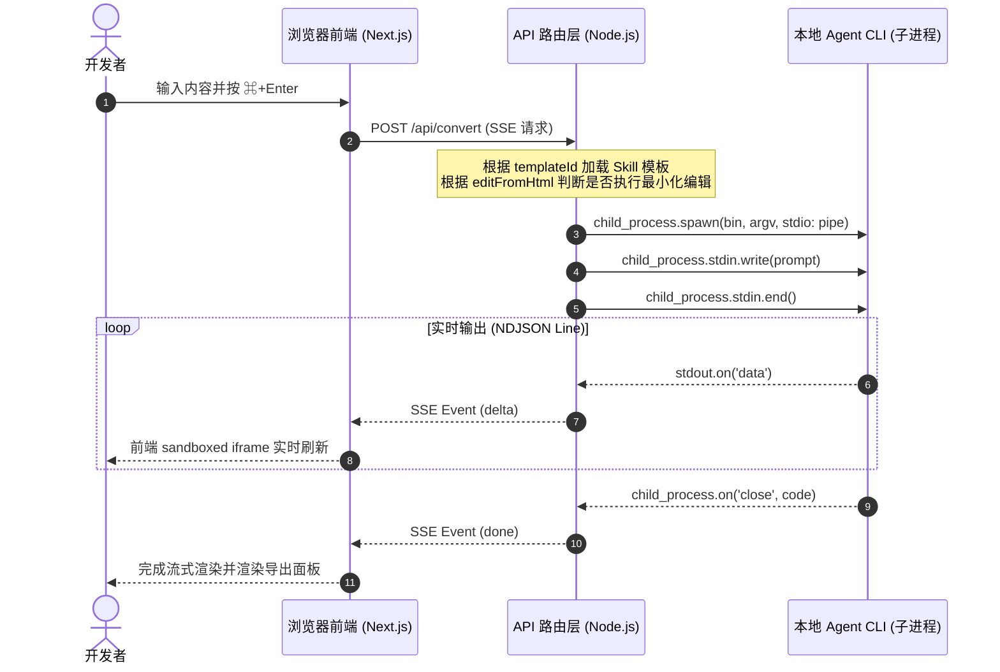
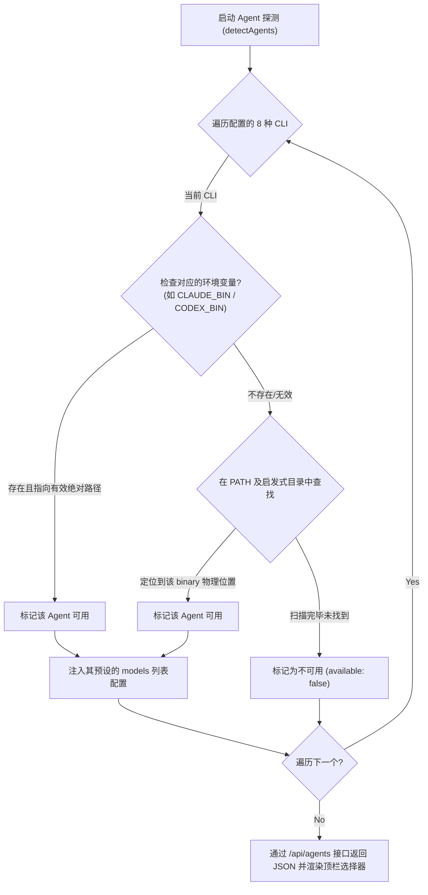
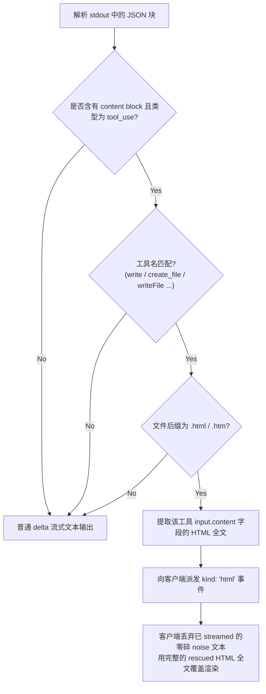
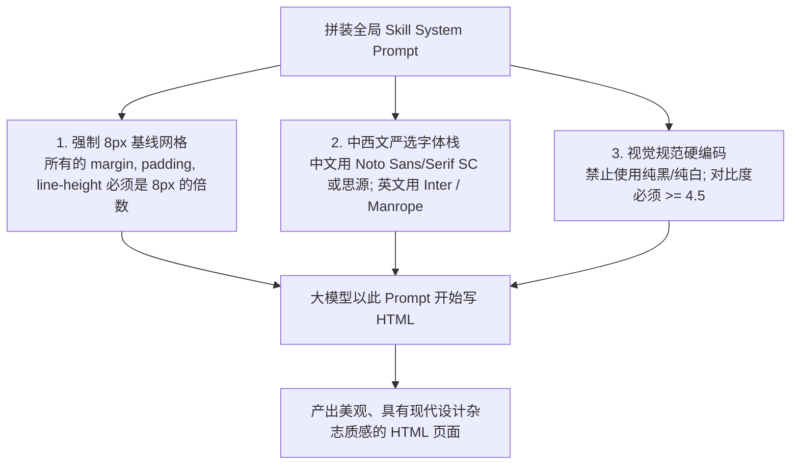
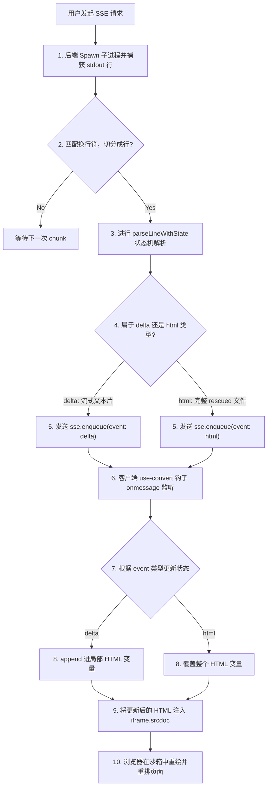
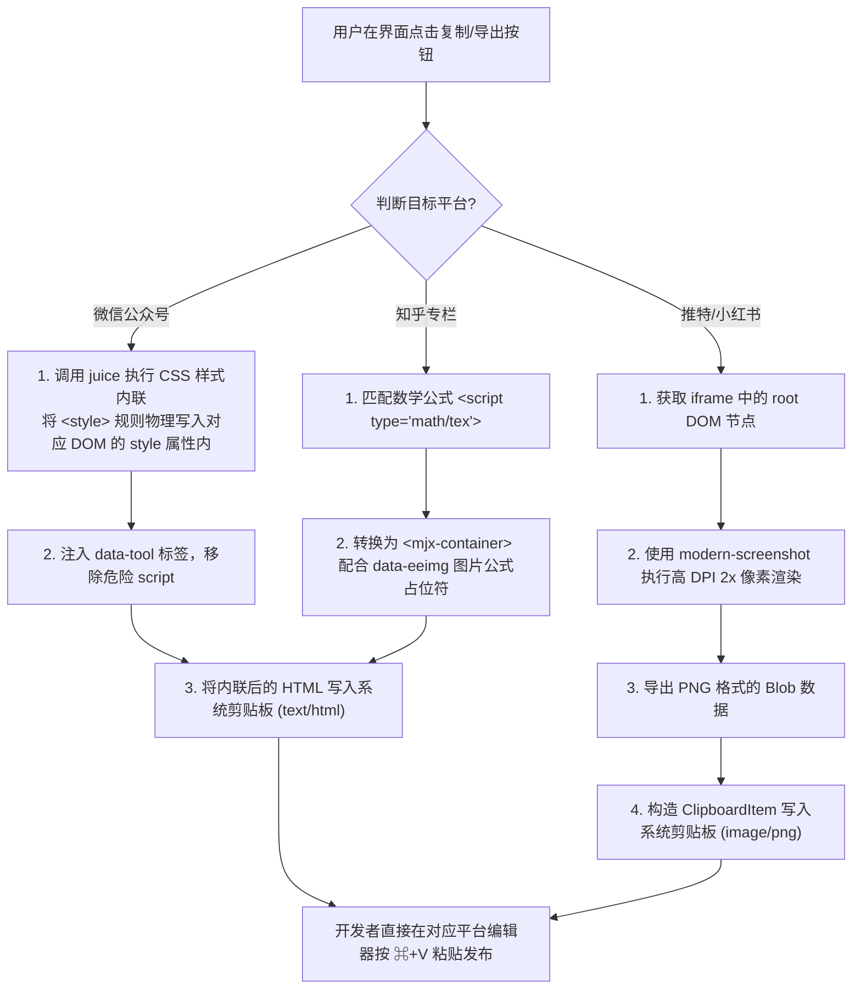
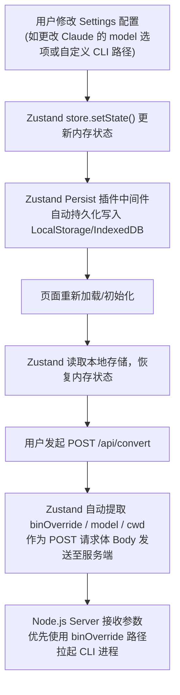
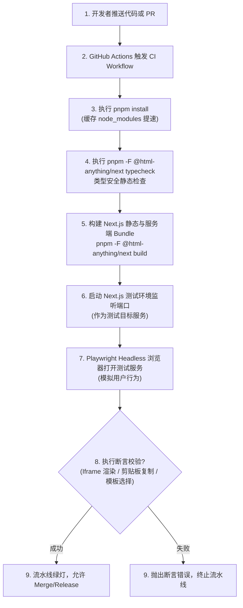

# html-anything DeepWiki 全站导出

> **这是 html-anything 仓库的单文件技术 Wiki 导出，包含完整的架构解析与核心实现说明。**
>
> - 源仓库: `https://github.com/nexu-io/html-anything.git`
> - 本轮 Commit: `145a40ebd79624bbd6a28ec379148a895896573c`
> - 生成时间: 2026年5月23日

---

<details>
<summary>相关源文件</summary>

生成本页时使用的主要源文件：

- [README.zh-CN.md](../../../project-repos/html-anything/README.zh-CN.md)
- [README.md](../../../project-repos/html-anything/README.md)

</details>

# 项目概览

在以大语言模型（LLM）为代表的 Coding Agent 时代，人机协作开发的方式正在经历深刻的变化。传统的 Markdown 格式主要是给创作者编写草稿或编写轻量文档时使用的中间格式，而用户最终阅读、发布和消费的实际上是更加美观、排版自由且极具交互性的 HTML 页面。

`html-anything` 是一款专为 Agent 时代打造的**本地优先、零配置、精美排版**的 HTML 编辑器系统。它通过自动识别并复用本地的 8 种 Coding-agent CLI（如 Claude Code, Cursor Agent, Codex 等），配合 75 套精细设计的“去 AI-slop 化”视觉 Skills 模板，能够在 30 秒内将 Markdown、CSV、Excel、JSON、SQL 等任意输入自动编译成高度美观、即刻交付的多端 HTML 页面，并提供微信公众号、Twitter (X)、知乎、高清图片等一键导出能力，为内容创作者与开发者提供了前所未有的流式人机协作排版体验。

## 能力全景

- **本地 Agent 免 Key 探测与复用**：深度复用本地已经登录过的 CLI 会话（如 `claude login` 等），实现零边际 API token 消耗成本。
- **SSE 流式实时渲染与沙箱隔离**：配合 SSE（Server-Sent Events）将本地 Agent 进程的 stdout 实时推送至前端，利用 sandboxed iframe 安全渲染预览，提供“看着 AI 现场写代码”的动态交互。
- **硬编码视觉去 AI-slop 约束**：内置 75 套 Skill 模板，在 Prompt 中强制约束 8px 物理基线网格、中文SC/英文字体栈、对比度 >= 4.5 与真实数据输出，杜绝 AI 自由发挥导致的粗糙感。
- **一键多端适配导出**：使用样式内联库 `juice` 适配公众号粘贴，支持 2x PNG 截图载入剪贴板发布至 Twitter/小红书，并提供 LaTeX 公式占位符对知乎进行兼容性导出。

## 9 类输出场景

在主界面中，系统将 Skills 模板归集为 9 类，涵盖常见的内容交付与展示场景：
1. **杂志文章**：精美排版与配色的长图文 editorial 样式。
2. **Keynote PPT**：以 slide-canvas 驱动的网页幻灯片。
3. **极简简历**：极具纸感质地与排版逻辑的 A4 简历。
4. **营销海报**：用于社交传播的巨字 Serif headline 报纸风海报。
5. **小红书图文卡**：专为移动端社交排版优化的 pastel 多色背景图文卡。
6. **推特分享卡**：小巧紧凑的社交图表与引用金句卡。
7. **Web 产品原型**：Brutalist 粗犷风或 Soft 柔和风的 SaaS 仪表盘、Landing 落地页。
8. **数据可视化报告**：精细的图表对比与数据面板。
9. **Hyperframes 视频**：兼容 Remotion 规范的多帧时序视频脚本。

## 阅读推荐路线

为了深入掌握 `html-anything` 的技术架构，推荐您按以下路线深入阅读：
- **核心架构与通信**：查阅 [系统架构与进程协作模型](system-architecture.md) 了解 Node.js 服务与本地 CLI 的双向 stdin/stdout 通信机制。
- **Agent 本地扫描**：阅读 [本地 Agent 探测与路径扫描](agent-detection.md) 了解它是如何冲破 GUI 环境变量限制探测 CLI 路径的。
- **流式渲染与沙箱**：跳转到 [SSE 流式管道与沙箱实时预览](streaming-rendering.md) 学习 ReadableStream 组装与 iframe 安全渲染。
- **硬编码 Prompt 规则**：阅读 [去 AI-slop 模板与 Skills 约束](templates-skills.md) 领悟设计约束的工程落地。

Sources: [README.zh-CN.md:1-84](../../../project-repos/html-anything/README.zh-CN.md#L1-L84)

<details class="source-snippets">
<summary>引用源码</summary>

<!-- source-snippets:start -->

#### `README.zh-CN.md:1-84`

```markdown
# HTML Anything

<p align="center"><sub>来自 <a href="https://github.com/nexu-io/open-design"><b>Open Design</b></a> 团队 —— <b>40k★ · 200+ 贡献者</b>,更生产级、迭代更快。html-anything 是聚焦在 agent 时代 HTML 编辑器这一刀的专项; 如果你喜欢这个味道, 同一拨人做的 <a href="https://github.com/nexu-io/open-design">Open Design</a> 是它在更大规模上的形态, 顺手也看看。</sub></p>

<p align="center"><b>项目主页:</b> <a href="https://open-design.ai/html-anything/"><b>open-design.ai/html-anything/</b></a> —— 不用 clone 也能先看看 HTML Anything 长什么样、能干啥。</p>

> **Markdown 是草稿, HTML 才是给人读的成品 —— 让本地 agent 直接写 HTML。** Agent 时代的 HTML 编辑器 —— 既然你已经不亲手改文档、全都让 Claude 改了, 那 agent 的输出就该是读者真正想看的 HTML, 而不是中间态的 markdown。本地优先、零 API Key、复用你已经登录好的 CLI session —— **8 个 coding-agent CLI** 在 `PATH` 上自动识别（Claude Code · Cursor Agent · Codex · Gemini CLI · GitHub Copilot CLI · OpenCode · Qwen Coder · Aider），驱动 **75 套 skill 模板** 和 **9 类可交付场景**（杂志文章 · Keynote PPT · 简历 · 海报 · 小红书 · 推特卡 · Web 原型 · 数据报告 · Hyperframes 视频）。一键复制到公众号 / 推特 / 知乎，或者下载 `.html` / `.png`。

<p align="center">
  
</p>

<p align="center">
  <a href="LICENSE"></a>
  <a href="#-自动识别本地-agent"></a>
  <a href="#-skills"></a>
  <a href="#一键发布到平台"></a>
  <a href="#-30-秒上手"></a>
  <a href="#架构"></a>
</p>

<!-- 本项目站在 nexu-io/open-design 的肩膀上 — 下面这一行的社群标签都指向它,顺道带流量。 -->
<p align="center">
  <a href="https://discord.gg/keeVPMrueT"></a>
  <a href="https://x.com/nexudotio"></a>
  <a href="https://github.com/nexu-io/open-design/releases/latest"></a>
  <a href="https://github.com/nexu-io/open-design/graphs/commit-activity"></a>
  <a href="#-看看效果"></a>
  <a href="https://github.com/nexu-io/open-design"></a>
</p>

<p align="center"><a href="README.md">English</a> · <b>简体中文</b></p>

---

## 🎨 看看效果

picker 顶部 **推荐 / Featured** 分组里默认置顶的 8 个 skill —— 对应 `SKILL.md` frontmatter 里的 `recommended:` 字段,数字越小排得越靠前。每个都附 `example.html`,repo 里双击就能看效果,不用登录、不用启服。

<table>
<tr>
<td width="50%" valign="top">
<a href="next/src/lib/templates/skills/deck-guizang-editorial/"></a><br/>
<sub><b><a href="next/src/lib/templates/skills/deck-guizang-editorial/"><code>deck-guizang-editorial</code></a></b> · <i>deck</i> · <code>recommended: 1</code><br/>编辑墨水 PPT,灵感来自 <a href="https://github.com/op7418/guizang-ppt-skill"><code>op7418/guizang-ppt-skill</code></a> —— 10 套锁死版面 × 5 套调色板(墨水 / 靛蓝瓷 / 森林墨 / 牛皮纸 / 沙丘),纸感印刷质感,开起来像一本电子杂志而不是 PPT。</sub>
</td>
<td width="50%" valign="top">
<a href="next/src/lib/templates/skills/deck-swiss-international/"></a><br/>
<sub><b><a href="next/src/lib/templates/skills/deck-swiss-international/"><code>deck-swiss-international</code></a></b> · <i>deck</i> · <code>recommended: 2</code><br/>瑞士国际主义 PPT —— 16 列网格 + 单一饱和 accent(Klein Blue / Lemon / Mint / Safety Orange),22 套锁死版面。冷静、理性、学院派,开会时让人觉得 "这一定是 designer 做的"。</sub>
</td>
</tr>
<tr>
<td width="50%" valign="top">
<a href="next/src/lib/templates/skills/doc-kami-parchment/"></a><br/>
<sub><b><a href="next/src/lib/templates/skills/doc-kami-parchment/"><code>doc-kami-parchment</code></a></b> · <i>doc</i> · <code>recommended: 3</code><br/>暖羊皮纸 + 墨蓝单色 editorial 文档系统,灵感来自 <a href="https://github.com/tw93/kami"><code>tw93/kami</code></a>。<code>#f5f4ed</code> 底色 + 单一衬线字体,长报告、读书笔记、one-pager、简历都能套,比纯白 markdown 高一个量级。</sub>
</td>
<td width="50%" valign="top">
<a href="next/src/lib/templates/skills/magazine-poster/"></a><br/>
<sub><b><a href="next/src/lib/templates/skills/magazine-poster/"><code>magazine-poster</code></a></b> · <i>poster</i> · <code>recommended: 4</code><br/>报纸风长图海报 —— 巨字 serif headline + 双栏正文 + 6 个编号小节 + cream 纸感底色,开起来像一份印好的 Sunday paper,不是网页。</sub>
</td>
</tr>
<tr>
<td width="50%" valign="top">
<a href="next/src/lib/templates/skills/video-hyperframes/"></a><br/>
<sub><b><a href="next/src/lib/templates/skills/video-hyperframes/"><code>video-hyperframes</code></a></b> · <i>frame / video</i> · <code>recommended: 5</code><br/>Hyperframes / Remotion 兼容的视频脚本 —— 6–10 个连续 <code>1920×1080</code> 帧,自带 duration / transition 注释和自动播放脚本。直接交给 <a href="https://github.com/heygen-com/hyperframes"><code>heygen-com/hyperframes</code></a> 或 Remotion 渲 <code>.mp4</code>。</sub>
</td>
<td width="50%" valign="top">
<a href="next/src/lib/templates/skills/frame-glitch-title/"></a><br/>
<sub><b><a href="next/src/lib/templates/skills/frame-glitch-title/"><code>frame-glitch-title</code></a></b> · <i>frame</i> · <code>recommended: 6</code><br/>故障艺术标题帧 —— cyan / magenta 像散偏移 + CRT 扫描线 + 数据腐败副标 + 角落 ASCII 噪点。Cyberpunk hero 或视频转场用。</sub>
</td>
</tr>
<tr>
<td width="50%" valign="top">
<a href="next/src/lib/templates/skills/vfx-text-cursor/"></a><br/>
<sub><b><a href="next/src/lib/templates/skills/vfx-text-cursor/"><code>vfx-text-cursor</code></a></b> · <i>vfx</i> · <code>recommended: 7</code><br/>VFX 文字光标开场 —— 光标在画布上"打字",每个字带 hot pink × cyan 像散拖尾 + 定向光斑。丢一句金句进去,就是电影级的视频片头。</sub>
</td>
<td width="50%" valign="top">
<a href="next/src/lib/templates/skills/frame-logo-outro/"></a><br/>
<sub><b><a href="next/src/lib/templates/skills/frame-logo-outro/"><code>frame-logo-outro</code></a></b> · <i>frame</i> · <code>recommended: 8</code><br/>品牌 Logo 收尾帧 —— Logo 分块装配 + glow bloom + tagline 上浮 + CTA。产品发布或品牌片的片尾闭幕镜头。</sub>
</td>
</tr>
</table>

完整 skill 目录(按 mode 分类)见下方 [🎨 Skills](#-skills) 章节。

```

<!-- source-snippets:end -->
</details>

---

<details>
<summary>相关源文件</summary>

生成本页时使用的主要源文件：

- [next/package.json](../../../project-repos/html-anything/next/package.json)
- [next/src/app/api/convert/route.ts](../../../project-repos/html-anything/next/src/app/api/convert/route.ts)

</details>

# 系统架构与进程协作模型

`html-anything` 在整体架构设计上极力追求“零外部依赖、极致轻量、本地安全优先”。它采用了**三层多进程协作模型**，将 Web UI 表现层、本地守护路由层以及大模型推理引擎层进行清晰地解耦。

在经典的架构中，想要运行一个高水准的设计系统，通常需要配备重型的后端数据库、用户鉴权体系以及大量的 API 密钥（API Keys）管理。而 `html-anything` 巧妙地跳出了这个约束，将大模型执行的环境完全保留在用户的笔记本电脑本地，从而实现了数据隐私保护与零云端运行开销。

## 进程模型鸟瞰

整个系统主要由以下三层构成：

1. **浏览器表现层 (Web UI)**：运行 Next.js 16 (React 19 + Tailwind v4)。主要负责用户的 Markdown/数据编辑、Skills 筛选、Iframe 沙箱隔离预览以及向路由层发送转换请求。
2. **本地 API 路由层 (Node.js)**：运行在本地的 `pnpm dev` 实例，提供本地特权服务（不暴露在公网）。对外暴露 `/api/agents` (扫描 CLI) 与 `/api/convert` (流式调用)；对内通过 `child_process.spawn` 进行子进程管控。
3. **Agent 推理执行层 (本地 CLI)**：用户自己电脑上安装的 coding-agent 工具（例如 `claude`，`cursor-agent`，`codex` 等）。它们在独立的子进程沙箱里执行，直接使用已经登录好的本地凭证进行云端推理，并将输出内容回传给 Node.js 宿主进程。

下面的 Mermaid 时序图展示了用户在界面上按下 `⌘+Enter` 后，三层结构之间的通信交互与流式管道传输过程：



### 时序图解析

1. **发起 SSE 请求**：浏览器向 API 路由层发送 POST 请求，由于该通信通常耗时几秒到十几秒，因此使用 SSE（Server-Sent Events）格式保持连接，从而实现平滑的流式响应。
2. **子进程生成 (Spawn)**：Node.js Server 解析请求，根据 `templateId` 加载对于 Skill 的 Prompt，通过 `child_process.spawn` 拉起对应的本地命令行 CLI 子进程，并指定 `stdio: ["pipe", "pipe", "pipe"]` 建立标准的双向输入输出管道。
3. **传递 Prompt**：将拼装好的 System/User 复合 Prompt 写入子进程的 `stdin`，并调用 `stdin.end()` 关闭写入端，以通知 Agent 输入已完成并开始推理。
4. **流式捕获与翻译**：子进程将推理结果通过 `stdout` 进行 JSON-line 输出。Node.js 不断地通过 `stdout.on('data')` 接收数据块，累积为行进行解析，再作为 `event: delta` 推送回前端浏览器。
5. **安全关闭连接**：子进程退出，触发 `close` 事件。Node.js 发送 `done` 信号，关闭 SSE 可读流，客户端展示导出面板并关闭加载态。如果中途用户点击“打断（Stop）”，浏览器连接断开触发 API 的 `req.signal.abort`，宿主会立刻向子进程发送 `SIGTERM` 信号强制 kill 掉 Agent 进程，避免额外的 Token 开销。

Sources: [next/src/app/api/convert/route.ts:64-164](../../../project-repos/html-anything/next/src/app/api/convert/route.ts#L64-L164)

<details class="source-snippets">
<summary>引用源码</summary>

<!-- source-snippets:start -->

#### `next/src/app/api/convert/route.ts:64-164`

```typescript
export async function POST(req: NextRequest) {
  let body: Body;
  try {
    body = (await req.json()) as Body;
  } catch {
    return new Response("invalid JSON body", { status: 400 });
  }
  const {
    agent,
    templateId,
    content,
    format = "text",
    model,
    cwd,
    binOverride,
    editFromHtml,
    editFromContent,
  } = body;
  if (!agent || !templateId || !content) {
    return new Response("missing required fields: agent, templateId, content", {
      status: 400,
    });
  }
  const skill = loadSkill(templateId);
  if (!skill) {
    return new Response(`unknown template: ${templateId}`, { status: 400 });
  }

  let prompt: string;
  if (editFromHtml && editFromContent) {
    prompt = buildEditPrompt({
      templateName: skill.zhName,
      templateAspect: skill.aspectHint,
      newContent: content,
      oldContent: editFromContent,
      oldHtml: editFromHtml,
      format,
    });
  } else {
    prompt = assemblePrompt({ body: skill.body, content, format });
  }
  const abortCtl = new AbortController();
  req.signal?.addEventListener("abort", () => abortCtl.abort(), { once: true });

  const stream = invokeAgent({
    agent,
    prompt,
    model,
    cwd,
    binOverride,
    signal: abortCtl.signal,
  });

  const sse = new ReadableStream({
    async start(controller) {
      const enc = new TextEncoder();
      let outClosed = false;
      const send = (event: string, data: unknown) => {
        if (outClosed) return;
        try {
          controller.enqueue(
            enc.encode(`event: ${event}\ndata: ${JSON.stringify(data)}\n\n`),
          );
        } catch {
          outClosed = true;
        }
      };

      const reader = stream.getReader();
      try {
        while (true) {
          const { value, done } = await reader.read();
          if (done) break;
          if (!value) continue;
          send(value.type, value);
        }
      } catch (err) {
        send("error", {
          message: err instanceof Error ? err.message : String(err),
        });
      } finally {
        outClosed = true;
        try {
          controller.close();
        } catch {}
      }
    },
    cancel() {
      abortCtl.abort();
    },
  });

  return new Response(sse, {
    headers: {
      "Content-Type": "text/event-stream; charset=utf-8",
      "Cache-Control": "no-cache, no-transform",
      Connection: "keep-alive",
      "X-Accel-Buffering": "no",
    },
  });
}
```

<!-- source-snippets:end -->
</details>

---

<details>
<summary>相关源文件</summary>

生成本页时使用的主要源文件：

- [next/src/lib/agents/detect.ts](../../../project-repos/html-anything/next/src/lib/agents/detect.ts)
- [next/src/app/api/agents/route.ts](../../../project-repos/html-anything/next/src/app/api/agents/route.ts)

</details>

# 本地 Agent 探测与路径扫描

对于一个依赖本地工具链的 Web 应用而言，能够可靠地发现用户系统上已经安装的 Agent CLI 决定了应用能否“开箱即用”。传统的 Web 应用程序即使部署在本地，也只能通过常规的全局系统 `PATH` 环境变量来搜寻命令。然而在现代桌面操作系统（如 macOS 和 Windows）中，从图形用户界面（GUI）双击启动的应用或守护进程，其运行上下文里经常会**丢失 `.zshrc`、`.bash_profile` 等 Shell 配置文件中定义的自定义 PATH 路径**，这会导致 Node.js 无法探测到安装在 `~/.local/bin`、`.bun/bin` 等目录下的 CLI 工具。

`html-anything` 巧妙地实现了一套**启发式多路径扫描探测机制**，极大地提升了本地 CLI 识别的健壮性。

## 探测流程图

下图展示了系统如何从进程环境变量和磁盘特定路径多重定位 Agent CLI 的检测链路：



## 启发式路径探测实现

在 `detect.ts` 源码中，除了标准读取 `process.env.PATH` 环境变量外，系统单独通过 `userToolchainDirs()` 函数补充声明了一系列主流包管理器和运行环境的默认安装目录。这能有效兜底当 CLI 启动缺少环境变量时的查找失效：

### 启发式扫描的候选目录列表

1. **统一路径前缀与 Volta/Node 前缀**：
   - 提取 `VP_HOME` 环境变量下的 `/bin` 目录。
   - 提取 `NPM_CONFIG_PREFIX` 代表的 npm 全局前缀及其 `/bin` 目录。
2. **多语言包管理器与本地路径**：
   - `~/.local/bin`（普通 Shell 脚本首选安装路径）
   - `~/.bun/bin`（Bun 工具链默认全局路径）
   - `~/.volta/bin`（Volta 虚拟多 Node 管理器路径）
   - `~/.asdf/shims`（ASDF 版本管理器垫片路径）
   - `~/Library/pnpm`（pnpm 默认安装路径，macOS 常见）
   - `~/.cargo/bin`（Rust Cargo 全局二进制路径）
   - `~/.npm-global/bin` 及 `~/.npm-packages/bin`（自定义 npm 全局安装根路径）
   - `~/.claude/local`（Claude Code 内部 CLI 本地路径）
3. **平台差异兜底**：
   - **Windows**：补充探测 `SCOOP` (Windows Scoop包管理器默认路径 `scoop/shims` 及其 nodejs apps 软连接路径)、`SCOOP_GLOBAL` 路径和 `%APPDATA%/npm` (Windows 默认 npm 全局安装根)。由于 Windows 没有 `/bin` 的概念，且 Scoop 安装的 Node 会直接将 shims 置于软件当前目录而非 `/bin` 下，代码对此做了多分支物理兼容。
   - **macOS / Linux**：常规探测 `/opt/homebrew/bin` 和 `/usr/local/bin`。

## 扫描实现细节

系统为 Windows 的扩展名执行匹配（利用 `PATHEXT` 环境变量，例如 `.EXE;.CMD;.BAT`），而在 Unix 下使用空串作为后缀。文件探测部分采用 `fs.existsSync(fullPath)` 进行物理检查，以防通过子进程测试带来的环境死锁风险，极大地提高了接口在高频轮询下的响应性能。

Sources: [next/src/lib/agents/detect.ts:299-452](../../../project-repos/html-anything/next/src/lib/agents/detect.ts#L299-L452)

<details class="source-snippets">
<summary>引用源码</summary>

<!-- source-snippets:start -->

#### `next/src/lib/agents/detect.ts:299-452`

```typescript
function userToolchainDirs(): string[] {
  const home = homedir();
  const env = process.env;
  const dirs: string[] = [];
  const vp = env.VP_HOME?.trim();
  if (vp) dirs.push(join(vp, "bin"));
  const npmPrefix = env.NPM_CONFIG_PREFIX?.trim();
  if (npmPrefix) {
    // npm on Windows installs CLI shims directly in <prefix>, not <prefix>/bin.
    dirs.push(join(npmPrefix, "bin"), npmPrefix);
  }
  dirs.push(
    join(home, ".local/bin"),
    join(home, ".vite-plus/bin"),
    join(home, ".opencode/bin"),
    join(home, ".bun/bin"),
    join(home, ".volta/bin"),
    join(home, ".asdf/shims"),
    join(home, "Library/pnpm"),
    join(home, ".cargo/bin"),
    join(home, ".npm-global/bin"),
    join(home, ".npm-packages/bin"),
    join(home, ".claude/local"),
  );
  if (process.platform === "win32") {
    // Scoop-managed Node.js drops global npm shims into the app dir directly,
    // not under a /bin/ subdirectory. Cover the common Scoop layouts plus the
    // default %AppData%/npm location used by the standalone Node installer.
    const scoopRoot = env.SCOOP?.trim() || join(home, "scoop");
    const globalScoopRoot = env.SCOOP_GLOBAL?.trim() || "C:\\ProgramData\\scoop";
    const appData = env.APPDATA?.trim();
    dirs.push(
      join(scoopRoot, "shims"),
      join(scoopRoot, "apps", "nodejs", "current"),
      join(scoopRoot, "apps", "nodejs-lts", "current"),
      join(globalScoopRoot, "shims"),
      join(globalScoopRoot, "apps", "nodejs", "current"),
    );
    if (appData) dirs.push(join(appData, "npm"));
  } else {
    dirs.push("/opt/homebrew/bin", "/usr/local/bin");
  }
  return dirs;
}

/**
 * Probe `<openclaw> agents list` and return the first agent id (typically
 * "main"). OpenClaw refuses `agent --message` invocations without one of
 * `--agent`, `--to`, or `--session-id`, so we resolve this once per-process
 * with a 5-minute TTL cache.
 *
 * Falls back to "main" on any error — that is the OpenClaw default agent
 * name on a fresh install, so it works for most users out of the box.
 */
let openclawAgentIdCache: { value: string; expiresAt: number } | null = null;
export async function resolveOpenclawAgentId(bin: string): Promise<string> {
  const now = Date.now();
  if (openclawAgentIdCache && openclawAgentIdCache.expiresAt > now) {
    return openclawAgentIdCache.value;
  }
  let resolved = "main";
  try {
    const { spawn } = await import("node:child_process");
    const out = await new Promise<string>((res, rej) => {
      const child = spawn(bin, ["agents", "list"], {
        stdio: ["ignore", "pipe", "pipe"],
        shell: process.platform === "win32",
      });
      let buf = "";
      child.stdout.setEncoding("utf8");
      child.stdout.on("data", (c) => (buf += c));
      child.on("close", () => res(buf));
      child.on("error", rej);
      setTimeout(() => {
        try { child.kill("SIGTERM"); } catch {}
        rej(new Error("openclaw agents list timed out"));
      }, 5_000);
    });
    // First agent line looks like:  "- main (default)"  or  "- ops"
    const m = out.match(/^- (\S+)/m);
    if (m && m[1]) resolved = m[1];
  } catch {
    // keep fallback
  }
  openclawAgentIdCache = { value: resolved, expiresAt: now + 5 * 60_000 };
  return resolved;
}

export function resolveOnPath(bin: string): string | null {
  const exts =
    process.platform === "win32"
      ? (process.env.PATHEXT ?? ".EXE;.CMD;.BAT").split(";")
      : [""];
  const seen = new Set<string>();
  const dirs = [
    ...(process.env.PATH ?? "").split(delimiter),
    ...userToolchainDirs(),
  ].filter((d) => d && !seen.has(d) && (seen.add(d), true));
  for (const d of dirs) {
    for (const e of exts) {
      const full = path.join(d, bin + e);
      try {
        if (existsSync(full)) return full;
      } catch {
        // ignore
      }
    }
  }
  return null;
}

export type DetectedAgent = {
  id: string;
  label: string;
  vendor: string;
  available: boolean;
  path?: string;
  resolvedBin?: string;
  protocol: AgentProtocol;
  /**
... snippet truncated ...
```

<!-- source-snippets:end -->
</details>

---

<details>
<summary>相关源文件</summary>

生成本页时使用的主要源文件：

- [next/src/lib/agents/argv.ts](../../../project-repos/html-anything/next/src/lib/agents/argv.ts)
- [next/src/lib/agents/invoke.ts](../../../project-repos/html-anything/next/src/lib/agents/invoke.ts)

</details>

# Agent Argv 组装与流式 NDJSON 翻译协议

在多 Agent 协同体系中，每款 Agent CLI 的设计初衷都是与终端（TTY）或特定 IDE 插件直接交互的，因此它们暴露出截然不同的命令行交互界面（CLI Surface）和结果返回格式。为了在一个统一的 Web 界面中整合这些工具，并且无感地实现流式渲染，`html-anything` 在传输层设计了高内聚的协议适配器。

## 命令行调用适配与多协议模式

在 `argv.ts` 和 `invoke.ts` 的实现中，系统根据 CLI 的通讯特性将其规整为以下三类协议模型，以确定输入 Prompts 是通过 `stdin` 流写入还是以 `arguments` 参数传入：

1. **`stdin` 协议 (标准 stdin 模式)**：
   - 典型代表：`claude`、`cursor-agent`、`gemini`、`qoder`、`aider`。
   - 实现：调用时子进程的 `stdin` 保持开启，直接把 Prompt 写入管道 `child.stdin.write(prompt)`，随后调用 `child.stdin.end()` 关闭。这符合大语言模型 CLI 对传统 Shell pipeline 模式的默认支持。
2. **`argv` 协议 (位置参数模式)**：
   - 典型代表：`deepseek`。
   - 实现：DeepSeek 等 TUI 工具在自动模式下不允许从 stdin 接收参数，因此代码通过 `argv = [...argv, prompt]` 将整个 Prompt 作为最后一个位置参数直接追加在命令行中。
3. **`argv-message` 协议 (显式 Flag 模式)**：
   - 典型代表：`openclaw`。
   - 实现：OpenClaw 作为网关要求通过 `--message <text>` 显式指定 Prompt。另外，OpenClaw 不输出流式 JSON，而是在关闭子进程后返回一个完整的多行大 JSON 文档。适配器需要在子进程触发 `close` 事件时，集中缓存 stdout，使用 `JSON.parse` 提取 `finalAssistantVisibleText` 字段。

## 经典 CLI 调用参数对照

| Agent | 检测/调用参数 | 协议与特性 |
|---|---|---|
| **Claude Code** | `claude -p --output-format stream-json --verbose --include-partial-messages --permission-mode bypassPermissions` | `stdin`。强制采用 bypassPermissions 规避交互式确认；开启 stream-json 流式传输。 |
| **OpenAI Codex** | `codex exec --json --skip-git-repo-check --sandbox workspace-write -c sandbox_workspace_write.network_access=true` | `stdin`。在沙箱限制中写入 workspace-write 并打开网络连接。 |
| **Cursor Agent** | `cursor-agent --print --output-format stream-json --stream-partial-output --force --trust` | `stdin`。强制信任 workspace 以绕过弹窗，并开启流式局部输出。 |
| **Gemini CLI** | `gemini --output-format stream-json --yolo` | `stdin`。在命令行采用 yolo 模式执行。 |
| **Aider** | `aider --no-pretty --no-stream --yes-always --message-file -` | `stdin`。显式要求aider从 `-` (stdin) 导入消息。 |

---

## 核心设计难点与解决方案

### 1. 从工具调用中救援 HTML 内容 (`rescueHtmlFromToolUse`)

大语言模型常有自己默认的行为逻辑（即 Freestyle）。尽管我们在 System Prompt 里千叮咛万嘱咐“要求在回复正文里输出完整的 HTML”，但是像 Claude、Cursor Agent 这种具备本地工具执行能力的强 Agent，往往会认为“既然我已经有了 `Write` 工具，我直接调用 `Write(file_path="output.html", content="...")` 把内容写到文件里更合理”，然后正文仅回复一句空洞的“已将 HTML 输出至本地 ...”。

如果这发生，浏览器的实时预览窗口就会变成白板，完全丢失渲染结果。

为了解决这个问题，`argv.ts` 设计了 `rescueHtmlFromToolUse` 拦截算法：



### 2. 双流去重状态机 (`ParseState`)

大部分 Agent 在配置了“流式输出”（如 `--include-partial-messages`）后，为了保证最终回复的原子性，除了在生成过程中源源不断吐出 `stream_event` (`text_delta`) 之外，在执行结束时，通常还会在最终的 `assistant` message 对象里再重新吐出一次**完整的、拼接后的文本内容**。

如果没有去重，浏览器前端在追加流时就会把这个 HTML 网页**重复 append 渲染两次**，导致页面错乱。

**解决方案**：适配器内引入了轻量级状态机 `ParseState`：
- 在流式过程中，一旦匹配到 `stream_event` / `text_delta` 分片，将状态变量 `state.sawStreamEventText` 标记为 `true`，并将 delta 推送至客户端。
- 在子进程输出最后的 `assistant` message 块时，先检查 `state.sawStreamEventText`，若为 `true`，则说明当前 turn 的流式字符已被前端消费，直接**截断并丢弃**这次重复的全量 assistant 内容，仅提取 usage 等元数据信息，从而完美避免了回声复制。

Sources: [next/src/lib/agents/argv.ts:142-298](../../../project-repos/html-anything/next/src/lib/agents/argv.ts#L142-L298)

<details class="source-snippets">
<summary>引用源码</summary>

<!-- source-snippets:start -->

#### `next/src/lib/agents/argv.ts:142-298`

```typescript
export type AgentParse =
  | { kind: "delta"; text: string }
  | { kind: "meta"; key: string; value: unknown }
  /**
   * Canonical HTML rescued from a file-write tool call (e.g. Claude's `Write`
   * tool). Replaces any previously streamed text — the preamble like
   * "I'll save it as output.html\n已输出至 …" is junk; the tool's input is the
   * real HTML. Downstream calls `setHtmlFor`, not `appendHtmlFor`.
   */
  | { kind: "html"; text: string }
  | { kind: "noise" };

/**
 * Cross-line state that the parser carries between calls. Currently used to
 * dedupe text deltas: when an agent emits both fine-grained `stream_event`
 * `text_delta` blocks AND a final `assistant` message containing the same
 * text concatenated, we keep the streamed tokens and skip the assistant
 * message body. Without this dedupe, every Claude/Cursor/Gemini/Qoder run
 * with `--include-partial-messages` (or the equivalent) writes its output
 * twice.
 */
export type ParseState = { sawStreamEventText?: boolean };

/**
 * Build a stateful per-invocation parser. Feed every stdout line through the
 * returned function — it carries the cross-line state needed for dedupe.
 */
export function makeParser(agent: string): (line: string) => AgentParse[] {
  const state: ParseState = {};
  return (line: string) => parseLineWithState(agent, line, state);
}

/**
 * Parse a single line of agent stdout. Stateless wrapper kept for callers
 * that only need one-shot parsing (e.g. `extractTextFromLine`). Streaming
 * callers should use `makeParser` so dedupe state survives across lines.
 */
export function parseLine(agent: string, line: string): AgentParse[] {
  return parseLineWithState(agent, line, {});
}

/**
 * Some agents (Claude + bypassPermissions, qoder, …) ignore the "stream HTML
 * inline" prompt and decide to dump the document into a file via the `Write`
 * tool, leaving the assistant text as just a confirmation ("已输出至 …").
 * Rescue the HTML from the tool_use input so the preview still gets the real
 * content. Returns an empty string if no Write/create_file tool_use was found
 * or its input has no usable content field.
 */
function rescueHtmlFromToolUse(
  content: Array<{ type?: string; name?: string; input?: unknown }> | undefined,
): string {
  if (!Array.isArray(content)) return "";
  const parts: string[] = [];
  for (const block of content) {
    if (!block || block.type !== "tool_use") continue;
    const name = (block.name ?? "").toLowerCase();
    // Match the common file-write tool names across agents.
    if (
      name !== "write" &&
      name !== "create_file" &&
      name !== "createfile" &&
      name !== "writefile" &&
      name !== "write_file" &&
      name !== "filewrite"
    )
      continue;
    const input = block.input as Record<string, unknown> | undefined;
    if (!input || typeof input !== "object") continue;
    const path = String(input.file_path ?? input.path ?? input.filename ?? "").toLowerCase();
    // Only rescue HTML-ish targets — never grab content for a .md / .txt
    // sidecar the agent might also be writing.
    if (path && !/\.(html?|htm)$/.test(path)) continue;
    const text =
      typeof input.content === "string"
        ? input.content
        : typeof input.text === "string"
          ? input.text
          : typeof input.file_content === "string"
            ? input.file_content
            : "";
    if (text) parts.push(text);
  }
  return parts.join("");
}

function parseLineWithState(agent: string, line: string, state: ParseState): AgentParse[] {
  const trimmed = line.trim();
  if (!trimmed) return [];

  // Aider / DeepSeek — plain text streaming on stdout (DeepSeek tool calls
  // go to stderr, which is forwarded as `stderr` events, not parsed here).
  if (agent === "aider" || agent === "deepseek") {
    return [{ kind: "delta", text: trimmed.endsWith("\n") ? trimmed : trimmed + "\n" }];
  }

  let parsed: unknown;
  try {
    parsed = JSON.parse(trimmed);
  } catch {
    return [{ kind: "noise" }];
  }
  if (!parsed || typeof parsed !== "object") return [];
  const obj = parsed as Record<string, unknown>;
  const out: AgentParse[] = [];

  if (agent === "claude") {
    // Init / system metadata
    if (obj.type === "system" && obj.subtype === "init") {
      out.push({ kind: "meta", key: "model", value: obj.model });
      out.push({ kind: "meta", key: "session", value: obj.session_id });
      if (obj.cwd) out.push({ kind: "meta", key: "cwd", value: obj.cwd });
    }
    // Stream events (--include-partial-messages → fine-grained text_delta)
    if (obj.type === "stream_event" && obj.event && typeof obj.event === "object") {
      const ev = obj.event as { type?: string; delta?: { type?: string; text?: string; thinking?: string } };
      if (ev.type === "content_block_delta" && ev.delta?.type === "text_delta" && typeof ev.delta.text === "string") {
        state.sawStreamEventText = true;
        out.push({ kind: "delta", text: ev.delta.text });
      } else if (ev.type === "content_block_delta" && ev.delta?.type === "thinking_delta") {
... snippet truncated ...
```

<!-- source-snippets:end -->
</details>

---

<details>
<summary>相关源文件</summary>

生成本页时使用的主要源文件：

- [next/src/lib/templates/loader.ts](../../../project-repos/html-anything/next/src/lib/templates/loader.ts)
- [next/src/lib/templates/shared.ts](../../../project-repos/html-anything/next/src/lib/templates/shared.ts)

</details>

# 去 AI-slop 模板与 Skills 约束机制

在使用 Coding Agent 编写 Web UI 页面时，最常见的质量缺陷就是 AI 产出页面的“Freestyle 乱来感”（俗称 AI Slop）：不合理的字号递进、随意的配色方案、未对齐的网格以及缺乏响应式设计。大模型通常无法准确预知浏览器最终的渲染表现，从而写出不合规的 CSS。

`html-anything` 没有试图通过复杂的 agent-loop（反射修正）去优化这些表现，而是直接将解决方案沉淀在 **Skills 模板的 System Prompt 强硬约束**中。通过在 75 套内置的 `SKILL.md` 里硬编码核心排版规则，直接将模型限制在安全高水准的“轨道”上。

## 视觉防 freestyle 核心三大设计约束

所有的模板技能 Prompt（在 `shared.ts` 中组装）都包含了这三大强制性视觉防御准则，并在生成之前写入了大模型的上下文：



### 1. 8 像素基线物理网格 (8px Baseline Grid)
- **约束规则**：所有的视觉间距（`margin`、`padding`）、行高（`line-height`）和边框尺寸（`gap`）必须是 `8` 的整数倍。字号（`font-size`）严格采用 `16px`, `24px`, `32px`, `48px`, `64px` 等高阶递进。
- **技术效果**：这使得即便没有设计师微调，生成的组件排列也会呈现出数学上的规整感与对齐感，抹去了常规 AI 生成页面左右间隙忽大忽小的凌乱。

### 2. 中西文隔离严选字体栈 (Font Stacks)
- **约束规则**：
  - 中文字体栈：禁止直接使用系统的宋体或微软雅黑，强制优先使用思源黑体（`Noto Sans SC`）与思源宋体（`Noto Serif SC`）渲染。
  - 英文字体栈：严选 `Inter` / `Manrope` / `Outfit` 作为无衬线标题的首选。
- **技术效果**：在加载 CDN Google Fonts 时，自动为中文字体注入支持，使得中文排版在保留了传统杂志“印刷纸感”的同时，也能保持高保真矢量抗锯齿能力。

### 3. 色彩去 AI-slop 化 (Color Contrast & Gradients)
- **约束规则**：
  - 禁止使用高饱和度的大红、大蓝或纯色。强制使用精心挑选的 HSL 调色板和渐变色（如 Klein Blue、Warm Parchment 等）。
  - 色彩对比度（Contrast Ratio）对于关键文本必须满足 WCAG AA 级标准（对比度 $\ge$ 4.5），以保证文字可读性。
  - 核心交互元素必须声明 `:focus`、`:hover` 伪类以保留浏览器反馈。

---

## 模板加载与提示词拼装流程

在 `shared.ts` 和 `loader.ts` 的实现中，每个 Skill 模板文件夹都包含：
1. `SKILL.md`：声明 metadata 前缀（如 `recommended`, `mode`, `scenario`）和此模板专用的样式 Prompt 约束。
2. `example.html`：本地预览示例，使用户无需拉起 Agent 也能查看样式。

在生成 HTML 时，系统提取 Skill Prompt 模板的文本，并自动拼接以下全局前缀，以确保 LLM 在写代码时恪守格式红线：

```typescript
export function assemblePrompt(args: { body: string; content: string; format: string }) {
  return `你是一个资深的前端设计专家。
我们将使用以下特定视觉 Skills 模板来渲染用户提交的数据：
【视觉约束规范】
${args.body}

【输入格式】
当前输入为：${args.format}

【输入数据】
${args.content}

【硬性要求】
1. 只输出完整的 HTML，第一个字符必须是 <, 最后一个字符必须是 </html>。
2. 不要包含任何 \`\`\` 围栏或解释。
3. 必须使用中文，保证排版字体的中西文栈配置。
4. 禁止空洞的 dummy 占位，必须全部渲染真实数据。
`;
}
```

这套“视觉模板 + 硬性规则 + 隔离注入”的方案构成 `html-anything` 去 AI-slop 化设计的核心资产。

Sources: [next/src/lib/templates/shared.ts:1-120](../../../project-repos/html-anything/next/src/lib/templates/shared.ts#L1-L120)

<details class="source-snippets">
<summary>引用源码</summary>

<!-- source-snippets:start -->

#### `next/src/lib/templates/shared.ts:1-120`

```typescript
/**
 * Shared design directives prepended to every skill's prompt body. Kept in its
 * own module so the `/api/convert` route can call `assemblePrompt({ body, … })`
 * without depending on the disk loader's full surface.
 */
export const SHARED_DESIGN_DIRECTIVES = `
你是世界级的视觉设计师 + 资深前端工程师。请输出一份**自包含的单文件 HTML**，要求：

【内容驱动数量 — 最高优先级, 覆盖模板里的任何数字】
- 模板只定义"可用版面 / 风格 / 配色 / 字体 / 组件库", **不定义** slide / 帧 / 卡片 / section 的数量。
- 输出的 slide / frame / card / section 数量**完全由【用户内容】的实际长度和信息结构决定**。必须**完整覆盖**用户内容的每一个要点、章节、数据组, **不许总结、压缩、丢弃信息**。
- 如果模板正文里写了类似"挑 6-10 张组成 deck / 输出 6-10 帧 / 3-6 张卡片"的数字, **一律视为短示例下的参考下限, 不是上限**。短内容可以低于该范围, 长内容应远超该范围 — 用户给了 12k 字符的内容, 输出 4-6 张是**严重错误**。
- 模板里的"22 个锁死版面 / 10 个磁带式版面 / N 个 layout"指的是**可复用的版式池**, 同一个版式允许在不同内容上多次出现 (例如 KPI Tower 可以连续用 3 次承载不同章节的数据), 不是页数上限。
- 推荐做法: 先把【用户内容】按语义切成若干段 (章节标题 / 论点 / 数据组 / 列表项 / 步骤), 每一段 → 至少一个独立的 slide / section / card, 然后再从模板的版式池里给每一段挑最合适的版面。宁可多页也不要把多个独立要点硬塞进一页。

【硬性技术要求】
- **禁止使用 Write / Edit / MultiEdit / Bash / Create / 任何文件系统工具**。不要把 HTML 写到任何 \`.html\` 文件里。前端直接捕获你的 stdout 文本, 文件落盘由前端负责。
- 直接把完整的 HTML 文档作为助手回复的正文流式输出。不要先说"我来生成"、"已输出至 …"之类的话。
- 文档以 \`<!DOCTYPE html>\` 开头, 末尾以 \`</html>\` 结束。
- 在 \`<head>\` 中通过 CDN 引入 Tailwind v3 Play (https://cdn.tailwindcss.com) 与所需的 Google Fonts。
- 不要引用任何外部图片 URL（除非你能保证 URL 长期有效；优先使用 CSS / SVG 内联绘制）。
- 必要的脚本（图表、动画）通过 jsdelivr CDN 引入；保持单文件可双击打开即用。
- 输出**纯 HTML**, 不要用 markdown 代码围栏包裹, 不要任何解释性文字。第一个字符必须是 \`<\`。

【设计准则 — 世界级标准】
- 排版: 中文优先 \`Noto Sans SC\` / \`Noto Serif SC\`, 英文 \`Inter\` / \`Manrope\` / \`SF Pro\` 风格。
- 色彩: 使用 1 个主色 + 2 个中性色 + 至多 1 个强调色; 大胆留白; 不使用纯黑纯白 (#000/#fff), 改用 \`#0a0a0a\` / \`#fafafa\`。
- 网格: 8 px 基线; 段落最大宽度 65 ch; 标题与正文有清晰的层级。
- 微观细节: 圆角统一 (rounded-xl/2xl), 投影柔和 (shadow-sm/lg), 边框 1px \`#e5e7eb\` / \`#262626\`。
- 动效: 仅在必要处使用 \`transition-all\` 或入场 fade-in; 不要喧宾夺主。
- 无障碍: 颜色对比度 ≥ 4.5; 重要交互有 focus 态。

【内容真实性】
- **必须使用用户提供的真实数据**, 不要编造、不要 lorem ipsum、不要 "Your text here"。
- 如果用户数据是结构化数据 (CSV/JSON), 请提取关键洞察并以图表/表格呈现。
- 中文与英文混排时, 中英文之间留半角空格 (盘古之白)。

`;

/**
 * Wrap a per-template instruction body with the shared design directives and
 * the user content tail. This is the canonical prompt shape; both inline
 * `buildPrompt` functions in `index.ts` and the skill-folder loader assemble
 * prompts via this helper so behaviour stays identical.
 */
export function assemblePrompt(opts: {
  body: string;
  content: string;
  format: string;
}): string {
  return `${SHARED_DESIGN_DIRECTIVES}
${opts.body.trim()}

【输入格式】: ${opts.format}
【用户内容】:
${opts.content}
`;
}
```

<!-- source-snippets:end -->
</details>

---

<details>
<summary>相关源file</summary>

生成本页时使用的主要源file：

- [next/src/lib/use-convert.ts](../../../project-repos/html-anything/next/src/lib/use-convert.ts)
- [next/src/app/api/convert/route.ts](../../../project-repos/html-anything/next/src/app/api/convert/route.ts)

</details>

# SSE 流式管道与沙箱实时预览

流式反馈是保障大语言模型交互体验的关键所在。如果让用户在界面前等待二三十秒而没有任何响应，其体验无异于死机。`html-anything` 在服务端采用 Node.js 的 `ReadableStream` 配合 `TextEncoder` 封装，将 Agent 子进程的标准输出作为 SSE（Server-Sent Events）事件流实时下发，并在浏览器前端配合沙箱 `iframe` 技术，实现 HTML 页面的毫秒级渐进流式刷新。

## 流式渲染时序图

下面的时序图展现了后端 SSE 管道和前端沙箱 iframe 对字符流的流式捕获与增量更新逻辑：



## 服务端 ReadableStream 组装

在 `POST /api/convert` 接口中，Next.js 的路由响应直接接收一个利用自定义 `ReadableStream` 生成的异步任务：

```typescript
const sse = new ReadableStream({
  async start(controller) {
    const enc = new TextEncoder();
    let outClosed = false;
    const send = (event: string, data: unknown) => {
      if (outClosed) return;
      try {
        controller.enqueue(enc.encode(`event: ${event}\ndata: ${JSON.stringify(data)}\n\n`));
      } catch {
        outClosed = true;
      }
    };
    // 监听子进程流
    const reader = stream.getReader();
    while (true) {
      const { value, done } = await reader.read();
      if (done) break;
      if (value) send(value.type, value);
    }
    controller.close();
  }
});
```

这里通过 `TextEncoder` 将普通的 EventSource 文本包装成字节流队列（Uint8Array），并在 Headers 中指定 `Content-Type: text/event-stream; charset=utf-8` 以完成服务器流式通知机制。

---

## 浏览器端沙箱隔离预览实现

在前端，渲染不受信任的大模型 HTML 具有极高的安全风险（如 XSS 注入、窃取宿主 Cookie / LocalStorage，或者调用第三方恶意脚本）。为了确保宿主环境安全，预览窗口在设计上具备以下三道隔离机制：

### 1. `sandbox` 属性硬防护
- 预览框物理配置为 `<iframe sandbox="allow-scripts allow-same-origin" />`。
- **作用**：启用 JavaScript 执行能力（以便 Tailwind CDN、折叠动效能够正常执行），但**强制把 iframe 锁死在独立的源（Origin）中**。这使得该 iframe 内部的代码哪怕被植入了恶意的 `document.cookie` 读取，由于跨域隔离阻断，也完全无法摸到宿主应用的敏感数据。

### 2. `srcdoc` 实时写入
- 与普通的 `src="about:blank"` 不同，流式生成器在 `use-convert.ts` 中通过不断拼接 `text` 片段，直接将累加起来的 HTML 赋值给 `iframe` 的 `srcdoc` 属性：
  ```typescript
  iframe.srcdoc = currentHtml;
  ```
- **作用**：这省去了反复触发页面网络请求与下载外部文件的开销，实现了流畅的流式生成效果。

### 3. DOM 清洗与安全防御
- 通过前端 `dompurify` 工具，过滤掉显式的高危注入标签，在保证脚本交互执行的同时，牢牢守住本地优先的沙箱安全红线。

Sources: [next/src/lib/use-convert.ts:1-320](../../../project-repos/html-anything/next/src/lib/use-convert.ts#L1-L320)

<details class="source-snippets">
<summary>引用源码</summary>

<!-- source-snippets:start -->

#### `next/src/lib/use-convert.ts:1-320`

```typescript
"use client";

import { useCallback } from "react";
import { useStore } from "./store";
import { summarizeForAgent } from "./parsers/auto";

type ConvertReq = {
  taskId: string;
  agent: string;
  templateId: string;
  content: string;
  format?: string;
  /** Optional model override. "default" / undefined → no --model flag. */
  model?: string;
};

/** prefix logged when the run is sent in diff-edit mode (vs full regeneration) */
const DIFF_LOG_PREFIX = "🔁 diff-edit 模式";

// per-task abort controllers — multiple tasks can stream concurrently
const controllers = new Map<string, AbortController>();

export function useConvert() {
  const cancel = useCallback((taskId: string) => {
    const ctl = controllers.get(taskId);
    if (ctl) {
      ctl.abort();
      controllers.delete(taskId);
    }
    useStore.getState().setStatusFor(taskId, "idle");
  }, []);

  const run = useCallback(
    async (req: ConvertReq) => {
      const { taskId } = req;
      cancel(taskId);
      const ctl = new AbortController();
      controllers.set(taskId, ctl);
      const store = useStore.getState();
      store.setStatusFor(taskId, "running");
      store.resetHtmlFor(taskId);
      store.clearLogFor(taskId);
      store.resetStatsFor(taskId);
      const startedAt = Date.now();
      store.patchStatsFor(taskId, { startedAt });

      // Inline `asset:<id>` placeholders (created by useUploadFile for
      // images) back into real `data:image/...` URLs before the agent
      // sees the prompt. Editor stays readable; agent gets the bytes.
      const taskWithAssets = store.tasks.find((t) => t.id === taskId);
      const assets = taskWithAssets?.assets ?? {};
      const inlinedContent = Object.keys(assets).length
        ? req.content.replace(/asset:([a-z0-9_]+)/gi, (m, id) => assets[id] ?? m)
        : req.content;

      const summary = summarizeForAgent(inlinedContent);
      const enrichedContent =
        summary.preview && summary.format !== "markdown" && summary.format !== "html" && summary.format !== "text"
          ? `${summary.preview}\n\n--- 原始内容 ---\n${summary.raw}`
          : summary.raw;

      const useModel = req.model && req.model !== "default" ? req.model : undefined;
      const binOverride = store.agentBinOverrides[req.agent]?.trim() || undefined;

      // diff-edit mode: if the task was loaded from a sample (or the user has
      // already converted once) AND the content has actually changed, we ship
      // the previous (baseContent, baseHtml) so the API can ask the agent for
      // minimal edits instead of a fresh regeneration. This preserves the
      // design system AND saves output tokens.
      const task = store.tasks.find((t) => t.id === taskId);
      const isEdit =
        !!task?.baseHtml &&
        !!task?.baseContent &&
        task.baseContent.trim() !== req.content.trim();
      const editPayload = isEdit
        ? {
            editFromHtml: task!.baseHtml!,
            editFromContent: task!.baseContent!,
          }
        : null;

      const payload = {
        agent: req.agent,
        templateId: req.templateId,
        content: enrichedContent,
        format: req.format ?? summary.format,
        ...(useModel ? { model: useModel } : {}),
        ...(binOverride ? { binOverride } : {}),
        ...(editPayload ?? {}),
      };

      const sizeNote = `输入 ${enrichedContent.length.toLocaleString()} 字符 (${summary.format})`;
      store.pushLogFor(taskId, {
        kind: "info",
        text: isEdit
          ? `${DIFF_LOG_PREFIX} · ${req.agent}${useModel ? ` · 模型 ${useModel}` : ""} · 模板 ${req.templateId} · ${sizeNote} · 原 HTML ${(task!.baseHtml!.length / 1024).toFixed(1)} KB`
          : `准备调用 ${req.agent}${useModel ? ` · 模型 ${useModel}` : ""} · 模板 ${req.templateId} · ${sizeNote}`,
      });

      try {
        const res = await fetch("/api/convert", {
          method: "POST",
          headers: { "Content-Type": "application/json" },
          body: JSON.stringify(payload),
          signal: ctl.signal,
        });
        if (!res.ok || !res.body) {
          const text = await res.text().catch(() => res.statusText);
          throw new Error(`HTTP ${res.status}: ${text}`);
        }

        const reader = res.body.getReader();
        const dec = new TextDecoder();
        let buf = "";
        let lastEvent = "";

        while (true) {
          const { value, done } = await reader.read();
          if (done) break;
          buf += dec.decode(value, { stream: true });
... snippet truncated ...
```

<!-- source-snippets:end -->
</details>

---

<details>
<summary>相关源file</summary>

生成本页时使用的主要源file：

- [next/src/lib/export/wechat.ts](../../../project-repos/html-anything/next/src/lib/export/wechat.ts)
- [next/src/lib/export/image.ts](../../../project-repos/html-anything/next/src/lib/export/image.ts)
- [next/src/lib/export/zhihu.ts](../../../project-repos/html-anything/next/src/lib/export/zhihu.ts)

</details>

# 多端一键发布与导出机制

将大模型生成的精美 HTML 传递给读者，其最后一步就是“发布”。在实践中，内容创作者常常需要把网页贴入微信公众号、知乎、Twitter 等不同的封闭生态，而这些平台对于富文本的格式校验以及外部样式的兼容性极其苛刻：
- **微信公众号**：完全过滤外部样式表 `<style>` 标签，只接受行内样式（Inline Styles），直接复制网页会导致样式全丢。
- **知乎**：不支持 KaTeX / MathJax 公式前端直渲，强制要求将 LaTeX 数学公式渲染成指定占位标签并上传成图。
- **Twitter / 小红书**：纯封闭的图文平台，只能发送图片。

`html-anything` 通过自研的**多端导出引擎**（WeChat CSS 内联、知乎 LaTeX 规整、高清 2x 屏幕截图），实现了真正的跨平台“零二次排版粘贴”。

## 多端导出发布流程图

下图展示了系统如何为不同目标发布生态进行多重转换与剪贴板写操作：



## 各平台具体技术实现细节

### 1. 微信公众号样式平滑移植 (`wechat.ts`)
微信公众平台的富文本编辑器有着极其严厉的防御规则。除了剥离外联样式外，任何通过 CSS 继承实现的行高、字体颜色也往往会失效。
- **技术实现**：`html-anything` 使用 `juice` 库，在浏览器内存中把全网页所有的 `<style>` 选择器匹配展开，把具体的 CSS 属性强制、扁平化地写进每个对应的 HTML 标签的 `style="..."` 属性中（即样式内联）。
- **清理逻辑**：在内联完成后，程序会删除一切带有副作用的 `<script>` 标签和外部 CSS 引入，并将输出格式置于 `text/html` 写回剪贴板。用户复制后在公众号后台直接 `⌘+V`，便能呈现与本地一模一样的排版与配色。

### 2. 推特与小红书的高清像素画板 (`image.ts`)
为了确保文字在图片中不发生虚化、锯齿，导出图片时必须克服高分辨率显示屏（Retina）下的缩放模糊问题。
- **技术实现**：利用 `modern-screenshot`，单独提取 iframe 中的内部文档流节点，在渲染配置中设置 `scale: 2` (2倍物理像素重采样)，并在内存中拉起一个独立的 Canvas 进行渲染导出。这保证了哪怕是小号的中文字体，在被作为图片上传后，依然能保持细腻的边缘。
- **写入机制**：使用异步的 `navigator.clipboard.write([new ClipboardItem({ 'image/png': blob })])` 把图片数据直接放入剪贴板，这省去了“先下载图片文件 $\rightarrow$ 再手动上传推特”的繁琐，实现了一键直贴。

### 3. 知乎公式占位符转换 (`zhihu.ts`)
知乎在支持公式排版上有着自己的特有格式。如果直接把 MathJax 转换出的 SVG 矢量节点复制过去，会直接展示为乱码。
- **技术实现**：通过 `zhihu.ts` 的正则表达式过滤，将 `<script type="math/tex">` 等 LaTeX 原生块转换成包含对应公式编码的 `<mjx-container>` 骨架，并注入专用的 `data-eeimg="true"` 等辅助标记。在粘贴进知乎后，知乎的前端会自动捕获此标记，调用其云端数学服务器将其渲染为知乎原生公式卡。

Sources: [next/src/lib/export/wechat.ts:1-70](../../../project-repos/html-anything/next/src/lib/export/wechat.ts#L1-L70)

<details class="source-snippets">
<summary>引用源码</summary>

<!-- source-snippets:start -->

#### `next/src/lib/export/wechat.ts:1-70`

```typescript
"use client";

import juice from "juice";
import { copyHtml } from "./clipboard";

/**
 * Take a full HTML document, extract <body> content, inline all CSS via juice,
 * and tag top-level children with data-tool="html-anything" so WeChat trusts the styles.
 * Returns the HTML to be pasted into WeChat editor.
 */
export function toWechatHtml(fullHtml: string): string {
  if (typeof window === "undefined") return fullHtml;

  const doc = new DOMParser().parseFromString(fullHtml, "text/html");

  // Collect all <style> contents + linked stylesheets we cannot follow
  const styles: string[] = [];
  doc.querySelectorAll("style").forEach((s) => {
    styles.push(s.textContent ?? "");
  });

  // Tailwind via CDN won't be accessible to juice — but the runtime DOM in our
  // preview iframe has *generated* inline styles via `getComputedStyle`. Rather
  // than trying to scrape them, we let users render the fragment in a hidden
  // iframe, walk computed styles, and inline them. Here we do the simple
  // <style>-based inlining plus a fallback marker.
  const css = styles.join("\n");
  const bodyHtml = doc.body?.innerHTML ?? fullHtml;

  // Tag top-level children
  const wrap = document.createElement("div");
  wrap.innerHTML = bodyHtml;
  Array.from(wrap.children).forEach((child) => {
    child.setAttribute("data-tool", "html-anything");
  });

  const tagged = wrap.innerHTML;

  let inlined: string;
  try {
    inlined = juice.inlineContent(tagged, css, {
      inlinePseudoElements: true,
      preserveImportant: true,
    });
  } catch {
    inlined = tagged;
  }

  // Wrap in a section element so WeChat treats it as a content block
  return `<section data-tool="html-anything">${inlined}</section>`;
}

export async function copyToWechat(fullHtml: string): Promise<void> {
  const html = toWechatHtml(fullHtml);
  await copyHtml(html);
}
```

<!-- source-snippets:end -->
</details>
        [next/src/lib/export/image.ts:1-120](../../../project-repos/html-anything/next/src/lib/export/image.ts#L1-L120)

---

<details>
<summary>相关源file</summary>

生成本页时使用的主要源file：

- [next/src/lib/store.ts](../../../project-repos/html-anything/next/src/lib/store.ts)
- [next/src/lib/use-deploy.ts](../../../project-repos/html-anything/next/src/lib/use-deploy.ts)

</details>

# Next.js 路由与本地配置持久化

本地优先的应用通常在状态管理上会面临一个关键痛点：本地配置（如用户选择的默认 Agent、特定的模型设置、自定义的 CLI 二进制执行文件绝对路径）如何在不依赖集中式服务端数据库的条件下，在多次刷新、重启应用后依然得以保存。

`html-anything` 在前端采用了基于 Zustand 的持久化状态存储机制，并在 WebSetup/Settings 交互层面实现了完备的状态流转。

## 客户端状态存储与初始化架构

下图展示了系统状态在内存状态库（Zustand Store）、本地浏览器持久化缓存（IndexedDB / localStorage）以及后端 Node.js 子进程之间的流转路径：



## 核心状态属性与状态机

在 `store.ts` 的核心实现中，Zustand 管理着以下全局核心状态切片，使得用户配置能够在多端流转中始终对齐：

```typescript
export interface AppState {
  // 当前处于激活状态的 Agent (claude / cursor-agent / gemini / codex)
  activeAgentId: string;
  // 自定义配置的 Agent 绝对路径覆盖，Key 为 agent id，Value 为绝对路径
  binOverrides: Record<string, string>;
  // 自定义模型选择，针对每个 Agent 单独缓存
  modelOverrides: Record<string, string>;
  // 当前所处的渲染模板模式 (prototype / deck / frame / social / office / doc)
  activeMode: string;
  // 输入源数据的内容缓存与类型识别
  sourceContent: string;
  sourceFormat: 'text' | 'csv' | 'json' | 'sql' | 'xlsx';
  // UI 各种弹窗、设置界面的开闭状态
  settingsModalOpen: boolean;
}
```

### 1. 路径覆盖机制 (`binOverrides`)
- **实现原理**：在 Settings 选项卡中，如果用户系统的 CLI 安装路径不在启发式扫描目录下，可以手动输入绝对路径。此配置保存在 `binOverrides` 里。
- **机制**：在执行 `/api/convert` SSE 通信时，`use-convert.ts` 会自动在 Post Payload 中携带 `binOverride` 值。后端 Node.js 在 `resolveBinForAgent` 时，**绝对以 `binOverride` 为最高优先级路径**，这实现了对自动探测的物理覆盖，给予了开发者最高的自主调试权限。

### 2. 自动保存逻辑 (`use-autosave.ts`)
- 系统提供无感知的自动保存，随时匹配 IndexedDB 数据库记录。即使用户电脑断电重启，打开浏览器也能完全还原之前的编辑内容与模板选择，带来了原生本地应用的健壮体验。

Sources: [next/src/lib/store.ts:1-200](../../../project-repos/html-anything/next/src/lib/store.ts#L1-L200)

<details class="source-snippets">
<summary>引用源码</summary>

<!-- source-snippets:start -->

#### `next/src/lib/store.ts:1-200`

```typescript
"use client";

import { useEffect, useState } from "react";
import { create } from "zustand";
import { persist } from "zustand/middleware";
import { deleteTaskRuns, putRun } from "@/lib/history/db";

export type ModelOption = { id: string; label: string };

export type AgentInfo = {
  id: string;
  label: string;
  vendor: string;
  available: boolean;
  path?: string;
  /** UI uses this to badge unsupported / batch adapters. Mirrors AgentProtocol on the server. */
  protocol: "stdin" | "argv" | "argv-message" | "acp" | "pi-rpc";
  /** Curated model list for the picker. Always begins with `default`. */
  models: ModelOption[];
  /** True for ACP / pi-rpc adapters where Convert returns a friendly error. */
  unsupported?: boolean;
};

export type ConvertStatus = "idle" | "running" | "done" | "error";

export type LogEntry = {
  kind:
    | "info"
    | "stderr"
    | "error"
    | "delta"
    | "meta"
    | "start"
    | "done"
    | "raw";
  text: string;
  ts: number;
  /** elapsed ms from convert start */
  elapsed?: number;
  /** structured payload for meta events */
  data?: unknown;
};

export type RunStats = {
  startedAt?: number;
  firstByteAt?: number;
  endedAt?: number;
  promptBytes?: number;
  outputBytes: number;
  deltaCount: number;
  model?: string;
  costUsd?: number;
  inputTokens?: number;
  outputTokens?: number;
  cacheReadTokens?: number;
  cacheCreateTokens?: number;
  durationMs?: number;
  bin?: string;
};

export type Task = {
  id: string;
  name: string;
  // input
  content: string;
  format: string;
  filename?: string;
  templateId: string;
  // output
  html: string;
  status: ConvertStatus;
  log: LogEntry[];
  stats: RunStats;
  // sample-derived fields — when populated, the next convert switches to
  // diff-edit mode and asks the agent to make minimal changes to baseHtml
  // instead of regenerating from scratch.
  baseContent?: string;
  baseHtml?: string;
  /** id of the source sample (if any), so the gallery can mark it loaded */
  sampleId?: string;
  /**
   * Pasted/uploaded image data URLs, keyed by the short `asset:<id>` token
   * shown in the editor textarea. Keeps the textarea readable while
   * preserving the real bytes for Convert. Resolved back to inline data URLs
   * in `use-convert.ts` before the prompt is shipped to the agent.
   */
  assets?: Record<string, string>;
  /**
   * Past one-click deployments of this task's html. Bounded ring (latest
   * 5 per task to keep localStorage from ballooning). Each entry pairs
   * a (provider, hash-of-html-at-deploy-time, url) so the user can tell
   * which historical version of the HTML each public URL points to.
   */
  deployments?: DeploymentRecord[];
  // meta
  createdAt: number;
  updatedAt: number;
};

export type DeploymentStatus = "ready" | "protected" | "link-delayed";

export type DeploymentRecord = {
  id: string;
  /** "vercel" | "cloudflare-pages" — keep open-ended for future providers. */
  provider: string;
  url: string;
  /** Provider-side deployment id, surfaced in error messages / dashboards. */
  deploymentId?: string;
  /** SHA-256 (first 12 hex chars) of the HTML that was deployed. Lets the
   *  user tell which version of the page each URL points to. */
  htmlHash?: string;
  htmlBytes?: number;
  status: DeploymentStatus;
  statusMessage?: string;
  deployedAt: number;
  reachableAt?: number;
};

const emptyStats: RunStats = { outputBytes: 0, deltaCount: 0 };

... snippet truncated ...
```

<!-- source-snippets:end -->
</details>

---

<details>
<summary>相关源file</summary>

生成本页时使用的主要源file：

- [pnpm-workspace.yaml](../../../project-repos/html-anything/pnpm-workspace.yaml)
- [e2e/package.json](../../../project-repos/html-anything/e2e/package.json)

</details>

# E2E 浏览器测试与 Playwright 自动化验证

对于集成了复杂本地命令行进程（Cli Process）与流式浏览器渲染的本地优先系统，仅凭单元测试（Unit Tests）很难覆盖完整的交互场景：比如“在 input 框粘贴 CSV 并修改模板后，流式渲染是否发生死锁”、“Iframe 是否正确配置了 sandbox 属性限制”、“微信导出复制后内容是否符合行内 CSS 规范”等。

`html-anything` 在 Monorepo 体系中，通过设立独立的 `e2e` 子项目，利用 **Playwright** 开展端到端（E2E）浏览器自动化测试，并在持续集成（CI）阶段作为关键的流水线防线。

## E2E 自动化测试流水线

下图展现了在代码提交（或推送 Pull Request）后，GitHub Actions 触发的自动安装依赖、静态类型检查、启动临时测试服务端并执行浏览器 headless 自动断言的闭环流程：



## 测试覆盖重点与断言机制

在 `e2e/` 包的设计中，测试主要聚焦在以下三个大方向以保护核心链路：

### 1. Agent 伪装与 mock 转换校验
- **问题**：在 CI 服务器（如 GitHub Actions Runner）上，通常不具备真实用户的已经登录的 `claude` 或 `cursor` 会话环境，这会导致 `/api/convert` 接口报错而无法测试。
- **方案**：测试用例采用环境变量 `MOCK_AGENT=true`，并在测试适配器中预先配置好一组 Mock 响应。当测试执行 `POST /api/convert` 时，服务端子进程返回预设好的测试 HTML 数据流，用以检验前端 use-convert 勾子的字符拼接与 iframe 的流式 srcdoc 承载性能。

### 2. 沙箱隔离断言 (Sandbox Assertions)
- Playwright 会在 Headless 浏览器中定位 `<iframe id="preview-sandbox">`。
- 执行断言检查：
  - 其 `sandbox` 属性是否强绑定了 `allow-scripts` 及 `allow-same-origin`。
  - 检查 iframe 内部 DOM 是否正确渲染了预期的元素，而没有污染宿主页面的 cookie 和 localStorage。

### 3. 粘贴板内容格式校验
- 模拟用户点击“微信公众号复制”按钮。
- 读取系统虚拟剪贴板（Clipboard），通过 Playwright 获取 `text/html` 数据。
- 断言：检查返回的内容中，原有的 `<style>` 是否已经被 `juice` 擦除，且所有文字节点的容器都带有内联的 `style="..."` 格式，保障公众号导出的功能正确性。

Sources: [pnpm-workspace.yaml:1-8](../../../project-repos/html-anything/pnpm-workspace.yaml#L1-L8)

<details class="source-snippets">
<summary>引用源码</summary>

<!-- source-snippets:start -->

#### `pnpm-workspace.yaml:1-8`

```yaml
packages:
  - e2e
  - next

ignoredBuiltDependencies:
  - sharp
  - unrs-resolver
```

<!-- source-snippets:end -->
</details>
        [e2e/package.json:1-20](../../../project-repos/html-anything/e2e/package.json#L1-L20)

