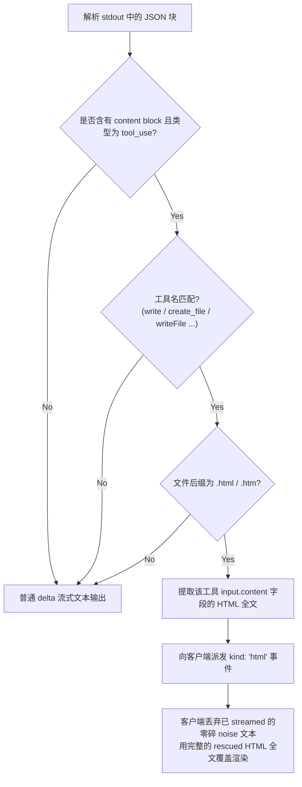

<details>
<summary>相关源文件</summary>

生成本页时使用的主要源文件：

- [next/src/lib/agents/argv.ts](../../../project-repos/html-anything/next/src/lib/agents/argv.ts)
- [next/src/lib/agents/invoke.ts](../../../project-repos/html-anything/next/src/lib/agents/invoke.ts)

</details>

# Agent Argv 组装与流式 NDJSON 翻译协议

在多 Agent 协同体系中，每款 Agent CLI 的设计初衷都是与终端（TTY）或特定 IDE 插件直接交互的，因此它们暴露出截然不同的命令行交互界面（CLI Surface）和结果返回格式。为了在一个统一的 Web 界面中整合这些工具，并且无感地实现流式渲染，`html-anything` 在传输层设计了高内聚的协议适配器。

## 命令行调用适配与多协议模式

在 `argv.ts` 和 `invoke.ts` 的实现中，系统根据 CLI 的通讯特性将其规整为以下三类协议模型，以确定输入 Prompts 是通过 `stdin` 流写入还是以 `arguments` 参数传入：

1. **`stdin` 协议 (标准 stdin 模式)**：
   - 典型代表：`claude`、`cursor-agent`、`gemini`、`qoder`、`aider`。
   - 实现：调用时子进程的 `stdin` 保持开启，直接把 Prompt 写入管道 `child.stdin.write(prompt)`，随后调用 `child.stdin.end()` 关闭。这符合大语言模型 CLI 对传统 Shell pipeline 模式的默认支持。
2. **`argv` 协议 (位置参数模式)**：
   - 典型代表：`deepseek`。
   - 实现：DeepSeek 等 TUI 工具在自动模式下不允许从 stdin 接收参数，因此代码通过 `argv = [...argv, prompt]` 将整个 Prompt 作为最后一个位置参数直接追加在命令行中。
3. **`argv-message` 协议 (显式 Flag 模式)**：
   - 典型代表：`openclaw`。
   - 实现：OpenClaw 作为网关要求通过 `--message <text>` 显式指定 Prompt。另外，OpenClaw 不输出流式 JSON，而是在关闭子进程后返回一个完整的多行大 JSON 文档。适配器需要在子进程触发 `close` 事件时，集中缓存 stdout，使用 `JSON.parse` 提取 `finalAssistantVisibleText` 字段。

## 经典 CLI 调用参数对照

| Agent | 检测/调用参数 | 协议与特性 |
|---|---|---|
| **Claude Code** | `claude -p --output-format stream-json --verbose --include-partial-messages --permission-mode bypassPermissions` | `stdin`。强制采用 bypassPermissions 规避交互式确认；开启 stream-json 流式传输。 |
| **OpenAI Codex** | `codex exec --json --skip-git-repo-check --sandbox workspace-write -c sandbox_workspace_write.network_access=true` | `stdin`。在沙箱限制中写入 workspace-write 并打开网络连接。 |
| **Cursor Agent** | `cursor-agent --print --output-format stream-json --stream-partial-output --force --trust` | `stdin`。强制信任 workspace 以绕过弹窗，并开启流式局部输出。 |
| **Gemini CLI** | `gemini --output-format stream-json --yolo` | `stdin`。在命令行采用 yolo 模式执行。 |
| **Aider** | `aider --no-pretty --no-stream --yes-always --message-file -` | `stdin`。显式要求aider从 `-` (stdin) 导入消息。 |

---

## 核心设计难点与解决方案

### 1. 从工具调用中救援 HTML 内容 (`rescueHtmlFromToolUse`)

大语言模型常有自己默认的行为逻辑（即 Freestyle）。尽管我们在 System Prompt 里千叮咛万嘱咐“要求在回复正文里输出完整的 HTML”，但是像 Claude、Cursor Agent 这种具备本地工具执行能力的强 Agent，往往会认为“既然我已经有了 `Write` 工具，我直接调用 `Write(file_path="output.html", content="...")` 把内容写到文件里更合理”，然后正文仅回复一句空洞的“已将 HTML 输出至本地 ...”。

如果这发生，浏览器的实时预览窗口就会变成白板，完全丢失渲染结果。

为了解决这个问题，`argv.ts` 设计了 `rescueHtmlFromToolUse` 拦截算法：



### 2. 双流去重状态机 (`ParseState`)

大部分 Agent 在配置了“流式输出”（如 `--include-partial-messages`）后，为了保证最终回复的原子性，除了在生成过程中源源不断吐出 `stream_event` (`text_delta`) 之外，在执行结束时，通常还会在最终的 `assistant` message 对象里再重新吐出一次**完整的、拼接后的文本内容**。

如果没有去重，浏览器前端在追加流时就会把这个 HTML 网页**重复 append 渲染两次**，导致页面错乱。

**解决方案**：适配器内引入了轻量级状态机 `ParseState`：
- 在流式过程中，一旦匹配到 `stream_event` / `text_delta` 分片，将状态变量 `state.sawStreamEventText` 标记为 `true`，并将 delta 推送至客户端。
- 在子进程输出最后的 `assistant` message 块时，先检查 `state.sawStreamEventText`，若为 `true`，则说明当前 turn 的流式字符已被前端消费，直接**截断并丢弃**这次重复的全量 assistant 内容，仅提取 usage 等元数据信息，从而完美避免了回声复制。

Sources: [next/src/lib/agents/argv.ts:142-298](../../../project-repos/html-anything/next/src/lib/agents/argv.ts#L142-L298)

<details class="source-snippets">
<summary>引用源码</summary>

<!-- source-snippets:start -->

#### `next/src/lib/agents/argv.ts:142-298`

```typescript
export type AgentParse =
  | { kind: "delta"; text: string }
  | { kind: "meta"; key: string; value: unknown }
  /**
   * Canonical HTML rescued from a file-write tool call (e.g. Claude's `Write`
   * tool). Replaces any previously streamed text — the preamble like
   * "I'll save it as output.html\n已输出至 …" is junk; the tool's input is the
   * real HTML. Downstream calls `setHtmlFor`, not `appendHtmlFor`.
   */
  | { kind: "html"; text: string }
  | { kind: "noise" };

/**
 * Cross-line state that the parser carries between calls. Currently used to
 * dedupe text deltas: when an agent emits both fine-grained `stream_event`
 * `text_delta` blocks AND a final `assistant` message containing the same
 * text concatenated, we keep the streamed tokens and skip the assistant
 * message body. Without this dedupe, every Claude/Cursor/Gemini/Qoder run
 * with `--include-partial-messages` (or the equivalent) writes its output
 * twice.
 */
export type ParseState = { sawStreamEventText?: boolean };

/**
 * Build a stateful per-invocation parser. Feed every stdout line through the
 * returned function — it carries the cross-line state needed for dedupe.
 */
export function makeParser(agent: string): (line: string) => AgentParse[] {
  const state: ParseState = {};
  return (line: string) => parseLineWithState(agent, line, state);
}

/**
 * Parse a single line of agent stdout. Stateless wrapper kept for callers
 * that only need one-shot parsing (e.g. `extractTextFromLine`). Streaming
 * callers should use `makeParser` so dedupe state survives across lines.
 */
export function parseLine(agent: string, line: string): AgentParse[] {
  return parseLineWithState(agent, line, {});
}

/**
 * Some agents (Claude + bypassPermissions, qoder, …) ignore the "stream HTML
 * inline" prompt and decide to dump the document into a file via the `Write`
 * tool, leaving the assistant text as just a confirmation ("已输出至 …").
 * Rescue the HTML from the tool_use input so the preview still gets the real
 * content. Returns an empty string if no Write/create_file tool_use was found
 * or its input has no usable content field.
 */
function rescueHtmlFromToolUse(
  content: Array<{ type?: string; name?: string; input?: unknown }> | undefined,
): string {
  if (!Array.isArray(content)) return "";
  const parts: string[] = [];
  for (const block of content) {
    if (!block || block.type !== "tool_use") continue;
    const name = (block.name ?? "").toLowerCase();
    // Match the common file-write tool names across agents.
    if (
      name !== "write" &&
      name !== "create_file" &&
      name !== "createfile" &&
      name !== "writefile" &&
      name !== "write_file" &&
      name !== "filewrite"
    )
      continue;
    const input = block.input as Record<string, unknown> | undefined;
    if (!input || typeof input !== "object") continue;
    const path = String(input.file_path ?? input.path ?? input.filename ?? "").toLowerCase();
    // Only rescue HTML-ish targets — never grab content for a .md / .txt
    // sidecar the agent might also be writing.
    if (path && !/\.(html?|htm)$/.test(path)) continue;
    const text =
      typeof input.content === "string"
        ? input.content
        : typeof input.text === "string"
          ? input.text
          : typeof input.file_content === "string"
            ? input.file_content
            : "";
    if (text) parts.push(text);
  }
  return parts.join("");
}

function parseLineWithState(agent: string, line: string, state: ParseState): AgentParse[] {
  const trimmed = line.trim();
  if (!trimmed) return [];

  // Aider / DeepSeek — plain text streaming on stdout (DeepSeek tool calls
  // go to stderr, which is forwarded as `stderr` events, not parsed here).
  if (agent === "aider" || agent === "deepseek") {
    return [{ kind: "delta", text: trimmed.endsWith("\n") ? trimmed : trimmed + "\n" }];
  }

  let parsed: unknown;
  try {
    parsed = JSON.parse(trimmed);
  } catch {
    return [{ kind: "noise" }];
  }
  if (!parsed || typeof parsed !== "object") return [];
  const obj = parsed as Record<string, unknown>;
  const out: AgentParse[] = [];

  if (agent === "claude") {
    // Init / system metadata
    if (obj.type === "system" && obj.subtype === "init") {
      out.push({ kind: "meta", key: "model", value: obj.model });
      out.push({ kind: "meta", key: "session", value: obj.session_id });
      if (obj.cwd) out.push({ kind: "meta", key: "cwd", value: obj.cwd });
    }
    // Stream events (--include-partial-messages → fine-grained text_delta)
    if (obj.type === "stream_event" && obj.event && typeof obj.event === "object") {
      const ev = obj.event as { type?: string; delta?: { type?: string; text?: string; thinking?: string } };
      if (ev.type === "content_block_delta" && ev.delta?.type === "text_delta" && typeof ev.delta.text === "string") {
        state.sawStreamEventText = true;
        out.push({ kind: "delta", text: ev.delta.text });
      } else if (ev.type === "content_block_delta" && ev.delta?.type === "thinking_delta") {
... snippet truncated ...
```

<!-- source-snippets:end -->
</details>
