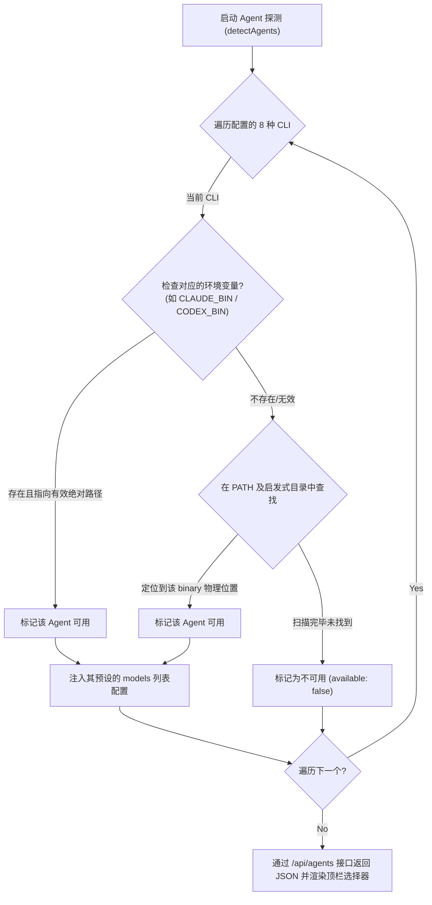

<details>
<summary>相关源文件</summary>

生成本页时使用的主要源文件：

- [next/src/lib/agents/detect.ts](../../../project-repos/html-anything/next/src/lib/agents/detect.ts)
- [next/src/app/api/agents/route.ts](../../../project-repos/html-anything/next/src/app/api/agents/route.ts)

</details>

# 本地 Agent 探测与路径扫描

对于一个依赖本地工具链的 Web 应用而言，能够可靠地发现用户系统上已经安装的 Agent CLI 决定了应用能否“开箱即用”。传统的 Web 应用程序即使部署在本地，也只能通过常规的全局系统 `PATH` 环境变量来搜寻命令。然而在现代桌面操作系统（如 macOS 和 Windows）中，从图形用户界面（GUI）双击启动的应用或守护进程，其运行上下文里经常会**丢失 `.zshrc`、`.bash_profile` 等 Shell 配置文件中定义的自定义 PATH 路径**，这会导致 Node.js 无法探测到安装在 `~/.local/bin`、`.bun/bin` 等目录下的 CLI 工具。

`html-anything` 巧妙地实现了一套**启发式多路径扫描探测机制**，极大地提升了本地 CLI 识别的健壮性。

## 探测流程图

下图展示了系统如何从进程环境变量和磁盘特定路径多重定位 Agent CLI 的检测链路：



## 启发式路径探测实现

在 `detect.ts` 源码中，除了标准读取 `process.env.PATH` 环境变量外，系统单独通过 `userToolchainDirs()` 函数补充声明了一系列主流包管理器和运行环境的默认安装目录。这能有效兜底当 CLI 启动缺少环境变量时的查找失效：

### 启发式扫描的候选目录列表

1. **统一路径前缀与 Volta/Node 前缀**：
   - 提取 `VP_HOME` 环境变量下的 `/bin` 目录。
   - 提取 `NPM_CONFIG_PREFIX` 代表的 npm 全局前缀及其 `/bin` 目录。
2. **多语言包管理器与本地路径**：
   - `~/.local/bin`（普通 Shell 脚本首选安装路径）
   - `~/.bun/bin`（Bun 工具链默认全局路径）
   - `~/.volta/bin`（Volta 虚拟多 Node 管理器路径）
   - `~/.asdf/shims`（ASDF 版本管理器垫片路径）
   - `~/Library/pnpm`（pnpm 默认安装路径，macOS 常见）
   - `~/.cargo/bin`（Rust Cargo 全局二进制路径）
   - `~/.npm-global/bin` 及 `~/.npm-packages/bin`（自定义 npm 全局安装根路径）
   - `~/.claude/local`（Claude Code 内部 CLI 本地路径）
3. **平台差异兜底**：
   - **Windows**：补充探测 `SCOOP` (Windows Scoop包管理器默认路径 `scoop/shims` 及其 nodejs apps 软连接路径)、`SCOOP_GLOBAL` 路径和 `%APPDATA%/npm` (Windows 默认 npm 全局安装根)。由于 Windows 没有 `/bin` 的概念，且 Scoop 安装的 Node 会直接将 shims 置于软件当前目录而非 `/bin` 下，代码对此做了多分支物理兼容。
   - **macOS / Linux**：常规探测 `/opt/homebrew/bin` 和 `/usr/local/bin`。

## 扫描实现细节

系统为 Windows 的扩展名执行匹配（利用 `PATHEXT` 环境变量，例如 `.EXE;.CMD;.BAT`），而在 Unix 下使用空串作为后缀。文件探测部分采用 `fs.existsSync(fullPath)` 进行物理检查，以防通过子进程测试带来的环境死锁风险，极大地提高了接口在高频轮询下的响应性能。

Sources: [next/src/lib/agents/detect.ts:299-452](../../../project-repos/html-anything/next/src/lib/agents/detect.ts#L299-L452)

<details class="source-snippets">
<summary>引用源码</summary>

<!-- source-snippets:start -->

#### `next/src/lib/agents/detect.ts:299-452`

```typescript
function userToolchainDirs(): string[] {
  const home = homedir();
  const env = process.env;
  const dirs: string[] = [];
  const vp = env.VP_HOME?.trim();
  if (vp) dirs.push(join(vp, "bin"));
  const npmPrefix = env.NPM_CONFIG_PREFIX?.trim();
  if (npmPrefix) {
    // npm on Windows installs CLI shims directly in <prefix>, not <prefix>/bin.
    dirs.push(join(npmPrefix, "bin"), npmPrefix);
  }
  dirs.push(
    join(home, ".local/bin"),
    join(home, ".vite-plus/bin"),
    join(home, ".opencode/bin"),
    join(home, ".bun/bin"),
    join(home, ".volta/bin"),
    join(home, ".asdf/shims"),
    join(home, "Library/pnpm"),
    join(home, ".cargo/bin"),
    join(home, ".npm-global/bin"),
    join(home, ".npm-packages/bin"),
    join(home, ".claude/local"),
  );
  if (process.platform === "win32") {
    // Scoop-managed Node.js drops global npm shims into the app dir directly,
    // not under a /bin/ subdirectory. Cover the common Scoop layouts plus the
    // default %AppData%/npm location used by the standalone Node installer.
    const scoopRoot = env.SCOOP?.trim() || join(home, "scoop");
    const globalScoopRoot = env.SCOOP_GLOBAL?.trim() || "C:\\ProgramData\\scoop";
    const appData = env.APPDATA?.trim();
    dirs.push(
      join(scoopRoot, "shims"),
      join(scoopRoot, "apps", "nodejs", "current"),
      join(scoopRoot, "apps", "nodejs-lts", "current"),
      join(globalScoopRoot, "shims"),
      join(globalScoopRoot, "apps", "nodejs", "current"),
    );
    if (appData) dirs.push(join(appData, "npm"));
  } else {
    dirs.push("/opt/homebrew/bin", "/usr/local/bin");
  }
  return dirs;
}

/**
 * Probe `<openclaw> agents list` and return the first agent id (typically
 * "main"). OpenClaw refuses `agent --message` invocations without one of
 * `--agent`, `--to`, or `--session-id`, so we resolve this once per-process
 * with a 5-minute TTL cache.
 *
 * Falls back to "main" on any error — that is the OpenClaw default agent
 * name on a fresh install, so it works for most users out of the box.
 */
let openclawAgentIdCache: { value: string; expiresAt: number } | null = null;
export async function resolveOpenclawAgentId(bin: string): Promise<string> {
  const now = Date.now();
  if (openclawAgentIdCache && openclawAgentIdCache.expiresAt > now) {
    return openclawAgentIdCache.value;
  }
  let resolved = "main";
  try {
    const { spawn } = await import("node:child_process");
    const out = await new Promise<string>((res, rej) => {
      const child = spawn(bin, ["agents", "list"], {
        stdio: ["ignore", "pipe", "pipe"],
        shell: process.platform === "win32",
      });
      let buf = "";
      child.stdout.setEncoding("utf8");
      child.stdout.on("data", (c) => (buf += c));
      child.on("close", () => res(buf));
      child.on("error", rej);
      setTimeout(() => {
        try { child.kill("SIGTERM"); } catch {}
        rej(new Error("openclaw agents list timed out"));
      }, 5_000);
    });
    // First agent line looks like:  "- main (default)"  or  "- ops"
    const m = out.match(/^- (\S+)/m);
    if (m && m[1]) resolved = m[1];
  } catch {
    // keep fallback
  }
  openclawAgentIdCache = { value: resolved, expiresAt: now + 5 * 60_000 };
  return resolved;
}

export function resolveOnPath(bin: string): string | null {
  const exts =
    process.platform === "win32"
      ? (process.env.PATHEXT ?? ".EXE;.CMD;.BAT").split(";")
      : [""];
  const seen = new Set<string>();
  const dirs = [
    ...(process.env.PATH ?? "").split(delimiter),
    ...userToolchainDirs(),
  ].filter((d) => d && !seen.has(d) && (seen.add(d), true));
  for (const d of dirs) {
    for (const e of exts) {
      const full = path.join(d, bin + e);
      try {
        if (existsSync(full)) return full;
      } catch {
        // ignore
      }
    }
  }
  return null;
}

export type DetectedAgent = {
  id: string;
  label: string;
  vendor: string;
  available: boolean;
  path?: string;
  resolvedBin?: string;
  protocol: AgentProtocol;
  /**
... snippet truncated ...
```

<!-- source-snippets:end -->
</details>
