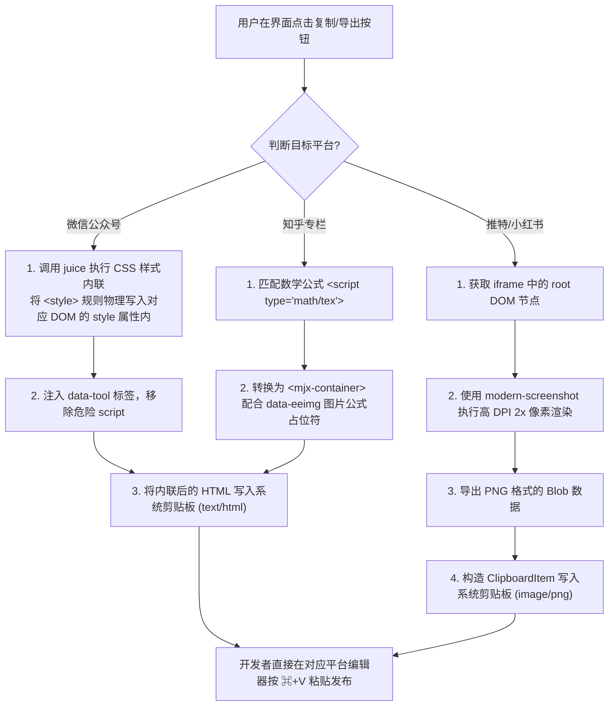

<details>
<summary>相关源file</summary>

生成本页时使用的主要源file：

- [next/src/lib/export/wechat.ts](../../../project-repos/html-anything/next/src/lib/export/wechat.ts)
- [next/src/lib/export/image.ts](../../../project-repos/html-anything/next/src/lib/export/image.ts)
- [next/src/lib/export/zhihu.ts](../../../project-repos/html-anything/next/src/lib/export/zhihu.ts)

</details>

# 多端一键发布与导出机制

将大模型生成的精美 HTML 传递给读者，其最后一步就是“发布”。在实践中，内容创作者常常需要把网页贴入微信公众号、知乎、Twitter 等不同的封闭生态，而这些平台对于富文本的格式校验以及外部样式的兼容性极其苛刻：
- **微信公众号**：完全过滤外部样式表 `<style>` 标签，只接受行内样式（Inline Styles），直接复制网页会导致样式全丢。
- **知乎**：不支持 KaTeX / MathJax 公式前端直渲，强制要求将 LaTeX 数学公式渲染成指定占位标签并上传成图。
- **Twitter / 小红书**：纯封闭的图文平台，只能发送图片。

`html-anything` 通过自研的**多端导出引擎**（WeChat CSS 内联、知乎 LaTeX 规整、高清 2x 屏幕截图），实现了真正的跨平台“零二次排版粘贴”。

## 多端导出发布流程图

下图展示了系统如何为不同目标发布生态进行多重转换与剪贴板写操作：



## 各平台具体技术实现细节

### 1. 微信公众号样式平滑移植 (`wechat.ts`)
微信公众平台的富文本编辑器有着极其严厉的防御规则。除了剥离外联样式外，任何通过 CSS 继承实现的行高、字体颜色也往往会失效。
- **技术实现**：`html-anything` 使用 `juice` 库，在浏览器内存中把全网页所有的 `<style>` 选择器匹配展开，把具体的 CSS 属性强制、扁平化地写进每个对应的 HTML 标签的 `style="..."` 属性中（即样式内联）。
- **清理逻辑**：在内联完成后，程序会删除一切带有副作用的 `<script>` 标签和外部 CSS 引入，并将输出格式置于 `text/html` 写回剪贴板。用户复制后在公众号后台直接 `⌘+V`，便能呈现与本地一模一样的排版与配色。

### 2. 推特与小红书的高清像素画板 (`image.ts`)
为了确保文字在图片中不发生虚化、锯齿，导出图片时必须克服高分辨率显示屏（Retina）下的缩放模糊问题。
- **技术实现**：利用 `modern-screenshot`，单独提取 iframe 中的内部文档流节点，在渲染配置中设置 `scale: 2` (2倍物理像素重采样)，并在内存中拉起一个独立的 Canvas 进行渲染导出。这保证了哪怕是小号的中文字体，在被作为图片上传后，依然能保持细腻的边缘。
- **写入机制**：使用异步的 `navigator.clipboard.write([new ClipboardItem({ 'image/png': blob })])` 把图片数据直接放入剪贴板，这省去了“先下载图片文件 $\rightarrow$ 再手动上传推特”的繁琐，实现了一键直贴。

### 3. 知乎公式占位符转换 (`zhihu.ts`)
知乎在支持公式排版上有着自己的特有格式。如果直接把 MathJax 转换出的 SVG 矢量节点复制过去，会直接展示为乱码。
- **技术实现**：通过 `zhihu.ts` 的正则表达式过滤，将 `<script type="math/tex">` 等 LaTeX 原生块转换成包含对应公式编码的 `<mjx-container>` 骨架，并注入专用的 `data-eeimg="true"` 等辅助标记。在粘贴进知乎后，知乎的前端会自动捕获此标记，调用其云端数学服务器将其渲染为知乎原生公式卡。

Sources: [next/src/lib/export/wechat.ts:1-70](../../../project-repos/html-anything/next/src/lib/export/wechat.ts#L1-L70)

<details class="source-snippets">
<summary>引用源码</summary>

<!-- source-snippets:start -->

#### `next/src/lib/export/wechat.ts:1-70`

```typescript
"use client";

import juice from "juice";
import { copyHtml } from "./clipboard";

/**
 * Take a full HTML document, extract <body> content, inline all CSS via juice,
 * and tag top-level children with data-tool="html-anything" so WeChat trusts the styles.
 * Returns the HTML to be pasted into WeChat editor.
 */
export function toWechatHtml(fullHtml: string): string {
  if (typeof window === "undefined") return fullHtml;

  const doc = new DOMParser().parseFromString(fullHtml, "text/html");

  // Collect all <style> contents + linked stylesheets we cannot follow
  const styles: string[] = [];
  doc.querySelectorAll("style").forEach((s) => {
    styles.push(s.textContent ?? "");
  });

  // Tailwind via CDN won't be accessible to juice — but the runtime DOM in our
  // preview iframe has *generated* inline styles via `getComputedStyle`. Rather
  // than trying to scrape them, we let users render the fragment in a hidden
  // iframe, walk computed styles, and inline them. Here we do the simple
  // <style>-based inlining plus a fallback marker.
  const css = styles.join("\n");
  const bodyHtml = doc.body?.innerHTML ?? fullHtml;

  // Tag top-level children
  const wrap = document.createElement("div");
  wrap.innerHTML = bodyHtml;
  Array.from(wrap.children).forEach((child) => {
    child.setAttribute("data-tool", "html-anything");
  });

  const tagged = wrap.innerHTML;

  let inlined: string;
  try {
    inlined = juice.inlineContent(tagged, css, {
      inlinePseudoElements: true,
      preserveImportant: true,
    });
  } catch {
    inlined = tagged;
  }

  // Wrap in a section element so WeChat treats it as a content block
  return `<section data-tool="html-anything">${inlined}</section>`;
}

export async function copyToWechat(fullHtml: string): Promise<void> {
  const html = toWechatHtml(fullHtml);
  await copyHtml(html);
}
```

<!-- source-snippets:end -->
</details>
        [next/src/lib/export/image.ts:1-120](../../../project-repos/html-anything/next/src/lib/export/image.ts#L1-L120)
