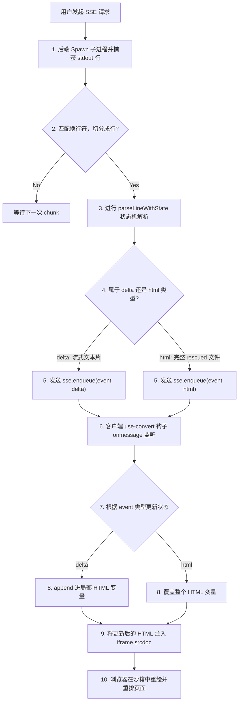

<details>
<summary>相关源file</summary>

生成本页时使用的主要源file：

- [next/src/lib/use-convert.ts](../../../project-repos/html-anything/next/src/lib/use-convert.ts)
- [next/src/app/api/convert/route.ts](../../../project-repos/html-anything/next/src/app/api/convert/route.ts)

</details>

# SSE 流式管道与沙箱实时预览

流式反馈是保障大语言模型交互体验的关键所在。如果让用户在界面前等待二三十秒而没有任何响应，其体验无异于死机。`html-anything` 在服务端采用 Node.js 的 `ReadableStream` 配合 `TextEncoder` 封装，将 Agent 子进程的标准输出作为 SSE（Server-Sent Events）事件流实时下发，并在浏览器前端配合沙箱 `iframe` 技术，实现 HTML 页面的毫秒级渐进流式刷新。

## 流式渲染时序图

下面的时序图展现了后端 SSE 管道和前端沙箱 iframe 对字符流的流式捕获与增量更新逻辑：



## 服务端 ReadableStream 组装

在 `POST /api/convert` 接口中，Next.js 的路由响应直接接收一个利用自定义 `ReadableStream` 生成的异步任务：

```typescript
const sse = new ReadableStream({
  async start(controller) {
    const enc = new TextEncoder();
    let outClosed = false;
    const send = (event: string, data: unknown) => {
      if (outClosed) return;
      try {
        controller.enqueue(enc.encode(`event: ${event}\ndata: ${JSON.stringify(data)}\n\n`));
      } catch {
        outClosed = true;
      }
    };
    // 监听子进程流
    const reader = stream.getReader();
    while (true) {
      const { value, done } = await reader.read();
      if (done) break;
      if (value) send(value.type, value);
    }
    controller.close();
  }
});
```

这里通过 `TextEncoder` 将普通的 EventSource 文本包装成字节流队列（Uint8Array），并在 Headers 中指定 `Content-Type: text/event-stream; charset=utf-8` 以完成服务器流式通知机制。

---

## 浏览器端沙箱隔离预览实现

在前端，渲染不受信任的大模型 HTML 具有极高的安全风险（如 XSS 注入、窃取宿主 Cookie / LocalStorage，或者调用第三方恶意脚本）。为了确保宿主环境安全，预览窗口在设计上具备以下三道隔离机制：

### 1. `sandbox` 属性硬防护
- 预览框物理配置为 `<iframe sandbox="allow-scripts allow-same-origin" />`。
- **作用**：启用 JavaScript 执行能力（以便 Tailwind CDN、折叠动效能够正常执行），但**强制把 iframe 锁死在独立的源（Origin）中**。这使得该 iframe 内部的代码哪怕被植入了恶意的 `document.cookie` 读取，由于跨域隔离阻断，也完全无法摸到宿主应用的敏感数据。

### 2. `srcdoc` 实时写入
- 与普通的 `src="about:blank"` 不同，流式生成器在 `use-convert.ts` 中通过不断拼接 `text` 片段，直接将累加起来的 HTML 赋值给 `iframe` 的 `srcdoc` 属性：
  ```typescript
  iframe.srcdoc = currentHtml;
  ```
- **作用**：这省去了反复触发页面网络请求与下载外部文件的开销，实现了流畅的流式生成效果。

### 3. DOM 清洗与安全防御
- 通过前端 `dompurify` 工具，过滤掉显式的高危注入标签，在保证脚本交互执行的同时，牢牢守住本地优先的沙箱安全红线。

Sources: [next/src/lib/use-convert.ts:1-320](../../../project-repos/html-anything/next/src/lib/use-convert.ts#L1-L320)

<details class="source-snippets">
<summary>引用源码</summary>

<!-- source-snippets:start -->

#### `next/src/lib/use-convert.ts:1-320`

```typescript
"use client";

import { useCallback } from "react";
import { useStore } from "./store";
import { summarizeForAgent } from "./parsers/auto";

type ConvertReq = {
  taskId: string;
  agent: string;
  templateId: string;
  content: string;
  format?: string;
  /** Optional model override. "default" / undefined → no --model flag. */
  model?: string;
};

/** prefix logged when the run is sent in diff-edit mode (vs full regeneration) */
const DIFF_LOG_PREFIX = "🔁 diff-edit 模式";

// per-task abort controllers — multiple tasks can stream concurrently
const controllers = new Map<string, AbortController>();

export function useConvert() {
  const cancel = useCallback((taskId: string) => {
    const ctl = controllers.get(taskId);
    if (ctl) {
      ctl.abort();
      controllers.delete(taskId);
    }
    useStore.getState().setStatusFor(taskId, "idle");
  }, []);

  const run = useCallback(
    async (req: ConvertReq) => {
      const { taskId } = req;
      cancel(taskId);
      const ctl = new AbortController();
      controllers.set(taskId, ctl);
      const store = useStore.getState();
      store.setStatusFor(taskId, "running");
      store.resetHtmlFor(taskId);
      store.clearLogFor(taskId);
      store.resetStatsFor(taskId);
      const startedAt = Date.now();
      store.patchStatsFor(taskId, { startedAt });

      // Inline `asset:<id>` placeholders (created by useUploadFile for
      // images) back into real `data:image/...` URLs before the agent
      // sees the prompt. Editor stays readable; agent gets the bytes.
      const taskWithAssets = store.tasks.find((t) => t.id === taskId);
      const assets = taskWithAssets?.assets ?? {};
      const inlinedContent = Object.keys(assets).length
        ? req.content.replace(/asset:([a-z0-9_]+)/gi, (m, id) => assets[id] ?? m)
        : req.content;

      const summary = summarizeForAgent(inlinedContent);
      const enrichedContent =
        summary.preview && summary.format !== "markdown" && summary.format !== "html" && summary.format !== "text"
          ? `${summary.preview}\n\n--- 原始内容 ---\n${summary.raw}`
          : summary.raw;

      const useModel = req.model && req.model !== "default" ? req.model : undefined;
      const binOverride = store.agentBinOverrides[req.agent]?.trim() || undefined;

      // diff-edit mode: if the task was loaded from a sample (or the user has
      // already converted once) AND the content has actually changed, we ship
      // the previous (baseContent, baseHtml) so the API can ask the agent for
      // minimal edits instead of a fresh regeneration. This preserves the
      // design system AND saves output tokens.
      const task = store.tasks.find((t) => t.id === taskId);
      const isEdit =
        !!task?.baseHtml &&
        !!task?.baseContent &&
        task.baseContent.trim() !== req.content.trim();
      const editPayload = isEdit
        ? {
            editFromHtml: task!.baseHtml!,
            editFromContent: task!.baseContent!,
          }
        : null;

      const payload = {
        agent: req.agent,
        templateId: req.templateId,
        content: enrichedContent,
        format: req.format ?? summary.format,
        ...(useModel ? { model: useModel } : {}),
        ...(binOverride ? { binOverride } : {}),
        ...(editPayload ?? {}),
      };

      const sizeNote = `输入 ${enrichedContent.length.toLocaleString()} 字符 (${summary.format})`;
      store.pushLogFor(taskId, {
        kind: "info",
        text: isEdit
          ? `${DIFF_LOG_PREFIX} · ${req.agent}${useModel ? ` · 模型 ${useModel}` : ""} · 模板 ${req.templateId} · ${sizeNote} · 原 HTML ${(task!.baseHtml!.length / 1024).toFixed(1)} KB`
          : `准备调用 ${req.agent}${useModel ? ` · 模型 ${useModel}` : ""} · 模板 ${req.templateId} · ${sizeNote}`,
      });

      try {
        const res = await fetch("/api/convert", {
          method: "POST",
          headers: { "Content-Type": "application/json" },
          body: JSON.stringify(payload),
          signal: ctl.signal,
        });
        if (!res.ok || !res.body) {
          const text = await res.text().catch(() => res.statusText);
          throw new Error(`HTTP ${res.status}: ${text}`);
        }

        const reader = res.body.getReader();
        const dec = new TextDecoder();
        let buf = "";
        let lastEvent = "";

        while (true) {
          const { value, done } = await reader.read();
          if (done) break;
          buf += dec.decode(value, { stream: true });
... snippet truncated ...
```

<!-- source-snippets:end -->
</details>
