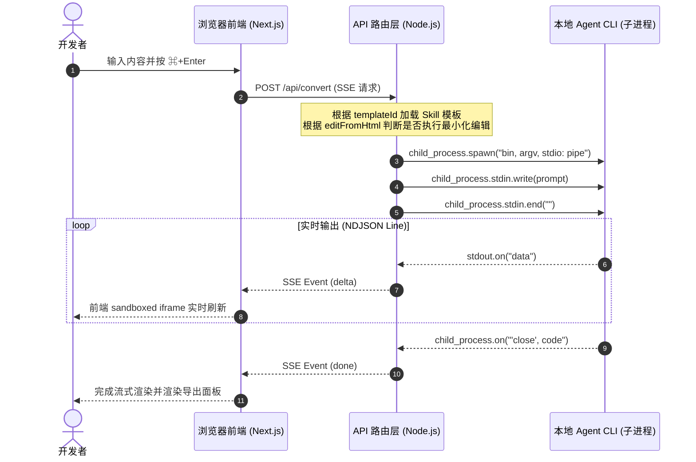

<details>
<summary>相关源文件</summary>

生成本页时使用的主要源文件：

- [next/package.json](../../../project-repos/html-anything/next/package.json)
- [next/src/app/api/convert/route.ts](../../../project-repos/html-anything/next/src/app/api/convert/route.ts)

</details>

# 系统架构与进程协作模型

`html-anything` 在整体架构设计上极力追求“零外部依赖、极致轻量、本地安全优先”。它采用了**三层多进程协作模型**，将 Web UI 表现层、本地守护路由层以及大模型推理引擎层进行清晰地解耦。

在经典的架构中，想要运行一个高水准的设计系统，通常需要配备重型的后端数据库、用户鉴权体系以及大量的 API 密钥（API Keys）管理。而 `html-anything` 巧妙地跳出了这个约束，将大模型执行的环境完全保留在用户的笔记本电脑本地，从而实现了数据隐私保护与零云端运行开销。

## 进程模型鸟瞰

整个系统主要由以下三层构成：

1. **浏览器表现层 (Web UI)**：运行 Next.js 16 (React 19 + Tailwind v4)。主要负责用户的 Markdown/数据编辑、Skills 筛选、Iframe 沙箱隔离预览以及向路由层发送转换请求。
2. **本地 API 路由层 (Node.js)**：运行在本地的 `pnpm dev` 实例，提供本地特权服务（不暴露在公网）。对外暴露 `/api/agents` (扫描 CLI) 与 `/api/convert` (流式调用)；对内通过 `child_process.spawn` 进行子进程管控。
3. **Agent 推理执行层 (本地 CLI)**：用户自己电脑上安装的 coding-agent 工具（例如 `claude`，`cursor-agent`，`codex` 等）。它们在独立的子进程沙箱里执行，直接使用已经登录好的本地凭证进行云端推理，并将输出内容回传给 Node.js 宿主进程。

下面的 Mermaid 时序图展示了用户在界面上按下 `⌘+Enter` 后，三层结构之间的通信交互与流式管道传输过程：



### 时序图解析

1. **发起 SSE 请求**：浏览器向 API 路由层发送 POST 请求，由于该通信通常耗时几秒到十几秒，因此使用 SSE（Server-Sent Events）格式保持连接，从而实现平滑的流式响应。
2. **子进程生成 (Spawn)**：Node.js Server 解析请求，根据 `templateId` 加载对于 Skill 的 Prompt，通过 `child_process.spawn` 拉起对应的本地命令行 CLI 子进程，并指定 `stdio: ["pipe", "pipe", "pipe"]` 建立标准的双向输入输出管道。
3. **传递 Prompt**：将拼装好的 System/User 复合 Prompt 写入子进程的 `stdin`，并调用 `stdin.end()` 关闭写入端，以通知 Agent 输入已完成并开始推理。
4. **流式捕获与翻译**：子进程将推理结果通过 `stdout` 进行 JSON-line 输出。Node.js 不断地通过 `stdout.on('data')` 接收数据块，累积为行进行解析，再作为 `event: delta` 推送回前端浏览器。
5. **安全关闭连接**：子进程退出，触发 `close` 事件。Node.js 发送 `done` 信号，关闭 SSE 可读流，客户端展示导出面板并关闭加载态。如果中途用户点击“打断（Stop）”，浏览器连接断开触发 API 的 `req.signal.abort`，宿主会立刻向子进程发送 `SIGTERM` 信号强制 kill 掉 Agent 进程，避免额外的 Token 开销。

Sources: [next/src/app/api/convert/route.ts:64-164](../../../project-repos/html-anything/next/src/app/api/convert/route.ts#L64-L164)

<details class="source-snippets">
<summary>引用源码</summary>

<!-- source-snippets:start -->

#### `next/src/app/api/convert/route.ts:64-164`

```typescript
export async function POST(req: NextRequest) {
  let body: Body;
  try {
    body = (await req.json()) as Body;
  } catch {
    return new Response("invalid JSON body", { status: 400 });
  }
  const {
    agent,
    templateId,
    content,
    format = "text",
    model,
    cwd,
    binOverride,
    editFromHtml,
    editFromContent,
  } = body;
  if (!agent || !templateId || !content) {
    return new Response("missing required fields: agent, templateId, content", {
      status: 400,
    });
  }
  const skill = loadSkill(templateId);
  if (!skill) {
    return new Response(`unknown template: ${templateId}`, { status: 400 });
  }

  let prompt: string;
  if (editFromHtml && editFromContent) {
    prompt = buildEditPrompt({
      templateName: skill.zhName,
      templateAspect: skill.aspectHint,
      newContent: content,
      oldContent: editFromContent,
      oldHtml: editFromHtml,
      format,
    });
  } else {
    prompt = assemblePrompt({ body: skill.body, content, format });
  }
  const abortCtl = new AbortController();
  req.signal?.addEventListener("abort", () => abortCtl.abort(), { once: true });

  const stream = invokeAgent({
    agent,
    prompt,
    model,
    cwd,
    binOverride,
    signal: abortCtl.signal,
  });

  const sse = new ReadableStream({
    async start(controller) {
      const enc = new TextEncoder();
      let outClosed = false;
      const send = (event: string, data: unknown) => {
        if (outClosed) return;
        try {
          controller.enqueue(
            enc.encode(`event: ${event}\ndata: ${JSON.stringify(data)}\n\n`),
          );
        } catch {
          outClosed = true;
        }
      };

      const reader = stream.getReader();
      try {
        while (true) {
          const { value, done } = await reader.read();
          if (done) break;
          if (!value) continue;
          send(value.type, value);
        }
      } catch (err) {
        send("error", {
          message: err instanceof Error ? err.message : String(err),
        });
      } finally {
        outClosed = true;
        try {
          controller.close();
        } catch {}
      }
    },
    cancel() {
      abortCtl.abort();
    },
  });

  return new Response(sse, {
    headers: {
      "Content-Type": "text/event-stream; charset=utf-8",
      "Cache-Control": "no-cache, no-transform",
      Connection: "keep-alive",
      "X-Accel-Buffering": "no",
    },
  });
}
```

<!-- source-snippets:end -->
</details>
