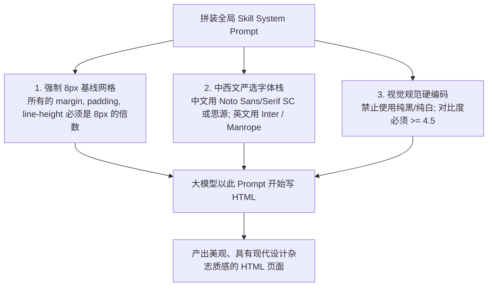

<details>
<summary>相关源文件</summary>

生成本页时使用的主要源文件：

- [next/src/lib/templates/loader.ts](../../../project-repos/html-anything/next/src/lib/templates/loader.ts)
- [next/src/lib/templates/shared.ts](../../../project-repos/html-anything/next/src/lib/templates/shared.ts)

</details>

# 去 AI-slop 模板与 Skills 约束机制

在使用 Coding Agent 编写 Web UI 页面时，最常见的质量缺陷就是 AI 产出页面的“Freestyle 乱来感”（俗称 AI Slop）：不合理的字号递进、随意的配色方案、未对齐的网格以及缺乏响应式设计。大模型通常无法准确预知浏览器最终的渲染表现，从而写出不合规的 CSS。

`html-anything` 没有试图通过复杂的 agent-loop（反射修正）去优化这些表现，而是直接将解决方案沉淀在 **Skills 模板的 System Prompt 强硬约束**中。通过在 75 套内置的 `SKILL.md` 里硬编码核心排版规则，直接将模型限制在安全高水准的“轨道”上。

## 视觉防 freestyle 核心三大设计约束

所有的模板技能 Prompt（在 `shared.ts` 中组装）都包含了这三大强制性视觉防御准则，并在生成之前写入了大模型的上下文：



### 1. 8 像素基线物理网格 (8px Baseline Grid)
- **约束规则**：所有的视觉间距（`margin`、`padding`）、行高（`line-height`）和边框尺寸（`gap`）必须是 `8` 的整数倍。字号（`font-size`）严格采用 `16px`, `24px`, `32px`, `48px`, `64px` 等高阶递进。
- **技术效果**：这使得即便没有设计师微调，生成的组件排列也会呈现出数学上的规整感与对齐感，抹去了常规 AI 生成页面左右间隙忽大忽小的凌乱。

### 2. 中西文隔离严选字体栈 (Font Stacks)
- **约束规则**：
  - 中文字体栈：禁止直接使用系统的宋体或微软雅黑，强制优先使用思源黑体（`Noto Sans SC`）与思源宋体（`Noto Serif SC`）渲染。
  - 英文字体栈：严选 `Inter` / `Manrope` / `Outfit` 作为无衬线标题的首选。
- **技术效果**：在加载 CDN Google Fonts 时，自动为中文字体注入支持，使得中文排版在保留了传统杂志“印刷纸感”的同时，也能保持高保真矢量抗锯齿能力。

### 3. 色彩去 AI-slop 化 (Color Contrast & Gradients)
- **约束规则**：
  - 禁止使用高饱和度的大红、大蓝或纯色。强制使用精心挑选的 HSL 调色板和渐变色（如 Klein Blue、Warm Parchment 等）。
  - 色彩对比度（Contrast Ratio）对于关键文本必须满足 WCAG AA 级标准（对比度 $\ge$ 4.5），以保证文字可读性。
  - 核心交互元素必须声明 `:focus`、`:hover` 伪类以保留浏览器反馈。

---

## 模板加载与提示词拼装流程

在 `shared.ts` 和 `loader.ts` 的实现中，每个 Skill 模板文件夹都包含：
1. `SKILL.md`：声明 metadata 前缀（如 `recommended`, `mode`, `scenario`）和此模板专用的样式 Prompt 约束。
2. `example.html`：本地预览示例，使用户无需拉起 Agent 也能查看样式。

在生成 HTML 时，系统提取 Skill Prompt 模板的文本，并自动拼接以下全局前缀，以确保 LLM 在写代码时恪守格式红线：

```typescript
export function assemblePrompt(args: { body: string; content: string; format: string }) {
  return `你是一个资深的前端设计专家。
我们将使用以下特定视觉 Skills 模板来渲染用户提交的数据：
【视觉约束规范】
${args.body}

【输入格式】
当前输入为：${args.format}

【输入数据】
${args.content}

【硬性要求】
1. 只输出完整的 HTML，第一个字符必须是 <, 最后一个字符必须是 </html>。
2. 不要包含任何 \`\`\` 围栏或解释。
3. 必须使用中文，保证排版字体的中西文栈配置。
4. 禁止空洞的 dummy 占位，必须全部渲染真实数据。
`;
}
```

这套“视觉模板 + 硬性规则 + 隔离注入”的方案构成 `html-anything` 去 AI-slop 化设计的核心资产。

Sources: [next/src/lib/templates/shared.ts:1-120](../../../project-repos/html-anything/next/src/lib/templates/shared.ts#L1-L120)

<details class="source-snippets">
<summary>引用源码</summary>

<!-- source-snippets:start -->

#### `next/src/lib/templates/shared.ts:1-120`

```typescript
/**
 * Shared design directives prepended to every skill's prompt body. Kept in its
 * own module so the `/api/convert` route can call `assemblePrompt({ body, … })`
 * without depending on the disk loader's full surface.
 */
export const SHARED_DESIGN_DIRECTIVES = `
你是世界级的视觉设计师 + 资深前端工程师。请输出一份**自包含的单文件 HTML**，要求：

【内容驱动数量 — 最高优先级, 覆盖模板里的任何数字】
- 模板只定义"可用版面 / 风格 / 配色 / 字体 / 组件库", **不定义** slide / 帧 / 卡片 / section 的数量。
- 输出的 slide / frame / card / section 数量**完全由【用户内容】的实际长度和信息结构决定**。必须**完整覆盖**用户内容的每一个要点、章节、数据组, **不许总结、压缩、丢弃信息**。
- 如果模板正文里写了类似"挑 6-10 张组成 deck / 输出 6-10 帧 / 3-6 张卡片"的数字, **一律视为短示例下的参考下限, 不是上限**。短内容可以低于该范围, 长内容应远超该范围 — 用户给了 12k 字符的内容, 输出 4-6 张是**严重错误**。
- 模板里的"22 个锁死版面 / 10 个磁带式版面 / N 个 layout"指的是**可复用的版式池**, 同一个版式允许在不同内容上多次出现 (例如 KPI Tower 可以连续用 3 次承载不同章节的数据), 不是页数上限。
- 推荐做法: 先把【用户内容】按语义切成若干段 (章节标题 / 论点 / 数据组 / 列表项 / 步骤), 每一段 → 至少一个独立的 slide / section / card, 然后再从模板的版式池里给每一段挑最合适的版面。宁可多页也不要把多个独立要点硬塞进一页。

【硬性技术要求】
- **禁止使用 Write / Edit / MultiEdit / Bash / Create / 任何文件系统工具**。不要把 HTML 写到任何 \`.html\` 文件里。前端直接捕获你的 stdout 文本, 文件落盘由前端负责。
- 直接把完整的 HTML 文档作为助手回复的正文流式输出。不要先说"我来生成"、"已输出至 …"之类的话。
- 文档以 \`<!DOCTYPE html>\` 开头, 末尾以 \`</html>\` 结束。
- 在 \`<head>\` 中通过 CDN 引入 Tailwind v3 Play (https://cdn.tailwindcss.com) 与所需的 Google Fonts。
- 不要引用任何外部图片 URL（除非你能保证 URL 长期有效；优先使用 CSS / SVG 内联绘制）。
- 必要的脚本（图表、动画）通过 jsdelivr CDN 引入；保持单文件可双击打开即用。
- 输出**纯 HTML**, 不要用 markdown 代码围栏包裹, 不要任何解释性文字。第一个字符必须是 \`<\`。

【设计准则 — 世界级标准】
- 排版: 中文优先 \`Noto Sans SC\` / \`Noto Serif SC\`, 英文 \`Inter\` / \`Manrope\` / \`SF Pro\` 风格。
- 色彩: 使用 1 个主色 + 2 个中性色 + 至多 1 个强调色; 大胆留白; 不使用纯黑纯白 (#000/#fff), 改用 \`#0a0a0a\` / \`#fafafa\`。
- 网格: 8 px 基线; 段落最大宽度 65 ch; 标题与正文有清晰的层级。
- 微观细节: 圆角统一 (rounded-xl/2xl), 投影柔和 (shadow-sm/lg), 边框 1px \`#e5e7eb\` / \`#262626\`。
- 动效: 仅在必要处使用 \`transition-all\` 或入场 fade-in; 不要喧宾夺主。
- 无障碍: 颜色对比度 ≥ 4.5; 重要交互有 focus 态。

【内容真实性】
- **必须使用用户提供的真实数据**, 不要编造、不要 lorem ipsum、不要 "Your text here"。
- 如果用户数据是结构化数据 (CSV/JSON), 请提取关键洞察并以图表/表格呈现。
- 中文与英文混排时, 中英文之间留半角空格 (盘古之白)。

`;

/**
 * Wrap a per-template instruction body with the shared design directives and
 * the user content tail. This is the canonical prompt shape; both inline
 * `buildPrompt` functions in `index.ts` and the skill-folder loader assemble
 * prompts via this helper so behaviour stays identical.
 */
export function assemblePrompt(opts: {
  body: string;
  content: string;
  format: string;
}): string {
  return `${SHARED_DESIGN_DIRECTIVES}
${opts.body.trim()}

【输入格式】: ${opts.format}
【用户内容】:
${opts.content}
`;
}
```

<!-- source-snippets:end -->
</details>
