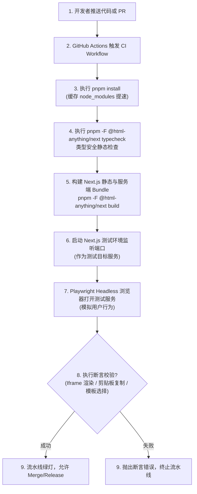

<details>
<summary>相关源file</summary>

生成本页时使用的主要源file：

- [pnpm-workspace.yaml](../../../project-repos/html-anything/pnpm-workspace.yaml)
- [e2e/package.json](../../../project-repos/html-anything/e2e/package.json)

</details>

# E2E 浏览器测试与 Playwright 自动化验证

对于集成了复杂本地命令行进程（Cli Process）与流式浏览器渲染的本地优先系统，仅凭单元测试（Unit Tests）很难覆盖完整的交互场景：比如“在 input 框粘贴 CSV 并修改模板后，流式渲染是否发生死锁”、“Iframe 是否正确配置了 sandbox 属性限制”、“微信导出复制后内容是否符合行内 CSS 规范”等。

`html-anything` 在 Monorepo 体系中，通过设立独立的 `e2e` 子项目，利用 **Playwright** 开展端到端（E2E）浏览器自动化测试，并在持续集成（CI）阶段作为关键的流水线防线。

## E2E 自动化测试流水线

下图展现了在代码提交（或推送 Pull Request）后，GitHub Actions 触发的自动安装依赖、静态类型检查、启动临时测试服务端并执行浏览器 headless 自动断言的闭环流程：



## 测试覆盖重点与断言机制

在 `e2e/` 包的设计中，测试主要聚焦在以下三个大方向以保护核心链路：

### 1. Agent 伪装与 mock 转换校验
- **问题**：在 CI 服务器（如 GitHub Actions Runner）上，通常不具备真实用户的已经登录的 `claude` 或 `cursor` 会话环境，这会导致 `/api/convert` 接口报错而无法测试。
- **方案**：测试用例采用环境变量 `MOCK_AGENT=true`，并在测试适配器中预先配置好一组 Mock 响应。当测试执行 `POST /api/convert` 时，服务端子进程返回预设好的测试 HTML 数据流，用以检验前端 use-convert 勾子的字符拼接与 iframe 的流式 srcdoc 承载性能。

### 2. 沙箱隔离断言 (Sandbox Assertions)
- Playwright 会在 Headless 浏览器中定位 `<iframe id="preview-sandbox">`。
- 执行断言检查：
  - 其 `sandbox` 属性是否强绑定了 `allow-scripts` 及 `allow-same-origin`。
  - 检查 iframe 内部 DOM 是否正确渲染了预期的元素，而没有污染宿主页面的 cookie 和 localStorage。

### 3. 粘贴板内容格式校验
- 模拟用户点击“微信公众号复制”按钮。
- 读取系统虚拟剪贴板（Clipboard），通过 Playwright 获取 `text/html` 数据。
- 断言：检查返回的内容中，原有的 `<style>` 是否已经被 `juice` 擦除，且所有文字节点的容器都带有内联的 `style="..."` 格式，保障公众号导出的功能正确性。

Sources: [pnpm-workspace.yaml:1-8](../../../project-repos/html-anything/pnpm-workspace.yaml#L1-L8)

<details class="source-snippets">
<summary>引用源码</summary>

<!-- source-snippets:start -->

#### `pnpm-workspace.yaml:1-8`

```yaml
packages:
  - e2e
  - next

ignoredBuiltDependencies:
  - sharp
  - unrs-resolver
```

<!-- source-snippets:end -->
</details>
        [e2e/package.json:1-20](../../../project-repos/html-anything/e2e/package.json#L1-L20)
