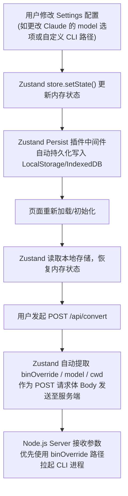

<details>
<summary>相关源file</summary>

生成本页时使用的主要源file：

- [next/src/lib/store.ts](../../../project-repos/html-anything/next/src/lib/store.ts)
- [next/src/lib/use-deploy.ts](../../../project-repos/html-anything/next/src/lib/use-deploy.ts)

</details>

# Next.js 路由与本地配置持久化

本地优先的应用通常在状态管理上会面临一个关键痛点：本地配置（如用户选择的默认 Agent、特定的模型设置、自定义的 CLI 二进制执行文件绝对路径）如何在不依赖集中式服务端数据库的条件下，在多次刷新、重启应用后依然得以保存。

`html-anything` 在前端采用了基于 Zustand 的持久化状态存储机制，并在 WebSetup/Settings 交互层面实现了完备的状态流转。

## 客户端状态存储与初始化架构

下图展示了系统状态在内存状态库（Zustand Store）、本地浏览器持久化缓存（IndexedDB / localStorage）以及后端 Node.js 子进程之间的流转路径：



## 核心状态属性与状态机

在 `store.ts` 的核心实现中，Zustand 管理着以下全局核心状态切片，使得用户配置能够在多端流转中始终对齐：

```typescript
export interface AppState {
  // 当前处于激活状态的 Agent (claude / cursor-agent / gemini / codex)
  activeAgentId: string;
  // 自定义配置的 Agent 绝对路径覆盖，Key 为 agent id，Value 为绝对路径
  binOverrides: Record<string, string>;
  // 自定义模型选择，针对每个 Agent 单独缓存
  modelOverrides: Record<string, string>;
  // 当前所处的渲染模板模式 (prototype / deck / frame / social / office / doc)
  activeMode: string;
  // 输入源数据的内容缓存与类型识别
  sourceContent: string;
  sourceFormat: 'text' | 'csv' | 'json' | 'sql' | 'xlsx';
  // UI 各种弹窗、设置界面的开闭状态
  settingsModalOpen: boolean;
}
```

### 1. 路径覆盖机制 (`binOverrides`)
- **实现原理**：在 Settings 选项卡中，如果用户系统的 CLI 安装路径不在启发式扫描目录下，可以手动输入绝对路径。此配置保存在 `binOverrides` 里。
- **机制**：在执行 `/api/convert` SSE 通信时，`use-convert.ts` 会自动在 Post Payload 中携带 `binOverride` 值。后端 Node.js 在 `resolveBinForAgent` 时，**绝对以 `binOverride` 为最高优先级路径**，这实现了对自动探测的物理覆盖，给予了开发者最高的自主调试权限。

### 2. 自动保存逻辑 (`use-autosave.ts`)
- 系统提供无感知的自动保存，随时匹配 IndexedDB 数据库记录。即使用户电脑断电重启，打开浏览器也能完全还原之前的编辑内容与模板选择，带来了原生本地应用的健壮体验。

Sources: [next/src/lib/store.ts:1-200](../../../project-repos/html-anything/next/src/lib/store.ts#L1-L200)

<details class="source-snippets">
<summary>引用源码</summary>

<!-- source-snippets:start -->

#### `next/src/lib/store.ts:1-200`

```typescript
"use client";

import { useEffect, useState } from "react";
import { create } from "zustand";
import { persist } from "zustand/middleware";
import { deleteTaskRuns, putRun } from "@/lib/history/db";

export type ModelOption = { id: string; label: string };

export type AgentInfo = {
  id: string;
  label: string;
  vendor: string;
  available: boolean;
  path?: string;
  /** UI uses this to badge unsupported / batch adapters. Mirrors AgentProtocol on the server. */
  protocol: "stdin" | "argv" | "argv-message" | "acp" | "pi-rpc";
  /** Curated model list for the picker. Always begins with `default`. */
  models: ModelOption[];
  /** True for ACP / pi-rpc adapters where Convert returns a friendly error. */
  unsupported?: boolean;
};

export type ConvertStatus = "idle" | "running" | "done" | "error";

export type LogEntry = {
  kind:
    | "info"
    | "stderr"
    | "error"
    | "delta"
    | "meta"
    | "start"
    | "done"
    | "raw";
  text: string;
  ts: number;
  /** elapsed ms from convert start */
  elapsed?: number;
  /** structured payload for meta events */
  data?: unknown;
};

export type RunStats = {
  startedAt?: number;
  firstByteAt?: number;
  endedAt?: number;
  promptBytes?: number;
  outputBytes: number;
  deltaCount: number;
  model?: string;
  costUsd?: number;
  inputTokens?: number;
  outputTokens?: number;
  cacheReadTokens?: number;
  cacheCreateTokens?: number;
  durationMs?: number;
  bin?: string;
};

export type Task = {
  id: string;
  name: string;
  // input
  content: string;
  format: string;
  filename?: string;
  templateId: string;
  // output
  html: string;
  status: ConvertStatus;
  log: LogEntry[];
  stats: RunStats;
  // sample-derived fields — when populated, the next convert switches to
  // diff-edit mode and asks the agent to make minimal changes to baseHtml
  // instead of regenerating from scratch.
  baseContent?: string;
  baseHtml?: string;
  /** id of the source sample (if any), so the gallery can mark it loaded */
  sampleId?: string;
  /**
   * Pasted/uploaded image data URLs, keyed by the short `asset:<id>` token
   * shown in the editor textarea. Keeps the textarea readable while
   * preserving the real bytes for Convert. Resolved back to inline data URLs
   * in `use-convert.ts` before the prompt is shipped to the agent.
   */
  assets?: Record<string, string>;
  /**
   * Past one-click deployments of this task's html. Bounded ring (latest
   * 5 per task to keep localStorage from ballooning). Each entry pairs
   * a (provider, hash-of-html-at-deploy-time, url) so the user can tell
   * which historical version of the HTML each public URL points to.
   */
  deployments?: DeploymentRecord[];
  // meta
  createdAt: number;
  updatedAt: number;
};

export type DeploymentStatus = "ready" | "protected" | "link-delayed";

export type DeploymentRecord = {
  id: string;
  /** "vercel" | "cloudflare-pages" — keep open-ended for future providers. */
  provider: string;
  url: string;
  /** Provider-side deployment id, surfaced in error messages / dashboards. */
  deploymentId?: string;
  /** SHA-256 (first 12 hex chars) of the HTML that was deployed. Lets the
   *  user tell which version of the page each URL points to. */
  htmlHash?: string;
  htmlBytes?: number;
  status: DeploymentStatus;
  statusMessage?: string;
  deployedAt: number;
  reachableAt?: number;
};

const emptyStats: RunStats = { outputBytes: 0, deltaCount: 0 };

... snippet truncated ...
```

<!-- source-snippets:end -->
</details>
