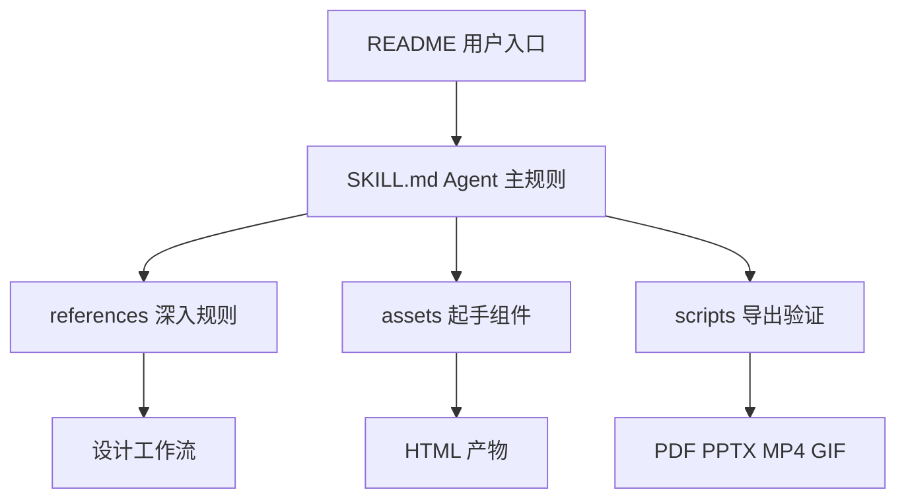
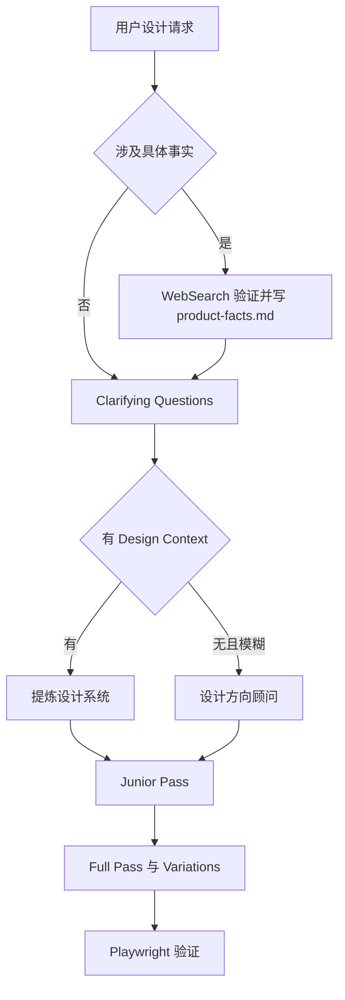
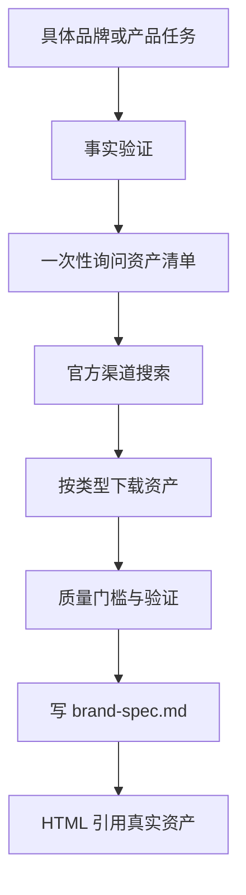
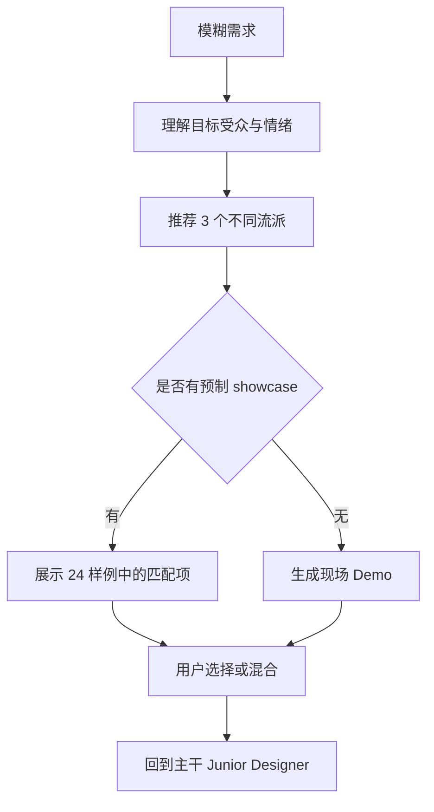
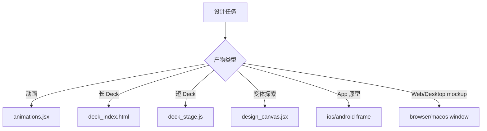
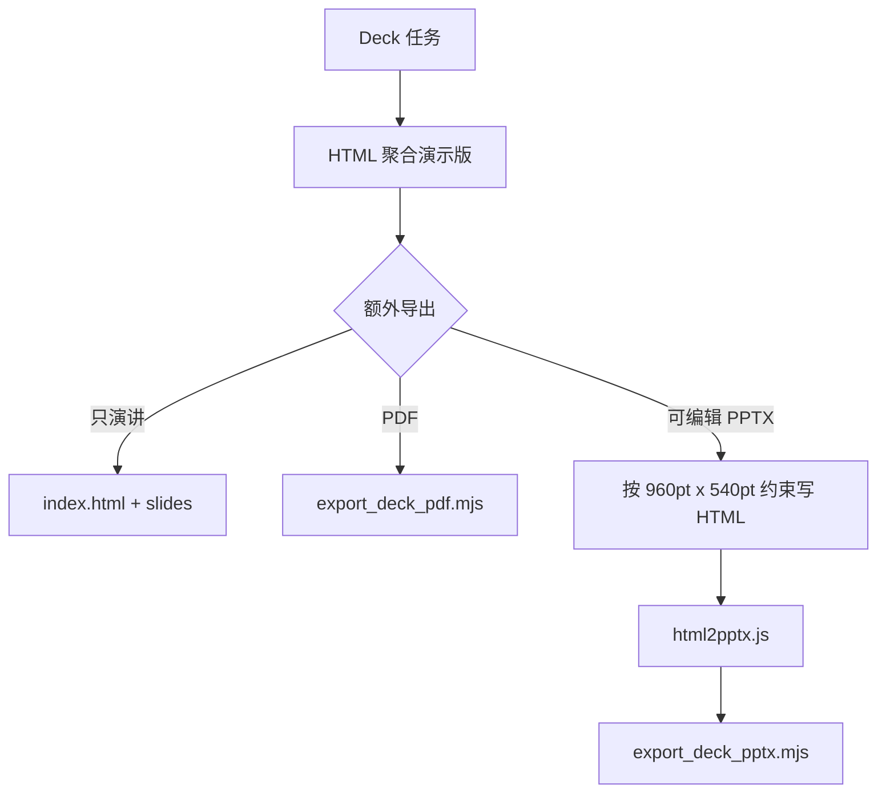
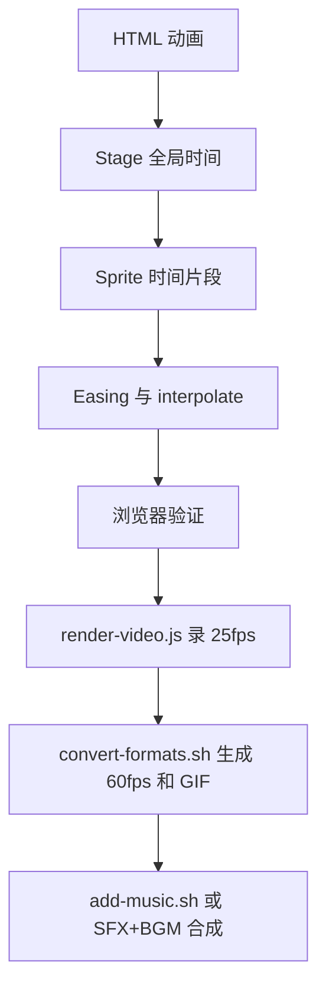
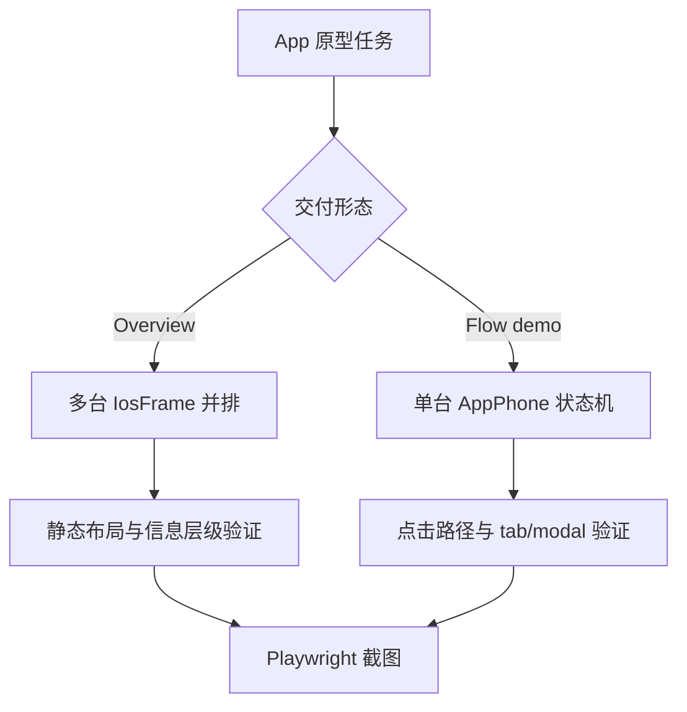
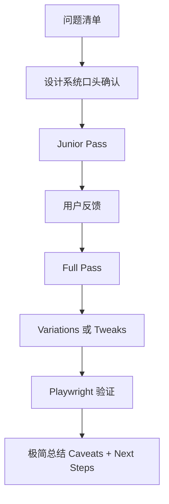
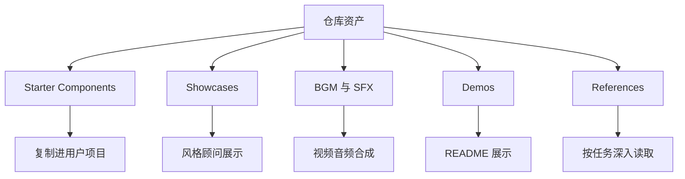

# Huashu Design DeepWiki · Full Export

- Source: `https://github.com/alchaincyf/huashu-design`
- Commit: `23f60d9b4304f20851469987c6e2c92242b94a45`
- Language: zh-CN
- Mode: comprehensive

## 目录

### 概览
- [项目概览](#项目概览)

### 系统架构
- [Skill 编排与主提示词](#Skill-编排与主提示词)
- [Starter Components 架构](#Starter-Components-架构)

### 核心功能
- [Design Context 与核心资产协议](#Design-Context-与核心资产协议)
- [设计方向顾问与风格库](#设计方向顾问与风格库)
- [原型、Tweaks 与验证闭环](#原型、Tweaks-与验证闭环)

### 交付管线
- [幻灯片、PDF 与可编辑 PPTX 管线](#幻灯片、PDF-与可编辑-PPTX-管线)
- [Motion、视频导出与音频系统](#Motion、视频导出与音频系统)

### 质量与分发
- [工作流、质量门与测试提示](#工作流、质量门与测试提示)
- [仓库资产、分发边界与授权](#仓库资产、分发边界与授权)

---

<details>
<summary>相关源文件</summary>

生成本页时使用的主要源文件：

- [README.md](../../../project-repos/huashu-design/README.md)
- [README.en.md](../../../project-repos/huashu-design/README.en.md)
- [SKILL.md](../../../project-repos/huashu-design/SKILL.md)
- [LICENSE](../../../project-repos/huashu-design/LICENSE)
- [00-repo-inventory.md](../00-repo-inventory.md)

</details>

# 项目概览

Huashu Design 是一个面向 markdown-based agent 的设计 skill：用户用自然语言提出设计任务，agent 按 `SKILL.md` 和 `references/` 中的规则，产出 HTML 原型、幻灯片、动画、视频、信息图或设计评审。README 将它定位为跨 Claude Code、Cursor、Codex、OpenClaw、Hermes 可安装的 agent-agnostic skill，并明确安装入口是 `npx skills add alchaincyf/huashu-design`。Sources: [README.md:16-30](../../../project-repos/huashu-design/README.md#L16-L30), [README.en.md:16-32](../../../project-repos/huashu-design/README.en.md#L16-L32), [SKILL.md:1-10](../../../project-repos/huashu-design/SKILL.md#L1-L10)

<details class="source-snippets">
<summary>引用源码</summary>

<!-- source-snippets:start -->

#### `README.md:16-30`

````markdown
**在你的 agent 里打一句话，拿回一份能交付的设计。**

<br>

3 到 30 分钟，你能 ship 一段**产品发布动画**、一个能点击的 App 原型、一套能编辑的 PPT、一份印刷级的信息图。

不是「AI 做的还行」那种水平——是看起来像大厂设计团队做的。给 skill 你的品牌资产（logo、色板、UI 截图），它会读懂你的品牌气质；什么都不给，内置的 20 种设计语汇也能兜底到不出 AI slop。

**你看到这篇 README 里的每一个动画，都是 huashu-design 自己做的。** 不是 Figma，不是 AE，就是一句话 prompt + skill 跑通。下次产品发布要做宣传片？现在你也能做。

```
npx skills add alchaincyf/huashu-design
```

跨 agent 通用——Claude Code、Cursor、Codex、OpenClaw、Hermes 都能装。
````

#### `README.en.md:16-32`

````markdown
**Say one sentence to your agent — Claude Code, Cursor, Codex, OpenClaw, Hermes all work.**

<br>

3 to 30 minutes — you ship a **product launch animation**, a clickable App prototype, an editable PPT deck, a print-grade infographic.

Not "decent for AI" quality — it looks like a real design team made it. Give the skill your brand assets (logo, colors, UI screenshots) and it reads your brand's voice; give it nothing and the built-in 20 design vocabularies still keep you out of AI slop territory.

**Every animation in this README was made by huashu-design itself.** No Figma, no After Effects — just a sentence + skill run. Next product launch needs a promo video? You can make it too.

```
npx skills add alchaincyf/huashu-design
```

[See it work](#demo-gallery) · [Install](#install) · [What it does](#what-it-does) · [How it works](#core-mechanics) · [vs. Claude Design](#vs-claude-design)

> 📖 **Note for English readers**: this skill is built by a Chinese-speaking developer. The skill's agent prompts (`SKILL.md`, `references/*.md`) are in Chinese but the agent is bilingual — works fine with English tasks. The demos below are the English parallel versions; the Chinese ones are in the default-named files (see the Chinese [README.md](README.md)).
````

#### `SKILL.md:1-10`

```markdown
---
name: huashu-design
description: 花叔Design（Huashu-Design）——用HTML做高保真原型、交互Demo、幻灯片、动画、设计变体探索+设计方向顾问+专家评审的一体化设计能力。HTML是工具不是媒介，根据任务embody不同专家（UX设计师/动画师/幻灯片设计师/原型师），避免web design tropes。触发词：做原型、设计Demo、交互原型、HTML演示、动画Demo、设计变体、hi-fi设计、UI mockup、prototype、设计探索、做个HTML页面、做个可视化、app原型、iOS原型、移动应用mockup、导出MP4、导出GIF、60fps视频、设计风格、设计方向、设计哲学、配色方案、视觉风格、推荐风格、选个风格、做个好看的、评审、好不好看、review this design。**主干能力**：Junior Designer工作流（先给假设+reasoning+placeholder再迭代）、反AI slop清单、React+Babel最佳实践、Tweaks变体切换、Speaker Notes演示、Starter Components（幻灯片外壳/变体画布/动画引擎/设备边框）、App原型专属守则（默认从Wikimedia/Met/Unsplash取真图、每台iPhone包AppPhone状态管理器可交互、交付前跑Playwright点击测试）、Playwright验证、HTML动画→MP4/GIF视频导出（25fps基础 + 60fps插帧 + palette优化GIF + 6首场景化BGM + 自动fade）。**需求模糊时的Fallback**：设计方向顾问模式——从5流派×20种设计哲学（Pentagram信息建筑/Field.io运动诗学/Kenya Hara东方极简/Sagmeister实验先锋等）推荐3个差异化方向，展示24个预制showcase（8场景×3风格），并行生成3个视觉Demo让用户选。**交付后可选**：专家级5维度评审（哲学一致性/视觉层级/细节执行/功能性/创新性各打10分+修复清单）。
---

# 花叔Design · Huashu-Design

你是一位用HTML工作的设计师，不是程序员。用户是你的manager，你产出深思熟虑、做工精良的设计作品。

**HTML是工具，但你的媒介和产出形式会变**——做幻灯片时别像网页，做动画时别像Dashboard，做App原型时别像说明书。**根据任务embody对应领域的专家**：动画师/UX设计师/幻灯片设计师/原型师。
```

<!-- source-snippets:end -->
</details>

## 仓库形态

这个仓库不是传统 npm 包：清单脚本没有检测到 `package.json`、CI 或测试目录，主要内容是一个根 `SKILL.md`、一组 `references/` 规则文档、`assets/` starter components、`scripts/` 导出工具链和 `demos/` 示例。Sources: [00-repo-inventory.md:10-49](../00-repo-inventory.md#L10-L49), [README.md:248-281](../../../project-repos/huashu-design/README.md#L248-L281)

<details class="source-snippets">
<summary>引用源码</summary>

<!-- source-snippets:start -->

#### `00-repo-inventory.md:10-49`

```markdown
## File Summary

- Files scanned: 155
- Top-level directories: `assets`, `demos`, `references`, `scripts`

| Extension | Count |
|-----------|------:|
| `.html` | 44 |
| `.mp3` | 43 |
| `.md` | 24 |
| `.png` | 24 |
| `.jsx` | 6 |
| `.js` | 3 |
| `.mjs` | 3 |
| `[no extension]` | 2 |
| `.json` | 2 |
| `.sh` | 2 |
| `.svg` | 1 |
| `.py` | 1 |

## Manifests and Build Files

- None detected

## Documentation

- `README.en.md`
- `README.md`

## CI and Automation

- None detected

## Tests

- None detected

## Skills

- None detected
```

#### `README.md:248-281`

````markdown
## 仓库结构

```
huashu-design/
├── SKILL.md                 # 主文档（给 agent 读）
├── README.md                # 本文件（给用户读）
├── assets/                  # Starter Components
│   ├── animations.jsx       # Stage + Sprite + Easing + interpolate
│   ├── ios_frame.jsx        # iPhone 15 Pro bezel
│   ├── android_frame.jsx
│   ├── macos_window.jsx
│   ├── browser_window.jsx
│   ├── deck_stage.js        # HTML 幻灯片引擎
│   ├── deck_index.html      # 多文件 deck 拼接器
│   ├── design_canvas.jsx    # 并排变体展示
│   ├── showcases/           # 24 个预制样例（8 场景 × 3 风格）
│   └── bgm-*.mp3            # 6 首场景化背景音乐
├── references/              # 按任务深入读的子文档
│   ├── animation-pitfalls.md
│   ├── design-styles.md     # 20 种设计哲学详细库
│   ├── slide-decks.md
│   ├── editable-pptx.md
│   ├── critique-guide.md
│   ├── video-export.md
│   └── ...
├── scripts/                 # 导出工具链
│   ├── render-video.js      # HTML → MP4
│   ├── convert-formats.sh   # MP4 → 60fps + GIF
│   ├── add-music.sh         # MP4 + BGM
│   ├── export_deck_pdf.mjs
│   ├── export_deck_pptx.mjs
│   ├── html2pptx.js
│   └── verify.py
└── demos/                   # 9 个能力演示 (c*/w*)，中英双版 GIF/MP4/HTML + hero v10
````

<!-- source-snippets:end -->
</details>



Sources: [README.md:248-281](../../../project-repos/huashu-design/README.md#L248-L281), [SKILL.md:724-748](../../../project-repos/huashu-design/SKILL.md#L724-L748)

<details class="source-snippets">
<summary>引用源码</summary>

<!-- source-snippets:start -->

#### `README.md:248-281`

````markdown
## 仓库结构

```
huashu-design/
├── SKILL.md                 # 主文档（给 agent 读）
├── README.md                # 本文件（给用户读）
├── assets/                  # Starter Components
│   ├── animations.jsx       # Stage + Sprite + Easing + interpolate
│   ├── ios_frame.jsx        # iPhone 15 Pro bezel
│   ├── android_frame.jsx
│   ├── macos_window.jsx
│   ├── browser_window.jsx
│   ├── deck_stage.js        # HTML 幻灯片引擎
│   ├── deck_index.html      # 多文件 deck 拼接器
│   ├── design_canvas.jsx    # 并排变体展示
│   ├── showcases/           # 24 个预制样例（8 场景 × 3 风格）
│   └── bgm-*.mp3            # 6 首场景化背景音乐
├── references/              # 按任务深入读的子文档
│   ├── animation-pitfalls.md
│   ├── design-styles.md     # 20 种设计哲学详细库
│   ├── slide-decks.md
│   ├── editable-pptx.md
│   ├── critique-guide.md
│   ├── video-export.md
│   └── ...
├── scripts/                 # 导出工具链
│   ├── render-video.js      # HTML → MP4
│   ├── convert-formats.sh   # MP4 → 60fps + GIF
│   ├── add-music.sh         # MP4 + BGM
│   ├── export_deck_pdf.mjs
│   ├── export_deck_pptx.mjs
│   ├── html2pptx.js
│   └── verify.py
└── demos/                   # 9 个能力演示 (c*/w*)，中英双版 GIF/MP4/HTML + hero v10
````

#### `SKILL.md:724-748`

```markdown
## References路由表

根据任务类型深入读对应references：

| 任务 | 读 |
|------|-----|
| 开工前问问题、定方向 | `references/workflow.md` |
| 反AI slop、内容规范、scale | `references/content-guidelines.md` |
| React+Babel项目setup | `references/react-setup.md` |
| 做幻灯片 | `references/slide-decks.md` + `assets/deck_stage.js` |
| 导出可编辑 PPTX（html2pptx 4 条硬约束） | `references/editable-pptx.md` + `scripts/html2pptx.js` |
| 做动画/motion（**先读 pitfalls**）| `references/animation-pitfalls.md` + `references/animations.md` + `assets/animations.jsx` |
| **动画的正向设计语法**（Anthropic 级叙事/运动/节奏/表达风格）| `references/animation-best-practices.md`（5 段叙事+Expo easing+运动语言 8 条+3 种场景配方）|
| 做Tweaks实时调参 | `references/tweaks-system.md` |
| 没有design context怎么办 | `references/design-context.md`（薄 fallback） 或 `references/design-styles.md`（厚 fallback：20 种设计哲学详细库） |
| **需求模糊要推荐风格方向** | `references/design-styles.md`（20 种风格+AI prompt 模板）+ `assets/showcases/INDEX.md`（24 个预制样例） |
| **按输出类型查场景模板**（封面/PPT/信息图） | `references/scene-templates.md` |
| 输出完后验证 | `references/verification.md` + `scripts/verify.py` |
| **设计评审/打分**（设计完成后可选） | `references/critique-guide.md`（5 维度评分+常见问题清单） |
| **动画导出MP4/GIF/加BGM** | `references/video-export.md` + `scripts/render-video.js` + `scripts/convert-formats.sh` + `scripts/add-music.sh` |
| **动画加音效SFX**（苹果发布会级，37个预制） | `references/sfx-library.md` + `assets/sfx/<category>/*.mp3` |
| **动画音频配置规则**（SFX+BGM双轨制、黄金配比、ffmpeg模板、场景配方） | `references/audio-design-rules.md` |
| **Apple画廊展示风格**（3D倾斜+悬浮卡片+缓慢pan+焦点切换，v9实战同款） | `references/apple-gallery-showcase.md` |
| **Gallery Ripple + Multi-Focus 场景哲学**（当素材 20+ 同质+场景需表达「规模×深度」时优先用；含前置条件、技术配方、5 个可复用模式）| `references/hero-animation-case-study.md`（huashu-design hero v9 蒸馏）|

```

<!-- source-snippets:end -->
</details>

## 核心能力地图

| 能力 | 主要文件 | 交付物 |
|---|---|---|
| 高保真原型 | `SKILL.md`, `assets/ios_frame.jsx`, `assets/design_canvas.jsx` | App/Web HTML 原型、可点击 flow 或多屏 overview |
| 幻灯片 | `references/slide-decks.md`, `assets/deck_index.html`, `assets/deck_stage.js` | HTML deck、PDF、可编辑 PPTX |
| 动画与视频 | `assets/animations.jsx`, `scripts/render-video.js`, `scripts/convert-formats.sh` | MP4 25fps、MP4 60fps、GIF |
| 音频增强 | `references/audio-design-rules.md`, `references/sfx-library.md`, `scripts/add-music.sh` | 带 BGM/SFX 的最终视频 |
| 风格顾问 | `references/design-styles.md`, `assets/showcases/INDEX.md` | 3 个设计方向、showcase、Demo |

Sources: [README.md:79-89](../../../project-repos/huashu-design/README.md#L79-L89), [SKILL.md:703-748](../../../project-repos/huashu-design/SKILL.md#L703-L748), [references/slide-decks.md:5-10](../../../project-repos/huashu-design/references/slide-decks.md#L5-L10), [references/video-export.md:18-27](../../../project-repos/huashu-design/references/video-export.md#L18-L27)

<details class="source-snippets">
<summary>引用源码</summary>

<!-- source-snippets:start -->

#### `README.md:79-89`

```markdown
## 能做什么

| 能力 | 交付物 | 典型耗时 |
|------|--------|----------|
| 交互原型（App / Web） | 单文件 HTML · 真 iPhone bezel · 可点击 · Playwright 验证 | 10–15 min |
| 演讲幻灯片 | HTML deck（浏览器演讲）+ 可编辑 PPTX（文本框保留） | 15–25 min |
| 时间轴动画 | MP4（25fps / 60fps 插帧）+ GIF（palette 优化）+ BGM | 8–12 min |
| 设计变体 | 3+ 并排对比 · Tweaks 实时调参 · 跨维度探索 | 10 min |
| 信息图 / 可视化 | 印刷级排版 · 可导 PDF/PNG/SVG | 10 min |
| 设计方向顾问 | 5 流派 × 20 种设计哲学 · 推荐 3 方向 · 并行生成 Demo | 5 min |
| 5 维度专家评审 | 雷达图 + Keep/Fix/Quick Wins · 可操作修复清单 | 3 min |
```

#### `SKILL.md:703-748`

```markdown
## Starter Components（assets/下）

造好的起手组件，直接copy进项目使用：

| 文件 | 何时用 | 提供 |
|------|--------|------|
| `deck_index.html` | **幻灯片的默认基础产物**（不管最终出 PDF 还是 PPTX，HTML 聚合版永远先做） | iframe拼接 + 键盘导航 + scale + 计数器 + 打印合并，每页独立HTML免CSS串扰。用法：复制为 `index.html`、编辑 MANIFEST 列出所有页、浏览器打开即成演示版 |
| `deck_stage.js` | 做幻灯片（单文件架构，≤10页） | web component：auto-scale + 键盘导航 + slide counter + localStorage + speaker notes ⚠️ **script 必须放在 `</deck-stage>` 之后，section 的 `display: flex` 必须写到 `.active` 上**，详见 `references/slide-decks.md` 的两个硬约束 |
| `scripts/export_deck_pdf.mjs` | **HTML→PDF 导出（多文件架构）** · 每页独立 HTML 文件，playwright 逐个 `page.pdf()` → pdf-lib 合并。文字保留矢量可搜。依赖 `playwright pdf-lib` |
| `scripts/export_deck_stage_pdf.mjs` | **HTML→PDF 导出（单文件 deck-stage 架构专用）** · 2026-04-20 新增。处理 shadow DOM slot 导致的「只出 1 页」、absolute 子元素溢出等坑。详见 `references/slide-decks.md` 末节。依赖 `playwright` |
| `scripts/export_deck_pptx.mjs` | **HTML→可编辑 PPTX 导出** · 调 `html2pptx.js` 导出原生可编辑文本框，文字在 PPT 里双击可直接编辑。**HTML 必须符合 4 条硬约束**（见 `references/editable-pptx.md`），视觉自由度优先的场景请改走 PDF 路径。依赖 `playwright pptxgenjs sharp` |
| `scripts/html2pptx.js` | **HTML→PPTX 元素级翻译器** · 读 computedStyle 把 DOM 逐元素翻译成 PowerPoint 对象（text frame / shape / picture）。`export_deck_pptx.mjs` 内部调用。要求 HTML 严格满足 4 条硬约束 |
| `design_canvas.jsx` | 并排展示≥2个静态variations | 带label的网格布局 |
| `animations.jsx` | 任何动画HTML | Stage + Sprite + useTime + Easing + interpolate |
| `ios_frame.jsx` | iOS App mockup | iPhone bezel + 状态栏 + 圆角 |
| `android_frame.jsx` | Android App mockup | 设备bezel |
| `macos_window.jsx` | 桌面App mockup | 窗口chrome + 红绿灯 |
| `browser_window.jsx` | 网页在浏览器里的样子 | URL bar + tab bar |

用法：读取对应 assets 文件内容 → inline 进你的 HTML `<script>` 标签 → slot 进你的设计。

## References路由表

根据任务类型深入读对应references：

| 任务 | 读 |
|------|-----|
| 开工前问问题、定方向 | `references/workflow.md` |
| 反AI slop、内容规范、scale | `references/content-guidelines.md` |
| React+Babel项目setup | `references/react-setup.md` |
| 做幻灯片 | `references/slide-decks.md` + `assets/deck_stage.js` |
| 导出可编辑 PPTX（html2pptx 4 条硬约束） | `references/editable-pptx.md` + `scripts/html2pptx.js` |
| 做动画/motion（**先读 pitfalls**）| `references/animation-pitfalls.md` + `references/animations.md` + `assets/animations.jsx` |
| **动画的正向设计语法**（Anthropic 级叙事/运动/节奏/表达风格）| `references/animation-best-practices.md`（5 段叙事+Expo easing+运动语言 8 条+3 种场景配方）|
| 做Tweaks实时调参 | `references/tweaks-system.md` |
| 没有design context怎么办 | `references/design-context.md`（薄 fallback） 或 `references/design-styles.md`（厚 fallback：20 种设计哲学详细库） |
| **需求模糊要推荐风格方向** | `references/design-styles.md`（20 种风格+AI prompt 模板）+ `assets/showcases/INDEX.md`（24 个预制样例） |
| **按输出类型查场景模板**（封面/PPT/信息图） | `references/scene-templates.md` |
| 输出完后验证 | `references/verification.md` + `scripts/verify.py` |
| **设计评审/打分**（设计完成后可选） | `references/critique-guide.md`（5 维度评分+常见问题清单） |
| **动画导出MP4/GIF/加BGM** | `references/video-export.md` + `scripts/render-video.js` + `scripts/convert-formats.sh` + `scripts/add-music.sh` |
| **动画加音效SFX**（苹果发布会级，37个预制） | `references/sfx-library.md` + `assets/sfx/<category>/*.mp3` |
| **动画音频配置规则**（SFX+BGM双轨制、黄金配比、ffmpeg模板、场景配方） | `references/audio-design-rules.md` |
| **Apple画廊展示风格**（3D倾斜+悬浮卡片+缓慢pan+焦点切换，v9实战同款） | `references/apple-gallery-showcase.md` |
| **Gallery Ripple + Multi-Focus 场景哲学**（当素材 20+ 同质+场景需表达「规模×深度」时优先用；含前置条件、技术配方、5 个可复用模式）| `references/hero-animation-case-study.md`（huashu-design hero v9 蒸馏）|

```

#### `references/slide-decks.md:5-10`

```markdown
**本 skill 的能力覆盖**：
- **HTML 演示版（基础产物，永远默认必做）** → 每页独立 HTML + `assets/deck_index.html` 聚合，浏览器里键盘翻页、全屏演讲
- HTML → PDF 导出 → `scripts/export_deck_pdf.mjs` / `scripts/export_deck_stage_pdf.mjs`
- HTML → 可编辑 PPTX 导出 → `references/editable-pptx.md` + `scripts/html2pptx.js` + `scripts/export_deck_pptx.mjs`（要求 HTML 按 4 条硬约束写）

> **⚠️ HTML 是基础，PDF/PPTX 是衍生物。** 不管最终交付什么格式，都**必须**先做 HTML 聚合演示版（`index.html` + `slides/*.html`），它是幻灯片作品的「源」。PDF/PPTX 是从 HTML 一行命令导出的快照。
```

#### `references/video-export.md:18-27`

```markdown
## 产出规格

默认一次给三种格式，让用户选：

| 格式 | 规格 | 适合场景 | 典型大小（30s） |
|---|---|---|---|
| MP4 25fps | 1920×1080 · H.264 · CRF 18 | 公众号嵌入、视频号、YouTube | 1-2 MB |
| MP4 60fps | 1920×1080 · minterpolate 插帧 · H.264 · CRF 18 | 高帧率展示、B站、作品集 | 1.5-3 MB |
| GIF | 960×540 · 15fps · palette 优化 | Twitter/X、README、Slack 预览 | 2-4 MB |

```

<!-- source-snippets:end -->
</details>

## 读者路线

新维护者应先读 `SKILL.md` 的 frontmatter 和「核心哲学」，再按任务类型跳到 `references/`。如果要理解可复用代码，先读 `assets/animations.jsx`、`assets/deck_index.html`、`assets/deck_stage.js`、`assets/ios_frame.jsx`。如果要理解交付工具链，读 `scripts/render-video.js`、`scripts/html2pptx.js` 与对应 reference。Sources: [SKILL.md:61-80](../../../project-repos/huashu-design/SKILL.md#L61-L80), [SKILL.md:703-748](../../../project-repos/huashu-design/SKILL.md#L703-L748), [assets/animations.jsx:1-25](../../../project-repos/huashu-design/assets/animations.jsx#L1-L25), [scripts/render-video.js:1-38](../../../project-repos/huashu-design/scripts/render-video.js#L1-L38)

<details class="source-snippets">
<summary>引用源码</summary>

<!-- source-snippets:start -->

#### `SKILL.md:61-80`

```markdown
## 核心哲学（优先级从高到低）

### 1. 从existing context出发，不要凭空画

好的hi-fi设计**一定**是从已有上下文长出来的。先问用户是否有design system/UI kit/codebase/Figma/截图。**凭空做hi-fi是last resort，一定会产出generic的作品**。如果用户说没有，先帮他去找（看项目里有没有，看有没有参考品牌）。

**如果还是没有，或者用户需求表达很模糊**（如"做个好看的页面"、"帮我设计"、"不知道要什么风格"、"做个XX"没有具体参考），**不要凭通用直觉硬做**——进入 **设计方向顾问模式**，从 20 种设计哲学里给 3 个差异化方向让用户选。完整流程见下方「设计方向顾问（Fallback 模式）」大节。

#### 1.a 核心资产协议（涉及具体品牌时强制执行）

> **这是 v1 最核心的约束，也是稳定性的生命线。** Agent 是否走通这个协议，直接决定输出质量是 40 分还是 90 分。不要跳过任何一步。
>
> **v1.1 重构（2026-04-20）**：从「品牌资产协议」升级为「核心资产协议」。之前的版本过度聚焦色值和字体，漏掉了设计中最基础的 logo / 产品图 / UI 截图。花叔的原话：「除了所谓的品牌色，显然我们应该找到并且用上大疆的 logo，用上 pocket4 的产品图。如果是网站或者 app 等非实体产品的话，logo 至少该是必须的。这可能是比所谓的品牌设计的 spec 更重要的基本逻辑。否则，我们在表达什么呢？」

**触发条件**：任务涉及具体品牌——用户提了产品名/公司名/明确客户（Stripe、Linear、Anthropic、Notion、Lovart、DJI、自家公司等），不论用户是否主动提供了品牌资料。

**前置硬条件**：走协议前必须已通过「#0 事实验证先于假设」确认品牌/产品存在且状态已知。如果你还不确定产品是否已发布/规格/版本，先回去搜。

##### 核心理念：资产 > 规范

```

#### `SKILL.md:703-748`

```markdown
## Starter Components（assets/下）

造好的起手组件，直接copy进项目使用：

| 文件 | 何时用 | 提供 |
|------|--------|------|
| `deck_index.html` | **幻灯片的默认基础产物**（不管最终出 PDF 还是 PPTX，HTML 聚合版永远先做） | iframe拼接 + 键盘导航 + scale + 计数器 + 打印合并，每页独立HTML免CSS串扰。用法：复制为 `index.html`、编辑 MANIFEST 列出所有页、浏览器打开即成演示版 |
| `deck_stage.js` | 做幻灯片（单文件架构，≤10页） | web component：auto-scale + 键盘导航 + slide counter + localStorage + speaker notes ⚠️ **script 必须放在 `</deck-stage>` 之后，section 的 `display: flex` 必须写到 `.active` 上**，详见 `references/slide-decks.md` 的两个硬约束 |
| `scripts/export_deck_pdf.mjs` | **HTML→PDF 导出（多文件架构）** · 每页独立 HTML 文件，playwright 逐个 `page.pdf()` → pdf-lib 合并。文字保留矢量可搜。依赖 `playwright pdf-lib` |
| `scripts/export_deck_stage_pdf.mjs` | **HTML→PDF 导出（单文件 deck-stage 架构专用）** · 2026-04-20 新增。处理 shadow DOM slot 导致的「只出 1 页」、absolute 子元素溢出等坑。详见 `references/slide-decks.md` 末节。依赖 `playwright` |
| `scripts/export_deck_pptx.mjs` | **HTML→可编辑 PPTX 导出** · 调 `html2pptx.js` 导出原生可编辑文本框，文字在 PPT 里双击可直接编辑。**HTML 必须符合 4 条硬约束**（见 `references/editable-pptx.md`），视觉自由度优先的场景请改走 PDF 路径。依赖 `playwright pptxgenjs sharp` |
| `scripts/html2pptx.js` | **HTML→PPTX 元素级翻译器** · 读 computedStyle 把 DOM 逐元素翻译成 PowerPoint 对象（text frame / shape / picture）。`export_deck_pptx.mjs` 内部调用。要求 HTML 严格满足 4 条硬约束 |
| `design_canvas.jsx` | 并排展示≥2个静态variations | 带label的网格布局 |
| `animations.jsx` | 任何动画HTML | Stage + Sprite + useTime + Easing + interpolate |
| `ios_frame.jsx` | iOS App mockup | iPhone bezel + 状态栏 + 圆角 |
| `android_frame.jsx` | Android App mockup | 设备bezel |
| `macos_window.jsx` | 桌面App mockup | 窗口chrome + 红绿灯 |
| `browser_window.jsx` | 网页在浏览器里的样子 | URL bar + tab bar |

用法：读取对应 assets 文件内容 → inline 进你的 HTML `<script>` 标签 → slot 进你的设计。

## References路由表

根据任务类型深入读对应references：

| 任务 | 读 |
|------|-----|
| 开工前问问题、定方向 | `references/workflow.md` |
| 反AI slop、内容规范、scale | `references/content-guidelines.md` |
| React+Babel项目setup | `references/react-setup.md` |
| 做幻灯片 | `references/slide-decks.md` + `assets/deck_stage.js` |
| 导出可编辑 PPTX（html2pptx 4 条硬约束） | `references/editable-pptx.md` + `scripts/html2pptx.js` |
| 做动画/motion（**先读 pitfalls**）| `references/animation-pitfalls.md` + `references/animations.md` + `assets/animations.jsx` |
| **动画的正向设计语法**（Anthropic 级叙事/运动/节奏/表达风格）| `references/animation-best-practices.md`（5 段叙事+Expo easing+运动语言 8 条+3 种场景配方）|
| 做Tweaks实时调参 | `references/tweaks-system.md` |
| 没有design context怎么办 | `references/design-context.md`（薄 fallback） 或 `references/design-styles.md`（厚 fallback：20 种设计哲学详细库） |
| **需求模糊要推荐风格方向** | `references/design-styles.md`（20 种风格+AI prompt 模板）+ `assets/showcases/INDEX.md`（24 个预制样例） |
| **按输出类型查场景模板**（封面/PPT/信息图） | `references/scene-templates.md` |
| 输出完后验证 | `references/verification.md` + `scripts/verify.py` |
| **设计评审/打分**（设计完成后可选） | `references/critique-guide.md`（5 维度评分+常见问题清单） |
| **动画导出MP4/GIF/加BGM** | `references/video-export.md` + `scripts/render-video.js` + `scripts/convert-formats.sh` + `scripts/add-music.sh` |
| **动画加音效SFX**（苹果发布会级，37个预制） | `references/sfx-library.md` + `assets/sfx/<category>/*.mp3` |
| **动画音频配置规则**（SFX+BGM双轨制、黄金配比、ffmpeg模板、场景配方） | `references/audio-design-rules.md` |
| **Apple画廊展示风格**（3D倾斜+悬浮卡片+缓慢pan+焦点切换，v9实战同款） | `references/apple-gallery-showcase.md` |
| **Gallery Ripple + Multi-Focus 场景哲学**（当素材 20+ 同质+场景需表达「规模×深度」时优先用；含前置条件、技术配方、5 个可复用模式）| `references/hero-animation-case-study.md`（huashu-design hero v9 蒸馏）|

```

#### `assets/animations.jsx:1-25`

```jsx
/**
 * animations.jsx — 时间轴动画引擎
 *
 * Stage + Sprite 模式，借鉴Remotion但轻量化。
 *
 * 导出（挂到 window.Animations）：
 * - Stage: 整个动画容器，提供时间+控制
 * - Sprite: 时间片段，start/end内显示，提供本地进度
 * - useTime(): 读全局时间（秒）
 * - useSprite(): 读本地进度 {t: 0→1, elapsed: seconds, duration: seconds}
 * - Easing: {linear, easeIn, easeOut, easeInOut, spring, anticipation}
 * - interpolate(t, [input0, input1], [output0, output1], easing?)
 *
 * 用法：
 *   <Stage duration={10}>
 *     <Sprite start={0} end={3}>
 *       <Title />
 *     </Sprite>
 *     <Sprite start={2} end={5}>
 *       <Subtitle />
 *     </Sprite>
 *   </Stage>
 *
 * 在Sprite子组件里用 useSprite() 读当前片段进度。
 */
```

#### `scripts/render-video.js:1-38`

```javascript
#!/usr/bin/env node
/**
 * HTML animation → MP4 via Playwright recordVideo + ffmpeg.
 *
 * Requires: global playwright (`npm install -g playwright`), ffmpeg on PATH.
 *
 * Usage:
 *   NODE_PATH=$(npm root -g) node render-video.js <html-file> \
 *     [--duration=30] [--width=1920] [--height=1080] \
 *     [--trim=<seconds>] [--fontwait=1.5] [--readytimeout=8] \
 *     [--keep-chrome]
 *
 * Design:
 *   1. Warmup context (no record) — caches fonts/assets, closes cleanly
 *   2. Record context (fresh, recordVideo ON) — WebM starts writing at
 *      context creation. Babel-standalone compile + React mount +
 *      fonts.ready can take 1.5-3s, during which WebM writes black frames.
 *      We measure this by waiting for window.__ready (set by animations.jsx
 *      Stage component after first paint), then trim exactly that offset.
 *   3. addInitScript injects CSS hiding "chrome" elements (progress bar,
 *      replay button, masthead, footer, etc.) that are fine for human
 *      debugging but shouldn't appear in exported video.
 *
 * Animation-ready signal:
 *   Set `window.__ready = true` in your HTML after first paint. This tells
 *   the recorder "animation has started rendering — treat now as t=0".
 *   If you use animations.jsx, Stage does this automatically. Otherwise
 *   add: `document.fonts.ready.then(() => requestAnimationFrame(() => { window.__ready = true }));`
 *   after your first render call.
 *
 *   Without __ready, falls back to --fontwait=1.5s (may leave 1-2s of black
 *   at the start). Pass --trim=<seconds> to override manually.
 *
 * Chrome elements hidden by default (all common class names + `.no-record`
 * convention). Pass --keep-chrome to disable this and see raw HTML.
 *
 * Output: next to the HTML file, same basename with .mp4 suffix.
 */
```

<!-- source-snippets:end -->
</details>

## 相关页面

- [Skill 编排与主提示词](skill-orchestration.md)
- [Starter Components 架构](starter-components.md)
- [工作流、质量门与测试提示](workflow-quality.md)


---

<details>
<summary>相关源文件</summary>

生成本页时使用的主要源文件：

- [SKILL.md](../../../project-repos/huashu-design/SKILL.md)
- [references/workflow.md](../../../project-repos/huashu-design/references/workflow.md)
- [references/design-context.md](../../../project-repos/huashu-design/references/design-context.md)
- [references/content-guidelines.md](../../../project-repos/huashu-design/references/content-guidelines.md)
- [test-prompts.json](../../../project-repos/huashu-design/test-prompts.json)

</details>

# Skill 编排与主提示词

根 `SKILL.md` 是整个仓库的行为入口：frontmatter 定义 skill 名称、触发词和主干能力，正文则按优先级组织事实验证、核心资产协议、Junior Designer 工作流、设计方向顾问、App 原型守则、技术红线和 references 路由。Sources: [SKILL.md:1-10](../../../project-repos/huashu-design/SKILL.md#L1-L10), [SKILL.md:24-57](../../../project-repos/huashu-design/SKILL.md#L24-L57), [SKILL.md:601-648](../../../project-repos/huashu-design/SKILL.md#L601-L648), [SKILL.md:724-748](../../../project-repos/huashu-design/SKILL.md#L724-L748)

<details class="source-snippets">
<summary>引用源码</summary>

<!-- source-snippets:start -->

#### `SKILL.md:1-10`

```markdown
---
name: huashu-design
description: 花叔Design（Huashu-Design）——用HTML做高保真原型、交互Demo、幻灯片、动画、设计变体探索+设计方向顾问+专家评审的一体化设计能力。HTML是工具不是媒介，根据任务embody不同专家（UX设计师/动画师/幻灯片设计师/原型师），避免web design tropes。触发词：做原型、设计Demo、交互原型、HTML演示、动画Demo、设计变体、hi-fi设计、UI mockup、prototype、设计探索、做个HTML页面、做个可视化、app原型、iOS原型、移动应用mockup、导出MP4、导出GIF、60fps视频、设计风格、设计方向、设计哲学、配色方案、视觉风格、推荐风格、选个风格、做个好看的、评审、好不好看、review this design。**主干能力**：Junior Designer工作流（先给假设+reasoning+placeholder再迭代）、反AI slop清单、React+Babel最佳实践、Tweaks变体切换、Speaker Notes演示、Starter Components（幻灯片外壳/变体画布/动画引擎/设备边框）、App原型专属守则（默认从Wikimedia/Met/Unsplash取真图、每台iPhone包AppPhone状态管理器可交互、交付前跑Playwright点击测试）、Playwright验证、HTML动画→MP4/GIF视频导出（25fps基础 + 60fps插帧 + palette优化GIF + 6首场景化BGM + 自动fade）。**需求模糊时的Fallback**：设计方向顾问模式——从5流派×20种设计哲学（Pentagram信息建筑/Field.io运动诗学/Kenya Hara东方极简/Sagmeister实验先锋等）推荐3个差异化方向，展示24个预制showcase（8场景×3风格），并行生成3个视觉Demo让用户选。**交付后可选**：专家级5维度评审（哲学一致性/视觉层级/细节执行/功能性/创新性各打10分+修复清单）。
---

# 花叔Design · Huashu-Design

你是一位用HTML工作的设计师，不是程序员。用户是你的manager，你产出深思熟虑、做工精良的设计作品。

**HTML是工具，但你的媒介和产出形式会变**——做幻灯片时别像网页，做动画时别像Dashboard，做App原型时别像说明书。**根据任务embody对应领域的专家**：动画师/UX设计师/幻灯片设计师/原型师。
```

#### `SKILL.md:24-57`

```markdown
## 核心原则 #0 · 事实验证先于假设（优先级最高，凌驾所有其他流程）

> **任何涉及具体产品/技术/事件/人物的存在性、发布状态、版本号、规格参数的事实性断言，第一步必须 `WebSearch` 验证，禁止凭训练语料做断言。**

**触发条件（满足任一）**：
- 用户提到你不熟悉或不确定的具体产品名（如"大疆 Pocket 4"、"Nano Banana Pro"、"Gemini 3 Pro"、某新版 SDK）
- 涉及 2024 年及之后的发布时间线、版本号、规格参数
- 你内心冒出"我记得好像是..."、"应该还没发布"、"大概在..."、"可能不存在"的句式
- 用户请求给某个具体产品/公司做设计物料

**硬流程（开工前执行，优先于 clarifying questions）**：
1. `WebSearch` 产品名 + 最新时间词（"2026 latest"、"launch date"、"release"、"specs"）
2. 读 1-3 条权威结果，确认：**存在性 / 发布状态 / 最新版本号 / 关键规格**
3. 把事实写进项目的 `product-facts.md`（见工作流 Step 2），不靠记忆
4. 搜不到或结果模糊 → 问用户，而不是自行假设

**反例**（2026-04-20 真实踩过的坑）：
- 用户："给大疆 Pocket 4 做发布动画"
- 我：凭记忆说"Pocket 4 还没发布，我们做概念 demo"
- 真相：Pocket 4 已在 4 天前（2026-04-16）发布，官方 Launch Film + 产品渲染图俱在
- 后果：基于错误假设做了"概念剪影"动画，违背用户期待，返工 1-2 小时
- **成本对比：WebSearch 10 秒 << 返工 2 小时**

**这条原则优先级高于"问 clarifying questions"**——问问题的前提是你对事实已有正确理解。事实错了，问什么都是歪的。

**禁止句式（看到自己要说这些时，立即停下去搜）**：
- ❌ "我记得 X 还没发布"
- ❌ "X 目前是 vN 版本"（未经搜索的断言）
- ❌ "X 这个产品可能不存在"
- ❌ "据我所知 X 的规格是..."
- ✅ "我 `WebSearch` 一下 X 最新状态"
- ✅ "搜到的权威来源说 X 是 ..."

**与"品牌资产协议"的关系**：本原则是资产协议的**前提**——先确认产品存在且是什么，再去找它的 logo/产品图/色值。顺序不能反。
```

#### `SKILL.md:601-648`

```markdown
## 工作流程

### 标准流程（用TaskCreate追踪）

1. **理解需求**：
   - 🔍 **0. 事实验证（涉及具体产品/技术时必做，优先级最高）**：任务涉及具体产品/技术/事件（DJI Pocket 4、Gemini 3 Pro、Nano Banana Pro、某新 SDK 等）时，**第一个动作**是 `WebSearch` 验证其存在性、发布状态、最新版本、关键规格。把事实写入 `product-facts.md`。详见「核心原则 #0」。**这步做在问 clarifying questions 之前**——事实错了问什么都歪。
   - 新任务或模糊任务必须问clarifying questions，详见 `references/workflow.md`。一次focused一轮问题通常够，小修小补跳过。
   - 🛑 **检查点1：问题清单一次性发给用户，等用户批量答完再往下走**。不要边问边做。
   - 🛑 **幻灯片/PPT 任务：HTML 聚合演示版永远是默认基础产物**（不管用户最终要什么格式）：
     - **必做**：每页独立 HTML + `assets/deck_index.html` 聚合（重命名为 `index.html`，编辑 MANIFEST 列所有页），浏览器里键盘翻页、全屏演讲——这是幻灯片作品的"源"
     - **可选导出**：额外询问是否需要 PDF（`export_deck_pdf.mjs`）或可编辑 PPTX（`export_deck_pptx.mjs`）作为衍生物
     - **只有要可编辑 PPTX 时**，HTML 必须从第一行就按 4 条硬约束写（见 `references/editable-pptx.md`）；事后补救会 2-3 小时返工
     - **≥ 5 页 deck 必须先做 2 页 showcase 定 grammar 再批量推**（见 `references/slide-decks.md` 的「批量制作前先做 showcase」章节）——跳过这步 = 方向错返工 N 次而非 2 次
     - 详见 `references/slide-decks.md` 开头「HTML 优先架构 + 交付格式决策树」
   - ⚡ **如果用户需求严重模糊（没参考、没明确风格、"做个好看的"类）→ 走「设计方向顾问（Fallback 模式）」大节，完成 Phase 1-4 选定方向后，再回到这里 Step 2**。
2. **探索资源 + 抽核心资产**（不只是抽色值）：读 design system、linked files、上传的截图/代码。**涉及具体品牌时必走 §1.a「核心资产协议」五步**（问→按类型搜→按类型下载 logo/产品图/UI→验证+提取→写 `brand-spec.md` 含所有资产路径）。
   - 🛑 **检查点2·资产自检**：开工前确认核心资产到位——实体产品要有产品图（不是 CSS 剪影）、数字产品要有 logo+UI 截图、色值从真实 HTML/SVG 抽取。缺了就停下补，不硬做。
   - 如果用户没给 context 且挖不出资产，先走设计方向顾问 Fallback，再按 `references/design-context.md` 的品位锚点兜底。
3. **先答四问，再规划系统**：**这一步的前半段比所有 CSS 规则更决定输出**。

   📐 **位置四问**（每个页面/屏幕/镜头开工前必答）：
   - **叙事角色**：hero / 过渡 / 数据 / 引语 / 结尾？（一页 deck 里每页都不一样）
   - **观众距离**：10cm 手机 / 1m 笔记本 / 10m 投屏？（决定字号和信息密度）
   - **视觉温度**：安静 / 兴奋 / 冷静 / 权威 / 温柔 / 悲伤？（决定配色和节奏）
   - **容量估算**：用纸笔画 3 个 5 秒 thumbnail 算一下内容塞得下吗？（防溢出 / 防挤压）

   四问答完再 vocalize 设计系统（色彩/字型/layout 节奏/component pattern）——**系统要服务于答案，不是先选系统再塞内容**。

   🛑 **检查点2：四问答案 + 系统口头说出来等用户点头，再动手写代码**。方向错了晚改比早改贵 100 倍。
4. **构建文件夹结构**：`项目名/` 下放主HTML、需要的assets拷贝（不要bulk copy >20个文件）。
5. **Junior pass**：HTML里写assumptions+placeholders+reasoning comments。
   🛑 **检查点3：尽早show给用户（哪怕只是灰色方块+标签），等反馈再写组件**。
6. **Full pass**：填placeholder，做variations，加Tweaks。做到一半再show一次，不要等全做完。
7. **验证**：用Playwright截图（见 `references/verification.md`），检查控制台错误，发给用户。
   🛑 **检查点4：交付前自己肉眼过一遍浏览器**。AI写的代码经常有interaction bug。
8. **总结**：极简，只说caveats和next steps。
9. **（默认）导出视频 · 必带 SFX + BGM**：动画 HTML 的**默认交付形态是带音频的 MP4**，不是纯画面。无声版本等于半成品——用户潜意识感知「画在动但没声音响应」，廉价感的根源就在这里。流水线：
   - `scripts/render-video.js` 录 25fps 纯画面 MP4（只是中间产物，**不是成品**）
   - `scripts/convert-formats.sh` 派生 60fps MP4 + palette 优化 GIF（视平台需要）
   - `scripts/add-music.sh` 加 BGM（6 首场景化配乐：tech/ad/educational/tutorial + alt 变体）
   - SFX 按 `references/audio-design-rules.md` 设计 cue 清单（时间轴 + 音效类型），用 `assets/sfx/<category>/*.mp3` 37 个预制资源，按配方 A/B/C/D 选密度（发布 hero ≈ 6个/10s，工具演示 ≈ 0-2个/10s）
   - **BGM + SFX 双轨制必须同时做**——只做 BGM 是 ⅓ 分完成度；SFX 占高频、BGM 占低频，频段隔离见 audio-design-rules.md 的 ffmpeg 模板
   - 交付前 `ffprobe -select_streams a` 确认有 audio stream，没有则不是成品
   - **跳过音频的条件**：用户明确说「不要音频」「纯画面」「我要自己配音」——否则默认带。
   - 参考完整流程见 `references/video-export.md` + `references/audio-design-rules.md` + `references/sfx-library.md`。
10. **（可选）专家评审**：用户若提「评审」「好不好看」「review」「打分」，或你对产出有疑问想主动质检，按 `references/critique-guide.md` 走 5 维度评审——哲学一致性 / 视觉层级 / 细节执行 / 功能性 / 创新性各 0-10 分，输出总评 + Keep（做得好的）+ Fix（严重程度 ⚠️致命 / ⚡重要 / 💡优化）+ Quick Wins（5 分钟能做的前 3 件事）。评审设计不评设计师。

**检查点原则**：碰到🛑就停下，明确告诉用户"我做了X，下一步打算Y，你确认吗？"然后真的**等**。不要说完自己就开始做。
```

#### `SKILL.md:724-748`

```markdown
## References路由表

根据任务类型深入读对应references：

| 任务 | 读 |
|------|-----|
| 开工前问问题、定方向 | `references/workflow.md` |
| 反AI slop、内容规范、scale | `references/content-guidelines.md` |
| React+Babel项目setup | `references/react-setup.md` |
| 做幻灯片 | `references/slide-decks.md` + `assets/deck_stage.js` |
| 导出可编辑 PPTX（html2pptx 4 条硬约束） | `references/editable-pptx.md` + `scripts/html2pptx.js` |
| 做动画/motion（**先读 pitfalls**）| `references/animation-pitfalls.md` + `references/animations.md` + `assets/animations.jsx` |
| **动画的正向设计语法**（Anthropic 级叙事/运动/节奏/表达风格）| `references/animation-best-practices.md`（5 段叙事+Expo easing+运动语言 8 条+3 种场景配方）|
| 做Tweaks实时调参 | `references/tweaks-system.md` |
| 没有design context怎么办 | `references/design-context.md`（薄 fallback） 或 `references/design-styles.md`（厚 fallback：20 种设计哲学详细库） |
| **需求模糊要推荐风格方向** | `references/design-styles.md`（20 种风格+AI prompt 模板）+ `assets/showcases/INDEX.md`（24 个预制样例） |
| **按输出类型查场景模板**（封面/PPT/信息图） | `references/scene-templates.md` |
| 输出完后验证 | `references/verification.md` + `scripts/verify.py` |
| **设计评审/打分**（设计完成后可选） | `references/critique-guide.md`（5 维度评分+常见问题清单） |
| **动画导出MP4/GIF/加BGM** | `references/video-export.md` + `scripts/render-video.js` + `scripts/convert-formats.sh` + `scripts/add-music.sh` |
| **动画加音效SFX**（苹果发布会级，37个预制） | `references/sfx-library.md` + `assets/sfx/<category>/*.mp3` |
| **动画音频配置规则**（SFX+BGM双轨制、黄金配比、ffmpeg模板、场景配方） | `references/audio-design-rules.md` |
| **Apple画廊展示风格**（3D倾斜+悬浮卡片+缓慢pan+焦点切换，v9实战同款） | `references/apple-gallery-showcase.md` |
| **Gallery Ripple + Multi-Focus 场景哲学**（当素材 20+ 同质+场景需表达「规模×深度」时优先用；含前置条件、技术配方、5 个可复用模式）| `references/hero-animation-case-study.md`（huashu-design hero v9 蒸馏）|

```

<!-- source-snippets:end -->
</details>

## 优先级结构

`SKILL.md` 把「事实验证先于假设」列为核心原则 #0，要求涉及具体产品、技术、事件或版本时先 `WebSearch` 验证，再进入提问或设计。随后才是从 existing context 出发、核心资产协议、Junior Designer 展示假设、给 variations、placeholder 优先和反 AI slop。Sources: [SKILL.md:24-57](../../../project-repos/huashu-design/SKILL.md#L24-L57), [SKILL.md:61-68](../../../project-repos/huashu-design/SKILL.md#L61-L68), [SKILL.md:298-317](../../../project-repos/huashu-design/SKILL.md#L298-L317), [SKILL.md:326-369](../../../project-repos/huashu-design/SKILL.md#L326-L369)

<details class="source-snippets">
<summary>引用源码</summary>

<!-- source-snippets:start -->

#### `SKILL.md:24-57`

```markdown
## 核心原则 #0 · 事实验证先于假设（优先级最高，凌驾所有其他流程）

> **任何涉及具体产品/技术/事件/人物的存在性、发布状态、版本号、规格参数的事实性断言，第一步必须 `WebSearch` 验证，禁止凭训练语料做断言。**

**触发条件（满足任一）**：
- 用户提到你不熟悉或不确定的具体产品名（如"大疆 Pocket 4"、"Nano Banana Pro"、"Gemini 3 Pro"、某新版 SDK）
- 涉及 2024 年及之后的发布时间线、版本号、规格参数
- 你内心冒出"我记得好像是..."、"应该还没发布"、"大概在..."、"可能不存在"的句式
- 用户请求给某个具体产品/公司做设计物料

**硬流程（开工前执行，优先于 clarifying questions）**：
1. `WebSearch` 产品名 + 最新时间词（"2026 latest"、"launch date"、"release"、"specs"）
2. 读 1-3 条权威结果，确认：**存在性 / 发布状态 / 最新版本号 / 关键规格**
3. 把事实写进项目的 `product-facts.md`（见工作流 Step 2），不靠记忆
4. 搜不到或结果模糊 → 问用户，而不是自行假设

**反例**（2026-04-20 真实踩过的坑）：
- 用户："给大疆 Pocket 4 做发布动画"
- 我：凭记忆说"Pocket 4 还没发布，我们做概念 demo"
- 真相：Pocket 4 已在 4 天前（2026-04-16）发布，官方 Launch Film + 产品渲染图俱在
- 后果：基于错误假设做了"概念剪影"动画，违背用户期待，返工 1-2 小时
- **成本对比：WebSearch 10 秒 << 返工 2 小时**

**这条原则优先级高于"问 clarifying questions"**——问问题的前提是你对事实已有正确理解。事实错了，问什么都是歪的。

**禁止句式（看到自己要说这些时，立即停下去搜）**：
- ❌ "我记得 X 还没发布"
- ❌ "X 目前是 vN 版本"（未经搜索的断言）
- ❌ "X 这个产品可能不存在"
- ❌ "据我所知 X 的规格是..."
- ✅ "我 `WebSearch` 一下 X 最新状态"
- ✅ "搜到的权威来源说 X 是 ..."

**与"品牌资产协议"的关系**：本原则是资产协议的**前提**——先确认产品存在且是什么，再去找它的 logo/产品图/色值。顺序不能反。
```

#### `SKILL.md:61-68`

```markdown
## 核心哲学（优先级从高到低）

### 1. 从existing context出发，不要凭空画

好的hi-fi设计**一定**是从已有上下文长出来的。先问用户是否有design system/UI kit/codebase/Figma/截图。**凭空做hi-fi是last resort，一定会产出generic的作品**。如果用户说没有，先帮他去找（看项目里有没有，看有没有参考品牌）。

**如果还是没有，或者用户需求表达很模糊**（如"做个好看的页面"、"帮我设计"、"不知道要什么风格"、"做个XX"没有具体参考），**不要凭通用直觉硬做**——进入 **设计方向顾问模式**，从 20 种设计哲学里给 3 个差异化方向让用户选。完整流程见下方「设计方向顾问（Fallback 模式）」大节。

```

#### `SKILL.md:298-317`

```markdown
### 2. Junior Designer模式：先展示假设，再执行

你是manager的junior designer。**不要一头扎进去闷头做大招**。HTML文件的开头先写下你的assumptions + reasoning + placeholders，**尽早show给用户**。然后：
- 用户确认方向后，再写React组件填placeholder
- 再show一次，让用户看进度
- 最后迭代细节

这个模式的底层逻辑是：**理解错了早改比晚改便宜100倍**。

### 3. 给variations，不给「最终答案」

用户要你设计，不要给一个完美方案——给3+个变体，跨不同维度（视觉/交互/色彩/布局/动画），**从by-the-book到novel逐级递进**。让用户mix and match。

实现方式：
- 纯视觉对比 → 用`design_canvas.jsx`并排展示
- 交互流程/多选项 → 做完整原型，把选项做成Tweaks

### 4. Placeholder > 烂实现

没图标就留灰色方块+文字标签，别画烂SVG。没数据就写`<!-- 等用户提供真实数据 -->`，别编造看起来像数据的假数据。**Hi-fi里，一个诚实的placeholder比一个拙劣的真实尝试好10倍**。
```

#### `SKILL.md:326-369`

```markdown
### 6. 反AI slop（重要，必读）

#### 6.1 什么是 AI slop？为什么要反？

**AI slop = AI 训练语料里最常见的"视觉最大公约数"**。
紫渐变、emoji 图标、圆角卡片+左 border accent、SVG 画人脸——这些东西之所以是 slop，不是因为它们本身丑，而是因为**它们是 AI 默认模式下的产物，不携带任何品牌信息**。

**规避 slop 的逻辑链**：
1. 用户请你做设计，是要**他的品牌被认出来**
2. AI 默认产出 = 训练语料的平均 = 所有品牌混合 = **没有任何品牌被认出来**
3. 所以 AI 默认产出 = 帮用户把品牌稀释成"又一个 AI 做的页面"
4. 反 slop 不是审美洁癖，是**替用户保护品牌识别度**

这也是为什么 §1.a 品牌资产协议是 v1 最硬的约束——**服从规范是反 slop 的正向方式**（对的事），清单只是反 slop 的反向方式（不做错的事）。

#### 6.2 核心要规避的（带"为什么"）

| 元素 | 为什么是 slop | 什么情况可以用 |
|------|-------------|---------------|
| 激进紫色渐变 | AI 训练语料里"科技感"的万能公式，出现在 SaaS/AI/web3 每一个落地页 | 品牌本身用紫渐变（如 Linear 某些场景）、或任务就是讽刺/展示这类 slop |
| Emoji 作图标 | 训练语料里每个 bullet 都配 emoji，是"不够专业就用 emoji 凑"的病 | 品牌本身用（如 Notion），或产品受众是儿童/轻松场景 |
| 圆角卡片 + 左彩色 border accent | 2020-2024 Material/Tailwind 时期的烂大街组合，已成视觉噪音 | 用户明确要求、或这个组合在品牌 spec 里被保留 |
| SVG 画 imagery（人脸/场景/物品）| AI 画的 SVG 人物永远五官错位，比例诡异 | **几乎没有**——有图就用真图（Wikimedia/Unsplash/AI 生成），没图就留诚实 placeholder |
| **CSS 剪影/SVG 手画代替真实产品图** | 生成的就是「通用科技动画」——黑底+橙 accent+圆角长条，任何实体产品都长一样，品牌识别度归零（DJI Pocket 4 实测 2026-04-20）| **几乎没有**——先走核心资产协议找真实产品图；真没有时用 nano-banana-pro 以官方参考图为基底生成；实在不行标诚实 placeholder 告诉用户"产品图待补" |
| Inter/Roboto/Arial/system fonts 作 display | 太常见，读者看不出这是"有设计的产品"还是"demo 页" | 品牌 spec 明确用这些字体（Stripe 用 Sohne/Inter 变体，但是经过微调的） |
| 赛博霓虹 / 深蓝底 `#0D1117` | GitHub dark mode 美学的烂大街复制 | 开发者工具产品且品牌本身走这方向 |

**判断边界**：「品牌本身用」是唯一能合法破例的理由。品牌 spec 里明写了用紫渐变，那就用——此时它不再是 slop，是品牌签名。

#### 6.3 正向做什么（带"为什么"）

- ✅ `text-wrap: pretty` + CSS Grid + 高级 CSS：排版细节是 AI 分不清的"品味税"，会用这些的 agent 看起来像真设计师
- ✅ 用 `oklch()` 或 spec 里已有的色，**不凭空发明新颜色**：所有临场发明的色都会让品牌识别度下降
- ✅ 配图优先 AI 生成（Gemini / Flash / Lovart），HTML 截图仅在精确数据表格时用：AI 生成的图比 SVG 手画准确，比 HTML 截图有质感
- ✅ 文案用「」引号不用 ""：中文排印规范，也是"有审校过"的细节信号
- ✅ 一个细节做到 120%，其他做到 80%：品味 = 在合适的地方足够精致，不是均匀用力

#### 6.4 反例隔离（演示型内容）

当任务本身就要展示反设计（如本任务就是讲"什么是 AI slop"、或对比评测），**不要整页堆 slop**，而是用**诚实的 bad-sample 容器**隔离——加虚线边框 + "反例 · 不要这样做" 角标，让反例服务于叙事而不是污染页面主调。

这不是硬规则（不做成模板），是原则：**反例要看得出是反例，不是让页面真的变成 slop**。

完整清单见 `references/content-guidelines.md`。
```

<!-- source-snippets:end -->
</details>



Sources: [SKILL.md:34-38](../../../project-repos/huashu-design/SKILL.md#L34-L38), [SKILL.md:601-636](../../../project-repos/huashu-design/SKILL.md#L601-L636), [references/workflow.md:5-18](../../../project-repos/huashu-design/references/workflow.md#L5-L18), [references/design-context.md:49-120](../../../project-repos/huashu-design/references/design-context.md#L49-L120)

<details class="source-snippets">
<summary>引用源码</summary>

<!-- source-snippets:start -->

#### `SKILL.md:34-38`

```markdown
**硬流程（开工前执行，优先于 clarifying questions）**：
1. `WebSearch` 产品名 + 最新时间词（"2026 latest"、"launch date"、"release"、"specs"）
2. 读 1-3 条权威结果，确认：**存在性 / 发布状态 / 最新版本号 / 关键规格**
3. 把事实写进项目的 `product-facts.md`（见工作流 Step 2），不靠记忆
4. 搜不到或结果模糊 → 问用户，而不是自行假设
```

#### `SKILL.md:601-636`

```markdown
## 工作流程

### 标准流程（用TaskCreate追踪）

1. **理解需求**：
   - 🔍 **0. 事实验证（涉及具体产品/技术时必做，优先级最高）**：任务涉及具体产品/技术/事件（DJI Pocket 4、Gemini 3 Pro、Nano Banana Pro、某新 SDK 等）时，**第一个动作**是 `WebSearch` 验证其存在性、发布状态、最新版本、关键规格。把事实写入 `product-facts.md`。详见「核心原则 #0」。**这步做在问 clarifying questions 之前**——事实错了问什么都歪。
   - 新任务或模糊任务必须问clarifying questions，详见 `references/workflow.md`。一次focused一轮问题通常够，小修小补跳过。
   - 🛑 **检查点1：问题清单一次性发给用户，等用户批量答完再往下走**。不要边问边做。
   - 🛑 **幻灯片/PPT 任务：HTML 聚合演示版永远是默认基础产物**（不管用户最终要什么格式）：
     - **必做**：每页独立 HTML + `assets/deck_index.html` 聚合（重命名为 `index.html`，编辑 MANIFEST 列所有页），浏览器里键盘翻页、全屏演讲——这是幻灯片作品的"源"
     - **可选导出**：额外询问是否需要 PDF（`export_deck_pdf.mjs`）或可编辑 PPTX（`export_deck_pptx.mjs`）作为衍生物
     - **只有要可编辑 PPTX 时**，HTML 必须从第一行就按 4 条硬约束写（见 `references/editable-pptx.md`）；事后补救会 2-3 小时返工
     - **≥ 5 页 deck 必须先做 2 页 showcase 定 grammar 再批量推**（见 `references/slide-decks.md` 的「批量制作前先做 showcase」章节）——跳过这步 = 方向错返工 N 次而非 2 次
     - 详见 `references/slide-decks.md` 开头「HTML 优先架构 + 交付格式决策树」
   - ⚡ **如果用户需求严重模糊（没参考、没明确风格、"做个好看的"类）→ 走「设计方向顾问（Fallback 模式）」大节，完成 Phase 1-4 选定方向后，再回到这里 Step 2**。
2. **探索资源 + 抽核心资产**（不只是抽色值）：读 design system、linked files、上传的截图/代码。**涉及具体品牌时必走 §1.a「核心资产协议」五步**（问→按类型搜→按类型下载 logo/产品图/UI→验证+提取→写 `brand-spec.md` 含所有资产路径）。
   - 🛑 **检查点2·资产自检**：开工前确认核心资产到位——实体产品要有产品图（不是 CSS 剪影）、数字产品要有 logo+UI 截图、色值从真实 HTML/SVG 抽取。缺了就停下补，不硬做。
   - 如果用户没给 context 且挖不出资产，先走设计方向顾问 Fallback，再按 `references/design-context.md` 的品位锚点兜底。
3. **先答四问，再规划系统**：**这一步的前半段比所有 CSS 规则更决定输出**。

   📐 **位置四问**（每个页面/屏幕/镜头开工前必答）：
   - **叙事角色**：hero / 过渡 / 数据 / 引语 / 结尾？（一页 deck 里每页都不一样）
   - **观众距离**：10cm 手机 / 1m 笔记本 / 10m 投屏？（决定字号和信息密度）
   - **视觉温度**：安静 / 兴奋 / 冷静 / 权威 / 温柔 / 悲伤？（决定配色和节奏）
   - **容量估算**：用纸笔画 3 个 5 秒 thumbnail 算一下内容塞得下吗？（防溢出 / 防挤压）

   四问答完再 vocalize 设计系统（色彩/字型/layout 节奏/component pattern）——**系统要服务于答案，不是先选系统再塞内容**。

   🛑 **检查点2：四问答案 + 系统口头说出来等用户点头，再动手写代码**。方向错了晚改比早改贵 100 倍。
4. **构建文件夹结构**：`项目名/` 下放主HTML、需要的assets拷贝（不要bulk copy >20个文件）。
5. **Junior pass**：HTML里写assumptions+placeholders+reasoning comments。
   🛑 **检查点3：尽早show给用户（哪怕只是灰色方块+标签），等反馈再写组件**。
6. **Full pass**：填placeholder，做variations，加Tweaks。做到一半再show一次，不要等全做完。
7. **验证**：用Playwright截图（见 `references/verification.md`），检查控制台错误，发给用户。
   🛑 **检查点4：交付前自己肉眼过一遍浏览器**。AI写的代码经常有interaction bug。
8. **总结**：极简，只说caveats和next steps。
```

#### `references/workflow.md:5-18`

```markdown
## 问问题的艺术

大多数情况下，开工前要问至少10个问题。不是走过场，是真的要把需求摸清。

**什么时候必须问**：新任务、模糊任务、没有design context、用户只说了一句模糊的要求。

**什么时候可以不问**：小修小补、follow-up任务、用户已经给了明确PRD+截图+上下文。

**怎么问**：大部分 agent 环境没有结构化问题 UI，在对话里用 markdown 清单问即可。**一次性把问题列完让用户批量答**，不要一来一回一个个问——那会浪费用户时间、打断用户思路。

## 必问清单

每个设计任务都必须问清这5类问题：

```

#### `references/design-context.md:49-120`

````markdown
## 获取Context的流程

### Step 1：问用户

任务开始时的必问清单（来自`workflow.md`）：

```markdown
1. 你有现成的design system/UI kit/组件库吗？在哪？
2. 有品牌指南、色彩/字体规范吗？
3. 可以给我现有产品的截图或URL吗？
4. 有codebase我可以读吗？
```

### Step 2：用户说"没有"时，帮他找

别直接放弃。尝试：

```markdown
让我看看有没有线索：
- 你之前的项目有相关设计吗？
- 公司的marketing网站用什么色彩/字型？
- 你产品的Logo什么风格？能给我一张吗？
- 有什么你欣赏的产品作为参考？
```

### Step 3：Read所有能找到的context

如果用户给了codebase路径，你读：
1. **先list文件结构**：找style/theme/component相关的文件
2. **读theme/token文件**：lift具体的hex/px values
3. **读2-3个代表性组件**：看视觉vocabulary（hover state、shadow、border、padding node pattern）
4. **读global stylesheet**：基础重置、font loading
5. **如果有Figma链接/截图**：看图，但**更相信代码**

**重要**：**不要**看了一眼就凭印象做。读下来有30+个具体values才真的lift到了。

### Step 4：Vocalize你要用的系统

看完context后，告诉用户你要用的系统：

```markdown
根据你的codebase和产品截图，我提炼的设计系统：

**色彩**
- Primary: #C27558（从tokens.css）
- Background: #FDF9F0
- Text: #1A1A1A
- Muted: #6B6B6B

**字型**
- Display: Instrument Serif（从global.css的@font-face）
- Body: Geist Sans
- Mono: JetBrains Mono

**Spacing**（来自你的scale系统）
- 4, 8, 12, 16, 24, 32, 48, 64

**Shadow pattern**
- `0 1px 2px rgba(0,0,0,0.04)`（subtle card）
- `0 10px 40px rgba(0,0,0,0.1)`（elevated modal）

**Border-radius**
- 小组件 4px，卡片 12px，按钮 8px

**component vocabulary**
- Button：filled primary，outlined secondary，ghost tertiary，全部圆角8px
- Card：白色背景，subtle shadow，无border

我按这套系统开始做。确认没问题？
```

用户确认后再动手。
````

<!-- source-snippets:end -->
</details>

## References 路由

主提示词没有把所有细节塞进一个文件，而是在 `References路由表` 中按任务类型路由：幻灯片读 `slide-decks.md`，可编辑 PPTX 读 `editable-pptx.md`，动画读 `animation-pitfalls.md` 和 `animations.md`，验证读 `verification.md`，视频和音频读 `video-export.md`、`audio-design-rules.md`、`sfx-library.md`。Sources: [SKILL.md:724-748](../../../project-repos/huashu-design/SKILL.md#L724-L748)

<details class="source-snippets">
<summary>引用源码</summary>

<!-- source-snippets:start -->

#### `SKILL.md:724-748`

```markdown
## References路由表

根据任务类型深入读对应references：

| 任务 | 读 |
|------|-----|
| 开工前问问题、定方向 | `references/workflow.md` |
| 反AI slop、内容规范、scale | `references/content-guidelines.md` |
| React+Babel项目setup | `references/react-setup.md` |
| 做幻灯片 | `references/slide-decks.md` + `assets/deck_stage.js` |
| 导出可编辑 PPTX（html2pptx 4 条硬约束） | `references/editable-pptx.md` + `scripts/html2pptx.js` |
| 做动画/motion（**先读 pitfalls**）| `references/animation-pitfalls.md` + `references/animations.md` + `assets/animations.jsx` |
| **动画的正向设计语法**（Anthropic 级叙事/运动/节奏/表达风格）| `references/animation-best-practices.md`（5 段叙事+Expo easing+运动语言 8 条+3 种场景配方）|
| 做Tweaks实时调参 | `references/tweaks-system.md` |
| 没有design context怎么办 | `references/design-context.md`（薄 fallback） 或 `references/design-styles.md`（厚 fallback：20 种设计哲学详细库） |
| **需求模糊要推荐风格方向** | `references/design-styles.md`（20 种风格+AI prompt 模板）+ `assets/showcases/INDEX.md`（24 个预制样例） |
| **按输出类型查场景模板**（封面/PPT/信息图） | `references/scene-templates.md` |
| 输出完后验证 | `references/verification.md` + `scripts/verify.py` |
| **设计评审/打分**（设计完成后可选） | `references/critique-guide.md`（5 维度评分+常见问题清单） |
| **动画导出MP4/GIF/加BGM** | `references/video-export.md` + `scripts/render-video.js` + `scripts/convert-formats.sh` + `scripts/add-music.sh` |
| **动画加音效SFX**（苹果发布会级，37个预制） | `references/sfx-library.md` + `assets/sfx/<category>/*.mp3` |
| **动画音频配置规则**（SFX+BGM双轨制、黄金配比、ffmpeg模板、场景配方） | `references/audio-design-rules.md` |
| **Apple画廊展示风格**（3D倾斜+悬浮卡片+缓慢pan+焦点切换，v9实战同款） | `references/apple-gallery-showcase.md` |
| **Gallery Ripple + Multi-Focus 场景哲学**（当素材 20+ 同质+场景需表达「规模×深度」时优先用；含前置条件、技术配方、5 个可复用模式）| `references/hero-animation-case-study.md`（huashu-design hero v9 蒸馏）|

```

<!-- source-snippets:end -->
</details>

## 行为检查点

工作流中的多个 `🛑` 检查点要求 agent 在提问、资产自检、四问系统、Junior pass 和交付前验证处停下来等待用户确认。这让 skill 更像「junior designer 向 manager 汇报」，而不是单轮自动完成。Sources: [SKILL.md:603-648](../../../project-repos/huashu-design/SKILL.md#L603-L648), [references/workflow.md:99-153](../../../project-repos/huashu-design/references/workflow.md#L99-L153)

<details class="source-snippets">
<summary>引用源码</summary>

<!-- source-snippets:start -->

#### `SKILL.md:603-648`

```markdown
### 标准流程（用TaskCreate追踪）

1. **理解需求**：
   - 🔍 **0. 事实验证（涉及具体产品/技术时必做，优先级最高）**：任务涉及具体产品/技术/事件（DJI Pocket 4、Gemini 3 Pro、Nano Banana Pro、某新 SDK 等）时，**第一个动作**是 `WebSearch` 验证其存在性、发布状态、最新版本、关键规格。把事实写入 `product-facts.md`。详见「核心原则 #0」。**这步做在问 clarifying questions 之前**——事实错了问什么都歪。
   - 新任务或模糊任务必须问clarifying questions，详见 `references/workflow.md`。一次focused一轮问题通常够，小修小补跳过。
   - 🛑 **检查点1：问题清单一次性发给用户，等用户批量答完再往下走**。不要边问边做。
   - 🛑 **幻灯片/PPT 任务：HTML 聚合演示版永远是默认基础产物**（不管用户最终要什么格式）：
     - **必做**：每页独立 HTML + `assets/deck_index.html` 聚合（重命名为 `index.html`，编辑 MANIFEST 列所有页），浏览器里键盘翻页、全屏演讲——这是幻灯片作品的"源"
     - **可选导出**：额外询问是否需要 PDF（`export_deck_pdf.mjs`）或可编辑 PPTX（`export_deck_pptx.mjs`）作为衍生物
     - **只有要可编辑 PPTX 时**，HTML 必须从第一行就按 4 条硬约束写（见 `references/editable-pptx.md`）；事后补救会 2-3 小时返工
     - **≥ 5 页 deck 必须先做 2 页 showcase 定 grammar 再批量推**（见 `references/slide-decks.md` 的「批量制作前先做 showcase」章节）——跳过这步 = 方向错返工 N 次而非 2 次
     - 详见 `references/slide-decks.md` 开头「HTML 优先架构 + 交付格式决策树」
   - ⚡ **如果用户需求严重模糊（没参考、没明确风格、"做个好看的"类）→ 走「设计方向顾问（Fallback 模式）」大节，完成 Phase 1-4 选定方向后，再回到这里 Step 2**。
2. **探索资源 + 抽核心资产**（不只是抽色值）：读 design system、linked files、上传的截图/代码。**涉及具体品牌时必走 §1.a「核心资产协议」五步**（问→按类型搜→按类型下载 logo/产品图/UI→验证+提取→写 `brand-spec.md` 含所有资产路径）。
   - 🛑 **检查点2·资产自检**：开工前确认核心资产到位——实体产品要有产品图（不是 CSS 剪影）、数字产品要有 logo+UI 截图、色值从真实 HTML/SVG 抽取。缺了就停下补，不硬做。
   - 如果用户没给 context 且挖不出资产，先走设计方向顾问 Fallback，再按 `references/design-context.md` 的品位锚点兜底。
3. **先答四问，再规划系统**：**这一步的前半段比所有 CSS 规则更决定输出**。

   📐 **位置四问**（每个页面/屏幕/镜头开工前必答）：
   - **叙事角色**：hero / 过渡 / 数据 / 引语 / 结尾？（一页 deck 里每页都不一样）
   - **观众距离**：10cm 手机 / 1m 笔记本 / 10m 投屏？（决定字号和信息密度）
   - **视觉温度**：安静 / 兴奋 / 冷静 / 权威 / 温柔 / 悲伤？（决定配色和节奏）
   - **容量估算**：用纸笔画 3 个 5 秒 thumbnail 算一下内容塞得下吗？（防溢出 / 防挤压）

   四问答完再 vocalize 设计系统（色彩/字型/layout 节奏/component pattern）——**系统要服务于答案，不是先选系统再塞内容**。

   🛑 **检查点2：四问答案 + 系统口头说出来等用户点头，再动手写代码**。方向错了晚改比早改贵 100 倍。
4. **构建文件夹结构**：`项目名/` 下放主HTML、需要的assets拷贝（不要bulk copy >20个文件）。
5. **Junior pass**：HTML里写assumptions+placeholders+reasoning comments。
   🛑 **检查点3：尽早show给用户（哪怕只是灰色方块+标签），等反馈再写组件**。
6. **Full pass**：填placeholder，做variations，加Tweaks。做到一半再show一次，不要等全做完。
7. **验证**：用Playwright截图（见 `references/verification.md`），检查控制台错误，发给用户。
   🛑 **检查点4：交付前自己肉眼过一遍浏览器**。AI写的代码经常有interaction bug。
8. **总结**：极简，只说caveats和next steps。
9. **（默认）导出视频 · 必带 SFX + BGM**：动画 HTML 的**默认交付形态是带音频的 MP4**，不是纯画面。无声版本等于半成品——用户潜意识感知「画在动但没声音响应」，廉价感的根源就在这里。流水线：
   - `scripts/render-video.js` 录 25fps 纯画面 MP4（只是中间产物，**不是成品**）
   - `scripts/convert-formats.sh` 派生 60fps MP4 + palette 优化 GIF（视平台需要）
   - `scripts/add-music.sh` 加 BGM（6 首场景化配乐：tech/ad/educational/tutorial + alt 变体）
   - SFX 按 `references/audio-design-rules.md` 设计 cue 清单（时间轴 + 音效类型），用 `assets/sfx/<category>/*.mp3` 37 个预制资源，按配方 A/B/C/D 选密度（发布 hero ≈ 6个/10s，工具演示 ≈ 0-2个/10s）
   - **BGM + SFX 双轨制必须同时做**——只做 BGM 是 ⅓ 分完成度；SFX 占高频、BGM 占低频，频段隔离见 audio-design-rules.md 的 ffmpeg 模板
   - 交付前 `ffprobe -select_streams a` 确认有 audio stream，没有则不是成品
   - **跳过音频的条件**：用户明确说「不要音频」「纯画面」「我要自己配音」——否则默认带。
   - 参考完整流程见 `references/video-export.md` + `references/audio-design-rules.md` + `references/sfx-library.md`。
10. **（可选）专家评审**：用户若提「评审」「好不好看」「review」「打分」，或你对产出有疑问想主动质检，按 `references/critique-guide.md` 走 5 维度评审——哲学一致性 / 视觉层级 / 细节执行 / 功能性 / 创新性各 0-10 分，输出总评 + Keep（做得好的）+ Fix（严重程度 ⚠️致命 / ⚡重要 / 💡优化）+ Quick Wins（5 分钟能做的前 3 件事）。评审设计不评设计师。

**检查点原则**：碰到🛑就停下，明确告诉用户"我做了X，下一步打算Y，你确认吗？"然后真的**等**。不要说完自己就开始做。
```

#### `references/workflow.md:99-153`

````markdown
## Junior Designer模式

这是整个workflow最重要的环节。**不要接到任务就闷头冲**。步骤：

### Pass 1：Assumptions + Placeholders（5-15分钟）

HTML文件头部先写你的**assumptions+reasoning comments**，像junior给manager汇报：

```html
<!--
我的假设：
- 这是给XX受众看的
- 整体tone我理解为XX（基于用户说的"专业但不严肃"）
- 主要flow是A→B→C
- 色彩我想用品牌蓝+暖灰，不确定你想不想要accent色

未解的问题：
- 第3步的数据从哪里来？先用placeholder
- 背景图用抽象几何还是真照片？先占位

如果你看到这里觉得方向不对，现在是成本最低的时候改。
-->

<!-- 然后是带placeholder的结构 -->
&lt;section class="hero"&gt;
  &lt;h1>[主标题位 - 等用户提供]&lt;/h1>
  &lt;p>[副标题位]&lt;/p>
  &lt;div class="cta-placeholder">[CTA按钮]&lt;/div>
&lt;/section&gt;
```

**保存 → show用户 → 等反馈再走下一步**。

### Pass 2：真实组件+Variations（主力工作量）

用户批准方向后，开始填充。这时：
- 写React组件替换placeholder
- 做variations（用design_canvas或Tweaks）
- 如果是幻灯片/动画，用starter components起手

**做到一半再show一次**——不要等全做完。设计方向错了，晚show等于白做。

### Pass 3：细节打磨

用户满意整体后，打磨：
- 字号/间距/对比度微调
- 动画timing
- 边界case
- Tweaks面板完善

### Pass 4：验证+交付

- 用Playwright截图（见`references/verification.md`）
- 打开浏览器肉眼确认
- 总结**极简**：只说caveats和next steps
````

<!-- source-snippets:end -->
</details>

## 测试提示作为行为规格

`test-prompts.json` 用 6 个自然语言 prompt 描述预期行为，例如登录页要触发 design context 询问和 3 个 variation，iOS/Tracker 类原型要用 `ios_frame.jsx` 且体现高密度信息。这些不是自动化测试，但为 reviewer 提供了可人工核验的行为样例。Sources: [test-prompts.json:1-38](../../../project-repos/huashu-design/test-prompts.json#L1-L38)

<details class="source-snippets">
<summary>引用源码</summary>

<!-- source-snippets:start -->

#### `test-prompts.json:1-38`

```json
[
  {
    "id": 1,
    "prompt": "我想做一个SaaS产品的登录页面，给我3个风格方向对比看看",
    "expected": "触发clarifying questions问design context/brand；产出3个variation的design_canvas；不用紫渐变/emoji/Inter等AI slop；有具体理由说明每个variation的差异维度",
    "tests": "workflow问问题 + variations逻辑 + 反AI slop清单 + design_canvas使用"
  },
  {
    "id": 2,
    "prompt": "帮我做一份10页的产品pitch deck，讲一个AI工具的创业项目",
    "expected": "用deck_stage.js起手；先口头vocalize设计系统（色彩/字型/layout节奏）等确认；Section divider/content/data/quote多种layout交替；字号≥24px；1-indexed labels",
    "tests": "Junior Designer先汇报再做 + deck_stage使用 + 视觉节奏 + scale规范"
  },
  {
    "id": 3,
    "prompt": "做个30秒的HTML动画，讲神经网络怎么工作",
    "expected": "用animations.jsx的Stage+Sprite；先写时间轴再写组件；入场easeOut出场easeIn；分phase讲故事而不是堆动画；文字停留≥3秒",
    "tests": "animations工作流 + easing正确 + 节奏设计 + 时长控制"
  },
  {
    "id": 4,
    "prompt": "做一个 Habit Tracker App 原型",
    "expected": "问用户要 overview 平铺 or flow demo（默认走 overview）；用 assets/ios_frame.jsx，不手写 Dynamic Island；Tracker 属高密度型，每屏 ≥ 3 处信息密度元素（习惯完成率、连续天数、趋势曲线、成就badge等，非装饰）；至少 5-7 屏并排（首页/新建习惯/详情/统计/设置）",
    "tests": "overview/flow 形态路由 + ios_frame 硬绑定 + 信息密度分型（高密度型）+ 多屏并排"
  },
  {
    "id": 5,
    "prompt": "做一个读书笔记 App 原型",
    "expected": "overview 平铺为主；ios_frame.jsx；读书笔记偏内容展示类，信息密度要求不如 Tracker 极端，但笔记列表页仍需 ≥ 3 层信息（书籍、引文、标签、进度）；至少 4-6 屏（首页书架/笔记详情/标注高亮/搜索/笔记本管理）；字体优先 serif display",
    "tests": "overview 默认 + ios_frame + 信息层次 + 内容为主的视觉节奏"
  },
  {
    "id": 6,
    "prompt": "做一个跑步记录 App 原型",
    "expected": "overview 平铺；ios_frame.jsx；跑步 App 属高密度型（地图、配速曲线、心率区间、每公里分段数据），每屏 ≥ 3 处产品差异化信息；至少 5 屏（今日总览/跑步中实时数据/路线地图/历史记录/月度统计）；避免撞 AI slop（不用紫渐变、不堆装饰 icon，但数据可视化 icon 允许保留）",
    "tests": "overview + ios_frame + 高密度型数据可视化 + 地图/图表混排 + slop 边界条件"
  }
]
```

<!-- source-snippets:end -->
</details>

## 相关页面

- [Design Context 与核心资产协议](design-context-assets.md)
- [设计方向顾问与风格库](fallback-design-styles.md)
- [工作流、质量门与测试提示](workflow-quality.md)


---

<details>
<summary>相关源文件</summary>

生成本页时使用的主要源文件：

- [SKILL.md](../../../project-repos/huashu-design/SKILL.md)
- [references/design-context.md](../../../project-repos/huashu-design/references/design-context.md)
- [assets/personal-asset-index.example.json](../../../project-repos/huashu-design/assets/personal-asset-index.example.json)
- [README.md](../../../project-repos/huashu-design/README.md)
- [LICENSE](../../../project-repos/huashu-design/LICENSE)

</details>

# Design Context 与核心资产协议

Huashu Design 的关键思想是：高保真设计不从空白开始，而从已有 design context、真实品牌资产和真实产品素材中长出来。`references/design-context.md` 把上下文优先级排序为用户自己的 design system/UI kit、codebase、已发布产品、品牌指南/Logo/素材、竞品参考和已知 design system fallback。Sources: [references/design-context.md:1-48](../../../project-repos/huashu-design/references/design-context.md#L1-L48)

<details class="source-snippets">
<summary>引用源码</summary>

<!-- source-snippets:start -->

#### `references/design-context.md:1-48`

````markdown
# Design Context：从已有上下文出发

**这是这个skill最重要的one thing。**

好的hi-fi设计一定是从已有design context长出来的。**凭空做hi-fi是last resort，一定会产出generic的作品**。所以每次设计任务开始，先问：有没有可以参考的东西？

## 什么是Design Context

按优先级从高到低：

### 1. 用户的Design System/UI Kit
用户自己产品已有的组件库、色彩token、字型规范、icon系统。**最完美的情况**。

### 2. 用户的Codebase
如果用户给了代码库，里面就有活生生的组件实现。Read那些组件文件：
- `theme.ts` / `colors.ts` / `tokens.css` / `_variables.scss`
- 具体的组件（Button.tsx、Card.tsx）
- Layout scaffold（App.tsx、MainLayout.tsx）
- Global stylesheets

**读代码抄exact values**：hex codes、spacing scale、font stack、border radius。不要凭记忆重画。

### 3. 用户已发布的产品
如果用户有上线的产品但没给代码，用Playwright或让用户提供截图。

```bash
# 用Playwright截图一个公开URL
npx playwright screenshot https://example.com screenshot.png --viewport-size=1920,1080
```

让你看到真实的视觉vocabulary。

### 4. 品牌指南/Logo/已有素材
用户可能有：Logo文件、品牌色规范、营销物料、slide模板。这些都是context。

### 5. 竞品参考
用户说"像XX网站那样"——让他提供URL或截图。**不要**凭你训练数据里的模糊印象做。

### 6. 已知的design system（fallback）
如果以上都没有，用公认的设计系统作为base：
- Apple HIG
- Material Design 3
- Radix Colors（配色）
- shadcn/ui（组件）
- Tailwind默认palette

明确告诉用户你用的什么，让他知道这是起点不是定稿。

````

<!-- source-snippets:end -->
</details>

## 资产协议的执行边界

`SKILL.md` 将「核心资产协议」设置为涉及具体品牌时的强制流程：先问用户手头资产，再按 Logo、产品图/UI 截图、色值、字体等类型搜索官方渠道，随后下载、验证、提取并固化到 `brand-spec.md`。它明确强调资产优先级高于色值，Logo、实体产品图、数字产品 UI 截图是识别度根基。Sources: [SKILL.md:69-98](../../../project-repos/huashu-design/SKILL.md#L69-L98), [SKILL.md:100-130](../../../project-repos/huashu-design/SKILL.md#L100-L130), [SKILL.md:198-267](../../../project-repos/huashu-design/SKILL.md#L198-L267)

<details class="source-snippets">
<summary>引用源码</summary>

<!-- source-snippets:start -->

#### `SKILL.md:69-98`

```markdown
#### 1.a 核心资产协议（涉及具体品牌时强制执行）

> **这是 v1 最核心的约束，也是稳定性的生命线。** Agent 是否走通这个协议，直接决定输出质量是 40 分还是 90 分。不要跳过任何一步。
>
> **v1.1 重构（2026-04-20）**：从「品牌资产协议」升级为「核心资产协议」。之前的版本过度聚焦色值和字体，漏掉了设计中最基础的 logo / 产品图 / UI 截图。花叔的原话：「除了所谓的品牌色，显然我们应该找到并且用上大疆的 logo，用上 pocket4 的产品图。如果是网站或者 app 等非实体产品的话，logo 至少该是必须的。这可能是比所谓的品牌设计的 spec 更重要的基本逻辑。否则，我们在表达什么呢？」

**触发条件**：任务涉及具体品牌——用户提了产品名/公司名/明确客户（Stripe、Linear、Anthropic、Notion、Lovart、DJI、自家公司等），不论用户是否主动提供了品牌资料。

**前置硬条件**：走协议前必须已通过「#0 事实验证先于假设」确认品牌/产品存在且状态已知。如果你还不确定产品是否已发布/规格/版本，先回去搜。

##### 核心理念：资产 > 规范

**品牌的本质是「它被认出来」**。认出来靠什么？按识别度排序：

| 资产类型 | 识别度贡献 | 必需性 |
|---|---|---|
| **Logo** | 最高 · 任何品牌出现 logo 就一眼识别 | **任何品牌都必须有** |
| **产品图/产品渲染图** | 极高 · 实体产品的"主角"就是产品本身 | **实体产品（硬件/包装/消费品）必须有** |
| **UI 截图/界面素材** | 极高 · 数字产品的"主角"是它的界面 | **数字产品（App/网站/SaaS）必须有** |
| **色值** | 中 · 辅助识别，脱离前三项时经常撞衫 | 辅助 |
| **字体** | 低 · 需配合前述才能建立识别 | 辅助 |
| **气质关键词** | 低 · agent 自检用 | 辅助 |

**翻译成执行规则**：
- 只抽色值 + 字体、不找 logo / 产品图 / UI → **违反本协议**
- 用 CSS 剪影/SVG 手画替代真实产品图 → **违反本协议**（生成的就是「通用科技动画」，任何品牌都长一样）
- 找不到资产不告诉用户、也不 AI 生成，硬做 → **违反本协议**
- 宁可停下问用户要素材，也不要用 generic 填充

##### 5 步硬流程（每步有 fallback，绝不静默跳过）
```

#### `SKILL.md:100-130`

````markdown
##### Step 1 · 问（资产清单一次问全）

不要只问「有 brand guidelines 吗？」——太宽泛，用户不知道该给什么。按清单逐项问：

```
关于 &lt;brand/product&gt;，你手上有以下哪些资料？我按优先级列：
1. Logo（SVG / 高清 PNG）—— 任何品牌必备
2. 产品图 / 官方渲染图 —— 实体产品必备（如 DJI Pocket 4 的产品照）
3. UI 截图 / 界面素材 —— 数字产品必备（如 App 主要页面截图）
4. 色值清单（HEX / RGB / 品牌色盘）
5. 字体清单（Display / Body）
6. Brand guidelines PDF / Figma design system / 品牌官网链接

有的直接发我，没有的我去搜/抓/生成。
```

##### Step 2 · 搜官方渠道（按资产类型）

| 资产 | 搜索路径 |
|---|---|
| **Logo** | `<brand>.com/brand` · `<brand>.com/press` · `<brand>.com/press-kit` · `brand.<brand>.com` · 官网 header 的 inline SVG |
| **产品图/渲染图** | `<brand>.com/<product>` 产品详情页 hero image + gallery · 官方 YouTube launch film 截帧 · 官方新闻稿附图 |
| **UI 截图** | App Store / Google Play 产品页截图 · 官网 screenshots section · 产品官方演示视频截帧 |
| **色值** | 官网 inline CSS / Tailwind config / brand guidelines PDF |
| **字体** | 官网 `<link rel="stylesheet">` 引用 · Google Fonts 追踪 · brand guidelines |

`WebSearch` 兜底关键词：
- Logo 找不到 → `<brand> logo download SVG`、`<brand> press kit`
- 产品图找不到 → `<brand> <product> official renders`、`<brand> <product> product photography`
- UI 找不到 → `<brand> app screenshots`、`<brand> dashboard UI`

````

#### `SKILL.md:198-267`

````markdown
##### Step 4 · 验证 + 提取（不只是 grep 色值）

| 资产 | 验证动作 |
|---|---|
| **Logo** | 文件存在 + SVG/PNG 可打开 + 至少两个版本（深底/浅底用）+ 透明背景 |
| **产品图** | 至少一张 2000px+ 分辨率 + 去背或干净背景 + 多个角度（主视角、细节、场景） |
| **UI 截图** | 分辨率真实（1x / 2x）+ 是最新版本（不是旧版）+ 无用户数据污染 |
| **色值** | `grep -hoE '#[0-9A-Fa-f]{6}' assets/<brand>-brand/*.{svg,html,css} \| sort \| uniq -c \| sort -rn \| head -20`，过滤黑白灰 |

**警惕示范品牌污染**：产品截图里常有用户 demo 的品牌色（如某工具截图演示喜茶红），那不是该工具的色。**同时出现两种强色时必须区分**。

**品牌多切面**：同一品牌的官网营销色和产品 UI 色经常不同（Lovart 官网暖米+橙，产品 UI 是 Charcoal + Lime）。**两套都是真的**——根据交付场景选合适的切面。

##### Step 5 · 固化为 `brand-spec.md` 文件（模板必须覆盖所有资产）

```markdown
# &lt;Brand&gt; · Brand Spec
> 采集日期：YYYY-MM-DD
> 资产来源：&lt;列出下载来源&gt;
> 资产完整度：&lt;完整 / 部分 / 推断&gt;

## 🎯 核心资产（一等公民）

### Logo
- 主版本：`assets/<brand>-brand/logo.svg`
- 浅底反色版：`assets/<brand>-brand/logo-white.svg`
- 使用场景：&lt;片头/片尾/角落水印/全局&gt;
- 禁用变形：&lt;不能拉伸/改色/加描边&gt;

### 产品图（实体产品必填）
- 主视角：`assets/<brand>-brand/product-hero.png`（2000×1500）
- 细节图：`assets/<brand>-brand/product-detail-1.png` / `product-detail-2.png`
- 场景图：`assets/<brand>-brand/product-scene.png`
- 使用场景：&lt;特写/旋转/对比&gt;

### UI 截图（数字产品必填）
- 主页：`assets/<brand>-brand/ui-home.png`
- 核心功能：`assets/<brand>-brand/ui-feature-<name>.png`
- 使用场景：&lt;产品展示/Dashboard 渐现/对比演示&gt;

## 🎨 辅助资产

### 色板
- Primary: #XXXXXX  &lt;来源标注&gt;
- Background: #XXXXXX
- Ink: #XXXXXX
- Accent: #XXXXXX
- 禁用色: &lt;品牌明确不用的色系&gt;

### 字型
- Display: &lt;font stack&gt;
- Body: &lt;font stack&gt;
- Mono（数据 HUD 用）: &lt;font stack&gt;

### 签名细节
- &lt;哪些细节是「120% 做到」的&gt;

### 禁区
- &lt;明确不能做的：比如 Lovart 不用蓝色、Stripe 不用低饱和暖色&gt;

### 气质关键词
- &lt;3-5 个形容词&gt;
```

**写完 spec 后的执行纪律（硬要求）**：
- 所有 HTML 必须**引用** `brand-spec.md` 里的资产文件路径，不允许用 CSS 剪影/SVG 手画代替
- Logo 作为 `` 引用真实文件，不重画
- 产品图作为 `` 引用真实文件，不用 CSS 剪影代替
- CSS 变量从 spec 注入：`:root { --brand-primary: ...; }`，HTML 只用 `var(--brand-*)`
- 这让品牌一致性从「靠自觉」变成「靠结构」——想临时加色要先改 spec
````

<!-- source-snippets:end -->
</details>



Sources: [SKILL.md:75-78](../../../project-repos/huashu-design/SKILL.md#L75-L78), [SKILL.md:100-160](../../../project-repos/huashu-design/SKILL.md#L100-L160), [SKILL.md:170-196](../../../project-repos/huashu-design/SKILL.md#L170-L196), [SKILL.md:211-267](../../../project-repos/huashu-design/SKILL.md#L211-L267)

<details class="source-snippets">
<summary>引用源码</summary>

<!-- source-snippets:start -->

#### `SKILL.md:75-78`

```markdown
**触发条件**：任务涉及具体品牌——用户提了产品名/公司名/明确客户（Stripe、Linear、Anthropic、Notion、Lovart、DJI、自家公司等），不论用户是否主动提供了品牌资料。

**前置硬条件**：走协议前必须已通过「#0 事实验证先于假设」确认品牌/产品存在且状态已知。如果你还不确定产品是否已发布/规格/版本，先回去搜。

```

#### `SKILL.md:100-160`

````markdown
##### Step 1 · 问（资产清单一次问全）

不要只问「有 brand guidelines 吗？」——太宽泛，用户不知道该给什么。按清单逐项问：

```
关于 &lt;brand/product&gt;，你手上有以下哪些资料？我按优先级列：
1. Logo（SVG / 高清 PNG）—— 任何品牌必备
2. 产品图 / 官方渲染图 —— 实体产品必备（如 DJI Pocket 4 的产品照）
3. UI 截图 / 界面素材 —— 数字产品必备（如 App 主要页面截图）
4. 色值清单（HEX / RGB / 品牌色盘）
5. 字体清单（Display / Body）
6. Brand guidelines PDF / Figma design system / 品牌官网链接

有的直接发我，没有的我去搜/抓/生成。
```

##### Step 2 · 搜官方渠道（按资产类型）

| 资产 | 搜索路径 |
|---|---|
| **Logo** | `<brand>.com/brand` · `<brand>.com/press` · `<brand>.com/press-kit` · `brand.<brand>.com` · 官网 header 的 inline SVG |
| **产品图/渲染图** | `<brand>.com/<product>` 产品详情页 hero image + gallery · 官方 YouTube launch film 截帧 · 官方新闻稿附图 |
| **UI 截图** | App Store / Google Play 产品页截图 · 官网 screenshots section · 产品官方演示视频截帧 |
| **色值** | 官网 inline CSS / Tailwind config / brand guidelines PDF |
| **字体** | 官网 `<link rel="stylesheet">` 引用 · Google Fonts 追踪 · brand guidelines |

`WebSearch` 兜底关键词：
- Logo 找不到 → `<brand> logo download SVG`、`<brand> press kit`
- 产品图找不到 → `<brand> <product> official renders`、`<brand> <product> product photography`
- UI 找不到 → `<brand> app screenshots`、`<brand> dashboard UI`

##### Step 3 · 下载资产 · 按类型三条兜底路径

**3.1 Logo（任何品牌必需）**

三条路径按成功率递减：
1. 独立 SVG/PNG 文件（最理想）：
   ```bash
   curl -o assets/&lt;brand&gt;-brand/logo.svg https://&lt;brand&gt;.com/logo.svg
   curl -o assets/&lt;brand&gt;-brand/logo-white.svg https://&lt;brand&gt;.com/logo-white.svg
   ```
2. 官网 HTML 全文提取 inline SVG（80% 场景必用）：
   ```bash
   curl -A "Mozilla/5.0" -L https://&lt;brand&gt;.com -o assets/&lt;brand&gt;-brand/homepage.html
   # 然后 grep &lt;svg&gt;...&lt;/svg&gt; 提取 logo 节点
   ```
3. 官方社交媒体 avatar（最后手段）：GitHub/Twitter/LinkedIn 的公司头像通常是 400×400 或 800×800 透明底 PNG

**3.2 产品图/渲染图（实体产品必需）**

按优先级：
1. **官方产品页 hero image**（最高优先级）：右键查看图片地址 / curl 获取。分辨率通常 2000px+
2. **官方 press kit**：`<brand>.com/press` 常有高清产品图下载
3. **官方 launch video 截帧**：用 `yt-dlp` 下载 YouTube 视频，ffmpeg 抽几帧高清图
4. **Wikimedia Commons**：公共领域常有
5. **AI 生成兜底**（nano-banana-pro）：把真实产品图作为参考发给 AI，让它生成符合动画场景的变体。**不要用 CSS/SVG 手画代替**

```bash
# 示例：下载 DJI 官网产品 hero image
curl -A "Mozilla/5.0" -L "&lt;hero-image-url&gt;" -o assets/&lt;brand&gt;-brand/product-hero.png
```
````

#### `SKILL.md:170-196`

```markdown
**3.4 · 素材质量门槛「5-10-2-8」原则（铁律）**

> **Logo 的规则不同于其他素材**。Logo 有就必须用（没有就停下问用户）；其他素材（产品图/UI/参考图/配图）遵循「5-10-2-8」质量门槛。
>
> 2026-04-20 花叔原话：「我们的原则是搜索 5 轮，找到 10 个素材，选择 2 个好的。每个需要评分 8/10 以上，宁可少一些，也不为了完成任务滥竽充数。」

| 维度 | 标准 | 反模式 |
|---|---|---|
| **5 轮搜索** | 多渠道交叉搜（官网 / press kit / 官方社媒 / YouTube 截帧 / Wikimedia / 用户账号截屏），不是一轮抓前 2 个就停 | 第一页结果直接用 |
| **10 个候选** | 至少凑 10 个备选才开始筛 | 只抓 2 个，没得选 |
| **选 2 个好的** | 从 10 个里精选 2 个作为最终素材 | 全都用 = 视觉过载 + 品位稀释 |
| **每个 8/10 分以上** | 不够 8 分**宁可不用**，用诚实 placeholder（灰块+文字标签）或 AI 生成（nano-banana-pro 以官方参考为基底）| 凑数 7 分素材进 brand-spec.md |

**8/10 评分维度**（打分时记录在 `brand-spec.md`）：

1. **分辨率** · ≥2000px（印刷/大屏场景 ≥3000px）
2. **版权清晰度** · 官方来源 > 公共领域 > 免费素材 > 疑似盗图（疑似盗图直接 0 分）
3. **与品牌气质契合度** · 和 brand-spec.md 里的「气质关键词」一致
4. **光线/构图/风格一致性** · 2 个素材放一起不打架
5. **独立叙事能力** · 能单独表达一个叙事角色（不是装饰）

**为什么这个门槛是铁律**：
- 花叔的哲学：**宁缺毋滥**。滥竽充数的素材比没有更糟——污染视觉品味、传递「不专业」信号
- **「一个细节做到 120%，其他做到 80%」的量化版**：8 分是"其他 80%" 的底线，真正 hero 素材要 9-10 分
- 消费者看作品时，每一个视觉元素都在**积分或扣分**。7 分素材 = 扣分项，不如留空

**Logo 例外**（重申）：有就必须用，不适用「5-10-2-8」。因为 logo 不是「多选一」问题，而是「识别度根基」问题——就算 logo 本身只有 6 分，也比没有 logo 强 10 倍。
```

#### `SKILL.md:211-267`

````markdown
##### Step 5 · 固化为 `brand-spec.md` 文件（模板必须覆盖所有资产）

```markdown
# &lt;Brand&gt; · Brand Spec
> 采集日期：YYYY-MM-DD
> 资产来源：&lt;列出下载来源&gt;
> 资产完整度：&lt;完整 / 部分 / 推断&gt;

## 🎯 核心资产（一等公民）

### Logo
- 主版本：`assets/<brand>-brand/logo.svg`
- 浅底反色版：`assets/<brand>-brand/logo-white.svg`
- 使用场景：&lt;片头/片尾/角落水印/全局&gt;
- 禁用变形：&lt;不能拉伸/改色/加描边&gt;

### 产品图（实体产品必填）
- 主视角：`assets/<brand>-brand/product-hero.png`（2000×1500）
- 细节图：`assets/<brand>-brand/product-detail-1.png` / `product-detail-2.png`
- 场景图：`assets/<brand>-brand/product-scene.png`
- 使用场景：&lt;特写/旋转/对比&gt;

### UI 截图（数字产品必填）
- 主页：`assets/<brand>-brand/ui-home.png`
- 核心功能：`assets/<brand>-brand/ui-feature-<name>.png`
- 使用场景：&lt;产品展示/Dashboard 渐现/对比演示&gt;

## 🎨 辅助资产

### 色板
- Primary: #XXXXXX  &lt;来源标注&gt;
- Background: #XXXXXX
- Ink: #XXXXXX
- Accent: #XXXXXX
- 禁用色: &lt;品牌明确不用的色系&gt;

### 字型
- Display: &lt;font stack&gt;
- Body: &lt;font stack&gt;
- Mono（数据 HUD 用）: &lt;font stack&gt;

### 签名细节
- &lt;哪些细节是「120% 做到」的&gt;

### 禁区
- &lt;明确不能做的：比如 Lovart 不用蓝色、Stripe 不用低饱和暖色&gt;

### 气质关键词
- &lt;3-5 个形容词&gt;
```

**写完 spec 后的执行纪律（硬要求）**：
- 所有 HTML 必须**引用** `brand-spec.md` 里的资产文件路径，不允许用 CSS 剪影/SVG 手画代替
- Logo 作为 `` 引用真实文件，不重画
- 产品图作为 `` 引用真实文件，不用 CSS 剪影代替
- CSS 变量从 spec 注入：`:root { --brand-primary: ...; }`，HTML 只用 `var(--brand-*)`
- 这让品牌一致性从「靠自觉」变成「靠结构」——想临时加色要先改 spec
````

<!-- source-snippets:end -->
</details>

## 失败兜底

协议不鼓励静默编造：Logo 找不到要停下问用户，产品图缺失时优先基于官方参考走 AI 生成或向用户索取，UI 截图缺失则找官方演示或用户账号截图。用 CSS 剪影或通用渐变硬做被标为核心反模式。Sources: [SKILL.md:269-287](../../../project-repos/huashu-design/SKILL.md#L269-L287)

<details class="source-snippets">
<summary>引用源码</summary>

<!-- source-snippets:start -->

#### `SKILL.md:269-287`

```markdown
##### 全流程失败的兜底

按资产类型分别处理：

| 缺失 | 处理 |
|---|---|
| **Logo 完全找不到** | **停下问用户**，不要硬做（logo 是品牌识别度的根基） |
| **产品图（实体产品）找不到** | 优先 nano-banana-pro AI 生成（以官方参考图为基底）→ 次选向用户索取 → 最后才是诚实 placeholder（灰块+文字标签，明确标注"产品图待补"） |
| **UI 截图（数字产品）找不到** | 向用户索取自己账号的截屏 → 官方演示视频截帧。不用 mockup 生成器凑 |
| **色值完全找不到** | 按「设计方向顾问模式」走，向用户推荐 3 个方向并标注 assumption |

**禁止**：找不到资产就静默用 CSS 剪影/通用渐变硬做——这是协议最大的反 pattern。**宁可停下问，也不要凑**。

##### 反例（真实踩过的坑）

- **Kimi 动画**：凭记忆猜「应该是橙色」，实际 Kimi 是 `#1783FF` 蓝色——返工一遍
- **Lovart 设计**：把产品截图里演示品牌的喜茶红当成 Lovart 自己的色——差点毁整个设计
- **DJI Pocket 4 发布动画（2026-04-20，触发本协议升级的真实案例）**：走了旧版只抽色值的协议，没下载 DJI logo、没找 Pocket 4 产品图，用 CSS 剪影代替产品——做出来是「通用黑底+橙 accent 的科技动画」，没有大疆识别度。花叔原话：「否则，我们在表达什么呢？」→ 协议升级。
- 抽完色没写进 brand-spec.md，第三页就忘了主色数值，临场加了个「接近但不是」的 hex——品牌一致性崩溃
```

<!-- source-snippets:end -->
</details>

## 私有素材索引

仓库提供 `assets/personal-asset-index.example.json` 作为用户私有素材索引模板，说明真实数据应复制到私有 memory 路径，而不是放进 skill 目录分发。`.gitignore` 也忽略了 `assets/personal-asset-index.json`，避免用户真实身份、产品和素材路径泄露。Sources: [assets/personal-asset-index.example.json:1-71](../../../project-repos/huashu-design/assets/personal-asset-index.example.json#L1-L71), [gitignore:9-10](../../../project-repos/huashu-design/gitignore#L9-L10)

<details class="source-snippets">
<summary>引用源码</summary>

<!-- source-snippets:start -->

#### `assets/personal-asset-index.example.json:1-71`

```json
{
  "_meta": {
    "description": "个人素材索引模板 — 复制此文件并填入你的真实数据",
    "how_to_use": "1. 复制此文件到 ~/.claude/memory/personal-asset-index.json  2. 填入你的真实信息  3. design-philosophy skill 会自动读取",
    "note": "真实数据文件不要放在 skill 目录内，避免随 skill 分发泄露隐私"
  },

  "identity": {
    "real_name": "你的真名",
    "pen_names": ["笔名1", "笔名2"],
    "english_name": "English Name",
    "title": "你的头衔/一句话介绍",
    "bio_short": "50-100字简介",
    "bio_long": "200-300字详细介绍",
    "avatar_url": "头像URL",
    "source": "数据来源备注"
  },

  "contact": {
    "email": "your@email.com",
    "wechat_personal": "微信号",
    "source": "数据来源备注"
  },

  "social_media": {
    "github": {
      "url": "https://github.com/yourname",
      "username": "yourname"
    },
    "youtube": {
      "url": "https://www.youtube.com/@YourChannel",
      "channel_name": "频道名"
    },
    "source": "数据来源备注"
  },

  "websites": {
    "main_site": {
      "url": "https://yoursite.com",
      "description": "网站描述",
      "local_path": "/path/to/local/project/"
    }
  },

  "products": {
    "product_1": {
      "name": "产品名",
      "type": "iOS App / Web App / CLI Tool / 电子书",
      "achievement": "主要成就",
      "icon_path": "/path/to/icon.png",
      "project_path": "/path/to/project/"
    }
  },

  "stats": {
    "social_followers": "粉丝数",
    "product_users": "用户数",
    "source": "数据来源备注"
  },

  "design_assets": {
    "article_images": {
      "base_path": "/path/to/images/",
      "notable_sets": []
    }
  },

  "knowledge_base": {
    "wechat_articles": "/path/to/knowledge_base/"
  }
}
```

#### `gitignore:9-10`

> 未找到引用文件：`gitignore`

<!-- source-snippets:end -->
</details>

## 相关页面

- [Skill 编排与主提示词](skill-orchestration.md)
- [设计方向顾问与风格库](fallback-design-styles.md)
- [原型、Tweaks 与验证闭环](prototypes-tweaks-verification.md)


---

<details>
<summary>相关源文件</summary>

生成本页时使用的主要源文件：

- [SKILL.md](../../../project-repos/huashu-design/SKILL.md)
- [references/design-styles.md](../../../project-repos/huashu-design/references/design-styles.md)
- [assets/showcases/INDEX.md](../../../project-repos/huashu-design/assets/showcases/INDEX.md)
- [references/scene-templates.md](../../../project-repos/huashu-design/references/scene-templates.md)
- [README.md](../../../project-repos/huashu-design/README.md)

</details>

# 设计方向顾问与风格库

当需求模糊、没有 design context 或用户主动要求推荐风格时，Huashu Design 进入设计方向顾问模式，而不是凭通用直觉直接做。完整流程要求先理解需求、顾问式重述，再从 5 个流派、20 种设计哲学中推荐 3 个来自不同流派的方向。Sources: [SKILL.md:371-413](../../../project-repos/huashu-design/SKILL.md#L371-L413), [references/design-styles.md:1-35](../../../project-repos/huashu-design/references/design-styles.md#L1-L35)

<details class="source-snippets">
<summary>引用源码</summary>

<!-- source-snippets:start -->

#### `SKILL.md:371-413`

```markdown
## 设计方向顾问（Fallback 模式）

**什么时候触发**：
- 用户需求模糊（"做个好看的"、"帮我设计"、"这个怎么样"、"做个XX"没有具体参考）
- 用户明确要"推荐风格"、"给几个方向"、"选个哲学"、"想看不同风格"
- 项目和品牌没有任何 design context（既没有 design system，又找不到参考）
- 用户主动说"我也不知道要什么风格"

**什么时候 skip**：
- 用户已经给了明确的风格参考（Figma / 截图 / 品牌规范）→ 直接走「核心哲学 #1」主干流程
- 用户已经说清楚要什么（"做个 Apple Silicon 风格的发布会动画"）→ 直接进 Junior Designer 流程
- 小修小补、明确的工具调用（"帮我把这段 HTML 变成 PDF"）→ skip

不确定就用最轻量版：**列出 3 个差异化方向让用户二选一，不展开不生成**——尊重用户节奏。

### 完整流程（8 个 Phase，顺序执行）

**Phase 1 · 深度理解需求**
提问（一次最多 3 个）：目标受众 / 核心信息 / 情感基调 / 输出格式。需求已清晰则跳过。

**Phase 2 · 顾问式重述**（100-200 字）
用自己的话重述本质需求、受众、场景、情感基调。以「基于这个理解，我为你准备了 3 个设计方向」结尾。

**Phase 3 · 推荐 3 套设计哲学**（必须差异化）

每个方向必须：
- **含设计师/机构名**（如「Kenya Hara 式东方极简」，不是只说「极简主义」）
- 50-100 字解释「为什么这个设计师适合你」
- 3-4 条标志性视觉特征 + 3-5 个气质关键词 + 可选代表作

**差异化规则**（必守）：3 个方向**必须来自 3 个不同流派**，形成明显视觉反差：

| 流派 | 视觉气质 | 适合作为 |
|------|---------|---------|
| 信息建筑派（01-04） | 理性、数据驱动、克制 | 安全/专业选择 |
| 运动诗学派（05-08） | 动感、沉浸、技术美学 | 大胆/前卫选择 |
| 极简主义派（09-12） | 秩序、留白、精致 | 安全/高端选择 |
| 实验先锋派（13-16） | 先锋、生成艺术、视觉冲击 | 大胆/创新选择 |
| 东方哲学派（17-20） | 温润、诗意、思辨 | 差异化/独特选择 |

❌ **禁止从同一流派推荐 2 个以上** — 差异化不够用户看不出区别。

详细 20 种风格库 + AI 提示词模板 → `references/design-styles.md`。
```

#### `references/design-styles.md:1-35`

```markdown
# 设计哲学风格库：20种体系

> 用于视觉设计（网页/PPT/PDF/信息图/配图/App等）的设计风格库。
> 每种风格提供：哲学内核 + 核心特征 + 提示词DNA（与场景模板组合使用）。

## 风格×场景×执行路径 速查表

| 风格 | 网页 | PPT | PDF | 信息图 | 封面 | AI生成 | 最佳路径 |
|------|:---:|:---:|:---:|:-----:|:---:|:-----:|---------|
| 01 Pentagram | ★★★ | ★★★ | ★★☆ | ★★☆ | ★★★ | ★☆☆ | HTML |
| 02 Stamen Design | ★★☆ | ★★☆ | ★★☆ | ★★★ | ★★☆ | ★★☆ | 混合 |
| 03 Information Architects | ★★★ | ★☆☆ | ★★★ | ★☆☆ | ★☆☆ | ★☆☆ | HTML |
| 04 Fathom | ★★☆ | ★★★ | ★★★ | ★★★ | ★★☆ | ★☆☆ | HTML |
| 05 Locomotive | ★★★ | ★★☆ | ★☆☆ | ★☆☆ | ★★☆ | ★★☆ | 混合 |
| 06 Active Theory | ★★★ | ★☆☆ | ★☆☆ | ★☆☆ | ★★☆ | ★★★ | AI生成 |
| 07 Field.io | ★★☆ | ★★☆ | ★☆☆ | ★★☆ | ★★★ | ★★★ | AI生成 |
| 08 Resn | ★★★ | ★☆☆ | ★☆☆ | ★☆☆ | ★★☆ | ★★☆ | AI生成 |
| 09 Experimental Jetset | ★★☆ | ★★☆ | ★★☆ | ★★☆ | ★★★ | ★★☆ | 混合 |
| 10 Müller-Brockmann | ★★☆ | ★★★ | ★★★ | ★★★ | ★★☆ | ★☆☆ | HTML |
| 11 Build | ★★★ | ★★★ | ★★☆ | ★☆☆ | ★★★ | ★☆☆ | HTML |
| 12 Sagmeister & Walsh | ★★☆ | ★★★ | ★☆☆ | ★★☆ | ★★★ | ★★★ | AI生成 |
| 13 Zach Lieberman | ★☆☆ | ★☆☆ | ★☆☆ | ★★☆ | ★★★ | ★★★ | AI生成 |
| 14 Raven Kwok | ★☆☆ | ★★☆ | ★☆☆ | ★★☆ | ★★★ | ★★★ | AI生成 |
| 15 Ash Thorp | ★★☆ | ★★☆ | ★☆☆ | ★☆☆ | ★★★ | ★★★ | AI生成 |
| 16 Territory Studio | ★★☆ | ★★☆ | ★☆☆ | ★★☆ | ★★★ | ★★★ | AI生成 |
| 17 Takram | ★★★ | ★★★ | ★★★ | ★★☆ | ★★☆ | ★☆☆ | HTML |
| 18 Kenya Hara | ★★☆ | ★★★ | ★★★ | ★☆☆ | ★★★ | ★☆☆ | HTML |
| 19 Irma Boom | ★☆☆ | ★★☆ | ★★★ | ★★☆ | ★★★ | ★★☆ | 混合 |
| 20 Neo Shen | ★★☆ | ★★☆ | ★★☆ | ★★☆ | ★★★ | ★★★ | AI生成 |

> 场景适配：★★★ = 强烈推荐 / ★★☆ = 适合 / ★☆☆ = 需改造
> AI生成：★★★ = 直出效果好 / ★★☆ = 需调整 / ★☆☆ = 建议HTML执行
> 最佳路径：AI生成（图片直出）/ HTML（代码渲染，数据精确）/ 混合（HTML布局+AI配图）

**核心规律**：有明确视觉元素的风格（插画/粒子/生成艺术）AI直出效果好；依赖精确排版和数据的风格（网格/信息架构/留白）HTML渲染更可控。
```

<!-- source-snippets:end -->
</details>

## 风格库模型

`references/design-styles.md` 将风格分为信息建筑派、运动诗学派、极简主义派、实验先锋派、东方哲学派等体系，并为每种风格提供适配场景、最佳执行路径和 prompt DNA。例如 Pentagram 偏 HTML 与信息建筑，Field.io 和 Active Theory 更偏 AI 生成或混合路径。Sources: [references/design-styles.md:6-35](../../../project-repos/huashu-design/references/design-styles.md#L6-L35), [references/design-styles.md:39-63](../../../project-repos/huashu-design/references/design-styles.md#L39-L63), [references/design-styles.md:138-210](../../../project-repos/huashu-design/references/design-styles.md#L138-L210)

<details class="source-snippets">
<summary>引用源码</summary>

<!-- source-snippets:start -->

#### `references/design-styles.md:6-35`

```markdown
## 风格×场景×执行路径 速查表

| 风格 | 网页 | PPT | PDF | 信息图 | 封面 | AI生成 | 最佳路径 |
|------|:---:|:---:|:---:|:-----:|:---:|:-----:|---------|
| 01 Pentagram | ★★★ | ★★★ | ★★☆ | ★★☆ | ★★★ | ★☆☆ | HTML |
| 02 Stamen Design | ★★☆ | ★★☆ | ★★☆ | ★★★ | ★★☆ | ★★☆ | 混合 |
| 03 Information Architects | ★★★ | ★☆☆ | ★★★ | ★☆☆ | ★☆☆ | ★☆☆ | HTML |
| 04 Fathom | ★★☆ | ★★★ | ★★★ | ★★★ | ★★☆ | ★☆☆ | HTML |
| 05 Locomotive | ★★★ | ★★☆ | ★☆☆ | ★☆☆ | ★★☆ | ★★☆ | 混合 |
| 06 Active Theory | ★★★ | ★☆☆ | ★☆☆ | ★☆☆ | ★★☆ | ★★★ | AI生成 |
| 07 Field.io | ★★☆ | ★★☆ | ★☆☆ | ★★☆ | ★★★ | ★★★ | AI生成 |
| 08 Resn | ★★★ | ★☆☆ | ★☆☆ | ★☆☆ | ★★☆ | ★★☆ | AI生成 |
| 09 Experimental Jetset | ★★☆ | ★★☆ | ★★☆ | ★★☆ | ★★★ | ★★☆ | 混合 |
| 10 Müller-Brockmann | ★★☆ | ★★★ | ★★★ | ★★★ | ★★☆ | ★☆☆ | HTML |
| 11 Build | ★★★ | ★★★ | ★★☆ | ★☆☆ | ★★★ | ★☆☆ | HTML |
| 12 Sagmeister & Walsh | ★★☆ | ★★★ | ★☆☆ | ★★☆ | ★★★ | ★★★ | AI生成 |
| 13 Zach Lieberman | ★☆☆ | ★☆☆ | ★☆☆ | ★★☆ | ★★★ | ★★★ | AI生成 |
| 14 Raven Kwok | ★☆☆ | ★★☆ | ★☆☆ | ★★☆ | ★★★ | ★★★ | AI生成 |
| 15 Ash Thorp | ★★☆ | ★★☆ | ★☆☆ | ★☆☆ | ★★★ | ★★★ | AI生成 |
| 16 Territory Studio | ★★☆ | ★★☆ | ★☆☆ | ★★☆ | ★★★ | ★★★ | AI生成 |
| 17 Takram | ★★★ | ★★★ | ★★★ | ★★☆ | ★★☆ | ★☆☆ | HTML |
| 18 Kenya Hara | ★★☆ | ★★★ | ★★★ | ★☆☆ | ★★★ | ★☆☆ | HTML |
| 19 Irma Boom | ★☆☆ | ★★☆ | ★★★ | ★★☆ | ★★★ | ★★☆ | 混合 |
| 20 Neo Shen | ★★☆ | ★★☆ | ★★☆ | ★★☆ | ★★★ | ★★★ | AI生成 |

> 场景适配：★★★ = 强烈推荐 / ★★☆ = 适合 / ★☆☆ = 需改造
> AI生成：★★★ = 直出效果好 / ★★☆ = 需调整 / ★☆☆ = 建议HTML执行
> 最佳路径：AI生成（图片直出）/ HTML（代码渲染，数据精确）/ 混合（HTML布局+AI配图）

**核心规律**：有明确视觉元素的风格（插画/粒子/生成艺术）AI直出效果好；依赖精确排版和数据的风格（网格/信息架构/留白）HTML渲染更可控。
```

#### `references/design-styles.md:39-63`

````markdown
## 一、信息建筑派（01-04）
> 哲学：「数据不是装饰，是建筑材料」

### 01. Pentagram - Michael Bierut风格
**哲学**：字体即语言，网格即思想
**核心特征**：
- 极度克制的颜色（黑白+1个品牌色）
- 瑞士网格系统的现代演绎
- 字体排印作为主要视觉语言
- 负空间的战略性使用（60%+留白）

**提示词DNA**：
```
Pentagram/Michael Bierut style:
- Extreme typographic hierarchy, Helvetica/Univers family
- Swiss grid with precise mathematical spacing
- Black/white + one accent color (#HEX)
- Information architecture as visual structure
- 60%+ whitespace ratio
- Data visualization as primary decoration
```

**代表作**：Hillary Clinton 2016 campaign identity
**搜索关键词**：pentagram hillary logo system

````

#### `references/design-styles.md:138-210`

````markdown
## 二、运动诗学派（05-08）
> 哲学：「技术本身就是一种流动的诗」

### 05. Locomotive - 滚动叙事大师
**哲学**：滚动不是浏览，是旅程
**核心特征**：
- 丝滑的视差滚动
- 电影化的分镜叙事
- 大胆的空间留白
- 动态元素的精确编排

**提示词DNA**：
```
Locomotive scroll narrative style:
- Film-like scene composition with parallax depth
- Generous vertical spacing between sections
- Bold typography emerging from darkness
- Smooth motion blur effects
- Dark mode (near-black backgrounds)
- Strategic glowing accents
- Hero sections 100vh tall
```

**代表作**：Lusion.co website
**搜索关键词**：locomotive scroll lusion

---

### 06. Active Theory - WebGL诗人
**哲学**：让技术可见化即让技术可理解
**核心特征**：
- 3D粒子系统作为核心元素
- 实时渲染的数据可视化
- 鼠标交互驱动的世界构建
- 霓虹与深空的配色

**提示词DNA**：
```
Active Theory WebGL aesthetic:
- Particle systems representing data flow
- 3D visualization in depth space
- Neon gradients (cyan/magenta/electric blue) on dark
- Mouse-reactive environment
- Depth of field and bokeh effects
- Floating UI with glassmorphism
```

**代表作**：NASA Prospect
**搜索关键词**：active theory nasa webgl

---

### 07. Field.io - 算法美学
**哲学**：代码即设计师
**核心特征**：
- 生成艺术系统
- 每次访问都不同的动态图形
- 抽象几何的智能编排
- 技术感与艺术性的平衡

**提示词DNA**：
```
Field.io generative design style:
- Abstract geometric patterns, algorithmically generated
- Dynamic composition that feels computational
- Monochromatic base with vibrant accent
- Mathematical precision in spacing
- Voronoi diagrams or Delaunay triangulation
- Clean code aesthetic
```

**代表作**：British Council digital installations
**搜索关键词**：field.io generative design
````

<!-- source-snippets:end -->
</details>



Sources: [SKILL.md:386-456](../../../project-repos/huashu-design/SKILL.md#L386-L456), [assets/showcases/INDEX.md:1-12](../../../project-repos/huashu-design/assets/showcases/INDEX.md#L1-L12), [assets/showcases/INDEX.md:36-53](../../../project-repos/huashu-design/assets/showcases/INDEX.md#L36-L53)

<details class="source-snippets">
<summary>引用源码</summary>

<!-- source-snippets:start -->

#### `SKILL.md:386-456`

```markdown
### 完整流程（8 个 Phase，顺序执行）

**Phase 1 · 深度理解需求**
提问（一次最多 3 个）：目标受众 / 核心信息 / 情感基调 / 输出格式。需求已清晰则跳过。

**Phase 2 · 顾问式重述**（100-200 字）
用自己的话重述本质需求、受众、场景、情感基调。以「基于这个理解，我为你准备了 3 个设计方向」结尾。

**Phase 3 · 推荐 3 套设计哲学**（必须差异化）

每个方向必须：
- **含设计师/机构名**（如「Kenya Hara 式东方极简」，不是只说「极简主义」）
- 50-100 字解释「为什么这个设计师适合你」
- 3-4 条标志性视觉特征 + 3-5 个气质关键词 + 可选代表作

**差异化规则**（必守）：3 个方向**必须来自 3 个不同流派**，形成明显视觉反差：

| 流派 | 视觉气质 | 适合作为 |
|------|---------|---------|
| 信息建筑派（01-04） | 理性、数据驱动、克制 | 安全/专业选择 |
| 运动诗学派（05-08） | 动感、沉浸、技术美学 | 大胆/前卫选择 |
| 极简主义派（09-12） | 秩序、留白、精致 | 安全/高端选择 |
| 实验先锋派（13-16） | 先锋、生成艺术、视觉冲击 | 大胆/创新选择 |
| 东方哲学派（17-20） | 温润、诗意、思辨 | 差异化/独特选择 |

❌ **禁止从同一流派推荐 2 个以上** — 差异化不够用户看不出区别。

详细 20 种风格库 + AI 提示词模板 → `references/design-styles.md`。

**Phase 4 · 展示预制 Showcase 画廊**

推荐 3 方向后，**立即检查** `assets/showcases/INDEX.md` 是否有匹配的预制样例（8 场景 × 3 风格 = 24 个样例）：

| 场景 | 目录 |
|------|------|
| 公众号封面 | `assets/showcases/cover/` |
| PPT 数据页 | `assets/showcases/ppt/` |
| 竖版信息图 | `assets/showcases/infographic/` |
| 个人主页 / AI 导航 / AI 写作 / SaaS / 开发文档 | `assets/showcases/website-*/` |

匹配话术：「在启动实时 Demo 之前，先看看这 3 个风格在类似场景的效果 →」然后 Read 对应 .png。

场景模板按输出类型组织 → `references/scene-templates.md`。

**Phase 5 · 生成 3 个视觉 Demo**

> 核心理念：**看到比说到更有效。** 别让用户凭文字想象，直接看。

为 3 个方向各生成一个 Demo——**如果当前 agent 支持 subagent 并行**，启动 3 个并行子任务（后台执行）；**不支持就串行生成**（先后做 3 次，同样能用）。两种路径都能工作：
- 使用**用户真实内容/主题**（不是 Lorem ipsum）
- HTML 存 `_temp/design-demos/demo-[风格].html`
- 截图：`npx playwright screenshot file:///path.html out.png --viewport-size=1200,900`
- 全部完成后一起展示 3 张截图

风格类型路径：
| 风格最佳路径 | Demo 生成方式 |
|-------------|--------------|
| HTML 型 | 生成完整 HTML → 截图 |
| AI 生成型 | `nano-banana-pro` 用风格 DNA + 内容描述 |
| 混合型 | HTML 布局 + AI 插画 |

**Phase 6 · 用户选择**：选一个深化 / 混合（"A 的配色 + C 的布局"）/ 微调 / 重来 → 回 Phase 3 重新推荐。

**Phase 7 · 生成 AI 提示词**
结构：`[设计哲学约束] + [内容描述] + [技术参数]`
- ✅ 用具体特征而非风格名（写「Kenya Hara 的留白感+赤土橙 #C04A1A」，不写「极简」）
- ✅ 包含颜色 HEX、比例、空间分配、输出规格
- ❌ 避开审美禁区（见反 AI slop）

**Phase 8 · 选定方向后进入主干**
方向确认 → 回到「核心哲学」+「工作流程」的 Junior Designer pass。这时已经有明确的 design context，不再是凭空做。
```

#### `assets/showcases/INDEX.md:1-12`

```markdown
# Design Philosophy Showcases — 样例资产索引

> 8 种场景 × 3 种风格 = 24 个预制设计样例
> 用于 Phase 3 推荐设计方向时，直接展示「这个风格做出来长什么样」

## 风格说明

| 代号 | 流派 | 风格名称 | 视觉气质 |
|------|------|---------|---------|
| **Pentagram** | 信息建筑派 | Pentagram / Michael Bierut | 黑白克制、瑞士网格、强字体层级、#E63946红色强调 |
| **Build** | 极简主义派 | Build Studio | 奢侈品级留白(70%+)、微妙字重(200-600)、#D4A574暖金、精致 |
| **Takram** | 东方哲学派 | Takram | 柔和科技感、自然色(米色/灰/绿)、圆角、图表如艺术 |
```

#### `assets/showcases/INDEX.md:36-53`

````markdown
## 使用说明

### Phase 3 推荐时引用
推荐设计方向后，可展示对应场景的预制截图：
```
「这是 Pentagram 风格做公众号封面的效果 → [展示 cover/cover-pentagram.png]」
「Takram 风格做 PPT 数据页是这种感觉 → [展示 ppt/ppt-takram.png]」
```

### 场景匹配优先级
1. 用户需求的场景有精确匹配 → 直接展示对应场景
2. 无精确匹配但类型相近 → 展示最近似的场景（如「产品官网」→ 展示 SaaS 落地页）
3. 完全不匹配 → 跳过预制样例，直接进 Phase 3.5 现场生成

### 横向对比展示
同一场景的 3 个风格适合并排展示，帮助用户直观比较：
- 「这是同一个公众号封面，分别用 3 种风格实现的效果」
- 展示顺序：Pentagram（理性克制）→ Build（奢华极简）→ Takram（柔和温暖）
````

<!-- source-snippets:end -->
</details>

## Showcase 索引

`assets/showcases/INDEX.md` 提供 8 个场景乘以 3 种风格的预制样例，场景覆盖公众号封面、PPT 数据页、竖版信息图、个人主页、AI 导航站、AI 写作工具、SaaS 落地页和开发者文档；三种风格是 Pentagram、Build、Takram。Sources: [assets/showcases/INDEX.md:1-34](../../../project-repos/huashu-design/assets/showcases/INDEX.md#L1-L34), [assets/showcases/INDEX.md:55-103](../../../project-repos/huashu-design/assets/showcases/INDEX.md#L55-L103)

<details class="source-snippets">
<summary>引用源码</summary>

<!-- source-snippets:start -->

#### `assets/showcases/INDEX.md:1-34`

```markdown
# Design Philosophy Showcases — 样例资产索引

> 8 种场景 × 3 种风格 = 24 个预制设计样例
> 用于 Phase 3 推荐设计方向时，直接展示「这个风格做出来长什么样」

## 风格说明

| 代号 | 流派 | 风格名称 | 视觉气质 |
|------|------|---------|---------|
| **Pentagram** | 信息建筑派 | Pentagram / Michael Bierut | 黑白克制、瑞士网格、强字体层级、#E63946红色强调 |
| **Build** | 极简主义派 | Build Studio | 奢侈品级留白(70%+)、微妙字重(200-600)、#D4A574暖金、精致 |
| **Takram** | 东方哲学派 | Takram | 柔和科技感、自然色(米色/灰/绿)、圆角、图表如艺术 |

## 场景速查表

### 内容设计场景

| # | 场景 | 规格 | Pentagram | Build | Takram |
|---|------|------|-----------|-------|--------|
| 1 | 公众号封面 | 1200×510 | `cover/cover-pentagram` | `cover/cover-build` | `cover/cover-takram` |
| 2 | PPT数据页 | 1920×1080 | `ppt/ppt-pentagram` | `ppt/ppt-build` | `ppt/ppt-takram` |
| 3 | 竖版信息图 | 1080×1920 | `infographic/infographic-pentagram` | `infographic/infographic-build` | `infographic/infographic-takram` |

### 网站设计场景

| # | 场景 | 规格 | Pentagram | Build | Takram |
|---|------|------|-----------|-------|--------|
| 4 | 个人主页 | 1440×900 | `website-homepage/homepage-pentagram` | `website-homepage/homepage-build` | `website-homepage/homepage-takram` |
| 5 | AI导航站 | 1440×900 | `website-ai-nav/ainav-pentagram` | `website-ai-nav/ainav-build` | `website-ai-nav/ainav-takram` |
| 6 | AI写作工具 | 1440×900 | `website-ai-writing/aiwriting-pentagram` | `website-ai-writing/aiwriting-build` | `website-ai-writing/aiwriting-takram` |
| 7 | SaaS落地页 | 1440×900 | `website-saas/saas-pentagram` | `website-saas/saas-build` | `website-saas/saas-takram` |
| 8 | 开发者文档 | 1440×900 | `website-devdocs/devdocs-pentagram` | `website-devdocs/devdocs-build` | `website-devdocs/devdocs-takram` |

> 每个条目同时有 `.html`（源码）和 `.png`（截图）两个文件
```

#### `assets/showcases/INDEX.md:55-103`

```markdown
## 内容详情

### 公众号封面（cover/）
- 内容：Claude Code Agent 工作流 — 8 个并行 Agent 架构
- Pentagram：巨大红色「8」+ 瑞士网格线 + 数据条
- Build：超细字重「Agent」悬浮于 70% 留白中 + 暖金细线
- Takram：8 节点放射状流程图作为艺术品 + 米色底

### PPT数据页（ppt/）
- 内容：GLM-4.7 开源模型 Coding 能力突破（AIME 95.7 / SWE-bench 73.8% / τ²-Bench 87.4）
- Pentagram：260px「95.7」锚点 + 红/灰/浅灰对比条形图
- Build：三组 120px 超细数字悬浮 + 暖金渐变对比条
- Takram：SVG 雷达图 + 三色叠加 + 圆角数据卡片

### 竖版信息图（infographic/）
- 内容：AI 记忆系统 CLAUDE.md 从 93KB 优化到 22KB
- Pentagram：巨大「93→22」数字 + 编号区块 + CSS 数据条
- Build：极致留白 + 柔影卡片 + 暖金连接线
- Takram：SVG 环形图 + 有机曲线流程图 + 毛玻璃卡片

### 个人主页（website-homepage/）
- 内容：独立开发者 Alex Chen 的作品集首页
- Pentagram：112px 大名 + 瑞士网格分栏 + 编辑数字
- Build：玻璃态导航 + 悬浮统计卡片 + 超细字重
- Takram：纸质纹理 + 小圆形头像 + 发丝细分隔线 + 不对称布局

### AI导航站（website-ai-nav/）
- 内容：AI Compass — 500+ AI 工具目录
- Pentagram：方角搜索框 + 编号工具列表 + 大写分类标签
- Build：圆角搜索框 + 精致白色工具卡片 + 药丸标签
- Takram：有机错位卡片布局 + 柔和分类标签 + 图表式连接

### AI写作工具（website-ai-writing/）
- 内容：Inkwell — AI 写作助手
- Pentagram：86px 大标题 + 线框编辑器模型 + 网格特性列
- Build：漂浮编辑器卡片 + 暖金 CTA + 奢华写作体验
- Takram：诗意衬线标题 + 有机编辑器 + 流程图

### SaaS落地页（website-saas/）
- 内容：Meridian — 商业智能分析平台
- Pentagram：黑白分栏 + 结构化仪表盘 + 140px「3x」锚点
- Build：悬浮仪表盘卡片 + SVG 面积图 + 暖金渐变
- Takram：圆角柱状图 + 流程节点 + 柔和地球色

### 开发者文档（website-devdocs/）
- 内容：Nexus API — 统一 AI 模型网关
- Pentagram：左侧导航栏 + 方角代码块 + 红色字符串高亮
- Build：居中漂浮代码卡片 + 柔影 + 暖金图标
- Takram：米色代码块 + 流程图连接 + 虚线特性卡片
```

<!-- source-snippets:end -->
</details>

## 设计顾问的约束

三套方向必须显著差异化，不能从同一流派推荐两个以上；推荐后要展示可视样例或 Demo，让用户「看到」而非只读风格名。Sources: [SKILL.md:394-413](../../../project-repos/huashu-design/SKILL.md#L394-L413), [SKILL.md:430-456](../../../project-repos/huashu-design/SKILL.md#L430-L456)

<details class="source-snippets">
<summary>引用源码</summary>

<!-- source-snippets:start -->

#### `SKILL.md:394-413`

```markdown
**Phase 3 · 推荐 3 套设计哲学**（必须差异化）

每个方向必须：
- **含设计师/机构名**（如「Kenya Hara 式东方极简」，不是只说「极简主义」）
- 50-100 字解释「为什么这个设计师适合你」
- 3-4 条标志性视觉特征 + 3-5 个气质关键词 + 可选代表作

**差异化规则**（必守）：3 个方向**必须来自 3 个不同流派**，形成明显视觉反差：

| 流派 | 视觉气质 | 适合作为 |
|------|---------|---------|
| 信息建筑派（01-04） | 理性、数据驱动、克制 | 安全/专业选择 |
| 运动诗学派（05-08） | 动感、沉浸、技术美学 | 大胆/前卫选择 |
| 极简主义派（09-12） | 秩序、留白、精致 | 安全/高端选择 |
| 实验先锋派（13-16） | 先锋、生成艺术、视觉冲击 | 大胆/创新选择 |
| 东方哲学派（17-20） | 温润、诗意、思辨 | 差异化/独特选择 |

❌ **禁止从同一流派推荐 2 个以上** — 差异化不够用户看不出区别。

详细 20 种风格库 + AI 提示词模板 → `references/design-styles.md`。
```

#### `SKILL.md:430-456`

```markdown
**Phase 5 · 生成 3 个视觉 Demo**

> 核心理念：**看到比说到更有效。** 别让用户凭文字想象，直接看。

为 3 个方向各生成一个 Demo——**如果当前 agent 支持 subagent 并行**，启动 3 个并行子任务（后台执行）；**不支持就串行生成**（先后做 3 次，同样能用）。两种路径都能工作：
- 使用**用户真实内容/主题**（不是 Lorem ipsum）
- HTML 存 `_temp/design-demos/demo-[风格].html`
- 截图：`npx playwright screenshot file:///path.html out.png --viewport-size=1200,900`
- 全部完成后一起展示 3 张截图

风格类型路径：
| 风格最佳路径 | Demo 生成方式 |
|-------------|--------------|
| HTML 型 | 生成完整 HTML → 截图 |
| AI 生成型 | `nano-banana-pro` 用风格 DNA + 内容描述 |
| 混合型 | HTML 布局 + AI 插画 |

**Phase 6 · 用户选择**：选一个深化 / 混合（"A 的配色 + C 的布局"）/ 微调 / 重来 → 回 Phase 3 重新推荐。

**Phase 7 · 生成 AI 提示词**
结构：`[设计哲学约束] + [内容描述] + [技术参数]`
- ✅ 用具体特征而非风格名（写「Kenya Hara 的留白感+赤土橙 #C04A1A」，不写「极简」）
- ✅ 包含颜色 HEX、比例、空间分配、输出规格
- ❌ 避开审美禁区（见反 AI slop）

**Phase 8 · 选定方向后进入主干**
方向确认 → 回到「核心哲学」+「工作流程」的 Junior Designer pass。这时已经有明确的 design context，不再是凭空做。
```

<!-- source-snippets:end -->
</details>

## 相关页面

- [Design Context 与核心资产协议](design-context-assets.md)
- [Starter Components 架构](starter-components.md)
- [工作流、质量门与测试提示](workflow-quality.md)


---

<details>
<summary>相关源文件</summary>

生成本页时使用的主要源文件：

- [assets/animations.jsx](../../../project-repos/huashu-design/assets/animations.jsx)
- [assets/deck_stage.js](../../../project-repos/huashu-design/assets/deck_stage.js)
- [assets/deck_index.html](../../../project-repos/huashu-design/assets/deck_index.html)
- [assets/design_canvas.jsx](../../../project-repos/huashu-design/assets/design_canvas.jsx)
- [assets/ios_frame.jsx](../../../project-repos/huashu-design/assets/ios_frame.jsx)
- [assets/android_frame.jsx](../../../project-repos/huashu-design/assets/android_frame.jsx)
- [assets/browser_window.jsx](../../../project-repos/huashu-design/assets/browser_window.jsx)
- [assets/macos_window.jsx](../../../project-repos/huashu-design/assets/macos_window.jsx)
- [SKILL.md](../../../project-repos/huashu-design/SKILL.md)

</details>

# Starter Components 架构

`assets/` 是 Huashu Design 的可复制起手组件层。主提示词要求使用者读取对应 assets 文件并 inline 到产物 HTML，而不是依赖打包系统。组件覆盖动画 Stage/Sprite、幻灯片外壳、多文件 deck 聚合器、变体画布和设备/浏览器窗口边框。Sources: [SKILL.md:703-723](../../../project-repos/huashu-design/SKILL.md#L703-L723), [README.md:254-264](../../../project-repos/huashu-design/README.md#L254-L264)

<details class="source-snippets">
<summary>引用源码</summary>

<!-- source-snippets:start -->

#### `SKILL.md:703-723`

```markdown
## Starter Components（assets/下）

造好的起手组件，直接copy进项目使用：

| 文件 | 何时用 | 提供 |
|------|--------|------|
| `deck_index.html` | **幻灯片的默认基础产物**（不管最终出 PDF 还是 PPTX，HTML 聚合版永远先做） | iframe拼接 + 键盘导航 + scale + 计数器 + 打印合并，每页独立HTML免CSS串扰。用法：复制为 `index.html`、编辑 MANIFEST 列出所有页、浏览器打开即成演示版 |
| `deck_stage.js` | 做幻灯片（单文件架构，≤10页） | web component：auto-scale + 键盘导航 + slide counter + localStorage + speaker notes ⚠️ **script 必须放在 `</deck-stage>` 之后，section 的 `display: flex` 必须写到 `.active` 上**，详见 `references/slide-decks.md` 的两个硬约束 |
| `scripts/export_deck_pdf.mjs` | **HTML→PDF 导出（多文件架构）** · 每页独立 HTML 文件，playwright 逐个 `page.pdf()` → pdf-lib 合并。文字保留矢量可搜。依赖 `playwright pdf-lib` |
| `scripts/export_deck_stage_pdf.mjs` | **HTML→PDF 导出（单文件 deck-stage 架构专用）** · 2026-04-20 新增。处理 shadow DOM slot 导致的「只出 1 页」、absolute 子元素溢出等坑。详见 `references/slide-decks.md` 末节。依赖 `playwright` |
| `scripts/export_deck_pptx.mjs` | **HTML→可编辑 PPTX 导出** · 调 `html2pptx.js` 导出原生可编辑文本框，文字在 PPT 里双击可直接编辑。**HTML 必须符合 4 条硬约束**（见 `references/editable-pptx.md`），视觉自由度优先的场景请改走 PDF 路径。依赖 `playwright pptxgenjs sharp` |
| `scripts/html2pptx.js` | **HTML→PPTX 元素级翻译器** · 读 computedStyle 把 DOM 逐元素翻译成 PowerPoint 对象（text frame / shape / picture）。`export_deck_pptx.mjs` 内部调用。要求 HTML 严格满足 4 条硬约束 |
| `design_canvas.jsx` | 并排展示≥2个静态variations | 带label的网格布局 |
| `animations.jsx` | 任何动画HTML | Stage + Sprite + useTime + Easing + interpolate |
| `ios_frame.jsx` | iOS App mockup | iPhone bezel + 状态栏 + 圆角 |
| `android_frame.jsx` | Android App mockup | 设备bezel |
| `macos_window.jsx` | 桌面App mockup | 窗口chrome + 红绿灯 |
| `browser_window.jsx` | 网页在浏览器里的样子 | URL bar + tab bar |

用法：读取对应 assets 文件内容 → inline 进你的 HTML `<script>` 标签 → slot 进你的设计。

```

#### `README.md:254-264`

```markdown
├── assets/                  # Starter Components
│   ├── animations.jsx       # Stage + Sprite + Easing + interpolate
│   ├── ios_frame.jsx        # iPhone 15 Pro bezel
│   ├── android_frame.jsx
│   ├── macos_window.jsx
│   ├── browser_window.jsx
│   ├── deck_stage.js        # HTML 幻灯片引擎
│   ├── deck_index.html      # 多文件 deck 拼接器
│   ├── design_canvas.jsx    # 并排变体展示
│   ├── showcases/           # 24 个预制样例（8 场景 × 3 风格）
│   └── bgm-*.mp3            # 6 首场景化背景音乐
```

<!-- source-snippets:end -->
</details>

## 组件边界

| 文件 | 角色 | 关键能力 |
|---|---|---|
| `assets/animations.jsx` | 动画运行时 | `Stage`, `Sprite`, `useTime`, `useSprite`, `Easing`, `interpolate` |
| `assets/deck_stage.js` | 单文件 deck web component | 固定画布、auto-scale、键盘导航、localStorage、打印支持 |
| `assets/deck_index.html` | 多文件 deck 聚合器 | iframe 拼接、键盘翻页、打印栈、独立页作用域 |
| `assets/design_canvas.jsx` | 变体展示 | 多 variation 网格、label、点击放大 |
| `assets/ios_frame.jsx` | iOS mockup | iPhone 15 Pro bezel、灵动岛、状态栏、Home Indicator |
| `assets/android_frame.jsx` | Android mockup | Pixel 风格 punch-hole、状态栏、导航条 |
| `assets/browser_window.jsx` | Web mockup | Chrome 风格 tab 与 URL bar |
| `assets/macos_window.jsx` | 桌面 mockup | macOS traffic lights 与窗口 chrome |

Sources: [assets/animations.jsx:1-25](../../../project-repos/huashu-design/assets/animations.jsx#L1-L25), [assets/deck_stage.js:1-28](../../../project-repos/huashu-design/assets/deck_stage.js#L1-L28), [assets/deck_index.html:6-27](../../../project-repos/huashu-design/assets/deck_index.html#L6-L27), [assets/design_canvas.jsx:1-25](../../../project-repos/huashu-design/assets/design_canvas.jsx#L1-L25), [assets/ios_frame.jsx:1-16](../../../project-repos/huashu-design/assets/ios_frame.jsx#L1-L16), [assets/android_frame.jsx:1-10](../../../project-repos/huashu-design/assets/android_frame.jsx#L1-L10), [assets/browser_window.jsx:1-10](../../../project-repos/huashu-design/assets/browser_window.jsx#L1-L10), [assets/macos_window.jsx:1-8](../../../project-repos/huashu-design/assets/macos_window.jsx#L1-L8)

<details class="source-snippets">
<summary>引用源码</summary>

<!-- source-snippets:start -->

#### `assets/animations.jsx:1-25`

```jsx
/**
 * animations.jsx — 时间轴动画引擎
 *
 * Stage + Sprite 模式，借鉴Remotion但轻量化。
 *
 * 导出（挂到 window.Animations）：
 * - Stage: 整个动画容器，提供时间+控制
 * - Sprite: 时间片段，start/end内显示，提供本地进度
 * - useTime(): 读全局时间（秒）
 * - useSprite(): 读本地进度 {t: 0→1, elapsed: seconds, duration: seconds}
 * - Easing: {linear, easeIn, easeOut, easeInOut, spring, anticipation}
 * - interpolate(t, [input0, input1], [output0, output1], easing?)
 *
 * 用法：
 *   <Stage duration={10}>
 *     <Sprite start={0} end={3}>
 *       <Title />
 *     </Sprite>
 *     <Sprite start={2} end={5}>
 *       <Subtitle />
 *     </Sprite>
 *   </Stage>
 *
 * 在Sprite子组件里用 useSprite() 读当前片段进度。
 */
```

#### `assets/deck_stage.js:1-28`

```javascript
/**
 * <deck-stage> — HTML幻灯片外壳web component
 *
 * 提供功能：
 * - 固定尺寸canvas（默认1920×1080）+ auto-scale + letterbox
 * - 键盘导航（←/→/Space/Home/End/Esc）
 * - 左右点击区域导航
 * - slide counter (当前/总数)
 * - localStorage持久化当前slide
 * - Speaker notes postMessage (支持外层渲染)
 * - Hash导航 (#slide-5 跳到第5张)
 * - Print-to-PDF支持 (Cmd+P / Ctrl+P 一页一slide)
 * - 自动给每个slide添加 data-screen-label
 *
 * 用法：
 *   <deck-stage>
 *     <section>Slide 1</section>
 *     <section>Slide 2</section>
 *   </deck-stage>
 *
 * 自定义尺寸：
 *   <deck-stage width="1080" height="1920">...</deck-stage>
 *
 * Speaker notes：在<head>加
 *   <script type="application/json" id="speaker-notes">
 *   ["slide 1 notes", "slide 2 notes"]
 *   </script>
 */
```

#### `assets/deck_index.html:6-27`

```html
<!--
  deck_index.html — 多文件 slide deck 的拼接器

  配合「每页一个独立 HTML」架构使用。与单文件 deck_stage.js 对比：
  · 每页独立作用域（CSS/JS 都隔离），一页出 bug 不影响其他页
  · 单页可直接在浏览器打开验证，不依赖 JS goTo()
  · 多 agent 可并行做不同页，merge 时零冲突
  · 适合 ≥15 页的讲座/课件/长 deck

  用法：
    1. 把本文件复制到 deck 根目录，重命名 index.html
    2. 在同目录建 slides/ 子目录，放每一页独立 HTML
    3. 编辑下方 MANIFEST 数组，按顺序列出文件名和人类可读标签
    4. 每张 slide HTML 建议尺寸 1920×1080，自带背景/字体；不要依赖外层 CSS

  共享资源（如果需要）：
    · shared/tokens.css  — 跨页 CSS 变量（色板/字号）
    · shared/chrome.html — 页眉页脚可复用片段
    · 每页 HTML 自己 <link> 进去即可

  键盘：← / → / Space / PgUp / PgDown / Home / End / 1-9 跳页 / P 打印
-->
```

#### `assets/design_canvas.jsx:1-25`

```jsx
/**
 * DesignCanvas — 变体并排网格布局
 *
 * 用于展示2+个静态设计variations让用户对比选择。
 * 每个variation有label，可hover放大。
 *
 * 用法：
 *   <DesignCanvas
 *     title="Hero区设计探索"
 *     subtitle="3个方向对比"
 *     columns={3}
 *   >
 *     <Variation label="Minimal" description="极简克制版">
 *       <div>...你的设计1...</div>
 *     </Variation>
 *     <Variation label="Editorial" description="杂志编辑风">
 *       <div>...你的设计2...</div>
 *     </Variation>
 *     <Variation label="Brutalist" description="粗粝原始">
 *       <div>...你的设计3...</div>
 *     </Variation>
 *   </DesignCanvas>
 *
 * 配合React+Babel使用。放在合适的script里，然后window.DesignCanvas/window.Variation可用。
 */
```

#### `assets/ios_frame.jsx:1-16`

```jsx
/**
 * IosFrame — iPhone设备边框
 *
 * 参考iPhone 15 Pro（393×852 logical pixels）
 * 含：灵动岛 + 状态栏（时间/信号/电池）+ Home Indicator + 圆角
 *
 * 用法：
 *   <IosFrame time="9:41" battery={85}>
 *     <YourAppContent />
 *   </IosFrame>
 *
 * 自定义：
 *   <IosFrame width={390} height={844} darkMode showKeyboard>
 *     ...
 *   </IosFrame>
 */
```

#### `assets/android_frame.jsx:1-10`

```jsx
/**
 * AndroidFrame — Android设备边框（参考Pixel 8系列）
 *
 * 含：punch-hole相机 + 状态栏 + 导航栏 + 圆角
 *
 * 用法：
 *   <AndroidFrame time="9:41" battery={85}>
 *     <YourAppContent />
 *   </AndroidFrame>
 */
```

#### `assets/browser_window.jsx:1-10`

```jsx
/**
 * BrowserWindow — 浏览器窗口边框（Chrome风格）
 *
 * 含：traffic lights + tab bar + URL bar
 *
 * 用法：
 *   <BrowserWindow url="https://example.com" title="Example">
 *     <YourWebPage />
 *   </BrowserWindow>
 */
```

#### `assets/macos_window.jsx:1-8`

```jsx
/**
 * MacosWindow — macOS应用窗口边框（含traffic lights）
 *
 * 用法：
 *   <MacosWindow title="Finder">
 *     <YourAppContent />
 *   </MacosWindow>
 */
```

<!-- source-snippets:end -->
</details>



Sources: [SKILL.md:707-723](../../../project-repos/huashu-design/SKILL.md#L707-L723), [references/slide-decks.md:191-216](../../../project-repos/huashu-design/references/slide-decks.md#L191-L216)

<details class="source-snippets">
<summary>引用源码</summary>

<!-- source-snippets:start -->

#### `SKILL.md:707-723`

```markdown
| 文件 | 何时用 | 提供 |
|------|--------|------|
| `deck_index.html` | **幻灯片的默认基础产物**（不管最终出 PDF 还是 PPTX，HTML 聚合版永远先做） | iframe拼接 + 键盘导航 + scale + 计数器 + 打印合并，每页独立HTML免CSS串扰。用法：复制为 `index.html`、编辑 MANIFEST 列出所有页、浏览器打开即成演示版 |
| `deck_stage.js` | 做幻灯片（单文件架构，≤10页） | web component：auto-scale + 键盘导航 + slide counter + localStorage + speaker notes ⚠️ **script 必须放在 `</deck-stage>` 之后，section 的 `display: flex` 必须写到 `.active` 上**，详见 `references/slide-decks.md` 的两个硬约束 |
| `scripts/export_deck_pdf.mjs` | **HTML→PDF 导出（多文件架构）** · 每页独立 HTML 文件，playwright 逐个 `page.pdf()` → pdf-lib 合并。文字保留矢量可搜。依赖 `playwright pdf-lib` |
| `scripts/export_deck_stage_pdf.mjs` | **HTML→PDF 导出（单文件 deck-stage 架构专用）** · 2026-04-20 新增。处理 shadow DOM slot 导致的「只出 1 页」、absolute 子元素溢出等坑。详见 `references/slide-decks.md` 末节。依赖 `playwright` |
| `scripts/export_deck_pptx.mjs` | **HTML→可编辑 PPTX 导出** · 调 `html2pptx.js` 导出原生可编辑文本框，文字在 PPT 里双击可直接编辑。**HTML 必须符合 4 条硬约束**（见 `references/editable-pptx.md`），视觉自由度优先的场景请改走 PDF 路径。依赖 `playwright pptxgenjs sharp` |
| `scripts/html2pptx.js` | **HTML→PPTX 元素级翻译器** · 读 computedStyle 把 DOM 逐元素翻译成 PowerPoint 对象（text frame / shape / picture）。`export_deck_pptx.mjs` 内部调用。要求 HTML 严格满足 4 条硬约束 |
| `design_canvas.jsx` | 并排展示≥2个静态variations | 带label的网格布局 |
| `animations.jsx` | 任何动画HTML | Stage + Sprite + useTime + Easing + interpolate |
| `ios_frame.jsx` | iOS App mockup | iPhone bezel + 状态栏 + 圆角 |
| `android_frame.jsx` | Android App mockup | 设备bezel |
| `macos_window.jsx` | 桌面App mockup | 窗口chrome + 红绿灯 |
| `browser_window.jsx` | 网页在浏览器里的样子 | URL bar + tab bar |

用法：读取对应 assets 文件内容 → inline 进你的 HTML `<script>` 标签 → slot 进你的设计。

```

#### `references/slide-decks.md:191-216`

````markdown
## 🛑 先定架构：单文件 还是 多文件？

**这个选择是做幻灯片的第一步，错了会反复踩坑。先读完这一节再动手。**

### 两种架构对比

| 维度 | 单文件 + `deck_stage.js` | **多文件 + `deck_index.html` 拼接器** |
|------|--------------------------|--------------------------------------|
| 代码结构 | 一个 HTML，所有 slide 是 `<section>` | 每页独立 HTML，`index.html` 用 iframe 拼接 |
| CSS 作用域 | ❌ 全局，一页的样式可能影响所有页 | ✅ 天然隔离，iframe 各自一片天 |
| 验证粒度 | ❌ 要 JS goTo 才能切到某页 | ✅ 单页文件双击就能在浏览器看 |
| 并行开发 | ❌ 一个文件，多 agent 改会冲突 | ✅ 多 agent 可并行做不同页，零冲突 merge |
| 调试难度 | ❌ 一处 CSS 出错，全 deck 翻车 | ✅ 一页出错只影响自己 |
| 内嵌交互 | ✅ 跨页共享状态很简单 | 🟡 iframe 间需 postMessage |
| 打印 PDF | ✅ 内置 | ✅ 拼接器 beforeprint 遍历 iframe |
| 键盘导航 | ✅ 内置 | ✅ 拼接器内置 |

### 选哪个？（决策树）

```
│ 问：deck 预计有多少页？
├── ≤10 页、需要 in-deck 动画或跨页交互、pitch deck → 单文件
└── ≥10 页、学术讲座、课件、长 deck、多 agent 并行 → 多文件（推荐）
```

**默认走多文件路径**。它不是「备选」，是**长 deck 和团队协作的主路径**。原因：单文件架构的每一个优势（键盘导航、打印、scale）多文件都有，而多文件的作用域隔离和可验证性是单文件补不回来的。
````

<!-- source-snippets:end -->
</details>

## 动画运行时

`animations.jsx` 采用轻量 Remotion-like 模型：`Stage` 提供全局时间、播放控制和 canvas 缩放；`Sprite` 在 `start/end` 时间片段内显示并提供本地进度；`Easing` 内置 `expoOut`、`overshoot`、`spring` 等曲线。它还在录制模式检测 `window.__recording` 并强制不 loop，同时在首个 tick 设置 `window.__ready`。Sources: [assets/animations.jsx:33-83](../../../project-repos/huashu-design/assets/animations.jsx#L33-L83), [assets/animations.jsx:165-238](../../../project-repos/huashu-design/assets/animations.jsx#L165-L238), [assets/animations.jsx:307-340](../../../project-repos/huashu-design/assets/animations.jsx#L307-L340)

<details class="source-snippets">
<summary>引用源码</summary>

<!-- source-snippets:start -->

#### `assets/animations.jsx:33-83`

```jsx
  const Easing = {
    linear: t => t,
    easeIn: t => t * t,
    easeOut: t => 1 - (1 - t) * (1 - t),
    easeInOut: t => t < 0.5 ? 2 * t * t : 1 - Math.pow(-2 * t + 2, 2) / 2,
    // expoOut: Anthropic-level 主 easing (cubic-bezier(0.16, 1, 0.3, 1))
    // 迅速启动 + 缓慢刹车，给数字元素物理重量感
    expoOut: t => t === 1 ? 1 : 1 - Math.pow(2, -10 * t),
    // overshoot: 带弹性的 toggle/按钮弹出 (cubic-bezier(0.34, 1.56, 0.64, 1))
    overshoot: t => {
      const c1 = 1.70158, c3 = c1 + 1;
      return 1 + c3 * Math.pow(t - 1, 3) + c1 * Math.pow(t - 1, 2);
    },
    spring: t => {
      const c = (2 * Math.PI) / 3;
      return t === 0 ? 0 : t === 1 ? 1 : Math.pow(2, -10 * t) * Math.sin((t * 10 - 0.75) * c) + 1;
    },
    anticipation: t => {
      if (t < 0.2) return -0.3 * (t / 0.2) * (t / 0.2);
      const adjusted = (t - 0.2) / 0.8;
      return -0.012 + 1.012 * adjusted * adjusted * (3 - 2 * adjusted);
    },
  };

  function interpolate(t, input, output, easing) {
    const [inStart, inEnd] = input;
    const [outStart, outEnd] = output;

    if (t <= inStart) return outStart;
    if (t >= inEnd) return outEnd;

    let progress = (t - inStart) / (inEnd - inStart);
    if (easing) {
      progress = easing(progress);
    }

    return outStart + (outEnd - outStart) * progress;
  }

  function useTime() {
    const ctx = useContext(TimeContext);
    return ctx.time;
  }

  function useSprite() {
    const sprite = useContext(SpriteContext);
    if (!sprite) {
      return { t: 0, elapsed: 0, duration: 0 };
    }
    return sprite;
  }
```

#### `assets/animations.jsx:165-238`

```jsx
  function Stage({ duration = 10, width = 1920, height = 1080, fps = 60, loop = true, children, bgColor = '#fff' }) {
    const [time, setTime] = useState(0);
    const [playing, setPlaying] = useState(true);
    const [scale, setScale] = useState(1);
    const rafRef = useRef(null);
    const startTimeRef = useRef(performance.now());
    const canvasRef = useRef(null);

    // Recording mode: render-video.js injects window.__recording = true before goto.
    // When set, force loop=false so the export ends on the final frame instead of
    // wrapping back to t=0 and capturing the start of the next cycle.
    // (Browsers viewing manually still loop because __recording is undefined there.)
    const effectiveLoop = (typeof window !== 'undefined' && window.__recording) ? false : loop;

    useEffect(() => {
      function updateScale() {
        const vw = window.innerWidth;
        const vh = window.innerHeight - 56;
        const s = Math.min(vw / width, vh / height);
        setScale(s);
      }
      updateScale();
      window.addEventListener('resize', updateScale);
      return () => window.removeEventListener('resize', updateScale);
    }, [width, height]);

    useEffect(() => {
      if (!playing) return;
      let cancelled = false;
      let last = null;

      function tick(now) {
        if (cancelled) return;
        if (last === null) {
          // First animation frame. Set last=now so delta starts at 0,
          // AND announce readiness for video export.
          // This pairing is critical: window.__ready must flip to true at
          // the exact moment WebM captures frame 0 of the animation, so
          // render-video.js's trim offset equals the pre-animation gap.
          last = now;
          if (typeof window !== 'undefined') window.__ready = true;
        }
        const delta = (now - last) / 1000;
        last = now;
        setTime(prev => {
          const next = prev + delta;
          if (next >= duration) {
            // effectiveLoop honors window.__recording (forced non-loop during export).
            // Stop just shy of duration so the final-frame state stays rendered
            // (avoids exiting all Sprites that end exactly at `duration`).
            return effectiveLoop ? 0 : duration - 0.001;
          }
          return next;
        });
        rafRef.current = requestAnimationFrame(tick);
      }

      // Wait for fonts before starting the clock — makes frame 0 the
      // real "finished-loading" frame users see, not a fallback-font flash.
      const startAfterFonts = () => {
        if (cancelled) return;
        rafRef.current = requestAnimationFrame(tick);
      };
      if (typeof document !== 'undefined' && document.fonts && document.fonts.ready) {
        document.fonts.ready.then(startAfterFonts);
      } else {
        startAfterFonts();
      }

      return () => {
        cancelled = true;
        cancelAnimationFrame(rafRef.current);
      };
    }, [playing, duration, effectiveLoop]);
```

#### `assets/animations.jsx:307-340`

```jsx
  function Sprite({ start = 0, end, children, style }) {
    const { time } = useContext(TimeContext);
    const actualEnd = end == null ? Infinity : end;

    if (time < start || time >= actualEnd) {
      return null;
    }

    const duration = actualEnd - start;
    const elapsed = time - start;
    const t = duration === 0 ? 1 : Math.max(0, Math.min(1, elapsed / duration));

    const spriteValue = { t, elapsed, duration, start, end: actualEnd };

    return (
      <SpriteContext.Provider value={spriteValue}>
        <div style=&#123;&#123; position: 'absolute', inset: 0, ...style &#125;&#125;>
          {children}
        </div>
      </SpriteContext.Provider>
    );
  }

  if (typeof window !== 'undefined') {
    window.Animations = {
      Stage,
      Sprite,
      useTime,
      useSprite,
      Easing,
      interpolate,
    };
  }
})();
```

<!-- source-snippets:end -->
</details>

## Deck 外壳分工

`deck_stage.js` 是 web component，适合单文件短 deck；`deck_index.html` 是多文件 iframe 聚合器，适合长 deck、多 agent 并行和逐页调试。两者都处理固定画布、缩放和键盘导航，但多文件方案天然隔离每页 CSS/JS。Sources: [assets/deck_stage.js:1-28](../../../project-repos/huashu-design/assets/deck_stage.js#L1-L28), [assets/deck_stage.js:226-420](../../../project-repos/huashu-design/assets/deck_stage.js#L226-L420), [assets/deck_index.html:6-27](../../../project-repos/huashu-design/assets/deck_index.html#L6-L27), [assets/deck_index.html:144-234](../../../project-repos/huashu-design/assets/deck_index.html#L144-L234), [references/slide-decks.md:191-216](../../../project-repos/huashu-design/references/slide-decks.md#L191-L216)

<details class="source-snippets">
<summary>引用源码</summary>

<!-- source-snippets:start -->

#### `assets/deck_stage.js:1-28`

```javascript
/**
 * <deck-stage> — HTML幻灯片外壳web component
 *
 * 提供功能：
 * - 固定尺寸canvas（默认1920×1080）+ auto-scale + letterbox
 * - 键盘导航（←/→/Space/Home/End/Esc）
 * - 左右点击区域导航
 * - slide counter (当前/总数)
 * - localStorage持久化当前slide
 * - Speaker notes postMessage (支持外层渲染)
 * - Hash导航 (#slide-5 跳到第5张)
 * - Print-to-PDF支持 (Cmd+P / Ctrl+P 一页一slide)
 * - 自动给每个slide添加 data-screen-label
 *
 * 用法：
 *   <deck-stage>
 *     <section>Slide 1</section>
 *     <section>Slide 2</section>
 *   </deck-stage>
 *
 * 自定义尺寸：
 *   <deck-stage width="1080" height="1920">...</deck-stage>
 *
 * Speaker notes：在<head>加
 *   <script type="application/json" id="speaker-notes">
 *   ["slide 1 notes", "slide 2 notes"]
 *   </script>
 */
```

#### `assets/deck_stage.js:226-420`

```javascript
    _setupEventListeners() {
      window.addEventListener('resize', () => this._updateScale());

      document.addEventListener('keydown', (e) => {
        if (e.target.matches('input, textarea, [contenteditable]')) return;

        switch (e.key) {
          case 'ArrowRight':
          case ' ':
          case 'PageDown':
            e.preventDefault();
            this.next();
            break;
          case 'ArrowLeft':
          case 'PageUp':
            e.preventDefault();
            this.prev();
            break;
          case 'Home':
            e.preventDefault();
            this.goTo(0);
            break;
          case 'End':
            e.preventDefault();
            this.goTo(this._slides.length - 1);
            break;
        }
      });

      this.shadowRoot.getElementById('navLeft').addEventListener('click', () => this.prev());
      this.shadowRoot.getElementById('navRight').addEventListener('click', () => this.next());

      window.addEventListener('hashchange', () => this._handleHash());
      if (location.hash) {
        setTimeout(() => this._handleHash(), 0);
      }

      const observer = new MutationObserver(() => {
        if (this.hasAttribute('noscale')) {
          this._updateScale();
        }
      });
      observer.observe(this, { attributes: true, attributeFilter: ['noscale'] });
    }

    _handleHash() {
      const match = location.hash.match(/^#slide-(\d+)$/);
      if (match) {
        const idx = parseInt(match[1]) - 1;
        if (idx >= 0 && idx < this._slides.length) {
          this.goTo(idx);
        }
      }
    }

    _restoreSlide() {
      try {
        const stored = localStorage.getItem(this._storageKey);
        if (stored !== null) {
          const idx = parseInt(stored);
          if (idx >= 0 && idx < this._slides.length) {
            this._currentSlide = idx;
          }
        }
      } catch (e) {}
    }

    _saveSlide() {
      try {
        localStorage.setItem(this._storageKey, String(this._currentSlide));
      } catch (e) {}
    }

    _updateScale() {
      if (this.hasAttribute('noscale')) {
        const stage = this.shadowRoot.getElementById('stage');
        stage.style.transform = 'none';
        stage.style.top = '0';
        stage.style.left = '0';
        return;
      }

      const stage = this.shadowRoot.getElementById('stage');
      if (!stage) return;

      const viewportW = window.innerWidth;
      const viewportH = window.innerHeight;
      const scale = Math.min(viewportW / this._width, viewportH / this._height);
      const scaledW = this._width * scale;
      const scaledH = this._height * scale;
      const offsetX = (viewportW - scaledW) / 2;
      const offsetY = (viewportH - scaledH) / 2;

      stage.style.transform = `translate(${offsetX}px, ${offsetY}px) scale(${scale})`;
      stage.style.top = '0';
      stage.style.left = '0';
    }

    _updateDisplay() {
      this._slides.forEach((slide, idx) => {
        slide.classList.toggle('active', idx === this._currentSlide);
      });

      const counter = this.shadowRoot.getElementById('counter');
      if (counter) {
        counter.textContent = `${this._currentSlide + 1} / ${this._slides.length}`;
      }

      this._updateScale();

      try {
        window.postMessage({
          slideIndexChanged: this._currentSlide,
          totalSlides: this._slides.length
        }, '*');
      } catch (e) {}

      try {
        if (window.parent && window.parent !== window) {
          window.parent.postMessage({
... snippet truncated ...
```

#### `assets/deck_index.html:6-27`

```html
<!--
  deck_index.html — 多文件 slide deck 的拼接器

  配合「每页一个独立 HTML」架构使用。与单文件 deck_stage.js 对比：
  · 每页独立作用域（CSS/JS 都隔离），一页出 bug 不影响其他页
  · 单页可直接在浏览器打开验证，不依赖 JS goTo()
  · 多 agent 可并行做不同页，merge 时零冲突
  · 适合 ≥15 页的讲座/课件/长 deck

  用法：
    1. 把本文件复制到 deck 根目录，重命名 index.html
    2. 在同目录建 slides/ 子目录，放每一页独立 HTML
    3. 编辑下方 MANIFEST 数组，按顺序列出文件名和人类可读标签
    4. 每张 slide HTML 建议尺寸 1920×1080，自带背景/字体；不要依赖外层 CSS

  共享资源（如果需要）：
    · shared/tokens.css  — 跨页 CSS 变量（色板/字号）
    · shared/chrome.html — 页眉页脚可复用片段
    · 每页 HTML 自己 <link> 进去即可

  键盘：← / → / Space / PgUp / PgDown / Home / End / 1-9 跳页 / P 打印
-->
```

#### `assets/deck_index.html:144-234`

```html
<script>
(function () {
  const W = window.DECK_WIDTH || 1920;
  const H = window.DECK_HEIGHT || 1080;
  const deck = window.DECK_MANIFEST || [];
  const stage = document.getElementById('stage');
  const frame = document.getElementById('frame');
  const counter = document.getElementById('counter');
  const printStack = document.getElementById('printStack');
  const storageKey = 'deck-index-' + location.pathname;
  let current = 0;

  stage.style.width  = W + 'px';
  stage.style.height = H + 'px';

  function fit() {
    const s = Math.min(window.innerWidth / W, window.innerHeight / H);
    const x = (window.innerWidth  - W * s) / 2;
    const y = (window.innerHeight - H * s) / 2;
    stage.style.transform = `translate(${x}px, ${y}px) scale(${s})`;
    stage.style.top = '0';
    stage.style.left = '0';
  }

  function show(idx) {
    if (idx < 0 || idx >= deck.length) return;
    current = idx;
    frame.src = deck[idx].file;
    counter.innerHTML = `${idx + 1} / ${deck.length} <span class="label">${deck[idx].label || ''}</span>`;
    try { localStorage.setItem(storageKey, String(idx)); } catch (_) {}
    if (location.hash !== '#' + (idx + 1)) {
      history.replaceState(null, '', '#' + (idx + 1));
    }
  }

  function next() { show(Math.min(current + 1, deck.length - 1)); }
  function prev() { show(Math.max(current - 1, 0)); }

  // Keyboard
  document.addEventListener('keydown', (e) => {
    if (e.target.tagName === 'INPUT' || e.target.tagName === 'TEXTAREA') return;
    switch (e.key) {
      case 'ArrowRight': case ' ': case 'PageDown': e.preventDefault(); next(); break;
      case 'ArrowLeft':  case 'PageUp':              e.preventDefault(); prev(); break;
      case 'Home':                                    e.preventDefault(); show(0); break;
      case 'End':                                     e.preventDefault(); show(deck.length - 1); break;
      case 'p': case 'P':                             window.print(); break;
      default:
        if (e.key >= '1' && e.key <= '9') {
          const i = parseInt(e.key, 10) - 1;
          if (i < deck.length) { e.preventDefault(); show(i); }
        }
    }
  });

  document.getElementById('navL').addEventListener('click', prev);
  document.getElementById('navR').addEventListener('click', next);
  window.addEventListener('resize', fit);
  window.addEventListener('hashchange', () => {
    const m = location.hash.match(/^#(\d+)$/);
    if (m) show(parseInt(m[1], 10) - 1);
  });

  // Initial: hash > localStorage > 0
  const hashMatch = location.hash.match(/^#(\d+)$/);
  if (hashMatch) current = Math.min(parseInt(hashMatch[1], 10) - 1, deck.length - 1);
  else try {
    const v = parseInt(localStorage.getItem(storageKey), 10);
    if (!isNaN(v) && v >= 0 && v < deck.length) current = v;
  } catch (_) {}
  fit();
  show(current);

  // Print: build a stack of all iframes so browser prints every slide
  window.addEventListener('beforeprint', () => {
    printStack.innerHTML = '';
    deck.forEach(item => {
      const f = document.createElement('iframe');
      f.src = item.file;
      printStack.appendChild(f);
    });
    printStack.style.display = 'block';
    document.getElementById('stage').style.display = 'none';
  });
  window.addEventListener('afterprint', () => {
    printStack.innerHTML = '';
    printStack.style.display = 'none';
    document.getElementById('stage').style.display = '';
  });
})();
</script>
```

#### `references/slide-decks.md:191-216`

````markdown
## 🛑 先定架构：单文件 还是 多文件？

**这个选择是做幻灯片的第一步，错了会反复踩坑。先读完这一节再动手。**

### 两种架构对比

| 维度 | 单文件 + `deck_stage.js` | **多文件 + `deck_index.html` 拼接器** |
|------|--------------------------|--------------------------------------|
| 代码结构 | 一个 HTML，所有 slide 是 `<section>` | 每页独立 HTML，`index.html` 用 iframe 拼接 |
| CSS 作用域 | ❌ 全局，一页的样式可能影响所有页 | ✅ 天然隔离，iframe 各自一片天 |
| 验证粒度 | ❌ 要 JS goTo 才能切到某页 | ✅ 单页文件双击就能在浏览器看 |
| 并行开发 | ❌ 一个文件，多 agent 改会冲突 | ✅ 多 agent 可并行做不同页，零冲突 merge |
| 调试难度 | ❌ 一处 CSS 出错，全 deck 翻车 | ✅ 一页出错只影响自己 |
| 内嵌交互 | ✅ 跨页共享状态很简单 | 🟡 iframe 间需 postMessage |
| 打印 PDF | ✅ 内置 | ✅ 拼接器 beforeprint 遍历 iframe |
| 键盘导航 | ✅ 内置 | ✅ 拼接器内置 |

### 选哪个？（决策树）

```
│ 问：deck 预计有多少页？
├── ≤10 页、需要 in-deck 动画或跨页交互、pitch deck → 单文件
└── ≥10 页、学术讲座、课件、长 deck、多 agent 并行 → 多文件（推荐）
```

**默认走多文件路径**。它不是「备选」，是**长 deck 和团队协作的主路径**。原因：单文件架构的每一个优势（键盘导航、打印、scale）多文件都有，而多文件的作用域隔离和可验证性是单文件补不回来的。
````

<!-- source-snippets:end -->
</details>

## 相关页面

- [幻灯片、PDF 与可编辑 PPTX 管线](slide-deck-pptx.md)
- [Motion、视频导出与音频系统](motion-video-audio.md)
- [原型、Tweaks 与验证闭环](prototypes-tweaks-verification.md)


---

<details>
<summary>相关源文件</summary>

生成本页时使用的主要源文件：

- [references/slide-decks.md](../../../project-repos/huashu-design/references/slide-decks.md)
- [references/editable-pptx.md](../../../project-repos/huashu-design/references/editable-pptx.md)
- [assets/deck_index.html](../../../project-repos/huashu-design/assets/deck_index.html)
- [assets/deck_stage.js](../../../project-repos/huashu-design/assets/deck_stage.js)
- [scripts/html2pptx.js](../../../project-repos/huashu-design/scripts/html2pptx.js)
- [scripts/export_deck_pptx.mjs](../../../project-repos/huashu-design/scripts/export_deck_pptx.mjs)

</details>

# 幻灯片、PDF 与可编辑 PPTX 管线

幻灯片体系采用 HTML-first：无论最终要 HTML、PDF 还是 PPTX，都先产出浏览器可演示的 HTML 聚合版；PDF/PPTX 只是从 HTML 派生的快照或可编辑文档。Sources: [references/slide-decks.md:5-18](../../../project-repos/huashu-design/references/slide-decks.md#L5-L18), [SKILL.md:609-614](../../../project-repos/huashu-design/SKILL.md#L609-L614)

<details class="source-snippets">
<summary>引用源码</summary>

<!-- source-snippets:start -->

#### `references/slide-decks.md:5-18`

```markdown
**本 skill 的能力覆盖**：
- **HTML 演示版（基础产物，永远默认必做）** → 每页独立 HTML + `assets/deck_index.html` 聚合，浏览器里键盘翻页、全屏演讲
- HTML → PDF 导出 → `scripts/export_deck_pdf.mjs` / `scripts/export_deck_stage_pdf.mjs`
- HTML → 可编辑 PPTX 导出 → `references/editable-pptx.md` + `scripts/html2pptx.js` + `scripts/export_deck_pptx.mjs`（要求 HTML 按 4 条硬约束写）

> **⚠️ HTML 是基础，PDF/PPTX 是衍生物。** 不管最终交付什么格式，都**必须**先做 HTML 聚合演示版（`index.html` + `slides/*.html`），它是幻灯片作品的「源」。PDF/PPTX 是从 HTML 一行命令导出的快照。
>
> **为什么 HTML 优先**：
> - 演讲/演示现场最好用（投影仪 / 共享屏幕直接全屏，键盘翻页，不依赖 Keynote/PPT 软件）
> - 开发过程中每页可单独双击打开验证，不用每次重新跑导出
> - 是 PDF/PPTX 导出的唯一上游（避免「导出后才发现要改 HTML 又要重出」的死循环）
> - 交付物可以是「HTML + PDF」或「HTML + PPTX」双份，接收方爱用哪个用哪个
>
> 2026-04-22 moxt brochure 实测：做完 13 页 HTML + index.html 聚合后，`export_deck_pdf.mjs` 一行导出 PDF，零改动。HTML 版本身就是可直接浏览器演讲的交付物。
```

#### `SKILL.md:609-614`

```markdown
   - 🛑 **幻灯片/PPT 任务：HTML 聚合演示版永远是默认基础产物**（不管用户最终要什么格式）：
     - **必做**：每页独立 HTML + `assets/deck_index.html` 聚合（重命名为 `index.html`，编辑 MANIFEST 列所有页），浏览器里键盘翻页、全屏演讲——这是幻灯片作品的"源"
     - **可选导出**：额外询问是否需要 PDF（`export_deck_pdf.mjs`）或可编辑 PPTX（`export_deck_pptx.mjs`）作为衍生物
     - **只有要可编辑 PPTX 时**，HTML 必须从第一行就按 4 条硬约束写（见 `references/editable-pptx.md`）；事后补救会 2-3 小时返工
     - **≥ 5 页 deck 必须先做 2 页 showcase 定 grammar 再批量推**（见 `references/slide-decks.md` 的「批量制作前先做 showcase」章节）——跳过这步 = 方向错返工 N 次而非 2 次
     - 详见 `references/slide-decks.md` 开头「HTML 优先架构 + 交付格式决策树」
```

<!-- source-snippets:end -->
</details>

## 交付格式决策树

`references/slide-decks.md` 要求开工前确认是否需要 PDF 或可编辑 PPTX，因为 PPTX 路径会反过来约束 HTML 写法：可编辑 PPTX 必须从第一行开始遵守 html2pptx 的 4 条约束，否则事后补救会返工。Sources: [references/slide-decks.md:22-85](../../../project-repos/huashu-design/references/slide-decks.md#L22-L85), [references/editable-pptx.md:1-8](../../../project-repos/huashu-design/references/editable-pptx.md#L1-L8)

<details class="source-snippets">
<summary>引用源码</summary>

<!-- source-snippets:start -->

#### `references/slide-decks.md:22-85`

````markdown
## 🛑 开工前先确认交付格式（最硬的 checkpoint）

**这个决策比「单文件还是多文件」更先。** 2026-04-20 期权私董会项目实测：**不在动手前确认交付格式 = 2-3 小时返工。**

### 决策树（HTML-first 架构）

所有交付都从同一套 HTML 聚合页（`index.html` + `slides/*.html`）开始。交付格式只决定 **HTML 的写法约束** 和 **导出命令**：

```
【永远默认 · 必做】 HTML 聚合演示版（index.html + slides/*.html）
   │
   ├── 只要浏览器演讲 / 本地 HTML 存档   → 到这里已经完成，HTML 视觉自由度最大
   │
   ├── 还要 PDF（打印 / 发群 / 存档）     → 跑 export_deck_pdf.mjs 一键出
   │                                          HTML 写法自由，视觉无约束
   │
   └── 还要可编辑 PPTX（同事要改文字）    → 从第一行 HTML 就按 4 条硬约束写
                                              跑 export_deck_pptx.mjs 一键出
                                              牺牲渐变 / web component / 复杂 SVG
```

### 开工话术（抄走即用）

> 不管最后交付是 HTML、PDF 还是 PPTX，我都会先做一个可在浏览器里切换和演讲的 HTML 聚合版（`index.html` 加键盘翻页）——这是永远的默认基础产物。在此之上再问你要不要额外出 PDF / PPTX 的快照。
>
> 你需要哪个导出格式？
> - **只要 HTML**（演讲/存档）→ 视觉完全自由
> - **还要 PDF** → 同上，加一条导出命令
> - **还要可编辑 PPTX**（同事会在 PPT 里改文字）→ 我必须从第一行 HTML 就按 4 条硬约束写，会牺牲一些视觉能力（无渐变、无 web component、无复杂 SVG）。

### 为什么「要 PPTX 就得从头走 4 条硬约束」

PPTX 可编辑的前提是 `html2pptx.js` 能把 DOM 逐元素翻译为 PowerPoint 对象。它需要 **4 条硬约束**：

1. body 固定 960pt × 540pt（匹配 `LAYOUT_WIDE`，13.333″ × 7.5″，不是 1920×1080px）
2. 所有文字包在 `<p>`/`<h1>`-`<h6>` 里（禁止 div 直接放文字，禁止用 `<span>` 承载主文字）
3. `<p>`/`<h*>` 自身不能有 background/border/shadow（放外层 div）
4. `<div>` 不能用 `background-image`（用 `` 标签）
5. 不用 CSS gradient、不用 web component、不用复杂 SVG 装饰

**本 skill 默认的 HTML 视觉自由度高**——大量 span、嵌套 flex、复杂 SVG、web component（如 `<deck-stage>`）、CSS 渐变——**几乎没有一条能天然过 html2pptx 的约束**（实测视觉驱动的 HTML 直接上 html2pptx，pass 率 < 30%）。

### 两条真实路径的代价对比（2026-04-20 真实踩坑）

| 路径 | 做法 | 结果 | 代价 |
|------|------|------|------|
| ❌ **先自由写 HTML，事后补救 PPTX** | 单文件 deck-stage + 大量 SVG/span 装饰 | 要可编辑 PPTX 只剩两条路：<br>A. 手写 pptxgenjs 几百行 hardcode 坐标<br>B. 重写 17 页 HTML 成 Path A 格式 | 2-3 小时返工，且手写版**维护成本永续**（HTML 改一个字，PPTX 要再人肉同步） |
| ✅ **从第一步按 Path A 约束写** | 每页独立 HTML + 4 条硬约束 + 960×540pt | 一条命令导出 100% 可编辑 PPTX，同时也能浏览器全屏演讲（Path A HTML 就是浏览器可播放的标准 HTML） | 写 HTML 时多花 5 分钟想「文字怎么包进 `<p>`」，零返工 |

### 混合交付怎么办

用户说「我要 HTML 演讲 **和** 可编辑 PPTX」——**这不是混合**，是 PPTX 需求覆盖 HTML 需求。按 Path A 写出来的 HTML 本身就能浏览器全屏演讲（加个 `deck_index.html` 拼接器就行）。**没有额外代价。**

用户说「我要 PPTX **和** 动画 / web component」——**这是真矛盾**。告诉用户：要可编辑 PPTX 就得牺牲这些视觉能力。让他做取舍，不要偷偷做手写 pptxgenjs 方案（会变成永续维护债）。

### 事后才知道要 PPTX 怎么办（紧急补救）

极个别情况：HTML 已经写好了才发现要 PPTX。推荐走 **fallback 流程**（完整说明见 `references/editable-pptx.md` 末尾「Fallback：已有视觉稿但用户坚持要 editable PPTX」）：

1. **首选：改出 PDF**（视觉 100% 保留，跨平台，接收方能看能印）—— 如果接收方实际需求是「演讲/存档」，PDF 就是最佳交付物
2. **次选：AI 以视觉稿为蓝本，重写一版 editable HTML** → 导出 editable PPTX —— 保留色彩/布局/文案的设计决策，牺牲渐变、web component、复杂 SVG 等视觉能力
3. **不推荐：手写 pptxgenjs 重建**——位置、字体、对齐都要手调，维护成本高，且后续 HTML 改一个字都得再人肉同步一次

永远把选择告诉用户，让他决定。**永远不要第一反应就开始手写 pptxgenjs**——那是最后的兜底手段。
````

#### `references/editable-pptx.md:1-8`

```markdown
# 可编辑 PPTX 导出：HTML 硬约束 + 尺寸决策 + 常见错误

本文档讲的是**用 `scripts/html2pptx.js` + `pptxgenjs` 把 HTML 逐元素翻译成真·可编辑 PowerPoint 文本框**的路径，也是 `export_deck_pptx.mjs` 唯一支持的路径。

> **核心前提**：要走这条路，HTML 必须从第一行就按下面 4 条约束写。**不是写完再转**——事后补救会触发 2-3 小时返工（2026-04-20 期权私董会项目实测踩坑）。
>
> 视觉自由度优先的场景（动画 / web component / CSS 渐变 / 复杂 SVG）请改走 PDF 路径（`export_deck_pdf.mjs` / `export_deck_stage_pdf.mjs`），**不要**指望 pptx 导出能兼得视觉保真和可编辑——这是 PPTX 文件格式本身的物理约束（见文末「为什么 4 条约束不是 Bug 而是物理约束」）。

```

<!-- source-snippets:end -->
</details>



Sources: [references/slide-decks.md:26-41](../../../project-repos/huashu-design/references/slide-decks.md#L26-L41), [references/editable-pptx.md:11-38](../../../project-repos/huashu-design/references/editable-pptx.md#L11-L38), [scripts/export_deck_pptx.mjs:1-24](../../../project-repos/huashu-design/scripts/export_deck_pptx.mjs#L1-L24)

<details class="source-snippets">
<summary>引用源码</summary>

<!-- source-snippets:start -->

#### `references/slide-decks.md:26-41`

````markdown
### 决策树（HTML-first 架构）

所有交付都从同一套 HTML 聚合页（`index.html` + `slides/*.html`）开始。交付格式只决定 **HTML 的写法约束** 和 **导出命令**：

```
【永远默认 · 必做】 HTML 聚合演示版（index.html + slides/*.html）
   │
   ├── 只要浏览器演讲 / 本地 HTML 存档   → 到这里已经完成，HTML 视觉自由度最大
   │
   ├── 还要 PDF（打印 / 发群 / 存档）     → 跑 export_deck_pdf.mjs 一键出
   │                                          HTML 写法自由，视觉无约束
   │
   └── 还要可编辑 PPTX（同事要改文字）    → 从第一行 HTML 就按 4 条硬约束写
                                              跑 export_deck_pptx.mjs 一键出
                                              牺牲渐变 / web component / 复杂 SVG
```
````

#### `references/editable-pptx.md:11-38`

````markdown
## 画布尺寸：用 960×540pt（LAYOUT_WIDE）

PPTX 单位是 **inch**（物理尺寸），不是 px。决策原则：body 的 computedStyle 尺寸要**匹配 presentation layout 的 inch 尺寸**（±0.1"，由 `html2pptx.js` 的 `validateDimensions` 强制检查）。

### 3 个候选尺寸对比

| HTML body | 物理尺寸 | 对应 PPT layout | 何时选 |
|---|---|---|---|
| **`960pt × 540pt`** | **13.333″ × 7.5″** | **pptxgenjs `LAYOUT_WIDE`** | ✅ **默认推荐**（现代 PowerPoint 16:9 标配） |
| `720pt × 405pt` | 10″ × 5.625″ | 自定义 | 仅当用户指定「老版 PowerPoint Widescreen」模板时 |
| `1920px × 1080px` | 20″ × 11.25″ | 自定义 | ❌ 非标尺寸，投影后字体显得异常小 |

**别把 HTML 尺寸当分辨率想。** PPTX 是矢量文档，body 尺寸决定的是**物理尺寸**不是清晰度。超大 body（20″×11.25″）不会让文字更清晰——只会让字号 pt 相对画布变小，投影/打印时反而更难看。

### body 写法三选一（等价）

```css
body { width: 960pt;  height: 540pt; }    /* 最清晰，推荐 */
body { width: 1280px; height: 720px; }    /* 等价，px 习惯 */
body { width: 13.333in; height: 7.5in; }  /* 等价，英寸直觉 */
```

配套的 pptxgenjs 代码：

```js
const pptx = new pptxgen();
pptx.layout = 'LAYOUT_WIDE';  // 13.333 × 7.5 inch, 无需自定义
```
````

#### `scripts/export_deck_pptx.mjs:1-24`

```javascript
#!/usr/bin/env node
/**
 * export_deck_pptx.mjs — 把多文件 slide deck 导出为可编辑 PPTX
 *
 * 用法：
 *   node export_deck_pptx.mjs --slides <dir> --out <file.pptx>
 *
 * 行为：
 *   - 调用 scripts/html2pptx.js 把 HTML DOM 逐元素翻译成 PowerPoint 原生对象
 *   - 文字是真文本框，PPT 里直接双击能编辑
 *   - body 尺寸 960pt × 540pt（LAYOUT_WIDE，13.333″ × 7.5″）
 *
 * ⚠️ HTML 必须符合 4 条硬约束（见 references/editable-pptx.md）：
 *   1. 文字包在 <p>/<h1>-<h6> 里（div 不能直接放文字）
 *   2. 不用 CSS 渐变
 *   3. <p>/<h*> 不能有 background/border/shadow（放外层 div）
 *   4. div 不能 background-image（用 ）
 *
 * 视觉驱动的 HTML 几乎无法 pass —— 必须从写 HTML 的第一行就按约束写。
 * 视觉自由度优先的场景（动画、web component、CSS 渐变、复杂 SVG）
 * 应改用 export_deck_pdf.mjs / export_deck_stage_pdf.mjs 导出 PDF。
 *
 * 依赖：npm install playwright pptxgenjs sharp
 *
```

<!-- source-snippets:end -->
</details>

## html2pptx 的物理约束

可编辑 PPTX 需要 `html2pptx.js` 把 DOM 元素翻译成 PowerPoint 原生对象。约束包括：body 尺寸匹配 `LAYOUT_WIDE`，文字必须在 `<p>` 或 heading 标签里，不支持 CSS 渐变，文字标签不能承载背景/边框/阴影，`div` 不能用 `background-image`。Sources: [references/editable-pptx.md:42-104](../../../project-repos/huashu-design/references/editable-pptx.md#L42-L104), [scripts/html2pptx.js:36-86](../../../project-repos/huashu-design/scripts/html2pptx.js#L36-L86), [scripts/html2pptx.js:88-118](../../../project-repos/huashu-design/scripts/html2pptx.js#L88-L118)

<details class="source-snippets">
<summary>引用源码</summary>

<!-- source-snippets:start -->

#### `references/editable-pptx.md:42-104`

````markdown
## 4 条硬约束（违反会直接报错）

`html2pptx.js` 把 HTML 的 DOM 逐元素翻译成 PowerPoint 对象。PowerPoint 的格式约束投射到 HTML 上 = 下面 4 条规则。

### 规则 1：DIV 里不能直接写文字 — 必须用 `<p>` 或 `<h1>`-`<h6>` 包裹

```html
<!-- ❌ 错误：文字直接在 div 里 -->
&lt;div class="title">Q3营收增长23%&lt;/div>

<!-- ✅ 正确：文字在 &lt;p> 或 &lt;h1>-&lt;h6> 里 -->
&lt;div class="title">&lt;h1>Q3营收增长23%&lt;/h1>&lt;/div>
&lt;div class="body">&lt;p>新用户是主要驱动力&lt;/p>&lt;/div>
```

**为什么**：PowerPoint 文本必须存在 text frame 里，text frame 对应 HTML 的段落级元素（p/h*/li）。裸 `<div>` 在 PPTX 里没有对应的文本容器。

**也不能用 `<span>` 承载主文字**——span 是行内元素，没法独立对齐成文本框。span 只能**夹在 p/h\* 里**做局部样式（加粗、换色）。

### 规则 2：不支持 CSS 渐变 — 只能用纯色

```css
/* ❌ 错误 */
background: linear-gradient(to right, #FF6B6B, #4ECDC4);

/* ✅ 正确：纯色 */
background: #FF6B6B;

/* ✅ 如果必须多色条纹，用 flex 子元素各自纯色 */
.stripe-bar { display: flex; }
.stripe-bar div { flex: 1; }
.red   { background: #FF6B6B; }
.teal  { background: #4ECDC4; }
```

**为什么**：PowerPoint 的 shape fill 只支持 solid/gradient-fill 两种，但 pptxgenjs 的 `fill: { color: ... }` 只映射 solid。渐变走 PowerPoint 原生 gradient 需要另写结构，目前工具链不支持。

### 规则 3：背景/边框/阴影只能在 DIV 上，不能在文字标签上

```html
<!-- ❌ 错误：&lt;p> 有背景色 -->
&lt;p style="background: #FFD700; border-radius: 4px;">重点内容&lt;/p>

<!-- ✅ 正确：外层 div 承载背景/边框，&lt;p> 只负责文字 -->
&lt;div style="background: #FFD700; border-radius: 4px; padding: 8pt 12pt;">
  &lt;p>重点内容&lt;/p>
&lt;/div>
```

**为什么**：PowerPoint 里 shape（方块/圆角矩形）和 text frame 是两个对象。HTML 的 `<p>` 只翻译成 text frame，背景/边框/阴影属于 shape——必须在**包裹 text 的 div** 上写。

### 规则 4：DIV 不能用 `background-image` — 用 `` 标签

```html
<!-- ❌ 错误 -->
&lt;div style="background-image: url('chart.png')">&lt;/div>

<!-- ✅ 正确 -->
&lt;img src="chart.png" style="position: absolute; left: 50%; top: 20%; width: 300pt; height: 200pt;" />
```

**为什么**：`html2pptx.js` 只从 `` 元素提取图片路径，不解析 CSS 的 `background-image` URL。

````

#### `scripts/html2pptx.js:36-86`

```javascript
// Helper: Get body dimensions and check for overflow
async function getBodyDimensions(page) {
  const bodyDimensions = await page.evaluate(() => {
    const body = document.body;
    const style = window.getComputedStyle(body);

    return {
      width: parseFloat(style.width),
      height: parseFloat(style.height),
      scrollWidth: body.scrollWidth,
      scrollHeight: body.scrollHeight
    };
  });

  const errors = [];
  const widthOverflowPx = Math.max(0, bodyDimensions.scrollWidth - bodyDimensions.width - 1);
  const heightOverflowPx = Math.max(0, bodyDimensions.scrollHeight - bodyDimensions.height - 1);

  const widthOverflowPt = widthOverflowPx * PT_PER_PX;
  const heightOverflowPt = heightOverflowPx * PT_PER_PX;

  if (widthOverflowPt > 0 || heightOverflowPt > 0) {
    const directions = [];
    if (widthOverflowPt > 0) directions.push(`${widthOverflowPt.toFixed(1)}pt horizontally`);
    if (heightOverflowPt > 0) directions.push(`${heightOverflowPt.toFixed(1)}pt vertically`);
    const reminder = heightOverflowPt > 0 ? ' (Remember: leave 0.5" margin at bottom of slide)' : '';
    errors.push(`HTML content overflows body by ${directions.join(' and ')}${reminder}`);
  }

  return { ...bodyDimensions, errors };
}

// Helper: Validate dimensions match presentation layout
function validateDimensions(bodyDimensions, pres) {
  const errors = [];
  const widthInches = bodyDimensions.width / PX_PER_IN;
  const heightInches = bodyDimensions.height / PX_PER_IN;

  if (pres.presLayout) {
    const layoutWidth = pres.presLayout.width / EMU_PER_IN;
    const layoutHeight = pres.presLayout.height / EMU_PER_IN;

    if (Math.abs(layoutWidth - widthInches) > 0.1 || Math.abs(layoutHeight - heightInches) > 0.1) {
      errors.push(
        `HTML dimensions (${widthInches.toFixed(1)}" × ${heightInches.toFixed(1)}") ` +
        `don't match presentation layout (${layoutWidth.toFixed(1)}" × ${layoutHeight.toFixed(1)}")`
      );
    }
  }
  return errors;
}
```

#### `scripts/html2pptx.js:88-118`

```javascript
function validateTextBoxPosition(slideData, bodyDimensions) {
  const errors = [];
  const slideHeightInches = bodyDimensions.height / PX_PER_IN;
  const minBottomMargin = 0.5; // 0.5 inches from bottom

  for (const el of slideData.elements) {
    // Check text elements (p, h1-h6, list)
    if (['p', 'h1', 'h2', 'h3', 'h4', 'h5', 'h6', 'list'].includes(el.type)) {
      const fontSize = el.style?.fontSize || 0;
      const bottomEdge = el.position.y + el.position.h;
      const distanceFromBottom = slideHeightInches - bottomEdge;

      if (fontSize > 12 && distanceFromBottom < minBottomMargin) {
        const getText = () => {
          if (typeof el.text === 'string') return el.text;
          if (Array.isArray(el.text)) return el.text.find(t => t.text)?.text || '';
          if (Array.isArray(el.items)) return el.items.find(item => item.text)?.text || '';
          return '';
        };
        const textPrefix = getText().substring(0, 50) + (getText().length > 50 ? '...' : '');

        errors.push(
          `Text box "${textPrefix}" ends too close to bottom edge ` +
          `(${distanceFromBottom.toFixed(2)}" from bottom, minimum ${minBottomMargin}" required)`
        );
      }
    }
  }

  return errors;
}
```

<!-- source-snippets:end -->
</details>

## 多文件优先

对 ≥10 页、课件、长 deck 或多 agent 并行场景，多文件 + `deck_index.html` 是推荐主路径；它通过 iframe 隔离 CSS/JS，使每页可单独打开验证，也降低多人/多 agent 修改冲突。Sources: [references/slide-decks.md:191-216](../../../project-repos/huashu-design/references/slide-decks.md#L191-L216), [assets/deck_index.html:6-27](../../../project-repos/huashu-design/assets/deck_index.html#L6-L27)

<details class="source-snippets">
<summary>引用源码</summary>

<!-- source-snippets:start -->

#### `references/slide-decks.md:191-216`

````markdown
## 🛑 先定架构：单文件 还是 多文件？

**这个选择是做幻灯片的第一步，错了会反复踩坑。先读完这一节再动手。**

### 两种架构对比

| 维度 | 单文件 + `deck_stage.js` | **多文件 + `deck_index.html` 拼接器** |
|------|--------------------------|--------------------------------------|
| 代码结构 | 一个 HTML，所有 slide 是 `<section>` | 每页独立 HTML，`index.html` 用 iframe 拼接 |
| CSS 作用域 | ❌ 全局，一页的样式可能影响所有页 | ✅ 天然隔离，iframe 各自一片天 |
| 验证粒度 | ❌ 要 JS goTo 才能切到某页 | ✅ 单页文件双击就能在浏览器看 |
| 并行开发 | ❌ 一个文件，多 agent 改会冲突 | ✅ 多 agent 可并行做不同页，零冲突 merge |
| 调试难度 | ❌ 一处 CSS 出错，全 deck 翻车 | ✅ 一页出错只影响自己 |
| 内嵌交互 | ✅ 跨页共享状态很简单 | 🟡 iframe 间需 postMessage |
| 打印 PDF | ✅ 内置 | ✅ 拼接器 beforeprint 遍历 iframe |
| 键盘导航 | ✅ 内置 | ✅ 拼接器内置 |

### 选哪个？（决策树）

```
│ 问：deck 预计有多少页？
├── ≤10 页、需要 in-deck 动画或跨页交互、pitch deck → 单文件
└── ≥10 页、学术讲座、课件、长 deck、多 agent 并行 → 多文件（推荐）
```

**默认走多文件路径**。它不是「备选」，是**长 deck 和团队协作的主路径**。原因：单文件架构的每一个优势（键盘导航、打印、scale）多文件都有，而多文件的作用域隔离和可验证性是单文件补不回来的。
````

#### `assets/deck_index.html:6-27`

```html
<!--
  deck_index.html — 多文件 slide deck 的拼接器

  配合「每页一个独立 HTML」架构使用。与单文件 deck_stage.js 对比：
  · 每页独立作用域（CSS/JS 都隔离），一页出 bug 不影响其他页
  · 单页可直接在浏览器打开验证，不依赖 JS goTo()
  · 多 agent 可并行做不同页，merge 时零冲突
  · 适合 ≥15 页的讲座/课件/长 deck

  用法：
    1. 把本文件复制到 deck 根目录，重命名 index.html
    2. 在同目录建 slides/ 子目录，放每一页独立 HTML
    3. 编辑下方 MANIFEST 数组，按顺序列出文件名和人类可读标签
    4. 每张 slide HTML 建议尺寸 1920×1080，自带背景/字体；不要依赖外层 CSS

  共享资源（如果需要）：
    · shared/tokens.css  — 跨页 CSS 变量（色板/字号）
    · shared/chrome.html — 页眉页脚可复用片段
    · 每页 HTML 自己 <link> 进去即可

  键盘：← / → / Space / PgUp / PgDown / Home / End / 1-9 跳页 / P 打印
-->
```

<!-- source-snippets:end -->
</details>

## 质量检查点

Deck ≥5 页时，规范要求先做 2 页视觉差异最大的 showcase 定 grammar，再批量推进剩余页面。这是为了把方向错误的返工从 N 页降低到 2 页。Sources: [references/slide-decks.md:89-100](../../../project-repos/huashu-design/references/slide-decks.md#L89-L100)

<details class="source-snippets">
<summary>引用源码</summary>

<!-- source-snippets:start -->

#### `references/slide-decks.md:89-100`

```markdown
## 🛑 批量制作前：先做 2 页 showcase 定 grammar

**只要 deck ≥ 5 页，绝对不能从第 1 页直接写到最后一页。** 2026-04-22 moxt brochure 实战验证的正确顺序：

1. 选 **2 个视觉差异最大的页面类型**先做 showcase（如「封面」+「情绪/引用页」，或「封面」+「产品展示页」）
2. 截图让用户确认 grammar（masthead / 字体 / 色 / 间距 / 结构 / 中英双语比例）
3. 方向通过了再批量推剩下 N-2 页，每页复用已建立的 grammar
4. 全部完成后一起合成 HTML 聚合 + PDF / PPTX 衍生物

**为什么**：直接写 13 页到底 → 用户说「方向不对」= 返工 13 次。先做 2 页 showcase → 方向错 = 返工 2 次。视觉 grammar 一旦确立，后续 N 页的决策空间大幅收窄，只剩「内容怎么放进去」。

**showcase 页选择原则**：选视觉结构最不一样的两页。这两页过了 = 其他中间态都能过。
```

<!-- source-snippets:end -->
</details>

## 相关页面

- [Starter Components 架构](starter-components.md)
- [工作流、质量门与测试提示](workflow-quality.md)
- [原型、Tweaks 与验证闭环](prototypes-tweaks-verification.md)


---

<details>
<summary>相关源文件</summary>

生成本页时使用的主要源文件：

- [assets/animations.jsx](../../../project-repos/huashu-design/assets/animations.jsx)
- [references/animation-pitfalls.md](../../../project-repos/huashu-design/references/animation-pitfalls.md)
- [references/animation-best-practices.md](../../../project-repos/huashu-design/references/animation-best-practices.md)
- [references/video-export.md](../../../project-repos/huashu-design/references/video-export.md)
- [references/audio-design-rules.md](../../../project-repos/huashu-design/references/audio-design-rules.md)
- [references/sfx-library.md](../../../project-repos/huashu-design/references/sfx-library.md)
- [scripts/render-video.js](../../../project-repos/huashu-design/scripts/render-video.js)
- [scripts/convert-formats.sh](../../../project-repos/huashu-design/scripts/convert-formats.sh)
- [scripts/add-music.sh](../../../project-repos/huashu-design/scripts/add-music.sh)

</details>

# Motion、视频导出与音频系统

动画体系由三层组成：`assets/animations.jsx` 的 Stage/Sprite 时间轴，`scripts/render-video.js` + `convert-formats.sh` 的视频/GIF 导出，`add-music.sh` 与音频 references 的 BGM/SFX 合成规则。Sources: [assets/animations.jsx:1-25](../../../project-repos/huashu-design/assets/animations.jsx#L1-L25), [references/video-export.md:28-46](../../../project-repos/huashu-design/references/video-export.md#L28-L46), [scripts/render-video.js:1-38](../../../project-repos/huashu-design/scripts/render-video.js#L1-L38), [scripts/convert-formats.sh:1-29](../../../project-repos/huashu-design/scripts/convert-formats.sh#L1-L29), [scripts/add-music.sh:1-32](../../../project-repos/huashu-design/scripts/add-music.sh#L1-L32)

<details class="source-snippets">
<summary>引用源码</summary>

<!-- source-snippets:start -->

#### `assets/animations.jsx:1-25`

```jsx
/**
 * animations.jsx — 时间轴动画引擎
 *
 * Stage + Sprite 模式，借鉴Remotion但轻量化。
 *
 * 导出（挂到 window.Animations）：
 * - Stage: 整个动画容器，提供时间+控制
 * - Sprite: 时间片段，start/end内显示，提供本地进度
 * - useTime(): 读全局时间（秒）
 * - useSprite(): 读本地进度 {t: 0→1, elapsed: seconds, duration: seconds}
 * - Easing: {linear, easeIn, easeOut, easeInOut, spring, anticipation}
 * - interpolate(t, [input0, input1], [output0, output1], easing?)
 *
 * 用法：
 *   <Stage duration={10}>
 *     <Sprite start={0} end={3}>
 *       <Title />
 *     </Sprite>
 *     <Sprite start={2} end={5}>
 *       <Subtitle />
 *     </Sprite>
 *   </Stage>
 *
 * 在Sprite子组件里用 useSprite() 读当前片段进度。
 */
```

#### `references/video-export.md:28-46`

````markdown
## 工具链

两个脚本在 `scripts/`：

### 1. `render-video.js` — HTML → MP4

录一个 25fps 的 MP4 基础版本。依赖全局 playwright。

```bash
NODE_PATH=$(npm root -g) node /path/to/claude-design/scripts/render-video.js &lt;html文件&gt;
```

可选参数：
- `--duration=30` 动画时长（秒）
- `--width=1920 --height=1080` 分辨率
- `--trim=2.2` 从视频开头裁掉的秒数（去掉 reload + 字体加载时间）
- `--fontwait=1.5` 字体加载等待时间（秒），字体多时调高

输出：与 HTML 同目录，同名 `.mp4`。
````

#### `scripts/render-video.js:1-38`

```javascript
#!/usr/bin/env node
/**
 * HTML animation → MP4 via Playwright recordVideo + ffmpeg.
 *
 * Requires: global playwright (`npm install -g playwright`), ffmpeg on PATH.
 *
 * Usage:
 *   NODE_PATH=$(npm root -g) node render-video.js <html-file> \
 *     [--duration=30] [--width=1920] [--height=1080] \
 *     [--trim=<seconds>] [--fontwait=1.5] [--readytimeout=8] \
 *     [--keep-chrome]
 *
 * Design:
 *   1. Warmup context (no record) — caches fonts/assets, closes cleanly
 *   2. Record context (fresh, recordVideo ON) — WebM starts writing at
 *      context creation. Babel-standalone compile + React mount +
 *      fonts.ready can take 1.5-3s, during which WebM writes black frames.
 *      We measure this by waiting for window.__ready (set by animations.jsx
 *      Stage component after first paint), then trim exactly that offset.
 *   3. addInitScript injects CSS hiding "chrome" elements (progress bar,
 *      replay button, masthead, footer, etc.) that are fine for human
 *      debugging but shouldn't appear in exported video.
 *
 * Animation-ready signal:
 *   Set `window.__ready = true` in your HTML after first paint. This tells
 *   the recorder "animation has started rendering — treat now as t=0".
 *   If you use animations.jsx, Stage does this automatically. Otherwise
 *   add: `document.fonts.ready.then(() => requestAnimationFrame(() => { window.__ready = true }));`
 *   after your first render call.
 *
 *   Without __ready, falls back to --fontwait=1.5s (may leave 1-2s of black
 *   at the start). Pass --trim=<seconds> to override manually.
 *
 * Chrome elements hidden by default (all common class names + `.no-record`
 * convention). Pass --keep-chrome to disable this and see raw HTML.
 *
 * Output: next to the HTML file, same basename with .mp4 suffix.
 */
```

#### `scripts/convert-formats.sh:1-29`

```bash
#!/bin/bash
# Convert MP4 animations to 60fps MP4 and optimized GIF.
#
# Usage:
#   ./convert-formats.sh input.mp4 [gif_width] [--minterpolate]
#
# Produces next to the input:
#   <name>-60fps.mp4   (1920x1080, 60fps, frame-duplicated by default)
#   <name>.gif         (scaled width, 15fps, palette-optimized)
#
# Flags:
#   --minterpolate     Enable motion-compensated interpolation (high quality
#                      but elementary stream has known QuickTime/Safari
#                      compat issues — only use if your player handles it).
#
# Default 60fps mode: simple `fps=60` filter (frame duplication). Wide
# compatibility, plays in QuickTime / Safari / Chrome / VLC. The 60fps
# label is for upload-platform optics; perceived smoothness is identical
# to the source 25fps for most CSS-driven motion.
#
# When to enable --minterpolate: heavy translate/scale motion where you
# want true 60fps interpolation. WARN: macOS QuickTime sometimes refuses
# to open minterpolate output. Test before delivering.
#
# GIF uses two-pass palette:
#   pass 1: palettegen with stats_mode=diff (per-video optimal palette)
#   pass 2: paletteuse with bayer dither + rectangle diff
# This keeps 30s/1080p animations GIF under ~4MB with good color fidelity.

```

#### `scripts/add-music.sh:1-32`

```bash
#!/usr/bin/env bash
# Mix a BGM track into an MP4 video.
#
# Usage:
#   bash add-music.sh <input.mp4> [--mood=<name>] [--music=<path>] [--out=<path>]
#
# Mood library (in ../assets/, matching bgm-<mood>.mp3):
#   tech              — Apple Silicon / product keynote vibe, minimal synth+piano (default)
#   ad                — upbeat modern, clear build + drop, social-media ad energy
#   educational       — warm, patient, inviting learning tone
#   educational-alt   — alternate take of educational
#   tutorial          — lo-fi background, stays out of voiceover's way
#   tutorial-alt      — alternate take of tutorial
#
# Flags (all optional):
#   --mood=<name>     pick a preset from the library (default: tech)
#   --music=<path>    override with your own audio file (wins over --mood)
#   --out=<path>      output path (default: <input-basename>-bgm.mp4)
#
# Legacy positional form still works: bash add-music.sh in.mp4 music.mp3 out.mp4
#
# Behavior:
#   - Music is trimmed to match video duration
#   - 0.3s fade in, 1.0s fade out (avoids hard cuts)
#   - Video stream copied (no re-encode), audio AAC 192k
#
# Examples:
#   bash add-music.sh my.mp4                              # default: tech mood
#   bash add-music.sh my.mp4 --mood=ad                    # switch mood
#   bash add-music.sh my.mp4 --mood=educational --out=final.mp4
#   bash add-music.sh my.mp4 --music=~/Downloads/song.mp3 # bring your own
#
```

<!-- source-snippets:end -->
</details>

## Stage/Sprite 模型

`Stage` 持有全局 time、duration、playing、canvas scale；`Sprite` 按 `start/end` 切片显示，向子组件提供局部进度 `t`。这让动画更接近纯函数时间轴，而不是一串不可 seek 的 timeout。Sources: [assets/animations.jsx:30-83](../../../project-repos/huashu-design/assets/animations.jsx#L30-L83), [assets/animations.jsx:165-305](../../../project-repos/huashu-design/assets/animations.jsx#L165-L305), [assets/animations.jsx:307-340](../../../project-repos/huashu-design/assets/animations.jsx#L307-L340), [references/animation-pitfalls.md:77-94](../../../project-repos/huashu-design/references/animation-pitfalls.md#L77-L94)

<details class="source-snippets">
<summary>引用源码</summary>

<!-- source-snippets:start -->

#### `assets/animations.jsx:30-83`

```jsx
  const TimeContext = createContext({ time: 0, duration: 10, playing: false });
  const SpriteContext = createContext(null);

  const Easing = {
    linear: t => t,
    easeIn: t => t * t,
    easeOut: t => 1 - (1 - t) * (1 - t),
    easeInOut: t => t < 0.5 ? 2 * t * t : 1 - Math.pow(-2 * t + 2, 2) / 2,
    // expoOut: Anthropic-level 主 easing (cubic-bezier(0.16, 1, 0.3, 1))
    // 迅速启动 + 缓慢刹车，给数字元素物理重量感
    expoOut: t => t === 1 ? 1 : 1 - Math.pow(2, -10 * t),
    // overshoot: 带弹性的 toggle/按钮弹出 (cubic-bezier(0.34, 1.56, 0.64, 1))
    overshoot: t => {
      const c1 = 1.70158, c3 = c1 + 1;
      return 1 + c3 * Math.pow(t - 1, 3) + c1 * Math.pow(t - 1, 2);
    },
    spring: t => {
      const c = (2 * Math.PI) / 3;
      return t === 0 ? 0 : t === 1 ? 1 : Math.pow(2, -10 * t) * Math.sin((t * 10 - 0.75) * c) + 1;
    },
    anticipation: t => {
      if (t < 0.2) return -0.3 * (t / 0.2) * (t / 0.2);
      const adjusted = (t - 0.2) / 0.8;
      return -0.012 + 1.012 * adjusted * adjusted * (3 - 2 * adjusted);
    },
  };

  function interpolate(t, input, output, easing) {
    const [inStart, inEnd] = input;
    const [outStart, outEnd] = output;

    if (t <= inStart) return outStart;
    if (t >= inEnd) return outEnd;

    let progress = (t - inStart) / (inEnd - inStart);
    if (easing) {
      progress = easing(progress);
    }

    return outStart + (outEnd - outStart) * progress;
  }

  function useTime() {
    const ctx = useContext(TimeContext);
    return ctx.time;
  }

  function useSprite() {
    const sprite = useContext(SpriteContext);
    if (!sprite) {
      return { t: 0, elapsed: 0, duration: 0 };
    }
    return sprite;
  }
```

#### `assets/animations.jsx:165-305`

```jsx
  function Stage({ duration = 10, width = 1920, height = 1080, fps = 60, loop = true, children, bgColor = '#fff' }) {
    const [time, setTime] = useState(0);
    const [playing, setPlaying] = useState(true);
    const [scale, setScale] = useState(1);
    const rafRef = useRef(null);
    const startTimeRef = useRef(performance.now());
    const canvasRef = useRef(null);

    // Recording mode: render-video.js injects window.__recording = true before goto.
    // When set, force loop=false so the export ends on the final frame instead of
    // wrapping back to t=0 and capturing the start of the next cycle.
    // (Browsers viewing manually still loop because __recording is undefined there.)
    const effectiveLoop = (typeof window !== 'undefined' && window.__recording) ? false : loop;

    useEffect(() => {
      function updateScale() {
        const vw = window.innerWidth;
        const vh = window.innerHeight - 56;
        const s = Math.min(vw / width, vh / height);
        setScale(s);
      }
      updateScale();
      window.addEventListener('resize', updateScale);
      return () => window.removeEventListener('resize', updateScale);
    }, [width, height]);

    useEffect(() => {
      if (!playing) return;
      let cancelled = false;
      let last = null;

      function tick(now) {
        if (cancelled) return;
        if (last === null) {
          // First animation frame. Set last=now so delta starts at 0,
          // AND announce readiness for video export.
          // This pairing is critical: window.__ready must flip to true at
          // the exact moment WebM captures frame 0 of the animation, so
          // render-video.js's trim offset equals the pre-animation gap.
          last = now;
          if (typeof window !== 'undefined') window.__ready = true;
        }
        const delta = (now - last) / 1000;
        last = now;
        setTime(prev => {
          const next = prev + delta;
          if (next >= duration) {
            // effectiveLoop honors window.__recording (forced non-loop during export).
            // Stop just shy of duration so the final-frame state stays rendered
            // (avoids exiting all Sprites that end exactly at `duration`).
            return effectiveLoop ? 0 : duration - 0.001;
          }
          return next;
        });
        rafRef.current = requestAnimationFrame(tick);
      }

      // Wait for fonts before starting the clock — makes frame 0 the
      // real "finished-loading" frame users see, not a fallback-font flash.
      const startAfterFonts = () => {
        if (cancelled) return;
        rafRef.current = requestAnimationFrame(tick);
      };
      if (typeof document !== 'undefined' && document.fonts && document.fonts.ready) {
        document.fonts.ready.then(startAfterFonts);
      } else {
        startAfterFonts();
      }

      return () => {
        cancelled = true;
        cancelAnimationFrame(rafRef.current);
      };
    }, [playing, duration, effectiveLoop]);

    const handleScrub = useCallback((e) => {
      const rect = e.currentTarget.getBoundingClientRect();
      const ratio = (e.clientX - rect.left) / rect.width;
      setTime(Math.max(0, Math.min(duration, ratio * duration)));
    }, [duration]);

    const handleSeek = useCallback((e) => {
      handleScrub(e);
      setPlaying(false);
    }, [handleScrub]);

    const progress = time / duration;

    const ctx = {
      time,
      duration,
      playing,
      setPlaying,
      setTime,
    };

    const canvasStyle = {
      ...stageStyles.canvas,
      width,
      height,
      background: bgColor,
      transform: `translate(-50%, -50%) scale(${scale})`,
    };

    return (
      <TimeContext.Provider value={ctx}>
        <div style={stageStyles.wrapper}>
          <div style={stageStyles.stageHolder}>
            <div ref={canvasRef} style={canvasStyle}>
              {children}
            </div>
          </div>

          <div style={stageStyles.controls}>
            <button
              style={stageStyles.button}
              onClick={() => setPlaying(p => !p)}
            >
              {playing ? '⏸ 暂停' : '▶ 播放'}
            </button>
... snippet truncated ...
```

#### `assets/animations.jsx:307-340`

```jsx
  function Sprite({ start = 0, end, children, style }) {
    const { time } = useContext(TimeContext);
    const actualEnd = end == null ? Infinity : end;

    if (time < start || time >= actualEnd) {
      return null;
    }

    const duration = actualEnd - start;
    const elapsed = time - start;
    const t = duration === 0 ? 1 : Math.max(0, Math.min(1, elapsed / duration));

    const spriteValue = { t, elapsed, duration, start, end: actualEnd };

    return (
      <SpriteContext.Provider value={spriteValue}>
        <div style=&#123;&#123; position: 'absolute', inset: 0, ...style &#125;&#125;>
          {children}
        </div>
      </SpriteContext.Provider>
    );
  }

  if (typeof window !== 'undefined') {
    window.Animations = {
      Stage,
      Sprite,
      useTime,
      useSprite,
      Easing,
      interpolate,
    };
  }
})();
```

#### `references/animation-pitfalls.md:77-94`

````markdown
## 5. Pure Render 原则 —— 动画状态应可 seek

**踩的坑**：用 `setTimeout` + `fireOnce(key, fn)` 链式触发动画状态。正常播放没问题，但做逐帧录制/seek到任意时间点时，之前的 setTimeout 已经执行过就无法「回到过去」。

**规则**：
- `render(t)` 函数理想上是 **pure function**：给定 t 输出唯一 DOM 状态
- 如果必须用副作用（如 class 切换），用 `fired` set 配合显式 reset：
  ```js
  const fired = new Set();
  function fireOnce(key, fn) { if (!fired.has(key)) { fired.add(key); fn(); } }
  function reset() { fired.clear(); /* 清所有 .show class */ }
  ```
- 暴露 `window.__seek(t)` 供 Playwright / 调试用：
  ```js
  window.__seek = (t) => { reset(); render(t); };
  ```
- 动画相关的 setTimeout 不要跨越 >1 秒，否则 seek 回跳时会乱套

````

<!-- source-snippets:end -->
</details>



Sources: [assets/animations.jsx:33-70](../../../project-repos/huashu-design/assets/animations.jsx#L33-L70), [references/video-export.md:74-82](../../../project-repos/huashu-design/references/video-export.md#L74-L82), [references/audio-design-rules.md:172-207](../../../project-repos/huashu-design/references/audio-design-rules.md#L172-L207)

<details class="source-snippets">
<summary>引用源码</summary>

<!-- source-snippets:start -->

#### `assets/animations.jsx:33-70`

```jsx
  const Easing = {
    linear: t => t,
    easeIn: t => t * t,
    easeOut: t => 1 - (1 - t) * (1 - t),
    easeInOut: t => t < 0.5 ? 2 * t * t : 1 - Math.pow(-2 * t + 2, 2) / 2,
    // expoOut: Anthropic-level 主 easing (cubic-bezier(0.16, 1, 0.3, 1))
    // 迅速启动 + 缓慢刹车，给数字元素物理重量感
    expoOut: t => t === 1 ? 1 : 1 - Math.pow(2, -10 * t),
    // overshoot: 带弹性的 toggle/按钮弹出 (cubic-bezier(0.34, 1.56, 0.64, 1))
    overshoot: t => {
      const c1 = 1.70158, c3 = c1 + 1;
      return 1 + c3 * Math.pow(t - 1, 3) + c1 * Math.pow(t - 1, 2);
    },
    spring: t => {
      const c = (2 * Math.PI) / 3;
      return t === 0 ? 0 : t === 1 ? 1 : Math.pow(2, -10 * t) * Math.sin((t * 10 - 0.75) * c) + 1;
    },
    anticipation: t => {
      if (t < 0.2) return -0.3 * (t / 0.2) * (t / 0.2);
      const adjusted = (t - 0.2) / 0.8;
      return -0.012 + 1.012 * adjusted * adjusted * (3 - 2 * adjusted);
    },
  };

  function interpolate(t, input, output, easing) {
    const [inStart, inEnd] = input;
    const [outStart, outEnd] = output;

    if (t <= inStart) return outStart;
    if (t >= inEnd) return outEnd;

    let progress = (t - inStart) / (inEnd - inStart);
    if (easing) {
      progress = easing(progress);
    }

    return outStart + (outEnd - outStart) * progress;
  }
```

#### `references/video-export.md:74-82`

````markdown
**典型流水线**（动画导出三件套 + 配乐）：
```bash
node render-video.js animation.html                        # 录屏
bash convert-formats.sh animation.mp4                      # 派生 60fps + GIF
bash add-music.sh animation-60fps.mp4                      # 加默认 tech BGM
# 或针对不同场景：
bash add-music.sh tutorial-demo.mp4 --mood=tutorial
bash add-music.sh product-promo.mp4 --mood=ad --out=promo-final.mp4
```
````

#### `references/audio-design-rules.md:172-207`

````markdown
## ffmpeg 合成模板

### 模板 1 · 单 SFX 叠加到视频
```bash
ffmpeg -y -i video.mp4 -itsoffset 2.5 -i sfx.mp3 \
  -filter_complex "[0:a][1:a]amix=inputs=2:normalize=0[a]" \
  -map 0:v -map "[a]" output.mp4
```

### 模板 2 · 多 SFX 时间轴合成（按cue时间对齐）
```bash
ffmpeg -y \
  -i sfx-type.mp3 -i sfx-enter.mp3 -i sfx-click.mp3 -i sfx-thud.mp3 \
  -filter_complex "\
[0:a]adelay=1100|1100[a0];\
[1:a]adelay=3200|3200[a1];\
[2:a]adelay=7000|7000[a2];\
[3:a]adelay=21800|21800[a3];\
[a0][a1][a2][a3]amix=inputs=4:duration=longest:normalize=0[mixed]" \
  -map "[mixed]" -t 25 sfx-track.mp3
```
**关键参数**：
- `adelay=N|N`：前面是左声道延迟(ms)，后面是右声道，写两遍保证立体声对齐
- `normalize=0`：保留动态范围，关键！
- `-t 25`：截断到指定时长

### 模板 3 · 视频 + SFX track + BGM（带频段隔离）
```bash
ffmpeg -y -i video.mp4 -i sfx-track.mp3 -i bgm.mp3 \
  -filter_complex "\
[2:a]atrim=0:25,afade=in:st=0:d=0.3,afade=out:st=23.5:d=1.5,\
     lowpass=f=4000,volume=0.45[bgm];\
[1:a]highpass=f=800,volume=1.0[sfx];\
[bgm][sfx]amix=inputs=2:duration=first:normalize=0[a]" \
  -map 0:v -map "[a]" -c:v copy -c:a aac -b:a 192k final.mp4
```
````

<!-- source-snippets:end -->
</details>

## 录制抓手

`render-video.js` 用 warmup context 缓存字体/资源，再用 fresh recording context 录制，等待 `window.__ready` 定位动画起点，注入 `window.__recording = true` 让 Stage 停止 loop，并隐藏常见 chrome 元素。Sources: [scripts/render-video.js:13-37](../../../project-repos/huashu-design/scripts/render-video.js#L13-L37), [scripts/render-video.js:100-128](../../../project-repos/huashu-design/scripts/render-video.js#L100-L128), [scripts/render-video.js:130-188](../../../project-repos/huashu-design/scripts/render-video.js#L130-L188), [scripts/render-video.js:197-238](../../../project-repos/huashu-design/scripts/render-video.js#L197-L238)

<details class="source-snippets">
<summary>引用源码</summary>

<!-- source-snippets:start -->

#### `scripts/render-video.js:13-37`

```javascript
 * Design:
 *   1. Warmup context (no record) — caches fonts/assets, closes cleanly
 *   2. Record context (fresh, recordVideo ON) — WebM starts writing at
 *      context creation. Babel-standalone compile + React mount +
 *      fonts.ready can take 1.5-3s, during which WebM writes black frames.
 *      We measure this by waiting for window.__ready (set by animations.jsx
 *      Stage component after first paint), then trim exactly that offset.
 *   3. addInitScript injects CSS hiding "chrome" elements (progress bar,
 *      replay button, masthead, footer, etc.) that are fine for human
 *      debugging but shouldn't appear in exported video.
 *
 * Animation-ready signal:
 *   Set `window.__ready = true` in your HTML after first paint. This tells
 *   the recorder "animation has started rendering — treat now as t=0".
 *   If you use animations.jsx, Stage does this automatically. Otherwise
 *   add: `document.fonts.ready.then(() => requestAnimationFrame(() => { window.__ready = true }));`
 *   after your first render call.
 *
 *   Without __ready, falls back to --fontwait=1.5s (may leave 1-2s of black
 *   at the start). Pass --trim=<seconds> to override manually.
 *
 * Chrome elements hidden by default (all common class names + `.no-record`
 * convention). Pass --keep-chrome to disable this and see raw HTML.
 *
 * Output: next to the HTML file, same basename with .mp4 suffix.
```

#### `scripts/render-video.js:100-128`

```javascript
  // ── Phase 1: WARMUP (no recording, caches fonts/assets) ─────────────
  console.log('▸ Warmup (caching fonts)…');
  const warmupCtx = await browser.newContext({
    viewport: { width: WIDTH, height: HEIGHT },
  });
  const warmupPage = await warmupCtx.newPage();
  // 'load' not 'networkidle' — unpkg/Google Fonts can keep connections alive
  // past our 30s budget even after all critical resources are in. __ready
  // flag + FONT_WAIT handle animation-readiness properly.
  await warmupPage.goto(url, { waitUntil: 'load', timeout: 60000 });
  await warmupPage.waitForTimeout(FONT_WAIT * 1000);
  await warmupCtx.close();

  // ── Phase 2: RECORD (fresh context, animation from t=0) ─────────────
  console.log('▸ Recording (clean start)…');
  const recordCtx = await browser.newContext({
    viewport: { width: WIDTH, height: HEIGHT },
    deviceScaleFactor: 1,
    recordVideo: {
      dir: TMP_DIR,
      size: { width: WIDTH, height: HEIGHT },
    },
  });

  // Tell the page it's being recorded — animations.jsx Stage reads this
  // and forces loop=false so the export ends on the final frame instead of
  // capturing the start of the next cycle. Hand-written Stage components
  // should also honor this signal (see animation-pitfalls.md §13).
  await recordCtx.addInitScript(() => { window.__recording = true; });
```

#### `scripts/render-video.js:130-188`

```javascript
  // Inject CSS + JS heuristic to hide "chrome" elements.
  // Two layers:
  //   A. CSS selectors for common class-name conventions (cheap)
  //   B. JS heuristic for fixed-position bars containing buttons or time
  //      readouts (catches inline-styled chrome like <Stage> controls)
  // Persists across reloads via addInitScript.
  if (!KEEP_CHROME) {
    await recordCtx.addInitScript(css => {
      const HIDE_MARK = 'data-video-hidden';

      function injectStyle() {
        const style = document.createElement('style');
        style.setAttribute('data-inject', 'render-video-chrome-hide');
        style.textContent = css;
        (document.head || document.documentElement).appendChild(style);
      }

      function hideChromeBars() {
        const vh = window.innerHeight;
        document.querySelectorAll('div, nav, header, footer, section, aside')
          .forEach(el => {
            if (el.hasAttribute(HIDE_MARK)) return;
            if (el.dataset.recordKeep === 'true') return;
            const s = getComputedStyle(el);
            if (s.position !== 'fixed' && s.position !== 'sticky') return;
            const r = el.getBoundingClientRect();
            // Only skinny bars (not full-screen overlays)
            if (r.height > vh * 0.25) return;
            const atBottom = r.bottom >= vh - 30;
            const atTop = r.top <= 30 && r.height < 80;
            if (!atBottom && !atTop) return;
            // Chrome-like: contains button or scrubber/time glyphs
            const txt = el.textContent || '';
            const hasBtn = !!el.querySelector('button, [role="button"]');
            const hasCtrls = /[⏸▶⏮⏭↻↺↩↪]|\d+\.\d+\s*s/.test(txt);
            if (hasBtn || hasCtrls) {
              el.style.setProperty('display', 'none', 'important');
              el.setAttribute(HIDE_MARK, '1');
            }
          });
      }

      const start = () => {
        injectStyle();
        hideChromeBars();
        // Re-run as React/Vue commits DOM changes
        const obs = new MutationObserver(hideChromeBars);
        obs.observe(document.body, { childList: true, subtree: true });
        setTimeout(() => obs.disconnect(), 6000);
      };

      if (document.readyState === 'loading') {
        document.addEventListener('DOMContentLoaded', start, { once: true });
      } else {
        start();
      }
    }, HIDE_CHROME_CSS);
  }

```

#### `scripts/render-video.js:197-238`

```javascript
  // Wait for animation ready signal. Stage component (animations.jsx) sets
  // window.__ready = true on its first rAF after mount + fonts.ready.
  // Fallback: if HTML doesn't set __ready within READY_TIMEOUT, use fontwait.
  let animationStartSec;
  const hasReady = await page.waitForFunction(
    () => window.__ready === true,
    { timeout: READY_TIMEOUT * 1000 },
  ).then(() => true).catch(() => false);

  if (hasReady) {
    // 第二道防线：主动把动画 time 归零——对付 HTML 不严格遵守 starter tick 模板
    // 的情况（例如 lastTick 用 performance.now() 导致字体加载时间被算进首帧 dt）
    // 详见 references/animation-pitfalls.md §12
    const seekCorrected = await page.evaluate(() => {
      if (typeof window.__seek === 'function') {
        window.__seek(0);
        return true;
      }
      return false;
    });
    if (seekCorrected) {
      // 等两个 rAF 让 seek 生效并渲染出 t=0 的画面
      await page.evaluate(() => new Promise(r => requestAnimationFrame(() => requestAnimationFrame(r))));
    }
    animationStartSec = (Date.now() - T0) / 1000;
    console.log(`▸ Ready at ${animationStartSec.toFixed(2)}s (from window.__ready${seekCorrected ? ' + __seek(0) correction' : ''})`);
  } else {
    await page.waitForTimeout(FONT_WAIT * 1000);
    animationStartSec = (Date.now() - T0) / 1000;
    // Fallback offset is unreliable: animation may have started in raf loop
    // already, so trim could land mid-cycle. Add 0.5s safety margin (see
    // animation-pitfalls.md §13). Loud warning so user knows to fix the HTML.
    console.log('');
    console.log(`  ⚠️  WARNING: window.__ready signal not detected within ${READY_TIMEOUT}s`);
    console.log(`     Recording will use fallback trim of ${animationStartSec.toFixed(2)}s + 0.5s safety margin.`);
    console.log(`     This is UNRELIABLE — your video may start mid-animation or skip frames.`);
    console.log('');
    console.log(`     FIX: in your HTML's animation tick (or rAF first frame), add:`);
    console.log(`        window.__ready = true;`);
    console.log(`     animations.jsx-based HTML does this automatically. If you wrote your`);
    console.log(`     own Stage, see references/animation-pitfalls.md §12 for the pattern.`);
    console.log('');
```

<!-- source-snippets:end -->
</details>

## MP4/GIF 派生

`convert-formats.sh` 从 MP4 派生 60fps MP4 与 palette 优化 GIF。默认 60fps 是帧复制以保证 QuickTime/Safari/Chrome 兼容，`--minterpolate` 只用于需要真插帧且目标播放器已验证的场景。Sources: [scripts/convert-formats.sh:1-29](../../../project-repos/huashu-design/scripts/convert-formats.sh#L1-L29), [scripts/convert-formats.sh:54-83](../../../project-repos/huashu-design/scripts/convert-formats.sh#L54-L83), [references/video-export.md:84-108](../../../project-repos/huashu-design/references/video-export.md#L84-L108)

<details class="source-snippets">
<summary>引用源码</summary>

<!-- source-snippets:start -->

#### `scripts/convert-formats.sh:1-29`

```bash
#!/bin/bash
# Convert MP4 animations to 60fps MP4 and optimized GIF.
#
# Usage:
#   ./convert-formats.sh input.mp4 [gif_width] [--minterpolate]
#
# Produces next to the input:
#   <name>-60fps.mp4   (1920x1080, 60fps, frame-duplicated by default)
#   <name>.gif         (scaled width, 15fps, palette-optimized)
#
# Flags:
#   --minterpolate     Enable motion-compensated interpolation (high quality
#                      but elementary stream has known QuickTime/Safari
#                      compat issues — only use if your player handles it).
#
# Default 60fps mode: simple `fps=60` filter (frame duplication). Wide
# compatibility, plays in QuickTime / Safari / Chrome / VLC. The 60fps
# label is for upload-platform optics; perceived smoothness is identical
# to the source 25fps for most CSS-driven motion.
#
# When to enable --minterpolate: heavy translate/scale motion where you
# want true 60fps interpolation. WARN: macOS QuickTime sometimes refuses
# to open minterpolate output. Test before delivering.
#
# GIF uses two-pass palette:
#   pass 1: palettegen with stats_mode=diff (per-video optimal palette)
#   pass 2: paletteuse with bayer dither + rectangle diff
# This keeps 30s/1080p animations GIF under ~4MB with good color fidelity.

```

#### `scripts/convert-formats.sh:54-83`

```bash
if [ "$USE_MINTERPOLATE" = "1" ]; then
  echo "▸ 60fps interpolate (minterpolate, high quality): $OUT60"
  VFILTER="minterpolate=fps=60:mi_mode=mci:mc_mode=aobmc:me_mode=bidir:vsbmc=1"
else
  echo "▸ 60fps frame-duplicate (compat mode): $OUT60"
  VFILTER="fps=60"
fi

# -profile:v high -level 4.0 → broad H.264 compatibility (QuickTime, Safari, mobile)
# -movflags +faststart        → moov atom upfront, streamable / instant-play
ffmpeg -y -loglevel error -i "$INPUT" \
  -vf "$VFILTER" \
  -c:v libx264 -pix_fmt yuv420p -profile:v high -level 4.0 \
  -crf 18 -preset medium -movflags +faststart \
  "$OUT60"
MP4_SIZE=$(du -h "$OUT60" | cut -f1)
echo "  ✓ $MP4_SIZE"

echo "▸ GIF (${GIF_WIDTH}w, 15fps, palette-optimized): $OUTGIF"
# Pass 1: generate palette tailored to this video
ffmpeg -y -loglevel error -i "$INPUT" \
  -vf "fps=15,scale=${GIF_WIDTH}:-1:flags=lanczos,palettegen=stats_mode=diff" \
  "$PAL"
# Pass 2: apply palette with dithering
ffmpeg -y -loglevel error -i "$INPUT" -i "$PAL" \
  -lavfi "fps=15,scale=${GIF_WIDTH}:-1:flags=lanczos[x];[x][1:v]paletteuse=dither=bayer:bayer_scale=5:diff_mode=rectangle" \
  "$OUTGIF"
rm -f "$PAL"
GIF_SIZE=$(du -h "$OUTGIF" | cut -f1)
echo "  ✓ $GIF_SIZE"
```

#### `references/video-export.md:84-108`

````markdown
### 3. `convert-formats.sh` — MP4 → 60fps MP4 + GIF

从已有 MP4 生成 60fps 版本和 GIF。

```bash
bash /path/to/claude-design/scripts/convert-formats.sh &lt;input.mp4&gt; [gif_width] [--minterpolate]
```

输出（与输入同目录）：
- `<name>-60fps.mp4` — 默认用 `fps=60` 帧复制（兼容性广）；加 `--minterpolate` 启用高质量插帧
- `<name>.gif` — palette 优化的 GIF（默认 960 宽，可改）

**60fps 模式选择**：

| 模式 | 命令 | 兼容性 | 使用场景 |
|---|---|---|---|
| 帧复制（默认）| `convert-formats.sh in.mp4` | QuickTime/Safari/Chrome/VLC 全通 | 通用交付、上传平台、社交媒体 |
| minterpolate 插帧 | `convert-formats.sh in.mp4 --minterpolate` | macOS QuickTime/Safari 可能拒打 | B站等需要真插帧的展示场景，**交付前必须本地测**目标播放器 |

为什么默认改成帧复制？minterpolate 输出的 H.264 elementary stream 有 known compat bug——之前默认 minterpolate 时多次踩到「macOS QuickTime 打不开」的问题。详见 `animation-pitfalls.md` §14。

`gif_width` 参数：
- 960（默认）—— 社交平台通用
- 1280 —— 更清晰但文件更大
- 600 —— Twitter/X 优先加载
````

<!-- source-snippets:end -->
</details>

## 音频双轨制

音频规则要求动画音频分为 SFX 节拍层和 BGM 氛围底层：SFX 强同步视觉 beat、占高频；BGM 连续铺底、占中低频。`sfx-library.md` 列出 37 个 SFX，`add-music.sh` 支持按 mood 选择内置 BGM 并加淡入淡出。Sources: [references/audio-design-rules.md:8-18](../../../project-repos/huashu-design/references/audio-design-rules.md#L8-L18), [references/audio-design-rules.md:21-40](../../../project-repos/huashu-design/references/audio-design-rules.md#L21-L40), [references/sfx-library.md:1-26](../../../project-repos/huashu-design/references/sfx-library.md#L1-L26), [scripts/add-music.sh:65-108](../../../project-repos/huashu-design/scripts/add-music.sh#L65-L108)

<details class="source-snippets">
<summary>引用源码</summary>

<!-- source-snippets:start -->

#### `references/audio-design-rules.md:8-18`

```markdown
## 核心原则 · 音频双轨制（铁律）

动画音频**必须分两层独立设计**，不能只做一层：

| 层 | 作用 | 时间尺度 | 和视觉的关系 | 占据频段 |
|---|---|---|---|---|
| **SFX（节拍层）** | 标记每个视觉 beat | 0.2-2 秒短促 | **强同步**（帧级对齐） | **高频 800Hz+** |
| **BGM（氛围底）** | 情绪铺底、声场 | 连续 20-60 秒 | 弱同步（段落级） | **中低频 <4kHz** |

**只做BGM的动画是残废的**——观众潜意识感知到「画在动但没声音响应」，廉价感的根源就在这里。

```

#### `references/audio-design-rules.md:21-40`

````markdown
## 金标准 · 黄金配比

这几组数值是实测 Anthropic 三支官方片子 + 我们自己 v9 定版对比得出的**工程硬参数**，直接套用即可：

### 音量
- **BGM 音量**：`0.40-0.50`（相对满刻度 1.0）
- **SFX 音量**：`1.00`
- **响度差**：BGM 比 SFX peak **低 -6 到 -8 dB**（不是靠SFX绝对响度突出，靠响度差）
- **amix 参数**：`normalize=0`（绝不用 normalize=1，会把动态范围压平）

### 频段隔离（P1 硬优化）
Anthropic 的秘诀不是「SFX 音量大」，是**频段分层**：

```bash
[bgm_raw]lowpass=f=4000[bgm]      # BGM 限制在 <4kHz 的中低频
[sfx_raw]highpass=f=800[sfx]      # SFX 推到 800Hz+ 的中高频
[bgm][sfx]amix=inputs=2:duration=first:normalize=0[a]
```

为什么：人耳对 2-5kHz 区间最敏感（即「presence 频段」），SFX 如果都在这个区间，BGM 又全频段覆盖，**SFX 会被BGM的高频部分遮盖**。用 highpass 把 SFX 推高 + lowpass 把 BGM 压下，两者在频谱上各占一方，SFX 清晰度直接上一档。
````

#### `references/sfx-library.md:1-26`

````markdown
# SFX Library · huashu-design

> 全部由 ElevenLabs Sound Generation API 生成，苹果发布会级音质。
> 产品级 SFX 资产库，覆盖花叔动画/演示/产品 Demo 全场景。

**资产位置**：`assets/sfx/<category>/<name>.mp3`
**总数**：37 个 SFX（30 批量生成 + 7 个 v7b 保留）
**生成模型**：ElevenLabs Sound Generation API（prompt_influence 0.4）
**音质**：44.1kHz MP3，苹果发布会级清晰度，无额外混响

---

## 目录结构

```
assets/sfx/
├── keyboard/      type, type-fast, delete-key, space-tap, enter
├── ui/            click, click-soft, focus, hover-subtle, tap-finger, toggle-on
├── transition/    whoosh, whoosh-fast, swipe-horizontal, slide-in, dissolve
├── container/     card-snap, card-flip, stack-collapse, modal-open
├── feedback/      success-chime, error-tone, notification-pop, achievement
├── progress/      loading-tick, complete-done, generate-start
├── impact/        logo-reveal, logo-reveal-v2, brand-stamp, drop-thud
├── magic/         sparkle, ai-process, transform
└── terminal/      command-execute, output-appear, cursor-blink
```
````

#### `scripts/add-music.sh:65-108`

```bash
# ── Resolve music source: --music wins, else --mood ─────────────────
if [ -n "$CUSTOM_MUSIC" ]; then
  MUSIC="$CUSTOM_MUSIC"
  SOURCE_LABEL="custom: $MUSIC"
else
  MUSIC="$ASSETS_DIR/bgm-${MOOD}.mp3"
  SOURCE_LABEL="mood: $MOOD"
fi

if [ ! -f "$MUSIC" ]; then
  echo "✗ Music not found: $MUSIC" >&2
  echo "  Available moods: $(ls "$ASSETS_DIR" | grep -E '^bgm-.*\.mp3$' | sed 's/^bgm-//;s/\.mp3$//' | tr '\n' ' ')" >&2
  exit 1
fi

# ── Resolve output path ─────────────────────────────────────────────
INPUT_DIR="$(cd "$(dirname "$INPUT")" && pwd)"
INPUT_NAME="$(basename "$INPUT" .mp4)"
[ -z "$OUTPUT" ] && OUTPUT="$INPUT_DIR/$INPUT_NAME-bgm.mp4"

# ── Measure video duration, compute fade-out start ──────────────────
DURATION=$(ffprobe -v error -show_entries format=duration -of default=noprint_wrappers=1:nokey=1 "$INPUT")
if [ -z "$DURATION" ]; then
  echo "✗ Could not read video duration" >&2
  exit 1
fi
FADE_OUT_START=$(awk "BEGIN { d = $DURATION - 1; if (d < 0) d = 0; print d }")

echo "▸ Mixing BGM into video"
echo "  input:    $INPUT"
echo "  music:    $SOURCE_LABEL"
echo "  duration: ${DURATION}s"
echo "  output:   $OUTPUT"

ffmpeg -y -loglevel error \
  -i "$INPUT" \
  -i "$MUSIC" \
  -filter_complex "[1:a]atrim=0:${DURATION},asetpts=PTS-STARTPTS,afade=t=in:st=0:d=0.3,afade=t=out:st=${FADE_OUT_START}:d=1[a]" \
  -map 0:v -map "[a]" \
  -c:v copy -c:a aac -b:a 192k -shortest \
  "$OUTPUT"

SIZE=$(du -h "$OUTPUT" | cut -f1)
echo "✓ Done: $OUTPUT ($SIZE)"
```

<!-- source-snippets:end -->
</details>

## 相关页面

- [Starter Components 架构](starter-components.md)
- [工作流、质量门与测试提示](workflow-quality.md)
- [仓库资产、分发边界与授权](repository-assets-license.md)


---

<details>
<summary>相关源文件</summary>

生成本页时使用的主要源文件：

- [SKILL.md](../../../project-repos/huashu-design/SKILL.md)
- [references/tweaks-system.md](../../../project-repos/huashu-design/references/tweaks-system.md)
- [references/verification.md](../../../project-repos/huashu-design/references/verification.md)
- [scripts/verify.py](../../../project-repos/huashu-design/scripts/verify.py)
- [assets/ios_frame.jsx](../../../project-repos/huashu-design/assets/ios_frame.jsx)
- [assets/design_canvas.jsx](../../../project-repos/huashu-design/assets/design_canvas.jsx)
- [test-prompts.json](../../../project-repos/huashu-design/test-prompts.json)

</details>

# 原型、Tweaks 与验证闭环

App 和移动原型有独立规则：默认单文件 inline React，交付前先确认 overview 平铺还是 flow demo 单机；做 iOS mockup 时必须用 `assets/ios_frame.jsx`，禁止手写 Dynamic Island、状态栏和 Home Indicator。Sources: [SKILL.md:463-482](../../../project-repos/huashu-design/SKILL.md#L463-L482), [SKILL.md:515-555](../../../project-repos/huashu-design/SKILL.md#L515-L555), [SKILL.md:576-599](../../../project-repos/huashu-design/SKILL.md#L576-L599), [assets/ios_frame.jsx:1-16](../../../project-repos/huashu-design/assets/ios_frame.jsx#L1-L16)

<details class="source-snippets">
<summary>引用源码</summary>

<!-- source-snippets:start -->

#### `SKILL.md:463-482`

```markdown
## App / iOS 原型专属守则

做 iOS/Android/移动 app 原型时（触发：「app 原型」「iOS mockup」「移动应用」「做个 app」），下面四条**覆盖**通用 placeholder 原则——app 原型是 demo 现场，静态摆拍和米白占位卡没有说服力。

### 0. 架构选型（必先决定）

**默认单文件 inline React**——所有 JSX/data/styles 直接写进主 HTML 的 `<script type="text/babel">...</script>` 标签，**不要**用 `<script src="components.jsx">` 外部加载。原因：`file://` 协议下浏览器把外部 JS 当跨 origin 拦截，强制用户起 HTTP server 违反「双击就能开」的原型直觉。引用本地图片必须 base64 内嵌 data URL，别假设有 server。

**拆外部文件只在两种情况**：
- (a) 单文件 >1000 行难维护 → 拆成 `components.jsx` + `data.js`，同时明确交付说明（`python3 -m http.server` 命令 + 访问 URL）
- (b) 需要多 subagent 并行写不同屏 → `index.html` + 每屏独立 HTML（`today.html`/`graph.html`...），iframe 聚合，每屏也都是自包含单文件

**选型速查**：

| 场景 | 架构 | 交付方式 |
|------|------|----------|
| 单人做 4-6 屏原型（主流） | 单文件 inline | 一个 `.html` 双击开 |
| 单人做大型 App（>10 屏） | 多 jsx + server | 附启动命令 |
| 多 agent 并行 | 多 HTML + iframe | `index.html` 聚合，每屏独立可开 |

```

#### `SKILL.md:515-555`

````markdown
### 2. 交付形态：overview 平铺 / flow demo 单机——先问用户要哪种

多屏 App 原型有两种标准交付形态，**先问用户要哪种**，不要默认挑一种闷头做：

| 形态 | 何时用 | 做法 |
|------|--------|------|
| **Overview 平铺**（设计 review 默认）| 用户要看全貌 / 比较布局 / 走查设计一致性 / 多屏并排 | **所有屏并排静态展示**，每屏一台独立 iPhone，内容完整，不需要可点击 |
| **Flow demo 单机** | 用户要演示一条特定用户流程（如 onboarding、购买链路）| 单台 iPhone，内嵌 `AppPhone` 状态管理器，tab bar / 按钮 / 标注点都能点 |

**路由关键词**：
- 任务里出现「平铺 / 展示所有页面 / overview / 看一眼 / 比较 / 所有屏」→ 走 **overview**
- 任务里出现「演示流程 / 用户路径 / 走一遍 / clickable / 可交互 demo」→ 走 **flow demo**
- 不确定就问。不要默认选 flow demo（它更费工，不是所有任务都需要）

**Overview 平铺的骨架**（每屏独立一台 IosFrame 并排）：

```jsx
&lt;div style=&lt;span v-pre>&#123;&#123;&lt;/span>display: 'flex', gap: 32, flexWrap: 'wrap', padding: 48, alignItems: 'flex-start'&#125;&#125;>
  {screens.map(s => (
    &lt;div key={s.id}>
      &lt;div style=&lt;span v-pre>&#123;&#123;&lt;/span>fontSize: 13, color: '#666', marginBottom: 8, fontStyle: 'italic'&#125;&#125;>{s.label}&lt;/div>
      &lt;IosFrame&gt;
        &lt;ScreenComponent data={s} /&gt;
      &lt;/IosFrame&gt;
    &lt;/div>
  ))}
&lt;/div>
```

**Flow demo 的骨架**（单台 clickable 状态机）：

```jsx
function AppPhone({ initial = 'today' }) {
  const [screen, setScreen] = React.useState(initial);
  const [modal, setModal] = React.useState(null);
  // 根据 screen 渲染不同 ScreenComponent，传入 onEnter/onClose/onTabChange/onOpen props
}
```

Screen 组件接 callback props（`onEnter`、`onClose`、`onTabChange`、`onOpen`、`onAnnotation`），不硬编码状态。TabBar、按钮、作品卡加 `cursor: pointer` + hover 反馈。

````

#### `SKILL.md:576-599`

````markdown
### 5. iOS 设备框必须用 `assets/ios_frame.jsx`——禁止手写 Dynamic Island / status bar

做 iPhone mockup 时**硬性绑定** `assets/ios_frame.jsx`。这是已经对齐过 iPhone 15 Pro 精确规格的标准外壳：bezel、Dynamic Island（124×36、top:12、居中）、status bar（时间/信号/电池、两侧避让岛、vertical center 对齐岛中线）、Home Indicator、content 区 top padding 都处理好了。

**禁止在你的 HTML 里自己写**以下任何一项：
- `.dynamic-island` / `.island` / `position: absolute; top: 11/12px; width: ~120; 居中的黑圆角矩形`
- `.status-bar` with 手写的时间/信号/电池图标
- `.home-indicator` / 底部 home bar
- iPhone bezel 的圆角外框 + 黑描边 + shadow

自己写 99% 会撞位置 bug——status bar 的时间/电池被岛挤压、或 content top padding 算错导致第一行内容盖在岛下。iPhone 15 Pro 的刘海是**固定 124×36 像素**，留给 status bar 两侧的可用宽度很窄，不是你凭空估的。

**用法（严格三步）**：

```jsx
// 步骤 1: Read 本 skill 的 assets/ios_frame.jsx（相对本 SKILL.md 的路径）
// 步骤 2: 把整个 iosFrameStyles 常量 + IosFrame 组件贴进你的 &lt;script type="text/babel"&gt;
// 步骤 3: 你自己的屏组件包在 &lt;IosFrame&gt;...&lt;/IosFrame&gt; 里，不碰 island/status bar/home indicator
&lt;IosFrame time="9:41" battery={85}&gt;
  &lt;YourScreen /&gt;  {/* 内容从 top 54 开始渲染，下边留给 home indicator，你不用管 */}
&lt;/IosFrame&gt;
```

**例外**：只有用户明确要求「假装是 iPhone 14 非 Pro 的刘海」「做 Android 不是 iOS」「自定义设备形态」时才绕过——此时读对应 `android_frame.jsx` 或修改 `ios_frame.jsx` 的常量，**不要**在项目 HTML 里另起一套 island/status bar。
````

#### `assets/ios_frame.jsx:1-16`

```jsx
/**
 * IosFrame — iPhone设备边框
 *
 * 参考iPhone 15 Pro（393×852 logical pixels）
 * 含：灵动岛 + 状态栏（时间/信号/电池）+ Home Indicator + 圆角
 *
 * 用法：
 *   <IosFrame time="9:41" battery={85}>
 *     <YourAppContent />
 *   </IosFrame>
 *
 * 自定义：
 *   <IosFrame width={390} height={844} darkMode showKeyboard>
 *     ...
 *   </IosFrame>
 */
```

<!-- source-snippets:end -->
</details>

## Overview 与 Flow Demo

Overview 平铺适合设计 review 和多屏一致性走查；Flow demo 单机适合演示特定用户路径，内部需要 `AppPhone` 状态管理器和 callback props。这个路由会影响成本、交互复杂度和验证重点。Sources: [SKILL.md:515-555](../../../project-repos/huashu-design/SKILL.md#L515-L555)

<details class="source-snippets">
<summary>引用源码</summary>

<!-- source-snippets:start -->

#### `SKILL.md:515-555`

````markdown
### 2. 交付形态：overview 平铺 / flow demo 单机——先问用户要哪种

多屏 App 原型有两种标准交付形态，**先问用户要哪种**，不要默认挑一种闷头做：

| 形态 | 何时用 | 做法 |
|------|--------|------|
| **Overview 平铺**（设计 review 默认）| 用户要看全貌 / 比较布局 / 走查设计一致性 / 多屏并排 | **所有屏并排静态展示**，每屏一台独立 iPhone，内容完整，不需要可点击 |
| **Flow demo 单机** | 用户要演示一条特定用户流程（如 onboarding、购买链路）| 单台 iPhone，内嵌 `AppPhone` 状态管理器，tab bar / 按钮 / 标注点都能点 |

**路由关键词**：
- 任务里出现「平铺 / 展示所有页面 / overview / 看一眼 / 比较 / 所有屏」→ 走 **overview**
- 任务里出现「演示流程 / 用户路径 / 走一遍 / clickable / 可交互 demo」→ 走 **flow demo**
- 不确定就问。不要默认选 flow demo（它更费工，不是所有任务都需要）

**Overview 平铺的骨架**（每屏独立一台 IosFrame 并排）：

```jsx
&lt;div style=&lt;span v-pre>&#123;&#123;&lt;/span>display: 'flex', gap: 32, flexWrap: 'wrap', padding: 48, alignItems: 'flex-start'&#125;&#125;>
  {screens.map(s => (
    &lt;div key={s.id}>
      &lt;div style=&lt;span v-pre>&#123;&#123;&lt;/span>fontSize: 13, color: '#666', marginBottom: 8, fontStyle: 'italic'&#125;&#125;>{s.label}&lt;/div>
      &lt;IosFrame&gt;
        &lt;ScreenComponent data={s} /&gt;
      &lt;/IosFrame&gt;
    &lt;/div>
  ))}
&lt;/div>
```

**Flow demo 的骨架**（单台 clickable 状态机）：

```jsx
function AppPhone({ initial = 'today' }) {
  const [screen, setScreen] = React.useState(initial);
  const [modal, setModal] = React.useState(null);
  // 根据 screen 渲染不同 ScreenComponent，传入 onEnter/onClose/onTabChange/onOpen props
}
```

Screen 组件接 callback props（`onEnter`、`onClose`、`onTabChange`、`onOpen`、`onAnnotation`），不硬编码状态。TabBar、按钮、作品卡加 `cursor: pointer` + hover 反馈。

````

<!-- source-snippets:end -->
</details>



Sources: [SKILL.md:519-527](../../../project-repos/huashu-design/SKILL.md#L519-L527), [SKILL.md:544-558](../../../project-repos/huashu-design/SKILL.md#L544-L558), [references/verification.md:43-60](../../../project-repos/huashu-design/references/verification.md#L43-L60)

<details class="source-snippets">
<summary>引用源码</summary>

<!-- source-snippets:start -->

#### `SKILL.md:519-527`

```markdown
| 形态 | 何时用 | 做法 |
|------|--------|------|
| **Overview 平铺**（设计 review 默认）| 用户要看全貌 / 比较布局 / 走查设计一致性 / 多屏并排 | **所有屏并排静态展示**，每屏一台独立 iPhone，内容完整，不需要可点击 |
| **Flow demo 单机** | 用户要演示一条特定用户流程（如 onboarding、购买链路）| 单台 iPhone，内嵌 `AppPhone` 状态管理器，tab bar / 按钮 / 标注点都能点 |

**路由关键词**：
- 任务里出现「平铺 / 展示所有页面 / overview / 看一眼 / 比较 / 所有屏」→ 走 **overview**
- 任务里出现「演示流程 / 用户路径 / 走一遍 / clickable / 可交互 demo」→ 走 **flow demo**
- 不确定就问。不要默认选 flow demo（它更费工，不是所有任务都需要）
```

#### `SKILL.md:544-558`

````markdown
**Flow demo 的骨架**（单台 clickable 状态机）：

```jsx
function AppPhone({ initial = 'today' }) {
  const [screen, setScreen] = React.useState(initial);
  const [modal, setModal] = React.useState(null);
  // 根据 screen 渲染不同 ScreenComponent，传入 onEnter/onClose/onTabChange/onOpen props
}
```

Screen 组件接 callback props（`onEnter`、`onClose`、`onTabChange`、`onOpen`、`onAnnotation`），不硬编码状态。TabBar、按钮、作品卡加 `cursor: pointer` + hover 反馈。

### 3. 交付前跑真实点击测试

静态截图只能看 layout，交互 bug 要点过才发现。用 Playwright 跑 3 项最小点击测试：进入详情 / 关键标注点 / tab 切换。检查 `pageerror` 为 0 再交付。Playwright 可用 `npx playwright` 调用，或按本机全局安装路径（`npm root -g` + `/playwright`）。
````

#### `references/verification.md:43-60`

````markdown
### 4. 交互检查

Tweaks、动画、按钮切换——默认的静态截图看不到。**建议让用户自己开浏览器点一遍**，或者用Playwright录屏：

```python
page.video.record('interaction.mp4')
```

### 5. 幻灯片逐页检查

Deck类HTML，一张张截：

```bash
python verify.py deck.html --slides 10  # 截前10张
```

生成 `deck-slide-01.png`、`deck-slide-02.png`... 方便快速浏览。

````

<!-- source-snippets:end -->
</details>

## Tweaks 的跨 agent 实现

`references/tweaks-system.md` 将 Tweaks 设计成纯前端 `localStorage` 方案，而不是依赖某个 host 的 postMessage 回写源码。这让颜色、字号、密度、暗黑模式等参数可在任何 agent 环境中刷新保留。Sources: [references/tweaks-system.md:1-15](../../../project-repos/huashu-design/references/tweaks-system.md#L1-L15), [references/tweaks-system.md:17-54](../../../project-repos/huashu-design/references/tweaks-system.md#L17-L54), [references/tweaks-system.md:177-207](../../../project-repos/huashu-design/references/tweaks-system.md#L177-L207)

<details class="source-snippets">
<summary>引用源码</summary>

<!-- source-snippets:start -->

#### `references/tweaks-system.md:1-15`

```markdown
# Tweaks：设计变体实时调参

Tweaks是这个skill里很核心的能力——让用户不改代码就能实时切换variations/调整参数。

**跨 agent 环境适配**：某些 design-agent 原生环境（如 Claude.ai Artifacts）依赖 host 的 postMessage 把 tweak 值回写源码做持久化。本 skill 采用**纯前端 localStorage 方案**——效果一致（刷新保留状态），但持久化发生在浏览器 localStorage 而不是源码文件。这个方案在任何 agent 环境（Claude Code / Codex / Cursor / Trae / etc.）都能工作。

## 何时加 Tweaks

- 用户明确要求"能调参"/"多个版本切换"
- 设计有多个variations需要对比时
- 用户没明说，但你主观判断**加几个有启发性的tweaks能帮用户看到可能性**

默认推荐：**每个设计都加2-3个tweaks**（颜色主题/字号/layout变体）即使用户没要求——让用户看到可能性空间是设计服务的一部分。

## 实现方式（纯前端版）
```

#### `references/tweaks-system.md:17-54`

````markdown
### 基本结构

```jsx
const TWEAK_DEFAULTS = {
  "primaryColor": "#D97757",
  "fontSize": 16,
  "density": "comfortable",
  "dark": false
};

function useTweaks() {
  const [tweaks, setTweaks] = React.useState(() => {
    try {
      const stored = localStorage.getItem('design-tweaks');
      return stored ? { ...TWEAK_DEFAULTS, ...JSON.parse(stored) } : TWEAK_DEFAULTS;
    } catch {
      return TWEAK_DEFAULTS;
    }
  });

  const update = (patch) => {
    const next = { ...tweaks, ...patch };
    setTweaks(next);
    try {
      localStorage.setItem('design-tweaks', JSON.stringify(next));
    } catch {}
  };

  const reset = () => {
    setTweaks(TWEAK_DEFAULTS);
    try {
      localStorage.removeItem('design-tweaks');
    } catch {}
  };

  return { tweaks, update, reset };
}
```
````

#### `references/tweaks-system.md:177-207`

````markdown
### 应用Tweaks

在主组件里用Tweaks：

```jsx
function App() {
  const { tweaks } = useTweaks();

  return (
    &lt;div style=&lt;span v-pre>&#123;&#123;&lt;/span>
      '--primary': tweaks.primaryColor,
      '--font-size': `${tweaks.fontSize}px`,
      background: tweaks.dark ? '#0A0A0A' : '#FAFAFA',
      color: tweaks.dark ? '#FAFAFA' : '#1A1A1A',
    &#125;&#125;>
      {/* 你的内容 */}
      &lt;TweaksPanel /&gt;
    &lt;/div>
  );
}
```

CSS里用变量：

```css
button.cta {
  background: var(--primary);
  color: white;
  font-size: var(--font-size);
}
```
````

<!-- source-snippets:end -->
</details>

## 验证闭环

`references/verification.md` 和 `scripts/verify.py` 提供 Playwright 验证路径：打开 HTML、截图、抓 console/page errors、多视口检查、deck 逐页截图。`verify.py` 对每个 viewport 建 context，记录 page errors 与 console warning/error，最后输出验证报告。Sources: [references/verification.md:5-33](../../../project-repos/huashu-design/references/verification.md#L5-L33), [references/verification.md:35-60](../../../project-repos/huashu-design/references/verification.md#L35-L60), [scripts/verify.py:29-119](../../../project-repos/huashu-design/scripts/verify.py#L29-L119)

<details class="source-snippets">
<summary>引用源码</summary>

<!-- source-snippets:start -->

#### `references/verification.md:5-33`

````markdown
## 验证清单

每次产出HTML后，按这个清单做一遍：

### 1. 浏览器渲染检查（必做）

最基础：**HTML能不能打开**？在macOS上：

```bash
open -a "Google Chrome" "/path/to/your/design.html"
```

或者用Playwright截图（下一节）。

### 2. 控制台错误检查

HTML文件里最常见的问题是JS报错导致白屏。用Playwright跑一遍：

```bash
python ~/.claude/skills/claude-design/scripts/verify.py path/to/design.html
```

这个脚本会：
1. 用headless chromium打开HTML
2. 截图保存到项目目录
3. 抓取控制台错误
4. 报告status

详见`scripts/verify.py`。
````

#### `references/verification.md:35-60`

````markdown
### 3. 多视口检查

如果是响应式设计，抓多个viewport：

```bash
python verify.py design.html --viewports 1920x1080,1440x900,768x1024,375x667
```

### 4. 交互检查

Tweaks、动画、按钮切换——默认的静态截图看不到。**建议让用户自己开浏览器点一遍**，或者用Playwright录屏：

```python
page.video.record('interaction.mp4')
```

### 5. 幻灯片逐页检查

Deck类HTML，一张张截：

```bash
python verify.py deck.html --slides 10  # 截前10张
```

生成 `deck-slide-01.png`、`deck-slide-02.png`... 方便快速浏览。

````

#### `scripts/verify.py:29-119`

```python
def verify_html(html_path, viewports=None, slides=0, output_dir=None, show=False, wait=2000):
    try:
        from playwright.sync_api import sync_playwright
    except ImportError:
        print("ERROR: playwright未安装。")
        print("运行: pip install playwright && playwright install chromium")
        sys.exit(1)

    html_path = Path(html_path).resolve()
    if not html_path.exists():
        print(f"ERROR: 文件不存在: {html_path}")
        sys.exit(1)

    if output_dir is None:
        output_dir = html_path.parent / 'screenshots'
    output_dir = Path(output_dir)
    output_dir.mkdir(parents=True, exist_ok=True)

    file_url = html_path.as_uri()
    stem = html_path.stem

    if viewports is None:
        viewports = [{'width': 1440, 'height': 900}]

    console_errors = []
    page_errors = []

    with sync_playwright() as p:
        browser = p.chromium.launch(headless=not show)

        for viewport in viewports:
            context = browser.new_context(viewport=viewport, device_scale_factor=2)
            page = context.new_page()

            page.on("console", lambda msg: console_errors.append(f"[{msg.type}] {msg.text}") if msg.type in ("error", "warning") else None)
            page.on("pageerror", lambda err: page_errors.append(str(err)))

            print(f"\n→ 打开 {file_url} @ {viewport['width']}x{viewport['height']}")
            page.goto(file_url, wait_until='networkidle')
            page.wait_for_timeout(wait)

            if slides > 0:
                for i in range(slides):
                    screenshot_path = output_dir / f"{stem}-slide-{str(i + 1).zfill(2)}.png"
                    page.screenshot(path=str(screenshot_path), full_page=False)
                    print(f"  ✓ slide {i+1} → {screenshot_path.name}")

                    if i < slides - 1:
                        page.keyboard.press('ArrowRight')
                        page.wait_for_timeout(500)
            else:
                suffix = f"-{viewport['width']}x{viewport['height']}" if len(viewports) > 1 else ""
                screenshot_path = output_dir / f"{stem}{suffix}.png"
                page.screenshot(path=str(screenshot_path), full_page=False)
                print(f"  ✓ 截图 → {screenshot_path.name}")

                full_path = output_dir / f"{stem}{suffix}-full.png"
                page.screenshot(path=str(full_path), full_page=True)
                print(f"  ✓ 完整页 → {full_path.name}")

            if show:
                print("  (浏览器窗口保持打开，按Enter关闭...)")
                input()

            context.close()

        browser.close()

    print("\n" + "=" * 50)
    print("验证报告")
    print("=" * 50)

    if page_errors:
        print(f"\n❌ Page Errors ({len(page_errors)}):")
        for e in page_errors:
            print(f"  - {e}")
    else:
        print("\n✅ 无JavaScript错误")

    if console_errors:
        print(f"\n⚠️  Console Errors/Warnings ({len(console_errors)}):")
        for e in console_errors[:20]:
            print(f"  - {e}")
        if len(console_errors) > 20:
            print(f"  ... 还有{len(console_errors) - 20}条")
    else:
        print("✅ Console干净")

    print(f"\n📸 截图保存至: {output_dir}")

    return 0 if not page_errors else 1
```

<!-- source-snippets:end -->
</details>

## 行为样例

`test-prompts.json` 规定 Habit Tracker、读书笔记、跑步记录等 App 原型要走 overview 或询问形态，使用 `ios_frame.jsx`，并根据产品类型决定信息密度。Sources: [test-prompts.json:21-37](../../../project-repos/huashu-design/test-prompts.json#L21-L37)

<details class="source-snippets">
<summary>引用源码</summary>

<!-- source-snippets:start -->

#### `test-prompts.json:21-37`

```json
    "id": 4,
    "prompt": "做一个 Habit Tracker App 原型",
    "expected": "问用户要 overview 平铺 or flow demo（默认走 overview）；用 assets/ios_frame.jsx，不手写 Dynamic Island；Tracker 属高密度型，每屏 ≥ 3 处信息密度元素（习惯完成率、连续天数、趋势曲线、成就badge等，非装饰）；至少 5-7 屏并排（首页/新建习惯/详情/统计/设置）",
    "tests": "overview/flow 形态路由 + ios_frame 硬绑定 + 信息密度分型（高密度型）+ 多屏并排"
  },
  {
    "id": 5,
    "prompt": "做一个读书笔记 App 原型",
    "expected": "overview 平铺为主；ios_frame.jsx；读书笔记偏内容展示类，信息密度要求不如 Tracker 极端，但笔记列表页仍需 ≥ 3 层信息（书籍、引文、标签、进度）；至少 4-6 屏（首页书架/笔记详情/标注高亮/搜索/笔记本管理）；字体优先 serif display",
    "tests": "overview 默认 + ios_frame + 信息层次 + 内容为主的视觉节奏"
  },
  {
    "id": 6,
    "prompt": "做一个跑步记录 App 原型",
    "expected": "overview 平铺；ios_frame.jsx；跑步 App 属高密度型（地图、配速曲线、心率区间、每公里分段数据），每屏 ≥ 3 处产品差异化信息；至少 5 屏（今日总览/跑步中实时数据/路线地图/历史记录/月度统计）；避免撞 AI slop（不用紫渐变、不堆装饰 icon，但数据可视化 icon 允许保留）",
    "tests": "overview + ios_frame + 高密度型数据可视化 + 地图/图表混排 + slop 边界条件"
  }
```

<!-- source-snippets:end -->
</details>

## 相关页面

- [Starter Components 架构](starter-components.md)
- [工作流、质量门与测试提示](workflow-quality.md)
- [Design Context 与核心资产协议](design-context-assets.md)


---

<details>
<summary>相关源文件</summary>

生成本页时使用的主要源文件：

- [SKILL.md](../../../project-repos/huashu-design/SKILL.md)
- [references/workflow.md](../../../project-repos/huashu-design/references/workflow.md)
- [references/content-guidelines.md](../../../project-repos/huashu-design/references/content-guidelines.md)
- [references/verification.md](../../../project-repos/huashu-design/references/verification.md)
- [test-prompts.json](../../../project-repos/huashu-design/test-prompts.json)
- [.gitignore](../../../project-repos/huashu-design/.gitignore)

</details>

# 工作流、质量门与测试提示

Huashu Design 的质量控制来自流程而不是事后修补：开工前问问题，提炼设计系统，Junior pass 展示 assumptions 和 placeholders，Full pass 填充与 variations，最后用 Playwright 验证。Sources: [references/workflow.md:5-18](../../../project-repos/huashu-design/references/workflow.md#L5-L18), [references/workflow.md:99-153](../../../project-repos/huashu-design/references/workflow.md#L99-L153), [SKILL.md:601-648](../../../project-repos/huashu-design/SKILL.md#L601-L648)

<details class="source-snippets">
<summary>引用源码</summary>

<!-- source-snippets:start -->

#### `references/workflow.md:5-18`

```markdown
## 问问题的艺术

大多数情况下，开工前要问至少10个问题。不是走过场，是真的要把需求摸清。

**什么时候必须问**：新任务、模糊任务、没有design context、用户只说了一句模糊的要求。

**什么时候可以不问**：小修小补、follow-up任务、用户已经给了明确PRD+截图+上下文。

**怎么问**：大部分 agent 环境没有结构化问题 UI，在对话里用 markdown 清单问即可。**一次性把问题列完让用户批量答**，不要一来一回一个个问——那会浪费用户时间、打断用户思路。

## 必问清单

每个设计任务都必须问清这5类问题：

```

#### `references/workflow.md:99-153`

````markdown
## Junior Designer模式

这是整个workflow最重要的环节。**不要接到任务就闷头冲**。步骤：

### Pass 1：Assumptions + Placeholders（5-15分钟）

HTML文件头部先写你的**assumptions+reasoning comments**，像junior给manager汇报：

```html
<!--
我的假设：
- 这是给XX受众看的
- 整体tone我理解为XX（基于用户说的"专业但不严肃"）
- 主要flow是A→B→C
- 色彩我想用品牌蓝+暖灰，不确定你想不想要accent色

未解的问题：
- 第3步的数据从哪里来？先用placeholder
- 背景图用抽象几何还是真照片？先占位

如果你看到这里觉得方向不对，现在是成本最低的时候改。
-->

<!-- 然后是带placeholder的结构 -->
&lt;section class="hero"&gt;
  &lt;h1>[主标题位 - 等用户提供]&lt;/h1>
  &lt;p>[副标题位]&lt;/p>
  &lt;div class="cta-placeholder">[CTA按钮]&lt;/div>
&lt;/section&gt;
```

**保存 → show用户 → 等反馈再走下一步**。

### Pass 2：真实组件+Variations（主力工作量）

用户批准方向后，开始填充。这时：
- 写React组件替换placeholder
- 做variations（用design_canvas或Tweaks）
- 如果是幻灯片/动画，用starter components起手

**做到一半再show一次**——不要等全做完。设计方向错了，晚show等于白做。

### Pass 3：细节打磨

用户满意整体后，打磨：
- 字号/间距/对比度微调
- 动画timing
- 边界case
- Tweaks面板完善

### Pass 4：验证+交付

- 用Playwright截图（见`references/verification.md`）
- 打开浏览器肉眼确认
- 总结**极简**：只说caveats和next steps
````

#### `SKILL.md:601-648`

```markdown
## 工作流程

### 标准流程（用TaskCreate追踪）

1. **理解需求**：
   - 🔍 **0. 事实验证（涉及具体产品/技术时必做，优先级最高）**：任务涉及具体产品/技术/事件（DJI Pocket 4、Gemini 3 Pro、Nano Banana Pro、某新 SDK 等）时，**第一个动作**是 `WebSearch` 验证其存在性、发布状态、最新版本、关键规格。把事实写入 `product-facts.md`。详见「核心原则 #0」。**这步做在问 clarifying questions 之前**——事实错了问什么都歪。
   - 新任务或模糊任务必须问clarifying questions，详见 `references/workflow.md`。一次focused一轮问题通常够，小修小补跳过。
   - 🛑 **检查点1：问题清单一次性发给用户，等用户批量答完再往下走**。不要边问边做。
   - 🛑 **幻灯片/PPT 任务：HTML 聚合演示版永远是默认基础产物**（不管用户最终要什么格式）：
     - **必做**：每页独立 HTML + `assets/deck_index.html` 聚合（重命名为 `index.html`，编辑 MANIFEST 列所有页），浏览器里键盘翻页、全屏演讲——这是幻灯片作品的"源"
     - **可选导出**：额外询问是否需要 PDF（`export_deck_pdf.mjs`）或可编辑 PPTX（`export_deck_pptx.mjs`）作为衍生物
     - **只有要可编辑 PPTX 时**，HTML 必须从第一行就按 4 条硬约束写（见 `references/editable-pptx.md`）；事后补救会 2-3 小时返工
     - **≥ 5 页 deck 必须先做 2 页 showcase 定 grammar 再批量推**（见 `references/slide-decks.md` 的「批量制作前先做 showcase」章节）——跳过这步 = 方向错返工 N 次而非 2 次
     - 详见 `references/slide-decks.md` 开头「HTML 优先架构 + 交付格式决策树」
   - ⚡ **如果用户需求严重模糊（没参考、没明确风格、"做个好看的"类）→ 走「设计方向顾问（Fallback 模式）」大节，完成 Phase 1-4 选定方向后，再回到这里 Step 2**。
2. **探索资源 + 抽核心资产**（不只是抽色值）：读 design system、linked files、上传的截图/代码。**涉及具体品牌时必走 §1.a「核心资产协议」五步**（问→按类型搜→按类型下载 logo/产品图/UI→验证+提取→写 `brand-spec.md` 含所有资产路径）。
   - 🛑 **检查点2·资产自检**：开工前确认核心资产到位——实体产品要有产品图（不是 CSS 剪影）、数字产品要有 logo+UI 截图、色值从真实 HTML/SVG 抽取。缺了就停下补，不硬做。
   - 如果用户没给 context 且挖不出资产，先走设计方向顾问 Fallback，再按 `references/design-context.md` 的品位锚点兜底。
3. **先答四问，再规划系统**：**这一步的前半段比所有 CSS 规则更决定输出**。

   📐 **位置四问**（每个页面/屏幕/镜头开工前必答）：
   - **叙事角色**：hero / 过渡 / 数据 / 引语 / 结尾？（一页 deck 里每页都不一样）
   - **观众距离**：10cm 手机 / 1m 笔记本 / 10m 投屏？（决定字号和信息密度）
   - **视觉温度**：安静 / 兴奋 / 冷静 / 权威 / 温柔 / 悲伤？（决定配色和节奏）
   - **容量估算**：用纸笔画 3 个 5 秒 thumbnail 算一下内容塞得下吗？（防溢出 / 防挤压）

   四问答完再 vocalize 设计系统（色彩/字型/layout 节奏/component pattern）——**系统要服务于答案，不是先选系统再塞内容**。

   🛑 **检查点2：四问答案 + 系统口头说出来等用户点头，再动手写代码**。方向错了晚改比早改贵 100 倍。
4. **构建文件夹结构**：`项目名/` 下放主HTML、需要的assets拷贝（不要bulk copy >20个文件）。
5. **Junior pass**：HTML里写assumptions+placeholders+reasoning comments。
   🛑 **检查点3：尽早show给用户（哪怕只是灰色方块+标签），等反馈再写组件**。
6. **Full pass**：填placeholder，做variations，加Tweaks。做到一半再show一次，不要等全做完。
7. **验证**：用Playwright截图（见 `references/verification.md`），检查控制台错误，发给用户。
   🛑 **检查点4：交付前自己肉眼过一遍浏览器**。AI写的代码经常有interaction bug。
8. **总结**：极简，只说caveats和next steps。
9. **（默认）导出视频 · 必带 SFX + BGM**：动画 HTML 的**默认交付形态是带音频的 MP4**，不是纯画面。无声版本等于半成品——用户潜意识感知「画在动但没声音响应」，廉价感的根源就在这里。流水线：
   - `scripts/render-video.js` 录 25fps 纯画面 MP4（只是中间产物，**不是成品**）
   - `scripts/convert-formats.sh` 派生 60fps MP4 + palette 优化 GIF（视平台需要）
   - `scripts/add-music.sh` 加 BGM（6 首场景化配乐：tech/ad/educational/tutorial + alt 变体）
   - SFX 按 `references/audio-design-rules.md` 设计 cue 清单（时间轴 + 音效类型），用 `assets/sfx/<category>/*.mp3` 37 个预制资源，按配方 A/B/C/D 选密度（发布 hero ≈ 6个/10s，工具演示 ≈ 0-2个/10s）
   - **BGM + SFX 双轨制必须同时做**——只做 BGM 是 ⅓ 分完成度；SFX 占高频、BGM 占低频，频段隔离见 audio-design-rules.md 的 ffmpeg 模板
   - 交付前 `ffprobe -select_streams a` 确认有 audio stream，没有则不是成品
   - **跳过音频的条件**：用户明确说「不要音频」「纯画面」「我要自己配音」——否则默认带。
   - 参考完整流程见 `references/video-export.md` + `references/audio-design-rules.md` + `references/sfx-library.md`。
10. **（可选）专家评审**：用户若提「评审」「好不好看」「review」「打分」，或你对产出有疑问想主动质检，按 `references/critique-guide.md` 走 5 维度评审——哲学一致性 / 视觉层级 / 细节执行 / 功能性 / 创新性各 0-10 分，输出总评 + Keep（做得好的）+ Fix（严重程度 ⚠️致命 / ⚡重要 / 💡优化）+ Quick Wins（5 分钟能做的前 3 件事）。评审设计不评设计师。

**检查点原则**：碰到🛑就停下，明确告诉用户"我做了X，下一步打算Y，你确认吗？"然后真的**等**。不要说完自己就开始做。
```

<!-- source-snippets:end -->
</details>

## Junior Designer 关系

skill 将 agent 定义为用户的 junior designer，用户是 manager。它要求一次性列出问题让用户批量回答，不要一问一答；早期 HTML 要写 assumptions、reasoning 和 placeholders，并在成本最低时 show 给用户。Sources: [references/workflow.md:1-18](../../../project-repos/huashu-design/references/workflow.md#L1-L18), [references/workflow.md:70-130](../../../project-repos/huashu-design/references/workflow.md#L70-L130), [SKILL.md:298-305](../../../project-repos/huashu-design/SKILL.md#L298-L305)

<details class="source-snippets">
<summary>引用源码</summary>

<!-- source-snippets:start -->

#### `references/workflow.md:1-18`

```markdown
# Workflow：从接到任务到交付

你是用户的junior designer。用户是manager。按这个流程工作，能产出好设计的概率会显著提升。

## 问问题的艺术

大多数情况下，开工前要问至少10个问题。不是走过场，是真的要把需求摸清。

**什么时候必须问**：新任务、模糊任务、没有design context、用户只说了一句模糊的要求。

**什么时候可以不问**：小修小补、follow-up任务、用户已经给了明确PRD+截图+上下文。

**怎么问**：大部分 agent 环境没有结构化问题 UI，在对话里用 markdown 清单问即可。**一次性把问题列完让用户批量答**，不要一来一回一个个问——那会浪费用户时间、打断用户思路。

## 必问清单

每个设计任务都必须问清这5类问题：

```

#### `references/workflow.md:70-130`

````markdown
## 问题模板示例

遇到新任务时，可以抄这个结构在对话里问：

```markdown
开始前想跟你对齐几个问题，一次列齐你批量回答就行：

**Design Context**
1. 有设计系统/UI kit/品牌规范吗？如果有在哪？
2. 有可以参考的现有产品或竞品截图吗？
3. 项目里有codebase可以读吗？

**Variations**
4. 想要几种variations？在哪些维度上变（视觉/交互/色彩/...）？
5. 希望都是"接近答案"还是从保守到疯狂的一张地图？

**Fidelity**
6. 保真度：线框 / 半成品 / 带真数据full hi-fi？
7. Scope：一屏 / 一整个flow / 整个产品？

**Tweaks**
8. 希望做完后能实时调哪些参数？

**具体任务**
9. [任务专属问题1]
10. [任务专属问题2]
...
```

## Junior Designer模式

这是整个workflow最重要的环节。**不要接到任务就闷头冲**。步骤：

### Pass 1：Assumptions + Placeholders（5-15分钟）

HTML文件头部先写你的**assumptions+reasoning comments**，像junior给manager汇报：

```html
<!--
我的假设：
- 这是给XX受众看的
- 整体tone我理解为XX（基于用户说的"专业但不严肃"）
- 主要flow是A→B→C
- 色彩我想用品牌蓝+暖灰，不确定你想不想要accent色

未解的问题：
- 第3步的数据从哪里来？先用placeholder
- 背景图用抽象几何还是真照片？先占位

如果你看到这里觉得方向不对，现在是成本最低的时候改。
-->

<!-- 然后是带placeholder的结构 -->
&lt;section class="hero"&gt;
  &lt;h1>[主标题位 - 等用户提供]&lt;/h1>
  &lt;p>[副标题位]&lt;/p>
  &lt;div class="cta-placeholder">[CTA按钮]&lt;/div>
&lt;/section&gt;
```

**保存 → show用户 → 等反馈再走下一步**。
````

#### `SKILL.md:298-305`

```markdown
### 2. Junior Designer模式：先展示假设，再执行

你是manager的junior designer。**不要一头扎进去闷头做大招**。HTML文件的开头先写下你的assumptions + reasoning + placeholders，**尽早show给用户**。然后：
- 用户确认方向后，再写React组件填placeholder
- 再show一次，让用户看进度
- 最后迭代细节

这个模式的底层逻辑是：**理解错了早改比晚改便宜100倍**。
```

<!-- source-snippets:end -->
</details>



Sources: [references/workflow.md:130-153](../../../project-repos/huashu-design/references/workflow.md#L130-L153), [references/workflow.md:197-216](../../../project-repos/huashu-design/references/workflow.md#L197-L216), [SKILL.md:630-648](../../../project-repos/huashu-design/SKILL.md#L630-L648)

<details class="source-snippets">
<summary>引用源码</summary>

<!-- source-snippets:start -->

#### `references/workflow.md:130-153`

```markdown
**保存 → show用户 → 等反馈再走下一步**。

### Pass 2：真实组件+Variations（主力工作量）

用户批准方向后，开始填充。这时：
- 写React组件替换placeholder
- 做variations（用design_canvas或Tweaks）
- 如果是幻灯片/动画，用starter components起手

**做到一半再show一次**——不要等全做完。设计方向错了，晚show等于白做。

### Pass 3：细节打磨

用户满意整体后，打磨：
- 字号/间距/对比度微调
- 动画timing
- 边界case
- Tweaks面板完善

### Pass 4：验证+交付

- 用Playwright截图（见`references/verification.md`）
- 打开浏览器肉眼确认
- 总结**极简**：只说caveats和next steps
```

#### `references/workflow.md:197-216`

````markdown
## 总结规则

交付时，summary **极短**：

```markdown
✅ 幻灯片已完成（10张），带Tweaks可切换"夜/日模式"。

注意：
- 第4页的数据是假的，等你提供真数据我替换
- 动画用了CSS transition，不需要JS

下一步建议：先你浏览器打开看一遍，有问题告诉我哪页哪处。
```

不要：
- 罗列每一页的内容
- 重复讲你用了什么技术
- 夸自己设计多好

Caveats + next steps，结束。
````

#### `SKILL.md:630-648`

```markdown
4. **构建文件夹结构**：`项目名/` 下放主HTML、需要的assets拷贝（不要bulk copy >20个文件）。
5. **Junior pass**：HTML里写assumptions+placeholders+reasoning comments。
   🛑 **检查点3：尽早show给用户（哪怕只是灰色方块+标签），等反馈再写组件**。
6. **Full pass**：填placeholder，做variations，加Tweaks。做到一半再show一次，不要等全做完。
7. **验证**：用Playwright截图（见 `references/verification.md`），检查控制台错误，发给用户。
   🛑 **检查点4：交付前自己肉眼过一遍浏览器**。AI写的代码经常有interaction bug。
8. **总结**：极简，只说caveats和next steps。
9. **（默认）导出视频 · 必带 SFX + BGM**：动画 HTML 的**默认交付形态是带音频的 MP4**，不是纯画面。无声版本等于半成品——用户潜意识感知「画在动但没声音响应」，廉价感的根源就在这里。流水线：
   - `scripts/render-video.js` 录 25fps 纯画面 MP4（只是中间产物，**不是成品**）
   - `scripts/convert-formats.sh` 派生 60fps MP4 + palette 优化 GIF（视平台需要）
   - `scripts/add-music.sh` 加 BGM（6 首场景化配乐：tech/ad/educational/tutorial + alt 变体）
   - SFX 按 `references/audio-design-rules.md` 设计 cue 清单（时间轴 + 音效类型），用 `assets/sfx/<category>/*.mp3` 37 个预制资源，按配方 A/B/C/D 选密度（发布 hero ≈ 6个/10s，工具演示 ≈ 0-2个/10s）
   - **BGM + SFX 双轨制必须同时做**——只做 BGM 是 ⅓ 分完成度；SFX 占高频、BGM 占低频，频段隔离见 audio-design-rules.md 的 ffmpeg 模板
   - 交付前 `ffprobe -select_streams a` 确认有 audio stream，没有则不是成品
   - **跳过音频的条件**：用户明确说「不要音频」「纯画面」「我要自己配音」——否则默认带。
   - 参考完整流程见 `references/video-export.md` + `references/audio-design-rules.md` + `references/sfx-library.md`。
10. **（可选）专家评审**：用户若提「评审」「好不好看」「review」「打分」，或你对产出有疑问想主动质检，按 `references/critique-guide.md` 走 5 维度评审——哲学一致性 / 视觉层级 / 细节执行 / 功能性 / 创新性各 0-10 分，输出总评 + Keep（做得好的）+ Fix（严重程度 ⚠️致命 / ⚡重要 / 💡优化）+ Quick Wins（5 分钟能做的前 3 件事）。评审设计不评设计师。

**检查点原则**：碰到🛑就停下，明确告诉用户"我做了X，下一步打算Y，你确认吗？"然后真的**等**。不要说完自己就开始做。
```

<!-- source-snippets:end -->
</details>

## 反 AI slop

`content-guidelines.md` 列出视觉、字体、色彩、layout 和内容层面的黑名单：激进紫色渐变、emoji 装饰、圆角卡片加左 border、SVG 手画 imagery、编造 stats/quote、过度 bento 和模板化 landing page。正向策略是使用真实素材、品牌色或已知配色系统、明确字体配对、CSS Grid 和可解释的系统。Sources: [references/content-guidelines.md:5-111](../../../project-repos/huashu-design/references/content-guidelines.md#L5-L111), [references/content-guidelines.md:112-149](../../../project-repos/huashu-design/references/content-guidelines.md#L112-L149), [SKILL.md:326-369](../../../project-repos/huashu-design/SKILL.md#L326-L369)

<details class="source-snippets">
<summary>引用源码</summary>

<!-- source-snippets:start -->

#### `references/content-guidelines.md:5-111`

````markdown
## AI Slop 完整黑名单

### 视觉陷阱

**❌ 激进渐变背景**
- 紫色 → 粉色 → 蓝色 全屏渐变（AI生成网页的典型味道）
- 任何方向的rainbow gradient
- Mesh gradient铺满背景
- ✅ 如果要用渐变：subtle、单色系、有意图地点缀（比如button hover）

**❌ 圆角卡片 + 左border accent色**
```css
/* 这是AI味卡片的典型签名 */
.card {
  border-radius: 12px;
  border-left: 4px solid #3b82f6;
  padding: 16px;
}
```
这种卡片在AI生成的Dashboard里泛滥。想做强调？用更有设计感的方式：背景色对比、字重/字号对比、plain分隔线、或者干脆不分卡片。

**❌ Emoji 装饰**
除非品牌本身使用emoji（比如Notion、Slack），否则不要在UI上放emoji。**尤其不要**：
- 标题前的 🚀 ⚡️ ✨ 🎯 💡
- Feature列表的 ✅
- CTA按钮里的 →（箭头单独出现OK，emoji箭头不行）

没图标用真icon库（Lucide/Heroicons/Phosphor），或者用placeholder。

**❌ SVG 画 imagery**
不要试图用SVG画：人物、场景、设备、物品、抽象艺术。AI画的SVG imagery一眼就是AI味，幼稚且廉价。**一个灰色矩形+"插画位 1200×800"的文字标签，比一个拙劣的SVG hero illustration强100倍**。

唯一可以用SVG的场景：
- 真正的icon（16×16到32×32级别）
- 几何图形做装饰元素
- Data viz的chart

**❌ 过多iconography**
不是每个标题/feature/section都需要icon。滥用icon会让界面像toy。Less is more。

**❌ "Data slop"**
编造的stats装饰：
- "10,000+ happy customers" （你都不知道有没有）
- "99.9% uptime" （没有真数据就别写）
- 用图标+数字+词组成的装饰"metric cards"
- Mock table里的假数据装点得花里胡哨

如果没真数据，留placeholder或问用户要。

**❌ "Quote slop"**
编造的用户评价、名人名言装饰页面。留placeholder问用户要真quote。

### 字体陷阱

**❌ 避免这些烂大街字体**：
- Inter（AI生成的网页默认）
- Roboto
- Arial / Helvetica
- 纯system font stack
- Fraunces（AI发现了这个就用滥了）
- Space Grotesk（最近AI的最爱）

**✅ 用有特点的display+body配对**。灵感方向：
- 衬线display + 无衬线body（editorial feel）
- Mono display + sans body（technical feel）
- Heavy display + light body（contrast）
- Variable font做hero的粗细动画

字体资源：
- Google Fonts的冷门好选项（Instrument Serif、Cormorant、Bricolage Grotesque、JetBrains Mono）
- 开源字体站（Fraunces的兄弟字体、Adobe Fonts）
- 不要凭空发明字体名

### 色彩陷阱

**❌ 凭空发明颜色**
不要从头设计一整套不熟悉的色彩。这通常不和谐。

**✅ 策略**：
1. 有品牌色 → 用品牌色，缺的color token用oklch插值
2. 没有品牌色但有参考 → 从参考产品截图吸色
3. 完全从零 → 选一个known的配色系统（Radix Colors / Tailwind默认palette / Anthropic brand），不要自己调

**oklch定义色彩**是最现代的做法：
```css
:root {
  --primary: oklch(0.65 0.18 25);      /* 温暖的terracotta */
  --primary-light: oklch(0.85 0.08 25); /* 同色系浅色 */
  --primary-dark: oklch(0.45 0.20 25);  /* 同色系深色 */
}
```
oklch能保证调整亮度时色相不漂移，比hsl好用。

**❌ 夜间模式随手加反色**
不是简单invert颜色。好的dark mode需要重新调整饱和度、对比度、accent色。不想做dark mode就别做。

### Layout陷阱

**❌ Bento grid 过度泛滥**
每个AI生成的landing page都想搞bento。除非你的信息structure确实适合bento，否则用其他layout。

**❌ 大hero + 3-column features + testimonials + CTA**
这个landing page模板被用烂了。想创新就真创新。

**❌ Card grid里每个card长一样**
Asymmetric、不同大小的cards、有的带image有的只有文字、有的跨列——这才像真设计师做的。

````

#### `references/content-guidelines.md:112-149`

````markdown
## 内容准则

### 1. Don't add filler content

每个元素都必须earn its place。空白是设计问题，用**构图**解决（对比、节奏、留白），**不是**靠内容填满。

**判断filler的问题**：
- 如果去掉这段内容，设计会变差吗？答案若是"不会"，就去掉。
- 这个元素解决了什么真问题？如果是"让页面不那么空"，删掉。
- 这个stats/quote/feature有真数据支持吗？没有就不要凭空写。

「One thousand no's for every yes」。

### 2. Ask before adding material

你觉得多加一段/一页/一个section会更好？先问用户，不要单方面加。

原因：
- 用户知道他的受众比你清楚
- 加内容有成本，用户可能不想要
- 单方面加内容违反了"junior designer汇报工作"的关系

### 3. Create a system up front

探索完design context后，**先口头说出你要用的系统**，让用户确认：

```markdown
我的设计系统：
- 色彩：#1A1A1A主体 + #F0EEE6背景 + #D97757 accent（来自你的品牌）
- 字型：Instrument Serif做display + Geist Sans做body
- 节奏：section title用full-bleed彩色背景 + 白字；普通section用白背景
- 图像：hero用full-bleed照片，feature section用placeholder等你提供
- 最多用2种背景色，避免杂乱

确认这个方向我就开始做。
```

用户确认后再动手。这个check-in能避免"做完一半发现方向错"。
````

#### `SKILL.md:326-369`

```markdown
### 6. 反AI slop（重要，必读）

#### 6.1 什么是 AI slop？为什么要反？

**AI slop = AI 训练语料里最常见的"视觉最大公约数"**。
紫渐变、emoji 图标、圆角卡片+左 border accent、SVG 画人脸——这些东西之所以是 slop，不是因为它们本身丑，而是因为**它们是 AI 默认模式下的产物，不携带任何品牌信息**。

**规避 slop 的逻辑链**：
1. 用户请你做设计，是要**他的品牌被认出来**
2. AI 默认产出 = 训练语料的平均 = 所有品牌混合 = **没有任何品牌被认出来**
3. 所以 AI 默认产出 = 帮用户把品牌稀释成"又一个 AI 做的页面"
4. 反 slop 不是审美洁癖，是**替用户保护品牌识别度**

这也是为什么 §1.a 品牌资产协议是 v1 最硬的约束——**服从规范是反 slop 的正向方式**（对的事），清单只是反 slop 的反向方式（不做错的事）。

#### 6.2 核心要规避的（带"为什么"）

| 元素 | 为什么是 slop | 什么情况可以用 |
|------|-------------|---------------|
| 激进紫色渐变 | AI 训练语料里"科技感"的万能公式，出现在 SaaS/AI/web3 每一个落地页 | 品牌本身用紫渐变（如 Linear 某些场景）、或任务就是讽刺/展示这类 slop |
| Emoji 作图标 | 训练语料里每个 bullet 都配 emoji，是"不够专业就用 emoji 凑"的病 | 品牌本身用（如 Notion），或产品受众是儿童/轻松场景 |
| 圆角卡片 + 左彩色 border accent | 2020-2024 Material/Tailwind 时期的烂大街组合，已成视觉噪音 | 用户明确要求、或这个组合在品牌 spec 里被保留 |
| SVG 画 imagery（人脸/场景/物品）| AI 画的 SVG 人物永远五官错位，比例诡异 | **几乎没有**——有图就用真图（Wikimedia/Unsplash/AI 生成），没图就留诚实 placeholder |
| **CSS 剪影/SVG 手画代替真实产品图** | 生成的就是「通用科技动画」——黑底+橙 accent+圆角长条，任何实体产品都长一样，品牌识别度归零（DJI Pocket 4 实测 2026-04-20）| **几乎没有**——先走核心资产协议找真实产品图；真没有时用 nano-banana-pro 以官方参考图为基底生成；实在不行标诚实 placeholder 告诉用户"产品图待补" |
| Inter/Roboto/Arial/system fonts 作 display | 太常见，读者看不出这是"有设计的产品"还是"demo 页" | 品牌 spec 明确用这些字体（Stripe 用 Sohne/Inter 变体，但是经过微调的） |
| 赛博霓虹 / 深蓝底 `#0D1117` | GitHub dark mode 美学的烂大街复制 | 开发者工具产品且品牌本身走这方向 |

**判断边界**：「品牌本身用」是唯一能合法破例的理由。品牌 spec 里明写了用紫渐变，那就用——此时它不再是 slop，是品牌签名。

#### 6.3 正向做什么（带"为什么"）

- ✅ `text-wrap: pretty` + CSS Grid + 高级 CSS：排版细节是 AI 分不清的"品味税"，会用这些的 agent 看起来像真设计师
- ✅ 用 `oklch()` 或 spec 里已有的色，**不凭空发明新颜色**：所有临场发明的色都会让品牌识别度下降
- ✅ 配图优先 AI 生成（Gemini / Flash / Lovart），HTML 截图仅在精确数据表格时用：AI 生成的图比 SVG 手画准确，比 HTML 截图有质感
- ✅ 文案用「」引号不用 ""：中文排印规范，也是"有审校过"的细节信号
- ✅ 一个细节做到 120%，其他做到 80%：品味 = 在合适的地方足够精致，不是均匀用力

#### 6.4 反例隔离（演示型内容）

当任务本身就要展示反设计（如本任务就是讲"什么是 AI slop"、或对比评测），**不要整页堆 slop**，而是用**诚实的 bad-sample 容器**隔离——加虚线边框 + "反例 · 不要这样做" 角标，让反例服务于叙事而不是污染页面主调。

这不是硬规则（不做成模板），是原则：**反例要看得出是反例，不是让页面真的变成 slop**。

完整清单见 `references/content-guidelines.md`。
```

<!-- source-snippets:end -->
</details>

## 异常处理

`SKILL.md` 为常见异常提供 fallback：用户拒绝回答就用 best judgment 做主方案加差异变体并标注 assumption；context 矛盾时停下让用户选择；Starter component 失败时查 `react-setup.md` 或降级纯 HTML/CSS；时间紧迫时跳过 Junior pass 但标注未经 early validation。Sources: [SKILL.md:658-672](../../../project-repos/huashu-design/SKILL.md#L658-L672)

<details class="source-snippets">
<summary>引用源码</summary>

<!-- source-snippets:start -->

#### `SKILL.md:658-672`

```markdown
## 异常处理

流程假设用户配合、环境正常。实操常遇以下异常，预定义fallback：

| 场景 | 触发条件 | 处理动作 |
|------|---------|---------|
| 需求模糊到无法着手 | 用户只给一句模糊描述（如"做个好看的页面"） | 主动列3个可能方向让用户选（如"落地页 / Dashboard / 产品详情页"），而不是直接问10个问题 |
| 用户拒绝回答问题清单 | 用户说"不要问了，直接做" | 尊重节奏，用best judgment做1个主方案+1个差异明显的变体，交付时**明确标注assumption**，方便用户定位要改哪里 |
| Design context矛盾 | 用户给的参考图和品牌规范打架 | 停下，指出具体矛盾（"截图里字体是衬线，规范说用sans"），让用户选一个 |
| Starter component加载失败 | 控制台404/integrity mismatch | 先查`references/react-setup.md`常见报错表；还不行降级纯HTML+CSS不用React，保证产出可用 |
| 时间紧迫要快交付 | 用户说"30分钟内要" | 跳过Junior pass直接Full pass，只做1个方案，交付时**明确标注"未经early validation"**，提醒用户质量可能打折 |
| SKILL.md体积超限 | 新写HTML>1000行 | 按`references/react-setup.md`的拆分策略拆成多jsx文件，末尾`Object.assign(window,...)`共享 |
| 克制原则 vs 产品所需密度冲突 | 产品核心卖点是 AI 智能 / 数据可视化 / 上下文感知（如番茄钟、Dashboard、Tracker、AI agent、Copilot、记账、健康监测）| 按「品位锚点」表格走**高密度型**信息密度：每屏 ≥ 3 处产品差异化信息。装饰性 icon 照样忌讳——加的是**有内容的**密度，不是装饰 |

**原则**：异常时**先告诉用户发生了什么**（1句话），再按表处理。不要静默决策。
```

<!-- source-snippets:end -->
</details>

## 清洁边界

`.gitignore` 忽略 `.video-tmp-*`、个人素材索引、验证截图和临时脚本，说明仓库预期生成中间产物，但不应把录制临时文件、个人隐私数据和验证残留纳入分发。Sources: [gitignore:1-23](../../../project-repos/huashu-design/gitignore#L1-L23)

<details class="source-snippets">
<summary>引用源码</summary>

<!-- source-snippets:start -->

#### `gitignore:1-23`

> 未找到引用文件：`gitignore`

<!-- source-snippets:end -->
</details>

## 相关页面

- [Skill 编排与主提示词](skill-orchestration.md)
- [原型、Tweaks 与验证闭环](prototypes-tweaks-verification.md)
- [仓库资产、分发边界与授权](repository-assets-license.md)


---

<details>
<summary>相关源文件</summary>

生成本页时使用的主要源文件：

- [README.md](../../../project-repos/huashu-design/README.md)
- [README.en.md](../../../project-repos/huashu-design/README.en.md)
- [LICENSE](../../../project-repos/huashu-design/LICENSE)
- [.gitignore](../../../project-repos/huashu-design/.gitignore)
- [assets/personal-asset-index.example.json](../../../project-repos/huashu-design/assets/personal-asset-index.example.json)
- [references/sfx-library.md](../../../project-repos/huashu-design/references/sfx-library.md)
- [00-repo-inventory.md](../00-repo-inventory.md)

</details>

# 仓库资产、分发边界与授权

仓库包含大量静态资产：`assets/` 下有 starter components、showcases、BGM/SFX、示例素材索引；`demos/` 下有能力演示 HTML；`references/` 下有任务型规则文档。清单统计扫描到 155 个文件，其中 HTML、MP3、Markdown、PNG 占比最高。Sources: [00-repo-inventory.md:10-28](../00-repo-inventory.md#L10-L28), [README.md:248-281](../../../project-repos/huashu-design/README.md#L248-L281)

<details class="source-snippets">
<summary>引用源码</summary>

<!-- source-snippets:start -->

#### `00-repo-inventory.md:10-28`

```markdown
## File Summary

- Files scanned: 155
- Top-level directories: `assets`, `demos`, `references`, `scripts`

| Extension | Count |
|-----------|------:|
| `.html` | 44 |
| `.mp3` | 43 |
| `.md` | 24 |
| `.png` | 24 |
| `.jsx` | 6 |
| `.js` | 3 |
| `.mjs` | 3 |
| `[no extension]` | 2 |
| `.json` | 2 |
| `.sh` | 2 |
| `.svg` | 1 |
| `.py` | 1 |
```

#### `README.md:248-281`

````markdown
## 仓库结构

```
huashu-design/
├── SKILL.md                 # 主文档（给 agent 读）
├── README.md                # 本文件（给用户读）
├── assets/                  # Starter Components
│   ├── animations.jsx       # Stage + Sprite + Easing + interpolate
│   ├── ios_frame.jsx        # iPhone 15 Pro bezel
│   ├── android_frame.jsx
│   ├── macos_window.jsx
│   ├── browser_window.jsx
│   ├── deck_stage.js        # HTML 幻灯片引擎
│   ├── deck_index.html      # 多文件 deck 拼接器
│   ├── design_canvas.jsx    # 并排变体展示
│   ├── showcases/           # 24 个预制样例（8 场景 × 3 风格）
│   └── bgm-*.mp3            # 6 首场景化背景音乐
├── references/              # 按任务深入读的子文档
│   ├── animation-pitfalls.md
│   ├── design-styles.md     # 20 种设计哲学详细库
│   ├── slide-decks.md
│   ├── editable-pptx.md
│   ├── critique-guide.md
│   ├── video-export.md
│   └── ...
├── scripts/                 # 导出工具链
│   ├── render-video.js      # HTML → MP4
│   ├── convert-formats.sh   # MP4 → 60fps + GIF
│   ├── add-music.sh         # MP4 + BGM
│   ├── export_deck_pdf.mjs
│   ├── export_deck_pptx.mjs
│   ├── html2pptx.js
│   └── verify.py
└── demos/                   # 9 个能力演示 (c*/w*)，中英双版 GIF/MP4/HTML + hero v10
````

<!-- source-snippets:end -->
</details>

## 资产分类



Sources: [README.md:248-281](../../../project-repos/huashu-design/README.md#L248-L281), [assets/showcases/INDEX.md:1-34](../../../project-repos/huashu-design/assets/showcases/INDEX.md#L1-L34), [references/sfx-library.md:1-26](../../../project-repos/huashu-design/references/sfx-library.md#L1-L26), [SKILL.md:724-748](../../../project-repos/huashu-design/SKILL.md#L724-L748)

<details class="source-snippets">
<summary>引用源码</summary>

<!-- source-snippets:start -->

#### `README.md:248-281`

````markdown
## 仓库结构

```
huashu-design/
├── SKILL.md                 # 主文档（给 agent 读）
├── README.md                # 本文件（给用户读）
├── assets/                  # Starter Components
│   ├── animations.jsx       # Stage + Sprite + Easing + interpolate
│   ├── ios_frame.jsx        # iPhone 15 Pro bezel
│   ├── android_frame.jsx
│   ├── macos_window.jsx
│   ├── browser_window.jsx
│   ├── deck_stage.js        # HTML 幻灯片引擎
│   ├── deck_index.html      # 多文件 deck 拼接器
│   ├── design_canvas.jsx    # 并排变体展示
│   ├── showcases/           # 24 个预制样例（8 场景 × 3 风格）
│   └── bgm-*.mp3            # 6 首场景化背景音乐
├── references/              # 按任务深入读的子文档
│   ├── animation-pitfalls.md
│   ├── design-styles.md     # 20 种设计哲学详细库
│   ├── slide-decks.md
│   ├── editable-pptx.md
│   ├── critique-guide.md
│   ├── video-export.md
│   └── ...
├── scripts/                 # 导出工具链
│   ├── render-video.js      # HTML → MP4
│   ├── convert-formats.sh   # MP4 → 60fps + GIF
│   ├── add-music.sh         # MP4 + BGM
│   ├── export_deck_pdf.mjs
│   ├── export_deck_pptx.mjs
│   ├── html2pptx.js
│   └── verify.py
└── demos/                   # 9 个能力演示 (c*/w*)，中英双版 GIF/MP4/HTML + hero v10
````

#### `assets/showcases/INDEX.md:1-34`

```markdown
# Design Philosophy Showcases — 样例资产索引

> 8 种场景 × 3 种风格 = 24 个预制设计样例
> 用于 Phase 3 推荐设计方向时，直接展示「这个风格做出来长什么样」

## 风格说明

| 代号 | 流派 | 风格名称 | 视觉气质 |
|------|------|---------|---------|
| **Pentagram** | 信息建筑派 | Pentagram / Michael Bierut | 黑白克制、瑞士网格、强字体层级、#E63946红色强调 |
| **Build** | 极简主义派 | Build Studio | 奢侈品级留白(70%+)、微妙字重(200-600)、#D4A574暖金、精致 |
| **Takram** | 东方哲学派 | Takram | 柔和科技感、自然色(米色/灰/绿)、圆角、图表如艺术 |

## 场景速查表

### 内容设计场景

| # | 场景 | 规格 | Pentagram | Build | Takram |
|---|------|------|-----------|-------|--------|
| 1 | 公众号封面 | 1200×510 | `cover/cover-pentagram` | `cover/cover-build` | `cover/cover-takram` |
| 2 | PPT数据页 | 1920×1080 | `ppt/ppt-pentagram` | `ppt/ppt-build` | `ppt/ppt-takram` |
| 3 | 竖版信息图 | 1080×1920 | `infographic/infographic-pentagram` | `infographic/infographic-build` | `infographic/infographic-takram` |

### 网站设计场景

| # | 场景 | 规格 | Pentagram | Build | Takram |
|---|------|------|-----------|-------|--------|
| 4 | 个人主页 | 1440×900 | `website-homepage/homepage-pentagram` | `website-homepage/homepage-build` | `website-homepage/homepage-takram` |
| 5 | AI导航站 | 1440×900 | `website-ai-nav/ainav-pentagram` | `website-ai-nav/ainav-build` | `website-ai-nav/ainav-takram` |
| 6 | AI写作工具 | 1440×900 | `website-ai-writing/aiwriting-pentagram` | `website-ai-writing/aiwriting-build` | `website-ai-writing/aiwriting-takram` |
| 7 | SaaS落地页 | 1440×900 | `website-saas/saas-pentagram` | `website-saas/saas-build` | `website-saas/saas-takram` |
| 8 | 开发者文档 | 1440×900 | `website-devdocs/devdocs-pentagram` | `website-devdocs/devdocs-build` | `website-devdocs/devdocs-takram` |

> 每个条目同时有 `.html`（源码）和 `.png`（截图）两个文件
```

#### `references/sfx-library.md:1-26`

````markdown
# SFX Library · huashu-design

> 全部由 ElevenLabs Sound Generation API 生成，苹果发布会级音质。
> 产品级 SFX 资产库，覆盖花叔动画/演示/产品 Demo 全场景。

**资产位置**：`assets/sfx/<category>/<name>.mp3`
**总数**：37 个 SFX（30 批量生成 + 7 个 v7b 保留）
**生成模型**：ElevenLabs Sound Generation API（prompt_influence 0.4）
**音质**：44.1kHz MP3，苹果发布会级清晰度，无额外混响

---

## 目录结构

```
assets/sfx/
├── keyboard/      type, type-fast, delete-key, space-tap, enter
├── ui/            click, click-soft, focus, hover-subtle, tap-finger, toggle-on
├── transition/    whoosh, whoosh-fast, swipe-horizontal, slide-in, dissolve
├── container/     card-snap, card-flip, stack-collapse, modal-open
├── feedback/      success-chime, error-tone, notification-pop, achievement
├── progress/      loading-tick, complete-done, generate-start
├── impact/        logo-reveal, logo-reveal-v2, brand-stamp, drop-thud
├── magic/         sparkle, ai-process, transform
└── terminal/      command-execute, output-appear, cursor-blink
```
````

#### `SKILL.md:724-748`

```markdown
## References路由表

根据任务类型深入读对应references：

| 任务 | 读 |
|------|-----|
| 开工前问问题、定方向 | `references/workflow.md` |
| 反AI slop、内容规范、scale | `references/content-guidelines.md` |
| React+Babel项目setup | `references/react-setup.md` |
| 做幻灯片 | `references/slide-decks.md` + `assets/deck_stage.js` |
| 导出可编辑 PPTX（html2pptx 4 条硬约束） | `references/editable-pptx.md` + `scripts/html2pptx.js` |
| 做动画/motion（**先读 pitfalls**）| `references/animation-pitfalls.md` + `references/animations.md` + `assets/animations.jsx` |
| **动画的正向设计语法**（Anthropic 级叙事/运动/节奏/表达风格）| `references/animation-best-practices.md`（5 段叙事+Expo easing+运动语言 8 条+3 种场景配方）|
| 做Tweaks实时调参 | `references/tweaks-system.md` |
| 没有design context怎么办 | `references/design-context.md`（薄 fallback） 或 `references/design-styles.md`（厚 fallback：20 种设计哲学详细库） |
| **需求模糊要推荐风格方向** | `references/design-styles.md`（20 种风格+AI prompt 模板）+ `assets/showcases/INDEX.md`（24 个预制样例） |
| **按输出类型查场景模板**（封面/PPT/信息图） | `references/scene-templates.md` |
| 输出完后验证 | `references/verification.md` + `scripts/verify.py` |
| **设计评审/打分**（设计完成后可选） | `references/critique-guide.md`（5 维度评分+常见问题清单） |
| **动画导出MP4/GIF/加BGM** | `references/video-export.md` + `scripts/render-video.js` + `scripts/convert-formats.sh` + `scripts/add-music.sh` |
| **动画加音效SFX**（苹果发布会级，37个预制） | `references/sfx-library.md` + `assets/sfx/<category>/*.mp3` |
| **动画音频配置规则**（SFX+BGM双轨制、黄金配比、ffmpeg模板、场景配方） | `references/audio-design-rules.md` |
| **Apple画廊展示风格**（3D倾斜+悬浮卡片+缓慢pan+焦点切换，v9实战同款） | `references/apple-gallery-showcase.md` |
| **Gallery Ripple + Multi-Focus 场景哲学**（当素材 20+ 同质+场景需表达「规模×深度」时优先用；含前置条件、技术配方、5 个可复用模式）| `references/hero-animation-case-study.md`（huashu-design hero v9 蒸馏）|

```

<!-- source-snippets:end -->
</details>

## 授权模型

`LICENSE` 是 Personal Use License：个人学习研究、个人创作、非营利分享和个人派生可以免费使用；公司、团队、工作室、机构集成到内部工具链或对外产品，将产物作为付费客户交付手段，或做商业软件/付费培训，都必须事先获得书面授权。Sources: [LICENSE:1-25](../../../project-repos/huashu-design/LICENSE#L1-L25), [README.md:296-306](../../../project-repos/huashu-design/README.md#L296-L306)

<details class="source-snippets">
<summary>引用源码</summary>

<!-- source-snippets:start -->

#### `LICENSE:1-25`

```
Huashu Design · Personal Use License
Copyright (c) 2026 alchaincyf (花叔 · 花生)

本 skill（以下简称「本作品」）包含 SKILL.md、scripts、references、assets、demos 及其全部派生内容。使用本作品视为同意以下条款：

---

## 1. 允许的使用（个人免费）

以下场景无需授权、无需打招呼：

- **学习与研究**：阅读代码、修改、二次开发用于自己理解
- **个人创作**：为自己的文章、视频、副业项目、小红书/公众号/B站等内容创作使用
- **非营利分享**：基于本作品做 demo、教程，发布到社交平台、博客、播客
- **派生作品**：在自己名下的个人仓库里基于本作品做派生 skill，需在 README 显著位置注明来源（`Derived from alchaincyf/huashu-design`）

## 2. 禁止的使用（必须事先授权）

以下场景**必须联系花生获得书面授权后方可使用**：

- 任何**公司、团队、工作室、机构**将本作品集成到其内部工具链或对外产品
- 将本作品或其派生物作为**面向付费客户的交付手段**（包括设计外包、品牌咨询、B 端 SaaS 等）
- 基于本作品做**商业软件产品**、付费模板、付费订阅服务
- 以**营利为目的**的培训课程、商业工作坊、闭门付费社群
- 在**商单创作**（乙方向甲方交付物）中使用本作品生成的内容
```

#### `README.md:296-306`

```markdown
## License · 使用授权

**个人使用免费、自由**——学习、研究、创作、给自己做东西、写文章、做副业、发微博发公众号，随便用，不用打招呼。

**企业商用禁止**——任何公司、团队、或以盈利为目的的组织，想把本 skill 集成到产品、对外服务、给客户交付工作中使用，**必须先和花生联系获得授权**。包括但不限于：
- 把 skill 作为公司内部工具链的一部分
- 把 skill 产出物作为对外交付物的主要创作手段
- 基于 skill 二次开发做成商业产品
- 在客户商单项目中使用

**商用授权联系方式**见下方社交平台。
```

<!-- source-snippets:end -->
</details>

## 隐私与分发边界

仓库提供个人素材索引模板，但真实个人数据必须放在私有路径；`.gitignore` 明确忽略真实 `assets/personal-asset-index.json`。这与 skill 的真实素材优先原则并不冲突：模板分发，真实数据由用户本地维护。Sources: [assets/personal-asset-index.example.json:1-71](../../../project-repos/huashu-design/assets/personal-asset-index.example.json#L1-L71), [gitignore:9-10](../../../project-repos/huashu-design/gitignore#L9-L10), [SKILL.md:458-462](../../../project-repos/huashu-design/SKILL.md#L458-L462)

<details class="source-snippets">
<summary>引用源码</summary>

<!-- source-snippets:start -->

#### `assets/personal-asset-index.example.json:1-71`

```json
{
  "_meta": {
    "description": "个人素材索引模板 — 复制此文件并填入你的真实数据",
    "how_to_use": "1. 复制此文件到 ~/.claude/memory/personal-asset-index.json  2. 填入你的真实信息  3. design-philosophy skill 会自动读取",
    "note": "真实数据文件不要放在 skill 目录内，避免随 skill 分发泄露隐私"
  },

  "identity": {
    "real_name": "你的真名",
    "pen_names": ["笔名1", "笔名2"],
    "english_name": "English Name",
    "title": "你的头衔/一句话介绍",
    "bio_short": "50-100字简介",
    "bio_long": "200-300字详细介绍",
    "avatar_url": "头像URL",
    "source": "数据来源备注"
  },

  "contact": {
    "email": "your@email.com",
    "wechat_personal": "微信号",
    "source": "数据来源备注"
  },

  "social_media": {
    "github": {
      "url": "https://github.com/yourname",
      "username": "yourname"
    },
    "youtube": {
      "url": "https://www.youtube.com/@YourChannel",
      "channel_name": "频道名"
    },
    "source": "数据来源备注"
  },

  "websites": {
    "main_site": {
      "url": "https://yoursite.com",
      "description": "网站描述",
      "local_path": "/path/to/local/project/"
    }
  },

  "products": {
    "product_1": {
      "name": "产品名",
      "type": "iOS App / Web App / CLI Tool / 电子书",
      "achievement": "主要成就",
      "icon_path": "/path/to/icon.png",
      "project_path": "/path/to/project/"
    }
  },

  "stats": {
    "social_followers": "粉丝数",
    "product_users": "用户数",
    "source": "数据来源备注"
  },

  "design_assets": {
    "article_images": {
      "base_path": "/path/to/images/",
      "notable_sets": []
    }
  },

  "knowledge_base": {
    "wechat_articles": "/path/to/knowledge_base/"
  }
}
```

#### `gitignore:9-10`

> 未找到引用文件：`gitignore`

#### `SKILL.md:458-462`

```markdown
**真实素材优先原则**（涉及用户本人/产品时）：
1. 先查用户配置的**私有 memory 路径**下的 `personal-asset-index.json`（Claude Code 默认在 `~/.claude/memory/`；其他 agent 按其自身约定）
2. 首次使用：复制 `assets/personal-asset-index.example.json` 到上述私有路径，填入真实数据
3. 找不到就直接问用户要，不要编造——真实数据文件不要放在 skill 目录内避免随分发泄露隐私

```

<!-- source-snippets:end -->
</details>

## 运维和安全观察

仓库没有 CI、manifest 或自动测试目录，验证主要由 `scripts/verify.py`、`test-prompts.json` 和人工 Playwright 流程承担。对于维护者，新增脚本或资产时应注意不要把临时录制目录、验证截图、私有素材或商业授权外的第三方资产误提交。Sources: [00-repo-inventory.md:30-49](../00-repo-inventory.md#L30-L49), [gitignore:5-23](../../../project-repos/huashu-design/gitignore#L5-L23), [scripts/verify.py:1-15](../../../project-repos/huashu-design/scripts/verify.py#L1-L15), [test-prompts.json:1-38](../../../project-repos/huashu-design/test-prompts.json#L1-L38)

<details class="source-snippets">
<summary>引用源码</summary>

<!-- source-snippets:start -->

#### `00-repo-inventory.md:30-49`

```markdown
## Manifests and Build Files

- None detected

## Documentation

- `README.en.md`
- `README.md`

## CI and Automation

- None detected

## Tests

- None detected

## Skills

- None detected
```

#### `gitignore:5-23`

> 未找到引用文件：`gitignore`

#### `scripts/verify.py:1-15`

```python
#!/usr/bin/env python3
"""
verify.py — Playwright封装，用于验证claude-design产出的HTML

Usage:
    python verify.py path/to/design.html                    # 基础：打开+截图+抓控制台错误
    python verify.py design.html --viewports 1920x1080,375x667  # 多viewport
    python verify.py deck.html --slides 10                  # 幻灯片逐页截（前10张）
    python verify.py design.html --output ./screenshots/   # 输出目录
    python verify.py design.html --show                    # 非headless，打开真实浏览器

依赖：
    pip install playwright
    playwright install chromium
"""
```

#### `test-prompts.json:1-38`

```json
[
  {
    "id": 1,
    "prompt": "我想做一个SaaS产品的登录页面，给我3个风格方向对比看看",
    "expected": "触发clarifying questions问design context/brand；产出3个variation的design_canvas；不用紫渐变/emoji/Inter等AI slop；有具体理由说明每个variation的差异维度",
    "tests": "workflow问问题 + variations逻辑 + 反AI slop清单 + design_canvas使用"
  },
  {
    "id": 2,
    "prompt": "帮我做一份10页的产品pitch deck，讲一个AI工具的创业项目",
    "expected": "用deck_stage.js起手；先口头vocalize设计系统（色彩/字型/layout节奏）等确认；Section divider/content/data/quote多种layout交替；字号≥24px；1-indexed labels",
    "tests": "Junior Designer先汇报再做 + deck_stage使用 + 视觉节奏 + scale规范"
  },
  {
    "id": 3,
    "prompt": "做个30秒的HTML动画，讲神经网络怎么工作",
    "expected": "用animations.jsx的Stage+Sprite；先写时间轴再写组件；入场easeOut出场easeIn；分phase讲故事而不是堆动画；文字停留≥3秒",
    "tests": "animations工作流 + easing正确 + 节奏设计 + 时长控制"
  },
  {
    "id": 4,
    "prompt": "做一个 Habit Tracker App 原型",
    "expected": "问用户要 overview 平铺 or flow demo（默认走 overview）；用 assets/ios_frame.jsx，不手写 Dynamic Island；Tracker 属高密度型，每屏 ≥ 3 处信息密度元素（习惯完成率、连续天数、趋势曲线、成就badge等，非装饰）；至少 5-7 屏并排（首页/新建习惯/详情/统计/设置）",
    "tests": "overview/flow 形态路由 + ios_frame 硬绑定 + 信息密度分型（高密度型）+ 多屏并排"
  },
  {
    "id": 5,
    "prompt": "做一个读书笔记 App 原型",
    "expected": "overview 平铺为主；ios_frame.jsx；读书笔记偏内容展示类，信息密度要求不如 Tracker 极端，但笔记列表页仍需 ≥ 3 层信息（书籍、引文、标签、进度）；至少 4-6 屏（首页书架/笔记详情/标注高亮/搜索/笔记本管理）；字体优先 serif display",
    "tests": "overview 默认 + ios_frame + 信息层次 + 内容为主的视觉节奏"
  },
  {
    "id": 6,
    "prompt": "做一个跑步记录 App 原型",
    "expected": "overview 平铺；ios_frame.jsx；跑步 App 属高密度型（地图、配速曲线、心率区间、每公里分段数据），每屏 ≥ 3 处产品差异化信息；至少 5 屏（今日总览/跑步中实时数据/路线地图/历史记录/月度统计）；避免撞 AI slop（不用紫渐变、不堆装饰 icon，但数据可视化 icon 允许保留）",
    "tests": "overview + ios_frame + 高密度型数据可视化 + 地图/图表混排 + slop 边界条件"
  }
]
```

<!-- source-snippets:end -->
</details>

## 相关页面

- [项目概览](overview.md)
- [Motion、视频导出与音频系统](motion-video-audio.md)
- [工作流、质量门与测试提示](workflow-quality.md)

