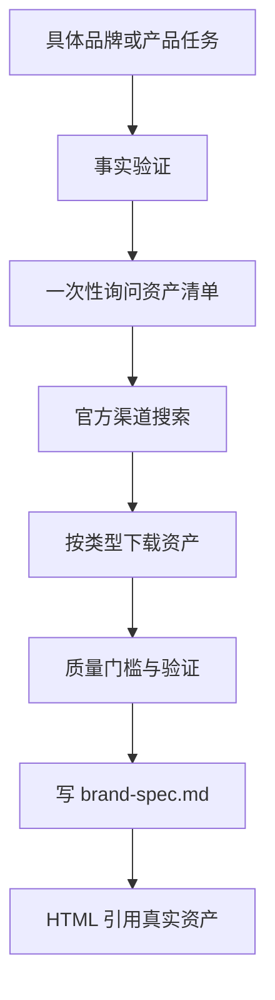

<details>
<summary>相关源文件</summary>

生成本页时使用的主要源文件：

- [SKILL.md](../../../project-repos/huashu-design/SKILL.md)
- [references/design-context.md](../../../project-repos/huashu-design/references/design-context.md)
- [assets/personal-asset-index.example.json](../../../project-repos/huashu-design/assets/personal-asset-index.example.json)
- [README.md](../../../project-repos/huashu-design/README.md)
- [LICENSE](../../../project-repos/huashu-design/LICENSE)

</details>

# Design Context 与核心资产协议

Huashu Design 的关键思想是：高保真设计不从空白开始，而从已有 design context、真实品牌资产和真实产品素材中长出来。`references/design-context.md` 把上下文优先级排序为用户自己的 design system/UI kit、codebase、已发布产品、品牌指南/Logo/素材、竞品参考和已知 design system fallback。Sources: [references/design-context.md:1-48](../../../project-repos/huashu-design/references/design-context.md#L1-L48)

<details class="source-snippets">
<summary>引用源码</summary>

<!-- source-snippets:start -->

#### `references/design-context.md:1-48`

````markdown
# Design Context：从已有上下文出发

**这是这个skill最重要的one thing。**

好的hi-fi设计一定是从已有design context长出来的。**凭空做hi-fi是last resort，一定会产出generic的作品**。所以每次设计任务开始，先问：有没有可以参考的东西？

## 什么是Design Context

按优先级从高到低：

### 1. 用户的Design System/UI Kit
用户自己产品已有的组件库、色彩token、字型规范、icon系统。**最完美的情况**。

### 2. 用户的Codebase
如果用户给了代码库，里面就有活生生的组件实现。Read那些组件文件：
- `theme.ts` / `colors.ts` / `tokens.css` / `_variables.scss`
- 具体的组件（Button.tsx、Card.tsx）
- Layout scaffold（App.tsx、MainLayout.tsx）
- Global stylesheets

**读代码抄exact values**：hex codes、spacing scale、font stack、border radius。不要凭记忆重画。

### 3. 用户已发布的产品
如果用户有上线的产品但没给代码，用Playwright或让用户提供截图。

```bash
# 用Playwright截图一个公开URL
npx playwright screenshot https://example.com screenshot.png --viewport-size=1920,1080
```

让你看到真实的视觉vocabulary。

### 4. 品牌指南/Logo/已有素材
用户可能有：Logo文件、品牌色规范、营销物料、slide模板。这些都是context。

### 5. 竞品参考
用户说"像XX网站那样"——让他提供URL或截图。**不要**凭你训练数据里的模糊印象做。

### 6. 已知的design system（fallback）
如果以上都没有，用公认的设计系统作为base：
- Apple HIG
- Material Design 3
- Radix Colors（配色）
- shadcn/ui（组件）
- Tailwind默认palette

明确告诉用户你用的什么，让他知道这是起点不是定稿。

````

<!-- source-snippets:end -->
</details>

## 资产协议的执行边界

`SKILL.md` 将「核心资产协议」设置为涉及具体品牌时的强制流程：先问用户手头资产，再按 Logo、产品图/UI 截图、色值、字体等类型搜索官方渠道，随后下载、验证、提取并固化到 `brand-spec.md`。它明确强调资产优先级高于色值，Logo、实体产品图、数字产品 UI 截图是识别度根基。Sources: [SKILL.md:69-98](../../../project-repos/huashu-design/SKILL.md#L69-L98), [SKILL.md:100-130](../../../project-repos/huashu-design/SKILL.md#L100-L130), [SKILL.md:198-267](../../../project-repos/huashu-design/SKILL.md#L198-L267)

<details class="source-snippets">
<summary>引用源码</summary>

<!-- source-snippets:start -->

#### `SKILL.md:69-98`

```markdown
#### 1.a 核心资产协议（涉及具体品牌时强制执行）

> **这是 v1 最核心的约束，也是稳定性的生命线。** Agent 是否走通这个协议，直接决定输出质量是 40 分还是 90 分。不要跳过任何一步。
>
> **v1.1 重构（2026-04-20）**：从「品牌资产协议」升级为「核心资产协议」。之前的版本过度聚焦色值和字体，漏掉了设计中最基础的 logo / 产品图 / UI 截图。花叔的原话：「除了所谓的品牌色，显然我们应该找到并且用上大疆的 logo，用上 pocket4 的产品图。如果是网站或者 app 等非实体产品的话，logo 至少该是必须的。这可能是比所谓的品牌设计的 spec 更重要的基本逻辑。否则，我们在表达什么呢？」

**触发条件**：任务涉及具体品牌——用户提了产品名/公司名/明确客户（Stripe、Linear、Anthropic、Notion、Lovart、DJI、自家公司等），不论用户是否主动提供了品牌资料。

**前置硬条件**：走协议前必须已通过「#0 事实验证先于假设」确认品牌/产品存在且状态已知。如果你还不确定产品是否已发布/规格/版本，先回去搜。

##### 核心理念：资产 > 规范

**品牌的本质是「它被认出来」**。认出来靠什么？按识别度排序：

| 资产类型 | 识别度贡献 | 必需性 |
|---|---|---|
| **Logo** | 最高 · 任何品牌出现 logo 就一眼识别 | **任何品牌都必须有** |
| **产品图/产品渲染图** | 极高 · 实体产品的"主角"就是产品本身 | **实体产品（硬件/包装/消费品）必须有** |
| **UI 截图/界面素材** | 极高 · 数字产品的"主角"是它的界面 | **数字产品（App/网站/SaaS）必须有** |
| **色值** | 中 · 辅助识别，脱离前三项时经常撞衫 | 辅助 |
| **字体** | 低 · 需配合前述才能建立识别 | 辅助 |
| **气质关键词** | 低 · agent 自检用 | 辅助 |

**翻译成执行规则**：
- 只抽色值 + 字体、不找 logo / 产品图 / UI → **违反本协议**
- 用 CSS 剪影/SVG 手画替代真实产品图 → **违反本协议**（生成的就是「通用科技动画」，任何品牌都长一样）
- 找不到资产不告诉用户、也不 AI 生成，硬做 → **违反本协议**
- 宁可停下问用户要素材，也不要用 generic 填充

##### 5 步硬流程（每步有 fallback，绝不静默跳过）
```

#### `SKILL.md:100-130`

````markdown
##### Step 1 · 问（资产清单一次问全）

不要只问「有 brand guidelines 吗？」——太宽泛，用户不知道该给什么。按清单逐项问：

```
关于 &lt;brand/product&gt;，你手上有以下哪些资料？我按优先级列：
1. Logo（SVG / 高清 PNG）—— 任何品牌必备
2. 产品图 / 官方渲染图 —— 实体产品必备（如 DJI Pocket 4 的产品照）
3. UI 截图 / 界面素材 —— 数字产品必备（如 App 主要页面截图）
4. 色值清单（HEX / RGB / 品牌色盘）
5. 字体清单（Display / Body）
6. Brand guidelines PDF / Figma design system / 品牌官网链接

有的直接发我，没有的我去搜/抓/生成。
```

##### Step 2 · 搜官方渠道（按资产类型）

| 资产 | 搜索路径 |
|---|---|
| **Logo** | `<brand>.com/brand` · `<brand>.com/press` · `<brand>.com/press-kit` · `brand.<brand>.com` · 官网 header 的 inline SVG |
| **产品图/渲染图** | `<brand>.com/<product>` 产品详情页 hero image + gallery · 官方 YouTube launch film 截帧 · 官方新闻稿附图 |
| **UI 截图** | App Store / Google Play 产品页截图 · 官网 screenshots section · 产品官方演示视频截帧 |
| **色值** | 官网 inline CSS / Tailwind config / brand guidelines PDF |
| **字体** | 官网 `<link rel="stylesheet">` 引用 · Google Fonts 追踪 · brand guidelines |

`WebSearch` 兜底关键词：
- Logo 找不到 → `<brand> logo download SVG`、`<brand> press kit`
- 产品图找不到 → `<brand> <product> official renders`、`<brand> <product> product photography`
- UI 找不到 → `<brand> app screenshots`、`<brand> dashboard UI`

````

#### `SKILL.md:198-267`

````markdown
##### Step 4 · 验证 + 提取（不只是 grep 色值）

| 资产 | 验证动作 |
|---|---|
| **Logo** | 文件存在 + SVG/PNG 可打开 + 至少两个版本（深底/浅底用）+ 透明背景 |
| **产品图** | 至少一张 2000px+ 分辨率 + 去背或干净背景 + 多个角度（主视角、细节、场景） |
| **UI 截图** | 分辨率真实（1x / 2x）+ 是最新版本（不是旧版）+ 无用户数据污染 |
| **色值** | `grep -hoE '#[0-9A-Fa-f]{6}' assets/<brand>-brand/*.{svg,html,css} \| sort \| uniq -c \| sort -rn \| head -20`，过滤黑白灰 |

**警惕示范品牌污染**：产品截图里常有用户 demo 的品牌色（如某工具截图演示喜茶红），那不是该工具的色。**同时出现两种强色时必须区分**。

**品牌多切面**：同一品牌的官网营销色和产品 UI 色经常不同（Lovart 官网暖米+橙，产品 UI 是 Charcoal + Lime）。**两套都是真的**——根据交付场景选合适的切面。

##### Step 5 · 固化为 `brand-spec.md` 文件（模板必须覆盖所有资产）

```markdown
# &lt;Brand&gt; · Brand Spec
> 采集日期：YYYY-MM-DD
> 资产来源：&lt;列出下载来源&gt;
> 资产完整度：&lt;完整 / 部分 / 推断&gt;

## 🎯 核心资产（一等公民）

### Logo
- 主版本：`assets/<brand>-brand/logo.svg`
- 浅底反色版：`assets/<brand>-brand/logo-white.svg`
- 使用场景：&lt;片头/片尾/角落水印/全局&gt;
- 禁用变形：&lt;不能拉伸/改色/加描边&gt;

### 产品图（实体产品必填）
- 主视角：`assets/<brand>-brand/product-hero.png`（2000×1500）
- 细节图：`assets/<brand>-brand/product-detail-1.png` / `product-detail-2.png`
- 场景图：`assets/<brand>-brand/product-scene.png`
- 使用场景：&lt;特写/旋转/对比&gt;

### UI 截图（数字产品必填）
- 主页：`assets/<brand>-brand/ui-home.png`
- 核心功能：`assets/<brand>-brand/ui-feature-<name>.png`
- 使用场景：&lt;产品展示/Dashboard 渐现/对比演示&gt;

## 🎨 辅助资产

### 色板
- Primary: #XXXXXX  &lt;来源标注&gt;
- Background: #XXXXXX
- Ink: #XXXXXX
- Accent: #XXXXXX
- 禁用色: &lt;品牌明确不用的色系&gt;

### 字型
- Display: &lt;font stack&gt;
- Body: &lt;font stack&gt;
- Mono（数据 HUD 用）: &lt;font stack&gt;

### 签名细节
- &lt;哪些细节是「120% 做到」的&gt;

### 禁区
- &lt;明确不能做的：比如 Lovart 不用蓝色、Stripe 不用低饱和暖色&gt;

### 气质关键词
- &lt;3-5 个形容词&gt;
```

**写完 spec 后的执行纪律（硬要求）**：
- 所有 HTML 必须**引用** `brand-spec.md` 里的资产文件路径，不允许用 CSS 剪影/SVG 手画代替
- Logo 作为 `` 引用真实文件，不重画
- 产品图作为 `` 引用真实文件，不用 CSS 剪影代替
- CSS 变量从 spec 注入：`:root { --brand-primary: ...; }`，HTML 只用 `var(--brand-*)`
- 这让品牌一致性从「靠自觉」变成「靠结构」——想临时加色要先改 spec
````

<!-- source-snippets:end -->
</details>



Sources: [SKILL.md:75-78](../../../project-repos/huashu-design/SKILL.md#L75-L78), [SKILL.md:100-160](../../../project-repos/huashu-design/SKILL.md#L100-L160), [SKILL.md:170-196](../../../project-repos/huashu-design/SKILL.md#L170-L196), [SKILL.md:211-267](../../../project-repos/huashu-design/SKILL.md#L211-L267)

<details class="source-snippets">
<summary>引用源码</summary>

<!-- source-snippets:start -->

#### `SKILL.md:75-78`

```markdown
**触发条件**：任务涉及具体品牌——用户提了产品名/公司名/明确客户（Stripe、Linear、Anthropic、Notion、Lovart、DJI、自家公司等），不论用户是否主动提供了品牌资料。

**前置硬条件**：走协议前必须已通过「#0 事实验证先于假设」确认品牌/产品存在且状态已知。如果你还不确定产品是否已发布/规格/版本，先回去搜。

```

#### `SKILL.md:100-160`

````markdown
##### Step 1 · 问（资产清单一次问全）

不要只问「有 brand guidelines 吗？」——太宽泛，用户不知道该给什么。按清单逐项问：

```
关于 &lt;brand/product&gt;，你手上有以下哪些资料？我按优先级列：
1. Logo（SVG / 高清 PNG）—— 任何品牌必备
2. 产品图 / 官方渲染图 —— 实体产品必备（如 DJI Pocket 4 的产品照）
3. UI 截图 / 界面素材 —— 数字产品必备（如 App 主要页面截图）
4. 色值清单（HEX / RGB / 品牌色盘）
5. 字体清单（Display / Body）
6. Brand guidelines PDF / Figma design system / 品牌官网链接

有的直接发我，没有的我去搜/抓/生成。
```

##### Step 2 · 搜官方渠道（按资产类型）

| 资产 | 搜索路径 |
|---|---|
| **Logo** | `<brand>.com/brand` · `<brand>.com/press` · `<brand>.com/press-kit` · `brand.<brand>.com` · 官网 header 的 inline SVG |
| **产品图/渲染图** | `<brand>.com/<product>` 产品详情页 hero image + gallery · 官方 YouTube launch film 截帧 · 官方新闻稿附图 |
| **UI 截图** | App Store / Google Play 产品页截图 · 官网 screenshots section · 产品官方演示视频截帧 |
| **色值** | 官网 inline CSS / Tailwind config / brand guidelines PDF |
| **字体** | 官网 `<link rel="stylesheet">` 引用 · Google Fonts 追踪 · brand guidelines |

`WebSearch` 兜底关键词：
- Logo 找不到 → `<brand> logo download SVG`、`<brand> press kit`
- 产品图找不到 → `<brand> <product> official renders`、`<brand> <product> product photography`
- UI 找不到 → `<brand> app screenshots`、`<brand> dashboard UI`

##### Step 3 · 下载资产 · 按类型三条兜底路径

**3.1 Logo（任何品牌必需）**

三条路径按成功率递减：
1. 独立 SVG/PNG 文件（最理想）：
   ```bash
   curl -o assets/&lt;brand&gt;-brand/logo.svg https://&lt;brand&gt;.com/logo.svg
   curl -o assets/&lt;brand&gt;-brand/logo-white.svg https://&lt;brand&gt;.com/logo-white.svg
   ```
2. 官网 HTML 全文提取 inline SVG（80% 场景必用）：
   ```bash
   curl -A "Mozilla/5.0" -L https://&lt;brand&gt;.com -o assets/&lt;brand&gt;-brand/homepage.html
   # 然后 grep &lt;svg&gt;...&lt;/svg&gt; 提取 logo 节点
   ```
3. 官方社交媒体 avatar（最后手段）：GitHub/Twitter/LinkedIn 的公司头像通常是 400×400 或 800×800 透明底 PNG

**3.2 产品图/渲染图（实体产品必需）**

按优先级：
1. **官方产品页 hero image**（最高优先级）：右键查看图片地址 / curl 获取。分辨率通常 2000px+
2. **官方 press kit**：`<brand>.com/press` 常有高清产品图下载
3. **官方 launch video 截帧**：用 `yt-dlp` 下载 YouTube 视频，ffmpeg 抽几帧高清图
4. **Wikimedia Commons**：公共领域常有
5. **AI 生成兜底**（nano-banana-pro）：把真实产品图作为参考发给 AI，让它生成符合动画场景的变体。**不要用 CSS/SVG 手画代替**

```bash
# 示例：下载 DJI 官网产品 hero image
curl -A "Mozilla/5.0" -L "&lt;hero-image-url&gt;" -o assets/&lt;brand&gt;-brand/product-hero.png
```
````

#### `SKILL.md:170-196`

```markdown
**3.4 · 素材质量门槛「5-10-2-8」原则（铁律）**

> **Logo 的规则不同于其他素材**。Logo 有就必须用（没有就停下问用户）；其他素材（产品图/UI/参考图/配图）遵循「5-10-2-8」质量门槛。
>
> 2026-04-20 花叔原话：「我们的原则是搜索 5 轮，找到 10 个素材，选择 2 个好的。每个需要评分 8/10 以上，宁可少一些，也不为了完成任务滥竽充数。」

| 维度 | 标准 | 反模式 |
|---|---|---|
| **5 轮搜索** | 多渠道交叉搜（官网 / press kit / 官方社媒 / YouTube 截帧 / Wikimedia / 用户账号截屏），不是一轮抓前 2 个就停 | 第一页结果直接用 |
| **10 个候选** | 至少凑 10 个备选才开始筛 | 只抓 2 个，没得选 |
| **选 2 个好的** | 从 10 个里精选 2 个作为最终素材 | 全都用 = 视觉过载 + 品位稀释 |
| **每个 8/10 分以上** | 不够 8 分**宁可不用**，用诚实 placeholder（灰块+文字标签）或 AI 生成（nano-banana-pro 以官方参考为基底）| 凑数 7 分素材进 brand-spec.md |

**8/10 评分维度**（打分时记录在 `brand-spec.md`）：

1. **分辨率** · ≥2000px（印刷/大屏场景 ≥3000px）
2. **版权清晰度** · 官方来源 > 公共领域 > 免费素材 > 疑似盗图（疑似盗图直接 0 分）
3. **与品牌气质契合度** · 和 brand-spec.md 里的「气质关键词」一致
4. **光线/构图/风格一致性** · 2 个素材放一起不打架
5. **独立叙事能力** · 能单独表达一个叙事角色（不是装饰）

**为什么这个门槛是铁律**：
- 花叔的哲学：**宁缺毋滥**。滥竽充数的素材比没有更糟——污染视觉品味、传递「不专业」信号
- **「一个细节做到 120%，其他做到 80%」的量化版**：8 分是"其他 80%" 的底线，真正 hero 素材要 9-10 分
- 消费者看作品时，每一个视觉元素都在**积分或扣分**。7 分素材 = 扣分项，不如留空

**Logo 例外**（重申）：有就必须用，不适用「5-10-2-8」。因为 logo 不是「多选一」问题，而是「识别度根基」问题——就算 logo 本身只有 6 分，也比没有 logo 强 10 倍。
```

#### `SKILL.md:211-267`

````markdown
##### Step 5 · 固化为 `brand-spec.md` 文件（模板必须覆盖所有资产）

```markdown
# &lt;Brand&gt; · Brand Spec
> 采集日期：YYYY-MM-DD
> 资产来源：&lt;列出下载来源&gt;
> 资产完整度：&lt;完整 / 部分 / 推断&gt;

## 🎯 核心资产（一等公民）

### Logo
- 主版本：`assets/<brand>-brand/logo.svg`
- 浅底反色版：`assets/<brand>-brand/logo-white.svg`
- 使用场景：&lt;片头/片尾/角落水印/全局&gt;
- 禁用变形：&lt;不能拉伸/改色/加描边&gt;

### 产品图（实体产品必填）
- 主视角：`assets/<brand>-brand/product-hero.png`（2000×1500）
- 细节图：`assets/<brand>-brand/product-detail-1.png` / `product-detail-2.png`
- 场景图：`assets/<brand>-brand/product-scene.png`
- 使用场景：&lt;特写/旋转/对比&gt;

### UI 截图（数字产品必填）
- 主页：`assets/<brand>-brand/ui-home.png`
- 核心功能：`assets/<brand>-brand/ui-feature-<name>.png`
- 使用场景：&lt;产品展示/Dashboard 渐现/对比演示&gt;

## 🎨 辅助资产

### 色板
- Primary: #XXXXXX  &lt;来源标注&gt;
- Background: #XXXXXX
- Ink: #XXXXXX
- Accent: #XXXXXX
- 禁用色: &lt;品牌明确不用的色系&gt;

### 字型
- Display: &lt;font stack&gt;
- Body: &lt;font stack&gt;
- Mono（数据 HUD 用）: &lt;font stack&gt;

### 签名细节
- &lt;哪些细节是「120% 做到」的&gt;

### 禁区
- &lt;明确不能做的：比如 Lovart 不用蓝色、Stripe 不用低饱和暖色&gt;

### 气质关键词
- &lt;3-5 个形容词&gt;
```

**写完 spec 后的执行纪律（硬要求）**：
- 所有 HTML 必须**引用** `brand-spec.md` 里的资产文件路径，不允许用 CSS 剪影/SVG 手画代替
- Logo 作为 `` 引用真实文件，不重画
- 产品图作为 `` 引用真实文件，不用 CSS 剪影代替
- CSS 变量从 spec 注入：`:root { --brand-primary: ...; }`，HTML 只用 `var(--brand-*)`
- 这让品牌一致性从「靠自觉」变成「靠结构」——想临时加色要先改 spec
````

<!-- source-snippets:end -->
</details>

## 失败兜底

协议不鼓励静默编造：Logo 找不到要停下问用户，产品图缺失时优先基于官方参考走 AI 生成或向用户索取，UI 截图缺失则找官方演示或用户账号截图。用 CSS 剪影或通用渐变硬做被标为核心反模式。Sources: [SKILL.md:269-287](../../../project-repos/huashu-design/SKILL.md#L269-L287)

<details class="source-snippets">
<summary>引用源码</summary>

<!-- source-snippets:start -->

#### `SKILL.md:269-287`

```markdown
##### 全流程失败的兜底

按资产类型分别处理：

| 缺失 | 处理 |
|---|---|
| **Logo 完全找不到** | **停下问用户**，不要硬做（logo 是品牌识别度的根基） |
| **产品图（实体产品）找不到** | 优先 nano-banana-pro AI 生成（以官方参考图为基底）→ 次选向用户索取 → 最后才是诚实 placeholder（灰块+文字标签，明确标注"产品图待补"） |
| **UI 截图（数字产品）找不到** | 向用户索取自己账号的截屏 → 官方演示视频截帧。不用 mockup 生成器凑 |
| **色值完全找不到** | 按「设计方向顾问模式」走，向用户推荐 3 个方向并标注 assumption |

**禁止**：找不到资产就静默用 CSS 剪影/通用渐变硬做——这是协议最大的反 pattern。**宁可停下问，也不要凑**。

##### 反例（真实踩过的坑）

- **Kimi 动画**：凭记忆猜「应该是橙色」，实际 Kimi 是 `#1783FF` 蓝色——返工一遍
- **Lovart 设计**：把产品截图里演示品牌的喜茶红当成 Lovart 自己的色——差点毁整个设计
- **DJI Pocket 4 发布动画（2026-04-20，触发本协议升级的真实案例）**：走了旧版只抽色值的协议，没下载 DJI logo、没找 Pocket 4 产品图，用 CSS 剪影代替产品——做出来是「通用黑底+橙 accent 的科技动画」，没有大疆识别度。花叔原话：「否则，我们在表达什么呢？」→ 协议升级。
- 抽完色没写进 brand-spec.md，第三页就忘了主色数值，临场加了个「接近但不是」的 hex——品牌一致性崩溃
```

<!-- source-snippets:end -->
</details>

## 私有素材索引

仓库提供 `assets/personal-asset-index.example.json` 作为用户私有素材索引模板，说明真实数据应复制到私有 memory 路径，而不是放进 skill 目录分发。`.gitignore` 也忽略了 `assets/personal-asset-index.json`，避免用户真实身份、产品和素材路径泄露。Sources: [assets/personal-asset-index.example.json:1-71](../../../project-repos/huashu-design/assets/personal-asset-index.example.json#L1-L71), [gitignore:9-10](../../../project-repos/huashu-design/gitignore#L9-L10)

<details class="source-snippets">
<summary>引用源码</summary>

<!-- source-snippets:start -->

#### `assets/personal-asset-index.example.json:1-71`

```json
{
  "_meta": {
    "description": "个人素材索引模板 — 复制此文件并填入你的真实数据",
    "how_to_use": "1. 复制此文件到 ~/.claude/memory/personal-asset-index.json  2. 填入你的真实信息  3. design-philosophy skill 会自动读取",
    "note": "真实数据文件不要放在 skill 目录内，避免随 skill 分发泄露隐私"
  },

  "identity": {
    "real_name": "你的真名",
    "pen_names": ["笔名1", "笔名2"],
    "english_name": "English Name",
    "title": "你的头衔/一句话介绍",
    "bio_short": "50-100字简介",
    "bio_long": "200-300字详细介绍",
    "avatar_url": "头像URL",
    "source": "数据来源备注"
  },

  "contact": {
    "email": "your@email.com",
    "wechat_personal": "微信号",
    "source": "数据来源备注"
  },

  "social_media": {
    "github": {
      "url": "https://github.com/yourname",
      "username": "yourname"
    },
    "youtube": {
      "url": "https://www.youtube.com/@YourChannel",
      "channel_name": "频道名"
    },
    "source": "数据来源备注"
  },

  "websites": {
    "main_site": {
      "url": "https://yoursite.com",
      "description": "网站描述",
      "local_path": "/path/to/local/project/"
    }
  },

  "products": {
    "product_1": {
      "name": "产品名",
      "type": "iOS App / Web App / CLI Tool / 电子书",
      "achievement": "主要成就",
      "icon_path": "/path/to/icon.png",
      "project_path": "/path/to/project/"
    }
  },

  "stats": {
    "social_followers": "粉丝数",
    "product_users": "用户数",
    "source": "数据来源备注"
  },

  "design_assets": {
    "article_images": {
      "base_path": "/path/to/images/",
      "notable_sets": []
    }
  },

  "knowledge_base": {
    "wechat_articles": "/path/to/knowledge_base/"
  }
}
```

#### `gitignore:9-10`

> 未找到引用文件：`gitignore`

<!-- source-snippets:end -->
</details>

## 相关页面

- [Skill 编排与主提示词](skill-orchestration.md)
- [设计方向顾问与风格库](fallback-design-styles.md)
- [原型、Tweaks 与验证闭环](prototypes-tweaks-verification.md)
