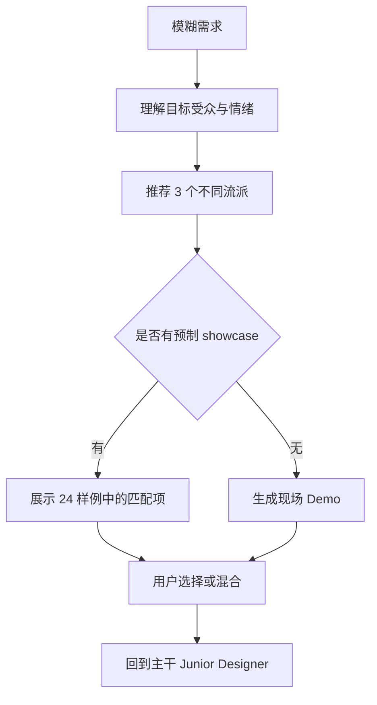

<details>
<summary>相关源文件</summary>

生成本页时使用的主要源文件：

- [SKILL.md](../../../project-repos/huashu-design/SKILL.md)
- [references/design-styles.md](../../../project-repos/huashu-design/references/design-styles.md)
- [assets/showcases/INDEX.md](../../../project-repos/huashu-design/assets/showcases/INDEX.md)
- [references/scene-templates.md](../../../project-repos/huashu-design/references/scene-templates.md)
- [README.md](../../../project-repos/huashu-design/README.md)

</details>

# 设计方向顾问与风格库

当需求模糊、没有 design context 或用户主动要求推荐风格时，Huashu Design 进入设计方向顾问模式，而不是凭通用直觉直接做。完整流程要求先理解需求、顾问式重述，再从 5 个流派、20 种设计哲学中推荐 3 个来自不同流派的方向。Sources: [SKILL.md:371-413](../../../project-repos/huashu-design/SKILL.md#L371-L413), [references/design-styles.md:1-35](../../../project-repos/huashu-design/references/design-styles.md#L1-L35)

<details class="source-snippets">
<summary>引用源码</summary>

<!-- source-snippets:start -->

#### `SKILL.md:371-413`

```markdown
## 设计方向顾问（Fallback 模式）

**什么时候触发**：
- 用户需求模糊（"做个好看的"、"帮我设计"、"这个怎么样"、"做个XX"没有具体参考）
- 用户明确要"推荐风格"、"给几个方向"、"选个哲学"、"想看不同风格"
- 项目和品牌没有任何 design context（既没有 design system，又找不到参考）
- 用户主动说"我也不知道要什么风格"

**什么时候 skip**：
- 用户已经给了明确的风格参考（Figma / 截图 / 品牌规范）→ 直接走「核心哲学 #1」主干流程
- 用户已经说清楚要什么（"做个 Apple Silicon 风格的发布会动画"）→ 直接进 Junior Designer 流程
- 小修小补、明确的工具调用（"帮我把这段 HTML 变成 PDF"）→ skip

不确定就用最轻量版：**列出 3 个差异化方向让用户二选一，不展开不生成**——尊重用户节奏。

### 完整流程（8 个 Phase，顺序执行）

**Phase 1 · 深度理解需求**
提问（一次最多 3 个）：目标受众 / 核心信息 / 情感基调 / 输出格式。需求已清晰则跳过。

**Phase 2 · 顾问式重述**（100-200 字）
用自己的话重述本质需求、受众、场景、情感基调。以「基于这个理解，我为你准备了 3 个设计方向」结尾。

**Phase 3 · 推荐 3 套设计哲学**（必须差异化）

每个方向必须：
- **含设计师/机构名**（如「Kenya Hara 式东方极简」，不是只说「极简主义」）
- 50-100 字解释「为什么这个设计师适合你」
- 3-4 条标志性视觉特征 + 3-5 个气质关键词 + 可选代表作

**差异化规则**（必守）：3 个方向**必须来自 3 个不同流派**，形成明显视觉反差：

| 流派 | 视觉气质 | 适合作为 |
|------|---------|---------|
| 信息建筑派（01-04） | 理性、数据驱动、克制 | 安全/专业选择 |
| 运动诗学派（05-08） | 动感、沉浸、技术美学 | 大胆/前卫选择 |
| 极简主义派（09-12） | 秩序、留白、精致 | 安全/高端选择 |
| 实验先锋派（13-16） | 先锋、生成艺术、视觉冲击 | 大胆/创新选择 |
| 东方哲学派（17-20） | 温润、诗意、思辨 | 差异化/独特选择 |

❌ **禁止从同一流派推荐 2 个以上** — 差异化不够用户看不出区别。

详细 20 种风格库 + AI 提示词模板 → `references/design-styles.md`。
```

#### `references/design-styles.md:1-35`

```markdown
# 设计哲学风格库：20种体系

> 用于视觉设计（网页/PPT/PDF/信息图/配图/App等）的设计风格库。
> 每种风格提供：哲学内核 + 核心特征 + 提示词DNA（与场景模板组合使用）。

## 风格×场景×执行路径 速查表

| 风格 | 网页 | PPT | PDF | 信息图 | 封面 | AI生成 | 最佳路径 |
|------|:---:|:---:|:---:|:-----:|:---:|:-----:|---------|
| 01 Pentagram | ★★★ | ★★★ | ★★☆ | ★★☆ | ★★★ | ★☆☆ | HTML |
| 02 Stamen Design | ★★☆ | ★★☆ | ★★☆ | ★★★ | ★★☆ | ★★☆ | 混合 |
| 03 Information Architects | ★★★ | ★☆☆ | ★★★ | ★☆☆ | ★☆☆ | ★☆☆ | HTML |
| 04 Fathom | ★★☆ | ★★★ | ★★★ | ★★★ | ★★☆ | ★☆☆ | HTML |
| 05 Locomotive | ★★★ | ★★☆ | ★☆☆ | ★☆☆ | ★★☆ | ★★☆ | 混合 |
| 06 Active Theory | ★★★ | ★☆☆ | ★☆☆ | ★☆☆ | ★★☆ | ★★★ | AI生成 |
| 07 Field.io | ★★☆ | ★★☆ | ★☆☆ | ★★☆ | ★★★ | ★★★ | AI生成 |
| 08 Resn | ★★★ | ★☆☆ | ★☆☆ | ★☆☆ | ★★☆ | ★★☆ | AI生成 |
| 09 Experimental Jetset | ★★☆ | ★★☆ | ★★☆ | ★★☆ | ★★★ | ★★☆ | 混合 |
| 10 Müller-Brockmann | ★★☆ | ★★★ | ★★★ | ★★★ | ★★☆ | ★☆☆ | HTML |
| 11 Build | ★★★ | ★★★ | ★★☆ | ★☆☆ | ★★★ | ★☆☆ | HTML |
| 12 Sagmeister & Walsh | ★★☆ | ★★★ | ★☆☆ | ★★☆ | ★★★ | ★★★ | AI生成 |
| 13 Zach Lieberman | ★☆☆ | ★☆☆ | ★☆☆ | ★★☆ | ★★★ | ★★★ | AI生成 |
| 14 Raven Kwok | ★☆☆ | ★★☆ | ★☆☆ | ★★☆ | ★★★ | ★★★ | AI生成 |
| 15 Ash Thorp | ★★☆ | ★★☆ | ★☆☆ | ★☆☆ | ★★★ | ★★★ | AI生成 |
| 16 Territory Studio | ★★☆ | ★★☆ | ★☆☆ | ★★☆ | ★★★ | ★★★ | AI生成 |
| 17 Takram | ★★★ | ★★★ | ★★★ | ★★☆ | ★★☆ | ★☆☆ | HTML |
| 18 Kenya Hara | ★★☆ | ★★★ | ★★★ | ★☆☆ | ★★★ | ★☆☆ | HTML |
| 19 Irma Boom | ★☆☆ | ★★☆ | ★★★ | ★★☆ | ★★★ | ★★☆ | 混合 |
| 20 Neo Shen | ★★☆ | ★★☆ | ★★☆ | ★★☆ | ★★★ | ★★★ | AI生成 |

> 场景适配：★★★ = 强烈推荐 / ★★☆ = 适合 / ★☆☆ = 需改造
> AI生成：★★★ = 直出效果好 / ★★☆ = 需调整 / ★☆☆ = 建议HTML执行
> 最佳路径：AI生成（图片直出）/ HTML（代码渲染，数据精确）/ 混合（HTML布局+AI配图）

**核心规律**：有明确视觉元素的风格（插画/粒子/生成艺术）AI直出效果好；依赖精确排版和数据的风格（网格/信息架构/留白）HTML渲染更可控。
```

<!-- source-snippets:end -->
</details>

## 风格库模型

`references/design-styles.md` 将风格分为信息建筑派、运动诗学派、极简主义派、实验先锋派、东方哲学派等体系，并为每种风格提供适配场景、最佳执行路径和 prompt DNA。例如 Pentagram 偏 HTML 与信息建筑，Field.io 和 Active Theory 更偏 AI 生成或混合路径。Sources: [references/design-styles.md:6-35](../../../project-repos/huashu-design/references/design-styles.md#L6-L35), [references/design-styles.md:39-63](../../../project-repos/huashu-design/references/design-styles.md#L39-L63), [references/design-styles.md:138-210](../../../project-repos/huashu-design/references/design-styles.md#L138-L210)

<details class="source-snippets">
<summary>引用源码</summary>

<!-- source-snippets:start -->

#### `references/design-styles.md:6-35`

```markdown
## 风格×场景×执行路径 速查表

| 风格 | 网页 | PPT | PDF | 信息图 | 封面 | AI生成 | 最佳路径 |
|------|:---:|:---:|:---:|:-----:|:---:|:-----:|---------|
| 01 Pentagram | ★★★ | ★★★ | ★★☆ | ★★☆ | ★★★ | ★☆☆ | HTML |
| 02 Stamen Design | ★★☆ | ★★☆ | ★★☆ | ★★★ | ★★☆ | ★★☆ | 混合 |
| 03 Information Architects | ★★★ | ★☆☆ | ★★★ | ★☆☆ | ★☆☆ | ★☆☆ | HTML |
| 04 Fathom | ★★☆ | ★★★ | ★★★ | ★★★ | ★★☆ | ★☆☆ | HTML |
| 05 Locomotive | ★★★ | ★★☆ | ★☆☆ | ★☆☆ | ★★☆ | ★★☆ | 混合 |
| 06 Active Theory | ★★★ | ★☆☆ | ★☆☆ | ★☆☆ | ★★☆ | ★★★ | AI生成 |
| 07 Field.io | ★★☆ | ★★☆ | ★☆☆ | ★★☆ | ★★★ | ★★★ | AI生成 |
| 08 Resn | ★★★ | ★☆☆ | ★☆☆ | ★☆☆ | ★★☆ | ★★☆ | AI生成 |
| 09 Experimental Jetset | ★★☆ | ★★☆ | ★★☆ | ★★☆ | ★★★ | ★★☆ | 混合 |
| 10 Müller-Brockmann | ★★☆ | ★★★ | ★★★ | ★★★ | ★★☆ | ★☆☆ | HTML |
| 11 Build | ★★★ | ★★★ | ★★☆ | ★☆☆ | ★★★ | ★☆☆ | HTML |
| 12 Sagmeister & Walsh | ★★☆ | ★★★ | ★☆☆ | ★★☆ | ★★★ | ★★★ | AI生成 |
| 13 Zach Lieberman | ★☆☆ | ★☆☆ | ★☆☆ | ★★☆ | ★★★ | ★★★ | AI生成 |
| 14 Raven Kwok | ★☆☆ | ★★☆ | ★☆☆ | ★★☆ | ★★★ | ★★★ | AI生成 |
| 15 Ash Thorp | ★★☆ | ★★☆ | ★☆☆ | ★☆☆ | ★★★ | ★★★ | AI生成 |
| 16 Territory Studio | ★★☆ | ★★☆ | ★☆☆ | ★★☆ | ★★★ | ★★★ | AI生成 |
| 17 Takram | ★★★ | ★★★ | ★★★ | ★★☆ | ★★☆ | ★☆☆ | HTML |
| 18 Kenya Hara | ★★☆ | ★★★ | ★★★ | ★☆☆ | ★★★ | ★☆☆ | HTML |
| 19 Irma Boom | ★☆☆ | ★★☆ | ★★★ | ★★☆ | ★★★ | ★★☆ | 混合 |
| 20 Neo Shen | ★★☆ | ★★☆ | ★★☆ | ★★☆ | ★★★ | ★★★ | AI生成 |

> 场景适配：★★★ = 强烈推荐 / ★★☆ = 适合 / ★☆☆ = 需改造
> AI生成：★★★ = 直出效果好 / ★★☆ = 需调整 / ★☆☆ = 建议HTML执行
> 最佳路径：AI生成（图片直出）/ HTML（代码渲染，数据精确）/ 混合（HTML布局+AI配图）

**核心规律**：有明确视觉元素的风格（插画/粒子/生成艺术）AI直出效果好；依赖精确排版和数据的风格（网格/信息架构/留白）HTML渲染更可控。
```

#### `references/design-styles.md:39-63`

````markdown
## 一、信息建筑派（01-04）
> 哲学：「数据不是装饰，是建筑材料」

### 01. Pentagram - Michael Bierut风格
**哲学**：字体即语言，网格即思想
**核心特征**：
- 极度克制的颜色（黑白+1个品牌色）
- 瑞士网格系统的现代演绎
- 字体排印作为主要视觉语言
- 负空间的战略性使用（60%+留白）

**提示词DNA**：
```
Pentagram/Michael Bierut style:
- Extreme typographic hierarchy, Helvetica/Univers family
- Swiss grid with precise mathematical spacing
- Black/white + one accent color (#HEX)
- Information architecture as visual structure
- 60%+ whitespace ratio
- Data visualization as primary decoration
```

**代表作**：Hillary Clinton 2016 campaign identity
**搜索关键词**：pentagram hillary logo system

````

#### `references/design-styles.md:138-210`

````markdown
## 二、运动诗学派（05-08）
> 哲学：「技术本身就是一种流动的诗」

### 05. Locomotive - 滚动叙事大师
**哲学**：滚动不是浏览，是旅程
**核心特征**：
- 丝滑的视差滚动
- 电影化的分镜叙事
- 大胆的空间留白
- 动态元素的精确编排

**提示词DNA**：
```
Locomotive scroll narrative style:
- Film-like scene composition with parallax depth
- Generous vertical spacing between sections
- Bold typography emerging from darkness
- Smooth motion blur effects
- Dark mode (near-black backgrounds)
- Strategic glowing accents
- Hero sections 100vh tall
```

**代表作**：Lusion.co website
**搜索关键词**：locomotive scroll lusion

---

### 06. Active Theory - WebGL诗人
**哲学**：让技术可见化即让技术可理解
**核心特征**：
- 3D粒子系统作为核心元素
- 实时渲染的数据可视化
- 鼠标交互驱动的世界构建
- 霓虹与深空的配色

**提示词DNA**：
```
Active Theory WebGL aesthetic:
- Particle systems representing data flow
- 3D visualization in depth space
- Neon gradients (cyan/magenta/electric blue) on dark
- Mouse-reactive environment
- Depth of field and bokeh effects
- Floating UI with glassmorphism
```

**代表作**：NASA Prospect
**搜索关键词**：active theory nasa webgl

---

### 07. Field.io - 算法美学
**哲学**：代码即设计师
**核心特征**：
- 生成艺术系统
- 每次访问都不同的动态图形
- 抽象几何的智能编排
- 技术感与艺术性的平衡

**提示词DNA**：
```
Field.io generative design style:
- Abstract geometric patterns, algorithmically generated
- Dynamic composition that feels computational
- Monochromatic base with vibrant accent
- Mathematical precision in spacing
- Voronoi diagrams or Delaunay triangulation
- Clean code aesthetic
```

**代表作**：British Council digital installations
**搜索关键词**：field.io generative design
````

<!-- source-snippets:end -->
</details>



Sources: [SKILL.md:386-456](../../../project-repos/huashu-design/SKILL.md#L386-L456), [assets/showcases/INDEX.md:1-12](../../../project-repos/huashu-design/assets/showcases/INDEX.md#L1-L12), [assets/showcases/INDEX.md:36-53](../../../project-repos/huashu-design/assets/showcases/INDEX.md#L36-L53)

<details class="source-snippets">
<summary>引用源码</summary>

<!-- source-snippets:start -->

#### `SKILL.md:386-456`

```markdown
### 完整流程（8 个 Phase，顺序执行）

**Phase 1 · 深度理解需求**
提问（一次最多 3 个）：目标受众 / 核心信息 / 情感基调 / 输出格式。需求已清晰则跳过。

**Phase 2 · 顾问式重述**（100-200 字）
用自己的话重述本质需求、受众、场景、情感基调。以「基于这个理解，我为你准备了 3 个设计方向」结尾。

**Phase 3 · 推荐 3 套设计哲学**（必须差异化）

每个方向必须：
- **含设计师/机构名**（如「Kenya Hara 式东方极简」，不是只说「极简主义」）
- 50-100 字解释「为什么这个设计师适合你」
- 3-4 条标志性视觉特征 + 3-5 个气质关键词 + 可选代表作

**差异化规则**（必守）：3 个方向**必须来自 3 个不同流派**，形成明显视觉反差：

| 流派 | 视觉气质 | 适合作为 |
|------|---------|---------|
| 信息建筑派（01-04） | 理性、数据驱动、克制 | 安全/专业选择 |
| 运动诗学派（05-08） | 动感、沉浸、技术美学 | 大胆/前卫选择 |
| 极简主义派（09-12） | 秩序、留白、精致 | 安全/高端选择 |
| 实验先锋派（13-16） | 先锋、生成艺术、视觉冲击 | 大胆/创新选择 |
| 东方哲学派（17-20） | 温润、诗意、思辨 | 差异化/独特选择 |

❌ **禁止从同一流派推荐 2 个以上** — 差异化不够用户看不出区别。

详细 20 种风格库 + AI 提示词模板 → `references/design-styles.md`。

**Phase 4 · 展示预制 Showcase 画廊**

推荐 3 方向后，**立即检查** `assets/showcases/INDEX.md` 是否有匹配的预制样例（8 场景 × 3 风格 = 24 个样例）：

| 场景 | 目录 |
|------|------|
| 公众号封面 | `assets/showcases/cover/` |
| PPT 数据页 | `assets/showcases/ppt/` |
| 竖版信息图 | `assets/showcases/infographic/` |
| 个人主页 / AI 导航 / AI 写作 / SaaS / 开发文档 | `assets/showcases/website-*/` |

匹配话术：「在启动实时 Demo 之前，先看看这 3 个风格在类似场景的效果 →」然后 Read 对应 .png。

场景模板按输出类型组织 → `references/scene-templates.md`。

**Phase 5 · 生成 3 个视觉 Demo**

> 核心理念：**看到比说到更有效。** 别让用户凭文字想象，直接看。

为 3 个方向各生成一个 Demo——**如果当前 agent 支持 subagent 并行**，启动 3 个并行子任务（后台执行）；**不支持就串行生成**（先后做 3 次，同样能用）。两种路径都能工作：
- 使用**用户真实内容/主题**（不是 Lorem ipsum）
- HTML 存 `_temp/design-demos/demo-[风格].html`
- 截图：`npx playwright screenshot file:///path.html out.png --viewport-size=1200,900`
- 全部完成后一起展示 3 张截图

风格类型路径：
| 风格最佳路径 | Demo 生成方式 |
|-------------|--------------|
| HTML 型 | 生成完整 HTML → 截图 |
| AI 生成型 | `nano-banana-pro` 用风格 DNA + 内容描述 |
| 混合型 | HTML 布局 + AI 插画 |

**Phase 6 · 用户选择**：选一个深化 / 混合（"A 的配色 + C 的布局"）/ 微调 / 重来 → 回 Phase 3 重新推荐。

**Phase 7 · 生成 AI 提示词**
结构：`[设计哲学约束] + [内容描述] + [技术参数]`
- ✅ 用具体特征而非风格名（写「Kenya Hara 的留白感+赤土橙 #C04A1A」，不写「极简」）
- ✅ 包含颜色 HEX、比例、空间分配、输出规格
- ❌ 避开审美禁区（见反 AI slop）

**Phase 8 · 选定方向后进入主干**
方向确认 → 回到「核心哲学」+「工作流程」的 Junior Designer pass。这时已经有明确的 design context，不再是凭空做。
```

#### `assets/showcases/INDEX.md:1-12`

```markdown
# Design Philosophy Showcases — 样例资产索引

> 8 种场景 × 3 种风格 = 24 个预制设计样例
> 用于 Phase 3 推荐设计方向时，直接展示「这个风格做出来长什么样」

## 风格说明

| 代号 | 流派 | 风格名称 | 视觉气质 |
|------|------|---------|---------|
| **Pentagram** | 信息建筑派 | Pentagram / Michael Bierut | 黑白克制、瑞士网格、强字体层级、#E63946红色强调 |
| **Build** | 极简主义派 | Build Studio | 奢侈品级留白(70%+)、微妙字重(200-600)、#D4A574暖金、精致 |
| **Takram** | 东方哲学派 | Takram | 柔和科技感、自然色(米色/灰/绿)、圆角、图表如艺术 |
```

#### `assets/showcases/INDEX.md:36-53`

````markdown
## 使用说明

### Phase 3 推荐时引用
推荐设计方向后，可展示对应场景的预制截图：
```
「这是 Pentagram 风格做公众号封面的效果 → [展示 cover/cover-pentagram.png]」
「Takram 风格做 PPT 数据页是这种感觉 → [展示 ppt/ppt-takram.png]」
```

### 场景匹配优先级
1. 用户需求的场景有精确匹配 → 直接展示对应场景
2. 无精确匹配但类型相近 → 展示最近似的场景（如「产品官网」→ 展示 SaaS 落地页）
3. 完全不匹配 → 跳过预制样例，直接进 Phase 3.5 现场生成

### 横向对比展示
同一场景的 3 个风格适合并排展示，帮助用户直观比较：
- 「这是同一个公众号封面，分别用 3 种风格实现的效果」
- 展示顺序：Pentagram（理性克制）→ Build（奢华极简）→ Takram（柔和温暖）
````

<!-- source-snippets:end -->
</details>

## Showcase 索引

`assets/showcases/INDEX.md` 提供 8 个场景乘以 3 种风格的预制样例，场景覆盖公众号封面、PPT 数据页、竖版信息图、个人主页、AI 导航站、AI 写作工具、SaaS 落地页和开发者文档；三种风格是 Pentagram、Build、Takram。Sources: [assets/showcases/INDEX.md:1-34](../../../project-repos/huashu-design/assets/showcases/INDEX.md#L1-L34), [assets/showcases/INDEX.md:55-103](../../../project-repos/huashu-design/assets/showcases/INDEX.md#L55-L103)

<details class="source-snippets">
<summary>引用源码</summary>

<!-- source-snippets:start -->

#### `assets/showcases/INDEX.md:1-34`

```markdown
# Design Philosophy Showcases — 样例资产索引

> 8 种场景 × 3 种风格 = 24 个预制设计样例
> 用于 Phase 3 推荐设计方向时，直接展示「这个风格做出来长什么样」

## 风格说明

| 代号 | 流派 | 风格名称 | 视觉气质 |
|------|------|---------|---------|
| **Pentagram** | 信息建筑派 | Pentagram / Michael Bierut | 黑白克制、瑞士网格、强字体层级、#E63946红色强调 |
| **Build** | 极简主义派 | Build Studio | 奢侈品级留白(70%+)、微妙字重(200-600)、#D4A574暖金、精致 |
| **Takram** | 东方哲学派 | Takram | 柔和科技感、自然色(米色/灰/绿)、圆角、图表如艺术 |

## 场景速查表

### 内容设计场景

| # | 场景 | 规格 | Pentagram | Build | Takram |
|---|------|------|-----------|-------|--------|
| 1 | 公众号封面 | 1200×510 | `cover/cover-pentagram` | `cover/cover-build` | `cover/cover-takram` |
| 2 | PPT数据页 | 1920×1080 | `ppt/ppt-pentagram` | `ppt/ppt-build` | `ppt/ppt-takram` |
| 3 | 竖版信息图 | 1080×1920 | `infographic/infographic-pentagram` | `infographic/infographic-build` | `infographic/infographic-takram` |

### 网站设计场景

| # | 场景 | 规格 | Pentagram | Build | Takram |
|---|------|------|-----------|-------|--------|
| 4 | 个人主页 | 1440×900 | `website-homepage/homepage-pentagram` | `website-homepage/homepage-build` | `website-homepage/homepage-takram` |
| 5 | AI导航站 | 1440×900 | `website-ai-nav/ainav-pentagram` | `website-ai-nav/ainav-build` | `website-ai-nav/ainav-takram` |
| 6 | AI写作工具 | 1440×900 | `website-ai-writing/aiwriting-pentagram` | `website-ai-writing/aiwriting-build` | `website-ai-writing/aiwriting-takram` |
| 7 | SaaS落地页 | 1440×900 | `website-saas/saas-pentagram` | `website-saas/saas-build` | `website-saas/saas-takram` |
| 8 | 开发者文档 | 1440×900 | `website-devdocs/devdocs-pentagram` | `website-devdocs/devdocs-build` | `website-devdocs/devdocs-takram` |

> 每个条目同时有 `.html`（源码）和 `.png`（截图）两个文件
```

#### `assets/showcases/INDEX.md:55-103`

```markdown
## 内容详情

### 公众号封面（cover/）
- 内容：Claude Code Agent 工作流 — 8 个并行 Agent 架构
- Pentagram：巨大红色「8」+ 瑞士网格线 + 数据条
- Build：超细字重「Agent」悬浮于 70% 留白中 + 暖金细线
- Takram：8 节点放射状流程图作为艺术品 + 米色底

### PPT数据页（ppt/）
- 内容：GLM-4.7 开源模型 Coding 能力突破（AIME 95.7 / SWE-bench 73.8% / τ²-Bench 87.4）
- Pentagram：260px「95.7」锚点 + 红/灰/浅灰对比条形图
- Build：三组 120px 超细数字悬浮 + 暖金渐变对比条
- Takram：SVG 雷达图 + 三色叠加 + 圆角数据卡片

### 竖版信息图（infographic/）
- 内容：AI 记忆系统 CLAUDE.md 从 93KB 优化到 22KB
- Pentagram：巨大「93→22」数字 + 编号区块 + CSS 数据条
- Build：极致留白 + 柔影卡片 + 暖金连接线
- Takram：SVG 环形图 + 有机曲线流程图 + 毛玻璃卡片

### 个人主页（website-homepage/）
- 内容：独立开发者 Alex Chen 的作品集首页
- Pentagram：112px 大名 + 瑞士网格分栏 + 编辑数字
- Build：玻璃态导航 + 悬浮统计卡片 + 超细字重
- Takram：纸质纹理 + 小圆形头像 + 发丝细分隔线 + 不对称布局

### AI导航站（website-ai-nav/）
- 内容：AI Compass — 500+ AI 工具目录
- Pentagram：方角搜索框 + 编号工具列表 + 大写分类标签
- Build：圆角搜索框 + 精致白色工具卡片 + 药丸标签
- Takram：有机错位卡片布局 + 柔和分类标签 + 图表式连接

### AI写作工具（website-ai-writing/）
- 内容：Inkwell — AI 写作助手
- Pentagram：86px 大标题 + 线框编辑器模型 + 网格特性列
- Build：漂浮编辑器卡片 + 暖金 CTA + 奢华写作体验
- Takram：诗意衬线标题 + 有机编辑器 + 流程图

### SaaS落地页（website-saas/）
- 内容：Meridian — 商业智能分析平台
- Pentagram：黑白分栏 + 结构化仪表盘 + 140px「3x」锚点
- Build：悬浮仪表盘卡片 + SVG 面积图 + 暖金渐变
- Takram：圆角柱状图 + 流程节点 + 柔和地球色

### 开发者文档（website-devdocs/）
- 内容：Nexus API — 统一 AI 模型网关
- Pentagram：左侧导航栏 + 方角代码块 + 红色字符串高亮
- Build：居中漂浮代码卡片 + 柔影 + 暖金图标
- Takram：米色代码块 + 流程图连接 + 虚线特性卡片
```

<!-- source-snippets:end -->
</details>

## 设计顾问的约束

三套方向必须显著差异化，不能从同一流派推荐两个以上；推荐后要展示可视样例或 Demo，让用户「看到」而非只读风格名。Sources: [SKILL.md:394-413](../../../project-repos/huashu-design/SKILL.md#L394-L413), [SKILL.md:430-456](../../../project-repos/huashu-design/SKILL.md#L430-L456)

<details class="source-snippets">
<summary>引用源码</summary>

<!-- source-snippets:start -->

#### `SKILL.md:394-413`

```markdown
**Phase 3 · 推荐 3 套设计哲学**（必须差异化）

每个方向必须：
- **含设计师/机构名**（如「Kenya Hara 式东方极简」，不是只说「极简主义」）
- 50-100 字解释「为什么这个设计师适合你」
- 3-4 条标志性视觉特征 + 3-5 个气质关键词 + 可选代表作

**差异化规则**（必守）：3 个方向**必须来自 3 个不同流派**，形成明显视觉反差：

| 流派 | 视觉气质 | 适合作为 |
|------|---------|---------|
| 信息建筑派（01-04） | 理性、数据驱动、克制 | 安全/专业选择 |
| 运动诗学派（05-08） | 动感、沉浸、技术美学 | 大胆/前卫选择 |
| 极简主义派（09-12） | 秩序、留白、精致 | 安全/高端选择 |
| 实验先锋派（13-16） | 先锋、生成艺术、视觉冲击 | 大胆/创新选择 |
| 东方哲学派（17-20） | 温润、诗意、思辨 | 差异化/独特选择 |

❌ **禁止从同一流派推荐 2 个以上** — 差异化不够用户看不出区别。

详细 20 种风格库 + AI 提示词模板 → `references/design-styles.md`。
```

#### `SKILL.md:430-456`

```markdown
**Phase 5 · 生成 3 个视觉 Demo**

> 核心理念：**看到比说到更有效。** 别让用户凭文字想象，直接看。

为 3 个方向各生成一个 Demo——**如果当前 agent 支持 subagent 并行**，启动 3 个并行子任务（后台执行）；**不支持就串行生成**（先后做 3 次，同样能用）。两种路径都能工作：
- 使用**用户真实内容/主题**（不是 Lorem ipsum）
- HTML 存 `_temp/design-demos/demo-[风格].html`
- 截图：`npx playwright screenshot file:///path.html out.png --viewport-size=1200,900`
- 全部完成后一起展示 3 张截图

风格类型路径：
| 风格最佳路径 | Demo 生成方式 |
|-------------|--------------|
| HTML 型 | 生成完整 HTML → 截图 |
| AI 生成型 | `nano-banana-pro` 用风格 DNA + 内容描述 |
| 混合型 | HTML 布局 + AI 插画 |

**Phase 6 · 用户选择**：选一个深化 / 混合（"A 的配色 + C 的布局"）/ 微调 / 重来 → 回 Phase 3 重新推荐。

**Phase 7 · 生成 AI 提示词**
结构：`[设计哲学约束] + [内容描述] + [技术参数]`
- ✅ 用具体特征而非风格名（写「Kenya Hara 的留白感+赤土橙 #C04A1A」，不写「极简」）
- ✅ 包含颜色 HEX、比例、空间分配、输出规格
- ❌ 避开审美禁区（见反 AI slop）

**Phase 8 · 选定方向后进入主干**
方向确认 → 回到「核心哲学」+「工作流程」的 Junior Designer pass。这时已经有明确的 design context，不再是凭空做。
```

<!-- source-snippets:end -->
</details>

## 相关页面

- [Design Context 与核心资产协议](design-context-assets.md)
- [Starter Components 架构](starter-components.md)
- [工作流、质量门与测试提示](workflow-quality.md)
