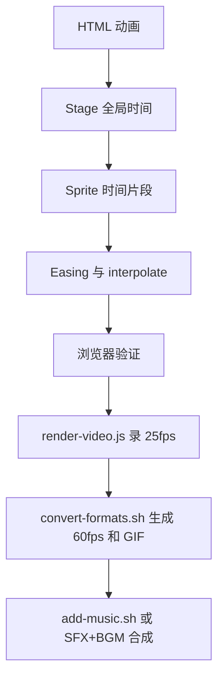

<details>
<summary>相关源文件</summary>

生成本页时使用的主要源文件：

- [assets/animations.jsx](../../../project-repos/huashu-design/assets/animations.jsx)
- [references/animation-pitfalls.md](../../../project-repos/huashu-design/references/animation-pitfalls.md)
- [references/animation-best-practices.md](../../../project-repos/huashu-design/references/animation-best-practices.md)
- [references/video-export.md](../../../project-repos/huashu-design/references/video-export.md)
- [references/audio-design-rules.md](../../../project-repos/huashu-design/references/audio-design-rules.md)
- [references/sfx-library.md](../../../project-repos/huashu-design/references/sfx-library.md)
- [scripts/render-video.js](../../../project-repos/huashu-design/scripts/render-video.js)
- [scripts/convert-formats.sh](../../../project-repos/huashu-design/scripts/convert-formats.sh)
- [scripts/add-music.sh](../../../project-repos/huashu-design/scripts/add-music.sh)

</details>

# Motion、视频导出与音频系统

动画体系由三层组成：`assets/animations.jsx` 的 Stage/Sprite 时间轴，`scripts/render-video.js` + `convert-formats.sh` 的视频/GIF 导出，`add-music.sh` 与音频 references 的 BGM/SFX 合成规则。Sources: [assets/animations.jsx:1-25](../../../project-repos/huashu-design/assets/animations.jsx#L1-L25), [references/video-export.md:28-46](../../../project-repos/huashu-design/references/video-export.md#L28-L46), [scripts/render-video.js:1-38](../../../project-repos/huashu-design/scripts/render-video.js#L1-L38), [scripts/convert-formats.sh:1-29](../../../project-repos/huashu-design/scripts/convert-formats.sh#L1-L29), [scripts/add-music.sh:1-32](../../../project-repos/huashu-design/scripts/add-music.sh#L1-L32)

<details class="source-snippets">
<summary>引用源码</summary>

<!-- source-snippets:start -->

#### `assets/animations.jsx:1-25`

```jsx
/**
 * animations.jsx — 时间轴动画引擎
 *
 * Stage + Sprite 模式，借鉴Remotion但轻量化。
 *
 * 导出（挂到 window.Animations）：
 * - Stage: 整个动画容器，提供时间+控制
 * - Sprite: 时间片段，start/end内显示，提供本地进度
 * - useTime(): 读全局时间（秒）
 * - useSprite(): 读本地进度 {t: 0→1, elapsed: seconds, duration: seconds}
 * - Easing: {linear, easeIn, easeOut, easeInOut, spring, anticipation}
 * - interpolate(t, [input0, input1], [output0, output1], easing?)
 *
 * 用法：
 *   <Stage duration={10}>
 *     <Sprite start={0} end={3}>
 *       <Title />
 *     </Sprite>
 *     <Sprite start={2} end={5}>
 *       <Subtitle />
 *     </Sprite>
 *   </Stage>
 *
 * 在Sprite子组件里用 useSprite() 读当前片段进度。
 */
```

#### `references/video-export.md:28-46`

````markdown
## 工具链

两个脚本在 `scripts/`：

### 1. `render-video.js` — HTML → MP4

录一个 25fps 的 MP4 基础版本。依赖全局 playwright。

```bash
NODE_PATH=$(npm root -g) node /path/to/claude-design/scripts/render-video.js &lt;html文件&gt;
```

可选参数：
- `--duration=30` 动画时长（秒）
- `--width=1920 --height=1080` 分辨率
- `--trim=2.2` 从视频开头裁掉的秒数（去掉 reload + 字体加载时间）
- `--fontwait=1.5` 字体加载等待时间（秒），字体多时调高

输出：与 HTML 同目录，同名 `.mp4`。
````

#### `scripts/render-video.js:1-38`

```javascript
#!/usr/bin/env node
/**
 * HTML animation → MP4 via Playwright recordVideo + ffmpeg.
 *
 * Requires: global playwright (`npm install -g playwright`), ffmpeg on PATH.
 *
 * Usage:
 *   NODE_PATH=$(npm root -g) node render-video.js <html-file> \
 *     [--duration=30] [--width=1920] [--height=1080] \
 *     [--trim=<seconds>] [--fontwait=1.5] [--readytimeout=8] \
 *     [--keep-chrome]
 *
 * Design:
 *   1. Warmup context (no record) — caches fonts/assets, closes cleanly
 *   2. Record context (fresh, recordVideo ON) — WebM starts writing at
 *      context creation. Babel-standalone compile + React mount +
 *      fonts.ready can take 1.5-3s, during which WebM writes black frames.
 *      We measure this by waiting for window.__ready (set by animations.jsx
 *      Stage component after first paint), then trim exactly that offset.
 *   3. addInitScript injects CSS hiding "chrome" elements (progress bar,
 *      replay button, masthead, footer, etc.) that are fine for human
 *      debugging but shouldn't appear in exported video.
 *
 * Animation-ready signal:
 *   Set `window.__ready = true` in your HTML after first paint. This tells
 *   the recorder "animation has started rendering — treat now as t=0".
 *   If you use animations.jsx, Stage does this automatically. Otherwise
 *   add: `document.fonts.ready.then(() => requestAnimationFrame(() => { window.__ready = true }));`
 *   after your first render call.
 *
 *   Without __ready, falls back to --fontwait=1.5s (may leave 1-2s of black
 *   at the start). Pass --trim=<seconds> to override manually.
 *
 * Chrome elements hidden by default (all common class names + `.no-record`
 * convention). Pass --keep-chrome to disable this and see raw HTML.
 *
 * Output: next to the HTML file, same basename with .mp4 suffix.
 */
```

#### `scripts/convert-formats.sh:1-29`

```bash
#!/bin/bash
# Convert MP4 animations to 60fps MP4 and optimized GIF.
#
# Usage:
#   ./convert-formats.sh input.mp4 [gif_width] [--minterpolate]
#
# Produces next to the input:
#   <name>-60fps.mp4   (1920x1080, 60fps, frame-duplicated by default)
#   <name>.gif         (scaled width, 15fps, palette-optimized)
#
# Flags:
#   --minterpolate     Enable motion-compensated interpolation (high quality
#                      but elementary stream has known QuickTime/Safari
#                      compat issues — only use if your player handles it).
#
# Default 60fps mode: simple `fps=60` filter (frame duplication). Wide
# compatibility, plays in QuickTime / Safari / Chrome / VLC. The 60fps
# label is for upload-platform optics; perceived smoothness is identical
# to the source 25fps for most CSS-driven motion.
#
# When to enable --minterpolate: heavy translate/scale motion where you
# want true 60fps interpolation. WARN: macOS QuickTime sometimes refuses
# to open minterpolate output. Test before delivering.
#
# GIF uses two-pass palette:
#   pass 1: palettegen with stats_mode=diff (per-video optimal palette)
#   pass 2: paletteuse with bayer dither + rectangle diff
# This keeps 30s/1080p animations GIF under ~4MB with good color fidelity.

```

#### `scripts/add-music.sh:1-32`

```bash
#!/usr/bin/env bash
# Mix a BGM track into an MP4 video.
#
# Usage:
#   bash add-music.sh <input.mp4> [--mood=<name>] [--music=<path>] [--out=<path>]
#
# Mood library (in ../assets/, matching bgm-<mood>.mp3):
#   tech              — Apple Silicon / product keynote vibe, minimal synth+piano (default)
#   ad                — upbeat modern, clear build + drop, social-media ad energy
#   educational       — warm, patient, inviting learning tone
#   educational-alt   — alternate take of educational
#   tutorial          — lo-fi background, stays out of voiceover's way
#   tutorial-alt      — alternate take of tutorial
#
# Flags (all optional):
#   --mood=<name>     pick a preset from the library (default: tech)
#   --music=<path>    override with your own audio file (wins over --mood)
#   --out=<path>      output path (default: <input-basename>-bgm.mp4)
#
# Legacy positional form still works: bash add-music.sh in.mp4 music.mp3 out.mp4
#
# Behavior:
#   - Music is trimmed to match video duration
#   - 0.3s fade in, 1.0s fade out (avoids hard cuts)
#   - Video stream copied (no re-encode), audio AAC 192k
#
# Examples:
#   bash add-music.sh my.mp4                              # default: tech mood
#   bash add-music.sh my.mp4 --mood=ad                    # switch mood
#   bash add-music.sh my.mp4 --mood=educational --out=final.mp4
#   bash add-music.sh my.mp4 --music=~/Downloads/song.mp3 # bring your own
#
```

<!-- source-snippets:end -->
</details>

## Stage/Sprite 模型

`Stage` 持有全局 time、duration、playing、canvas scale；`Sprite` 按 `start/end` 切片显示，向子组件提供局部进度 `t`。这让动画更接近纯函数时间轴，而不是一串不可 seek 的 timeout。Sources: [assets/animations.jsx:30-83](../../../project-repos/huashu-design/assets/animations.jsx#L30-L83), [assets/animations.jsx:165-305](../../../project-repos/huashu-design/assets/animations.jsx#L165-L305), [assets/animations.jsx:307-340](../../../project-repos/huashu-design/assets/animations.jsx#L307-L340), [references/animation-pitfalls.md:77-94](../../../project-repos/huashu-design/references/animation-pitfalls.md#L77-L94)

<details class="source-snippets">
<summary>引用源码</summary>

<!-- source-snippets:start -->

#### `assets/animations.jsx:30-83`

```jsx
  const TimeContext = createContext({ time: 0, duration: 10, playing: false });
  const SpriteContext = createContext(null);

  const Easing = {
    linear: t => t,
    easeIn: t => t * t,
    easeOut: t => 1 - (1 - t) * (1 - t),
    easeInOut: t => t < 0.5 ? 2 * t * t : 1 - Math.pow(-2 * t + 2, 2) / 2,
    // expoOut: Anthropic-level 主 easing (cubic-bezier(0.16, 1, 0.3, 1))
    // 迅速启动 + 缓慢刹车，给数字元素物理重量感
    expoOut: t => t === 1 ? 1 : 1 - Math.pow(2, -10 * t),
    // overshoot: 带弹性的 toggle/按钮弹出 (cubic-bezier(0.34, 1.56, 0.64, 1))
    overshoot: t => {
      const c1 = 1.70158, c3 = c1 + 1;
      return 1 + c3 * Math.pow(t - 1, 3) + c1 * Math.pow(t - 1, 2);
    },
    spring: t => {
      const c = (2 * Math.PI) / 3;
      return t === 0 ? 0 : t === 1 ? 1 : Math.pow(2, -10 * t) * Math.sin((t * 10 - 0.75) * c) + 1;
    },
    anticipation: t => {
      if (t < 0.2) return -0.3 * (t / 0.2) * (t / 0.2);
      const adjusted = (t - 0.2) / 0.8;
      return -0.012 + 1.012 * adjusted * adjusted * (3 - 2 * adjusted);
    },
  };

  function interpolate(t, input, output, easing) {
    const [inStart, inEnd] = input;
    const [outStart, outEnd] = output;

    if (t <= inStart) return outStart;
    if (t >= inEnd) return outEnd;

    let progress = (t - inStart) / (inEnd - inStart);
    if (easing) {
      progress = easing(progress);
    }

    return outStart + (outEnd - outStart) * progress;
  }

  function useTime() {
    const ctx = useContext(TimeContext);
    return ctx.time;
  }

  function useSprite() {
    const sprite = useContext(SpriteContext);
    if (!sprite) {
      return { t: 0, elapsed: 0, duration: 0 };
    }
    return sprite;
  }
```

#### `assets/animations.jsx:165-305`

```jsx
  function Stage({ duration = 10, width = 1920, height = 1080, fps = 60, loop = true, children, bgColor = '#fff' }) {
    const [time, setTime] = useState(0);
    const [playing, setPlaying] = useState(true);
    const [scale, setScale] = useState(1);
    const rafRef = useRef(null);
    const startTimeRef = useRef(performance.now());
    const canvasRef = useRef(null);

    // Recording mode: render-video.js injects window.__recording = true before goto.
    // When set, force loop=false so the export ends on the final frame instead of
    // wrapping back to t=0 and capturing the start of the next cycle.
    // (Browsers viewing manually still loop because __recording is undefined there.)
    const effectiveLoop = (typeof window !== 'undefined' && window.__recording) ? false : loop;

    useEffect(() => {
      function updateScale() {
        const vw = window.innerWidth;
        const vh = window.innerHeight - 56;
        const s = Math.min(vw / width, vh / height);
        setScale(s);
      }
      updateScale();
      window.addEventListener('resize', updateScale);
      return () => window.removeEventListener('resize', updateScale);
    }, [width, height]);

    useEffect(() => {
      if (!playing) return;
      let cancelled = false;
      let last = null;

      function tick(now) {
        if (cancelled) return;
        if (last === null) {
          // First animation frame. Set last=now so delta starts at 0,
          // AND announce readiness for video export.
          // This pairing is critical: window.__ready must flip to true at
          // the exact moment WebM captures frame 0 of the animation, so
          // render-video.js's trim offset equals the pre-animation gap.
          last = now;
          if (typeof window !== 'undefined') window.__ready = true;
        }
        const delta = (now - last) / 1000;
        last = now;
        setTime(prev => {
          const next = prev + delta;
          if (next >= duration) {
            // effectiveLoop honors window.__recording (forced non-loop during export).
            // Stop just shy of duration so the final-frame state stays rendered
            // (avoids exiting all Sprites that end exactly at `duration`).
            return effectiveLoop ? 0 : duration - 0.001;
          }
          return next;
        });
        rafRef.current = requestAnimationFrame(tick);
      }

      // Wait for fonts before starting the clock — makes frame 0 the
      // real "finished-loading" frame users see, not a fallback-font flash.
      const startAfterFonts = () => {
        if (cancelled) return;
        rafRef.current = requestAnimationFrame(tick);
      };
      if (typeof document !== 'undefined' && document.fonts && document.fonts.ready) {
        document.fonts.ready.then(startAfterFonts);
      } else {
        startAfterFonts();
      }

      return () => {
        cancelled = true;
        cancelAnimationFrame(rafRef.current);
      };
    }, [playing, duration, effectiveLoop]);

    const handleScrub = useCallback((e) => {
      const rect = e.currentTarget.getBoundingClientRect();
      const ratio = (e.clientX - rect.left) / rect.width;
      setTime(Math.max(0, Math.min(duration, ratio * duration)));
    }, [duration]);

    const handleSeek = useCallback((e) => {
      handleScrub(e);
      setPlaying(false);
    }, [handleScrub]);

    const progress = time / duration;

    const ctx = {
      time,
      duration,
      playing,
      setPlaying,
      setTime,
    };

    const canvasStyle = {
      ...stageStyles.canvas,
      width,
      height,
      background: bgColor,
      transform: `translate(-50%, -50%) scale(${scale})`,
    };

    return (
      <TimeContext.Provider value={ctx}>
        <div style={stageStyles.wrapper}>
          <div style={stageStyles.stageHolder}>
            <div ref={canvasRef} style={canvasStyle}>
              {children}
            </div>
          </div>

          <div style={stageStyles.controls}>
            <button
              style={stageStyles.button}
              onClick={() => setPlaying(p => !p)}
            >
              {playing ? '⏸ 暂停' : '▶ 播放'}
            </button>
... snippet truncated ...
```

#### `assets/animations.jsx:307-340`

```jsx
  function Sprite({ start = 0, end, children, style }) {
    const { time } = useContext(TimeContext);
    const actualEnd = end == null ? Infinity : end;

    if (time < start || time >= actualEnd) {
      return null;
    }

    const duration = actualEnd - start;
    const elapsed = time - start;
    const t = duration === 0 ? 1 : Math.max(0, Math.min(1, elapsed / duration));

    const spriteValue = { t, elapsed, duration, start, end: actualEnd };

    return (
      <SpriteContext.Provider value={spriteValue}>
        <div style=&#123;&#123; position: 'absolute', inset: 0, ...style &#125;&#125;>
          {children}
        </div>
      </SpriteContext.Provider>
    );
  }

  if (typeof window !== 'undefined') {
    window.Animations = {
      Stage,
      Sprite,
      useTime,
      useSprite,
      Easing,
      interpolate,
    };
  }
})();
```

#### `references/animation-pitfalls.md:77-94`

````markdown
## 5. Pure Render 原则 —— 动画状态应可 seek

**踩的坑**：用 `setTimeout` + `fireOnce(key, fn)` 链式触发动画状态。正常播放没问题，但做逐帧录制/seek到任意时间点时，之前的 setTimeout 已经执行过就无法「回到过去」。

**规则**：
- `render(t)` 函数理想上是 **pure function**：给定 t 输出唯一 DOM 状态
- 如果必须用副作用（如 class 切换），用 `fired` set 配合显式 reset：
  ```js
  const fired = new Set();
  function fireOnce(key, fn) { if (!fired.has(key)) { fired.add(key); fn(); } }
  function reset() { fired.clear(); /* 清所有 .show class */ }
  ```
- 暴露 `window.__seek(t)` 供 Playwright / 调试用：
  ```js
  window.__seek = (t) => { reset(); render(t); };
  ```
- 动画相关的 setTimeout 不要跨越 >1 秒，否则 seek 回跳时会乱套

````

<!-- source-snippets:end -->
</details>



Sources: [assets/animations.jsx:33-70](../../../project-repos/huashu-design/assets/animations.jsx#L33-L70), [references/video-export.md:74-82](../../../project-repos/huashu-design/references/video-export.md#L74-L82), [references/audio-design-rules.md:172-207](../../../project-repos/huashu-design/references/audio-design-rules.md#L172-L207)

<details class="source-snippets">
<summary>引用源码</summary>

<!-- source-snippets:start -->

#### `assets/animations.jsx:33-70`

```jsx
  const Easing = {
    linear: t => t,
    easeIn: t => t * t,
    easeOut: t => 1 - (1 - t) * (1 - t),
    easeInOut: t => t < 0.5 ? 2 * t * t : 1 - Math.pow(-2 * t + 2, 2) / 2,
    // expoOut: Anthropic-level 主 easing (cubic-bezier(0.16, 1, 0.3, 1))
    // 迅速启动 + 缓慢刹车，给数字元素物理重量感
    expoOut: t => t === 1 ? 1 : 1 - Math.pow(2, -10 * t),
    // overshoot: 带弹性的 toggle/按钮弹出 (cubic-bezier(0.34, 1.56, 0.64, 1))
    overshoot: t => {
      const c1 = 1.70158, c3 = c1 + 1;
      return 1 + c3 * Math.pow(t - 1, 3) + c1 * Math.pow(t - 1, 2);
    },
    spring: t => {
      const c = (2 * Math.PI) / 3;
      return t === 0 ? 0 : t === 1 ? 1 : Math.pow(2, -10 * t) * Math.sin((t * 10 - 0.75) * c) + 1;
    },
    anticipation: t => {
      if (t < 0.2) return -0.3 * (t / 0.2) * (t / 0.2);
      const adjusted = (t - 0.2) / 0.8;
      return -0.012 + 1.012 * adjusted * adjusted * (3 - 2 * adjusted);
    },
  };

  function interpolate(t, input, output, easing) {
    const [inStart, inEnd] = input;
    const [outStart, outEnd] = output;

    if (t <= inStart) return outStart;
    if (t >= inEnd) return outEnd;

    let progress = (t - inStart) / (inEnd - inStart);
    if (easing) {
      progress = easing(progress);
    }

    return outStart + (outEnd - outStart) * progress;
  }
```

#### `references/video-export.md:74-82`

````markdown
**典型流水线**（动画导出三件套 + 配乐）：
```bash
node render-video.js animation.html                        # 录屏
bash convert-formats.sh animation.mp4                      # 派生 60fps + GIF
bash add-music.sh animation-60fps.mp4                      # 加默认 tech BGM
# 或针对不同场景：
bash add-music.sh tutorial-demo.mp4 --mood=tutorial
bash add-music.sh product-promo.mp4 --mood=ad --out=promo-final.mp4
```
````

#### `references/audio-design-rules.md:172-207`

````markdown
## ffmpeg 合成模板

### 模板 1 · 单 SFX 叠加到视频
```bash
ffmpeg -y -i video.mp4 -itsoffset 2.5 -i sfx.mp3 \
  -filter_complex "[0:a][1:a]amix=inputs=2:normalize=0[a]" \
  -map 0:v -map "[a]" output.mp4
```

### 模板 2 · 多 SFX 时间轴合成（按cue时间对齐）
```bash
ffmpeg -y \
  -i sfx-type.mp3 -i sfx-enter.mp3 -i sfx-click.mp3 -i sfx-thud.mp3 \
  -filter_complex "\
[0:a]adelay=1100|1100[a0];\
[1:a]adelay=3200|3200[a1];\
[2:a]adelay=7000|7000[a2];\
[3:a]adelay=21800|21800[a3];\
[a0][a1][a2][a3]amix=inputs=4:duration=longest:normalize=0[mixed]" \
  -map "[mixed]" -t 25 sfx-track.mp3
```
**关键参数**：
- `adelay=N|N`：前面是左声道延迟(ms)，后面是右声道，写两遍保证立体声对齐
- `normalize=0`：保留动态范围，关键！
- `-t 25`：截断到指定时长

### 模板 3 · 视频 + SFX track + BGM（带频段隔离）
```bash
ffmpeg -y -i video.mp4 -i sfx-track.mp3 -i bgm.mp3 \
  -filter_complex "\
[2:a]atrim=0:25,afade=in:st=0:d=0.3,afade=out:st=23.5:d=1.5,\
     lowpass=f=4000,volume=0.45[bgm];\
[1:a]highpass=f=800,volume=1.0[sfx];\
[bgm][sfx]amix=inputs=2:duration=first:normalize=0[a]" \
  -map 0:v -map "[a]" -c:v copy -c:a aac -b:a 192k final.mp4
```
````

<!-- source-snippets:end -->
</details>

## 录制抓手

`render-video.js` 用 warmup context 缓存字体/资源，再用 fresh recording context 录制，等待 `window.__ready` 定位动画起点，注入 `window.__recording = true` 让 Stage 停止 loop，并隐藏常见 chrome 元素。Sources: [scripts/render-video.js:13-37](../../../project-repos/huashu-design/scripts/render-video.js#L13-L37), [scripts/render-video.js:100-128](../../../project-repos/huashu-design/scripts/render-video.js#L100-L128), [scripts/render-video.js:130-188](../../../project-repos/huashu-design/scripts/render-video.js#L130-L188), [scripts/render-video.js:197-238](../../../project-repos/huashu-design/scripts/render-video.js#L197-L238)

<details class="source-snippets">
<summary>引用源码</summary>

<!-- source-snippets:start -->

#### `scripts/render-video.js:13-37`

```javascript
 * Design:
 *   1. Warmup context (no record) — caches fonts/assets, closes cleanly
 *   2. Record context (fresh, recordVideo ON) — WebM starts writing at
 *      context creation. Babel-standalone compile + React mount +
 *      fonts.ready can take 1.5-3s, during which WebM writes black frames.
 *      We measure this by waiting for window.__ready (set by animations.jsx
 *      Stage component after first paint), then trim exactly that offset.
 *   3. addInitScript injects CSS hiding "chrome" elements (progress bar,
 *      replay button, masthead, footer, etc.) that are fine for human
 *      debugging but shouldn't appear in exported video.
 *
 * Animation-ready signal:
 *   Set `window.__ready = true` in your HTML after first paint. This tells
 *   the recorder "animation has started rendering — treat now as t=0".
 *   If you use animations.jsx, Stage does this automatically. Otherwise
 *   add: `document.fonts.ready.then(() => requestAnimationFrame(() => { window.__ready = true }));`
 *   after your first render call.
 *
 *   Without __ready, falls back to --fontwait=1.5s (may leave 1-2s of black
 *   at the start). Pass --trim=<seconds> to override manually.
 *
 * Chrome elements hidden by default (all common class names + `.no-record`
 * convention). Pass --keep-chrome to disable this and see raw HTML.
 *
 * Output: next to the HTML file, same basename with .mp4 suffix.
```

#### `scripts/render-video.js:100-128`

```javascript
  // ── Phase 1: WARMUP (no recording, caches fonts/assets) ─────────────
  console.log('▸ Warmup (caching fonts)…');
  const warmupCtx = await browser.newContext({
    viewport: { width: WIDTH, height: HEIGHT },
  });
  const warmupPage = await warmupCtx.newPage();
  // 'load' not 'networkidle' — unpkg/Google Fonts can keep connections alive
  // past our 30s budget even after all critical resources are in. __ready
  // flag + FONT_WAIT handle animation-readiness properly.
  await warmupPage.goto(url, { waitUntil: 'load', timeout: 60000 });
  await warmupPage.waitForTimeout(FONT_WAIT * 1000);
  await warmupCtx.close();

  // ── Phase 2: RECORD (fresh context, animation from t=0) ─────────────
  console.log('▸ Recording (clean start)…');
  const recordCtx = await browser.newContext({
    viewport: { width: WIDTH, height: HEIGHT },
    deviceScaleFactor: 1,
    recordVideo: {
      dir: TMP_DIR,
      size: { width: WIDTH, height: HEIGHT },
    },
  });

  // Tell the page it's being recorded — animations.jsx Stage reads this
  // and forces loop=false so the export ends on the final frame instead of
  // capturing the start of the next cycle. Hand-written Stage components
  // should also honor this signal (see animation-pitfalls.md §13).
  await recordCtx.addInitScript(() => { window.__recording = true; });
```

#### `scripts/render-video.js:130-188`

```javascript
  // Inject CSS + JS heuristic to hide "chrome" elements.
  // Two layers:
  //   A. CSS selectors for common class-name conventions (cheap)
  //   B. JS heuristic for fixed-position bars containing buttons or time
  //      readouts (catches inline-styled chrome like <Stage> controls)
  // Persists across reloads via addInitScript.
  if (!KEEP_CHROME) {
    await recordCtx.addInitScript(css => {
      const HIDE_MARK = 'data-video-hidden';

      function injectStyle() {
        const style = document.createElement('style');
        style.setAttribute('data-inject', 'render-video-chrome-hide');
        style.textContent = css;
        (document.head || document.documentElement).appendChild(style);
      }

      function hideChromeBars() {
        const vh = window.innerHeight;
        document.querySelectorAll('div, nav, header, footer, section, aside')
          .forEach(el => {
            if (el.hasAttribute(HIDE_MARK)) return;
            if (el.dataset.recordKeep === 'true') return;
            const s = getComputedStyle(el);
            if (s.position !== 'fixed' && s.position !== 'sticky') return;
            const r = el.getBoundingClientRect();
            // Only skinny bars (not full-screen overlays)
            if (r.height > vh * 0.25) return;
            const atBottom = r.bottom >= vh - 30;
            const atTop = r.top <= 30 && r.height < 80;
            if (!atBottom && !atTop) return;
            // Chrome-like: contains button or scrubber/time glyphs
            const txt = el.textContent || '';
            const hasBtn = !!el.querySelector('button, [role="button"]');
            const hasCtrls = /[⏸▶⏮⏭↻↺↩↪]|\d+\.\d+\s*s/.test(txt);
            if (hasBtn || hasCtrls) {
              el.style.setProperty('display', 'none', 'important');
              el.setAttribute(HIDE_MARK, '1');
            }
          });
      }

      const start = () => {
        injectStyle();
        hideChromeBars();
        // Re-run as React/Vue commits DOM changes
        const obs = new MutationObserver(hideChromeBars);
        obs.observe(document.body, { childList: true, subtree: true });
        setTimeout(() => obs.disconnect(), 6000);
      };

      if (document.readyState === 'loading') {
        document.addEventListener('DOMContentLoaded', start, { once: true });
      } else {
        start();
      }
    }, HIDE_CHROME_CSS);
  }

```

#### `scripts/render-video.js:197-238`

```javascript
  // Wait for animation ready signal. Stage component (animations.jsx) sets
  // window.__ready = true on its first rAF after mount + fonts.ready.
  // Fallback: if HTML doesn't set __ready within READY_TIMEOUT, use fontwait.
  let animationStartSec;
  const hasReady = await page.waitForFunction(
    () => window.__ready === true,
    { timeout: READY_TIMEOUT * 1000 },
  ).then(() => true).catch(() => false);

  if (hasReady) {
    // 第二道防线：主动把动画 time 归零——对付 HTML 不严格遵守 starter tick 模板
    // 的情况（例如 lastTick 用 performance.now() 导致字体加载时间被算进首帧 dt）
    // 详见 references/animation-pitfalls.md §12
    const seekCorrected = await page.evaluate(() => {
      if (typeof window.__seek === 'function') {
        window.__seek(0);
        return true;
      }
      return false;
    });
    if (seekCorrected) {
      // 等两个 rAF 让 seek 生效并渲染出 t=0 的画面
      await page.evaluate(() => new Promise(r => requestAnimationFrame(() => requestAnimationFrame(r))));
    }
    animationStartSec = (Date.now() - T0) / 1000;
    console.log(`▸ Ready at ${animationStartSec.toFixed(2)}s (from window.__ready${seekCorrected ? ' + __seek(0) correction' : ''})`);
  } else {
    await page.waitForTimeout(FONT_WAIT * 1000);
    animationStartSec = (Date.now() - T0) / 1000;
    // Fallback offset is unreliable: animation may have started in raf loop
    // already, so trim could land mid-cycle. Add 0.5s safety margin (see
    // animation-pitfalls.md §13). Loud warning so user knows to fix the HTML.
    console.log('');
    console.log(`  ⚠️  WARNING: window.__ready signal not detected within ${READY_TIMEOUT}s`);
    console.log(`     Recording will use fallback trim of ${animationStartSec.toFixed(2)}s + 0.5s safety margin.`);
    console.log(`     This is UNRELIABLE — your video may start mid-animation or skip frames.`);
    console.log('');
    console.log(`     FIX: in your HTML's animation tick (or rAF first frame), add:`);
    console.log(`        window.__ready = true;`);
    console.log(`     animations.jsx-based HTML does this automatically. If you wrote your`);
    console.log(`     own Stage, see references/animation-pitfalls.md §12 for the pattern.`);
    console.log('');
```

<!-- source-snippets:end -->
</details>

## MP4/GIF 派生

`convert-formats.sh` 从 MP4 派生 60fps MP4 与 palette 优化 GIF。默认 60fps 是帧复制以保证 QuickTime/Safari/Chrome 兼容，`--minterpolate` 只用于需要真插帧且目标播放器已验证的场景。Sources: [scripts/convert-formats.sh:1-29](../../../project-repos/huashu-design/scripts/convert-formats.sh#L1-L29), [scripts/convert-formats.sh:54-83](../../../project-repos/huashu-design/scripts/convert-formats.sh#L54-L83), [references/video-export.md:84-108](../../../project-repos/huashu-design/references/video-export.md#L84-L108)

<details class="source-snippets">
<summary>引用源码</summary>

<!-- source-snippets:start -->

#### `scripts/convert-formats.sh:1-29`

```bash
#!/bin/bash
# Convert MP4 animations to 60fps MP4 and optimized GIF.
#
# Usage:
#   ./convert-formats.sh input.mp4 [gif_width] [--minterpolate]
#
# Produces next to the input:
#   <name>-60fps.mp4   (1920x1080, 60fps, frame-duplicated by default)
#   <name>.gif         (scaled width, 15fps, palette-optimized)
#
# Flags:
#   --minterpolate     Enable motion-compensated interpolation (high quality
#                      but elementary stream has known QuickTime/Safari
#                      compat issues — only use if your player handles it).
#
# Default 60fps mode: simple `fps=60` filter (frame duplication). Wide
# compatibility, plays in QuickTime / Safari / Chrome / VLC. The 60fps
# label is for upload-platform optics; perceived smoothness is identical
# to the source 25fps for most CSS-driven motion.
#
# When to enable --minterpolate: heavy translate/scale motion where you
# want true 60fps interpolation. WARN: macOS QuickTime sometimes refuses
# to open minterpolate output. Test before delivering.
#
# GIF uses two-pass palette:
#   pass 1: palettegen with stats_mode=diff (per-video optimal palette)
#   pass 2: paletteuse with bayer dither + rectangle diff
# This keeps 30s/1080p animations GIF under ~4MB with good color fidelity.

```

#### `scripts/convert-formats.sh:54-83`

```bash
if [ "$USE_MINTERPOLATE" = "1" ]; then
  echo "▸ 60fps interpolate (minterpolate, high quality): $OUT60"
  VFILTER="minterpolate=fps=60:mi_mode=mci:mc_mode=aobmc:me_mode=bidir:vsbmc=1"
else
  echo "▸ 60fps frame-duplicate (compat mode): $OUT60"
  VFILTER="fps=60"
fi

# -profile:v high -level 4.0 → broad H.264 compatibility (QuickTime, Safari, mobile)
# -movflags +faststart        → moov atom upfront, streamable / instant-play
ffmpeg -y -loglevel error -i "$INPUT" \
  -vf "$VFILTER" \
  -c:v libx264 -pix_fmt yuv420p -profile:v high -level 4.0 \
  -crf 18 -preset medium -movflags +faststart \
  "$OUT60"
MP4_SIZE=$(du -h "$OUT60" | cut -f1)
echo "  ✓ $MP4_SIZE"

echo "▸ GIF (${GIF_WIDTH}w, 15fps, palette-optimized): $OUTGIF"
# Pass 1: generate palette tailored to this video
ffmpeg -y -loglevel error -i "$INPUT" \
  -vf "fps=15,scale=${GIF_WIDTH}:-1:flags=lanczos,palettegen=stats_mode=diff" \
  "$PAL"
# Pass 2: apply palette with dithering
ffmpeg -y -loglevel error -i "$INPUT" -i "$PAL" \
  -lavfi "fps=15,scale=${GIF_WIDTH}:-1:flags=lanczos[x];[x][1:v]paletteuse=dither=bayer:bayer_scale=5:diff_mode=rectangle" \
  "$OUTGIF"
rm -f "$PAL"
GIF_SIZE=$(du -h "$OUTGIF" | cut -f1)
echo "  ✓ $GIF_SIZE"
```

#### `references/video-export.md:84-108`

````markdown
### 3. `convert-formats.sh` — MP4 → 60fps MP4 + GIF

从已有 MP4 生成 60fps 版本和 GIF。

```bash
bash /path/to/claude-design/scripts/convert-formats.sh &lt;input.mp4&gt; [gif_width] [--minterpolate]
```

输出（与输入同目录）：
- `<name>-60fps.mp4` — 默认用 `fps=60` 帧复制（兼容性广）；加 `--minterpolate` 启用高质量插帧
- `<name>.gif` — palette 优化的 GIF（默认 960 宽，可改）

**60fps 模式选择**：

| 模式 | 命令 | 兼容性 | 使用场景 |
|---|---|---|---|
| 帧复制（默认）| `convert-formats.sh in.mp4` | QuickTime/Safari/Chrome/VLC 全通 | 通用交付、上传平台、社交媒体 |
| minterpolate 插帧 | `convert-formats.sh in.mp4 --minterpolate` | macOS QuickTime/Safari 可能拒打 | B站等需要真插帧的展示场景，**交付前必须本地测**目标播放器 |

为什么默认改成帧复制？minterpolate 输出的 H.264 elementary stream 有 known compat bug——之前默认 minterpolate 时多次踩到「macOS QuickTime 打不开」的问题。详见 `animation-pitfalls.md` §14。

`gif_width` 参数：
- 960（默认）—— 社交平台通用
- 1280 —— 更清晰但文件更大
- 600 —— Twitter/X 优先加载
````

<!-- source-snippets:end -->
</details>

## 音频双轨制

音频规则要求动画音频分为 SFX 节拍层和 BGM 氛围底层：SFX 强同步视觉 beat、占高频；BGM 连续铺底、占中低频。`sfx-library.md` 列出 37 个 SFX，`add-music.sh` 支持按 mood 选择内置 BGM 并加淡入淡出。Sources: [references/audio-design-rules.md:8-18](../../../project-repos/huashu-design/references/audio-design-rules.md#L8-L18), [references/audio-design-rules.md:21-40](../../../project-repos/huashu-design/references/audio-design-rules.md#L21-L40), [references/sfx-library.md:1-26](../../../project-repos/huashu-design/references/sfx-library.md#L1-L26), [scripts/add-music.sh:65-108](../../../project-repos/huashu-design/scripts/add-music.sh#L65-L108)

<details class="source-snippets">
<summary>引用源码</summary>

<!-- source-snippets:start -->

#### `references/audio-design-rules.md:8-18`

```markdown
## 核心原则 · 音频双轨制（铁律）

动画音频**必须分两层独立设计**，不能只做一层：

| 层 | 作用 | 时间尺度 | 和视觉的关系 | 占据频段 |
|---|---|---|---|---|
| **SFX（节拍层）** | 标记每个视觉 beat | 0.2-2 秒短促 | **强同步**（帧级对齐） | **高频 800Hz+** |
| **BGM（氛围底）** | 情绪铺底、声场 | 连续 20-60 秒 | 弱同步（段落级） | **中低频 <4kHz** |

**只做BGM的动画是残废的**——观众潜意识感知到「画在动但没声音响应」，廉价感的根源就在这里。

```

#### `references/audio-design-rules.md:21-40`

````markdown
## 金标准 · 黄金配比

这几组数值是实测 Anthropic 三支官方片子 + 我们自己 v9 定版对比得出的**工程硬参数**，直接套用即可：

### 音量
- **BGM 音量**：`0.40-0.50`（相对满刻度 1.0）
- **SFX 音量**：`1.00`
- **响度差**：BGM 比 SFX peak **低 -6 到 -8 dB**（不是靠SFX绝对响度突出，靠响度差）
- **amix 参数**：`normalize=0`（绝不用 normalize=1，会把动态范围压平）

### 频段隔离（P1 硬优化）
Anthropic 的秘诀不是「SFX 音量大」，是**频段分层**：

```bash
[bgm_raw]lowpass=f=4000[bgm]      # BGM 限制在 <4kHz 的中低频
[sfx_raw]highpass=f=800[sfx]      # SFX 推到 800Hz+ 的中高频
[bgm][sfx]amix=inputs=2:duration=first:normalize=0[a]
```

为什么：人耳对 2-5kHz 区间最敏感（即「presence 频段」），SFX 如果都在这个区间，BGM 又全频段覆盖，**SFX 会被BGM的高频部分遮盖**。用 highpass 把 SFX 推高 + lowpass 把 BGM 压下，两者在频谱上各占一方，SFX 清晰度直接上一档。
````

#### `references/sfx-library.md:1-26`

````markdown
# SFX Library · huashu-design

> 全部由 ElevenLabs Sound Generation API 生成，苹果发布会级音质。
> 产品级 SFX 资产库，覆盖花叔动画/演示/产品 Demo 全场景。

**资产位置**：`assets/sfx/<category>/<name>.mp3`
**总数**：37 个 SFX（30 批量生成 + 7 个 v7b 保留）
**生成模型**：ElevenLabs Sound Generation API（prompt_influence 0.4）
**音质**：44.1kHz MP3，苹果发布会级清晰度，无额外混响

---

## 目录结构

```
assets/sfx/
├── keyboard/      type, type-fast, delete-key, space-tap, enter
├── ui/            click, click-soft, focus, hover-subtle, tap-finger, toggle-on
├── transition/    whoosh, whoosh-fast, swipe-horizontal, slide-in, dissolve
├── container/     card-snap, card-flip, stack-collapse, modal-open
├── feedback/      success-chime, error-tone, notification-pop, achievement
├── progress/      loading-tick, complete-done, generate-start
├── impact/        logo-reveal, logo-reveal-v2, brand-stamp, drop-thud
├── magic/         sparkle, ai-process, transform
└── terminal/      command-execute, output-appear, cursor-blink
```
````

#### `scripts/add-music.sh:65-108`

```bash
# ── Resolve music source: --music wins, else --mood ─────────────────
if [ -n "$CUSTOM_MUSIC" ]; then
  MUSIC="$CUSTOM_MUSIC"
  SOURCE_LABEL="custom: $MUSIC"
else
  MUSIC="$ASSETS_DIR/bgm-${MOOD}.mp3"
  SOURCE_LABEL="mood: $MOOD"
fi

if [ ! -f "$MUSIC" ]; then
  echo "✗ Music not found: $MUSIC" >&2
  echo "  Available moods: $(ls "$ASSETS_DIR" | grep -E '^bgm-.*\.mp3$' | sed 's/^bgm-//;s/\.mp3$//' | tr '\n' ' ')" >&2
  exit 1
fi

# ── Resolve output path ─────────────────────────────────────────────
INPUT_DIR="$(cd "$(dirname "$INPUT")" && pwd)"
INPUT_NAME="$(basename "$INPUT" .mp4)"
[ -z "$OUTPUT" ] && OUTPUT="$INPUT_DIR/$INPUT_NAME-bgm.mp4"

# ── Measure video duration, compute fade-out start ──────────────────
DURATION=$(ffprobe -v error -show_entries format=duration -of default=noprint_wrappers=1:nokey=1 "$INPUT")
if [ -z "$DURATION" ]; then
  echo "✗ Could not read video duration" >&2
  exit 1
fi
FADE_OUT_START=$(awk "BEGIN { d = $DURATION - 1; if (d < 0) d = 0; print d }")

echo "▸ Mixing BGM into video"
echo "  input:    $INPUT"
echo "  music:    $SOURCE_LABEL"
echo "  duration: ${DURATION}s"
echo "  output:   $OUTPUT"

ffmpeg -y -loglevel error \
  -i "$INPUT" \
  -i "$MUSIC" \
  -filter_complex "[1:a]atrim=0:${DURATION},asetpts=PTS-STARTPTS,afade=t=in:st=0:d=0.3,afade=t=out:st=${FADE_OUT_START}:d=1[a]" \
  -map 0:v -map "[a]" \
  -c:v copy -c:a aac -b:a 192k -shortest \
  "$OUTPUT"

SIZE=$(du -h "$OUTPUT" | cut -f1)
echo "✓ Done: $OUTPUT ($SIZE)"
```

<!-- source-snippets:end -->
</details>

## 相关页面

- [Starter Components 架构](starter-components.md)
- [工作流、质量门与测试提示](workflow-quality.md)
- [仓库资产、分发边界与授权](repository-assets-license.md)
