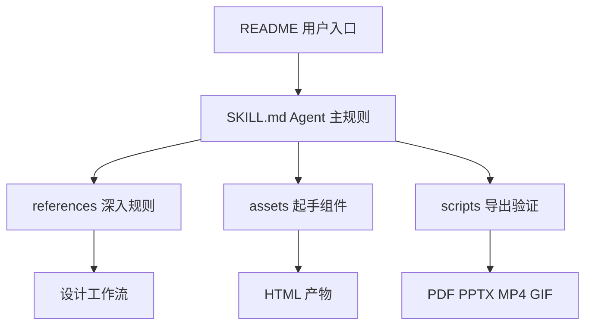

<details>
<summary>相关源文件</summary>

生成本页时使用的主要源文件：

- [README.md](../../../project-repos/huashu-design/README.md)
- [README.en.md](../../../project-repos/huashu-design/README.en.md)
- [SKILL.md](../../../project-repos/huashu-design/SKILL.md)
- [LICENSE](../../../project-repos/huashu-design/LICENSE)
- [00-repo-inventory.md](../00-repo-inventory.md)

</details>

# 项目概览

Huashu Design 是一个面向 markdown-based agent 的设计 skill：用户用自然语言提出设计任务，agent 按 `SKILL.md` 和 `references/` 中的规则，产出 HTML 原型、幻灯片、动画、视频、信息图或设计评审。README 将它定位为跨 Claude Code、Cursor、Codex、OpenClaw、Hermes 可安装的 agent-agnostic skill，并明确安装入口是 `npx skills add alchaincyf/huashu-design`。Sources: [README.md:16-30](../../../project-repos/huashu-design/README.md#L16-L30), [README.en.md:16-32](../../../project-repos/huashu-design/README.en.md#L16-L32), [SKILL.md:1-10](../../../project-repos/huashu-design/SKILL.md#L1-L10)

<details class="source-snippets">
<summary>引用源码</summary>

<!-- source-snippets:start -->

#### `README.md:16-30`

````markdown
**在你的 agent 里打一句话，拿回一份能交付的设计。**

<br>

3 到 30 分钟，你能 ship 一段**产品发布动画**、一个能点击的 App 原型、一套能编辑的 PPT、一份印刷级的信息图。

不是「AI 做的还行」那种水平——是看起来像大厂设计团队做的。给 skill 你的品牌资产（logo、色板、UI 截图），它会读懂你的品牌气质；什么都不给，内置的 20 种设计语汇也能兜底到不出 AI slop。

**你看到这篇 README 里的每一个动画，都是 huashu-design 自己做的。** 不是 Figma，不是 AE，就是一句话 prompt + skill 跑通。下次产品发布要做宣传片？现在你也能做。

```
npx skills add alchaincyf/huashu-design
```

跨 agent 通用——Claude Code、Cursor、Codex、OpenClaw、Hermes 都能装。
````

#### `README.en.md:16-32`

````markdown
**Say one sentence to your agent — Claude Code, Cursor, Codex, OpenClaw, Hermes all work.**

<br>

3 to 30 minutes — you ship a **product launch animation**, a clickable App prototype, an editable PPT deck, a print-grade infographic.

Not "decent for AI" quality — it looks like a real design team made it. Give the skill your brand assets (logo, colors, UI screenshots) and it reads your brand's voice; give it nothing and the built-in 20 design vocabularies still keep you out of AI slop territory.

**Every animation in this README was made by huashu-design itself.** No Figma, no After Effects — just a sentence + skill run. Next product launch needs a promo video? You can make it too.

```
npx skills add alchaincyf/huashu-design
```

[See it work](#demo-gallery) · [Install](#install) · [What it does](#what-it-does) · [How it works](#core-mechanics) · [vs. Claude Design](#vs-claude-design)

> 📖 **Note for English readers**: this skill is built by a Chinese-speaking developer. The skill's agent prompts (`SKILL.md`, `references/*.md`) are in Chinese but the agent is bilingual — works fine with English tasks. The demos below are the English parallel versions; the Chinese ones are in the default-named files (see the Chinese [README.md](README.md)).
````

#### `SKILL.md:1-10`

```markdown
---
name: huashu-design
description: 花叔Design（Huashu-Design）——用HTML做高保真原型、交互Demo、幻灯片、动画、设计变体探索+设计方向顾问+专家评审的一体化设计能力。HTML是工具不是媒介，根据任务embody不同专家（UX设计师/动画师/幻灯片设计师/原型师），避免web design tropes。触发词：做原型、设计Demo、交互原型、HTML演示、动画Demo、设计变体、hi-fi设计、UI mockup、prototype、设计探索、做个HTML页面、做个可视化、app原型、iOS原型、移动应用mockup、导出MP4、导出GIF、60fps视频、设计风格、设计方向、设计哲学、配色方案、视觉风格、推荐风格、选个风格、做个好看的、评审、好不好看、review this design。**主干能力**：Junior Designer工作流（先给假设+reasoning+placeholder再迭代）、反AI slop清单、React+Babel最佳实践、Tweaks变体切换、Speaker Notes演示、Starter Components（幻灯片外壳/变体画布/动画引擎/设备边框）、App原型专属守则（默认从Wikimedia/Met/Unsplash取真图、每台iPhone包AppPhone状态管理器可交互、交付前跑Playwright点击测试）、Playwright验证、HTML动画→MP4/GIF视频导出（25fps基础 + 60fps插帧 + palette优化GIF + 6首场景化BGM + 自动fade）。**需求模糊时的Fallback**：设计方向顾问模式——从5流派×20种设计哲学（Pentagram信息建筑/Field.io运动诗学/Kenya Hara东方极简/Sagmeister实验先锋等）推荐3个差异化方向，展示24个预制showcase（8场景×3风格），并行生成3个视觉Demo让用户选。**交付后可选**：专家级5维度评审（哲学一致性/视觉层级/细节执行/功能性/创新性各打10分+修复清单）。
---

# 花叔Design · Huashu-Design

你是一位用HTML工作的设计师，不是程序员。用户是你的manager，你产出深思熟虑、做工精良的设计作品。

**HTML是工具，但你的媒介和产出形式会变**——做幻灯片时别像网页，做动画时别像Dashboard，做App原型时别像说明书。**根据任务embody对应领域的专家**：动画师/UX设计师/幻灯片设计师/原型师。
```

<!-- source-snippets:end -->
</details>
## 仓库形态

这个仓库不是传统 npm 包：清单脚本没有检测到 `package.json`、CI 或测试目录，主要内容是一个根 `SKILL.md`、一组 `references/` 规则文档、`assets/` starter components、`scripts/` 导出工具链和 `demos/` 示例。Sources: [00-repo-inventory.md:10-49](../00-repo-inventory.md#L10-L49), [README.md:248-281](../../../project-repos/huashu-design/README.md#L248-L281)

<details class="source-snippets">
<summary>引用源码</summary>

<!-- source-snippets:start -->

#### `00-repo-inventory.md:10-49`

```markdown
## File Summary

- Files scanned: 155
- Top-level directories: `assets`, `demos`, `references`, `scripts`

| Extension | Count |
|-----------|------:|
| `.html` | 44 |
| `.mp3` | 43 |
| `.md` | 24 |
| `.png` | 24 |
| `.jsx` | 6 |
| `.js` | 3 |
| `.mjs` | 3 |
| `[no extension]` | 2 |
| `.json` | 2 |
| `.sh` | 2 |
| `.svg` | 1 |
| `.py` | 1 |

## Manifests and Build Files

- None detected

## Documentation

- `README.en.md`
- `README.md`

## CI and Automation

- None detected

## Tests

- None detected

## Skills

- None detected
```

#### `README.md:248-281`

````markdown
## 仓库结构

```
huashu-design/
├── SKILL.md                 # 主文档（给 agent 读）
├── README.md                # 本文件（给用户读）
├── assets/                  # Starter Components
│   ├── animations.jsx       # Stage + Sprite + Easing + interpolate
│   ├── ios_frame.jsx        # iPhone 15 Pro bezel
│   ├── android_frame.jsx
│   ├── macos_window.jsx
│   ├── browser_window.jsx
│   ├── deck_stage.js        # HTML 幻灯片引擎
│   ├── deck_index.html      # 多文件 deck 拼接器
│   ├── design_canvas.jsx    # 并排变体展示
│   ├── showcases/           # 24 个预制样例（8 场景 × 3 风格）
│   └── bgm-*.mp3            # 6 首场景化背景音乐
├── references/              # 按任务深入读的子文档
│   ├── animation-pitfalls.md
│   ├── design-styles.md     # 20 种设计哲学详细库
│   ├── slide-decks.md
│   ├── editable-pptx.md
│   ├── critique-guide.md
│   ├── video-export.md
│   └── ...
├── scripts/                 # 导出工具链
│   ├── render-video.js      # HTML → MP4
│   ├── convert-formats.sh   # MP4 → 60fps + GIF
│   ├── add-music.sh         # MP4 + BGM
│   ├── export_deck_pdf.mjs
│   ├── export_deck_pptx.mjs
│   ├── html2pptx.js
│   └── verify.py
└── demos/                   # 9 个能力演示 (c*/w*)，中英双版 GIF/MP4/HTML + hero v10
````

<!-- source-snippets:end -->
</details>


Sources: [README.md:248-281](../../../project-repos/huashu-design/README.md#L248-L281), [SKILL.md:724-748](../../../project-repos/huashu-design/SKILL.md#L724-L748)

<details class="source-snippets">
<summary>引用源码</summary>

<!-- source-snippets:start -->

#### `README.md:248-281`

````markdown
## 仓库结构

```
huashu-design/
├── SKILL.md                 # 主文档（给 agent 读）
├── README.md                # 本文件（给用户读）
├── assets/                  # Starter Components
│   ├── animations.jsx       # Stage + Sprite + Easing + interpolate
│   ├── ios_frame.jsx        # iPhone 15 Pro bezel
│   ├── android_frame.jsx
│   ├── macos_window.jsx
│   ├── browser_window.jsx
│   ├── deck_stage.js        # HTML 幻灯片引擎
│   ├── deck_index.html      # 多文件 deck 拼接器
│   ├── design_canvas.jsx    # 并排变体展示
│   ├── showcases/           # 24 个预制样例（8 场景 × 3 风格）
│   └── bgm-*.mp3            # 6 首场景化背景音乐
├── references/              # 按任务深入读的子文档
│   ├── animation-pitfalls.md
│   ├── design-styles.md     # 20 种设计哲学详细库
│   ├── slide-decks.md
│   ├── editable-pptx.md
│   ├── critique-guide.md
│   ├── video-export.md
│   └── ...
├── scripts/                 # 导出工具链
│   ├── render-video.js      # HTML → MP4
│   ├── convert-formats.sh   # MP4 → 60fps + GIF
│   ├── add-music.sh         # MP4 + BGM
│   ├── export_deck_pdf.mjs
│   ├── export_deck_pptx.mjs
│   ├── html2pptx.js
│   └── verify.py
└── demos/                   # 9 个能力演示 (c*/w*)，中英双版 GIF/MP4/HTML + hero v10
````

#### `SKILL.md:724-748`

```markdown
## References路由表

根据任务类型深入读对应references：

| 任务 | 读 |
|------|-----|
| 开工前问问题、定方向 | `references/workflow.md` |
| 反AI slop、内容规范、scale | `references/content-guidelines.md` |
| React+Babel项目setup | `references/react-setup.md` |
| 做幻灯片 | `references/slide-decks.md` + `assets/deck_stage.js` |
| 导出可编辑 PPTX（html2pptx 4 条硬约束） | `references/editable-pptx.md` + `scripts/html2pptx.js` |
| 做动画/motion（**先读 pitfalls**）| `references/animation-pitfalls.md` + `references/animations.md` + `assets/animations.jsx` |
| **动画的正向设计语法**（Anthropic 级叙事/运动/节奏/表达风格）| `references/animation-best-practices.md`（5 段叙事+Expo easing+运动语言 8 条+3 种场景配方）|
| 做Tweaks实时调参 | `references/tweaks-system.md` |
| 没有design context怎么办 | `references/design-context.md`（薄 fallback） 或 `references/design-styles.md`（厚 fallback：20 种设计哲学详细库） |
| **需求模糊要推荐风格方向** | `references/design-styles.md`（20 种风格+AI prompt 模板）+ `assets/showcases/INDEX.md`（24 个预制样例） |
| **按输出类型查场景模板**（封面/PPT/信息图） | `references/scene-templates.md` |
| 输出完后验证 | `references/verification.md` + `scripts/verify.py` |
| **设计评审/打分**（设计完成后可选） | `references/critique-guide.md`（5 维度评分+常见问题清单） |
| **动画导出MP4/GIF/加BGM** | `references/video-export.md` + `scripts/render-video.js` + `scripts/convert-formats.sh` + `scripts/add-music.sh` |
| **动画加音效SFX**（苹果发布会级，37个预制） | `references/sfx-library.md` + `assets/sfx/<category>/*.mp3` |
| **动画音频配置规则**（SFX+BGM双轨制、黄金配比、ffmpeg模板、场景配方） | `references/audio-design-rules.md` |
| **Apple画廊展示风格**（3D倾斜+悬浮卡片+缓慢pan+焦点切换，v9实战同款） | `references/apple-gallery-showcase.md` |
| **Gallery Ripple + Multi-Focus 场景哲学**（当素材 20+ 同质+场景需表达「规模×深度」时优先用；含前置条件、技术配方、5 个可复用模式）| `references/hero-animation-case-study.md`（huashu-design hero v9 蒸馏）|

```

<!-- source-snippets:end -->
</details>
## 核心能力地图

| 能力 | 主要文件 | 交付物 |
|---|---|---|
| 高保真原型 | `SKILL.md`, `assets/ios_frame.jsx`, `assets/design_canvas.jsx` | App/Web HTML 原型、可点击 flow 或多屏 overview |
| 幻灯片 | `references/slide-decks.md`, `assets/deck_index.html`, `assets/deck_stage.js` | HTML deck、PDF、可编辑 PPTX |
| 动画与视频 | `assets/animations.jsx`, `scripts/render-video.js`, `scripts/convert-formats.sh` | MP4 25fps、MP4 60fps、GIF |
| 音频增强 | `references/audio-design-rules.md`, `references/sfx-library.md`, `scripts/add-music.sh` | 带 BGM/SFX 的最终视频 |
| 风格顾问 | `references/design-styles.md`, `assets/showcases/INDEX.md` | 3 个设计方向、showcase、Demo |

Sources: [README.md:79-89](../../../project-repos/huashu-design/README.md#L79-L89), [SKILL.md:703-748](../../../project-repos/huashu-design/SKILL.md#L703-L748), [references/slide-decks.md:5-10](../../../project-repos/huashu-design/references/slide-decks.md#L5-L10), [references/video-export.md:18-27](../../../project-repos/huashu-design/references/video-export.md#L18-L27)

<details class="source-snippets">
<summary>引用源码</summary>

<!-- source-snippets:start -->

#### `README.md:79-89`

```markdown
## 能做什么

| 能力 | 交付物 | 典型耗时 |
|------|--------|----------|
| 交互原型（App / Web） | 单文件 HTML · 真 iPhone bezel · 可点击 · Playwright 验证 | 10–15 min |
| 演讲幻灯片 | HTML deck（浏览器演讲）+ 可编辑 PPTX（文本框保留） | 15–25 min |
| 时间轴动画 | MP4（25fps / 60fps 插帧）+ GIF（palette 优化）+ BGM | 8–12 min |
| 设计变体 | 3+ 并排对比 · Tweaks 实时调参 · 跨维度探索 | 10 min |
| 信息图 / 可视化 | 印刷级排版 · 可导 PDF/PNG/SVG | 10 min |
| 设计方向顾问 | 5 流派 × 20 种设计哲学 · 推荐 3 方向 · 并行生成 Demo | 5 min |
| 5 维度专家评审 | 雷达图 + Keep/Fix/Quick Wins · 可操作修复清单 | 3 min |
```

#### `SKILL.md:703-748`

```markdown
## Starter Components（assets/下）

造好的起手组件，直接copy进项目使用：

| 文件 | 何时用 | 提供 |
|------|--------|------|
| `deck_index.html` | **幻灯片的默认基础产物**（不管最终出 PDF 还是 PPTX，HTML 聚合版永远先做） | iframe拼接 + 键盘导航 + scale + 计数器 + 打印合并，每页独立HTML免CSS串扰。用法：复制为 `index.html`、编辑 MANIFEST 列出所有页、浏览器打开即成演示版 |
| `deck_stage.js` | 做幻灯片（单文件架构，≤10页） | web component：auto-scale + 键盘导航 + slide counter + localStorage + speaker notes ⚠️ **script 必须放在 `</deck-stage>` 之后，section 的 `display: flex` 必须写到 `.active` 上**，详见 `references/slide-decks.md` 的两个硬约束 |
| `scripts/export_deck_pdf.mjs` | **HTML→PDF 导出（多文件架构）** · 每页独立 HTML 文件，playwright 逐个 `page.pdf()` → pdf-lib 合并。文字保留矢量可搜。依赖 `playwright pdf-lib` |
| `scripts/export_deck_stage_pdf.mjs` | **HTML→PDF 导出（单文件 deck-stage 架构专用）** · 2026-04-20 新增。处理 shadow DOM slot 导致的「只出 1 页」、absolute 子元素溢出等坑。详见 `references/slide-decks.md` 末节。依赖 `playwright` |
| `scripts/export_deck_pptx.mjs` | **HTML→可编辑 PPTX 导出** · 调 `html2pptx.js` 导出原生可编辑文本框，文字在 PPT 里双击可直接编辑。**HTML 必须符合 4 条硬约束**（见 `references/editable-pptx.md`），视觉自由度优先的场景请改走 PDF 路径。依赖 `playwright pptxgenjs sharp` |
| `scripts/html2pptx.js` | **HTML→PPTX 元素级翻译器** · 读 computedStyle 把 DOM 逐元素翻译成 PowerPoint 对象（text frame / shape / picture）。`export_deck_pptx.mjs` 内部调用。要求 HTML 严格满足 4 条硬约束 |
| `design_canvas.jsx` | 并排展示≥2个静态variations | 带label的网格布局 |
| `animations.jsx` | 任何动画HTML | Stage + Sprite + useTime + Easing + interpolate |
| `ios_frame.jsx` | iOS App mockup | iPhone bezel + 状态栏 + 圆角 |
| `android_frame.jsx` | Android App mockup | 设备bezel |
| `macos_window.jsx` | 桌面App mockup | 窗口chrome + 红绿灯 |
| `browser_window.jsx` | 网页在浏览器里的样子 | URL bar + tab bar |

用法：读取对应 assets 文件内容 → inline 进你的 HTML `<script>` 标签 → slot 进你的设计。

## References路由表

根据任务类型深入读对应references：

| 任务 | 读 |
|------|-----|
| 开工前问问题、定方向 | `references/workflow.md` |
| 反AI slop、内容规范、scale | `references/content-guidelines.md` |
| React+Babel项目setup | `references/react-setup.md` |
| 做幻灯片 | `references/slide-decks.md` + `assets/deck_stage.js` |
| 导出可编辑 PPTX（html2pptx 4 条硬约束） | `references/editable-pptx.md` + `scripts/html2pptx.js` |
| 做动画/motion（**先读 pitfalls**）| `references/animation-pitfalls.md` + `references/animations.md` + `assets/animations.jsx` |
| **动画的正向设计语法**（Anthropic 级叙事/运动/节奏/表达风格）| `references/animation-best-practices.md`（5 段叙事+Expo easing+运动语言 8 条+3 种场景配方）|
| 做Tweaks实时调参 | `references/tweaks-system.md` |
| 没有design context怎么办 | `references/design-context.md`（薄 fallback） 或 `references/design-styles.md`（厚 fallback：20 种设计哲学详细库） |
| **需求模糊要推荐风格方向** | `references/design-styles.md`（20 种风格+AI prompt 模板）+ `assets/showcases/INDEX.md`（24 个预制样例） |
| **按输出类型查场景模板**（封面/PPT/信息图） | `references/scene-templates.md` |
| 输出完后验证 | `references/verification.md` + `scripts/verify.py` |
| **设计评审/打分**（设计完成后可选） | `references/critique-guide.md`（5 维度评分+常见问题清单） |
| **动画导出MP4/GIF/加BGM** | `references/video-export.md` + `scripts/render-video.js` + `scripts/convert-formats.sh` + `scripts/add-music.sh` |
| **动画加音效SFX**（苹果发布会级，37个预制） | `references/sfx-library.md` + `assets/sfx/<category>/*.mp3` |
| **动画音频配置规则**（SFX+BGM双轨制、黄金配比、ffmpeg模板、场景配方） | `references/audio-design-rules.md` |
| **Apple画廊展示风格**（3D倾斜+悬浮卡片+缓慢pan+焦点切换，v9实战同款） | `references/apple-gallery-showcase.md` |
| **Gallery Ripple + Multi-Focus 场景哲学**（当素材 20+ 同质+场景需表达「规模×深度」时优先用；含前置条件、技术配方、5 个可复用模式）| `references/hero-animation-case-study.md`（huashu-design hero v9 蒸馏）|

```

#### `references/slide-decks.md:5-10`

```markdown
**本 skill 的能力覆盖**：
- **HTML 演示版（基础产物，永远默认必做）** → 每页独立 HTML + `assets/deck_index.html` 聚合，浏览器里键盘翻页、全屏演讲
- HTML → PDF 导出 → `scripts/export_deck_pdf.mjs` / `scripts/export_deck_stage_pdf.mjs`
- HTML → 可编辑 PPTX 导出 → `references/editable-pptx.md` + `scripts/html2pptx.js` + `scripts/export_deck_pptx.mjs`（要求 HTML 按 4 条硬约束写）

> **⚠️ HTML 是基础，PDF/PPTX 是衍生物。** 不管最终交付什么格式，都**必须**先做 HTML 聚合演示版（`index.html` + `slides/*.html`），它是幻灯片作品的「源」。PDF/PPTX 是从 HTML 一行命令导出的快照。
```

#### `references/video-export.md:18-27`

```markdown
## 产出规格

默认一次给三种格式，让用户选：

| 格式 | 规格 | 适合场景 | 典型大小（30s） |
|---|---|---|---|
| MP4 25fps | 1920×1080 · H.264 · CRF 18 | 公众号嵌入、视频号、YouTube | 1-2 MB |
| MP4 60fps | 1920×1080 · minterpolate 插帧 · H.264 · CRF 18 | 高帧率展示、B站、作品集 | 1.5-3 MB |
| GIF | 960×540 · 15fps · palette 优化 | Twitter/X、README、Slack 预览 | 2-4 MB |

```

<!-- source-snippets:end -->
</details>
## 读者路线

新维护者应先读 `SKILL.md` 的 frontmatter 和「核心哲学」，再按任务类型跳到 `references/`。如果要理解可复用代码，先读 `assets/animations.jsx`、`assets/deck_index.html`、`assets/deck_stage.js`、`assets/ios_frame.jsx`。如果要理解交付工具链，读 `scripts/render-video.js`、`scripts/html2pptx.js` 与对应 reference。Sources: [SKILL.md:61-80](../../../project-repos/huashu-design/SKILL.md#L61-L80), [SKILL.md:703-748](../../../project-repos/huashu-design/SKILL.md#L703-L748), [assets/animations.jsx:1-25](../../../project-repos/huashu-design/assets/animations.jsx#L1-L25), [scripts/render-video.js:1-38](../../../project-repos/huashu-design/scripts/render-video.js#L1-L38)

<details class="source-snippets">
<summary>引用源码</summary>

<!-- source-snippets:start -->

#### `SKILL.md:61-80`

```markdown
## 核心哲学（优先级从高到低）

### 1. 从existing context出发，不要凭空画

好的hi-fi设计**一定**是从已有上下文长出来的。先问用户是否有design system/UI kit/codebase/Figma/截图。**凭空做hi-fi是last resort，一定会产出generic的作品**。如果用户说没有，先帮他去找（看项目里有没有，看有没有参考品牌）。

**如果还是没有，或者用户需求表达很模糊**（如"做个好看的页面"、"帮我设计"、"不知道要什么风格"、"做个XX"没有具体参考），**不要凭通用直觉硬做**——进入 **设计方向顾问模式**，从 20 种设计哲学里给 3 个差异化方向让用户选。完整流程见下方「设计方向顾问（Fallback 模式）」大节。

#### 1.a 核心资产协议（涉及具体品牌时强制执行）

> **这是 v1 最核心的约束，也是稳定性的生命线。** Agent 是否走通这个协议，直接决定输出质量是 40 分还是 90 分。不要跳过任何一步。
>
> **v1.1 重构（2026-04-20）**：从「品牌资产协议」升级为「核心资产协议」。之前的版本过度聚焦色值和字体，漏掉了设计中最基础的 logo / 产品图 / UI 截图。花叔的原话：「除了所谓的品牌色，显然我们应该找到并且用上大疆的 logo，用上 pocket4 的产品图。如果是网站或者 app 等非实体产品的话，logo 至少该是必须的。这可能是比所谓的品牌设计的 spec 更重要的基本逻辑。否则，我们在表达什么呢？」

**触发条件**：任务涉及具体品牌——用户提了产品名/公司名/明确客户（Stripe、Linear、Anthropic、Notion、Lovart、DJI、自家公司等），不论用户是否主动提供了品牌资料。

**前置硬条件**：走协议前必须已通过「#0 事实验证先于假设」确认品牌/产品存在且状态已知。如果你还不确定产品是否已发布/规格/版本，先回去搜。

##### 核心理念：资产 > 规范

```

#### `SKILL.md:703-748`

```markdown
## Starter Components（assets/下）

造好的起手组件，直接copy进项目使用：

| 文件 | 何时用 | 提供 |
|------|--------|------|
| `deck_index.html` | **幻灯片的默认基础产物**（不管最终出 PDF 还是 PPTX，HTML 聚合版永远先做） | iframe拼接 + 键盘导航 + scale + 计数器 + 打印合并，每页独立HTML免CSS串扰。用法：复制为 `index.html`、编辑 MANIFEST 列出所有页、浏览器打开即成演示版 |
| `deck_stage.js` | 做幻灯片（单文件架构，≤10页） | web component：auto-scale + 键盘导航 + slide counter + localStorage + speaker notes ⚠️ **script 必须放在 `</deck-stage>` 之后，section 的 `display: flex` 必须写到 `.active` 上**，详见 `references/slide-decks.md` 的两个硬约束 |
| `scripts/export_deck_pdf.mjs` | **HTML→PDF 导出（多文件架构）** · 每页独立 HTML 文件，playwright 逐个 `page.pdf()` → pdf-lib 合并。文字保留矢量可搜。依赖 `playwright pdf-lib` |
| `scripts/export_deck_stage_pdf.mjs` | **HTML→PDF 导出（单文件 deck-stage 架构专用）** · 2026-04-20 新增。处理 shadow DOM slot 导致的「只出 1 页」、absolute 子元素溢出等坑。详见 `references/slide-decks.md` 末节。依赖 `playwright` |
| `scripts/export_deck_pptx.mjs` | **HTML→可编辑 PPTX 导出** · 调 `html2pptx.js` 导出原生可编辑文本框，文字在 PPT 里双击可直接编辑。**HTML 必须符合 4 条硬约束**（见 `references/editable-pptx.md`），视觉自由度优先的场景请改走 PDF 路径。依赖 `playwright pptxgenjs sharp` |
| `scripts/html2pptx.js` | **HTML→PPTX 元素级翻译器** · 读 computedStyle 把 DOM 逐元素翻译成 PowerPoint 对象（text frame / shape / picture）。`export_deck_pptx.mjs` 内部调用。要求 HTML 严格满足 4 条硬约束 |
| `design_canvas.jsx` | 并排展示≥2个静态variations | 带label的网格布局 |
| `animations.jsx` | 任何动画HTML | Stage + Sprite + useTime + Easing + interpolate |
| `ios_frame.jsx` | iOS App mockup | iPhone bezel + 状态栏 + 圆角 |
| `android_frame.jsx` | Android App mockup | 设备bezel |
| `macos_window.jsx` | 桌面App mockup | 窗口chrome + 红绿灯 |
| `browser_window.jsx` | 网页在浏览器里的样子 | URL bar + tab bar |

用法：读取对应 assets 文件内容 → inline 进你的 HTML `<script>` 标签 → slot 进你的设计。

## References路由表

根据任务类型深入读对应references：

| 任务 | 读 |
|------|-----|
| 开工前问问题、定方向 | `references/workflow.md` |
| 反AI slop、内容规范、scale | `references/content-guidelines.md` |
| React+Babel项目setup | `references/react-setup.md` |
| 做幻灯片 | `references/slide-decks.md` + `assets/deck_stage.js` |
| 导出可编辑 PPTX（html2pptx 4 条硬约束） | `references/editable-pptx.md` + `scripts/html2pptx.js` |
| 做动画/motion（**先读 pitfalls**）| `references/animation-pitfalls.md` + `references/animations.md` + `assets/animations.jsx` |
| **动画的正向设计语法**（Anthropic 级叙事/运动/节奏/表达风格）| `references/animation-best-practices.md`（5 段叙事+Expo easing+运动语言 8 条+3 种场景配方）|
| 做Tweaks实时调参 | `references/tweaks-system.md` |
| 没有design context怎么办 | `references/design-context.md`（薄 fallback） 或 `references/design-styles.md`（厚 fallback：20 种设计哲学详细库） |
| **需求模糊要推荐风格方向** | `references/design-styles.md`（20 种风格+AI prompt 模板）+ `assets/showcases/INDEX.md`（24 个预制样例） |
| **按输出类型查场景模板**（封面/PPT/信息图） | `references/scene-templates.md` |
| 输出完后验证 | `references/verification.md` + `scripts/verify.py` |
| **设计评审/打分**（设计完成后可选） | `references/critique-guide.md`（5 维度评分+常见问题清单） |
| **动画导出MP4/GIF/加BGM** | `references/video-export.md` + `scripts/render-video.js` + `scripts/convert-formats.sh` + `scripts/add-music.sh` |
| **动画加音效SFX**（苹果发布会级，37个预制） | `references/sfx-library.md` + `assets/sfx/<category>/*.mp3` |
| **动画音频配置规则**（SFX+BGM双轨制、黄金配比、ffmpeg模板、场景配方） | `references/audio-design-rules.md` |
| **Apple画廊展示风格**（3D倾斜+悬浮卡片+缓慢pan+焦点切换，v9实战同款） | `references/apple-gallery-showcase.md` |
| **Gallery Ripple + Multi-Focus 场景哲学**（当素材 20+ 同质+场景需表达「规模×深度」时优先用；含前置条件、技术配方、5 个可复用模式）| `references/hero-animation-case-study.md`（huashu-design hero v9 蒸馏）|

```

#### `assets/animations.jsx:1-25`

```jsx
/**
 * animations.jsx — 时间轴动画引擎
 *
 * Stage + Sprite 模式，借鉴Remotion但轻量化。
 *
 * 导出（挂到 window.Animations）：
 * - Stage: 整个动画容器，提供时间+控制
 * - Sprite: 时间片段，start/end内显示，提供本地进度
 * - useTime(): 读全局时间（秒）
 * - useSprite(): 读本地进度 {t: 0→1, elapsed: seconds, duration: seconds}
 * - Easing: {linear, easeIn, easeOut, easeInOut, spring, anticipation}
 * - interpolate(t, [input0, input1], [output0, output1], easing?)
 *
 * 用法：
 *   <Stage duration={10}>
 *     <Sprite start={0} end={3}>
 *       <Title />
 *     </Sprite>
 *     <Sprite start={2} end={5}>
 *       <Subtitle />
 *     </Sprite>
 *   </Stage>
 *
 * 在Sprite子组件里用 useSprite() 读当前片段进度。
 */
```

#### `scripts/render-video.js:1-38`

```javascript
#!/usr/bin/env node
/**
 * HTML animation → MP4 via Playwright recordVideo + ffmpeg.
 *
 * Requires: global playwright (`npm install -g playwright`), ffmpeg on PATH.
 *
 * Usage:
 *   NODE_PATH=$(npm root -g) node render-video.js <html-file> \
 *     [--duration=30] [--width=1920] [--height=1080] \
 *     [--trim=<seconds>] [--fontwait=1.5] [--readytimeout=8] \
 *     [--keep-chrome]
 *
 * Design:
 *   1. Warmup context (no record) — caches fonts/assets, closes cleanly
 *   2. Record context (fresh, recordVideo ON) — WebM starts writing at
 *      context creation. Babel-standalone compile + React mount +
 *      fonts.ready can take 1.5-3s, during which WebM writes black frames.
 *      We measure this by waiting for window.__ready (set by animations.jsx
 *      Stage component after first paint), then trim exactly that offset.
 *   3. addInitScript injects CSS hiding "chrome" elements (progress bar,
 *      replay button, masthead, footer, etc.) that are fine for human
 *      debugging but shouldn't appear in exported video.
 *
 * Animation-ready signal:
 *   Set `window.__ready = true` in your HTML after first paint. This tells
 *   the recorder "animation has started rendering — treat now as t=0".
 *   If you use animations.jsx, Stage does this automatically. Otherwise
 *   add: `document.fonts.ready.then(() => requestAnimationFrame(() => { window.__ready = true }));`
 *   after your first render call.
 *
 *   Without __ready, falls back to --fontwait=1.5s (may leave 1-2s of black
 *   at the start). Pass --trim=<seconds> to override manually.
 *
 * Chrome elements hidden by default (all common class names + `.no-record`
 * convention). Pass --keep-chrome to disable this and see raw HTML.
 *
 * Output: next to the HTML file, same basename with .mp4 suffix.
 */
```

<!-- source-snippets:end -->
</details>
## 相关页面

- [Skill 编排与主提示词](skill-orchestration.md)
- [Starter Components 架构](starter-components.md)
- [工作流、质量门与测试提示](workflow-quality.md)
