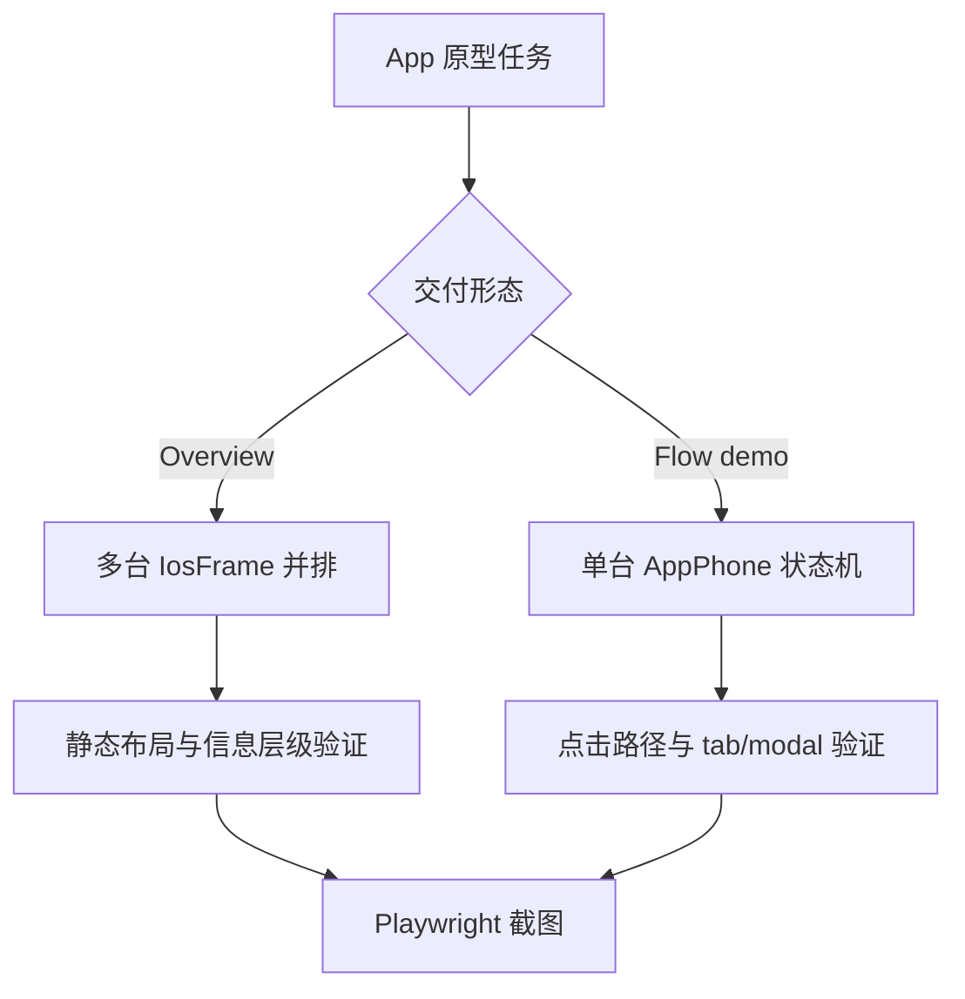

<details>
<summary>相关源文件</summary>

生成本页时使用的主要源文件：

- [SKILL.md](../../../project-repos/huashu-design/SKILL.md)
- [references/tweaks-system.md](../../../project-repos/huashu-design/references/tweaks-system.md)
- [references/verification.md](../../../project-repos/huashu-design/references/verification.md)
- [scripts/verify.py](../../../project-repos/huashu-design/scripts/verify.py)
- [assets/ios_frame.jsx](../../../project-repos/huashu-design/assets/ios_frame.jsx)
- [assets/design_canvas.jsx](../../../project-repos/huashu-design/assets/design_canvas.jsx)
- [test-prompts.json](../../../project-repos/huashu-design/test-prompts.json)

</details>

# 原型、Tweaks 与验证闭环

App 和移动原型有独立规则：默认单文件 inline React，交付前先确认 overview 平铺还是 flow demo 单机；做 iOS mockup 时必须用 `assets/ios_frame.jsx`，禁止手写 Dynamic Island、状态栏和 Home Indicator。Sources: [SKILL.md:463-482](../../../project-repos/huashu-design/SKILL.md#L463-L482), [SKILL.md:515-555](../../../project-repos/huashu-design/SKILL.md#L515-L555), [SKILL.md:576-599](../../../project-repos/huashu-design/SKILL.md#L576-L599), [assets/ios_frame.jsx:1-16](../../../project-repos/huashu-design/assets/ios_frame.jsx#L1-L16)

<details class="source-snippets">
<summary>引用源码</summary>

<!-- source-snippets:start -->

#### `SKILL.md:463-482`

```markdown
## App / iOS 原型专属守则

做 iOS/Android/移动 app 原型时（触发：「app 原型」「iOS mockup」「移动应用」「做个 app」），下面四条**覆盖**通用 placeholder 原则——app 原型是 demo 现场，静态摆拍和米白占位卡没有说服力。

### 0. 架构选型（必先决定）

**默认单文件 inline React**——所有 JSX/data/styles 直接写进主 HTML 的 `<script type="text/babel">...</script>` 标签，**不要**用 `<script src="components.jsx">` 外部加载。原因：`file://` 协议下浏览器把外部 JS 当跨 origin 拦截，强制用户起 HTTP server 违反「双击就能开」的原型直觉。引用本地图片必须 base64 内嵌 data URL，别假设有 server。

**拆外部文件只在两种情况**：
- (a) 单文件 >1000 行难维护 → 拆成 `components.jsx` + `data.js`，同时明确交付说明（`python3 -m http.server` 命令 + 访问 URL）
- (b) 需要多 subagent 并行写不同屏 → `index.html` + 每屏独立 HTML（`today.html`/`graph.html`...），iframe 聚合，每屏也都是自包含单文件

**选型速查**：

| 场景 | 架构 | 交付方式 |
|------|------|----------|
| 单人做 4-6 屏原型（主流） | 单文件 inline | 一个 `.html` 双击开 |
| 单人做大型 App（>10 屏） | 多 jsx + server | 附启动命令 |
| 多 agent 并行 | 多 HTML + iframe | `index.html` 聚合，每屏独立可开 |

```

#### `SKILL.md:515-555`

````markdown
### 2. 交付形态：overview 平铺 / flow demo 单机——先问用户要哪种

多屏 App 原型有两种标准交付形态，**先问用户要哪种**，不要默认挑一种闷头做：

| 形态 | 何时用 | 做法 |
|------|--------|------|
| **Overview 平铺**（设计 review 默认）| 用户要看全貌 / 比较布局 / 走查设计一致性 / 多屏并排 | **所有屏并排静态展示**，每屏一台独立 iPhone，内容完整，不需要可点击 |
| **Flow demo 单机** | 用户要演示一条特定用户流程（如 onboarding、购买链路）| 单台 iPhone，内嵌 `AppPhone` 状态管理器，tab bar / 按钮 / 标注点都能点 |

**路由关键词**：
- 任务里出现「平铺 / 展示所有页面 / overview / 看一眼 / 比较 / 所有屏」→ 走 **overview**
- 任务里出现「演示流程 / 用户路径 / 走一遍 / clickable / 可交互 demo」→ 走 **flow demo**
- 不确定就问。不要默认选 flow demo（它更费工，不是所有任务都需要）

**Overview 平铺的骨架**（每屏独立一台 IosFrame 并排）：

```jsx
&lt;div style=&lt;span v-pre>&#123;&#123;&lt;/span>display: 'flex', gap: 32, flexWrap: 'wrap', padding: 48, alignItems: 'flex-start'&#125;&#125;>
  {screens.map(s => (
    &lt;div key={s.id}>
      &lt;div style=&lt;span v-pre>&#123;&#123;&lt;/span>fontSize: 13, color: '#666', marginBottom: 8, fontStyle: 'italic'&#125;&#125;>{s.label}&lt;/div>
      &lt;IosFrame&gt;
        &lt;ScreenComponent data={s} /&gt;
      &lt;/IosFrame&gt;
    &lt;/div>
  ))}
&lt;/div>
```

**Flow demo 的骨架**（单台 clickable 状态机）：

```jsx
function AppPhone({ initial = 'today' }) {
  const [screen, setScreen] = React.useState(initial);
  const [modal, setModal] = React.useState(null);
  // 根据 screen 渲染不同 ScreenComponent，传入 onEnter/onClose/onTabChange/onOpen props
}
```

Screen 组件接 callback props（`onEnter`、`onClose`、`onTabChange`、`onOpen`、`onAnnotation`），不硬编码状态。TabBar、按钮、作品卡加 `cursor: pointer` + hover 反馈。

````

#### `SKILL.md:576-599`

````markdown
### 5. iOS 设备框必须用 `assets/ios_frame.jsx`——禁止手写 Dynamic Island / status bar

做 iPhone mockup 时**硬性绑定** `assets/ios_frame.jsx`。这是已经对齐过 iPhone 15 Pro 精确规格的标准外壳：bezel、Dynamic Island（124×36、top:12、居中）、status bar（时间/信号/电池、两侧避让岛、vertical center 对齐岛中线）、Home Indicator、content 区 top padding 都处理好了。

**禁止在你的 HTML 里自己写**以下任何一项：
- `.dynamic-island` / `.island` / `position: absolute; top: 11/12px; width: ~120; 居中的黑圆角矩形`
- `.status-bar` with 手写的时间/信号/电池图标
- `.home-indicator` / 底部 home bar
- iPhone bezel 的圆角外框 + 黑描边 + shadow

自己写 99% 会撞位置 bug——status bar 的时间/电池被岛挤压、或 content top padding 算错导致第一行内容盖在岛下。iPhone 15 Pro 的刘海是**固定 124×36 像素**，留给 status bar 两侧的可用宽度很窄，不是你凭空估的。

**用法（严格三步）**：

```jsx
// 步骤 1: Read 本 skill 的 assets/ios_frame.jsx（相对本 SKILL.md 的路径）
// 步骤 2: 把整个 iosFrameStyles 常量 + IosFrame 组件贴进你的 &lt;script type="text/babel"&gt;
// 步骤 3: 你自己的屏组件包在 &lt;IosFrame&gt;...&lt;/IosFrame&gt; 里，不碰 island/status bar/home indicator
&lt;IosFrame time="9:41" battery={85}&gt;
  &lt;YourScreen /&gt;  {/* 内容从 top 54 开始渲染，下边留给 home indicator，你不用管 */}
&lt;/IosFrame&gt;
```

**例外**：只有用户明确要求「假装是 iPhone 14 非 Pro 的刘海」「做 Android 不是 iOS」「自定义设备形态」时才绕过——此时读对应 `android_frame.jsx` 或修改 `ios_frame.jsx` 的常量，**不要**在项目 HTML 里另起一套 island/status bar。
````

#### `assets/ios_frame.jsx:1-16`

```jsx
/**
 * IosFrame — iPhone设备边框
 *
 * 参考iPhone 15 Pro（393×852 logical pixels）
 * 含：灵动岛 + 状态栏（时间/信号/电池）+ Home Indicator + 圆角
 *
 * 用法：
 *   <IosFrame time="9:41" battery={85}>
 *     <YourAppContent />
 *   </IosFrame>
 *
 * 自定义：
 *   <IosFrame width={390} height={844} darkMode showKeyboard>
 *     ...
 *   </IosFrame>
 */
```

<!-- source-snippets:end -->
</details>

## Overview 与 Flow Demo

Overview 平铺适合设计 review 和多屏一致性走查；Flow demo 单机适合演示特定用户路径，内部需要 `AppPhone` 状态管理器和 callback props。这个路由会影响成本、交互复杂度和验证重点。Sources: [SKILL.md:515-555](../../../project-repos/huashu-design/SKILL.md#L515-L555)

<details class="source-snippets">
<summary>引用源码</summary>

<!-- source-snippets:start -->

#### `SKILL.md:515-555`

````markdown
### 2. 交付形态：overview 平铺 / flow demo 单机——先问用户要哪种

多屏 App 原型有两种标准交付形态，**先问用户要哪种**，不要默认挑一种闷头做：

| 形态 | 何时用 | 做法 |
|------|--------|------|
| **Overview 平铺**（设计 review 默认）| 用户要看全貌 / 比较布局 / 走查设计一致性 / 多屏并排 | **所有屏并排静态展示**，每屏一台独立 iPhone，内容完整，不需要可点击 |
| **Flow demo 单机** | 用户要演示一条特定用户流程（如 onboarding、购买链路）| 单台 iPhone，内嵌 `AppPhone` 状态管理器，tab bar / 按钮 / 标注点都能点 |

**路由关键词**：
- 任务里出现「平铺 / 展示所有页面 / overview / 看一眼 / 比较 / 所有屏」→ 走 **overview**
- 任务里出现「演示流程 / 用户路径 / 走一遍 / clickable / 可交互 demo」→ 走 **flow demo**
- 不确定就问。不要默认选 flow demo（它更费工，不是所有任务都需要）

**Overview 平铺的骨架**（每屏独立一台 IosFrame 并排）：

```jsx
&lt;div style=&lt;span v-pre>&#123;&#123;&lt;/span>display: 'flex', gap: 32, flexWrap: 'wrap', padding: 48, alignItems: 'flex-start'&#125;&#125;>
  {screens.map(s => (
    &lt;div key={s.id}>
      &lt;div style=&lt;span v-pre>&#123;&#123;&lt;/span>fontSize: 13, color: '#666', marginBottom: 8, fontStyle: 'italic'&#125;&#125;>{s.label}&lt;/div>
      &lt;IosFrame&gt;
        &lt;ScreenComponent data={s} /&gt;
      &lt;/IosFrame&gt;
    &lt;/div>
  ))}
&lt;/div>
```

**Flow demo 的骨架**（单台 clickable 状态机）：

```jsx
function AppPhone({ initial = 'today' }) {
  const [screen, setScreen] = React.useState(initial);
  const [modal, setModal] = React.useState(null);
  // 根据 screen 渲染不同 ScreenComponent，传入 onEnter/onClose/onTabChange/onOpen props
}
```

Screen 组件接 callback props（`onEnter`、`onClose`、`onTabChange`、`onOpen`、`onAnnotation`），不硬编码状态。TabBar、按钮、作品卡加 `cursor: pointer` + hover 反馈。

````

<!-- source-snippets:end -->
</details>



Sources: [SKILL.md:519-527](../../../project-repos/huashu-design/SKILL.md#L519-L527), [SKILL.md:544-558](../../../project-repos/huashu-design/SKILL.md#L544-L558), [references/verification.md:43-60](../../../project-repos/huashu-design/references/verification.md#L43-L60)

<details class="source-snippets">
<summary>引用源码</summary>

<!-- source-snippets:start -->

#### `SKILL.md:519-527`

```markdown
| 形态 | 何时用 | 做法 |
|------|--------|------|
| **Overview 平铺**（设计 review 默认）| 用户要看全貌 / 比较布局 / 走查设计一致性 / 多屏并排 | **所有屏并排静态展示**，每屏一台独立 iPhone，内容完整，不需要可点击 |
| **Flow demo 单机** | 用户要演示一条特定用户流程（如 onboarding、购买链路）| 单台 iPhone，内嵌 `AppPhone` 状态管理器，tab bar / 按钮 / 标注点都能点 |

**路由关键词**：
- 任务里出现「平铺 / 展示所有页面 / overview / 看一眼 / 比较 / 所有屏」→ 走 **overview**
- 任务里出现「演示流程 / 用户路径 / 走一遍 / clickable / 可交互 demo」→ 走 **flow demo**
- 不确定就问。不要默认选 flow demo（它更费工，不是所有任务都需要）
```

#### `SKILL.md:544-558`

````markdown
**Flow demo 的骨架**（单台 clickable 状态机）：

```jsx
function AppPhone({ initial = 'today' }) {
  const [screen, setScreen] = React.useState(initial);
  const [modal, setModal] = React.useState(null);
  // 根据 screen 渲染不同 ScreenComponent，传入 onEnter/onClose/onTabChange/onOpen props
}
```

Screen 组件接 callback props（`onEnter`、`onClose`、`onTabChange`、`onOpen`、`onAnnotation`），不硬编码状态。TabBar、按钮、作品卡加 `cursor: pointer` + hover 反馈。

### 3. 交付前跑真实点击测试

静态截图只能看 layout，交互 bug 要点过才发现。用 Playwright 跑 3 项最小点击测试：进入详情 / 关键标注点 / tab 切换。检查 `pageerror` 为 0 再交付。Playwright 可用 `npx playwright` 调用，或按本机全局安装路径（`npm root -g` + `/playwright`）。
````

#### `references/verification.md:43-60`

````markdown
### 4. 交互检查

Tweaks、动画、按钮切换——默认的静态截图看不到。**建议让用户自己开浏览器点一遍**，或者用Playwright录屏：

```python
page.video.record('interaction.mp4')
```

### 5. 幻灯片逐页检查

Deck类HTML，一张张截：

```bash
python verify.py deck.html --slides 10  # 截前10张
```

生成 `deck-slide-01.png`、`deck-slide-02.png`... 方便快速浏览。

````

<!-- source-snippets:end -->
</details>

## Tweaks 的跨 agent 实现

`references/tweaks-system.md` 将 Tweaks 设计成纯前端 `localStorage` 方案，而不是依赖某个 host 的 postMessage 回写源码。这让颜色、字号、密度、暗黑模式等参数可在任何 agent 环境中刷新保留。Sources: [references/tweaks-system.md:1-15](../../../project-repos/huashu-design/references/tweaks-system.md#L1-L15), [references/tweaks-system.md:17-54](../../../project-repos/huashu-design/references/tweaks-system.md#L17-L54), [references/tweaks-system.md:177-207](../../../project-repos/huashu-design/references/tweaks-system.md#L177-L207)

<details class="source-snippets">
<summary>引用源码</summary>

<!-- source-snippets:start -->

#### `references/tweaks-system.md:1-15`

```markdown
# Tweaks：设计变体实时调参

Tweaks是这个skill里很核心的能力——让用户不改代码就能实时切换variations/调整参数。

**跨 agent 环境适配**：某些 design-agent 原生环境（如 Claude.ai Artifacts）依赖 host 的 postMessage 把 tweak 值回写源码做持久化。本 skill 采用**纯前端 localStorage 方案**——效果一致（刷新保留状态），但持久化发生在浏览器 localStorage 而不是源码文件。这个方案在任何 agent 环境（Claude Code / Codex / Cursor / Trae / etc.）都能工作。

## 何时加 Tweaks

- 用户明确要求"能调参"/"多个版本切换"
- 设计有多个variations需要对比时
- 用户没明说，但你主观判断**加几个有启发性的tweaks能帮用户看到可能性**

默认推荐：**每个设计都加2-3个tweaks**（颜色主题/字号/layout变体）即使用户没要求——让用户看到可能性空间是设计服务的一部分。

## 实现方式（纯前端版）
```

#### `references/tweaks-system.md:17-54`

````markdown
### 基本结构

```jsx
const TWEAK_DEFAULTS = {
  "primaryColor": "#D97757",
  "fontSize": 16,
  "density": "comfortable",
  "dark": false
};

function useTweaks() {
  const [tweaks, setTweaks] = React.useState(() => {
    try {
      const stored = localStorage.getItem('design-tweaks');
      return stored ? { ...TWEAK_DEFAULTS, ...JSON.parse(stored) } : TWEAK_DEFAULTS;
    } catch {
      return TWEAK_DEFAULTS;
    }
  });

  const update = (patch) => {
    const next = { ...tweaks, ...patch };
    setTweaks(next);
    try {
      localStorage.setItem('design-tweaks', JSON.stringify(next));
    } catch {}
  };

  const reset = () => {
    setTweaks(TWEAK_DEFAULTS);
    try {
      localStorage.removeItem('design-tweaks');
    } catch {}
  };

  return { tweaks, update, reset };
}
```
````

#### `references/tweaks-system.md:177-207`

````markdown
### 应用Tweaks

在主组件里用Tweaks：

```jsx
function App() {
  const { tweaks } = useTweaks();

  return (
    &lt;div style=&lt;span v-pre>&#123;&#123;&lt;/span>
      '--primary': tweaks.primaryColor,
      '--font-size': `${tweaks.fontSize}px`,
      background: tweaks.dark ? '#0A0A0A' : '#FAFAFA',
      color: tweaks.dark ? '#FAFAFA' : '#1A1A1A',
    &#125;&#125;>
      {/* 你的内容 */}
      &lt;TweaksPanel /&gt;
    &lt;/div>
  );
}
```

CSS里用变量：

```css
button.cta {
  background: var(--primary);
  color: white;
  font-size: var(--font-size);
}
```
````

<!-- source-snippets:end -->
</details>

## 验证闭环

`references/verification.md` 和 `scripts/verify.py` 提供 Playwright 验证路径：打开 HTML、截图、抓 console/page errors、多视口检查、deck 逐页截图。`verify.py` 对每个 viewport 建 context，记录 page errors 与 console warning/error，最后输出验证报告。Sources: [references/verification.md:5-33](../../../project-repos/huashu-design/references/verification.md#L5-L33), [references/verification.md:35-60](../../../project-repos/huashu-design/references/verification.md#L35-L60), [scripts/verify.py:29-119](../../../project-repos/huashu-design/scripts/verify.py#L29-L119)

<details class="source-snippets">
<summary>引用源码</summary>

<!-- source-snippets:start -->

#### `references/verification.md:5-33`

````markdown
## 验证清单

每次产出HTML后，按这个清单做一遍：

### 1. 浏览器渲染检查（必做）

最基础：**HTML能不能打开**？在macOS上：

```bash
open -a "Google Chrome" "/path/to/your/design.html"
```

或者用Playwright截图（下一节）。

### 2. 控制台错误检查

HTML文件里最常见的问题是JS报错导致白屏。用Playwright跑一遍：

```bash
python ~/.claude/skills/claude-design/scripts/verify.py path/to/design.html
```

这个脚本会：
1. 用headless chromium打开HTML
2. 截图保存到项目目录
3. 抓取控制台错误
4. 报告status

详见`scripts/verify.py`。
````

#### `references/verification.md:35-60`

````markdown
### 3. 多视口检查

如果是响应式设计，抓多个viewport：

```bash
python verify.py design.html --viewports 1920x1080,1440x900,768x1024,375x667
```

### 4. 交互检查

Tweaks、动画、按钮切换——默认的静态截图看不到。**建议让用户自己开浏览器点一遍**，或者用Playwright录屏：

```python
page.video.record('interaction.mp4')
```

### 5. 幻灯片逐页检查

Deck类HTML，一张张截：

```bash
python verify.py deck.html --slides 10  # 截前10张
```

生成 `deck-slide-01.png`、`deck-slide-02.png`... 方便快速浏览。

````

#### `scripts/verify.py:29-119`

```python
def verify_html(html_path, viewports=None, slides=0, output_dir=None, show=False, wait=2000):
    try:
        from playwright.sync_api import sync_playwright
    except ImportError:
        print("ERROR: playwright未安装。")
        print("运行: pip install playwright && playwright install chromium")
        sys.exit(1)

    html_path = Path(html_path).resolve()
    if not html_path.exists():
        print(f"ERROR: 文件不存在: {html_path}")
        sys.exit(1)

    if output_dir is None:
        output_dir = html_path.parent / 'screenshots'
    output_dir = Path(output_dir)
    output_dir.mkdir(parents=True, exist_ok=True)

    file_url = html_path.as_uri()
    stem = html_path.stem

    if viewports is None:
        viewports = [{'width': 1440, 'height': 900}]

    console_errors = []
    page_errors = []

    with sync_playwright() as p:
        browser = p.chromium.launch(headless=not show)

        for viewport in viewports:
            context = browser.new_context(viewport=viewport, device_scale_factor=2)
            page = context.new_page()

            page.on("console", lambda msg: console_errors.append(f"[{msg.type}] {msg.text}") if msg.type in ("error", "warning") else None)
            page.on("pageerror", lambda err: page_errors.append(str(err)))

            print(f"\n→ 打开 {file_url} @ {viewport['width']}x{viewport['height']}")
            page.goto(file_url, wait_until='networkidle')
            page.wait_for_timeout(wait)

            if slides > 0:
                for i in range(slides):
                    screenshot_path = output_dir / f"{stem}-slide-{str(i + 1).zfill(2)}.png"
                    page.screenshot(path=str(screenshot_path), full_page=False)
                    print(f"  ✓ slide {i+1} → {screenshot_path.name}")

                    if i < slides - 1:
                        page.keyboard.press('ArrowRight')
                        page.wait_for_timeout(500)
            else:
                suffix = f"-{viewport['width']}x{viewport['height']}" if len(viewports) > 1 else ""
                screenshot_path = output_dir / f"{stem}{suffix}.png"
                page.screenshot(path=str(screenshot_path), full_page=False)
                print(f"  ✓ 截图 → {screenshot_path.name}")

                full_path = output_dir / f"{stem}{suffix}-full.png"
                page.screenshot(path=str(full_path), full_page=True)
                print(f"  ✓ 完整页 → {full_path.name}")

            if show:
                print("  (浏览器窗口保持打开，按Enter关闭...)")
                input()

            context.close()

        browser.close()

    print("\n" + "=" * 50)
    print("验证报告")
    print("=" * 50)

    if page_errors:
        print(f"\n❌ Page Errors ({len(page_errors)}):")
        for e in page_errors:
            print(f"  - {e}")
    else:
        print("\n✅ 无JavaScript错误")

    if console_errors:
        print(f"\n⚠️  Console Errors/Warnings ({len(console_errors)}):")
        for e in console_errors[:20]:
            print(f"  - {e}")
        if len(console_errors) > 20:
            print(f"  ... 还有{len(console_errors) - 20}条")
    else:
        print("✅ Console干净")

    print(f"\n📸 截图保存至: {output_dir}")

    return 0 if not page_errors else 1
```

<!-- source-snippets:end -->
</details>

## 行为样例

`test-prompts.json` 规定 Habit Tracker、读书笔记、跑步记录等 App 原型要走 overview 或询问形态，使用 `ios_frame.jsx`，并根据产品类型决定信息密度。Sources: [test-prompts.json:21-37](../../../project-repos/huashu-design/test-prompts.json#L21-L37)

<details class="source-snippets">
<summary>引用源码</summary>

<!-- source-snippets:start -->

#### `test-prompts.json:21-37`

```json
    "id": 4,
    "prompt": "做一个 Habit Tracker App 原型",
    "expected": "问用户要 overview 平铺 or flow demo（默认走 overview）；用 assets/ios_frame.jsx，不手写 Dynamic Island；Tracker 属高密度型，每屏 ≥ 3 处信息密度元素（习惯完成率、连续天数、趋势曲线、成就badge等，非装饰）；至少 5-7 屏并排（首页/新建习惯/详情/统计/设置）",
    "tests": "overview/flow 形态路由 + ios_frame 硬绑定 + 信息密度分型（高密度型）+ 多屏并排"
  },
  {
    "id": 5,
    "prompt": "做一个读书笔记 App 原型",
    "expected": "overview 平铺为主；ios_frame.jsx；读书笔记偏内容展示类，信息密度要求不如 Tracker 极端，但笔记列表页仍需 ≥ 3 层信息（书籍、引文、标签、进度）；至少 4-6 屏（首页书架/笔记详情/标注高亮/搜索/笔记本管理）；字体优先 serif display",
    "tests": "overview 默认 + ios_frame + 信息层次 + 内容为主的视觉节奏"
  },
  {
    "id": 6,
    "prompt": "做一个跑步记录 App 原型",
    "expected": "overview 平铺；ios_frame.jsx；跑步 App 属高密度型（地图、配速曲线、心率区间、每公里分段数据），每屏 ≥ 3 处产品差异化信息；至少 5 屏（今日总览/跑步中实时数据/路线地图/历史记录/月度统计）；避免撞 AI slop（不用紫渐变、不堆装饰 icon，但数据可视化 icon 允许保留）",
    "tests": "overview + ios_frame + 高密度型数据可视化 + 地图/图表混排 + slop 边界条件"
  }
```

<!-- source-snippets:end -->
</details>

## 相关页面

- [Starter Components 架构](starter-components.md)
- [工作流、质量门与测试提示](workflow-quality.md)
- [Design Context 与核心资产协议](design-context-assets.md)
