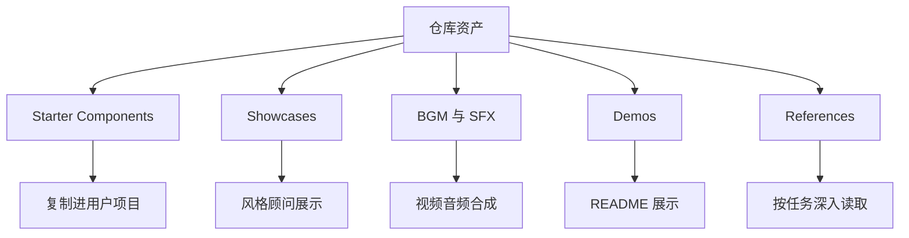

<details>
<summary>相关源文件</summary>

生成本页时使用的主要源文件：

- [README.md](../../../project-repos/huashu-design/README.md)
- [README.en.md](../../../project-repos/huashu-design/README.en.md)
- [LICENSE](../../../project-repos/huashu-design/LICENSE)
- [.gitignore](../../../project-repos/huashu-design/.gitignore)
- [assets/personal-asset-index.example.json](../../../project-repos/huashu-design/assets/personal-asset-index.example.json)
- [references/sfx-library.md](../../../project-repos/huashu-design/references/sfx-library.md)
- [00-repo-inventory.md](../00-repo-inventory.md)

</details>

# 仓库资产、分发边界与授权

仓库包含大量静态资产：`assets/` 下有 starter components、showcases、BGM/SFX、示例素材索引；`demos/` 下有能力演示 HTML；`references/` 下有任务型规则文档。清单统计扫描到 155 个文件，其中 HTML、MP3、Markdown、PNG 占比最高。Sources: [00-repo-inventory.md:10-28](../00-repo-inventory.md#L10-L28), [README.md:248-281](../../../project-repos/huashu-design/README.md#L248-L281)

<details class="source-snippets">
<summary>引用源码</summary>

<!-- source-snippets:start -->

#### `00-repo-inventory.md:10-28`

```markdown
## File Summary

- Files scanned: 155
- Top-level directories: `assets`, `demos`, `references`, `scripts`

| Extension | Count |
|-----------|------:|
| `.html` | 44 |
| `.mp3` | 43 |
| `.md` | 24 |
| `.png` | 24 |
| `.jsx` | 6 |
| `.js` | 3 |
| `.mjs` | 3 |
| `[no extension]` | 2 |
| `.json` | 2 |
| `.sh` | 2 |
| `.svg` | 1 |
| `.py` | 1 |
```

#### `README.md:248-281`

````markdown
## 仓库结构

```
huashu-design/
├── SKILL.md                 # 主文档（给 agent 读）
├── README.md                # 本文件（给用户读）
├── assets/                  # Starter Components
│   ├── animations.jsx       # Stage + Sprite + Easing + interpolate
│   ├── ios_frame.jsx        # iPhone 15 Pro bezel
│   ├── android_frame.jsx
│   ├── macos_window.jsx
│   ├── browser_window.jsx
│   ├── deck_stage.js        # HTML 幻灯片引擎
│   ├── deck_index.html      # 多文件 deck 拼接器
│   ├── design_canvas.jsx    # 并排变体展示
│   ├── showcases/           # 24 个预制样例（8 场景 × 3 风格）
│   └── bgm-*.mp3            # 6 首场景化背景音乐
├── references/              # 按任务深入读的子文档
│   ├── animation-pitfalls.md
│   ├── design-styles.md     # 20 种设计哲学详细库
│   ├── slide-decks.md
│   ├── editable-pptx.md
│   ├── critique-guide.md
│   ├── video-export.md
│   └── ...
├── scripts/                 # 导出工具链
│   ├── render-video.js      # HTML → MP4
│   ├── convert-formats.sh   # MP4 → 60fps + GIF
│   ├── add-music.sh         # MP4 + BGM
│   ├── export_deck_pdf.mjs
│   ├── export_deck_pptx.mjs
│   ├── html2pptx.js
│   └── verify.py
└── demos/                   # 9 个能力演示 (c*/w*)，中英双版 GIF/MP4/HTML + hero v10
````

<!-- source-snippets:end -->
</details>
## 资产分类



Sources: [README.md:248-281](../../../project-repos/huashu-design/README.md#L248-L281), [assets/showcases/INDEX.md:1-34](../../../project-repos/huashu-design/assets/showcases/INDEX.md#L1-L34), [references/sfx-library.md:1-26](../../../project-repos/huashu-design/references/sfx-library.md#L1-L26), [SKILL.md:724-748](../../../project-repos/huashu-design/SKILL.md#L724-L748)

<details class="source-snippets">
<summary>引用源码</summary>

<!-- source-snippets:start -->

#### `README.md:248-281`

````markdown
## 仓库结构

```
huashu-design/
├── SKILL.md                 # 主文档（给 agent 读）
├── README.md                # 本文件（给用户读）
├── assets/                  # Starter Components
│   ├── animations.jsx       # Stage + Sprite + Easing + interpolate
│   ├── ios_frame.jsx        # iPhone 15 Pro bezel
│   ├── android_frame.jsx
│   ├── macos_window.jsx
│   ├── browser_window.jsx
│   ├── deck_stage.js        # HTML 幻灯片引擎
│   ├── deck_index.html      # 多文件 deck 拼接器
│   ├── design_canvas.jsx    # 并排变体展示
│   ├── showcases/           # 24 个预制样例（8 场景 × 3 风格）
│   └── bgm-*.mp3            # 6 首场景化背景音乐
├── references/              # 按任务深入读的子文档
│   ├── animation-pitfalls.md
│   ├── design-styles.md     # 20 种设计哲学详细库
│   ├── slide-decks.md
│   ├── editable-pptx.md
│   ├── critique-guide.md
│   ├── video-export.md
│   └── ...
├── scripts/                 # 导出工具链
│   ├── render-video.js      # HTML → MP4
│   ├── convert-formats.sh   # MP4 → 60fps + GIF
│   ├── add-music.sh         # MP4 + BGM
│   ├── export_deck_pdf.mjs
│   ├── export_deck_pptx.mjs
│   ├── html2pptx.js
│   └── verify.py
└── demos/                   # 9 个能力演示 (c*/w*)，中英双版 GIF/MP4/HTML + hero v10
````

#### `assets/showcases/INDEX.md:1-34`

```markdown
# Design Philosophy Showcases — 样例资产索引

> 8 种场景 × 3 种风格 = 24 个预制设计样例
> 用于 Phase 3 推荐设计方向时，直接展示「这个风格做出来长什么样」

## 风格说明

| 代号 | 流派 | 风格名称 | 视觉气质 |
|------|------|---------|---------|
| **Pentagram** | 信息建筑派 | Pentagram / Michael Bierut | 黑白克制、瑞士网格、强字体层级、#E63946红色强调 |
| **Build** | 极简主义派 | Build Studio | 奢侈品级留白(70%+)、微妙字重(200-600)、#D4A574暖金、精致 |
| **Takram** | 东方哲学派 | Takram | 柔和科技感、自然色(米色/灰/绿)、圆角、图表如艺术 |

## 场景速查表

### 内容设计场景

| # | 场景 | 规格 | Pentagram | Build | Takram |
|---|------|------|-----------|-------|--------|
| 1 | 公众号封面 | 1200×510 | `cover/cover-pentagram` | `cover/cover-build` | `cover/cover-takram` |
| 2 | PPT数据页 | 1920×1080 | `ppt/ppt-pentagram` | `ppt/ppt-build` | `ppt/ppt-takram` |
| 3 | 竖版信息图 | 1080×1920 | `infographic/infographic-pentagram` | `infographic/infographic-build` | `infographic/infographic-takram` |

### 网站设计场景

| # | 场景 | 规格 | Pentagram | Build | Takram |
|---|------|------|-----------|-------|--------|
| 4 | 个人主页 | 1440×900 | `website-homepage/homepage-pentagram` | `website-homepage/homepage-build` | `website-homepage/homepage-takram` |
| 5 | AI导航站 | 1440×900 | `website-ai-nav/ainav-pentagram` | `website-ai-nav/ainav-build` | `website-ai-nav/ainav-takram` |
| 6 | AI写作工具 | 1440×900 | `website-ai-writing/aiwriting-pentagram` | `website-ai-writing/aiwriting-build` | `website-ai-writing/aiwriting-takram` |
| 7 | SaaS落地页 | 1440×900 | `website-saas/saas-pentagram` | `website-saas/saas-build` | `website-saas/saas-takram` |
| 8 | 开发者文档 | 1440×900 | `website-devdocs/devdocs-pentagram` | `website-devdocs/devdocs-build` | `website-devdocs/devdocs-takram` |

> 每个条目同时有 `.html`（源码）和 `.png`（截图）两个文件
```

#### `references/sfx-library.md:1-26`

````markdown
# SFX Library · huashu-design

> 全部由 ElevenLabs Sound Generation API 生成，苹果发布会级音质。
> 产品级 SFX 资产库，覆盖花叔动画/演示/产品 Demo 全场景。

**资产位置**：`assets/sfx/<category>/<name>.mp3`
**总数**：37 个 SFX（30 批量生成 + 7 个 v7b 保留）
**生成模型**：ElevenLabs Sound Generation API（prompt_influence 0.4）
**音质**：44.1kHz MP3，苹果发布会级清晰度，无额外混响

---

## 目录结构

```
assets/sfx/
├── keyboard/      type, type-fast, delete-key, space-tap, enter
├── ui/            click, click-soft, focus, hover-subtle, tap-finger, toggle-on
├── transition/    whoosh, whoosh-fast, swipe-horizontal, slide-in, dissolve
├── container/     card-snap, card-flip, stack-collapse, modal-open
├── feedback/      success-chime, error-tone, notification-pop, achievement
├── progress/      loading-tick, complete-done, generate-start
├── impact/        logo-reveal, logo-reveal-v2, brand-stamp, drop-thud
├── magic/         sparkle, ai-process, transform
└── terminal/      command-execute, output-appear, cursor-blink
```
````

#### `SKILL.md:724-748`

```markdown
## References路由表

根据任务类型深入读对应references：

| 任务 | 读 |
|------|-----|
| 开工前问问题、定方向 | `references/workflow.md` |
| 反AI slop、内容规范、scale | `references/content-guidelines.md` |
| React+Babel项目setup | `references/react-setup.md` |
| 做幻灯片 | `references/slide-decks.md` + `assets/deck_stage.js` |
| 导出可编辑 PPTX（html2pptx 4 条硬约束） | `references/editable-pptx.md` + `scripts/html2pptx.js` |
| 做动画/motion（**先读 pitfalls**）| `references/animation-pitfalls.md` + `references/animations.md` + `assets/animations.jsx` |
| **动画的正向设计语法**（Anthropic 级叙事/运动/节奏/表达风格）| `references/animation-best-practices.md`（5 段叙事+Expo easing+运动语言 8 条+3 种场景配方）|
| 做Tweaks实时调参 | `references/tweaks-system.md` |
| 没有design context怎么办 | `references/design-context.md`（薄 fallback） 或 `references/design-styles.md`（厚 fallback：20 种设计哲学详细库） |
| **需求模糊要推荐风格方向** | `references/design-styles.md`（20 种风格+AI prompt 模板）+ `assets/showcases/INDEX.md`（24 个预制样例） |
| **按输出类型查场景模板**（封面/PPT/信息图） | `references/scene-templates.md` |
| 输出完后验证 | `references/verification.md` + `scripts/verify.py` |
| **设计评审/打分**（设计完成后可选） | `references/critique-guide.md`（5 维度评分+常见问题清单） |
| **动画导出MP4/GIF/加BGM** | `references/video-export.md` + `scripts/render-video.js` + `scripts/convert-formats.sh` + `scripts/add-music.sh` |
| **动画加音效SFX**（苹果发布会级，37个预制） | `references/sfx-library.md` + `assets/sfx/<category>/*.mp3` |
| **动画音频配置规则**（SFX+BGM双轨制、黄金配比、ffmpeg模板、场景配方） | `references/audio-design-rules.md` |
| **Apple画廊展示风格**（3D倾斜+悬浮卡片+缓慢pan+焦点切换，v9实战同款） | `references/apple-gallery-showcase.md` |
| **Gallery Ripple + Multi-Focus 场景哲学**（当素材 20+ 同质+场景需表达「规模×深度」时优先用；含前置条件、技术配方、5 个可复用模式）| `references/hero-animation-case-study.md`（huashu-design hero v9 蒸馏）|

```

<!-- source-snippets:end -->
</details>
## 授权模型

`LICENSE` 是 Personal Use License：个人学习研究、个人创作、非营利分享和个人派生可以免费使用；公司、团队、工作室、机构集成到内部工具链或对外产品，将产物作为付费客户交付手段，或做商业软件/付费培训，都必须事先获得书面授权。Sources: [LICENSE:1-25](../../../project-repos/huashu-design/LICENSE#L1-L25), [README.md:296-306](../../../project-repos/huashu-design/README.md#L296-L306)

<details class="source-snippets">
<summary>引用源码</summary>

<!-- source-snippets:start -->

#### `LICENSE:1-25`

```
Huashu Design · Personal Use License
Copyright (c) 2026 alchaincyf (花叔 · 花生)

本 skill（以下简称「本作品」）包含 SKILL.md、scripts、references、assets、demos 及其全部派生内容。使用本作品视为同意以下条款：

---

## 1. 允许的使用（个人免费）

以下场景无需授权、无需打招呼：

- **学习与研究**：阅读代码、修改、二次开发用于自己理解
- **个人创作**：为自己的文章、视频、副业项目、小红书/公众号/B站等内容创作使用
- **非营利分享**：基于本作品做 demo、教程，发布到社交平台、博客、播客
- **派生作品**：在自己名下的个人仓库里基于本作品做派生 skill，需在 README 显著位置注明来源（`Derived from alchaincyf/huashu-design`）

## 2. 禁止的使用（必须事先授权）

以下场景**必须联系花生获得书面授权后方可使用**：

- 任何**公司、团队、工作室、机构**将本作品集成到其内部工具链或对外产品
- 将本作品或其派生物作为**面向付费客户的交付手段**（包括设计外包、品牌咨询、B 端 SaaS 等）
- 基于本作品做**商业软件产品**、付费模板、付费订阅服务
- 以**营利为目的**的培训课程、商业工作坊、闭门付费社群
- 在**商单创作**（乙方向甲方交付物）中使用本作品生成的内容
```

#### `README.md:296-306`

```markdown
## License · 使用授权

**个人使用免费、自由**——学习、研究、创作、给自己做东西、写文章、做副业、发微博发公众号，随便用，不用打招呼。

**企业商用禁止**——任何公司、团队、或以盈利为目的的组织，想把本 skill 集成到产品、对外服务、给客户交付工作中使用，**必须先和花生联系获得授权**。包括但不限于：
- 把 skill 作为公司内部工具链的一部分
- 把 skill 产出物作为对外交付物的主要创作手段
- 基于 skill 二次开发做成商业产品
- 在客户商单项目中使用

**商用授权联系方式**见下方社交平台。
```

<!-- source-snippets:end -->
</details>
## 隐私与分发边界

仓库提供个人素材索引模板，但真实个人数据必须放在私有路径；`.gitignore` 明确忽略真实 `assets/personal-asset-index.json`。这与 skill 的真实素材优先原则并不冲突：模板分发，真实数据由用户本地维护。Sources: [assets/personal-asset-index.example.json:1-71](../../../project-repos/huashu-design/assets/personal-asset-index.example.json#L1-L71), [gitignore:9-10](../../../project-repos/huashu-design/gitignore#L9-L10), [SKILL.md:458-462](../../../project-repos/huashu-design/SKILL.md#L458-L462)

<details class="source-snippets">
<summary>引用源码</summary>

<!-- source-snippets:start -->

#### `assets/personal-asset-index.example.json:1-71`

```json
{
  "_meta": {
    "description": "个人素材索引模板 — 复制此文件并填入你的真实数据",
    "how_to_use": "1. 复制此文件到 ~/.claude/memory/personal-asset-index.json  2. 填入你的真实信息  3. design-philosophy skill 会自动读取",
    "note": "真实数据文件不要放在 skill 目录内，避免随 skill 分发泄露隐私"
  },

  "identity": {
    "real_name": "你的真名",
    "pen_names": ["笔名1", "笔名2"],
    "english_name": "English Name",
    "title": "你的头衔/一句话介绍",
    "bio_short": "50-100字简介",
    "bio_long": "200-300字详细介绍",
    "avatar_url": "头像URL",
    "source": "数据来源备注"
  },

  "contact": {
    "email": "your@email.com",
    "wechat_personal": "微信号",
    "source": "数据来源备注"
  },

  "social_media": {
    "github": {
      "url": "https://github.com/yourname",
      "username": "yourname"
    },
    "youtube": {
      "url": "https://www.youtube.com/@YourChannel",
      "channel_name": "频道名"
    },
    "source": "数据来源备注"
  },

  "websites": {
    "main_site": {
      "url": "https://yoursite.com",
      "description": "网站描述",
      "local_path": "/path/to/local/project/"
    }
  },

  "products": {
    "product_1": {
      "name": "产品名",
      "type": "iOS App / Web App / CLI Tool / 电子书",
      "achievement": "主要成就",
      "icon_path": "/path/to/icon.png",
      "project_path": "/path/to/project/"
    }
  },

  "stats": {
    "social_followers": "粉丝数",
    "product_users": "用户数",
    "source": "数据来源备注"
  },

  "design_assets": {
    "article_images": {
      "base_path": "/path/to/images/",
      "notable_sets": []
    }
  },

  "knowledge_base": {
    "wechat_articles": "/path/to/knowledge_base/"
  }
}
```

#### `gitignore:9-10`

> 未找到引用文件：`gitignore`

#### `SKILL.md:458-462`

```markdown
**真实素材优先原则**（涉及用户本人/产品时）：
1. 先查用户配置的**私有 memory 路径**下的 `personal-asset-index.json`（Claude Code 默认在 `~/.claude/memory/`；其他 agent 按其自身约定）
2. 首次使用：复制 `assets/personal-asset-index.example.json` 到上述私有路径，填入真实数据
3. 找不到就直接问用户要，不要编造——真实数据文件不要放在 skill 目录内避免随分发泄露隐私

```

<!-- source-snippets:end -->
</details>
## 运维和安全观察

仓库没有 CI、manifest 或自动测试目录，验证主要由 `scripts/verify.py`、`test-prompts.json` 和人工 Playwright 流程承担。对于维护者，新增脚本或资产时应注意不要把临时录制目录、验证截图、私有素材或商业授权外的第三方资产误提交。Sources: [00-repo-inventory.md:30-49](../00-repo-inventory.md#L30-L49), [gitignore:5-23](../../../project-repos/huashu-design/gitignore#L5-L23), [scripts/verify.py:1-15](../../../project-repos/huashu-design/scripts/verify.py#L1-L15), [test-prompts.json:1-38](../../../project-repos/huashu-design/test-prompts.json#L1-L38)

<details class="source-snippets">
<summary>引用源码</summary>

<!-- source-snippets:start -->

#### `00-repo-inventory.md:30-49`

```markdown
## Manifests and Build Files

- None detected

## Documentation

- `README.en.md`
- `README.md`

## CI and Automation

- None detected

## Tests

- None detected

## Skills

- None detected
```

#### `gitignore:5-23`

> 未找到引用文件：`gitignore`

#### `scripts/verify.py:1-15`

```python
#!/usr/bin/env python3
"""
verify.py — Playwright封装，用于验证claude-design产出的HTML

Usage:
    python verify.py path/to/design.html                    # 基础：打开+截图+抓控制台错误
    python verify.py design.html --viewports 1920x1080,375x667  # 多viewport
    python verify.py deck.html --slides 10                  # 幻灯片逐页截（前10张）
    python verify.py design.html --output ./screenshots/   # 输出目录
    python verify.py design.html --show                    # 非headless，打开真实浏览器

依赖：
    pip install playwright
    playwright install chromium
"""
```

#### `test-prompts.json:1-38`

```json
[
  {
    "id": 1,
    "prompt": "我想做一个SaaS产品的登录页面，给我3个风格方向对比看看",
    "expected": "触发clarifying questions问design context/brand；产出3个variation的design_canvas；不用紫渐变/emoji/Inter等AI slop；有具体理由说明每个variation的差异维度",
    "tests": "workflow问问题 + variations逻辑 + 反AI slop清单 + design_canvas使用"
  },
  {
    "id": 2,
    "prompt": "帮我做一份10页的产品pitch deck，讲一个AI工具的创业项目",
    "expected": "用deck_stage.js起手；先口头vocalize设计系统（色彩/字型/layout节奏）等确认；Section divider/content/data/quote多种layout交替；字号≥24px；1-indexed labels",
    "tests": "Junior Designer先汇报再做 + deck_stage使用 + 视觉节奏 + scale规范"
  },
  {
    "id": 3,
    "prompt": "做个30秒的HTML动画，讲神经网络怎么工作",
    "expected": "用animations.jsx的Stage+Sprite；先写时间轴再写组件；入场easeOut出场easeIn；分phase讲故事而不是堆动画；文字停留≥3秒",
    "tests": "animations工作流 + easing正确 + 节奏设计 + 时长控制"
  },
  {
    "id": 4,
    "prompt": "做一个 Habit Tracker App 原型",
    "expected": "问用户要 overview 平铺 or flow demo（默认走 overview）；用 assets/ios_frame.jsx，不手写 Dynamic Island；Tracker 属高密度型，每屏 ≥ 3 处信息密度元素（习惯完成率、连续天数、趋势曲线、成就badge等，非装饰）；至少 5-7 屏并排（首页/新建习惯/详情/统计/设置）",
    "tests": "overview/flow 形态路由 + ios_frame 硬绑定 + 信息密度分型（高密度型）+ 多屏并排"
  },
  {
    "id": 5,
    "prompt": "做一个读书笔记 App 原型",
    "expected": "overview 平铺为主；ios_frame.jsx；读书笔记偏内容展示类，信息密度要求不如 Tracker 极端，但笔记列表页仍需 ≥ 3 层信息（书籍、引文、标签、进度）；至少 4-6 屏（首页书架/笔记详情/标注高亮/搜索/笔记本管理）；字体优先 serif display",
    "tests": "overview 默认 + ios_frame + 信息层次 + 内容为主的视觉节奏"
  },
  {
    "id": 6,
    "prompt": "做一个跑步记录 App 原型",
    "expected": "overview 平铺；ios_frame.jsx；跑步 App 属高密度型（地图、配速曲线、心率区间、每公里分段数据），每屏 ≥ 3 处产品差异化信息；至少 5 屏（今日总览/跑步中实时数据/路线地图/历史记录/月度统计）；避免撞 AI slop（不用紫渐变、不堆装饰 icon，但数据可视化 icon 允许保留）",
    "tests": "overview + ios_frame + 高密度型数据可视化 + 地图/图表混排 + slop 边界条件"
  }
]
```

<!-- source-snippets:end -->
</details>
## 相关页面

- [项目概览](overview.md)
- [Motion、视频导出与音频系统](motion-video-audio.md)
- [工作流、质量门与测试提示](workflow-quality.md)
