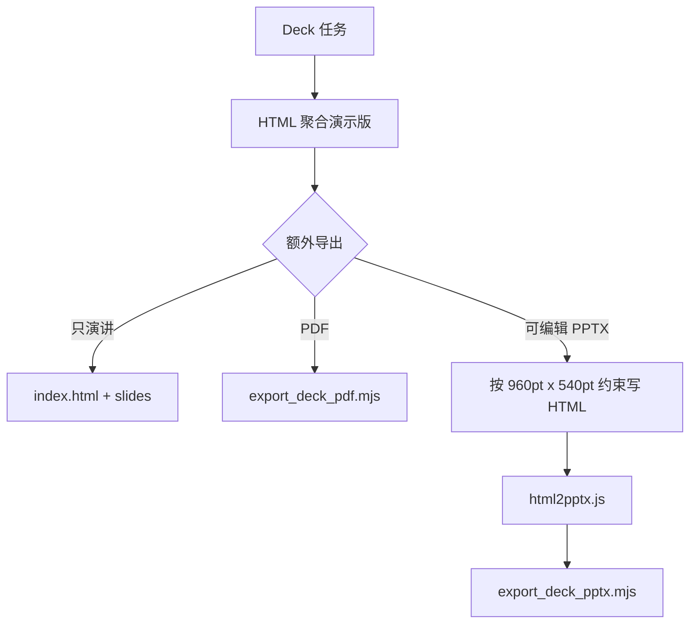

<details>
<summary>相关源文件</summary>

生成本页时使用的主要源文件：

- [references/slide-decks.md](../../../project-repos/huashu-design/references/slide-decks.md)
- [references/editable-pptx.md](../../../project-repos/huashu-design/references/editable-pptx.md)
- [assets/deck_index.html](../../../project-repos/huashu-design/assets/deck_index.html)
- [assets/deck_stage.js](../../../project-repos/huashu-design/assets/deck_stage.js)
- [scripts/html2pptx.js](../../../project-repos/huashu-design/scripts/html2pptx.js)
- [scripts/export_deck_pptx.mjs](../../../project-repos/huashu-design/scripts/export_deck_pptx.mjs)

</details>

# 幻灯片、PDF 与可编辑 PPTX 管线

幻灯片体系采用 HTML-first：无论最终要 HTML、PDF 还是 PPTX，都先产出浏览器可演示的 HTML 聚合版；PDF/PPTX 只是从 HTML 派生的快照或可编辑文档。Sources: [references/slide-decks.md:5-18](../../../project-repos/huashu-design/references/slide-decks.md#L5-L18), [SKILL.md:609-614](../../../project-repos/huashu-design/SKILL.md#L609-L614)

<details class="source-snippets">
<summary>引用源码</summary>

<!-- source-snippets:start -->

#### `references/slide-decks.md:5-18`

```markdown
**本 skill 的能力覆盖**：
- **HTML 演示版（基础产物，永远默认必做）** → 每页独立 HTML + `assets/deck_index.html` 聚合，浏览器里键盘翻页、全屏演讲
- HTML → PDF 导出 → `scripts/export_deck_pdf.mjs` / `scripts/export_deck_stage_pdf.mjs`
- HTML → 可编辑 PPTX 导出 → `references/editable-pptx.md` + `scripts/html2pptx.js` + `scripts/export_deck_pptx.mjs`（要求 HTML 按 4 条硬约束写）

> **⚠️ HTML 是基础，PDF/PPTX 是衍生物。** 不管最终交付什么格式，都**必须**先做 HTML 聚合演示版（`index.html` + `slides/*.html`），它是幻灯片作品的「源」。PDF/PPTX 是从 HTML 一行命令导出的快照。
>
> **为什么 HTML 优先**：
> - 演讲/演示现场最好用（投影仪 / 共享屏幕直接全屏，键盘翻页，不依赖 Keynote/PPT 软件）
> - 开发过程中每页可单独双击打开验证，不用每次重新跑导出
> - 是 PDF/PPTX 导出的唯一上游（避免「导出后才发现要改 HTML 又要重出」的死循环）
> - 交付物可以是「HTML + PDF」或「HTML + PPTX」双份，接收方爱用哪个用哪个
>
> 2026-04-22 moxt brochure 实测：做完 13 页 HTML + index.html 聚合后，`export_deck_pdf.mjs` 一行导出 PDF，零改动。HTML 版本身就是可直接浏览器演讲的交付物。
```

#### `SKILL.md:609-614`

```markdown
   - 🛑 **幻灯片/PPT 任务：HTML 聚合演示版永远是默认基础产物**（不管用户最终要什么格式）：
     - **必做**：每页独立 HTML + `assets/deck_index.html` 聚合（重命名为 `index.html`，编辑 MANIFEST 列所有页），浏览器里键盘翻页、全屏演讲——这是幻灯片作品的"源"
     - **可选导出**：额外询问是否需要 PDF（`export_deck_pdf.mjs`）或可编辑 PPTX（`export_deck_pptx.mjs`）作为衍生物
     - **只有要可编辑 PPTX 时**，HTML 必须从第一行就按 4 条硬约束写（见 `references/editable-pptx.md`）；事后补救会 2-3 小时返工
     - **≥ 5 页 deck 必须先做 2 页 showcase 定 grammar 再批量推**（见 `references/slide-decks.md` 的「批量制作前先做 showcase」章节）——跳过这步 = 方向错返工 N 次而非 2 次
     - 详见 `references/slide-decks.md` 开头「HTML 优先架构 + 交付格式决策树」
```

<!-- source-snippets:end -->
</details>

## 交付格式决策树

`references/slide-decks.md` 要求开工前确认是否需要 PDF 或可编辑 PPTX，因为 PPTX 路径会反过来约束 HTML 写法：可编辑 PPTX 必须从第一行开始遵守 html2pptx 的 4 条约束，否则事后补救会返工。Sources: [references/slide-decks.md:22-85](../../../project-repos/huashu-design/references/slide-decks.md#L22-L85), [references/editable-pptx.md:1-8](../../../project-repos/huashu-design/references/editable-pptx.md#L1-L8)

<details class="source-snippets">
<summary>引用源码</summary>

<!-- source-snippets:start -->

#### `references/slide-decks.md:22-85`

````markdown
## 🛑 开工前先确认交付格式（最硬的 checkpoint）

**这个决策比「单文件还是多文件」更先。** 2026-04-20 期权私董会项目实测：**不在动手前确认交付格式 = 2-3 小时返工。**

### 决策树（HTML-first 架构）

所有交付都从同一套 HTML 聚合页（`index.html` + `slides/*.html`）开始。交付格式只决定 **HTML 的写法约束** 和 **导出命令**：

```
【永远默认 · 必做】 HTML 聚合演示版（index.html + slides/*.html）
   │
   ├── 只要浏览器演讲 / 本地 HTML 存档   → 到这里已经完成，HTML 视觉自由度最大
   │
   ├── 还要 PDF（打印 / 发群 / 存档）     → 跑 export_deck_pdf.mjs 一键出
   │                                          HTML 写法自由，视觉无约束
   │
   └── 还要可编辑 PPTX（同事要改文字）    → 从第一行 HTML 就按 4 条硬约束写
                                              跑 export_deck_pptx.mjs 一键出
                                              牺牲渐变 / web component / 复杂 SVG
```

### 开工话术（抄走即用）

> 不管最后交付是 HTML、PDF 还是 PPTX，我都会先做一个可在浏览器里切换和演讲的 HTML 聚合版（`index.html` 加键盘翻页）——这是永远的默认基础产物。在此之上再问你要不要额外出 PDF / PPTX 的快照。
>
> 你需要哪个导出格式？
> - **只要 HTML**（演讲/存档）→ 视觉完全自由
> - **还要 PDF** → 同上，加一条导出命令
> - **还要可编辑 PPTX**（同事会在 PPT 里改文字）→ 我必须从第一行 HTML 就按 4 条硬约束写，会牺牲一些视觉能力（无渐变、无 web component、无复杂 SVG）。

### 为什么「要 PPTX 就得从头走 4 条硬约束」

PPTX 可编辑的前提是 `html2pptx.js` 能把 DOM 逐元素翻译为 PowerPoint 对象。它需要 **4 条硬约束**：

1. body 固定 960pt × 540pt（匹配 `LAYOUT_WIDE`，13.333″ × 7.5″，不是 1920×1080px）
2. 所有文字包在 `<p>`/`<h1>`-`<h6>` 里（禁止 div 直接放文字，禁止用 `<span>` 承载主文字）
3. `<p>`/`<h*>` 自身不能有 background/border/shadow（放外层 div）
4. `<div>` 不能用 `background-image`（用 `` 标签）
5. 不用 CSS gradient、不用 web component、不用复杂 SVG 装饰

**本 skill 默认的 HTML 视觉自由度高**——大量 span、嵌套 flex、复杂 SVG、web component（如 `<deck-stage>`）、CSS 渐变——**几乎没有一条能天然过 html2pptx 的约束**（实测视觉驱动的 HTML 直接上 html2pptx，pass 率 < 30%）。

### 两条真实路径的代价对比（2026-04-20 真实踩坑）

| 路径 | 做法 | 结果 | 代价 |
|------|------|------|------|
| ❌ **先自由写 HTML，事后补救 PPTX** | 单文件 deck-stage + 大量 SVG/span 装饰 | 要可编辑 PPTX 只剩两条路：<br>A. 手写 pptxgenjs 几百行 hardcode 坐标<br>B. 重写 17 页 HTML 成 Path A 格式 | 2-3 小时返工，且手写版**维护成本永续**（HTML 改一个字，PPTX 要再人肉同步） |
| ✅ **从第一步按 Path A 约束写** | 每页独立 HTML + 4 条硬约束 + 960×540pt | 一条命令导出 100% 可编辑 PPTX，同时也能浏览器全屏演讲（Path A HTML 就是浏览器可播放的标准 HTML） | 写 HTML 时多花 5 分钟想「文字怎么包进 `<p>`」，零返工 |

### 混合交付怎么办

用户说「我要 HTML 演讲 **和** 可编辑 PPTX」——**这不是混合**，是 PPTX 需求覆盖 HTML 需求。按 Path A 写出来的 HTML 本身就能浏览器全屏演讲（加个 `deck_index.html` 拼接器就行）。**没有额外代价。**

用户说「我要 PPTX **和** 动画 / web component」——**这是真矛盾**。告诉用户：要可编辑 PPTX 就得牺牲这些视觉能力。让他做取舍，不要偷偷做手写 pptxgenjs 方案（会变成永续维护债）。

### 事后才知道要 PPTX 怎么办（紧急补救）

极个别情况：HTML 已经写好了才发现要 PPTX。推荐走 **fallback 流程**（完整说明见 `references/editable-pptx.md` 末尾「Fallback：已有视觉稿但用户坚持要 editable PPTX」）：

1. **首选：改出 PDF**（视觉 100% 保留，跨平台，接收方能看能印）—— 如果接收方实际需求是「演讲/存档」，PDF 就是最佳交付物
2. **次选：AI 以视觉稿为蓝本，重写一版 editable HTML** → 导出 editable PPTX —— 保留色彩/布局/文案的设计决策，牺牲渐变、web component、复杂 SVG 等视觉能力
3. **不推荐：手写 pptxgenjs 重建**——位置、字体、对齐都要手调，维护成本高，且后续 HTML 改一个字都得再人肉同步一次

永远把选择告诉用户，让他决定。**永远不要第一反应就开始手写 pptxgenjs**——那是最后的兜底手段。
````

#### `references/editable-pptx.md:1-8`

```markdown
# 可编辑 PPTX 导出：HTML 硬约束 + 尺寸决策 + 常见错误

本文档讲的是**用 `scripts/html2pptx.js` + `pptxgenjs` 把 HTML 逐元素翻译成真·可编辑 PowerPoint 文本框**的路径，也是 `export_deck_pptx.mjs` 唯一支持的路径。

> **核心前提**：要走这条路，HTML 必须从第一行就按下面 4 条约束写。**不是写完再转**——事后补救会触发 2-3 小时返工（2026-04-20 期权私董会项目实测踩坑）。
>
> 视觉自由度优先的场景（动画 / web component / CSS 渐变 / 复杂 SVG）请改走 PDF 路径（`export_deck_pdf.mjs` / `export_deck_stage_pdf.mjs`），**不要**指望 pptx 导出能兼得视觉保真和可编辑——这是 PPTX 文件格式本身的物理约束（见文末「为什么 4 条约束不是 Bug 而是物理约束」）。

```

<!-- source-snippets:end -->
</details>



Sources: [references/slide-decks.md:26-41](../../../project-repos/huashu-design/references/slide-decks.md#L26-L41), [references/editable-pptx.md:11-38](../../../project-repos/huashu-design/references/editable-pptx.md#L11-L38), [scripts/export_deck_pptx.mjs:1-24](../../../project-repos/huashu-design/scripts/export_deck_pptx.mjs#L1-L24)

<details class="source-snippets">
<summary>引用源码</summary>

<!-- source-snippets:start -->

#### `references/slide-decks.md:26-41`

````markdown
### 决策树（HTML-first 架构）

所有交付都从同一套 HTML 聚合页（`index.html` + `slides/*.html`）开始。交付格式只决定 **HTML 的写法约束** 和 **导出命令**：

```
【永远默认 · 必做】 HTML 聚合演示版（index.html + slides/*.html）
   │
   ├── 只要浏览器演讲 / 本地 HTML 存档   → 到这里已经完成，HTML 视觉自由度最大
   │
   ├── 还要 PDF（打印 / 发群 / 存档）     → 跑 export_deck_pdf.mjs 一键出
   │                                          HTML 写法自由，视觉无约束
   │
   └── 还要可编辑 PPTX（同事要改文字）    → 从第一行 HTML 就按 4 条硬约束写
                                              跑 export_deck_pptx.mjs 一键出
                                              牺牲渐变 / web component / 复杂 SVG
```
````

#### `references/editable-pptx.md:11-38`

````markdown
## 画布尺寸：用 960×540pt（LAYOUT_WIDE）

PPTX 单位是 **inch**（物理尺寸），不是 px。决策原则：body 的 computedStyle 尺寸要**匹配 presentation layout 的 inch 尺寸**（±0.1"，由 `html2pptx.js` 的 `validateDimensions` 强制检查）。

### 3 个候选尺寸对比

| HTML body | 物理尺寸 | 对应 PPT layout | 何时选 |
|---|---|---|---|
| **`960pt × 540pt`** | **13.333″ × 7.5″** | **pptxgenjs `LAYOUT_WIDE`** | ✅ **默认推荐**（现代 PowerPoint 16:9 标配） |
| `720pt × 405pt` | 10″ × 5.625″ | 自定义 | 仅当用户指定「老版 PowerPoint Widescreen」模板时 |
| `1920px × 1080px` | 20″ × 11.25″ | 自定义 | ❌ 非标尺寸，投影后字体显得异常小 |

**别把 HTML 尺寸当分辨率想。** PPTX 是矢量文档，body 尺寸决定的是**物理尺寸**不是清晰度。超大 body（20″×11.25″）不会让文字更清晰——只会让字号 pt 相对画布变小，投影/打印时反而更难看。

### body 写法三选一（等价）

```css
body { width: 960pt;  height: 540pt; }    /* 最清晰，推荐 */
body { width: 1280px; height: 720px; }    /* 等价，px 习惯 */
body { width: 13.333in; height: 7.5in; }  /* 等价，英寸直觉 */
```

配套的 pptxgenjs 代码：

```js
const pptx = new pptxgen();
pptx.layout = 'LAYOUT_WIDE';  // 13.333 × 7.5 inch, 无需自定义
```
````

#### `scripts/export_deck_pptx.mjs:1-24`

```javascript
#!/usr/bin/env node
/**
 * export_deck_pptx.mjs — 把多文件 slide deck 导出为可编辑 PPTX
 *
 * 用法：
 *   node export_deck_pptx.mjs --slides <dir> --out <file.pptx>
 *
 * 行为：
 *   - 调用 scripts/html2pptx.js 把 HTML DOM 逐元素翻译成 PowerPoint 原生对象
 *   - 文字是真文本框，PPT 里直接双击能编辑
 *   - body 尺寸 960pt × 540pt（LAYOUT_WIDE，13.333″ × 7.5″）
 *
 * ⚠️ HTML 必须符合 4 条硬约束（见 references/editable-pptx.md）：
 *   1. 文字包在 <p>/<h1>-<h6> 里（div 不能直接放文字）
 *   2. 不用 CSS 渐变
 *   3. <p>/<h*> 不能有 background/border/shadow（放外层 div）
 *   4. div 不能 background-image（用 ）
 *
 * 视觉驱动的 HTML 几乎无法 pass —— 必须从写 HTML 的第一行就按约束写。
 * 视觉自由度优先的场景（动画、web component、CSS 渐变、复杂 SVG）
 * 应改用 export_deck_pdf.mjs / export_deck_stage_pdf.mjs 导出 PDF。
 *
 * 依赖：npm install playwright pptxgenjs sharp
 *
```

<!-- source-snippets:end -->
</details>

## html2pptx 的物理约束

可编辑 PPTX 需要 `html2pptx.js` 把 DOM 元素翻译成 PowerPoint 原生对象。约束包括：body 尺寸匹配 `LAYOUT_WIDE`，文字必须在 `<p>` 或 heading 标签里，不支持 CSS 渐变，文字标签不能承载背景/边框/阴影，`div` 不能用 `background-image`。Sources: [references/editable-pptx.md:42-104](../../../project-repos/huashu-design/references/editable-pptx.md#L42-L104), [scripts/html2pptx.js:36-86](../../../project-repos/huashu-design/scripts/html2pptx.js#L36-L86), [scripts/html2pptx.js:88-118](../../../project-repos/huashu-design/scripts/html2pptx.js#L88-L118)

<details class="source-snippets">
<summary>引用源码</summary>

<!-- source-snippets:start -->

#### `references/editable-pptx.md:42-104`

````markdown
## 4 条硬约束（违反会直接报错）

`html2pptx.js` 把 HTML 的 DOM 逐元素翻译成 PowerPoint 对象。PowerPoint 的格式约束投射到 HTML 上 = 下面 4 条规则。

### 规则 1：DIV 里不能直接写文字 — 必须用 `<p>` 或 `<h1>`-`<h6>` 包裹

```html
<!-- ❌ 错误：文字直接在 div 里 -->
&lt;div class="title">Q3营收增长23%&lt;/div>

<!-- ✅ 正确：文字在 &lt;p> 或 &lt;h1>-&lt;h6> 里 -->
&lt;div class="title">&lt;h1>Q3营收增长23%&lt;/h1>&lt;/div>
&lt;div class="body">&lt;p>新用户是主要驱动力&lt;/p>&lt;/div>
```

**为什么**：PowerPoint 文本必须存在 text frame 里，text frame 对应 HTML 的段落级元素（p/h*/li）。裸 `<div>` 在 PPTX 里没有对应的文本容器。

**也不能用 `<span>` 承载主文字**——span 是行内元素，没法独立对齐成文本框。span 只能**夹在 p/h\* 里**做局部样式（加粗、换色）。

### 规则 2：不支持 CSS 渐变 — 只能用纯色

```css
/* ❌ 错误 */
background: linear-gradient(to right, #FF6B6B, #4ECDC4);

/* ✅ 正确：纯色 */
background: #FF6B6B;

/* ✅ 如果必须多色条纹，用 flex 子元素各自纯色 */
.stripe-bar { display: flex; }
.stripe-bar div { flex: 1; }
.red   { background: #FF6B6B; }
.teal  { background: #4ECDC4; }
```

**为什么**：PowerPoint 的 shape fill 只支持 solid/gradient-fill 两种，但 pptxgenjs 的 `fill: { color: ... }` 只映射 solid。渐变走 PowerPoint 原生 gradient 需要另写结构，目前工具链不支持。

### 规则 3：背景/边框/阴影只能在 DIV 上，不能在文字标签上

```html
<!-- ❌ 错误：&lt;p> 有背景色 -->
&lt;p style="background: #FFD700; border-radius: 4px;">重点内容&lt;/p>

<!-- ✅ 正确：外层 div 承载背景/边框，&lt;p> 只负责文字 -->
&lt;div style="background: #FFD700; border-radius: 4px; padding: 8pt 12pt;">
  &lt;p>重点内容&lt;/p>
&lt;/div>
```

**为什么**：PowerPoint 里 shape（方块/圆角矩形）和 text frame 是两个对象。HTML 的 `<p>` 只翻译成 text frame，背景/边框/阴影属于 shape——必须在**包裹 text 的 div** 上写。

### 规则 4：DIV 不能用 `background-image` — 用 `` 标签

```html
<!-- ❌ 错误 -->
&lt;div style="background-image: url('chart.png')">&lt;/div>

<!-- ✅ 正确 -->
&lt;img src="chart.png" style="position: absolute; left: 50%; top: 20%; width: 300pt; height: 200pt;" />
```

**为什么**：`html2pptx.js` 只从 `` 元素提取图片路径，不解析 CSS 的 `background-image` URL。

````

#### `scripts/html2pptx.js:36-86`

```javascript
// Helper: Get body dimensions and check for overflow
async function getBodyDimensions(page) {
  const bodyDimensions = await page.evaluate(() => {
    const body = document.body;
    const style = window.getComputedStyle(body);

    return {
      width: parseFloat(style.width),
      height: parseFloat(style.height),
      scrollWidth: body.scrollWidth,
      scrollHeight: body.scrollHeight
    };
  });

  const errors = [];
  const widthOverflowPx = Math.max(0, bodyDimensions.scrollWidth - bodyDimensions.width - 1);
  const heightOverflowPx = Math.max(0, bodyDimensions.scrollHeight - bodyDimensions.height - 1);

  const widthOverflowPt = widthOverflowPx * PT_PER_PX;
  const heightOverflowPt = heightOverflowPx * PT_PER_PX;

  if (widthOverflowPt > 0 || heightOverflowPt > 0) {
    const directions = [];
    if (widthOverflowPt > 0) directions.push(`${widthOverflowPt.toFixed(1)}pt horizontally`);
    if (heightOverflowPt > 0) directions.push(`${heightOverflowPt.toFixed(1)}pt vertically`);
    const reminder = heightOverflowPt > 0 ? ' (Remember: leave 0.5" margin at bottom of slide)' : '';
    errors.push(`HTML content overflows body by ${directions.join(' and ')}${reminder}`);
  }

  return { ...bodyDimensions, errors };
}

// Helper: Validate dimensions match presentation layout
function validateDimensions(bodyDimensions, pres) {
  const errors = [];
  const widthInches = bodyDimensions.width / PX_PER_IN;
  const heightInches = bodyDimensions.height / PX_PER_IN;

  if (pres.presLayout) {
    const layoutWidth = pres.presLayout.width / EMU_PER_IN;
    const layoutHeight = pres.presLayout.height / EMU_PER_IN;

    if (Math.abs(layoutWidth - widthInches) > 0.1 || Math.abs(layoutHeight - heightInches) > 0.1) {
      errors.push(
        `HTML dimensions (${widthInches.toFixed(1)}" × ${heightInches.toFixed(1)}") ` +
        `don't match presentation layout (${layoutWidth.toFixed(1)}" × ${layoutHeight.toFixed(1)}")`
      );
    }
  }
  return errors;
}
```

#### `scripts/html2pptx.js:88-118`

```javascript
function validateTextBoxPosition(slideData, bodyDimensions) {
  const errors = [];
  const slideHeightInches = bodyDimensions.height / PX_PER_IN;
  const minBottomMargin = 0.5; // 0.5 inches from bottom

  for (const el of slideData.elements) {
    // Check text elements (p, h1-h6, list)
    if (['p', 'h1', 'h2', 'h3', 'h4', 'h5', 'h6', 'list'].includes(el.type)) {
      const fontSize = el.style?.fontSize || 0;
      const bottomEdge = el.position.y + el.position.h;
      const distanceFromBottom = slideHeightInches - bottomEdge;

      if (fontSize > 12 && distanceFromBottom < minBottomMargin) {
        const getText = () => {
          if (typeof el.text === 'string') return el.text;
          if (Array.isArray(el.text)) return el.text.find(t => t.text)?.text || '';
          if (Array.isArray(el.items)) return el.items.find(item => item.text)?.text || '';
          return '';
        };
        const textPrefix = getText().substring(0, 50) + (getText().length > 50 ? '...' : '');

        errors.push(
          `Text box "${textPrefix}" ends too close to bottom edge ` +
          `(${distanceFromBottom.toFixed(2)}" from bottom, minimum ${minBottomMargin}" required)`
        );
      }
    }
  }

  return errors;
}
```

<!-- source-snippets:end -->
</details>

## 多文件优先

对 ≥10 页、课件、长 deck 或多 agent 并行场景，多文件 + `deck_index.html` 是推荐主路径；它通过 iframe 隔离 CSS/JS，使每页可单独打开验证，也降低多人/多 agent 修改冲突。Sources: [references/slide-decks.md:191-216](../../../project-repos/huashu-design/references/slide-decks.md#L191-L216), [assets/deck_index.html:6-27](../../../project-repos/huashu-design/assets/deck_index.html#L6-L27)

<details class="source-snippets">
<summary>引用源码</summary>

<!-- source-snippets:start -->

#### `references/slide-decks.md:191-216`

````markdown
## 🛑 先定架构：单文件 还是 多文件？

**这个选择是做幻灯片的第一步，错了会反复踩坑。先读完这一节再动手。**

### 两种架构对比

| 维度 | 单文件 + `deck_stage.js` | **多文件 + `deck_index.html` 拼接器** |
|------|--------------------------|--------------------------------------|
| 代码结构 | 一个 HTML，所有 slide 是 `<section>` | 每页独立 HTML，`index.html` 用 iframe 拼接 |
| CSS 作用域 | ❌ 全局，一页的样式可能影响所有页 | ✅ 天然隔离，iframe 各自一片天 |
| 验证粒度 | ❌ 要 JS goTo 才能切到某页 | ✅ 单页文件双击就能在浏览器看 |
| 并行开发 | ❌ 一个文件，多 agent 改会冲突 | ✅ 多 agent 可并行做不同页，零冲突 merge |
| 调试难度 | ❌ 一处 CSS 出错，全 deck 翻车 | ✅ 一页出错只影响自己 |
| 内嵌交互 | ✅ 跨页共享状态很简单 | 🟡 iframe 间需 postMessage |
| 打印 PDF | ✅ 内置 | ✅ 拼接器 beforeprint 遍历 iframe |
| 键盘导航 | ✅ 内置 | ✅ 拼接器内置 |

### 选哪个？（决策树）

```
│ 问：deck 预计有多少页？
├── ≤10 页、需要 in-deck 动画或跨页交互、pitch deck → 单文件
└── ≥10 页、学术讲座、课件、长 deck、多 agent 并行 → 多文件（推荐）
```

**默认走多文件路径**。它不是「备选」，是**长 deck 和团队协作的主路径**。原因：单文件架构的每一个优势（键盘导航、打印、scale）多文件都有，而多文件的作用域隔离和可验证性是单文件补不回来的。
````

#### `assets/deck_index.html:6-27`

```html
<!--
  deck_index.html — 多文件 slide deck 的拼接器

  配合「每页一个独立 HTML」架构使用。与单文件 deck_stage.js 对比：
  · 每页独立作用域（CSS/JS 都隔离），一页出 bug 不影响其他页
  · 单页可直接在浏览器打开验证，不依赖 JS goTo()
  · 多 agent 可并行做不同页，merge 时零冲突
  · 适合 ≥15 页的讲座/课件/长 deck

  用法：
    1. 把本文件复制到 deck 根目录，重命名 index.html
    2. 在同目录建 slides/ 子目录，放每一页独立 HTML
    3. 编辑下方 MANIFEST 数组，按顺序列出文件名和人类可读标签
    4. 每张 slide HTML 建议尺寸 1920×1080，自带背景/字体；不要依赖外层 CSS

  共享资源（如果需要）：
    · shared/tokens.css  — 跨页 CSS 变量（色板/字号）
    · shared/chrome.html — 页眉页脚可复用片段
    · 每页 HTML 自己 <link> 进去即可

  键盘：← / → / Space / PgUp / PgDown / Home / End / 1-9 跳页 / P 打印
-->
```

<!-- source-snippets:end -->
</details>

## 质量检查点

Deck ≥5 页时，规范要求先做 2 页视觉差异最大的 showcase 定 grammar，再批量推进剩余页面。这是为了把方向错误的返工从 N 页降低到 2 页。Sources: [references/slide-decks.md:89-100](../../../project-repos/huashu-design/references/slide-decks.md#L89-L100)

<details class="source-snippets">
<summary>引用源码</summary>

<!-- source-snippets:start -->

#### `references/slide-decks.md:89-100`

```markdown
## 🛑 批量制作前：先做 2 页 showcase 定 grammar

**只要 deck ≥ 5 页，绝对不能从第 1 页直接写到最后一页。** 2026-04-22 moxt brochure 实战验证的正确顺序：

1. 选 **2 个视觉差异最大的页面类型**先做 showcase（如「封面」+「情绪/引用页」，或「封面」+「产品展示页」）
2. 截图让用户确认 grammar（masthead / 字体 / 色 / 间距 / 结构 / 中英双语比例）
3. 方向通过了再批量推剩下 N-2 页，每页复用已建立的 grammar
4. 全部完成后一起合成 HTML 聚合 + PDF / PPTX 衍生物

**为什么**：直接写 13 页到底 → 用户说「方向不对」= 返工 13 次。先做 2 页 showcase → 方向错 = 返工 2 次。视觉 grammar 一旦确立，后续 N 页的决策空间大幅收窄，只剩「内容怎么放进去」。

**showcase 页选择原则**：选视觉结构最不一样的两页。这两页过了 = 其他中间态都能过。
```

<!-- source-snippets:end -->
</details>

## 相关页面

- [Starter Components 架构](starter-components.md)
- [工作流、质量门与测试提示](workflow-quality.md)
- [原型、Tweaks 与验证闭环](prototypes-tweaks-verification.md)
