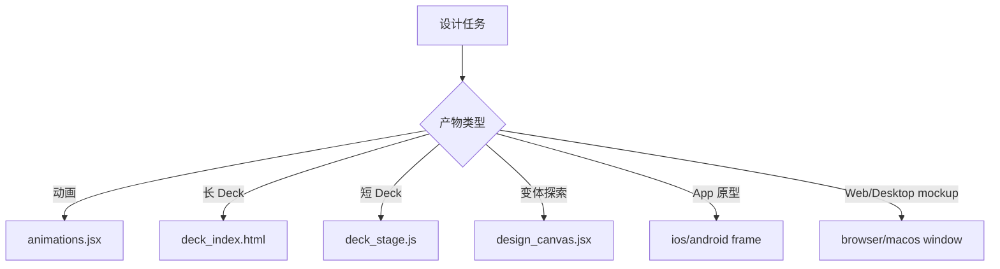

<details>
<summary>相关源文件</summary>

生成本页时使用的主要源文件：

- [assets/animations.jsx](../../../project-repos/huashu-design/assets/animations.jsx)
- [assets/deck_stage.js](../../../project-repos/huashu-design/assets/deck_stage.js)
- [assets/deck_index.html](../../../project-repos/huashu-design/assets/deck_index.html)
- [assets/design_canvas.jsx](../../../project-repos/huashu-design/assets/design_canvas.jsx)
- [assets/ios_frame.jsx](../../../project-repos/huashu-design/assets/ios_frame.jsx)
- [assets/android_frame.jsx](../../../project-repos/huashu-design/assets/android_frame.jsx)
- [assets/browser_window.jsx](../../../project-repos/huashu-design/assets/browser_window.jsx)
- [assets/macos_window.jsx](../../../project-repos/huashu-design/assets/macos_window.jsx)
- [SKILL.md](../../../project-repos/huashu-design/SKILL.md)

</details>

# Starter Components 架构

`assets/` 是 Huashu Design 的可复制起手组件层。主提示词要求使用者读取对应 assets 文件并 inline 到产物 HTML，而不是依赖打包系统。组件覆盖动画 Stage/Sprite、幻灯片外壳、多文件 deck 聚合器、变体画布和设备/浏览器窗口边框。Sources: [SKILL.md:703-723](../../../project-repos/huashu-design/SKILL.md#L703-L723), [README.md:254-264](../../../project-repos/huashu-design/README.md#L254-L264)

<details class="source-snippets">
<summary>引用源码</summary>

<!-- source-snippets:start -->

#### `SKILL.md:703-723`

```markdown
## Starter Components（assets/下）

造好的起手组件，直接copy进项目使用：

| 文件 | 何时用 | 提供 |
|------|--------|------|
| `deck_index.html` | **幻灯片的默认基础产物**（不管最终出 PDF 还是 PPTX，HTML 聚合版永远先做） | iframe拼接 + 键盘导航 + scale + 计数器 + 打印合并，每页独立HTML免CSS串扰。用法：复制为 `index.html`、编辑 MANIFEST 列出所有页、浏览器打开即成演示版 |
| `deck_stage.js` | 做幻灯片（单文件架构，≤10页） | web component：auto-scale + 键盘导航 + slide counter + localStorage + speaker notes ⚠️ **script 必须放在 `</deck-stage>` 之后，section 的 `display: flex` 必须写到 `.active` 上**，详见 `references/slide-decks.md` 的两个硬约束 |
| `scripts/export_deck_pdf.mjs` | **HTML→PDF 导出（多文件架构）** · 每页独立 HTML 文件，playwright 逐个 `page.pdf()` → pdf-lib 合并。文字保留矢量可搜。依赖 `playwright pdf-lib` |
| `scripts/export_deck_stage_pdf.mjs` | **HTML→PDF 导出（单文件 deck-stage 架构专用）** · 2026-04-20 新增。处理 shadow DOM slot 导致的「只出 1 页」、absolute 子元素溢出等坑。详见 `references/slide-decks.md` 末节。依赖 `playwright` |
| `scripts/export_deck_pptx.mjs` | **HTML→可编辑 PPTX 导出** · 调 `html2pptx.js` 导出原生可编辑文本框，文字在 PPT 里双击可直接编辑。**HTML 必须符合 4 条硬约束**（见 `references/editable-pptx.md`），视觉自由度优先的场景请改走 PDF 路径。依赖 `playwright pptxgenjs sharp` |
| `scripts/html2pptx.js` | **HTML→PPTX 元素级翻译器** · 读 computedStyle 把 DOM 逐元素翻译成 PowerPoint 对象（text frame / shape / picture）。`export_deck_pptx.mjs` 内部调用。要求 HTML 严格满足 4 条硬约束 |
| `design_canvas.jsx` | 并排展示≥2个静态variations | 带label的网格布局 |
| `animations.jsx` | 任何动画HTML | Stage + Sprite + useTime + Easing + interpolate |
| `ios_frame.jsx` | iOS App mockup | iPhone bezel + 状态栏 + 圆角 |
| `android_frame.jsx` | Android App mockup | 设备bezel |
| `macos_window.jsx` | 桌面App mockup | 窗口chrome + 红绿灯 |
| `browser_window.jsx` | 网页在浏览器里的样子 | URL bar + tab bar |

用法：读取对应 assets 文件内容 → inline 进你的 HTML `<script>` 标签 → slot 进你的设计。

```

#### `README.md:254-264`

```markdown
├── assets/                  # Starter Components
│   ├── animations.jsx       # Stage + Sprite + Easing + interpolate
│   ├── ios_frame.jsx        # iPhone 15 Pro bezel
│   ├── android_frame.jsx
│   ├── macos_window.jsx
│   ├── browser_window.jsx
│   ├── deck_stage.js        # HTML 幻灯片引擎
│   ├── deck_index.html      # 多文件 deck 拼接器
│   ├── design_canvas.jsx    # 并排变体展示
│   ├── showcases/           # 24 个预制样例（8 场景 × 3 风格）
│   └── bgm-*.mp3            # 6 首场景化背景音乐
```

<!-- source-snippets:end -->
</details>

## 组件边界

| 文件 | 角色 | 关键能力 |
|---|---|---|
| `assets/animations.jsx` | 动画运行时 | `Stage`, `Sprite`, `useTime`, `useSprite`, `Easing`, `interpolate` |
| `assets/deck_stage.js` | 单文件 deck web component | 固定画布、auto-scale、键盘导航、localStorage、打印支持 |
| `assets/deck_index.html` | 多文件 deck 聚合器 | iframe 拼接、键盘翻页、打印栈、独立页作用域 |
| `assets/design_canvas.jsx` | 变体展示 | 多 variation 网格、label、点击放大 |
| `assets/ios_frame.jsx` | iOS mockup | iPhone 15 Pro bezel、灵动岛、状态栏、Home Indicator |
| `assets/android_frame.jsx` | Android mockup | Pixel 风格 punch-hole、状态栏、导航条 |
| `assets/browser_window.jsx` | Web mockup | Chrome 风格 tab 与 URL bar |
| `assets/macos_window.jsx` | 桌面 mockup | macOS traffic lights 与窗口 chrome |

Sources: [assets/animations.jsx:1-25](../../../project-repos/huashu-design/assets/animations.jsx#L1-L25), [assets/deck_stage.js:1-28](../../../project-repos/huashu-design/assets/deck_stage.js#L1-L28), [assets/deck_index.html:6-27](../../../project-repos/huashu-design/assets/deck_index.html#L6-L27), [assets/design_canvas.jsx:1-25](../../../project-repos/huashu-design/assets/design_canvas.jsx#L1-L25), [assets/ios_frame.jsx:1-16](../../../project-repos/huashu-design/assets/ios_frame.jsx#L1-L16), [assets/android_frame.jsx:1-10](../../../project-repos/huashu-design/assets/android_frame.jsx#L1-L10), [assets/browser_window.jsx:1-10](../../../project-repos/huashu-design/assets/browser_window.jsx#L1-L10), [assets/macos_window.jsx:1-8](../../../project-repos/huashu-design/assets/macos_window.jsx#L1-L8)

<details class="source-snippets">
<summary>引用源码</summary>

<!-- source-snippets:start -->

#### `assets/animations.jsx:1-25`

```jsx
/**
 * animations.jsx — 时间轴动画引擎
 *
 * Stage + Sprite 模式，借鉴Remotion但轻量化。
 *
 * 导出（挂到 window.Animations）：
 * - Stage: 整个动画容器，提供时间+控制
 * - Sprite: 时间片段，start/end内显示，提供本地进度
 * - useTime(): 读全局时间（秒）
 * - useSprite(): 读本地进度 {t: 0→1, elapsed: seconds, duration: seconds}
 * - Easing: {linear, easeIn, easeOut, easeInOut, spring, anticipation}
 * - interpolate(t, [input0, input1], [output0, output1], easing?)
 *
 * 用法：
 *   <Stage duration={10}>
 *     <Sprite start={0} end={3}>
 *       <Title />
 *     </Sprite>
 *     <Sprite start={2} end={5}>
 *       <Subtitle />
 *     </Sprite>
 *   </Stage>
 *
 * 在Sprite子组件里用 useSprite() 读当前片段进度。
 */
```

#### `assets/deck_stage.js:1-28`

```javascript
/**
 * <deck-stage> — HTML幻灯片外壳web component
 *
 * 提供功能：
 * - 固定尺寸canvas（默认1920×1080）+ auto-scale + letterbox
 * - 键盘导航（←/→/Space/Home/End/Esc）
 * - 左右点击区域导航
 * - slide counter (当前/总数)
 * - localStorage持久化当前slide
 * - Speaker notes postMessage (支持外层渲染)
 * - Hash导航 (#slide-5 跳到第5张)
 * - Print-to-PDF支持 (Cmd+P / Ctrl+P 一页一slide)
 * - 自动给每个slide添加 data-screen-label
 *
 * 用法：
 *   <deck-stage>
 *     <section>Slide 1</section>
 *     <section>Slide 2</section>
 *   </deck-stage>
 *
 * 自定义尺寸：
 *   <deck-stage width="1080" height="1920">...</deck-stage>
 *
 * Speaker notes：在<head>加
 *   <script type="application/json" id="speaker-notes">
 *   ["slide 1 notes", "slide 2 notes"]
 *   </script>
 */
```

#### `assets/deck_index.html:6-27`

```html
<!--
  deck_index.html — 多文件 slide deck 的拼接器

  配合「每页一个独立 HTML」架构使用。与单文件 deck_stage.js 对比：
  · 每页独立作用域（CSS/JS 都隔离），一页出 bug 不影响其他页
  · 单页可直接在浏览器打开验证，不依赖 JS goTo()
  · 多 agent 可并行做不同页，merge 时零冲突
  · 适合 ≥15 页的讲座/课件/长 deck

  用法：
    1. 把本文件复制到 deck 根目录，重命名 index.html
    2. 在同目录建 slides/ 子目录，放每一页独立 HTML
    3. 编辑下方 MANIFEST 数组，按顺序列出文件名和人类可读标签
    4. 每张 slide HTML 建议尺寸 1920×1080，自带背景/字体；不要依赖外层 CSS

  共享资源（如果需要）：
    · shared/tokens.css  — 跨页 CSS 变量（色板/字号）
    · shared/chrome.html — 页眉页脚可复用片段
    · 每页 HTML 自己 <link> 进去即可

  键盘：← / → / Space / PgUp / PgDown / Home / End / 1-9 跳页 / P 打印
-->
```

#### `assets/design_canvas.jsx:1-25`

```jsx
/**
 * DesignCanvas — 变体并排网格布局
 *
 * 用于展示2+个静态设计variations让用户对比选择。
 * 每个variation有label，可hover放大。
 *
 * 用法：
 *   <DesignCanvas
 *     title="Hero区设计探索"
 *     subtitle="3个方向对比"
 *     columns={3}
 *   >
 *     <Variation label="Minimal" description="极简克制版">
 *       <div>...你的设计1...</div>
 *     </Variation>
 *     <Variation label="Editorial" description="杂志编辑风">
 *       <div>...你的设计2...</div>
 *     </Variation>
 *     <Variation label="Brutalist" description="粗粝原始">
 *       <div>...你的设计3...</div>
 *     </Variation>
 *   </DesignCanvas>
 *
 * 配合React+Babel使用。放在合适的script里，然后window.DesignCanvas/window.Variation可用。
 */
```

#### `assets/ios_frame.jsx:1-16`

```jsx
/**
 * IosFrame — iPhone设备边框
 *
 * 参考iPhone 15 Pro（393×852 logical pixels）
 * 含：灵动岛 + 状态栏（时间/信号/电池）+ Home Indicator + 圆角
 *
 * 用法：
 *   <IosFrame time="9:41" battery={85}>
 *     <YourAppContent />
 *   </IosFrame>
 *
 * 自定义：
 *   <IosFrame width={390} height={844} darkMode showKeyboard>
 *     ...
 *   </IosFrame>
 */
```

#### `assets/android_frame.jsx:1-10`

```jsx
/**
 * AndroidFrame — Android设备边框（参考Pixel 8系列）
 *
 * 含：punch-hole相机 + 状态栏 + 导航栏 + 圆角
 *
 * 用法：
 *   <AndroidFrame time="9:41" battery={85}>
 *     <YourAppContent />
 *   </AndroidFrame>
 */
```

#### `assets/browser_window.jsx:1-10`

```jsx
/**
 * BrowserWindow — 浏览器窗口边框（Chrome风格）
 *
 * 含：traffic lights + tab bar + URL bar
 *
 * 用法：
 *   <BrowserWindow url="https://example.com" title="Example">
 *     <YourWebPage />
 *   </BrowserWindow>
 */
```

#### `assets/macos_window.jsx:1-8`

```jsx
/**
 * MacosWindow — macOS应用窗口边框（含traffic lights）
 *
 * 用法：
 *   <MacosWindow title="Finder">
 *     <YourAppContent />
 *   </MacosWindow>
 */
```

<!-- source-snippets:end -->
</details>



Sources: [SKILL.md:707-723](../../../project-repos/huashu-design/SKILL.md#L707-L723), [references/slide-decks.md:191-216](../../../project-repos/huashu-design/references/slide-decks.md#L191-L216)

<details class="source-snippets">
<summary>引用源码</summary>

<!-- source-snippets:start -->

#### `SKILL.md:707-723`

```markdown
| 文件 | 何时用 | 提供 |
|------|--------|------|
| `deck_index.html` | **幻灯片的默认基础产物**（不管最终出 PDF 还是 PPTX，HTML 聚合版永远先做） | iframe拼接 + 键盘导航 + scale + 计数器 + 打印合并，每页独立HTML免CSS串扰。用法：复制为 `index.html`、编辑 MANIFEST 列出所有页、浏览器打开即成演示版 |
| `deck_stage.js` | 做幻灯片（单文件架构，≤10页） | web component：auto-scale + 键盘导航 + slide counter + localStorage + speaker notes ⚠️ **script 必须放在 `</deck-stage>` 之后，section 的 `display: flex` 必须写到 `.active` 上**，详见 `references/slide-decks.md` 的两个硬约束 |
| `scripts/export_deck_pdf.mjs` | **HTML→PDF 导出（多文件架构）** · 每页独立 HTML 文件，playwright 逐个 `page.pdf()` → pdf-lib 合并。文字保留矢量可搜。依赖 `playwright pdf-lib` |
| `scripts/export_deck_stage_pdf.mjs` | **HTML→PDF 导出（单文件 deck-stage 架构专用）** · 2026-04-20 新增。处理 shadow DOM slot 导致的「只出 1 页」、absolute 子元素溢出等坑。详见 `references/slide-decks.md` 末节。依赖 `playwright` |
| `scripts/export_deck_pptx.mjs` | **HTML→可编辑 PPTX 导出** · 调 `html2pptx.js` 导出原生可编辑文本框，文字在 PPT 里双击可直接编辑。**HTML 必须符合 4 条硬约束**（见 `references/editable-pptx.md`），视觉自由度优先的场景请改走 PDF 路径。依赖 `playwright pptxgenjs sharp` |
| `scripts/html2pptx.js` | **HTML→PPTX 元素级翻译器** · 读 computedStyle 把 DOM 逐元素翻译成 PowerPoint 对象（text frame / shape / picture）。`export_deck_pptx.mjs` 内部调用。要求 HTML 严格满足 4 条硬约束 |
| `design_canvas.jsx` | 并排展示≥2个静态variations | 带label的网格布局 |
| `animations.jsx` | 任何动画HTML | Stage + Sprite + useTime + Easing + interpolate |
| `ios_frame.jsx` | iOS App mockup | iPhone bezel + 状态栏 + 圆角 |
| `android_frame.jsx` | Android App mockup | 设备bezel |
| `macos_window.jsx` | 桌面App mockup | 窗口chrome + 红绿灯 |
| `browser_window.jsx` | 网页在浏览器里的样子 | URL bar + tab bar |

用法：读取对应 assets 文件内容 → inline 进你的 HTML `<script>` 标签 → slot 进你的设计。

```

#### `references/slide-decks.md:191-216`

````markdown
## 🛑 先定架构：单文件 还是 多文件？

**这个选择是做幻灯片的第一步，错了会反复踩坑。先读完这一节再动手。**

### 两种架构对比

| 维度 | 单文件 + `deck_stage.js` | **多文件 + `deck_index.html` 拼接器** |
|------|--------------------------|--------------------------------------|
| 代码结构 | 一个 HTML，所有 slide 是 `<section>` | 每页独立 HTML，`index.html` 用 iframe 拼接 |
| CSS 作用域 | ❌ 全局，一页的样式可能影响所有页 | ✅ 天然隔离，iframe 各自一片天 |
| 验证粒度 | ❌ 要 JS goTo 才能切到某页 | ✅ 单页文件双击就能在浏览器看 |
| 并行开发 | ❌ 一个文件，多 agent 改会冲突 | ✅ 多 agent 可并行做不同页，零冲突 merge |
| 调试难度 | ❌ 一处 CSS 出错，全 deck 翻车 | ✅ 一页出错只影响自己 |
| 内嵌交互 | ✅ 跨页共享状态很简单 | 🟡 iframe 间需 postMessage |
| 打印 PDF | ✅ 内置 | ✅ 拼接器 beforeprint 遍历 iframe |
| 键盘导航 | ✅ 内置 | ✅ 拼接器内置 |

### 选哪个？（决策树）

```
│ 问：deck 预计有多少页？
├── ≤10 页、需要 in-deck 动画或跨页交互、pitch deck → 单文件
└── ≥10 页、学术讲座、课件、长 deck、多 agent 并行 → 多文件（推荐）
```

**默认走多文件路径**。它不是「备选」，是**长 deck 和团队协作的主路径**。原因：单文件架构的每一个优势（键盘导航、打印、scale）多文件都有，而多文件的作用域隔离和可验证性是单文件补不回来的。
````

<!-- source-snippets:end -->
</details>

## 动画运行时

`animations.jsx` 采用轻量 Remotion-like 模型：`Stage` 提供全局时间、播放控制和 canvas 缩放；`Sprite` 在 `start/end` 时间片段内显示并提供本地进度；`Easing` 内置 `expoOut`、`overshoot`、`spring` 等曲线。它还在录制模式检测 `window.__recording` 并强制不 loop，同时在首个 tick 设置 `window.__ready`。Sources: [assets/animations.jsx:33-83](../../../project-repos/huashu-design/assets/animations.jsx#L33-L83), [assets/animations.jsx:165-238](../../../project-repos/huashu-design/assets/animations.jsx#L165-L238), [assets/animations.jsx:307-340](../../../project-repos/huashu-design/assets/animations.jsx#L307-L340)

<details class="source-snippets">
<summary>引用源码</summary>

<!-- source-snippets:start -->

#### `assets/animations.jsx:33-83`

```jsx
  const Easing = {
    linear: t => t,
    easeIn: t => t * t,
    easeOut: t => 1 - (1 - t) * (1 - t),
    easeInOut: t => t < 0.5 ? 2 * t * t : 1 - Math.pow(-2 * t + 2, 2) / 2,
    // expoOut: Anthropic-level 主 easing (cubic-bezier(0.16, 1, 0.3, 1))
    // 迅速启动 + 缓慢刹车，给数字元素物理重量感
    expoOut: t => t === 1 ? 1 : 1 - Math.pow(2, -10 * t),
    // overshoot: 带弹性的 toggle/按钮弹出 (cubic-bezier(0.34, 1.56, 0.64, 1))
    overshoot: t => {
      const c1 = 1.70158, c3 = c1 + 1;
      return 1 + c3 * Math.pow(t - 1, 3) + c1 * Math.pow(t - 1, 2);
    },
    spring: t => {
      const c = (2 * Math.PI) / 3;
      return t === 0 ? 0 : t === 1 ? 1 : Math.pow(2, -10 * t) * Math.sin((t * 10 - 0.75) * c) + 1;
    },
    anticipation: t => {
      if (t < 0.2) return -0.3 * (t / 0.2) * (t / 0.2);
      const adjusted = (t - 0.2) / 0.8;
      return -0.012 + 1.012 * adjusted * adjusted * (3 - 2 * adjusted);
    },
  };

  function interpolate(t, input, output, easing) {
    const [inStart, inEnd] = input;
    const [outStart, outEnd] = output;

    if (t <= inStart) return outStart;
    if (t >= inEnd) return outEnd;

    let progress = (t - inStart) / (inEnd - inStart);
    if (easing) {
      progress = easing(progress);
    }

    return outStart + (outEnd - outStart) * progress;
  }

  function useTime() {
    const ctx = useContext(TimeContext);
    return ctx.time;
  }

  function useSprite() {
    const sprite = useContext(SpriteContext);
    if (!sprite) {
      return { t: 0, elapsed: 0, duration: 0 };
    }
    return sprite;
  }
```

#### `assets/animations.jsx:165-238`

```jsx
  function Stage({ duration = 10, width = 1920, height = 1080, fps = 60, loop = true, children, bgColor = '#fff' }) {
    const [time, setTime] = useState(0);
    const [playing, setPlaying] = useState(true);
    const [scale, setScale] = useState(1);
    const rafRef = useRef(null);
    const startTimeRef = useRef(performance.now());
    const canvasRef = useRef(null);

    // Recording mode: render-video.js injects window.__recording = true before goto.
    // When set, force loop=false so the export ends on the final frame instead of
    // wrapping back to t=0 and capturing the start of the next cycle.
    // (Browsers viewing manually still loop because __recording is undefined there.)
    const effectiveLoop = (typeof window !== 'undefined' && window.__recording) ? false : loop;

    useEffect(() => {
      function updateScale() {
        const vw = window.innerWidth;
        const vh = window.innerHeight - 56;
        const s = Math.min(vw / width, vh / height);
        setScale(s);
      }
      updateScale();
      window.addEventListener('resize', updateScale);
      return () => window.removeEventListener('resize', updateScale);
    }, [width, height]);

    useEffect(() => {
      if (!playing) return;
      let cancelled = false;
      let last = null;

      function tick(now) {
        if (cancelled) return;
        if (last === null) {
          // First animation frame. Set last=now so delta starts at 0,
          // AND announce readiness for video export.
          // This pairing is critical: window.__ready must flip to true at
          // the exact moment WebM captures frame 0 of the animation, so
          // render-video.js's trim offset equals the pre-animation gap.
          last = now;
          if (typeof window !== 'undefined') window.__ready = true;
        }
        const delta = (now - last) / 1000;
        last = now;
        setTime(prev => {
          const next = prev + delta;
          if (next >= duration) {
            // effectiveLoop honors window.__recording (forced non-loop during export).
            // Stop just shy of duration so the final-frame state stays rendered
            // (avoids exiting all Sprites that end exactly at `duration`).
            return effectiveLoop ? 0 : duration - 0.001;
          }
          return next;
        });
        rafRef.current = requestAnimationFrame(tick);
      }

      // Wait for fonts before starting the clock — makes frame 0 the
      // real "finished-loading" frame users see, not a fallback-font flash.
      const startAfterFonts = () => {
        if (cancelled) return;
        rafRef.current = requestAnimationFrame(tick);
      };
      if (typeof document !== 'undefined' && document.fonts && document.fonts.ready) {
        document.fonts.ready.then(startAfterFonts);
      } else {
        startAfterFonts();
      }

      return () => {
        cancelled = true;
        cancelAnimationFrame(rafRef.current);
      };
    }, [playing, duration, effectiveLoop]);
```

#### `assets/animations.jsx:307-340`

```jsx
  function Sprite({ start = 0, end, children, style }) {
    const { time } = useContext(TimeContext);
    const actualEnd = end == null ? Infinity : end;

    if (time < start || time >= actualEnd) {
      return null;
    }

    const duration = actualEnd - start;
    const elapsed = time - start;
    const t = duration === 0 ? 1 : Math.max(0, Math.min(1, elapsed / duration));

    const spriteValue = { t, elapsed, duration, start, end: actualEnd };

    return (
      <SpriteContext.Provider value={spriteValue}>
        <div style=&#123;&#123; position: 'absolute', inset: 0, ...style &#125;&#125;>
          {children}
        </div>
      </SpriteContext.Provider>
    );
  }

  if (typeof window !== 'undefined') {
    window.Animations = {
      Stage,
      Sprite,
      useTime,
      useSprite,
      Easing,
      interpolate,
    };
  }
})();
```

<!-- source-snippets:end -->
</details>

## Deck 外壳分工

`deck_stage.js` 是 web component，适合单文件短 deck；`deck_index.html` 是多文件 iframe 聚合器，适合长 deck、多 agent 并行和逐页调试。两者都处理固定画布、缩放和键盘导航，但多文件方案天然隔离每页 CSS/JS。Sources: [assets/deck_stage.js:1-28](../../../project-repos/huashu-design/assets/deck_stage.js#L1-L28), [assets/deck_stage.js:226-420](../../../project-repos/huashu-design/assets/deck_stage.js#L226-L420), [assets/deck_index.html:6-27](../../../project-repos/huashu-design/assets/deck_index.html#L6-L27), [assets/deck_index.html:144-234](../../../project-repos/huashu-design/assets/deck_index.html#L144-L234), [references/slide-decks.md:191-216](../../../project-repos/huashu-design/references/slide-decks.md#L191-L216)

<details class="source-snippets">
<summary>引用源码</summary>

<!-- source-snippets:start -->

#### `assets/deck_stage.js:1-28`

```javascript
/**
 * <deck-stage> — HTML幻灯片外壳web component
 *
 * 提供功能：
 * - 固定尺寸canvas（默认1920×1080）+ auto-scale + letterbox
 * - 键盘导航（←/→/Space/Home/End/Esc）
 * - 左右点击区域导航
 * - slide counter (当前/总数)
 * - localStorage持久化当前slide
 * - Speaker notes postMessage (支持外层渲染)
 * - Hash导航 (#slide-5 跳到第5张)
 * - Print-to-PDF支持 (Cmd+P / Ctrl+P 一页一slide)
 * - 自动给每个slide添加 data-screen-label
 *
 * 用法：
 *   <deck-stage>
 *     <section>Slide 1</section>
 *     <section>Slide 2</section>
 *   </deck-stage>
 *
 * 自定义尺寸：
 *   <deck-stage width="1080" height="1920">...</deck-stage>
 *
 * Speaker notes：在<head>加
 *   <script type="application/json" id="speaker-notes">
 *   ["slide 1 notes", "slide 2 notes"]
 *   </script>
 */
```

#### `assets/deck_stage.js:226-420`

```javascript
    _setupEventListeners() {
      window.addEventListener('resize', () => this._updateScale());

      document.addEventListener('keydown', (e) => {
        if (e.target.matches('input, textarea, [contenteditable]')) return;

        switch (e.key) {
          case 'ArrowRight':
          case ' ':
          case 'PageDown':
            e.preventDefault();
            this.next();
            break;
          case 'ArrowLeft':
          case 'PageUp':
            e.preventDefault();
            this.prev();
            break;
          case 'Home':
            e.preventDefault();
            this.goTo(0);
            break;
          case 'End':
            e.preventDefault();
            this.goTo(this._slides.length - 1);
            break;
        }
      });

      this.shadowRoot.getElementById('navLeft').addEventListener('click', () => this.prev());
      this.shadowRoot.getElementById('navRight').addEventListener('click', () => this.next());

      window.addEventListener('hashchange', () => this._handleHash());
      if (location.hash) {
        setTimeout(() => this._handleHash(), 0);
      }

      const observer = new MutationObserver(() => {
        if (this.hasAttribute('noscale')) {
          this._updateScale();
        }
      });
      observer.observe(this, { attributes: true, attributeFilter: ['noscale'] });
    }

    _handleHash() {
      const match = location.hash.match(/^#slide-(\d+)$/);
      if (match) {
        const idx = parseInt(match[1]) - 1;
        if (idx >= 0 && idx < this._slides.length) {
          this.goTo(idx);
        }
      }
    }

    _restoreSlide() {
      try {
        const stored = localStorage.getItem(this._storageKey);
        if (stored !== null) {
          const idx = parseInt(stored);
          if (idx >= 0 && idx < this._slides.length) {
            this._currentSlide = idx;
          }
        }
      } catch (e) {}
    }

    _saveSlide() {
      try {
        localStorage.setItem(this._storageKey, String(this._currentSlide));
      } catch (e) {}
    }

    _updateScale() {
      if (this.hasAttribute('noscale')) {
        const stage = this.shadowRoot.getElementById('stage');
        stage.style.transform = 'none';
        stage.style.top = '0';
        stage.style.left = '0';
        return;
      }

      const stage = this.shadowRoot.getElementById('stage');
      if (!stage) return;

      const viewportW = window.innerWidth;
      const viewportH = window.innerHeight;
      const scale = Math.min(viewportW / this._width, viewportH / this._height);
      const scaledW = this._width * scale;
      const scaledH = this._height * scale;
      const offsetX = (viewportW - scaledW) / 2;
      const offsetY = (viewportH - scaledH) / 2;

      stage.style.transform = `translate(${offsetX}px, ${offsetY}px) scale(${scale})`;
      stage.style.top = '0';
      stage.style.left = '0';
    }

    _updateDisplay() {
      this._slides.forEach((slide, idx) => {
        slide.classList.toggle('active', idx === this._currentSlide);
      });

      const counter = this.shadowRoot.getElementById('counter');
      if (counter) {
        counter.textContent = `${this._currentSlide + 1} / ${this._slides.length}`;
      }

      this._updateScale();

      try {
        window.postMessage({
          slideIndexChanged: this._currentSlide,
          totalSlides: this._slides.length
        }, '*');
      } catch (e) {}

      try {
        if (window.parent && window.parent !== window) {
          window.parent.postMessage({
... snippet truncated ...
```

#### `assets/deck_index.html:6-27`

```html
<!--
  deck_index.html — 多文件 slide deck 的拼接器

  配合「每页一个独立 HTML」架构使用。与单文件 deck_stage.js 对比：
  · 每页独立作用域（CSS/JS 都隔离），一页出 bug 不影响其他页
  · 单页可直接在浏览器打开验证，不依赖 JS goTo()
  · 多 agent 可并行做不同页，merge 时零冲突
  · 适合 ≥15 页的讲座/课件/长 deck

  用法：
    1. 把本文件复制到 deck 根目录，重命名 index.html
    2. 在同目录建 slides/ 子目录，放每一页独立 HTML
    3. 编辑下方 MANIFEST 数组，按顺序列出文件名和人类可读标签
    4. 每张 slide HTML 建议尺寸 1920×1080，自带背景/字体；不要依赖外层 CSS

  共享资源（如果需要）：
    · shared/tokens.css  — 跨页 CSS 变量（色板/字号）
    · shared/chrome.html — 页眉页脚可复用片段
    · 每页 HTML 自己 <link> 进去即可

  键盘：← / → / Space / PgUp / PgDown / Home / End / 1-9 跳页 / P 打印
-->
```

#### `assets/deck_index.html:144-234`

```html
<script>
(function () {
  const W = window.DECK_WIDTH || 1920;
  const H = window.DECK_HEIGHT || 1080;
  const deck = window.DECK_MANIFEST || [];
  const stage = document.getElementById('stage');
  const frame = document.getElementById('frame');
  const counter = document.getElementById('counter');
  const printStack = document.getElementById('printStack');
  const storageKey = 'deck-index-' + location.pathname;
  let current = 0;

  stage.style.width  = W + 'px';
  stage.style.height = H + 'px';

  function fit() {
    const s = Math.min(window.innerWidth / W, window.innerHeight / H);
    const x = (window.innerWidth  - W * s) / 2;
    const y = (window.innerHeight - H * s) / 2;
    stage.style.transform = `translate(${x}px, ${y}px) scale(${s})`;
    stage.style.top = '0';
    stage.style.left = '0';
  }

  function show(idx) {
    if (idx < 0 || idx >= deck.length) return;
    current = idx;
    frame.src = deck[idx].file;
    counter.innerHTML = `${idx + 1} / ${deck.length} <span class="label">${deck[idx].label || ''}</span>`;
    try { localStorage.setItem(storageKey, String(idx)); } catch (_) {}
    if (location.hash !== '#' + (idx + 1)) {
      history.replaceState(null, '', '#' + (idx + 1));
    }
  }

  function next() { show(Math.min(current + 1, deck.length - 1)); }
  function prev() { show(Math.max(current - 1, 0)); }

  // Keyboard
  document.addEventListener('keydown', (e) => {
    if (e.target.tagName === 'INPUT' || e.target.tagName === 'TEXTAREA') return;
    switch (e.key) {
      case 'ArrowRight': case ' ': case 'PageDown': e.preventDefault(); next(); break;
      case 'ArrowLeft':  case 'PageUp':              e.preventDefault(); prev(); break;
      case 'Home':                                    e.preventDefault(); show(0); break;
      case 'End':                                     e.preventDefault(); show(deck.length - 1); break;
      case 'p': case 'P':                             window.print(); break;
      default:
        if (e.key >= '1' && e.key <= '9') {
          const i = parseInt(e.key, 10) - 1;
          if (i < deck.length) { e.preventDefault(); show(i); }
        }
    }
  });

  document.getElementById('navL').addEventListener('click', prev);
  document.getElementById('navR').addEventListener('click', next);
  window.addEventListener('resize', fit);
  window.addEventListener('hashchange', () => {
    const m = location.hash.match(/^#(\d+)$/);
    if (m) show(parseInt(m[1], 10) - 1);
  });

  // Initial: hash > localStorage > 0
  const hashMatch = location.hash.match(/^#(\d+)$/);
  if (hashMatch) current = Math.min(parseInt(hashMatch[1], 10) - 1, deck.length - 1);
  else try {
    const v = parseInt(localStorage.getItem(storageKey), 10);
    if (!isNaN(v) && v >= 0 && v < deck.length) current = v;
  } catch (_) {}
  fit();
  show(current);

  // Print: build a stack of all iframes so browser prints every slide
  window.addEventListener('beforeprint', () => {
    printStack.innerHTML = '';
    deck.forEach(item => {
      const f = document.createElement('iframe');
      f.src = item.file;
      printStack.appendChild(f);
    });
    printStack.style.display = 'block';
    document.getElementById('stage').style.display = 'none';
  });
  window.addEventListener('afterprint', () => {
    printStack.innerHTML = '';
    printStack.style.display = 'none';
    document.getElementById('stage').style.display = '';
  });
})();
</script>
```

#### `references/slide-decks.md:191-216`

````markdown
## 🛑 先定架构：单文件 还是 多文件？

**这个选择是做幻灯片的第一步，错了会反复踩坑。先读完这一节再动手。**

### 两种架构对比

| 维度 | 单文件 + `deck_stage.js` | **多文件 + `deck_index.html` 拼接器** |
|------|--------------------------|--------------------------------------|
| 代码结构 | 一个 HTML，所有 slide 是 `<section>` | 每页独立 HTML，`index.html` 用 iframe 拼接 |
| CSS 作用域 | ❌ 全局，一页的样式可能影响所有页 | ✅ 天然隔离，iframe 各自一片天 |
| 验证粒度 | ❌ 要 JS goTo 才能切到某页 | ✅ 单页文件双击就能在浏览器看 |
| 并行开发 | ❌ 一个文件，多 agent 改会冲突 | ✅ 多 agent 可并行做不同页，零冲突 merge |
| 调试难度 | ❌ 一处 CSS 出错，全 deck 翻车 | ✅ 一页出错只影响自己 |
| 内嵌交互 | ✅ 跨页共享状态很简单 | 🟡 iframe 间需 postMessage |
| 打印 PDF | ✅ 内置 | ✅ 拼接器 beforeprint 遍历 iframe |
| 键盘导航 | ✅ 内置 | ✅ 拼接器内置 |

### 选哪个？（决策树）

```
│ 问：deck 预计有多少页？
├── ≤10 页、需要 in-deck 动画或跨页交互、pitch deck → 单文件
└── ≥10 页、学术讲座、课件、长 deck、多 agent 并行 → 多文件（推荐）
```

**默认走多文件路径**。它不是「备选」，是**长 deck 和团队协作的主路径**。原因：单文件架构的每一个优势（键盘导航、打印、scale）多文件都有，而多文件的作用域隔离和可验证性是单文件补不回来的。
````

<!-- source-snippets:end -->
</details>

## 相关页面

- [幻灯片、PDF 与可编辑 PPTX 管线](slide-deck-pptx.md)
- [Motion、视频导出与音频系统](motion-video-audio.md)
- [原型、Tweaks 与验证闭环](prototypes-tweaks-verification.md)
